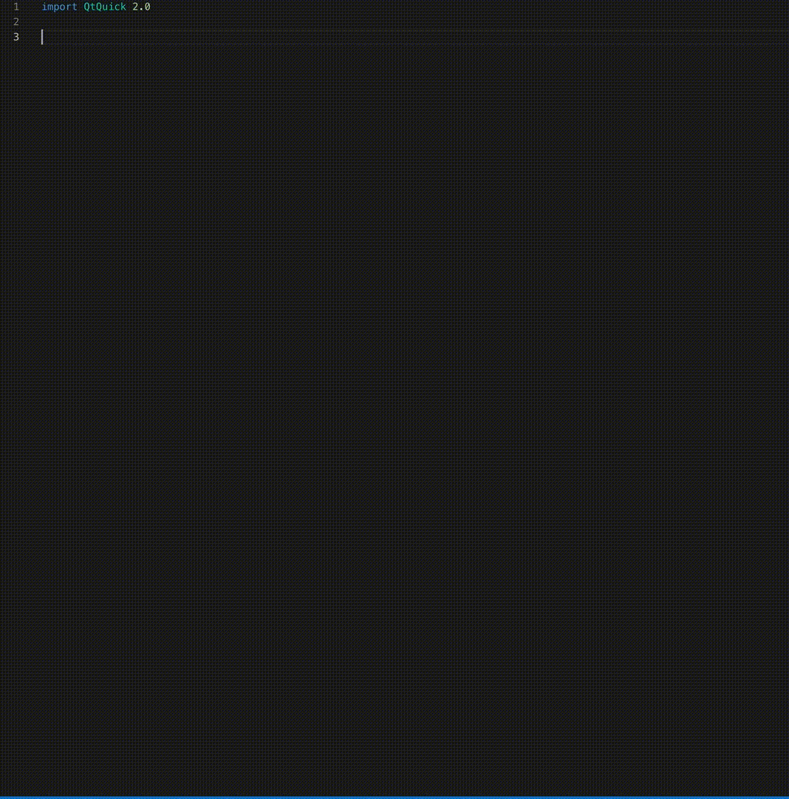

# QML Snippets for [Visual Studio Code](https://code.visualstudio.com/)

This extension for Visual Studio Code adds snippets for the [QML](http://www.qt.io/) language (Qt Meta-object Language).

The extension is based on the Sublime QML extension by Sergey Kozlov: https://github.com/ThomasVogelpohl/vsc-qml-snippets

## Prerequisites:
The qml file extension needs to be registered as a known file type with VSCode.
The easiest way is to use the QML language syntax extension from Baptist BENOIST: https://github.com/bbenoist/vscode-qml

## Usage
Type part of a snippet, press `enter`, and the snippet unfolds.

### QML Snippets

| Trigger                | Content |
| :-------               | :-------|
| Abstract3DSeries | Abstract3DSeries{     &nbsp;&nbsp;&nbsp;&nbsp;baseColor: color     &nbsp;&nbsp;&nbsp;&nbsp;baseGradient: ColorGradient     &nbsp;&nbsp;&nbsp;&nbsp;colorStyle: Theme3D.ColorStyle     &nbsp;&nbsp;&nbsp;&nbsp;itemLabel: string     &nbsp;&nbsp;&nbsp;&nbsp;itemLabelFormat: string     &nbsp;&nbsp;&nbsp;&nbsp;itemLabelVisible: bool     &nbsp;&nbsp;&nbsp;&nbsp;mesh: Abstract3DSeries.Mesh     &nbsp;&nbsp;&nbsp;&nbsp;meshRotation: quaternion     &nbsp;&nbsp;&nbsp;&nbsp;meshSmooth: bool     &nbsp;&nbsp;&nbsp;&nbsp;multiHighlightColor: color     &nbsp;&nbsp;&nbsp;&nbsp;multiHighlightGradient: ColorGradient     &nbsp;&nbsp;&nbsp;&nbsp;name: string     &nbsp;&nbsp;&nbsp;&nbsp;singleHighlightColor: color     &nbsp;&nbsp;&nbsp;&nbsp;singleHighlightGradient: ColorGradient     &nbsp;&nbsp;&nbsp;&nbsp;type: Abstract3DSeries.SeriesType     &nbsp;&nbsp;&nbsp;&nbsp;userDefinedMesh: string     &nbsp;&nbsp;&nbsp;&nbsp;visible: bool } |
| AbstractActionInput | AbstractActionInput{      } |
| AbstractAnimation | AbstractAnimation{     &nbsp;&nbsp;&nbsp;&nbsp;animationName: string     &nbsp;&nbsp;&nbsp;&nbsp;animationType: enumeration     &nbsp;&nbsp;&nbsp;&nbsp;duration: real     &nbsp;&nbsp;&nbsp;&nbsp;position: real } |
| AbstractAxis | AbstractAxis{     &nbsp;&nbsp;&nbsp;&nbsp;alignment: alignment     &nbsp;&nbsp;&nbsp;&nbsp;color: color     &nbsp;&nbsp;&nbsp;&nbsp;gridLineColor: color     &nbsp;&nbsp;&nbsp;&nbsp;gridVisible: bool     &nbsp;&nbsp;&nbsp;&nbsp;labelsAngle: int     &nbsp;&nbsp;&nbsp;&nbsp;labelsColor: color     &nbsp;&nbsp;&nbsp;&nbsp;labelsFont: font     &nbsp;&nbsp;&nbsp;&nbsp;labelsVisible: bool     &nbsp;&nbsp;&nbsp;&nbsp;lineVisible: bool     &nbsp;&nbsp;&nbsp;&nbsp;minorGridLineColor: color     &nbsp;&nbsp;&nbsp;&nbsp;minorGridVisible: bool     &nbsp;&nbsp;&nbsp;&nbsp;orientation: Qt.Orientation     &nbsp;&nbsp;&nbsp;&nbsp;reverse: alignment     &nbsp;&nbsp;&nbsp;&nbsp;shadesBorderColor: color     &nbsp;&nbsp;&nbsp;&nbsp;shadesColor: color     &nbsp;&nbsp;&nbsp;&nbsp;shadesVisible: bool     &nbsp;&nbsp;&nbsp;&nbsp;titleFont: font     &nbsp;&nbsp;&nbsp;&nbsp;titleText: string     &nbsp;&nbsp;&nbsp;&nbsp;titleVisible: bool     &nbsp;&nbsp;&nbsp;&nbsp;visible: bool } |
| AbstractAxis3D | AbstractAxis3D{     &nbsp;&nbsp;&nbsp;&nbsp;autoAdjustRange: bool     &nbsp;&nbsp;&nbsp;&nbsp;labelAutoRotation: real     &nbsp;&nbsp;&nbsp;&nbsp;labels: list     &nbsp;&nbsp;&nbsp;&nbsp;max: real     &nbsp;&nbsp;&nbsp;&nbsp;min: real     &nbsp;&nbsp;&nbsp;&nbsp;orientation: AbstractAxis3D.AxisOrientation     &nbsp;&nbsp;&nbsp;&nbsp;title: string     &nbsp;&nbsp;&nbsp;&nbsp;titleFixed: bool     &nbsp;&nbsp;&nbsp;&nbsp;titleVisible: bool     &nbsp;&nbsp;&nbsp;&nbsp;type: AbstractAxis3D.AxisType } |
| AbstractAxisInput | AbstractAxisInput{     &nbsp;&nbsp;&nbsp;&nbsp;sourceDevice: AbstractPhysicalDevice } |
| AbstractBarSeries | AbstractBarSeries{     &nbsp;&nbsp;&nbsp;&nbsp;axisX: AbstractAxis     &nbsp;&nbsp;&nbsp;&nbsp;axisXTop: AbstractAxis     &nbsp;&nbsp;&nbsp;&nbsp;axisY: AbstractAxis     &nbsp;&nbsp;&nbsp;&nbsp;axisYRight: AbstractAxis     &nbsp;&nbsp;&nbsp;&nbsp;barWidth: real     &nbsp;&nbsp;&nbsp;&nbsp;count: int     &nbsp;&nbsp;&nbsp;&nbsp;labelsAngle: real     &nbsp;&nbsp;&nbsp;&nbsp;labelsFormat: string     &nbsp;&nbsp;&nbsp;&nbsp;labelsPosition: enumeration     &nbsp;&nbsp;&nbsp;&nbsp;labelsPrecision: real     &nbsp;&nbsp;&nbsp;&nbsp;labelsVisible: bool     &nbsp;&nbsp;&nbsp;&nbsp;barsetsAdded()     &nbsp;&nbsp;&nbsp;&nbsp;barsetsRemoved()     &nbsp;&nbsp;&nbsp;&nbsp;clear()     &nbsp;&nbsp;&nbsp;&nbsp;clicked(intindex,BarSetbarset)     &nbsp;&nbsp;&nbsp;&nbsp;doubleClicked(intindex,BarSetbarset)     &nbsp;&nbsp;&nbsp;&nbsp;hovered(boolstatus,intindex,BarSetbarset)     &nbsp;&nbsp;&nbsp;&nbsp;pressed(intindex,BarSetbarset)     &nbsp;&nbsp;&nbsp;&nbsp;released(intindex,BarSetbarset)     &nbsp;&nbsp;&nbsp;&nbsp;name: string     &nbsp;&nbsp;&nbsp;&nbsp;opacity: real     &nbsp;&nbsp;&nbsp;&nbsp;type: enumeration     &nbsp;&nbsp;&nbsp;&nbsp;useOpenGL: bool     &nbsp;&nbsp;&nbsp;&nbsp;visible: bool } |
| AbstractButton | AbstractButton{     &nbsp;&nbsp;&nbsp;&nbsp;action: Action     &nbsp;&nbsp;&nbsp;&nbsp;autoExclusive: bool     &nbsp;&nbsp;&nbsp;&nbsp;autoRepeat: bool     &nbsp;&nbsp;&nbsp;&nbsp;autoRepeatDelay: int     &nbsp;&nbsp;&nbsp;&nbsp;autoRepeatInterval: int     &nbsp;&nbsp;&nbsp;&nbsp;checkable: bool     &nbsp;&nbsp;&nbsp;&nbsp;checked: bool     &nbsp;&nbsp;&nbsp;&nbsp;display: enumeration     &nbsp;&nbsp;&nbsp;&nbsp;down: bool     &nbsp;&nbsp;&nbsp;&nbsp;icon.color: color     &nbsp;&nbsp;&nbsp;&nbsp;icon.height: int     &nbsp;&nbsp;&nbsp;&nbsp;icon.name: string     &nbsp;&nbsp;&nbsp;&nbsp;icon.source: url     &nbsp;&nbsp;&nbsp;&nbsp;icon.width: int     &nbsp;&nbsp;&nbsp;&nbsp;implicitIndicatorHeight: real     &nbsp;&nbsp;&nbsp;&nbsp;implicitIndicatorWidth: real     &nbsp;&nbsp;&nbsp;&nbsp;indicator: Item     &nbsp;&nbsp;&nbsp;&nbsp;pressX: real     &nbsp;&nbsp;&nbsp;&nbsp;pressY: real     &nbsp;&nbsp;&nbsp;&nbsp;pressed: bool     &nbsp;&nbsp;&nbsp;&nbsp;text: string     &nbsp;&nbsp;&nbsp;&nbsp;canceled()     &nbsp;&nbsp;&nbsp;&nbsp;clicked()     &nbsp;&nbsp;&nbsp;&nbsp;doubleClicked()     &nbsp;&nbsp;&nbsp;&nbsp;pressAndHold()     &nbsp;&nbsp;&nbsp;&nbsp;pressed()     &nbsp;&nbsp;&nbsp;&nbsp;released()     &nbsp;&nbsp;&nbsp;&nbsp;toggled()     &nbsp;&nbsp;&nbsp;&nbsp;availableHeight: real     &nbsp;&nbsp;&nbsp;&nbsp;availableWidth: real     &nbsp;&nbsp;&nbsp;&nbsp;background: Item     &nbsp;&nbsp;&nbsp;&nbsp;bottomInset: real     &nbsp;&nbsp;&nbsp;&nbsp;bottomPadding: real     &nbsp;&nbsp;&nbsp;&nbsp;contentItem: Item     &nbsp;&nbsp;&nbsp;&nbsp;focusPolicy: enumeration     &nbsp;&nbsp;&nbsp;&nbsp;focusReason: enumeration     &nbsp;&nbsp;&nbsp;&nbsp;font: font     &nbsp;&nbsp;&nbsp;&nbsp;horizontalPadding: real     &nbsp;&nbsp;&nbsp;&nbsp;hoverEnabled: bool     &nbsp;&nbsp;&nbsp;&nbsp;hovered: bool     &nbsp;&nbsp;&nbsp;&nbsp;implicitBackgroundHeight: real     &nbsp;&nbsp;&nbsp;&nbsp;implicitBackgroundWidth: real     &nbsp;&nbsp;&nbsp;&nbsp;implicitContentHeight: real     &nbsp;&nbsp;&nbsp;&nbsp;implicitContentWidth: real     &nbsp;&nbsp;&nbsp;&nbsp;leftInset: real     &nbsp;&nbsp;&nbsp;&nbsp;leftPadding: real     &nbsp;&nbsp;&nbsp;&nbsp;locale: Locale     &nbsp;&nbsp;&nbsp;&nbsp;mirrored: bool     &nbsp;&nbsp;&nbsp;&nbsp;padding: real     &nbsp;&nbsp;&nbsp;&nbsp;palette: palette     &nbsp;&nbsp;&nbsp;&nbsp;rightInset: real     &nbsp;&nbsp;&nbsp;&nbsp;rightPadding: real     &nbsp;&nbsp;&nbsp;&nbsp;spacing: real     &nbsp;&nbsp;&nbsp;&nbsp;topInset: real     &nbsp;&nbsp;&nbsp;&nbsp;topPadding: real     &nbsp;&nbsp;&nbsp;&nbsp;verticalPadding: real     &nbsp;&nbsp;&nbsp;&nbsp;visualFocus: bool     &nbsp;&nbsp;&nbsp;&nbsp;wheelEnabled: bool     &nbsp;&nbsp;&nbsp;&nbsp;activeFocus: bool     &nbsp;&nbsp;&nbsp;&nbsp;activeFocusOnTab: bool     &nbsp;&nbsp;&nbsp;&nbsp;anchors.alignWhenCentered: bool     &nbsp;&nbsp;&nbsp;&nbsp;anchors.baseline: AnchorLine     &nbsp;&nbsp;&nbsp;&nbsp;anchors.baselineOffset: real     &nbsp;&nbsp;&nbsp;&nbsp;anchors.bottom: AnchorLine     &nbsp;&nbsp;&nbsp;&nbsp;anchors.bottomMargin: real     &nbsp;&nbsp;&nbsp;&nbsp;anchors.centerIn: Item     &nbsp;&nbsp;&nbsp;&nbsp;anchors.fill: Item     &nbsp;&nbsp;&nbsp;&nbsp;anchors.horizontalCenter: AnchorLine     &nbsp;&nbsp;&nbsp;&nbsp;anchors.horizontalCenterOffset: real     &nbsp;&nbsp;&nbsp;&nbsp;anchors.left: AnchorLine     &nbsp;&nbsp;&nbsp;&nbsp;anchors.leftMargin: real     &nbsp;&nbsp;&nbsp;&nbsp;anchors.margins: real     &nbsp;&nbsp;&nbsp;&nbsp;anchors.right: AnchorLine     &nbsp;&nbsp;&nbsp;&nbsp;anchors.rightMargin: real     &nbsp;&nbsp;&nbsp;&nbsp;anchors.top: AnchorLine     &nbsp;&nbsp;&nbsp;&nbsp;anchors.topMargin: real     &nbsp;&nbsp;&nbsp;&nbsp;anchors.verticalCenter: AnchorLine     &nbsp;&nbsp;&nbsp;&nbsp;anchors.verticalCenterOffset: real     &nbsp;&nbsp;&nbsp;&nbsp;antialiasing: bool     &nbsp;&nbsp;&nbsp;&nbsp;baselineOffset: int     &nbsp;&nbsp;&nbsp;&nbsp;children: list<Item>     &nbsp;&nbsp;&nbsp;&nbsp;childrenRect.height: real     &nbsp;&nbsp;&nbsp;&nbsp;childrenRect.width: real     &nbsp;&nbsp;&nbsp;&nbsp;childrenRect.x: real     &nbsp;&nbsp;&nbsp;&nbsp;childrenRect.y: real     &nbsp;&nbsp;&nbsp;&nbsp;clip: bool     &nbsp;&nbsp;&nbsp;&nbsp;containmentMask: QObject*     &nbsp;&nbsp;&nbsp;&nbsp;data: list<Object>     &nbsp;&nbsp;&nbsp;&nbsp;enabled: bool     &nbsp;&nbsp;&nbsp;&nbsp;focus: bool     &nbsp;&nbsp;&nbsp;&nbsp;height: real     &nbsp;&nbsp;&nbsp;&nbsp;implicitHeight: real     &nbsp;&nbsp;&nbsp;&nbsp;implicitWidth: real     &nbsp;&nbsp;&nbsp;&nbsp;layer.effect: Component     &nbsp;&nbsp;&nbsp;&nbsp;layer.enabled: bool     &nbsp;&nbsp;&nbsp;&nbsp;layer.format: enumeration     &nbsp;&nbsp;&nbsp;&nbsp;layer.mipmap: bool     &nbsp;&nbsp;&nbsp;&nbsp;layer.samplerName: string     &nbsp;&nbsp;&nbsp;&nbsp;layer.samples: enumeration     &nbsp;&nbsp;&nbsp;&nbsp;layer.smooth: bool     &nbsp;&nbsp;&nbsp;&nbsp;layer.sourceRect: rect     &nbsp;&nbsp;&nbsp;&nbsp;layer.textureMirroring: enumeration     &nbsp;&nbsp;&nbsp;&nbsp;layer.textureSize: size     &nbsp;&nbsp;&nbsp;&nbsp;layer.wrapMode: enumeration     &nbsp;&nbsp;&nbsp;&nbsp;opacity: real     &nbsp;&nbsp;&nbsp;&nbsp;parent: Item     &nbsp;&nbsp;&nbsp;&nbsp;resources: list<Object>     &nbsp;&nbsp;&nbsp;&nbsp;rotation: real     &nbsp;&nbsp;&nbsp;&nbsp;scale: real     &nbsp;&nbsp;&nbsp;&nbsp;smooth: bool     &nbsp;&nbsp;&nbsp;&nbsp;state: string     &nbsp;&nbsp;&nbsp;&nbsp;states: list<State>     &nbsp;&nbsp;&nbsp;&nbsp;transform: list<Transform>     &nbsp;&nbsp;&nbsp;&nbsp;transformOrigin: enumeration     &nbsp;&nbsp;&nbsp;&nbsp;transitions: list<Transition>     &nbsp;&nbsp;&nbsp;&nbsp;visible: bool     &nbsp;&nbsp;&nbsp;&nbsp;visibleChildren: list<Item>     &nbsp;&nbsp;&nbsp;&nbsp;width: real     &nbsp;&nbsp;&nbsp;&nbsp;x: real     &nbsp;&nbsp;&nbsp;&nbsp;y: real     &nbsp;&nbsp;&nbsp;&nbsp;z: real     &nbsp;&nbsp;&nbsp;&nbsp;childAt()     &nbsp;&nbsp;&nbsp;&nbsp;contains()     &nbsp;&nbsp;&nbsp;&nbsp;forceActiveFocus()     &nbsp;&nbsp;&nbsp;&nbsp;forceActiveFocus()     &nbsp;&nbsp;&nbsp;&nbsp;grabToImage()     &nbsp;&nbsp;&nbsp;&nbsp;mapFromGlobal()     &nbsp;&nbsp;&nbsp;&nbsp;mapFromItem()     &nbsp;&nbsp;&nbsp;&nbsp;mapFromItem()     &nbsp;&nbsp;&nbsp;&nbsp;mapToGlobal()     &nbsp;&nbsp;&nbsp;&nbsp;mapToItem()     &nbsp;&nbsp;&nbsp;&nbsp;mapToItem()     &nbsp;&nbsp;&nbsp;&nbsp;nextItemInFocusChain() } |
| AbstractClipAnimator | AbstractClipAnimator{     &nbsp;&nbsp;&nbsp;&nbsp;loops: int } |
| AbstractClipBlendNode | AbstractClipBlendNode{      } |
| AbstractDataProxy | AbstractDataProxy{     &nbsp;&nbsp;&nbsp;&nbsp;type: AbstractDataProxy.DataType } |
| AbstractGraph3D | AbstractGraph3D{     &nbsp;&nbsp;&nbsp;&nbsp;aspectRatio: real     &nbsp;&nbsp;&nbsp;&nbsp;currentFps: int     &nbsp;&nbsp;&nbsp;&nbsp;customItemList: list<Custom3DItem>     &nbsp;&nbsp;&nbsp;&nbsp;horizontalAspectRatio: real     &nbsp;&nbsp;&nbsp;&nbsp;inputHandler: AbstractInputHandler3D     &nbsp;&nbsp;&nbsp;&nbsp;locale: locale     &nbsp;&nbsp;&nbsp;&nbsp;margin: real     &nbsp;&nbsp;&nbsp;&nbsp;measureFps: bool     &nbsp;&nbsp;&nbsp;&nbsp;msaaSamples: int     &nbsp;&nbsp;&nbsp;&nbsp;optimizationHints: AbstractGraph3D.OptimizationHints     &nbsp;&nbsp;&nbsp;&nbsp;orthoProjection: bool     &nbsp;&nbsp;&nbsp;&nbsp;polar: bool     &nbsp;&nbsp;&nbsp;&nbsp;queriedGraphPosition: vector3d     &nbsp;&nbsp;&nbsp;&nbsp;radialLabelOffset: real     &nbsp;&nbsp;&nbsp;&nbsp;reflection: bool     &nbsp;&nbsp;&nbsp;&nbsp;reflectivity: real     &nbsp;&nbsp;&nbsp;&nbsp;renderingMode: AbstractGraph3D.RenderingMode     &nbsp;&nbsp;&nbsp;&nbsp;scene: Scene3D     &nbsp;&nbsp;&nbsp;&nbsp;selectedElement: AbstractGraph3D.ElementType     &nbsp;&nbsp;&nbsp;&nbsp;selectionMode: AbstractGraph3D.SelectionMode     &nbsp;&nbsp;&nbsp;&nbsp;shadowQuality: AbstractGraph3D.ShadowQuality     &nbsp;&nbsp;&nbsp;&nbsp;shadowsSupported: bool     &nbsp;&nbsp;&nbsp;&nbsp;theme: Theme3D } |
| AbstractInputHandler3D | AbstractInputHandler3D{      } |
| AbstractPhysicalDevice | AbstractPhysicalDevice{      } |
| AbstractRayCaster | AbstractRayCaster{     &nbsp;&nbsp;&nbsp;&nbsp;filterMode: enumeration     &nbsp;&nbsp;&nbsp;&nbsp;hits: array     &nbsp;&nbsp;&nbsp;&nbsp;runMode: enumeration } |
| AbstractSeries | AbstractSeries{     &nbsp;&nbsp;&nbsp;&nbsp;name: string     &nbsp;&nbsp;&nbsp;&nbsp;opacity: real     &nbsp;&nbsp;&nbsp;&nbsp;type: enumeration     &nbsp;&nbsp;&nbsp;&nbsp;useOpenGL: bool     &nbsp;&nbsp;&nbsp;&nbsp;visible: bool } |
| AbstractSkeleton | AbstractSkeleton{     &nbsp;&nbsp;&nbsp;&nbsp;childNodes: list<Node>     &nbsp;&nbsp;&nbsp;&nbsp;data: list<QtQml: : QtObject>     &nbsp;&nbsp;&nbsp;&nbsp;propertyTrackingOverrides: QJSValue } |
| AbstractTextureImage | AbstractTextureImage{     &nbsp;&nbsp;&nbsp;&nbsp;face: enumeration     &nbsp;&nbsp;&nbsp;&nbsp;layer: int     &nbsp;&nbsp;&nbsp;&nbsp;mipLevel: int     &nbsp;&nbsp;&nbsp;&nbsp;childNodes: list<Node>     &nbsp;&nbsp;&nbsp;&nbsp;data: list<QtQml: : QtObject>     &nbsp;&nbsp;&nbsp;&nbsp;propertyTrackingOverrides: QJSValue } |
| Accelerometer | Accelerometer{     &nbsp;&nbsp;&nbsp;&nbsp;accelerationMode: AccelerationMode     &nbsp;&nbsp;&nbsp;&nbsp;active: bool     &nbsp;&nbsp;&nbsp;&nbsp;alwaysOn: bool     &nbsp;&nbsp;&nbsp;&nbsp;availableDataRates: list<Range>     &nbsp;&nbsp;&nbsp;&nbsp;axesOrientationMode: Sensor: : AxesOrientationMode     &nbsp;&nbsp;&nbsp;&nbsp;bufferSize: int     &nbsp;&nbsp;&nbsp;&nbsp;busy: bool     &nbsp;&nbsp;&nbsp;&nbsp;connectedToBackend: bool     &nbsp;&nbsp;&nbsp;&nbsp;currentOrientation: int     &nbsp;&nbsp;&nbsp;&nbsp;dataRate: int     &nbsp;&nbsp;&nbsp;&nbsp;description: string     &nbsp;&nbsp;&nbsp;&nbsp;efficientBufferSize: int     &nbsp;&nbsp;&nbsp;&nbsp;error: int     &nbsp;&nbsp;&nbsp;&nbsp;identifier: string     &nbsp;&nbsp;&nbsp;&nbsp;maxBufferSize: int     &nbsp;&nbsp;&nbsp;&nbsp;outputRange: int     &nbsp;&nbsp;&nbsp;&nbsp;outputRanges: list<OutputRange>     &nbsp;&nbsp;&nbsp;&nbsp;reading: SensorReading     &nbsp;&nbsp;&nbsp;&nbsp;skipDuplicates: bool     &nbsp;&nbsp;&nbsp;&nbsp;type: string     &nbsp;&nbsp;&nbsp;&nbsp;userOrientation: int } |
| AccelerometerReading | AccelerometerReading{     &nbsp;&nbsp;&nbsp;&nbsp;x: qreal     &nbsp;&nbsp;&nbsp;&nbsp;y: qreal     &nbsp;&nbsp;&nbsp;&nbsp;z: qreal     &nbsp;&nbsp;&nbsp;&nbsp;timestamp: quint64 } |
| Accessible | Accessible{     &nbsp;&nbsp;&nbsp;&nbsp;checkStateMixed: bool     &nbsp;&nbsp;&nbsp;&nbsp;checkable: bool     &nbsp;&nbsp;&nbsp;&nbsp;checked: bool     &nbsp;&nbsp;&nbsp;&nbsp;defaultButton: bool     &nbsp;&nbsp;&nbsp;&nbsp;description: string     &nbsp;&nbsp;&nbsp;&nbsp;editable: bool     &nbsp;&nbsp;&nbsp;&nbsp;focusable: bool     &nbsp;&nbsp;&nbsp;&nbsp;focused: bool     &nbsp;&nbsp;&nbsp;&nbsp;ignored: bool     &nbsp;&nbsp;&nbsp;&nbsp;multiLine: bool     &nbsp;&nbsp;&nbsp;&nbsp;name: string     &nbsp;&nbsp;&nbsp;&nbsp;passwordEdit: bool     &nbsp;&nbsp;&nbsp;&nbsp;pressed: bool     &nbsp;&nbsp;&nbsp;&nbsp;readOnly: bool     &nbsp;&nbsp;&nbsp;&nbsp;role: enumeration     &nbsp;&nbsp;&nbsp;&nbsp;searchEdit: bool     &nbsp;&nbsp;&nbsp;&nbsp;selectable: bool     &nbsp;&nbsp;&nbsp;&nbsp;selectableText: bool     &nbsp;&nbsp;&nbsp;&nbsp;selected: bool     &nbsp;&nbsp;&nbsp;&nbsp;decreaseAction()     &nbsp;&nbsp;&nbsp;&nbsp;increaseAction()     &nbsp;&nbsp;&nbsp;&nbsp;nextPageAction()     &nbsp;&nbsp;&nbsp;&nbsp;pressAction()     &nbsp;&nbsp;&nbsp;&nbsp;previousPageAction()     &nbsp;&nbsp;&nbsp;&nbsp;scrollDownAction()     &nbsp;&nbsp;&nbsp;&nbsp;scrollLeftAction()     &nbsp;&nbsp;&nbsp;&nbsp;scrollRightAction()     &nbsp;&nbsp;&nbsp;&nbsp;scrollUpAction()     &nbsp;&nbsp;&nbsp;&nbsp;toggleAction() } |
| Action | Action{     &nbsp;&nbsp;&nbsp;&nbsp;checkable: bool     &nbsp;&nbsp;&nbsp;&nbsp;checked: bool     &nbsp;&nbsp;&nbsp;&nbsp;enabled: bool     &nbsp;&nbsp;&nbsp;&nbsp;icon.color: color     &nbsp;&nbsp;&nbsp;&nbsp;icon.height: int     &nbsp;&nbsp;&nbsp;&nbsp;icon.name: string     &nbsp;&nbsp;&nbsp;&nbsp;icon.source: url     &nbsp;&nbsp;&nbsp;&nbsp;icon.width: int     &nbsp;&nbsp;&nbsp;&nbsp;shortcut: keysequence     &nbsp;&nbsp;&nbsp;&nbsp;text: string     &nbsp;&nbsp;&nbsp;&nbsp;toggled(QtObjectsource)     &nbsp;&nbsp;&nbsp;&nbsp;triggered(QtObjectsource)     &nbsp;&nbsp;&nbsp;&nbsp;objectName: string } |
| ActionGroup | ActionGroup{     &nbsp;&nbsp;&nbsp;&nbsp;actions: list<Action>     &nbsp;&nbsp;&nbsp;&nbsp;checkedAction: Action     &nbsp;&nbsp;&nbsp;&nbsp;enabled: bool     &nbsp;&nbsp;&nbsp;&nbsp;exclusive: bool     &nbsp;&nbsp;&nbsp;&nbsp;onGroup : Actiongro: { }     &nbsp;&nbsp;&nbsp;&nbsp;triggered(Actionaction)     &nbsp;&nbsp;&nbsp;&nbsp;objectName: string } |
| ActionInput | ActionInput{     &nbsp;&nbsp;&nbsp;&nbsp;buttons: list<int>     &nbsp;&nbsp;&nbsp;&nbsp;sourceDevice: AbstractPhysicalDevice     &nbsp;&nbsp;&nbsp;&nbsp;buttonsChanged(constQVector<int>&buttons)     &nbsp;&nbsp;&nbsp;&nbsp;sourceDeviceChanged() } |
| AdditiveClipBlend | AdditiveClipBlend{     &nbsp;&nbsp;&nbsp;&nbsp;additiveClip: AbstractClipBlendNode     &nbsp;&nbsp;&nbsp;&nbsp;additiveFactor: real     &nbsp;&nbsp;&nbsp;&nbsp;baseClip: AbstractClipBlendNode } |
| Address | Address{     &nbsp;&nbsp;&nbsp;&nbsp;address: QGeoAddress     &nbsp;&nbsp;&nbsp;&nbsp;city: string     &nbsp;&nbsp;&nbsp;&nbsp;country: string     &nbsp;&nbsp;&nbsp;&nbsp;countryCode: string     &nbsp;&nbsp;&nbsp;&nbsp;county: string     &nbsp;&nbsp;&nbsp;&nbsp;district: string     &nbsp;&nbsp;&nbsp;&nbsp;isTextGenerated: bool     &nbsp;&nbsp;&nbsp;&nbsp;postalCode: string     &nbsp;&nbsp;&nbsp;&nbsp;state: string     &nbsp;&nbsp;&nbsp;&nbsp;street: string     &nbsp;&nbsp;&nbsp;&nbsp;text: string } |
| Affector | Affector{     &nbsp;&nbsp;&nbsp;&nbsp;enabled: bool     &nbsp;&nbsp;&nbsp;&nbsp;groups: list<string>     &nbsp;&nbsp;&nbsp;&nbsp;once: bool     &nbsp;&nbsp;&nbsp;&nbsp;shape: Shape     &nbsp;&nbsp;&nbsp;&nbsp;system: ParticleSystem     &nbsp;&nbsp;&nbsp;&nbsp;whenCollidingWith: list<string>     &nbsp;&nbsp;&nbsp;&nbsp;affected(realx,realy) } |
| Age | Age{     &nbsp;&nbsp;&nbsp;&nbsp;advancePosition: bool     &nbsp;&nbsp;&nbsp;&nbsp;lifeLeft: int     &nbsp;&nbsp;&nbsp;&nbsp;enabled: bool     &nbsp;&nbsp;&nbsp;&nbsp;groups: list<string>     &nbsp;&nbsp;&nbsp;&nbsp;once: bool     &nbsp;&nbsp;&nbsp;&nbsp;shape: Shape     &nbsp;&nbsp;&nbsp;&nbsp;system: ParticleSystem     &nbsp;&nbsp;&nbsp;&nbsp;whenCollidingWith: list<string>     &nbsp;&nbsp;&nbsp;&nbsp;affected(realx,realy) } |
| AlphaCoverage | AlphaCoverage{     &nbsp;&nbsp;&nbsp;&nbsp;childNodes: list<Node>     &nbsp;&nbsp;&nbsp;&nbsp;data: list<QtQml: : QtObject>     &nbsp;&nbsp;&nbsp;&nbsp;propertyTrackingOverrides: QJSValue } |
| AlphaTest | AlphaTest{     &nbsp;&nbsp;&nbsp;&nbsp;alphaFunction: enumeration     &nbsp;&nbsp;&nbsp;&nbsp;referenceValue: real     &nbsp;&nbsp;&nbsp;&nbsp;childNodes: list<Node>     &nbsp;&nbsp;&nbsp;&nbsp;data: list<QtQml: : QtObject>     &nbsp;&nbsp;&nbsp;&nbsp;propertyTrackingOverrides: QJSValue } |
| Altimeter | Altimeter{     &nbsp;&nbsp;&nbsp;&nbsp;active: bool     &nbsp;&nbsp;&nbsp;&nbsp;alwaysOn: bool     &nbsp;&nbsp;&nbsp;&nbsp;availableDataRates: list<Range>     &nbsp;&nbsp;&nbsp;&nbsp;axesOrientationMode: Sensor: : AxesOrientationMode     &nbsp;&nbsp;&nbsp;&nbsp;bufferSize: int     &nbsp;&nbsp;&nbsp;&nbsp;busy: bool     &nbsp;&nbsp;&nbsp;&nbsp;connectedToBackend: bool     &nbsp;&nbsp;&nbsp;&nbsp;currentOrientation: int     &nbsp;&nbsp;&nbsp;&nbsp;dataRate: int     &nbsp;&nbsp;&nbsp;&nbsp;description: string     &nbsp;&nbsp;&nbsp;&nbsp;efficientBufferSize: int     &nbsp;&nbsp;&nbsp;&nbsp;error: int     &nbsp;&nbsp;&nbsp;&nbsp;identifier: string     &nbsp;&nbsp;&nbsp;&nbsp;maxBufferSize: int     &nbsp;&nbsp;&nbsp;&nbsp;outputRange: int     &nbsp;&nbsp;&nbsp;&nbsp;outputRanges: list<OutputRange>     &nbsp;&nbsp;&nbsp;&nbsp;reading: SensorReading     &nbsp;&nbsp;&nbsp;&nbsp;skipDuplicates: bool     &nbsp;&nbsp;&nbsp;&nbsp;type: string     &nbsp;&nbsp;&nbsp;&nbsp;userOrientation: int } |
| AltimeterReading | AltimeterReading{     &nbsp;&nbsp;&nbsp;&nbsp;altitude: qreal     &nbsp;&nbsp;&nbsp;&nbsp;timestamp: quint64 } |
| AmbientLightReading | AmbientLightReading{     &nbsp;&nbsp;&nbsp;&nbsp;lightLevel: LightLevel     &nbsp;&nbsp;&nbsp;&nbsp;timestamp: quint64 } |
| AmbientLightSensor | AmbientLightSensor{     &nbsp;&nbsp;&nbsp;&nbsp;active: bool     &nbsp;&nbsp;&nbsp;&nbsp;alwaysOn: bool     &nbsp;&nbsp;&nbsp;&nbsp;availableDataRates: list<Range>     &nbsp;&nbsp;&nbsp;&nbsp;axesOrientationMode: Sensor: : AxesOrientationMode     &nbsp;&nbsp;&nbsp;&nbsp;bufferSize: int     &nbsp;&nbsp;&nbsp;&nbsp;busy: bool     &nbsp;&nbsp;&nbsp;&nbsp;connectedToBackend: bool     &nbsp;&nbsp;&nbsp;&nbsp;currentOrientation: int     &nbsp;&nbsp;&nbsp;&nbsp;dataRate: int     &nbsp;&nbsp;&nbsp;&nbsp;description: string     &nbsp;&nbsp;&nbsp;&nbsp;efficientBufferSize: int     &nbsp;&nbsp;&nbsp;&nbsp;error: int     &nbsp;&nbsp;&nbsp;&nbsp;identifier: string     &nbsp;&nbsp;&nbsp;&nbsp;maxBufferSize: int     &nbsp;&nbsp;&nbsp;&nbsp;outputRange: int     &nbsp;&nbsp;&nbsp;&nbsp;outputRanges: list<OutputRange>     &nbsp;&nbsp;&nbsp;&nbsp;reading: SensorReading     &nbsp;&nbsp;&nbsp;&nbsp;skipDuplicates: bool     &nbsp;&nbsp;&nbsp;&nbsp;type: string     &nbsp;&nbsp;&nbsp;&nbsp;userOrientation: int } |
| AmbientTemperatureReading | AmbientTemperatureReading{     &nbsp;&nbsp;&nbsp;&nbsp;temperature: qreal     &nbsp;&nbsp;&nbsp;&nbsp;timestamp: quint64 } |
| AmbientTemperatureSensor | AmbientTemperatureSensor{     &nbsp;&nbsp;&nbsp;&nbsp;active: bool     &nbsp;&nbsp;&nbsp;&nbsp;alwaysOn: bool     &nbsp;&nbsp;&nbsp;&nbsp;availableDataRates: list<Range>     &nbsp;&nbsp;&nbsp;&nbsp;axesOrientationMode: Sensor: : AxesOrientationMode     &nbsp;&nbsp;&nbsp;&nbsp;bufferSize: int     &nbsp;&nbsp;&nbsp;&nbsp;busy: bool     &nbsp;&nbsp;&nbsp;&nbsp;connectedToBackend: bool     &nbsp;&nbsp;&nbsp;&nbsp;currentOrientation: int     &nbsp;&nbsp;&nbsp;&nbsp;dataRate: int     &nbsp;&nbsp;&nbsp;&nbsp;description: string     &nbsp;&nbsp;&nbsp;&nbsp;efficientBufferSize: int     &nbsp;&nbsp;&nbsp;&nbsp;error: int     &nbsp;&nbsp;&nbsp;&nbsp;identifier: string     &nbsp;&nbsp;&nbsp;&nbsp;maxBufferSize: int     &nbsp;&nbsp;&nbsp;&nbsp;outputRange: int     &nbsp;&nbsp;&nbsp;&nbsp;outputRanges: list<OutputRange>     &nbsp;&nbsp;&nbsp;&nbsp;reading: SensorReading     &nbsp;&nbsp;&nbsp;&nbsp;skipDuplicates: bool     &nbsp;&nbsp;&nbsp;&nbsp;type: string     &nbsp;&nbsp;&nbsp;&nbsp;userOrientation: int } |
| AnalogAxisInput | AnalogAxisInput{     &nbsp;&nbsp;&nbsp;&nbsp;axis: int } |
| AnchorAnimation | AnchorAnimation{     &nbsp;&nbsp;&nbsp;&nbsp;duration: int     &nbsp;&nbsp;&nbsp;&nbsp;easing.amplitude: real     &nbsp;&nbsp;&nbsp;&nbsp;easing.overshoot: real     &nbsp;&nbsp;&nbsp;&nbsp;easing.period: real     &nbsp;&nbsp;&nbsp;&nbsp;easing.type: enumeration     &nbsp;&nbsp;&nbsp;&nbsp;targets: list<Item>     &nbsp;&nbsp;&nbsp;&nbsp;alwaysRunToEnd: bool     &nbsp;&nbsp;&nbsp;&nbsp;loops: int     &nbsp;&nbsp;&nbsp;&nbsp;paused: bool     &nbsp;&nbsp;&nbsp;&nbsp;running: bool     &nbsp;&nbsp;&nbsp;&nbsp;complete()     &nbsp;&nbsp;&nbsp;&nbsp;finished()     &nbsp;&nbsp;&nbsp;&nbsp;pause()     &nbsp;&nbsp;&nbsp;&nbsp;restart()     &nbsp;&nbsp;&nbsp;&nbsp;resume()     &nbsp;&nbsp;&nbsp;&nbsp;start()     &nbsp;&nbsp;&nbsp;&nbsp;started()     &nbsp;&nbsp;&nbsp;&nbsp;stop()     &nbsp;&nbsp;&nbsp;&nbsp;stopped() } |
| AnchorChanges | AnchorChanges{     &nbsp;&nbsp;&nbsp;&nbsp;anchors.baseline: AnchorLine     &nbsp;&nbsp;&nbsp;&nbsp;anchors.bottom: AnchorLine     &nbsp;&nbsp;&nbsp;&nbsp;anchors.horizontalCenter: AnchorLine     &nbsp;&nbsp;&nbsp;&nbsp;anchors.left: AnchorLine     &nbsp;&nbsp;&nbsp;&nbsp;anchors.right: AnchorLine     &nbsp;&nbsp;&nbsp;&nbsp;anchors.top: AnchorLine     &nbsp;&nbsp;&nbsp;&nbsp;anchors.verticalCenter: AnchorLine     &nbsp;&nbsp;&nbsp;&nbsp;target: Item } |
| AngleDirection | AngleDirection{     &nbsp;&nbsp;&nbsp;&nbsp;angle: real     &nbsp;&nbsp;&nbsp;&nbsp;angleVariation: real     &nbsp;&nbsp;&nbsp;&nbsp;magnitude: real     &nbsp;&nbsp;&nbsp;&nbsp;magnitudeVariation: real } |
| AnimatedImage | AnimatedImage{     &nbsp;&nbsp;&nbsp;&nbsp;currentFrame: int     &nbsp;&nbsp;&nbsp;&nbsp;frameCount: int     &nbsp;&nbsp;&nbsp;&nbsp;paused: bool     &nbsp;&nbsp;&nbsp;&nbsp;playing: bool     &nbsp;&nbsp;&nbsp;&nbsp;source: url     &nbsp;&nbsp;&nbsp;&nbsp;speed: real     &nbsp;&nbsp;&nbsp;&nbsp;asynchronous: bool     &nbsp;&nbsp;&nbsp;&nbsp;autoTransform: bool     &nbsp;&nbsp;&nbsp;&nbsp;cache: bool     &nbsp;&nbsp;&nbsp;&nbsp;fillMode: enumeration     &nbsp;&nbsp;&nbsp;&nbsp;horizontalAlignment: enumeration     &nbsp;&nbsp;&nbsp;&nbsp;mipmap: bool     &nbsp;&nbsp;&nbsp;&nbsp;mirror: bool     &nbsp;&nbsp;&nbsp;&nbsp;paintedHeight: real     &nbsp;&nbsp;&nbsp;&nbsp;paintedWidth: real     &nbsp;&nbsp;&nbsp;&nbsp;progress: real     &nbsp;&nbsp;&nbsp;&nbsp;smooth: bool     &nbsp;&nbsp;&nbsp;&nbsp;source: url     &nbsp;&nbsp;&nbsp;&nbsp;sourceSize: QSize     &nbsp;&nbsp;&nbsp;&nbsp;status: enumeration     &nbsp;&nbsp;&nbsp;&nbsp;verticalAlignment: enumeration     &nbsp;&nbsp;&nbsp;&nbsp;     &nbsp;&nbsp;&nbsp;&nbsp;     &nbsp;&nbsp;&nbsp;&nbsp;activeFocus: bool     &nbsp;&nbsp;&nbsp;&nbsp;activeFocusOnTab: bool     &nbsp;&nbsp;&nbsp;&nbsp;anchors.alignWhenCentered: bool     &nbsp;&nbsp;&nbsp;&nbsp;anchors.baseline: AnchorLine     &nbsp;&nbsp;&nbsp;&nbsp;anchors.baselineOffset: real     &nbsp;&nbsp;&nbsp;&nbsp;anchors.bottom: AnchorLine     &nbsp;&nbsp;&nbsp;&nbsp;anchors.bottomMargin: real     &nbsp;&nbsp;&nbsp;&nbsp;anchors.centerIn: Item     &nbsp;&nbsp;&nbsp;&nbsp;anchors.fill: Item     &nbsp;&nbsp;&nbsp;&nbsp;anchors.horizontalCenter: AnchorLine     &nbsp;&nbsp;&nbsp;&nbsp;anchors.horizontalCenterOffset: real     &nbsp;&nbsp;&nbsp;&nbsp;anchors.left: AnchorLine     &nbsp;&nbsp;&nbsp;&nbsp;anchors.leftMargin: real     &nbsp;&nbsp;&nbsp;&nbsp;anchors.margins: real     &nbsp;&nbsp;&nbsp;&nbsp;anchors.right: AnchorLine     &nbsp;&nbsp;&nbsp;&nbsp;anchors.rightMargin: real     &nbsp;&nbsp;&nbsp;&nbsp;anchors.top: AnchorLine     &nbsp;&nbsp;&nbsp;&nbsp;anchors.topMargin: real     &nbsp;&nbsp;&nbsp;&nbsp;anchors.verticalCenter: AnchorLine     &nbsp;&nbsp;&nbsp;&nbsp;anchors.verticalCenterOffset: real     &nbsp;&nbsp;&nbsp;&nbsp;antialiasing: bool     &nbsp;&nbsp;&nbsp;&nbsp;baselineOffset: int     &nbsp;&nbsp;&nbsp;&nbsp;children: list<Item>     &nbsp;&nbsp;&nbsp;&nbsp;childrenRect.height: real     &nbsp;&nbsp;&nbsp;&nbsp;childrenRect.width: real     &nbsp;&nbsp;&nbsp;&nbsp;childrenRect.x: real     &nbsp;&nbsp;&nbsp;&nbsp;childrenRect.y: real     &nbsp;&nbsp;&nbsp;&nbsp;clip: bool     &nbsp;&nbsp;&nbsp;&nbsp;containmentMask: QObject*     &nbsp;&nbsp;&nbsp;&nbsp;data: list<Object>     &nbsp;&nbsp;&nbsp;&nbsp;enabled: bool     &nbsp;&nbsp;&nbsp;&nbsp;focus: bool     &nbsp;&nbsp;&nbsp;&nbsp;height: real     &nbsp;&nbsp;&nbsp;&nbsp;implicitHeight: real     &nbsp;&nbsp;&nbsp;&nbsp;implicitWidth: real     &nbsp;&nbsp;&nbsp;&nbsp;layer.effect: Component     &nbsp;&nbsp;&nbsp;&nbsp;layer.enabled: bool     &nbsp;&nbsp;&nbsp;&nbsp;layer.format: enumeration     &nbsp;&nbsp;&nbsp;&nbsp;layer.mipmap: bool     &nbsp;&nbsp;&nbsp;&nbsp;layer.samplerName: string     &nbsp;&nbsp;&nbsp;&nbsp;layer.samples: enumeration     &nbsp;&nbsp;&nbsp;&nbsp;layer.smooth: bool     &nbsp;&nbsp;&nbsp;&nbsp;layer.sourceRect: rect     &nbsp;&nbsp;&nbsp;&nbsp;layer.textureMirroring: enumeration     &nbsp;&nbsp;&nbsp;&nbsp;layer.textureSize: size     &nbsp;&nbsp;&nbsp;&nbsp;layer.wrapMode: enumeration     &nbsp;&nbsp;&nbsp;&nbsp;opacity: real     &nbsp;&nbsp;&nbsp;&nbsp;parent: Item     &nbsp;&nbsp;&nbsp;&nbsp;resources: list<Object>     &nbsp;&nbsp;&nbsp;&nbsp;rotation: real     &nbsp;&nbsp;&nbsp;&nbsp;scale: real     &nbsp;&nbsp;&nbsp;&nbsp;smooth: bool     &nbsp;&nbsp;&nbsp;&nbsp;state: string     &nbsp;&nbsp;&nbsp;&nbsp;states: list<State>     &nbsp;&nbsp;&nbsp;&nbsp;transform: list<Transform>     &nbsp;&nbsp;&nbsp;&nbsp;transformOrigin: enumeration     &nbsp;&nbsp;&nbsp;&nbsp;transitions: list<Transition>     &nbsp;&nbsp;&nbsp;&nbsp;visible: bool     &nbsp;&nbsp;&nbsp;&nbsp;visibleChildren: list<Item>     &nbsp;&nbsp;&nbsp;&nbsp;width: real     &nbsp;&nbsp;&nbsp;&nbsp;x: real     &nbsp;&nbsp;&nbsp;&nbsp;y: real     &nbsp;&nbsp;&nbsp;&nbsp;z: real     &nbsp;&nbsp;&nbsp;&nbsp;childAt(realx,realy)     &nbsp;&nbsp;&nbsp;&nbsp;forceActiveFocus()     &nbsp;&nbsp;&nbsp;&nbsp;forceActiveFocus(Qt: : FocusReasonreason)     &nbsp;&nbsp;&nbsp;&nbsp;nextItemInFocusChain(boolforward)     &nbsp;&nbsp;&nbsp;&nbsp;objectName: string } |
| AnimatedSprite | AnimatedSprite{     &nbsp;&nbsp;&nbsp;&nbsp;currentFrame: int     &nbsp;&nbsp;&nbsp;&nbsp;frameCount: int     &nbsp;&nbsp;&nbsp;&nbsp;frameDuration: int     &nbsp;&nbsp;&nbsp;&nbsp;frameHeight: int     &nbsp;&nbsp;&nbsp;&nbsp;frameRate: qreal     &nbsp;&nbsp;&nbsp;&nbsp;frameSync: bool     &nbsp;&nbsp;&nbsp;&nbsp;frameWidth: int     &nbsp;&nbsp;&nbsp;&nbsp;frameX: int     &nbsp;&nbsp;&nbsp;&nbsp;frameY: int     &nbsp;&nbsp;&nbsp;&nbsp;interpolate: bool     &nbsp;&nbsp;&nbsp;&nbsp;loops: int     &nbsp;&nbsp;&nbsp;&nbsp;paused: bool     &nbsp;&nbsp;&nbsp;&nbsp;reverse: bool     &nbsp;&nbsp;&nbsp;&nbsp;running: bool     &nbsp;&nbsp;&nbsp;&nbsp;source: url     &nbsp;&nbsp;&nbsp;&nbsp;finished()     &nbsp;&nbsp;&nbsp;&nbsp;     &nbsp;&nbsp;&nbsp;&nbsp;     &nbsp;&nbsp;&nbsp;&nbsp;activeFocus: bool     &nbsp;&nbsp;&nbsp;&nbsp;activeFocusOnTab: bool     &nbsp;&nbsp;&nbsp;&nbsp;anchors.alignWhenCentered: bool     &nbsp;&nbsp;&nbsp;&nbsp;anchors.baseline: AnchorLine     &nbsp;&nbsp;&nbsp;&nbsp;anchors.baselineOffset: real     &nbsp;&nbsp;&nbsp;&nbsp;anchors.bottom: AnchorLine     &nbsp;&nbsp;&nbsp;&nbsp;anchors.bottomMargin: real     &nbsp;&nbsp;&nbsp;&nbsp;anchors.centerIn: Item     &nbsp;&nbsp;&nbsp;&nbsp;anchors.fill: Item     &nbsp;&nbsp;&nbsp;&nbsp;anchors.horizontalCenter: AnchorLine     &nbsp;&nbsp;&nbsp;&nbsp;anchors.horizontalCenterOffset: real     &nbsp;&nbsp;&nbsp;&nbsp;anchors.left: AnchorLine     &nbsp;&nbsp;&nbsp;&nbsp;anchors.leftMargin: real     &nbsp;&nbsp;&nbsp;&nbsp;anchors.margins: real     &nbsp;&nbsp;&nbsp;&nbsp;anchors.right: AnchorLine     &nbsp;&nbsp;&nbsp;&nbsp;anchors.rightMargin: real     &nbsp;&nbsp;&nbsp;&nbsp;anchors.top: AnchorLine     &nbsp;&nbsp;&nbsp;&nbsp;anchors.topMargin: real     &nbsp;&nbsp;&nbsp;&nbsp;anchors.verticalCenter: AnchorLine     &nbsp;&nbsp;&nbsp;&nbsp;anchors.verticalCenterOffset: real     &nbsp;&nbsp;&nbsp;&nbsp;antialiasing: bool     &nbsp;&nbsp;&nbsp;&nbsp;baselineOffset: int     &nbsp;&nbsp;&nbsp;&nbsp;children: list<Item>     &nbsp;&nbsp;&nbsp;&nbsp;childrenRect.height: real     &nbsp;&nbsp;&nbsp;&nbsp;childrenRect.width: real     &nbsp;&nbsp;&nbsp;&nbsp;childrenRect.x: real     &nbsp;&nbsp;&nbsp;&nbsp;childrenRect.y: real     &nbsp;&nbsp;&nbsp;&nbsp;clip: bool     &nbsp;&nbsp;&nbsp;&nbsp;containmentMask: QObject*     &nbsp;&nbsp;&nbsp;&nbsp;data: list<Object>     &nbsp;&nbsp;&nbsp;&nbsp;enabled: bool     &nbsp;&nbsp;&nbsp;&nbsp;focus: bool     &nbsp;&nbsp;&nbsp;&nbsp;height: real     &nbsp;&nbsp;&nbsp;&nbsp;implicitHeight: real     &nbsp;&nbsp;&nbsp;&nbsp;implicitWidth: real     &nbsp;&nbsp;&nbsp;&nbsp;layer.effect: Component     &nbsp;&nbsp;&nbsp;&nbsp;layer.enabled: bool     &nbsp;&nbsp;&nbsp;&nbsp;layer.format: enumeration     &nbsp;&nbsp;&nbsp;&nbsp;layer.mipmap: bool     &nbsp;&nbsp;&nbsp;&nbsp;layer.samplerName: string     &nbsp;&nbsp;&nbsp;&nbsp;layer.samples: enumeration     &nbsp;&nbsp;&nbsp;&nbsp;layer.smooth: bool     &nbsp;&nbsp;&nbsp;&nbsp;layer.sourceRect: rect     &nbsp;&nbsp;&nbsp;&nbsp;layer.textureMirroring: enumeration     &nbsp;&nbsp;&nbsp;&nbsp;layer.textureSize: size     &nbsp;&nbsp;&nbsp;&nbsp;layer.wrapMode: enumeration     &nbsp;&nbsp;&nbsp;&nbsp;opacity: real     &nbsp;&nbsp;&nbsp;&nbsp;parent: Item     &nbsp;&nbsp;&nbsp;&nbsp;resources: list<Object>     &nbsp;&nbsp;&nbsp;&nbsp;rotation: real     &nbsp;&nbsp;&nbsp;&nbsp;scale: real     &nbsp;&nbsp;&nbsp;&nbsp;smooth: bool     &nbsp;&nbsp;&nbsp;&nbsp;state: string     &nbsp;&nbsp;&nbsp;&nbsp;states: list<State>     &nbsp;&nbsp;&nbsp;&nbsp;transform: list<Transform>     &nbsp;&nbsp;&nbsp;&nbsp;transformOrigin: enumeration     &nbsp;&nbsp;&nbsp;&nbsp;transitions: list<Transition>     &nbsp;&nbsp;&nbsp;&nbsp;visible: bool     &nbsp;&nbsp;&nbsp;&nbsp;visibleChildren: list<Item>     &nbsp;&nbsp;&nbsp;&nbsp;width: real     &nbsp;&nbsp;&nbsp;&nbsp;x: real     &nbsp;&nbsp;&nbsp;&nbsp;y: real     &nbsp;&nbsp;&nbsp;&nbsp;z: real     &nbsp;&nbsp;&nbsp;&nbsp;childAt(realx,realy)     &nbsp;&nbsp;&nbsp;&nbsp;forceActiveFocus()     &nbsp;&nbsp;&nbsp;&nbsp;forceActiveFocus(Qt: : FocusReasonreason)     &nbsp;&nbsp;&nbsp;&nbsp;nextItemInFocusChain(boolforward)     &nbsp;&nbsp;&nbsp;&nbsp;objectName: string } |
| Animation | Animation{     &nbsp;&nbsp;&nbsp;&nbsp;alwaysRunToEnd: bool     &nbsp;&nbsp;&nbsp;&nbsp;loops: int     &nbsp;&nbsp;&nbsp;&nbsp;paused: bool     &nbsp;&nbsp;&nbsp;&nbsp;running: bool     &nbsp;&nbsp;&nbsp;&nbsp;complete()     &nbsp;&nbsp;&nbsp;&nbsp;finished()     &nbsp;&nbsp;&nbsp;&nbsp;pause()     &nbsp;&nbsp;&nbsp;&nbsp;restart()     &nbsp;&nbsp;&nbsp;&nbsp;resume()     &nbsp;&nbsp;&nbsp;&nbsp;start()     &nbsp;&nbsp;&nbsp;&nbsp;started()     &nbsp;&nbsp;&nbsp;&nbsp;stop()     &nbsp;&nbsp;&nbsp;&nbsp;stopped() } |
| AnimationController | AnimationController{     &nbsp;&nbsp;&nbsp;&nbsp;activeAnimationGroup: int     &nbsp;&nbsp;&nbsp;&nbsp;animationGroups: list<AnimationGroup>     &nbsp;&nbsp;&nbsp;&nbsp;entity: Entity     &nbsp;&nbsp;&nbsp;&nbsp;position: real     &nbsp;&nbsp;&nbsp;&nbsp;positionOffset: real     &nbsp;&nbsp;&nbsp;&nbsp;positionScale: real     &nbsp;&nbsp;&nbsp;&nbsp;recursive: bool } |
| AnimationGroup | AnimationGroup{     &nbsp;&nbsp;&nbsp;&nbsp;animations: list<AbstractAnimation>     &nbsp;&nbsp;&nbsp;&nbsp;duration: real     &nbsp;&nbsp;&nbsp;&nbsp;name: string     &nbsp;&nbsp;&nbsp;&nbsp;position: real } |
| Animator | Animator{     &nbsp;&nbsp;&nbsp;&nbsp;duration: int     &nbsp;&nbsp;&nbsp;&nbsp;easing.amplitude: real     &nbsp;&nbsp;&nbsp;&nbsp;easing.bezierCurve: list<real>     &nbsp;&nbsp;&nbsp;&nbsp;easing.overshoot: real     &nbsp;&nbsp;&nbsp;&nbsp;easing.period: real     &nbsp;&nbsp;&nbsp;&nbsp;easing.type: enumeration     &nbsp;&nbsp;&nbsp;&nbsp;from: real     &nbsp;&nbsp;&nbsp;&nbsp;target: QtQuick: : Item     &nbsp;&nbsp;&nbsp;&nbsp;to: real     &nbsp;&nbsp;&nbsp;&nbsp;alwaysRunToEnd: bool     &nbsp;&nbsp;&nbsp;&nbsp;loops: int     &nbsp;&nbsp;&nbsp;&nbsp;paused: bool     &nbsp;&nbsp;&nbsp;&nbsp;running: bool     &nbsp;&nbsp;&nbsp;&nbsp;complete()     &nbsp;&nbsp;&nbsp;&nbsp;finished()     &nbsp;&nbsp;&nbsp;&nbsp;pause()     &nbsp;&nbsp;&nbsp;&nbsp;restart()     &nbsp;&nbsp;&nbsp;&nbsp;resume()     &nbsp;&nbsp;&nbsp;&nbsp;start()     &nbsp;&nbsp;&nbsp;&nbsp;started()     &nbsp;&nbsp;&nbsp;&nbsp;stop()     &nbsp;&nbsp;&nbsp;&nbsp;stopped() } |
| ApplicationWindow | ApplicationWindow{     &nbsp;&nbsp;&nbsp;&nbsp;onActivefocuscontrol : Contr: { }     &nbsp;&nbsp;&nbsp;&nbsp;activeFocusControl: Control     &nbsp;&nbsp;&nbsp;&nbsp;background: Item     &nbsp;&nbsp;&nbsp;&nbsp;contentData: list<Object>     &nbsp;&nbsp;&nbsp;&nbsp;onContentitem : It: { }     &nbsp;&nbsp;&nbsp;&nbsp;contentItem: Item     &nbsp;&nbsp;&nbsp;&nbsp;font: font     &nbsp;&nbsp;&nbsp;&nbsp;onFooter : It: { }     &nbsp;&nbsp;&nbsp;&nbsp;footer: Item     &nbsp;&nbsp;&nbsp;&nbsp;onHeader : It: { }     &nbsp;&nbsp;&nbsp;&nbsp;header: Item     &nbsp;&nbsp;&nbsp;&nbsp;locale: Locale     &nbsp;&nbsp;&nbsp;&nbsp;onMenubar : It: { }     &nbsp;&nbsp;&nbsp;&nbsp;menuBar: Item     &nbsp;&nbsp;&nbsp;&nbsp;onOverlay : Item (Obsolet: { }     &nbsp;&nbsp;&nbsp;&nbsp;overlay: Item     &nbsp;&nbsp;&nbsp;&nbsp;overlay.modal: Component     &nbsp;&nbsp;&nbsp;&nbsp;overlay.modeless: Component     &nbsp;&nbsp;&nbsp;&nbsp;palette: palette     &nbsp;&nbsp;&nbsp;&nbsp;onWindow : Applicationwind: { }     &nbsp;&nbsp;&nbsp;&nbsp;active: bool     &nbsp;&nbsp;&nbsp;&nbsp;onActive : Bo: { }     &nbsp;&nbsp;&nbsp;&nbsp;onActivefocusitem : It: { }     &nbsp;&nbsp;&nbsp;&nbsp;activeFocusItem: Item     &nbsp;&nbsp;&nbsp;&nbsp;color: color     &nbsp;&nbsp;&nbsp;&nbsp;contentItem: Item     &nbsp;&nbsp;&nbsp;&nbsp;onContentitem : It: { }     &nbsp;&nbsp;&nbsp;&nbsp;contentOrientation: Qt: : ScreenOrientation     &nbsp;&nbsp;&nbsp;&nbsp;data: list<Object>     &nbsp;&nbsp;&nbsp;&nbsp;flags: Qt: : WindowFlags     &nbsp;&nbsp;&nbsp;&nbsp;height: int     &nbsp;&nbsp;&nbsp;&nbsp;onHeight : I: { }     &nbsp;&nbsp;&nbsp;&nbsp;maximumHeight: int     &nbsp;&nbsp;&nbsp;&nbsp;maximumWidth: int     &nbsp;&nbsp;&nbsp;&nbsp;minimumHeight: int     &nbsp;&nbsp;&nbsp;&nbsp;minimumWidth: int     &nbsp;&nbsp;&nbsp;&nbsp;modality: Qt: : WindowModality     &nbsp;&nbsp;&nbsp;&nbsp;opacity: real     &nbsp;&nbsp;&nbsp;&nbsp;screen: variant     &nbsp;&nbsp;&nbsp;&nbsp;title: string     &nbsp;&nbsp;&nbsp;&nbsp;visibility: QWindow: : Visibility     &nbsp;&nbsp;&nbsp;&nbsp;onVisibility : Qwindow::Visibili: { }     &nbsp;&nbsp;&nbsp;&nbsp;visible: bool     &nbsp;&nbsp;&nbsp;&nbsp;onWidth : I: { }     &nbsp;&nbsp;&nbsp;&nbsp;width: int     &nbsp;&nbsp;&nbsp;&nbsp;onWindow : Wind: { }     &nbsp;&nbsp;&nbsp;&nbsp;x: int     &nbsp;&nbsp;&nbsp;&nbsp;y: int     &nbsp;&nbsp;&nbsp;&nbsp;alert()     &nbsp;&nbsp;&nbsp;&nbsp;close()     &nbsp;&nbsp;&nbsp;&nbsp;closing()     &nbsp;&nbsp;&nbsp;&nbsp;hide()     &nbsp;&nbsp;&nbsp;&nbsp;lower()     &nbsp;&nbsp;&nbsp;&nbsp;raise()     &nbsp;&nbsp;&nbsp;&nbsp;requestActivate()     &nbsp;&nbsp;&nbsp;&nbsp;show()     &nbsp;&nbsp;&nbsp;&nbsp;showFullScreen()     &nbsp;&nbsp;&nbsp;&nbsp;showMaximized()     &nbsp;&nbsp;&nbsp;&nbsp;showMinimized()     &nbsp;&nbsp;&nbsp;&nbsp;showNormal() } |
| ApplicationWindowStyle | ApplicationWindowStyle{     &nbsp;&nbsp;&nbsp;&nbsp;background: Component     &nbsp;&nbsp;&nbsp;&nbsp;control: ApplicationWindow     &nbsp;&nbsp;&nbsp;&nbsp;objectName: string } |
| AreaSeries | AreaSeries{     &nbsp;&nbsp;&nbsp;&nbsp;axisAngular: AbstractAxis     &nbsp;&nbsp;&nbsp;&nbsp;axisRadial: AbstractAxis     &nbsp;&nbsp;&nbsp;&nbsp;axisX: AbstractAxis     &nbsp;&nbsp;&nbsp;&nbsp;axisXTop: AbstractAxis     &nbsp;&nbsp;&nbsp;&nbsp;axisY: AbstractAxis     &nbsp;&nbsp;&nbsp;&nbsp;axisYRight: AbstractAxis     &nbsp;&nbsp;&nbsp;&nbsp;borderColor: color     &nbsp;&nbsp;&nbsp;&nbsp;borderWidth: real     &nbsp;&nbsp;&nbsp;&nbsp;brushFilename: QString     &nbsp;&nbsp;&nbsp;&nbsp;color: color     &nbsp;&nbsp;&nbsp;&nbsp;lowerSeries: LineSeries     &nbsp;&nbsp;&nbsp;&nbsp;pointLabelsClipping: bool     &nbsp;&nbsp;&nbsp;&nbsp;pointLabelsColor: font     &nbsp;&nbsp;&nbsp;&nbsp;pointLabelsFont: font     &nbsp;&nbsp;&nbsp;&nbsp;pointLabelsFormat: string     &nbsp;&nbsp;&nbsp;&nbsp;pointLabelsVisible: bool     &nbsp;&nbsp;&nbsp;&nbsp;upperSeries: LineSeries     &nbsp;&nbsp;&nbsp;&nbsp;clicked(pointpoint)     &nbsp;&nbsp;&nbsp;&nbsp;doubleClicked(pointpoint)     &nbsp;&nbsp;&nbsp;&nbsp;hovered(pointpoint,boolstate)     &nbsp;&nbsp;&nbsp;&nbsp;pressed(pointpoint)     &nbsp;&nbsp;&nbsp;&nbsp;released(pointpoint)     &nbsp;&nbsp;&nbsp;&nbsp;name: string     &nbsp;&nbsp;&nbsp;&nbsp;opacity: real     &nbsp;&nbsp;&nbsp;&nbsp;type: enumeration     &nbsp;&nbsp;&nbsp;&nbsp;useOpenGL: bool     &nbsp;&nbsp;&nbsp;&nbsp;visible: bool } |
| Armature | Armature{     &nbsp;&nbsp;&nbsp;&nbsp;skeleton: AbstractSkeleton     &nbsp;&nbsp;&nbsp;&nbsp;isShareable: bool     &nbsp;&nbsp;&nbsp;&nbsp;childNodes: list<Node>     &nbsp;&nbsp;&nbsp;&nbsp;data: list<QtQml: : QtObject>     &nbsp;&nbsp;&nbsp;&nbsp;propertyTrackingOverrides: QJSValue } |
| AttenuationModelInverse | AttenuationModelInverse{     &nbsp;&nbsp;&nbsp;&nbsp;end: real     &nbsp;&nbsp;&nbsp;&nbsp;name: string     &nbsp;&nbsp;&nbsp;&nbsp;rolloff: real     &nbsp;&nbsp;&nbsp;&nbsp;start: real     &nbsp;&nbsp;&nbsp;&nbsp;activeFocus: bool     &nbsp;&nbsp;&nbsp;&nbsp;activeFocusOnTab: bool     &nbsp;&nbsp;&nbsp;&nbsp;anchors.alignWhenCentered: bool     &nbsp;&nbsp;&nbsp;&nbsp;anchors.baseline: AnchorLine     &nbsp;&nbsp;&nbsp;&nbsp;anchors.baselineOffset: real     &nbsp;&nbsp;&nbsp;&nbsp;anchors.bottom: AnchorLine     &nbsp;&nbsp;&nbsp;&nbsp;anchors.bottomMargin: real     &nbsp;&nbsp;&nbsp;&nbsp;anchors.centerIn: Item     &nbsp;&nbsp;&nbsp;&nbsp;anchors.fill: Item     &nbsp;&nbsp;&nbsp;&nbsp;anchors.horizontalCenter: AnchorLine     &nbsp;&nbsp;&nbsp;&nbsp;anchors.horizontalCenterOffset: real     &nbsp;&nbsp;&nbsp;&nbsp;anchors.left: AnchorLine     &nbsp;&nbsp;&nbsp;&nbsp;anchors.leftMargin: real     &nbsp;&nbsp;&nbsp;&nbsp;anchors.margins: real     &nbsp;&nbsp;&nbsp;&nbsp;anchors.right: AnchorLine     &nbsp;&nbsp;&nbsp;&nbsp;anchors.rightMargin: real     &nbsp;&nbsp;&nbsp;&nbsp;anchors.top: AnchorLine     &nbsp;&nbsp;&nbsp;&nbsp;anchors.topMargin: real     &nbsp;&nbsp;&nbsp;&nbsp;anchors.verticalCenter: AnchorLine     &nbsp;&nbsp;&nbsp;&nbsp;anchors.verticalCenterOffset: real     &nbsp;&nbsp;&nbsp;&nbsp;antialiasing: bool     &nbsp;&nbsp;&nbsp;&nbsp;baselineOffset: int     &nbsp;&nbsp;&nbsp;&nbsp;children: list<Item>     &nbsp;&nbsp;&nbsp;&nbsp;childrenRect.height: real     &nbsp;&nbsp;&nbsp;&nbsp;childrenRect.width: real     &nbsp;&nbsp;&nbsp;&nbsp;childrenRect.x: real     &nbsp;&nbsp;&nbsp;&nbsp;childrenRect.y: real     &nbsp;&nbsp;&nbsp;&nbsp;clip: bool     &nbsp;&nbsp;&nbsp;&nbsp;containmentMask: QObject*     &nbsp;&nbsp;&nbsp;&nbsp;data: list<Object>     &nbsp;&nbsp;&nbsp;&nbsp;enabled: bool     &nbsp;&nbsp;&nbsp;&nbsp;focus: bool     &nbsp;&nbsp;&nbsp;&nbsp;height: real     &nbsp;&nbsp;&nbsp;&nbsp;implicitHeight: real     &nbsp;&nbsp;&nbsp;&nbsp;implicitWidth: real     &nbsp;&nbsp;&nbsp;&nbsp;layer.effect: Component     &nbsp;&nbsp;&nbsp;&nbsp;layer.enabled: bool     &nbsp;&nbsp;&nbsp;&nbsp;layer.format: enumeration     &nbsp;&nbsp;&nbsp;&nbsp;layer.mipmap: bool     &nbsp;&nbsp;&nbsp;&nbsp;layer.samplerName: string     &nbsp;&nbsp;&nbsp;&nbsp;layer.samples: enumeration     &nbsp;&nbsp;&nbsp;&nbsp;layer.smooth: bool     &nbsp;&nbsp;&nbsp;&nbsp;layer.sourceRect: rect     &nbsp;&nbsp;&nbsp;&nbsp;layer.textureMirroring: enumeration     &nbsp;&nbsp;&nbsp;&nbsp;layer.textureSize: size     &nbsp;&nbsp;&nbsp;&nbsp;layer.wrapMode: enumeration     &nbsp;&nbsp;&nbsp;&nbsp;opacity: real     &nbsp;&nbsp;&nbsp;&nbsp;parent: Item     &nbsp;&nbsp;&nbsp;&nbsp;resources: list<Object>     &nbsp;&nbsp;&nbsp;&nbsp;rotation: real     &nbsp;&nbsp;&nbsp;&nbsp;scale: real     &nbsp;&nbsp;&nbsp;&nbsp;smooth: bool     &nbsp;&nbsp;&nbsp;&nbsp;state: string     &nbsp;&nbsp;&nbsp;&nbsp;states: list<State>     &nbsp;&nbsp;&nbsp;&nbsp;transform: list<Transform>     &nbsp;&nbsp;&nbsp;&nbsp;transformOrigin: enumeration     &nbsp;&nbsp;&nbsp;&nbsp;transitions: list<Transition>     &nbsp;&nbsp;&nbsp;&nbsp;visible: bool     &nbsp;&nbsp;&nbsp;&nbsp;visibleChildren: list<Item>     &nbsp;&nbsp;&nbsp;&nbsp;width: real     &nbsp;&nbsp;&nbsp;&nbsp;x: real     &nbsp;&nbsp;&nbsp;&nbsp;y: real     &nbsp;&nbsp;&nbsp;&nbsp;z: real     &nbsp;&nbsp;&nbsp;&nbsp;childAt()     &nbsp;&nbsp;&nbsp;&nbsp;contains()     &nbsp;&nbsp;&nbsp;&nbsp;forceActiveFocus()     &nbsp;&nbsp;&nbsp;&nbsp;forceActiveFocus()     &nbsp;&nbsp;&nbsp;&nbsp;grabToImage()     &nbsp;&nbsp;&nbsp;&nbsp;mapFromGlobal()     &nbsp;&nbsp;&nbsp;&nbsp;mapFromItem()     &nbsp;&nbsp;&nbsp;&nbsp;mapFromItem()     &nbsp;&nbsp;&nbsp;&nbsp;mapToGlobal()     &nbsp;&nbsp;&nbsp;&nbsp;mapToItem()     &nbsp;&nbsp;&nbsp;&nbsp;mapToItem()     &nbsp;&nbsp;&nbsp;&nbsp;nextItemInFocusChain() } |
| AttenuationModelLinear | AttenuationModelLinear{     &nbsp;&nbsp;&nbsp;&nbsp;end: real     &nbsp;&nbsp;&nbsp;&nbsp;name: string     &nbsp;&nbsp;&nbsp;&nbsp;start: real     &nbsp;&nbsp;&nbsp;&nbsp;activeFocus: bool     &nbsp;&nbsp;&nbsp;&nbsp;activeFocusOnTab: bool     &nbsp;&nbsp;&nbsp;&nbsp;anchors.alignWhenCentered: bool     &nbsp;&nbsp;&nbsp;&nbsp;anchors.baseline: AnchorLine     &nbsp;&nbsp;&nbsp;&nbsp;anchors.baselineOffset: real     &nbsp;&nbsp;&nbsp;&nbsp;anchors.bottom: AnchorLine     &nbsp;&nbsp;&nbsp;&nbsp;anchors.bottomMargin: real     &nbsp;&nbsp;&nbsp;&nbsp;anchors.centerIn: Item     &nbsp;&nbsp;&nbsp;&nbsp;anchors.fill: Item     &nbsp;&nbsp;&nbsp;&nbsp;anchors.horizontalCenter: AnchorLine     &nbsp;&nbsp;&nbsp;&nbsp;anchors.horizontalCenterOffset: real     &nbsp;&nbsp;&nbsp;&nbsp;anchors.left: AnchorLine     &nbsp;&nbsp;&nbsp;&nbsp;anchors.leftMargin: real     &nbsp;&nbsp;&nbsp;&nbsp;anchors.margins: real     &nbsp;&nbsp;&nbsp;&nbsp;anchors.right: AnchorLine     &nbsp;&nbsp;&nbsp;&nbsp;anchors.rightMargin: real     &nbsp;&nbsp;&nbsp;&nbsp;anchors.top: AnchorLine     &nbsp;&nbsp;&nbsp;&nbsp;anchors.topMargin: real     &nbsp;&nbsp;&nbsp;&nbsp;anchors.verticalCenter: AnchorLine     &nbsp;&nbsp;&nbsp;&nbsp;anchors.verticalCenterOffset: real     &nbsp;&nbsp;&nbsp;&nbsp;antialiasing: bool     &nbsp;&nbsp;&nbsp;&nbsp;baselineOffset: int     &nbsp;&nbsp;&nbsp;&nbsp;children: list<Item>     &nbsp;&nbsp;&nbsp;&nbsp;childrenRect.height: real     &nbsp;&nbsp;&nbsp;&nbsp;childrenRect.width: real     &nbsp;&nbsp;&nbsp;&nbsp;childrenRect.x: real     &nbsp;&nbsp;&nbsp;&nbsp;childrenRect.y: real     &nbsp;&nbsp;&nbsp;&nbsp;clip: bool     &nbsp;&nbsp;&nbsp;&nbsp;containmentMask: QObject*     &nbsp;&nbsp;&nbsp;&nbsp;data: list<Object>     &nbsp;&nbsp;&nbsp;&nbsp;enabled: bool     &nbsp;&nbsp;&nbsp;&nbsp;focus: bool     &nbsp;&nbsp;&nbsp;&nbsp;height: real     &nbsp;&nbsp;&nbsp;&nbsp;implicitHeight: real     &nbsp;&nbsp;&nbsp;&nbsp;implicitWidth: real     &nbsp;&nbsp;&nbsp;&nbsp;layer.effect: Component     &nbsp;&nbsp;&nbsp;&nbsp;layer.enabled: bool     &nbsp;&nbsp;&nbsp;&nbsp;layer.format: enumeration     &nbsp;&nbsp;&nbsp;&nbsp;layer.mipmap: bool     &nbsp;&nbsp;&nbsp;&nbsp;layer.samplerName: string     &nbsp;&nbsp;&nbsp;&nbsp;layer.samples: enumeration     &nbsp;&nbsp;&nbsp;&nbsp;layer.smooth: bool     &nbsp;&nbsp;&nbsp;&nbsp;layer.sourceRect: rect     &nbsp;&nbsp;&nbsp;&nbsp;layer.textureMirroring: enumeration     &nbsp;&nbsp;&nbsp;&nbsp;layer.textureSize: size     &nbsp;&nbsp;&nbsp;&nbsp;layer.wrapMode: enumeration     &nbsp;&nbsp;&nbsp;&nbsp;opacity: real     &nbsp;&nbsp;&nbsp;&nbsp;parent: Item     &nbsp;&nbsp;&nbsp;&nbsp;resources: list<Object>     &nbsp;&nbsp;&nbsp;&nbsp;rotation: real     &nbsp;&nbsp;&nbsp;&nbsp;scale: real     &nbsp;&nbsp;&nbsp;&nbsp;smooth: bool     &nbsp;&nbsp;&nbsp;&nbsp;state: string     &nbsp;&nbsp;&nbsp;&nbsp;states: list<State>     &nbsp;&nbsp;&nbsp;&nbsp;transform: list<Transform>     &nbsp;&nbsp;&nbsp;&nbsp;transformOrigin: enumeration     &nbsp;&nbsp;&nbsp;&nbsp;transitions: list<Transition>     &nbsp;&nbsp;&nbsp;&nbsp;visible: bool     &nbsp;&nbsp;&nbsp;&nbsp;visibleChildren: list<Item>     &nbsp;&nbsp;&nbsp;&nbsp;width: real     &nbsp;&nbsp;&nbsp;&nbsp;x: real     &nbsp;&nbsp;&nbsp;&nbsp;y: real     &nbsp;&nbsp;&nbsp;&nbsp;z: real     &nbsp;&nbsp;&nbsp;&nbsp;childAt()     &nbsp;&nbsp;&nbsp;&nbsp;contains()     &nbsp;&nbsp;&nbsp;&nbsp;forceActiveFocus()     &nbsp;&nbsp;&nbsp;&nbsp;forceActiveFocus()     &nbsp;&nbsp;&nbsp;&nbsp;grabToImage()     &nbsp;&nbsp;&nbsp;&nbsp;mapFromGlobal()     &nbsp;&nbsp;&nbsp;&nbsp;mapFromItem()     &nbsp;&nbsp;&nbsp;&nbsp;mapFromItem()     &nbsp;&nbsp;&nbsp;&nbsp;mapToGlobal()     &nbsp;&nbsp;&nbsp;&nbsp;mapToItem()     &nbsp;&nbsp;&nbsp;&nbsp;mapToItem()     &nbsp;&nbsp;&nbsp;&nbsp;nextItemInFocusChain() } |
| Attractor | Attractor{     &nbsp;&nbsp;&nbsp;&nbsp;affectedParameter: AffectableParameter     &nbsp;&nbsp;&nbsp;&nbsp;proportionalToDistance: Proportion     &nbsp;&nbsp;&nbsp;&nbsp;enabled: bool     &nbsp;&nbsp;&nbsp;&nbsp;groups: list<string>     &nbsp;&nbsp;&nbsp;&nbsp;once: bool     &nbsp;&nbsp;&nbsp;&nbsp;shape: Shape     &nbsp;&nbsp;&nbsp;&nbsp;system: ParticleSystem     &nbsp;&nbsp;&nbsp;&nbsp;whenCollidingWith: list<string>     &nbsp;&nbsp;&nbsp;&nbsp;affected(realx,realy) } |
| Attribute | Attribute{      } |
| Audio | Audio{     &nbsp;&nbsp;&nbsp;&nbsp;audioRole: enumeration     &nbsp;&nbsp;&nbsp;&nbsp;autoLoad: bool     &nbsp;&nbsp;&nbsp;&nbsp;autoPlay: bool     &nbsp;&nbsp;&nbsp;&nbsp;availability: enumeration     &nbsp;&nbsp;&nbsp;&nbsp;bufferProgress: real     &nbsp;&nbsp;&nbsp;&nbsp;customAudioRole: string     &nbsp;&nbsp;&nbsp;&nbsp;duration: int     &nbsp;&nbsp;&nbsp;&nbsp;error: enumeration     &nbsp;&nbsp;&nbsp;&nbsp;errorString: string     &nbsp;&nbsp;&nbsp;&nbsp;hasAudio: bool     &nbsp;&nbsp;&nbsp;&nbsp;hasVideo: bool     &nbsp;&nbsp;&nbsp;&nbsp;loops: int     &nbsp;&nbsp;&nbsp;&nbsp;mediaObject: variant     &nbsp;&nbsp;&nbsp;&nbsp;metaData.albumArtist: variant     &nbsp;&nbsp;&nbsp;&nbsp;metaData.albumTitle: variant     &nbsp;&nbsp;&nbsp;&nbsp;metaData.audioBitRate: variant     &nbsp;&nbsp;&nbsp;&nbsp;metaData.audioCodec: variant     &nbsp;&nbsp;&nbsp;&nbsp;metaData.author: variant     &nbsp;&nbsp;&nbsp;&nbsp;metaData.averageLevel: variant     &nbsp;&nbsp;&nbsp;&nbsp;metaData.category: variant     &nbsp;&nbsp;&nbsp;&nbsp;metaData.channelCount: variant     &nbsp;&nbsp;&nbsp;&nbsp;metaData.chapterNumber: variant     &nbsp;&nbsp;&nbsp;&nbsp;metaData.comment: variant     &nbsp;&nbsp;&nbsp;&nbsp;metaData.composer: variant     &nbsp;&nbsp;&nbsp;&nbsp;metaData.conductor: variant     &nbsp;&nbsp;&nbsp;&nbsp;metaData.contributingArtist: variant     &nbsp;&nbsp;&nbsp;&nbsp;metaData.copyright: variant     &nbsp;&nbsp;&nbsp;&nbsp;metaData.coverArtUrlLarge: variant     &nbsp;&nbsp;&nbsp;&nbsp;metaData.coverArtUrlSmall: variant     &nbsp;&nbsp;&nbsp;&nbsp;metaData.date: variant     &nbsp;&nbsp;&nbsp;&nbsp;metaData.description: variant     &nbsp;&nbsp;&nbsp;&nbsp;metaData.director: variant     &nbsp;&nbsp;&nbsp;&nbsp;metaData.genre: variant     &nbsp;&nbsp;&nbsp;&nbsp;metaData.keywords: variant     &nbsp;&nbsp;&nbsp;&nbsp;metaData.language: variant     &nbsp;&nbsp;&nbsp;&nbsp;metaData.leadPerformer: variant     &nbsp;&nbsp;&nbsp;&nbsp;metaData.lyrics: variant     &nbsp;&nbsp;&nbsp;&nbsp;metaData.mediaType: variant     &nbsp;&nbsp;&nbsp;&nbsp;metaData.mood: variant     &nbsp;&nbsp;&nbsp;&nbsp;metaData.parentalRating: variant     &nbsp;&nbsp;&nbsp;&nbsp;metaData.peakValue: variant     &nbsp;&nbsp;&nbsp;&nbsp;metaData.pixelAspectRatio: variant     &nbsp;&nbsp;&nbsp;&nbsp;metaData.posterUrl: variant     &nbsp;&nbsp;&nbsp;&nbsp;metaData.publisher: variant     &nbsp;&nbsp;&nbsp;&nbsp;metaData.ratingOrganization: variant     &nbsp;&nbsp;&nbsp;&nbsp;metaData.resolution: variant     &nbsp;&nbsp;&nbsp;&nbsp;metaData.sampleRate: variant     &nbsp;&nbsp;&nbsp;&nbsp;metaData.size: variant     &nbsp;&nbsp;&nbsp;&nbsp;metaData.subTitle: variant     &nbsp;&nbsp;&nbsp;&nbsp;metaData.title: variant     &nbsp;&nbsp;&nbsp;&nbsp;metaData.trackCount: variant     &nbsp;&nbsp;&nbsp;&nbsp;metaData.trackNumber: variant     &nbsp;&nbsp;&nbsp;&nbsp;metaData.userRating: variant     &nbsp;&nbsp;&nbsp;&nbsp;metaData.videoBitRate: variant     &nbsp;&nbsp;&nbsp;&nbsp;metaData.videoCodec: variant     &nbsp;&nbsp;&nbsp;&nbsp;metaData.videoFrameRate: variant     &nbsp;&nbsp;&nbsp;&nbsp;metaData.writer: variant     &nbsp;&nbsp;&nbsp;&nbsp;metaData.year: variant     &nbsp;&nbsp;&nbsp;&nbsp;muted: bool     &nbsp;&nbsp;&nbsp;&nbsp;notifyInterval: int     &nbsp;&nbsp;&nbsp;&nbsp;playbackRate: real     &nbsp;&nbsp;&nbsp;&nbsp;playbackState: enumeration     &nbsp;&nbsp;&nbsp;&nbsp;playlist: Playlist     &nbsp;&nbsp;&nbsp;&nbsp;position: int     &nbsp;&nbsp;&nbsp;&nbsp;seekable: bool     &nbsp;&nbsp;&nbsp;&nbsp;source: url     &nbsp;&nbsp;&nbsp;&nbsp;status: enumeration     &nbsp;&nbsp;&nbsp;&nbsp;volume: real     &nbsp;&nbsp;&nbsp;&nbsp;error(error,errorString)     &nbsp;&nbsp;&nbsp;&nbsp;pause()     &nbsp;&nbsp;&nbsp;&nbsp;paused()     &nbsp;&nbsp;&nbsp;&nbsp;play()     &nbsp;&nbsp;&nbsp;&nbsp;playbackStateChanged()     &nbsp;&nbsp;&nbsp;&nbsp;playing()     &nbsp;&nbsp;&nbsp;&nbsp;seek(offset)     &nbsp;&nbsp;&nbsp;&nbsp;stop()     &nbsp;&nbsp;&nbsp;&nbsp;stopped()     &nbsp;&nbsp;&nbsp;&nbsp;list<int>supportedAudioRoles() } |
| AudioCategory | AudioCategory{     &nbsp;&nbsp;&nbsp;&nbsp;name: string     &nbsp;&nbsp;&nbsp;&nbsp;volume: real     &nbsp;&nbsp;&nbsp;&nbsp;pause()     &nbsp;&nbsp;&nbsp;&nbsp;pause()     &nbsp;&nbsp;&nbsp;&nbsp;stop()     &nbsp;&nbsp;&nbsp;&nbsp;activeFocus: bool     &nbsp;&nbsp;&nbsp;&nbsp;activeFocusOnTab: bool     &nbsp;&nbsp;&nbsp;&nbsp;anchors.alignWhenCentered: bool     &nbsp;&nbsp;&nbsp;&nbsp;anchors.baseline: AnchorLine     &nbsp;&nbsp;&nbsp;&nbsp;anchors.baselineOffset: real     &nbsp;&nbsp;&nbsp;&nbsp;anchors.bottom: AnchorLine     &nbsp;&nbsp;&nbsp;&nbsp;anchors.bottomMargin: real     &nbsp;&nbsp;&nbsp;&nbsp;anchors.centerIn: Item     &nbsp;&nbsp;&nbsp;&nbsp;anchors.fill: Item     &nbsp;&nbsp;&nbsp;&nbsp;anchors.horizontalCenter: AnchorLine     &nbsp;&nbsp;&nbsp;&nbsp;anchors.horizontalCenterOffset: real     &nbsp;&nbsp;&nbsp;&nbsp;anchors.left: AnchorLine     &nbsp;&nbsp;&nbsp;&nbsp;anchors.leftMargin: real     &nbsp;&nbsp;&nbsp;&nbsp;anchors.margins: real     &nbsp;&nbsp;&nbsp;&nbsp;anchors.right: AnchorLine     &nbsp;&nbsp;&nbsp;&nbsp;anchors.rightMargin: real     &nbsp;&nbsp;&nbsp;&nbsp;anchors.top: AnchorLine     &nbsp;&nbsp;&nbsp;&nbsp;anchors.topMargin: real     &nbsp;&nbsp;&nbsp;&nbsp;anchors.verticalCenter: AnchorLine     &nbsp;&nbsp;&nbsp;&nbsp;anchors.verticalCenterOffset: real     &nbsp;&nbsp;&nbsp;&nbsp;antialiasing: bool     &nbsp;&nbsp;&nbsp;&nbsp;baselineOffset: int     &nbsp;&nbsp;&nbsp;&nbsp;children: list<Item>     &nbsp;&nbsp;&nbsp;&nbsp;childrenRect.height: real     &nbsp;&nbsp;&nbsp;&nbsp;childrenRect.width: real     &nbsp;&nbsp;&nbsp;&nbsp;childrenRect.x: real     &nbsp;&nbsp;&nbsp;&nbsp;childrenRect.y: real     &nbsp;&nbsp;&nbsp;&nbsp;clip: bool     &nbsp;&nbsp;&nbsp;&nbsp;containmentMask: QObject*     &nbsp;&nbsp;&nbsp;&nbsp;data: list<Object>     &nbsp;&nbsp;&nbsp;&nbsp;enabled: bool     &nbsp;&nbsp;&nbsp;&nbsp;focus: bool     &nbsp;&nbsp;&nbsp;&nbsp;height: real     &nbsp;&nbsp;&nbsp;&nbsp;implicitHeight: real     &nbsp;&nbsp;&nbsp;&nbsp;implicitWidth: real     &nbsp;&nbsp;&nbsp;&nbsp;layer.effect: Component     &nbsp;&nbsp;&nbsp;&nbsp;layer.enabled: bool     &nbsp;&nbsp;&nbsp;&nbsp;layer.format: enumeration     &nbsp;&nbsp;&nbsp;&nbsp;layer.mipmap: bool     &nbsp;&nbsp;&nbsp;&nbsp;layer.samplerName: string     &nbsp;&nbsp;&nbsp;&nbsp;layer.samples: enumeration     &nbsp;&nbsp;&nbsp;&nbsp;layer.smooth: bool     &nbsp;&nbsp;&nbsp;&nbsp;layer.sourceRect: rect     &nbsp;&nbsp;&nbsp;&nbsp;layer.textureMirroring: enumeration     &nbsp;&nbsp;&nbsp;&nbsp;layer.textureSize: size     &nbsp;&nbsp;&nbsp;&nbsp;layer.wrapMode: enumeration     &nbsp;&nbsp;&nbsp;&nbsp;opacity: real     &nbsp;&nbsp;&nbsp;&nbsp;parent: Item     &nbsp;&nbsp;&nbsp;&nbsp;resources: list<Object>     &nbsp;&nbsp;&nbsp;&nbsp;rotation: real     &nbsp;&nbsp;&nbsp;&nbsp;scale: real     &nbsp;&nbsp;&nbsp;&nbsp;smooth: bool     &nbsp;&nbsp;&nbsp;&nbsp;state: string     &nbsp;&nbsp;&nbsp;&nbsp;states: list<State>     &nbsp;&nbsp;&nbsp;&nbsp;transform: list<Transform>     &nbsp;&nbsp;&nbsp;&nbsp;transformOrigin: enumeration     &nbsp;&nbsp;&nbsp;&nbsp;transitions: list<Transition>     &nbsp;&nbsp;&nbsp;&nbsp;visible: bool     &nbsp;&nbsp;&nbsp;&nbsp;visibleChildren: list<Item>     &nbsp;&nbsp;&nbsp;&nbsp;width: real     &nbsp;&nbsp;&nbsp;&nbsp;x: real     &nbsp;&nbsp;&nbsp;&nbsp;y: real     &nbsp;&nbsp;&nbsp;&nbsp;z: real     &nbsp;&nbsp;&nbsp;&nbsp;childAt()     &nbsp;&nbsp;&nbsp;&nbsp;contains()     &nbsp;&nbsp;&nbsp;&nbsp;forceActiveFocus()     &nbsp;&nbsp;&nbsp;&nbsp;forceActiveFocus()     &nbsp;&nbsp;&nbsp;&nbsp;grabToImage()     &nbsp;&nbsp;&nbsp;&nbsp;mapFromGlobal()     &nbsp;&nbsp;&nbsp;&nbsp;mapFromItem()     &nbsp;&nbsp;&nbsp;&nbsp;mapFromItem()     &nbsp;&nbsp;&nbsp;&nbsp;mapToGlobal()     &nbsp;&nbsp;&nbsp;&nbsp;mapToItem()     &nbsp;&nbsp;&nbsp;&nbsp;mapToItem()     &nbsp;&nbsp;&nbsp;&nbsp;nextItemInFocusChain() } |
| AudioEngine | AudioEngine{     &nbsp;&nbsp;&nbsp;&nbsp;categories: map     &nbsp;&nbsp;&nbsp;&nbsp;dopplerFactor: real     &nbsp;&nbsp;&nbsp;&nbsp;listener: QtAudioEngine: : AudioListener     &nbsp;&nbsp;&nbsp;&nbsp;liveInstances: int     &nbsp;&nbsp;&nbsp;&nbsp;loading: bool     &nbsp;&nbsp;&nbsp;&nbsp;samples: map     &nbsp;&nbsp;&nbsp;&nbsp;sounds: map     &nbsp;&nbsp;&nbsp;&nbsp;speedOfSound: real     &nbsp;&nbsp;&nbsp;&nbsp;addAttenuationModel(AttenuationModelattenuationModel)     &nbsp;&nbsp;&nbsp;&nbsp;addAudioCategory(AudioCategorycategory)     &nbsp;&nbsp;&nbsp;&nbsp;addAudioSample(AudioSamplesample)     &nbsp;&nbsp;&nbsp;&nbsp;addSound(Soundsound)     &nbsp;&nbsp;&nbsp;&nbsp;finishedLoading()     &nbsp;&nbsp;&nbsp;&nbsp;isLoadingChanged()     &nbsp;&nbsp;&nbsp;&nbsp;liveInstanceCountChanged()     &nbsp;&nbsp;&nbsp;&nbsp;ready()     &nbsp;&nbsp;&nbsp;&nbsp;activeFocus: bool     &nbsp;&nbsp;&nbsp;&nbsp;activeFocusOnTab: bool     &nbsp;&nbsp;&nbsp;&nbsp;anchors.alignWhenCentered: bool     &nbsp;&nbsp;&nbsp;&nbsp;anchors.baseline: AnchorLine     &nbsp;&nbsp;&nbsp;&nbsp;anchors.baselineOffset: real     &nbsp;&nbsp;&nbsp;&nbsp;anchors.bottom: AnchorLine     &nbsp;&nbsp;&nbsp;&nbsp;anchors.bottomMargin: real     &nbsp;&nbsp;&nbsp;&nbsp;anchors.centerIn: Item     &nbsp;&nbsp;&nbsp;&nbsp;anchors.fill: Item     &nbsp;&nbsp;&nbsp;&nbsp;anchors.horizontalCenter: AnchorLine     &nbsp;&nbsp;&nbsp;&nbsp;anchors.horizontalCenterOffset: real     &nbsp;&nbsp;&nbsp;&nbsp;anchors.left: AnchorLine     &nbsp;&nbsp;&nbsp;&nbsp;anchors.leftMargin: real     &nbsp;&nbsp;&nbsp;&nbsp;anchors.margins: real     &nbsp;&nbsp;&nbsp;&nbsp;anchors.right: AnchorLine     &nbsp;&nbsp;&nbsp;&nbsp;anchors.rightMargin: real     &nbsp;&nbsp;&nbsp;&nbsp;anchors.top: AnchorLine     &nbsp;&nbsp;&nbsp;&nbsp;anchors.topMargin: real     &nbsp;&nbsp;&nbsp;&nbsp;anchors.verticalCenter: AnchorLine     &nbsp;&nbsp;&nbsp;&nbsp;anchors.verticalCenterOffset: real     &nbsp;&nbsp;&nbsp;&nbsp;antialiasing: bool     &nbsp;&nbsp;&nbsp;&nbsp;baselineOffset: int     &nbsp;&nbsp;&nbsp;&nbsp;children: list<Item>     &nbsp;&nbsp;&nbsp;&nbsp;childrenRect.height: real     &nbsp;&nbsp;&nbsp;&nbsp;childrenRect.width: real     &nbsp;&nbsp;&nbsp;&nbsp;childrenRect.x: real     &nbsp;&nbsp;&nbsp;&nbsp;childrenRect.y: real     &nbsp;&nbsp;&nbsp;&nbsp;clip: bool     &nbsp;&nbsp;&nbsp;&nbsp;containmentMask: QObject*     &nbsp;&nbsp;&nbsp;&nbsp;data: list<Object>     &nbsp;&nbsp;&nbsp;&nbsp;enabled: bool     &nbsp;&nbsp;&nbsp;&nbsp;focus: bool     &nbsp;&nbsp;&nbsp;&nbsp;height: real     &nbsp;&nbsp;&nbsp;&nbsp;implicitHeight: real     &nbsp;&nbsp;&nbsp;&nbsp;implicitWidth: real     &nbsp;&nbsp;&nbsp;&nbsp;layer.effect: Component     &nbsp;&nbsp;&nbsp;&nbsp;layer.enabled: bool     &nbsp;&nbsp;&nbsp;&nbsp;layer.format: enumeration     &nbsp;&nbsp;&nbsp;&nbsp;layer.mipmap: bool     &nbsp;&nbsp;&nbsp;&nbsp;layer.samplerName: string     &nbsp;&nbsp;&nbsp;&nbsp;layer.samples: enumeration     &nbsp;&nbsp;&nbsp;&nbsp;layer.smooth: bool     &nbsp;&nbsp;&nbsp;&nbsp;layer.sourceRect: rect     &nbsp;&nbsp;&nbsp;&nbsp;layer.textureMirroring: enumeration     &nbsp;&nbsp;&nbsp;&nbsp;layer.textureSize: size     &nbsp;&nbsp;&nbsp;&nbsp;layer.wrapMode: enumeration     &nbsp;&nbsp;&nbsp;&nbsp;opacity: real     &nbsp;&nbsp;&nbsp;&nbsp;parent: Item     &nbsp;&nbsp;&nbsp;&nbsp;resources: list<Object>     &nbsp;&nbsp;&nbsp;&nbsp;rotation: real     &nbsp;&nbsp;&nbsp;&nbsp;scale: real     &nbsp;&nbsp;&nbsp;&nbsp;smooth: bool     &nbsp;&nbsp;&nbsp;&nbsp;state: string     &nbsp;&nbsp;&nbsp;&nbsp;states: list<State>     &nbsp;&nbsp;&nbsp;&nbsp;transform: list<Transform>     &nbsp;&nbsp;&nbsp;&nbsp;transformOrigin: enumeration     &nbsp;&nbsp;&nbsp;&nbsp;transitions: list<Transition>     &nbsp;&nbsp;&nbsp;&nbsp;visible: bool     &nbsp;&nbsp;&nbsp;&nbsp;visibleChildren: list<Item>     &nbsp;&nbsp;&nbsp;&nbsp;width: real     &nbsp;&nbsp;&nbsp;&nbsp;x: real     &nbsp;&nbsp;&nbsp;&nbsp;y: real     &nbsp;&nbsp;&nbsp;&nbsp;z: real     &nbsp;&nbsp;&nbsp;&nbsp;childAt()     &nbsp;&nbsp;&nbsp;&nbsp;contains()     &nbsp;&nbsp;&nbsp;&nbsp;forceActiveFocus()     &nbsp;&nbsp;&nbsp;&nbsp;forceActiveFocus()     &nbsp;&nbsp;&nbsp;&nbsp;grabToImage()     &nbsp;&nbsp;&nbsp;&nbsp;mapFromGlobal()     &nbsp;&nbsp;&nbsp;&nbsp;mapFromItem()     &nbsp;&nbsp;&nbsp;&nbsp;mapFromItem()     &nbsp;&nbsp;&nbsp;&nbsp;mapToGlobal()     &nbsp;&nbsp;&nbsp;&nbsp;mapToItem()     &nbsp;&nbsp;&nbsp;&nbsp;mapToItem()     &nbsp;&nbsp;&nbsp;&nbsp;nextItemInFocusChain() } |
| AudioListener | AudioListener{     &nbsp;&nbsp;&nbsp;&nbsp;direction: vector3d     &nbsp;&nbsp;&nbsp;&nbsp;engine: QtAudioEngine: : AudioEngine     &nbsp;&nbsp;&nbsp;&nbsp;gain: real     &nbsp;&nbsp;&nbsp;&nbsp;position: vector3d     &nbsp;&nbsp;&nbsp;&nbsp;up: vector3d     &nbsp;&nbsp;&nbsp;&nbsp;velocity: vector3d     &nbsp;&nbsp;&nbsp;&nbsp;activeFocus: bool     &nbsp;&nbsp;&nbsp;&nbsp;activeFocusOnTab: bool     &nbsp;&nbsp;&nbsp;&nbsp;anchors.alignWhenCentered: bool     &nbsp;&nbsp;&nbsp;&nbsp;anchors.baseline: AnchorLine     &nbsp;&nbsp;&nbsp;&nbsp;anchors.baselineOffset: real     &nbsp;&nbsp;&nbsp;&nbsp;anchors.bottom: AnchorLine     &nbsp;&nbsp;&nbsp;&nbsp;anchors.bottomMargin: real     &nbsp;&nbsp;&nbsp;&nbsp;anchors.centerIn: Item     &nbsp;&nbsp;&nbsp;&nbsp;anchors.fill: Item     &nbsp;&nbsp;&nbsp;&nbsp;anchors.horizontalCenter: AnchorLine     &nbsp;&nbsp;&nbsp;&nbsp;anchors.horizontalCenterOffset: real     &nbsp;&nbsp;&nbsp;&nbsp;anchors.left: AnchorLine     &nbsp;&nbsp;&nbsp;&nbsp;anchors.leftMargin: real     &nbsp;&nbsp;&nbsp;&nbsp;anchors.margins: real     &nbsp;&nbsp;&nbsp;&nbsp;anchors.right: AnchorLine     &nbsp;&nbsp;&nbsp;&nbsp;anchors.rightMargin: real     &nbsp;&nbsp;&nbsp;&nbsp;anchors.top: AnchorLine     &nbsp;&nbsp;&nbsp;&nbsp;anchors.topMargin: real     &nbsp;&nbsp;&nbsp;&nbsp;anchors.verticalCenter: AnchorLine     &nbsp;&nbsp;&nbsp;&nbsp;anchors.verticalCenterOffset: real     &nbsp;&nbsp;&nbsp;&nbsp;antialiasing: bool     &nbsp;&nbsp;&nbsp;&nbsp;baselineOffset: int     &nbsp;&nbsp;&nbsp;&nbsp;children: list<Item>     &nbsp;&nbsp;&nbsp;&nbsp;childrenRect.height: real     &nbsp;&nbsp;&nbsp;&nbsp;childrenRect.width: real     &nbsp;&nbsp;&nbsp;&nbsp;childrenRect.x: real     &nbsp;&nbsp;&nbsp;&nbsp;childrenRect.y: real     &nbsp;&nbsp;&nbsp;&nbsp;clip: bool     &nbsp;&nbsp;&nbsp;&nbsp;containmentMask: QObject*     &nbsp;&nbsp;&nbsp;&nbsp;data: list<Object>     &nbsp;&nbsp;&nbsp;&nbsp;enabled: bool     &nbsp;&nbsp;&nbsp;&nbsp;focus: bool     &nbsp;&nbsp;&nbsp;&nbsp;height: real     &nbsp;&nbsp;&nbsp;&nbsp;implicitHeight: real     &nbsp;&nbsp;&nbsp;&nbsp;implicitWidth: real     &nbsp;&nbsp;&nbsp;&nbsp;layer.effect: Component     &nbsp;&nbsp;&nbsp;&nbsp;layer.enabled: bool     &nbsp;&nbsp;&nbsp;&nbsp;layer.format: enumeration     &nbsp;&nbsp;&nbsp;&nbsp;layer.mipmap: bool     &nbsp;&nbsp;&nbsp;&nbsp;layer.samplerName: string     &nbsp;&nbsp;&nbsp;&nbsp;layer.samples: enumeration     &nbsp;&nbsp;&nbsp;&nbsp;layer.smooth: bool     &nbsp;&nbsp;&nbsp;&nbsp;layer.sourceRect: rect     &nbsp;&nbsp;&nbsp;&nbsp;layer.textureMirroring: enumeration     &nbsp;&nbsp;&nbsp;&nbsp;layer.textureSize: size     &nbsp;&nbsp;&nbsp;&nbsp;layer.wrapMode: enumeration     &nbsp;&nbsp;&nbsp;&nbsp;opacity: real     &nbsp;&nbsp;&nbsp;&nbsp;parent: Item     &nbsp;&nbsp;&nbsp;&nbsp;resources: list<Object>     &nbsp;&nbsp;&nbsp;&nbsp;rotation: real     &nbsp;&nbsp;&nbsp;&nbsp;scale: real     &nbsp;&nbsp;&nbsp;&nbsp;smooth: bool     &nbsp;&nbsp;&nbsp;&nbsp;state: string     &nbsp;&nbsp;&nbsp;&nbsp;states: list<State>     &nbsp;&nbsp;&nbsp;&nbsp;transform: list<Transform>     &nbsp;&nbsp;&nbsp;&nbsp;transformOrigin: enumeration     &nbsp;&nbsp;&nbsp;&nbsp;transitions: list<Transition>     &nbsp;&nbsp;&nbsp;&nbsp;visible: bool     &nbsp;&nbsp;&nbsp;&nbsp;visibleChildren: list<Item>     &nbsp;&nbsp;&nbsp;&nbsp;width: real     &nbsp;&nbsp;&nbsp;&nbsp;x: real     &nbsp;&nbsp;&nbsp;&nbsp;y: real     &nbsp;&nbsp;&nbsp;&nbsp;z: real     &nbsp;&nbsp;&nbsp;&nbsp;childAt()     &nbsp;&nbsp;&nbsp;&nbsp;contains()     &nbsp;&nbsp;&nbsp;&nbsp;forceActiveFocus()     &nbsp;&nbsp;&nbsp;&nbsp;forceActiveFocus()     &nbsp;&nbsp;&nbsp;&nbsp;grabToImage()     &nbsp;&nbsp;&nbsp;&nbsp;mapFromGlobal()     &nbsp;&nbsp;&nbsp;&nbsp;mapFromItem()     &nbsp;&nbsp;&nbsp;&nbsp;mapFromItem()     &nbsp;&nbsp;&nbsp;&nbsp;mapToGlobal()     &nbsp;&nbsp;&nbsp;&nbsp;mapToItem()     &nbsp;&nbsp;&nbsp;&nbsp;mapToItem()     &nbsp;&nbsp;&nbsp;&nbsp;nextItemInFocusChain() } |
| AudioSample | AudioSample{     &nbsp;&nbsp;&nbsp;&nbsp;loaded: bool     &nbsp;&nbsp;&nbsp;&nbsp;name: string     &nbsp;&nbsp;&nbsp;&nbsp;preloaded: bool     &nbsp;&nbsp;&nbsp;&nbsp;source: url     &nbsp;&nbsp;&nbsp;&nbsp;loadedChanged()     &nbsp;&nbsp;&nbsp;&nbsp;activeFocus: bool     &nbsp;&nbsp;&nbsp;&nbsp;activeFocusOnTab: bool     &nbsp;&nbsp;&nbsp;&nbsp;anchors.alignWhenCentered: bool     &nbsp;&nbsp;&nbsp;&nbsp;anchors.baseline: AnchorLine     &nbsp;&nbsp;&nbsp;&nbsp;anchors.baselineOffset: real     &nbsp;&nbsp;&nbsp;&nbsp;anchors.bottom: AnchorLine     &nbsp;&nbsp;&nbsp;&nbsp;anchors.bottomMargin: real     &nbsp;&nbsp;&nbsp;&nbsp;anchors.centerIn: Item     &nbsp;&nbsp;&nbsp;&nbsp;anchors.fill: Item     &nbsp;&nbsp;&nbsp;&nbsp;anchors.horizontalCenter: AnchorLine     &nbsp;&nbsp;&nbsp;&nbsp;anchors.horizontalCenterOffset: real     &nbsp;&nbsp;&nbsp;&nbsp;anchors.left: AnchorLine     &nbsp;&nbsp;&nbsp;&nbsp;anchors.leftMargin: real     &nbsp;&nbsp;&nbsp;&nbsp;anchors.margins: real     &nbsp;&nbsp;&nbsp;&nbsp;anchors.right: AnchorLine     &nbsp;&nbsp;&nbsp;&nbsp;anchors.rightMargin: real     &nbsp;&nbsp;&nbsp;&nbsp;anchors.top: AnchorLine     &nbsp;&nbsp;&nbsp;&nbsp;anchors.topMargin: real     &nbsp;&nbsp;&nbsp;&nbsp;anchors.verticalCenter: AnchorLine     &nbsp;&nbsp;&nbsp;&nbsp;anchors.verticalCenterOffset: real     &nbsp;&nbsp;&nbsp;&nbsp;antialiasing: bool     &nbsp;&nbsp;&nbsp;&nbsp;baselineOffset: int     &nbsp;&nbsp;&nbsp;&nbsp;children: list<Item>     &nbsp;&nbsp;&nbsp;&nbsp;childrenRect.height: real     &nbsp;&nbsp;&nbsp;&nbsp;childrenRect.width: real     &nbsp;&nbsp;&nbsp;&nbsp;childrenRect.x: real     &nbsp;&nbsp;&nbsp;&nbsp;childrenRect.y: real     &nbsp;&nbsp;&nbsp;&nbsp;clip: bool     &nbsp;&nbsp;&nbsp;&nbsp;containmentMask: QObject*     &nbsp;&nbsp;&nbsp;&nbsp;data: list<Object>     &nbsp;&nbsp;&nbsp;&nbsp;enabled: bool     &nbsp;&nbsp;&nbsp;&nbsp;focus: bool     &nbsp;&nbsp;&nbsp;&nbsp;height: real     &nbsp;&nbsp;&nbsp;&nbsp;implicitHeight: real     &nbsp;&nbsp;&nbsp;&nbsp;implicitWidth: real     &nbsp;&nbsp;&nbsp;&nbsp;layer.effect: Component     &nbsp;&nbsp;&nbsp;&nbsp;layer.enabled: bool     &nbsp;&nbsp;&nbsp;&nbsp;layer.format: enumeration     &nbsp;&nbsp;&nbsp;&nbsp;layer.mipmap: bool     &nbsp;&nbsp;&nbsp;&nbsp;layer.samplerName: string     &nbsp;&nbsp;&nbsp;&nbsp;layer.samples: enumeration     &nbsp;&nbsp;&nbsp;&nbsp;layer.smooth: bool     &nbsp;&nbsp;&nbsp;&nbsp;layer.sourceRect: rect     &nbsp;&nbsp;&nbsp;&nbsp;layer.textureMirroring: enumeration     &nbsp;&nbsp;&nbsp;&nbsp;layer.textureSize: size     &nbsp;&nbsp;&nbsp;&nbsp;layer.wrapMode: enumeration     &nbsp;&nbsp;&nbsp;&nbsp;opacity: real     &nbsp;&nbsp;&nbsp;&nbsp;parent: Item     &nbsp;&nbsp;&nbsp;&nbsp;resources: list<Object>     &nbsp;&nbsp;&nbsp;&nbsp;rotation: real     &nbsp;&nbsp;&nbsp;&nbsp;scale: real     &nbsp;&nbsp;&nbsp;&nbsp;smooth: bool     &nbsp;&nbsp;&nbsp;&nbsp;state: string     &nbsp;&nbsp;&nbsp;&nbsp;states: list<State>     &nbsp;&nbsp;&nbsp;&nbsp;transform: list<Transform>     &nbsp;&nbsp;&nbsp;&nbsp;transformOrigin: enumeration     &nbsp;&nbsp;&nbsp;&nbsp;transitions: list<Transition>     &nbsp;&nbsp;&nbsp;&nbsp;visible: bool     &nbsp;&nbsp;&nbsp;&nbsp;visibleChildren: list<Item>     &nbsp;&nbsp;&nbsp;&nbsp;width: real     &nbsp;&nbsp;&nbsp;&nbsp;x: real     &nbsp;&nbsp;&nbsp;&nbsp;y: real     &nbsp;&nbsp;&nbsp;&nbsp;z: real     &nbsp;&nbsp;&nbsp;&nbsp;childAt()     &nbsp;&nbsp;&nbsp;&nbsp;contains()     &nbsp;&nbsp;&nbsp;&nbsp;forceActiveFocus()     &nbsp;&nbsp;&nbsp;&nbsp;forceActiveFocus()     &nbsp;&nbsp;&nbsp;&nbsp;grabToImage()     &nbsp;&nbsp;&nbsp;&nbsp;mapFromGlobal()     &nbsp;&nbsp;&nbsp;&nbsp;mapFromItem()     &nbsp;&nbsp;&nbsp;&nbsp;mapFromItem()     &nbsp;&nbsp;&nbsp;&nbsp;mapToGlobal()     &nbsp;&nbsp;&nbsp;&nbsp;mapToItem()     &nbsp;&nbsp;&nbsp;&nbsp;mapToItem()     &nbsp;&nbsp;&nbsp;&nbsp;nextItemInFocusChain() } |
| AuthenticationDialogRequest | AuthenticationDialogRequest{     &nbsp;&nbsp;&nbsp;&nbsp;accepted: bool     &nbsp;&nbsp;&nbsp;&nbsp;proxyHost: string     &nbsp;&nbsp;&nbsp;&nbsp;realm: string     &nbsp;&nbsp;&nbsp;&nbsp;type: enumeration     &nbsp;&nbsp;&nbsp;&nbsp;url: url } |
| Axis | Axis{     &nbsp;&nbsp;&nbsp;&nbsp;buttons: QVariantList     &nbsp;&nbsp;&nbsp;&nbsp;inputs: list<AbstractAxisInput>     &nbsp;&nbsp;&nbsp;&nbsp;scale: real     &nbsp;&nbsp;&nbsp;&nbsp;value: int     &nbsp;&nbsp;&nbsp;&nbsp;velocity: real } |
| AxisAccumulator | AxisAccumulator{     &nbsp;&nbsp;&nbsp;&nbsp;sourceAxis: Axis     &nbsp;&nbsp;&nbsp;&nbsp;sourceAxisType: SourceAxisType     &nbsp;&nbsp;&nbsp;&nbsp;value: real } |
| AxisSetting | AxisSetting{     &nbsp;&nbsp;&nbsp;&nbsp;axes: list<int>     &nbsp;&nbsp;&nbsp;&nbsp;axis: QVariantList     &nbsp;&nbsp;&nbsp;&nbsp;deadZoneRadius: float     &nbsp;&nbsp;&nbsp;&nbsp;smooth: bool     &nbsp;&nbsp;&nbsp;&nbsp;axisChanged()     &nbsp;&nbsp;&nbsp;&nbsp;deadZoneRadiusChanged()     &nbsp;&nbsp;&nbsp;&nbsp;smoothChanged() } |
| BackspaceKey | BackspaceKey{     &nbsp;&nbsp;&nbsp;&nbsp;active: bool     &nbsp;&nbsp;&nbsp;&nbsp;alternativeKeys: var     &nbsp;&nbsp;&nbsp;&nbsp;displayText: string     &nbsp;&nbsp;&nbsp;&nbsp;effectiveAlternativeKeys: var     &nbsp;&nbsp;&nbsp;&nbsp;effectiveAlternativeKeysHighlightIndex: int     &nbsp;&nbsp;&nbsp;&nbsp;functionKey: bool     &nbsp;&nbsp;&nbsp;&nbsp;highlighted: bool     &nbsp;&nbsp;&nbsp;&nbsp;key: int     &nbsp;&nbsp;&nbsp;&nbsp;keyPanelDelegate: alias     &nbsp;&nbsp;&nbsp;&nbsp;noKeyEvent: bool     &nbsp;&nbsp;&nbsp;&nbsp;noModifier: bool     &nbsp;&nbsp;&nbsp;&nbsp;pressed: bool     &nbsp;&nbsp;&nbsp;&nbsp;repeat: bool     &nbsp;&nbsp;&nbsp;&nbsp;showPreview: bool     &nbsp;&nbsp;&nbsp;&nbsp;smallText: string     &nbsp;&nbsp;&nbsp;&nbsp;smallTextVisible: bool     &nbsp;&nbsp;&nbsp;&nbsp;soundEffect: url     &nbsp;&nbsp;&nbsp;&nbsp;text: string     &nbsp;&nbsp;&nbsp;&nbsp;uppercased: bool     &nbsp;&nbsp;&nbsp;&nbsp;weight: real     &nbsp;&nbsp;&nbsp;&nbsp;clicked()     &nbsp;&nbsp;&nbsp;&nbsp;activeFocus: bool     &nbsp;&nbsp;&nbsp;&nbsp;activeFocusOnTab: bool     &nbsp;&nbsp;&nbsp;&nbsp;anchors.alignWhenCentered: bool     &nbsp;&nbsp;&nbsp;&nbsp;anchors.baseline: AnchorLine     &nbsp;&nbsp;&nbsp;&nbsp;anchors.baselineOffset: real     &nbsp;&nbsp;&nbsp;&nbsp;anchors.bottom: AnchorLine     &nbsp;&nbsp;&nbsp;&nbsp;anchors.bottomMargin: real     &nbsp;&nbsp;&nbsp;&nbsp;anchors.centerIn: Item     &nbsp;&nbsp;&nbsp;&nbsp;anchors.fill: Item     &nbsp;&nbsp;&nbsp;&nbsp;anchors.horizontalCenter: AnchorLine     &nbsp;&nbsp;&nbsp;&nbsp;anchors.horizontalCenterOffset: real     &nbsp;&nbsp;&nbsp;&nbsp;anchors.left: AnchorLine     &nbsp;&nbsp;&nbsp;&nbsp;anchors.leftMargin: real     &nbsp;&nbsp;&nbsp;&nbsp;anchors.margins: real     &nbsp;&nbsp;&nbsp;&nbsp;anchors.right: AnchorLine     &nbsp;&nbsp;&nbsp;&nbsp;anchors.rightMargin: real     &nbsp;&nbsp;&nbsp;&nbsp;anchors.top: AnchorLine     &nbsp;&nbsp;&nbsp;&nbsp;anchors.topMargin: real     &nbsp;&nbsp;&nbsp;&nbsp;anchors.verticalCenter: AnchorLine     &nbsp;&nbsp;&nbsp;&nbsp;anchors.verticalCenterOffset: real     &nbsp;&nbsp;&nbsp;&nbsp;antialiasing: bool     &nbsp;&nbsp;&nbsp;&nbsp;baselineOffset: int     &nbsp;&nbsp;&nbsp;&nbsp;children: list<Item>     &nbsp;&nbsp;&nbsp;&nbsp;childrenRect.height: real     &nbsp;&nbsp;&nbsp;&nbsp;childrenRect.width: real     &nbsp;&nbsp;&nbsp;&nbsp;childrenRect.x: real     &nbsp;&nbsp;&nbsp;&nbsp;childrenRect.y: real     &nbsp;&nbsp;&nbsp;&nbsp;clip: bool     &nbsp;&nbsp;&nbsp;&nbsp;containmentMask: QObject*     &nbsp;&nbsp;&nbsp;&nbsp;data: list<Object>     &nbsp;&nbsp;&nbsp;&nbsp;enabled: bool     &nbsp;&nbsp;&nbsp;&nbsp;focus: bool     &nbsp;&nbsp;&nbsp;&nbsp;height: real     &nbsp;&nbsp;&nbsp;&nbsp;implicitHeight: real     &nbsp;&nbsp;&nbsp;&nbsp;implicitWidth: real     &nbsp;&nbsp;&nbsp;&nbsp;layer.effect: Component     &nbsp;&nbsp;&nbsp;&nbsp;layer.enabled: bool     &nbsp;&nbsp;&nbsp;&nbsp;layer.format: enumeration     &nbsp;&nbsp;&nbsp;&nbsp;layer.mipmap: bool     &nbsp;&nbsp;&nbsp;&nbsp;layer.samplerName: string     &nbsp;&nbsp;&nbsp;&nbsp;layer.samples: enumeration     &nbsp;&nbsp;&nbsp;&nbsp;layer.smooth: bool     &nbsp;&nbsp;&nbsp;&nbsp;layer.sourceRect: rect     &nbsp;&nbsp;&nbsp;&nbsp;layer.textureMirroring: enumeration     &nbsp;&nbsp;&nbsp;&nbsp;layer.textureSize: size     &nbsp;&nbsp;&nbsp;&nbsp;layer.wrapMode: enumeration     &nbsp;&nbsp;&nbsp;&nbsp;opacity: real     &nbsp;&nbsp;&nbsp;&nbsp;parent: Item     &nbsp;&nbsp;&nbsp;&nbsp;resources: list<Object>     &nbsp;&nbsp;&nbsp;&nbsp;rotation: real     &nbsp;&nbsp;&nbsp;&nbsp;scale: real     &nbsp;&nbsp;&nbsp;&nbsp;smooth: bool     &nbsp;&nbsp;&nbsp;&nbsp;state: string     &nbsp;&nbsp;&nbsp;&nbsp;states: list<State>     &nbsp;&nbsp;&nbsp;&nbsp;transform: list<Transform>     &nbsp;&nbsp;&nbsp;&nbsp;transformOrigin: enumeration     &nbsp;&nbsp;&nbsp;&nbsp;transitions: list<Transition>     &nbsp;&nbsp;&nbsp;&nbsp;visible: bool     &nbsp;&nbsp;&nbsp;&nbsp;visibleChildren: list<Item>     &nbsp;&nbsp;&nbsp;&nbsp;width: real     &nbsp;&nbsp;&nbsp;&nbsp;x: real     &nbsp;&nbsp;&nbsp;&nbsp;y: real     &nbsp;&nbsp;&nbsp;&nbsp;z: real     &nbsp;&nbsp;&nbsp;&nbsp;childAt()     &nbsp;&nbsp;&nbsp;&nbsp;contains()     &nbsp;&nbsp;&nbsp;&nbsp;forceActiveFocus()     &nbsp;&nbsp;&nbsp;&nbsp;forceActiveFocus()     &nbsp;&nbsp;&nbsp;&nbsp;grabToImage()     &nbsp;&nbsp;&nbsp;&nbsp;mapFromGlobal()     &nbsp;&nbsp;&nbsp;&nbsp;mapFromItem()     &nbsp;&nbsp;&nbsp;&nbsp;mapFromItem()     &nbsp;&nbsp;&nbsp;&nbsp;mapToGlobal()     &nbsp;&nbsp;&nbsp;&nbsp;mapToItem()     &nbsp;&nbsp;&nbsp;&nbsp;mapToItem()     &nbsp;&nbsp;&nbsp;&nbsp;nextItemInFocusChain() } |
| Bar3DSeries | Bar3DSeries{     &nbsp;&nbsp;&nbsp;&nbsp;dataProxy: BarDataProxy     &nbsp;&nbsp;&nbsp;&nbsp;invalidSelectionPosition: point     &nbsp;&nbsp;&nbsp;&nbsp;meshAngle: real     &nbsp;&nbsp;&nbsp;&nbsp;selectedBar: point     &nbsp;&nbsp;&nbsp;&nbsp;baseColor: color     &nbsp;&nbsp;&nbsp;&nbsp;baseGradient: ColorGradient     &nbsp;&nbsp;&nbsp;&nbsp;colorStyle: Theme3D.ColorStyle     &nbsp;&nbsp;&nbsp;&nbsp;itemLabel: string     &nbsp;&nbsp;&nbsp;&nbsp;itemLabelFormat: string     &nbsp;&nbsp;&nbsp;&nbsp;itemLabelVisible: bool     &nbsp;&nbsp;&nbsp;&nbsp;mesh: Abstract3DSeries.Mesh     &nbsp;&nbsp;&nbsp;&nbsp;meshRotation: quaternion     &nbsp;&nbsp;&nbsp;&nbsp;meshSmooth: bool     &nbsp;&nbsp;&nbsp;&nbsp;multiHighlightColor: color     &nbsp;&nbsp;&nbsp;&nbsp;multiHighlightGradient: ColorGradient     &nbsp;&nbsp;&nbsp;&nbsp;name: string     &nbsp;&nbsp;&nbsp;&nbsp;singleHighlightColor: color     &nbsp;&nbsp;&nbsp;&nbsp;singleHighlightGradient: ColorGradient     &nbsp;&nbsp;&nbsp;&nbsp;type: Abstract3DSeries.SeriesType     &nbsp;&nbsp;&nbsp;&nbsp;userDefinedMesh: string     &nbsp;&nbsp;&nbsp;&nbsp;visible: bool } |
| BarCategoryAxis | BarCategoryAxis{     &nbsp;&nbsp;&nbsp;&nbsp;categories: QStringList     &nbsp;&nbsp;&nbsp;&nbsp;count: int     &nbsp;&nbsp;&nbsp;&nbsp;max: string     &nbsp;&nbsp;&nbsp;&nbsp;min: string     &nbsp;&nbsp;&nbsp;&nbsp;rangeChanged(stringmin,stringmax)     &nbsp;&nbsp;&nbsp;&nbsp;alignment: alignment     &nbsp;&nbsp;&nbsp;&nbsp;color: color     &nbsp;&nbsp;&nbsp;&nbsp;gridLineColor: color     &nbsp;&nbsp;&nbsp;&nbsp;gridVisible: bool     &nbsp;&nbsp;&nbsp;&nbsp;labelsAngle: int     &nbsp;&nbsp;&nbsp;&nbsp;labelsColor: color     &nbsp;&nbsp;&nbsp;&nbsp;labelsFont: font     &nbsp;&nbsp;&nbsp;&nbsp;labelsVisible: bool     &nbsp;&nbsp;&nbsp;&nbsp;lineVisible: bool     &nbsp;&nbsp;&nbsp;&nbsp;minorGridLineColor: color     &nbsp;&nbsp;&nbsp;&nbsp;minorGridVisible: bool     &nbsp;&nbsp;&nbsp;&nbsp;orientation: Qt.Orientation     &nbsp;&nbsp;&nbsp;&nbsp;reverse: alignment     &nbsp;&nbsp;&nbsp;&nbsp;shadesBorderColor: color     &nbsp;&nbsp;&nbsp;&nbsp;shadesColor: color     &nbsp;&nbsp;&nbsp;&nbsp;shadesVisible: bool     &nbsp;&nbsp;&nbsp;&nbsp;titleFont: font     &nbsp;&nbsp;&nbsp;&nbsp;titleText: string     &nbsp;&nbsp;&nbsp;&nbsp;titleVisible: bool     &nbsp;&nbsp;&nbsp;&nbsp;visible: bool } |
| BarDataProxy | BarDataProxy{     &nbsp;&nbsp;&nbsp;&nbsp;columnLabels: list     &nbsp;&nbsp;&nbsp;&nbsp;rowCount: int     &nbsp;&nbsp;&nbsp;&nbsp;rowLabels: list     &nbsp;&nbsp;&nbsp;&nbsp;series: Bar3DSeries     &nbsp;&nbsp;&nbsp;&nbsp;type: AbstractDataProxy.DataType } |
| BarSeries | BarSeries{     &nbsp;&nbsp;&nbsp;&nbsp;axisX: AbstractAxis     &nbsp;&nbsp;&nbsp;&nbsp;axisXTop: AbstractAxis     &nbsp;&nbsp;&nbsp;&nbsp;axisY: AbstractAxis     &nbsp;&nbsp;&nbsp;&nbsp;axisYRight: AbstractAxis     &nbsp;&nbsp;&nbsp;&nbsp;barWidth: real     &nbsp;&nbsp;&nbsp;&nbsp;count: int     &nbsp;&nbsp;&nbsp;&nbsp;labelsAngle: real     &nbsp;&nbsp;&nbsp;&nbsp;labelsFormat: string     &nbsp;&nbsp;&nbsp;&nbsp;labelsPosition: enumeration     &nbsp;&nbsp;&nbsp;&nbsp;labelsPrecision: real     &nbsp;&nbsp;&nbsp;&nbsp;labelsVisible: bool     &nbsp;&nbsp;&nbsp;&nbsp;barsetsAdded()     &nbsp;&nbsp;&nbsp;&nbsp;barsetsRemoved()     &nbsp;&nbsp;&nbsp;&nbsp;clear()     &nbsp;&nbsp;&nbsp;&nbsp;clicked(intindex,BarSetbarset)     &nbsp;&nbsp;&nbsp;&nbsp;doubleClicked(intindex,BarSetbarset)     &nbsp;&nbsp;&nbsp;&nbsp;hovered(boolstatus,intindex,BarSetbarset)     &nbsp;&nbsp;&nbsp;&nbsp;pressed(intindex,BarSetbarset)     &nbsp;&nbsp;&nbsp;&nbsp;released(intindex,BarSetbarset)     &nbsp;&nbsp;&nbsp;&nbsp;name: string     &nbsp;&nbsp;&nbsp;&nbsp;opacity: real     &nbsp;&nbsp;&nbsp;&nbsp;type: enumeration     &nbsp;&nbsp;&nbsp;&nbsp;useOpenGL: bool     &nbsp;&nbsp;&nbsp;&nbsp;visible: bool } |
| BarSet | BarSet{     &nbsp;&nbsp;&nbsp;&nbsp;borderColor: color     &nbsp;&nbsp;&nbsp;&nbsp;borderWidth: real     &nbsp;&nbsp;&nbsp;&nbsp;brushFilename: string     &nbsp;&nbsp;&nbsp;&nbsp;color: color     &nbsp;&nbsp;&nbsp;&nbsp;count: int     &nbsp;&nbsp;&nbsp;&nbsp;label: string     &nbsp;&nbsp;&nbsp;&nbsp;labelColor: color     &nbsp;&nbsp;&nbsp;&nbsp;labelFont: font     &nbsp;&nbsp;&nbsp;&nbsp;values: QVariantList     &nbsp;&nbsp;&nbsp;&nbsp;append(realvalue)     &nbsp;&nbsp;&nbsp;&nbsp;at(intindex)     &nbsp;&nbsp;&nbsp;&nbsp;clicked(intindex)     &nbsp;&nbsp;&nbsp;&nbsp;doubleClicked(intindex)     &nbsp;&nbsp;&nbsp;&nbsp;pressed(intindex)     &nbsp;&nbsp;&nbsp;&nbsp;released(intindex)     &nbsp;&nbsp;&nbsp;&nbsp;remove(intindex,intcount)     &nbsp;&nbsp;&nbsp;&nbsp;replace(intindex,realvalue)     &nbsp;&nbsp;&nbsp;&nbsp;valueChanged(intindex)     &nbsp;&nbsp;&nbsp;&nbsp;valuesAdded(intindex,intcount)     &nbsp;&nbsp;&nbsp;&nbsp;valuesRemoved(intindex,intcount) } |
| Bars3D | Bars3D{     &nbsp;&nbsp;&nbsp;&nbsp;barSpacing: size     &nbsp;&nbsp;&nbsp;&nbsp;barSpacingRelative: bool     &nbsp;&nbsp;&nbsp;&nbsp;barThickness: real     &nbsp;&nbsp;&nbsp;&nbsp;columnAxis: CategoryAxis3D     &nbsp;&nbsp;&nbsp;&nbsp;floorLevel: real     &nbsp;&nbsp;&nbsp;&nbsp;multiSeriesUniform: bool     &nbsp;&nbsp;&nbsp;&nbsp;primarySeries: Bar3DSeries     &nbsp;&nbsp;&nbsp;&nbsp;rowAxis: CategoryAxis3D     &nbsp;&nbsp;&nbsp;&nbsp;selectedSeries: Bar3DSeries     &nbsp;&nbsp;&nbsp;&nbsp;seriesList: list<Bar3DSeries>     &nbsp;&nbsp;&nbsp;&nbsp;valueAxis: ValueAxis3D     &nbsp;&nbsp;&nbsp;&nbsp;aspectRatio: real     &nbsp;&nbsp;&nbsp;&nbsp;currentFps: int     &nbsp;&nbsp;&nbsp;&nbsp;customItemList: list<Custom3DItem>     &nbsp;&nbsp;&nbsp;&nbsp;horizontalAspectRatio: real     &nbsp;&nbsp;&nbsp;&nbsp;inputHandler: AbstractInputHandler3D     &nbsp;&nbsp;&nbsp;&nbsp;locale: locale     &nbsp;&nbsp;&nbsp;&nbsp;margin: real     &nbsp;&nbsp;&nbsp;&nbsp;measureFps: bool     &nbsp;&nbsp;&nbsp;&nbsp;msaaSamples: int     &nbsp;&nbsp;&nbsp;&nbsp;optimizationHints: AbstractGraph3D.OptimizationHints     &nbsp;&nbsp;&nbsp;&nbsp;orthoProjection: bool     &nbsp;&nbsp;&nbsp;&nbsp;polar: bool     &nbsp;&nbsp;&nbsp;&nbsp;queriedGraphPosition: vector3d     &nbsp;&nbsp;&nbsp;&nbsp;radialLabelOffset: real     &nbsp;&nbsp;&nbsp;&nbsp;reflection: bool     &nbsp;&nbsp;&nbsp;&nbsp;reflectivity: real     &nbsp;&nbsp;&nbsp;&nbsp;renderingMode: AbstractGraph3D.RenderingMode     &nbsp;&nbsp;&nbsp;&nbsp;scene: Scene3D     &nbsp;&nbsp;&nbsp;&nbsp;selectedElement: AbstractGraph3D.ElementType     &nbsp;&nbsp;&nbsp;&nbsp;selectionMode: AbstractGraph3D.SelectionMode     &nbsp;&nbsp;&nbsp;&nbsp;shadowQuality: AbstractGraph3D.ShadowQuality     &nbsp;&nbsp;&nbsp;&nbsp;shadowsSupported: bool     &nbsp;&nbsp;&nbsp;&nbsp;theme: Theme3D } |
| BaseKey | BaseKey{     &nbsp;&nbsp;&nbsp;&nbsp;active: bool     &nbsp;&nbsp;&nbsp;&nbsp;alternativeKeys: var     &nbsp;&nbsp;&nbsp;&nbsp;displayText: string     &nbsp;&nbsp;&nbsp;&nbsp;effectiveAlternativeKeys: var     &nbsp;&nbsp;&nbsp;&nbsp;effectiveAlternativeKeysHighlightIndex: int     &nbsp;&nbsp;&nbsp;&nbsp;functionKey: bool     &nbsp;&nbsp;&nbsp;&nbsp;highlighted: bool     &nbsp;&nbsp;&nbsp;&nbsp;key: int     &nbsp;&nbsp;&nbsp;&nbsp;keyPanelDelegate: alias     &nbsp;&nbsp;&nbsp;&nbsp;noKeyEvent: bool     &nbsp;&nbsp;&nbsp;&nbsp;noModifier: bool     &nbsp;&nbsp;&nbsp;&nbsp;pressed: bool     &nbsp;&nbsp;&nbsp;&nbsp;repeat: bool     &nbsp;&nbsp;&nbsp;&nbsp;showPreview: bool     &nbsp;&nbsp;&nbsp;&nbsp;smallText: string     &nbsp;&nbsp;&nbsp;&nbsp;smallTextVisible: bool     &nbsp;&nbsp;&nbsp;&nbsp;soundEffect: url     &nbsp;&nbsp;&nbsp;&nbsp;text: string     &nbsp;&nbsp;&nbsp;&nbsp;uppercased: bool     &nbsp;&nbsp;&nbsp;&nbsp;weight: real     &nbsp;&nbsp;&nbsp;&nbsp;clicked()     &nbsp;&nbsp;&nbsp;&nbsp;activeFocus: bool     &nbsp;&nbsp;&nbsp;&nbsp;activeFocusOnTab: bool     &nbsp;&nbsp;&nbsp;&nbsp;anchors.alignWhenCentered: bool     &nbsp;&nbsp;&nbsp;&nbsp;anchors.baseline: AnchorLine     &nbsp;&nbsp;&nbsp;&nbsp;anchors.baselineOffset: real     &nbsp;&nbsp;&nbsp;&nbsp;anchors.bottom: AnchorLine     &nbsp;&nbsp;&nbsp;&nbsp;anchors.bottomMargin: real     &nbsp;&nbsp;&nbsp;&nbsp;anchors.centerIn: Item     &nbsp;&nbsp;&nbsp;&nbsp;anchors.fill: Item     &nbsp;&nbsp;&nbsp;&nbsp;anchors.horizontalCenter: AnchorLine     &nbsp;&nbsp;&nbsp;&nbsp;anchors.horizontalCenterOffset: real     &nbsp;&nbsp;&nbsp;&nbsp;anchors.left: AnchorLine     &nbsp;&nbsp;&nbsp;&nbsp;anchors.leftMargin: real     &nbsp;&nbsp;&nbsp;&nbsp;anchors.margins: real     &nbsp;&nbsp;&nbsp;&nbsp;anchors.right: AnchorLine     &nbsp;&nbsp;&nbsp;&nbsp;anchors.rightMargin: real     &nbsp;&nbsp;&nbsp;&nbsp;anchors.top: AnchorLine     &nbsp;&nbsp;&nbsp;&nbsp;anchors.topMargin: real     &nbsp;&nbsp;&nbsp;&nbsp;anchors.verticalCenter: AnchorLine     &nbsp;&nbsp;&nbsp;&nbsp;anchors.verticalCenterOffset: real     &nbsp;&nbsp;&nbsp;&nbsp;antialiasing: bool     &nbsp;&nbsp;&nbsp;&nbsp;baselineOffset: int     &nbsp;&nbsp;&nbsp;&nbsp;children: list<Item>     &nbsp;&nbsp;&nbsp;&nbsp;childrenRect.height: real     &nbsp;&nbsp;&nbsp;&nbsp;childrenRect.width: real     &nbsp;&nbsp;&nbsp;&nbsp;childrenRect.x: real     &nbsp;&nbsp;&nbsp;&nbsp;childrenRect.y: real     &nbsp;&nbsp;&nbsp;&nbsp;clip: bool     &nbsp;&nbsp;&nbsp;&nbsp;containmentMask: QObject*     &nbsp;&nbsp;&nbsp;&nbsp;data: list<Object>     &nbsp;&nbsp;&nbsp;&nbsp;enabled: bool     &nbsp;&nbsp;&nbsp;&nbsp;focus: bool     &nbsp;&nbsp;&nbsp;&nbsp;height: real     &nbsp;&nbsp;&nbsp;&nbsp;implicitHeight: real     &nbsp;&nbsp;&nbsp;&nbsp;implicitWidth: real     &nbsp;&nbsp;&nbsp;&nbsp;layer.effect: Component     &nbsp;&nbsp;&nbsp;&nbsp;layer.enabled: bool     &nbsp;&nbsp;&nbsp;&nbsp;layer.format: enumeration     &nbsp;&nbsp;&nbsp;&nbsp;layer.mipmap: bool     &nbsp;&nbsp;&nbsp;&nbsp;layer.samplerName: string     &nbsp;&nbsp;&nbsp;&nbsp;layer.samples: enumeration     &nbsp;&nbsp;&nbsp;&nbsp;layer.smooth: bool     &nbsp;&nbsp;&nbsp;&nbsp;layer.sourceRect: rect     &nbsp;&nbsp;&nbsp;&nbsp;layer.textureMirroring: enumeration     &nbsp;&nbsp;&nbsp;&nbsp;layer.textureSize: size     &nbsp;&nbsp;&nbsp;&nbsp;layer.wrapMode: enumeration     &nbsp;&nbsp;&nbsp;&nbsp;opacity: real     &nbsp;&nbsp;&nbsp;&nbsp;parent: Item     &nbsp;&nbsp;&nbsp;&nbsp;resources: list<Object>     &nbsp;&nbsp;&nbsp;&nbsp;rotation: real     &nbsp;&nbsp;&nbsp;&nbsp;scale: real     &nbsp;&nbsp;&nbsp;&nbsp;smooth: bool     &nbsp;&nbsp;&nbsp;&nbsp;state: string     &nbsp;&nbsp;&nbsp;&nbsp;states: list<State>     &nbsp;&nbsp;&nbsp;&nbsp;transform: list<Transform>     &nbsp;&nbsp;&nbsp;&nbsp;transformOrigin: enumeration     &nbsp;&nbsp;&nbsp;&nbsp;transitions: list<Transition>     &nbsp;&nbsp;&nbsp;&nbsp;visible: bool     &nbsp;&nbsp;&nbsp;&nbsp;visibleChildren: list<Item>     &nbsp;&nbsp;&nbsp;&nbsp;width: real     &nbsp;&nbsp;&nbsp;&nbsp;x: real     &nbsp;&nbsp;&nbsp;&nbsp;y: real     &nbsp;&nbsp;&nbsp;&nbsp;z: real     &nbsp;&nbsp;&nbsp;&nbsp;childAt()     &nbsp;&nbsp;&nbsp;&nbsp;contains()     &nbsp;&nbsp;&nbsp;&nbsp;forceActiveFocus()     &nbsp;&nbsp;&nbsp;&nbsp;forceActiveFocus()     &nbsp;&nbsp;&nbsp;&nbsp;grabToImage()     &nbsp;&nbsp;&nbsp;&nbsp;mapFromGlobal()     &nbsp;&nbsp;&nbsp;&nbsp;mapFromItem()     &nbsp;&nbsp;&nbsp;&nbsp;mapFromItem()     &nbsp;&nbsp;&nbsp;&nbsp;mapToGlobal()     &nbsp;&nbsp;&nbsp;&nbsp;mapToItem()     &nbsp;&nbsp;&nbsp;&nbsp;mapToItem()     &nbsp;&nbsp;&nbsp;&nbsp;nextItemInFocusChain() } |
| Behavior | Behavior{     &nbsp;&nbsp;&nbsp;&nbsp;animation: Animation     &nbsp;&nbsp;&nbsp;&nbsp;enabled: bool } |
| Binding | Binding{     &nbsp;&nbsp;&nbsp;&nbsp;delayed: bool     &nbsp;&nbsp;&nbsp;&nbsp;property: string     &nbsp;&nbsp;&nbsp;&nbsp;target: Object     &nbsp;&nbsp;&nbsp;&nbsp;value: any     &nbsp;&nbsp;&nbsp;&nbsp;when: bool } |
| Blend | Blend{     &nbsp;&nbsp;&nbsp;&nbsp;cached: bool     &nbsp;&nbsp;&nbsp;&nbsp;foregroundSource: variant     &nbsp;&nbsp;&nbsp;&nbsp;mode: string     &nbsp;&nbsp;&nbsp;&nbsp;source: variant     &nbsp;&nbsp;&nbsp;&nbsp;activeFocus: bool     &nbsp;&nbsp;&nbsp;&nbsp;activeFocusOnTab: bool     &nbsp;&nbsp;&nbsp;&nbsp;anchors.alignWhenCentered: bool     &nbsp;&nbsp;&nbsp;&nbsp;anchors.baseline: AnchorLine     &nbsp;&nbsp;&nbsp;&nbsp;anchors.baselineOffset: real     &nbsp;&nbsp;&nbsp;&nbsp;anchors.bottom: AnchorLine     &nbsp;&nbsp;&nbsp;&nbsp;anchors.bottomMargin: real     &nbsp;&nbsp;&nbsp;&nbsp;anchors.centerIn: Item     &nbsp;&nbsp;&nbsp;&nbsp;anchors.fill: Item     &nbsp;&nbsp;&nbsp;&nbsp;anchors.horizontalCenter: AnchorLine     &nbsp;&nbsp;&nbsp;&nbsp;anchors.horizontalCenterOffset: real     &nbsp;&nbsp;&nbsp;&nbsp;anchors.left: AnchorLine     &nbsp;&nbsp;&nbsp;&nbsp;anchors.leftMargin: real     &nbsp;&nbsp;&nbsp;&nbsp;anchors.margins: real     &nbsp;&nbsp;&nbsp;&nbsp;anchors.right: AnchorLine     &nbsp;&nbsp;&nbsp;&nbsp;anchors.rightMargin: real     &nbsp;&nbsp;&nbsp;&nbsp;anchors.top: AnchorLine     &nbsp;&nbsp;&nbsp;&nbsp;anchors.topMargin: real     &nbsp;&nbsp;&nbsp;&nbsp;anchors.verticalCenter: AnchorLine     &nbsp;&nbsp;&nbsp;&nbsp;anchors.verticalCenterOffset: real     &nbsp;&nbsp;&nbsp;&nbsp;antialiasing: bool     &nbsp;&nbsp;&nbsp;&nbsp;baselineOffset: int     &nbsp;&nbsp;&nbsp;&nbsp;children: list<Item>     &nbsp;&nbsp;&nbsp;&nbsp;childrenRect.height: real     &nbsp;&nbsp;&nbsp;&nbsp;childrenRect.width: real     &nbsp;&nbsp;&nbsp;&nbsp;childrenRect.x: real     &nbsp;&nbsp;&nbsp;&nbsp;childrenRect.y: real     &nbsp;&nbsp;&nbsp;&nbsp;clip: bool     &nbsp;&nbsp;&nbsp;&nbsp;containmentMask: QObject*     &nbsp;&nbsp;&nbsp;&nbsp;data: list<Object>     &nbsp;&nbsp;&nbsp;&nbsp;enabled: bool     &nbsp;&nbsp;&nbsp;&nbsp;focus: bool     &nbsp;&nbsp;&nbsp;&nbsp;height: real     &nbsp;&nbsp;&nbsp;&nbsp;implicitHeight: real     &nbsp;&nbsp;&nbsp;&nbsp;implicitWidth: real     &nbsp;&nbsp;&nbsp;&nbsp;layer.effect: Component     &nbsp;&nbsp;&nbsp;&nbsp;layer.enabled: bool     &nbsp;&nbsp;&nbsp;&nbsp;layer.format: enumeration     &nbsp;&nbsp;&nbsp;&nbsp;layer.mipmap: bool     &nbsp;&nbsp;&nbsp;&nbsp;layer.samplerName: string     &nbsp;&nbsp;&nbsp;&nbsp;layer.samples: enumeration     &nbsp;&nbsp;&nbsp;&nbsp;layer.smooth: bool     &nbsp;&nbsp;&nbsp;&nbsp;layer.sourceRect: rect     &nbsp;&nbsp;&nbsp;&nbsp;layer.textureMirroring: enumeration     &nbsp;&nbsp;&nbsp;&nbsp;layer.textureSize: size     &nbsp;&nbsp;&nbsp;&nbsp;layer.wrapMode: enumeration     &nbsp;&nbsp;&nbsp;&nbsp;opacity: real     &nbsp;&nbsp;&nbsp;&nbsp;parent: Item     &nbsp;&nbsp;&nbsp;&nbsp;resources: list<Object>     &nbsp;&nbsp;&nbsp;&nbsp;rotation: real     &nbsp;&nbsp;&nbsp;&nbsp;scale: real     &nbsp;&nbsp;&nbsp;&nbsp;smooth: bool     &nbsp;&nbsp;&nbsp;&nbsp;state: string     &nbsp;&nbsp;&nbsp;&nbsp;states: list<State>     &nbsp;&nbsp;&nbsp;&nbsp;transform: list<Transform>     &nbsp;&nbsp;&nbsp;&nbsp;transformOrigin: enumeration     &nbsp;&nbsp;&nbsp;&nbsp;transitions: list<Transition>     &nbsp;&nbsp;&nbsp;&nbsp;visible: bool     &nbsp;&nbsp;&nbsp;&nbsp;visibleChildren: list<Item>     &nbsp;&nbsp;&nbsp;&nbsp;width: real     &nbsp;&nbsp;&nbsp;&nbsp;x: real     &nbsp;&nbsp;&nbsp;&nbsp;y: real     &nbsp;&nbsp;&nbsp;&nbsp;z: real     &nbsp;&nbsp;&nbsp;&nbsp;childAt()     &nbsp;&nbsp;&nbsp;&nbsp;contains()     &nbsp;&nbsp;&nbsp;&nbsp;forceActiveFocus()     &nbsp;&nbsp;&nbsp;&nbsp;forceActiveFocus()     &nbsp;&nbsp;&nbsp;&nbsp;grabToImage()     &nbsp;&nbsp;&nbsp;&nbsp;mapFromGlobal()     &nbsp;&nbsp;&nbsp;&nbsp;mapFromItem()     &nbsp;&nbsp;&nbsp;&nbsp;mapFromItem()     &nbsp;&nbsp;&nbsp;&nbsp;mapToGlobal()     &nbsp;&nbsp;&nbsp;&nbsp;mapToItem()     &nbsp;&nbsp;&nbsp;&nbsp;mapToItem()     &nbsp;&nbsp;&nbsp;&nbsp;nextItemInFocusChain() } |
| BlendEquation | BlendEquation{     &nbsp;&nbsp;&nbsp;&nbsp;blendFunction: enumeration     &nbsp;&nbsp;&nbsp;&nbsp;childNodes: list<Node>     &nbsp;&nbsp;&nbsp;&nbsp;data: list<QtQml: : QtObject>     &nbsp;&nbsp;&nbsp;&nbsp;propertyTrackingOverrides: QJSValue } |
| BlendEquationArguments | BlendEquationArguments{     &nbsp;&nbsp;&nbsp;&nbsp;DestinationAlpha: enumeration     &nbsp;&nbsp;&nbsp;&nbsp;bufferIndex: int     &nbsp;&nbsp;&nbsp;&nbsp;destinationRgb: enumeration     &nbsp;&nbsp;&nbsp;&nbsp;sourceAlpha: enumeration     &nbsp;&nbsp;&nbsp;&nbsp;sourceRgb: enumeration     &nbsp;&nbsp;&nbsp;&nbsp;childNodes: list<Node>     &nbsp;&nbsp;&nbsp;&nbsp;data: list<QtQml: : QtObject>     &nbsp;&nbsp;&nbsp;&nbsp;propertyTrackingOverrides: QJSValue } |
| BlendedClipAnimator | BlendedClipAnimator{     &nbsp;&nbsp;&nbsp;&nbsp;blendTree: AbstractClipBlendNode } |
| BlitFramebuffer | BlitFramebuffer{     &nbsp;&nbsp;&nbsp;&nbsp;destination: RenderTarget     &nbsp;&nbsp;&nbsp;&nbsp;destinationAttachmentPoint: RenderTargetOutput.AttachmentPoint     &nbsp;&nbsp;&nbsp;&nbsp;destinationRect: Rect     &nbsp;&nbsp;&nbsp;&nbsp;interpolationMethod: InterpolationMethod     &nbsp;&nbsp;&nbsp;&nbsp;source: RenderTarget     &nbsp;&nbsp;&nbsp;&nbsp;sourceAttachmentPoint: RenderTargetOutput.AttachmentPoint     &nbsp;&nbsp;&nbsp;&nbsp;sourceRect: Rect     &nbsp;&nbsp;&nbsp;&nbsp;childNodes: list<Node>     &nbsp;&nbsp;&nbsp;&nbsp;data: list<QtQml: : QtObject>     &nbsp;&nbsp;&nbsp;&nbsp;propertyTrackingOverrides: QJSValue } |
| BluetoothDiscoveryModel | BluetoothDiscoveryModel{     &nbsp;&nbsp;&nbsp;&nbsp;discoveryMode: enumeration     &nbsp;&nbsp;&nbsp;&nbsp;error: enumeration     &nbsp;&nbsp;&nbsp;&nbsp;remoteAddress: string     &nbsp;&nbsp;&nbsp;&nbsp;running: bool     &nbsp;&nbsp;&nbsp;&nbsp;uuidFilter: string     &nbsp;&nbsp;&nbsp;&nbsp;deviceDiscovered(stringdevice)     &nbsp;&nbsp;&nbsp;&nbsp;serviceDiscovered(BluetoothServiceservice) } |
| BluetoothService | BluetoothService{     &nbsp;&nbsp;&nbsp;&nbsp;deviceAddress: string     &nbsp;&nbsp;&nbsp;&nbsp;deviceName: string     &nbsp;&nbsp;&nbsp;&nbsp;registered: string     &nbsp;&nbsp;&nbsp;&nbsp;serviceDescription: string     &nbsp;&nbsp;&nbsp;&nbsp;serviceName: string     &nbsp;&nbsp;&nbsp;&nbsp;serviceProtocol: enumeration     &nbsp;&nbsp;&nbsp;&nbsp;serviceUuid: string     &nbsp;&nbsp;&nbsp;&nbsp;detailsChanged() } |
| BluetoothSocket | BluetoothSocket{     &nbsp;&nbsp;&nbsp;&nbsp;connected: bool     &nbsp;&nbsp;&nbsp;&nbsp;error: enumeration     &nbsp;&nbsp;&nbsp;&nbsp;service: BluetoothService     &nbsp;&nbsp;&nbsp;&nbsp;state: enumeration     &nbsp;&nbsp;&nbsp;&nbsp;stringData: string } |
| BorderImage | BorderImage{     &nbsp;&nbsp;&nbsp;&nbsp;asynchronous: bool     &nbsp;&nbsp;&nbsp;&nbsp;border.bottom: int     &nbsp;&nbsp;&nbsp;&nbsp;border.left: int     &nbsp;&nbsp;&nbsp;&nbsp;border.right: int     &nbsp;&nbsp;&nbsp;&nbsp;border.top: int     &nbsp;&nbsp;&nbsp;&nbsp;cache: bool     &nbsp;&nbsp;&nbsp;&nbsp;horizontalTileMode: enumeration     &nbsp;&nbsp;&nbsp;&nbsp;mirror: bool     &nbsp;&nbsp;&nbsp;&nbsp;progress: real     &nbsp;&nbsp;&nbsp;&nbsp;smooth: bool     &nbsp;&nbsp;&nbsp;&nbsp;source: url     &nbsp;&nbsp;&nbsp;&nbsp;sourceSize: QSize     &nbsp;&nbsp;&nbsp;&nbsp;status: enumeration     &nbsp;&nbsp;&nbsp;&nbsp;verticalTileMode: enumeration     &nbsp;&nbsp;&nbsp;&nbsp;     &nbsp;&nbsp;&nbsp;&nbsp;     &nbsp;&nbsp;&nbsp;&nbsp;activeFocus: bool     &nbsp;&nbsp;&nbsp;&nbsp;activeFocusOnTab: bool     &nbsp;&nbsp;&nbsp;&nbsp;anchors.alignWhenCentered: bool     &nbsp;&nbsp;&nbsp;&nbsp;anchors.baseline: AnchorLine     &nbsp;&nbsp;&nbsp;&nbsp;anchors.baselineOffset: real     &nbsp;&nbsp;&nbsp;&nbsp;anchors.bottom: AnchorLine     &nbsp;&nbsp;&nbsp;&nbsp;anchors.bottomMargin: real     &nbsp;&nbsp;&nbsp;&nbsp;anchors.centerIn: Item     &nbsp;&nbsp;&nbsp;&nbsp;anchors.fill: Item     &nbsp;&nbsp;&nbsp;&nbsp;anchors.horizontalCenter: AnchorLine     &nbsp;&nbsp;&nbsp;&nbsp;anchors.horizontalCenterOffset: real     &nbsp;&nbsp;&nbsp;&nbsp;anchors.left: AnchorLine     &nbsp;&nbsp;&nbsp;&nbsp;anchors.leftMargin: real     &nbsp;&nbsp;&nbsp;&nbsp;anchors.margins: real     &nbsp;&nbsp;&nbsp;&nbsp;anchors.right: AnchorLine     &nbsp;&nbsp;&nbsp;&nbsp;anchors.rightMargin: real     &nbsp;&nbsp;&nbsp;&nbsp;anchors.top: AnchorLine     &nbsp;&nbsp;&nbsp;&nbsp;anchors.topMargin: real     &nbsp;&nbsp;&nbsp;&nbsp;anchors.verticalCenter: AnchorLine     &nbsp;&nbsp;&nbsp;&nbsp;anchors.verticalCenterOffset: real     &nbsp;&nbsp;&nbsp;&nbsp;antialiasing: bool     &nbsp;&nbsp;&nbsp;&nbsp;baselineOffset: int     &nbsp;&nbsp;&nbsp;&nbsp;children: list<Item>     &nbsp;&nbsp;&nbsp;&nbsp;childrenRect.height: real     &nbsp;&nbsp;&nbsp;&nbsp;childrenRect.width: real     &nbsp;&nbsp;&nbsp;&nbsp;childrenRect.x: real     &nbsp;&nbsp;&nbsp;&nbsp;childrenRect.y: real     &nbsp;&nbsp;&nbsp;&nbsp;clip: bool     &nbsp;&nbsp;&nbsp;&nbsp;containmentMask: QObject*     &nbsp;&nbsp;&nbsp;&nbsp;data: list<Object>     &nbsp;&nbsp;&nbsp;&nbsp;enabled: bool     &nbsp;&nbsp;&nbsp;&nbsp;focus: bool     &nbsp;&nbsp;&nbsp;&nbsp;height: real     &nbsp;&nbsp;&nbsp;&nbsp;implicitHeight: real     &nbsp;&nbsp;&nbsp;&nbsp;implicitWidth: real     &nbsp;&nbsp;&nbsp;&nbsp;layer.effect: Component     &nbsp;&nbsp;&nbsp;&nbsp;layer.enabled: bool     &nbsp;&nbsp;&nbsp;&nbsp;layer.format: enumeration     &nbsp;&nbsp;&nbsp;&nbsp;layer.mipmap: bool     &nbsp;&nbsp;&nbsp;&nbsp;layer.samplerName: string     &nbsp;&nbsp;&nbsp;&nbsp;layer.samples: enumeration     &nbsp;&nbsp;&nbsp;&nbsp;layer.smooth: bool     &nbsp;&nbsp;&nbsp;&nbsp;layer.sourceRect: rect     &nbsp;&nbsp;&nbsp;&nbsp;layer.textureMirroring: enumeration     &nbsp;&nbsp;&nbsp;&nbsp;layer.textureSize: size     &nbsp;&nbsp;&nbsp;&nbsp;layer.wrapMode: enumeration     &nbsp;&nbsp;&nbsp;&nbsp;opacity: real     &nbsp;&nbsp;&nbsp;&nbsp;parent: Item     &nbsp;&nbsp;&nbsp;&nbsp;resources: list<Object>     &nbsp;&nbsp;&nbsp;&nbsp;rotation: real     &nbsp;&nbsp;&nbsp;&nbsp;scale: real     &nbsp;&nbsp;&nbsp;&nbsp;smooth: bool     &nbsp;&nbsp;&nbsp;&nbsp;state: string     &nbsp;&nbsp;&nbsp;&nbsp;states: list<State>     &nbsp;&nbsp;&nbsp;&nbsp;transform: list<Transform>     &nbsp;&nbsp;&nbsp;&nbsp;transformOrigin: enumeration     &nbsp;&nbsp;&nbsp;&nbsp;transitions: list<Transition>     &nbsp;&nbsp;&nbsp;&nbsp;visible: bool     &nbsp;&nbsp;&nbsp;&nbsp;visibleChildren: list<Item>     &nbsp;&nbsp;&nbsp;&nbsp;width: real     &nbsp;&nbsp;&nbsp;&nbsp;x: real     &nbsp;&nbsp;&nbsp;&nbsp;y: real     &nbsp;&nbsp;&nbsp;&nbsp;z: real     &nbsp;&nbsp;&nbsp;&nbsp;childAt(realx,realy)     &nbsp;&nbsp;&nbsp;&nbsp;forceActiveFocus()     &nbsp;&nbsp;&nbsp;&nbsp;forceActiveFocus(Qt: : FocusReasonreason)     &nbsp;&nbsp;&nbsp;&nbsp;nextItemInFocusChain(boolforward)     &nbsp;&nbsp;&nbsp;&nbsp;objectName: string } |
| BorderImageMesh | BorderImageMesh{     &nbsp;&nbsp;&nbsp;&nbsp;border.bottom: int     &nbsp;&nbsp;&nbsp;&nbsp;border.left: int     &nbsp;&nbsp;&nbsp;&nbsp;border.right: int     &nbsp;&nbsp;&nbsp;&nbsp;border.top: int     &nbsp;&nbsp;&nbsp;&nbsp;horizontalTileMode: enumeration     &nbsp;&nbsp;&nbsp;&nbsp;size: size     &nbsp;&nbsp;&nbsp;&nbsp;verticalTileMode: enumeration } |
| BoxPlotSeries | BoxPlotSeries{     &nbsp;&nbsp;&nbsp;&nbsp;axisX: AbstractAxis     &nbsp;&nbsp;&nbsp;&nbsp;axisXTop: AbstractAxis     &nbsp;&nbsp;&nbsp;&nbsp;axisY: AbstractAxis     &nbsp;&nbsp;&nbsp;&nbsp;axisYRight: AbstractAxis     &nbsp;&nbsp;&nbsp;&nbsp;boxOutlineVisible: bool     &nbsp;&nbsp;&nbsp;&nbsp;boxWidth: real     &nbsp;&nbsp;&nbsp;&nbsp;brushFilename: string     &nbsp;&nbsp;&nbsp;&nbsp;count: int     &nbsp;&nbsp;&nbsp;&nbsp;append(stringlabel,VariantListvalues)     &nbsp;&nbsp;&nbsp;&nbsp;append(BoxSetbox)     &nbsp;&nbsp;&nbsp;&nbsp;at(intindex)     &nbsp;&nbsp;&nbsp;&nbsp;boxsetsAdded(listsets)     &nbsp;&nbsp;&nbsp;&nbsp;boxsetsRemoved(listsets)     &nbsp;&nbsp;&nbsp;&nbsp;clear()     &nbsp;&nbsp;&nbsp;&nbsp;clicked(BoxSetboxset)     &nbsp;&nbsp;&nbsp;&nbsp;doubleClicked(BoxSetboxset)     &nbsp;&nbsp;&nbsp;&nbsp;hovered(boolstatus,BoxSetboxset)     &nbsp;&nbsp;&nbsp;&nbsp;insert(intindex,stringlabel,VariantListvalues)     &nbsp;&nbsp;&nbsp;&nbsp;pressed(BoxSetboxset)     &nbsp;&nbsp;&nbsp;&nbsp;released(BoxSetboxset)     &nbsp;&nbsp;&nbsp;&nbsp;remove(QBoxSetboxset)     &nbsp;&nbsp;&nbsp;&nbsp;name: string     &nbsp;&nbsp;&nbsp;&nbsp;opacity: real     &nbsp;&nbsp;&nbsp;&nbsp;type: enumeration     &nbsp;&nbsp;&nbsp;&nbsp;useOpenGL: bool     &nbsp;&nbsp;&nbsp;&nbsp;visible: bool } |
| BoxSet | BoxSet{     &nbsp;&nbsp;&nbsp;&nbsp;brushFilename: string     &nbsp;&nbsp;&nbsp;&nbsp;count: int     &nbsp;&nbsp;&nbsp;&nbsp;label: string     &nbsp;&nbsp;&nbsp;&nbsp;values: list     &nbsp;&nbsp;&nbsp;&nbsp;cleared()     &nbsp;&nbsp;&nbsp;&nbsp;clicked()     &nbsp;&nbsp;&nbsp;&nbsp;doubleClicked()     &nbsp;&nbsp;&nbsp;&nbsp;hovered(boolstatus)     &nbsp;&nbsp;&nbsp;&nbsp;pressed()     &nbsp;&nbsp;&nbsp;&nbsp;released()     &nbsp;&nbsp;&nbsp;&nbsp;valueChanged(intindex)     &nbsp;&nbsp;&nbsp;&nbsp;valuesChanged() } |
| BrightnessContrast | BrightnessContrast{     &nbsp;&nbsp;&nbsp;&nbsp;brightness: real     &nbsp;&nbsp;&nbsp;&nbsp;cached: bool     &nbsp;&nbsp;&nbsp;&nbsp;contrast: real     &nbsp;&nbsp;&nbsp;&nbsp;source: variant     &nbsp;&nbsp;&nbsp;&nbsp;activeFocus: bool     &nbsp;&nbsp;&nbsp;&nbsp;activeFocusOnTab: bool     &nbsp;&nbsp;&nbsp;&nbsp;anchors.alignWhenCentered: bool     &nbsp;&nbsp;&nbsp;&nbsp;anchors.baseline: AnchorLine     &nbsp;&nbsp;&nbsp;&nbsp;anchors.baselineOffset: real     &nbsp;&nbsp;&nbsp;&nbsp;anchors.bottom: AnchorLine     &nbsp;&nbsp;&nbsp;&nbsp;anchors.bottomMargin: real     &nbsp;&nbsp;&nbsp;&nbsp;anchors.centerIn: Item     &nbsp;&nbsp;&nbsp;&nbsp;anchors.fill: Item     &nbsp;&nbsp;&nbsp;&nbsp;anchors.horizontalCenter: AnchorLine     &nbsp;&nbsp;&nbsp;&nbsp;anchors.horizontalCenterOffset: real     &nbsp;&nbsp;&nbsp;&nbsp;anchors.left: AnchorLine     &nbsp;&nbsp;&nbsp;&nbsp;anchors.leftMargin: real     &nbsp;&nbsp;&nbsp;&nbsp;anchors.margins: real     &nbsp;&nbsp;&nbsp;&nbsp;anchors.right: AnchorLine     &nbsp;&nbsp;&nbsp;&nbsp;anchors.rightMargin: real     &nbsp;&nbsp;&nbsp;&nbsp;anchors.top: AnchorLine     &nbsp;&nbsp;&nbsp;&nbsp;anchors.topMargin: real     &nbsp;&nbsp;&nbsp;&nbsp;anchors.verticalCenter: AnchorLine     &nbsp;&nbsp;&nbsp;&nbsp;anchors.verticalCenterOffset: real     &nbsp;&nbsp;&nbsp;&nbsp;antialiasing: bool     &nbsp;&nbsp;&nbsp;&nbsp;baselineOffset: int     &nbsp;&nbsp;&nbsp;&nbsp;children: list<Item>     &nbsp;&nbsp;&nbsp;&nbsp;childrenRect.height: real     &nbsp;&nbsp;&nbsp;&nbsp;childrenRect.width: real     &nbsp;&nbsp;&nbsp;&nbsp;childrenRect.x: real     &nbsp;&nbsp;&nbsp;&nbsp;childrenRect.y: real     &nbsp;&nbsp;&nbsp;&nbsp;clip: bool     &nbsp;&nbsp;&nbsp;&nbsp;containmentMask: QObject*     &nbsp;&nbsp;&nbsp;&nbsp;data: list<Object>     &nbsp;&nbsp;&nbsp;&nbsp;enabled: bool     &nbsp;&nbsp;&nbsp;&nbsp;focus: bool     &nbsp;&nbsp;&nbsp;&nbsp;height: real     &nbsp;&nbsp;&nbsp;&nbsp;implicitHeight: real     &nbsp;&nbsp;&nbsp;&nbsp;implicitWidth: real     &nbsp;&nbsp;&nbsp;&nbsp;layer.effect: Component     &nbsp;&nbsp;&nbsp;&nbsp;layer.enabled: bool     &nbsp;&nbsp;&nbsp;&nbsp;layer.format: enumeration     &nbsp;&nbsp;&nbsp;&nbsp;layer.mipmap: bool     &nbsp;&nbsp;&nbsp;&nbsp;layer.samplerName: string     &nbsp;&nbsp;&nbsp;&nbsp;layer.samples: enumeration     &nbsp;&nbsp;&nbsp;&nbsp;layer.smooth: bool     &nbsp;&nbsp;&nbsp;&nbsp;layer.sourceRect: rect     &nbsp;&nbsp;&nbsp;&nbsp;layer.textureMirroring: enumeration     &nbsp;&nbsp;&nbsp;&nbsp;layer.textureSize: size     &nbsp;&nbsp;&nbsp;&nbsp;layer.wrapMode: enumeration     &nbsp;&nbsp;&nbsp;&nbsp;opacity: real     &nbsp;&nbsp;&nbsp;&nbsp;parent: Item     &nbsp;&nbsp;&nbsp;&nbsp;resources: list<Object>     &nbsp;&nbsp;&nbsp;&nbsp;rotation: real     &nbsp;&nbsp;&nbsp;&nbsp;scale: real     &nbsp;&nbsp;&nbsp;&nbsp;smooth: bool     &nbsp;&nbsp;&nbsp;&nbsp;state: string     &nbsp;&nbsp;&nbsp;&nbsp;states: list<State>     &nbsp;&nbsp;&nbsp;&nbsp;transform: list<Transform>     &nbsp;&nbsp;&nbsp;&nbsp;transformOrigin: enumeration     &nbsp;&nbsp;&nbsp;&nbsp;transitions: list<Transition>     &nbsp;&nbsp;&nbsp;&nbsp;visible: bool     &nbsp;&nbsp;&nbsp;&nbsp;visibleChildren: list<Item>     &nbsp;&nbsp;&nbsp;&nbsp;width: real     &nbsp;&nbsp;&nbsp;&nbsp;x: real     &nbsp;&nbsp;&nbsp;&nbsp;y: real     &nbsp;&nbsp;&nbsp;&nbsp;z: real     &nbsp;&nbsp;&nbsp;&nbsp;childAt()     &nbsp;&nbsp;&nbsp;&nbsp;contains()     &nbsp;&nbsp;&nbsp;&nbsp;forceActiveFocus()     &nbsp;&nbsp;&nbsp;&nbsp;forceActiveFocus()     &nbsp;&nbsp;&nbsp;&nbsp;grabToImage()     &nbsp;&nbsp;&nbsp;&nbsp;mapFromGlobal()     &nbsp;&nbsp;&nbsp;&nbsp;mapFromItem()     &nbsp;&nbsp;&nbsp;&nbsp;mapFromItem()     &nbsp;&nbsp;&nbsp;&nbsp;mapToGlobal()     &nbsp;&nbsp;&nbsp;&nbsp;mapToItem()     &nbsp;&nbsp;&nbsp;&nbsp;mapToItem()     &nbsp;&nbsp;&nbsp;&nbsp;nextItemInFocusChain() } |
| Buffer | Buffer{     &nbsp;&nbsp;&nbsp;&nbsp;syncData: bool     &nbsp;&nbsp;&nbsp;&nbsp;type: QBuffer: : BufferType(obsolete)     &nbsp;&nbsp;&nbsp;&nbsp;usage: QBuffer: : UsageType } |
| BusyIndicator | BusyIndicator{     &nbsp;&nbsp;&nbsp;&nbsp;running: bool     &nbsp;&nbsp;&nbsp;&nbsp;availableHeight: real     &nbsp;&nbsp;&nbsp;&nbsp;availableWidth: real     &nbsp;&nbsp;&nbsp;&nbsp;background: Item     &nbsp;&nbsp;&nbsp;&nbsp;bottomInset: real     &nbsp;&nbsp;&nbsp;&nbsp;bottomPadding: real     &nbsp;&nbsp;&nbsp;&nbsp;contentItem: Item     &nbsp;&nbsp;&nbsp;&nbsp;focusPolicy: enumeration     &nbsp;&nbsp;&nbsp;&nbsp;focusReason: enumeration     &nbsp;&nbsp;&nbsp;&nbsp;font: font     &nbsp;&nbsp;&nbsp;&nbsp;horizontalPadding: real     &nbsp;&nbsp;&nbsp;&nbsp;hoverEnabled: bool     &nbsp;&nbsp;&nbsp;&nbsp;hovered: bool     &nbsp;&nbsp;&nbsp;&nbsp;implicitBackgroundHeight: real     &nbsp;&nbsp;&nbsp;&nbsp;implicitBackgroundWidth: real     &nbsp;&nbsp;&nbsp;&nbsp;implicitContentHeight: real     &nbsp;&nbsp;&nbsp;&nbsp;implicitContentWidth: real     &nbsp;&nbsp;&nbsp;&nbsp;leftInset: real     &nbsp;&nbsp;&nbsp;&nbsp;leftPadding: real     &nbsp;&nbsp;&nbsp;&nbsp;locale: Locale     &nbsp;&nbsp;&nbsp;&nbsp;mirrored: bool     &nbsp;&nbsp;&nbsp;&nbsp;padding: real     &nbsp;&nbsp;&nbsp;&nbsp;palette: palette     &nbsp;&nbsp;&nbsp;&nbsp;rightInset: real     &nbsp;&nbsp;&nbsp;&nbsp;rightPadding: real     &nbsp;&nbsp;&nbsp;&nbsp;spacing: real     &nbsp;&nbsp;&nbsp;&nbsp;topInset: real     &nbsp;&nbsp;&nbsp;&nbsp;topPadding: real     &nbsp;&nbsp;&nbsp;&nbsp;verticalPadding: real     &nbsp;&nbsp;&nbsp;&nbsp;visualFocus: bool     &nbsp;&nbsp;&nbsp;&nbsp;wheelEnabled: bool     &nbsp;&nbsp;&nbsp;&nbsp;activeFocus: bool     &nbsp;&nbsp;&nbsp;&nbsp;activeFocusOnTab: bool     &nbsp;&nbsp;&nbsp;&nbsp;anchors.alignWhenCentered: bool     &nbsp;&nbsp;&nbsp;&nbsp;anchors.baseline: AnchorLine     &nbsp;&nbsp;&nbsp;&nbsp;anchors.baselineOffset: real     &nbsp;&nbsp;&nbsp;&nbsp;anchors.bottom: AnchorLine     &nbsp;&nbsp;&nbsp;&nbsp;anchors.bottomMargin: real     &nbsp;&nbsp;&nbsp;&nbsp;anchors.centerIn: Item     &nbsp;&nbsp;&nbsp;&nbsp;anchors.fill: Item     &nbsp;&nbsp;&nbsp;&nbsp;anchors.horizontalCenter: AnchorLine     &nbsp;&nbsp;&nbsp;&nbsp;anchors.horizontalCenterOffset: real     &nbsp;&nbsp;&nbsp;&nbsp;anchors.left: AnchorLine     &nbsp;&nbsp;&nbsp;&nbsp;anchors.leftMargin: real     &nbsp;&nbsp;&nbsp;&nbsp;anchors.margins: real     &nbsp;&nbsp;&nbsp;&nbsp;anchors.right: AnchorLine     &nbsp;&nbsp;&nbsp;&nbsp;anchors.rightMargin: real     &nbsp;&nbsp;&nbsp;&nbsp;anchors.top: AnchorLine     &nbsp;&nbsp;&nbsp;&nbsp;anchors.topMargin: real     &nbsp;&nbsp;&nbsp;&nbsp;anchors.verticalCenter: AnchorLine     &nbsp;&nbsp;&nbsp;&nbsp;anchors.verticalCenterOffset: real     &nbsp;&nbsp;&nbsp;&nbsp;antialiasing: bool     &nbsp;&nbsp;&nbsp;&nbsp;baselineOffset: int     &nbsp;&nbsp;&nbsp;&nbsp;children: list<Item>     &nbsp;&nbsp;&nbsp;&nbsp;childrenRect.height: real     &nbsp;&nbsp;&nbsp;&nbsp;childrenRect.width: real     &nbsp;&nbsp;&nbsp;&nbsp;childrenRect.x: real     &nbsp;&nbsp;&nbsp;&nbsp;childrenRect.y: real     &nbsp;&nbsp;&nbsp;&nbsp;clip: bool     &nbsp;&nbsp;&nbsp;&nbsp;containmentMask: QObject*     &nbsp;&nbsp;&nbsp;&nbsp;data: list<Object>     &nbsp;&nbsp;&nbsp;&nbsp;enabled: bool     &nbsp;&nbsp;&nbsp;&nbsp;focus: bool     &nbsp;&nbsp;&nbsp;&nbsp;height: real     &nbsp;&nbsp;&nbsp;&nbsp;implicitHeight: real     &nbsp;&nbsp;&nbsp;&nbsp;implicitWidth: real     &nbsp;&nbsp;&nbsp;&nbsp;layer.effect: Component     &nbsp;&nbsp;&nbsp;&nbsp;layer.enabled: bool     &nbsp;&nbsp;&nbsp;&nbsp;layer.format: enumeration     &nbsp;&nbsp;&nbsp;&nbsp;layer.mipmap: bool     &nbsp;&nbsp;&nbsp;&nbsp;layer.samplerName: string     &nbsp;&nbsp;&nbsp;&nbsp;layer.samples: enumeration     &nbsp;&nbsp;&nbsp;&nbsp;layer.smooth: bool     &nbsp;&nbsp;&nbsp;&nbsp;layer.sourceRect: rect     &nbsp;&nbsp;&nbsp;&nbsp;layer.textureMirroring: enumeration     &nbsp;&nbsp;&nbsp;&nbsp;layer.textureSize: size     &nbsp;&nbsp;&nbsp;&nbsp;layer.wrapMode: enumeration     &nbsp;&nbsp;&nbsp;&nbsp;opacity: real     &nbsp;&nbsp;&nbsp;&nbsp;parent: Item     &nbsp;&nbsp;&nbsp;&nbsp;resources: list<Object>     &nbsp;&nbsp;&nbsp;&nbsp;rotation: real     &nbsp;&nbsp;&nbsp;&nbsp;scale: real     &nbsp;&nbsp;&nbsp;&nbsp;smooth: bool     &nbsp;&nbsp;&nbsp;&nbsp;state: string     &nbsp;&nbsp;&nbsp;&nbsp;states: list<State>     &nbsp;&nbsp;&nbsp;&nbsp;transform: list<Transform>     &nbsp;&nbsp;&nbsp;&nbsp;transformOrigin: enumeration     &nbsp;&nbsp;&nbsp;&nbsp;transitions: list<Transition>     &nbsp;&nbsp;&nbsp;&nbsp;visible: bool     &nbsp;&nbsp;&nbsp;&nbsp;visibleChildren: list<Item>     &nbsp;&nbsp;&nbsp;&nbsp;width: real     &nbsp;&nbsp;&nbsp;&nbsp;x: real     &nbsp;&nbsp;&nbsp;&nbsp;y: real     &nbsp;&nbsp;&nbsp;&nbsp;z: real     &nbsp;&nbsp;&nbsp;&nbsp;childAt()     &nbsp;&nbsp;&nbsp;&nbsp;contains()     &nbsp;&nbsp;&nbsp;&nbsp;forceActiveFocus()     &nbsp;&nbsp;&nbsp;&nbsp;forceActiveFocus()     &nbsp;&nbsp;&nbsp;&nbsp;grabToImage()     &nbsp;&nbsp;&nbsp;&nbsp;mapFromGlobal()     &nbsp;&nbsp;&nbsp;&nbsp;mapFromItem()     &nbsp;&nbsp;&nbsp;&nbsp;mapFromItem()     &nbsp;&nbsp;&nbsp;&nbsp;mapToGlobal()     &nbsp;&nbsp;&nbsp;&nbsp;mapToItem()     &nbsp;&nbsp;&nbsp;&nbsp;mapToItem()     &nbsp;&nbsp;&nbsp;&nbsp;nextItemInFocusChain() } |
| BusyIndicatorStyle | BusyIndicatorStyle{     &nbsp;&nbsp;&nbsp;&nbsp;control: BusyIndicator     &nbsp;&nbsp;&nbsp;&nbsp;indicator: Component } |
| Button | Button{     &nbsp;&nbsp;&nbsp;&nbsp;flat: bool     &nbsp;&nbsp;&nbsp;&nbsp;highlighted: bool     &nbsp;&nbsp;&nbsp;&nbsp;action: Action     &nbsp;&nbsp;&nbsp;&nbsp;autoExclusive: bool     &nbsp;&nbsp;&nbsp;&nbsp;autoRepeat: bool     &nbsp;&nbsp;&nbsp;&nbsp;autoRepeatDelay: int     &nbsp;&nbsp;&nbsp;&nbsp;autoRepeatInterval: int     &nbsp;&nbsp;&nbsp;&nbsp;checkable: bool     &nbsp;&nbsp;&nbsp;&nbsp;checked: bool     &nbsp;&nbsp;&nbsp;&nbsp;display: enumeration     &nbsp;&nbsp;&nbsp;&nbsp;down: bool     &nbsp;&nbsp;&nbsp;&nbsp;icon.color: color     &nbsp;&nbsp;&nbsp;&nbsp;icon.height: int     &nbsp;&nbsp;&nbsp;&nbsp;icon.name: string     &nbsp;&nbsp;&nbsp;&nbsp;icon.source: url     &nbsp;&nbsp;&nbsp;&nbsp;icon.width: int     &nbsp;&nbsp;&nbsp;&nbsp;implicitIndicatorHeight: real     &nbsp;&nbsp;&nbsp;&nbsp;implicitIndicatorWidth: real     &nbsp;&nbsp;&nbsp;&nbsp;indicator: Item     &nbsp;&nbsp;&nbsp;&nbsp;pressX: real     &nbsp;&nbsp;&nbsp;&nbsp;pressY: real     &nbsp;&nbsp;&nbsp;&nbsp;pressed: bool     &nbsp;&nbsp;&nbsp;&nbsp;text: string     &nbsp;&nbsp;&nbsp;&nbsp;canceled()     &nbsp;&nbsp;&nbsp;&nbsp;clicked()     &nbsp;&nbsp;&nbsp;&nbsp;doubleClicked()     &nbsp;&nbsp;&nbsp;&nbsp;pressAndHold()     &nbsp;&nbsp;&nbsp;&nbsp;pressed()     &nbsp;&nbsp;&nbsp;&nbsp;released()     &nbsp;&nbsp;&nbsp;&nbsp;toggled()     &nbsp;&nbsp;&nbsp;&nbsp;availableHeight: real     &nbsp;&nbsp;&nbsp;&nbsp;availableWidth: real     &nbsp;&nbsp;&nbsp;&nbsp;background: Item     &nbsp;&nbsp;&nbsp;&nbsp;bottomInset: real     &nbsp;&nbsp;&nbsp;&nbsp;bottomPadding: real     &nbsp;&nbsp;&nbsp;&nbsp;contentItem: Item     &nbsp;&nbsp;&nbsp;&nbsp;focusPolicy: enumeration     &nbsp;&nbsp;&nbsp;&nbsp;focusReason: enumeration     &nbsp;&nbsp;&nbsp;&nbsp;font: font     &nbsp;&nbsp;&nbsp;&nbsp;horizontalPadding: real     &nbsp;&nbsp;&nbsp;&nbsp;hoverEnabled: bool     &nbsp;&nbsp;&nbsp;&nbsp;hovered: bool     &nbsp;&nbsp;&nbsp;&nbsp;implicitBackgroundHeight: real     &nbsp;&nbsp;&nbsp;&nbsp;implicitBackgroundWidth: real     &nbsp;&nbsp;&nbsp;&nbsp;implicitContentHeight: real     &nbsp;&nbsp;&nbsp;&nbsp;implicitContentWidth: real     &nbsp;&nbsp;&nbsp;&nbsp;leftInset: real     &nbsp;&nbsp;&nbsp;&nbsp;leftPadding: real     &nbsp;&nbsp;&nbsp;&nbsp;locale: Locale     &nbsp;&nbsp;&nbsp;&nbsp;mirrored: bool     &nbsp;&nbsp;&nbsp;&nbsp;padding: real     &nbsp;&nbsp;&nbsp;&nbsp;palette: palette     &nbsp;&nbsp;&nbsp;&nbsp;rightInset: real     &nbsp;&nbsp;&nbsp;&nbsp;rightPadding: real     &nbsp;&nbsp;&nbsp;&nbsp;spacing: real     &nbsp;&nbsp;&nbsp;&nbsp;topInset: real     &nbsp;&nbsp;&nbsp;&nbsp;topPadding: real     &nbsp;&nbsp;&nbsp;&nbsp;verticalPadding: real     &nbsp;&nbsp;&nbsp;&nbsp;visualFocus: bool     &nbsp;&nbsp;&nbsp;&nbsp;wheelEnabled: bool     &nbsp;&nbsp;&nbsp;&nbsp;activeFocus: bool     &nbsp;&nbsp;&nbsp;&nbsp;activeFocusOnTab: bool     &nbsp;&nbsp;&nbsp;&nbsp;anchors.alignWhenCentered: bool     &nbsp;&nbsp;&nbsp;&nbsp;anchors.baseline: AnchorLine     &nbsp;&nbsp;&nbsp;&nbsp;anchors.baselineOffset: real     &nbsp;&nbsp;&nbsp;&nbsp;anchors.bottom: AnchorLine     &nbsp;&nbsp;&nbsp;&nbsp;anchors.bottomMargin: real     &nbsp;&nbsp;&nbsp;&nbsp;anchors.centerIn: Item     &nbsp;&nbsp;&nbsp;&nbsp;anchors.fill: Item     &nbsp;&nbsp;&nbsp;&nbsp;anchors.horizontalCenter: AnchorLine     &nbsp;&nbsp;&nbsp;&nbsp;anchors.horizontalCenterOffset: real     &nbsp;&nbsp;&nbsp;&nbsp;anchors.left: AnchorLine     &nbsp;&nbsp;&nbsp;&nbsp;anchors.leftMargin: real     &nbsp;&nbsp;&nbsp;&nbsp;anchors.margins: real     &nbsp;&nbsp;&nbsp;&nbsp;anchors.right: AnchorLine     &nbsp;&nbsp;&nbsp;&nbsp;anchors.rightMargin: real     &nbsp;&nbsp;&nbsp;&nbsp;anchors.top: AnchorLine     &nbsp;&nbsp;&nbsp;&nbsp;anchors.topMargin: real     &nbsp;&nbsp;&nbsp;&nbsp;anchors.verticalCenter: AnchorLine     &nbsp;&nbsp;&nbsp;&nbsp;anchors.verticalCenterOffset: real     &nbsp;&nbsp;&nbsp;&nbsp;antialiasing: bool     &nbsp;&nbsp;&nbsp;&nbsp;baselineOffset: int     &nbsp;&nbsp;&nbsp;&nbsp;children: list<Item>     &nbsp;&nbsp;&nbsp;&nbsp;childrenRect.height: real     &nbsp;&nbsp;&nbsp;&nbsp;childrenRect.width: real     &nbsp;&nbsp;&nbsp;&nbsp;childrenRect.x: real     &nbsp;&nbsp;&nbsp;&nbsp;childrenRect.y: real     &nbsp;&nbsp;&nbsp;&nbsp;clip: bool     &nbsp;&nbsp;&nbsp;&nbsp;containmentMask: QObject*     &nbsp;&nbsp;&nbsp;&nbsp;data: list<Object>     &nbsp;&nbsp;&nbsp;&nbsp;enabled: bool     &nbsp;&nbsp;&nbsp;&nbsp;focus: bool     &nbsp;&nbsp;&nbsp;&nbsp;height: real     &nbsp;&nbsp;&nbsp;&nbsp;implicitHeight: real     &nbsp;&nbsp;&nbsp;&nbsp;implicitWidth: real     &nbsp;&nbsp;&nbsp;&nbsp;layer.effect: Component     &nbsp;&nbsp;&nbsp;&nbsp;layer.enabled: bool     &nbsp;&nbsp;&nbsp;&nbsp;layer.format: enumeration     &nbsp;&nbsp;&nbsp;&nbsp;layer.mipmap: bool     &nbsp;&nbsp;&nbsp;&nbsp;layer.samplerName: string     &nbsp;&nbsp;&nbsp;&nbsp;layer.samples: enumeration     &nbsp;&nbsp;&nbsp;&nbsp;layer.smooth: bool     &nbsp;&nbsp;&nbsp;&nbsp;layer.sourceRect: rect     &nbsp;&nbsp;&nbsp;&nbsp;layer.textureMirroring: enumeration     &nbsp;&nbsp;&nbsp;&nbsp;layer.textureSize: size     &nbsp;&nbsp;&nbsp;&nbsp;layer.wrapMode: enumeration     &nbsp;&nbsp;&nbsp;&nbsp;opacity: real     &nbsp;&nbsp;&nbsp;&nbsp;parent: Item     &nbsp;&nbsp;&nbsp;&nbsp;resources: list<Object>     &nbsp;&nbsp;&nbsp;&nbsp;rotation: real     &nbsp;&nbsp;&nbsp;&nbsp;scale: real     &nbsp;&nbsp;&nbsp;&nbsp;smooth: bool     &nbsp;&nbsp;&nbsp;&nbsp;state: string     &nbsp;&nbsp;&nbsp;&nbsp;states: list<State>     &nbsp;&nbsp;&nbsp;&nbsp;transform: list<Transform>     &nbsp;&nbsp;&nbsp;&nbsp;transformOrigin: enumeration     &nbsp;&nbsp;&nbsp;&nbsp;transitions: list<Transition>     &nbsp;&nbsp;&nbsp;&nbsp;visible: bool     &nbsp;&nbsp;&nbsp;&nbsp;visibleChildren: list<Item>     &nbsp;&nbsp;&nbsp;&nbsp;width: real     &nbsp;&nbsp;&nbsp;&nbsp;x: real     &nbsp;&nbsp;&nbsp;&nbsp;y: real     &nbsp;&nbsp;&nbsp;&nbsp;z: real     &nbsp;&nbsp;&nbsp;&nbsp;childAt()     &nbsp;&nbsp;&nbsp;&nbsp;contains()     &nbsp;&nbsp;&nbsp;&nbsp;forceActiveFocus()     &nbsp;&nbsp;&nbsp;&nbsp;forceActiveFocus()     &nbsp;&nbsp;&nbsp;&nbsp;grabToImage()     &nbsp;&nbsp;&nbsp;&nbsp;mapFromGlobal()     &nbsp;&nbsp;&nbsp;&nbsp;mapFromItem()     &nbsp;&nbsp;&nbsp;&nbsp;mapFromItem()     &nbsp;&nbsp;&nbsp;&nbsp;mapToGlobal()     &nbsp;&nbsp;&nbsp;&nbsp;mapToItem()     &nbsp;&nbsp;&nbsp;&nbsp;mapToItem()     &nbsp;&nbsp;&nbsp;&nbsp;nextItemInFocusChain() } |
| ButtonAxisInput | ButtonAxisInput{     &nbsp;&nbsp;&nbsp;&nbsp;acceleration: real     &nbsp;&nbsp;&nbsp;&nbsp;buttons: list<var>     &nbsp;&nbsp;&nbsp;&nbsp;deceleration: list<var>     &nbsp;&nbsp;&nbsp;&nbsp;scale: real } |
| ButtonGroup | ButtonGroup{     &nbsp;&nbsp;&nbsp;&nbsp;buttons: list<AbstractButton>     &nbsp;&nbsp;&nbsp;&nbsp;checkState: enumeration     &nbsp;&nbsp;&nbsp;&nbsp;checkedButton: AbstractButton     &nbsp;&nbsp;&nbsp;&nbsp;exclusive: bool     &nbsp;&nbsp;&nbsp;&nbsp;onGroup : Buttongro: { }     &nbsp;&nbsp;&nbsp;&nbsp;clicked(AbstractButtonbutton)     &nbsp;&nbsp;&nbsp;&nbsp;objectName: string } |
| ButtonStyle | ButtonStyle{     &nbsp;&nbsp;&nbsp;&nbsp;background: Component     &nbsp;&nbsp;&nbsp;&nbsp;control: Button     &nbsp;&nbsp;&nbsp;&nbsp;label: Component } |
| Calendar | Calendar{     &nbsp;&nbsp;&nbsp;&nbsp;dayOfWeekFormat: int     &nbsp;&nbsp;&nbsp;&nbsp;frameVisible: bool     &nbsp;&nbsp;&nbsp;&nbsp;locale: var     &nbsp;&nbsp;&nbsp;&nbsp;maximumDate: date     &nbsp;&nbsp;&nbsp;&nbsp;minimumDate: date     &nbsp;&nbsp;&nbsp;&nbsp;navigationBarVisible: bool     &nbsp;&nbsp;&nbsp;&nbsp;selectedDate: date     &nbsp;&nbsp;&nbsp;&nbsp;visibleMonth: int     &nbsp;&nbsp;&nbsp;&nbsp;visibleYear: int     &nbsp;&nbsp;&nbsp;&nbsp;weekNumbersVisible: bool     &nbsp;&nbsp;&nbsp;&nbsp;clicked(date)     &nbsp;&nbsp;&nbsp;&nbsp;doubleClicked(date)     &nbsp;&nbsp;&nbsp;&nbsp;hovered(date)     &nbsp;&nbsp;&nbsp;&nbsp;pressAndHold(date)     &nbsp;&nbsp;&nbsp;&nbsp;pressed(date)     &nbsp;&nbsp;&nbsp;&nbsp;released(date) } |
| CalendarStyle | CalendarStyle{     &nbsp;&nbsp;&nbsp;&nbsp;background: Component     &nbsp;&nbsp;&nbsp;&nbsp;control: Calendar     &nbsp;&nbsp;&nbsp;&nbsp;dayDelegate: Component     &nbsp;&nbsp;&nbsp;&nbsp;dayOfWeekDelegate: Component     &nbsp;&nbsp;&nbsp;&nbsp;gridColor: color     &nbsp;&nbsp;&nbsp;&nbsp;gridVisible: bool     &nbsp;&nbsp;&nbsp;&nbsp;navigationBar: Component     &nbsp;&nbsp;&nbsp;&nbsp;weekNumberDelegate: Component } |
| Camera | Camera{     &nbsp;&nbsp;&nbsp;&nbsp;aspectRatio: real     &nbsp;&nbsp;&nbsp;&nbsp;bottom: real     &nbsp;&nbsp;&nbsp;&nbsp;farPlane: real     &nbsp;&nbsp;&nbsp;&nbsp;fieldOfView: real     &nbsp;&nbsp;&nbsp;&nbsp;left: real     &nbsp;&nbsp;&nbsp;&nbsp;nearPlane: real     &nbsp;&nbsp;&nbsp;&nbsp;position: vector3d     &nbsp;&nbsp;&nbsp;&nbsp;projectionMatrix: matrix4x4     &nbsp;&nbsp;&nbsp;&nbsp;projectionType: enumeration     &nbsp;&nbsp;&nbsp;&nbsp;right: real     &nbsp;&nbsp;&nbsp;&nbsp;top: real     &nbsp;&nbsp;&nbsp;&nbsp;upVector: vector3d     &nbsp;&nbsp;&nbsp;&nbsp;viewCenter: vector3d     &nbsp;&nbsp;&nbsp;&nbsp;viewMatrix: matrix4x4(obsolete)     &nbsp;&nbsp;&nbsp;&nbsp;viewVector: vector3d     &nbsp;&nbsp;&nbsp;&nbsp;components: list<Component3D>     &nbsp;&nbsp;&nbsp;&nbsp;childNodes: list<Node>     &nbsp;&nbsp;&nbsp;&nbsp;data: list<QtQml: : QtObject>     &nbsp;&nbsp;&nbsp;&nbsp;propertyTrackingOverrides: QJSValue } |
| Camera3D | Camera3D{     &nbsp;&nbsp;&nbsp;&nbsp;cameraPreset: Camera3D.CameraPreset     &nbsp;&nbsp;&nbsp;&nbsp;maxZoomLevel: float     &nbsp;&nbsp;&nbsp;&nbsp;minZoomLevel: float     &nbsp;&nbsp;&nbsp;&nbsp;target: vector3d     &nbsp;&nbsp;&nbsp;&nbsp;wrapXRotation: bool     &nbsp;&nbsp;&nbsp;&nbsp;wrapYRotation: bool     &nbsp;&nbsp;&nbsp;&nbsp;xRotation: float     &nbsp;&nbsp;&nbsp;&nbsp;yRotation: float     &nbsp;&nbsp;&nbsp;&nbsp;zoomLevel: float } |
| CameraCapabilities | CameraCapabilities{     &nbsp;&nbsp;&nbsp;&nbsp;maximumFieldOfView: qreal     &nbsp;&nbsp;&nbsp;&nbsp;maximumTilt: qreal     &nbsp;&nbsp;&nbsp;&nbsp;maximumZoomLevel: qreal     &nbsp;&nbsp;&nbsp;&nbsp;minimumFieldOfView: qreal     &nbsp;&nbsp;&nbsp;&nbsp;minimumTilt: qreal     &nbsp;&nbsp;&nbsp;&nbsp;minimumZoomLevel: qreal } |
| CameraCapture | CameraCapture{     &nbsp;&nbsp;&nbsp;&nbsp;capturedImagePath: string     &nbsp;&nbsp;&nbsp;&nbsp;errorString: string     &nbsp;&nbsp;&nbsp;&nbsp;ready: bool     &nbsp;&nbsp;&nbsp;&nbsp;resolution: size     &nbsp;&nbsp;&nbsp;&nbsp;supportedResolutions: list<size>     &nbsp;&nbsp;&nbsp;&nbsp;cancelCapture()     &nbsp;&nbsp;&nbsp;&nbsp;capture()     &nbsp;&nbsp;&nbsp;&nbsp;captureFailed(requestId,message)     &nbsp;&nbsp;&nbsp;&nbsp;captureToLocation(location)     &nbsp;&nbsp;&nbsp;&nbsp;imageCaptured(requestId,preview)     &nbsp;&nbsp;&nbsp;&nbsp;imageMetadataAvailable(requestId,key,value)     &nbsp;&nbsp;&nbsp;&nbsp;imageSaved(requestId,path)     &nbsp;&nbsp;&nbsp;&nbsp;setMetadata(key,value) } |
| CameraExposure | CameraExposure{     &nbsp;&nbsp;&nbsp;&nbsp;aperture: real     &nbsp;&nbsp;&nbsp;&nbsp;exposureCompensation: real     &nbsp;&nbsp;&nbsp;&nbsp;exposureMode: enumeration     &nbsp;&nbsp;&nbsp;&nbsp;iso: int     &nbsp;&nbsp;&nbsp;&nbsp;manualAperture: real     &nbsp;&nbsp;&nbsp;&nbsp;manualIso: real     &nbsp;&nbsp;&nbsp;&nbsp;manualShutterSpeed: real     &nbsp;&nbsp;&nbsp;&nbsp;meteringMode: enumeration     &nbsp;&nbsp;&nbsp;&nbsp;shutterSpeed: real     &nbsp;&nbsp;&nbsp;&nbsp;spotMeteringPoint: QPointF     &nbsp;&nbsp;&nbsp;&nbsp;supportedExposureModes: list<ExposureMode>     &nbsp;&nbsp;&nbsp;&nbsp;setAutoAperture()     &nbsp;&nbsp;&nbsp;&nbsp;setAutoIsoSensitivity()     &nbsp;&nbsp;&nbsp;&nbsp;setAutoShutterSpeed() } |
| CameraFlash | CameraFlash{     &nbsp;&nbsp;&nbsp;&nbsp;mode: enumeration     &nbsp;&nbsp;&nbsp;&nbsp;ready: bool     &nbsp;&nbsp;&nbsp;&nbsp;supportedModes: list<FlashMode>     &nbsp;&nbsp;&nbsp;&nbsp;flashModeChanged(int)     &nbsp;&nbsp;&nbsp;&nbsp;flashReady(bool) } |
| CameraFocus | CameraFocus{     &nbsp;&nbsp;&nbsp;&nbsp;customFocusPoint: point     &nbsp;&nbsp;&nbsp;&nbsp;focusMode: enumeration     &nbsp;&nbsp;&nbsp;&nbsp;focusPointMode: enumeration     &nbsp;&nbsp;&nbsp;&nbsp;focusZones: list<focusZone>     &nbsp;&nbsp;&nbsp;&nbsp;supportedFocusModes: list<FocusMode>     &nbsp;&nbsp;&nbsp;&nbsp;supportedFocusPointModes: list<enumeration> } |
| CameraImageProcessing | CameraImageProcessing{     &nbsp;&nbsp;&nbsp;&nbsp;brightness: qreal     &nbsp;&nbsp;&nbsp;&nbsp;colorFilter: enumeration     &nbsp;&nbsp;&nbsp;&nbsp;contrast: qreal     &nbsp;&nbsp;&nbsp;&nbsp;denoisingLevel: qreal     &nbsp;&nbsp;&nbsp;&nbsp;isAvailable: bool     &nbsp;&nbsp;&nbsp;&nbsp;manualWhiteBalance: qreal     &nbsp;&nbsp;&nbsp;&nbsp;saturation: qreal     &nbsp;&nbsp;&nbsp;&nbsp;sharpeningLevel: qreal     &nbsp;&nbsp;&nbsp;&nbsp;supportedColorFilters: list<ColorFilter>     &nbsp;&nbsp;&nbsp;&nbsp;supportedWhiteBalanceModes: list<WhiteBalanceMode>     &nbsp;&nbsp;&nbsp;&nbsp;whiteBalanceMode: enumeration } |
| CameraLens | CameraLens{     &nbsp;&nbsp;&nbsp;&nbsp;aspectRatio: real     &nbsp;&nbsp;&nbsp;&nbsp;bottom: real     &nbsp;&nbsp;&nbsp;&nbsp;farPlane: real     &nbsp;&nbsp;&nbsp;&nbsp;fieldOfView: real     &nbsp;&nbsp;&nbsp;&nbsp;left: real     &nbsp;&nbsp;&nbsp;&nbsp;nearPlane: real     &nbsp;&nbsp;&nbsp;&nbsp;projectionMatrix: matrix4x4     &nbsp;&nbsp;&nbsp;&nbsp;projectionType: enumeration     &nbsp;&nbsp;&nbsp;&nbsp;right: real     &nbsp;&nbsp;&nbsp;&nbsp;top: real     &nbsp;&nbsp;&nbsp;&nbsp;isShareable: bool     &nbsp;&nbsp;&nbsp;&nbsp;childNodes: list<Node>     &nbsp;&nbsp;&nbsp;&nbsp;data: list<QtQml: : QtObject>     &nbsp;&nbsp;&nbsp;&nbsp;propertyTrackingOverrides: QJSValue } |
| CameraRecorder | CameraRecorder{     &nbsp;&nbsp;&nbsp;&nbsp;actualLocation: string     &nbsp;&nbsp;&nbsp;&nbsp;audioBitRate: int     &nbsp;&nbsp;&nbsp;&nbsp;audioChannels: int     &nbsp;&nbsp;&nbsp;&nbsp;audioCodec: string     &nbsp;&nbsp;&nbsp;&nbsp;audioEncodingMode: enumeration     &nbsp;&nbsp;&nbsp;&nbsp;audioSampleRate: int     &nbsp;&nbsp;&nbsp;&nbsp;duration: int     &nbsp;&nbsp;&nbsp;&nbsp;errorCode: enumeration     &nbsp;&nbsp;&nbsp;&nbsp;errorString: string     &nbsp;&nbsp;&nbsp;&nbsp;frameRate: qreal     &nbsp;&nbsp;&nbsp;&nbsp;mediaContainer: string     &nbsp;&nbsp;&nbsp;&nbsp;muted: bool     &nbsp;&nbsp;&nbsp;&nbsp;outputLocation: string     &nbsp;&nbsp;&nbsp;&nbsp;recorderState: enumeration     &nbsp;&nbsp;&nbsp;&nbsp;recorderStatus: enumeration     &nbsp;&nbsp;&nbsp;&nbsp;resolution: size     &nbsp;&nbsp;&nbsp;&nbsp;videoBitRate: int     &nbsp;&nbsp;&nbsp;&nbsp;videoCodec: string     &nbsp;&nbsp;&nbsp;&nbsp;videoEncodingMode: enumeration     &nbsp;&nbsp;&nbsp;&nbsp;record()     &nbsp;&nbsp;&nbsp;&nbsp;setMetadata(key,value)     &nbsp;&nbsp;&nbsp;&nbsp;stop() } |
| CameraSelector | CameraSelector{     &nbsp;&nbsp;&nbsp;&nbsp;camera: Entity     &nbsp;&nbsp;&nbsp;&nbsp;childNodes: list<Node>     &nbsp;&nbsp;&nbsp;&nbsp;data: list<QtQml: : QtObject>     &nbsp;&nbsp;&nbsp;&nbsp;propertyTrackingOverrides: QJSValue } |
| CandlestickSeries | CandlestickSeries{     &nbsp;&nbsp;&nbsp;&nbsp;axisX: AbstractAxis     &nbsp;&nbsp;&nbsp;&nbsp;axisXTop: AbstractAxis     &nbsp;&nbsp;&nbsp;&nbsp;axisY: AbstractAxis     &nbsp;&nbsp;&nbsp;&nbsp;axisYRight: AbstractAxis     &nbsp;&nbsp;&nbsp;&nbsp;bodyOutlineVisible: bool     &nbsp;&nbsp;&nbsp;&nbsp;bodyWidth: real     &nbsp;&nbsp;&nbsp;&nbsp;brushFilename: string     &nbsp;&nbsp;&nbsp;&nbsp;capsVisible: bool     &nbsp;&nbsp;&nbsp;&nbsp;capsWidth: real     &nbsp;&nbsp;&nbsp;&nbsp;count: int     &nbsp;&nbsp;&nbsp;&nbsp;decreasingColor: color     &nbsp;&nbsp;&nbsp;&nbsp;increasingColor: color     &nbsp;&nbsp;&nbsp;&nbsp;maximumColumnWidth: real     &nbsp;&nbsp;&nbsp;&nbsp;minimumColumnWidth: real     &nbsp;&nbsp;&nbsp;&nbsp;append(CandlestickSetset)     &nbsp;&nbsp;&nbsp;&nbsp;at(intindex)     &nbsp;&nbsp;&nbsp;&nbsp;candlestickSetsAdded(list<CandlestickSet>sets)     &nbsp;&nbsp;&nbsp;&nbsp;candlestickSetsRemoved(list<CandlestickSet>sets)     &nbsp;&nbsp;&nbsp;&nbsp;clear()     &nbsp;&nbsp;&nbsp;&nbsp;clicked(CandlestickSetset)     &nbsp;&nbsp;&nbsp;&nbsp;doubleClicked(CandlestickSetset)     &nbsp;&nbsp;&nbsp;&nbsp;hovered(boolstatus,CandlestickSetset)     &nbsp;&nbsp;&nbsp;&nbsp;insert(intindex,CandlestickSetset)     &nbsp;&nbsp;&nbsp;&nbsp;pressed(CandlestickSetset)     &nbsp;&nbsp;&nbsp;&nbsp;released(CandlestickSetset)     &nbsp;&nbsp;&nbsp;&nbsp;remove(CandlestickSetset)     &nbsp;&nbsp;&nbsp;&nbsp;name: string     &nbsp;&nbsp;&nbsp;&nbsp;opacity: real     &nbsp;&nbsp;&nbsp;&nbsp;type: enumeration     &nbsp;&nbsp;&nbsp;&nbsp;useOpenGL: bool     &nbsp;&nbsp;&nbsp;&nbsp;visible: bool } |
| CandlestickSet | CandlestickSet{     &nbsp;&nbsp;&nbsp;&nbsp;brushFilename: string     &nbsp;&nbsp;&nbsp;&nbsp;close: real     &nbsp;&nbsp;&nbsp;&nbsp;high: real     &nbsp;&nbsp;&nbsp;&nbsp;low: real     &nbsp;&nbsp;&nbsp;&nbsp;open: real     &nbsp;&nbsp;&nbsp;&nbsp;timestamp: real     &nbsp;&nbsp;&nbsp;&nbsp;clicked()     &nbsp;&nbsp;&nbsp;&nbsp;doubleClicked()     &nbsp;&nbsp;&nbsp;&nbsp;hovered(boolstatus)     &nbsp;&nbsp;&nbsp;&nbsp;pressed()     &nbsp;&nbsp;&nbsp;&nbsp;released() } |
| Canvas | Canvas{     &nbsp;&nbsp;&nbsp;&nbsp;available: bool     &nbsp;&nbsp;&nbsp;&nbsp;canvasSize: size     &nbsp;&nbsp;&nbsp;&nbsp;canvasWindow: rect(obsolete)     &nbsp;&nbsp;&nbsp;&nbsp;context: object     &nbsp;&nbsp;&nbsp;&nbsp;contextType: string     &nbsp;&nbsp;&nbsp;&nbsp;renderStrategy: enumeration     &nbsp;&nbsp;&nbsp;&nbsp;renderTarget: enumeration     &nbsp;&nbsp;&nbsp;&nbsp;tileSize: size(obsolete)     &nbsp;&nbsp;&nbsp;&nbsp;cancelRequestAnimationFrame(inthandle)     &nbsp;&nbsp;&nbsp;&nbsp;imageLoaded()     &nbsp;&nbsp;&nbsp;&nbsp;isImageError(urlimage)     &nbsp;&nbsp;&nbsp;&nbsp;isImageLoaded(urlimage)     &nbsp;&nbsp;&nbsp;&nbsp;isImageLoading(urlimage)     &nbsp;&nbsp;&nbsp;&nbsp;loadImage(urlimage)     &nbsp;&nbsp;&nbsp;&nbsp;markDirty(rectarea)     &nbsp;&nbsp;&nbsp;&nbsp;paint(rectregion)     &nbsp;&nbsp;&nbsp;&nbsp;painted()     &nbsp;&nbsp;&nbsp;&nbsp;requestPaint()     &nbsp;&nbsp;&nbsp;&nbsp;unloadImage(urlimage)     &nbsp;&nbsp;&nbsp;&nbsp;     &nbsp;&nbsp;&nbsp;&nbsp;     &nbsp;&nbsp;&nbsp;&nbsp;activeFocus: bool     &nbsp;&nbsp;&nbsp;&nbsp;activeFocusOnTab: bool     &nbsp;&nbsp;&nbsp;&nbsp;anchors.alignWhenCentered: bool     &nbsp;&nbsp;&nbsp;&nbsp;anchors.baseline: AnchorLine     &nbsp;&nbsp;&nbsp;&nbsp;anchors.baselineOffset: real     &nbsp;&nbsp;&nbsp;&nbsp;anchors.bottom: AnchorLine     &nbsp;&nbsp;&nbsp;&nbsp;anchors.bottomMargin: real     &nbsp;&nbsp;&nbsp;&nbsp;anchors.centerIn: Item     &nbsp;&nbsp;&nbsp;&nbsp;anchors.fill: Item     &nbsp;&nbsp;&nbsp;&nbsp;anchors.horizontalCenter: AnchorLine     &nbsp;&nbsp;&nbsp;&nbsp;anchors.horizontalCenterOffset: real     &nbsp;&nbsp;&nbsp;&nbsp;anchors.left: AnchorLine     &nbsp;&nbsp;&nbsp;&nbsp;anchors.leftMargin: real     &nbsp;&nbsp;&nbsp;&nbsp;anchors.margins: real     &nbsp;&nbsp;&nbsp;&nbsp;anchors.right: AnchorLine     &nbsp;&nbsp;&nbsp;&nbsp;anchors.rightMargin: real     &nbsp;&nbsp;&nbsp;&nbsp;anchors.top: AnchorLine     &nbsp;&nbsp;&nbsp;&nbsp;anchors.topMargin: real     &nbsp;&nbsp;&nbsp;&nbsp;anchors.verticalCenter: AnchorLine     &nbsp;&nbsp;&nbsp;&nbsp;anchors.verticalCenterOffset: real     &nbsp;&nbsp;&nbsp;&nbsp;antialiasing: bool     &nbsp;&nbsp;&nbsp;&nbsp;baselineOffset: int     &nbsp;&nbsp;&nbsp;&nbsp;children: list<Item>     &nbsp;&nbsp;&nbsp;&nbsp;childrenRect.height: real     &nbsp;&nbsp;&nbsp;&nbsp;childrenRect.width: real     &nbsp;&nbsp;&nbsp;&nbsp;childrenRect.x: real     &nbsp;&nbsp;&nbsp;&nbsp;childrenRect.y: real     &nbsp;&nbsp;&nbsp;&nbsp;clip: bool     &nbsp;&nbsp;&nbsp;&nbsp;containmentMask: QObject*     &nbsp;&nbsp;&nbsp;&nbsp;data: list<Object>     &nbsp;&nbsp;&nbsp;&nbsp;enabled: bool     &nbsp;&nbsp;&nbsp;&nbsp;focus: bool     &nbsp;&nbsp;&nbsp;&nbsp;height: real     &nbsp;&nbsp;&nbsp;&nbsp;implicitHeight: real     &nbsp;&nbsp;&nbsp;&nbsp;implicitWidth: real     &nbsp;&nbsp;&nbsp;&nbsp;layer.effect: Component     &nbsp;&nbsp;&nbsp;&nbsp;layer.enabled: bool     &nbsp;&nbsp;&nbsp;&nbsp;layer.format: enumeration     &nbsp;&nbsp;&nbsp;&nbsp;layer.mipmap: bool     &nbsp;&nbsp;&nbsp;&nbsp;layer.samplerName: string     &nbsp;&nbsp;&nbsp;&nbsp;layer.samples: enumeration     &nbsp;&nbsp;&nbsp;&nbsp;layer.smooth: bool     &nbsp;&nbsp;&nbsp;&nbsp;layer.sourceRect: rect     &nbsp;&nbsp;&nbsp;&nbsp;layer.textureMirroring: enumeration     &nbsp;&nbsp;&nbsp;&nbsp;layer.textureSize: size     &nbsp;&nbsp;&nbsp;&nbsp;layer.wrapMode: enumeration     &nbsp;&nbsp;&nbsp;&nbsp;opacity: real     &nbsp;&nbsp;&nbsp;&nbsp;parent: Item     &nbsp;&nbsp;&nbsp;&nbsp;resources: list<Object>     &nbsp;&nbsp;&nbsp;&nbsp;rotation: real     &nbsp;&nbsp;&nbsp;&nbsp;scale: real     &nbsp;&nbsp;&nbsp;&nbsp;smooth: bool     &nbsp;&nbsp;&nbsp;&nbsp;state: string     &nbsp;&nbsp;&nbsp;&nbsp;states: list<State>     &nbsp;&nbsp;&nbsp;&nbsp;transform: list<Transform>     &nbsp;&nbsp;&nbsp;&nbsp;transformOrigin: enumeration     &nbsp;&nbsp;&nbsp;&nbsp;transitions: list<Transition>     &nbsp;&nbsp;&nbsp;&nbsp;visible: bool     &nbsp;&nbsp;&nbsp;&nbsp;visibleChildren: list<Item>     &nbsp;&nbsp;&nbsp;&nbsp;width: real     &nbsp;&nbsp;&nbsp;&nbsp;x: real     &nbsp;&nbsp;&nbsp;&nbsp;y: real     &nbsp;&nbsp;&nbsp;&nbsp;z: real     &nbsp;&nbsp;&nbsp;&nbsp;childAt(realx,realy)     &nbsp;&nbsp;&nbsp;&nbsp;forceActiveFocus()     &nbsp;&nbsp;&nbsp;&nbsp;forceActiveFocus(Qt: : FocusReasonreason)     &nbsp;&nbsp;&nbsp;&nbsp;nextItemInFocusChain(boolforward)     &nbsp;&nbsp;&nbsp;&nbsp;objectName: string } |
| Canvas3D | Canvas3D{     &nbsp;&nbsp;&nbsp;&nbsp;context: Context3D     &nbsp;&nbsp;&nbsp;&nbsp;devicePixelRatio: float     &nbsp;&nbsp;&nbsp;&nbsp;fps: int     &nbsp;&nbsp;&nbsp;&nbsp;pixelSize: size     &nbsp;&nbsp;&nbsp;&nbsp;renderOnDemand: bool     &nbsp;&nbsp;&nbsp;&nbsp;renderTarget: RenderTarget } |
| Canvas3DAbstractObject | Canvas3DAbstractObject{     &nbsp;&nbsp;&nbsp;&nbsp;invalidated: bool     &nbsp;&nbsp;&nbsp;&nbsp;name: string } |
| Canvas3DActiveInfo | Canvas3DActiveInfo{     &nbsp;&nbsp;&nbsp;&nbsp;name: string     &nbsp;&nbsp;&nbsp;&nbsp;size: string     &nbsp;&nbsp;&nbsp;&nbsp;type: string } |
| Canvas3DBuffer | Canvas3DBuffer{     &nbsp;&nbsp;&nbsp;&nbsp;invalidated: bool     &nbsp;&nbsp;&nbsp;&nbsp;name: string } |
| Canvas3DContextAttributes | Canvas3DContextAttributes{     &nbsp;&nbsp;&nbsp;&nbsp;alpha: bool     &nbsp;&nbsp;&nbsp;&nbsp;antialias: bool     &nbsp;&nbsp;&nbsp;&nbsp;depth: bool     &nbsp;&nbsp;&nbsp;&nbsp;failIfMajorPerformanceCaveat: bool     &nbsp;&nbsp;&nbsp;&nbsp;preferLowPowerToHighPerformance: bool     &nbsp;&nbsp;&nbsp;&nbsp;premultipliedAlpha: bool     &nbsp;&nbsp;&nbsp;&nbsp;preserveDrawingBuffer: bool     &nbsp;&nbsp;&nbsp;&nbsp;stencil: bool } |
| Canvas3DFrameBuffer | Canvas3DFrameBuffer{     &nbsp;&nbsp;&nbsp;&nbsp;invalidated: bool     &nbsp;&nbsp;&nbsp;&nbsp;name: string } |
| Canvas3DProgram | Canvas3DProgram{     &nbsp;&nbsp;&nbsp;&nbsp;invalidated: bool     &nbsp;&nbsp;&nbsp;&nbsp;name: string } |
| Canvas3DRenderBuffer | Canvas3DRenderBuffer{     &nbsp;&nbsp;&nbsp;&nbsp;invalidated: bool     &nbsp;&nbsp;&nbsp;&nbsp;name: string } |
| Canvas3DShader | Canvas3DShader{     &nbsp;&nbsp;&nbsp;&nbsp;invalidated: bool     &nbsp;&nbsp;&nbsp;&nbsp;name: string } |
| Canvas3DShaderPrecisionFormat | Canvas3DShaderPrecisionFormat{     &nbsp;&nbsp;&nbsp;&nbsp;precision: int     &nbsp;&nbsp;&nbsp;&nbsp;rangeMax: int     &nbsp;&nbsp;&nbsp;&nbsp;rangeMin: int } |
| Canvas3DTexture | Canvas3DTexture{     &nbsp;&nbsp;&nbsp;&nbsp;invalidated: bool     &nbsp;&nbsp;&nbsp;&nbsp;name: string } |
| Canvas3DTextureProvider | Canvas3DTextureProvider{      } |
| Canvas3DUniformLocation | Canvas3DUniformLocation{     &nbsp;&nbsp;&nbsp;&nbsp;invalidated: bool     &nbsp;&nbsp;&nbsp;&nbsp;name: string } |
| CanvasGradient | CanvasGradient{      } |
| CanvasImageData | CanvasImageData{     &nbsp;&nbsp;&nbsp;&nbsp;data: object     &nbsp;&nbsp;&nbsp;&nbsp;height: int     &nbsp;&nbsp;&nbsp;&nbsp;width: int } |
| CanvasPixelArray | CanvasPixelArray{     &nbsp;&nbsp;&nbsp;&nbsp;length: int } |
| Category | Category{     &nbsp;&nbsp;&nbsp;&nbsp;category: QPlaceCategory     &nbsp;&nbsp;&nbsp;&nbsp;categoryId: string     &nbsp;&nbsp;&nbsp;&nbsp;icon: PlaceIcon     &nbsp;&nbsp;&nbsp;&nbsp;name: string     &nbsp;&nbsp;&nbsp;&nbsp;plugin: Plugin     &nbsp;&nbsp;&nbsp;&nbsp;status: enumeration     &nbsp;&nbsp;&nbsp;&nbsp;visibility: enumeration } |
| CategoryAxis | CategoryAxis{     &nbsp;&nbsp;&nbsp;&nbsp;categoriesLabels: StringList     &nbsp;&nbsp;&nbsp;&nbsp;count: int     &nbsp;&nbsp;&nbsp;&nbsp;labelsPosition: enumeration     &nbsp;&nbsp;&nbsp;&nbsp;startValue: int     &nbsp;&nbsp;&nbsp;&nbsp;append(stringlabel,realendValue)     &nbsp;&nbsp;&nbsp;&nbsp;remove(stringlabel)     &nbsp;&nbsp;&nbsp;&nbsp;replace(stringoldLabel,stringnewLabel)     &nbsp;&nbsp;&nbsp;&nbsp;alignment: alignment     &nbsp;&nbsp;&nbsp;&nbsp;color: color     &nbsp;&nbsp;&nbsp;&nbsp;gridLineColor: color     &nbsp;&nbsp;&nbsp;&nbsp;gridVisible: bool     &nbsp;&nbsp;&nbsp;&nbsp;labelsAngle: int     &nbsp;&nbsp;&nbsp;&nbsp;labelsColor: color     &nbsp;&nbsp;&nbsp;&nbsp;labelsFont: font     &nbsp;&nbsp;&nbsp;&nbsp;labelsVisible: bool     &nbsp;&nbsp;&nbsp;&nbsp;lineVisible: bool     &nbsp;&nbsp;&nbsp;&nbsp;minorGridLineColor: color     &nbsp;&nbsp;&nbsp;&nbsp;minorGridVisible: bool     &nbsp;&nbsp;&nbsp;&nbsp;orientation: Qt.Orientation     &nbsp;&nbsp;&nbsp;&nbsp;reverse: alignment     &nbsp;&nbsp;&nbsp;&nbsp;shadesBorderColor: color     &nbsp;&nbsp;&nbsp;&nbsp;shadesColor: color     &nbsp;&nbsp;&nbsp;&nbsp;shadesVisible: bool     &nbsp;&nbsp;&nbsp;&nbsp;titleFont: font     &nbsp;&nbsp;&nbsp;&nbsp;titleText: string     &nbsp;&nbsp;&nbsp;&nbsp;titleVisible: bool     &nbsp;&nbsp;&nbsp;&nbsp;visible: bool } |
| CategoryAxis3D | CategoryAxis3D{     &nbsp;&nbsp;&nbsp;&nbsp;labels: list     &nbsp;&nbsp;&nbsp;&nbsp;autoAdjustRange: bool     &nbsp;&nbsp;&nbsp;&nbsp;labelAutoRotation: real     &nbsp;&nbsp;&nbsp;&nbsp;labels: list     &nbsp;&nbsp;&nbsp;&nbsp;max: real     &nbsp;&nbsp;&nbsp;&nbsp;min: real     &nbsp;&nbsp;&nbsp;&nbsp;orientation: AbstractAxis3D.AxisOrientation     &nbsp;&nbsp;&nbsp;&nbsp;title: string     &nbsp;&nbsp;&nbsp;&nbsp;titleFixed: bool     &nbsp;&nbsp;&nbsp;&nbsp;titleVisible: bool     &nbsp;&nbsp;&nbsp;&nbsp;type: AbstractAxis3D.AxisType } |
| CategoryModel | CategoryModel{     &nbsp;&nbsp;&nbsp;&nbsp;hierarchical: bool     &nbsp;&nbsp;&nbsp;&nbsp;plugin: Plugin     &nbsp;&nbsp;&nbsp;&nbsp;status: enumeration     &nbsp;&nbsp;&nbsp;&nbsp;dataChanged() } |
| CategoryRange | CategoryRange{     &nbsp;&nbsp;&nbsp;&nbsp;endValue: int     &nbsp;&nbsp;&nbsp;&nbsp;label: string } |
| ChangeLanguageKey | ChangeLanguageKey{     &nbsp;&nbsp;&nbsp;&nbsp;customLayoutsOnly: bool     &nbsp;&nbsp;&nbsp;&nbsp;active: bool     &nbsp;&nbsp;&nbsp;&nbsp;alternativeKeys: var     &nbsp;&nbsp;&nbsp;&nbsp;displayText: string     &nbsp;&nbsp;&nbsp;&nbsp;effectiveAlternativeKeys: var     &nbsp;&nbsp;&nbsp;&nbsp;effectiveAlternativeKeysHighlightIndex: int     &nbsp;&nbsp;&nbsp;&nbsp;functionKey: bool     &nbsp;&nbsp;&nbsp;&nbsp;highlighted: bool     &nbsp;&nbsp;&nbsp;&nbsp;key: int     &nbsp;&nbsp;&nbsp;&nbsp;keyPanelDelegate: alias     &nbsp;&nbsp;&nbsp;&nbsp;noKeyEvent: bool     &nbsp;&nbsp;&nbsp;&nbsp;noModifier: bool     &nbsp;&nbsp;&nbsp;&nbsp;pressed: bool     &nbsp;&nbsp;&nbsp;&nbsp;repeat: bool     &nbsp;&nbsp;&nbsp;&nbsp;showPreview: bool     &nbsp;&nbsp;&nbsp;&nbsp;smallText: string     &nbsp;&nbsp;&nbsp;&nbsp;smallTextVisible: bool     &nbsp;&nbsp;&nbsp;&nbsp;soundEffect: url     &nbsp;&nbsp;&nbsp;&nbsp;text: string     &nbsp;&nbsp;&nbsp;&nbsp;uppercased: bool     &nbsp;&nbsp;&nbsp;&nbsp;weight: real     &nbsp;&nbsp;&nbsp;&nbsp;clicked()     &nbsp;&nbsp;&nbsp;&nbsp;activeFocus: bool     &nbsp;&nbsp;&nbsp;&nbsp;activeFocusOnTab: bool     &nbsp;&nbsp;&nbsp;&nbsp;anchors.alignWhenCentered: bool     &nbsp;&nbsp;&nbsp;&nbsp;anchors.baseline: AnchorLine     &nbsp;&nbsp;&nbsp;&nbsp;anchors.baselineOffset: real     &nbsp;&nbsp;&nbsp;&nbsp;anchors.bottom: AnchorLine     &nbsp;&nbsp;&nbsp;&nbsp;anchors.bottomMargin: real     &nbsp;&nbsp;&nbsp;&nbsp;anchors.centerIn: Item     &nbsp;&nbsp;&nbsp;&nbsp;anchors.fill: Item     &nbsp;&nbsp;&nbsp;&nbsp;anchors.horizontalCenter: AnchorLine     &nbsp;&nbsp;&nbsp;&nbsp;anchors.horizontalCenterOffset: real     &nbsp;&nbsp;&nbsp;&nbsp;anchors.left: AnchorLine     &nbsp;&nbsp;&nbsp;&nbsp;anchors.leftMargin: real     &nbsp;&nbsp;&nbsp;&nbsp;anchors.margins: real     &nbsp;&nbsp;&nbsp;&nbsp;anchors.right: AnchorLine     &nbsp;&nbsp;&nbsp;&nbsp;anchors.rightMargin: real     &nbsp;&nbsp;&nbsp;&nbsp;anchors.top: AnchorLine     &nbsp;&nbsp;&nbsp;&nbsp;anchors.topMargin: real     &nbsp;&nbsp;&nbsp;&nbsp;anchors.verticalCenter: AnchorLine     &nbsp;&nbsp;&nbsp;&nbsp;anchors.verticalCenterOffset: real     &nbsp;&nbsp;&nbsp;&nbsp;antialiasing: bool     &nbsp;&nbsp;&nbsp;&nbsp;baselineOffset: int     &nbsp;&nbsp;&nbsp;&nbsp;children: list<Item>     &nbsp;&nbsp;&nbsp;&nbsp;childrenRect.height: real     &nbsp;&nbsp;&nbsp;&nbsp;childrenRect.width: real     &nbsp;&nbsp;&nbsp;&nbsp;childrenRect.x: real     &nbsp;&nbsp;&nbsp;&nbsp;childrenRect.y: real     &nbsp;&nbsp;&nbsp;&nbsp;clip: bool     &nbsp;&nbsp;&nbsp;&nbsp;containmentMask: QObject*     &nbsp;&nbsp;&nbsp;&nbsp;data: list<Object>     &nbsp;&nbsp;&nbsp;&nbsp;enabled: bool     &nbsp;&nbsp;&nbsp;&nbsp;focus: bool     &nbsp;&nbsp;&nbsp;&nbsp;height: real     &nbsp;&nbsp;&nbsp;&nbsp;implicitHeight: real     &nbsp;&nbsp;&nbsp;&nbsp;implicitWidth: real     &nbsp;&nbsp;&nbsp;&nbsp;layer.effect: Component     &nbsp;&nbsp;&nbsp;&nbsp;layer.enabled: bool     &nbsp;&nbsp;&nbsp;&nbsp;layer.format: enumeration     &nbsp;&nbsp;&nbsp;&nbsp;layer.mipmap: bool     &nbsp;&nbsp;&nbsp;&nbsp;layer.samplerName: string     &nbsp;&nbsp;&nbsp;&nbsp;layer.samples: enumeration     &nbsp;&nbsp;&nbsp;&nbsp;layer.smooth: bool     &nbsp;&nbsp;&nbsp;&nbsp;layer.sourceRect: rect     &nbsp;&nbsp;&nbsp;&nbsp;layer.textureMirroring: enumeration     &nbsp;&nbsp;&nbsp;&nbsp;layer.textureSize: size     &nbsp;&nbsp;&nbsp;&nbsp;layer.wrapMode: enumeration     &nbsp;&nbsp;&nbsp;&nbsp;opacity: real     &nbsp;&nbsp;&nbsp;&nbsp;parent: Item     &nbsp;&nbsp;&nbsp;&nbsp;resources: list<Object>     &nbsp;&nbsp;&nbsp;&nbsp;rotation: real     &nbsp;&nbsp;&nbsp;&nbsp;scale: real     &nbsp;&nbsp;&nbsp;&nbsp;smooth: bool     &nbsp;&nbsp;&nbsp;&nbsp;state: string     &nbsp;&nbsp;&nbsp;&nbsp;states: list<State>     &nbsp;&nbsp;&nbsp;&nbsp;transform: list<Transform>     &nbsp;&nbsp;&nbsp;&nbsp;transformOrigin: enumeration     &nbsp;&nbsp;&nbsp;&nbsp;transitions: list<Transition>     &nbsp;&nbsp;&nbsp;&nbsp;visible: bool     &nbsp;&nbsp;&nbsp;&nbsp;visibleChildren: list<Item>     &nbsp;&nbsp;&nbsp;&nbsp;width: real     &nbsp;&nbsp;&nbsp;&nbsp;x: real     &nbsp;&nbsp;&nbsp;&nbsp;y: real     &nbsp;&nbsp;&nbsp;&nbsp;z: real     &nbsp;&nbsp;&nbsp;&nbsp;childAt()     &nbsp;&nbsp;&nbsp;&nbsp;contains()     &nbsp;&nbsp;&nbsp;&nbsp;forceActiveFocus()     &nbsp;&nbsp;&nbsp;&nbsp;forceActiveFocus()     &nbsp;&nbsp;&nbsp;&nbsp;grabToImage()     &nbsp;&nbsp;&nbsp;&nbsp;mapFromGlobal()     &nbsp;&nbsp;&nbsp;&nbsp;mapFromItem()     &nbsp;&nbsp;&nbsp;&nbsp;mapFromItem()     &nbsp;&nbsp;&nbsp;&nbsp;mapToGlobal()     &nbsp;&nbsp;&nbsp;&nbsp;mapToItem()     &nbsp;&nbsp;&nbsp;&nbsp;mapToItem()     &nbsp;&nbsp;&nbsp;&nbsp;nextItemInFocusChain() } |
| ChartView | ChartView{     &nbsp;&nbsp;&nbsp;&nbsp;animationDuration: int     &nbsp;&nbsp;&nbsp;&nbsp;animationEasingCurve: easing     &nbsp;&nbsp;&nbsp;&nbsp;animationOptions: enumeration     &nbsp;&nbsp;&nbsp;&nbsp;axes: list<AbstractAxis>     &nbsp;&nbsp;&nbsp;&nbsp;backgroundColor: color     &nbsp;&nbsp;&nbsp;&nbsp;backgroundRoundness: real     &nbsp;&nbsp;&nbsp;&nbsp;count: int     &nbsp;&nbsp;&nbsp;&nbsp;dropShadowEnabled: bool     &nbsp;&nbsp;&nbsp;&nbsp;legend: Legend     &nbsp;&nbsp;&nbsp;&nbsp;locale: locale     &nbsp;&nbsp;&nbsp;&nbsp;localizeNumbers: bool     &nbsp;&nbsp;&nbsp;&nbsp;margins: Margins     &nbsp;&nbsp;&nbsp;&nbsp;plotArea: rect     &nbsp;&nbsp;&nbsp;&nbsp;plotAreaColor: color     &nbsp;&nbsp;&nbsp;&nbsp;theme: enumeration     &nbsp;&nbsp;&nbsp;&nbsp;title: string     &nbsp;&nbsp;&nbsp;&nbsp;titleColor: color     &nbsp;&nbsp;&nbsp;&nbsp;titleFont: font     &nbsp;&nbsp;&nbsp;&nbsp;isZoomed()     &nbsp;&nbsp;&nbsp;&nbsp;removeAllSeries()     &nbsp;&nbsp;&nbsp;&nbsp;removeSeries(AbstractSeriesseries)     &nbsp;&nbsp;&nbsp;&nbsp;scrollDown(realpixels)     &nbsp;&nbsp;&nbsp;&nbsp;scrollLeft(realpixels)     &nbsp;&nbsp;&nbsp;&nbsp;scrollRight(realpixels)     &nbsp;&nbsp;&nbsp;&nbsp;scrollUp(realpixels)     &nbsp;&nbsp;&nbsp;&nbsp;seriesAdded(AbstractSeriesseries)     &nbsp;&nbsp;&nbsp;&nbsp;seriesRemoved(AbstractSeriesseries)     &nbsp;&nbsp;&nbsp;&nbsp;setAxisX(AbstractAxisaxis,AbstractSeriesseries)     &nbsp;&nbsp;&nbsp;&nbsp;setAxisY(AbstractAxisaxis,AbstractSeriesseries)     &nbsp;&nbsp;&nbsp;&nbsp;zoom(realfactor)     &nbsp;&nbsp;&nbsp;&nbsp;zoomIn()     &nbsp;&nbsp;&nbsp;&nbsp;zoomIn(rectrectangle)     &nbsp;&nbsp;&nbsp;&nbsp;zoomOut()     &nbsp;&nbsp;&nbsp;&nbsp;zoomReset() } |
| CheckBox | CheckBox{     &nbsp;&nbsp;&nbsp;&nbsp;checkState: enumeration     &nbsp;&nbsp;&nbsp;&nbsp;nextCheckState: function     &nbsp;&nbsp;&nbsp;&nbsp;tristate: bool     &nbsp;&nbsp;&nbsp;&nbsp;action: Action     &nbsp;&nbsp;&nbsp;&nbsp;autoExclusive: bool     &nbsp;&nbsp;&nbsp;&nbsp;autoRepeat: bool     &nbsp;&nbsp;&nbsp;&nbsp;autoRepeatDelay: int     &nbsp;&nbsp;&nbsp;&nbsp;autoRepeatInterval: int     &nbsp;&nbsp;&nbsp;&nbsp;checkable: bool     &nbsp;&nbsp;&nbsp;&nbsp;checked: bool     &nbsp;&nbsp;&nbsp;&nbsp;display: enumeration     &nbsp;&nbsp;&nbsp;&nbsp;down: bool     &nbsp;&nbsp;&nbsp;&nbsp;icon.color: color     &nbsp;&nbsp;&nbsp;&nbsp;icon.height: int     &nbsp;&nbsp;&nbsp;&nbsp;icon.name: string     &nbsp;&nbsp;&nbsp;&nbsp;icon.source: url     &nbsp;&nbsp;&nbsp;&nbsp;icon.width: int     &nbsp;&nbsp;&nbsp;&nbsp;implicitIndicatorHeight: real     &nbsp;&nbsp;&nbsp;&nbsp;implicitIndicatorWidth: real     &nbsp;&nbsp;&nbsp;&nbsp;indicator: Item     &nbsp;&nbsp;&nbsp;&nbsp;pressX: real     &nbsp;&nbsp;&nbsp;&nbsp;pressY: real     &nbsp;&nbsp;&nbsp;&nbsp;pressed: bool     &nbsp;&nbsp;&nbsp;&nbsp;text: string     &nbsp;&nbsp;&nbsp;&nbsp;canceled()     &nbsp;&nbsp;&nbsp;&nbsp;clicked()     &nbsp;&nbsp;&nbsp;&nbsp;doubleClicked()     &nbsp;&nbsp;&nbsp;&nbsp;pressAndHold()     &nbsp;&nbsp;&nbsp;&nbsp;pressed()     &nbsp;&nbsp;&nbsp;&nbsp;released()     &nbsp;&nbsp;&nbsp;&nbsp;toggled()     &nbsp;&nbsp;&nbsp;&nbsp;availableHeight: real     &nbsp;&nbsp;&nbsp;&nbsp;availableWidth: real     &nbsp;&nbsp;&nbsp;&nbsp;background: Item     &nbsp;&nbsp;&nbsp;&nbsp;bottomInset: real     &nbsp;&nbsp;&nbsp;&nbsp;bottomPadding: real     &nbsp;&nbsp;&nbsp;&nbsp;contentItem: Item     &nbsp;&nbsp;&nbsp;&nbsp;focusPolicy: enumeration     &nbsp;&nbsp;&nbsp;&nbsp;focusReason: enumeration     &nbsp;&nbsp;&nbsp;&nbsp;font: font     &nbsp;&nbsp;&nbsp;&nbsp;horizontalPadding: real     &nbsp;&nbsp;&nbsp;&nbsp;hoverEnabled: bool     &nbsp;&nbsp;&nbsp;&nbsp;hovered: bool     &nbsp;&nbsp;&nbsp;&nbsp;implicitBackgroundHeight: real     &nbsp;&nbsp;&nbsp;&nbsp;implicitBackgroundWidth: real     &nbsp;&nbsp;&nbsp;&nbsp;implicitContentHeight: real     &nbsp;&nbsp;&nbsp;&nbsp;implicitContentWidth: real     &nbsp;&nbsp;&nbsp;&nbsp;leftInset: real     &nbsp;&nbsp;&nbsp;&nbsp;leftPadding: real     &nbsp;&nbsp;&nbsp;&nbsp;locale: Locale     &nbsp;&nbsp;&nbsp;&nbsp;mirrored: bool     &nbsp;&nbsp;&nbsp;&nbsp;padding: real     &nbsp;&nbsp;&nbsp;&nbsp;palette: palette     &nbsp;&nbsp;&nbsp;&nbsp;rightInset: real     &nbsp;&nbsp;&nbsp;&nbsp;rightPadding: real     &nbsp;&nbsp;&nbsp;&nbsp;spacing: real     &nbsp;&nbsp;&nbsp;&nbsp;topInset: real     &nbsp;&nbsp;&nbsp;&nbsp;topPadding: real     &nbsp;&nbsp;&nbsp;&nbsp;verticalPadding: real     &nbsp;&nbsp;&nbsp;&nbsp;visualFocus: bool     &nbsp;&nbsp;&nbsp;&nbsp;wheelEnabled: bool     &nbsp;&nbsp;&nbsp;&nbsp;activeFocus: bool     &nbsp;&nbsp;&nbsp;&nbsp;activeFocusOnTab: bool     &nbsp;&nbsp;&nbsp;&nbsp;anchors.alignWhenCentered: bool     &nbsp;&nbsp;&nbsp;&nbsp;anchors.baseline: AnchorLine     &nbsp;&nbsp;&nbsp;&nbsp;anchors.baselineOffset: real     &nbsp;&nbsp;&nbsp;&nbsp;anchors.bottom: AnchorLine     &nbsp;&nbsp;&nbsp;&nbsp;anchors.bottomMargin: real     &nbsp;&nbsp;&nbsp;&nbsp;anchors.centerIn: Item     &nbsp;&nbsp;&nbsp;&nbsp;anchors.fill: Item     &nbsp;&nbsp;&nbsp;&nbsp;anchors.horizontalCenter: AnchorLine     &nbsp;&nbsp;&nbsp;&nbsp;anchors.horizontalCenterOffset: real     &nbsp;&nbsp;&nbsp;&nbsp;anchors.left: AnchorLine     &nbsp;&nbsp;&nbsp;&nbsp;anchors.leftMargin: real     &nbsp;&nbsp;&nbsp;&nbsp;anchors.margins: real     &nbsp;&nbsp;&nbsp;&nbsp;anchors.right: AnchorLine     &nbsp;&nbsp;&nbsp;&nbsp;anchors.rightMargin: real     &nbsp;&nbsp;&nbsp;&nbsp;anchors.top: AnchorLine     &nbsp;&nbsp;&nbsp;&nbsp;anchors.topMargin: real     &nbsp;&nbsp;&nbsp;&nbsp;anchors.verticalCenter: AnchorLine     &nbsp;&nbsp;&nbsp;&nbsp;anchors.verticalCenterOffset: real     &nbsp;&nbsp;&nbsp;&nbsp;antialiasing: bool     &nbsp;&nbsp;&nbsp;&nbsp;baselineOffset: int     &nbsp;&nbsp;&nbsp;&nbsp;children: list<Item>     &nbsp;&nbsp;&nbsp;&nbsp;childrenRect.height: real     &nbsp;&nbsp;&nbsp;&nbsp;childrenRect.width: real     &nbsp;&nbsp;&nbsp;&nbsp;childrenRect.x: real     &nbsp;&nbsp;&nbsp;&nbsp;childrenRect.y: real     &nbsp;&nbsp;&nbsp;&nbsp;clip: bool     &nbsp;&nbsp;&nbsp;&nbsp;containmentMask: QObject*     &nbsp;&nbsp;&nbsp;&nbsp;data: list<Object>     &nbsp;&nbsp;&nbsp;&nbsp;enabled: bool     &nbsp;&nbsp;&nbsp;&nbsp;focus: bool     &nbsp;&nbsp;&nbsp;&nbsp;height: real     &nbsp;&nbsp;&nbsp;&nbsp;implicitHeight: real     &nbsp;&nbsp;&nbsp;&nbsp;implicitWidth: real     &nbsp;&nbsp;&nbsp;&nbsp;layer.effect: Component     &nbsp;&nbsp;&nbsp;&nbsp;layer.enabled: bool     &nbsp;&nbsp;&nbsp;&nbsp;layer.format: enumeration     &nbsp;&nbsp;&nbsp;&nbsp;layer.mipmap: bool     &nbsp;&nbsp;&nbsp;&nbsp;layer.samplerName: string     &nbsp;&nbsp;&nbsp;&nbsp;layer.samples: enumeration     &nbsp;&nbsp;&nbsp;&nbsp;layer.smooth: bool     &nbsp;&nbsp;&nbsp;&nbsp;layer.sourceRect: rect     &nbsp;&nbsp;&nbsp;&nbsp;layer.textureMirroring: enumeration     &nbsp;&nbsp;&nbsp;&nbsp;layer.textureSize: size     &nbsp;&nbsp;&nbsp;&nbsp;layer.wrapMode: enumeration     &nbsp;&nbsp;&nbsp;&nbsp;opacity: real     &nbsp;&nbsp;&nbsp;&nbsp;parent: Item     &nbsp;&nbsp;&nbsp;&nbsp;resources: list<Object>     &nbsp;&nbsp;&nbsp;&nbsp;rotation: real     &nbsp;&nbsp;&nbsp;&nbsp;scale: real     &nbsp;&nbsp;&nbsp;&nbsp;smooth: bool     &nbsp;&nbsp;&nbsp;&nbsp;state: string     &nbsp;&nbsp;&nbsp;&nbsp;states: list<State>     &nbsp;&nbsp;&nbsp;&nbsp;transform: list<Transform>     &nbsp;&nbsp;&nbsp;&nbsp;transformOrigin: enumeration     &nbsp;&nbsp;&nbsp;&nbsp;transitions: list<Transition>     &nbsp;&nbsp;&nbsp;&nbsp;visible: bool     &nbsp;&nbsp;&nbsp;&nbsp;visibleChildren: list<Item>     &nbsp;&nbsp;&nbsp;&nbsp;width: real     &nbsp;&nbsp;&nbsp;&nbsp;x: real     &nbsp;&nbsp;&nbsp;&nbsp;y: real     &nbsp;&nbsp;&nbsp;&nbsp;z: real     &nbsp;&nbsp;&nbsp;&nbsp;childAt()     &nbsp;&nbsp;&nbsp;&nbsp;contains()     &nbsp;&nbsp;&nbsp;&nbsp;forceActiveFocus()     &nbsp;&nbsp;&nbsp;&nbsp;forceActiveFocus()     &nbsp;&nbsp;&nbsp;&nbsp;grabToImage()     &nbsp;&nbsp;&nbsp;&nbsp;mapFromGlobal()     &nbsp;&nbsp;&nbsp;&nbsp;mapFromItem()     &nbsp;&nbsp;&nbsp;&nbsp;mapFromItem()     &nbsp;&nbsp;&nbsp;&nbsp;mapToGlobal()     &nbsp;&nbsp;&nbsp;&nbsp;mapToItem()     &nbsp;&nbsp;&nbsp;&nbsp;mapToItem()     &nbsp;&nbsp;&nbsp;&nbsp;nextItemInFocusChain() } |
| CheckBoxStyle | CheckBoxStyle{     &nbsp;&nbsp;&nbsp;&nbsp;background: Component     &nbsp;&nbsp;&nbsp;&nbsp;control: CheckBox     &nbsp;&nbsp;&nbsp;&nbsp;indicator: Component     &nbsp;&nbsp;&nbsp;&nbsp;label: Component     &nbsp;&nbsp;&nbsp;&nbsp;spacing: int } |
| CheckDelegate | CheckDelegate{     &nbsp;&nbsp;&nbsp;&nbsp;checkState: enumeration     &nbsp;&nbsp;&nbsp;&nbsp;nextCheckState: function     &nbsp;&nbsp;&nbsp;&nbsp;tristate: bool     &nbsp;&nbsp;&nbsp;&nbsp;highlighted: bool     &nbsp;&nbsp;&nbsp;&nbsp;action: Action     &nbsp;&nbsp;&nbsp;&nbsp;autoExclusive: bool     &nbsp;&nbsp;&nbsp;&nbsp;autoRepeat: bool     &nbsp;&nbsp;&nbsp;&nbsp;autoRepeatDelay: int     &nbsp;&nbsp;&nbsp;&nbsp;autoRepeatInterval: int     &nbsp;&nbsp;&nbsp;&nbsp;checkable: bool     &nbsp;&nbsp;&nbsp;&nbsp;checked: bool     &nbsp;&nbsp;&nbsp;&nbsp;display: enumeration     &nbsp;&nbsp;&nbsp;&nbsp;down: bool     &nbsp;&nbsp;&nbsp;&nbsp;icon.color: color     &nbsp;&nbsp;&nbsp;&nbsp;icon.height: int     &nbsp;&nbsp;&nbsp;&nbsp;icon.name: string     &nbsp;&nbsp;&nbsp;&nbsp;icon.source: url     &nbsp;&nbsp;&nbsp;&nbsp;icon.width: int     &nbsp;&nbsp;&nbsp;&nbsp;implicitIndicatorHeight: real     &nbsp;&nbsp;&nbsp;&nbsp;implicitIndicatorWidth: real     &nbsp;&nbsp;&nbsp;&nbsp;indicator: Item     &nbsp;&nbsp;&nbsp;&nbsp;pressX: real     &nbsp;&nbsp;&nbsp;&nbsp;pressY: real     &nbsp;&nbsp;&nbsp;&nbsp;pressed: bool     &nbsp;&nbsp;&nbsp;&nbsp;text: string     &nbsp;&nbsp;&nbsp;&nbsp;canceled()     &nbsp;&nbsp;&nbsp;&nbsp;clicked()     &nbsp;&nbsp;&nbsp;&nbsp;doubleClicked()     &nbsp;&nbsp;&nbsp;&nbsp;pressAndHold()     &nbsp;&nbsp;&nbsp;&nbsp;pressed()     &nbsp;&nbsp;&nbsp;&nbsp;released()     &nbsp;&nbsp;&nbsp;&nbsp;toggled()     &nbsp;&nbsp;&nbsp;&nbsp;availableHeight: real     &nbsp;&nbsp;&nbsp;&nbsp;availableWidth: real     &nbsp;&nbsp;&nbsp;&nbsp;background: Item     &nbsp;&nbsp;&nbsp;&nbsp;bottomInset: real     &nbsp;&nbsp;&nbsp;&nbsp;bottomPadding: real     &nbsp;&nbsp;&nbsp;&nbsp;contentItem: Item     &nbsp;&nbsp;&nbsp;&nbsp;focusPolicy: enumeration     &nbsp;&nbsp;&nbsp;&nbsp;focusReason: enumeration     &nbsp;&nbsp;&nbsp;&nbsp;font: font     &nbsp;&nbsp;&nbsp;&nbsp;horizontalPadding: real     &nbsp;&nbsp;&nbsp;&nbsp;hoverEnabled: bool     &nbsp;&nbsp;&nbsp;&nbsp;hovered: bool     &nbsp;&nbsp;&nbsp;&nbsp;implicitBackgroundHeight: real     &nbsp;&nbsp;&nbsp;&nbsp;implicitBackgroundWidth: real     &nbsp;&nbsp;&nbsp;&nbsp;implicitContentHeight: real     &nbsp;&nbsp;&nbsp;&nbsp;implicitContentWidth: real     &nbsp;&nbsp;&nbsp;&nbsp;leftInset: real     &nbsp;&nbsp;&nbsp;&nbsp;leftPadding: real     &nbsp;&nbsp;&nbsp;&nbsp;locale: Locale     &nbsp;&nbsp;&nbsp;&nbsp;mirrored: bool     &nbsp;&nbsp;&nbsp;&nbsp;padding: real     &nbsp;&nbsp;&nbsp;&nbsp;palette: palette     &nbsp;&nbsp;&nbsp;&nbsp;rightInset: real     &nbsp;&nbsp;&nbsp;&nbsp;rightPadding: real     &nbsp;&nbsp;&nbsp;&nbsp;spacing: real     &nbsp;&nbsp;&nbsp;&nbsp;topInset: real     &nbsp;&nbsp;&nbsp;&nbsp;topPadding: real     &nbsp;&nbsp;&nbsp;&nbsp;verticalPadding: real     &nbsp;&nbsp;&nbsp;&nbsp;visualFocus: bool     &nbsp;&nbsp;&nbsp;&nbsp;wheelEnabled: bool     &nbsp;&nbsp;&nbsp;&nbsp;activeFocus: bool     &nbsp;&nbsp;&nbsp;&nbsp;activeFocusOnTab: bool     &nbsp;&nbsp;&nbsp;&nbsp;anchors.alignWhenCentered: bool     &nbsp;&nbsp;&nbsp;&nbsp;anchors.baseline: AnchorLine     &nbsp;&nbsp;&nbsp;&nbsp;anchors.baselineOffset: real     &nbsp;&nbsp;&nbsp;&nbsp;anchors.bottom: AnchorLine     &nbsp;&nbsp;&nbsp;&nbsp;anchors.bottomMargin: real     &nbsp;&nbsp;&nbsp;&nbsp;anchors.centerIn: Item     &nbsp;&nbsp;&nbsp;&nbsp;anchors.fill: Item     &nbsp;&nbsp;&nbsp;&nbsp;anchors.horizontalCenter: AnchorLine     &nbsp;&nbsp;&nbsp;&nbsp;anchors.horizontalCenterOffset: real     &nbsp;&nbsp;&nbsp;&nbsp;anchors.left: AnchorLine     &nbsp;&nbsp;&nbsp;&nbsp;anchors.leftMargin: real     &nbsp;&nbsp;&nbsp;&nbsp;anchors.margins: real     &nbsp;&nbsp;&nbsp;&nbsp;anchors.right: AnchorLine     &nbsp;&nbsp;&nbsp;&nbsp;anchors.rightMargin: real     &nbsp;&nbsp;&nbsp;&nbsp;anchors.top: AnchorLine     &nbsp;&nbsp;&nbsp;&nbsp;anchors.topMargin: real     &nbsp;&nbsp;&nbsp;&nbsp;anchors.verticalCenter: AnchorLine     &nbsp;&nbsp;&nbsp;&nbsp;anchors.verticalCenterOffset: real     &nbsp;&nbsp;&nbsp;&nbsp;antialiasing: bool     &nbsp;&nbsp;&nbsp;&nbsp;baselineOffset: int     &nbsp;&nbsp;&nbsp;&nbsp;children: list<Item>     &nbsp;&nbsp;&nbsp;&nbsp;childrenRect.height: real     &nbsp;&nbsp;&nbsp;&nbsp;childrenRect.width: real     &nbsp;&nbsp;&nbsp;&nbsp;childrenRect.x: real     &nbsp;&nbsp;&nbsp;&nbsp;childrenRect.y: real     &nbsp;&nbsp;&nbsp;&nbsp;clip: bool     &nbsp;&nbsp;&nbsp;&nbsp;containmentMask: QObject*     &nbsp;&nbsp;&nbsp;&nbsp;data: list<Object>     &nbsp;&nbsp;&nbsp;&nbsp;enabled: bool     &nbsp;&nbsp;&nbsp;&nbsp;focus: bool     &nbsp;&nbsp;&nbsp;&nbsp;height: real     &nbsp;&nbsp;&nbsp;&nbsp;implicitHeight: real     &nbsp;&nbsp;&nbsp;&nbsp;implicitWidth: real     &nbsp;&nbsp;&nbsp;&nbsp;layer.effect: Component     &nbsp;&nbsp;&nbsp;&nbsp;layer.enabled: bool     &nbsp;&nbsp;&nbsp;&nbsp;layer.format: enumeration     &nbsp;&nbsp;&nbsp;&nbsp;layer.mipmap: bool     &nbsp;&nbsp;&nbsp;&nbsp;layer.samplerName: string     &nbsp;&nbsp;&nbsp;&nbsp;layer.samples: enumeration     &nbsp;&nbsp;&nbsp;&nbsp;layer.smooth: bool     &nbsp;&nbsp;&nbsp;&nbsp;layer.sourceRect: rect     &nbsp;&nbsp;&nbsp;&nbsp;layer.textureMirroring: enumeration     &nbsp;&nbsp;&nbsp;&nbsp;layer.textureSize: size     &nbsp;&nbsp;&nbsp;&nbsp;layer.wrapMode: enumeration     &nbsp;&nbsp;&nbsp;&nbsp;opacity: real     &nbsp;&nbsp;&nbsp;&nbsp;parent: Item     &nbsp;&nbsp;&nbsp;&nbsp;resources: list<Object>     &nbsp;&nbsp;&nbsp;&nbsp;rotation: real     &nbsp;&nbsp;&nbsp;&nbsp;scale: real     &nbsp;&nbsp;&nbsp;&nbsp;smooth: bool     &nbsp;&nbsp;&nbsp;&nbsp;state: string     &nbsp;&nbsp;&nbsp;&nbsp;states: list<State>     &nbsp;&nbsp;&nbsp;&nbsp;transform: list<Transform>     &nbsp;&nbsp;&nbsp;&nbsp;transformOrigin: enumeration     &nbsp;&nbsp;&nbsp;&nbsp;transitions: list<Transition>     &nbsp;&nbsp;&nbsp;&nbsp;visible: bool     &nbsp;&nbsp;&nbsp;&nbsp;visibleChildren: list<Item>     &nbsp;&nbsp;&nbsp;&nbsp;width: real     &nbsp;&nbsp;&nbsp;&nbsp;x: real     &nbsp;&nbsp;&nbsp;&nbsp;y: real     &nbsp;&nbsp;&nbsp;&nbsp;z: real     &nbsp;&nbsp;&nbsp;&nbsp;childAt()     &nbsp;&nbsp;&nbsp;&nbsp;contains()     &nbsp;&nbsp;&nbsp;&nbsp;forceActiveFocus()     &nbsp;&nbsp;&nbsp;&nbsp;forceActiveFocus()     &nbsp;&nbsp;&nbsp;&nbsp;grabToImage()     &nbsp;&nbsp;&nbsp;&nbsp;mapFromGlobal()     &nbsp;&nbsp;&nbsp;&nbsp;mapFromItem()     &nbsp;&nbsp;&nbsp;&nbsp;mapFromItem()     &nbsp;&nbsp;&nbsp;&nbsp;mapToGlobal()     &nbsp;&nbsp;&nbsp;&nbsp;mapToItem()     &nbsp;&nbsp;&nbsp;&nbsp;mapToItem()     &nbsp;&nbsp;&nbsp;&nbsp;nextItemInFocusChain() } |
| CircularGauge | CircularGauge{     &nbsp;&nbsp;&nbsp;&nbsp;maximumValue: real     &nbsp;&nbsp;&nbsp;&nbsp;minimumValue: real     &nbsp;&nbsp;&nbsp;&nbsp;stepSize: real     &nbsp;&nbsp;&nbsp;&nbsp;tickmarksVisible: bool     &nbsp;&nbsp;&nbsp;&nbsp;value: alias } |
| CircularGaugeStyle | CircularGaugeStyle{     &nbsp;&nbsp;&nbsp;&nbsp;angleRange: real     &nbsp;&nbsp;&nbsp;&nbsp;background: Component     &nbsp;&nbsp;&nbsp;&nbsp;control: CircularGauge     &nbsp;&nbsp;&nbsp;&nbsp;foreground: Component     &nbsp;&nbsp;&nbsp;&nbsp;labelCount: int     &nbsp;&nbsp;&nbsp;&nbsp;labelInset: real     &nbsp;&nbsp;&nbsp;&nbsp;labelStepSize: real     &nbsp;&nbsp;&nbsp;&nbsp;maximumValueAngle: real     &nbsp;&nbsp;&nbsp;&nbsp;minimumValueAngle: real     &nbsp;&nbsp;&nbsp;&nbsp;minorTickmark: Component     &nbsp;&nbsp;&nbsp;&nbsp;minorTickmarkCount: int     &nbsp;&nbsp;&nbsp;&nbsp;minorTickmarkInset: real     &nbsp;&nbsp;&nbsp;&nbsp;needle: Component     &nbsp;&nbsp;&nbsp;&nbsp;needleRotation: real     &nbsp;&nbsp;&nbsp;&nbsp;outerRadius: real     &nbsp;&nbsp;&nbsp;&nbsp;tickmark: Component     &nbsp;&nbsp;&nbsp;&nbsp;tickmarkCount: int     &nbsp;&nbsp;&nbsp;&nbsp;tickmarkInset: real     &nbsp;&nbsp;&nbsp;&nbsp;tickmarkLabel: Component     &nbsp;&nbsp;&nbsp;&nbsp;tickmarkStepSize: real } |
| ClearBuffers | ClearBuffers{     &nbsp;&nbsp;&nbsp;&nbsp;buffers: enumeration     &nbsp;&nbsp;&nbsp;&nbsp;clearDepthValue: real     &nbsp;&nbsp;&nbsp;&nbsp;clearStencilValue: int     &nbsp;&nbsp;&nbsp;&nbsp;color: color     &nbsp;&nbsp;&nbsp;&nbsp;colorbuffer: RenderTargetOutput     &nbsp;&nbsp;&nbsp;&nbsp;childNodes: list<Node>     &nbsp;&nbsp;&nbsp;&nbsp;data: list<QtQml: : QtObject>     &nbsp;&nbsp;&nbsp;&nbsp;propertyTrackingOverrides: QJSValue } |
| ClipAnimator | ClipAnimator{     &nbsp;&nbsp;&nbsp;&nbsp;clip: var } |
| ClipPlane | ClipPlane{     &nbsp;&nbsp;&nbsp;&nbsp;distance: real     &nbsp;&nbsp;&nbsp;&nbsp;normal: vector3d     &nbsp;&nbsp;&nbsp;&nbsp;planeIndex: int     &nbsp;&nbsp;&nbsp;&nbsp;childNodes: list<Node>     &nbsp;&nbsp;&nbsp;&nbsp;data: list<QtQml: : QtObject>     &nbsp;&nbsp;&nbsp;&nbsp;propertyTrackingOverrides: QJSValue } |
| CloseEvent | CloseEvent{     &nbsp;&nbsp;&nbsp;&nbsp;accepted: bool } |
| ColorAnimation | ColorAnimation{     &nbsp;&nbsp;&nbsp;&nbsp;from: color     &nbsp;&nbsp;&nbsp;&nbsp;to: color     &nbsp;&nbsp;&nbsp;&nbsp;duration: int     &nbsp;&nbsp;&nbsp;&nbsp;easing.amplitude: real     &nbsp;&nbsp;&nbsp;&nbsp;easing.bezierCurve: list<real>     &nbsp;&nbsp;&nbsp;&nbsp;easing.overshoot: real     &nbsp;&nbsp;&nbsp;&nbsp;easing.period: real     &nbsp;&nbsp;&nbsp;&nbsp;easing.type: enumeration     &nbsp;&nbsp;&nbsp;&nbsp;exclude: list<Object>     &nbsp;&nbsp;&nbsp;&nbsp;from: variant     &nbsp;&nbsp;&nbsp;&nbsp;properties: string     &nbsp;&nbsp;&nbsp;&nbsp;property: string     &nbsp;&nbsp;&nbsp;&nbsp;target: Object     &nbsp;&nbsp;&nbsp;&nbsp;targets: list<Object>     &nbsp;&nbsp;&nbsp;&nbsp;to: variant     &nbsp;&nbsp;&nbsp;&nbsp;alwaysRunToEnd: bool     &nbsp;&nbsp;&nbsp;&nbsp;loops: int     &nbsp;&nbsp;&nbsp;&nbsp;paused: bool     &nbsp;&nbsp;&nbsp;&nbsp;running: bool     &nbsp;&nbsp;&nbsp;&nbsp;complete()     &nbsp;&nbsp;&nbsp;&nbsp;finished()     &nbsp;&nbsp;&nbsp;&nbsp;pause()     &nbsp;&nbsp;&nbsp;&nbsp;restart()     &nbsp;&nbsp;&nbsp;&nbsp;resume()     &nbsp;&nbsp;&nbsp;&nbsp;start()     &nbsp;&nbsp;&nbsp;&nbsp;started()     &nbsp;&nbsp;&nbsp;&nbsp;stop()     &nbsp;&nbsp;&nbsp;&nbsp;stopped() } |
| ColorDialog | ColorDialog{     &nbsp;&nbsp;&nbsp;&nbsp;color: color     &nbsp;&nbsp;&nbsp;&nbsp;currentColor: color     &nbsp;&nbsp;&nbsp;&nbsp;modality: Qt: : WindowModality     &nbsp;&nbsp;&nbsp;&nbsp;showAlphaChannel: bool     &nbsp;&nbsp;&nbsp;&nbsp;title: string     &nbsp;&nbsp;&nbsp;&nbsp;visible: bool } |
| ColorDialogRequest | ColorDialogRequest{     &nbsp;&nbsp;&nbsp;&nbsp;accepted: bool     &nbsp;&nbsp;&nbsp;&nbsp;color: color } |
| ColorGradient | ColorGradient{     &nbsp;&nbsp;&nbsp;&nbsp;stops: list<ColorGradientStop> } |
| ColorGradientStop | ColorGradientStop{     &nbsp;&nbsp;&nbsp;&nbsp;color: color     &nbsp;&nbsp;&nbsp;&nbsp;position: real } |
| ColorMask | ColorMask{     &nbsp;&nbsp;&nbsp;&nbsp;alphaMasked: bool     &nbsp;&nbsp;&nbsp;&nbsp;blueMasked: bool     &nbsp;&nbsp;&nbsp;&nbsp;greenMasked: bool     &nbsp;&nbsp;&nbsp;&nbsp;redMasked: bool     &nbsp;&nbsp;&nbsp;&nbsp;childNodes: list<Node>     &nbsp;&nbsp;&nbsp;&nbsp;data: list<QtQml: : QtObject>     &nbsp;&nbsp;&nbsp;&nbsp;propertyTrackingOverrides: QJSValue } |
| ColorOverlay | ColorOverlay{     &nbsp;&nbsp;&nbsp;&nbsp;cached: bool     &nbsp;&nbsp;&nbsp;&nbsp;color: color     &nbsp;&nbsp;&nbsp;&nbsp;source: variant     &nbsp;&nbsp;&nbsp;&nbsp;activeFocus: bool     &nbsp;&nbsp;&nbsp;&nbsp;activeFocusOnTab: bool     &nbsp;&nbsp;&nbsp;&nbsp;anchors.alignWhenCentered: bool     &nbsp;&nbsp;&nbsp;&nbsp;anchors.baseline: AnchorLine     &nbsp;&nbsp;&nbsp;&nbsp;anchors.baselineOffset: real     &nbsp;&nbsp;&nbsp;&nbsp;anchors.bottom: AnchorLine     &nbsp;&nbsp;&nbsp;&nbsp;anchors.bottomMargin: real     &nbsp;&nbsp;&nbsp;&nbsp;anchors.centerIn: Item     &nbsp;&nbsp;&nbsp;&nbsp;anchors.fill: Item     &nbsp;&nbsp;&nbsp;&nbsp;anchors.horizontalCenter: AnchorLine     &nbsp;&nbsp;&nbsp;&nbsp;anchors.horizontalCenterOffset: real     &nbsp;&nbsp;&nbsp;&nbsp;anchors.left: AnchorLine     &nbsp;&nbsp;&nbsp;&nbsp;anchors.leftMargin: real     &nbsp;&nbsp;&nbsp;&nbsp;anchors.margins: real     &nbsp;&nbsp;&nbsp;&nbsp;anchors.right: AnchorLine     &nbsp;&nbsp;&nbsp;&nbsp;anchors.rightMargin: real     &nbsp;&nbsp;&nbsp;&nbsp;anchors.top: AnchorLine     &nbsp;&nbsp;&nbsp;&nbsp;anchors.topMargin: real     &nbsp;&nbsp;&nbsp;&nbsp;anchors.verticalCenter: AnchorLine     &nbsp;&nbsp;&nbsp;&nbsp;anchors.verticalCenterOffset: real     &nbsp;&nbsp;&nbsp;&nbsp;antialiasing: bool     &nbsp;&nbsp;&nbsp;&nbsp;baselineOffset: int     &nbsp;&nbsp;&nbsp;&nbsp;children: list<Item>     &nbsp;&nbsp;&nbsp;&nbsp;childrenRect.height: real     &nbsp;&nbsp;&nbsp;&nbsp;childrenRect.width: real     &nbsp;&nbsp;&nbsp;&nbsp;childrenRect.x: real     &nbsp;&nbsp;&nbsp;&nbsp;childrenRect.y: real     &nbsp;&nbsp;&nbsp;&nbsp;clip: bool     &nbsp;&nbsp;&nbsp;&nbsp;containmentMask: QObject*     &nbsp;&nbsp;&nbsp;&nbsp;data: list<Object>     &nbsp;&nbsp;&nbsp;&nbsp;enabled: bool     &nbsp;&nbsp;&nbsp;&nbsp;focus: bool     &nbsp;&nbsp;&nbsp;&nbsp;height: real     &nbsp;&nbsp;&nbsp;&nbsp;implicitHeight: real     &nbsp;&nbsp;&nbsp;&nbsp;implicitWidth: real     &nbsp;&nbsp;&nbsp;&nbsp;layer.effect: Component     &nbsp;&nbsp;&nbsp;&nbsp;layer.enabled: bool     &nbsp;&nbsp;&nbsp;&nbsp;layer.format: enumeration     &nbsp;&nbsp;&nbsp;&nbsp;layer.mipmap: bool     &nbsp;&nbsp;&nbsp;&nbsp;layer.samplerName: string     &nbsp;&nbsp;&nbsp;&nbsp;layer.samples: enumeration     &nbsp;&nbsp;&nbsp;&nbsp;layer.smooth: bool     &nbsp;&nbsp;&nbsp;&nbsp;layer.sourceRect: rect     &nbsp;&nbsp;&nbsp;&nbsp;layer.textureMirroring: enumeration     &nbsp;&nbsp;&nbsp;&nbsp;layer.textureSize: size     &nbsp;&nbsp;&nbsp;&nbsp;layer.wrapMode: enumeration     &nbsp;&nbsp;&nbsp;&nbsp;opacity: real     &nbsp;&nbsp;&nbsp;&nbsp;parent: Item     &nbsp;&nbsp;&nbsp;&nbsp;resources: list<Object>     &nbsp;&nbsp;&nbsp;&nbsp;rotation: real     &nbsp;&nbsp;&nbsp;&nbsp;scale: real     &nbsp;&nbsp;&nbsp;&nbsp;smooth: bool     &nbsp;&nbsp;&nbsp;&nbsp;state: string     &nbsp;&nbsp;&nbsp;&nbsp;states: list<State>     &nbsp;&nbsp;&nbsp;&nbsp;transform: list<Transform>     &nbsp;&nbsp;&nbsp;&nbsp;transformOrigin: enumeration     &nbsp;&nbsp;&nbsp;&nbsp;transitions: list<Transition>     &nbsp;&nbsp;&nbsp;&nbsp;visible: bool     &nbsp;&nbsp;&nbsp;&nbsp;visibleChildren: list<Item>     &nbsp;&nbsp;&nbsp;&nbsp;width: real     &nbsp;&nbsp;&nbsp;&nbsp;x: real     &nbsp;&nbsp;&nbsp;&nbsp;y: real     &nbsp;&nbsp;&nbsp;&nbsp;z: real     &nbsp;&nbsp;&nbsp;&nbsp;childAt()     &nbsp;&nbsp;&nbsp;&nbsp;contains()     &nbsp;&nbsp;&nbsp;&nbsp;forceActiveFocus()     &nbsp;&nbsp;&nbsp;&nbsp;forceActiveFocus()     &nbsp;&nbsp;&nbsp;&nbsp;grabToImage()     &nbsp;&nbsp;&nbsp;&nbsp;mapFromGlobal()     &nbsp;&nbsp;&nbsp;&nbsp;mapFromItem()     &nbsp;&nbsp;&nbsp;&nbsp;mapFromItem()     &nbsp;&nbsp;&nbsp;&nbsp;mapToGlobal()     &nbsp;&nbsp;&nbsp;&nbsp;mapToItem()     &nbsp;&nbsp;&nbsp;&nbsp;mapToItem()     &nbsp;&nbsp;&nbsp;&nbsp;nextItemInFocusChain() } |
| Colorize | Colorize{     &nbsp;&nbsp;&nbsp;&nbsp;cached: bool     &nbsp;&nbsp;&nbsp;&nbsp;hue: real     &nbsp;&nbsp;&nbsp;&nbsp;lightness: real     &nbsp;&nbsp;&nbsp;&nbsp;saturation: real     &nbsp;&nbsp;&nbsp;&nbsp;source: variant     &nbsp;&nbsp;&nbsp;&nbsp;activeFocus: bool     &nbsp;&nbsp;&nbsp;&nbsp;activeFocusOnTab: bool     &nbsp;&nbsp;&nbsp;&nbsp;anchors.alignWhenCentered: bool     &nbsp;&nbsp;&nbsp;&nbsp;anchors.baseline: AnchorLine     &nbsp;&nbsp;&nbsp;&nbsp;anchors.baselineOffset: real     &nbsp;&nbsp;&nbsp;&nbsp;anchors.bottom: AnchorLine     &nbsp;&nbsp;&nbsp;&nbsp;anchors.bottomMargin: real     &nbsp;&nbsp;&nbsp;&nbsp;anchors.centerIn: Item     &nbsp;&nbsp;&nbsp;&nbsp;anchors.fill: Item     &nbsp;&nbsp;&nbsp;&nbsp;anchors.horizontalCenter: AnchorLine     &nbsp;&nbsp;&nbsp;&nbsp;anchors.horizontalCenterOffset: real     &nbsp;&nbsp;&nbsp;&nbsp;anchors.left: AnchorLine     &nbsp;&nbsp;&nbsp;&nbsp;anchors.leftMargin: real     &nbsp;&nbsp;&nbsp;&nbsp;anchors.margins: real     &nbsp;&nbsp;&nbsp;&nbsp;anchors.right: AnchorLine     &nbsp;&nbsp;&nbsp;&nbsp;anchors.rightMargin: real     &nbsp;&nbsp;&nbsp;&nbsp;anchors.top: AnchorLine     &nbsp;&nbsp;&nbsp;&nbsp;anchors.topMargin: real     &nbsp;&nbsp;&nbsp;&nbsp;anchors.verticalCenter: AnchorLine     &nbsp;&nbsp;&nbsp;&nbsp;anchors.verticalCenterOffset: real     &nbsp;&nbsp;&nbsp;&nbsp;antialiasing: bool     &nbsp;&nbsp;&nbsp;&nbsp;baselineOffset: int     &nbsp;&nbsp;&nbsp;&nbsp;children: list<Item>     &nbsp;&nbsp;&nbsp;&nbsp;childrenRect.height: real     &nbsp;&nbsp;&nbsp;&nbsp;childrenRect.width: real     &nbsp;&nbsp;&nbsp;&nbsp;childrenRect.x: real     &nbsp;&nbsp;&nbsp;&nbsp;childrenRect.y: real     &nbsp;&nbsp;&nbsp;&nbsp;clip: bool     &nbsp;&nbsp;&nbsp;&nbsp;containmentMask: QObject*     &nbsp;&nbsp;&nbsp;&nbsp;data: list<Object>     &nbsp;&nbsp;&nbsp;&nbsp;enabled: bool     &nbsp;&nbsp;&nbsp;&nbsp;focus: bool     &nbsp;&nbsp;&nbsp;&nbsp;height: real     &nbsp;&nbsp;&nbsp;&nbsp;implicitHeight: real     &nbsp;&nbsp;&nbsp;&nbsp;implicitWidth: real     &nbsp;&nbsp;&nbsp;&nbsp;layer.effect: Component     &nbsp;&nbsp;&nbsp;&nbsp;layer.enabled: bool     &nbsp;&nbsp;&nbsp;&nbsp;layer.format: enumeration     &nbsp;&nbsp;&nbsp;&nbsp;layer.mipmap: bool     &nbsp;&nbsp;&nbsp;&nbsp;layer.samplerName: string     &nbsp;&nbsp;&nbsp;&nbsp;layer.samples: enumeration     &nbsp;&nbsp;&nbsp;&nbsp;layer.smooth: bool     &nbsp;&nbsp;&nbsp;&nbsp;layer.sourceRect: rect     &nbsp;&nbsp;&nbsp;&nbsp;layer.textureMirroring: enumeration     &nbsp;&nbsp;&nbsp;&nbsp;layer.textureSize: size     &nbsp;&nbsp;&nbsp;&nbsp;layer.wrapMode: enumeration     &nbsp;&nbsp;&nbsp;&nbsp;opacity: real     &nbsp;&nbsp;&nbsp;&nbsp;parent: Item     &nbsp;&nbsp;&nbsp;&nbsp;resources: list<Object>     &nbsp;&nbsp;&nbsp;&nbsp;rotation: real     &nbsp;&nbsp;&nbsp;&nbsp;scale: real     &nbsp;&nbsp;&nbsp;&nbsp;smooth: bool     &nbsp;&nbsp;&nbsp;&nbsp;state: string     &nbsp;&nbsp;&nbsp;&nbsp;states: list<State>     &nbsp;&nbsp;&nbsp;&nbsp;transform: list<Transform>     &nbsp;&nbsp;&nbsp;&nbsp;transformOrigin: enumeration     &nbsp;&nbsp;&nbsp;&nbsp;transitions: list<Transition>     &nbsp;&nbsp;&nbsp;&nbsp;visible: bool     &nbsp;&nbsp;&nbsp;&nbsp;visibleChildren: list<Item>     &nbsp;&nbsp;&nbsp;&nbsp;width: real     &nbsp;&nbsp;&nbsp;&nbsp;x: real     &nbsp;&nbsp;&nbsp;&nbsp;y: real     &nbsp;&nbsp;&nbsp;&nbsp;z: real     &nbsp;&nbsp;&nbsp;&nbsp;childAt()     &nbsp;&nbsp;&nbsp;&nbsp;contains()     &nbsp;&nbsp;&nbsp;&nbsp;forceActiveFocus()     &nbsp;&nbsp;&nbsp;&nbsp;forceActiveFocus()     &nbsp;&nbsp;&nbsp;&nbsp;grabToImage()     &nbsp;&nbsp;&nbsp;&nbsp;mapFromGlobal()     &nbsp;&nbsp;&nbsp;&nbsp;mapFromItem()     &nbsp;&nbsp;&nbsp;&nbsp;mapFromItem()     &nbsp;&nbsp;&nbsp;&nbsp;mapToGlobal()     &nbsp;&nbsp;&nbsp;&nbsp;mapToItem()     &nbsp;&nbsp;&nbsp;&nbsp;mapToItem()     &nbsp;&nbsp;&nbsp;&nbsp;nextItemInFocusChain() } |
| Column | Column{     &nbsp;&nbsp;&nbsp;&nbsp;add: Transition     &nbsp;&nbsp;&nbsp;&nbsp;bottomPadding: real     &nbsp;&nbsp;&nbsp;&nbsp;leftPadding: real     &nbsp;&nbsp;&nbsp;&nbsp;move: Transition     &nbsp;&nbsp;&nbsp;&nbsp;padding: real     &nbsp;&nbsp;&nbsp;&nbsp;populate: Transition     &nbsp;&nbsp;&nbsp;&nbsp;rightPadding: real     &nbsp;&nbsp;&nbsp;&nbsp;spacing: real     &nbsp;&nbsp;&nbsp;&nbsp;topPadding: real     &nbsp;&nbsp;&nbsp;&nbsp;forceLayout()     &nbsp;&nbsp;&nbsp;&nbsp;positioningComplete()     &nbsp;&nbsp;&nbsp;&nbsp;     &nbsp;&nbsp;&nbsp;&nbsp;     &nbsp;&nbsp;&nbsp;&nbsp;activeFocus: bool     &nbsp;&nbsp;&nbsp;&nbsp;activeFocusOnTab: bool     &nbsp;&nbsp;&nbsp;&nbsp;anchors.alignWhenCentered: bool     &nbsp;&nbsp;&nbsp;&nbsp;anchors.baseline: AnchorLine     &nbsp;&nbsp;&nbsp;&nbsp;anchors.baselineOffset: real     &nbsp;&nbsp;&nbsp;&nbsp;anchors.bottom: AnchorLine     &nbsp;&nbsp;&nbsp;&nbsp;anchors.bottomMargin: real     &nbsp;&nbsp;&nbsp;&nbsp;anchors.centerIn: Item     &nbsp;&nbsp;&nbsp;&nbsp;anchors.fill: Item     &nbsp;&nbsp;&nbsp;&nbsp;anchors.horizontalCenter: AnchorLine     &nbsp;&nbsp;&nbsp;&nbsp;anchors.horizontalCenterOffset: real     &nbsp;&nbsp;&nbsp;&nbsp;anchors.left: AnchorLine     &nbsp;&nbsp;&nbsp;&nbsp;anchors.leftMargin: real     &nbsp;&nbsp;&nbsp;&nbsp;anchors.margins: real     &nbsp;&nbsp;&nbsp;&nbsp;anchors.right: AnchorLine     &nbsp;&nbsp;&nbsp;&nbsp;anchors.rightMargin: real     &nbsp;&nbsp;&nbsp;&nbsp;anchors.top: AnchorLine     &nbsp;&nbsp;&nbsp;&nbsp;anchors.topMargin: real     &nbsp;&nbsp;&nbsp;&nbsp;anchors.verticalCenter: AnchorLine     &nbsp;&nbsp;&nbsp;&nbsp;anchors.verticalCenterOffset: real     &nbsp;&nbsp;&nbsp;&nbsp;antialiasing: bool     &nbsp;&nbsp;&nbsp;&nbsp;baselineOffset: int     &nbsp;&nbsp;&nbsp;&nbsp;children: list<Item>     &nbsp;&nbsp;&nbsp;&nbsp;childrenRect.height: real     &nbsp;&nbsp;&nbsp;&nbsp;childrenRect.width: real     &nbsp;&nbsp;&nbsp;&nbsp;childrenRect.x: real     &nbsp;&nbsp;&nbsp;&nbsp;childrenRect.y: real     &nbsp;&nbsp;&nbsp;&nbsp;clip: bool     &nbsp;&nbsp;&nbsp;&nbsp;containmentMask: QObject*     &nbsp;&nbsp;&nbsp;&nbsp;data: list<Object>     &nbsp;&nbsp;&nbsp;&nbsp;enabled: bool     &nbsp;&nbsp;&nbsp;&nbsp;focus: bool     &nbsp;&nbsp;&nbsp;&nbsp;height: real     &nbsp;&nbsp;&nbsp;&nbsp;implicitHeight: real     &nbsp;&nbsp;&nbsp;&nbsp;implicitWidth: real     &nbsp;&nbsp;&nbsp;&nbsp;layer.effect: Component     &nbsp;&nbsp;&nbsp;&nbsp;layer.enabled: bool     &nbsp;&nbsp;&nbsp;&nbsp;layer.format: enumeration     &nbsp;&nbsp;&nbsp;&nbsp;layer.mipmap: bool     &nbsp;&nbsp;&nbsp;&nbsp;layer.samplerName: string     &nbsp;&nbsp;&nbsp;&nbsp;layer.samples: enumeration     &nbsp;&nbsp;&nbsp;&nbsp;layer.smooth: bool     &nbsp;&nbsp;&nbsp;&nbsp;layer.sourceRect: rect     &nbsp;&nbsp;&nbsp;&nbsp;layer.textureMirroring: enumeration     &nbsp;&nbsp;&nbsp;&nbsp;layer.textureSize: size     &nbsp;&nbsp;&nbsp;&nbsp;layer.wrapMode: enumeration     &nbsp;&nbsp;&nbsp;&nbsp;opacity: real     &nbsp;&nbsp;&nbsp;&nbsp;parent: Item     &nbsp;&nbsp;&nbsp;&nbsp;resources: list<Object>     &nbsp;&nbsp;&nbsp;&nbsp;rotation: real     &nbsp;&nbsp;&nbsp;&nbsp;scale: real     &nbsp;&nbsp;&nbsp;&nbsp;smooth: bool     &nbsp;&nbsp;&nbsp;&nbsp;state: string     &nbsp;&nbsp;&nbsp;&nbsp;states: list<State>     &nbsp;&nbsp;&nbsp;&nbsp;transform: list<Transform>     &nbsp;&nbsp;&nbsp;&nbsp;transformOrigin: enumeration     &nbsp;&nbsp;&nbsp;&nbsp;transitions: list<Transition>     &nbsp;&nbsp;&nbsp;&nbsp;visible: bool     &nbsp;&nbsp;&nbsp;&nbsp;visibleChildren: list<Item>     &nbsp;&nbsp;&nbsp;&nbsp;width: real     &nbsp;&nbsp;&nbsp;&nbsp;x: real     &nbsp;&nbsp;&nbsp;&nbsp;y: real     &nbsp;&nbsp;&nbsp;&nbsp;z: real     &nbsp;&nbsp;&nbsp;&nbsp;childAt(realx,realy)     &nbsp;&nbsp;&nbsp;&nbsp;forceActiveFocus()     &nbsp;&nbsp;&nbsp;&nbsp;forceActiveFocus(Qt: : FocusReasonreason)     &nbsp;&nbsp;&nbsp;&nbsp;nextItemInFocusChain(boolforward)     &nbsp;&nbsp;&nbsp;&nbsp;objectName: string } |
| ColumnLayout | ColumnLayout{     &nbsp;&nbsp;&nbsp;&nbsp;layoutDirection: enumeration     &nbsp;&nbsp;&nbsp;&nbsp;spacing: real     &nbsp;&nbsp;&nbsp;&nbsp;     &nbsp;&nbsp;&nbsp;&nbsp;     &nbsp;&nbsp;&nbsp;&nbsp;activeFocus: bool     &nbsp;&nbsp;&nbsp;&nbsp;activeFocusOnTab: bool     &nbsp;&nbsp;&nbsp;&nbsp;anchors.alignWhenCentered: bool     &nbsp;&nbsp;&nbsp;&nbsp;anchors.baseline: AnchorLine     &nbsp;&nbsp;&nbsp;&nbsp;anchors.baselineOffset: real     &nbsp;&nbsp;&nbsp;&nbsp;anchors.bottom: AnchorLine     &nbsp;&nbsp;&nbsp;&nbsp;anchors.bottomMargin: real     &nbsp;&nbsp;&nbsp;&nbsp;anchors.centerIn: Item     &nbsp;&nbsp;&nbsp;&nbsp;anchors.fill: Item     &nbsp;&nbsp;&nbsp;&nbsp;anchors.horizontalCenter: AnchorLine     &nbsp;&nbsp;&nbsp;&nbsp;anchors.horizontalCenterOffset: real     &nbsp;&nbsp;&nbsp;&nbsp;anchors.left: AnchorLine     &nbsp;&nbsp;&nbsp;&nbsp;anchors.leftMargin: real     &nbsp;&nbsp;&nbsp;&nbsp;anchors.margins: real     &nbsp;&nbsp;&nbsp;&nbsp;anchors.right: AnchorLine     &nbsp;&nbsp;&nbsp;&nbsp;anchors.rightMargin: real     &nbsp;&nbsp;&nbsp;&nbsp;anchors.top: AnchorLine     &nbsp;&nbsp;&nbsp;&nbsp;anchors.topMargin: real     &nbsp;&nbsp;&nbsp;&nbsp;anchors.verticalCenter: AnchorLine     &nbsp;&nbsp;&nbsp;&nbsp;anchors.verticalCenterOffset: real     &nbsp;&nbsp;&nbsp;&nbsp;antialiasing: bool     &nbsp;&nbsp;&nbsp;&nbsp;baselineOffset: int     &nbsp;&nbsp;&nbsp;&nbsp;children: list<Item>     &nbsp;&nbsp;&nbsp;&nbsp;childrenRect.height: real     &nbsp;&nbsp;&nbsp;&nbsp;childrenRect.width: real     &nbsp;&nbsp;&nbsp;&nbsp;childrenRect.x: real     &nbsp;&nbsp;&nbsp;&nbsp;childrenRect.y: real     &nbsp;&nbsp;&nbsp;&nbsp;clip: bool     &nbsp;&nbsp;&nbsp;&nbsp;containmentMask: QObject*     &nbsp;&nbsp;&nbsp;&nbsp;data: list<Object>     &nbsp;&nbsp;&nbsp;&nbsp;enabled: bool     &nbsp;&nbsp;&nbsp;&nbsp;focus: bool     &nbsp;&nbsp;&nbsp;&nbsp;height: real     &nbsp;&nbsp;&nbsp;&nbsp;implicitHeight: real     &nbsp;&nbsp;&nbsp;&nbsp;implicitWidth: real     &nbsp;&nbsp;&nbsp;&nbsp;layer.effect: Component     &nbsp;&nbsp;&nbsp;&nbsp;layer.enabled: bool     &nbsp;&nbsp;&nbsp;&nbsp;layer.format: enumeration     &nbsp;&nbsp;&nbsp;&nbsp;layer.mipmap: bool     &nbsp;&nbsp;&nbsp;&nbsp;layer.samplerName: string     &nbsp;&nbsp;&nbsp;&nbsp;layer.samples: enumeration     &nbsp;&nbsp;&nbsp;&nbsp;layer.smooth: bool     &nbsp;&nbsp;&nbsp;&nbsp;layer.sourceRect: rect     &nbsp;&nbsp;&nbsp;&nbsp;layer.textureMirroring: enumeration     &nbsp;&nbsp;&nbsp;&nbsp;layer.textureSize: size     &nbsp;&nbsp;&nbsp;&nbsp;layer.wrapMode: enumeration     &nbsp;&nbsp;&nbsp;&nbsp;opacity: real     &nbsp;&nbsp;&nbsp;&nbsp;parent: Item     &nbsp;&nbsp;&nbsp;&nbsp;resources: list<Object>     &nbsp;&nbsp;&nbsp;&nbsp;rotation: real     &nbsp;&nbsp;&nbsp;&nbsp;scale: real     &nbsp;&nbsp;&nbsp;&nbsp;smooth: bool     &nbsp;&nbsp;&nbsp;&nbsp;state: string     &nbsp;&nbsp;&nbsp;&nbsp;states: list<State>     &nbsp;&nbsp;&nbsp;&nbsp;transform: list<Transform>     &nbsp;&nbsp;&nbsp;&nbsp;transformOrigin: enumeration     &nbsp;&nbsp;&nbsp;&nbsp;transitions: list<Transition>     &nbsp;&nbsp;&nbsp;&nbsp;visible: bool     &nbsp;&nbsp;&nbsp;&nbsp;visibleChildren: list<Item>     &nbsp;&nbsp;&nbsp;&nbsp;width: real     &nbsp;&nbsp;&nbsp;&nbsp;x: real     &nbsp;&nbsp;&nbsp;&nbsp;y: real     &nbsp;&nbsp;&nbsp;&nbsp;z: real     &nbsp;&nbsp;&nbsp;&nbsp;childAt(realx,realy)     &nbsp;&nbsp;&nbsp;&nbsp;forceActiveFocus()     &nbsp;&nbsp;&nbsp;&nbsp;forceActiveFocus(Qt: : FocusReasonreason)     &nbsp;&nbsp;&nbsp;&nbsp;nextItemInFocusChain(boolforward)     &nbsp;&nbsp;&nbsp;&nbsp;objectName: string } |
| ComboBox | ComboBox{     &nbsp;&nbsp;&nbsp;&nbsp;acceptableInput: bool     &nbsp;&nbsp;&nbsp;&nbsp;count: int     &nbsp;&nbsp;&nbsp;&nbsp;currentIndex: int     &nbsp;&nbsp;&nbsp;&nbsp;currentText: string     &nbsp;&nbsp;&nbsp;&nbsp;delegate: Component     &nbsp;&nbsp;&nbsp;&nbsp;displayText: string     &nbsp;&nbsp;&nbsp;&nbsp;down: bool     &nbsp;&nbsp;&nbsp;&nbsp;editText: string     &nbsp;&nbsp;&nbsp;&nbsp;editable: bool     &nbsp;&nbsp;&nbsp;&nbsp;flat: bool     &nbsp;&nbsp;&nbsp;&nbsp;highlightedIndex: int     &nbsp;&nbsp;&nbsp;&nbsp;implicitIndicatorHeight: real     &nbsp;&nbsp;&nbsp;&nbsp;implicitIndicatorWidth: real     &nbsp;&nbsp;&nbsp;&nbsp;indicator: Item     &nbsp;&nbsp;&nbsp;&nbsp;inputMethodComposing: bool     &nbsp;&nbsp;&nbsp;&nbsp;inputMethodHints: flags     &nbsp;&nbsp;&nbsp;&nbsp;model: model     &nbsp;&nbsp;&nbsp;&nbsp;popup: Popup     &nbsp;&nbsp;&nbsp;&nbsp;pressed: bool     &nbsp;&nbsp;&nbsp;&nbsp;textRole: string     &nbsp;&nbsp;&nbsp;&nbsp;validator: Validator     &nbsp;&nbsp;&nbsp;&nbsp;availableHeight: real     &nbsp;&nbsp;&nbsp;&nbsp;availableWidth: real     &nbsp;&nbsp;&nbsp;&nbsp;background: Item     &nbsp;&nbsp;&nbsp;&nbsp;bottomInset: real     &nbsp;&nbsp;&nbsp;&nbsp;bottomPadding: real     &nbsp;&nbsp;&nbsp;&nbsp;contentItem: Item     &nbsp;&nbsp;&nbsp;&nbsp;focusPolicy: enumeration     &nbsp;&nbsp;&nbsp;&nbsp;focusReason: enumeration     &nbsp;&nbsp;&nbsp;&nbsp;font: font     &nbsp;&nbsp;&nbsp;&nbsp;horizontalPadding: real     &nbsp;&nbsp;&nbsp;&nbsp;hoverEnabled: bool     &nbsp;&nbsp;&nbsp;&nbsp;hovered: bool     &nbsp;&nbsp;&nbsp;&nbsp;implicitBackgroundHeight: real     &nbsp;&nbsp;&nbsp;&nbsp;implicitBackgroundWidth: real     &nbsp;&nbsp;&nbsp;&nbsp;implicitContentHeight: real     &nbsp;&nbsp;&nbsp;&nbsp;implicitContentWidth: real     &nbsp;&nbsp;&nbsp;&nbsp;leftInset: real     &nbsp;&nbsp;&nbsp;&nbsp;leftPadding: real     &nbsp;&nbsp;&nbsp;&nbsp;locale: Locale     &nbsp;&nbsp;&nbsp;&nbsp;mirrored: bool     &nbsp;&nbsp;&nbsp;&nbsp;padding: real     &nbsp;&nbsp;&nbsp;&nbsp;palette: palette     &nbsp;&nbsp;&nbsp;&nbsp;rightInset: real     &nbsp;&nbsp;&nbsp;&nbsp;rightPadding: real     &nbsp;&nbsp;&nbsp;&nbsp;spacing: real     &nbsp;&nbsp;&nbsp;&nbsp;topInset: real     &nbsp;&nbsp;&nbsp;&nbsp;topPadding: real     &nbsp;&nbsp;&nbsp;&nbsp;verticalPadding: real     &nbsp;&nbsp;&nbsp;&nbsp;visualFocus: bool     &nbsp;&nbsp;&nbsp;&nbsp;wheelEnabled: bool     &nbsp;&nbsp;&nbsp;&nbsp;activeFocus: bool     &nbsp;&nbsp;&nbsp;&nbsp;activeFocusOnTab: bool     &nbsp;&nbsp;&nbsp;&nbsp;anchors.alignWhenCentered: bool     &nbsp;&nbsp;&nbsp;&nbsp;anchors.baseline: AnchorLine     &nbsp;&nbsp;&nbsp;&nbsp;anchors.baselineOffset: real     &nbsp;&nbsp;&nbsp;&nbsp;anchors.bottom: AnchorLine     &nbsp;&nbsp;&nbsp;&nbsp;anchors.bottomMargin: real     &nbsp;&nbsp;&nbsp;&nbsp;anchors.centerIn: Item     &nbsp;&nbsp;&nbsp;&nbsp;anchors.fill: Item     &nbsp;&nbsp;&nbsp;&nbsp;anchors.horizontalCenter: AnchorLine     &nbsp;&nbsp;&nbsp;&nbsp;anchors.horizontalCenterOffset: real     &nbsp;&nbsp;&nbsp;&nbsp;anchors.left: AnchorLine     &nbsp;&nbsp;&nbsp;&nbsp;anchors.leftMargin: real     &nbsp;&nbsp;&nbsp;&nbsp;anchors.margins: real     &nbsp;&nbsp;&nbsp;&nbsp;anchors.right: AnchorLine     &nbsp;&nbsp;&nbsp;&nbsp;anchors.rightMargin: real     &nbsp;&nbsp;&nbsp;&nbsp;anchors.top: AnchorLine     &nbsp;&nbsp;&nbsp;&nbsp;anchors.topMargin: real     &nbsp;&nbsp;&nbsp;&nbsp;anchors.verticalCenter: AnchorLine     &nbsp;&nbsp;&nbsp;&nbsp;anchors.verticalCenterOffset: real     &nbsp;&nbsp;&nbsp;&nbsp;antialiasing: bool     &nbsp;&nbsp;&nbsp;&nbsp;baselineOffset: int     &nbsp;&nbsp;&nbsp;&nbsp;children: list<Item>     &nbsp;&nbsp;&nbsp;&nbsp;childrenRect.height: real     &nbsp;&nbsp;&nbsp;&nbsp;childrenRect.width: real     &nbsp;&nbsp;&nbsp;&nbsp;childrenRect.x: real     &nbsp;&nbsp;&nbsp;&nbsp;childrenRect.y: real     &nbsp;&nbsp;&nbsp;&nbsp;clip: bool     &nbsp;&nbsp;&nbsp;&nbsp;containmentMask: QObject*     &nbsp;&nbsp;&nbsp;&nbsp;data: list<Object>     &nbsp;&nbsp;&nbsp;&nbsp;enabled: bool     &nbsp;&nbsp;&nbsp;&nbsp;focus: bool     &nbsp;&nbsp;&nbsp;&nbsp;height: real     &nbsp;&nbsp;&nbsp;&nbsp;implicitHeight: real     &nbsp;&nbsp;&nbsp;&nbsp;implicitWidth: real     &nbsp;&nbsp;&nbsp;&nbsp;layer.effect: Component     &nbsp;&nbsp;&nbsp;&nbsp;layer.enabled: bool     &nbsp;&nbsp;&nbsp;&nbsp;layer.format: enumeration     &nbsp;&nbsp;&nbsp;&nbsp;layer.mipmap: bool     &nbsp;&nbsp;&nbsp;&nbsp;layer.samplerName: string     &nbsp;&nbsp;&nbsp;&nbsp;layer.samples: enumeration     &nbsp;&nbsp;&nbsp;&nbsp;layer.smooth: bool     &nbsp;&nbsp;&nbsp;&nbsp;layer.sourceRect: rect     &nbsp;&nbsp;&nbsp;&nbsp;layer.textureMirroring: enumeration     &nbsp;&nbsp;&nbsp;&nbsp;layer.textureSize: size     &nbsp;&nbsp;&nbsp;&nbsp;layer.wrapMode: enumeration     &nbsp;&nbsp;&nbsp;&nbsp;opacity: real     &nbsp;&nbsp;&nbsp;&nbsp;parent: Item     &nbsp;&nbsp;&nbsp;&nbsp;resources: list<Object>     &nbsp;&nbsp;&nbsp;&nbsp;rotation: real     &nbsp;&nbsp;&nbsp;&nbsp;scale: real     &nbsp;&nbsp;&nbsp;&nbsp;smooth: bool     &nbsp;&nbsp;&nbsp;&nbsp;state: string     &nbsp;&nbsp;&nbsp;&nbsp;states: list<State>     &nbsp;&nbsp;&nbsp;&nbsp;transform: list<Transform>     &nbsp;&nbsp;&nbsp;&nbsp;transformOrigin: enumeration     &nbsp;&nbsp;&nbsp;&nbsp;transitions: list<Transition>     &nbsp;&nbsp;&nbsp;&nbsp;visible: bool     &nbsp;&nbsp;&nbsp;&nbsp;visibleChildren: list<Item>     &nbsp;&nbsp;&nbsp;&nbsp;width: real     &nbsp;&nbsp;&nbsp;&nbsp;x: real     &nbsp;&nbsp;&nbsp;&nbsp;y: real     &nbsp;&nbsp;&nbsp;&nbsp;z: real     &nbsp;&nbsp;&nbsp;&nbsp;childAt()     &nbsp;&nbsp;&nbsp;&nbsp;contains()     &nbsp;&nbsp;&nbsp;&nbsp;forceActiveFocus()     &nbsp;&nbsp;&nbsp;&nbsp;forceActiveFocus()     &nbsp;&nbsp;&nbsp;&nbsp;grabToImage()     &nbsp;&nbsp;&nbsp;&nbsp;mapFromGlobal()     &nbsp;&nbsp;&nbsp;&nbsp;mapFromItem()     &nbsp;&nbsp;&nbsp;&nbsp;mapFromItem()     &nbsp;&nbsp;&nbsp;&nbsp;mapToGlobal()     &nbsp;&nbsp;&nbsp;&nbsp;mapToItem()     &nbsp;&nbsp;&nbsp;&nbsp;mapToItem()     &nbsp;&nbsp;&nbsp;&nbsp;nextItemInFocusChain() } |
| ComboBoxStyle | ComboBoxStyle{     &nbsp;&nbsp;&nbsp;&nbsp;background: Component     &nbsp;&nbsp;&nbsp;&nbsp;control: ComboBox     &nbsp;&nbsp;&nbsp;&nbsp;dropDownButtonWidth: int     &nbsp;&nbsp;&nbsp;&nbsp;font: font     &nbsp;&nbsp;&nbsp;&nbsp;label: Component     &nbsp;&nbsp;&nbsp;&nbsp;renderType: int     &nbsp;&nbsp;&nbsp;&nbsp;selectedTextColor: color     &nbsp;&nbsp;&nbsp;&nbsp;selectionColor: color     &nbsp;&nbsp;&nbsp;&nbsp;textColor: color } |
| Compass | Compass{     &nbsp;&nbsp;&nbsp;&nbsp;active: bool     &nbsp;&nbsp;&nbsp;&nbsp;alwaysOn: bool     &nbsp;&nbsp;&nbsp;&nbsp;availableDataRates: list<Range>     &nbsp;&nbsp;&nbsp;&nbsp;axesOrientationMode: Sensor: : AxesOrientationMode     &nbsp;&nbsp;&nbsp;&nbsp;bufferSize: int     &nbsp;&nbsp;&nbsp;&nbsp;busy: bool     &nbsp;&nbsp;&nbsp;&nbsp;connectedToBackend: bool     &nbsp;&nbsp;&nbsp;&nbsp;currentOrientation: int     &nbsp;&nbsp;&nbsp;&nbsp;dataRate: int     &nbsp;&nbsp;&nbsp;&nbsp;description: string     &nbsp;&nbsp;&nbsp;&nbsp;efficientBufferSize: int     &nbsp;&nbsp;&nbsp;&nbsp;error: int     &nbsp;&nbsp;&nbsp;&nbsp;identifier: string     &nbsp;&nbsp;&nbsp;&nbsp;maxBufferSize: int     &nbsp;&nbsp;&nbsp;&nbsp;outputRange: int     &nbsp;&nbsp;&nbsp;&nbsp;outputRanges: list<OutputRange>     &nbsp;&nbsp;&nbsp;&nbsp;reading: SensorReading     &nbsp;&nbsp;&nbsp;&nbsp;skipDuplicates: bool     &nbsp;&nbsp;&nbsp;&nbsp;type: string     &nbsp;&nbsp;&nbsp;&nbsp;userOrientation: int } |
| CompassReading | CompassReading{     &nbsp;&nbsp;&nbsp;&nbsp;azimuth: qreal     &nbsp;&nbsp;&nbsp;&nbsp;calibrationLevel: qreal     &nbsp;&nbsp;&nbsp;&nbsp;timestamp: quint64 } |
| Component | Component{     &nbsp;&nbsp;&nbsp;&nbsp;progress: real     &nbsp;&nbsp;&nbsp;&nbsp;status: enumeration     &nbsp;&nbsp;&nbsp;&nbsp;url: url     &nbsp;&nbsp;&nbsp;&nbsp;onCompleted: { }     &nbsp;&nbsp;&nbsp;&nbsp;onDestruction: { } } |
| Component3D | Component3D{     &nbsp;&nbsp;&nbsp;&nbsp;isShareable: bool     &nbsp;&nbsp;&nbsp;&nbsp;childNodes: list<Node>     &nbsp;&nbsp;&nbsp;&nbsp;data: list<QtQml: : QtObject>     &nbsp;&nbsp;&nbsp;&nbsp;propertyTrackingOverrides: QJSValue } |
| ComputeCommand | ComputeCommand{     &nbsp;&nbsp;&nbsp;&nbsp;workGroupX: int     &nbsp;&nbsp;&nbsp;&nbsp;workGroupY: int     &nbsp;&nbsp;&nbsp;&nbsp;workGroupZ: int     &nbsp;&nbsp;&nbsp;&nbsp;isShareable: bool     &nbsp;&nbsp;&nbsp;&nbsp;childNodes: list<Node>     &nbsp;&nbsp;&nbsp;&nbsp;data: list<QtQml: : QtObject>     &nbsp;&nbsp;&nbsp;&nbsp;propertyTrackingOverrides: QJSValue } |
| ConeGeometry | ConeGeometry{     &nbsp;&nbsp;&nbsp;&nbsp;bottomRadius: real     &nbsp;&nbsp;&nbsp;&nbsp;hasBottomEndcap: bool     &nbsp;&nbsp;&nbsp;&nbsp;hasTopEndcap: bool     &nbsp;&nbsp;&nbsp;&nbsp;indexAttribute: Attribute     &nbsp;&nbsp;&nbsp;&nbsp;length: real     &nbsp;&nbsp;&nbsp;&nbsp;normalAttribute: Attribute     &nbsp;&nbsp;&nbsp;&nbsp;positionAttribute: Attribute     &nbsp;&nbsp;&nbsp;&nbsp;rings: int     &nbsp;&nbsp;&nbsp;&nbsp;slices: int     &nbsp;&nbsp;&nbsp;&nbsp;texCoordAttribute: Attribute     &nbsp;&nbsp;&nbsp;&nbsp;topRadius: real } |
| ConeMesh | ConeMesh{     &nbsp;&nbsp;&nbsp;&nbsp;bottomRadius: real     &nbsp;&nbsp;&nbsp;&nbsp;hasBottomEndcap: bool     &nbsp;&nbsp;&nbsp;&nbsp;hasTopEndcap: bool     &nbsp;&nbsp;&nbsp;&nbsp;length: real     &nbsp;&nbsp;&nbsp;&nbsp;rings: int     &nbsp;&nbsp;&nbsp;&nbsp;slices: int     &nbsp;&nbsp;&nbsp;&nbsp;topRadius: real } |
| ConicalGradient | ConicalGradient{     &nbsp;&nbsp;&nbsp;&nbsp;angle: real     &nbsp;&nbsp;&nbsp;&nbsp;cached: bool     &nbsp;&nbsp;&nbsp;&nbsp;gradient: Gradient     &nbsp;&nbsp;&nbsp;&nbsp;horizontalOffset: real     &nbsp;&nbsp;&nbsp;&nbsp;source: variant     &nbsp;&nbsp;&nbsp;&nbsp;verticalOffset: real     &nbsp;&nbsp;&nbsp;&nbsp;activeFocus: bool     &nbsp;&nbsp;&nbsp;&nbsp;activeFocusOnTab: bool     &nbsp;&nbsp;&nbsp;&nbsp;anchors.alignWhenCentered: bool     &nbsp;&nbsp;&nbsp;&nbsp;anchors.baseline: AnchorLine     &nbsp;&nbsp;&nbsp;&nbsp;anchors.baselineOffset: real     &nbsp;&nbsp;&nbsp;&nbsp;anchors.bottom: AnchorLine     &nbsp;&nbsp;&nbsp;&nbsp;anchors.bottomMargin: real     &nbsp;&nbsp;&nbsp;&nbsp;anchors.centerIn: Item     &nbsp;&nbsp;&nbsp;&nbsp;anchors.fill: Item     &nbsp;&nbsp;&nbsp;&nbsp;anchors.horizontalCenter: AnchorLine     &nbsp;&nbsp;&nbsp;&nbsp;anchors.horizontalCenterOffset: real     &nbsp;&nbsp;&nbsp;&nbsp;anchors.left: AnchorLine     &nbsp;&nbsp;&nbsp;&nbsp;anchors.leftMargin: real     &nbsp;&nbsp;&nbsp;&nbsp;anchors.margins: real     &nbsp;&nbsp;&nbsp;&nbsp;anchors.right: AnchorLine     &nbsp;&nbsp;&nbsp;&nbsp;anchors.rightMargin: real     &nbsp;&nbsp;&nbsp;&nbsp;anchors.top: AnchorLine     &nbsp;&nbsp;&nbsp;&nbsp;anchors.topMargin: real     &nbsp;&nbsp;&nbsp;&nbsp;anchors.verticalCenter: AnchorLine     &nbsp;&nbsp;&nbsp;&nbsp;anchors.verticalCenterOffset: real     &nbsp;&nbsp;&nbsp;&nbsp;antialiasing: bool     &nbsp;&nbsp;&nbsp;&nbsp;baselineOffset: int     &nbsp;&nbsp;&nbsp;&nbsp;children: list<Item>     &nbsp;&nbsp;&nbsp;&nbsp;childrenRect.height: real     &nbsp;&nbsp;&nbsp;&nbsp;childrenRect.width: real     &nbsp;&nbsp;&nbsp;&nbsp;childrenRect.x: real     &nbsp;&nbsp;&nbsp;&nbsp;childrenRect.y: real     &nbsp;&nbsp;&nbsp;&nbsp;clip: bool     &nbsp;&nbsp;&nbsp;&nbsp;containmentMask: QObject*     &nbsp;&nbsp;&nbsp;&nbsp;data: list<Object>     &nbsp;&nbsp;&nbsp;&nbsp;enabled: bool     &nbsp;&nbsp;&nbsp;&nbsp;focus: bool     &nbsp;&nbsp;&nbsp;&nbsp;height: real     &nbsp;&nbsp;&nbsp;&nbsp;implicitHeight: real     &nbsp;&nbsp;&nbsp;&nbsp;implicitWidth: real     &nbsp;&nbsp;&nbsp;&nbsp;layer.effect: Component     &nbsp;&nbsp;&nbsp;&nbsp;layer.enabled: bool     &nbsp;&nbsp;&nbsp;&nbsp;layer.format: enumeration     &nbsp;&nbsp;&nbsp;&nbsp;layer.mipmap: bool     &nbsp;&nbsp;&nbsp;&nbsp;layer.samplerName: string     &nbsp;&nbsp;&nbsp;&nbsp;layer.samples: enumeration     &nbsp;&nbsp;&nbsp;&nbsp;layer.smooth: bool     &nbsp;&nbsp;&nbsp;&nbsp;layer.sourceRect: rect     &nbsp;&nbsp;&nbsp;&nbsp;layer.textureMirroring: enumeration     &nbsp;&nbsp;&nbsp;&nbsp;layer.textureSize: size     &nbsp;&nbsp;&nbsp;&nbsp;layer.wrapMode: enumeration     &nbsp;&nbsp;&nbsp;&nbsp;opacity: real     &nbsp;&nbsp;&nbsp;&nbsp;parent: Item     &nbsp;&nbsp;&nbsp;&nbsp;resources: list<Object>     &nbsp;&nbsp;&nbsp;&nbsp;rotation: real     &nbsp;&nbsp;&nbsp;&nbsp;scale: real     &nbsp;&nbsp;&nbsp;&nbsp;smooth: bool     &nbsp;&nbsp;&nbsp;&nbsp;state: string     &nbsp;&nbsp;&nbsp;&nbsp;states: list<State>     &nbsp;&nbsp;&nbsp;&nbsp;transform: list<Transform>     &nbsp;&nbsp;&nbsp;&nbsp;transformOrigin: enumeration     &nbsp;&nbsp;&nbsp;&nbsp;transitions: list<Transition>     &nbsp;&nbsp;&nbsp;&nbsp;visible: bool     &nbsp;&nbsp;&nbsp;&nbsp;visibleChildren: list<Item>     &nbsp;&nbsp;&nbsp;&nbsp;width: real     &nbsp;&nbsp;&nbsp;&nbsp;x: real     &nbsp;&nbsp;&nbsp;&nbsp;y: real     &nbsp;&nbsp;&nbsp;&nbsp;z: real     &nbsp;&nbsp;&nbsp;&nbsp;childAt()     &nbsp;&nbsp;&nbsp;&nbsp;contains()     &nbsp;&nbsp;&nbsp;&nbsp;forceActiveFocus()     &nbsp;&nbsp;&nbsp;&nbsp;forceActiveFocus()     &nbsp;&nbsp;&nbsp;&nbsp;grabToImage()     &nbsp;&nbsp;&nbsp;&nbsp;mapFromGlobal()     &nbsp;&nbsp;&nbsp;&nbsp;mapFromItem()     &nbsp;&nbsp;&nbsp;&nbsp;mapFromItem()     &nbsp;&nbsp;&nbsp;&nbsp;mapToGlobal()     &nbsp;&nbsp;&nbsp;&nbsp;mapToItem()     &nbsp;&nbsp;&nbsp;&nbsp;mapToItem()     &nbsp;&nbsp;&nbsp;&nbsp;nextItemInFocusChain() } |
| Connections | Connections{     &nbsp;&nbsp;&nbsp;&nbsp;enabled: bool     &nbsp;&nbsp;&nbsp;&nbsp;ignoreUnknownSignals: bool     &nbsp;&nbsp;&nbsp;&nbsp;target: Object } |
| ContactDetail | ContactDetail{     &nbsp;&nbsp;&nbsp;&nbsp;contactDetail: QPlaceContactDetail     &nbsp;&nbsp;&nbsp;&nbsp;label: string     &nbsp;&nbsp;&nbsp;&nbsp;value: string } |
| ContactDetails | ContactDetails{      } |
| Container | Container{     &nbsp;&nbsp;&nbsp;&nbsp;contentChildren: list<Item>     &nbsp;&nbsp;&nbsp;&nbsp;contentData: list<Object>     &nbsp;&nbsp;&nbsp;&nbsp;contentHeight: real     &nbsp;&nbsp;&nbsp;&nbsp;contentModel: model     &nbsp;&nbsp;&nbsp;&nbsp;contentWidth: real     &nbsp;&nbsp;&nbsp;&nbsp;count: int     &nbsp;&nbsp;&nbsp;&nbsp;currentIndex: int     &nbsp;&nbsp;&nbsp;&nbsp;currentItem: Item     &nbsp;&nbsp;&nbsp;&nbsp;availableHeight: real     &nbsp;&nbsp;&nbsp;&nbsp;availableWidth: real     &nbsp;&nbsp;&nbsp;&nbsp;background: Item     &nbsp;&nbsp;&nbsp;&nbsp;bottomInset: real     &nbsp;&nbsp;&nbsp;&nbsp;bottomPadding: real     &nbsp;&nbsp;&nbsp;&nbsp;contentItem: Item     &nbsp;&nbsp;&nbsp;&nbsp;focusPolicy: enumeration     &nbsp;&nbsp;&nbsp;&nbsp;focusReason: enumeration     &nbsp;&nbsp;&nbsp;&nbsp;font: font     &nbsp;&nbsp;&nbsp;&nbsp;horizontalPadding: real     &nbsp;&nbsp;&nbsp;&nbsp;hoverEnabled: bool     &nbsp;&nbsp;&nbsp;&nbsp;hovered: bool     &nbsp;&nbsp;&nbsp;&nbsp;implicitBackgroundHeight: real     &nbsp;&nbsp;&nbsp;&nbsp;implicitBackgroundWidth: real     &nbsp;&nbsp;&nbsp;&nbsp;implicitContentHeight: real     &nbsp;&nbsp;&nbsp;&nbsp;implicitContentWidth: real     &nbsp;&nbsp;&nbsp;&nbsp;leftInset: real     &nbsp;&nbsp;&nbsp;&nbsp;leftPadding: real     &nbsp;&nbsp;&nbsp;&nbsp;locale: Locale     &nbsp;&nbsp;&nbsp;&nbsp;mirrored: bool     &nbsp;&nbsp;&nbsp;&nbsp;padding: real     &nbsp;&nbsp;&nbsp;&nbsp;palette: palette     &nbsp;&nbsp;&nbsp;&nbsp;rightInset: real     &nbsp;&nbsp;&nbsp;&nbsp;rightPadding: real     &nbsp;&nbsp;&nbsp;&nbsp;spacing: real     &nbsp;&nbsp;&nbsp;&nbsp;topInset: real     &nbsp;&nbsp;&nbsp;&nbsp;topPadding: real     &nbsp;&nbsp;&nbsp;&nbsp;verticalPadding: real     &nbsp;&nbsp;&nbsp;&nbsp;visualFocus: bool     &nbsp;&nbsp;&nbsp;&nbsp;wheelEnabled: bool     &nbsp;&nbsp;&nbsp;&nbsp;activeFocus: bool     &nbsp;&nbsp;&nbsp;&nbsp;activeFocusOnTab: bool     &nbsp;&nbsp;&nbsp;&nbsp;anchors.alignWhenCentered: bool     &nbsp;&nbsp;&nbsp;&nbsp;anchors.baseline: AnchorLine     &nbsp;&nbsp;&nbsp;&nbsp;anchors.baselineOffset: real     &nbsp;&nbsp;&nbsp;&nbsp;anchors.bottom: AnchorLine     &nbsp;&nbsp;&nbsp;&nbsp;anchors.bottomMargin: real     &nbsp;&nbsp;&nbsp;&nbsp;anchors.centerIn: Item     &nbsp;&nbsp;&nbsp;&nbsp;anchors.fill: Item     &nbsp;&nbsp;&nbsp;&nbsp;anchors.horizontalCenter: AnchorLine     &nbsp;&nbsp;&nbsp;&nbsp;anchors.horizontalCenterOffset: real     &nbsp;&nbsp;&nbsp;&nbsp;anchors.left: AnchorLine     &nbsp;&nbsp;&nbsp;&nbsp;anchors.leftMargin: real     &nbsp;&nbsp;&nbsp;&nbsp;anchors.margins: real     &nbsp;&nbsp;&nbsp;&nbsp;anchors.right: AnchorLine     &nbsp;&nbsp;&nbsp;&nbsp;anchors.rightMargin: real     &nbsp;&nbsp;&nbsp;&nbsp;anchors.top: AnchorLine     &nbsp;&nbsp;&nbsp;&nbsp;anchors.topMargin: real     &nbsp;&nbsp;&nbsp;&nbsp;anchors.verticalCenter: AnchorLine     &nbsp;&nbsp;&nbsp;&nbsp;anchors.verticalCenterOffset: real     &nbsp;&nbsp;&nbsp;&nbsp;antialiasing: bool     &nbsp;&nbsp;&nbsp;&nbsp;baselineOffset: int     &nbsp;&nbsp;&nbsp;&nbsp;children: list<Item>     &nbsp;&nbsp;&nbsp;&nbsp;childrenRect.height: real     &nbsp;&nbsp;&nbsp;&nbsp;childrenRect.width: real     &nbsp;&nbsp;&nbsp;&nbsp;childrenRect.x: real     &nbsp;&nbsp;&nbsp;&nbsp;childrenRect.y: real     &nbsp;&nbsp;&nbsp;&nbsp;clip: bool     &nbsp;&nbsp;&nbsp;&nbsp;containmentMask: QObject*     &nbsp;&nbsp;&nbsp;&nbsp;data: list<Object>     &nbsp;&nbsp;&nbsp;&nbsp;enabled: bool     &nbsp;&nbsp;&nbsp;&nbsp;focus: bool     &nbsp;&nbsp;&nbsp;&nbsp;height: real     &nbsp;&nbsp;&nbsp;&nbsp;implicitHeight: real     &nbsp;&nbsp;&nbsp;&nbsp;implicitWidth: real     &nbsp;&nbsp;&nbsp;&nbsp;layer.effect: Component     &nbsp;&nbsp;&nbsp;&nbsp;layer.enabled: bool     &nbsp;&nbsp;&nbsp;&nbsp;layer.format: enumeration     &nbsp;&nbsp;&nbsp;&nbsp;layer.mipmap: bool     &nbsp;&nbsp;&nbsp;&nbsp;layer.samplerName: string     &nbsp;&nbsp;&nbsp;&nbsp;layer.samples: enumeration     &nbsp;&nbsp;&nbsp;&nbsp;layer.smooth: bool     &nbsp;&nbsp;&nbsp;&nbsp;layer.sourceRect: rect     &nbsp;&nbsp;&nbsp;&nbsp;layer.textureMirroring: enumeration     &nbsp;&nbsp;&nbsp;&nbsp;layer.textureSize: size     &nbsp;&nbsp;&nbsp;&nbsp;layer.wrapMode: enumeration     &nbsp;&nbsp;&nbsp;&nbsp;opacity: real     &nbsp;&nbsp;&nbsp;&nbsp;parent: Item     &nbsp;&nbsp;&nbsp;&nbsp;resources: list<Object>     &nbsp;&nbsp;&nbsp;&nbsp;rotation: real     &nbsp;&nbsp;&nbsp;&nbsp;scale: real     &nbsp;&nbsp;&nbsp;&nbsp;smooth: bool     &nbsp;&nbsp;&nbsp;&nbsp;state: string     &nbsp;&nbsp;&nbsp;&nbsp;states: list<State>     &nbsp;&nbsp;&nbsp;&nbsp;transform: list<Transform>     &nbsp;&nbsp;&nbsp;&nbsp;transformOrigin: enumeration     &nbsp;&nbsp;&nbsp;&nbsp;transitions: list<Transition>     &nbsp;&nbsp;&nbsp;&nbsp;visible: bool     &nbsp;&nbsp;&nbsp;&nbsp;visibleChildren: list<Item>     &nbsp;&nbsp;&nbsp;&nbsp;width: real     &nbsp;&nbsp;&nbsp;&nbsp;x: real     &nbsp;&nbsp;&nbsp;&nbsp;y: real     &nbsp;&nbsp;&nbsp;&nbsp;z: real     &nbsp;&nbsp;&nbsp;&nbsp;childAt()     &nbsp;&nbsp;&nbsp;&nbsp;contains()     &nbsp;&nbsp;&nbsp;&nbsp;forceActiveFocus()     &nbsp;&nbsp;&nbsp;&nbsp;forceActiveFocus()     &nbsp;&nbsp;&nbsp;&nbsp;grabToImage()     &nbsp;&nbsp;&nbsp;&nbsp;mapFromGlobal()     &nbsp;&nbsp;&nbsp;&nbsp;mapFromItem()     &nbsp;&nbsp;&nbsp;&nbsp;mapFromItem()     &nbsp;&nbsp;&nbsp;&nbsp;mapToGlobal()     &nbsp;&nbsp;&nbsp;&nbsp;mapToItem()     &nbsp;&nbsp;&nbsp;&nbsp;mapToItem()     &nbsp;&nbsp;&nbsp;&nbsp;nextItemInFocusChain() } |
| Context2D | Context2D{     &nbsp;&nbsp;&nbsp;&nbsp;canvas: QtQuick: : Canvas     &nbsp;&nbsp;&nbsp;&nbsp;fillRule: enumeration     &nbsp;&nbsp;&nbsp;&nbsp;fillStyle: variant     &nbsp;&nbsp;&nbsp;&nbsp;font: string     &nbsp;&nbsp;&nbsp;&nbsp;globalAlpha: real     &nbsp;&nbsp;&nbsp;&nbsp;globalCompositeOperation: string     &nbsp;&nbsp;&nbsp;&nbsp;lineCap: string     &nbsp;&nbsp;&nbsp;&nbsp;lineDashOffset: real     &nbsp;&nbsp;&nbsp;&nbsp;lineJoin: string     &nbsp;&nbsp;&nbsp;&nbsp;lineWidth: real     &nbsp;&nbsp;&nbsp;&nbsp;miterLimit: real     &nbsp;&nbsp;&nbsp;&nbsp;shadowBlur: real     &nbsp;&nbsp;&nbsp;&nbsp;shadowColor: string     &nbsp;&nbsp;&nbsp;&nbsp;shadowOffsetX: qreal     &nbsp;&nbsp;&nbsp;&nbsp;shadowOffsetY: qreal     &nbsp;&nbsp;&nbsp;&nbsp;strokeStyle: variant     &nbsp;&nbsp;&nbsp;&nbsp;textAlign: string     &nbsp;&nbsp;&nbsp;&nbsp;textBaseline: string     &nbsp;&nbsp;&nbsp;&nbsp;drawImage(variantimage,realdx,realdy)     &nbsp;&nbsp;&nbsp;&nbsp;drawImage(variantimage,realdx,realdy,realdw,realdh)     &nbsp;&nbsp;&nbsp;&nbsp;drawImage(variantimage,realsx,realsy,realsw,realsh,realdx,realdy,realdw,realdh)     &nbsp;&nbsp;&nbsp;&nbsp;setLineDash(arraypattern) } |
| Context3D | Context3D{     &nbsp;&nbsp;&nbsp;&nbsp;canvas: Canvas3D     &nbsp;&nbsp;&nbsp;&nbsp;drawingBufferHeight: int     &nbsp;&nbsp;&nbsp;&nbsp;drawingBufferWidth: int     &nbsp;&nbsp;&nbsp;&nbsp;Context3D: : glEnumscheckFramebufferStatus(glEnumstarget)     &nbsp;&nbsp;&nbsp;&nbsp;list<Canvas3DShader>getAttachedShaders(Canvas3DProgramprogram3D)     &nbsp;&nbsp;&nbsp;&nbsp;list<variant>getSupportedExtensions()     &nbsp;&nbsp;&nbsp;&nbsp;viewport(intx,inty,intwidth,intheight) } |
| ContextMenuRequest | ContextMenuRequest{     &nbsp;&nbsp;&nbsp;&nbsp;accepted: bool     &nbsp;&nbsp;&nbsp;&nbsp;editFlags: flags     &nbsp;&nbsp;&nbsp;&nbsp;isContentEditable: bool     &nbsp;&nbsp;&nbsp;&nbsp;linkText: string     &nbsp;&nbsp;&nbsp;&nbsp;linkUrl: url     &nbsp;&nbsp;&nbsp;&nbsp;mediaFlags: flags     &nbsp;&nbsp;&nbsp;&nbsp;mediaType: enumeration     &nbsp;&nbsp;&nbsp;&nbsp;mediaUrl: url     &nbsp;&nbsp;&nbsp;&nbsp;misspelledWord: string     &nbsp;&nbsp;&nbsp;&nbsp;selectedText: string     &nbsp;&nbsp;&nbsp;&nbsp;spellCheckerSuggestions: stringlist     &nbsp;&nbsp;&nbsp;&nbsp;x: int     &nbsp;&nbsp;&nbsp;&nbsp;y: int } |
| Control | Control{     &nbsp;&nbsp;&nbsp;&nbsp;availableHeight: real     &nbsp;&nbsp;&nbsp;&nbsp;availableWidth: real     &nbsp;&nbsp;&nbsp;&nbsp;background: Item     &nbsp;&nbsp;&nbsp;&nbsp;bottomInset: real     &nbsp;&nbsp;&nbsp;&nbsp;bottomPadding: real     &nbsp;&nbsp;&nbsp;&nbsp;contentItem: Item     &nbsp;&nbsp;&nbsp;&nbsp;focusPolicy: enumeration     &nbsp;&nbsp;&nbsp;&nbsp;focusReason: enumeration     &nbsp;&nbsp;&nbsp;&nbsp;font: font     &nbsp;&nbsp;&nbsp;&nbsp;horizontalPadding: real     &nbsp;&nbsp;&nbsp;&nbsp;hoverEnabled: bool     &nbsp;&nbsp;&nbsp;&nbsp;hovered: bool     &nbsp;&nbsp;&nbsp;&nbsp;implicitBackgroundHeight: real     &nbsp;&nbsp;&nbsp;&nbsp;implicitBackgroundWidth: real     &nbsp;&nbsp;&nbsp;&nbsp;implicitContentHeight: real     &nbsp;&nbsp;&nbsp;&nbsp;implicitContentWidth: real     &nbsp;&nbsp;&nbsp;&nbsp;leftInset: real     &nbsp;&nbsp;&nbsp;&nbsp;leftPadding: real     &nbsp;&nbsp;&nbsp;&nbsp;locale: Locale     &nbsp;&nbsp;&nbsp;&nbsp;mirrored: bool     &nbsp;&nbsp;&nbsp;&nbsp;padding: real     &nbsp;&nbsp;&nbsp;&nbsp;palette: palette     &nbsp;&nbsp;&nbsp;&nbsp;rightInset: real     &nbsp;&nbsp;&nbsp;&nbsp;rightPadding: real     &nbsp;&nbsp;&nbsp;&nbsp;spacing: real     &nbsp;&nbsp;&nbsp;&nbsp;topInset: real     &nbsp;&nbsp;&nbsp;&nbsp;topPadding: real     &nbsp;&nbsp;&nbsp;&nbsp;verticalPadding: real     &nbsp;&nbsp;&nbsp;&nbsp;visualFocus: bool     &nbsp;&nbsp;&nbsp;&nbsp;wheelEnabled: bool     &nbsp;&nbsp;&nbsp;&nbsp;activeFocus: bool     &nbsp;&nbsp;&nbsp;&nbsp;activeFocusOnTab: bool     &nbsp;&nbsp;&nbsp;&nbsp;anchors.alignWhenCentered: bool     &nbsp;&nbsp;&nbsp;&nbsp;anchors.baseline: AnchorLine     &nbsp;&nbsp;&nbsp;&nbsp;anchors.baselineOffset: real     &nbsp;&nbsp;&nbsp;&nbsp;anchors.bottom: AnchorLine     &nbsp;&nbsp;&nbsp;&nbsp;anchors.bottomMargin: real     &nbsp;&nbsp;&nbsp;&nbsp;anchors.centerIn: Item     &nbsp;&nbsp;&nbsp;&nbsp;anchors.fill: Item     &nbsp;&nbsp;&nbsp;&nbsp;anchors.horizontalCenter: AnchorLine     &nbsp;&nbsp;&nbsp;&nbsp;anchors.horizontalCenterOffset: real     &nbsp;&nbsp;&nbsp;&nbsp;anchors.left: AnchorLine     &nbsp;&nbsp;&nbsp;&nbsp;anchors.leftMargin: real     &nbsp;&nbsp;&nbsp;&nbsp;anchors.margins: real     &nbsp;&nbsp;&nbsp;&nbsp;anchors.right: AnchorLine     &nbsp;&nbsp;&nbsp;&nbsp;anchors.rightMargin: real     &nbsp;&nbsp;&nbsp;&nbsp;anchors.top: AnchorLine     &nbsp;&nbsp;&nbsp;&nbsp;anchors.topMargin: real     &nbsp;&nbsp;&nbsp;&nbsp;anchors.verticalCenter: AnchorLine     &nbsp;&nbsp;&nbsp;&nbsp;anchors.verticalCenterOffset: real     &nbsp;&nbsp;&nbsp;&nbsp;antialiasing: bool     &nbsp;&nbsp;&nbsp;&nbsp;baselineOffset: int     &nbsp;&nbsp;&nbsp;&nbsp;children: list<Item>     &nbsp;&nbsp;&nbsp;&nbsp;childrenRect.height: real     &nbsp;&nbsp;&nbsp;&nbsp;childrenRect.width: real     &nbsp;&nbsp;&nbsp;&nbsp;childrenRect.x: real     &nbsp;&nbsp;&nbsp;&nbsp;childrenRect.y: real     &nbsp;&nbsp;&nbsp;&nbsp;clip: bool     &nbsp;&nbsp;&nbsp;&nbsp;containmentMask: QObject*     &nbsp;&nbsp;&nbsp;&nbsp;data: list<Object>     &nbsp;&nbsp;&nbsp;&nbsp;enabled: bool     &nbsp;&nbsp;&nbsp;&nbsp;focus: bool     &nbsp;&nbsp;&nbsp;&nbsp;height: real     &nbsp;&nbsp;&nbsp;&nbsp;implicitHeight: real     &nbsp;&nbsp;&nbsp;&nbsp;implicitWidth: real     &nbsp;&nbsp;&nbsp;&nbsp;layer.effect: Component     &nbsp;&nbsp;&nbsp;&nbsp;layer.enabled: bool     &nbsp;&nbsp;&nbsp;&nbsp;layer.format: enumeration     &nbsp;&nbsp;&nbsp;&nbsp;layer.mipmap: bool     &nbsp;&nbsp;&nbsp;&nbsp;layer.samplerName: string     &nbsp;&nbsp;&nbsp;&nbsp;layer.samples: enumeration     &nbsp;&nbsp;&nbsp;&nbsp;layer.smooth: bool     &nbsp;&nbsp;&nbsp;&nbsp;layer.sourceRect: rect     &nbsp;&nbsp;&nbsp;&nbsp;layer.textureMirroring: enumeration     &nbsp;&nbsp;&nbsp;&nbsp;layer.textureSize: size     &nbsp;&nbsp;&nbsp;&nbsp;layer.wrapMode: enumeration     &nbsp;&nbsp;&nbsp;&nbsp;opacity: real     &nbsp;&nbsp;&nbsp;&nbsp;parent: Item     &nbsp;&nbsp;&nbsp;&nbsp;resources: list<Object>     &nbsp;&nbsp;&nbsp;&nbsp;rotation: real     &nbsp;&nbsp;&nbsp;&nbsp;scale: real     &nbsp;&nbsp;&nbsp;&nbsp;smooth: bool     &nbsp;&nbsp;&nbsp;&nbsp;state: string     &nbsp;&nbsp;&nbsp;&nbsp;states: list<State>     &nbsp;&nbsp;&nbsp;&nbsp;transform: list<Transform>     &nbsp;&nbsp;&nbsp;&nbsp;transformOrigin: enumeration     &nbsp;&nbsp;&nbsp;&nbsp;transitions: list<Transition>     &nbsp;&nbsp;&nbsp;&nbsp;visible: bool     &nbsp;&nbsp;&nbsp;&nbsp;visibleChildren: list<Item>     &nbsp;&nbsp;&nbsp;&nbsp;width: real     &nbsp;&nbsp;&nbsp;&nbsp;x: real     &nbsp;&nbsp;&nbsp;&nbsp;y: real     &nbsp;&nbsp;&nbsp;&nbsp;z: real     &nbsp;&nbsp;&nbsp;&nbsp;childAt()     &nbsp;&nbsp;&nbsp;&nbsp;contains()     &nbsp;&nbsp;&nbsp;&nbsp;forceActiveFocus()     &nbsp;&nbsp;&nbsp;&nbsp;forceActiveFocus()     &nbsp;&nbsp;&nbsp;&nbsp;grabToImage()     &nbsp;&nbsp;&nbsp;&nbsp;mapFromGlobal()     &nbsp;&nbsp;&nbsp;&nbsp;mapFromItem()     &nbsp;&nbsp;&nbsp;&nbsp;mapFromItem()     &nbsp;&nbsp;&nbsp;&nbsp;mapToGlobal()     &nbsp;&nbsp;&nbsp;&nbsp;mapToItem()     &nbsp;&nbsp;&nbsp;&nbsp;mapToItem()     &nbsp;&nbsp;&nbsp;&nbsp;nextItemInFocusChain() } |
| CoordinateAnimation | CoordinateAnimation{     &nbsp;&nbsp;&nbsp;&nbsp;direction: enumeration     &nbsp;&nbsp;&nbsp;&nbsp;from: coordinate     &nbsp;&nbsp;&nbsp;&nbsp;to: coordinate     &nbsp;&nbsp;&nbsp;&nbsp;duration: int     &nbsp;&nbsp;&nbsp;&nbsp;easing.amplitude: real     &nbsp;&nbsp;&nbsp;&nbsp;easing.bezierCurve: list<real>     &nbsp;&nbsp;&nbsp;&nbsp;easing.overshoot: real     &nbsp;&nbsp;&nbsp;&nbsp;easing.period: real     &nbsp;&nbsp;&nbsp;&nbsp;easing.type: enumeration     &nbsp;&nbsp;&nbsp;&nbsp;exclude: list<Object>     &nbsp;&nbsp;&nbsp;&nbsp;from: variant     &nbsp;&nbsp;&nbsp;&nbsp;properties: string     &nbsp;&nbsp;&nbsp;&nbsp;property: string     &nbsp;&nbsp;&nbsp;&nbsp;target: Object     &nbsp;&nbsp;&nbsp;&nbsp;targets: list<Object>     &nbsp;&nbsp;&nbsp;&nbsp;to: variant } |
| CuboidGeometry | CuboidGeometry{     &nbsp;&nbsp;&nbsp;&nbsp;indexAttribute: Attribute     &nbsp;&nbsp;&nbsp;&nbsp;normalAttribute: Attribute     &nbsp;&nbsp;&nbsp;&nbsp;positionAttribute: Attribute     &nbsp;&nbsp;&nbsp;&nbsp;tangentAttribute: Attribute     &nbsp;&nbsp;&nbsp;&nbsp;texCoordAttribute: Attribute     &nbsp;&nbsp;&nbsp;&nbsp;xExtent: real     &nbsp;&nbsp;&nbsp;&nbsp;xyMeshResolution: size     &nbsp;&nbsp;&nbsp;&nbsp;xzMeshResolution: size     &nbsp;&nbsp;&nbsp;&nbsp;yExtent: real     &nbsp;&nbsp;&nbsp;&nbsp;yzMeshResolution: size     &nbsp;&nbsp;&nbsp;&nbsp;zExtent: real } |
| CuboidMesh | CuboidMesh{     &nbsp;&nbsp;&nbsp;&nbsp;xExtent: real     &nbsp;&nbsp;&nbsp;&nbsp;xyMeshResolution: size     &nbsp;&nbsp;&nbsp;&nbsp;xzMeshResolution: size     &nbsp;&nbsp;&nbsp;&nbsp;yExtent: real     &nbsp;&nbsp;&nbsp;&nbsp;yzMeshResolution: size     &nbsp;&nbsp;&nbsp;&nbsp;zExtent: real } |
| CullFace | CullFace{     &nbsp;&nbsp;&nbsp;&nbsp;mode: enumeration     &nbsp;&nbsp;&nbsp;&nbsp;childNodes: list<Node>     &nbsp;&nbsp;&nbsp;&nbsp;data: list<QtQml: : QtObject>     &nbsp;&nbsp;&nbsp;&nbsp;propertyTrackingOverrides: QJSValue } |
| CumulativeDirection | CumulativeDirection{      } |
| Custom3DItem | Custom3DItem{     &nbsp;&nbsp;&nbsp;&nbsp;meshFile: string     &nbsp;&nbsp;&nbsp;&nbsp;position: vector3d     &nbsp;&nbsp;&nbsp;&nbsp;positionAbsolute: bool     &nbsp;&nbsp;&nbsp;&nbsp;rotation: quaternion     &nbsp;&nbsp;&nbsp;&nbsp;scaling: vector3d     &nbsp;&nbsp;&nbsp;&nbsp;scalingAbsolute: bool     &nbsp;&nbsp;&nbsp;&nbsp;shadowCasting: bool     &nbsp;&nbsp;&nbsp;&nbsp;textureFile: string     &nbsp;&nbsp;&nbsp;&nbsp;visible: bool } |
| Custom3DLabel | Custom3DLabel{     &nbsp;&nbsp;&nbsp;&nbsp;backgroundColor: color     &nbsp;&nbsp;&nbsp;&nbsp;backgroundEnabled: bool     &nbsp;&nbsp;&nbsp;&nbsp;borderEnabled: bool     &nbsp;&nbsp;&nbsp;&nbsp;facingCamera: bool     &nbsp;&nbsp;&nbsp;&nbsp;font: font     &nbsp;&nbsp;&nbsp;&nbsp;text: string     &nbsp;&nbsp;&nbsp;&nbsp;textColor: color     &nbsp;&nbsp;&nbsp;&nbsp;meshFile: string     &nbsp;&nbsp;&nbsp;&nbsp;position: vector3d     &nbsp;&nbsp;&nbsp;&nbsp;positionAbsolute: bool     &nbsp;&nbsp;&nbsp;&nbsp;rotation: quaternion     &nbsp;&nbsp;&nbsp;&nbsp;scaling: vector3d     &nbsp;&nbsp;&nbsp;&nbsp;scalingAbsolute: bool     &nbsp;&nbsp;&nbsp;&nbsp;shadowCasting: bool     &nbsp;&nbsp;&nbsp;&nbsp;textureFile: string     &nbsp;&nbsp;&nbsp;&nbsp;visible: bool } |
| Custom3DVolume | Custom3DVolume{     &nbsp;&nbsp;&nbsp;&nbsp;alphaMultiplier: real     &nbsp;&nbsp;&nbsp;&nbsp;drawSliceFrames: bool     &nbsp;&nbsp;&nbsp;&nbsp;drawSlices: bool     &nbsp;&nbsp;&nbsp;&nbsp;preserveOpacity: bool     &nbsp;&nbsp;&nbsp;&nbsp;sliceFrameColor: color     &nbsp;&nbsp;&nbsp;&nbsp;sliceFrameGaps: vector3d     &nbsp;&nbsp;&nbsp;&nbsp;sliceFrameThicknesses: vector3d     &nbsp;&nbsp;&nbsp;&nbsp;sliceFrameWidths: vector3d     &nbsp;&nbsp;&nbsp;&nbsp;sliceIndexX: int     &nbsp;&nbsp;&nbsp;&nbsp;sliceIndexY: int     &nbsp;&nbsp;&nbsp;&nbsp;sliceIndexZ: int     &nbsp;&nbsp;&nbsp;&nbsp;textureDepth: int     &nbsp;&nbsp;&nbsp;&nbsp;textureHeight: int     &nbsp;&nbsp;&nbsp;&nbsp;textureWidth: int     &nbsp;&nbsp;&nbsp;&nbsp;useHighDefShader: bool     &nbsp;&nbsp;&nbsp;&nbsp;meshFile: string     &nbsp;&nbsp;&nbsp;&nbsp;position: vector3d     &nbsp;&nbsp;&nbsp;&nbsp;positionAbsolute: bool     &nbsp;&nbsp;&nbsp;&nbsp;rotation: quaternion     &nbsp;&nbsp;&nbsp;&nbsp;scaling: vector3d     &nbsp;&nbsp;&nbsp;&nbsp;scalingAbsolute: bool     &nbsp;&nbsp;&nbsp;&nbsp;shadowCasting: bool     &nbsp;&nbsp;&nbsp;&nbsp;textureFile: string     &nbsp;&nbsp;&nbsp;&nbsp;visible: bool } |
| CustomParticle | CustomParticle{     &nbsp;&nbsp;&nbsp;&nbsp;fragmentShader: string     &nbsp;&nbsp;&nbsp;&nbsp;vertexShader: string     &nbsp;&nbsp;&nbsp;&nbsp;groups: list<string>     &nbsp;&nbsp;&nbsp;&nbsp;system: ParticleSystem     &nbsp;&nbsp;&nbsp;&nbsp;     &nbsp;&nbsp;&nbsp;&nbsp;     &nbsp;&nbsp;&nbsp;&nbsp;activeFocus: bool     &nbsp;&nbsp;&nbsp;&nbsp;activeFocusOnTab: bool     &nbsp;&nbsp;&nbsp;&nbsp;anchors.alignWhenCentered: bool     &nbsp;&nbsp;&nbsp;&nbsp;anchors.baseline: AnchorLine     &nbsp;&nbsp;&nbsp;&nbsp;anchors.baselineOffset: real     &nbsp;&nbsp;&nbsp;&nbsp;anchors.bottom: AnchorLine     &nbsp;&nbsp;&nbsp;&nbsp;anchors.bottomMargin: real     &nbsp;&nbsp;&nbsp;&nbsp;anchors.centerIn: Item     &nbsp;&nbsp;&nbsp;&nbsp;anchors.fill: Item     &nbsp;&nbsp;&nbsp;&nbsp;anchors.horizontalCenter: AnchorLine     &nbsp;&nbsp;&nbsp;&nbsp;anchors.horizontalCenterOffset: real     &nbsp;&nbsp;&nbsp;&nbsp;anchors.left: AnchorLine     &nbsp;&nbsp;&nbsp;&nbsp;anchors.leftMargin: real     &nbsp;&nbsp;&nbsp;&nbsp;anchors.margins: real     &nbsp;&nbsp;&nbsp;&nbsp;anchors.right: AnchorLine     &nbsp;&nbsp;&nbsp;&nbsp;anchors.rightMargin: real     &nbsp;&nbsp;&nbsp;&nbsp;anchors.top: AnchorLine     &nbsp;&nbsp;&nbsp;&nbsp;anchors.topMargin: real     &nbsp;&nbsp;&nbsp;&nbsp;anchors.verticalCenter: AnchorLine     &nbsp;&nbsp;&nbsp;&nbsp;anchors.verticalCenterOffset: real     &nbsp;&nbsp;&nbsp;&nbsp;antialiasing: bool     &nbsp;&nbsp;&nbsp;&nbsp;baselineOffset: int     &nbsp;&nbsp;&nbsp;&nbsp;children: list<Item>     &nbsp;&nbsp;&nbsp;&nbsp;childrenRect.height: real     &nbsp;&nbsp;&nbsp;&nbsp;childrenRect.width: real     &nbsp;&nbsp;&nbsp;&nbsp;childrenRect.x: real     &nbsp;&nbsp;&nbsp;&nbsp;childrenRect.y: real     &nbsp;&nbsp;&nbsp;&nbsp;clip: bool     &nbsp;&nbsp;&nbsp;&nbsp;containmentMask: QObject*     &nbsp;&nbsp;&nbsp;&nbsp;data: list<Object>     &nbsp;&nbsp;&nbsp;&nbsp;enabled: bool     &nbsp;&nbsp;&nbsp;&nbsp;focus: bool     &nbsp;&nbsp;&nbsp;&nbsp;height: real     &nbsp;&nbsp;&nbsp;&nbsp;implicitHeight: real     &nbsp;&nbsp;&nbsp;&nbsp;implicitWidth: real     &nbsp;&nbsp;&nbsp;&nbsp;layer.effect: Component     &nbsp;&nbsp;&nbsp;&nbsp;layer.enabled: bool     &nbsp;&nbsp;&nbsp;&nbsp;layer.format: enumeration     &nbsp;&nbsp;&nbsp;&nbsp;layer.mipmap: bool     &nbsp;&nbsp;&nbsp;&nbsp;layer.samplerName: string     &nbsp;&nbsp;&nbsp;&nbsp;layer.samples: enumeration     &nbsp;&nbsp;&nbsp;&nbsp;layer.smooth: bool     &nbsp;&nbsp;&nbsp;&nbsp;layer.sourceRect: rect     &nbsp;&nbsp;&nbsp;&nbsp;layer.textureMirroring: enumeration     &nbsp;&nbsp;&nbsp;&nbsp;layer.textureSize: size     &nbsp;&nbsp;&nbsp;&nbsp;layer.wrapMode: enumeration     &nbsp;&nbsp;&nbsp;&nbsp;opacity: real     &nbsp;&nbsp;&nbsp;&nbsp;parent: Item     &nbsp;&nbsp;&nbsp;&nbsp;resources: list<Object>     &nbsp;&nbsp;&nbsp;&nbsp;rotation: real     &nbsp;&nbsp;&nbsp;&nbsp;scale: real     &nbsp;&nbsp;&nbsp;&nbsp;smooth: bool     &nbsp;&nbsp;&nbsp;&nbsp;state: string     &nbsp;&nbsp;&nbsp;&nbsp;states: list<State>     &nbsp;&nbsp;&nbsp;&nbsp;transform: list<Transform>     &nbsp;&nbsp;&nbsp;&nbsp;transformOrigin: enumeration     &nbsp;&nbsp;&nbsp;&nbsp;transitions: list<Transition>     &nbsp;&nbsp;&nbsp;&nbsp;visible: bool     &nbsp;&nbsp;&nbsp;&nbsp;visibleChildren: list<Item>     &nbsp;&nbsp;&nbsp;&nbsp;width: real     &nbsp;&nbsp;&nbsp;&nbsp;x: real     &nbsp;&nbsp;&nbsp;&nbsp;y: real     &nbsp;&nbsp;&nbsp;&nbsp;z: real     &nbsp;&nbsp;&nbsp;&nbsp;childAt(realx,realy)     &nbsp;&nbsp;&nbsp;&nbsp;forceActiveFocus()     &nbsp;&nbsp;&nbsp;&nbsp;forceActiveFocus(Qt: : FocusReasonreason)     &nbsp;&nbsp;&nbsp;&nbsp;nextItemInFocusChain(boolforward)     &nbsp;&nbsp;&nbsp;&nbsp;objectName: string } |
| CylinderGeometry | CylinderGeometry{     &nbsp;&nbsp;&nbsp;&nbsp;indexAttribute: Attribute     &nbsp;&nbsp;&nbsp;&nbsp;length: real     &nbsp;&nbsp;&nbsp;&nbsp;normalAttribute: Attribute     &nbsp;&nbsp;&nbsp;&nbsp;positionAttribute: Attribute     &nbsp;&nbsp;&nbsp;&nbsp;radius: real     &nbsp;&nbsp;&nbsp;&nbsp;rings: int     &nbsp;&nbsp;&nbsp;&nbsp;slices: int     &nbsp;&nbsp;&nbsp;&nbsp;texCoordAttribute: Attribute } |
| CylinderMesh | CylinderMesh{     &nbsp;&nbsp;&nbsp;&nbsp;length: real     &nbsp;&nbsp;&nbsp;&nbsp;radius: real     &nbsp;&nbsp;&nbsp;&nbsp;rings: int     &nbsp;&nbsp;&nbsp;&nbsp;slices: int } |
| Date | Date{      } |
| DateTimeAxis | DateTimeAxis{     &nbsp;&nbsp;&nbsp;&nbsp;format: string     &nbsp;&nbsp;&nbsp;&nbsp;max: datetime     &nbsp;&nbsp;&nbsp;&nbsp;min: datetime     &nbsp;&nbsp;&nbsp;&nbsp;tickCount: int     &nbsp;&nbsp;&nbsp;&nbsp;rangeChanged(datetimemin,datetimemax)     &nbsp;&nbsp;&nbsp;&nbsp;alignment: alignment     &nbsp;&nbsp;&nbsp;&nbsp;color: color     &nbsp;&nbsp;&nbsp;&nbsp;gridLineColor: color     &nbsp;&nbsp;&nbsp;&nbsp;gridVisible: bool     &nbsp;&nbsp;&nbsp;&nbsp;labelsAngle: int     &nbsp;&nbsp;&nbsp;&nbsp;labelsColor: color     &nbsp;&nbsp;&nbsp;&nbsp;labelsFont: font     &nbsp;&nbsp;&nbsp;&nbsp;labelsVisible: bool     &nbsp;&nbsp;&nbsp;&nbsp;lineVisible: bool     &nbsp;&nbsp;&nbsp;&nbsp;minorGridLineColor: color     &nbsp;&nbsp;&nbsp;&nbsp;minorGridVisible: bool     &nbsp;&nbsp;&nbsp;&nbsp;orientation: Qt.Orientation     &nbsp;&nbsp;&nbsp;&nbsp;reverse: alignment     &nbsp;&nbsp;&nbsp;&nbsp;shadesBorderColor: color     &nbsp;&nbsp;&nbsp;&nbsp;shadesColor: color     &nbsp;&nbsp;&nbsp;&nbsp;shadesVisible: bool     &nbsp;&nbsp;&nbsp;&nbsp;titleFont: font     &nbsp;&nbsp;&nbsp;&nbsp;titleText: string     &nbsp;&nbsp;&nbsp;&nbsp;titleVisible: bool     &nbsp;&nbsp;&nbsp;&nbsp;visible: bool } |
| DelayButton | DelayButton{     &nbsp;&nbsp;&nbsp;&nbsp;delay: int     &nbsp;&nbsp;&nbsp;&nbsp;progress: real     &nbsp;&nbsp;&nbsp;&nbsp;transition: Transition     &nbsp;&nbsp;&nbsp;&nbsp;activated()     &nbsp;&nbsp;&nbsp;&nbsp;action: Action     &nbsp;&nbsp;&nbsp;&nbsp;autoExclusive: bool     &nbsp;&nbsp;&nbsp;&nbsp;autoRepeat: bool     &nbsp;&nbsp;&nbsp;&nbsp;autoRepeatDelay: int     &nbsp;&nbsp;&nbsp;&nbsp;autoRepeatInterval: int     &nbsp;&nbsp;&nbsp;&nbsp;checkable: bool     &nbsp;&nbsp;&nbsp;&nbsp;checked: bool     &nbsp;&nbsp;&nbsp;&nbsp;display: enumeration     &nbsp;&nbsp;&nbsp;&nbsp;down: bool     &nbsp;&nbsp;&nbsp;&nbsp;icon.color: color     &nbsp;&nbsp;&nbsp;&nbsp;icon.height: int     &nbsp;&nbsp;&nbsp;&nbsp;icon.name: string     &nbsp;&nbsp;&nbsp;&nbsp;icon.source: url     &nbsp;&nbsp;&nbsp;&nbsp;icon.width: int     &nbsp;&nbsp;&nbsp;&nbsp;implicitIndicatorHeight: real     &nbsp;&nbsp;&nbsp;&nbsp;implicitIndicatorWidth: real     &nbsp;&nbsp;&nbsp;&nbsp;indicator: Item     &nbsp;&nbsp;&nbsp;&nbsp;pressX: real     &nbsp;&nbsp;&nbsp;&nbsp;pressY: real     &nbsp;&nbsp;&nbsp;&nbsp;pressed: bool     &nbsp;&nbsp;&nbsp;&nbsp;text: string     &nbsp;&nbsp;&nbsp;&nbsp;canceled()     &nbsp;&nbsp;&nbsp;&nbsp;clicked()     &nbsp;&nbsp;&nbsp;&nbsp;doubleClicked()     &nbsp;&nbsp;&nbsp;&nbsp;pressAndHold()     &nbsp;&nbsp;&nbsp;&nbsp;pressed()     &nbsp;&nbsp;&nbsp;&nbsp;released()     &nbsp;&nbsp;&nbsp;&nbsp;toggled()     &nbsp;&nbsp;&nbsp;&nbsp;availableHeight: real     &nbsp;&nbsp;&nbsp;&nbsp;availableWidth: real     &nbsp;&nbsp;&nbsp;&nbsp;background: Item     &nbsp;&nbsp;&nbsp;&nbsp;bottomInset: real     &nbsp;&nbsp;&nbsp;&nbsp;bottomPadding: real     &nbsp;&nbsp;&nbsp;&nbsp;contentItem: Item     &nbsp;&nbsp;&nbsp;&nbsp;focusPolicy: enumeration     &nbsp;&nbsp;&nbsp;&nbsp;focusReason: enumeration     &nbsp;&nbsp;&nbsp;&nbsp;font: font     &nbsp;&nbsp;&nbsp;&nbsp;horizontalPadding: real     &nbsp;&nbsp;&nbsp;&nbsp;hoverEnabled: bool     &nbsp;&nbsp;&nbsp;&nbsp;hovered: bool     &nbsp;&nbsp;&nbsp;&nbsp;implicitBackgroundHeight: real     &nbsp;&nbsp;&nbsp;&nbsp;implicitBackgroundWidth: real     &nbsp;&nbsp;&nbsp;&nbsp;implicitContentHeight: real     &nbsp;&nbsp;&nbsp;&nbsp;implicitContentWidth: real     &nbsp;&nbsp;&nbsp;&nbsp;leftInset: real     &nbsp;&nbsp;&nbsp;&nbsp;leftPadding: real     &nbsp;&nbsp;&nbsp;&nbsp;locale: Locale     &nbsp;&nbsp;&nbsp;&nbsp;mirrored: bool     &nbsp;&nbsp;&nbsp;&nbsp;padding: real     &nbsp;&nbsp;&nbsp;&nbsp;palette: palette     &nbsp;&nbsp;&nbsp;&nbsp;rightInset: real     &nbsp;&nbsp;&nbsp;&nbsp;rightPadding: real     &nbsp;&nbsp;&nbsp;&nbsp;spacing: real     &nbsp;&nbsp;&nbsp;&nbsp;topInset: real     &nbsp;&nbsp;&nbsp;&nbsp;topPadding: real     &nbsp;&nbsp;&nbsp;&nbsp;verticalPadding: real     &nbsp;&nbsp;&nbsp;&nbsp;visualFocus: bool     &nbsp;&nbsp;&nbsp;&nbsp;wheelEnabled: bool     &nbsp;&nbsp;&nbsp;&nbsp;activeFocus: bool     &nbsp;&nbsp;&nbsp;&nbsp;activeFocusOnTab: bool     &nbsp;&nbsp;&nbsp;&nbsp;anchors.alignWhenCentered: bool     &nbsp;&nbsp;&nbsp;&nbsp;anchors.baseline: AnchorLine     &nbsp;&nbsp;&nbsp;&nbsp;anchors.baselineOffset: real     &nbsp;&nbsp;&nbsp;&nbsp;anchors.bottom: AnchorLine     &nbsp;&nbsp;&nbsp;&nbsp;anchors.bottomMargin: real     &nbsp;&nbsp;&nbsp;&nbsp;anchors.centerIn: Item     &nbsp;&nbsp;&nbsp;&nbsp;anchors.fill: Item     &nbsp;&nbsp;&nbsp;&nbsp;anchors.horizontalCenter: AnchorLine     &nbsp;&nbsp;&nbsp;&nbsp;anchors.horizontalCenterOffset: real     &nbsp;&nbsp;&nbsp;&nbsp;anchors.left: AnchorLine     &nbsp;&nbsp;&nbsp;&nbsp;anchors.leftMargin: real     &nbsp;&nbsp;&nbsp;&nbsp;anchors.margins: real     &nbsp;&nbsp;&nbsp;&nbsp;anchors.right: AnchorLine     &nbsp;&nbsp;&nbsp;&nbsp;anchors.rightMargin: real     &nbsp;&nbsp;&nbsp;&nbsp;anchors.top: AnchorLine     &nbsp;&nbsp;&nbsp;&nbsp;anchors.topMargin: real     &nbsp;&nbsp;&nbsp;&nbsp;anchors.verticalCenter: AnchorLine     &nbsp;&nbsp;&nbsp;&nbsp;anchors.verticalCenterOffset: real     &nbsp;&nbsp;&nbsp;&nbsp;antialiasing: bool     &nbsp;&nbsp;&nbsp;&nbsp;baselineOffset: int     &nbsp;&nbsp;&nbsp;&nbsp;children: list<Item>     &nbsp;&nbsp;&nbsp;&nbsp;childrenRect.height: real     &nbsp;&nbsp;&nbsp;&nbsp;childrenRect.width: real     &nbsp;&nbsp;&nbsp;&nbsp;childrenRect.x: real     &nbsp;&nbsp;&nbsp;&nbsp;childrenRect.y: real     &nbsp;&nbsp;&nbsp;&nbsp;clip: bool     &nbsp;&nbsp;&nbsp;&nbsp;containmentMask: QObject*     &nbsp;&nbsp;&nbsp;&nbsp;data: list<Object>     &nbsp;&nbsp;&nbsp;&nbsp;enabled: bool     &nbsp;&nbsp;&nbsp;&nbsp;focus: bool     &nbsp;&nbsp;&nbsp;&nbsp;height: real     &nbsp;&nbsp;&nbsp;&nbsp;implicitHeight: real     &nbsp;&nbsp;&nbsp;&nbsp;implicitWidth: real     &nbsp;&nbsp;&nbsp;&nbsp;layer.effect: Component     &nbsp;&nbsp;&nbsp;&nbsp;layer.enabled: bool     &nbsp;&nbsp;&nbsp;&nbsp;layer.format: enumeration     &nbsp;&nbsp;&nbsp;&nbsp;layer.mipmap: bool     &nbsp;&nbsp;&nbsp;&nbsp;layer.samplerName: string     &nbsp;&nbsp;&nbsp;&nbsp;layer.samples: enumeration     &nbsp;&nbsp;&nbsp;&nbsp;layer.smooth: bool     &nbsp;&nbsp;&nbsp;&nbsp;layer.sourceRect: rect     &nbsp;&nbsp;&nbsp;&nbsp;layer.textureMirroring: enumeration     &nbsp;&nbsp;&nbsp;&nbsp;layer.textureSize: size     &nbsp;&nbsp;&nbsp;&nbsp;layer.wrapMode: enumeration     &nbsp;&nbsp;&nbsp;&nbsp;opacity: real     &nbsp;&nbsp;&nbsp;&nbsp;parent: Item     &nbsp;&nbsp;&nbsp;&nbsp;resources: list<Object>     &nbsp;&nbsp;&nbsp;&nbsp;rotation: real     &nbsp;&nbsp;&nbsp;&nbsp;scale: real     &nbsp;&nbsp;&nbsp;&nbsp;smooth: bool     &nbsp;&nbsp;&nbsp;&nbsp;state: string     &nbsp;&nbsp;&nbsp;&nbsp;states: list<State>     &nbsp;&nbsp;&nbsp;&nbsp;transform: list<Transform>     &nbsp;&nbsp;&nbsp;&nbsp;transformOrigin: enumeration     &nbsp;&nbsp;&nbsp;&nbsp;transitions: list<Transition>     &nbsp;&nbsp;&nbsp;&nbsp;visible: bool     &nbsp;&nbsp;&nbsp;&nbsp;visibleChildren: list<Item>     &nbsp;&nbsp;&nbsp;&nbsp;width: real     &nbsp;&nbsp;&nbsp;&nbsp;x: real     &nbsp;&nbsp;&nbsp;&nbsp;y: real     &nbsp;&nbsp;&nbsp;&nbsp;z: real     &nbsp;&nbsp;&nbsp;&nbsp;childAt()     &nbsp;&nbsp;&nbsp;&nbsp;contains()     &nbsp;&nbsp;&nbsp;&nbsp;forceActiveFocus()     &nbsp;&nbsp;&nbsp;&nbsp;forceActiveFocus()     &nbsp;&nbsp;&nbsp;&nbsp;grabToImage()     &nbsp;&nbsp;&nbsp;&nbsp;mapFromGlobal()     &nbsp;&nbsp;&nbsp;&nbsp;mapFromItem()     &nbsp;&nbsp;&nbsp;&nbsp;mapFromItem()     &nbsp;&nbsp;&nbsp;&nbsp;mapToGlobal()     &nbsp;&nbsp;&nbsp;&nbsp;mapToItem()     &nbsp;&nbsp;&nbsp;&nbsp;mapToItem()     &nbsp;&nbsp;&nbsp;&nbsp;nextItemInFocusChain() } |
| DelayButtonStyle | DelayButtonStyle{     &nbsp;&nbsp;&nbsp;&nbsp;control: DelayButton     &nbsp;&nbsp;&nbsp;&nbsp;foreground: Component     &nbsp;&nbsp;&nbsp;&nbsp;progressBarDropShadowColor: color     &nbsp;&nbsp;&nbsp;&nbsp;progressBarGradient: Gradient } |
| DelegateChoice | DelegateChoice{     &nbsp;&nbsp;&nbsp;&nbsp;column: index     &nbsp;&nbsp;&nbsp;&nbsp;delegate: Component     &nbsp;&nbsp;&nbsp;&nbsp;index: index     &nbsp;&nbsp;&nbsp;&nbsp;roleValue: string     &nbsp;&nbsp;&nbsp;&nbsp;row: index } |
| DelegateChooser | DelegateChooser{     &nbsp;&nbsp;&nbsp;&nbsp;choices: list<DelegateChoice>     &nbsp;&nbsp;&nbsp;&nbsp;role: string } |
| DelegateModel | DelegateModel{     &nbsp;&nbsp;&nbsp;&nbsp;count: int     &nbsp;&nbsp;&nbsp;&nbsp;delegate: Component     &nbsp;&nbsp;&nbsp;&nbsp;filterOnGroup: string     &nbsp;&nbsp;&nbsp;&nbsp;onGroups : Stringli: { }     &nbsp;&nbsp;&nbsp;&nbsp;groups: list<DelegateModelGroup>     &nbsp;&nbsp;&nbsp;&nbsp;onInitems : I: { }     &nbsp;&nbsp;&nbsp;&nbsp;onInpersisteditems : I: { }     &nbsp;&nbsp;&nbsp;&nbsp;onIsunresolved : Bo: { }     &nbsp;&nbsp;&nbsp;&nbsp;items: DelegateModelGroup     &nbsp;&nbsp;&nbsp;&nbsp;onItemsindex : I: { }     &nbsp;&nbsp;&nbsp;&nbsp;onModel : I: { }     &nbsp;&nbsp;&nbsp;&nbsp;model: model     &nbsp;&nbsp;&nbsp;&nbsp;parts: object     &nbsp;&nbsp;&nbsp;&nbsp;persistedItems: DelegateModelGroup     &nbsp;&nbsp;&nbsp;&nbsp;onPersisteditemsindex : I: { }     &nbsp;&nbsp;&nbsp;&nbsp;rootIndex: QModelIndex } |
| DelegateModelGroup | DelegateModelGroup{     &nbsp;&nbsp;&nbsp;&nbsp;     &nbsp;&nbsp;&nbsp;&nbsp;     &nbsp;&nbsp;&nbsp;&nbsp;count: int     &nbsp;&nbsp;&nbsp;&nbsp;includeByDefault: bool     &nbsp;&nbsp;&nbsp;&nbsp;name: string     &nbsp;&nbsp;&nbsp;&nbsp;addGroups(intindex,intcount,stringlistgroups)     &nbsp;&nbsp;&nbsp;&nbsp;changed(arrayremoved,arrayinserted)     &nbsp;&nbsp;&nbsp;&nbsp;create(intindex)     &nbsp;&nbsp;&nbsp;&nbsp;create(intindex,jsdictdata,arraygroups=undefined)     &nbsp;&nbsp;&nbsp;&nbsp;create(jsdictdata,arraygroups=undefined)     &nbsp;&nbsp;&nbsp;&nbsp;insert(intindex,jsdictdata,arraygroups=undefined)     &nbsp;&nbsp;&nbsp;&nbsp;insert(jsdictdata,vargroups=undefined)     &nbsp;&nbsp;&nbsp;&nbsp;move(varfrom,varto,intcount)     &nbsp;&nbsp;&nbsp;&nbsp;remove(intindex,intcount)     &nbsp;&nbsp;&nbsp;&nbsp;removeGroups(intindex,intcount,stringlistgroups)     &nbsp;&nbsp;&nbsp;&nbsp;resolve(intfrom,intto)     &nbsp;&nbsp;&nbsp;&nbsp;setGroups(intindex,intcount,stringlistgroups)     &nbsp;&nbsp;&nbsp;&nbsp;setGroups(intindex,intcount,stringlistgroups) } |
| DepthTest | DepthTest{     &nbsp;&nbsp;&nbsp;&nbsp;depthFunction: enumeration     &nbsp;&nbsp;&nbsp;&nbsp;childNodes: list<Node>     &nbsp;&nbsp;&nbsp;&nbsp;data: list<QtQml: : QtObject>     &nbsp;&nbsp;&nbsp;&nbsp;propertyTrackingOverrides: QJSValue } |
| Desaturate | Desaturate{     &nbsp;&nbsp;&nbsp;&nbsp;cached: bool     &nbsp;&nbsp;&nbsp;&nbsp;desaturation: real     &nbsp;&nbsp;&nbsp;&nbsp;source: variant     &nbsp;&nbsp;&nbsp;&nbsp;activeFocus: bool     &nbsp;&nbsp;&nbsp;&nbsp;activeFocusOnTab: bool     &nbsp;&nbsp;&nbsp;&nbsp;anchors.alignWhenCentered: bool     &nbsp;&nbsp;&nbsp;&nbsp;anchors.baseline: AnchorLine     &nbsp;&nbsp;&nbsp;&nbsp;anchors.baselineOffset: real     &nbsp;&nbsp;&nbsp;&nbsp;anchors.bottom: AnchorLine     &nbsp;&nbsp;&nbsp;&nbsp;anchors.bottomMargin: real     &nbsp;&nbsp;&nbsp;&nbsp;anchors.centerIn: Item     &nbsp;&nbsp;&nbsp;&nbsp;anchors.fill: Item     &nbsp;&nbsp;&nbsp;&nbsp;anchors.horizontalCenter: AnchorLine     &nbsp;&nbsp;&nbsp;&nbsp;anchors.horizontalCenterOffset: real     &nbsp;&nbsp;&nbsp;&nbsp;anchors.left: AnchorLine     &nbsp;&nbsp;&nbsp;&nbsp;anchors.leftMargin: real     &nbsp;&nbsp;&nbsp;&nbsp;anchors.margins: real     &nbsp;&nbsp;&nbsp;&nbsp;anchors.right: AnchorLine     &nbsp;&nbsp;&nbsp;&nbsp;anchors.rightMargin: real     &nbsp;&nbsp;&nbsp;&nbsp;anchors.top: AnchorLine     &nbsp;&nbsp;&nbsp;&nbsp;anchors.topMargin: real     &nbsp;&nbsp;&nbsp;&nbsp;anchors.verticalCenter: AnchorLine     &nbsp;&nbsp;&nbsp;&nbsp;anchors.verticalCenterOffset: real     &nbsp;&nbsp;&nbsp;&nbsp;antialiasing: bool     &nbsp;&nbsp;&nbsp;&nbsp;baselineOffset: int     &nbsp;&nbsp;&nbsp;&nbsp;children: list<Item>     &nbsp;&nbsp;&nbsp;&nbsp;childrenRect.height: real     &nbsp;&nbsp;&nbsp;&nbsp;childrenRect.width: real     &nbsp;&nbsp;&nbsp;&nbsp;childrenRect.x: real     &nbsp;&nbsp;&nbsp;&nbsp;childrenRect.y: real     &nbsp;&nbsp;&nbsp;&nbsp;clip: bool     &nbsp;&nbsp;&nbsp;&nbsp;containmentMask: QObject*     &nbsp;&nbsp;&nbsp;&nbsp;data: list<Object>     &nbsp;&nbsp;&nbsp;&nbsp;enabled: bool     &nbsp;&nbsp;&nbsp;&nbsp;focus: bool     &nbsp;&nbsp;&nbsp;&nbsp;height: real     &nbsp;&nbsp;&nbsp;&nbsp;implicitHeight: real     &nbsp;&nbsp;&nbsp;&nbsp;implicitWidth: real     &nbsp;&nbsp;&nbsp;&nbsp;layer.effect: Component     &nbsp;&nbsp;&nbsp;&nbsp;layer.enabled: bool     &nbsp;&nbsp;&nbsp;&nbsp;layer.format: enumeration     &nbsp;&nbsp;&nbsp;&nbsp;layer.mipmap: bool     &nbsp;&nbsp;&nbsp;&nbsp;layer.samplerName: string     &nbsp;&nbsp;&nbsp;&nbsp;layer.samples: enumeration     &nbsp;&nbsp;&nbsp;&nbsp;layer.smooth: bool     &nbsp;&nbsp;&nbsp;&nbsp;layer.sourceRect: rect     &nbsp;&nbsp;&nbsp;&nbsp;layer.textureMirroring: enumeration     &nbsp;&nbsp;&nbsp;&nbsp;layer.textureSize: size     &nbsp;&nbsp;&nbsp;&nbsp;layer.wrapMode: enumeration     &nbsp;&nbsp;&nbsp;&nbsp;opacity: real     &nbsp;&nbsp;&nbsp;&nbsp;parent: Item     &nbsp;&nbsp;&nbsp;&nbsp;resources: list<Object>     &nbsp;&nbsp;&nbsp;&nbsp;rotation: real     &nbsp;&nbsp;&nbsp;&nbsp;scale: real     &nbsp;&nbsp;&nbsp;&nbsp;smooth: bool     &nbsp;&nbsp;&nbsp;&nbsp;state: string     &nbsp;&nbsp;&nbsp;&nbsp;states: list<State>     &nbsp;&nbsp;&nbsp;&nbsp;transform: list<Transform>     &nbsp;&nbsp;&nbsp;&nbsp;transformOrigin: enumeration     &nbsp;&nbsp;&nbsp;&nbsp;transitions: list<Transition>     &nbsp;&nbsp;&nbsp;&nbsp;visible: bool     &nbsp;&nbsp;&nbsp;&nbsp;visibleChildren: list<Item>     &nbsp;&nbsp;&nbsp;&nbsp;width: real     &nbsp;&nbsp;&nbsp;&nbsp;x: real     &nbsp;&nbsp;&nbsp;&nbsp;y: real     &nbsp;&nbsp;&nbsp;&nbsp;z: real     &nbsp;&nbsp;&nbsp;&nbsp;childAt()     &nbsp;&nbsp;&nbsp;&nbsp;contains()     &nbsp;&nbsp;&nbsp;&nbsp;forceActiveFocus()     &nbsp;&nbsp;&nbsp;&nbsp;forceActiveFocus()     &nbsp;&nbsp;&nbsp;&nbsp;grabToImage()     &nbsp;&nbsp;&nbsp;&nbsp;mapFromGlobal()     &nbsp;&nbsp;&nbsp;&nbsp;mapFromItem()     &nbsp;&nbsp;&nbsp;&nbsp;mapFromItem()     &nbsp;&nbsp;&nbsp;&nbsp;mapToGlobal()     &nbsp;&nbsp;&nbsp;&nbsp;mapToItem()     &nbsp;&nbsp;&nbsp;&nbsp;mapToItem()     &nbsp;&nbsp;&nbsp;&nbsp;nextItemInFocusChain() } |
| Dial | Dial{     &nbsp;&nbsp;&nbsp;&nbsp;angle: real     &nbsp;&nbsp;&nbsp;&nbsp;from: real     &nbsp;&nbsp;&nbsp;&nbsp;handle: Item     &nbsp;&nbsp;&nbsp;&nbsp;inputMode: enumeration     &nbsp;&nbsp;&nbsp;&nbsp;live: bool     &nbsp;&nbsp;&nbsp;&nbsp;position: real     &nbsp;&nbsp;&nbsp;&nbsp;pressed: bool     &nbsp;&nbsp;&nbsp;&nbsp;snapMode: enumeration     &nbsp;&nbsp;&nbsp;&nbsp;stepSize: real     &nbsp;&nbsp;&nbsp;&nbsp;to: real     &nbsp;&nbsp;&nbsp;&nbsp;value: real     &nbsp;&nbsp;&nbsp;&nbsp;wrap: bool     &nbsp;&nbsp;&nbsp;&nbsp;moved()     &nbsp;&nbsp;&nbsp;&nbsp;availableHeight: real     &nbsp;&nbsp;&nbsp;&nbsp;availableWidth: real     &nbsp;&nbsp;&nbsp;&nbsp;background: Item     &nbsp;&nbsp;&nbsp;&nbsp;bottomInset: real     &nbsp;&nbsp;&nbsp;&nbsp;bottomPadding: real     &nbsp;&nbsp;&nbsp;&nbsp;contentItem: Item     &nbsp;&nbsp;&nbsp;&nbsp;focusPolicy: enumeration     &nbsp;&nbsp;&nbsp;&nbsp;focusReason: enumeration     &nbsp;&nbsp;&nbsp;&nbsp;font: font     &nbsp;&nbsp;&nbsp;&nbsp;horizontalPadding: real     &nbsp;&nbsp;&nbsp;&nbsp;hoverEnabled: bool     &nbsp;&nbsp;&nbsp;&nbsp;hovered: bool     &nbsp;&nbsp;&nbsp;&nbsp;implicitBackgroundHeight: real     &nbsp;&nbsp;&nbsp;&nbsp;implicitBackgroundWidth: real     &nbsp;&nbsp;&nbsp;&nbsp;implicitContentHeight: real     &nbsp;&nbsp;&nbsp;&nbsp;implicitContentWidth: real     &nbsp;&nbsp;&nbsp;&nbsp;leftInset: real     &nbsp;&nbsp;&nbsp;&nbsp;leftPadding: real     &nbsp;&nbsp;&nbsp;&nbsp;locale: Locale     &nbsp;&nbsp;&nbsp;&nbsp;mirrored: bool     &nbsp;&nbsp;&nbsp;&nbsp;padding: real     &nbsp;&nbsp;&nbsp;&nbsp;palette: palette     &nbsp;&nbsp;&nbsp;&nbsp;rightInset: real     &nbsp;&nbsp;&nbsp;&nbsp;rightPadding: real     &nbsp;&nbsp;&nbsp;&nbsp;spacing: real     &nbsp;&nbsp;&nbsp;&nbsp;topInset: real     &nbsp;&nbsp;&nbsp;&nbsp;topPadding: real     &nbsp;&nbsp;&nbsp;&nbsp;verticalPadding: real     &nbsp;&nbsp;&nbsp;&nbsp;visualFocus: bool     &nbsp;&nbsp;&nbsp;&nbsp;wheelEnabled: bool     &nbsp;&nbsp;&nbsp;&nbsp;activeFocus: bool     &nbsp;&nbsp;&nbsp;&nbsp;activeFocusOnTab: bool     &nbsp;&nbsp;&nbsp;&nbsp;anchors.alignWhenCentered: bool     &nbsp;&nbsp;&nbsp;&nbsp;anchors.baseline: AnchorLine     &nbsp;&nbsp;&nbsp;&nbsp;anchors.baselineOffset: real     &nbsp;&nbsp;&nbsp;&nbsp;anchors.bottom: AnchorLine     &nbsp;&nbsp;&nbsp;&nbsp;anchors.bottomMargin: real     &nbsp;&nbsp;&nbsp;&nbsp;anchors.centerIn: Item     &nbsp;&nbsp;&nbsp;&nbsp;anchors.fill: Item     &nbsp;&nbsp;&nbsp;&nbsp;anchors.horizontalCenter: AnchorLine     &nbsp;&nbsp;&nbsp;&nbsp;anchors.horizontalCenterOffset: real     &nbsp;&nbsp;&nbsp;&nbsp;anchors.left: AnchorLine     &nbsp;&nbsp;&nbsp;&nbsp;anchors.leftMargin: real     &nbsp;&nbsp;&nbsp;&nbsp;anchors.margins: real     &nbsp;&nbsp;&nbsp;&nbsp;anchors.right: AnchorLine     &nbsp;&nbsp;&nbsp;&nbsp;anchors.rightMargin: real     &nbsp;&nbsp;&nbsp;&nbsp;anchors.top: AnchorLine     &nbsp;&nbsp;&nbsp;&nbsp;anchors.topMargin: real     &nbsp;&nbsp;&nbsp;&nbsp;anchors.verticalCenter: AnchorLine     &nbsp;&nbsp;&nbsp;&nbsp;anchors.verticalCenterOffset: real     &nbsp;&nbsp;&nbsp;&nbsp;antialiasing: bool     &nbsp;&nbsp;&nbsp;&nbsp;baselineOffset: int     &nbsp;&nbsp;&nbsp;&nbsp;children: list<Item>     &nbsp;&nbsp;&nbsp;&nbsp;childrenRect.height: real     &nbsp;&nbsp;&nbsp;&nbsp;childrenRect.width: real     &nbsp;&nbsp;&nbsp;&nbsp;childrenRect.x: real     &nbsp;&nbsp;&nbsp;&nbsp;childrenRect.y: real     &nbsp;&nbsp;&nbsp;&nbsp;clip: bool     &nbsp;&nbsp;&nbsp;&nbsp;containmentMask: QObject*     &nbsp;&nbsp;&nbsp;&nbsp;data: list<Object>     &nbsp;&nbsp;&nbsp;&nbsp;enabled: bool     &nbsp;&nbsp;&nbsp;&nbsp;focus: bool     &nbsp;&nbsp;&nbsp;&nbsp;height: real     &nbsp;&nbsp;&nbsp;&nbsp;implicitHeight: real     &nbsp;&nbsp;&nbsp;&nbsp;implicitWidth: real     &nbsp;&nbsp;&nbsp;&nbsp;layer.effect: Component     &nbsp;&nbsp;&nbsp;&nbsp;layer.enabled: bool     &nbsp;&nbsp;&nbsp;&nbsp;layer.format: enumeration     &nbsp;&nbsp;&nbsp;&nbsp;layer.mipmap: bool     &nbsp;&nbsp;&nbsp;&nbsp;layer.samplerName: string     &nbsp;&nbsp;&nbsp;&nbsp;layer.samples: enumeration     &nbsp;&nbsp;&nbsp;&nbsp;layer.smooth: bool     &nbsp;&nbsp;&nbsp;&nbsp;layer.sourceRect: rect     &nbsp;&nbsp;&nbsp;&nbsp;layer.textureMirroring: enumeration     &nbsp;&nbsp;&nbsp;&nbsp;layer.textureSize: size     &nbsp;&nbsp;&nbsp;&nbsp;layer.wrapMode: enumeration     &nbsp;&nbsp;&nbsp;&nbsp;opacity: real     &nbsp;&nbsp;&nbsp;&nbsp;parent: Item     &nbsp;&nbsp;&nbsp;&nbsp;resources: list<Object>     &nbsp;&nbsp;&nbsp;&nbsp;rotation: real     &nbsp;&nbsp;&nbsp;&nbsp;scale: real     &nbsp;&nbsp;&nbsp;&nbsp;smooth: bool     &nbsp;&nbsp;&nbsp;&nbsp;state: string     &nbsp;&nbsp;&nbsp;&nbsp;states: list<State>     &nbsp;&nbsp;&nbsp;&nbsp;transform: list<Transform>     &nbsp;&nbsp;&nbsp;&nbsp;transformOrigin: enumeration     &nbsp;&nbsp;&nbsp;&nbsp;transitions: list<Transition>     &nbsp;&nbsp;&nbsp;&nbsp;visible: bool     &nbsp;&nbsp;&nbsp;&nbsp;visibleChildren: list<Item>     &nbsp;&nbsp;&nbsp;&nbsp;width: real     &nbsp;&nbsp;&nbsp;&nbsp;x: real     &nbsp;&nbsp;&nbsp;&nbsp;y: real     &nbsp;&nbsp;&nbsp;&nbsp;z: real     &nbsp;&nbsp;&nbsp;&nbsp;childAt()     &nbsp;&nbsp;&nbsp;&nbsp;contains()     &nbsp;&nbsp;&nbsp;&nbsp;forceActiveFocus()     &nbsp;&nbsp;&nbsp;&nbsp;forceActiveFocus()     &nbsp;&nbsp;&nbsp;&nbsp;grabToImage()     &nbsp;&nbsp;&nbsp;&nbsp;mapFromGlobal()     &nbsp;&nbsp;&nbsp;&nbsp;mapFromItem()     &nbsp;&nbsp;&nbsp;&nbsp;mapFromItem()     &nbsp;&nbsp;&nbsp;&nbsp;mapToGlobal()     &nbsp;&nbsp;&nbsp;&nbsp;mapToItem()     &nbsp;&nbsp;&nbsp;&nbsp;mapToItem()     &nbsp;&nbsp;&nbsp;&nbsp;nextItemInFocusChain() } |
| DialStyle | DialStyle{     &nbsp;&nbsp;&nbsp;&nbsp;background: Component     &nbsp;&nbsp;&nbsp;&nbsp;control: Dial     &nbsp;&nbsp;&nbsp;&nbsp;handle: Component     &nbsp;&nbsp;&nbsp;&nbsp;handleInset: real     &nbsp;&nbsp;&nbsp;&nbsp;labelCount: int     &nbsp;&nbsp;&nbsp;&nbsp;labelInset: real     &nbsp;&nbsp;&nbsp;&nbsp;labelStepSize: real     &nbsp;&nbsp;&nbsp;&nbsp;minorTickmark: Component     &nbsp;&nbsp;&nbsp;&nbsp;minorTickmarkCount: int     &nbsp;&nbsp;&nbsp;&nbsp;minorTickmarkInset: real     &nbsp;&nbsp;&nbsp;&nbsp;outerRadius: real     &nbsp;&nbsp;&nbsp;&nbsp;tickmark: Component     &nbsp;&nbsp;&nbsp;&nbsp;tickmarkCount: int     &nbsp;&nbsp;&nbsp;&nbsp;tickmarkInset: real     &nbsp;&nbsp;&nbsp;&nbsp;tickmarkLabel: Component     &nbsp;&nbsp;&nbsp;&nbsp;tickmarkStepSize: real } |
| Dialog | Dialog{     &nbsp;&nbsp;&nbsp;&nbsp;footer: Item     &nbsp;&nbsp;&nbsp;&nbsp;header: Item     &nbsp;&nbsp;&nbsp;&nbsp;implicitFooterHeight: real     &nbsp;&nbsp;&nbsp;&nbsp;implicitFooterWidth: real     &nbsp;&nbsp;&nbsp;&nbsp;implicitHeaderHeight: real     &nbsp;&nbsp;&nbsp;&nbsp;implicitHeaderWidth: real     &nbsp;&nbsp;&nbsp;&nbsp;result: int     &nbsp;&nbsp;&nbsp;&nbsp;standardButtons: enumeration     &nbsp;&nbsp;&nbsp;&nbsp;title: string     &nbsp;&nbsp;&nbsp;&nbsp;accepted()     &nbsp;&nbsp;&nbsp;&nbsp;applied()     &nbsp;&nbsp;&nbsp;&nbsp;discarded()     &nbsp;&nbsp;&nbsp;&nbsp;helpRequested()     &nbsp;&nbsp;&nbsp;&nbsp;rejected()     &nbsp;&nbsp;&nbsp;&nbsp;reset()     &nbsp;&nbsp;&nbsp;&nbsp;activeFocus: bool     &nbsp;&nbsp;&nbsp;&nbsp;anchors.centerIn: Object     &nbsp;&nbsp;&nbsp;&nbsp;availableHeight: real     &nbsp;&nbsp;&nbsp;&nbsp;availableWidth: real     &nbsp;&nbsp;&nbsp;&nbsp;background: Item     &nbsp;&nbsp;&nbsp;&nbsp;bottomInset: real     &nbsp;&nbsp;&nbsp;&nbsp;bottomMargin: real     &nbsp;&nbsp;&nbsp;&nbsp;bottomPadding: real     &nbsp;&nbsp;&nbsp;&nbsp;clip: bool     &nbsp;&nbsp;&nbsp;&nbsp;closePolicy: enumeration     &nbsp;&nbsp;&nbsp;&nbsp;contentChildren: list<Item>     &nbsp;&nbsp;&nbsp;&nbsp;contentData: list<Object>     &nbsp;&nbsp;&nbsp;&nbsp;contentHeight: real     &nbsp;&nbsp;&nbsp;&nbsp;contentItem: Item     &nbsp;&nbsp;&nbsp;&nbsp;contentWidth: real     &nbsp;&nbsp;&nbsp;&nbsp;dim: bool     &nbsp;&nbsp;&nbsp;&nbsp;enabled: bool     &nbsp;&nbsp;&nbsp;&nbsp;enter: Transition     &nbsp;&nbsp;&nbsp;&nbsp;exit: Transition     &nbsp;&nbsp;&nbsp;&nbsp;focus: bool     &nbsp;&nbsp;&nbsp;&nbsp;font: font     &nbsp;&nbsp;&nbsp;&nbsp;height: real     &nbsp;&nbsp;&nbsp;&nbsp;horizontalPadding: real     &nbsp;&nbsp;&nbsp;&nbsp;implicitBackgroundHeight: real     &nbsp;&nbsp;&nbsp;&nbsp;implicitBackgroundWidth: real     &nbsp;&nbsp;&nbsp;&nbsp;implicitContentHeight: real     &nbsp;&nbsp;&nbsp;&nbsp;implicitContentWidth: real     &nbsp;&nbsp;&nbsp;&nbsp;implicitHeight: real     &nbsp;&nbsp;&nbsp;&nbsp;implicitWidth: real     &nbsp;&nbsp;&nbsp;&nbsp;leftInset: real     &nbsp;&nbsp;&nbsp;&nbsp;leftMargin: real     &nbsp;&nbsp;&nbsp;&nbsp;leftPadding: real     &nbsp;&nbsp;&nbsp;&nbsp;locale: Locale     &nbsp;&nbsp;&nbsp;&nbsp;margins: real     &nbsp;&nbsp;&nbsp;&nbsp;mirrored: bool     &nbsp;&nbsp;&nbsp;&nbsp;modal: bool     &nbsp;&nbsp;&nbsp;&nbsp;opacity: real     &nbsp;&nbsp;&nbsp;&nbsp;opened: bool     &nbsp;&nbsp;&nbsp;&nbsp;padding: real     &nbsp;&nbsp;&nbsp;&nbsp;palette: palette     &nbsp;&nbsp;&nbsp;&nbsp;parent: Item     &nbsp;&nbsp;&nbsp;&nbsp;rightInset: real     &nbsp;&nbsp;&nbsp;&nbsp;rightMargin: real     &nbsp;&nbsp;&nbsp;&nbsp;rightPadding: real     &nbsp;&nbsp;&nbsp;&nbsp;scale: real     &nbsp;&nbsp;&nbsp;&nbsp;spacing: real     &nbsp;&nbsp;&nbsp;&nbsp;topInset: real     &nbsp;&nbsp;&nbsp;&nbsp;topMargin: real     &nbsp;&nbsp;&nbsp;&nbsp;topPadding: real     &nbsp;&nbsp;&nbsp;&nbsp;transformOrigin: enumeration     &nbsp;&nbsp;&nbsp;&nbsp;verticalPadding: real     &nbsp;&nbsp;&nbsp;&nbsp;visible: bool     &nbsp;&nbsp;&nbsp;&nbsp;width: real     &nbsp;&nbsp;&nbsp;&nbsp;x: real     &nbsp;&nbsp;&nbsp;&nbsp;y: real     &nbsp;&nbsp;&nbsp;&nbsp;z: real     &nbsp;&nbsp;&nbsp;&nbsp;forceActiveFocus(reason=Qt.OtherFocusReason)     &nbsp;&nbsp;&nbsp;&nbsp;objectName: string } |
| DialogButtonBox | DialogButtonBox{     &nbsp;&nbsp;&nbsp;&nbsp;alignment: flags     &nbsp;&nbsp;&nbsp;&nbsp;onButtonbox : Dialogbuttonb: { }     &nbsp;&nbsp;&nbsp;&nbsp;buttonLayout: enumeration     &nbsp;&nbsp;&nbsp;&nbsp;onButtonrole : Enumerati: { }     &nbsp;&nbsp;&nbsp;&nbsp;delegate: Component     &nbsp;&nbsp;&nbsp;&nbsp;position: enumeration     &nbsp;&nbsp;&nbsp;&nbsp;standardButtons: enumeration     &nbsp;&nbsp;&nbsp;&nbsp;accepted()     &nbsp;&nbsp;&nbsp;&nbsp;applied()     &nbsp;&nbsp;&nbsp;&nbsp;clicked(AbstractButtonbutton)     &nbsp;&nbsp;&nbsp;&nbsp;discarded()     &nbsp;&nbsp;&nbsp;&nbsp;helpRequested()     &nbsp;&nbsp;&nbsp;&nbsp;rejected()     &nbsp;&nbsp;&nbsp;&nbsp;reset()     &nbsp;&nbsp;&nbsp;&nbsp;contentChildren: list<Item>     &nbsp;&nbsp;&nbsp;&nbsp;contentData: list<Object>     &nbsp;&nbsp;&nbsp;&nbsp;contentHeight: real     &nbsp;&nbsp;&nbsp;&nbsp;contentModel: model     &nbsp;&nbsp;&nbsp;&nbsp;contentWidth: real     &nbsp;&nbsp;&nbsp;&nbsp;count: int     &nbsp;&nbsp;&nbsp;&nbsp;currentIndex: int     &nbsp;&nbsp;&nbsp;&nbsp;currentItem: Item     &nbsp;&nbsp;&nbsp;&nbsp;availableHeight: real     &nbsp;&nbsp;&nbsp;&nbsp;availableWidth: real     &nbsp;&nbsp;&nbsp;&nbsp;background: Item     &nbsp;&nbsp;&nbsp;&nbsp;bottomInset: real     &nbsp;&nbsp;&nbsp;&nbsp;bottomPadding: real     &nbsp;&nbsp;&nbsp;&nbsp;contentItem: Item     &nbsp;&nbsp;&nbsp;&nbsp;focusPolicy: enumeration     &nbsp;&nbsp;&nbsp;&nbsp;focusReason: enumeration     &nbsp;&nbsp;&nbsp;&nbsp;font: font     &nbsp;&nbsp;&nbsp;&nbsp;horizontalPadding: real     &nbsp;&nbsp;&nbsp;&nbsp;hoverEnabled: bool     &nbsp;&nbsp;&nbsp;&nbsp;hovered: bool     &nbsp;&nbsp;&nbsp;&nbsp;implicitBackgroundHeight: real     &nbsp;&nbsp;&nbsp;&nbsp;implicitBackgroundWidth: real     &nbsp;&nbsp;&nbsp;&nbsp;implicitContentHeight: real     &nbsp;&nbsp;&nbsp;&nbsp;implicitContentWidth: real     &nbsp;&nbsp;&nbsp;&nbsp;leftInset: real     &nbsp;&nbsp;&nbsp;&nbsp;leftPadding: real     &nbsp;&nbsp;&nbsp;&nbsp;locale: Locale     &nbsp;&nbsp;&nbsp;&nbsp;mirrored: bool     &nbsp;&nbsp;&nbsp;&nbsp;padding: real     &nbsp;&nbsp;&nbsp;&nbsp;palette: palette     &nbsp;&nbsp;&nbsp;&nbsp;rightInset: real     &nbsp;&nbsp;&nbsp;&nbsp;rightPadding: real     &nbsp;&nbsp;&nbsp;&nbsp;spacing: real     &nbsp;&nbsp;&nbsp;&nbsp;topInset: real     &nbsp;&nbsp;&nbsp;&nbsp;topPadding: real     &nbsp;&nbsp;&nbsp;&nbsp;verticalPadding: real     &nbsp;&nbsp;&nbsp;&nbsp;visualFocus: bool     &nbsp;&nbsp;&nbsp;&nbsp;wheelEnabled: bool     &nbsp;&nbsp;&nbsp;&nbsp;activeFocus: bool     &nbsp;&nbsp;&nbsp;&nbsp;activeFocusOnTab: bool     &nbsp;&nbsp;&nbsp;&nbsp;anchors.alignWhenCentered: bool     &nbsp;&nbsp;&nbsp;&nbsp;anchors.baseline: AnchorLine     &nbsp;&nbsp;&nbsp;&nbsp;anchors.baselineOffset: real     &nbsp;&nbsp;&nbsp;&nbsp;anchors.bottom: AnchorLine     &nbsp;&nbsp;&nbsp;&nbsp;anchors.bottomMargin: real     &nbsp;&nbsp;&nbsp;&nbsp;anchors.centerIn: Item     &nbsp;&nbsp;&nbsp;&nbsp;anchors.fill: Item     &nbsp;&nbsp;&nbsp;&nbsp;anchors.horizontalCenter: AnchorLine     &nbsp;&nbsp;&nbsp;&nbsp;anchors.horizontalCenterOffset: real     &nbsp;&nbsp;&nbsp;&nbsp;anchors.left: AnchorLine     &nbsp;&nbsp;&nbsp;&nbsp;anchors.leftMargin: real     &nbsp;&nbsp;&nbsp;&nbsp;anchors.margins: real     &nbsp;&nbsp;&nbsp;&nbsp;anchors.right: AnchorLine     &nbsp;&nbsp;&nbsp;&nbsp;anchors.rightMargin: real     &nbsp;&nbsp;&nbsp;&nbsp;anchors.top: AnchorLine     &nbsp;&nbsp;&nbsp;&nbsp;anchors.topMargin: real     &nbsp;&nbsp;&nbsp;&nbsp;anchors.verticalCenter: AnchorLine     &nbsp;&nbsp;&nbsp;&nbsp;anchors.verticalCenterOffset: real     &nbsp;&nbsp;&nbsp;&nbsp;antialiasing: bool     &nbsp;&nbsp;&nbsp;&nbsp;baselineOffset: int     &nbsp;&nbsp;&nbsp;&nbsp;children: list<Item>     &nbsp;&nbsp;&nbsp;&nbsp;childrenRect.height: real     &nbsp;&nbsp;&nbsp;&nbsp;childrenRect.width: real     &nbsp;&nbsp;&nbsp;&nbsp;childrenRect.x: real     &nbsp;&nbsp;&nbsp;&nbsp;childrenRect.y: real     &nbsp;&nbsp;&nbsp;&nbsp;clip: bool     &nbsp;&nbsp;&nbsp;&nbsp;containmentMask: QObject*     &nbsp;&nbsp;&nbsp;&nbsp;data: list<Object>     &nbsp;&nbsp;&nbsp;&nbsp;enabled: bool     &nbsp;&nbsp;&nbsp;&nbsp;focus: bool     &nbsp;&nbsp;&nbsp;&nbsp;height: real     &nbsp;&nbsp;&nbsp;&nbsp;implicitHeight: real     &nbsp;&nbsp;&nbsp;&nbsp;implicitWidth: real     &nbsp;&nbsp;&nbsp;&nbsp;layer.effect: Component     &nbsp;&nbsp;&nbsp;&nbsp;layer.enabled: bool     &nbsp;&nbsp;&nbsp;&nbsp;layer.format: enumeration     &nbsp;&nbsp;&nbsp;&nbsp;layer.mipmap: bool     &nbsp;&nbsp;&nbsp;&nbsp;layer.samplerName: string     &nbsp;&nbsp;&nbsp;&nbsp;layer.samples: enumeration     &nbsp;&nbsp;&nbsp;&nbsp;layer.smooth: bool     &nbsp;&nbsp;&nbsp;&nbsp;layer.sourceRect: rect     &nbsp;&nbsp;&nbsp;&nbsp;layer.textureMirroring: enumeration     &nbsp;&nbsp;&nbsp;&nbsp;layer.textureSize: size     &nbsp;&nbsp;&nbsp;&nbsp;layer.wrapMode: enumeration     &nbsp;&nbsp;&nbsp;&nbsp;opacity: real     &nbsp;&nbsp;&nbsp;&nbsp;parent: Item     &nbsp;&nbsp;&nbsp;&nbsp;resources: list<Object>     &nbsp;&nbsp;&nbsp;&nbsp;rotation: real     &nbsp;&nbsp;&nbsp;&nbsp;scale: real     &nbsp;&nbsp;&nbsp;&nbsp;smooth: bool     &nbsp;&nbsp;&nbsp;&nbsp;state: string     &nbsp;&nbsp;&nbsp;&nbsp;states: list<State>     &nbsp;&nbsp;&nbsp;&nbsp;transform: list<Transform>     &nbsp;&nbsp;&nbsp;&nbsp;transformOrigin: enumeration     &nbsp;&nbsp;&nbsp;&nbsp;transitions: list<Transition>     &nbsp;&nbsp;&nbsp;&nbsp;visible: bool     &nbsp;&nbsp;&nbsp;&nbsp;visibleChildren: list<Item>     &nbsp;&nbsp;&nbsp;&nbsp;width: real     &nbsp;&nbsp;&nbsp;&nbsp;x: real     &nbsp;&nbsp;&nbsp;&nbsp;y: real     &nbsp;&nbsp;&nbsp;&nbsp;z: real     &nbsp;&nbsp;&nbsp;&nbsp;childAt()     &nbsp;&nbsp;&nbsp;&nbsp;contains()     &nbsp;&nbsp;&nbsp;&nbsp;forceActiveFocus()     &nbsp;&nbsp;&nbsp;&nbsp;forceActiveFocus()     &nbsp;&nbsp;&nbsp;&nbsp;grabToImage()     &nbsp;&nbsp;&nbsp;&nbsp;mapFromGlobal()     &nbsp;&nbsp;&nbsp;&nbsp;mapFromItem()     &nbsp;&nbsp;&nbsp;&nbsp;mapFromItem()     &nbsp;&nbsp;&nbsp;&nbsp;mapToGlobal()     &nbsp;&nbsp;&nbsp;&nbsp;mapToItem()     &nbsp;&nbsp;&nbsp;&nbsp;mapToItem()     &nbsp;&nbsp;&nbsp;&nbsp;nextItemInFocusChain() } |
| DiffuseMapMaterial | DiffuseMapMaterial{     &nbsp;&nbsp;&nbsp;&nbsp;ambient: color     &nbsp;&nbsp;&nbsp;&nbsp;diffuse: TextureImage     &nbsp;&nbsp;&nbsp;&nbsp;shininess: real     &nbsp;&nbsp;&nbsp;&nbsp;specular: color     &nbsp;&nbsp;&nbsp;&nbsp;textureScale: real } |
| DiffuseSpecularMapMaterial | DiffuseSpecularMapMaterial{     &nbsp;&nbsp;&nbsp;&nbsp;ambient: color     &nbsp;&nbsp;&nbsp;&nbsp;diffuse: TextureImage     &nbsp;&nbsp;&nbsp;&nbsp;shininess: real     &nbsp;&nbsp;&nbsp;&nbsp;specular: TextureImage     &nbsp;&nbsp;&nbsp;&nbsp;textureScale: real } |
| DiffuseSpecularMaterial | DiffuseSpecularMaterial{     &nbsp;&nbsp;&nbsp;&nbsp;alphaBlending: bool     &nbsp;&nbsp;&nbsp;&nbsp;ambient: color     &nbsp;&nbsp;&nbsp;&nbsp;diffuse: var     &nbsp;&nbsp;&nbsp;&nbsp;normal: var     &nbsp;&nbsp;&nbsp;&nbsp;shininess: real     &nbsp;&nbsp;&nbsp;&nbsp;specular: var     &nbsp;&nbsp;&nbsp;&nbsp;textureScale: real } |
| Direction | Direction{      } |
| DirectionalBlur | DirectionalBlur{     &nbsp;&nbsp;&nbsp;&nbsp;angle: real     &nbsp;&nbsp;&nbsp;&nbsp;cached: bool     &nbsp;&nbsp;&nbsp;&nbsp;length: real     &nbsp;&nbsp;&nbsp;&nbsp;samples: int     &nbsp;&nbsp;&nbsp;&nbsp;source: variant     &nbsp;&nbsp;&nbsp;&nbsp;transparentBorder: bool     &nbsp;&nbsp;&nbsp;&nbsp;activeFocus: bool     &nbsp;&nbsp;&nbsp;&nbsp;activeFocusOnTab: bool     &nbsp;&nbsp;&nbsp;&nbsp;anchors.alignWhenCentered: bool     &nbsp;&nbsp;&nbsp;&nbsp;anchors.baseline: AnchorLine     &nbsp;&nbsp;&nbsp;&nbsp;anchors.baselineOffset: real     &nbsp;&nbsp;&nbsp;&nbsp;anchors.bottom: AnchorLine     &nbsp;&nbsp;&nbsp;&nbsp;anchors.bottomMargin: real     &nbsp;&nbsp;&nbsp;&nbsp;anchors.centerIn: Item     &nbsp;&nbsp;&nbsp;&nbsp;anchors.fill: Item     &nbsp;&nbsp;&nbsp;&nbsp;anchors.horizontalCenter: AnchorLine     &nbsp;&nbsp;&nbsp;&nbsp;anchors.horizontalCenterOffset: real     &nbsp;&nbsp;&nbsp;&nbsp;anchors.left: AnchorLine     &nbsp;&nbsp;&nbsp;&nbsp;anchors.leftMargin: real     &nbsp;&nbsp;&nbsp;&nbsp;anchors.margins: real     &nbsp;&nbsp;&nbsp;&nbsp;anchors.right: AnchorLine     &nbsp;&nbsp;&nbsp;&nbsp;anchors.rightMargin: real     &nbsp;&nbsp;&nbsp;&nbsp;anchors.top: AnchorLine     &nbsp;&nbsp;&nbsp;&nbsp;anchors.topMargin: real     &nbsp;&nbsp;&nbsp;&nbsp;anchors.verticalCenter: AnchorLine     &nbsp;&nbsp;&nbsp;&nbsp;anchors.verticalCenterOffset: real     &nbsp;&nbsp;&nbsp;&nbsp;antialiasing: bool     &nbsp;&nbsp;&nbsp;&nbsp;baselineOffset: int     &nbsp;&nbsp;&nbsp;&nbsp;children: list<Item>     &nbsp;&nbsp;&nbsp;&nbsp;childrenRect.height: real     &nbsp;&nbsp;&nbsp;&nbsp;childrenRect.width: real     &nbsp;&nbsp;&nbsp;&nbsp;childrenRect.x: real     &nbsp;&nbsp;&nbsp;&nbsp;childrenRect.y: real     &nbsp;&nbsp;&nbsp;&nbsp;clip: bool     &nbsp;&nbsp;&nbsp;&nbsp;containmentMask: QObject*     &nbsp;&nbsp;&nbsp;&nbsp;data: list<Object>     &nbsp;&nbsp;&nbsp;&nbsp;enabled: bool     &nbsp;&nbsp;&nbsp;&nbsp;focus: bool     &nbsp;&nbsp;&nbsp;&nbsp;height: real     &nbsp;&nbsp;&nbsp;&nbsp;implicitHeight: real     &nbsp;&nbsp;&nbsp;&nbsp;implicitWidth: real     &nbsp;&nbsp;&nbsp;&nbsp;layer.effect: Component     &nbsp;&nbsp;&nbsp;&nbsp;layer.enabled: bool     &nbsp;&nbsp;&nbsp;&nbsp;layer.format: enumeration     &nbsp;&nbsp;&nbsp;&nbsp;layer.mipmap: bool     &nbsp;&nbsp;&nbsp;&nbsp;layer.samplerName: string     &nbsp;&nbsp;&nbsp;&nbsp;layer.samples: enumeration     &nbsp;&nbsp;&nbsp;&nbsp;layer.smooth: bool     &nbsp;&nbsp;&nbsp;&nbsp;layer.sourceRect: rect     &nbsp;&nbsp;&nbsp;&nbsp;layer.textureMirroring: enumeration     &nbsp;&nbsp;&nbsp;&nbsp;layer.textureSize: size     &nbsp;&nbsp;&nbsp;&nbsp;layer.wrapMode: enumeration     &nbsp;&nbsp;&nbsp;&nbsp;opacity: real     &nbsp;&nbsp;&nbsp;&nbsp;parent: Item     &nbsp;&nbsp;&nbsp;&nbsp;resources: list<Object>     &nbsp;&nbsp;&nbsp;&nbsp;rotation: real     &nbsp;&nbsp;&nbsp;&nbsp;scale: real     &nbsp;&nbsp;&nbsp;&nbsp;smooth: bool     &nbsp;&nbsp;&nbsp;&nbsp;state: string     &nbsp;&nbsp;&nbsp;&nbsp;states: list<State>     &nbsp;&nbsp;&nbsp;&nbsp;transform: list<Transform>     &nbsp;&nbsp;&nbsp;&nbsp;transformOrigin: enumeration     &nbsp;&nbsp;&nbsp;&nbsp;transitions: list<Transition>     &nbsp;&nbsp;&nbsp;&nbsp;visible: bool     &nbsp;&nbsp;&nbsp;&nbsp;visibleChildren: list<Item>     &nbsp;&nbsp;&nbsp;&nbsp;width: real     &nbsp;&nbsp;&nbsp;&nbsp;x: real     &nbsp;&nbsp;&nbsp;&nbsp;y: real     &nbsp;&nbsp;&nbsp;&nbsp;z: real     &nbsp;&nbsp;&nbsp;&nbsp;childAt()     &nbsp;&nbsp;&nbsp;&nbsp;contains()     &nbsp;&nbsp;&nbsp;&nbsp;forceActiveFocus()     &nbsp;&nbsp;&nbsp;&nbsp;forceActiveFocus()     &nbsp;&nbsp;&nbsp;&nbsp;grabToImage()     &nbsp;&nbsp;&nbsp;&nbsp;mapFromGlobal()     &nbsp;&nbsp;&nbsp;&nbsp;mapFromItem()     &nbsp;&nbsp;&nbsp;&nbsp;mapFromItem()     &nbsp;&nbsp;&nbsp;&nbsp;mapToGlobal()     &nbsp;&nbsp;&nbsp;&nbsp;mapToItem()     &nbsp;&nbsp;&nbsp;&nbsp;mapToItem()     &nbsp;&nbsp;&nbsp;&nbsp;nextItemInFocusChain() } |
| DirectionalLight | DirectionalLight{     &nbsp;&nbsp;&nbsp;&nbsp;worldDirection: vector3d } |
| DispatchCompute | DispatchCompute{     &nbsp;&nbsp;&nbsp;&nbsp;workGroupX: int     &nbsp;&nbsp;&nbsp;&nbsp;workGroupY: int     &nbsp;&nbsp;&nbsp;&nbsp;workGroupZ: int     &nbsp;&nbsp;&nbsp;&nbsp;childNodes: list<Node>     &nbsp;&nbsp;&nbsp;&nbsp;data: list<QtQml: : QtObject>     &nbsp;&nbsp;&nbsp;&nbsp;propertyTrackingOverrides: QJSValue } |
| Displace | Displace{     &nbsp;&nbsp;&nbsp;&nbsp;cached: bool     &nbsp;&nbsp;&nbsp;&nbsp;displacement: real     &nbsp;&nbsp;&nbsp;&nbsp;displacementSource: variant     &nbsp;&nbsp;&nbsp;&nbsp;source: variant     &nbsp;&nbsp;&nbsp;&nbsp;activeFocus: bool     &nbsp;&nbsp;&nbsp;&nbsp;activeFocusOnTab: bool     &nbsp;&nbsp;&nbsp;&nbsp;anchors.alignWhenCentered: bool     &nbsp;&nbsp;&nbsp;&nbsp;anchors.baseline: AnchorLine     &nbsp;&nbsp;&nbsp;&nbsp;anchors.baselineOffset: real     &nbsp;&nbsp;&nbsp;&nbsp;anchors.bottom: AnchorLine     &nbsp;&nbsp;&nbsp;&nbsp;anchors.bottomMargin: real     &nbsp;&nbsp;&nbsp;&nbsp;anchors.centerIn: Item     &nbsp;&nbsp;&nbsp;&nbsp;anchors.fill: Item     &nbsp;&nbsp;&nbsp;&nbsp;anchors.horizontalCenter: AnchorLine     &nbsp;&nbsp;&nbsp;&nbsp;anchors.horizontalCenterOffset: real     &nbsp;&nbsp;&nbsp;&nbsp;anchors.left: AnchorLine     &nbsp;&nbsp;&nbsp;&nbsp;anchors.leftMargin: real     &nbsp;&nbsp;&nbsp;&nbsp;anchors.margins: real     &nbsp;&nbsp;&nbsp;&nbsp;anchors.right: AnchorLine     &nbsp;&nbsp;&nbsp;&nbsp;anchors.rightMargin: real     &nbsp;&nbsp;&nbsp;&nbsp;anchors.top: AnchorLine     &nbsp;&nbsp;&nbsp;&nbsp;anchors.topMargin: real     &nbsp;&nbsp;&nbsp;&nbsp;anchors.verticalCenter: AnchorLine     &nbsp;&nbsp;&nbsp;&nbsp;anchors.verticalCenterOffset: real     &nbsp;&nbsp;&nbsp;&nbsp;antialiasing: bool     &nbsp;&nbsp;&nbsp;&nbsp;baselineOffset: int     &nbsp;&nbsp;&nbsp;&nbsp;children: list<Item>     &nbsp;&nbsp;&nbsp;&nbsp;childrenRect.height: real     &nbsp;&nbsp;&nbsp;&nbsp;childrenRect.width: real     &nbsp;&nbsp;&nbsp;&nbsp;childrenRect.x: real     &nbsp;&nbsp;&nbsp;&nbsp;childrenRect.y: real     &nbsp;&nbsp;&nbsp;&nbsp;clip: bool     &nbsp;&nbsp;&nbsp;&nbsp;containmentMask: QObject*     &nbsp;&nbsp;&nbsp;&nbsp;data: list<Object>     &nbsp;&nbsp;&nbsp;&nbsp;enabled: bool     &nbsp;&nbsp;&nbsp;&nbsp;focus: bool     &nbsp;&nbsp;&nbsp;&nbsp;height: real     &nbsp;&nbsp;&nbsp;&nbsp;implicitHeight: real     &nbsp;&nbsp;&nbsp;&nbsp;implicitWidth: real     &nbsp;&nbsp;&nbsp;&nbsp;layer.effect: Component     &nbsp;&nbsp;&nbsp;&nbsp;layer.enabled: bool     &nbsp;&nbsp;&nbsp;&nbsp;layer.format: enumeration     &nbsp;&nbsp;&nbsp;&nbsp;layer.mipmap: bool     &nbsp;&nbsp;&nbsp;&nbsp;layer.samplerName: string     &nbsp;&nbsp;&nbsp;&nbsp;layer.samples: enumeration     &nbsp;&nbsp;&nbsp;&nbsp;layer.smooth: bool     &nbsp;&nbsp;&nbsp;&nbsp;layer.sourceRect: rect     &nbsp;&nbsp;&nbsp;&nbsp;layer.textureMirroring: enumeration     &nbsp;&nbsp;&nbsp;&nbsp;layer.textureSize: size     &nbsp;&nbsp;&nbsp;&nbsp;layer.wrapMode: enumeration     &nbsp;&nbsp;&nbsp;&nbsp;opacity: real     &nbsp;&nbsp;&nbsp;&nbsp;parent: Item     &nbsp;&nbsp;&nbsp;&nbsp;resources: list<Object>     &nbsp;&nbsp;&nbsp;&nbsp;rotation: real     &nbsp;&nbsp;&nbsp;&nbsp;scale: real     &nbsp;&nbsp;&nbsp;&nbsp;smooth: bool     &nbsp;&nbsp;&nbsp;&nbsp;state: string     &nbsp;&nbsp;&nbsp;&nbsp;states: list<State>     &nbsp;&nbsp;&nbsp;&nbsp;transform: list<Transform>     &nbsp;&nbsp;&nbsp;&nbsp;transformOrigin: enumeration     &nbsp;&nbsp;&nbsp;&nbsp;transitions: list<Transition>     &nbsp;&nbsp;&nbsp;&nbsp;visible: bool     &nbsp;&nbsp;&nbsp;&nbsp;visibleChildren: list<Item>     &nbsp;&nbsp;&nbsp;&nbsp;width: real     &nbsp;&nbsp;&nbsp;&nbsp;x: real     &nbsp;&nbsp;&nbsp;&nbsp;y: real     &nbsp;&nbsp;&nbsp;&nbsp;z: real     &nbsp;&nbsp;&nbsp;&nbsp;childAt()     &nbsp;&nbsp;&nbsp;&nbsp;contains()     &nbsp;&nbsp;&nbsp;&nbsp;forceActiveFocus()     &nbsp;&nbsp;&nbsp;&nbsp;forceActiveFocus()     &nbsp;&nbsp;&nbsp;&nbsp;grabToImage()     &nbsp;&nbsp;&nbsp;&nbsp;mapFromGlobal()     &nbsp;&nbsp;&nbsp;&nbsp;mapFromItem()     &nbsp;&nbsp;&nbsp;&nbsp;mapFromItem()     &nbsp;&nbsp;&nbsp;&nbsp;mapToGlobal()     &nbsp;&nbsp;&nbsp;&nbsp;mapToItem()     &nbsp;&nbsp;&nbsp;&nbsp;mapToItem()     &nbsp;&nbsp;&nbsp;&nbsp;nextItemInFocusChain() } |
| DistanceReading | DistanceReading{     &nbsp;&nbsp;&nbsp;&nbsp;distance: qreal     &nbsp;&nbsp;&nbsp;&nbsp;timestamp: quint64 } |
| DistanceSensor | DistanceSensor{     &nbsp;&nbsp;&nbsp;&nbsp;active: bool     &nbsp;&nbsp;&nbsp;&nbsp;alwaysOn: bool     &nbsp;&nbsp;&nbsp;&nbsp;availableDataRates: list<Range>     &nbsp;&nbsp;&nbsp;&nbsp;axesOrientationMode: Sensor: : AxesOrientationMode     &nbsp;&nbsp;&nbsp;&nbsp;bufferSize: int     &nbsp;&nbsp;&nbsp;&nbsp;busy: bool     &nbsp;&nbsp;&nbsp;&nbsp;connectedToBackend: bool     &nbsp;&nbsp;&nbsp;&nbsp;currentOrientation: int     &nbsp;&nbsp;&nbsp;&nbsp;dataRate: int     &nbsp;&nbsp;&nbsp;&nbsp;description: string     &nbsp;&nbsp;&nbsp;&nbsp;efficientBufferSize: int     &nbsp;&nbsp;&nbsp;&nbsp;error: int     &nbsp;&nbsp;&nbsp;&nbsp;identifier: string     &nbsp;&nbsp;&nbsp;&nbsp;maxBufferSize: int     &nbsp;&nbsp;&nbsp;&nbsp;outputRange: int     &nbsp;&nbsp;&nbsp;&nbsp;outputRanges: list<OutputRange>     &nbsp;&nbsp;&nbsp;&nbsp;reading: SensorReading     &nbsp;&nbsp;&nbsp;&nbsp;skipDuplicates: bool     &nbsp;&nbsp;&nbsp;&nbsp;type: string     &nbsp;&nbsp;&nbsp;&nbsp;userOrientation: int } |
| Dithering | Dithering{     &nbsp;&nbsp;&nbsp;&nbsp;childNodes: list<Node>     &nbsp;&nbsp;&nbsp;&nbsp;data: list<QtQml: : QtObject>     &nbsp;&nbsp;&nbsp;&nbsp;propertyTrackingOverrides: QJSValue } |
| DoubleValidator | DoubleValidator{     &nbsp;&nbsp;&nbsp;&nbsp;bottom: real     &nbsp;&nbsp;&nbsp;&nbsp;decimals: int     &nbsp;&nbsp;&nbsp;&nbsp;locale: string     &nbsp;&nbsp;&nbsp;&nbsp;notation: enumeration     &nbsp;&nbsp;&nbsp;&nbsp;top: real } |
| Drag | Drag{     &nbsp;&nbsp;&nbsp;&nbsp;onActive : Bo: { }     &nbsp;&nbsp;&nbsp;&nbsp;onDragtype : Enumerati: { }     &nbsp;&nbsp;&nbsp;&nbsp;onHotspot : Qpoin: { }     &nbsp;&nbsp;&nbsp;&nbsp;onImagesource : Qu: { }     &nbsp;&nbsp;&nbsp;&nbsp;onKeys : Stringli: { }     &nbsp;&nbsp;&nbsp;&nbsp;onMimedata : Stringli: { }     &nbsp;&nbsp;&nbsp;&nbsp;onProposedaction : Enumerati: { }     &nbsp;&nbsp;&nbsp;&nbsp;onSource : Obje: { }     &nbsp;&nbsp;&nbsp;&nbsp;onSupportedactions : Fla: { }     &nbsp;&nbsp;&nbsp;&nbsp;onTarget : Obje: { }     &nbsp;&nbsp;&nbsp;&nbsp;onVoid Cancel: { }     &nbsp;&nbsp;&nbsp;&nbsp;onDragfinished(Dropaction Dropactio: { }     &nbsp;&nbsp;&nbsp;&nbsp;onDragstarted: { }     &nbsp;&nbsp;&nbsp;&nbsp;onEnumeration Drop: { }     &nbsp;&nbsp;&nbsp;&nbsp;onVoid Start(Flags Supportedaction: { }     &nbsp;&nbsp;&nbsp;&nbsp;onVoid Startdrag(Flags Supportedaction: { } } |
| DragEvent | DragEvent{     &nbsp;&nbsp;&nbsp;&nbsp;     &nbsp;&nbsp;&nbsp;&nbsp;accepted: bool     &nbsp;&nbsp;&nbsp;&nbsp;action: enumeration     &nbsp;&nbsp;&nbsp;&nbsp;colorData: color     &nbsp;&nbsp;&nbsp;&nbsp;drag.source: Object     &nbsp;&nbsp;&nbsp;&nbsp;formats: stringlist     &nbsp;&nbsp;&nbsp;&nbsp;hasColor: bool     &nbsp;&nbsp;&nbsp;&nbsp;hasHtml: bool     &nbsp;&nbsp;&nbsp;&nbsp;hasText: bool     &nbsp;&nbsp;&nbsp;&nbsp;hasUrls: bool     &nbsp;&nbsp;&nbsp;&nbsp;html: string     &nbsp;&nbsp;&nbsp;&nbsp;keys: stringlist     &nbsp;&nbsp;&nbsp;&nbsp;proposedAction: flags     &nbsp;&nbsp;&nbsp;&nbsp;supportedActions: flags     &nbsp;&nbsp;&nbsp;&nbsp;text: string     &nbsp;&nbsp;&nbsp;&nbsp;urls: urllist     &nbsp;&nbsp;&nbsp;&nbsp;x: real     &nbsp;&nbsp;&nbsp;&nbsp;y: real     &nbsp;&nbsp;&nbsp;&nbsp;accept()     &nbsp;&nbsp;&nbsp;&nbsp;accept(enumerationaction)     &nbsp;&nbsp;&nbsp;&nbsp;acceptProposedAction() } |
| DragHandler | DragHandler{     &nbsp;&nbsp;&nbsp;&nbsp;translation: QVector2D     &nbsp;&nbsp;&nbsp;&nbsp;xAxis.enabled: bool     &nbsp;&nbsp;&nbsp;&nbsp;xAxis.maximum: real     &nbsp;&nbsp;&nbsp;&nbsp;xAxis.minimum: real     &nbsp;&nbsp;&nbsp;&nbsp;yAxis.enabled: bool     &nbsp;&nbsp;&nbsp;&nbsp;yAxis.maximum: real     &nbsp;&nbsp;&nbsp;&nbsp;yAxis.minimum: real     &nbsp;&nbsp;&nbsp;&nbsp;acceptedButtons: flags     &nbsp;&nbsp;&nbsp;&nbsp;acceptedDevices: flags     &nbsp;&nbsp;&nbsp;&nbsp;acceptedModifiers: flags     &nbsp;&nbsp;&nbsp;&nbsp;acceptedPointerTypes: flags     &nbsp;&nbsp;&nbsp;&nbsp;active: bool     &nbsp;&nbsp;&nbsp;&nbsp;centroid: QtQuick: : HandlerPoint     &nbsp;&nbsp;&nbsp;&nbsp;enabled: bool     &nbsp;&nbsp;&nbsp;&nbsp;grabPermissions: flags     &nbsp;&nbsp;&nbsp;&nbsp;margin: real     &nbsp;&nbsp;&nbsp;&nbsp;maximumPointCount: int     &nbsp;&nbsp;&nbsp;&nbsp;minimumPointCount: int     &nbsp;&nbsp;&nbsp;&nbsp;parent: Item     &nbsp;&nbsp;&nbsp;&nbsp;target: Item     &nbsp;&nbsp;&nbsp;&nbsp;canceled(EventPointpoint)     &nbsp;&nbsp;&nbsp;&nbsp;grabChanged(GrabTransitiontransition,EventPointpoint) } |
| Drawer | Drawer{     &nbsp;&nbsp;&nbsp;&nbsp;dragMargin: real     &nbsp;&nbsp;&nbsp;&nbsp;edge: enumeration     &nbsp;&nbsp;&nbsp;&nbsp;interactive: bool     &nbsp;&nbsp;&nbsp;&nbsp;position: real     &nbsp;&nbsp;&nbsp;&nbsp;activeFocus: bool     &nbsp;&nbsp;&nbsp;&nbsp;anchors.centerIn: Object     &nbsp;&nbsp;&nbsp;&nbsp;availableHeight: real     &nbsp;&nbsp;&nbsp;&nbsp;availableWidth: real     &nbsp;&nbsp;&nbsp;&nbsp;background: Item     &nbsp;&nbsp;&nbsp;&nbsp;bottomInset: real     &nbsp;&nbsp;&nbsp;&nbsp;bottomMargin: real     &nbsp;&nbsp;&nbsp;&nbsp;bottomPadding: real     &nbsp;&nbsp;&nbsp;&nbsp;clip: bool     &nbsp;&nbsp;&nbsp;&nbsp;closePolicy: enumeration     &nbsp;&nbsp;&nbsp;&nbsp;contentChildren: list<Item>     &nbsp;&nbsp;&nbsp;&nbsp;contentData: list<Object>     &nbsp;&nbsp;&nbsp;&nbsp;contentHeight: real     &nbsp;&nbsp;&nbsp;&nbsp;contentItem: Item     &nbsp;&nbsp;&nbsp;&nbsp;contentWidth: real     &nbsp;&nbsp;&nbsp;&nbsp;dim: bool     &nbsp;&nbsp;&nbsp;&nbsp;enabled: bool     &nbsp;&nbsp;&nbsp;&nbsp;enter: Transition     &nbsp;&nbsp;&nbsp;&nbsp;exit: Transition     &nbsp;&nbsp;&nbsp;&nbsp;focus: bool     &nbsp;&nbsp;&nbsp;&nbsp;font: font     &nbsp;&nbsp;&nbsp;&nbsp;height: real     &nbsp;&nbsp;&nbsp;&nbsp;horizontalPadding: real     &nbsp;&nbsp;&nbsp;&nbsp;implicitBackgroundHeight: real     &nbsp;&nbsp;&nbsp;&nbsp;implicitBackgroundWidth: real     &nbsp;&nbsp;&nbsp;&nbsp;implicitContentHeight: real     &nbsp;&nbsp;&nbsp;&nbsp;implicitContentWidth: real     &nbsp;&nbsp;&nbsp;&nbsp;implicitHeight: real     &nbsp;&nbsp;&nbsp;&nbsp;implicitWidth: real     &nbsp;&nbsp;&nbsp;&nbsp;leftInset: real     &nbsp;&nbsp;&nbsp;&nbsp;leftMargin: real     &nbsp;&nbsp;&nbsp;&nbsp;leftPadding: real     &nbsp;&nbsp;&nbsp;&nbsp;locale: Locale     &nbsp;&nbsp;&nbsp;&nbsp;margins: real     &nbsp;&nbsp;&nbsp;&nbsp;mirrored: bool     &nbsp;&nbsp;&nbsp;&nbsp;modal: bool     &nbsp;&nbsp;&nbsp;&nbsp;opacity: real     &nbsp;&nbsp;&nbsp;&nbsp;opened: bool     &nbsp;&nbsp;&nbsp;&nbsp;padding: real     &nbsp;&nbsp;&nbsp;&nbsp;palette: palette     &nbsp;&nbsp;&nbsp;&nbsp;parent: Item     &nbsp;&nbsp;&nbsp;&nbsp;rightInset: real     &nbsp;&nbsp;&nbsp;&nbsp;rightMargin: real     &nbsp;&nbsp;&nbsp;&nbsp;rightPadding: real     &nbsp;&nbsp;&nbsp;&nbsp;scale: real     &nbsp;&nbsp;&nbsp;&nbsp;spacing: real     &nbsp;&nbsp;&nbsp;&nbsp;topInset: real     &nbsp;&nbsp;&nbsp;&nbsp;topMargin: real     &nbsp;&nbsp;&nbsp;&nbsp;topPadding: real     &nbsp;&nbsp;&nbsp;&nbsp;transformOrigin: enumeration     &nbsp;&nbsp;&nbsp;&nbsp;verticalPadding: real     &nbsp;&nbsp;&nbsp;&nbsp;visible: bool     &nbsp;&nbsp;&nbsp;&nbsp;width: real     &nbsp;&nbsp;&nbsp;&nbsp;x: real     &nbsp;&nbsp;&nbsp;&nbsp;y: real     &nbsp;&nbsp;&nbsp;&nbsp;z: real     &nbsp;&nbsp;&nbsp;&nbsp;forceActiveFocus(reason=Qt.OtherFocusReason)     &nbsp;&nbsp;&nbsp;&nbsp;objectName: string } |
| DropArea | DropArea{     &nbsp;&nbsp;&nbsp;&nbsp;containsDrag: bool     &nbsp;&nbsp;&nbsp;&nbsp;drag.source: Object     &nbsp;&nbsp;&nbsp;&nbsp;drag.x: qreal     &nbsp;&nbsp;&nbsp;&nbsp;drag.y: qreal     &nbsp;&nbsp;&nbsp;&nbsp;keys: stringlist     &nbsp;&nbsp;&nbsp;&nbsp;dropped(DragEventdrop)     &nbsp;&nbsp;&nbsp;&nbsp;entered(DragEventdrag)     &nbsp;&nbsp;&nbsp;&nbsp;exited()     &nbsp;&nbsp;&nbsp;&nbsp;positionChanged(DragEventdrag) } |
| DropShadow | DropShadow{     &nbsp;&nbsp;&nbsp;&nbsp;cached: alias     &nbsp;&nbsp;&nbsp;&nbsp;color: alias     &nbsp;&nbsp;&nbsp;&nbsp;horizontalOffset: real     &nbsp;&nbsp;&nbsp;&nbsp;radius: int     &nbsp;&nbsp;&nbsp;&nbsp;samples: alias     &nbsp;&nbsp;&nbsp;&nbsp;source: alias     &nbsp;&nbsp;&nbsp;&nbsp;spread: alias     &nbsp;&nbsp;&nbsp;&nbsp;transparentBorder: alias     &nbsp;&nbsp;&nbsp;&nbsp;verticalOffset: real     &nbsp;&nbsp;&nbsp;&nbsp;activeFocus: bool     &nbsp;&nbsp;&nbsp;&nbsp;activeFocusOnTab: bool     &nbsp;&nbsp;&nbsp;&nbsp;anchors.alignWhenCentered: bool     &nbsp;&nbsp;&nbsp;&nbsp;anchors.baseline: AnchorLine     &nbsp;&nbsp;&nbsp;&nbsp;anchors.baselineOffset: real     &nbsp;&nbsp;&nbsp;&nbsp;anchors.bottom: AnchorLine     &nbsp;&nbsp;&nbsp;&nbsp;anchors.bottomMargin: real     &nbsp;&nbsp;&nbsp;&nbsp;anchors.centerIn: Item     &nbsp;&nbsp;&nbsp;&nbsp;anchors.fill: Item     &nbsp;&nbsp;&nbsp;&nbsp;anchors.horizontalCenter: AnchorLine     &nbsp;&nbsp;&nbsp;&nbsp;anchors.horizontalCenterOffset: real     &nbsp;&nbsp;&nbsp;&nbsp;anchors.left: AnchorLine     &nbsp;&nbsp;&nbsp;&nbsp;anchors.leftMargin: real     &nbsp;&nbsp;&nbsp;&nbsp;anchors.margins: real     &nbsp;&nbsp;&nbsp;&nbsp;anchors.right: AnchorLine     &nbsp;&nbsp;&nbsp;&nbsp;anchors.rightMargin: real     &nbsp;&nbsp;&nbsp;&nbsp;anchors.top: AnchorLine     &nbsp;&nbsp;&nbsp;&nbsp;anchors.topMargin: real     &nbsp;&nbsp;&nbsp;&nbsp;anchors.verticalCenter: AnchorLine     &nbsp;&nbsp;&nbsp;&nbsp;anchors.verticalCenterOffset: real     &nbsp;&nbsp;&nbsp;&nbsp;antialiasing: bool     &nbsp;&nbsp;&nbsp;&nbsp;baselineOffset: int     &nbsp;&nbsp;&nbsp;&nbsp;children: list<Item>     &nbsp;&nbsp;&nbsp;&nbsp;childrenRect.height: real     &nbsp;&nbsp;&nbsp;&nbsp;childrenRect.width: real     &nbsp;&nbsp;&nbsp;&nbsp;childrenRect.x: real     &nbsp;&nbsp;&nbsp;&nbsp;childrenRect.y: real     &nbsp;&nbsp;&nbsp;&nbsp;clip: bool     &nbsp;&nbsp;&nbsp;&nbsp;containmentMask: QObject*     &nbsp;&nbsp;&nbsp;&nbsp;data: list<Object>     &nbsp;&nbsp;&nbsp;&nbsp;enabled: bool     &nbsp;&nbsp;&nbsp;&nbsp;focus: bool     &nbsp;&nbsp;&nbsp;&nbsp;height: real     &nbsp;&nbsp;&nbsp;&nbsp;implicitHeight: real     &nbsp;&nbsp;&nbsp;&nbsp;implicitWidth: real     &nbsp;&nbsp;&nbsp;&nbsp;layer.effect: Component     &nbsp;&nbsp;&nbsp;&nbsp;layer.enabled: bool     &nbsp;&nbsp;&nbsp;&nbsp;layer.format: enumeration     &nbsp;&nbsp;&nbsp;&nbsp;layer.mipmap: bool     &nbsp;&nbsp;&nbsp;&nbsp;layer.samplerName: string     &nbsp;&nbsp;&nbsp;&nbsp;layer.samples: enumeration     &nbsp;&nbsp;&nbsp;&nbsp;layer.smooth: bool     &nbsp;&nbsp;&nbsp;&nbsp;layer.sourceRect: rect     &nbsp;&nbsp;&nbsp;&nbsp;layer.textureMirroring: enumeration     &nbsp;&nbsp;&nbsp;&nbsp;layer.textureSize: size     &nbsp;&nbsp;&nbsp;&nbsp;layer.wrapMode: enumeration     &nbsp;&nbsp;&nbsp;&nbsp;opacity: real     &nbsp;&nbsp;&nbsp;&nbsp;parent: Item     &nbsp;&nbsp;&nbsp;&nbsp;resources: list<Object>     &nbsp;&nbsp;&nbsp;&nbsp;rotation: real     &nbsp;&nbsp;&nbsp;&nbsp;scale: real     &nbsp;&nbsp;&nbsp;&nbsp;smooth: bool     &nbsp;&nbsp;&nbsp;&nbsp;state: string     &nbsp;&nbsp;&nbsp;&nbsp;states: list<State>     &nbsp;&nbsp;&nbsp;&nbsp;transform: list<Transform>     &nbsp;&nbsp;&nbsp;&nbsp;transformOrigin: enumeration     &nbsp;&nbsp;&nbsp;&nbsp;transitions: list<Transition>     &nbsp;&nbsp;&nbsp;&nbsp;visible: bool     &nbsp;&nbsp;&nbsp;&nbsp;visibleChildren: list<Item>     &nbsp;&nbsp;&nbsp;&nbsp;width: real     &nbsp;&nbsp;&nbsp;&nbsp;x: real     &nbsp;&nbsp;&nbsp;&nbsp;y: real     &nbsp;&nbsp;&nbsp;&nbsp;z: real     &nbsp;&nbsp;&nbsp;&nbsp;childAt()     &nbsp;&nbsp;&nbsp;&nbsp;contains()     &nbsp;&nbsp;&nbsp;&nbsp;forceActiveFocus()     &nbsp;&nbsp;&nbsp;&nbsp;forceActiveFocus()     &nbsp;&nbsp;&nbsp;&nbsp;grabToImage()     &nbsp;&nbsp;&nbsp;&nbsp;mapFromGlobal()     &nbsp;&nbsp;&nbsp;&nbsp;mapFromItem()     &nbsp;&nbsp;&nbsp;&nbsp;mapFromItem()     &nbsp;&nbsp;&nbsp;&nbsp;mapToGlobal()     &nbsp;&nbsp;&nbsp;&nbsp;mapToItem()     &nbsp;&nbsp;&nbsp;&nbsp;mapToItem()     &nbsp;&nbsp;&nbsp;&nbsp;nextItemInFocusChain() } |
| DwmFeatures | DwmFeatures{     &nbsp;&nbsp;&nbsp;&nbsp;blurBehindEnabled: bool     &nbsp;&nbsp;&nbsp;&nbsp;bottomGlassMargin: int     &nbsp;&nbsp;&nbsp;&nbsp;excludedFromPeek: bool     &nbsp;&nbsp;&nbsp;&nbsp;flip3DPolicy: QtWin: : WindowFlip3DPolicy     &nbsp;&nbsp;&nbsp;&nbsp;leftGlassMargin: int     &nbsp;&nbsp;&nbsp;&nbsp;peekDisallowed: bool     &nbsp;&nbsp;&nbsp;&nbsp;rightGlassMargin: int     &nbsp;&nbsp;&nbsp;&nbsp;topGlassMargin: int } |
| DynamicParameter | DynamicParameter{     &nbsp;&nbsp;&nbsp;&nbsp;type: string } |
| EditorialModel | EditorialModel{     &nbsp;&nbsp;&nbsp;&nbsp;batchSize: int     &nbsp;&nbsp;&nbsp;&nbsp;place: Place     &nbsp;&nbsp;&nbsp;&nbsp;totalCount: int } |
| Effect | Effect{     &nbsp;&nbsp;&nbsp;&nbsp;parameters: list<Parameter>     &nbsp;&nbsp;&nbsp;&nbsp;techniques: list<Technique>     &nbsp;&nbsp;&nbsp;&nbsp;childNodes: list<Node>     &nbsp;&nbsp;&nbsp;&nbsp;data: list<QtQml: : QtObject>     &nbsp;&nbsp;&nbsp;&nbsp;propertyTrackingOverrides: QJSValue } |
| EllipseShape | EllipseShape{     &nbsp;&nbsp;&nbsp;&nbsp;fill: bool } |
| Emitter | Emitter{     &nbsp;&nbsp;&nbsp;&nbsp;acceleration: StochasticDirection     &nbsp;&nbsp;&nbsp;&nbsp;emitRate: real     &nbsp;&nbsp;&nbsp;&nbsp;enabled: bool     &nbsp;&nbsp;&nbsp;&nbsp;endSize: real     &nbsp;&nbsp;&nbsp;&nbsp;group: string     &nbsp;&nbsp;&nbsp;&nbsp;lifeSpan: int     &nbsp;&nbsp;&nbsp;&nbsp;lifeSpanVariation: int     &nbsp;&nbsp;&nbsp;&nbsp;maximumEmitted: int     &nbsp;&nbsp;&nbsp;&nbsp;shape: Shape     &nbsp;&nbsp;&nbsp;&nbsp;size: real     &nbsp;&nbsp;&nbsp;&nbsp;sizeVariation: real     &nbsp;&nbsp;&nbsp;&nbsp;startTime: int     &nbsp;&nbsp;&nbsp;&nbsp;system: ParticleSystem     &nbsp;&nbsp;&nbsp;&nbsp;velocity: StochasticDirection     &nbsp;&nbsp;&nbsp;&nbsp;velocityFromMovement: qreal     &nbsp;&nbsp;&nbsp;&nbsp;burst(intcount)     &nbsp;&nbsp;&nbsp;&nbsp;burst(intcount,intx,inty)     &nbsp;&nbsp;&nbsp;&nbsp;emitParticles(Arrayparticles)     &nbsp;&nbsp;&nbsp;&nbsp;pulse(intduration) } |
| EnterKey | EnterKey{     &nbsp;&nbsp;&nbsp;&nbsp;actionId: int     &nbsp;&nbsp;&nbsp;&nbsp;active: bool     &nbsp;&nbsp;&nbsp;&nbsp;alternativeKeys: var     &nbsp;&nbsp;&nbsp;&nbsp;displayText: string     &nbsp;&nbsp;&nbsp;&nbsp;effectiveAlternativeKeys: var     &nbsp;&nbsp;&nbsp;&nbsp;effectiveAlternativeKeysHighlightIndex: int     &nbsp;&nbsp;&nbsp;&nbsp;functionKey: bool     &nbsp;&nbsp;&nbsp;&nbsp;highlighted: bool     &nbsp;&nbsp;&nbsp;&nbsp;key: int     &nbsp;&nbsp;&nbsp;&nbsp;keyPanelDelegate: alias     &nbsp;&nbsp;&nbsp;&nbsp;noKeyEvent: bool     &nbsp;&nbsp;&nbsp;&nbsp;noModifier: bool     &nbsp;&nbsp;&nbsp;&nbsp;pressed: bool     &nbsp;&nbsp;&nbsp;&nbsp;repeat: bool     &nbsp;&nbsp;&nbsp;&nbsp;showPreview: bool     &nbsp;&nbsp;&nbsp;&nbsp;smallText: string     &nbsp;&nbsp;&nbsp;&nbsp;smallTextVisible: bool     &nbsp;&nbsp;&nbsp;&nbsp;soundEffect: url     &nbsp;&nbsp;&nbsp;&nbsp;text: string     &nbsp;&nbsp;&nbsp;&nbsp;uppercased: bool     &nbsp;&nbsp;&nbsp;&nbsp;weight: real     &nbsp;&nbsp;&nbsp;&nbsp;clicked()     &nbsp;&nbsp;&nbsp;&nbsp;activeFocus: bool     &nbsp;&nbsp;&nbsp;&nbsp;activeFocusOnTab: bool     &nbsp;&nbsp;&nbsp;&nbsp;anchors.alignWhenCentered: bool     &nbsp;&nbsp;&nbsp;&nbsp;anchors.baseline: AnchorLine     &nbsp;&nbsp;&nbsp;&nbsp;anchors.baselineOffset: real     &nbsp;&nbsp;&nbsp;&nbsp;anchors.bottom: AnchorLine     &nbsp;&nbsp;&nbsp;&nbsp;anchors.bottomMargin: real     &nbsp;&nbsp;&nbsp;&nbsp;anchors.centerIn: Item     &nbsp;&nbsp;&nbsp;&nbsp;anchors.fill: Item     &nbsp;&nbsp;&nbsp;&nbsp;anchors.horizontalCenter: AnchorLine     &nbsp;&nbsp;&nbsp;&nbsp;anchors.horizontalCenterOffset: real     &nbsp;&nbsp;&nbsp;&nbsp;anchors.left: AnchorLine     &nbsp;&nbsp;&nbsp;&nbsp;anchors.leftMargin: real     &nbsp;&nbsp;&nbsp;&nbsp;anchors.margins: real     &nbsp;&nbsp;&nbsp;&nbsp;anchors.right: AnchorLine     &nbsp;&nbsp;&nbsp;&nbsp;anchors.rightMargin: real     &nbsp;&nbsp;&nbsp;&nbsp;anchors.top: AnchorLine     &nbsp;&nbsp;&nbsp;&nbsp;anchors.topMargin: real     &nbsp;&nbsp;&nbsp;&nbsp;anchors.verticalCenter: AnchorLine     &nbsp;&nbsp;&nbsp;&nbsp;anchors.verticalCenterOffset: real     &nbsp;&nbsp;&nbsp;&nbsp;antialiasing: bool     &nbsp;&nbsp;&nbsp;&nbsp;baselineOffset: int     &nbsp;&nbsp;&nbsp;&nbsp;children: list<Item>     &nbsp;&nbsp;&nbsp;&nbsp;childrenRect.height: real     &nbsp;&nbsp;&nbsp;&nbsp;childrenRect.width: real     &nbsp;&nbsp;&nbsp;&nbsp;childrenRect.x: real     &nbsp;&nbsp;&nbsp;&nbsp;childrenRect.y: real     &nbsp;&nbsp;&nbsp;&nbsp;clip: bool     &nbsp;&nbsp;&nbsp;&nbsp;containmentMask: QObject*     &nbsp;&nbsp;&nbsp;&nbsp;data: list<Object>     &nbsp;&nbsp;&nbsp;&nbsp;enabled: bool     &nbsp;&nbsp;&nbsp;&nbsp;focus: bool     &nbsp;&nbsp;&nbsp;&nbsp;height: real     &nbsp;&nbsp;&nbsp;&nbsp;implicitHeight: real     &nbsp;&nbsp;&nbsp;&nbsp;implicitWidth: real     &nbsp;&nbsp;&nbsp;&nbsp;layer.effect: Component     &nbsp;&nbsp;&nbsp;&nbsp;layer.enabled: bool     &nbsp;&nbsp;&nbsp;&nbsp;layer.format: enumeration     &nbsp;&nbsp;&nbsp;&nbsp;layer.mipmap: bool     &nbsp;&nbsp;&nbsp;&nbsp;layer.samplerName: string     &nbsp;&nbsp;&nbsp;&nbsp;layer.samples: enumeration     &nbsp;&nbsp;&nbsp;&nbsp;layer.smooth: bool     &nbsp;&nbsp;&nbsp;&nbsp;layer.sourceRect: rect     &nbsp;&nbsp;&nbsp;&nbsp;layer.textureMirroring: enumeration     &nbsp;&nbsp;&nbsp;&nbsp;layer.textureSize: size     &nbsp;&nbsp;&nbsp;&nbsp;layer.wrapMode: enumeration     &nbsp;&nbsp;&nbsp;&nbsp;opacity: real     &nbsp;&nbsp;&nbsp;&nbsp;parent: Item     &nbsp;&nbsp;&nbsp;&nbsp;resources: list<Object>     &nbsp;&nbsp;&nbsp;&nbsp;rotation: real     &nbsp;&nbsp;&nbsp;&nbsp;scale: real     &nbsp;&nbsp;&nbsp;&nbsp;smooth: bool     &nbsp;&nbsp;&nbsp;&nbsp;state: string     &nbsp;&nbsp;&nbsp;&nbsp;states: list<State>     &nbsp;&nbsp;&nbsp;&nbsp;transform: list<Transform>     &nbsp;&nbsp;&nbsp;&nbsp;transformOrigin: enumeration     &nbsp;&nbsp;&nbsp;&nbsp;transitions: list<Transition>     &nbsp;&nbsp;&nbsp;&nbsp;visible: bool     &nbsp;&nbsp;&nbsp;&nbsp;visibleChildren: list<Item>     &nbsp;&nbsp;&nbsp;&nbsp;width: real     &nbsp;&nbsp;&nbsp;&nbsp;x: real     &nbsp;&nbsp;&nbsp;&nbsp;y: real     &nbsp;&nbsp;&nbsp;&nbsp;z: real     &nbsp;&nbsp;&nbsp;&nbsp;childAt()     &nbsp;&nbsp;&nbsp;&nbsp;contains()     &nbsp;&nbsp;&nbsp;&nbsp;forceActiveFocus()     &nbsp;&nbsp;&nbsp;&nbsp;forceActiveFocus()     &nbsp;&nbsp;&nbsp;&nbsp;grabToImage()     &nbsp;&nbsp;&nbsp;&nbsp;mapFromGlobal()     &nbsp;&nbsp;&nbsp;&nbsp;mapFromItem()     &nbsp;&nbsp;&nbsp;&nbsp;mapFromItem()     &nbsp;&nbsp;&nbsp;&nbsp;mapToGlobal()     &nbsp;&nbsp;&nbsp;&nbsp;mapToItem()     &nbsp;&nbsp;&nbsp;&nbsp;mapToItem()     &nbsp;&nbsp;&nbsp;&nbsp;nextItemInFocusChain() } |
| EnterKeyAction | EnterKeyAction{     &nbsp;&nbsp;&nbsp;&nbsp;onActionid : I: { }     &nbsp;&nbsp;&nbsp;&nbsp;onEnabled : Bo: { }     &nbsp;&nbsp;&nbsp;&nbsp;onLabel : Stri: { } } |
| Entity | Entity{     &nbsp;&nbsp;&nbsp;&nbsp;components: list<Component3D>     &nbsp;&nbsp;&nbsp;&nbsp;childNodes: list<Node>     &nbsp;&nbsp;&nbsp;&nbsp;data: list<QtQml: : QtObject>     &nbsp;&nbsp;&nbsp;&nbsp;propertyTrackingOverrides: QJSValue } |
| EntityLoader | EntityLoader{     &nbsp;&nbsp;&nbsp;&nbsp;entity: QtQml: : QtObject     &nbsp;&nbsp;&nbsp;&nbsp;source: url     &nbsp;&nbsp;&nbsp;&nbsp;status: Status     &nbsp;&nbsp;&nbsp;&nbsp;components: list<Component3D>     &nbsp;&nbsp;&nbsp;&nbsp;childNodes: list<Node>     &nbsp;&nbsp;&nbsp;&nbsp;data: list<QtQml: : QtObject>     &nbsp;&nbsp;&nbsp;&nbsp;propertyTrackingOverrides: QJSValue } |
| EnvironmentLight | EnvironmentLight{     &nbsp;&nbsp;&nbsp;&nbsp;irradiance: Texture     &nbsp;&nbsp;&nbsp;&nbsp;specular: Texture } |
| EventConnection | EventConnection{     &nbsp;&nbsp;&nbsp;&nbsp;events: stringlist     &nbsp;&nbsp;&nbsp;&nbsp;stateMachine: ScxmlStateMachine     &nbsp;&nbsp;&nbsp;&nbsp;occurred(event) } |
| EventPoint | EventPoint{     &nbsp;&nbsp;&nbsp;&nbsp;accepted: bool     &nbsp;&nbsp;&nbsp;&nbsp;pointId: int     &nbsp;&nbsp;&nbsp;&nbsp;position: point     &nbsp;&nbsp;&nbsp;&nbsp;sceneGrabPosition: point     &nbsp;&nbsp;&nbsp;&nbsp;scenePosition: point     &nbsp;&nbsp;&nbsp;&nbsp;scenePressPosition: point     &nbsp;&nbsp;&nbsp;&nbsp;state: int     &nbsp;&nbsp;&nbsp;&nbsp;timeHeld: real     &nbsp;&nbsp;&nbsp;&nbsp;velocity: vector2d } |
| EventTouchPoint | EventTouchPoint{     &nbsp;&nbsp;&nbsp;&nbsp;ellipseDiameters: size     &nbsp;&nbsp;&nbsp;&nbsp;pressure: qreal     &nbsp;&nbsp;&nbsp;&nbsp;rotation: qreal     &nbsp;&nbsp;&nbsp;&nbsp;uniqueId: QPointerUniqueId } |
| ExclusiveGroup | ExclusiveGroup{     &nbsp;&nbsp;&nbsp;&nbsp;current: object } |
| ExtendedAttributes | ExtendedAttributes{      } |
| ExtrudedTextGeometry | ExtrudedTextGeometry{     &nbsp;&nbsp;&nbsp;&nbsp;depth: float     &nbsp;&nbsp;&nbsp;&nbsp;font: QFont     &nbsp;&nbsp;&nbsp;&nbsp;indexAttribute: Attribute     &nbsp;&nbsp;&nbsp;&nbsp;normalAttribute: Attribute     &nbsp;&nbsp;&nbsp;&nbsp;positionAttribute: Attribute     &nbsp;&nbsp;&nbsp;&nbsp;text: QString } |
| ExtrudedTextMesh | ExtrudedTextMesh{     &nbsp;&nbsp;&nbsp;&nbsp;depth: float     &nbsp;&nbsp;&nbsp;&nbsp;font: QFont     &nbsp;&nbsp;&nbsp;&nbsp;text: QString } |
| FastBlur | FastBlur{     &nbsp;&nbsp;&nbsp;&nbsp;cached: bool     &nbsp;&nbsp;&nbsp;&nbsp;radius: real     &nbsp;&nbsp;&nbsp;&nbsp;source: variant     &nbsp;&nbsp;&nbsp;&nbsp;transparentBorder: bool     &nbsp;&nbsp;&nbsp;&nbsp;activeFocus: bool     &nbsp;&nbsp;&nbsp;&nbsp;activeFocusOnTab: bool     &nbsp;&nbsp;&nbsp;&nbsp;anchors.alignWhenCentered: bool     &nbsp;&nbsp;&nbsp;&nbsp;anchors.baseline: AnchorLine     &nbsp;&nbsp;&nbsp;&nbsp;anchors.baselineOffset: real     &nbsp;&nbsp;&nbsp;&nbsp;anchors.bottom: AnchorLine     &nbsp;&nbsp;&nbsp;&nbsp;anchors.bottomMargin: real     &nbsp;&nbsp;&nbsp;&nbsp;anchors.centerIn: Item     &nbsp;&nbsp;&nbsp;&nbsp;anchors.fill: Item     &nbsp;&nbsp;&nbsp;&nbsp;anchors.horizontalCenter: AnchorLine     &nbsp;&nbsp;&nbsp;&nbsp;anchors.horizontalCenterOffset: real     &nbsp;&nbsp;&nbsp;&nbsp;anchors.left: AnchorLine     &nbsp;&nbsp;&nbsp;&nbsp;anchors.leftMargin: real     &nbsp;&nbsp;&nbsp;&nbsp;anchors.margins: real     &nbsp;&nbsp;&nbsp;&nbsp;anchors.right: AnchorLine     &nbsp;&nbsp;&nbsp;&nbsp;anchors.rightMargin: real     &nbsp;&nbsp;&nbsp;&nbsp;anchors.top: AnchorLine     &nbsp;&nbsp;&nbsp;&nbsp;anchors.topMargin: real     &nbsp;&nbsp;&nbsp;&nbsp;anchors.verticalCenter: AnchorLine     &nbsp;&nbsp;&nbsp;&nbsp;anchors.verticalCenterOffset: real     &nbsp;&nbsp;&nbsp;&nbsp;antialiasing: bool     &nbsp;&nbsp;&nbsp;&nbsp;baselineOffset: int     &nbsp;&nbsp;&nbsp;&nbsp;children: list<Item>     &nbsp;&nbsp;&nbsp;&nbsp;childrenRect.height: real     &nbsp;&nbsp;&nbsp;&nbsp;childrenRect.width: real     &nbsp;&nbsp;&nbsp;&nbsp;childrenRect.x: real     &nbsp;&nbsp;&nbsp;&nbsp;childrenRect.y: real     &nbsp;&nbsp;&nbsp;&nbsp;clip: bool     &nbsp;&nbsp;&nbsp;&nbsp;containmentMask: QObject*     &nbsp;&nbsp;&nbsp;&nbsp;data: list<Object>     &nbsp;&nbsp;&nbsp;&nbsp;enabled: bool     &nbsp;&nbsp;&nbsp;&nbsp;focus: bool     &nbsp;&nbsp;&nbsp;&nbsp;height: real     &nbsp;&nbsp;&nbsp;&nbsp;implicitHeight: real     &nbsp;&nbsp;&nbsp;&nbsp;implicitWidth: real     &nbsp;&nbsp;&nbsp;&nbsp;layer.effect: Component     &nbsp;&nbsp;&nbsp;&nbsp;layer.enabled: bool     &nbsp;&nbsp;&nbsp;&nbsp;layer.format: enumeration     &nbsp;&nbsp;&nbsp;&nbsp;layer.mipmap: bool     &nbsp;&nbsp;&nbsp;&nbsp;layer.samplerName: string     &nbsp;&nbsp;&nbsp;&nbsp;layer.samples: enumeration     &nbsp;&nbsp;&nbsp;&nbsp;layer.smooth: bool     &nbsp;&nbsp;&nbsp;&nbsp;layer.sourceRect: rect     &nbsp;&nbsp;&nbsp;&nbsp;layer.textureMirroring: enumeration     &nbsp;&nbsp;&nbsp;&nbsp;layer.textureSize: size     &nbsp;&nbsp;&nbsp;&nbsp;layer.wrapMode: enumeration     &nbsp;&nbsp;&nbsp;&nbsp;opacity: real     &nbsp;&nbsp;&nbsp;&nbsp;parent: Item     &nbsp;&nbsp;&nbsp;&nbsp;resources: list<Object>     &nbsp;&nbsp;&nbsp;&nbsp;rotation: real     &nbsp;&nbsp;&nbsp;&nbsp;scale: real     &nbsp;&nbsp;&nbsp;&nbsp;smooth: bool     &nbsp;&nbsp;&nbsp;&nbsp;state: string     &nbsp;&nbsp;&nbsp;&nbsp;states: list<State>     &nbsp;&nbsp;&nbsp;&nbsp;transform: list<Transform>     &nbsp;&nbsp;&nbsp;&nbsp;transformOrigin: enumeration     &nbsp;&nbsp;&nbsp;&nbsp;transitions: list<Transition>     &nbsp;&nbsp;&nbsp;&nbsp;visible: bool     &nbsp;&nbsp;&nbsp;&nbsp;visibleChildren: list<Item>     &nbsp;&nbsp;&nbsp;&nbsp;width: real     &nbsp;&nbsp;&nbsp;&nbsp;x: real     &nbsp;&nbsp;&nbsp;&nbsp;y: real     &nbsp;&nbsp;&nbsp;&nbsp;z: real     &nbsp;&nbsp;&nbsp;&nbsp;childAt()     &nbsp;&nbsp;&nbsp;&nbsp;contains()     &nbsp;&nbsp;&nbsp;&nbsp;forceActiveFocus()     &nbsp;&nbsp;&nbsp;&nbsp;forceActiveFocus()     &nbsp;&nbsp;&nbsp;&nbsp;grabToImage()     &nbsp;&nbsp;&nbsp;&nbsp;mapFromGlobal()     &nbsp;&nbsp;&nbsp;&nbsp;mapFromItem()     &nbsp;&nbsp;&nbsp;&nbsp;mapFromItem()     &nbsp;&nbsp;&nbsp;&nbsp;mapToGlobal()     &nbsp;&nbsp;&nbsp;&nbsp;mapToItem()     &nbsp;&nbsp;&nbsp;&nbsp;mapToItem()     &nbsp;&nbsp;&nbsp;&nbsp;nextItemInFocusChain() } |
| FileDialog | FileDialog{     &nbsp;&nbsp;&nbsp;&nbsp;defaultSuffix: string     &nbsp;&nbsp;&nbsp;&nbsp;fileUrl: url     &nbsp;&nbsp;&nbsp;&nbsp;fileUrls: list<url>     &nbsp;&nbsp;&nbsp;&nbsp;folder: url     &nbsp;&nbsp;&nbsp;&nbsp;modality: Qt: : WindowModality     &nbsp;&nbsp;&nbsp;&nbsp;nameFilters: list<string>     &nbsp;&nbsp;&nbsp;&nbsp;selectExisting: bool     &nbsp;&nbsp;&nbsp;&nbsp;selectFolder: bool     &nbsp;&nbsp;&nbsp;&nbsp;selectMultiple: bool     &nbsp;&nbsp;&nbsp;&nbsp;selectedNameFilter: string     &nbsp;&nbsp;&nbsp;&nbsp;shortcuts: Object     &nbsp;&nbsp;&nbsp;&nbsp;sidebarVisible: bool     &nbsp;&nbsp;&nbsp;&nbsp;title: string     &nbsp;&nbsp;&nbsp;&nbsp;visible: bool } |
| FileDialogRequest | FileDialogRequest{     &nbsp;&nbsp;&nbsp;&nbsp;accepted: bool     &nbsp;&nbsp;&nbsp;&nbsp;acceptedMimeTypes: stringlist     &nbsp;&nbsp;&nbsp;&nbsp;defaultFileName: string     &nbsp;&nbsp;&nbsp;&nbsp;mode: enumeration } |
| FillerKey | FillerKey{     &nbsp;&nbsp;&nbsp;&nbsp;active: bool     &nbsp;&nbsp;&nbsp;&nbsp;alternativeKeys: var     &nbsp;&nbsp;&nbsp;&nbsp;displayText: string     &nbsp;&nbsp;&nbsp;&nbsp;effectiveAlternativeKeys: var     &nbsp;&nbsp;&nbsp;&nbsp;effectiveAlternativeKeysHighlightIndex: int     &nbsp;&nbsp;&nbsp;&nbsp;functionKey: bool     &nbsp;&nbsp;&nbsp;&nbsp;highlighted: bool     &nbsp;&nbsp;&nbsp;&nbsp;key: int     &nbsp;&nbsp;&nbsp;&nbsp;keyPanelDelegate: alias     &nbsp;&nbsp;&nbsp;&nbsp;noKeyEvent: bool     &nbsp;&nbsp;&nbsp;&nbsp;noModifier: bool     &nbsp;&nbsp;&nbsp;&nbsp;pressed: bool     &nbsp;&nbsp;&nbsp;&nbsp;repeat: bool     &nbsp;&nbsp;&nbsp;&nbsp;showPreview: bool     &nbsp;&nbsp;&nbsp;&nbsp;smallText: string     &nbsp;&nbsp;&nbsp;&nbsp;smallTextVisible: bool     &nbsp;&nbsp;&nbsp;&nbsp;soundEffect: url     &nbsp;&nbsp;&nbsp;&nbsp;text: string     &nbsp;&nbsp;&nbsp;&nbsp;uppercased: bool     &nbsp;&nbsp;&nbsp;&nbsp;weight: real     &nbsp;&nbsp;&nbsp;&nbsp;clicked()     &nbsp;&nbsp;&nbsp;&nbsp;activeFocus: bool     &nbsp;&nbsp;&nbsp;&nbsp;activeFocusOnTab: bool     &nbsp;&nbsp;&nbsp;&nbsp;anchors.alignWhenCentered: bool     &nbsp;&nbsp;&nbsp;&nbsp;anchors.baseline: AnchorLine     &nbsp;&nbsp;&nbsp;&nbsp;anchors.baselineOffset: real     &nbsp;&nbsp;&nbsp;&nbsp;anchors.bottom: AnchorLine     &nbsp;&nbsp;&nbsp;&nbsp;anchors.bottomMargin: real     &nbsp;&nbsp;&nbsp;&nbsp;anchors.centerIn: Item     &nbsp;&nbsp;&nbsp;&nbsp;anchors.fill: Item     &nbsp;&nbsp;&nbsp;&nbsp;anchors.horizontalCenter: AnchorLine     &nbsp;&nbsp;&nbsp;&nbsp;anchors.horizontalCenterOffset: real     &nbsp;&nbsp;&nbsp;&nbsp;anchors.left: AnchorLine     &nbsp;&nbsp;&nbsp;&nbsp;anchors.leftMargin: real     &nbsp;&nbsp;&nbsp;&nbsp;anchors.margins: real     &nbsp;&nbsp;&nbsp;&nbsp;anchors.right: AnchorLine     &nbsp;&nbsp;&nbsp;&nbsp;anchors.rightMargin: real     &nbsp;&nbsp;&nbsp;&nbsp;anchors.top: AnchorLine     &nbsp;&nbsp;&nbsp;&nbsp;anchors.topMargin: real     &nbsp;&nbsp;&nbsp;&nbsp;anchors.verticalCenter: AnchorLine     &nbsp;&nbsp;&nbsp;&nbsp;anchors.verticalCenterOffset: real     &nbsp;&nbsp;&nbsp;&nbsp;antialiasing: bool     &nbsp;&nbsp;&nbsp;&nbsp;baselineOffset: int     &nbsp;&nbsp;&nbsp;&nbsp;children: list<Item>     &nbsp;&nbsp;&nbsp;&nbsp;childrenRect.height: real     &nbsp;&nbsp;&nbsp;&nbsp;childrenRect.width: real     &nbsp;&nbsp;&nbsp;&nbsp;childrenRect.x: real     &nbsp;&nbsp;&nbsp;&nbsp;childrenRect.y: real     &nbsp;&nbsp;&nbsp;&nbsp;clip: bool     &nbsp;&nbsp;&nbsp;&nbsp;containmentMask: QObject*     &nbsp;&nbsp;&nbsp;&nbsp;data: list<Object>     &nbsp;&nbsp;&nbsp;&nbsp;enabled: bool     &nbsp;&nbsp;&nbsp;&nbsp;focus: bool     &nbsp;&nbsp;&nbsp;&nbsp;height: real     &nbsp;&nbsp;&nbsp;&nbsp;implicitHeight: real     &nbsp;&nbsp;&nbsp;&nbsp;implicitWidth: real     &nbsp;&nbsp;&nbsp;&nbsp;layer.effect: Component     &nbsp;&nbsp;&nbsp;&nbsp;layer.enabled: bool     &nbsp;&nbsp;&nbsp;&nbsp;layer.format: enumeration     &nbsp;&nbsp;&nbsp;&nbsp;layer.mipmap: bool     &nbsp;&nbsp;&nbsp;&nbsp;layer.samplerName: string     &nbsp;&nbsp;&nbsp;&nbsp;layer.samples: enumeration     &nbsp;&nbsp;&nbsp;&nbsp;layer.smooth: bool     &nbsp;&nbsp;&nbsp;&nbsp;layer.sourceRect: rect     &nbsp;&nbsp;&nbsp;&nbsp;layer.textureMirroring: enumeration     &nbsp;&nbsp;&nbsp;&nbsp;layer.textureSize: size     &nbsp;&nbsp;&nbsp;&nbsp;layer.wrapMode: enumeration     &nbsp;&nbsp;&nbsp;&nbsp;opacity: real     &nbsp;&nbsp;&nbsp;&nbsp;parent: Item     &nbsp;&nbsp;&nbsp;&nbsp;resources: list<Object>     &nbsp;&nbsp;&nbsp;&nbsp;rotation: real     &nbsp;&nbsp;&nbsp;&nbsp;scale: real     &nbsp;&nbsp;&nbsp;&nbsp;smooth: bool     &nbsp;&nbsp;&nbsp;&nbsp;state: string     &nbsp;&nbsp;&nbsp;&nbsp;states: list<State>     &nbsp;&nbsp;&nbsp;&nbsp;transform: list<Transform>     &nbsp;&nbsp;&nbsp;&nbsp;transformOrigin: enumeration     &nbsp;&nbsp;&nbsp;&nbsp;transitions: list<Transition>     &nbsp;&nbsp;&nbsp;&nbsp;visible: bool     &nbsp;&nbsp;&nbsp;&nbsp;visibleChildren: list<Item>     &nbsp;&nbsp;&nbsp;&nbsp;width: real     &nbsp;&nbsp;&nbsp;&nbsp;x: real     &nbsp;&nbsp;&nbsp;&nbsp;y: real     &nbsp;&nbsp;&nbsp;&nbsp;z: real     &nbsp;&nbsp;&nbsp;&nbsp;childAt()     &nbsp;&nbsp;&nbsp;&nbsp;contains()     &nbsp;&nbsp;&nbsp;&nbsp;forceActiveFocus()     &nbsp;&nbsp;&nbsp;&nbsp;forceActiveFocus()     &nbsp;&nbsp;&nbsp;&nbsp;grabToImage()     &nbsp;&nbsp;&nbsp;&nbsp;mapFromGlobal()     &nbsp;&nbsp;&nbsp;&nbsp;mapFromItem()     &nbsp;&nbsp;&nbsp;&nbsp;mapFromItem()     &nbsp;&nbsp;&nbsp;&nbsp;mapToGlobal()     &nbsp;&nbsp;&nbsp;&nbsp;mapToItem()     &nbsp;&nbsp;&nbsp;&nbsp;mapToItem()     &nbsp;&nbsp;&nbsp;&nbsp;nextItemInFocusChain() } |
| FilterKey | FilterKey{     &nbsp;&nbsp;&nbsp;&nbsp;name: string     &nbsp;&nbsp;&nbsp;&nbsp;value: variant     &nbsp;&nbsp;&nbsp;&nbsp;childNodes: list<Node>     &nbsp;&nbsp;&nbsp;&nbsp;data: list<QtQml: : QtObject>     &nbsp;&nbsp;&nbsp;&nbsp;propertyTrackingOverrides: QJSValue } |
| FinalState | FinalState{     &nbsp;&nbsp;&nbsp;&nbsp;active: bool     &nbsp;&nbsp;&nbsp;&nbsp;entered()     &nbsp;&nbsp;&nbsp;&nbsp;exited() } |
| FirstPersonCameraController | FirstPersonCameraController{     &nbsp;&nbsp;&nbsp;&nbsp;acceleration: real     &nbsp;&nbsp;&nbsp;&nbsp;camera: Camera     &nbsp;&nbsp;&nbsp;&nbsp;deceleration: real     &nbsp;&nbsp;&nbsp;&nbsp;linearSpeed: real     &nbsp;&nbsp;&nbsp;&nbsp;lookSpeed: real } |
| Flickable | Flickable{     &nbsp;&nbsp;&nbsp;&nbsp;atXBeginning: bool     &nbsp;&nbsp;&nbsp;&nbsp;atXEnd: bool     &nbsp;&nbsp;&nbsp;&nbsp;atYBeginning: bool     &nbsp;&nbsp;&nbsp;&nbsp;atYEnd: bool     &nbsp;&nbsp;&nbsp;&nbsp;bottomMargin: real     &nbsp;&nbsp;&nbsp;&nbsp;boundsBehavior: enumeration     &nbsp;&nbsp;&nbsp;&nbsp;boundsMovement: enumeration     &nbsp;&nbsp;&nbsp;&nbsp;contentHeight: real     &nbsp;&nbsp;&nbsp;&nbsp;contentItem: Item     &nbsp;&nbsp;&nbsp;&nbsp;contentWidth: real     &nbsp;&nbsp;&nbsp;&nbsp;contentX: real     &nbsp;&nbsp;&nbsp;&nbsp;contentY: real     &nbsp;&nbsp;&nbsp;&nbsp;dragging: bool     &nbsp;&nbsp;&nbsp;&nbsp;draggingHorizontally: bool     &nbsp;&nbsp;&nbsp;&nbsp;draggingVertically: bool     &nbsp;&nbsp;&nbsp;&nbsp;flickDeceleration: real     &nbsp;&nbsp;&nbsp;&nbsp;flickableDirection: enumeration     &nbsp;&nbsp;&nbsp;&nbsp;flicking: bool     &nbsp;&nbsp;&nbsp;&nbsp;flickingHorizontally: bool     &nbsp;&nbsp;&nbsp;&nbsp;flickingVertically: bool     &nbsp;&nbsp;&nbsp;&nbsp;horizontalOvershoot: real     &nbsp;&nbsp;&nbsp;&nbsp;horizontalVelocity: real     &nbsp;&nbsp;&nbsp;&nbsp;interactive: bool     &nbsp;&nbsp;&nbsp;&nbsp;leftMargin: real     &nbsp;&nbsp;&nbsp;&nbsp;maximumFlickVelocity: real     &nbsp;&nbsp;&nbsp;&nbsp;moving: bool     &nbsp;&nbsp;&nbsp;&nbsp;movingHorizontally: bool     &nbsp;&nbsp;&nbsp;&nbsp;movingVertically: bool     &nbsp;&nbsp;&nbsp;&nbsp;originX: real     &nbsp;&nbsp;&nbsp;&nbsp;originY: real     &nbsp;&nbsp;&nbsp;&nbsp;pixelAligned: bool     &nbsp;&nbsp;&nbsp;&nbsp;pressDelay: int     &nbsp;&nbsp;&nbsp;&nbsp;rebound: Transition     &nbsp;&nbsp;&nbsp;&nbsp;rightMargin: real     &nbsp;&nbsp;&nbsp;&nbsp;synchronousDrag: bool     &nbsp;&nbsp;&nbsp;&nbsp;topMargin: real     &nbsp;&nbsp;&nbsp;&nbsp;verticalOvershoot: real     &nbsp;&nbsp;&nbsp;&nbsp;verticalVelocity: real     &nbsp;&nbsp;&nbsp;&nbsp;visibleArea.heightRatio: real     &nbsp;&nbsp;&nbsp;&nbsp;visibleArea.widthRatio: real     &nbsp;&nbsp;&nbsp;&nbsp;visibleArea.xPosition: real     &nbsp;&nbsp;&nbsp;&nbsp;visibleArea.yPosition: real     &nbsp;&nbsp;&nbsp;&nbsp;cancelFlick()     &nbsp;&nbsp;&nbsp;&nbsp;flick(qrealxVelocity,qrealyVelocity)     &nbsp;&nbsp;&nbsp;&nbsp;flickEnded()     &nbsp;&nbsp;&nbsp;&nbsp;flickStarted()     &nbsp;&nbsp;&nbsp;&nbsp;movementEnded()     &nbsp;&nbsp;&nbsp;&nbsp;movementStarted()     &nbsp;&nbsp;&nbsp;&nbsp;resizeContent(realwidth,realheight,QPointFcenter)     &nbsp;&nbsp;&nbsp;&nbsp;returnToBounds()     &nbsp;&nbsp;&nbsp;&nbsp;     &nbsp;&nbsp;&nbsp;&nbsp;     &nbsp;&nbsp;&nbsp;&nbsp;activeFocus: bool     &nbsp;&nbsp;&nbsp;&nbsp;activeFocusOnTab: bool     &nbsp;&nbsp;&nbsp;&nbsp;anchors.alignWhenCentered: bool     &nbsp;&nbsp;&nbsp;&nbsp;anchors.baseline: AnchorLine     &nbsp;&nbsp;&nbsp;&nbsp;anchors.baselineOffset: real     &nbsp;&nbsp;&nbsp;&nbsp;anchors.bottom: AnchorLine     &nbsp;&nbsp;&nbsp;&nbsp;anchors.bottomMargin: real     &nbsp;&nbsp;&nbsp;&nbsp;anchors.centerIn: Item     &nbsp;&nbsp;&nbsp;&nbsp;anchors.fill: Item     &nbsp;&nbsp;&nbsp;&nbsp;anchors.horizontalCenter: AnchorLine     &nbsp;&nbsp;&nbsp;&nbsp;anchors.horizontalCenterOffset: real     &nbsp;&nbsp;&nbsp;&nbsp;anchors.left: AnchorLine     &nbsp;&nbsp;&nbsp;&nbsp;anchors.leftMargin: real     &nbsp;&nbsp;&nbsp;&nbsp;anchors.margins: real     &nbsp;&nbsp;&nbsp;&nbsp;anchors.right: AnchorLine     &nbsp;&nbsp;&nbsp;&nbsp;anchors.rightMargin: real     &nbsp;&nbsp;&nbsp;&nbsp;anchors.top: AnchorLine     &nbsp;&nbsp;&nbsp;&nbsp;anchors.topMargin: real     &nbsp;&nbsp;&nbsp;&nbsp;anchors.verticalCenter: AnchorLine     &nbsp;&nbsp;&nbsp;&nbsp;anchors.verticalCenterOffset: real     &nbsp;&nbsp;&nbsp;&nbsp;antialiasing: bool     &nbsp;&nbsp;&nbsp;&nbsp;baselineOffset: int     &nbsp;&nbsp;&nbsp;&nbsp;children: list<Item>     &nbsp;&nbsp;&nbsp;&nbsp;childrenRect.height: real     &nbsp;&nbsp;&nbsp;&nbsp;childrenRect.width: real     &nbsp;&nbsp;&nbsp;&nbsp;childrenRect.x: real     &nbsp;&nbsp;&nbsp;&nbsp;childrenRect.y: real     &nbsp;&nbsp;&nbsp;&nbsp;clip: bool     &nbsp;&nbsp;&nbsp;&nbsp;containmentMask: QObject*     &nbsp;&nbsp;&nbsp;&nbsp;data: list<Object>     &nbsp;&nbsp;&nbsp;&nbsp;enabled: bool     &nbsp;&nbsp;&nbsp;&nbsp;focus: bool     &nbsp;&nbsp;&nbsp;&nbsp;height: real     &nbsp;&nbsp;&nbsp;&nbsp;implicitHeight: real     &nbsp;&nbsp;&nbsp;&nbsp;implicitWidth: real     &nbsp;&nbsp;&nbsp;&nbsp;layer.effect: Component     &nbsp;&nbsp;&nbsp;&nbsp;layer.enabled: bool     &nbsp;&nbsp;&nbsp;&nbsp;layer.format: enumeration     &nbsp;&nbsp;&nbsp;&nbsp;layer.mipmap: bool     &nbsp;&nbsp;&nbsp;&nbsp;layer.samplerName: string     &nbsp;&nbsp;&nbsp;&nbsp;layer.samples: enumeration     &nbsp;&nbsp;&nbsp;&nbsp;layer.smooth: bool     &nbsp;&nbsp;&nbsp;&nbsp;layer.sourceRect: rect     &nbsp;&nbsp;&nbsp;&nbsp;layer.textureMirroring: enumeration     &nbsp;&nbsp;&nbsp;&nbsp;layer.textureSize: size     &nbsp;&nbsp;&nbsp;&nbsp;layer.wrapMode: enumeration     &nbsp;&nbsp;&nbsp;&nbsp;opacity: real     &nbsp;&nbsp;&nbsp;&nbsp;parent: Item     &nbsp;&nbsp;&nbsp;&nbsp;resources: list<Object>     &nbsp;&nbsp;&nbsp;&nbsp;rotation: real     &nbsp;&nbsp;&nbsp;&nbsp;scale: real     &nbsp;&nbsp;&nbsp;&nbsp;smooth: bool     &nbsp;&nbsp;&nbsp;&nbsp;state: string     &nbsp;&nbsp;&nbsp;&nbsp;states: list<State>     &nbsp;&nbsp;&nbsp;&nbsp;transform: list<Transform>     &nbsp;&nbsp;&nbsp;&nbsp;transformOrigin: enumeration     &nbsp;&nbsp;&nbsp;&nbsp;transitions: list<Transition>     &nbsp;&nbsp;&nbsp;&nbsp;visible: bool     &nbsp;&nbsp;&nbsp;&nbsp;visibleChildren: list<Item>     &nbsp;&nbsp;&nbsp;&nbsp;width: real     &nbsp;&nbsp;&nbsp;&nbsp;x: real     &nbsp;&nbsp;&nbsp;&nbsp;y: real     &nbsp;&nbsp;&nbsp;&nbsp;z: real     &nbsp;&nbsp;&nbsp;&nbsp;childAt(realx,realy)     &nbsp;&nbsp;&nbsp;&nbsp;forceActiveFocus()     &nbsp;&nbsp;&nbsp;&nbsp;forceActiveFocus(Qt: : FocusReasonreason)     &nbsp;&nbsp;&nbsp;&nbsp;nextItemInFocusChain(boolforward)     &nbsp;&nbsp;&nbsp;&nbsp;objectName: string } |
| Flipable | Flipable{     &nbsp;&nbsp;&nbsp;&nbsp;back: Item     &nbsp;&nbsp;&nbsp;&nbsp;front: Item     &nbsp;&nbsp;&nbsp;&nbsp;side: enumeration     &nbsp;&nbsp;&nbsp;&nbsp;     &nbsp;&nbsp;&nbsp;&nbsp;     &nbsp;&nbsp;&nbsp;&nbsp;activeFocus: bool     &nbsp;&nbsp;&nbsp;&nbsp;activeFocusOnTab: bool     &nbsp;&nbsp;&nbsp;&nbsp;anchors.alignWhenCentered: bool     &nbsp;&nbsp;&nbsp;&nbsp;anchors.baseline: AnchorLine     &nbsp;&nbsp;&nbsp;&nbsp;anchors.baselineOffset: real     &nbsp;&nbsp;&nbsp;&nbsp;anchors.bottom: AnchorLine     &nbsp;&nbsp;&nbsp;&nbsp;anchors.bottomMargin: real     &nbsp;&nbsp;&nbsp;&nbsp;anchors.centerIn: Item     &nbsp;&nbsp;&nbsp;&nbsp;anchors.fill: Item     &nbsp;&nbsp;&nbsp;&nbsp;anchors.horizontalCenter: AnchorLine     &nbsp;&nbsp;&nbsp;&nbsp;anchors.horizontalCenterOffset: real     &nbsp;&nbsp;&nbsp;&nbsp;anchors.left: AnchorLine     &nbsp;&nbsp;&nbsp;&nbsp;anchors.leftMargin: real     &nbsp;&nbsp;&nbsp;&nbsp;anchors.margins: real     &nbsp;&nbsp;&nbsp;&nbsp;anchors.right: AnchorLine     &nbsp;&nbsp;&nbsp;&nbsp;anchors.rightMargin: real     &nbsp;&nbsp;&nbsp;&nbsp;anchors.top: AnchorLine     &nbsp;&nbsp;&nbsp;&nbsp;anchors.topMargin: real     &nbsp;&nbsp;&nbsp;&nbsp;anchors.verticalCenter: AnchorLine     &nbsp;&nbsp;&nbsp;&nbsp;anchors.verticalCenterOffset: real     &nbsp;&nbsp;&nbsp;&nbsp;antialiasing: bool     &nbsp;&nbsp;&nbsp;&nbsp;baselineOffset: int     &nbsp;&nbsp;&nbsp;&nbsp;children: list<Item>     &nbsp;&nbsp;&nbsp;&nbsp;childrenRect.height: real     &nbsp;&nbsp;&nbsp;&nbsp;childrenRect.width: real     &nbsp;&nbsp;&nbsp;&nbsp;childrenRect.x: real     &nbsp;&nbsp;&nbsp;&nbsp;childrenRect.y: real     &nbsp;&nbsp;&nbsp;&nbsp;clip: bool     &nbsp;&nbsp;&nbsp;&nbsp;containmentMask: QObject*     &nbsp;&nbsp;&nbsp;&nbsp;data: list<Object>     &nbsp;&nbsp;&nbsp;&nbsp;enabled: bool     &nbsp;&nbsp;&nbsp;&nbsp;focus: bool     &nbsp;&nbsp;&nbsp;&nbsp;height: real     &nbsp;&nbsp;&nbsp;&nbsp;implicitHeight: real     &nbsp;&nbsp;&nbsp;&nbsp;implicitWidth: real     &nbsp;&nbsp;&nbsp;&nbsp;layer.effect: Component     &nbsp;&nbsp;&nbsp;&nbsp;layer.enabled: bool     &nbsp;&nbsp;&nbsp;&nbsp;layer.format: enumeration     &nbsp;&nbsp;&nbsp;&nbsp;layer.mipmap: bool     &nbsp;&nbsp;&nbsp;&nbsp;layer.samplerName: string     &nbsp;&nbsp;&nbsp;&nbsp;layer.samples: enumeration     &nbsp;&nbsp;&nbsp;&nbsp;layer.smooth: bool     &nbsp;&nbsp;&nbsp;&nbsp;layer.sourceRect: rect     &nbsp;&nbsp;&nbsp;&nbsp;layer.textureMirroring: enumeration     &nbsp;&nbsp;&nbsp;&nbsp;layer.textureSize: size     &nbsp;&nbsp;&nbsp;&nbsp;layer.wrapMode: enumeration     &nbsp;&nbsp;&nbsp;&nbsp;opacity: real     &nbsp;&nbsp;&nbsp;&nbsp;parent: Item     &nbsp;&nbsp;&nbsp;&nbsp;resources: list<Object>     &nbsp;&nbsp;&nbsp;&nbsp;rotation: real     &nbsp;&nbsp;&nbsp;&nbsp;scale: real     &nbsp;&nbsp;&nbsp;&nbsp;smooth: bool     &nbsp;&nbsp;&nbsp;&nbsp;state: string     &nbsp;&nbsp;&nbsp;&nbsp;states: list<State>     &nbsp;&nbsp;&nbsp;&nbsp;transform: list<Transform>     &nbsp;&nbsp;&nbsp;&nbsp;transformOrigin: enumeration     &nbsp;&nbsp;&nbsp;&nbsp;transitions: list<Transition>     &nbsp;&nbsp;&nbsp;&nbsp;visible: bool     &nbsp;&nbsp;&nbsp;&nbsp;visibleChildren: list<Item>     &nbsp;&nbsp;&nbsp;&nbsp;width: real     &nbsp;&nbsp;&nbsp;&nbsp;x: real     &nbsp;&nbsp;&nbsp;&nbsp;y: real     &nbsp;&nbsp;&nbsp;&nbsp;z: real     &nbsp;&nbsp;&nbsp;&nbsp;childAt(realx,realy)     &nbsp;&nbsp;&nbsp;&nbsp;forceActiveFocus()     &nbsp;&nbsp;&nbsp;&nbsp;forceActiveFocus(Qt: : FocusReasonreason)     &nbsp;&nbsp;&nbsp;&nbsp;nextItemInFocusChain(boolforward)     &nbsp;&nbsp;&nbsp;&nbsp;objectName: string } |
| Flow | Flow{     &nbsp;&nbsp;&nbsp;&nbsp;add: Transition     &nbsp;&nbsp;&nbsp;&nbsp;bottomPadding: real     &nbsp;&nbsp;&nbsp;&nbsp;effectiveLayoutDirection: enumeration     &nbsp;&nbsp;&nbsp;&nbsp;flow: enumeration     &nbsp;&nbsp;&nbsp;&nbsp;layoutDirection: enumeration     &nbsp;&nbsp;&nbsp;&nbsp;leftPadding: real     &nbsp;&nbsp;&nbsp;&nbsp;move: Transition     &nbsp;&nbsp;&nbsp;&nbsp;padding: real     &nbsp;&nbsp;&nbsp;&nbsp;populate: Transition     &nbsp;&nbsp;&nbsp;&nbsp;rightPadding: real     &nbsp;&nbsp;&nbsp;&nbsp;spacing: real     &nbsp;&nbsp;&nbsp;&nbsp;topPadding: real     &nbsp;&nbsp;&nbsp;&nbsp;forceLayout()     &nbsp;&nbsp;&nbsp;&nbsp;positioningComplete()     &nbsp;&nbsp;&nbsp;&nbsp;     &nbsp;&nbsp;&nbsp;&nbsp;     &nbsp;&nbsp;&nbsp;&nbsp;activeFocus: bool     &nbsp;&nbsp;&nbsp;&nbsp;activeFocusOnTab: bool     &nbsp;&nbsp;&nbsp;&nbsp;anchors.alignWhenCentered: bool     &nbsp;&nbsp;&nbsp;&nbsp;anchors.baseline: AnchorLine     &nbsp;&nbsp;&nbsp;&nbsp;anchors.baselineOffset: real     &nbsp;&nbsp;&nbsp;&nbsp;anchors.bottom: AnchorLine     &nbsp;&nbsp;&nbsp;&nbsp;anchors.bottomMargin: real     &nbsp;&nbsp;&nbsp;&nbsp;anchors.centerIn: Item     &nbsp;&nbsp;&nbsp;&nbsp;anchors.fill: Item     &nbsp;&nbsp;&nbsp;&nbsp;anchors.horizontalCenter: AnchorLine     &nbsp;&nbsp;&nbsp;&nbsp;anchors.horizontalCenterOffset: real     &nbsp;&nbsp;&nbsp;&nbsp;anchors.left: AnchorLine     &nbsp;&nbsp;&nbsp;&nbsp;anchors.leftMargin: real     &nbsp;&nbsp;&nbsp;&nbsp;anchors.margins: real     &nbsp;&nbsp;&nbsp;&nbsp;anchors.right: AnchorLine     &nbsp;&nbsp;&nbsp;&nbsp;anchors.rightMargin: real     &nbsp;&nbsp;&nbsp;&nbsp;anchors.top: AnchorLine     &nbsp;&nbsp;&nbsp;&nbsp;anchors.topMargin: real     &nbsp;&nbsp;&nbsp;&nbsp;anchors.verticalCenter: AnchorLine     &nbsp;&nbsp;&nbsp;&nbsp;anchors.verticalCenterOffset: real     &nbsp;&nbsp;&nbsp;&nbsp;antialiasing: bool     &nbsp;&nbsp;&nbsp;&nbsp;baselineOffset: int     &nbsp;&nbsp;&nbsp;&nbsp;children: list<Item>     &nbsp;&nbsp;&nbsp;&nbsp;childrenRect.height: real     &nbsp;&nbsp;&nbsp;&nbsp;childrenRect.width: real     &nbsp;&nbsp;&nbsp;&nbsp;childrenRect.x: real     &nbsp;&nbsp;&nbsp;&nbsp;childrenRect.y: real     &nbsp;&nbsp;&nbsp;&nbsp;clip: bool     &nbsp;&nbsp;&nbsp;&nbsp;containmentMask: QObject*     &nbsp;&nbsp;&nbsp;&nbsp;data: list<Object>     &nbsp;&nbsp;&nbsp;&nbsp;enabled: bool     &nbsp;&nbsp;&nbsp;&nbsp;focus: bool     &nbsp;&nbsp;&nbsp;&nbsp;height: real     &nbsp;&nbsp;&nbsp;&nbsp;implicitHeight: real     &nbsp;&nbsp;&nbsp;&nbsp;implicitWidth: real     &nbsp;&nbsp;&nbsp;&nbsp;layer.effect: Component     &nbsp;&nbsp;&nbsp;&nbsp;layer.enabled: bool     &nbsp;&nbsp;&nbsp;&nbsp;layer.format: enumeration     &nbsp;&nbsp;&nbsp;&nbsp;layer.mipmap: bool     &nbsp;&nbsp;&nbsp;&nbsp;layer.samplerName: string     &nbsp;&nbsp;&nbsp;&nbsp;layer.samples: enumeration     &nbsp;&nbsp;&nbsp;&nbsp;layer.smooth: bool     &nbsp;&nbsp;&nbsp;&nbsp;layer.sourceRect: rect     &nbsp;&nbsp;&nbsp;&nbsp;layer.textureMirroring: enumeration     &nbsp;&nbsp;&nbsp;&nbsp;layer.textureSize: size     &nbsp;&nbsp;&nbsp;&nbsp;layer.wrapMode: enumeration     &nbsp;&nbsp;&nbsp;&nbsp;opacity: real     &nbsp;&nbsp;&nbsp;&nbsp;parent: Item     &nbsp;&nbsp;&nbsp;&nbsp;resources: list<Object>     &nbsp;&nbsp;&nbsp;&nbsp;rotation: real     &nbsp;&nbsp;&nbsp;&nbsp;scale: real     &nbsp;&nbsp;&nbsp;&nbsp;smooth: bool     &nbsp;&nbsp;&nbsp;&nbsp;state: string     &nbsp;&nbsp;&nbsp;&nbsp;states: list<State>     &nbsp;&nbsp;&nbsp;&nbsp;transform: list<Transform>     &nbsp;&nbsp;&nbsp;&nbsp;transformOrigin: enumeration     &nbsp;&nbsp;&nbsp;&nbsp;transitions: list<Transition>     &nbsp;&nbsp;&nbsp;&nbsp;visible: bool     &nbsp;&nbsp;&nbsp;&nbsp;visibleChildren: list<Item>     &nbsp;&nbsp;&nbsp;&nbsp;width: real     &nbsp;&nbsp;&nbsp;&nbsp;x: real     &nbsp;&nbsp;&nbsp;&nbsp;y: real     &nbsp;&nbsp;&nbsp;&nbsp;z: real     &nbsp;&nbsp;&nbsp;&nbsp;childAt(realx,realy)     &nbsp;&nbsp;&nbsp;&nbsp;forceActiveFocus()     &nbsp;&nbsp;&nbsp;&nbsp;forceActiveFocus(Qt: : FocusReasonreason)     &nbsp;&nbsp;&nbsp;&nbsp;nextItemInFocusChain(boolforward)     &nbsp;&nbsp;&nbsp;&nbsp;objectName: string } |
| FocusScope | FocusScope{     &nbsp;&nbsp;&nbsp;&nbsp;     &nbsp;&nbsp;&nbsp;&nbsp;     &nbsp;&nbsp;&nbsp;&nbsp;activeFocus: bool     &nbsp;&nbsp;&nbsp;&nbsp;activeFocusOnTab: bool     &nbsp;&nbsp;&nbsp;&nbsp;anchors.alignWhenCentered: bool     &nbsp;&nbsp;&nbsp;&nbsp;anchors.baseline: AnchorLine     &nbsp;&nbsp;&nbsp;&nbsp;anchors.baselineOffset: real     &nbsp;&nbsp;&nbsp;&nbsp;anchors.bottom: AnchorLine     &nbsp;&nbsp;&nbsp;&nbsp;anchors.bottomMargin: real     &nbsp;&nbsp;&nbsp;&nbsp;anchors.centerIn: Item     &nbsp;&nbsp;&nbsp;&nbsp;anchors.fill: Item     &nbsp;&nbsp;&nbsp;&nbsp;anchors.horizontalCenter: AnchorLine     &nbsp;&nbsp;&nbsp;&nbsp;anchors.horizontalCenterOffset: real     &nbsp;&nbsp;&nbsp;&nbsp;anchors.left: AnchorLine     &nbsp;&nbsp;&nbsp;&nbsp;anchors.leftMargin: real     &nbsp;&nbsp;&nbsp;&nbsp;anchors.margins: real     &nbsp;&nbsp;&nbsp;&nbsp;anchors.right: AnchorLine     &nbsp;&nbsp;&nbsp;&nbsp;anchors.rightMargin: real     &nbsp;&nbsp;&nbsp;&nbsp;anchors.top: AnchorLine     &nbsp;&nbsp;&nbsp;&nbsp;anchors.topMargin: real     &nbsp;&nbsp;&nbsp;&nbsp;anchors.verticalCenter: AnchorLine     &nbsp;&nbsp;&nbsp;&nbsp;anchors.verticalCenterOffset: real     &nbsp;&nbsp;&nbsp;&nbsp;antialiasing: bool     &nbsp;&nbsp;&nbsp;&nbsp;baselineOffset: int     &nbsp;&nbsp;&nbsp;&nbsp;children: list<Item>     &nbsp;&nbsp;&nbsp;&nbsp;childrenRect.height: real     &nbsp;&nbsp;&nbsp;&nbsp;childrenRect.width: real     &nbsp;&nbsp;&nbsp;&nbsp;childrenRect.x: real     &nbsp;&nbsp;&nbsp;&nbsp;childrenRect.y: real     &nbsp;&nbsp;&nbsp;&nbsp;clip: bool     &nbsp;&nbsp;&nbsp;&nbsp;containmentMask: QObject*     &nbsp;&nbsp;&nbsp;&nbsp;data: list<Object>     &nbsp;&nbsp;&nbsp;&nbsp;enabled: bool     &nbsp;&nbsp;&nbsp;&nbsp;focus: bool     &nbsp;&nbsp;&nbsp;&nbsp;height: real     &nbsp;&nbsp;&nbsp;&nbsp;implicitHeight: real     &nbsp;&nbsp;&nbsp;&nbsp;implicitWidth: real     &nbsp;&nbsp;&nbsp;&nbsp;layer.effect: Component     &nbsp;&nbsp;&nbsp;&nbsp;layer.enabled: bool     &nbsp;&nbsp;&nbsp;&nbsp;layer.format: enumeration     &nbsp;&nbsp;&nbsp;&nbsp;layer.mipmap: bool     &nbsp;&nbsp;&nbsp;&nbsp;layer.samplerName: string     &nbsp;&nbsp;&nbsp;&nbsp;layer.samples: enumeration     &nbsp;&nbsp;&nbsp;&nbsp;layer.smooth: bool     &nbsp;&nbsp;&nbsp;&nbsp;layer.sourceRect: rect     &nbsp;&nbsp;&nbsp;&nbsp;layer.textureMirroring: enumeration     &nbsp;&nbsp;&nbsp;&nbsp;layer.textureSize: size     &nbsp;&nbsp;&nbsp;&nbsp;layer.wrapMode: enumeration     &nbsp;&nbsp;&nbsp;&nbsp;opacity: real     &nbsp;&nbsp;&nbsp;&nbsp;parent: Item     &nbsp;&nbsp;&nbsp;&nbsp;resources: list<Object>     &nbsp;&nbsp;&nbsp;&nbsp;rotation: real     &nbsp;&nbsp;&nbsp;&nbsp;scale: real     &nbsp;&nbsp;&nbsp;&nbsp;smooth: bool     &nbsp;&nbsp;&nbsp;&nbsp;state: string     &nbsp;&nbsp;&nbsp;&nbsp;states: list<State>     &nbsp;&nbsp;&nbsp;&nbsp;transform: list<Transform>     &nbsp;&nbsp;&nbsp;&nbsp;transformOrigin: enumeration     &nbsp;&nbsp;&nbsp;&nbsp;transitions: list<Transition>     &nbsp;&nbsp;&nbsp;&nbsp;visible: bool     &nbsp;&nbsp;&nbsp;&nbsp;visibleChildren: list<Item>     &nbsp;&nbsp;&nbsp;&nbsp;width: real     &nbsp;&nbsp;&nbsp;&nbsp;x: real     &nbsp;&nbsp;&nbsp;&nbsp;y: real     &nbsp;&nbsp;&nbsp;&nbsp;z: real     &nbsp;&nbsp;&nbsp;&nbsp;childAt(realx,realy)     &nbsp;&nbsp;&nbsp;&nbsp;forceActiveFocus()     &nbsp;&nbsp;&nbsp;&nbsp;forceActiveFocus(Qt: : FocusReasonreason)     &nbsp;&nbsp;&nbsp;&nbsp;nextItemInFocusChain(boolforward)     &nbsp;&nbsp;&nbsp;&nbsp;objectName: string } |
| FolderListModel | FolderListModel{     &nbsp;&nbsp;&nbsp;&nbsp;caseSensitive: bool     &nbsp;&nbsp;&nbsp;&nbsp;count: int     &nbsp;&nbsp;&nbsp;&nbsp;folder: url     &nbsp;&nbsp;&nbsp;&nbsp;nameFilters: list<string>     &nbsp;&nbsp;&nbsp;&nbsp;parentFolder: url     &nbsp;&nbsp;&nbsp;&nbsp;rootFolder: url     &nbsp;&nbsp;&nbsp;&nbsp;showDirs: bool     &nbsp;&nbsp;&nbsp;&nbsp;showDirsFirst: bool     &nbsp;&nbsp;&nbsp;&nbsp;showDotAndDotDot: bool     &nbsp;&nbsp;&nbsp;&nbsp;showFiles: bool     &nbsp;&nbsp;&nbsp;&nbsp;showHidden: bool     &nbsp;&nbsp;&nbsp;&nbsp;showOnlyReadable: bool     &nbsp;&nbsp;&nbsp;&nbsp;sortCaseSensitive: bool     &nbsp;&nbsp;&nbsp;&nbsp;sortField: enumeration     &nbsp;&nbsp;&nbsp;&nbsp;sortReversed: bool     &nbsp;&nbsp;&nbsp;&nbsp;status: enumeration } |
| FontDialog | FontDialog{     &nbsp;&nbsp;&nbsp;&nbsp;currentFont: font     &nbsp;&nbsp;&nbsp;&nbsp;font: font     &nbsp;&nbsp;&nbsp;&nbsp;modality: Qt: : WindowModality     &nbsp;&nbsp;&nbsp;&nbsp;monospacedFonts: bool     &nbsp;&nbsp;&nbsp;&nbsp;nonScalableFonts: bool     &nbsp;&nbsp;&nbsp;&nbsp;proportionalFonts: bool     &nbsp;&nbsp;&nbsp;&nbsp;scalableFonts: bool     &nbsp;&nbsp;&nbsp;&nbsp;title: string     &nbsp;&nbsp;&nbsp;&nbsp;visible: bool } |
| FontLoader | FontLoader{     &nbsp;&nbsp;&nbsp;&nbsp;name: string     &nbsp;&nbsp;&nbsp;&nbsp;source: url     &nbsp;&nbsp;&nbsp;&nbsp;status: enumeration } |
| FontMetrics | FontMetrics{     &nbsp;&nbsp;&nbsp;&nbsp;ascent: real     &nbsp;&nbsp;&nbsp;&nbsp;averageCharacterWidth: real     &nbsp;&nbsp;&nbsp;&nbsp;descent: real     &nbsp;&nbsp;&nbsp;&nbsp;font: font     &nbsp;&nbsp;&nbsp;&nbsp;height: real     &nbsp;&nbsp;&nbsp;&nbsp;leading: real     &nbsp;&nbsp;&nbsp;&nbsp;lineSpacing: real     &nbsp;&nbsp;&nbsp;&nbsp;lineWidth: real     &nbsp;&nbsp;&nbsp;&nbsp;maximumCharacterWidth: real     &nbsp;&nbsp;&nbsp;&nbsp;minimumLeftBearing: real     &nbsp;&nbsp;&nbsp;&nbsp;minimumRightBearing: real     &nbsp;&nbsp;&nbsp;&nbsp;overlinePosition: real     &nbsp;&nbsp;&nbsp;&nbsp;strikeOutPosition: real     &nbsp;&nbsp;&nbsp;&nbsp;underlinePosition: real     &nbsp;&nbsp;&nbsp;&nbsp;xHeight: real } |
| FormValidationMessageRequest | FormValidationMessageRequest{     &nbsp;&nbsp;&nbsp;&nbsp;accepted: bool     &nbsp;&nbsp;&nbsp;&nbsp;anchor: rectangle     &nbsp;&nbsp;&nbsp;&nbsp;subText: bool     &nbsp;&nbsp;&nbsp;&nbsp;text: bool     &nbsp;&nbsp;&nbsp;&nbsp;type: enumeration } |
| ForwardRenderer | ForwardRenderer{     &nbsp;&nbsp;&nbsp;&nbsp;camera: Entity     &nbsp;&nbsp;&nbsp;&nbsp;clearColor: color     &nbsp;&nbsp;&nbsp;&nbsp;frustumCulling: bool     &nbsp;&nbsp;&nbsp;&nbsp;gamma: real     &nbsp;&nbsp;&nbsp;&nbsp;surface: Object     &nbsp;&nbsp;&nbsp;&nbsp;viewportRect: rect     &nbsp;&nbsp;&nbsp;&nbsp;window: Object(obsolete) } |
| Frame | Frame{     &nbsp;&nbsp;&nbsp;&nbsp;contentChildren: list<Item>     &nbsp;&nbsp;&nbsp;&nbsp;contentData: list<Object>     &nbsp;&nbsp;&nbsp;&nbsp;contentHeight: real     &nbsp;&nbsp;&nbsp;&nbsp;contentWidth: real     &nbsp;&nbsp;&nbsp;&nbsp;availableHeight: real     &nbsp;&nbsp;&nbsp;&nbsp;availableWidth: real     &nbsp;&nbsp;&nbsp;&nbsp;background: Item     &nbsp;&nbsp;&nbsp;&nbsp;bottomInset: real     &nbsp;&nbsp;&nbsp;&nbsp;bottomPadding: real     &nbsp;&nbsp;&nbsp;&nbsp;contentItem: Item     &nbsp;&nbsp;&nbsp;&nbsp;focusPolicy: enumeration     &nbsp;&nbsp;&nbsp;&nbsp;focusReason: enumeration     &nbsp;&nbsp;&nbsp;&nbsp;font: font     &nbsp;&nbsp;&nbsp;&nbsp;horizontalPadding: real     &nbsp;&nbsp;&nbsp;&nbsp;hoverEnabled: bool     &nbsp;&nbsp;&nbsp;&nbsp;hovered: bool     &nbsp;&nbsp;&nbsp;&nbsp;implicitBackgroundHeight: real     &nbsp;&nbsp;&nbsp;&nbsp;implicitBackgroundWidth: real     &nbsp;&nbsp;&nbsp;&nbsp;implicitContentHeight: real     &nbsp;&nbsp;&nbsp;&nbsp;implicitContentWidth: real     &nbsp;&nbsp;&nbsp;&nbsp;leftInset: real     &nbsp;&nbsp;&nbsp;&nbsp;leftPadding: real     &nbsp;&nbsp;&nbsp;&nbsp;locale: Locale     &nbsp;&nbsp;&nbsp;&nbsp;mirrored: bool     &nbsp;&nbsp;&nbsp;&nbsp;padding: real     &nbsp;&nbsp;&nbsp;&nbsp;palette: palette     &nbsp;&nbsp;&nbsp;&nbsp;rightInset: real     &nbsp;&nbsp;&nbsp;&nbsp;rightPadding: real     &nbsp;&nbsp;&nbsp;&nbsp;spacing: real     &nbsp;&nbsp;&nbsp;&nbsp;topInset: real     &nbsp;&nbsp;&nbsp;&nbsp;topPadding: real     &nbsp;&nbsp;&nbsp;&nbsp;verticalPadding: real     &nbsp;&nbsp;&nbsp;&nbsp;visualFocus: bool     &nbsp;&nbsp;&nbsp;&nbsp;wheelEnabled: bool     &nbsp;&nbsp;&nbsp;&nbsp;activeFocus: bool     &nbsp;&nbsp;&nbsp;&nbsp;activeFocusOnTab: bool     &nbsp;&nbsp;&nbsp;&nbsp;anchors.alignWhenCentered: bool     &nbsp;&nbsp;&nbsp;&nbsp;anchors.baseline: AnchorLine     &nbsp;&nbsp;&nbsp;&nbsp;anchors.baselineOffset: real     &nbsp;&nbsp;&nbsp;&nbsp;anchors.bottom: AnchorLine     &nbsp;&nbsp;&nbsp;&nbsp;anchors.bottomMargin: real     &nbsp;&nbsp;&nbsp;&nbsp;anchors.centerIn: Item     &nbsp;&nbsp;&nbsp;&nbsp;anchors.fill: Item     &nbsp;&nbsp;&nbsp;&nbsp;anchors.horizontalCenter: AnchorLine     &nbsp;&nbsp;&nbsp;&nbsp;anchors.horizontalCenterOffset: real     &nbsp;&nbsp;&nbsp;&nbsp;anchors.left: AnchorLine     &nbsp;&nbsp;&nbsp;&nbsp;anchors.leftMargin: real     &nbsp;&nbsp;&nbsp;&nbsp;anchors.margins: real     &nbsp;&nbsp;&nbsp;&nbsp;anchors.right: AnchorLine     &nbsp;&nbsp;&nbsp;&nbsp;anchors.rightMargin: real     &nbsp;&nbsp;&nbsp;&nbsp;anchors.top: AnchorLine     &nbsp;&nbsp;&nbsp;&nbsp;anchors.topMargin: real     &nbsp;&nbsp;&nbsp;&nbsp;anchors.verticalCenter: AnchorLine     &nbsp;&nbsp;&nbsp;&nbsp;anchors.verticalCenterOffset: real     &nbsp;&nbsp;&nbsp;&nbsp;antialiasing: bool     &nbsp;&nbsp;&nbsp;&nbsp;baselineOffset: int     &nbsp;&nbsp;&nbsp;&nbsp;children: list<Item>     &nbsp;&nbsp;&nbsp;&nbsp;childrenRect.height: real     &nbsp;&nbsp;&nbsp;&nbsp;childrenRect.width: real     &nbsp;&nbsp;&nbsp;&nbsp;childrenRect.x: real     &nbsp;&nbsp;&nbsp;&nbsp;childrenRect.y: real     &nbsp;&nbsp;&nbsp;&nbsp;clip: bool     &nbsp;&nbsp;&nbsp;&nbsp;containmentMask: QObject*     &nbsp;&nbsp;&nbsp;&nbsp;data: list<Object>     &nbsp;&nbsp;&nbsp;&nbsp;enabled: bool     &nbsp;&nbsp;&nbsp;&nbsp;focus: bool     &nbsp;&nbsp;&nbsp;&nbsp;height: real     &nbsp;&nbsp;&nbsp;&nbsp;implicitHeight: real     &nbsp;&nbsp;&nbsp;&nbsp;implicitWidth: real     &nbsp;&nbsp;&nbsp;&nbsp;layer.effect: Component     &nbsp;&nbsp;&nbsp;&nbsp;layer.enabled: bool     &nbsp;&nbsp;&nbsp;&nbsp;layer.format: enumeration     &nbsp;&nbsp;&nbsp;&nbsp;layer.mipmap: bool     &nbsp;&nbsp;&nbsp;&nbsp;layer.samplerName: string     &nbsp;&nbsp;&nbsp;&nbsp;layer.samples: enumeration     &nbsp;&nbsp;&nbsp;&nbsp;layer.smooth: bool     &nbsp;&nbsp;&nbsp;&nbsp;layer.sourceRect: rect     &nbsp;&nbsp;&nbsp;&nbsp;layer.textureMirroring: enumeration     &nbsp;&nbsp;&nbsp;&nbsp;layer.textureSize: size     &nbsp;&nbsp;&nbsp;&nbsp;layer.wrapMode: enumeration     &nbsp;&nbsp;&nbsp;&nbsp;opacity: real     &nbsp;&nbsp;&nbsp;&nbsp;parent: Item     &nbsp;&nbsp;&nbsp;&nbsp;resources: list<Object>     &nbsp;&nbsp;&nbsp;&nbsp;rotation: real     &nbsp;&nbsp;&nbsp;&nbsp;scale: real     &nbsp;&nbsp;&nbsp;&nbsp;smooth: bool     &nbsp;&nbsp;&nbsp;&nbsp;state: string     &nbsp;&nbsp;&nbsp;&nbsp;states: list<State>     &nbsp;&nbsp;&nbsp;&nbsp;transform: list<Transform>     &nbsp;&nbsp;&nbsp;&nbsp;transformOrigin: enumeration     &nbsp;&nbsp;&nbsp;&nbsp;transitions: list<Transition>     &nbsp;&nbsp;&nbsp;&nbsp;visible: bool     &nbsp;&nbsp;&nbsp;&nbsp;visibleChildren: list<Item>     &nbsp;&nbsp;&nbsp;&nbsp;width: real     &nbsp;&nbsp;&nbsp;&nbsp;x: real     &nbsp;&nbsp;&nbsp;&nbsp;y: real     &nbsp;&nbsp;&nbsp;&nbsp;z: real     &nbsp;&nbsp;&nbsp;&nbsp;childAt()     &nbsp;&nbsp;&nbsp;&nbsp;contains()     &nbsp;&nbsp;&nbsp;&nbsp;forceActiveFocus()     &nbsp;&nbsp;&nbsp;&nbsp;forceActiveFocus()     &nbsp;&nbsp;&nbsp;&nbsp;grabToImage()     &nbsp;&nbsp;&nbsp;&nbsp;mapFromGlobal()     &nbsp;&nbsp;&nbsp;&nbsp;mapFromItem()     &nbsp;&nbsp;&nbsp;&nbsp;mapFromItem()     &nbsp;&nbsp;&nbsp;&nbsp;mapToGlobal()     &nbsp;&nbsp;&nbsp;&nbsp;mapToItem()     &nbsp;&nbsp;&nbsp;&nbsp;mapToItem()     &nbsp;&nbsp;&nbsp;&nbsp;nextItemInFocusChain() } |
| FrameAction | FrameAction{     &nbsp;&nbsp;&nbsp;&nbsp;triggered(realdt)     &nbsp;&nbsp;&nbsp;&nbsp;isShareable: bool     &nbsp;&nbsp;&nbsp;&nbsp;childNodes: list<Node>     &nbsp;&nbsp;&nbsp;&nbsp;data: list<QtQml: : QtObject>     &nbsp;&nbsp;&nbsp;&nbsp;propertyTrackingOverrides: QJSValue } |
| FrameGraphNode | FrameGraphNode{     &nbsp;&nbsp;&nbsp;&nbsp;childNodes: list<Node>     &nbsp;&nbsp;&nbsp;&nbsp;data: list<QtQml: : QtObject>     &nbsp;&nbsp;&nbsp;&nbsp;propertyTrackingOverrides: QJSValue } |
| Friction | Friction{     &nbsp;&nbsp;&nbsp;&nbsp;factor: real     &nbsp;&nbsp;&nbsp;&nbsp;threshold: real     &nbsp;&nbsp;&nbsp;&nbsp;enabled: bool     &nbsp;&nbsp;&nbsp;&nbsp;groups: list<string>     &nbsp;&nbsp;&nbsp;&nbsp;once: bool     &nbsp;&nbsp;&nbsp;&nbsp;shape: Shape     &nbsp;&nbsp;&nbsp;&nbsp;system: ParticleSystem     &nbsp;&nbsp;&nbsp;&nbsp;whenCollidingWith: list<string>     &nbsp;&nbsp;&nbsp;&nbsp;affected(realx,realy) } |
| FrontFace | FrontFace{     &nbsp;&nbsp;&nbsp;&nbsp;direction: enumeration     &nbsp;&nbsp;&nbsp;&nbsp;childNodes: list<Node>     &nbsp;&nbsp;&nbsp;&nbsp;data: list<QtQml: : QtObject>     &nbsp;&nbsp;&nbsp;&nbsp;propertyTrackingOverrides: QJSValue } |
| FrustumCulling | FrustumCulling{     &nbsp;&nbsp;&nbsp;&nbsp;childNodes: list<Node>     &nbsp;&nbsp;&nbsp;&nbsp;data: list<QtQml: : QtObject>     &nbsp;&nbsp;&nbsp;&nbsp;propertyTrackingOverrides: QJSValue } |
| FullScreenRequest | FullScreenRequest{     &nbsp;&nbsp;&nbsp;&nbsp;origin: url     &nbsp;&nbsp;&nbsp;&nbsp;toggleOn: bool } |
| GLStateDumpExt | GLStateDumpExt{      } |
| GammaAdjust | GammaAdjust{     &nbsp;&nbsp;&nbsp;&nbsp;cached: bool     &nbsp;&nbsp;&nbsp;&nbsp;gamma: real     &nbsp;&nbsp;&nbsp;&nbsp;source: variant     &nbsp;&nbsp;&nbsp;&nbsp;activeFocus: bool     &nbsp;&nbsp;&nbsp;&nbsp;activeFocusOnTab: bool     &nbsp;&nbsp;&nbsp;&nbsp;anchors.alignWhenCentered: bool     &nbsp;&nbsp;&nbsp;&nbsp;anchors.baseline: AnchorLine     &nbsp;&nbsp;&nbsp;&nbsp;anchors.baselineOffset: real     &nbsp;&nbsp;&nbsp;&nbsp;anchors.bottom: AnchorLine     &nbsp;&nbsp;&nbsp;&nbsp;anchors.bottomMargin: real     &nbsp;&nbsp;&nbsp;&nbsp;anchors.centerIn: Item     &nbsp;&nbsp;&nbsp;&nbsp;anchors.fill: Item     &nbsp;&nbsp;&nbsp;&nbsp;anchors.horizontalCenter: AnchorLine     &nbsp;&nbsp;&nbsp;&nbsp;anchors.horizontalCenterOffset: real     &nbsp;&nbsp;&nbsp;&nbsp;anchors.left: AnchorLine     &nbsp;&nbsp;&nbsp;&nbsp;anchors.leftMargin: real     &nbsp;&nbsp;&nbsp;&nbsp;anchors.margins: real     &nbsp;&nbsp;&nbsp;&nbsp;anchors.right: AnchorLine     &nbsp;&nbsp;&nbsp;&nbsp;anchors.rightMargin: real     &nbsp;&nbsp;&nbsp;&nbsp;anchors.top: AnchorLine     &nbsp;&nbsp;&nbsp;&nbsp;anchors.topMargin: real     &nbsp;&nbsp;&nbsp;&nbsp;anchors.verticalCenter: AnchorLine     &nbsp;&nbsp;&nbsp;&nbsp;anchors.verticalCenterOffset: real     &nbsp;&nbsp;&nbsp;&nbsp;antialiasing: bool     &nbsp;&nbsp;&nbsp;&nbsp;baselineOffset: int     &nbsp;&nbsp;&nbsp;&nbsp;children: list<Item>     &nbsp;&nbsp;&nbsp;&nbsp;childrenRect.height: real     &nbsp;&nbsp;&nbsp;&nbsp;childrenRect.width: real     &nbsp;&nbsp;&nbsp;&nbsp;childrenRect.x: real     &nbsp;&nbsp;&nbsp;&nbsp;childrenRect.y: real     &nbsp;&nbsp;&nbsp;&nbsp;clip: bool     &nbsp;&nbsp;&nbsp;&nbsp;containmentMask: QObject*     &nbsp;&nbsp;&nbsp;&nbsp;data: list<Object>     &nbsp;&nbsp;&nbsp;&nbsp;enabled: bool     &nbsp;&nbsp;&nbsp;&nbsp;focus: bool     &nbsp;&nbsp;&nbsp;&nbsp;height: real     &nbsp;&nbsp;&nbsp;&nbsp;implicitHeight: real     &nbsp;&nbsp;&nbsp;&nbsp;implicitWidth: real     &nbsp;&nbsp;&nbsp;&nbsp;layer.effect: Component     &nbsp;&nbsp;&nbsp;&nbsp;layer.enabled: bool     &nbsp;&nbsp;&nbsp;&nbsp;layer.format: enumeration     &nbsp;&nbsp;&nbsp;&nbsp;layer.mipmap: bool     &nbsp;&nbsp;&nbsp;&nbsp;layer.samplerName: string     &nbsp;&nbsp;&nbsp;&nbsp;layer.samples: enumeration     &nbsp;&nbsp;&nbsp;&nbsp;layer.smooth: bool     &nbsp;&nbsp;&nbsp;&nbsp;layer.sourceRect: rect     &nbsp;&nbsp;&nbsp;&nbsp;layer.textureMirroring: enumeration     &nbsp;&nbsp;&nbsp;&nbsp;layer.textureSize: size     &nbsp;&nbsp;&nbsp;&nbsp;layer.wrapMode: enumeration     &nbsp;&nbsp;&nbsp;&nbsp;opacity: real     &nbsp;&nbsp;&nbsp;&nbsp;parent: Item     &nbsp;&nbsp;&nbsp;&nbsp;resources: list<Object>     &nbsp;&nbsp;&nbsp;&nbsp;rotation: real     &nbsp;&nbsp;&nbsp;&nbsp;scale: real     &nbsp;&nbsp;&nbsp;&nbsp;smooth: bool     &nbsp;&nbsp;&nbsp;&nbsp;state: string     &nbsp;&nbsp;&nbsp;&nbsp;states: list<State>     &nbsp;&nbsp;&nbsp;&nbsp;transform: list<Transform>     &nbsp;&nbsp;&nbsp;&nbsp;transformOrigin: enumeration     &nbsp;&nbsp;&nbsp;&nbsp;transitions: list<Transition>     &nbsp;&nbsp;&nbsp;&nbsp;visible: bool     &nbsp;&nbsp;&nbsp;&nbsp;visibleChildren: list<Item>     &nbsp;&nbsp;&nbsp;&nbsp;width: real     &nbsp;&nbsp;&nbsp;&nbsp;x: real     &nbsp;&nbsp;&nbsp;&nbsp;y: real     &nbsp;&nbsp;&nbsp;&nbsp;z: real     &nbsp;&nbsp;&nbsp;&nbsp;childAt()     &nbsp;&nbsp;&nbsp;&nbsp;contains()     &nbsp;&nbsp;&nbsp;&nbsp;forceActiveFocus()     &nbsp;&nbsp;&nbsp;&nbsp;forceActiveFocus()     &nbsp;&nbsp;&nbsp;&nbsp;grabToImage()     &nbsp;&nbsp;&nbsp;&nbsp;mapFromGlobal()     &nbsp;&nbsp;&nbsp;&nbsp;mapFromItem()     &nbsp;&nbsp;&nbsp;&nbsp;mapFromItem()     &nbsp;&nbsp;&nbsp;&nbsp;mapToGlobal()     &nbsp;&nbsp;&nbsp;&nbsp;mapToItem()     &nbsp;&nbsp;&nbsp;&nbsp;mapToItem()     &nbsp;&nbsp;&nbsp;&nbsp;nextItemInFocusChain() } |
| Gauge | Gauge{     &nbsp;&nbsp;&nbsp;&nbsp;font: font     &nbsp;&nbsp;&nbsp;&nbsp;formatValue: var     &nbsp;&nbsp;&nbsp;&nbsp;maximumValue: alias     &nbsp;&nbsp;&nbsp;&nbsp;minimumValue: alias     &nbsp;&nbsp;&nbsp;&nbsp;minorTickmarkCount: int     &nbsp;&nbsp;&nbsp;&nbsp;orientation: int     &nbsp;&nbsp;&nbsp;&nbsp;tickmarkAlignment: int     &nbsp;&nbsp;&nbsp;&nbsp;tickmarkStepSize: real     &nbsp;&nbsp;&nbsp;&nbsp;value: alias } |
| GaugeStyle | GaugeStyle{     &nbsp;&nbsp;&nbsp;&nbsp;background: Component     &nbsp;&nbsp;&nbsp;&nbsp;control: Gauge     &nbsp;&nbsp;&nbsp;&nbsp;foreground: Component     &nbsp;&nbsp;&nbsp;&nbsp;minorTickmark: Component     &nbsp;&nbsp;&nbsp;&nbsp;tickmark: Component     &nbsp;&nbsp;&nbsp;&nbsp;tickmarkLabel: Component     &nbsp;&nbsp;&nbsp;&nbsp;valueBar: Component     &nbsp;&nbsp;&nbsp;&nbsp;valuePosition: real } |
| GaussianBlur | GaussianBlur{     &nbsp;&nbsp;&nbsp;&nbsp;cached: bool     &nbsp;&nbsp;&nbsp;&nbsp;deviation: real     &nbsp;&nbsp;&nbsp;&nbsp;radius: real     &nbsp;&nbsp;&nbsp;&nbsp;samples: int     &nbsp;&nbsp;&nbsp;&nbsp;source: variant     &nbsp;&nbsp;&nbsp;&nbsp;transparentBorder: bool     &nbsp;&nbsp;&nbsp;&nbsp;activeFocus: bool     &nbsp;&nbsp;&nbsp;&nbsp;activeFocusOnTab: bool     &nbsp;&nbsp;&nbsp;&nbsp;anchors.alignWhenCentered: bool     &nbsp;&nbsp;&nbsp;&nbsp;anchors.baseline: AnchorLine     &nbsp;&nbsp;&nbsp;&nbsp;anchors.baselineOffset: real     &nbsp;&nbsp;&nbsp;&nbsp;anchors.bottom: AnchorLine     &nbsp;&nbsp;&nbsp;&nbsp;anchors.bottomMargin: real     &nbsp;&nbsp;&nbsp;&nbsp;anchors.centerIn: Item     &nbsp;&nbsp;&nbsp;&nbsp;anchors.fill: Item     &nbsp;&nbsp;&nbsp;&nbsp;anchors.horizontalCenter: AnchorLine     &nbsp;&nbsp;&nbsp;&nbsp;anchors.horizontalCenterOffset: real     &nbsp;&nbsp;&nbsp;&nbsp;anchors.left: AnchorLine     &nbsp;&nbsp;&nbsp;&nbsp;anchors.leftMargin: real     &nbsp;&nbsp;&nbsp;&nbsp;anchors.margins: real     &nbsp;&nbsp;&nbsp;&nbsp;anchors.right: AnchorLine     &nbsp;&nbsp;&nbsp;&nbsp;anchors.rightMargin: real     &nbsp;&nbsp;&nbsp;&nbsp;anchors.top: AnchorLine     &nbsp;&nbsp;&nbsp;&nbsp;anchors.topMargin: real     &nbsp;&nbsp;&nbsp;&nbsp;anchors.verticalCenter: AnchorLine     &nbsp;&nbsp;&nbsp;&nbsp;anchors.verticalCenterOffset: real     &nbsp;&nbsp;&nbsp;&nbsp;antialiasing: bool     &nbsp;&nbsp;&nbsp;&nbsp;baselineOffset: int     &nbsp;&nbsp;&nbsp;&nbsp;children: list<Item>     &nbsp;&nbsp;&nbsp;&nbsp;childrenRect.height: real     &nbsp;&nbsp;&nbsp;&nbsp;childrenRect.width: real     &nbsp;&nbsp;&nbsp;&nbsp;childrenRect.x: real     &nbsp;&nbsp;&nbsp;&nbsp;childrenRect.y: real     &nbsp;&nbsp;&nbsp;&nbsp;clip: bool     &nbsp;&nbsp;&nbsp;&nbsp;containmentMask: QObject*     &nbsp;&nbsp;&nbsp;&nbsp;data: list<Object>     &nbsp;&nbsp;&nbsp;&nbsp;enabled: bool     &nbsp;&nbsp;&nbsp;&nbsp;focus: bool     &nbsp;&nbsp;&nbsp;&nbsp;height: real     &nbsp;&nbsp;&nbsp;&nbsp;implicitHeight: real     &nbsp;&nbsp;&nbsp;&nbsp;implicitWidth: real     &nbsp;&nbsp;&nbsp;&nbsp;layer.effect: Component     &nbsp;&nbsp;&nbsp;&nbsp;layer.enabled: bool     &nbsp;&nbsp;&nbsp;&nbsp;layer.format: enumeration     &nbsp;&nbsp;&nbsp;&nbsp;layer.mipmap: bool     &nbsp;&nbsp;&nbsp;&nbsp;layer.samplerName: string     &nbsp;&nbsp;&nbsp;&nbsp;layer.samples: enumeration     &nbsp;&nbsp;&nbsp;&nbsp;layer.smooth: bool     &nbsp;&nbsp;&nbsp;&nbsp;layer.sourceRect: rect     &nbsp;&nbsp;&nbsp;&nbsp;layer.textureMirroring: enumeration     &nbsp;&nbsp;&nbsp;&nbsp;layer.textureSize: size     &nbsp;&nbsp;&nbsp;&nbsp;layer.wrapMode: enumeration     &nbsp;&nbsp;&nbsp;&nbsp;opacity: real     &nbsp;&nbsp;&nbsp;&nbsp;parent: Item     &nbsp;&nbsp;&nbsp;&nbsp;resources: list<Object>     &nbsp;&nbsp;&nbsp;&nbsp;rotation: real     &nbsp;&nbsp;&nbsp;&nbsp;scale: real     &nbsp;&nbsp;&nbsp;&nbsp;smooth: bool     &nbsp;&nbsp;&nbsp;&nbsp;state: string     &nbsp;&nbsp;&nbsp;&nbsp;states: list<State>     &nbsp;&nbsp;&nbsp;&nbsp;transform: list<Transform>     &nbsp;&nbsp;&nbsp;&nbsp;transformOrigin: enumeration     &nbsp;&nbsp;&nbsp;&nbsp;transitions: list<Transition>     &nbsp;&nbsp;&nbsp;&nbsp;visible: bool     &nbsp;&nbsp;&nbsp;&nbsp;visibleChildren: list<Item>     &nbsp;&nbsp;&nbsp;&nbsp;width: real     &nbsp;&nbsp;&nbsp;&nbsp;x: real     &nbsp;&nbsp;&nbsp;&nbsp;y: real     &nbsp;&nbsp;&nbsp;&nbsp;z: real     &nbsp;&nbsp;&nbsp;&nbsp;childAt()     &nbsp;&nbsp;&nbsp;&nbsp;contains()     &nbsp;&nbsp;&nbsp;&nbsp;forceActiveFocus()     &nbsp;&nbsp;&nbsp;&nbsp;forceActiveFocus()     &nbsp;&nbsp;&nbsp;&nbsp;grabToImage()     &nbsp;&nbsp;&nbsp;&nbsp;mapFromGlobal()     &nbsp;&nbsp;&nbsp;&nbsp;mapFromItem()     &nbsp;&nbsp;&nbsp;&nbsp;mapFromItem()     &nbsp;&nbsp;&nbsp;&nbsp;mapToGlobal()     &nbsp;&nbsp;&nbsp;&nbsp;mapToItem()     &nbsp;&nbsp;&nbsp;&nbsp;mapToItem()     &nbsp;&nbsp;&nbsp;&nbsp;nextItemInFocusChain() } |
| GeocodeModel | GeocodeModel{     &nbsp;&nbsp;&nbsp;&nbsp;autoUpdate: bool     &nbsp;&nbsp;&nbsp;&nbsp;bounds: geoshape     &nbsp;&nbsp;&nbsp;&nbsp;count: int     &nbsp;&nbsp;&nbsp;&nbsp;error: enumeration     &nbsp;&nbsp;&nbsp;&nbsp;errorString: string     &nbsp;&nbsp;&nbsp;&nbsp;limit: int     &nbsp;&nbsp;&nbsp;&nbsp;offset: int     &nbsp;&nbsp;&nbsp;&nbsp;plugin: Plugin     &nbsp;&nbsp;&nbsp;&nbsp;query: QVariant     &nbsp;&nbsp;&nbsp;&nbsp;status: enumeration     &nbsp;&nbsp;&nbsp;&nbsp;locationsChanged() } |
| Geometry | Geometry{     &nbsp;&nbsp;&nbsp;&nbsp;attributes: list<Attribute>     &nbsp;&nbsp;&nbsp;&nbsp;boundingVolumePositionAttribute: Attribute     &nbsp;&nbsp;&nbsp;&nbsp;childNodes: list<Node>     &nbsp;&nbsp;&nbsp;&nbsp;data: list<QtQml: : QtObject>     &nbsp;&nbsp;&nbsp;&nbsp;propertyTrackingOverrides: QJSValue } |
| GeometryRenderer | GeometryRenderer{     &nbsp;&nbsp;&nbsp;&nbsp;firstInstance: int     &nbsp;&nbsp;&nbsp;&nbsp;firstVertex: int     &nbsp;&nbsp;&nbsp;&nbsp;geometry: Geometry     &nbsp;&nbsp;&nbsp;&nbsp;indexBufferByteOffset: int     &nbsp;&nbsp;&nbsp;&nbsp;indexOffset: int     &nbsp;&nbsp;&nbsp;&nbsp;instanceCount: int     &nbsp;&nbsp;&nbsp;&nbsp;primitiveRestart: bool     &nbsp;&nbsp;&nbsp;&nbsp;primitiveType: enumeration     &nbsp;&nbsp;&nbsp;&nbsp;restartIndex: int     &nbsp;&nbsp;&nbsp;&nbsp;vertexCount: int     &nbsp;&nbsp;&nbsp;&nbsp;verticesPerPatch: int     &nbsp;&nbsp;&nbsp;&nbsp;isShareable: bool     &nbsp;&nbsp;&nbsp;&nbsp;childNodes: list<Node>     &nbsp;&nbsp;&nbsp;&nbsp;data: list<QtQml: : QtObject>     &nbsp;&nbsp;&nbsp;&nbsp;propertyTrackingOverrides: QJSValue } |
| GestureEvent | GestureEvent{     &nbsp;&nbsp;&nbsp;&nbsp;dragThreshold: real     &nbsp;&nbsp;&nbsp;&nbsp;touchPoints: list<TouchPoint>     &nbsp;&nbsp;&nbsp;&nbsp;grab() } |
| Glow | Glow{     &nbsp;&nbsp;&nbsp;&nbsp;cached: alias     &nbsp;&nbsp;&nbsp;&nbsp;color: alias     &nbsp;&nbsp;&nbsp;&nbsp;radius: alias     &nbsp;&nbsp;&nbsp;&nbsp;samples: alias     &nbsp;&nbsp;&nbsp;&nbsp;source: alias     &nbsp;&nbsp;&nbsp;&nbsp;spread: alias     &nbsp;&nbsp;&nbsp;&nbsp;transparentBorder: alias     &nbsp;&nbsp;&nbsp;&nbsp;activeFocus: bool     &nbsp;&nbsp;&nbsp;&nbsp;activeFocusOnTab: bool     &nbsp;&nbsp;&nbsp;&nbsp;anchors.alignWhenCentered: bool     &nbsp;&nbsp;&nbsp;&nbsp;anchors.baseline: AnchorLine     &nbsp;&nbsp;&nbsp;&nbsp;anchors.baselineOffset: real     &nbsp;&nbsp;&nbsp;&nbsp;anchors.bottom: AnchorLine     &nbsp;&nbsp;&nbsp;&nbsp;anchors.bottomMargin: real     &nbsp;&nbsp;&nbsp;&nbsp;anchors.centerIn: Item     &nbsp;&nbsp;&nbsp;&nbsp;anchors.fill: Item     &nbsp;&nbsp;&nbsp;&nbsp;anchors.horizontalCenter: AnchorLine     &nbsp;&nbsp;&nbsp;&nbsp;anchors.horizontalCenterOffset: real     &nbsp;&nbsp;&nbsp;&nbsp;anchors.left: AnchorLine     &nbsp;&nbsp;&nbsp;&nbsp;anchors.leftMargin: real     &nbsp;&nbsp;&nbsp;&nbsp;anchors.margins: real     &nbsp;&nbsp;&nbsp;&nbsp;anchors.right: AnchorLine     &nbsp;&nbsp;&nbsp;&nbsp;anchors.rightMargin: real     &nbsp;&nbsp;&nbsp;&nbsp;anchors.top: AnchorLine     &nbsp;&nbsp;&nbsp;&nbsp;anchors.topMargin: real     &nbsp;&nbsp;&nbsp;&nbsp;anchors.verticalCenter: AnchorLine     &nbsp;&nbsp;&nbsp;&nbsp;anchors.verticalCenterOffset: real     &nbsp;&nbsp;&nbsp;&nbsp;antialiasing: bool     &nbsp;&nbsp;&nbsp;&nbsp;baselineOffset: int     &nbsp;&nbsp;&nbsp;&nbsp;children: list<Item>     &nbsp;&nbsp;&nbsp;&nbsp;childrenRect.height: real     &nbsp;&nbsp;&nbsp;&nbsp;childrenRect.width: real     &nbsp;&nbsp;&nbsp;&nbsp;childrenRect.x: real     &nbsp;&nbsp;&nbsp;&nbsp;childrenRect.y: real     &nbsp;&nbsp;&nbsp;&nbsp;clip: bool     &nbsp;&nbsp;&nbsp;&nbsp;containmentMask: QObject*     &nbsp;&nbsp;&nbsp;&nbsp;data: list<Object>     &nbsp;&nbsp;&nbsp;&nbsp;enabled: bool     &nbsp;&nbsp;&nbsp;&nbsp;focus: bool     &nbsp;&nbsp;&nbsp;&nbsp;height: real     &nbsp;&nbsp;&nbsp;&nbsp;implicitHeight: real     &nbsp;&nbsp;&nbsp;&nbsp;implicitWidth: real     &nbsp;&nbsp;&nbsp;&nbsp;layer.effect: Component     &nbsp;&nbsp;&nbsp;&nbsp;layer.enabled: bool     &nbsp;&nbsp;&nbsp;&nbsp;layer.format: enumeration     &nbsp;&nbsp;&nbsp;&nbsp;layer.mipmap: bool     &nbsp;&nbsp;&nbsp;&nbsp;layer.samplerName: string     &nbsp;&nbsp;&nbsp;&nbsp;layer.samples: enumeration     &nbsp;&nbsp;&nbsp;&nbsp;layer.smooth: bool     &nbsp;&nbsp;&nbsp;&nbsp;layer.sourceRect: rect     &nbsp;&nbsp;&nbsp;&nbsp;layer.textureMirroring: enumeration     &nbsp;&nbsp;&nbsp;&nbsp;layer.textureSize: size     &nbsp;&nbsp;&nbsp;&nbsp;layer.wrapMode: enumeration     &nbsp;&nbsp;&nbsp;&nbsp;opacity: real     &nbsp;&nbsp;&nbsp;&nbsp;parent: Item     &nbsp;&nbsp;&nbsp;&nbsp;resources: list<Object>     &nbsp;&nbsp;&nbsp;&nbsp;rotation: real     &nbsp;&nbsp;&nbsp;&nbsp;scale: real     &nbsp;&nbsp;&nbsp;&nbsp;smooth: bool     &nbsp;&nbsp;&nbsp;&nbsp;state: string     &nbsp;&nbsp;&nbsp;&nbsp;states: list<State>     &nbsp;&nbsp;&nbsp;&nbsp;transform: list<Transform>     &nbsp;&nbsp;&nbsp;&nbsp;transformOrigin: enumeration     &nbsp;&nbsp;&nbsp;&nbsp;transitions: list<Transition>     &nbsp;&nbsp;&nbsp;&nbsp;visible: bool     &nbsp;&nbsp;&nbsp;&nbsp;visibleChildren: list<Item>     &nbsp;&nbsp;&nbsp;&nbsp;width: real     &nbsp;&nbsp;&nbsp;&nbsp;x: real     &nbsp;&nbsp;&nbsp;&nbsp;y: real     &nbsp;&nbsp;&nbsp;&nbsp;z: real     &nbsp;&nbsp;&nbsp;&nbsp;childAt()     &nbsp;&nbsp;&nbsp;&nbsp;contains()     &nbsp;&nbsp;&nbsp;&nbsp;forceActiveFocus()     &nbsp;&nbsp;&nbsp;&nbsp;forceActiveFocus()     &nbsp;&nbsp;&nbsp;&nbsp;grabToImage()     &nbsp;&nbsp;&nbsp;&nbsp;mapFromGlobal()     &nbsp;&nbsp;&nbsp;&nbsp;mapFromItem()     &nbsp;&nbsp;&nbsp;&nbsp;mapFromItem()     &nbsp;&nbsp;&nbsp;&nbsp;mapToGlobal()     &nbsp;&nbsp;&nbsp;&nbsp;mapToItem()     &nbsp;&nbsp;&nbsp;&nbsp;mapToItem()     &nbsp;&nbsp;&nbsp;&nbsp;nextItemInFocusChain() } |
| GoochMaterial | GoochMaterial{     &nbsp;&nbsp;&nbsp;&nbsp;alpha: real     &nbsp;&nbsp;&nbsp;&nbsp;beta: real     &nbsp;&nbsp;&nbsp;&nbsp;cool: color     &nbsp;&nbsp;&nbsp;&nbsp;diffuse: color     &nbsp;&nbsp;&nbsp;&nbsp;shininess: real     &nbsp;&nbsp;&nbsp;&nbsp;specular: color     &nbsp;&nbsp;&nbsp;&nbsp;warm: color } |
| Gradient | Gradient{     &nbsp;&nbsp;&nbsp;&nbsp;orientation: enumeration     &nbsp;&nbsp;&nbsp;&nbsp;stops: list<GradientStop> } |
| GradientStop | GradientStop{     &nbsp;&nbsp;&nbsp;&nbsp;color: color     &nbsp;&nbsp;&nbsp;&nbsp;position: real } |
| GraphicsApiFilter | GraphicsApiFilter{     &nbsp;&nbsp;&nbsp;&nbsp;api: enumeration     &nbsp;&nbsp;&nbsp;&nbsp;extensions: stringlist     &nbsp;&nbsp;&nbsp;&nbsp;majorVersion: int     &nbsp;&nbsp;&nbsp;&nbsp;minorVersion: int     &nbsp;&nbsp;&nbsp;&nbsp;profile: enumeration     &nbsp;&nbsp;&nbsp;&nbsp;vendor: string     &nbsp;&nbsp;&nbsp;&nbsp;objectName: string } |
| GraphicsInfo | GraphicsInfo{     &nbsp;&nbsp;&nbsp;&nbsp;api: enumeration     &nbsp;&nbsp;&nbsp;&nbsp;majorVersion: int     &nbsp;&nbsp;&nbsp;&nbsp;minorVersion: int     &nbsp;&nbsp;&nbsp;&nbsp;profile: enumeration     &nbsp;&nbsp;&nbsp;&nbsp;renderableType: enumeration     &nbsp;&nbsp;&nbsp;&nbsp;shaderCompilationType: enumeration     &nbsp;&nbsp;&nbsp;&nbsp;shaderSourceType: enumeration     &nbsp;&nbsp;&nbsp;&nbsp;shaderType: enumeration } |
| Gravity | Gravity{     &nbsp;&nbsp;&nbsp;&nbsp;acceleration: real(obsolete)     &nbsp;&nbsp;&nbsp;&nbsp;angle: real     &nbsp;&nbsp;&nbsp;&nbsp;magnitude: real     &nbsp;&nbsp;&nbsp;&nbsp;enabled: bool     &nbsp;&nbsp;&nbsp;&nbsp;groups: list<string>     &nbsp;&nbsp;&nbsp;&nbsp;once: bool     &nbsp;&nbsp;&nbsp;&nbsp;shape: Shape     &nbsp;&nbsp;&nbsp;&nbsp;system: ParticleSystem     &nbsp;&nbsp;&nbsp;&nbsp;whenCollidingWith: list<string>     &nbsp;&nbsp;&nbsp;&nbsp;affected(realx,realy) } |
| Grid | Grid{     &nbsp;&nbsp;&nbsp;&nbsp;add: Transition     &nbsp;&nbsp;&nbsp;&nbsp;bottomPadding: real     &nbsp;&nbsp;&nbsp;&nbsp;columnSpacing: qreal     &nbsp;&nbsp;&nbsp;&nbsp;columns: int     &nbsp;&nbsp;&nbsp;&nbsp;effectiveHorizontalItemAlignment: enumeration     &nbsp;&nbsp;&nbsp;&nbsp;effectiveLayoutDirection: enumeration     &nbsp;&nbsp;&nbsp;&nbsp;flow: enumeration     &nbsp;&nbsp;&nbsp;&nbsp;horizontalItemAlignment: enumeration     &nbsp;&nbsp;&nbsp;&nbsp;layoutDirection: enumeration     &nbsp;&nbsp;&nbsp;&nbsp;leftPadding: real     &nbsp;&nbsp;&nbsp;&nbsp;move: Transition     &nbsp;&nbsp;&nbsp;&nbsp;padding: real     &nbsp;&nbsp;&nbsp;&nbsp;populate: Transition     &nbsp;&nbsp;&nbsp;&nbsp;rightPadding: real     &nbsp;&nbsp;&nbsp;&nbsp;rowSpacing: qreal     &nbsp;&nbsp;&nbsp;&nbsp;rows: int     &nbsp;&nbsp;&nbsp;&nbsp;spacing: qreal     &nbsp;&nbsp;&nbsp;&nbsp;topPadding: real     &nbsp;&nbsp;&nbsp;&nbsp;verticalItemAlignment: enumeration     &nbsp;&nbsp;&nbsp;&nbsp;forceLayout()     &nbsp;&nbsp;&nbsp;&nbsp;positioningComplete()     &nbsp;&nbsp;&nbsp;&nbsp;     &nbsp;&nbsp;&nbsp;&nbsp;     &nbsp;&nbsp;&nbsp;&nbsp;activeFocus: bool     &nbsp;&nbsp;&nbsp;&nbsp;activeFocusOnTab: bool     &nbsp;&nbsp;&nbsp;&nbsp;anchors.alignWhenCentered: bool     &nbsp;&nbsp;&nbsp;&nbsp;anchors.baseline: AnchorLine     &nbsp;&nbsp;&nbsp;&nbsp;anchors.baselineOffset: real     &nbsp;&nbsp;&nbsp;&nbsp;anchors.bottom: AnchorLine     &nbsp;&nbsp;&nbsp;&nbsp;anchors.bottomMargin: real     &nbsp;&nbsp;&nbsp;&nbsp;anchors.centerIn: Item     &nbsp;&nbsp;&nbsp;&nbsp;anchors.fill: Item     &nbsp;&nbsp;&nbsp;&nbsp;anchors.horizontalCenter: AnchorLine     &nbsp;&nbsp;&nbsp;&nbsp;anchors.horizontalCenterOffset: real     &nbsp;&nbsp;&nbsp;&nbsp;anchors.left: AnchorLine     &nbsp;&nbsp;&nbsp;&nbsp;anchors.leftMargin: real     &nbsp;&nbsp;&nbsp;&nbsp;anchors.margins: real     &nbsp;&nbsp;&nbsp;&nbsp;anchors.right: AnchorLine     &nbsp;&nbsp;&nbsp;&nbsp;anchors.rightMargin: real     &nbsp;&nbsp;&nbsp;&nbsp;anchors.top: AnchorLine     &nbsp;&nbsp;&nbsp;&nbsp;anchors.topMargin: real     &nbsp;&nbsp;&nbsp;&nbsp;anchors.verticalCenter: AnchorLine     &nbsp;&nbsp;&nbsp;&nbsp;anchors.verticalCenterOffset: real     &nbsp;&nbsp;&nbsp;&nbsp;antialiasing: bool     &nbsp;&nbsp;&nbsp;&nbsp;baselineOffset: int     &nbsp;&nbsp;&nbsp;&nbsp;children: list<Item>     &nbsp;&nbsp;&nbsp;&nbsp;childrenRect.height: real     &nbsp;&nbsp;&nbsp;&nbsp;childrenRect.width: real     &nbsp;&nbsp;&nbsp;&nbsp;childrenRect.x: real     &nbsp;&nbsp;&nbsp;&nbsp;childrenRect.y: real     &nbsp;&nbsp;&nbsp;&nbsp;clip: bool     &nbsp;&nbsp;&nbsp;&nbsp;containmentMask: QObject*     &nbsp;&nbsp;&nbsp;&nbsp;data: list<Object>     &nbsp;&nbsp;&nbsp;&nbsp;enabled: bool     &nbsp;&nbsp;&nbsp;&nbsp;focus: bool     &nbsp;&nbsp;&nbsp;&nbsp;height: real     &nbsp;&nbsp;&nbsp;&nbsp;implicitHeight: real     &nbsp;&nbsp;&nbsp;&nbsp;implicitWidth: real     &nbsp;&nbsp;&nbsp;&nbsp;layer.effect: Component     &nbsp;&nbsp;&nbsp;&nbsp;layer.enabled: bool     &nbsp;&nbsp;&nbsp;&nbsp;layer.format: enumeration     &nbsp;&nbsp;&nbsp;&nbsp;layer.mipmap: bool     &nbsp;&nbsp;&nbsp;&nbsp;layer.samplerName: string     &nbsp;&nbsp;&nbsp;&nbsp;layer.samples: enumeration     &nbsp;&nbsp;&nbsp;&nbsp;layer.smooth: bool     &nbsp;&nbsp;&nbsp;&nbsp;layer.sourceRect: rect     &nbsp;&nbsp;&nbsp;&nbsp;layer.textureMirroring: enumeration     &nbsp;&nbsp;&nbsp;&nbsp;layer.textureSize: size     &nbsp;&nbsp;&nbsp;&nbsp;layer.wrapMode: enumeration     &nbsp;&nbsp;&nbsp;&nbsp;opacity: real     &nbsp;&nbsp;&nbsp;&nbsp;parent: Item     &nbsp;&nbsp;&nbsp;&nbsp;resources: list<Object>     &nbsp;&nbsp;&nbsp;&nbsp;rotation: real     &nbsp;&nbsp;&nbsp;&nbsp;scale: real     &nbsp;&nbsp;&nbsp;&nbsp;smooth: bool     &nbsp;&nbsp;&nbsp;&nbsp;state: string     &nbsp;&nbsp;&nbsp;&nbsp;states: list<State>     &nbsp;&nbsp;&nbsp;&nbsp;transform: list<Transform>     &nbsp;&nbsp;&nbsp;&nbsp;transformOrigin: enumeration     &nbsp;&nbsp;&nbsp;&nbsp;transitions: list<Transition>     &nbsp;&nbsp;&nbsp;&nbsp;visible: bool     &nbsp;&nbsp;&nbsp;&nbsp;visibleChildren: list<Item>     &nbsp;&nbsp;&nbsp;&nbsp;width: real     &nbsp;&nbsp;&nbsp;&nbsp;x: real     &nbsp;&nbsp;&nbsp;&nbsp;y: real     &nbsp;&nbsp;&nbsp;&nbsp;z: real     &nbsp;&nbsp;&nbsp;&nbsp;childAt(realx,realy)     &nbsp;&nbsp;&nbsp;&nbsp;forceActiveFocus()     &nbsp;&nbsp;&nbsp;&nbsp;forceActiveFocus(Qt: : FocusReasonreason)     &nbsp;&nbsp;&nbsp;&nbsp;nextItemInFocusChain(boolforward)     &nbsp;&nbsp;&nbsp;&nbsp;objectName: string } |
| GridLayout | GridLayout{     &nbsp;&nbsp;&nbsp;&nbsp;columnSpacing: real     &nbsp;&nbsp;&nbsp;&nbsp;columns: int     &nbsp;&nbsp;&nbsp;&nbsp;flow: enumeration     &nbsp;&nbsp;&nbsp;&nbsp;layoutDirection: enumeration     &nbsp;&nbsp;&nbsp;&nbsp;rowSpacing: real     &nbsp;&nbsp;&nbsp;&nbsp;rows: int     &nbsp;&nbsp;&nbsp;&nbsp;     &nbsp;&nbsp;&nbsp;&nbsp;     &nbsp;&nbsp;&nbsp;&nbsp;activeFocus: bool     &nbsp;&nbsp;&nbsp;&nbsp;activeFocusOnTab: bool     &nbsp;&nbsp;&nbsp;&nbsp;anchors.alignWhenCentered: bool     &nbsp;&nbsp;&nbsp;&nbsp;anchors.baseline: AnchorLine     &nbsp;&nbsp;&nbsp;&nbsp;anchors.baselineOffset: real     &nbsp;&nbsp;&nbsp;&nbsp;anchors.bottom: AnchorLine     &nbsp;&nbsp;&nbsp;&nbsp;anchors.bottomMargin: real     &nbsp;&nbsp;&nbsp;&nbsp;anchors.centerIn: Item     &nbsp;&nbsp;&nbsp;&nbsp;anchors.fill: Item     &nbsp;&nbsp;&nbsp;&nbsp;anchors.horizontalCenter: AnchorLine     &nbsp;&nbsp;&nbsp;&nbsp;anchors.horizontalCenterOffset: real     &nbsp;&nbsp;&nbsp;&nbsp;anchors.left: AnchorLine     &nbsp;&nbsp;&nbsp;&nbsp;anchors.leftMargin: real     &nbsp;&nbsp;&nbsp;&nbsp;anchors.margins: real     &nbsp;&nbsp;&nbsp;&nbsp;anchors.right: AnchorLine     &nbsp;&nbsp;&nbsp;&nbsp;anchors.rightMargin: real     &nbsp;&nbsp;&nbsp;&nbsp;anchors.top: AnchorLine     &nbsp;&nbsp;&nbsp;&nbsp;anchors.topMargin: real     &nbsp;&nbsp;&nbsp;&nbsp;anchors.verticalCenter: AnchorLine     &nbsp;&nbsp;&nbsp;&nbsp;anchors.verticalCenterOffset: real     &nbsp;&nbsp;&nbsp;&nbsp;antialiasing: bool     &nbsp;&nbsp;&nbsp;&nbsp;baselineOffset: int     &nbsp;&nbsp;&nbsp;&nbsp;children: list<Item>     &nbsp;&nbsp;&nbsp;&nbsp;childrenRect.height: real     &nbsp;&nbsp;&nbsp;&nbsp;childrenRect.width: real     &nbsp;&nbsp;&nbsp;&nbsp;childrenRect.x: real     &nbsp;&nbsp;&nbsp;&nbsp;childrenRect.y: real     &nbsp;&nbsp;&nbsp;&nbsp;clip: bool     &nbsp;&nbsp;&nbsp;&nbsp;containmentMask: QObject*     &nbsp;&nbsp;&nbsp;&nbsp;data: list<Object>     &nbsp;&nbsp;&nbsp;&nbsp;enabled: bool     &nbsp;&nbsp;&nbsp;&nbsp;focus: bool     &nbsp;&nbsp;&nbsp;&nbsp;height: real     &nbsp;&nbsp;&nbsp;&nbsp;implicitHeight: real     &nbsp;&nbsp;&nbsp;&nbsp;implicitWidth: real     &nbsp;&nbsp;&nbsp;&nbsp;layer.effect: Component     &nbsp;&nbsp;&nbsp;&nbsp;layer.enabled: bool     &nbsp;&nbsp;&nbsp;&nbsp;layer.format: enumeration     &nbsp;&nbsp;&nbsp;&nbsp;layer.mipmap: bool     &nbsp;&nbsp;&nbsp;&nbsp;layer.samplerName: string     &nbsp;&nbsp;&nbsp;&nbsp;layer.samples: enumeration     &nbsp;&nbsp;&nbsp;&nbsp;layer.smooth: bool     &nbsp;&nbsp;&nbsp;&nbsp;layer.sourceRect: rect     &nbsp;&nbsp;&nbsp;&nbsp;layer.textureMirroring: enumeration     &nbsp;&nbsp;&nbsp;&nbsp;layer.textureSize: size     &nbsp;&nbsp;&nbsp;&nbsp;layer.wrapMode: enumeration     &nbsp;&nbsp;&nbsp;&nbsp;opacity: real     &nbsp;&nbsp;&nbsp;&nbsp;parent: Item     &nbsp;&nbsp;&nbsp;&nbsp;resources: list<Object>     &nbsp;&nbsp;&nbsp;&nbsp;rotation: real     &nbsp;&nbsp;&nbsp;&nbsp;scale: real     &nbsp;&nbsp;&nbsp;&nbsp;smooth: bool     &nbsp;&nbsp;&nbsp;&nbsp;state: string     &nbsp;&nbsp;&nbsp;&nbsp;states: list<State>     &nbsp;&nbsp;&nbsp;&nbsp;transform: list<Transform>     &nbsp;&nbsp;&nbsp;&nbsp;transformOrigin: enumeration     &nbsp;&nbsp;&nbsp;&nbsp;transitions: list<Transition>     &nbsp;&nbsp;&nbsp;&nbsp;visible: bool     &nbsp;&nbsp;&nbsp;&nbsp;visibleChildren: list<Item>     &nbsp;&nbsp;&nbsp;&nbsp;width: real     &nbsp;&nbsp;&nbsp;&nbsp;x: real     &nbsp;&nbsp;&nbsp;&nbsp;y: real     &nbsp;&nbsp;&nbsp;&nbsp;z: real     &nbsp;&nbsp;&nbsp;&nbsp;childAt(realx,realy)     &nbsp;&nbsp;&nbsp;&nbsp;forceActiveFocus()     &nbsp;&nbsp;&nbsp;&nbsp;forceActiveFocus(Qt: : FocusReasonreason)     &nbsp;&nbsp;&nbsp;&nbsp;nextItemInFocusChain(boolforward)     &nbsp;&nbsp;&nbsp;&nbsp;objectName: string } |
| GridMesh | GridMesh{     &nbsp;&nbsp;&nbsp;&nbsp;resolution: size } |
| GridView | GridView{     &nbsp;&nbsp;&nbsp;&nbsp;     &nbsp;&nbsp;&nbsp;&nbsp;add: Transition     &nbsp;&nbsp;&nbsp;&nbsp;addDisplaced: Transition     &nbsp;&nbsp;&nbsp;&nbsp;cacheBuffer: int     &nbsp;&nbsp;&nbsp;&nbsp;cellHeight: real     &nbsp;&nbsp;&nbsp;&nbsp;cellWidth: real     &nbsp;&nbsp;&nbsp;&nbsp;count: int     &nbsp;&nbsp;&nbsp;&nbsp;currentIndex: int     &nbsp;&nbsp;&nbsp;&nbsp;currentItem: Item     &nbsp;&nbsp;&nbsp;&nbsp;onDelayremove : Bo: { }     &nbsp;&nbsp;&nbsp;&nbsp;delegate: Component     &nbsp;&nbsp;&nbsp;&nbsp;displaced: Transition     &nbsp;&nbsp;&nbsp;&nbsp;displayMarginBeginning: int     &nbsp;&nbsp;&nbsp;&nbsp;displayMarginEnd: int     &nbsp;&nbsp;&nbsp;&nbsp;effectiveLayoutDirection: enumeration     &nbsp;&nbsp;&nbsp;&nbsp;flow: enumeration     &nbsp;&nbsp;&nbsp;&nbsp;footer: Component     &nbsp;&nbsp;&nbsp;&nbsp;footerItem: Item     &nbsp;&nbsp;&nbsp;&nbsp;header: Component     &nbsp;&nbsp;&nbsp;&nbsp;headerItem: Item     &nbsp;&nbsp;&nbsp;&nbsp;highlight: Component     &nbsp;&nbsp;&nbsp;&nbsp;highlightFollowsCurrentItem: bool     &nbsp;&nbsp;&nbsp;&nbsp;highlightItem: Item     &nbsp;&nbsp;&nbsp;&nbsp;highlightMoveDuration: int     &nbsp;&nbsp;&nbsp;&nbsp;highlightRangeMode: enumeration     &nbsp;&nbsp;&nbsp;&nbsp;onIscurrentitem : Bo: { }     &nbsp;&nbsp;&nbsp;&nbsp;keyNavigationEnabled: bool     &nbsp;&nbsp;&nbsp;&nbsp;keyNavigationWraps: bool     &nbsp;&nbsp;&nbsp;&nbsp;layoutDirection: enumeration     &nbsp;&nbsp;&nbsp;&nbsp;model: model     &nbsp;&nbsp;&nbsp;&nbsp;move: Transition     &nbsp;&nbsp;&nbsp;&nbsp;moveDisplaced: Transition     &nbsp;&nbsp;&nbsp;&nbsp;populate: Transition     &nbsp;&nbsp;&nbsp;&nbsp;preferredHighlightBegin: real     &nbsp;&nbsp;&nbsp;&nbsp;preferredHighlightEnd: real     &nbsp;&nbsp;&nbsp;&nbsp;remove: Transition     &nbsp;&nbsp;&nbsp;&nbsp;removeDisplaced: Transition     &nbsp;&nbsp;&nbsp;&nbsp;snapMode: enumeration     &nbsp;&nbsp;&nbsp;&nbsp;verticalLayoutDirection: enumeration     &nbsp;&nbsp;&nbsp;&nbsp;onView : Gridvi: { }     &nbsp;&nbsp;&nbsp;&nbsp;onAdd: { }     &nbsp;&nbsp;&nbsp;&nbsp;forceLayout()     &nbsp;&nbsp;&nbsp;&nbsp;moveCurrentIndexDown()     &nbsp;&nbsp;&nbsp;&nbsp;moveCurrentIndexLeft()     &nbsp;&nbsp;&nbsp;&nbsp;moveCurrentIndexRight()     &nbsp;&nbsp;&nbsp;&nbsp;moveCurrentIndexUp()     &nbsp;&nbsp;&nbsp;&nbsp;positionViewAtBeginning()     &nbsp;&nbsp;&nbsp;&nbsp;positionViewAtEnd()     &nbsp;&nbsp;&nbsp;&nbsp;positionViewAtIndex(intindex,PositionModemode)     &nbsp;&nbsp;&nbsp;&nbsp;onRemove: { }     &nbsp;&nbsp;&nbsp;&nbsp;atXBeginning: bool     &nbsp;&nbsp;&nbsp;&nbsp;atXEnd: bool     &nbsp;&nbsp;&nbsp;&nbsp;atYBeginning: bool     &nbsp;&nbsp;&nbsp;&nbsp;atYEnd: bool     &nbsp;&nbsp;&nbsp;&nbsp;bottomMargin: real     &nbsp;&nbsp;&nbsp;&nbsp;boundsBehavior: enumeration     &nbsp;&nbsp;&nbsp;&nbsp;boundsMovement: enumeration     &nbsp;&nbsp;&nbsp;&nbsp;contentHeight: real     &nbsp;&nbsp;&nbsp;&nbsp;contentItem: Item     &nbsp;&nbsp;&nbsp;&nbsp;contentWidth: real     &nbsp;&nbsp;&nbsp;&nbsp;contentX: real     &nbsp;&nbsp;&nbsp;&nbsp;contentY: real     &nbsp;&nbsp;&nbsp;&nbsp;dragging: bool     &nbsp;&nbsp;&nbsp;&nbsp;draggingHorizontally: bool     &nbsp;&nbsp;&nbsp;&nbsp;draggingVertically: bool     &nbsp;&nbsp;&nbsp;&nbsp;flickDeceleration: real     &nbsp;&nbsp;&nbsp;&nbsp;flickableDirection: enumeration     &nbsp;&nbsp;&nbsp;&nbsp;flicking: bool     &nbsp;&nbsp;&nbsp;&nbsp;flickingHorizontally: bool     &nbsp;&nbsp;&nbsp;&nbsp;flickingVertically: bool     &nbsp;&nbsp;&nbsp;&nbsp;horizontalOvershoot: real     &nbsp;&nbsp;&nbsp;&nbsp;horizontalVelocity: real     &nbsp;&nbsp;&nbsp;&nbsp;interactive: bool     &nbsp;&nbsp;&nbsp;&nbsp;leftMargin: real     &nbsp;&nbsp;&nbsp;&nbsp;maximumFlickVelocity: real     &nbsp;&nbsp;&nbsp;&nbsp;moving: bool     &nbsp;&nbsp;&nbsp;&nbsp;movingHorizontally: bool     &nbsp;&nbsp;&nbsp;&nbsp;movingVertically: bool     &nbsp;&nbsp;&nbsp;&nbsp;originX: real     &nbsp;&nbsp;&nbsp;&nbsp;originY: real     &nbsp;&nbsp;&nbsp;&nbsp;pixelAligned: bool     &nbsp;&nbsp;&nbsp;&nbsp;pressDelay: int     &nbsp;&nbsp;&nbsp;&nbsp;rebound: Transition     &nbsp;&nbsp;&nbsp;&nbsp;rightMargin: real     &nbsp;&nbsp;&nbsp;&nbsp;synchronousDrag: bool     &nbsp;&nbsp;&nbsp;&nbsp;topMargin: real     &nbsp;&nbsp;&nbsp;&nbsp;verticalOvershoot: real     &nbsp;&nbsp;&nbsp;&nbsp;verticalVelocity: real     &nbsp;&nbsp;&nbsp;&nbsp;visibleArea.heightRatio: real     &nbsp;&nbsp;&nbsp;&nbsp;visibleArea.widthRatio: real     &nbsp;&nbsp;&nbsp;&nbsp;visibleArea.xPosition: real     &nbsp;&nbsp;&nbsp;&nbsp;visibleArea.yPosition: real     &nbsp;&nbsp;&nbsp;&nbsp;cancelFlick()     &nbsp;&nbsp;&nbsp;&nbsp;flick(qrealxVelocity,qrealyVelocity)     &nbsp;&nbsp;&nbsp;&nbsp;flickEnded()     &nbsp;&nbsp;&nbsp;&nbsp;flickStarted()     &nbsp;&nbsp;&nbsp;&nbsp;movementEnded()     &nbsp;&nbsp;&nbsp;&nbsp;movementStarted()     &nbsp;&nbsp;&nbsp;&nbsp;resizeContent(realwidth,realheight,QPointFcenter)     &nbsp;&nbsp;&nbsp;&nbsp;returnToBounds()     &nbsp;&nbsp;&nbsp;&nbsp;     &nbsp;&nbsp;&nbsp;&nbsp;     &nbsp;&nbsp;&nbsp;&nbsp;activeFocus: bool     &nbsp;&nbsp;&nbsp;&nbsp;activeFocusOnTab: bool     &nbsp;&nbsp;&nbsp;&nbsp;anchors.alignWhenCentered: bool     &nbsp;&nbsp;&nbsp;&nbsp;anchors.baseline: AnchorLine     &nbsp;&nbsp;&nbsp;&nbsp;anchors.baselineOffset: real     &nbsp;&nbsp;&nbsp;&nbsp;anchors.bottom: AnchorLine     &nbsp;&nbsp;&nbsp;&nbsp;anchors.bottomMargin: real     &nbsp;&nbsp;&nbsp;&nbsp;anchors.centerIn: Item     &nbsp;&nbsp;&nbsp;&nbsp;anchors.fill: Item     &nbsp;&nbsp;&nbsp;&nbsp;anchors.horizontalCenter: AnchorLine     &nbsp;&nbsp;&nbsp;&nbsp;anchors.horizontalCenterOffset: real     &nbsp;&nbsp;&nbsp;&nbsp;anchors.left: AnchorLine     &nbsp;&nbsp;&nbsp;&nbsp;anchors.leftMargin: real     &nbsp;&nbsp;&nbsp;&nbsp;anchors.margins: real     &nbsp;&nbsp;&nbsp;&nbsp;anchors.right: AnchorLine     &nbsp;&nbsp;&nbsp;&nbsp;anchors.rightMargin: real     &nbsp;&nbsp;&nbsp;&nbsp;anchors.top: AnchorLine     &nbsp;&nbsp;&nbsp;&nbsp;anchors.topMargin: real     &nbsp;&nbsp;&nbsp;&nbsp;anchors.verticalCenter: AnchorLine     &nbsp;&nbsp;&nbsp;&nbsp;anchors.verticalCenterOffset: real     &nbsp;&nbsp;&nbsp;&nbsp;antialiasing: bool     &nbsp;&nbsp;&nbsp;&nbsp;baselineOffset: int     &nbsp;&nbsp;&nbsp;&nbsp;children: list<Item>     &nbsp;&nbsp;&nbsp;&nbsp;childrenRect.height: real     &nbsp;&nbsp;&nbsp;&nbsp;childrenRect.width: real     &nbsp;&nbsp;&nbsp;&nbsp;childrenRect.x: real     &nbsp;&nbsp;&nbsp;&nbsp;childrenRect.y: real     &nbsp;&nbsp;&nbsp;&nbsp;clip: bool     &nbsp;&nbsp;&nbsp;&nbsp;containmentMask: QObject*     &nbsp;&nbsp;&nbsp;&nbsp;data: list<Object>     &nbsp;&nbsp;&nbsp;&nbsp;enabled: bool     &nbsp;&nbsp;&nbsp;&nbsp;focus: bool     &nbsp;&nbsp;&nbsp;&nbsp;height: real     &nbsp;&nbsp;&nbsp;&nbsp;implicitHeight: real     &nbsp;&nbsp;&nbsp;&nbsp;implicitWidth: real     &nbsp;&nbsp;&nbsp;&nbsp;layer.effect: Component     &nbsp;&nbsp;&nbsp;&nbsp;layer.enabled: bool     &nbsp;&nbsp;&nbsp;&nbsp;layer.format: enumeration     &nbsp;&nbsp;&nbsp;&nbsp;layer.mipmap: bool     &nbsp;&nbsp;&nbsp;&nbsp;layer.samplerName: string     &nbsp;&nbsp;&nbsp;&nbsp;layer.samples: enumeration     &nbsp;&nbsp;&nbsp;&nbsp;layer.smooth: bool     &nbsp;&nbsp;&nbsp;&nbsp;layer.sourceRect: rect     &nbsp;&nbsp;&nbsp;&nbsp;layer.textureMirroring: enumeration     &nbsp;&nbsp;&nbsp;&nbsp;layer.textureSize: size     &nbsp;&nbsp;&nbsp;&nbsp;layer.wrapMode: enumeration     &nbsp;&nbsp;&nbsp;&nbsp;opacity: real     &nbsp;&nbsp;&nbsp;&nbsp;parent: Item     &nbsp;&nbsp;&nbsp;&nbsp;resources: list<Object>     &nbsp;&nbsp;&nbsp;&nbsp;rotation: real     &nbsp;&nbsp;&nbsp;&nbsp;scale: real     &nbsp;&nbsp;&nbsp;&nbsp;smooth: bool     &nbsp;&nbsp;&nbsp;&nbsp;state: string     &nbsp;&nbsp;&nbsp;&nbsp;states: list<State>     &nbsp;&nbsp;&nbsp;&nbsp;transform: list<Transform>     &nbsp;&nbsp;&nbsp;&nbsp;transformOrigin: enumeration     &nbsp;&nbsp;&nbsp;&nbsp;transitions: list<Transition>     &nbsp;&nbsp;&nbsp;&nbsp;visible: bool     &nbsp;&nbsp;&nbsp;&nbsp;visibleChildren: list<Item>     &nbsp;&nbsp;&nbsp;&nbsp;width: real     &nbsp;&nbsp;&nbsp;&nbsp;x: real     &nbsp;&nbsp;&nbsp;&nbsp;y: real     &nbsp;&nbsp;&nbsp;&nbsp;z: real     &nbsp;&nbsp;&nbsp;&nbsp;childAt(realx,realy)     &nbsp;&nbsp;&nbsp;&nbsp;forceActiveFocus()     &nbsp;&nbsp;&nbsp;&nbsp;forceActiveFocus(Qt: : FocusReasonreason)     &nbsp;&nbsp;&nbsp;&nbsp;nextItemInFocusChain(boolforward)     &nbsp;&nbsp;&nbsp;&nbsp;objectName: string } |
| GroupBox | GroupBox{     &nbsp;&nbsp;&nbsp;&nbsp;implicitLabelHeight: real     &nbsp;&nbsp;&nbsp;&nbsp;implicitLabelWidth: real     &nbsp;&nbsp;&nbsp;&nbsp;label: Item     &nbsp;&nbsp;&nbsp;&nbsp;title: string     &nbsp;&nbsp;&nbsp;&nbsp;contentChildren: list<Item>     &nbsp;&nbsp;&nbsp;&nbsp;contentData: list<Object>     &nbsp;&nbsp;&nbsp;&nbsp;contentHeight: real     &nbsp;&nbsp;&nbsp;&nbsp;contentWidth: real     &nbsp;&nbsp;&nbsp;&nbsp;availableHeight: real     &nbsp;&nbsp;&nbsp;&nbsp;availableWidth: real     &nbsp;&nbsp;&nbsp;&nbsp;background: Item     &nbsp;&nbsp;&nbsp;&nbsp;bottomInset: real     &nbsp;&nbsp;&nbsp;&nbsp;bottomPadding: real     &nbsp;&nbsp;&nbsp;&nbsp;contentItem: Item     &nbsp;&nbsp;&nbsp;&nbsp;focusPolicy: enumeration     &nbsp;&nbsp;&nbsp;&nbsp;focusReason: enumeration     &nbsp;&nbsp;&nbsp;&nbsp;font: font     &nbsp;&nbsp;&nbsp;&nbsp;horizontalPadding: real     &nbsp;&nbsp;&nbsp;&nbsp;hoverEnabled: bool     &nbsp;&nbsp;&nbsp;&nbsp;hovered: bool     &nbsp;&nbsp;&nbsp;&nbsp;implicitBackgroundHeight: real     &nbsp;&nbsp;&nbsp;&nbsp;implicitBackgroundWidth: real     &nbsp;&nbsp;&nbsp;&nbsp;implicitContentHeight: real     &nbsp;&nbsp;&nbsp;&nbsp;implicitContentWidth: real     &nbsp;&nbsp;&nbsp;&nbsp;leftInset: real     &nbsp;&nbsp;&nbsp;&nbsp;leftPadding: real     &nbsp;&nbsp;&nbsp;&nbsp;locale: Locale     &nbsp;&nbsp;&nbsp;&nbsp;mirrored: bool     &nbsp;&nbsp;&nbsp;&nbsp;padding: real     &nbsp;&nbsp;&nbsp;&nbsp;palette: palette     &nbsp;&nbsp;&nbsp;&nbsp;rightInset: real     &nbsp;&nbsp;&nbsp;&nbsp;rightPadding: real     &nbsp;&nbsp;&nbsp;&nbsp;spacing: real     &nbsp;&nbsp;&nbsp;&nbsp;topInset: real     &nbsp;&nbsp;&nbsp;&nbsp;topPadding: real     &nbsp;&nbsp;&nbsp;&nbsp;verticalPadding: real     &nbsp;&nbsp;&nbsp;&nbsp;visualFocus: bool     &nbsp;&nbsp;&nbsp;&nbsp;wheelEnabled: bool     &nbsp;&nbsp;&nbsp;&nbsp;activeFocus: bool     &nbsp;&nbsp;&nbsp;&nbsp;activeFocusOnTab: bool     &nbsp;&nbsp;&nbsp;&nbsp;anchors.alignWhenCentered: bool     &nbsp;&nbsp;&nbsp;&nbsp;anchors.baseline: AnchorLine     &nbsp;&nbsp;&nbsp;&nbsp;anchors.baselineOffset: real     &nbsp;&nbsp;&nbsp;&nbsp;anchors.bottom: AnchorLine     &nbsp;&nbsp;&nbsp;&nbsp;anchors.bottomMargin: real     &nbsp;&nbsp;&nbsp;&nbsp;anchors.centerIn: Item     &nbsp;&nbsp;&nbsp;&nbsp;anchors.fill: Item     &nbsp;&nbsp;&nbsp;&nbsp;anchors.horizontalCenter: AnchorLine     &nbsp;&nbsp;&nbsp;&nbsp;anchors.horizontalCenterOffset: real     &nbsp;&nbsp;&nbsp;&nbsp;anchors.left: AnchorLine     &nbsp;&nbsp;&nbsp;&nbsp;anchors.leftMargin: real     &nbsp;&nbsp;&nbsp;&nbsp;anchors.margins: real     &nbsp;&nbsp;&nbsp;&nbsp;anchors.right: AnchorLine     &nbsp;&nbsp;&nbsp;&nbsp;anchors.rightMargin: real     &nbsp;&nbsp;&nbsp;&nbsp;anchors.top: AnchorLine     &nbsp;&nbsp;&nbsp;&nbsp;anchors.topMargin: real     &nbsp;&nbsp;&nbsp;&nbsp;anchors.verticalCenter: AnchorLine     &nbsp;&nbsp;&nbsp;&nbsp;anchors.verticalCenterOffset: real     &nbsp;&nbsp;&nbsp;&nbsp;antialiasing: bool     &nbsp;&nbsp;&nbsp;&nbsp;baselineOffset: int     &nbsp;&nbsp;&nbsp;&nbsp;children: list<Item>     &nbsp;&nbsp;&nbsp;&nbsp;childrenRect.height: real     &nbsp;&nbsp;&nbsp;&nbsp;childrenRect.width: real     &nbsp;&nbsp;&nbsp;&nbsp;childrenRect.x: real     &nbsp;&nbsp;&nbsp;&nbsp;childrenRect.y: real     &nbsp;&nbsp;&nbsp;&nbsp;clip: bool     &nbsp;&nbsp;&nbsp;&nbsp;containmentMask: QObject*     &nbsp;&nbsp;&nbsp;&nbsp;data: list<Object>     &nbsp;&nbsp;&nbsp;&nbsp;enabled: bool     &nbsp;&nbsp;&nbsp;&nbsp;focus: bool     &nbsp;&nbsp;&nbsp;&nbsp;height: real     &nbsp;&nbsp;&nbsp;&nbsp;implicitHeight: real     &nbsp;&nbsp;&nbsp;&nbsp;implicitWidth: real     &nbsp;&nbsp;&nbsp;&nbsp;layer.effect: Component     &nbsp;&nbsp;&nbsp;&nbsp;layer.enabled: bool     &nbsp;&nbsp;&nbsp;&nbsp;layer.format: enumeration     &nbsp;&nbsp;&nbsp;&nbsp;layer.mipmap: bool     &nbsp;&nbsp;&nbsp;&nbsp;layer.samplerName: string     &nbsp;&nbsp;&nbsp;&nbsp;layer.samples: enumeration     &nbsp;&nbsp;&nbsp;&nbsp;layer.smooth: bool     &nbsp;&nbsp;&nbsp;&nbsp;layer.sourceRect: rect     &nbsp;&nbsp;&nbsp;&nbsp;layer.textureMirroring: enumeration     &nbsp;&nbsp;&nbsp;&nbsp;layer.textureSize: size     &nbsp;&nbsp;&nbsp;&nbsp;layer.wrapMode: enumeration     &nbsp;&nbsp;&nbsp;&nbsp;opacity: real     &nbsp;&nbsp;&nbsp;&nbsp;parent: Item     &nbsp;&nbsp;&nbsp;&nbsp;resources: list<Object>     &nbsp;&nbsp;&nbsp;&nbsp;rotation: real     &nbsp;&nbsp;&nbsp;&nbsp;scale: real     &nbsp;&nbsp;&nbsp;&nbsp;smooth: bool     &nbsp;&nbsp;&nbsp;&nbsp;state: string     &nbsp;&nbsp;&nbsp;&nbsp;states: list<State>     &nbsp;&nbsp;&nbsp;&nbsp;transform: list<Transform>     &nbsp;&nbsp;&nbsp;&nbsp;transformOrigin: enumeration     &nbsp;&nbsp;&nbsp;&nbsp;transitions: list<Transition>     &nbsp;&nbsp;&nbsp;&nbsp;visible: bool     &nbsp;&nbsp;&nbsp;&nbsp;visibleChildren: list<Item>     &nbsp;&nbsp;&nbsp;&nbsp;width: real     &nbsp;&nbsp;&nbsp;&nbsp;x: real     &nbsp;&nbsp;&nbsp;&nbsp;y: real     &nbsp;&nbsp;&nbsp;&nbsp;z: real     &nbsp;&nbsp;&nbsp;&nbsp;childAt()     &nbsp;&nbsp;&nbsp;&nbsp;contains()     &nbsp;&nbsp;&nbsp;&nbsp;forceActiveFocus()     &nbsp;&nbsp;&nbsp;&nbsp;forceActiveFocus()     &nbsp;&nbsp;&nbsp;&nbsp;grabToImage()     &nbsp;&nbsp;&nbsp;&nbsp;mapFromGlobal()     &nbsp;&nbsp;&nbsp;&nbsp;mapFromItem()     &nbsp;&nbsp;&nbsp;&nbsp;mapFromItem()     &nbsp;&nbsp;&nbsp;&nbsp;mapToGlobal()     &nbsp;&nbsp;&nbsp;&nbsp;mapToItem()     &nbsp;&nbsp;&nbsp;&nbsp;mapToItem()     &nbsp;&nbsp;&nbsp;&nbsp;nextItemInFocusChain() } |
| GroupGoal | GroupGoal{     &nbsp;&nbsp;&nbsp;&nbsp;goalState: string     &nbsp;&nbsp;&nbsp;&nbsp;jump: bool     &nbsp;&nbsp;&nbsp;&nbsp;enabled: bool     &nbsp;&nbsp;&nbsp;&nbsp;groups: list<string>     &nbsp;&nbsp;&nbsp;&nbsp;once: bool     &nbsp;&nbsp;&nbsp;&nbsp;shape: Shape     &nbsp;&nbsp;&nbsp;&nbsp;system: ParticleSystem     &nbsp;&nbsp;&nbsp;&nbsp;whenCollidingWith: list<string>     &nbsp;&nbsp;&nbsp;&nbsp;affected(realx,realy) } |
| Gyroscope | Gyroscope{     &nbsp;&nbsp;&nbsp;&nbsp;active: bool     &nbsp;&nbsp;&nbsp;&nbsp;alwaysOn: bool     &nbsp;&nbsp;&nbsp;&nbsp;availableDataRates: list<Range>     &nbsp;&nbsp;&nbsp;&nbsp;axesOrientationMode: Sensor: : AxesOrientationMode     &nbsp;&nbsp;&nbsp;&nbsp;bufferSize: int     &nbsp;&nbsp;&nbsp;&nbsp;busy: bool     &nbsp;&nbsp;&nbsp;&nbsp;connectedToBackend: bool     &nbsp;&nbsp;&nbsp;&nbsp;currentOrientation: int     &nbsp;&nbsp;&nbsp;&nbsp;dataRate: int     &nbsp;&nbsp;&nbsp;&nbsp;description: string     &nbsp;&nbsp;&nbsp;&nbsp;efficientBufferSize: int     &nbsp;&nbsp;&nbsp;&nbsp;error: int     &nbsp;&nbsp;&nbsp;&nbsp;identifier: string     &nbsp;&nbsp;&nbsp;&nbsp;maxBufferSize: int     &nbsp;&nbsp;&nbsp;&nbsp;outputRange: int     &nbsp;&nbsp;&nbsp;&nbsp;outputRanges: list<OutputRange>     &nbsp;&nbsp;&nbsp;&nbsp;reading: SensorReading     &nbsp;&nbsp;&nbsp;&nbsp;skipDuplicates: bool     &nbsp;&nbsp;&nbsp;&nbsp;type: string     &nbsp;&nbsp;&nbsp;&nbsp;userOrientation: int } |
| GyroscopeReading | GyroscopeReading{     &nbsp;&nbsp;&nbsp;&nbsp;x: qreal     &nbsp;&nbsp;&nbsp;&nbsp;y: qreal     &nbsp;&nbsp;&nbsp;&nbsp;z: qreal     &nbsp;&nbsp;&nbsp;&nbsp;timestamp: quint64 } |
| HBarModelMapper | HBarModelMapper{     &nbsp;&nbsp;&nbsp;&nbsp;columnCount: int     &nbsp;&nbsp;&nbsp;&nbsp;firstBarSetRow: int     &nbsp;&nbsp;&nbsp;&nbsp;firstColumn: int     &nbsp;&nbsp;&nbsp;&nbsp;lastBarSetRow: int     &nbsp;&nbsp;&nbsp;&nbsp;model: SomeModel     &nbsp;&nbsp;&nbsp;&nbsp;series: AbstractBarSeries } |
| HBoxPlotModelMapper | HBoxPlotModelMapper{     &nbsp;&nbsp;&nbsp;&nbsp;columnCount: int     &nbsp;&nbsp;&nbsp;&nbsp;firstBoxSetRow: int     &nbsp;&nbsp;&nbsp;&nbsp;firstColumn: int     &nbsp;&nbsp;&nbsp;&nbsp;lastBoxSetRow: int     &nbsp;&nbsp;&nbsp;&nbsp;model: SomeModel     &nbsp;&nbsp;&nbsp;&nbsp;series: AbstractBarSeries } |
| HCandlestickModelMapper | HCandlestickModelMapper{     &nbsp;&nbsp;&nbsp;&nbsp;closeColumn: int     &nbsp;&nbsp;&nbsp;&nbsp;firstSetRow: int     &nbsp;&nbsp;&nbsp;&nbsp;highColumn: int     &nbsp;&nbsp;&nbsp;&nbsp;lastSetRow: int     &nbsp;&nbsp;&nbsp;&nbsp;lowColumn: int     &nbsp;&nbsp;&nbsp;&nbsp;model: QAbstractItemModel     &nbsp;&nbsp;&nbsp;&nbsp;openColumn: int     &nbsp;&nbsp;&nbsp;&nbsp;series: CandlestickSeries     &nbsp;&nbsp;&nbsp;&nbsp;timestampColumn: int } |
| HPieModelMapper | HPieModelMapper{     &nbsp;&nbsp;&nbsp;&nbsp;columnCount: int     &nbsp;&nbsp;&nbsp;&nbsp;firstColumn: int     &nbsp;&nbsp;&nbsp;&nbsp;labelsRow: int     &nbsp;&nbsp;&nbsp;&nbsp;model: SomeModel     &nbsp;&nbsp;&nbsp;&nbsp;series: PieSeries     &nbsp;&nbsp;&nbsp;&nbsp;valuesRow: int } |
| HXYModelMapper | HXYModelMapper{     &nbsp;&nbsp;&nbsp;&nbsp;columnCount: int     &nbsp;&nbsp;&nbsp;&nbsp;firstColumn: int     &nbsp;&nbsp;&nbsp;&nbsp;model: SomeModel     &nbsp;&nbsp;&nbsp;&nbsp;series: XYSeries     &nbsp;&nbsp;&nbsp;&nbsp;xRow: int     &nbsp;&nbsp;&nbsp;&nbsp;yRow: int } |
| HandlerPoint | HandlerPoint{     &nbsp;&nbsp;&nbsp;&nbsp;ellipseDiameters: size     &nbsp;&nbsp;&nbsp;&nbsp;id: int     &nbsp;&nbsp;&nbsp;&nbsp;modifiers: enumeration     &nbsp;&nbsp;&nbsp;&nbsp;position: QPointF     &nbsp;&nbsp;&nbsp;&nbsp;pressPosition: QPointF     &nbsp;&nbsp;&nbsp;&nbsp;pressedButtons: enumeration     &nbsp;&nbsp;&nbsp;&nbsp;pressure: qreal     &nbsp;&nbsp;&nbsp;&nbsp;rotation: qreal     &nbsp;&nbsp;&nbsp;&nbsp;sceneGrabPosition: QPointF     &nbsp;&nbsp;&nbsp;&nbsp;scenePosition: QPointF     &nbsp;&nbsp;&nbsp;&nbsp;scenePressPosition: QPointF     &nbsp;&nbsp;&nbsp;&nbsp;uniqueId: PointingDeviceUniqueId     &nbsp;&nbsp;&nbsp;&nbsp;velocity: QVector2D } |
| HandwritingInputPanel | HandwritingInputPanel{     &nbsp;&nbsp;&nbsp;&nbsp;active: bool     &nbsp;&nbsp;&nbsp;&nbsp;available: bool     &nbsp;&nbsp;&nbsp;&nbsp;inputPanel: var     &nbsp;&nbsp;&nbsp;&nbsp;activeFocus: bool     &nbsp;&nbsp;&nbsp;&nbsp;activeFocusOnTab: bool     &nbsp;&nbsp;&nbsp;&nbsp;anchors.alignWhenCentered: bool     &nbsp;&nbsp;&nbsp;&nbsp;anchors.baseline: AnchorLine     &nbsp;&nbsp;&nbsp;&nbsp;anchors.baselineOffset: real     &nbsp;&nbsp;&nbsp;&nbsp;anchors.bottom: AnchorLine     &nbsp;&nbsp;&nbsp;&nbsp;anchors.bottomMargin: real     &nbsp;&nbsp;&nbsp;&nbsp;anchors.centerIn: Item     &nbsp;&nbsp;&nbsp;&nbsp;anchors.fill: Item     &nbsp;&nbsp;&nbsp;&nbsp;anchors.horizontalCenter: AnchorLine     &nbsp;&nbsp;&nbsp;&nbsp;anchors.horizontalCenterOffset: real     &nbsp;&nbsp;&nbsp;&nbsp;anchors.left: AnchorLine     &nbsp;&nbsp;&nbsp;&nbsp;anchors.leftMargin: real     &nbsp;&nbsp;&nbsp;&nbsp;anchors.margins: real     &nbsp;&nbsp;&nbsp;&nbsp;anchors.right: AnchorLine     &nbsp;&nbsp;&nbsp;&nbsp;anchors.rightMargin: real     &nbsp;&nbsp;&nbsp;&nbsp;anchors.top: AnchorLine     &nbsp;&nbsp;&nbsp;&nbsp;anchors.topMargin: real     &nbsp;&nbsp;&nbsp;&nbsp;anchors.verticalCenter: AnchorLine     &nbsp;&nbsp;&nbsp;&nbsp;anchors.verticalCenterOffset: real     &nbsp;&nbsp;&nbsp;&nbsp;antialiasing: bool     &nbsp;&nbsp;&nbsp;&nbsp;baselineOffset: int     &nbsp;&nbsp;&nbsp;&nbsp;children: list<Item>     &nbsp;&nbsp;&nbsp;&nbsp;childrenRect.height: real     &nbsp;&nbsp;&nbsp;&nbsp;childrenRect.width: real     &nbsp;&nbsp;&nbsp;&nbsp;childrenRect.x: real     &nbsp;&nbsp;&nbsp;&nbsp;childrenRect.y: real     &nbsp;&nbsp;&nbsp;&nbsp;clip: bool     &nbsp;&nbsp;&nbsp;&nbsp;containmentMask: QObject*     &nbsp;&nbsp;&nbsp;&nbsp;data: list<Object>     &nbsp;&nbsp;&nbsp;&nbsp;enabled: bool     &nbsp;&nbsp;&nbsp;&nbsp;focus: bool     &nbsp;&nbsp;&nbsp;&nbsp;height: real     &nbsp;&nbsp;&nbsp;&nbsp;implicitHeight: real     &nbsp;&nbsp;&nbsp;&nbsp;implicitWidth: real     &nbsp;&nbsp;&nbsp;&nbsp;layer.effect: Component     &nbsp;&nbsp;&nbsp;&nbsp;layer.enabled: bool     &nbsp;&nbsp;&nbsp;&nbsp;layer.format: enumeration     &nbsp;&nbsp;&nbsp;&nbsp;layer.mipmap: bool     &nbsp;&nbsp;&nbsp;&nbsp;layer.samplerName: string     &nbsp;&nbsp;&nbsp;&nbsp;layer.samples: enumeration     &nbsp;&nbsp;&nbsp;&nbsp;layer.smooth: bool     &nbsp;&nbsp;&nbsp;&nbsp;layer.sourceRect: rect     &nbsp;&nbsp;&nbsp;&nbsp;layer.textureMirroring: enumeration     &nbsp;&nbsp;&nbsp;&nbsp;layer.textureSize: size     &nbsp;&nbsp;&nbsp;&nbsp;layer.wrapMode: enumeration     &nbsp;&nbsp;&nbsp;&nbsp;opacity: real     &nbsp;&nbsp;&nbsp;&nbsp;parent: Item     &nbsp;&nbsp;&nbsp;&nbsp;resources: list<Object>     &nbsp;&nbsp;&nbsp;&nbsp;rotation: real     &nbsp;&nbsp;&nbsp;&nbsp;scale: real     &nbsp;&nbsp;&nbsp;&nbsp;smooth: bool     &nbsp;&nbsp;&nbsp;&nbsp;state: string     &nbsp;&nbsp;&nbsp;&nbsp;states: list<State>     &nbsp;&nbsp;&nbsp;&nbsp;transform: list<Transform>     &nbsp;&nbsp;&nbsp;&nbsp;transformOrigin: enumeration     &nbsp;&nbsp;&nbsp;&nbsp;transitions: list<Transition>     &nbsp;&nbsp;&nbsp;&nbsp;visible: bool     &nbsp;&nbsp;&nbsp;&nbsp;visibleChildren: list<Item>     &nbsp;&nbsp;&nbsp;&nbsp;width: real     &nbsp;&nbsp;&nbsp;&nbsp;x: real     &nbsp;&nbsp;&nbsp;&nbsp;y: real     &nbsp;&nbsp;&nbsp;&nbsp;z: real     &nbsp;&nbsp;&nbsp;&nbsp;childAt()     &nbsp;&nbsp;&nbsp;&nbsp;contains()     &nbsp;&nbsp;&nbsp;&nbsp;forceActiveFocus()     &nbsp;&nbsp;&nbsp;&nbsp;forceActiveFocus()     &nbsp;&nbsp;&nbsp;&nbsp;grabToImage()     &nbsp;&nbsp;&nbsp;&nbsp;mapFromGlobal()     &nbsp;&nbsp;&nbsp;&nbsp;mapFromItem()     &nbsp;&nbsp;&nbsp;&nbsp;mapFromItem()     &nbsp;&nbsp;&nbsp;&nbsp;mapToGlobal()     &nbsp;&nbsp;&nbsp;&nbsp;mapToItem()     &nbsp;&nbsp;&nbsp;&nbsp;mapToItem()     &nbsp;&nbsp;&nbsp;&nbsp;nextItemInFocusChain() } |
| HandwritingModeKey | HandwritingModeKey{     &nbsp;&nbsp;&nbsp;&nbsp;active: bool     &nbsp;&nbsp;&nbsp;&nbsp;alternativeKeys: var     &nbsp;&nbsp;&nbsp;&nbsp;displayText: string     &nbsp;&nbsp;&nbsp;&nbsp;effectiveAlternativeKeys: var     &nbsp;&nbsp;&nbsp;&nbsp;effectiveAlternativeKeysHighlightIndex: int     &nbsp;&nbsp;&nbsp;&nbsp;functionKey: bool     &nbsp;&nbsp;&nbsp;&nbsp;highlighted: bool     &nbsp;&nbsp;&nbsp;&nbsp;key: int     &nbsp;&nbsp;&nbsp;&nbsp;keyPanelDelegate: alias     &nbsp;&nbsp;&nbsp;&nbsp;noKeyEvent: bool     &nbsp;&nbsp;&nbsp;&nbsp;noModifier: bool     &nbsp;&nbsp;&nbsp;&nbsp;pressed: bool     &nbsp;&nbsp;&nbsp;&nbsp;repeat: bool     &nbsp;&nbsp;&nbsp;&nbsp;showPreview: bool     &nbsp;&nbsp;&nbsp;&nbsp;smallText: string     &nbsp;&nbsp;&nbsp;&nbsp;smallTextVisible: bool     &nbsp;&nbsp;&nbsp;&nbsp;soundEffect: url     &nbsp;&nbsp;&nbsp;&nbsp;text: string     &nbsp;&nbsp;&nbsp;&nbsp;uppercased: bool     &nbsp;&nbsp;&nbsp;&nbsp;weight: real     &nbsp;&nbsp;&nbsp;&nbsp;clicked()     &nbsp;&nbsp;&nbsp;&nbsp;activeFocus: bool     &nbsp;&nbsp;&nbsp;&nbsp;activeFocusOnTab: bool     &nbsp;&nbsp;&nbsp;&nbsp;anchors.alignWhenCentered: bool     &nbsp;&nbsp;&nbsp;&nbsp;anchors.baseline: AnchorLine     &nbsp;&nbsp;&nbsp;&nbsp;anchors.baselineOffset: real     &nbsp;&nbsp;&nbsp;&nbsp;anchors.bottom: AnchorLine     &nbsp;&nbsp;&nbsp;&nbsp;anchors.bottomMargin: real     &nbsp;&nbsp;&nbsp;&nbsp;anchors.centerIn: Item     &nbsp;&nbsp;&nbsp;&nbsp;anchors.fill: Item     &nbsp;&nbsp;&nbsp;&nbsp;anchors.horizontalCenter: AnchorLine     &nbsp;&nbsp;&nbsp;&nbsp;anchors.horizontalCenterOffset: real     &nbsp;&nbsp;&nbsp;&nbsp;anchors.left: AnchorLine     &nbsp;&nbsp;&nbsp;&nbsp;anchors.leftMargin: real     &nbsp;&nbsp;&nbsp;&nbsp;anchors.margins: real     &nbsp;&nbsp;&nbsp;&nbsp;anchors.right: AnchorLine     &nbsp;&nbsp;&nbsp;&nbsp;anchors.rightMargin: real     &nbsp;&nbsp;&nbsp;&nbsp;anchors.top: AnchorLine     &nbsp;&nbsp;&nbsp;&nbsp;anchors.topMargin: real     &nbsp;&nbsp;&nbsp;&nbsp;anchors.verticalCenter: AnchorLine     &nbsp;&nbsp;&nbsp;&nbsp;anchors.verticalCenterOffset: real     &nbsp;&nbsp;&nbsp;&nbsp;antialiasing: bool     &nbsp;&nbsp;&nbsp;&nbsp;baselineOffset: int     &nbsp;&nbsp;&nbsp;&nbsp;children: list<Item>     &nbsp;&nbsp;&nbsp;&nbsp;childrenRect.height: real     &nbsp;&nbsp;&nbsp;&nbsp;childrenRect.width: real     &nbsp;&nbsp;&nbsp;&nbsp;childrenRect.x: real     &nbsp;&nbsp;&nbsp;&nbsp;childrenRect.y: real     &nbsp;&nbsp;&nbsp;&nbsp;clip: bool     &nbsp;&nbsp;&nbsp;&nbsp;containmentMask: QObject*     &nbsp;&nbsp;&nbsp;&nbsp;data: list<Object>     &nbsp;&nbsp;&nbsp;&nbsp;enabled: bool     &nbsp;&nbsp;&nbsp;&nbsp;focus: bool     &nbsp;&nbsp;&nbsp;&nbsp;height: real     &nbsp;&nbsp;&nbsp;&nbsp;implicitHeight: real     &nbsp;&nbsp;&nbsp;&nbsp;implicitWidth: real     &nbsp;&nbsp;&nbsp;&nbsp;layer.effect: Component     &nbsp;&nbsp;&nbsp;&nbsp;layer.enabled: bool     &nbsp;&nbsp;&nbsp;&nbsp;layer.format: enumeration     &nbsp;&nbsp;&nbsp;&nbsp;layer.mipmap: bool     &nbsp;&nbsp;&nbsp;&nbsp;layer.samplerName: string     &nbsp;&nbsp;&nbsp;&nbsp;layer.samples: enumeration     &nbsp;&nbsp;&nbsp;&nbsp;layer.smooth: bool     &nbsp;&nbsp;&nbsp;&nbsp;layer.sourceRect: rect     &nbsp;&nbsp;&nbsp;&nbsp;layer.textureMirroring: enumeration     &nbsp;&nbsp;&nbsp;&nbsp;layer.textureSize: size     &nbsp;&nbsp;&nbsp;&nbsp;layer.wrapMode: enumeration     &nbsp;&nbsp;&nbsp;&nbsp;opacity: real     &nbsp;&nbsp;&nbsp;&nbsp;parent: Item     &nbsp;&nbsp;&nbsp;&nbsp;resources: list<Object>     &nbsp;&nbsp;&nbsp;&nbsp;rotation: real     &nbsp;&nbsp;&nbsp;&nbsp;scale: real     &nbsp;&nbsp;&nbsp;&nbsp;smooth: bool     &nbsp;&nbsp;&nbsp;&nbsp;state: string     &nbsp;&nbsp;&nbsp;&nbsp;states: list<State>     &nbsp;&nbsp;&nbsp;&nbsp;transform: list<Transform>     &nbsp;&nbsp;&nbsp;&nbsp;transformOrigin: enumeration     &nbsp;&nbsp;&nbsp;&nbsp;transitions: list<Transition>     &nbsp;&nbsp;&nbsp;&nbsp;visible: bool     &nbsp;&nbsp;&nbsp;&nbsp;visibleChildren: list<Item>     &nbsp;&nbsp;&nbsp;&nbsp;width: real     &nbsp;&nbsp;&nbsp;&nbsp;x: real     &nbsp;&nbsp;&nbsp;&nbsp;y: real     &nbsp;&nbsp;&nbsp;&nbsp;z: real     &nbsp;&nbsp;&nbsp;&nbsp;childAt()     &nbsp;&nbsp;&nbsp;&nbsp;contains()     &nbsp;&nbsp;&nbsp;&nbsp;forceActiveFocus()     &nbsp;&nbsp;&nbsp;&nbsp;forceActiveFocus()     &nbsp;&nbsp;&nbsp;&nbsp;grabToImage()     &nbsp;&nbsp;&nbsp;&nbsp;mapFromGlobal()     &nbsp;&nbsp;&nbsp;&nbsp;mapFromItem()     &nbsp;&nbsp;&nbsp;&nbsp;mapFromItem()     &nbsp;&nbsp;&nbsp;&nbsp;mapToGlobal()     &nbsp;&nbsp;&nbsp;&nbsp;mapToItem()     &nbsp;&nbsp;&nbsp;&nbsp;mapToItem()     &nbsp;&nbsp;&nbsp;&nbsp;nextItemInFocusChain() } |
| HeightMapSurfaceDataProxy | HeightMapSurfaceDataProxy{     &nbsp;&nbsp;&nbsp;&nbsp;heightMapFile: string     &nbsp;&nbsp;&nbsp;&nbsp;maxXValue: real     &nbsp;&nbsp;&nbsp;&nbsp;maxZValue: real     &nbsp;&nbsp;&nbsp;&nbsp;minXValue: real     &nbsp;&nbsp;&nbsp;&nbsp;minZValue: real     &nbsp;&nbsp;&nbsp;&nbsp;columnCount: int     &nbsp;&nbsp;&nbsp;&nbsp;rowCount: int     &nbsp;&nbsp;&nbsp;&nbsp;series: Surface3DSeries     &nbsp;&nbsp;&nbsp;&nbsp;type: AbstractDataProxy.DataType } |
| HideKeyboardKey | HideKeyboardKey{     &nbsp;&nbsp;&nbsp;&nbsp;active: bool     &nbsp;&nbsp;&nbsp;&nbsp;alternativeKeys: var     &nbsp;&nbsp;&nbsp;&nbsp;displayText: string     &nbsp;&nbsp;&nbsp;&nbsp;effectiveAlternativeKeys: var     &nbsp;&nbsp;&nbsp;&nbsp;effectiveAlternativeKeysHighlightIndex: int     &nbsp;&nbsp;&nbsp;&nbsp;functionKey: bool     &nbsp;&nbsp;&nbsp;&nbsp;highlighted: bool     &nbsp;&nbsp;&nbsp;&nbsp;key: int     &nbsp;&nbsp;&nbsp;&nbsp;keyPanelDelegate: alias     &nbsp;&nbsp;&nbsp;&nbsp;noKeyEvent: bool     &nbsp;&nbsp;&nbsp;&nbsp;noModifier: bool     &nbsp;&nbsp;&nbsp;&nbsp;pressed: bool     &nbsp;&nbsp;&nbsp;&nbsp;repeat: bool     &nbsp;&nbsp;&nbsp;&nbsp;showPreview: bool     &nbsp;&nbsp;&nbsp;&nbsp;smallText: string     &nbsp;&nbsp;&nbsp;&nbsp;smallTextVisible: bool     &nbsp;&nbsp;&nbsp;&nbsp;soundEffect: url     &nbsp;&nbsp;&nbsp;&nbsp;text: string     &nbsp;&nbsp;&nbsp;&nbsp;uppercased: bool     &nbsp;&nbsp;&nbsp;&nbsp;weight: real     &nbsp;&nbsp;&nbsp;&nbsp;clicked()     &nbsp;&nbsp;&nbsp;&nbsp;activeFocus: bool     &nbsp;&nbsp;&nbsp;&nbsp;activeFocusOnTab: bool     &nbsp;&nbsp;&nbsp;&nbsp;anchors.alignWhenCentered: bool     &nbsp;&nbsp;&nbsp;&nbsp;anchors.baseline: AnchorLine     &nbsp;&nbsp;&nbsp;&nbsp;anchors.baselineOffset: real     &nbsp;&nbsp;&nbsp;&nbsp;anchors.bottom: AnchorLine     &nbsp;&nbsp;&nbsp;&nbsp;anchors.bottomMargin: real     &nbsp;&nbsp;&nbsp;&nbsp;anchors.centerIn: Item     &nbsp;&nbsp;&nbsp;&nbsp;anchors.fill: Item     &nbsp;&nbsp;&nbsp;&nbsp;anchors.horizontalCenter: AnchorLine     &nbsp;&nbsp;&nbsp;&nbsp;anchors.horizontalCenterOffset: real     &nbsp;&nbsp;&nbsp;&nbsp;anchors.left: AnchorLine     &nbsp;&nbsp;&nbsp;&nbsp;anchors.leftMargin: real     &nbsp;&nbsp;&nbsp;&nbsp;anchors.margins: real     &nbsp;&nbsp;&nbsp;&nbsp;anchors.right: AnchorLine     &nbsp;&nbsp;&nbsp;&nbsp;anchors.rightMargin: real     &nbsp;&nbsp;&nbsp;&nbsp;anchors.top: AnchorLine     &nbsp;&nbsp;&nbsp;&nbsp;anchors.topMargin: real     &nbsp;&nbsp;&nbsp;&nbsp;anchors.verticalCenter: AnchorLine     &nbsp;&nbsp;&nbsp;&nbsp;anchors.verticalCenterOffset: real     &nbsp;&nbsp;&nbsp;&nbsp;antialiasing: bool     &nbsp;&nbsp;&nbsp;&nbsp;baselineOffset: int     &nbsp;&nbsp;&nbsp;&nbsp;children: list<Item>     &nbsp;&nbsp;&nbsp;&nbsp;childrenRect.height: real     &nbsp;&nbsp;&nbsp;&nbsp;childrenRect.width: real     &nbsp;&nbsp;&nbsp;&nbsp;childrenRect.x: real     &nbsp;&nbsp;&nbsp;&nbsp;childrenRect.y: real     &nbsp;&nbsp;&nbsp;&nbsp;clip: bool     &nbsp;&nbsp;&nbsp;&nbsp;containmentMask: QObject*     &nbsp;&nbsp;&nbsp;&nbsp;data: list<Object>     &nbsp;&nbsp;&nbsp;&nbsp;enabled: bool     &nbsp;&nbsp;&nbsp;&nbsp;focus: bool     &nbsp;&nbsp;&nbsp;&nbsp;height: real     &nbsp;&nbsp;&nbsp;&nbsp;implicitHeight: real     &nbsp;&nbsp;&nbsp;&nbsp;implicitWidth: real     &nbsp;&nbsp;&nbsp;&nbsp;layer.effect: Component     &nbsp;&nbsp;&nbsp;&nbsp;layer.enabled: bool     &nbsp;&nbsp;&nbsp;&nbsp;layer.format: enumeration     &nbsp;&nbsp;&nbsp;&nbsp;layer.mipmap: bool     &nbsp;&nbsp;&nbsp;&nbsp;layer.samplerName: string     &nbsp;&nbsp;&nbsp;&nbsp;layer.samples: enumeration     &nbsp;&nbsp;&nbsp;&nbsp;layer.smooth: bool     &nbsp;&nbsp;&nbsp;&nbsp;layer.sourceRect: rect     &nbsp;&nbsp;&nbsp;&nbsp;layer.textureMirroring: enumeration     &nbsp;&nbsp;&nbsp;&nbsp;layer.textureSize: size     &nbsp;&nbsp;&nbsp;&nbsp;layer.wrapMode: enumeration     &nbsp;&nbsp;&nbsp;&nbsp;opacity: real     &nbsp;&nbsp;&nbsp;&nbsp;parent: Item     &nbsp;&nbsp;&nbsp;&nbsp;resources: list<Object>     &nbsp;&nbsp;&nbsp;&nbsp;rotation: real     &nbsp;&nbsp;&nbsp;&nbsp;scale: real     &nbsp;&nbsp;&nbsp;&nbsp;smooth: bool     &nbsp;&nbsp;&nbsp;&nbsp;state: string     &nbsp;&nbsp;&nbsp;&nbsp;states: list<State>     &nbsp;&nbsp;&nbsp;&nbsp;transform: list<Transform>     &nbsp;&nbsp;&nbsp;&nbsp;transformOrigin: enumeration     &nbsp;&nbsp;&nbsp;&nbsp;transitions: list<Transition>     &nbsp;&nbsp;&nbsp;&nbsp;visible: bool     &nbsp;&nbsp;&nbsp;&nbsp;visibleChildren: list<Item>     &nbsp;&nbsp;&nbsp;&nbsp;width: real     &nbsp;&nbsp;&nbsp;&nbsp;x: real     &nbsp;&nbsp;&nbsp;&nbsp;y: real     &nbsp;&nbsp;&nbsp;&nbsp;z: real     &nbsp;&nbsp;&nbsp;&nbsp;childAt()     &nbsp;&nbsp;&nbsp;&nbsp;contains()     &nbsp;&nbsp;&nbsp;&nbsp;forceActiveFocus()     &nbsp;&nbsp;&nbsp;&nbsp;forceActiveFocus()     &nbsp;&nbsp;&nbsp;&nbsp;grabToImage()     &nbsp;&nbsp;&nbsp;&nbsp;mapFromGlobal()     &nbsp;&nbsp;&nbsp;&nbsp;mapFromItem()     &nbsp;&nbsp;&nbsp;&nbsp;mapFromItem()     &nbsp;&nbsp;&nbsp;&nbsp;mapToGlobal()     &nbsp;&nbsp;&nbsp;&nbsp;mapToItem()     &nbsp;&nbsp;&nbsp;&nbsp;mapToItem()     &nbsp;&nbsp;&nbsp;&nbsp;nextItemInFocusChain() } |
| HistoryState | HistoryState{     &nbsp;&nbsp;&nbsp;&nbsp;defaultState: QAbstractState     &nbsp;&nbsp;&nbsp;&nbsp;historyType: enumeration     &nbsp;&nbsp;&nbsp;&nbsp;active: bool     &nbsp;&nbsp;&nbsp;&nbsp;entered()     &nbsp;&nbsp;&nbsp;&nbsp;exited() } |
| HolsterReading | HolsterReading{     &nbsp;&nbsp;&nbsp;&nbsp;holstered: qreal     &nbsp;&nbsp;&nbsp;&nbsp;timestamp: quint64 } |
| HolsterSensor | HolsterSensor{     &nbsp;&nbsp;&nbsp;&nbsp;active: bool     &nbsp;&nbsp;&nbsp;&nbsp;alwaysOn: bool     &nbsp;&nbsp;&nbsp;&nbsp;availableDataRates: list<Range>     &nbsp;&nbsp;&nbsp;&nbsp;axesOrientationMode: Sensor: : AxesOrientationMode     &nbsp;&nbsp;&nbsp;&nbsp;bufferSize: int     &nbsp;&nbsp;&nbsp;&nbsp;busy: bool     &nbsp;&nbsp;&nbsp;&nbsp;connectedToBackend: bool     &nbsp;&nbsp;&nbsp;&nbsp;currentOrientation: int     &nbsp;&nbsp;&nbsp;&nbsp;dataRate: int     &nbsp;&nbsp;&nbsp;&nbsp;description: string     &nbsp;&nbsp;&nbsp;&nbsp;efficientBufferSize: int     &nbsp;&nbsp;&nbsp;&nbsp;error: int     &nbsp;&nbsp;&nbsp;&nbsp;identifier: string     &nbsp;&nbsp;&nbsp;&nbsp;maxBufferSize: int     &nbsp;&nbsp;&nbsp;&nbsp;outputRange: int     &nbsp;&nbsp;&nbsp;&nbsp;outputRanges: list<OutputRange>     &nbsp;&nbsp;&nbsp;&nbsp;reading: SensorReading     &nbsp;&nbsp;&nbsp;&nbsp;skipDuplicates: bool     &nbsp;&nbsp;&nbsp;&nbsp;type: string     &nbsp;&nbsp;&nbsp;&nbsp;userOrientation: int } |
| HorizontalBarSeries | HorizontalBarSeries{     &nbsp;&nbsp;&nbsp;&nbsp;axisX: AbstractAxis     &nbsp;&nbsp;&nbsp;&nbsp;axisXTop: AbstractAxis     &nbsp;&nbsp;&nbsp;&nbsp;axisY: AbstractAxis     &nbsp;&nbsp;&nbsp;&nbsp;axisYRight: AbstractAxis     &nbsp;&nbsp;&nbsp;&nbsp;barWidth: real     &nbsp;&nbsp;&nbsp;&nbsp;count: int     &nbsp;&nbsp;&nbsp;&nbsp;labelsAngle: real     &nbsp;&nbsp;&nbsp;&nbsp;labelsFormat: string     &nbsp;&nbsp;&nbsp;&nbsp;labelsPosition: enumeration     &nbsp;&nbsp;&nbsp;&nbsp;labelsPrecision: real     &nbsp;&nbsp;&nbsp;&nbsp;labelsVisible: bool     &nbsp;&nbsp;&nbsp;&nbsp;barsetsAdded()     &nbsp;&nbsp;&nbsp;&nbsp;barsetsRemoved()     &nbsp;&nbsp;&nbsp;&nbsp;clear()     &nbsp;&nbsp;&nbsp;&nbsp;clicked(intindex,BarSetbarset)     &nbsp;&nbsp;&nbsp;&nbsp;doubleClicked(intindex,BarSetbarset)     &nbsp;&nbsp;&nbsp;&nbsp;hovered(boolstatus,intindex,BarSetbarset)     &nbsp;&nbsp;&nbsp;&nbsp;pressed(intindex,BarSetbarset)     &nbsp;&nbsp;&nbsp;&nbsp;released(intindex,BarSetbarset)     &nbsp;&nbsp;&nbsp;&nbsp;name: string     &nbsp;&nbsp;&nbsp;&nbsp;opacity: real     &nbsp;&nbsp;&nbsp;&nbsp;type: enumeration     &nbsp;&nbsp;&nbsp;&nbsp;useOpenGL: bool     &nbsp;&nbsp;&nbsp;&nbsp;visible: bool } |
| HorizontalPercentBarSeries | HorizontalPercentBarSeries{     &nbsp;&nbsp;&nbsp;&nbsp;axisX: AbstractAxis     &nbsp;&nbsp;&nbsp;&nbsp;axisXTop: AbstractAxis     &nbsp;&nbsp;&nbsp;&nbsp;axisY: AbstractAxis     &nbsp;&nbsp;&nbsp;&nbsp;axisYRight: AbstractAxis     &nbsp;&nbsp;&nbsp;&nbsp;barWidth: real     &nbsp;&nbsp;&nbsp;&nbsp;count: int     &nbsp;&nbsp;&nbsp;&nbsp;labelsAngle: real     &nbsp;&nbsp;&nbsp;&nbsp;labelsFormat: string     &nbsp;&nbsp;&nbsp;&nbsp;labelsPosition: enumeration     &nbsp;&nbsp;&nbsp;&nbsp;labelsPrecision: real     &nbsp;&nbsp;&nbsp;&nbsp;labelsVisible: bool     &nbsp;&nbsp;&nbsp;&nbsp;barsetsAdded()     &nbsp;&nbsp;&nbsp;&nbsp;barsetsRemoved()     &nbsp;&nbsp;&nbsp;&nbsp;clear()     &nbsp;&nbsp;&nbsp;&nbsp;clicked(intindex,BarSetbarset)     &nbsp;&nbsp;&nbsp;&nbsp;doubleClicked(intindex,BarSetbarset)     &nbsp;&nbsp;&nbsp;&nbsp;hovered(boolstatus,intindex,BarSetbarset)     &nbsp;&nbsp;&nbsp;&nbsp;pressed(intindex,BarSetbarset)     &nbsp;&nbsp;&nbsp;&nbsp;released(intindex,BarSetbarset)     &nbsp;&nbsp;&nbsp;&nbsp;name: string     &nbsp;&nbsp;&nbsp;&nbsp;opacity: real     &nbsp;&nbsp;&nbsp;&nbsp;type: enumeration     &nbsp;&nbsp;&nbsp;&nbsp;useOpenGL: bool     &nbsp;&nbsp;&nbsp;&nbsp;visible: bool } |
| HorizontalStackedBarSeries | HorizontalStackedBarSeries{     &nbsp;&nbsp;&nbsp;&nbsp;axisX: AbstractAxis     &nbsp;&nbsp;&nbsp;&nbsp;axisXTop: AbstractAxis     &nbsp;&nbsp;&nbsp;&nbsp;axisY: AbstractAxis     &nbsp;&nbsp;&nbsp;&nbsp;axisYRight: AbstractAxis     &nbsp;&nbsp;&nbsp;&nbsp;barWidth: real     &nbsp;&nbsp;&nbsp;&nbsp;count: int     &nbsp;&nbsp;&nbsp;&nbsp;labelsAngle: real     &nbsp;&nbsp;&nbsp;&nbsp;labelsFormat: string     &nbsp;&nbsp;&nbsp;&nbsp;labelsPosition: enumeration     &nbsp;&nbsp;&nbsp;&nbsp;labelsPrecision: real     &nbsp;&nbsp;&nbsp;&nbsp;labelsVisible: bool     &nbsp;&nbsp;&nbsp;&nbsp;barsetsAdded()     &nbsp;&nbsp;&nbsp;&nbsp;barsetsRemoved()     &nbsp;&nbsp;&nbsp;&nbsp;clear()     &nbsp;&nbsp;&nbsp;&nbsp;clicked(intindex,BarSetbarset)     &nbsp;&nbsp;&nbsp;&nbsp;doubleClicked(intindex,BarSetbarset)     &nbsp;&nbsp;&nbsp;&nbsp;hovered(boolstatus,intindex,BarSetbarset)     &nbsp;&nbsp;&nbsp;&nbsp;pressed(intindex,BarSetbarset)     &nbsp;&nbsp;&nbsp;&nbsp;released(intindex,BarSetbarset)     &nbsp;&nbsp;&nbsp;&nbsp;name: string     &nbsp;&nbsp;&nbsp;&nbsp;opacity: real     &nbsp;&nbsp;&nbsp;&nbsp;type: enumeration     &nbsp;&nbsp;&nbsp;&nbsp;useOpenGL: bool     &nbsp;&nbsp;&nbsp;&nbsp;visible: bool } |
| HoverHandler | HoverHandler{      } |
| HueSaturation | HueSaturation{     &nbsp;&nbsp;&nbsp;&nbsp;cached: bool     &nbsp;&nbsp;&nbsp;&nbsp;hue: real     &nbsp;&nbsp;&nbsp;&nbsp;lightness: real     &nbsp;&nbsp;&nbsp;&nbsp;saturation: real     &nbsp;&nbsp;&nbsp;&nbsp;source: variant     &nbsp;&nbsp;&nbsp;&nbsp;activeFocus: bool     &nbsp;&nbsp;&nbsp;&nbsp;activeFocusOnTab: bool     &nbsp;&nbsp;&nbsp;&nbsp;anchors.alignWhenCentered: bool     &nbsp;&nbsp;&nbsp;&nbsp;anchors.baseline: AnchorLine     &nbsp;&nbsp;&nbsp;&nbsp;anchors.baselineOffset: real     &nbsp;&nbsp;&nbsp;&nbsp;anchors.bottom: AnchorLine     &nbsp;&nbsp;&nbsp;&nbsp;anchors.bottomMargin: real     &nbsp;&nbsp;&nbsp;&nbsp;anchors.centerIn: Item     &nbsp;&nbsp;&nbsp;&nbsp;anchors.fill: Item     &nbsp;&nbsp;&nbsp;&nbsp;anchors.horizontalCenter: AnchorLine     &nbsp;&nbsp;&nbsp;&nbsp;anchors.horizontalCenterOffset: real     &nbsp;&nbsp;&nbsp;&nbsp;anchors.left: AnchorLine     &nbsp;&nbsp;&nbsp;&nbsp;anchors.leftMargin: real     &nbsp;&nbsp;&nbsp;&nbsp;anchors.margins: real     &nbsp;&nbsp;&nbsp;&nbsp;anchors.right: AnchorLine     &nbsp;&nbsp;&nbsp;&nbsp;anchors.rightMargin: real     &nbsp;&nbsp;&nbsp;&nbsp;anchors.top: AnchorLine     &nbsp;&nbsp;&nbsp;&nbsp;anchors.topMargin: real     &nbsp;&nbsp;&nbsp;&nbsp;anchors.verticalCenter: AnchorLine     &nbsp;&nbsp;&nbsp;&nbsp;anchors.verticalCenterOffset: real     &nbsp;&nbsp;&nbsp;&nbsp;antialiasing: bool     &nbsp;&nbsp;&nbsp;&nbsp;baselineOffset: int     &nbsp;&nbsp;&nbsp;&nbsp;children: list<Item>     &nbsp;&nbsp;&nbsp;&nbsp;childrenRect.height: real     &nbsp;&nbsp;&nbsp;&nbsp;childrenRect.width: real     &nbsp;&nbsp;&nbsp;&nbsp;childrenRect.x: real     &nbsp;&nbsp;&nbsp;&nbsp;childrenRect.y: real     &nbsp;&nbsp;&nbsp;&nbsp;clip: bool     &nbsp;&nbsp;&nbsp;&nbsp;containmentMask: QObject*     &nbsp;&nbsp;&nbsp;&nbsp;data: list<Object>     &nbsp;&nbsp;&nbsp;&nbsp;enabled: bool     &nbsp;&nbsp;&nbsp;&nbsp;focus: bool     &nbsp;&nbsp;&nbsp;&nbsp;height: real     &nbsp;&nbsp;&nbsp;&nbsp;implicitHeight: real     &nbsp;&nbsp;&nbsp;&nbsp;implicitWidth: real     &nbsp;&nbsp;&nbsp;&nbsp;layer.effect: Component     &nbsp;&nbsp;&nbsp;&nbsp;layer.enabled: bool     &nbsp;&nbsp;&nbsp;&nbsp;layer.format: enumeration     &nbsp;&nbsp;&nbsp;&nbsp;layer.mipmap: bool     &nbsp;&nbsp;&nbsp;&nbsp;layer.samplerName: string     &nbsp;&nbsp;&nbsp;&nbsp;layer.samples: enumeration     &nbsp;&nbsp;&nbsp;&nbsp;layer.smooth: bool     &nbsp;&nbsp;&nbsp;&nbsp;layer.sourceRect: rect     &nbsp;&nbsp;&nbsp;&nbsp;layer.textureMirroring: enumeration     &nbsp;&nbsp;&nbsp;&nbsp;layer.textureSize: size     &nbsp;&nbsp;&nbsp;&nbsp;layer.wrapMode: enumeration     &nbsp;&nbsp;&nbsp;&nbsp;opacity: real     &nbsp;&nbsp;&nbsp;&nbsp;parent: Item     &nbsp;&nbsp;&nbsp;&nbsp;resources: list<Object>     &nbsp;&nbsp;&nbsp;&nbsp;rotation: real     &nbsp;&nbsp;&nbsp;&nbsp;scale: real     &nbsp;&nbsp;&nbsp;&nbsp;smooth: bool     &nbsp;&nbsp;&nbsp;&nbsp;state: string     &nbsp;&nbsp;&nbsp;&nbsp;states: list<State>     &nbsp;&nbsp;&nbsp;&nbsp;transform: list<Transform>     &nbsp;&nbsp;&nbsp;&nbsp;transformOrigin: enumeration     &nbsp;&nbsp;&nbsp;&nbsp;transitions: list<Transition>     &nbsp;&nbsp;&nbsp;&nbsp;visible: bool     &nbsp;&nbsp;&nbsp;&nbsp;visibleChildren: list<Item>     &nbsp;&nbsp;&nbsp;&nbsp;width: real     &nbsp;&nbsp;&nbsp;&nbsp;x: real     &nbsp;&nbsp;&nbsp;&nbsp;y: real     &nbsp;&nbsp;&nbsp;&nbsp;z: real     &nbsp;&nbsp;&nbsp;&nbsp;childAt()     &nbsp;&nbsp;&nbsp;&nbsp;contains()     &nbsp;&nbsp;&nbsp;&nbsp;forceActiveFocus()     &nbsp;&nbsp;&nbsp;&nbsp;forceActiveFocus()     &nbsp;&nbsp;&nbsp;&nbsp;grabToImage()     &nbsp;&nbsp;&nbsp;&nbsp;mapFromGlobal()     &nbsp;&nbsp;&nbsp;&nbsp;mapFromItem()     &nbsp;&nbsp;&nbsp;&nbsp;mapFromItem()     &nbsp;&nbsp;&nbsp;&nbsp;mapToGlobal()     &nbsp;&nbsp;&nbsp;&nbsp;mapToItem()     &nbsp;&nbsp;&nbsp;&nbsp;mapToItem()     &nbsp;&nbsp;&nbsp;&nbsp;nextItemInFocusChain() } |
| HumidityReading | HumidityReading{     &nbsp;&nbsp;&nbsp;&nbsp;absoluteHumidity: qreal     &nbsp;&nbsp;&nbsp;&nbsp;relativeHumidity: qreal     &nbsp;&nbsp;&nbsp;&nbsp;timestamp: quint64 } |
| HumiditySensor | HumiditySensor{     &nbsp;&nbsp;&nbsp;&nbsp;active: bool     &nbsp;&nbsp;&nbsp;&nbsp;alwaysOn: bool     &nbsp;&nbsp;&nbsp;&nbsp;availableDataRates: list<Range>     &nbsp;&nbsp;&nbsp;&nbsp;axesOrientationMode: Sensor: : AxesOrientationMode     &nbsp;&nbsp;&nbsp;&nbsp;bufferSize: int     &nbsp;&nbsp;&nbsp;&nbsp;busy: bool     &nbsp;&nbsp;&nbsp;&nbsp;connectedToBackend: bool     &nbsp;&nbsp;&nbsp;&nbsp;currentOrientation: int     &nbsp;&nbsp;&nbsp;&nbsp;dataRate: int     &nbsp;&nbsp;&nbsp;&nbsp;description: string     &nbsp;&nbsp;&nbsp;&nbsp;efficientBufferSize: int     &nbsp;&nbsp;&nbsp;&nbsp;error: int     &nbsp;&nbsp;&nbsp;&nbsp;identifier: string     &nbsp;&nbsp;&nbsp;&nbsp;maxBufferSize: int     &nbsp;&nbsp;&nbsp;&nbsp;outputRange: int     &nbsp;&nbsp;&nbsp;&nbsp;outputRanges: list<OutputRange>     &nbsp;&nbsp;&nbsp;&nbsp;reading: SensorReading     &nbsp;&nbsp;&nbsp;&nbsp;skipDuplicates: bool     &nbsp;&nbsp;&nbsp;&nbsp;type: string     &nbsp;&nbsp;&nbsp;&nbsp;userOrientation: int } |
| IRProximityReading | IRProximityReading{     &nbsp;&nbsp;&nbsp;&nbsp;reflectance: qreal     &nbsp;&nbsp;&nbsp;&nbsp;timestamp: quint64 } |
| IRProximitySensor | IRProximitySensor{     &nbsp;&nbsp;&nbsp;&nbsp;active: bool     &nbsp;&nbsp;&nbsp;&nbsp;alwaysOn: bool     &nbsp;&nbsp;&nbsp;&nbsp;availableDataRates: list<Range>     &nbsp;&nbsp;&nbsp;&nbsp;axesOrientationMode: Sensor: : AxesOrientationMode     &nbsp;&nbsp;&nbsp;&nbsp;bufferSize: int     &nbsp;&nbsp;&nbsp;&nbsp;busy: bool     &nbsp;&nbsp;&nbsp;&nbsp;connectedToBackend: bool     &nbsp;&nbsp;&nbsp;&nbsp;currentOrientation: int     &nbsp;&nbsp;&nbsp;&nbsp;dataRate: int     &nbsp;&nbsp;&nbsp;&nbsp;description: string     &nbsp;&nbsp;&nbsp;&nbsp;efficientBufferSize: int     &nbsp;&nbsp;&nbsp;&nbsp;error: int     &nbsp;&nbsp;&nbsp;&nbsp;identifier: string     &nbsp;&nbsp;&nbsp;&nbsp;maxBufferSize: int     &nbsp;&nbsp;&nbsp;&nbsp;outputRange: int     &nbsp;&nbsp;&nbsp;&nbsp;outputRanges: list<OutputRange>     &nbsp;&nbsp;&nbsp;&nbsp;reading: SensorReading     &nbsp;&nbsp;&nbsp;&nbsp;skipDuplicates: bool     &nbsp;&nbsp;&nbsp;&nbsp;type: string     &nbsp;&nbsp;&nbsp;&nbsp;userOrientation: int } |
| Icon | Icon{     &nbsp;&nbsp;&nbsp;&nbsp;icon: QPlaceIcon     &nbsp;&nbsp;&nbsp;&nbsp;parameters: Object     &nbsp;&nbsp;&nbsp;&nbsp;plugin: Plugin } |
| Image | Image{     &nbsp;&nbsp;&nbsp;&nbsp;asynchronous: bool     &nbsp;&nbsp;&nbsp;&nbsp;autoTransform: bool     &nbsp;&nbsp;&nbsp;&nbsp;cache: bool     &nbsp;&nbsp;&nbsp;&nbsp;fillMode: enumeration     &nbsp;&nbsp;&nbsp;&nbsp;horizontalAlignment: enumeration     &nbsp;&nbsp;&nbsp;&nbsp;mipmap: bool     &nbsp;&nbsp;&nbsp;&nbsp;mirror: bool     &nbsp;&nbsp;&nbsp;&nbsp;paintedHeight: real     &nbsp;&nbsp;&nbsp;&nbsp;paintedWidth: real     &nbsp;&nbsp;&nbsp;&nbsp;progress: real     &nbsp;&nbsp;&nbsp;&nbsp;smooth: bool     &nbsp;&nbsp;&nbsp;&nbsp;source: url     &nbsp;&nbsp;&nbsp;&nbsp;sourceSize: QSize     &nbsp;&nbsp;&nbsp;&nbsp;status: enumeration     &nbsp;&nbsp;&nbsp;&nbsp;verticalAlignment: enumeration     &nbsp;&nbsp;&nbsp;&nbsp;     &nbsp;&nbsp;&nbsp;&nbsp;     &nbsp;&nbsp;&nbsp;&nbsp;activeFocus: bool     &nbsp;&nbsp;&nbsp;&nbsp;activeFocusOnTab: bool     &nbsp;&nbsp;&nbsp;&nbsp;anchors.alignWhenCentered: bool     &nbsp;&nbsp;&nbsp;&nbsp;anchors.baseline: AnchorLine     &nbsp;&nbsp;&nbsp;&nbsp;anchors.baselineOffset: real     &nbsp;&nbsp;&nbsp;&nbsp;anchors.bottom: AnchorLine     &nbsp;&nbsp;&nbsp;&nbsp;anchors.bottomMargin: real     &nbsp;&nbsp;&nbsp;&nbsp;anchors.centerIn: Item     &nbsp;&nbsp;&nbsp;&nbsp;anchors.fill: Item     &nbsp;&nbsp;&nbsp;&nbsp;anchors.horizontalCenter: AnchorLine     &nbsp;&nbsp;&nbsp;&nbsp;anchors.horizontalCenterOffset: real     &nbsp;&nbsp;&nbsp;&nbsp;anchors.left: AnchorLine     &nbsp;&nbsp;&nbsp;&nbsp;anchors.leftMargin: real     &nbsp;&nbsp;&nbsp;&nbsp;anchors.margins: real     &nbsp;&nbsp;&nbsp;&nbsp;anchors.right: AnchorLine     &nbsp;&nbsp;&nbsp;&nbsp;anchors.rightMargin: real     &nbsp;&nbsp;&nbsp;&nbsp;anchors.top: AnchorLine     &nbsp;&nbsp;&nbsp;&nbsp;anchors.topMargin: real     &nbsp;&nbsp;&nbsp;&nbsp;anchors.verticalCenter: AnchorLine     &nbsp;&nbsp;&nbsp;&nbsp;anchors.verticalCenterOffset: real     &nbsp;&nbsp;&nbsp;&nbsp;antialiasing: bool     &nbsp;&nbsp;&nbsp;&nbsp;baselineOffset: int     &nbsp;&nbsp;&nbsp;&nbsp;children: list<Item>     &nbsp;&nbsp;&nbsp;&nbsp;childrenRect.height: real     &nbsp;&nbsp;&nbsp;&nbsp;childrenRect.width: real     &nbsp;&nbsp;&nbsp;&nbsp;childrenRect.x: real     &nbsp;&nbsp;&nbsp;&nbsp;childrenRect.y: real     &nbsp;&nbsp;&nbsp;&nbsp;clip: bool     &nbsp;&nbsp;&nbsp;&nbsp;containmentMask: QObject*     &nbsp;&nbsp;&nbsp;&nbsp;data: list<Object>     &nbsp;&nbsp;&nbsp;&nbsp;enabled: bool     &nbsp;&nbsp;&nbsp;&nbsp;focus: bool     &nbsp;&nbsp;&nbsp;&nbsp;height: real     &nbsp;&nbsp;&nbsp;&nbsp;implicitHeight: real     &nbsp;&nbsp;&nbsp;&nbsp;implicitWidth: real     &nbsp;&nbsp;&nbsp;&nbsp;layer.effect: Component     &nbsp;&nbsp;&nbsp;&nbsp;layer.enabled: bool     &nbsp;&nbsp;&nbsp;&nbsp;layer.format: enumeration     &nbsp;&nbsp;&nbsp;&nbsp;layer.mipmap: bool     &nbsp;&nbsp;&nbsp;&nbsp;layer.samplerName: string     &nbsp;&nbsp;&nbsp;&nbsp;layer.samples: enumeration     &nbsp;&nbsp;&nbsp;&nbsp;layer.smooth: bool     &nbsp;&nbsp;&nbsp;&nbsp;layer.sourceRect: rect     &nbsp;&nbsp;&nbsp;&nbsp;layer.textureMirroring: enumeration     &nbsp;&nbsp;&nbsp;&nbsp;layer.textureSize: size     &nbsp;&nbsp;&nbsp;&nbsp;layer.wrapMode: enumeration     &nbsp;&nbsp;&nbsp;&nbsp;opacity: real     &nbsp;&nbsp;&nbsp;&nbsp;parent: Item     &nbsp;&nbsp;&nbsp;&nbsp;resources: list<Object>     &nbsp;&nbsp;&nbsp;&nbsp;rotation: real     &nbsp;&nbsp;&nbsp;&nbsp;scale: real     &nbsp;&nbsp;&nbsp;&nbsp;smooth: bool     &nbsp;&nbsp;&nbsp;&nbsp;state: string     &nbsp;&nbsp;&nbsp;&nbsp;states: list<State>     &nbsp;&nbsp;&nbsp;&nbsp;transform: list<Transform>     &nbsp;&nbsp;&nbsp;&nbsp;transformOrigin: enumeration     &nbsp;&nbsp;&nbsp;&nbsp;transitions: list<Transition>     &nbsp;&nbsp;&nbsp;&nbsp;visible: bool     &nbsp;&nbsp;&nbsp;&nbsp;visibleChildren: list<Item>     &nbsp;&nbsp;&nbsp;&nbsp;width: real     &nbsp;&nbsp;&nbsp;&nbsp;x: real     &nbsp;&nbsp;&nbsp;&nbsp;y: real     &nbsp;&nbsp;&nbsp;&nbsp;z: real     &nbsp;&nbsp;&nbsp;&nbsp;childAt(realx,realy)     &nbsp;&nbsp;&nbsp;&nbsp;forceActiveFocus()     &nbsp;&nbsp;&nbsp;&nbsp;forceActiveFocus(Qt: : FocusReasonreason)     &nbsp;&nbsp;&nbsp;&nbsp;nextItemInFocusChain(boolforward)     &nbsp;&nbsp;&nbsp;&nbsp;objectName: string } |
| ImageModel | ImageModel{     &nbsp;&nbsp;&nbsp;&nbsp;batchSize: int     &nbsp;&nbsp;&nbsp;&nbsp;place: Place     &nbsp;&nbsp;&nbsp;&nbsp;totalCount: int } |
| ImageParticle | ImageParticle{     &nbsp;&nbsp;&nbsp;&nbsp;alpha: real     &nbsp;&nbsp;&nbsp;&nbsp;alphaVariation: real     &nbsp;&nbsp;&nbsp;&nbsp;autoRotation: bool     &nbsp;&nbsp;&nbsp;&nbsp;blueVariation: real     &nbsp;&nbsp;&nbsp;&nbsp;color: color     &nbsp;&nbsp;&nbsp;&nbsp;colorTable: url     &nbsp;&nbsp;&nbsp;&nbsp;colorVariation: real     &nbsp;&nbsp;&nbsp;&nbsp;entryEffect: EntryEffect     &nbsp;&nbsp;&nbsp;&nbsp;greenVariation: real     &nbsp;&nbsp;&nbsp;&nbsp;opacityTable: url     &nbsp;&nbsp;&nbsp;&nbsp;redVariation: real     &nbsp;&nbsp;&nbsp;&nbsp;rotation: real     &nbsp;&nbsp;&nbsp;&nbsp;rotationVariation: real     &nbsp;&nbsp;&nbsp;&nbsp;rotationVelocity: real     &nbsp;&nbsp;&nbsp;&nbsp;rotationVelocityVariation: real     &nbsp;&nbsp;&nbsp;&nbsp;sizeTable: url     &nbsp;&nbsp;&nbsp;&nbsp;source: url     &nbsp;&nbsp;&nbsp;&nbsp;sprites: list<Sprite>     &nbsp;&nbsp;&nbsp;&nbsp;spritesInterpolate: bool     &nbsp;&nbsp;&nbsp;&nbsp;status: Status     &nbsp;&nbsp;&nbsp;&nbsp;xVector: StochasticDirection     &nbsp;&nbsp;&nbsp;&nbsp;yVector: StochasticDirection     &nbsp;&nbsp;&nbsp;&nbsp;groups: list<string>     &nbsp;&nbsp;&nbsp;&nbsp;system: ParticleSystem     &nbsp;&nbsp;&nbsp;&nbsp;     &nbsp;&nbsp;&nbsp;&nbsp;     &nbsp;&nbsp;&nbsp;&nbsp;activeFocus: bool     &nbsp;&nbsp;&nbsp;&nbsp;activeFocusOnTab: bool     &nbsp;&nbsp;&nbsp;&nbsp;anchors.alignWhenCentered: bool     &nbsp;&nbsp;&nbsp;&nbsp;anchors.baseline: AnchorLine     &nbsp;&nbsp;&nbsp;&nbsp;anchors.baselineOffset: real     &nbsp;&nbsp;&nbsp;&nbsp;anchors.bottom: AnchorLine     &nbsp;&nbsp;&nbsp;&nbsp;anchors.bottomMargin: real     &nbsp;&nbsp;&nbsp;&nbsp;anchors.centerIn: Item     &nbsp;&nbsp;&nbsp;&nbsp;anchors.fill: Item     &nbsp;&nbsp;&nbsp;&nbsp;anchors.horizontalCenter: AnchorLine     &nbsp;&nbsp;&nbsp;&nbsp;anchors.horizontalCenterOffset: real     &nbsp;&nbsp;&nbsp;&nbsp;anchors.left: AnchorLine     &nbsp;&nbsp;&nbsp;&nbsp;anchors.leftMargin: real     &nbsp;&nbsp;&nbsp;&nbsp;anchors.margins: real     &nbsp;&nbsp;&nbsp;&nbsp;anchors.right: AnchorLine     &nbsp;&nbsp;&nbsp;&nbsp;anchors.rightMargin: real     &nbsp;&nbsp;&nbsp;&nbsp;anchors.top: AnchorLine     &nbsp;&nbsp;&nbsp;&nbsp;anchors.topMargin: real     &nbsp;&nbsp;&nbsp;&nbsp;anchors.verticalCenter: AnchorLine     &nbsp;&nbsp;&nbsp;&nbsp;anchors.verticalCenterOffset: real     &nbsp;&nbsp;&nbsp;&nbsp;antialiasing: bool     &nbsp;&nbsp;&nbsp;&nbsp;baselineOffset: int     &nbsp;&nbsp;&nbsp;&nbsp;children: list<Item>     &nbsp;&nbsp;&nbsp;&nbsp;childrenRect.height: real     &nbsp;&nbsp;&nbsp;&nbsp;childrenRect.width: real     &nbsp;&nbsp;&nbsp;&nbsp;childrenRect.x: real     &nbsp;&nbsp;&nbsp;&nbsp;childrenRect.y: real     &nbsp;&nbsp;&nbsp;&nbsp;clip: bool     &nbsp;&nbsp;&nbsp;&nbsp;containmentMask: QObject*     &nbsp;&nbsp;&nbsp;&nbsp;data: list<Object>     &nbsp;&nbsp;&nbsp;&nbsp;enabled: bool     &nbsp;&nbsp;&nbsp;&nbsp;focus: bool     &nbsp;&nbsp;&nbsp;&nbsp;height: real     &nbsp;&nbsp;&nbsp;&nbsp;implicitHeight: real     &nbsp;&nbsp;&nbsp;&nbsp;implicitWidth: real     &nbsp;&nbsp;&nbsp;&nbsp;layer.effect: Component     &nbsp;&nbsp;&nbsp;&nbsp;layer.enabled: bool     &nbsp;&nbsp;&nbsp;&nbsp;layer.format: enumeration     &nbsp;&nbsp;&nbsp;&nbsp;layer.mipmap: bool     &nbsp;&nbsp;&nbsp;&nbsp;layer.samplerName: string     &nbsp;&nbsp;&nbsp;&nbsp;layer.samples: enumeration     &nbsp;&nbsp;&nbsp;&nbsp;layer.smooth: bool     &nbsp;&nbsp;&nbsp;&nbsp;layer.sourceRect: rect     &nbsp;&nbsp;&nbsp;&nbsp;layer.textureMirroring: enumeration     &nbsp;&nbsp;&nbsp;&nbsp;layer.textureSize: size     &nbsp;&nbsp;&nbsp;&nbsp;layer.wrapMode: enumeration     &nbsp;&nbsp;&nbsp;&nbsp;opacity: real     &nbsp;&nbsp;&nbsp;&nbsp;parent: Item     &nbsp;&nbsp;&nbsp;&nbsp;resources: list<Object>     &nbsp;&nbsp;&nbsp;&nbsp;rotation: real     &nbsp;&nbsp;&nbsp;&nbsp;scale: real     &nbsp;&nbsp;&nbsp;&nbsp;smooth: bool     &nbsp;&nbsp;&nbsp;&nbsp;state: string     &nbsp;&nbsp;&nbsp;&nbsp;states: list<State>     &nbsp;&nbsp;&nbsp;&nbsp;transform: list<Transform>     &nbsp;&nbsp;&nbsp;&nbsp;transformOrigin: enumeration     &nbsp;&nbsp;&nbsp;&nbsp;transitions: list<Transition>     &nbsp;&nbsp;&nbsp;&nbsp;visible: bool     &nbsp;&nbsp;&nbsp;&nbsp;visibleChildren: list<Item>     &nbsp;&nbsp;&nbsp;&nbsp;width: real     &nbsp;&nbsp;&nbsp;&nbsp;x: real     &nbsp;&nbsp;&nbsp;&nbsp;y: real     &nbsp;&nbsp;&nbsp;&nbsp;z: real     &nbsp;&nbsp;&nbsp;&nbsp;childAt(realx,realy)     &nbsp;&nbsp;&nbsp;&nbsp;forceActiveFocus()     &nbsp;&nbsp;&nbsp;&nbsp;forceActiveFocus(Qt: : FocusReasonreason)     &nbsp;&nbsp;&nbsp;&nbsp;nextItemInFocusChain(boolforward)     &nbsp;&nbsp;&nbsp;&nbsp;objectName: string } |
| InnerShadow | InnerShadow{     &nbsp;&nbsp;&nbsp;&nbsp;cached: bool     &nbsp;&nbsp;&nbsp;&nbsp;color: color     &nbsp;&nbsp;&nbsp;&nbsp;fast: bool     &nbsp;&nbsp;&nbsp;&nbsp;horizontalOffset: real     &nbsp;&nbsp;&nbsp;&nbsp;radius: real     &nbsp;&nbsp;&nbsp;&nbsp;samples: int     &nbsp;&nbsp;&nbsp;&nbsp;source: variant     &nbsp;&nbsp;&nbsp;&nbsp;spread: real     &nbsp;&nbsp;&nbsp;&nbsp;verticalOffset: real     &nbsp;&nbsp;&nbsp;&nbsp;activeFocus: bool     &nbsp;&nbsp;&nbsp;&nbsp;activeFocusOnTab: bool     &nbsp;&nbsp;&nbsp;&nbsp;anchors.alignWhenCentered: bool     &nbsp;&nbsp;&nbsp;&nbsp;anchors.baseline: AnchorLine     &nbsp;&nbsp;&nbsp;&nbsp;anchors.baselineOffset: real     &nbsp;&nbsp;&nbsp;&nbsp;anchors.bottom: AnchorLine     &nbsp;&nbsp;&nbsp;&nbsp;anchors.bottomMargin: real     &nbsp;&nbsp;&nbsp;&nbsp;anchors.centerIn: Item     &nbsp;&nbsp;&nbsp;&nbsp;anchors.fill: Item     &nbsp;&nbsp;&nbsp;&nbsp;anchors.horizontalCenter: AnchorLine     &nbsp;&nbsp;&nbsp;&nbsp;anchors.horizontalCenterOffset: real     &nbsp;&nbsp;&nbsp;&nbsp;anchors.left: AnchorLine     &nbsp;&nbsp;&nbsp;&nbsp;anchors.leftMargin: real     &nbsp;&nbsp;&nbsp;&nbsp;anchors.margins: real     &nbsp;&nbsp;&nbsp;&nbsp;anchors.right: AnchorLine     &nbsp;&nbsp;&nbsp;&nbsp;anchors.rightMargin: real     &nbsp;&nbsp;&nbsp;&nbsp;anchors.top: AnchorLine     &nbsp;&nbsp;&nbsp;&nbsp;anchors.topMargin: real     &nbsp;&nbsp;&nbsp;&nbsp;anchors.verticalCenter: AnchorLine     &nbsp;&nbsp;&nbsp;&nbsp;anchors.verticalCenterOffset: real     &nbsp;&nbsp;&nbsp;&nbsp;antialiasing: bool     &nbsp;&nbsp;&nbsp;&nbsp;baselineOffset: int     &nbsp;&nbsp;&nbsp;&nbsp;children: list<Item>     &nbsp;&nbsp;&nbsp;&nbsp;childrenRect.height: real     &nbsp;&nbsp;&nbsp;&nbsp;childrenRect.width: real     &nbsp;&nbsp;&nbsp;&nbsp;childrenRect.x: real     &nbsp;&nbsp;&nbsp;&nbsp;childrenRect.y: real     &nbsp;&nbsp;&nbsp;&nbsp;clip: bool     &nbsp;&nbsp;&nbsp;&nbsp;containmentMask: QObject*     &nbsp;&nbsp;&nbsp;&nbsp;data: list<Object>     &nbsp;&nbsp;&nbsp;&nbsp;enabled: bool     &nbsp;&nbsp;&nbsp;&nbsp;focus: bool     &nbsp;&nbsp;&nbsp;&nbsp;height: real     &nbsp;&nbsp;&nbsp;&nbsp;implicitHeight: real     &nbsp;&nbsp;&nbsp;&nbsp;implicitWidth: real     &nbsp;&nbsp;&nbsp;&nbsp;layer.effect: Component     &nbsp;&nbsp;&nbsp;&nbsp;layer.enabled: bool     &nbsp;&nbsp;&nbsp;&nbsp;layer.format: enumeration     &nbsp;&nbsp;&nbsp;&nbsp;layer.mipmap: bool     &nbsp;&nbsp;&nbsp;&nbsp;layer.samplerName: string     &nbsp;&nbsp;&nbsp;&nbsp;layer.samples: enumeration     &nbsp;&nbsp;&nbsp;&nbsp;layer.smooth: bool     &nbsp;&nbsp;&nbsp;&nbsp;layer.sourceRect: rect     &nbsp;&nbsp;&nbsp;&nbsp;layer.textureMirroring: enumeration     &nbsp;&nbsp;&nbsp;&nbsp;layer.textureSize: size     &nbsp;&nbsp;&nbsp;&nbsp;layer.wrapMode: enumeration     &nbsp;&nbsp;&nbsp;&nbsp;opacity: real     &nbsp;&nbsp;&nbsp;&nbsp;parent: Item     &nbsp;&nbsp;&nbsp;&nbsp;resources: list<Object>     &nbsp;&nbsp;&nbsp;&nbsp;rotation: real     &nbsp;&nbsp;&nbsp;&nbsp;scale: real     &nbsp;&nbsp;&nbsp;&nbsp;smooth: bool     &nbsp;&nbsp;&nbsp;&nbsp;state: string     &nbsp;&nbsp;&nbsp;&nbsp;states: list<State>     &nbsp;&nbsp;&nbsp;&nbsp;transform: list<Transform>     &nbsp;&nbsp;&nbsp;&nbsp;transformOrigin: enumeration     &nbsp;&nbsp;&nbsp;&nbsp;transitions: list<Transition>     &nbsp;&nbsp;&nbsp;&nbsp;visible: bool     &nbsp;&nbsp;&nbsp;&nbsp;visibleChildren: list<Item>     &nbsp;&nbsp;&nbsp;&nbsp;width: real     &nbsp;&nbsp;&nbsp;&nbsp;x: real     &nbsp;&nbsp;&nbsp;&nbsp;y: real     &nbsp;&nbsp;&nbsp;&nbsp;z: real     &nbsp;&nbsp;&nbsp;&nbsp;childAt()     &nbsp;&nbsp;&nbsp;&nbsp;contains()     &nbsp;&nbsp;&nbsp;&nbsp;forceActiveFocus()     &nbsp;&nbsp;&nbsp;&nbsp;forceActiveFocus()     &nbsp;&nbsp;&nbsp;&nbsp;grabToImage()     &nbsp;&nbsp;&nbsp;&nbsp;mapFromGlobal()     &nbsp;&nbsp;&nbsp;&nbsp;mapFromItem()     &nbsp;&nbsp;&nbsp;&nbsp;mapFromItem()     &nbsp;&nbsp;&nbsp;&nbsp;mapToGlobal()     &nbsp;&nbsp;&nbsp;&nbsp;mapToItem()     &nbsp;&nbsp;&nbsp;&nbsp;mapToItem()     &nbsp;&nbsp;&nbsp;&nbsp;nextItemInFocusChain() } |
| InputChord | InputChord{     &nbsp;&nbsp;&nbsp;&nbsp;chords: list<AbstractActionInput>     &nbsp;&nbsp;&nbsp;&nbsp;timeout: int } |
| InputContext | InputContext{     &nbsp;&nbsp;&nbsp;&nbsp;anchorPosition: int     &nbsp;&nbsp;&nbsp;&nbsp;anchorRectangle: rect     &nbsp;&nbsp;&nbsp;&nbsp;animating: bool     &nbsp;&nbsp;&nbsp;&nbsp;capsLock: bool(obsolete)     &nbsp;&nbsp;&nbsp;&nbsp;capsLockActive: bool     &nbsp;&nbsp;&nbsp;&nbsp;cursorPosition: int     &nbsp;&nbsp;&nbsp;&nbsp;cursorRectangle: rect     &nbsp;&nbsp;&nbsp;&nbsp;inputEngine: InputEngine     &nbsp;&nbsp;&nbsp;&nbsp;inputMethodHints: int     &nbsp;&nbsp;&nbsp;&nbsp;locale: string     &nbsp;&nbsp;&nbsp;&nbsp;preeditText: string     &nbsp;&nbsp;&nbsp;&nbsp;selectedText: string     &nbsp;&nbsp;&nbsp;&nbsp;shift: bool(obsolete)     &nbsp;&nbsp;&nbsp;&nbsp;shiftActive: bool     &nbsp;&nbsp;&nbsp;&nbsp;surroundingText: string     &nbsp;&nbsp;&nbsp;&nbsp;uppercase: bool } |
| InputEngine | InputEngine{     &nbsp;&nbsp;&nbsp;&nbsp;activeKey: int     &nbsp;&nbsp;&nbsp;&nbsp;inputMethod: InputMethod     &nbsp;&nbsp;&nbsp;&nbsp;inputMode: int     &nbsp;&nbsp;&nbsp;&nbsp;inputModes: list<int>     &nbsp;&nbsp;&nbsp;&nbsp;patternRecognitionModes: list<int>     &nbsp;&nbsp;&nbsp;&nbsp;previousKey: int     &nbsp;&nbsp;&nbsp;&nbsp;wordCandidateListModel: QVirtualKeyboardSelectionListModel     &nbsp;&nbsp;&nbsp;&nbsp;wordCandidateListVisibleHint: bool } |
| InputHandler3D | InputHandler3D{     &nbsp;&nbsp;&nbsp;&nbsp;rotationEnabled: bool     &nbsp;&nbsp;&nbsp;&nbsp;selectionEnabled: bool     &nbsp;&nbsp;&nbsp;&nbsp;zoomAtTargetEnabled: bool     &nbsp;&nbsp;&nbsp;&nbsp;zoomEnabled: bool } |
| InputMethod | InputMethod{     &nbsp;&nbsp;&nbsp;&nbsp;inputContext: InputContext     &nbsp;&nbsp;&nbsp;&nbsp;inputEngine: InputEngine     &nbsp;&nbsp;&nbsp;&nbsp;list<int>inputModes(stringlocale)     &nbsp;&nbsp;&nbsp;&nbsp;list<int>patternRecognitionModes()     &nbsp;&nbsp;&nbsp;&nbsp;reset()     &nbsp;&nbsp;&nbsp;&nbsp;selectionListActiveItemChanged(inttype,intindex)     &nbsp;&nbsp;&nbsp;&nbsp;selectionListChanged(inttype)     &nbsp;&nbsp;&nbsp;&nbsp;list<int>selectionLists()     &nbsp;&nbsp;&nbsp;&nbsp;selectionListsChanged()     &nbsp;&nbsp;&nbsp;&nbsp;update() } |
| InputModeKey | InputModeKey{     &nbsp;&nbsp;&nbsp;&nbsp;inputModeCount: int     &nbsp;&nbsp;&nbsp;&nbsp;inputModeNameList: var     &nbsp;&nbsp;&nbsp;&nbsp;inputModes: var     &nbsp;&nbsp;&nbsp;&nbsp;active: bool     &nbsp;&nbsp;&nbsp;&nbsp;alternativeKeys: var     &nbsp;&nbsp;&nbsp;&nbsp;displayText: string     &nbsp;&nbsp;&nbsp;&nbsp;effectiveAlternativeKeys: var     &nbsp;&nbsp;&nbsp;&nbsp;effectiveAlternativeKeysHighlightIndex: int     &nbsp;&nbsp;&nbsp;&nbsp;functionKey: bool     &nbsp;&nbsp;&nbsp;&nbsp;highlighted: bool     &nbsp;&nbsp;&nbsp;&nbsp;key: int     &nbsp;&nbsp;&nbsp;&nbsp;keyPanelDelegate: alias     &nbsp;&nbsp;&nbsp;&nbsp;noKeyEvent: bool     &nbsp;&nbsp;&nbsp;&nbsp;noModifier: bool     &nbsp;&nbsp;&nbsp;&nbsp;pressed: bool     &nbsp;&nbsp;&nbsp;&nbsp;repeat: bool     &nbsp;&nbsp;&nbsp;&nbsp;showPreview: bool     &nbsp;&nbsp;&nbsp;&nbsp;smallText: string     &nbsp;&nbsp;&nbsp;&nbsp;smallTextVisible: bool     &nbsp;&nbsp;&nbsp;&nbsp;soundEffect: url     &nbsp;&nbsp;&nbsp;&nbsp;text: string     &nbsp;&nbsp;&nbsp;&nbsp;uppercased: bool     &nbsp;&nbsp;&nbsp;&nbsp;weight: real     &nbsp;&nbsp;&nbsp;&nbsp;clicked()     &nbsp;&nbsp;&nbsp;&nbsp;activeFocus: bool     &nbsp;&nbsp;&nbsp;&nbsp;activeFocusOnTab: bool     &nbsp;&nbsp;&nbsp;&nbsp;anchors.alignWhenCentered: bool     &nbsp;&nbsp;&nbsp;&nbsp;anchors.baseline: AnchorLine     &nbsp;&nbsp;&nbsp;&nbsp;anchors.baselineOffset: real     &nbsp;&nbsp;&nbsp;&nbsp;anchors.bottom: AnchorLine     &nbsp;&nbsp;&nbsp;&nbsp;anchors.bottomMargin: real     &nbsp;&nbsp;&nbsp;&nbsp;anchors.centerIn: Item     &nbsp;&nbsp;&nbsp;&nbsp;anchors.fill: Item     &nbsp;&nbsp;&nbsp;&nbsp;anchors.horizontalCenter: AnchorLine     &nbsp;&nbsp;&nbsp;&nbsp;anchors.horizontalCenterOffset: real     &nbsp;&nbsp;&nbsp;&nbsp;anchors.left: AnchorLine     &nbsp;&nbsp;&nbsp;&nbsp;anchors.leftMargin: real     &nbsp;&nbsp;&nbsp;&nbsp;anchors.margins: real     &nbsp;&nbsp;&nbsp;&nbsp;anchors.right: AnchorLine     &nbsp;&nbsp;&nbsp;&nbsp;anchors.rightMargin: real     &nbsp;&nbsp;&nbsp;&nbsp;anchors.top: AnchorLine     &nbsp;&nbsp;&nbsp;&nbsp;anchors.topMargin: real     &nbsp;&nbsp;&nbsp;&nbsp;anchors.verticalCenter: AnchorLine     &nbsp;&nbsp;&nbsp;&nbsp;anchors.verticalCenterOffset: real     &nbsp;&nbsp;&nbsp;&nbsp;antialiasing: bool     &nbsp;&nbsp;&nbsp;&nbsp;baselineOffset: int     &nbsp;&nbsp;&nbsp;&nbsp;children: list<Item>     &nbsp;&nbsp;&nbsp;&nbsp;childrenRect.height: real     &nbsp;&nbsp;&nbsp;&nbsp;childrenRect.width: real     &nbsp;&nbsp;&nbsp;&nbsp;childrenRect.x: real     &nbsp;&nbsp;&nbsp;&nbsp;childrenRect.y: real     &nbsp;&nbsp;&nbsp;&nbsp;clip: bool     &nbsp;&nbsp;&nbsp;&nbsp;containmentMask: QObject*     &nbsp;&nbsp;&nbsp;&nbsp;data: list<Object>     &nbsp;&nbsp;&nbsp;&nbsp;enabled: bool     &nbsp;&nbsp;&nbsp;&nbsp;focus: bool     &nbsp;&nbsp;&nbsp;&nbsp;height: real     &nbsp;&nbsp;&nbsp;&nbsp;implicitHeight: real     &nbsp;&nbsp;&nbsp;&nbsp;implicitWidth: real     &nbsp;&nbsp;&nbsp;&nbsp;layer.effect: Component     &nbsp;&nbsp;&nbsp;&nbsp;layer.enabled: bool     &nbsp;&nbsp;&nbsp;&nbsp;layer.format: enumeration     &nbsp;&nbsp;&nbsp;&nbsp;layer.mipmap: bool     &nbsp;&nbsp;&nbsp;&nbsp;layer.samplerName: string     &nbsp;&nbsp;&nbsp;&nbsp;layer.samples: enumeration     &nbsp;&nbsp;&nbsp;&nbsp;layer.smooth: bool     &nbsp;&nbsp;&nbsp;&nbsp;layer.sourceRect: rect     &nbsp;&nbsp;&nbsp;&nbsp;layer.textureMirroring: enumeration     &nbsp;&nbsp;&nbsp;&nbsp;layer.textureSize: size     &nbsp;&nbsp;&nbsp;&nbsp;layer.wrapMode: enumeration     &nbsp;&nbsp;&nbsp;&nbsp;opacity: real     &nbsp;&nbsp;&nbsp;&nbsp;parent: Item     &nbsp;&nbsp;&nbsp;&nbsp;resources: list<Object>     &nbsp;&nbsp;&nbsp;&nbsp;rotation: real     &nbsp;&nbsp;&nbsp;&nbsp;scale: real     &nbsp;&nbsp;&nbsp;&nbsp;smooth: bool     &nbsp;&nbsp;&nbsp;&nbsp;state: string     &nbsp;&nbsp;&nbsp;&nbsp;states: list<State>     &nbsp;&nbsp;&nbsp;&nbsp;transform: list<Transform>     &nbsp;&nbsp;&nbsp;&nbsp;transformOrigin: enumeration     &nbsp;&nbsp;&nbsp;&nbsp;transitions: list<Transition>     &nbsp;&nbsp;&nbsp;&nbsp;visible: bool     &nbsp;&nbsp;&nbsp;&nbsp;visibleChildren: list<Item>     &nbsp;&nbsp;&nbsp;&nbsp;width: real     &nbsp;&nbsp;&nbsp;&nbsp;x: real     &nbsp;&nbsp;&nbsp;&nbsp;y: real     &nbsp;&nbsp;&nbsp;&nbsp;z: real     &nbsp;&nbsp;&nbsp;&nbsp;childAt()     &nbsp;&nbsp;&nbsp;&nbsp;contains()     &nbsp;&nbsp;&nbsp;&nbsp;forceActiveFocus()     &nbsp;&nbsp;&nbsp;&nbsp;forceActiveFocus()     &nbsp;&nbsp;&nbsp;&nbsp;grabToImage()     &nbsp;&nbsp;&nbsp;&nbsp;mapFromGlobal()     &nbsp;&nbsp;&nbsp;&nbsp;mapFromItem()     &nbsp;&nbsp;&nbsp;&nbsp;mapFromItem()     &nbsp;&nbsp;&nbsp;&nbsp;mapToGlobal()     &nbsp;&nbsp;&nbsp;&nbsp;mapToItem()     &nbsp;&nbsp;&nbsp;&nbsp;mapToItem()     &nbsp;&nbsp;&nbsp;&nbsp;nextItemInFocusChain() } |
| InputPanel | InputPanel{     &nbsp;&nbsp;&nbsp;&nbsp;active: bool     &nbsp;&nbsp;&nbsp;&nbsp;externalLanguageSwitchEnabled: bool     &nbsp;&nbsp;&nbsp;&nbsp;externalLanguageSwitch(var,int)     &nbsp;&nbsp;&nbsp;&nbsp;activeFocus: bool     &nbsp;&nbsp;&nbsp;&nbsp;activeFocusOnTab: bool     &nbsp;&nbsp;&nbsp;&nbsp;anchors.alignWhenCentered: bool     &nbsp;&nbsp;&nbsp;&nbsp;anchors.baseline: AnchorLine     &nbsp;&nbsp;&nbsp;&nbsp;anchors.baselineOffset: real     &nbsp;&nbsp;&nbsp;&nbsp;anchors.bottom: AnchorLine     &nbsp;&nbsp;&nbsp;&nbsp;anchors.bottomMargin: real     &nbsp;&nbsp;&nbsp;&nbsp;anchors.centerIn: Item     &nbsp;&nbsp;&nbsp;&nbsp;anchors.fill: Item     &nbsp;&nbsp;&nbsp;&nbsp;anchors.horizontalCenter: AnchorLine     &nbsp;&nbsp;&nbsp;&nbsp;anchors.horizontalCenterOffset: real     &nbsp;&nbsp;&nbsp;&nbsp;anchors.left: AnchorLine     &nbsp;&nbsp;&nbsp;&nbsp;anchors.leftMargin: real     &nbsp;&nbsp;&nbsp;&nbsp;anchors.margins: real     &nbsp;&nbsp;&nbsp;&nbsp;anchors.right: AnchorLine     &nbsp;&nbsp;&nbsp;&nbsp;anchors.rightMargin: real     &nbsp;&nbsp;&nbsp;&nbsp;anchors.top: AnchorLine     &nbsp;&nbsp;&nbsp;&nbsp;anchors.topMargin: real     &nbsp;&nbsp;&nbsp;&nbsp;anchors.verticalCenter: AnchorLine     &nbsp;&nbsp;&nbsp;&nbsp;anchors.verticalCenterOffset: real     &nbsp;&nbsp;&nbsp;&nbsp;antialiasing: bool     &nbsp;&nbsp;&nbsp;&nbsp;baselineOffset: int     &nbsp;&nbsp;&nbsp;&nbsp;children: list<Item>     &nbsp;&nbsp;&nbsp;&nbsp;childrenRect.height: real     &nbsp;&nbsp;&nbsp;&nbsp;childrenRect.width: real     &nbsp;&nbsp;&nbsp;&nbsp;childrenRect.x: real     &nbsp;&nbsp;&nbsp;&nbsp;childrenRect.y: real     &nbsp;&nbsp;&nbsp;&nbsp;clip: bool     &nbsp;&nbsp;&nbsp;&nbsp;containmentMask: QObject*     &nbsp;&nbsp;&nbsp;&nbsp;data: list<Object>     &nbsp;&nbsp;&nbsp;&nbsp;enabled: bool     &nbsp;&nbsp;&nbsp;&nbsp;focus: bool     &nbsp;&nbsp;&nbsp;&nbsp;height: real     &nbsp;&nbsp;&nbsp;&nbsp;implicitHeight: real     &nbsp;&nbsp;&nbsp;&nbsp;implicitWidth: real     &nbsp;&nbsp;&nbsp;&nbsp;layer.effect: Component     &nbsp;&nbsp;&nbsp;&nbsp;layer.enabled: bool     &nbsp;&nbsp;&nbsp;&nbsp;layer.format: enumeration     &nbsp;&nbsp;&nbsp;&nbsp;layer.mipmap: bool     &nbsp;&nbsp;&nbsp;&nbsp;layer.samplerName: string     &nbsp;&nbsp;&nbsp;&nbsp;layer.samples: enumeration     &nbsp;&nbsp;&nbsp;&nbsp;layer.smooth: bool     &nbsp;&nbsp;&nbsp;&nbsp;layer.sourceRect: rect     &nbsp;&nbsp;&nbsp;&nbsp;layer.textureMirroring: enumeration     &nbsp;&nbsp;&nbsp;&nbsp;layer.textureSize: size     &nbsp;&nbsp;&nbsp;&nbsp;layer.wrapMode: enumeration     &nbsp;&nbsp;&nbsp;&nbsp;opacity: real     &nbsp;&nbsp;&nbsp;&nbsp;parent: Item     &nbsp;&nbsp;&nbsp;&nbsp;resources: list<Object>     &nbsp;&nbsp;&nbsp;&nbsp;rotation: real     &nbsp;&nbsp;&nbsp;&nbsp;scale: real     &nbsp;&nbsp;&nbsp;&nbsp;smooth: bool     &nbsp;&nbsp;&nbsp;&nbsp;state: string     &nbsp;&nbsp;&nbsp;&nbsp;states: list<State>     &nbsp;&nbsp;&nbsp;&nbsp;transform: list<Transform>     &nbsp;&nbsp;&nbsp;&nbsp;transformOrigin: enumeration     &nbsp;&nbsp;&nbsp;&nbsp;transitions: list<Transition>     &nbsp;&nbsp;&nbsp;&nbsp;visible: bool     &nbsp;&nbsp;&nbsp;&nbsp;visibleChildren: list<Item>     &nbsp;&nbsp;&nbsp;&nbsp;width: real     &nbsp;&nbsp;&nbsp;&nbsp;x: real     &nbsp;&nbsp;&nbsp;&nbsp;y: real     &nbsp;&nbsp;&nbsp;&nbsp;z: real     &nbsp;&nbsp;&nbsp;&nbsp;childAt()     &nbsp;&nbsp;&nbsp;&nbsp;contains()     &nbsp;&nbsp;&nbsp;&nbsp;forceActiveFocus()     &nbsp;&nbsp;&nbsp;&nbsp;forceActiveFocus()     &nbsp;&nbsp;&nbsp;&nbsp;grabToImage()     &nbsp;&nbsp;&nbsp;&nbsp;mapFromGlobal()     &nbsp;&nbsp;&nbsp;&nbsp;mapFromItem()     &nbsp;&nbsp;&nbsp;&nbsp;mapFromItem()     &nbsp;&nbsp;&nbsp;&nbsp;mapToGlobal()     &nbsp;&nbsp;&nbsp;&nbsp;mapToItem()     &nbsp;&nbsp;&nbsp;&nbsp;mapToItem()     &nbsp;&nbsp;&nbsp;&nbsp;nextItemInFocusChain() } |
| InputSequence | InputSequence{     &nbsp;&nbsp;&nbsp;&nbsp;buttonInterval: int     &nbsp;&nbsp;&nbsp;&nbsp;sequences: list<AbstractActionInput>     &nbsp;&nbsp;&nbsp;&nbsp;timeout: int     &nbsp;&nbsp;&nbsp;&nbsp;buttonIntervalChanged()     &nbsp;&nbsp;&nbsp;&nbsp;timeoutChanged() } |
| InputSettings | InputSettings{     &nbsp;&nbsp;&nbsp;&nbsp;eventSource: Object     &nbsp;&nbsp;&nbsp;&nbsp;isShareable: bool     &nbsp;&nbsp;&nbsp;&nbsp;childNodes: list<Node>     &nbsp;&nbsp;&nbsp;&nbsp;data: list<QtQml: : QtObject>     &nbsp;&nbsp;&nbsp;&nbsp;propertyTrackingOverrides: QJSValue } |
| Instantiator | Instantiator{     &nbsp;&nbsp;&nbsp;&nbsp;active: bool     &nbsp;&nbsp;&nbsp;&nbsp;asynchronous: bool     &nbsp;&nbsp;&nbsp;&nbsp;count: int     &nbsp;&nbsp;&nbsp;&nbsp;delegate: QtQml: : Component     &nbsp;&nbsp;&nbsp;&nbsp;model: variant     &nbsp;&nbsp;&nbsp;&nbsp;object: QtObject     &nbsp;&nbsp;&nbsp;&nbsp;objectAdded(intindex,QtObjectobject)     &nbsp;&nbsp;&nbsp;&nbsp;objectRemoved(intindex,QtObjectobject) } |
| IntValidator | IntValidator{     &nbsp;&nbsp;&nbsp;&nbsp;bottom: int     &nbsp;&nbsp;&nbsp;&nbsp;locale: string     &nbsp;&nbsp;&nbsp;&nbsp;top: int } |
| InvokedServices | InvokedServices{     &nbsp;&nbsp;&nbsp;&nbsp;children: var     &nbsp;&nbsp;&nbsp;&nbsp;qmlChildren: list<QtObject>     &nbsp;&nbsp;&nbsp;&nbsp;stateMachine: ScxmlStateMachine } |
| Item | Item{     &nbsp;&nbsp;&nbsp;&nbsp;     &nbsp;&nbsp;&nbsp;&nbsp;     &nbsp;&nbsp;&nbsp;&nbsp;activeFocus: bool     &nbsp;&nbsp;&nbsp;&nbsp;activeFocusOnTab: bool     &nbsp;&nbsp;&nbsp;&nbsp;anchors.alignWhenCentered: bool     &nbsp;&nbsp;&nbsp;&nbsp;anchors.baseline: AnchorLine     &nbsp;&nbsp;&nbsp;&nbsp;anchors.baselineOffset: real     &nbsp;&nbsp;&nbsp;&nbsp;anchors.bottom: AnchorLine     &nbsp;&nbsp;&nbsp;&nbsp;anchors.bottomMargin: real     &nbsp;&nbsp;&nbsp;&nbsp;anchors.centerIn: Item     &nbsp;&nbsp;&nbsp;&nbsp;anchors.fill: Item     &nbsp;&nbsp;&nbsp;&nbsp;anchors.horizontalCenter: AnchorLine     &nbsp;&nbsp;&nbsp;&nbsp;anchors.horizontalCenterOffset: real     &nbsp;&nbsp;&nbsp;&nbsp;anchors.left: AnchorLine     &nbsp;&nbsp;&nbsp;&nbsp;anchors.leftMargin: real     &nbsp;&nbsp;&nbsp;&nbsp;anchors.margins: real     &nbsp;&nbsp;&nbsp;&nbsp;anchors.right: AnchorLine     &nbsp;&nbsp;&nbsp;&nbsp;anchors.rightMargin: real     &nbsp;&nbsp;&nbsp;&nbsp;anchors.top: AnchorLine     &nbsp;&nbsp;&nbsp;&nbsp;anchors.topMargin: real     &nbsp;&nbsp;&nbsp;&nbsp;anchors.verticalCenter: AnchorLine     &nbsp;&nbsp;&nbsp;&nbsp;anchors.verticalCenterOffset: real     &nbsp;&nbsp;&nbsp;&nbsp;antialiasing: bool     &nbsp;&nbsp;&nbsp;&nbsp;baselineOffset: int     &nbsp;&nbsp;&nbsp;&nbsp;children: list<Item>     &nbsp;&nbsp;&nbsp;&nbsp;childrenRect.height: real     &nbsp;&nbsp;&nbsp;&nbsp;childrenRect.width: real     &nbsp;&nbsp;&nbsp;&nbsp;childrenRect.x: real     &nbsp;&nbsp;&nbsp;&nbsp;childrenRect.y: real     &nbsp;&nbsp;&nbsp;&nbsp;clip: bool     &nbsp;&nbsp;&nbsp;&nbsp;containmentMask: QObject*     &nbsp;&nbsp;&nbsp;&nbsp;data: list<Object>     &nbsp;&nbsp;&nbsp;&nbsp;enabled: bool     &nbsp;&nbsp;&nbsp;&nbsp;focus: bool     &nbsp;&nbsp;&nbsp;&nbsp;height: real     &nbsp;&nbsp;&nbsp;&nbsp;implicitHeight: real     &nbsp;&nbsp;&nbsp;&nbsp;implicitWidth: real     &nbsp;&nbsp;&nbsp;&nbsp;layer.effect: Component     &nbsp;&nbsp;&nbsp;&nbsp;layer.enabled: bool     &nbsp;&nbsp;&nbsp;&nbsp;layer.format: enumeration     &nbsp;&nbsp;&nbsp;&nbsp;layer.mipmap: bool     &nbsp;&nbsp;&nbsp;&nbsp;layer.samplerName: string     &nbsp;&nbsp;&nbsp;&nbsp;layer.samples: enumeration     &nbsp;&nbsp;&nbsp;&nbsp;layer.smooth: bool     &nbsp;&nbsp;&nbsp;&nbsp;layer.sourceRect: rect     &nbsp;&nbsp;&nbsp;&nbsp;layer.textureMirroring: enumeration     &nbsp;&nbsp;&nbsp;&nbsp;layer.textureSize: size     &nbsp;&nbsp;&nbsp;&nbsp;layer.wrapMode: enumeration     &nbsp;&nbsp;&nbsp;&nbsp;opacity: real     &nbsp;&nbsp;&nbsp;&nbsp;parent: Item     &nbsp;&nbsp;&nbsp;&nbsp;resources: list<Object>     &nbsp;&nbsp;&nbsp;&nbsp;rotation: real     &nbsp;&nbsp;&nbsp;&nbsp;scale: real     &nbsp;&nbsp;&nbsp;&nbsp;smooth: bool     &nbsp;&nbsp;&nbsp;&nbsp;state: string     &nbsp;&nbsp;&nbsp;&nbsp;states: list<State>     &nbsp;&nbsp;&nbsp;&nbsp;transform: list<Transform>     &nbsp;&nbsp;&nbsp;&nbsp;transformOrigin: enumeration     &nbsp;&nbsp;&nbsp;&nbsp;transitions: list<Transition>     &nbsp;&nbsp;&nbsp;&nbsp;visible: bool     &nbsp;&nbsp;&nbsp;&nbsp;visibleChildren: list<Item>     &nbsp;&nbsp;&nbsp;&nbsp;width: real     &nbsp;&nbsp;&nbsp;&nbsp;x: real     &nbsp;&nbsp;&nbsp;&nbsp;y: real     &nbsp;&nbsp;&nbsp;&nbsp;z: real     &nbsp;&nbsp;&nbsp;&nbsp;childAt(realx,realy)     &nbsp;&nbsp;&nbsp;&nbsp;forceActiveFocus()     &nbsp;&nbsp;&nbsp;&nbsp;forceActiveFocus(Qt: : FocusReasonreason)     &nbsp;&nbsp;&nbsp;&nbsp;nextItemInFocusChain(boolforward)     &nbsp;&nbsp;&nbsp;&nbsp;objectName: string } |
| ItemDelegate | ItemDelegate{     &nbsp;&nbsp;&nbsp;&nbsp;highlighted: bool     &nbsp;&nbsp;&nbsp;&nbsp;action: Action     &nbsp;&nbsp;&nbsp;&nbsp;autoExclusive: bool     &nbsp;&nbsp;&nbsp;&nbsp;autoRepeat: bool     &nbsp;&nbsp;&nbsp;&nbsp;autoRepeatDelay: int     &nbsp;&nbsp;&nbsp;&nbsp;autoRepeatInterval: int     &nbsp;&nbsp;&nbsp;&nbsp;checkable: bool     &nbsp;&nbsp;&nbsp;&nbsp;checked: bool     &nbsp;&nbsp;&nbsp;&nbsp;display: enumeration     &nbsp;&nbsp;&nbsp;&nbsp;down: bool     &nbsp;&nbsp;&nbsp;&nbsp;icon.color: color     &nbsp;&nbsp;&nbsp;&nbsp;icon.height: int     &nbsp;&nbsp;&nbsp;&nbsp;icon.name: string     &nbsp;&nbsp;&nbsp;&nbsp;icon.source: url     &nbsp;&nbsp;&nbsp;&nbsp;icon.width: int     &nbsp;&nbsp;&nbsp;&nbsp;implicitIndicatorHeight: real     &nbsp;&nbsp;&nbsp;&nbsp;implicitIndicatorWidth: real     &nbsp;&nbsp;&nbsp;&nbsp;indicator: Item     &nbsp;&nbsp;&nbsp;&nbsp;pressX: real     &nbsp;&nbsp;&nbsp;&nbsp;pressY: real     &nbsp;&nbsp;&nbsp;&nbsp;pressed: bool     &nbsp;&nbsp;&nbsp;&nbsp;text: string     &nbsp;&nbsp;&nbsp;&nbsp;canceled()     &nbsp;&nbsp;&nbsp;&nbsp;clicked()     &nbsp;&nbsp;&nbsp;&nbsp;doubleClicked()     &nbsp;&nbsp;&nbsp;&nbsp;pressAndHold()     &nbsp;&nbsp;&nbsp;&nbsp;pressed()     &nbsp;&nbsp;&nbsp;&nbsp;released()     &nbsp;&nbsp;&nbsp;&nbsp;toggled()     &nbsp;&nbsp;&nbsp;&nbsp;availableHeight: real     &nbsp;&nbsp;&nbsp;&nbsp;availableWidth: real     &nbsp;&nbsp;&nbsp;&nbsp;background: Item     &nbsp;&nbsp;&nbsp;&nbsp;bottomInset: real     &nbsp;&nbsp;&nbsp;&nbsp;bottomPadding: real     &nbsp;&nbsp;&nbsp;&nbsp;contentItem: Item     &nbsp;&nbsp;&nbsp;&nbsp;focusPolicy: enumeration     &nbsp;&nbsp;&nbsp;&nbsp;focusReason: enumeration     &nbsp;&nbsp;&nbsp;&nbsp;font: font     &nbsp;&nbsp;&nbsp;&nbsp;horizontalPadding: real     &nbsp;&nbsp;&nbsp;&nbsp;hoverEnabled: bool     &nbsp;&nbsp;&nbsp;&nbsp;hovered: bool     &nbsp;&nbsp;&nbsp;&nbsp;implicitBackgroundHeight: real     &nbsp;&nbsp;&nbsp;&nbsp;implicitBackgroundWidth: real     &nbsp;&nbsp;&nbsp;&nbsp;implicitContentHeight: real     &nbsp;&nbsp;&nbsp;&nbsp;implicitContentWidth: real     &nbsp;&nbsp;&nbsp;&nbsp;leftInset: real     &nbsp;&nbsp;&nbsp;&nbsp;leftPadding: real     &nbsp;&nbsp;&nbsp;&nbsp;locale: Locale     &nbsp;&nbsp;&nbsp;&nbsp;mirrored: bool     &nbsp;&nbsp;&nbsp;&nbsp;padding: real     &nbsp;&nbsp;&nbsp;&nbsp;palette: palette     &nbsp;&nbsp;&nbsp;&nbsp;rightInset: real     &nbsp;&nbsp;&nbsp;&nbsp;rightPadding: real     &nbsp;&nbsp;&nbsp;&nbsp;spacing: real     &nbsp;&nbsp;&nbsp;&nbsp;topInset: real     &nbsp;&nbsp;&nbsp;&nbsp;topPadding: real     &nbsp;&nbsp;&nbsp;&nbsp;verticalPadding: real     &nbsp;&nbsp;&nbsp;&nbsp;visualFocus: bool     &nbsp;&nbsp;&nbsp;&nbsp;wheelEnabled: bool     &nbsp;&nbsp;&nbsp;&nbsp;activeFocus: bool     &nbsp;&nbsp;&nbsp;&nbsp;activeFocusOnTab: bool     &nbsp;&nbsp;&nbsp;&nbsp;anchors.alignWhenCentered: bool     &nbsp;&nbsp;&nbsp;&nbsp;anchors.baseline: AnchorLine     &nbsp;&nbsp;&nbsp;&nbsp;anchors.baselineOffset: real     &nbsp;&nbsp;&nbsp;&nbsp;anchors.bottom: AnchorLine     &nbsp;&nbsp;&nbsp;&nbsp;anchors.bottomMargin: real     &nbsp;&nbsp;&nbsp;&nbsp;anchors.centerIn: Item     &nbsp;&nbsp;&nbsp;&nbsp;anchors.fill: Item     &nbsp;&nbsp;&nbsp;&nbsp;anchors.horizontalCenter: AnchorLine     &nbsp;&nbsp;&nbsp;&nbsp;anchors.horizontalCenterOffset: real     &nbsp;&nbsp;&nbsp;&nbsp;anchors.left: AnchorLine     &nbsp;&nbsp;&nbsp;&nbsp;anchors.leftMargin: real     &nbsp;&nbsp;&nbsp;&nbsp;anchors.margins: real     &nbsp;&nbsp;&nbsp;&nbsp;anchors.right: AnchorLine     &nbsp;&nbsp;&nbsp;&nbsp;anchors.rightMargin: real     &nbsp;&nbsp;&nbsp;&nbsp;anchors.top: AnchorLine     &nbsp;&nbsp;&nbsp;&nbsp;anchors.topMargin: real     &nbsp;&nbsp;&nbsp;&nbsp;anchors.verticalCenter: AnchorLine     &nbsp;&nbsp;&nbsp;&nbsp;anchors.verticalCenterOffset: real     &nbsp;&nbsp;&nbsp;&nbsp;antialiasing: bool     &nbsp;&nbsp;&nbsp;&nbsp;baselineOffset: int     &nbsp;&nbsp;&nbsp;&nbsp;children: list<Item>     &nbsp;&nbsp;&nbsp;&nbsp;childrenRect.height: real     &nbsp;&nbsp;&nbsp;&nbsp;childrenRect.width: real     &nbsp;&nbsp;&nbsp;&nbsp;childrenRect.x: real     &nbsp;&nbsp;&nbsp;&nbsp;childrenRect.y: real     &nbsp;&nbsp;&nbsp;&nbsp;clip: bool     &nbsp;&nbsp;&nbsp;&nbsp;containmentMask: QObject*     &nbsp;&nbsp;&nbsp;&nbsp;data: list<Object>     &nbsp;&nbsp;&nbsp;&nbsp;enabled: bool     &nbsp;&nbsp;&nbsp;&nbsp;focus: bool     &nbsp;&nbsp;&nbsp;&nbsp;height: real     &nbsp;&nbsp;&nbsp;&nbsp;implicitHeight: real     &nbsp;&nbsp;&nbsp;&nbsp;implicitWidth: real     &nbsp;&nbsp;&nbsp;&nbsp;layer.effect: Component     &nbsp;&nbsp;&nbsp;&nbsp;layer.enabled: bool     &nbsp;&nbsp;&nbsp;&nbsp;layer.format: enumeration     &nbsp;&nbsp;&nbsp;&nbsp;layer.mipmap: bool     &nbsp;&nbsp;&nbsp;&nbsp;layer.samplerName: string     &nbsp;&nbsp;&nbsp;&nbsp;layer.samples: enumeration     &nbsp;&nbsp;&nbsp;&nbsp;layer.smooth: bool     &nbsp;&nbsp;&nbsp;&nbsp;layer.sourceRect: rect     &nbsp;&nbsp;&nbsp;&nbsp;layer.textureMirroring: enumeration     &nbsp;&nbsp;&nbsp;&nbsp;layer.textureSize: size     &nbsp;&nbsp;&nbsp;&nbsp;layer.wrapMode: enumeration     &nbsp;&nbsp;&nbsp;&nbsp;opacity: real     &nbsp;&nbsp;&nbsp;&nbsp;parent: Item     &nbsp;&nbsp;&nbsp;&nbsp;resources: list<Object>     &nbsp;&nbsp;&nbsp;&nbsp;rotation: real     &nbsp;&nbsp;&nbsp;&nbsp;scale: real     &nbsp;&nbsp;&nbsp;&nbsp;smooth: bool     &nbsp;&nbsp;&nbsp;&nbsp;state: string     &nbsp;&nbsp;&nbsp;&nbsp;states: list<State>     &nbsp;&nbsp;&nbsp;&nbsp;transform: list<Transform>     &nbsp;&nbsp;&nbsp;&nbsp;transformOrigin: enumeration     &nbsp;&nbsp;&nbsp;&nbsp;transitions: list<Transition>     &nbsp;&nbsp;&nbsp;&nbsp;visible: bool     &nbsp;&nbsp;&nbsp;&nbsp;visibleChildren: list<Item>     &nbsp;&nbsp;&nbsp;&nbsp;width: real     &nbsp;&nbsp;&nbsp;&nbsp;x: real     &nbsp;&nbsp;&nbsp;&nbsp;y: real     &nbsp;&nbsp;&nbsp;&nbsp;z: real     &nbsp;&nbsp;&nbsp;&nbsp;childAt()     &nbsp;&nbsp;&nbsp;&nbsp;contains()     &nbsp;&nbsp;&nbsp;&nbsp;forceActiveFocus()     &nbsp;&nbsp;&nbsp;&nbsp;forceActiveFocus()     &nbsp;&nbsp;&nbsp;&nbsp;grabToImage()     &nbsp;&nbsp;&nbsp;&nbsp;mapFromGlobal()     &nbsp;&nbsp;&nbsp;&nbsp;mapFromItem()     &nbsp;&nbsp;&nbsp;&nbsp;mapFromItem()     &nbsp;&nbsp;&nbsp;&nbsp;mapToGlobal()     &nbsp;&nbsp;&nbsp;&nbsp;mapToItem()     &nbsp;&nbsp;&nbsp;&nbsp;mapToItem()     &nbsp;&nbsp;&nbsp;&nbsp;nextItemInFocusChain() } |
| ItemGrabResult | ItemGrabResult{     &nbsp;&nbsp;&nbsp;&nbsp;objectName: string } |
| ItemModelBarDataProxy | ItemModelBarDataProxy{     &nbsp;&nbsp;&nbsp;&nbsp;autoColumnCategories: bool     &nbsp;&nbsp;&nbsp;&nbsp;autoRowCategories: bool     &nbsp;&nbsp;&nbsp;&nbsp;columnCategories: list<String>     &nbsp;&nbsp;&nbsp;&nbsp;columnRole: string     &nbsp;&nbsp;&nbsp;&nbsp;columnRolePattern: regExp     &nbsp;&nbsp;&nbsp;&nbsp;columnRoleReplace: string     &nbsp;&nbsp;&nbsp;&nbsp;itemModel: model     &nbsp;&nbsp;&nbsp;&nbsp;multiMatchBehavior: ItemModelBarDataProxy.MultiMatchBehavior     &nbsp;&nbsp;&nbsp;&nbsp;rotationRole: string     &nbsp;&nbsp;&nbsp;&nbsp;rotationRolePattern: regExp     &nbsp;&nbsp;&nbsp;&nbsp;rotationRoleReplace: string     &nbsp;&nbsp;&nbsp;&nbsp;rowCategories: list<String>     &nbsp;&nbsp;&nbsp;&nbsp;rowRole: string     &nbsp;&nbsp;&nbsp;&nbsp;rowRolePattern: regExp     &nbsp;&nbsp;&nbsp;&nbsp;rowRoleReplace: string     &nbsp;&nbsp;&nbsp;&nbsp;useModelCategories: bool     &nbsp;&nbsp;&nbsp;&nbsp;valueRole: string     &nbsp;&nbsp;&nbsp;&nbsp;valueRolePattern: regExp     &nbsp;&nbsp;&nbsp;&nbsp;valueRoleReplace: string     &nbsp;&nbsp;&nbsp;&nbsp;columnLabels: list     &nbsp;&nbsp;&nbsp;&nbsp;rowCount: int     &nbsp;&nbsp;&nbsp;&nbsp;rowLabels: list     &nbsp;&nbsp;&nbsp;&nbsp;series: Bar3DSeries     &nbsp;&nbsp;&nbsp;&nbsp;type: AbstractDataProxy.DataType } |
| ItemModelScatterDataProxy | ItemModelScatterDataProxy{     &nbsp;&nbsp;&nbsp;&nbsp;itemModel: model     &nbsp;&nbsp;&nbsp;&nbsp;rotationRole: string     &nbsp;&nbsp;&nbsp;&nbsp;rotationRolePattern: regExp     &nbsp;&nbsp;&nbsp;&nbsp;rotationRoleReplace: string     &nbsp;&nbsp;&nbsp;&nbsp;xPosRole: string     &nbsp;&nbsp;&nbsp;&nbsp;xPosRolePattern: regExp     &nbsp;&nbsp;&nbsp;&nbsp;xPosRoleReplace: string     &nbsp;&nbsp;&nbsp;&nbsp;yPosRole: string     &nbsp;&nbsp;&nbsp;&nbsp;yPosRolePattern: regExp     &nbsp;&nbsp;&nbsp;&nbsp;yPosRoleReplace: string     &nbsp;&nbsp;&nbsp;&nbsp;zPosRole: string     &nbsp;&nbsp;&nbsp;&nbsp;zPosRolePattern: regExp     &nbsp;&nbsp;&nbsp;&nbsp;zPosRoleReplace: string     &nbsp;&nbsp;&nbsp;&nbsp;itemCount: int     &nbsp;&nbsp;&nbsp;&nbsp;series: Scatter3DSeries     &nbsp;&nbsp;&nbsp;&nbsp;type: AbstractDataProxy.DataType } |
| ItemModelSurfaceDataProxy | ItemModelSurfaceDataProxy{     &nbsp;&nbsp;&nbsp;&nbsp;autoColumnCategories: bool     &nbsp;&nbsp;&nbsp;&nbsp;autoRowCategories: bool     &nbsp;&nbsp;&nbsp;&nbsp;columnCategories: list<String>     &nbsp;&nbsp;&nbsp;&nbsp;columnRole: string     &nbsp;&nbsp;&nbsp;&nbsp;columnRolePattern: regExp     &nbsp;&nbsp;&nbsp;&nbsp;columnRoleReplace: string     &nbsp;&nbsp;&nbsp;&nbsp;itemModel: model     &nbsp;&nbsp;&nbsp;&nbsp;multiMatchBehavior: ItemModelSurfaceDataProxy.MultiMatchBehavior     &nbsp;&nbsp;&nbsp;&nbsp;rowCategories: list<String>     &nbsp;&nbsp;&nbsp;&nbsp;rowRole: string     &nbsp;&nbsp;&nbsp;&nbsp;rowRolePattern: regExp     &nbsp;&nbsp;&nbsp;&nbsp;rowRoleReplace: string     &nbsp;&nbsp;&nbsp;&nbsp;useModelCategories: bool     &nbsp;&nbsp;&nbsp;&nbsp;xPosRole: string     &nbsp;&nbsp;&nbsp;&nbsp;xPosRolePattern: regExp     &nbsp;&nbsp;&nbsp;&nbsp;xPosRoleReplace: string     &nbsp;&nbsp;&nbsp;&nbsp;yPosRole: string     &nbsp;&nbsp;&nbsp;&nbsp;yPosRolePattern: regExp     &nbsp;&nbsp;&nbsp;&nbsp;yPosRoleReplace: string     &nbsp;&nbsp;&nbsp;&nbsp;zPosRole: string     &nbsp;&nbsp;&nbsp;&nbsp;zPosRolePattern: regExp     &nbsp;&nbsp;&nbsp;&nbsp;zPosRoleReplace: string     &nbsp;&nbsp;&nbsp;&nbsp;columnCount: int     &nbsp;&nbsp;&nbsp;&nbsp;rowCount: int     &nbsp;&nbsp;&nbsp;&nbsp;series: Surface3DSeries     &nbsp;&nbsp;&nbsp;&nbsp;type: AbstractDataProxy.DataType } |
| ItemParticle | ItemParticle{     &nbsp;&nbsp;&nbsp;&nbsp;delegate: Component     &nbsp;&nbsp;&nbsp;&nbsp;fade: bool     &nbsp;&nbsp;&nbsp;&nbsp;freeze(Itemitem)     &nbsp;&nbsp;&nbsp;&nbsp;give(Itemitem)     &nbsp;&nbsp;&nbsp;&nbsp;take(Itemitem,boolprioritize)     &nbsp;&nbsp;&nbsp;&nbsp;unfreeze(Itemitem)     &nbsp;&nbsp;&nbsp;&nbsp;groups: list<string>     &nbsp;&nbsp;&nbsp;&nbsp;system: ParticleSystem     &nbsp;&nbsp;&nbsp;&nbsp;     &nbsp;&nbsp;&nbsp;&nbsp;     &nbsp;&nbsp;&nbsp;&nbsp;activeFocus: bool     &nbsp;&nbsp;&nbsp;&nbsp;activeFocusOnTab: bool     &nbsp;&nbsp;&nbsp;&nbsp;anchors.alignWhenCentered: bool     &nbsp;&nbsp;&nbsp;&nbsp;anchors.baseline: AnchorLine     &nbsp;&nbsp;&nbsp;&nbsp;anchors.baselineOffset: real     &nbsp;&nbsp;&nbsp;&nbsp;anchors.bottom: AnchorLine     &nbsp;&nbsp;&nbsp;&nbsp;anchors.bottomMargin: real     &nbsp;&nbsp;&nbsp;&nbsp;anchors.centerIn: Item     &nbsp;&nbsp;&nbsp;&nbsp;anchors.fill: Item     &nbsp;&nbsp;&nbsp;&nbsp;anchors.horizontalCenter: AnchorLine     &nbsp;&nbsp;&nbsp;&nbsp;anchors.horizontalCenterOffset: real     &nbsp;&nbsp;&nbsp;&nbsp;anchors.left: AnchorLine     &nbsp;&nbsp;&nbsp;&nbsp;anchors.leftMargin: real     &nbsp;&nbsp;&nbsp;&nbsp;anchors.margins: real     &nbsp;&nbsp;&nbsp;&nbsp;anchors.right: AnchorLine     &nbsp;&nbsp;&nbsp;&nbsp;anchors.rightMargin: real     &nbsp;&nbsp;&nbsp;&nbsp;anchors.top: AnchorLine     &nbsp;&nbsp;&nbsp;&nbsp;anchors.topMargin: real     &nbsp;&nbsp;&nbsp;&nbsp;anchors.verticalCenter: AnchorLine     &nbsp;&nbsp;&nbsp;&nbsp;anchors.verticalCenterOffset: real     &nbsp;&nbsp;&nbsp;&nbsp;antialiasing: bool     &nbsp;&nbsp;&nbsp;&nbsp;baselineOffset: int     &nbsp;&nbsp;&nbsp;&nbsp;children: list<Item>     &nbsp;&nbsp;&nbsp;&nbsp;childrenRect.height: real     &nbsp;&nbsp;&nbsp;&nbsp;childrenRect.width: real     &nbsp;&nbsp;&nbsp;&nbsp;childrenRect.x: real     &nbsp;&nbsp;&nbsp;&nbsp;childrenRect.y: real     &nbsp;&nbsp;&nbsp;&nbsp;clip: bool     &nbsp;&nbsp;&nbsp;&nbsp;containmentMask: QObject*     &nbsp;&nbsp;&nbsp;&nbsp;data: list<Object>     &nbsp;&nbsp;&nbsp;&nbsp;enabled: bool     &nbsp;&nbsp;&nbsp;&nbsp;focus: bool     &nbsp;&nbsp;&nbsp;&nbsp;height: real     &nbsp;&nbsp;&nbsp;&nbsp;implicitHeight: real     &nbsp;&nbsp;&nbsp;&nbsp;implicitWidth: real     &nbsp;&nbsp;&nbsp;&nbsp;layer.effect: Component     &nbsp;&nbsp;&nbsp;&nbsp;layer.enabled: bool     &nbsp;&nbsp;&nbsp;&nbsp;layer.format: enumeration     &nbsp;&nbsp;&nbsp;&nbsp;layer.mipmap: bool     &nbsp;&nbsp;&nbsp;&nbsp;layer.samplerName: string     &nbsp;&nbsp;&nbsp;&nbsp;layer.samples: enumeration     &nbsp;&nbsp;&nbsp;&nbsp;layer.smooth: bool     &nbsp;&nbsp;&nbsp;&nbsp;layer.sourceRect: rect     &nbsp;&nbsp;&nbsp;&nbsp;layer.textureMirroring: enumeration     &nbsp;&nbsp;&nbsp;&nbsp;layer.textureSize: size     &nbsp;&nbsp;&nbsp;&nbsp;layer.wrapMode: enumeration     &nbsp;&nbsp;&nbsp;&nbsp;opacity: real     &nbsp;&nbsp;&nbsp;&nbsp;parent: Item     &nbsp;&nbsp;&nbsp;&nbsp;resources: list<Object>     &nbsp;&nbsp;&nbsp;&nbsp;rotation: real     &nbsp;&nbsp;&nbsp;&nbsp;scale: real     &nbsp;&nbsp;&nbsp;&nbsp;smooth: bool     &nbsp;&nbsp;&nbsp;&nbsp;state: string     &nbsp;&nbsp;&nbsp;&nbsp;states: list<State>     &nbsp;&nbsp;&nbsp;&nbsp;transform: list<Transform>     &nbsp;&nbsp;&nbsp;&nbsp;transformOrigin: enumeration     &nbsp;&nbsp;&nbsp;&nbsp;transitions: list<Transition>     &nbsp;&nbsp;&nbsp;&nbsp;visible: bool     &nbsp;&nbsp;&nbsp;&nbsp;visibleChildren: list<Item>     &nbsp;&nbsp;&nbsp;&nbsp;width: real     &nbsp;&nbsp;&nbsp;&nbsp;x: real     &nbsp;&nbsp;&nbsp;&nbsp;y: real     &nbsp;&nbsp;&nbsp;&nbsp;z: real     &nbsp;&nbsp;&nbsp;&nbsp;childAt(realx,realy)     &nbsp;&nbsp;&nbsp;&nbsp;forceActiveFocus()     &nbsp;&nbsp;&nbsp;&nbsp;forceActiveFocus(Qt: : FocusReasonreason)     &nbsp;&nbsp;&nbsp;&nbsp;nextItemInFocusChain(boolforward)     &nbsp;&nbsp;&nbsp;&nbsp;objectName: string } |
| ItemSelectionModel | ItemSelectionModel{     &nbsp;&nbsp;&nbsp;&nbsp;currentIndex: QModelIndex     &nbsp;&nbsp;&nbsp;&nbsp;hasSelection: bool     &nbsp;&nbsp;&nbsp;&nbsp;model: QAbstractItemModel     &nbsp;&nbsp;&nbsp;&nbsp;selectedIndexes: QModelIndexList     &nbsp;&nbsp;&nbsp;&nbsp;selection: object     &nbsp;&nbsp;&nbsp;&nbsp;currentChanged(QModelIndexcurrent,QModelIndexprevious)     &nbsp;&nbsp;&nbsp;&nbsp;selectionChanged(QItemSelectionselected,QItemSelectiondeselected) } |
| IviApplication | IviApplication{      } |
| IviSurface | IviSurface{     &nbsp;&nbsp;&nbsp;&nbsp;iviId: int     &nbsp;&nbsp;&nbsp;&nbsp;surface: WaylandSurface } |
| JavaScriptDialogRequest | JavaScriptDialogRequest{     &nbsp;&nbsp;&nbsp;&nbsp;accepted: bool     &nbsp;&nbsp;&nbsp;&nbsp;defaultText: string     &nbsp;&nbsp;&nbsp;&nbsp;message: string     &nbsp;&nbsp;&nbsp;&nbsp;securityOrigin: url     &nbsp;&nbsp;&nbsp;&nbsp;title: string     &nbsp;&nbsp;&nbsp;&nbsp;type: enumeration } |
| Joint | Joint{     &nbsp;&nbsp;&nbsp;&nbsp;childJoints: list<Joint>     &nbsp;&nbsp;&nbsp;&nbsp;inverseBindMatrix: matrix4x4     &nbsp;&nbsp;&nbsp;&nbsp;rotation: quaternion     &nbsp;&nbsp;&nbsp;&nbsp;rotationX: real     &nbsp;&nbsp;&nbsp;&nbsp;rotationY: real     &nbsp;&nbsp;&nbsp;&nbsp;rotationZ: real     &nbsp;&nbsp;&nbsp;&nbsp;scale: vector3d     &nbsp;&nbsp;&nbsp;&nbsp;translation: vector3d     &nbsp;&nbsp;&nbsp;&nbsp;childNodes: list<Node>     &nbsp;&nbsp;&nbsp;&nbsp;data: list<QtQml: : QtObject>     &nbsp;&nbsp;&nbsp;&nbsp;propertyTrackingOverrides: QJSValue } |
| JumpList | JumpList{     &nbsp;&nbsp;&nbsp;&nbsp;categories: list<JumpListCategory>     &nbsp;&nbsp;&nbsp;&nbsp;frequent: JumpListCategory     &nbsp;&nbsp;&nbsp;&nbsp;recent: JumpListCategory     &nbsp;&nbsp;&nbsp;&nbsp;tasks: JumpListCategory } |
| JumpListCategory | JumpListCategory{     &nbsp;&nbsp;&nbsp;&nbsp;items: list<JumpListItem>     &nbsp;&nbsp;&nbsp;&nbsp;title: string     &nbsp;&nbsp;&nbsp;&nbsp;visible: bool } |
| JumpListDestination | JumpListDestination{     &nbsp;&nbsp;&nbsp;&nbsp;filePath: string } |
| JumpListLink | JumpListLink{     &nbsp;&nbsp;&nbsp;&nbsp;arguments: string     &nbsp;&nbsp;&nbsp;&nbsp;description: string     &nbsp;&nbsp;&nbsp;&nbsp;executablePath: string     &nbsp;&nbsp;&nbsp;&nbsp;iconPath: string     &nbsp;&nbsp;&nbsp;&nbsp;title: string } |
| JumpListSeparator | JumpListSeparator{      } |
| Key | Key{     &nbsp;&nbsp;&nbsp;&nbsp;active: bool     &nbsp;&nbsp;&nbsp;&nbsp;alternativeKeys: var     &nbsp;&nbsp;&nbsp;&nbsp;displayText: string     &nbsp;&nbsp;&nbsp;&nbsp;effectiveAlternativeKeys: var     &nbsp;&nbsp;&nbsp;&nbsp;effectiveAlternativeKeysHighlightIndex: int     &nbsp;&nbsp;&nbsp;&nbsp;functionKey: bool     &nbsp;&nbsp;&nbsp;&nbsp;highlighted: bool     &nbsp;&nbsp;&nbsp;&nbsp;key: int     &nbsp;&nbsp;&nbsp;&nbsp;keyPanelDelegate: alias     &nbsp;&nbsp;&nbsp;&nbsp;noKeyEvent: bool     &nbsp;&nbsp;&nbsp;&nbsp;noModifier: bool     &nbsp;&nbsp;&nbsp;&nbsp;pressed: bool     &nbsp;&nbsp;&nbsp;&nbsp;repeat: bool     &nbsp;&nbsp;&nbsp;&nbsp;showPreview: bool     &nbsp;&nbsp;&nbsp;&nbsp;smallText: string     &nbsp;&nbsp;&nbsp;&nbsp;smallTextVisible: bool     &nbsp;&nbsp;&nbsp;&nbsp;soundEffect: url     &nbsp;&nbsp;&nbsp;&nbsp;text: string     &nbsp;&nbsp;&nbsp;&nbsp;uppercased: bool     &nbsp;&nbsp;&nbsp;&nbsp;weight: real     &nbsp;&nbsp;&nbsp;&nbsp;clicked()     &nbsp;&nbsp;&nbsp;&nbsp;activeFocus: bool     &nbsp;&nbsp;&nbsp;&nbsp;activeFocusOnTab: bool     &nbsp;&nbsp;&nbsp;&nbsp;anchors.alignWhenCentered: bool     &nbsp;&nbsp;&nbsp;&nbsp;anchors.baseline: AnchorLine     &nbsp;&nbsp;&nbsp;&nbsp;anchors.baselineOffset: real     &nbsp;&nbsp;&nbsp;&nbsp;anchors.bottom: AnchorLine     &nbsp;&nbsp;&nbsp;&nbsp;anchors.bottomMargin: real     &nbsp;&nbsp;&nbsp;&nbsp;anchors.centerIn: Item     &nbsp;&nbsp;&nbsp;&nbsp;anchors.fill: Item     &nbsp;&nbsp;&nbsp;&nbsp;anchors.horizontalCenter: AnchorLine     &nbsp;&nbsp;&nbsp;&nbsp;anchors.horizontalCenterOffset: real     &nbsp;&nbsp;&nbsp;&nbsp;anchors.left: AnchorLine     &nbsp;&nbsp;&nbsp;&nbsp;anchors.leftMargin: real     &nbsp;&nbsp;&nbsp;&nbsp;anchors.margins: real     &nbsp;&nbsp;&nbsp;&nbsp;anchors.right: AnchorLine     &nbsp;&nbsp;&nbsp;&nbsp;anchors.rightMargin: real     &nbsp;&nbsp;&nbsp;&nbsp;anchors.top: AnchorLine     &nbsp;&nbsp;&nbsp;&nbsp;anchors.topMargin: real     &nbsp;&nbsp;&nbsp;&nbsp;anchors.verticalCenter: AnchorLine     &nbsp;&nbsp;&nbsp;&nbsp;anchors.verticalCenterOffset: real     &nbsp;&nbsp;&nbsp;&nbsp;antialiasing: bool     &nbsp;&nbsp;&nbsp;&nbsp;baselineOffset: int     &nbsp;&nbsp;&nbsp;&nbsp;children: list<Item>     &nbsp;&nbsp;&nbsp;&nbsp;childrenRect.height: real     &nbsp;&nbsp;&nbsp;&nbsp;childrenRect.width: real     &nbsp;&nbsp;&nbsp;&nbsp;childrenRect.x: real     &nbsp;&nbsp;&nbsp;&nbsp;childrenRect.y: real     &nbsp;&nbsp;&nbsp;&nbsp;clip: bool     &nbsp;&nbsp;&nbsp;&nbsp;containmentMask: QObject*     &nbsp;&nbsp;&nbsp;&nbsp;data: list<Object>     &nbsp;&nbsp;&nbsp;&nbsp;enabled: bool     &nbsp;&nbsp;&nbsp;&nbsp;focus: bool     &nbsp;&nbsp;&nbsp;&nbsp;height: real     &nbsp;&nbsp;&nbsp;&nbsp;implicitHeight: real     &nbsp;&nbsp;&nbsp;&nbsp;implicitWidth: real     &nbsp;&nbsp;&nbsp;&nbsp;layer.effect: Component     &nbsp;&nbsp;&nbsp;&nbsp;layer.enabled: bool     &nbsp;&nbsp;&nbsp;&nbsp;layer.format: enumeration     &nbsp;&nbsp;&nbsp;&nbsp;layer.mipmap: bool     &nbsp;&nbsp;&nbsp;&nbsp;layer.samplerName: string     &nbsp;&nbsp;&nbsp;&nbsp;layer.samples: enumeration     &nbsp;&nbsp;&nbsp;&nbsp;layer.smooth: bool     &nbsp;&nbsp;&nbsp;&nbsp;layer.sourceRect: rect     &nbsp;&nbsp;&nbsp;&nbsp;layer.textureMirroring: enumeration     &nbsp;&nbsp;&nbsp;&nbsp;layer.textureSize: size     &nbsp;&nbsp;&nbsp;&nbsp;layer.wrapMode: enumeration     &nbsp;&nbsp;&nbsp;&nbsp;opacity: real     &nbsp;&nbsp;&nbsp;&nbsp;parent: Item     &nbsp;&nbsp;&nbsp;&nbsp;resources: list<Object>     &nbsp;&nbsp;&nbsp;&nbsp;rotation: real     &nbsp;&nbsp;&nbsp;&nbsp;scale: real     &nbsp;&nbsp;&nbsp;&nbsp;smooth: bool     &nbsp;&nbsp;&nbsp;&nbsp;state: string     &nbsp;&nbsp;&nbsp;&nbsp;states: list<State>     &nbsp;&nbsp;&nbsp;&nbsp;transform: list<Transform>     &nbsp;&nbsp;&nbsp;&nbsp;transformOrigin: enumeration     &nbsp;&nbsp;&nbsp;&nbsp;transitions: list<Transition>     &nbsp;&nbsp;&nbsp;&nbsp;visible: bool     &nbsp;&nbsp;&nbsp;&nbsp;visibleChildren: list<Item>     &nbsp;&nbsp;&nbsp;&nbsp;width: real     &nbsp;&nbsp;&nbsp;&nbsp;x: real     &nbsp;&nbsp;&nbsp;&nbsp;y: real     &nbsp;&nbsp;&nbsp;&nbsp;z: real     &nbsp;&nbsp;&nbsp;&nbsp;childAt()     &nbsp;&nbsp;&nbsp;&nbsp;contains()     &nbsp;&nbsp;&nbsp;&nbsp;forceActiveFocus()     &nbsp;&nbsp;&nbsp;&nbsp;forceActiveFocus()     &nbsp;&nbsp;&nbsp;&nbsp;grabToImage()     &nbsp;&nbsp;&nbsp;&nbsp;mapFromGlobal()     &nbsp;&nbsp;&nbsp;&nbsp;mapFromItem()     &nbsp;&nbsp;&nbsp;&nbsp;mapFromItem()     &nbsp;&nbsp;&nbsp;&nbsp;mapToGlobal()     &nbsp;&nbsp;&nbsp;&nbsp;mapToItem()     &nbsp;&nbsp;&nbsp;&nbsp;mapToItem()     &nbsp;&nbsp;&nbsp;&nbsp;nextItemInFocusChain() } |
| KeyEvent | KeyEvent{     &nbsp;&nbsp;&nbsp;&nbsp;accepted: bool     &nbsp;&nbsp;&nbsp;&nbsp;count: int     &nbsp;&nbsp;&nbsp;&nbsp;isAutoRepeat: bool     &nbsp;&nbsp;&nbsp;&nbsp;key: int     &nbsp;&nbsp;&nbsp;&nbsp;modifiers: int     &nbsp;&nbsp;&nbsp;&nbsp;nativeScanCode: quint32     &nbsp;&nbsp;&nbsp;&nbsp;text: string } |
| KeyIcon | KeyIcon{     &nbsp;&nbsp;&nbsp;&nbsp;color: alias     &nbsp;&nbsp;&nbsp;&nbsp;source: alias     &nbsp;&nbsp;&nbsp;&nbsp;activeFocus: bool     &nbsp;&nbsp;&nbsp;&nbsp;activeFocusOnTab: bool     &nbsp;&nbsp;&nbsp;&nbsp;anchors.alignWhenCentered: bool     &nbsp;&nbsp;&nbsp;&nbsp;anchors.baseline: AnchorLine     &nbsp;&nbsp;&nbsp;&nbsp;anchors.baselineOffset: real     &nbsp;&nbsp;&nbsp;&nbsp;anchors.bottom: AnchorLine     &nbsp;&nbsp;&nbsp;&nbsp;anchors.bottomMargin: real     &nbsp;&nbsp;&nbsp;&nbsp;anchors.centerIn: Item     &nbsp;&nbsp;&nbsp;&nbsp;anchors.fill: Item     &nbsp;&nbsp;&nbsp;&nbsp;anchors.horizontalCenter: AnchorLine     &nbsp;&nbsp;&nbsp;&nbsp;anchors.horizontalCenterOffset: real     &nbsp;&nbsp;&nbsp;&nbsp;anchors.left: AnchorLine     &nbsp;&nbsp;&nbsp;&nbsp;anchors.leftMargin: real     &nbsp;&nbsp;&nbsp;&nbsp;anchors.margins: real     &nbsp;&nbsp;&nbsp;&nbsp;anchors.right: AnchorLine     &nbsp;&nbsp;&nbsp;&nbsp;anchors.rightMargin: real     &nbsp;&nbsp;&nbsp;&nbsp;anchors.top: AnchorLine     &nbsp;&nbsp;&nbsp;&nbsp;anchors.topMargin: real     &nbsp;&nbsp;&nbsp;&nbsp;anchors.verticalCenter: AnchorLine     &nbsp;&nbsp;&nbsp;&nbsp;anchors.verticalCenterOffset: real     &nbsp;&nbsp;&nbsp;&nbsp;antialiasing: bool     &nbsp;&nbsp;&nbsp;&nbsp;baselineOffset: int     &nbsp;&nbsp;&nbsp;&nbsp;children: list<Item>     &nbsp;&nbsp;&nbsp;&nbsp;childrenRect.height: real     &nbsp;&nbsp;&nbsp;&nbsp;childrenRect.width: real     &nbsp;&nbsp;&nbsp;&nbsp;childrenRect.x: real     &nbsp;&nbsp;&nbsp;&nbsp;childrenRect.y: real     &nbsp;&nbsp;&nbsp;&nbsp;clip: bool     &nbsp;&nbsp;&nbsp;&nbsp;containmentMask: QObject*     &nbsp;&nbsp;&nbsp;&nbsp;data: list<Object>     &nbsp;&nbsp;&nbsp;&nbsp;enabled: bool     &nbsp;&nbsp;&nbsp;&nbsp;focus: bool     &nbsp;&nbsp;&nbsp;&nbsp;height: real     &nbsp;&nbsp;&nbsp;&nbsp;implicitHeight: real     &nbsp;&nbsp;&nbsp;&nbsp;implicitWidth: real     &nbsp;&nbsp;&nbsp;&nbsp;layer.effect: Component     &nbsp;&nbsp;&nbsp;&nbsp;layer.enabled: bool     &nbsp;&nbsp;&nbsp;&nbsp;layer.format: enumeration     &nbsp;&nbsp;&nbsp;&nbsp;layer.mipmap: bool     &nbsp;&nbsp;&nbsp;&nbsp;layer.samplerName: string     &nbsp;&nbsp;&nbsp;&nbsp;layer.samples: enumeration     &nbsp;&nbsp;&nbsp;&nbsp;layer.smooth: bool     &nbsp;&nbsp;&nbsp;&nbsp;layer.sourceRect: rect     &nbsp;&nbsp;&nbsp;&nbsp;layer.textureMirroring: enumeration     &nbsp;&nbsp;&nbsp;&nbsp;layer.textureSize: size     &nbsp;&nbsp;&nbsp;&nbsp;layer.wrapMode: enumeration     &nbsp;&nbsp;&nbsp;&nbsp;opacity: real     &nbsp;&nbsp;&nbsp;&nbsp;parent: Item     &nbsp;&nbsp;&nbsp;&nbsp;resources: list<Object>     &nbsp;&nbsp;&nbsp;&nbsp;rotation: real     &nbsp;&nbsp;&nbsp;&nbsp;scale: real     &nbsp;&nbsp;&nbsp;&nbsp;smooth: bool     &nbsp;&nbsp;&nbsp;&nbsp;state: string     &nbsp;&nbsp;&nbsp;&nbsp;states: list<State>     &nbsp;&nbsp;&nbsp;&nbsp;transform: list<Transform>     &nbsp;&nbsp;&nbsp;&nbsp;transformOrigin: enumeration     &nbsp;&nbsp;&nbsp;&nbsp;transitions: list<Transition>     &nbsp;&nbsp;&nbsp;&nbsp;visible: bool     &nbsp;&nbsp;&nbsp;&nbsp;visibleChildren: list<Item>     &nbsp;&nbsp;&nbsp;&nbsp;width: real     &nbsp;&nbsp;&nbsp;&nbsp;x: real     &nbsp;&nbsp;&nbsp;&nbsp;y: real     &nbsp;&nbsp;&nbsp;&nbsp;z: real     &nbsp;&nbsp;&nbsp;&nbsp;childAt()     &nbsp;&nbsp;&nbsp;&nbsp;contains()     &nbsp;&nbsp;&nbsp;&nbsp;forceActiveFocus()     &nbsp;&nbsp;&nbsp;&nbsp;forceActiveFocus()     &nbsp;&nbsp;&nbsp;&nbsp;grabToImage()     &nbsp;&nbsp;&nbsp;&nbsp;mapFromGlobal()     &nbsp;&nbsp;&nbsp;&nbsp;mapFromItem()     &nbsp;&nbsp;&nbsp;&nbsp;mapFromItem()     &nbsp;&nbsp;&nbsp;&nbsp;mapToGlobal()     &nbsp;&nbsp;&nbsp;&nbsp;mapToItem()     &nbsp;&nbsp;&nbsp;&nbsp;mapToItem()     &nbsp;&nbsp;&nbsp;&nbsp;nextItemInFocusChain() } |
| KeyNavigation | KeyNavigation{     &nbsp;&nbsp;&nbsp;&nbsp;backtab: Item     &nbsp;&nbsp;&nbsp;&nbsp;down: Item     &nbsp;&nbsp;&nbsp;&nbsp;left: Item     &nbsp;&nbsp;&nbsp;&nbsp;priority: enumeration     &nbsp;&nbsp;&nbsp;&nbsp;right: Item     &nbsp;&nbsp;&nbsp;&nbsp;tab: Item     &nbsp;&nbsp;&nbsp;&nbsp;up: Item } |
| KeyPanel | KeyPanel{     &nbsp;&nbsp;&nbsp;&nbsp;control: Item     &nbsp;&nbsp;&nbsp;&nbsp;soundEffect: url     &nbsp;&nbsp;&nbsp;&nbsp;activeFocus: bool     &nbsp;&nbsp;&nbsp;&nbsp;activeFocusOnTab: bool     &nbsp;&nbsp;&nbsp;&nbsp;anchors.alignWhenCentered: bool     &nbsp;&nbsp;&nbsp;&nbsp;anchors.baseline: AnchorLine     &nbsp;&nbsp;&nbsp;&nbsp;anchors.baselineOffset: real     &nbsp;&nbsp;&nbsp;&nbsp;anchors.bottom: AnchorLine     &nbsp;&nbsp;&nbsp;&nbsp;anchors.bottomMargin: real     &nbsp;&nbsp;&nbsp;&nbsp;anchors.centerIn: Item     &nbsp;&nbsp;&nbsp;&nbsp;anchors.fill: Item     &nbsp;&nbsp;&nbsp;&nbsp;anchors.horizontalCenter: AnchorLine     &nbsp;&nbsp;&nbsp;&nbsp;anchors.horizontalCenterOffset: real     &nbsp;&nbsp;&nbsp;&nbsp;anchors.left: AnchorLine     &nbsp;&nbsp;&nbsp;&nbsp;anchors.leftMargin: real     &nbsp;&nbsp;&nbsp;&nbsp;anchors.margins: real     &nbsp;&nbsp;&nbsp;&nbsp;anchors.right: AnchorLine     &nbsp;&nbsp;&nbsp;&nbsp;anchors.rightMargin: real     &nbsp;&nbsp;&nbsp;&nbsp;anchors.top: AnchorLine     &nbsp;&nbsp;&nbsp;&nbsp;anchors.topMargin: real     &nbsp;&nbsp;&nbsp;&nbsp;anchors.verticalCenter: AnchorLine     &nbsp;&nbsp;&nbsp;&nbsp;anchors.verticalCenterOffset: real     &nbsp;&nbsp;&nbsp;&nbsp;antialiasing: bool     &nbsp;&nbsp;&nbsp;&nbsp;baselineOffset: int     &nbsp;&nbsp;&nbsp;&nbsp;children: list<Item>     &nbsp;&nbsp;&nbsp;&nbsp;childrenRect.height: real     &nbsp;&nbsp;&nbsp;&nbsp;childrenRect.width: real     &nbsp;&nbsp;&nbsp;&nbsp;childrenRect.x: real     &nbsp;&nbsp;&nbsp;&nbsp;childrenRect.y: real     &nbsp;&nbsp;&nbsp;&nbsp;clip: bool     &nbsp;&nbsp;&nbsp;&nbsp;containmentMask: QObject*     &nbsp;&nbsp;&nbsp;&nbsp;data: list<Object>     &nbsp;&nbsp;&nbsp;&nbsp;enabled: bool     &nbsp;&nbsp;&nbsp;&nbsp;focus: bool     &nbsp;&nbsp;&nbsp;&nbsp;height: real     &nbsp;&nbsp;&nbsp;&nbsp;implicitHeight: real     &nbsp;&nbsp;&nbsp;&nbsp;implicitWidth: real     &nbsp;&nbsp;&nbsp;&nbsp;layer.effect: Component     &nbsp;&nbsp;&nbsp;&nbsp;layer.enabled: bool     &nbsp;&nbsp;&nbsp;&nbsp;layer.format: enumeration     &nbsp;&nbsp;&nbsp;&nbsp;layer.mipmap: bool     &nbsp;&nbsp;&nbsp;&nbsp;layer.samplerName: string     &nbsp;&nbsp;&nbsp;&nbsp;layer.samples: enumeration     &nbsp;&nbsp;&nbsp;&nbsp;layer.smooth: bool     &nbsp;&nbsp;&nbsp;&nbsp;layer.sourceRect: rect     &nbsp;&nbsp;&nbsp;&nbsp;layer.textureMirroring: enumeration     &nbsp;&nbsp;&nbsp;&nbsp;layer.textureSize: size     &nbsp;&nbsp;&nbsp;&nbsp;layer.wrapMode: enumeration     &nbsp;&nbsp;&nbsp;&nbsp;opacity: real     &nbsp;&nbsp;&nbsp;&nbsp;parent: Item     &nbsp;&nbsp;&nbsp;&nbsp;resources: list<Object>     &nbsp;&nbsp;&nbsp;&nbsp;rotation: real     &nbsp;&nbsp;&nbsp;&nbsp;scale: real     &nbsp;&nbsp;&nbsp;&nbsp;smooth: bool     &nbsp;&nbsp;&nbsp;&nbsp;state: string     &nbsp;&nbsp;&nbsp;&nbsp;states: list<State>     &nbsp;&nbsp;&nbsp;&nbsp;transform: list<Transform>     &nbsp;&nbsp;&nbsp;&nbsp;transformOrigin: enumeration     &nbsp;&nbsp;&nbsp;&nbsp;transitions: list<Transition>     &nbsp;&nbsp;&nbsp;&nbsp;visible: bool     &nbsp;&nbsp;&nbsp;&nbsp;visibleChildren: list<Item>     &nbsp;&nbsp;&nbsp;&nbsp;width: real     &nbsp;&nbsp;&nbsp;&nbsp;x: real     &nbsp;&nbsp;&nbsp;&nbsp;y: real     &nbsp;&nbsp;&nbsp;&nbsp;z: real     &nbsp;&nbsp;&nbsp;&nbsp;childAt()     &nbsp;&nbsp;&nbsp;&nbsp;contains()     &nbsp;&nbsp;&nbsp;&nbsp;forceActiveFocus()     &nbsp;&nbsp;&nbsp;&nbsp;forceActiveFocus()     &nbsp;&nbsp;&nbsp;&nbsp;grabToImage()     &nbsp;&nbsp;&nbsp;&nbsp;mapFromGlobal()     &nbsp;&nbsp;&nbsp;&nbsp;mapFromItem()     &nbsp;&nbsp;&nbsp;&nbsp;mapFromItem()     &nbsp;&nbsp;&nbsp;&nbsp;mapToGlobal()     &nbsp;&nbsp;&nbsp;&nbsp;mapToItem()     &nbsp;&nbsp;&nbsp;&nbsp;mapToItem()     &nbsp;&nbsp;&nbsp;&nbsp;nextItemInFocusChain() } |
| KeyboardColumn | KeyboardColumn{     &nbsp;&nbsp;&nbsp;&nbsp;keyWeight: real     &nbsp;&nbsp;&nbsp;&nbsp;smallTextVisible: bool     &nbsp;&nbsp;&nbsp;&nbsp;layoutDirection: enumeration     &nbsp;&nbsp;&nbsp;&nbsp;spacing: real } |
| KeyboardDevice | KeyboardDevice{     &nbsp;&nbsp;&nbsp;&nbsp;activeInput: KeyboardHandler     &nbsp;&nbsp;&nbsp;&nbsp;childNodes: list<Node>     &nbsp;&nbsp;&nbsp;&nbsp;data: list<QtQml: : QtObject>     &nbsp;&nbsp;&nbsp;&nbsp;propertyTrackingOverrides: QJSValue } |
| KeyboardHandler | KeyboardHandler{     &nbsp;&nbsp;&nbsp;&nbsp;focus: bool     &nbsp;&nbsp;&nbsp;&nbsp;sourceDevice: KeyboardDevice     &nbsp;&nbsp;&nbsp;&nbsp;asteriskPressed(KeyEventevent)     &nbsp;&nbsp;&nbsp;&nbsp;backPressed(KeyEventevent)     &nbsp;&nbsp;&nbsp;&nbsp;backtabPressed(KeyEventevent)     &nbsp;&nbsp;&nbsp;&nbsp;callPressed(KeyEventevent)     &nbsp;&nbsp;&nbsp;&nbsp;cancelPressed(KeyEventevent)     &nbsp;&nbsp;&nbsp;&nbsp;context1Pressed(KeyEventevent)     &nbsp;&nbsp;&nbsp;&nbsp;context2Pressed(KeyEventevent)     &nbsp;&nbsp;&nbsp;&nbsp;context3Pressed(KeyEventevent)     &nbsp;&nbsp;&nbsp;&nbsp;context4Pressed(KeyEventevent)     &nbsp;&nbsp;&nbsp;&nbsp;deletePressed(KeyEventevent)     &nbsp;&nbsp;&nbsp;&nbsp;digit0Pressed(KeyEventevent)     &nbsp;&nbsp;&nbsp;&nbsp;digit1Pressed(KeyEventevent)     &nbsp;&nbsp;&nbsp;&nbsp;digit2Pressed(KeyEventevent)     &nbsp;&nbsp;&nbsp;&nbsp;digit3Pressed(KeyEventevent)     &nbsp;&nbsp;&nbsp;&nbsp;digit4Pressed(KeyEventevent)     &nbsp;&nbsp;&nbsp;&nbsp;digit5Pressed(KeyEventevent)     &nbsp;&nbsp;&nbsp;&nbsp;digit6Pressed(KeyEventevent)     &nbsp;&nbsp;&nbsp;&nbsp;digit7Pressed(KeyEventevent)     &nbsp;&nbsp;&nbsp;&nbsp;digit8Pressed(KeyEventevent)     &nbsp;&nbsp;&nbsp;&nbsp;digit9Pressed(KeyEventevent)     &nbsp;&nbsp;&nbsp;&nbsp;downPressed(KeyEventevent)     &nbsp;&nbsp;&nbsp;&nbsp;enterPressed(KeyEventevent)     &nbsp;&nbsp;&nbsp;&nbsp;escapePressed(KeyEventevent)     &nbsp;&nbsp;&nbsp;&nbsp;flipPressed(KeyEventevent)     &nbsp;&nbsp;&nbsp;&nbsp;hangupPressed(KeyEventevent)     &nbsp;&nbsp;&nbsp;&nbsp;leftPressed(KeyEventevent)     &nbsp;&nbsp;&nbsp;&nbsp;menuPressed(KeyEventevent)     &nbsp;&nbsp;&nbsp;&nbsp;noPressed(KeyEventevent)     &nbsp;&nbsp;&nbsp;&nbsp;numberSignPressed(KeyEventevent)     &nbsp;&nbsp;&nbsp;&nbsp;pressed(KeyEventevent)     &nbsp;&nbsp;&nbsp;&nbsp;released(KeyEventevent)     &nbsp;&nbsp;&nbsp;&nbsp;returnPressed(KeyEventevent)     &nbsp;&nbsp;&nbsp;&nbsp;rightPressed(KeyEventevent)     &nbsp;&nbsp;&nbsp;&nbsp;selectPressed(KeyEventevent)     &nbsp;&nbsp;&nbsp;&nbsp;spacePressed(KeyEventevent)     &nbsp;&nbsp;&nbsp;&nbsp;tabPressed(KeyEventevent)     &nbsp;&nbsp;&nbsp;&nbsp;upPressed(KeyEventevent)     &nbsp;&nbsp;&nbsp;&nbsp;volumeDownPressed(KeyEventevent)     &nbsp;&nbsp;&nbsp;&nbsp;volumeUpPressed(KeyEventevent)     &nbsp;&nbsp;&nbsp;&nbsp;yesPressed(KeyEventevent)     &nbsp;&nbsp;&nbsp;&nbsp;isShareable: bool     &nbsp;&nbsp;&nbsp;&nbsp;childNodes: list<Node>     &nbsp;&nbsp;&nbsp;&nbsp;data: list<QtQml: : QtObject>     &nbsp;&nbsp;&nbsp;&nbsp;propertyTrackingOverrides: QJSValue } |
| KeyboardLayout | KeyboardLayout{     &nbsp;&nbsp;&nbsp;&nbsp;inputMethod: var     &nbsp;&nbsp;&nbsp;&nbsp;inputMode: int     &nbsp;&nbsp;&nbsp;&nbsp;keyWeight: real     &nbsp;&nbsp;&nbsp;&nbsp;sharedLayouts: var     &nbsp;&nbsp;&nbsp;&nbsp;smallTextVisible: bool     &nbsp;&nbsp;&nbsp;&nbsp;createInputMethod()     &nbsp;&nbsp;&nbsp;&nbsp;layoutDirection: enumeration     &nbsp;&nbsp;&nbsp;&nbsp;spacing: real } |
| KeyboardLayoutLoader | KeyboardLayoutLoader{     &nbsp;&nbsp;&nbsp;&nbsp;inputMethod: var     &nbsp;&nbsp;&nbsp;&nbsp;inputMode: int     &nbsp;&nbsp;&nbsp;&nbsp;sharedLayouts: var     &nbsp;&nbsp;&nbsp;&nbsp;createInputMethod()     &nbsp;&nbsp;&nbsp;&nbsp;active: bool     &nbsp;&nbsp;&nbsp;&nbsp;asynchronous: bool     &nbsp;&nbsp;&nbsp;&nbsp;item: object     &nbsp;&nbsp;&nbsp;&nbsp;progress: real     &nbsp;&nbsp;&nbsp;&nbsp;source: url     &nbsp;&nbsp;&nbsp;&nbsp;sourceComponent: Component     &nbsp;&nbsp;&nbsp;&nbsp;status: enumeration     &nbsp;&nbsp;&nbsp;&nbsp;loaded()     &nbsp;&nbsp;&nbsp;&nbsp;setSource() } |
| KeyboardRow | KeyboardRow{     &nbsp;&nbsp;&nbsp;&nbsp;keyWeight: real     &nbsp;&nbsp;&nbsp;&nbsp;smallTextVisible: bool     &nbsp;&nbsp;&nbsp;&nbsp;layoutDirection: enumeration     &nbsp;&nbsp;&nbsp;&nbsp;spacing: real } |
| KeyboardStyle | KeyboardStyle{     &nbsp;&nbsp;&nbsp;&nbsp;alternateKeysListBackground: Component     &nbsp;&nbsp;&nbsp;&nbsp;alternateKeysListBottomMargin: real     &nbsp;&nbsp;&nbsp;&nbsp;alternateKeysListDelegate: Component     &nbsp;&nbsp;&nbsp;&nbsp;alternateKeysListHighlight: Component     &nbsp;&nbsp;&nbsp;&nbsp;alternateKeysListItemHeight: real     &nbsp;&nbsp;&nbsp;&nbsp;alternateKeysListItemWidth: real     &nbsp;&nbsp;&nbsp;&nbsp;alternateKeysListLeftMargin: real     &nbsp;&nbsp;&nbsp;&nbsp;alternateKeysListRightMargin: real     &nbsp;&nbsp;&nbsp;&nbsp;alternateKeysListTopMargin: real     &nbsp;&nbsp;&nbsp;&nbsp;backspaceKeyPanel: Component     &nbsp;&nbsp;&nbsp;&nbsp;characterPreviewDelegate: Component     &nbsp;&nbsp;&nbsp;&nbsp;characterPreviewMargin: real     &nbsp;&nbsp;&nbsp;&nbsp;enterKeyPanel: Component     &nbsp;&nbsp;&nbsp;&nbsp;fullScreenInputBackground: Component     &nbsp;&nbsp;&nbsp;&nbsp;fullScreenInputColor: color     &nbsp;&nbsp;&nbsp;&nbsp;fullScreenInputContainerBackground: Component     &nbsp;&nbsp;&nbsp;&nbsp;fullScreenInputCursor: Component     &nbsp;&nbsp;&nbsp;&nbsp;fullScreenInputFont: font     &nbsp;&nbsp;&nbsp;&nbsp;fullScreenInputMargins: real     &nbsp;&nbsp;&nbsp;&nbsp;fullScreenInputPadding: real     &nbsp;&nbsp;&nbsp;&nbsp;fullScreenInputPasswordCharacter: string     &nbsp;&nbsp;&nbsp;&nbsp;fullScreenInputSelectedTextColor: color     &nbsp;&nbsp;&nbsp;&nbsp;fullScreenInputSelectionColor: color     &nbsp;&nbsp;&nbsp;&nbsp;handwritingKeyPanel: Component     &nbsp;&nbsp;&nbsp;&nbsp;hideKeyPanel: Component     &nbsp;&nbsp;&nbsp;&nbsp;keyPanel: Component     &nbsp;&nbsp;&nbsp;&nbsp;keyboardBackground: Component     &nbsp;&nbsp;&nbsp;&nbsp;keyboardDesignHeight: real     &nbsp;&nbsp;&nbsp;&nbsp;keyboardDesignWidth: real     &nbsp;&nbsp;&nbsp;&nbsp;keyboardHeight: real     &nbsp;&nbsp;&nbsp;&nbsp;keyboardRelativeBottomMargin: real     &nbsp;&nbsp;&nbsp;&nbsp;keyboardRelativeLeftMargin: real     &nbsp;&nbsp;&nbsp;&nbsp;keyboardRelativeRightMargin: real     &nbsp;&nbsp;&nbsp;&nbsp;keyboardRelativeTopMargin: real     &nbsp;&nbsp;&nbsp;&nbsp;languageKeyPanel: Component     &nbsp;&nbsp;&nbsp;&nbsp;languageListAdd: Transition     &nbsp;&nbsp;&nbsp;&nbsp;languageListBackground: Component     &nbsp;&nbsp;&nbsp;&nbsp;languageListDelegate: Component     &nbsp;&nbsp;&nbsp;&nbsp;languageListHighlight: Component     &nbsp;&nbsp;&nbsp;&nbsp;languageListRemove: Transition     &nbsp;&nbsp;&nbsp;&nbsp;languagePopupListEnabled: bool     &nbsp;&nbsp;&nbsp;&nbsp;modeKeyPanel: Component     &nbsp;&nbsp;&nbsp;&nbsp;navigationHighlight: Component     &nbsp;&nbsp;&nbsp;&nbsp;popupListAdd: Transition     &nbsp;&nbsp;&nbsp;&nbsp;popupListBackground: Component     &nbsp;&nbsp;&nbsp;&nbsp;popupListDelegate: Component     &nbsp;&nbsp;&nbsp;&nbsp;popupListHighlight: Component     &nbsp;&nbsp;&nbsp;&nbsp;popupListRemove: Transition     &nbsp;&nbsp;&nbsp;&nbsp;scaleHint: real     &nbsp;&nbsp;&nbsp;&nbsp;selectionHandle: Component     &nbsp;&nbsp;&nbsp;&nbsp;selectionListAdd: Transition     &nbsp;&nbsp;&nbsp;&nbsp;selectionListBackground: Component     &nbsp;&nbsp;&nbsp;&nbsp;selectionListDelegate: Component     &nbsp;&nbsp;&nbsp;&nbsp;selectionListHeight: real     &nbsp;&nbsp;&nbsp;&nbsp;selectionListHighlight: Component     &nbsp;&nbsp;&nbsp;&nbsp;selectionListRemove: Transition     &nbsp;&nbsp;&nbsp;&nbsp;shiftKeyPanel: Component     &nbsp;&nbsp;&nbsp;&nbsp;spaceKeyPanel: Component     &nbsp;&nbsp;&nbsp;&nbsp;symbolKeyPanel: Component     &nbsp;&nbsp;&nbsp;&nbsp;traceCanvasDelegate: Component     &nbsp;&nbsp;&nbsp;&nbsp;traceInputKeyPanelDelegate: Component     &nbsp;&nbsp;&nbsp;&nbsp;objectName: string } |
| KeyframeAnimation | KeyframeAnimation{     &nbsp;&nbsp;&nbsp;&nbsp;easing: EasingCurve     &nbsp;&nbsp;&nbsp;&nbsp;endMode: enumeration     &nbsp;&nbsp;&nbsp;&nbsp;framePositions: list<real>     &nbsp;&nbsp;&nbsp;&nbsp;keyframes: list<Transform>     &nbsp;&nbsp;&nbsp;&nbsp;startMode: enumeration     &nbsp;&nbsp;&nbsp;&nbsp;target: Transform     &nbsp;&nbsp;&nbsp;&nbsp;targetName: string     &nbsp;&nbsp;&nbsp;&nbsp;animationName: string     &nbsp;&nbsp;&nbsp;&nbsp;animationType: enumeration     &nbsp;&nbsp;&nbsp;&nbsp;duration: real     &nbsp;&nbsp;&nbsp;&nbsp;position: real } |
| Keys | Keys{     &nbsp;&nbsp;&nbsp;&nbsp;enabled: bool     &nbsp;&nbsp;&nbsp;&nbsp;forwardTo: list<Object>     &nbsp;&nbsp;&nbsp;&nbsp;priority: enumeration     &nbsp;&nbsp;&nbsp;&nbsp;asteriskPressed(KeyEventevent)     &nbsp;&nbsp;&nbsp;&nbsp;backPressed(KeyEventevent)     &nbsp;&nbsp;&nbsp;&nbsp;backtabPressed(KeyEventevent)     &nbsp;&nbsp;&nbsp;&nbsp;callPressed(KeyEventevent)     &nbsp;&nbsp;&nbsp;&nbsp;cancelPressed(KeyEventevent)     &nbsp;&nbsp;&nbsp;&nbsp;context1Pressed(KeyEventevent)     &nbsp;&nbsp;&nbsp;&nbsp;context2Pressed(KeyEventevent)     &nbsp;&nbsp;&nbsp;&nbsp;context3Pressed(KeyEventevent)     &nbsp;&nbsp;&nbsp;&nbsp;context4Pressed(KeyEventevent)     &nbsp;&nbsp;&nbsp;&nbsp;deletePressed(KeyEventevent)     &nbsp;&nbsp;&nbsp;&nbsp;digit0Pressed(KeyEventevent)     &nbsp;&nbsp;&nbsp;&nbsp;digit1Pressed(KeyEventevent)     &nbsp;&nbsp;&nbsp;&nbsp;digit2Pressed(KeyEventevent)     &nbsp;&nbsp;&nbsp;&nbsp;digit3Pressed(KeyEventevent)     &nbsp;&nbsp;&nbsp;&nbsp;digit4Pressed(KeyEventevent)     &nbsp;&nbsp;&nbsp;&nbsp;digit5Pressed(KeyEventevent)     &nbsp;&nbsp;&nbsp;&nbsp;digit6Pressed(KeyEventevent)     &nbsp;&nbsp;&nbsp;&nbsp;digit7Pressed(KeyEventevent)     &nbsp;&nbsp;&nbsp;&nbsp;digit8Pressed(KeyEventevent)     &nbsp;&nbsp;&nbsp;&nbsp;digit9Pressed(KeyEventevent)     &nbsp;&nbsp;&nbsp;&nbsp;downPressed(KeyEventevent)     &nbsp;&nbsp;&nbsp;&nbsp;enterPressed(KeyEventevent)     &nbsp;&nbsp;&nbsp;&nbsp;escapePressed(KeyEventevent)     &nbsp;&nbsp;&nbsp;&nbsp;flipPressed(KeyEventevent)     &nbsp;&nbsp;&nbsp;&nbsp;hangupPressed(KeyEventevent)     &nbsp;&nbsp;&nbsp;&nbsp;leftPressed(KeyEventevent)     &nbsp;&nbsp;&nbsp;&nbsp;menuPressed(KeyEventevent)     &nbsp;&nbsp;&nbsp;&nbsp;noPressed(KeyEventevent)     &nbsp;&nbsp;&nbsp;&nbsp;pressed(KeyEventevent)     &nbsp;&nbsp;&nbsp;&nbsp;released(KeyEventevent)     &nbsp;&nbsp;&nbsp;&nbsp;returnPressed(KeyEventevent)     &nbsp;&nbsp;&nbsp;&nbsp;rightPressed(KeyEventevent)     &nbsp;&nbsp;&nbsp;&nbsp;selectPressed(KeyEventevent)     &nbsp;&nbsp;&nbsp;&nbsp;shortcutOverride(KeyEventevent)     &nbsp;&nbsp;&nbsp;&nbsp;spacePressed(KeyEventevent)     &nbsp;&nbsp;&nbsp;&nbsp;tabPressed(KeyEventevent)     &nbsp;&nbsp;&nbsp;&nbsp;upPressed(KeyEventevent)     &nbsp;&nbsp;&nbsp;&nbsp;volumeDownPressed(KeyEventevent)     &nbsp;&nbsp;&nbsp;&nbsp;volumeUpPressed(KeyEventevent)     &nbsp;&nbsp;&nbsp;&nbsp;yesPressed(KeyEventevent) } |
| Label | Label{     &nbsp;&nbsp;&nbsp;&nbsp;background: Item     &nbsp;&nbsp;&nbsp;&nbsp;bottomInset: real     &nbsp;&nbsp;&nbsp;&nbsp;implicitBackgroundHeight: real     &nbsp;&nbsp;&nbsp;&nbsp;implicitBackgroundWidth: real     &nbsp;&nbsp;&nbsp;&nbsp;leftInset: real     &nbsp;&nbsp;&nbsp;&nbsp;palette: palette     &nbsp;&nbsp;&nbsp;&nbsp;rightInset: real     &nbsp;&nbsp;&nbsp;&nbsp;topInset: real     &nbsp;&nbsp;&nbsp;&nbsp;advance: size     &nbsp;&nbsp;&nbsp;&nbsp;baseUrl: url     &nbsp;&nbsp;&nbsp;&nbsp;bottomPadding: real     &nbsp;&nbsp;&nbsp;&nbsp;clip: bool     &nbsp;&nbsp;&nbsp;&nbsp;color: color     &nbsp;&nbsp;&nbsp;&nbsp;contentHeight: real     &nbsp;&nbsp;&nbsp;&nbsp;contentWidth: real     &nbsp;&nbsp;&nbsp;&nbsp;effectiveHorizontalAlignment: enumeration     &nbsp;&nbsp;&nbsp;&nbsp;elide: enumeration     &nbsp;&nbsp;&nbsp;&nbsp;font.bold: bool     &nbsp;&nbsp;&nbsp;&nbsp;font.capitalization: enumeration     &nbsp;&nbsp;&nbsp;&nbsp;font.family: string     &nbsp;&nbsp;&nbsp;&nbsp;font.hintingPreference: enumeration     &nbsp;&nbsp;&nbsp;&nbsp;font.italic: bool     &nbsp;&nbsp;&nbsp;&nbsp;font.kerning: bool     &nbsp;&nbsp;&nbsp;&nbsp;font.letterSpacing: real     &nbsp;&nbsp;&nbsp;&nbsp;font.pixelSize: int     &nbsp;&nbsp;&nbsp;&nbsp;font.pointSize: real     &nbsp;&nbsp;&nbsp;&nbsp;font.preferShaping: bool     &nbsp;&nbsp;&nbsp;&nbsp;font.strikeout: bool     &nbsp;&nbsp;&nbsp;&nbsp;font.styleName: string     &nbsp;&nbsp;&nbsp;&nbsp;font.underline: bool     &nbsp;&nbsp;&nbsp;&nbsp;font.weight: enumeration     &nbsp;&nbsp;&nbsp;&nbsp;font.wordSpacing: real     &nbsp;&nbsp;&nbsp;&nbsp;fontInfo.bold: bool     &nbsp;&nbsp;&nbsp;&nbsp;fontInfo.family: string     &nbsp;&nbsp;&nbsp;&nbsp;fontInfo.italic: bool     &nbsp;&nbsp;&nbsp;&nbsp;fontInfo.pixelSize: string     &nbsp;&nbsp;&nbsp;&nbsp;fontInfo.pointSize: real     &nbsp;&nbsp;&nbsp;&nbsp;fontInfo.styleName: string     &nbsp;&nbsp;&nbsp;&nbsp;fontInfo.weight: int     &nbsp;&nbsp;&nbsp;&nbsp;fontSizeMode: enumeration     &nbsp;&nbsp;&nbsp;&nbsp;horizontalAlignment: enumeration     &nbsp;&nbsp;&nbsp;&nbsp;hoveredLink: string     &nbsp;&nbsp;&nbsp;&nbsp;leftPadding: real     &nbsp;&nbsp;&nbsp;&nbsp;lineCount: int     &nbsp;&nbsp;&nbsp;&nbsp;lineHeight: real     &nbsp;&nbsp;&nbsp;&nbsp;lineHeightMode: enumeration     &nbsp;&nbsp;&nbsp;&nbsp;linkColor: color     &nbsp;&nbsp;&nbsp;&nbsp;maximumLineCount: int     &nbsp;&nbsp;&nbsp;&nbsp;minimumPixelSize: int     &nbsp;&nbsp;&nbsp;&nbsp;minimumPointSize: int     &nbsp;&nbsp;&nbsp;&nbsp;padding: real     &nbsp;&nbsp;&nbsp;&nbsp;renderType: enumeration     &nbsp;&nbsp;&nbsp;&nbsp;rightPadding: real     &nbsp;&nbsp;&nbsp;&nbsp;style: enumeration     &nbsp;&nbsp;&nbsp;&nbsp;styleColor: color     &nbsp;&nbsp;&nbsp;&nbsp;text: string     &nbsp;&nbsp;&nbsp;&nbsp;textFormat: enumeration     &nbsp;&nbsp;&nbsp;&nbsp;topPadding: real     &nbsp;&nbsp;&nbsp;&nbsp;truncated: bool     &nbsp;&nbsp;&nbsp;&nbsp;verticalAlignment: enumeration     &nbsp;&nbsp;&nbsp;&nbsp;wrapMode: enumeration     &nbsp;&nbsp;&nbsp;&nbsp;doLayout()(obsolete)     &nbsp;&nbsp;&nbsp;&nbsp;forceLayout()     &nbsp;&nbsp;&nbsp;&nbsp;lineLaidOut()     &nbsp;&nbsp;&nbsp;&nbsp;linkActivated()     &nbsp;&nbsp;&nbsp;&nbsp;linkAt()     &nbsp;&nbsp;&nbsp;&nbsp;linkHovered() } |
| Layer | Layer{     &nbsp;&nbsp;&nbsp;&nbsp;recursive: bool     &nbsp;&nbsp;&nbsp;&nbsp;isShareable: bool     &nbsp;&nbsp;&nbsp;&nbsp;childNodes: list<Node>     &nbsp;&nbsp;&nbsp;&nbsp;data: list<QtQml: : QtObject>     &nbsp;&nbsp;&nbsp;&nbsp;propertyTrackingOverrides: QJSValue } |
| LayerFilter | LayerFilter{     &nbsp;&nbsp;&nbsp;&nbsp;filterMode: enumeration     &nbsp;&nbsp;&nbsp;&nbsp;layers: list<Layer>     &nbsp;&nbsp;&nbsp;&nbsp;childNodes: list<Node>     &nbsp;&nbsp;&nbsp;&nbsp;data: list<QtQml: : QtObject>     &nbsp;&nbsp;&nbsp;&nbsp;propertyTrackingOverrides: QJSValue } |
| Layout | Layout{     &nbsp;&nbsp;&nbsp;&nbsp;onAlignment : Qt.Alignme: { }     &nbsp;&nbsp;&nbsp;&nbsp;onBottommargin : Re: { }     &nbsp;&nbsp;&nbsp;&nbsp;onColumn : I: { }     &nbsp;&nbsp;&nbsp;&nbsp;onColumnspan : I: { }     &nbsp;&nbsp;&nbsp;&nbsp;onFillheight : Bo: { }     &nbsp;&nbsp;&nbsp;&nbsp;onFillwidth : Bo: { }     &nbsp;&nbsp;&nbsp;&nbsp;onLeftmargin : Re: { }     &nbsp;&nbsp;&nbsp;&nbsp;onMargins : Re: { }     &nbsp;&nbsp;&nbsp;&nbsp;onMaximumheight : Re: { }     &nbsp;&nbsp;&nbsp;&nbsp;onMaximumwidth : Re: { }     &nbsp;&nbsp;&nbsp;&nbsp;onMinimumheight : Re: { }     &nbsp;&nbsp;&nbsp;&nbsp;onMinimumwidth : Re: { }     &nbsp;&nbsp;&nbsp;&nbsp;onPreferredheight : Re: { }     &nbsp;&nbsp;&nbsp;&nbsp;onPreferredwidth : Re: { }     &nbsp;&nbsp;&nbsp;&nbsp;onRightmargin : Re: { }     &nbsp;&nbsp;&nbsp;&nbsp;onRow : I: { }     &nbsp;&nbsp;&nbsp;&nbsp;onRowspan : I: { }     &nbsp;&nbsp;&nbsp;&nbsp;onTopmargin : Re: { } } |
| LayoutMirroring | LayoutMirroring{     &nbsp;&nbsp;&nbsp;&nbsp;childrenInherit: bool     &nbsp;&nbsp;&nbsp;&nbsp;enabled: bool } |
| Legend | Legend{     &nbsp;&nbsp;&nbsp;&nbsp;alignment: alignment     &nbsp;&nbsp;&nbsp;&nbsp;backgroundVisible: bool     &nbsp;&nbsp;&nbsp;&nbsp;borderColor: color     &nbsp;&nbsp;&nbsp;&nbsp;color: color     &nbsp;&nbsp;&nbsp;&nbsp;font: Font     &nbsp;&nbsp;&nbsp;&nbsp;labelColor: color     &nbsp;&nbsp;&nbsp;&nbsp;markerShape: enumeration     &nbsp;&nbsp;&nbsp;&nbsp;reverseMarkers: bool     &nbsp;&nbsp;&nbsp;&nbsp;showToolTips: bool     &nbsp;&nbsp;&nbsp;&nbsp;visible: bool } |
| LerpBlend | LerpBlend{     &nbsp;&nbsp;&nbsp;&nbsp;blendFactor: real } |
| LevelAdjust | LevelAdjust{     &nbsp;&nbsp;&nbsp;&nbsp;cached: bool     &nbsp;&nbsp;&nbsp;&nbsp;gamma: variant     &nbsp;&nbsp;&nbsp;&nbsp;maximumInput: color     &nbsp;&nbsp;&nbsp;&nbsp;maximumOutput: color     &nbsp;&nbsp;&nbsp;&nbsp;minimumInput: color     &nbsp;&nbsp;&nbsp;&nbsp;minimumOutput: color     &nbsp;&nbsp;&nbsp;&nbsp;source: variant     &nbsp;&nbsp;&nbsp;&nbsp;activeFocus: bool     &nbsp;&nbsp;&nbsp;&nbsp;activeFocusOnTab: bool     &nbsp;&nbsp;&nbsp;&nbsp;anchors.alignWhenCentered: bool     &nbsp;&nbsp;&nbsp;&nbsp;anchors.baseline: AnchorLine     &nbsp;&nbsp;&nbsp;&nbsp;anchors.baselineOffset: real     &nbsp;&nbsp;&nbsp;&nbsp;anchors.bottom: AnchorLine     &nbsp;&nbsp;&nbsp;&nbsp;anchors.bottomMargin: real     &nbsp;&nbsp;&nbsp;&nbsp;anchors.centerIn: Item     &nbsp;&nbsp;&nbsp;&nbsp;anchors.fill: Item     &nbsp;&nbsp;&nbsp;&nbsp;anchors.horizontalCenter: AnchorLine     &nbsp;&nbsp;&nbsp;&nbsp;anchors.horizontalCenterOffset: real     &nbsp;&nbsp;&nbsp;&nbsp;anchors.left: AnchorLine     &nbsp;&nbsp;&nbsp;&nbsp;anchors.leftMargin: real     &nbsp;&nbsp;&nbsp;&nbsp;anchors.margins: real     &nbsp;&nbsp;&nbsp;&nbsp;anchors.right: AnchorLine     &nbsp;&nbsp;&nbsp;&nbsp;anchors.rightMargin: real     &nbsp;&nbsp;&nbsp;&nbsp;anchors.top: AnchorLine     &nbsp;&nbsp;&nbsp;&nbsp;anchors.topMargin: real     &nbsp;&nbsp;&nbsp;&nbsp;anchors.verticalCenter: AnchorLine     &nbsp;&nbsp;&nbsp;&nbsp;anchors.verticalCenterOffset: real     &nbsp;&nbsp;&nbsp;&nbsp;antialiasing: bool     &nbsp;&nbsp;&nbsp;&nbsp;baselineOffset: int     &nbsp;&nbsp;&nbsp;&nbsp;children: list<Item>     &nbsp;&nbsp;&nbsp;&nbsp;childrenRect.height: real     &nbsp;&nbsp;&nbsp;&nbsp;childrenRect.width: real     &nbsp;&nbsp;&nbsp;&nbsp;childrenRect.x: real     &nbsp;&nbsp;&nbsp;&nbsp;childrenRect.y: real     &nbsp;&nbsp;&nbsp;&nbsp;clip: bool     &nbsp;&nbsp;&nbsp;&nbsp;containmentMask: QObject*     &nbsp;&nbsp;&nbsp;&nbsp;data: list<Object>     &nbsp;&nbsp;&nbsp;&nbsp;enabled: bool     &nbsp;&nbsp;&nbsp;&nbsp;focus: bool     &nbsp;&nbsp;&nbsp;&nbsp;height: real     &nbsp;&nbsp;&nbsp;&nbsp;implicitHeight: real     &nbsp;&nbsp;&nbsp;&nbsp;implicitWidth: real     &nbsp;&nbsp;&nbsp;&nbsp;layer.effect: Component     &nbsp;&nbsp;&nbsp;&nbsp;layer.enabled: bool     &nbsp;&nbsp;&nbsp;&nbsp;layer.format: enumeration     &nbsp;&nbsp;&nbsp;&nbsp;layer.mipmap: bool     &nbsp;&nbsp;&nbsp;&nbsp;layer.samplerName: string     &nbsp;&nbsp;&nbsp;&nbsp;layer.samples: enumeration     &nbsp;&nbsp;&nbsp;&nbsp;layer.smooth: bool     &nbsp;&nbsp;&nbsp;&nbsp;layer.sourceRect: rect     &nbsp;&nbsp;&nbsp;&nbsp;layer.textureMirroring: enumeration     &nbsp;&nbsp;&nbsp;&nbsp;layer.textureSize: size     &nbsp;&nbsp;&nbsp;&nbsp;layer.wrapMode: enumeration     &nbsp;&nbsp;&nbsp;&nbsp;opacity: real     &nbsp;&nbsp;&nbsp;&nbsp;parent: Item     &nbsp;&nbsp;&nbsp;&nbsp;resources: list<Object>     &nbsp;&nbsp;&nbsp;&nbsp;rotation: real     &nbsp;&nbsp;&nbsp;&nbsp;scale: real     &nbsp;&nbsp;&nbsp;&nbsp;smooth: bool     &nbsp;&nbsp;&nbsp;&nbsp;state: string     &nbsp;&nbsp;&nbsp;&nbsp;states: list<State>     &nbsp;&nbsp;&nbsp;&nbsp;transform: list<Transform>     &nbsp;&nbsp;&nbsp;&nbsp;transformOrigin: enumeration     &nbsp;&nbsp;&nbsp;&nbsp;transitions: list<Transition>     &nbsp;&nbsp;&nbsp;&nbsp;visible: bool     &nbsp;&nbsp;&nbsp;&nbsp;visibleChildren: list<Item>     &nbsp;&nbsp;&nbsp;&nbsp;width: real     &nbsp;&nbsp;&nbsp;&nbsp;x: real     &nbsp;&nbsp;&nbsp;&nbsp;y: real     &nbsp;&nbsp;&nbsp;&nbsp;z: real     &nbsp;&nbsp;&nbsp;&nbsp;childAt()     &nbsp;&nbsp;&nbsp;&nbsp;contains()     &nbsp;&nbsp;&nbsp;&nbsp;forceActiveFocus()     &nbsp;&nbsp;&nbsp;&nbsp;forceActiveFocus()     &nbsp;&nbsp;&nbsp;&nbsp;grabToImage()     &nbsp;&nbsp;&nbsp;&nbsp;mapFromGlobal()     &nbsp;&nbsp;&nbsp;&nbsp;mapFromItem()     &nbsp;&nbsp;&nbsp;&nbsp;mapFromItem()     &nbsp;&nbsp;&nbsp;&nbsp;mapToGlobal()     &nbsp;&nbsp;&nbsp;&nbsp;mapToItem()     &nbsp;&nbsp;&nbsp;&nbsp;mapToItem()     &nbsp;&nbsp;&nbsp;&nbsp;nextItemInFocusChain() } |
| LevelOfDetail | LevelOfDetail{     &nbsp;&nbsp;&nbsp;&nbsp;ThresholdType: enumeration     &nbsp;&nbsp;&nbsp;&nbsp;camera: Camera     &nbsp;&nbsp;&nbsp;&nbsp;currentIndex: int     &nbsp;&nbsp;&nbsp;&nbsp;thresholdType: int     &nbsp;&nbsp;&nbsp;&nbsp;thresholds: QVector<qreal>     &nbsp;&nbsp;&nbsp;&nbsp;volumeOverride: int     &nbsp;&nbsp;&nbsp;&nbsp;isShareable: bool     &nbsp;&nbsp;&nbsp;&nbsp;childNodes: list<Node>     &nbsp;&nbsp;&nbsp;&nbsp;data: list<QtQml: : QtObject>     &nbsp;&nbsp;&nbsp;&nbsp;propertyTrackingOverrides: QJSValue } |
| LevelOfDetailBoundingSphere | LevelOfDetailBoundingSphere{     &nbsp;&nbsp;&nbsp;&nbsp;center: QVector3D     &nbsp;&nbsp;&nbsp;&nbsp;radius: qreal     &nbsp;&nbsp;&nbsp;&nbsp;isShareable: bool     &nbsp;&nbsp;&nbsp;&nbsp;childNodes: list<Node>     &nbsp;&nbsp;&nbsp;&nbsp;data: list<QtQml: : QtObject>     &nbsp;&nbsp;&nbsp;&nbsp;propertyTrackingOverrides: QJSValue } |
| LevelOfDetailLoader | LevelOfDetailLoader{     &nbsp;&nbsp;&nbsp;&nbsp;sources: list<string>     &nbsp;&nbsp;&nbsp;&nbsp;components: list<Component3D>     &nbsp;&nbsp;&nbsp;&nbsp;childNodes: list<Node>     &nbsp;&nbsp;&nbsp;&nbsp;data: list<QtQml: : QtObject>     &nbsp;&nbsp;&nbsp;&nbsp;propertyTrackingOverrides: QJSValue } |
| LevelOfDetailSwitch | LevelOfDetailSwitch{     &nbsp;&nbsp;&nbsp;&nbsp;currentIndex: int     &nbsp;&nbsp;&nbsp;&nbsp;isShareable: bool     &nbsp;&nbsp;&nbsp;&nbsp;childNodes: list<Node>     &nbsp;&nbsp;&nbsp;&nbsp;data: list<QtQml: : QtObject>     &nbsp;&nbsp;&nbsp;&nbsp;propertyTrackingOverrides: QJSValue } |
| LidReading | LidReading{     &nbsp;&nbsp;&nbsp;&nbsp;backLidClosed: qreal     &nbsp;&nbsp;&nbsp;&nbsp;frontLidClosed: qreal     &nbsp;&nbsp;&nbsp;&nbsp;timestamp: quint64 } |
| LidSensor | LidSensor{     &nbsp;&nbsp;&nbsp;&nbsp;active: bool     &nbsp;&nbsp;&nbsp;&nbsp;alwaysOn: bool     &nbsp;&nbsp;&nbsp;&nbsp;availableDataRates: list<Range>     &nbsp;&nbsp;&nbsp;&nbsp;axesOrientationMode: Sensor: : AxesOrientationMode     &nbsp;&nbsp;&nbsp;&nbsp;bufferSize: int     &nbsp;&nbsp;&nbsp;&nbsp;busy: bool     &nbsp;&nbsp;&nbsp;&nbsp;connectedToBackend: bool     &nbsp;&nbsp;&nbsp;&nbsp;currentOrientation: int     &nbsp;&nbsp;&nbsp;&nbsp;dataRate: int     &nbsp;&nbsp;&nbsp;&nbsp;description: string     &nbsp;&nbsp;&nbsp;&nbsp;efficientBufferSize: int     &nbsp;&nbsp;&nbsp;&nbsp;error: int     &nbsp;&nbsp;&nbsp;&nbsp;identifier: string     &nbsp;&nbsp;&nbsp;&nbsp;maxBufferSize: int     &nbsp;&nbsp;&nbsp;&nbsp;outputRange: int     &nbsp;&nbsp;&nbsp;&nbsp;outputRanges: list<OutputRange>     &nbsp;&nbsp;&nbsp;&nbsp;reading: SensorReading     &nbsp;&nbsp;&nbsp;&nbsp;skipDuplicates: bool     &nbsp;&nbsp;&nbsp;&nbsp;type: string     &nbsp;&nbsp;&nbsp;&nbsp;userOrientation: int } |
| Light | Light{      } |
| Light3D | Light3D{     &nbsp;&nbsp;&nbsp;&nbsp;autoPosition: bool } |
| LightReading | LightReading{     &nbsp;&nbsp;&nbsp;&nbsp;illuminance: qreal     &nbsp;&nbsp;&nbsp;&nbsp;timestamp: quint64 } |
| LightSensor | LightSensor{     &nbsp;&nbsp;&nbsp;&nbsp;fieldOfView: qreal     &nbsp;&nbsp;&nbsp;&nbsp;active: bool     &nbsp;&nbsp;&nbsp;&nbsp;alwaysOn: bool     &nbsp;&nbsp;&nbsp;&nbsp;availableDataRates: list<Range>     &nbsp;&nbsp;&nbsp;&nbsp;axesOrientationMode: Sensor: : AxesOrientationMode     &nbsp;&nbsp;&nbsp;&nbsp;bufferSize: int     &nbsp;&nbsp;&nbsp;&nbsp;busy: bool     &nbsp;&nbsp;&nbsp;&nbsp;connectedToBackend: bool     &nbsp;&nbsp;&nbsp;&nbsp;currentOrientation: int     &nbsp;&nbsp;&nbsp;&nbsp;dataRate: int     &nbsp;&nbsp;&nbsp;&nbsp;description: string     &nbsp;&nbsp;&nbsp;&nbsp;efficientBufferSize: int     &nbsp;&nbsp;&nbsp;&nbsp;error: int     &nbsp;&nbsp;&nbsp;&nbsp;identifier: string     &nbsp;&nbsp;&nbsp;&nbsp;maxBufferSize: int     &nbsp;&nbsp;&nbsp;&nbsp;outputRange: int     &nbsp;&nbsp;&nbsp;&nbsp;outputRanges: list<OutputRange>     &nbsp;&nbsp;&nbsp;&nbsp;reading: SensorReading     &nbsp;&nbsp;&nbsp;&nbsp;skipDuplicates: bool     &nbsp;&nbsp;&nbsp;&nbsp;type: string     &nbsp;&nbsp;&nbsp;&nbsp;userOrientation: int } |
| LineSeries | LineSeries{     &nbsp;&nbsp;&nbsp;&nbsp;capStyle: Qt: : PenCapStyle     &nbsp;&nbsp;&nbsp;&nbsp;count: int     &nbsp;&nbsp;&nbsp;&nbsp;style: Qt: : PenStyle     &nbsp;&nbsp;&nbsp;&nbsp;width: real     &nbsp;&nbsp;&nbsp;&nbsp;axisAngular: AbstractAxis     &nbsp;&nbsp;&nbsp;&nbsp;axisRadial: AbstractAxis     &nbsp;&nbsp;&nbsp;&nbsp;axisX: AbstractAxis     &nbsp;&nbsp;&nbsp;&nbsp;axisXTop: AbstractAxis     &nbsp;&nbsp;&nbsp;&nbsp;axisY: AbstractAxis     &nbsp;&nbsp;&nbsp;&nbsp;axisYRight: AbstractAxis     &nbsp;&nbsp;&nbsp;&nbsp;color: color     &nbsp;&nbsp;&nbsp;&nbsp;pointLabelsClipping: bool     &nbsp;&nbsp;&nbsp;&nbsp;pointLabelsColor: font     &nbsp;&nbsp;&nbsp;&nbsp;pointLabelsFont: font     &nbsp;&nbsp;&nbsp;&nbsp;pointLabelsFormat: string     &nbsp;&nbsp;&nbsp;&nbsp;pointLabelsVisible: bool     &nbsp;&nbsp;&nbsp;&nbsp;pointsVisible: bool     &nbsp;&nbsp;&nbsp;&nbsp;append(realx,realy)     &nbsp;&nbsp;&nbsp;&nbsp;clicked(pointpoint)     &nbsp;&nbsp;&nbsp;&nbsp;doubleClicked(pointpoint)     &nbsp;&nbsp;&nbsp;&nbsp;hovered(pointpoint,boolstate)     &nbsp;&nbsp;&nbsp;&nbsp;insert(intindex,realx,realy)     &nbsp;&nbsp;&nbsp;&nbsp;pointAdded(intindex)     &nbsp;&nbsp;&nbsp;&nbsp;pointRemoved(intindex)     &nbsp;&nbsp;&nbsp;&nbsp;pointReplaced(intindex)     &nbsp;&nbsp;&nbsp;&nbsp;pointsRemoved(intindex,intcount)     &nbsp;&nbsp;&nbsp;&nbsp;pointsReplaced()     &nbsp;&nbsp;&nbsp;&nbsp;pressed(pointpoint)     &nbsp;&nbsp;&nbsp;&nbsp;released(pointpoint)     &nbsp;&nbsp;&nbsp;&nbsp;remove(realx,realy)     &nbsp;&nbsp;&nbsp;&nbsp;remove(intindex)     &nbsp;&nbsp;&nbsp;&nbsp;removePoints(intindex,intcount)     &nbsp;&nbsp;&nbsp;&nbsp;replace(realoldX,realoldY,realnewX,realnewY)     &nbsp;&nbsp;&nbsp;&nbsp;name: string     &nbsp;&nbsp;&nbsp;&nbsp;opacity: real     &nbsp;&nbsp;&nbsp;&nbsp;type: enumeration     &nbsp;&nbsp;&nbsp;&nbsp;useOpenGL: bool     &nbsp;&nbsp;&nbsp;&nbsp;visible: bool } |
| LineShape | LineShape{     &nbsp;&nbsp;&nbsp;&nbsp;mirrored: bool } |
| LineWidth | LineWidth{     &nbsp;&nbsp;&nbsp;&nbsp;value: real     &nbsp;&nbsp;&nbsp;&nbsp;childNodes: list<Node>     &nbsp;&nbsp;&nbsp;&nbsp;data: list<QtQml: : QtObject>     &nbsp;&nbsp;&nbsp;&nbsp;propertyTrackingOverrides: QJSValue } |
| LinearGradient | LinearGradient{     &nbsp;&nbsp;&nbsp;&nbsp;cached: bool     &nbsp;&nbsp;&nbsp;&nbsp;end: variant     &nbsp;&nbsp;&nbsp;&nbsp;gradient: Gradient     &nbsp;&nbsp;&nbsp;&nbsp;source: variant     &nbsp;&nbsp;&nbsp;&nbsp;start: variant     &nbsp;&nbsp;&nbsp;&nbsp;activeFocus: bool     &nbsp;&nbsp;&nbsp;&nbsp;activeFocusOnTab: bool     &nbsp;&nbsp;&nbsp;&nbsp;anchors.alignWhenCentered: bool     &nbsp;&nbsp;&nbsp;&nbsp;anchors.baseline: AnchorLine     &nbsp;&nbsp;&nbsp;&nbsp;anchors.baselineOffset: real     &nbsp;&nbsp;&nbsp;&nbsp;anchors.bottom: AnchorLine     &nbsp;&nbsp;&nbsp;&nbsp;anchors.bottomMargin: real     &nbsp;&nbsp;&nbsp;&nbsp;anchors.centerIn: Item     &nbsp;&nbsp;&nbsp;&nbsp;anchors.fill: Item     &nbsp;&nbsp;&nbsp;&nbsp;anchors.horizontalCenter: AnchorLine     &nbsp;&nbsp;&nbsp;&nbsp;anchors.horizontalCenterOffset: real     &nbsp;&nbsp;&nbsp;&nbsp;anchors.left: AnchorLine     &nbsp;&nbsp;&nbsp;&nbsp;anchors.leftMargin: real     &nbsp;&nbsp;&nbsp;&nbsp;anchors.margins: real     &nbsp;&nbsp;&nbsp;&nbsp;anchors.right: AnchorLine     &nbsp;&nbsp;&nbsp;&nbsp;anchors.rightMargin: real     &nbsp;&nbsp;&nbsp;&nbsp;anchors.top: AnchorLine     &nbsp;&nbsp;&nbsp;&nbsp;anchors.topMargin: real     &nbsp;&nbsp;&nbsp;&nbsp;anchors.verticalCenter: AnchorLine     &nbsp;&nbsp;&nbsp;&nbsp;anchors.verticalCenterOffset: real     &nbsp;&nbsp;&nbsp;&nbsp;antialiasing: bool     &nbsp;&nbsp;&nbsp;&nbsp;baselineOffset: int     &nbsp;&nbsp;&nbsp;&nbsp;children: list<Item>     &nbsp;&nbsp;&nbsp;&nbsp;childrenRect.height: real     &nbsp;&nbsp;&nbsp;&nbsp;childrenRect.width: real     &nbsp;&nbsp;&nbsp;&nbsp;childrenRect.x: real     &nbsp;&nbsp;&nbsp;&nbsp;childrenRect.y: real     &nbsp;&nbsp;&nbsp;&nbsp;clip: bool     &nbsp;&nbsp;&nbsp;&nbsp;containmentMask: QObject*     &nbsp;&nbsp;&nbsp;&nbsp;data: list<Object>     &nbsp;&nbsp;&nbsp;&nbsp;enabled: bool     &nbsp;&nbsp;&nbsp;&nbsp;focus: bool     &nbsp;&nbsp;&nbsp;&nbsp;height: real     &nbsp;&nbsp;&nbsp;&nbsp;implicitHeight: real     &nbsp;&nbsp;&nbsp;&nbsp;implicitWidth: real     &nbsp;&nbsp;&nbsp;&nbsp;layer.effect: Component     &nbsp;&nbsp;&nbsp;&nbsp;layer.enabled: bool     &nbsp;&nbsp;&nbsp;&nbsp;layer.format: enumeration     &nbsp;&nbsp;&nbsp;&nbsp;layer.mipmap: bool     &nbsp;&nbsp;&nbsp;&nbsp;layer.samplerName: string     &nbsp;&nbsp;&nbsp;&nbsp;layer.samples: enumeration     &nbsp;&nbsp;&nbsp;&nbsp;layer.smooth: bool     &nbsp;&nbsp;&nbsp;&nbsp;layer.sourceRect: rect     &nbsp;&nbsp;&nbsp;&nbsp;layer.textureMirroring: enumeration     &nbsp;&nbsp;&nbsp;&nbsp;layer.textureSize: size     &nbsp;&nbsp;&nbsp;&nbsp;layer.wrapMode: enumeration     &nbsp;&nbsp;&nbsp;&nbsp;opacity: real     &nbsp;&nbsp;&nbsp;&nbsp;parent: Item     &nbsp;&nbsp;&nbsp;&nbsp;resources: list<Object>     &nbsp;&nbsp;&nbsp;&nbsp;rotation: real     &nbsp;&nbsp;&nbsp;&nbsp;scale: real     &nbsp;&nbsp;&nbsp;&nbsp;smooth: bool     &nbsp;&nbsp;&nbsp;&nbsp;state: string     &nbsp;&nbsp;&nbsp;&nbsp;states: list<State>     &nbsp;&nbsp;&nbsp;&nbsp;transform: list<Transform>     &nbsp;&nbsp;&nbsp;&nbsp;transformOrigin: enumeration     &nbsp;&nbsp;&nbsp;&nbsp;transitions: list<Transition>     &nbsp;&nbsp;&nbsp;&nbsp;visible: bool     &nbsp;&nbsp;&nbsp;&nbsp;visibleChildren: list<Item>     &nbsp;&nbsp;&nbsp;&nbsp;width: real     &nbsp;&nbsp;&nbsp;&nbsp;x: real     &nbsp;&nbsp;&nbsp;&nbsp;y: real     &nbsp;&nbsp;&nbsp;&nbsp;z: real     &nbsp;&nbsp;&nbsp;&nbsp;childAt()     &nbsp;&nbsp;&nbsp;&nbsp;contains()     &nbsp;&nbsp;&nbsp;&nbsp;forceActiveFocus()     &nbsp;&nbsp;&nbsp;&nbsp;forceActiveFocus()     &nbsp;&nbsp;&nbsp;&nbsp;grabToImage()     &nbsp;&nbsp;&nbsp;&nbsp;mapFromGlobal()     &nbsp;&nbsp;&nbsp;&nbsp;mapFromItem()     &nbsp;&nbsp;&nbsp;&nbsp;mapFromItem()     &nbsp;&nbsp;&nbsp;&nbsp;mapToGlobal()     &nbsp;&nbsp;&nbsp;&nbsp;mapToItem()     &nbsp;&nbsp;&nbsp;&nbsp;mapToItem()     &nbsp;&nbsp;&nbsp;&nbsp;nextItemInFocusChain() } |
| ListElement | ListElement{      } |
| ListModel | ListModel{     &nbsp;&nbsp;&nbsp;&nbsp;count: int     &nbsp;&nbsp;&nbsp;&nbsp;dynamicRoles: bool     &nbsp;&nbsp;&nbsp;&nbsp;append(jsobjectdict)     &nbsp;&nbsp;&nbsp;&nbsp;clear()     &nbsp;&nbsp;&nbsp;&nbsp;insert(intindex,jsobjectdict)     &nbsp;&nbsp;&nbsp;&nbsp;move(intfrom,intto,intn)     &nbsp;&nbsp;&nbsp;&nbsp;remove(intindex,intcount=1)     &nbsp;&nbsp;&nbsp;&nbsp;set(intindex,jsobjectdict)     &nbsp;&nbsp;&nbsp;&nbsp;setProperty(intindex,stringproperty,variantvalue)     &nbsp;&nbsp;&nbsp;&nbsp;sync() } |
| ListView | ListView{     &nbsp;&nbsp;&nbsp;&nbsp;     &nbsp;&nbsp;&nbsp;&nbsp;add: Transition     &nbsp;&nbsp;&nbsp;&nbsp;addDisplaced: Transition     &nbsp;&nbsp;&nbsp;&nbsp;cacheBuffer: int     &nbsp;&nbsp;&nbsp;&nbsp;count: int     &nbsp;&nbsp;&nbsp;&nbsp;currentIndex: int     &nbsp;&nbsp;&nbsp;&nbsp;currentItem: Item     &nbsp;&nbsp;&nbsp;&nbsp;currentSection: string     &nbsp;&nbsp;&nbsp;&nbsp;onDelayremove : Bo: { }     &nbsp;&nbsp;&nbsp;&nbsp;delegate: Component     &nbsp;&nbsp;&nbsp;&nbsp;displaced: Transition     &nbsp;&nbsp;&nbsp;&nbsp;displayMarginBeginning: int     &nbsp;&nbsp;&nbsp;&nbsp;displayMarginEnd: int     &nbsp;&nbsp;&nbsp;&nbsp;effectiveLayoutDirection: enumeration     &nbsp;&nbsp;&nbsp;&nbsp;footer: Component     &nbsp;&nbsp;&nbsp;&nbsp;footerItem: Item     &nbsp;&nbsp;&nbsp;&nbsp;footerPositioning: enumeration     &nbsp;&nbsp;&nbsp;&nbsp;header: Component     &nbsp;&nbsp;&nbsp;&nbsp;headerItem: Item     &nbsp;&nbsp;&nbsp;&nbsp;headerPositioning: enumeration     &nbsp;&nbsp;&nbsp;&nbsp;highlight: Component     &nbsp;&nbsp;&nbsp;&nbsp;highlightFollowsCurrentItem: bool     &nbsp;&nbsp;&nbsp;&nbsp;highlightItem: Item     &nbsp;&nbsp;&nbsp;&nbsp;highlightMoveDuration: int     &nbsp;&nbsp;&nbsp;&nbsp;highlightMoveVelocity: real     &nbsp;&nbsp;&nbsp;&nbsp;highlightRangeMode: enumeration     &nbsp;&nbsp;&nbsp;&nbsp;highlightResizeDuration: int     &nbsp;&nbsp;&nbsp;&nbsp;highlightResizeVelocity: real     &nbsp;&nbsp;&nbsp;&nbsp;onIscurrentitem : Bo: { }     &nbsp;&nbsp;&nbsp;&nbsp;keyNavigationEnabled: bool     &nbsp;&nbsp;&nbsp;&nbsp;keyNavigationWraps: bool     &nbsp;&nbsp;&nbsp;&nbsp;layoutDirection: enumeration     &nbsp;&nbsp;&nbsp;&nbsp;model: model     &nbsp;&nbsp;&nbsp;&nbsp;move: Transition     &nbsp;&nbsp;&nbsp;&nbsp;moveDisplaced: Transition     &nbsp;&nbsp;&nbsp;&nbsp;onNextsection : Stri: { }     &nbsp;&nbsp;&nbsp;&nbsp;orientation: enumeration     &nbsp;&nbsp;&nbsp;&nbsp;populate: Transition     &nbsp;&nbsp;&nbsp;&nbsp;preferredHighlightBegin: real     &nbsp;&nbsp;&nbsp;&nbsp;preferredHighlightEnd: real     &nbsp;&nbsp;&nbsp;&nbsp;onPrevioussection : Stri: { }     &nbsp;&nbsp;&nbsp;&nbsp;remove: Transition     &nbsp;&nbsp;&nbsp;&nbsp;removeDisplaced: Transition     &nbsp;&nbsp;&nbsp;&nbsp;onSection : Stri: { }     &nbsp;&nbsp;&nbsp;&nbsp;section.criteria: enumeration     &nbsp;&nbsp;&nbsp;&nbsp;section.delegate: Component     &nbsp;&nbsp;&nbsp;&nbsp;section.labelPositioning: enumeration     &nbsp;&nbsp;&nbsp;&nbsp;section.property: string     &nbsp;&nbsp;&nbsp;&nbsp;snapMode: enumeration     &nbsp;&nbsp;&nbsp;&nbsp;spacing: real     &nbsp;&nbsp;&nbsp;&nbsp;verticalLayoutDirection: enumeration     &nbsp;&nbsp;&nbsp;&nbsp;onView : Listvi: { }     &nbsp;&nbsp;&nbsp;&nbsp;onAdd: { }     &nbsp;&nbsp;&nbsp;&nbsp;decrementCurrentIndex()     &nbsp;&nbsp;&nbsp;&nbsp;forceLayout()     &nbsp;&nbsp;&nbsp;&nbsp;incrementCurrentIndex()     &nbsp;&nbsp;&nbsp;&nbsp;positionViewAtBeginning()     &nbsp;&nbsp;&nbsp;&nbsp;positionViewAtEnd()     &nbsp;&nbsp;&nbsp;&nbsp;positionViewAtIndex(intindex,PositionModemode)     &nbsp;&nbsp;&nbsp;&nbsp;onRemove: { }     &nbsp;&nbsp;&nbsp;&nbsp;atXBeginning: bool     &nbsp;&nbsp;&nbsp;&nbsp;atXEnd: bool     &nbsp;&nbsp;&nbsp;&nbsp;atYBeginning: bool     &nbsp;&nbsp;&nbsp;&nbsp;atYEnd: bool     &nbsp;&nbsp;&nbsp;&nbsp;bottomMargin: real     &nbsp;&nbsp;&nbsp;&nbsp;boundsBehavior: enumeration     &nbsp;&nbsp;&nbsp;&nbsp;boundsMovement: enumeration     &nbsp;&nbsp;&nbsp;&nbsp;contentHeight: real     &nbsp;&nbsp;&nbsp;&nbsp;contentItem: Item     &nbsp;&nbsp;&nbsp;&nbsp;contentWidth: real     &nbsp;&nbsp;&nbsp;&nbsp;contentX: real     &nbsp;&nbsp;&nbsp;&nbsp;contentY: real     &nbsp;&nbsp;&nbsp;&nbsp;dragging: bool     &nbsp;&nbsp;&nbsp;&nbsp;draggingHorizontally: bool     &nbsp;&nbsp;&nbsp;&nbsp;draggingVertically: bool     &nbsp;&nbsp;&nbsp;&nbsp;flickDeceleration: real     &nbsp;&nbsp;&nbsp;&nbsp;flickableDirection: enumeration     &nbsp;&nbsp;&nbsp;&nbsp;flicking: bool     &nbsp;&nbsp;&nbsp;&nbsp;flickingHorizontally: bool     &nbsp;&nbsp;&nbsp;&nbsp;flickingVertically: bool     &nbsp;&nbsp;&nbsp;&nbsp;horizontalOvershoot: real     &nbsp;&nbsp;&nbsp;&nbsp;horizontalVelocity: real     &nbsp;&nbsp;&nbsp;&nbsp;interactive: bool     &nbsp;&nbsp;&nbsp;&nbsp;leftMargin: real     &nbsp;&nbsp;&nbsp;&nbsp;maximumFlickVelocity: real     &nbsp;&nbsp;&nbsp;&nbsp;moving: bool     &nbsp;&nbsp;&nbsp;&nbsp;movingHorizontally: bool     &nbsp;&nbsp;&nbsp;&nbsp;movingVertically: bool     &nbsp;&nbsp;&nbsp;&nbsp;originX: real     &nbsp;&nbsp;&nbsp;&nbsp;originY: real     &nbsp;&nbsp;&nbsp;&nbsp;pixelAligned: bool     &nbsp;&nbsp;&nbsp;&nbsp;pressDelay: int     &nbsp;&nbsp;&nbsp;&nbsp;rebound: Transition     &nbsp;&nbsp;&nbsp;&nbsp;rightMargin: real     &nbsp;&nbsp;&nbsp;&nbsp;synchronousDrag: bool     &nbsp;&nbsp;&nbsp;&nbsp;topMargin: real     &nbsp;&nbsp;&nbsp;&nbsp;verticalOvershoot: real     &nbsp;&nbsp;&nbsp;&nbsp;verticalVelocity: real     &nbsp;&nbsp;&nbsp;&nbsp;visibleArea.heightRatio: real     &nbsp;&nbsp;&nbsp;&nbsp;visibleArea.widthRatio: real     &nbsp;&nbsp;&nbsp;&nbsp;visibleArea.xPosition: real     &nbsp;&nbsp;&nbsp;&nbsp;visibleArea.yPosition: real     &nbsp;&nbsp;&nbsp;&nbsp;cancelFlick()     &nbsp;&nbsp;&nbsp;&nbsp;flick(qrealxVelocity,qrealyVelocity)     &nbsp;&nbsp;&nbsp;&nbsp;flickEnded()     &nbsp;&nbsp;&nbsp;&nbsp;flickStarted()     &nbsp;&nbsp;&nbsp;&nbsp;movementEnded()     &nbsp;&nbsp;&nbsp;&nbsp;movementStarted()     &nbsp;&nbsp;&nbsp;&nbsp;resizeContent(realwidth,realheight,QPointFcenter)     &nbsp;&nbsp;&nbsp;&nbsp;returnToBounds()     &nbsp;&nbsp;&nbsp;&nbsp;     &nbsp;&nbsp;&nbsp;&nbsp;     &nbsp;&nbsp;&nbsp;&nbsp;activeFocus: bool     &nbsp;&nbsp;&nbsp;&nbsp;activeFocusOnTab: bool     &nbsp;&nbsp;&nbsp;&nbsp;anchors.alignWhenCentered: bool     &nbsp;&nbsp;&nbsp;&nbsp;anchors.baseline: AnchorLine     &nbsp;&nbsp;&nbsp;&nbsp;anchors.baselineOffset: real     &nbsp;&nbsp;&nbsp;&nbsp;anchors.bottom: AnchorLine     &nbsp;&nbsp;&nbsp;&nbsp;anchors.bottomMargin: real     &nbsp;&nbsp;&nbsp;&nbsp;anchors.centerIn: Item     &nbsp;&nbsp;&nbsp;&nbsp;anchors.fill: Item     &nbsp;&nbsp;&nbsp;&nbsp;anchors.horizontalCenter: AnchorLine     &nbsp;&nbsp;&nbsp;&nbsp;anchors.horizontalCenterOffset: real     &nbsp;&nbsp;&nbsp;&nbsp;anchors.left: AnchorLine     &nbsp;&nbsp;&nbsp;&nbsp;anchors.leftMargin: real     &nbsp;&nbsp;&nbsp;&nbsp;anchors.margins: real     &nbsp;&nbsp;&nbsp;&nbsp;anchors.right: AnchorLine     &nbsp;&nbsp;&nbsp;&nbsp;anchors.rightMargin: real     &nbsp;&nbsp;&nbsp;&nbsp;anchors.top: AnchorLine     &nbsp;&nbsp;&nbsp;&nbsp;anchors.topMargin: real     &nbsp;&nbsp;&nbsp;&nbsp;anchors.verticalCenter: AnchorLine     &nbsp;&nbsp;&nbsp;&nbsp;anchors.verticalCenterOffset: real     &nbsp;&nbsp;&nbsp;&nbsp;antialiasing: bool     &nbsp;&nbsp;&nbsp;&nbsp;baselineOffset: int     &nbsp;&nbsp;&nbsp;&nbsp;children: list<Item>     &nbsp;&nbsp;&nbsp;&nbsp;childrenRect.height: real     &nbsp;&nbsp;&nbsp;&nbsp;childrenRect.width: real     &nbsp;&nbsp;&nbsp;&nbsp;childrenRect.x: real     &nbsp;&nbsp;&nbsp;&nbsp;childrenRect.y: real     &nbsp;&nbsp;&nbsp;&nbsp;clip: bool     &nbsp;&nbsp;&nbsp;&nbsp;containmentMask: QObject*     &nbsp;&nbsp;&nbsp;&nbsp;data: list<Object>     &nbsp;&nbsp;&nbsp;&nbsp;enabled: bool     &nbsp;&nbsp;&nbsp;&nbsp;focus: bool     &nbsp;&nbsp;&nbsp;&nbsp;height: real     &nbsp;&nbsp;&nbsp;&nbsp;implicitHeight: real     &nbsp;&nbsp;&nbsp;&nbsp;implicitWidth: real     &nbsp;&nbsp;&nbsp;&nbsp;layer.effect: Component     &nbsp;&nbsp;&nbsp;&nbsp;layer.enabled: bool     &nbsp;&nbsp;&nbsp;&nbsp;layer.format: enumeration     &nbsp;&nbsp;&nbsp;&nbsp;layer.mipmap: bool     &nbsp;&nbsp;&nbsp;&nbsp;layer.samplerName: string     &nbsp;&nbsp;&nbsp;&nbsp;layer.samples: enumeration     &nbsp;&nbsp;&nbsp;&nbsp;layer.smooth: bool     &nbsp;&nbsp;&nbsp;&nbsp;layer.sourceRect: rect     &nbsp;&nbsp;&nbsp;&nbsp;layer.textureMirroring: enumeration     &nbsp;&nbsp;&nbsp;&nbsp;layer.textureSize: size     &nbsp;&nbsp;&nbsp;&nbsp;layer.wrapMode: enumeration     &nbsp;&nbsp;&nbsp;&nbsp;opacity: real     &nbsp;&nbsp;&nbsp;&nbsp;parent: Item     &nbsp;&nbsp;&nbsp;&nbsp;resources: list<Object>     &nbsp;&nbsp;&nbsp;&nbsp;rotation: real     &nbsp;&nbsp;&nbsp;&nbsp;scale: real     &nbsp;&nbsp;&nbsp;&nbsp;smooth: bool     &nbsp;&nbsp;&nbsp;&nbsp;state: string     &nbsp;&nbsp;&nbsp;&nbsp;states: list<State>     &nbsp;&nbsp;&nbsp;&nbsp;transform: list<Transform>     &nbsp;&nbsp;&nbsp;&nbsp;transformOrigin: enumeration     &nbsp;&nbsp;&nbsp;&nbsp;transitions: list<Transition>     &nbsp;&nbsp;&nbsp;&nbsp;visible: bool     &nbsp;&nbsp;&nbsp;&nbsp;visibleChildren: list<Item>     &nbsp;&nbsp;&nbsp;&nbsp;width: real     &nbsp;&nbsp;&nbsp;&nbsp;x: real     &nbsp;&nbsp;&nbsp;&nbsp;y: real     &nbsp;&nbsp;&nbsp;&nbsp;z: real     &nbsp;&nbsp;&nbsp;&nbsp;childAt(realx,realy)     &nbsp;&nbsp;&nbsp;&nbsp;forceActiveFocus()     &nbsp;&nbsp;&nbsp;&nbsp;forceActiveFocus(Qt: : FocusReasonreason)     &nbsp;&nbsp;&nbsp;&nbsp;nextItemInFocusChain(boolforward)     &nbsp;&nbsp;&nbsp;&nbsp;objectName: string } |
| Loader | Loader{     &nbsp;&nbsp;&nbsp;&nbsp;active: bool     &nbsp;&nbsp;&nbsp;&nbsp;asynchronous: bool     &nbsp;&nbsp;&nbsp;&nbsp;item: object     &nbsp;&nbsp;&nbsp;&nbsp;progress: real     &nbsp;&nbsp;&nbsp;&nbsp;source: url     &nbsp;&nbsp;&nbsp;&nbsp;sourceComponent: Component     &nbsp;&nbsp;&nbsp;&nbsp;status: enumeration     &nbsp;&nbsp;&nbsp;&nbsp;loaded()     &nbsp;&nbsp;&nbsp;&nbsp;     &nbsp;&nbsp;&nbsp;&nbsp;     &nbsp;&nbsp;&nbsp;&nbsp;activeFocus: bool     &nbsp;&nbsp;&nbsp;&nbsp;activeFocusOnTab: bool     &nbsp;&nbsp;&nbsp;&nbsp;anchors.alignWhenCentered: bool     &nbsp;&nbsp;&nbsp;&nbsp;anchors.baseline: AnchorLine     &nbsp;&nbsp;&nbsp;&nbsp;anchors.baselineOffset: real     &nbsp;&nbsp;&nbsp;&nbsp;anchors.bottom: AnchorLine     &nbsp;&nbsp;&nbsp;&nbsp;anchors.bottomMargin: real     &nbsp;&nbsp;&nbsp;&nbsp;anchors.centerIn: Item     &nbsp;&nbsp;&nbsp;&nbsp;anchors.fill: Item     &nbsp;&nbsp;&nbsp;&nbsp;anchors.horizontalCenter: AnchorLine     &nbsp;&nbsp;&nbsp;&nbsp;anchors.horizontalCenterOffset: real     &nbsp;&nbsp;&nbsp;&nbsp;anchors.left: AnchorLine     &nbsp;&nbsp;&nbsp;&nbsp;anchors.leftMargin: real     &nbsp;&nbsp;&nbsp;&nbsp;anchors.margins: real     &nbsp;&nbsp;&nbsp;&nbsp;anchors.right: AnchorLine     &nbsp;&nbsp;&nbsp;&nbsp;anchors.rightMargin: real     &nbsp;&nbsp;&nbsp;&nbsp;anchors.top: AnchorLine     &nbsp;&nbsp;&nbsp;&nbsp;anchors.topMargin: real     &nbsp;&nbsp;&nbsp;&nbsp;anchors.verticalCenter: AnchorLine     &nbsp;&nbsp;&nbsp;&nbsp;anchors.verticalCenterOffset: real     &nbsp;&nbsp;&nbsp;&nbsp;antialiasing: bool     &nbsp;&nbsp;&nbsp;&nbsp;baselineOffset: int     &nbsp;&nbsp;&nbsp;&nbsp;children: list<Item>     &nbsp;&nbsp;&nbsp;&nbsp;childrenRect.height: real     &nbsp;&nbsp;&nbsp;&nbsp;childrenRect.width: real     &nbsp;&nbsp;&nbsp;&nbsp;childrenRect.x: real     &nbsp;&nbsp;&nbsp;&nbsp;childrenRect.y: real     &nbsp;&nbsp;&nbsp;&nbsp;clip: bool     &nbsp;&nbsp;&nbsp;&nbsp;containmentMask: QObject*     &nbsp;&nbsp;&nbsp;&nbsp;data: list<Object>     &nbsp;&nbsp;&nbsp;&nbsp;enabled: bool     &nbsp;&nbsp;&nbsp;&nbsp;focus: bool     &nbsp;&nbsp;&nbsp;&nbsp;height: real     &nbsp;&nbsp;&nbsp;&nbsp;implicitHeight: real     &nbsp;&nbsp;&nbsp;&nbsp;implicitWidth: real     &nbsp;&nbsp;&nbsp;&nbsp;layer.effect: Component     &nbsp;&nbsp;&nbsp;&nbsp;layer.enabled: bool     &nbsp;&nbsp;&nbsp;&nbsp;layer.format: enumeration     &nbsp;&nbsp;&nbsp;&nbsp;layer.mipmap: bool     &nbsp;&nbsp;&nbsp;&nbsp;layer.samplerName: string     &nbsp;&nbsp;&nbsp;&nbsp;layer.samples: enumeration     &nbsp;&nbsp;&nbsp;&nbsp;layer.smooth: bool     &nbsp;&nbsp;&nbsp;&nbsp;layer.sourceRect: rect     &nbsp;&nbsp;&nbsp;&nbsp;layer.textureMirroring: enumeration     &nbsp;&nbsp;&nbsp;&nbsp;layer.textureSize: size     &nbsp;&nbsp;&nbsp;&nbsp;layer.wrapMode: enumeration     &nbsp;&nbsp;&nbsp;&nbsp;opacity: real     &nbsp;&nbsp;&nbsp;&nbsp;parent: Item     &nbsp;&nbsp;&nbsp;&nbsp;resources: list<Object>     &nbsp;&nbsp;&nbsp;&nbsp;rotation: real     &nbsp;&nbsp;&nbsp;&nbsp;scale: real     &nbsp;&nbsp;&nbsp;&nbsp;smooth: bool     &nbsp;&nbsp;&nbsp;&nbsp;state: string     &nbsp;&nbsp;&nbsp;&nbsp;states: list<State>     &nbsp;&nbsp;&nbsp;&nbsp;transform: list<Transform>     &nbsp;&nbsp;&nbsp;&nbsp;transformOrigin: enumeration     &nbsp;&nbsp;&nbsp;&nbsp;transitions: list<Transition>     &nbsp;&nbsp;&nbsp;&nbsp;visible: bool     &nbsp;&nbsp;&nbsp;&nbsp;visibleChildren: list<Item>     &nbsp;&nbsp;&nbsp;&nbsp;width: real     &nbsp;&nbsp;&nbsp;&nbsp;x: real     &nbsp;&nbsp;&nbsp;&nbsp;y: real     &nbsp;&nbsp;&nbsp;&nbsp;z: real     &nbsp;&nbsp;&nbsp;&nbsp;childAt(realx,realy)     &nbsp;&nbsp;&nbsp;&nbsp;forceActiveFocus()     &nbsp;&nbsp;&nbsp;&nbsp;forceActiveFocus(Qt: : FocusReasonreason)     &nbsp;&nbsp;&nbsp;&nbsp;nextItemInFocusChain(boolforward)     &nbsp;&nbsp;&nbsp;&nbsp;objectName: string } |
| Locale | Locale{     &nbsp;&nbsp;&nbsp;&nbsp;amText: string     &nbsp;&nbsp;&nbsp;&nbsp;decimalPoint: string     &nbsp;&nbsp;&nbsp;&nbsp;exponential: string     &nbsp;&nbsp;&nbsp;&nbsp;firstDayOfWeek: enumeration     &nbsp;&nbsp;&nbsp;&nbsp;groupSeparator: string     &nbsp;&nbsp;&nbsp;&nbsp;measurementSystem: enumeration     &nbsp;&nbsp;&nbsp;&nbsp;name: string     &nbsp;&nbsp;&nbsp;&nbsp;nativeCountryName: string     &nbsp;&nbsp;&nbsp;&nbsp;nativeLanguageName: string     &nbsp;&nbsp;&nbsp;&nbsp;negativeSign: string     &nbsp;&nbsp;&nbsp;&nbsp;percent: string     &nbsp;&nbsp;&nbsp;&nbsp;pmText: string     &nbsp;&nbsp;&nbsp;&nbsp;positiveSign: string     &nbsp;&nbsp;&nbsp;&nbsp;textDirection: enumeration     &nbsp;&nbsp;&nbsp;&nbsp;uiLanguages: Array<string>     &nbsp;&nbsp;&nbsp;&nbsp;weekDays: Array<int>     &nbsp;&nbsp;&nbsp;&nbsp;zeroDigit: string } |
| Location | Location{     &nbsp;&nbsp;&nbsp;&nbsp;address: Address     &nbsp;&nbsp;&nbsp;&nbsp;boundingBox: georectangle     &nbsp;&nbsp;&nbsp;&nbsp;coordinate: coordinate     &nbsp;&nbsp;&nbsp;&nbsp;location: QGeoLocation } |
| LogValueAxis | LogValueAxis{     &nbsp;&nbsp;&nbsp;&nbsp;base: real     &nbsp;&nbsp;&nbsp;&nbsp;labelFormat: real     &nbsp;&nbsp;&nbsp;&nbsp;max: real     &nbsp;&nbsp;&nbsp;&nbsp;min: real     &nbsp;&nbsp;&nbsp;&nbsp;minorTickCount: int     &nbsp;&nbsp;&nbsp;&nbsp;tickCount: int     &nbsp;&nbsp;&nbsp;&nbsp;minorTickCountChanged(intminorTickCount)     &nbsp;&nbsp;&nbsp;&nbsp;tickCountChanged(inttickCount)     &nbsp;&nbsp;&nbsp;&nbsp;alignment: alignment     &nbsp;&nbsp;&nbsp;&nbsp;color: color     &nbsp;&nbsp;&nbsp;&nbsp;gridLineColor: color     &nbsp;&nbsp;&nbsp;&nbsp;gridVisible: bool     &nbsp;&nbsp;&nbsp;&nbsp;labelsAngle: int     &nbsp;&nbsp;&nbsp;&nbsp;labelsColor: color     &nbsp;&nbsp;&nbsp;&nbsp;labelsFont: font     &nbsp;&nbsp;&nbsp;&nbsp;labelsVisible: bool     &nbsp;&nbsp;&nbsp;&nbsp;lineVisible: bool     &nbsp;&nbsp;&nbsp;&nbsp;minorGridLineColor: color     &nbsp;&nbsp;&nbsp;&nbsp;minorGridVisible: bool     &nbsp;&nbsp;&nbsp;&nbsp;orientation: Qt.Orientation     &nbsp;&nbsp;&nbsp;&nbsp;reverse: alignment     &nbsp;&nbsp;&nbsp;&nbsp;shadesBorderColor: color     &nbsp;&nbsp;&nbsp;&nbsp;shadesColor: color     &nbsp;&nbsp;&nbsp;&nbsp;shadesVisible: bool     &nbsp;&nbsp;&nbsp;&nbsp;titleFont: font     &nbsp;&nbsp;&nbsp;&nbsp;titleText: string     &nbsp;&nbsp;&nbsp;&nbsp;titleVisible: bool     &nbsp;&nbsp;&nbsp;&nbsp;visible: bool } |
| LogValueAxis3DFormatter | LogValueAxis3DFormatter{     &nbsp;&nbsp;&nbsp;&nbsp;autoSubGrid: bool     &nbsp;&nbsp;&nbsp;&nbsp;base: real     &nbsp;&nbsp;&nbsp;&nbsp;showEdgeLabels: bool } |
| LoggingCategory | LoggingCategory{     &nbsp;&nbsp;&nbsp;&nbsp;defaultLogLevel: enumeration     &nbsp;&nbsp;&nbsp;&nbsp;name: string } |
| LogicalDevice | LogicalDevice{     &nbsp;&nbsp;&nbsp;&nbsp;actions: list<Action>     &nbsp;&nbsp;&nbsp;&nbsp;axis: list<Axis> } |
| Magnetometer | Magnetometer{     &nbsp;&nbsp;&nbsp;&nbsp;returnGeoValues: bool     &nbsp;&nbsp;&nbsp;&nbsp;active: bool     &nbsp;&nbsp;&nbsp;&nbsp;alwaysOn: bool     &nbsp;&nbsp;&nbsp;&nbsp;availableDataRates: list<Range>     &nbsp;&nbsp;&nbsp;&nbsp;axesOrientationMode: Sensor: : AxesOrientationMode     &nbsp;&nbsp;&nbsp;&nbsp;bufferSize: int     &nbsp;&nbsp;&nbsp;&nbsp;busy: bool     &nbsp;&nbsp;&nbsp;&nbsp;connectedToBackend: bool     &nbsp;&nbsp;&nbsp;&nbsp;currentOrientation: int     &nbsp;&nbsp;&nbsp;&nbsp;dataRate: int     &nbsp;&nbsp;&nbsp;&nbsp;description: string     &nbsp;&nbsp;&nbsp;&nbsp;efficientBufferSize: int     &nbsp;&nbsp;&nbsp;&nbsp;error: int     &nbsp;&nbsp;&nbsp;&nbsp;identifier: string     &nbsp;&nbsp;&nbsp;&nbsp;maxBufferSize: int     &nbsp;&nbsp;&nbsp;&nbsp;outputRange: int     &nbsp;&nbsp;&nbsp;&nbsp;outputRanges: list<OutputRange>     &nbsp;&nbsp;&nbsp;&nbsp;reading: SensorReading     &nbsp;&nbsp;&nbsp;&nbsp;skipDuplicates: bool     &nbsp;&nbsp;&nbsp;&nbsp;type: string     &nbsp;&nbsp;&nbsp;&nbsp;userOrientation: int } |
| MagnetometerReading | MagnetometerReading{     &nbsp;&nbsp;&nbsp;&nbsp;calibrationLevel: qreal     &nbsp;&nbsp;&nbsp;&nbsp;x: qreal     &nbsp;&nbsp;&nbsp;&nbsp;y: qreal     &nbsp;&nbsp;&nbsp;&nbsp;z: qreal     &nbsp;&nbsp;&nbsp;&nbsp;timestamp: quint64 } |
| Map | Map{     &nbsp;&nbsp;&nbsp;&nbsp;activeMapType: MapType     &nbsp;&nbsp;&nbsp;&nbsp;bearing: real     &nbsp;&nbsp;&nbsp;&nbsp;center: coordinate     &nbsp;&nbsp;&nbsp;&nbsp;color: color     &nbsp;&nbsp;&nbsp;&nbsp;copyrightsVisible: bool     &nbsp;&nbsp;&nbsp;&nbsp;error: enumeration     &nbsp;&nbsp;&nbsp;&nbsp;errorString: string     &nbsp;&nbsp;&nbsp;&nbsp;fieldOfView: real     &nbsp;&nbsp;&nbsp;&nbsp;gesture: MapGestureArea     &nbsp;&nbsp;&nbsp;&nbsp;mapItems: list<MapItem>     &nbsp;&nbsp;&nbsp;&nbsp;mapParameters: list<MapParameters>     &nbsp;&nbsp;&nbsp;&nbsp;mapReady: bool     &nbsp;&nbsp;&nbsp;&nbsp;maximumFieldOfView: real     &nbsp;&nbsp;&nbsp;&nbsp;maximumTilt: real     &nbsp;&nbsp;&nbsp;&nbsp;maximumZoomLevel: real     &nbsp;&nbsp;&nbsp;&nbsp;minimumFieldOfView: real     &nbsp;&nbsp;&nbsp;&nbsp;minimumTilt: real     &nbsp;&nbsp;&nbsp;&nbsp;minimumZoomLevel: real     &nbsp;&nbsp;&nbsp;&nbsp;plugin: Plugin     &nbsp;&nbsp;&nbsp;&nbsp;supportedMapTypes: list<MapType>     &nbsp;&nbsp;&nbsp;&nbsp;tilt: real     &nbsp;&nbsp;&nbsp;&nbsp;visibleArea: rect     &nbsp;&nbsp;&nbsp;&nbsp;visibleRegion: geoshape     &nbsp;&nbsp;&nbsp;&nbsp;zoomLevel: real     &nbsp;&nbsp;&nbsp;&nbsp;copyrightLinkActivated(stringlink) } |
| MapCircle | MapCircle{     &nbsp;&nbsp;&nbsp;&nbsp;border.color: color     &nbsp;&nbsp;&nbsp;&nbsp;border.width: int     &nbsp;&nbsp;&nbsp;&nbsp;center: coordinate     &nbsp;&nbsp;&nbsp;&nbsp;color: color     &nbsp;&nbsp;&nbsp;&nbsp;opacity: real     &nbsp;&nbsp;&nbsp;&nbsp;radius: real } |
| MapCircleObject | MapCircleObject{     &nbsp;&nbsp;&nbsp;&nbsp;border.color: color     &nbsp;&nbsp;&nbsp;&nbsp;border.width: int     &nbsp;&nbsp;&nbsp;&nbsp;center: coordinate     &nbsp;&nbsp;&nbsp;&nbsp;color: color     &nbsp;&nbsp;&nbsp;&nbsp;radius: real } |
| MapCopyrightNotice | MapCopyrightNotice{     &nbsp;&nbsp;&nbsp;&nbsp;mapSource: Map     &nbsp;&nbsp;&nbsp;&nbsp;styleSheet: string } |
| MapGestureArea | MapGestureArea{     &nbsp;&nbsp;&nbsp;&nbsp;acceptedGestures: enumeration     &nbsp;&nbsp;&nbsp;&nbsp;enabled: bool     &nbsp;&nbsp;&nbsp;&nbsp;flickDeceleration: real     &nbsp;&nbsp;&nbsp;&nbsp;maximumZoomLevelChange: real     &nbsp;&nbsp;&nbsp;&nbsp;panActive: bool     &nbsp;&nbsp;&nbsp;&nbsp;pinchActive: bool     &nbsp;&nbsp;&nbsp;&nbsp;preventStealing: bool     &nbsp;&nbsp;&nbsp;&nbsp;rotationActive: bool     &nbsp;&nbsp;&nbsp;&nbsp;tiltActive: bool     &nbsp;&nbsp;&nbsp;&nbsp;flickFinished()     &nbsp;&nbsp;&nbsp;&nbsp;flickStarted()     &nbsp;&nbsp;&nbsp;&nbsp;panFinished()     &nbsp;&nbsp;&nbsp;&nbsp;panStarted()     &nbsp;&nbsp;&nbsp;&nbsp;pinchFinished(PinchEventevent)     &nbsp;&nbsp;&nbsp;&nbsp;pinchStarted(PinchEventevent)     &nbsp;&nbsp;&nbsp;&nbsp;pinchUpdated(PinchEventevent)     &nbsp;&nbsp;&nbsp;&nbsp;rotationFinished(PinchEventevent)     &nbsp;&nbsp;&nbsp;&nbsp;rotationStarted(PinchEventevent)     &nbsp;&nbsp;&nbsp;&nbsp;rotationUpdated(PinchEventevent)     &nbsp;&nbsp;&nbsp;&nbsp;tiltFinished(PinchEventevent)     &nbsp;&nbsp;&nbsp;&nbsp;tiltStarted(PinchEventevent)     &nbsp;&nbsp;&nbsp;&nbsp;tiltUpdated(PinchEventevent) } |
| MapIconObject | MapIconObject{     &nbsp;&nbsp;&nbsp;&nbsp;content: Variant     &nbsp;&nbsp;&nbsp;&nbsp;coordinate: Variant     &nbsp;&nbsp;&nbsp;&nbsp;size: Variant } |
| MapItemGroup | MapItemGroup{      } |
| MapItemView | MapItemView{     &nbsp;&nbsp;&nbsp;&nbsp;add: Transition     &nbsp;&nbsp;&nbsp;&nbsp;autoFitViewport: Component     &nbsp;&nbsp;&nbsp;&nbsp;delegate: Component     &nbsp;&nbsp;&nbsp;&nbsp;model: model     &nbsp;&nbsp;&nbsp;&nbsp;remove: Transition } |
| MapObjectView | MapObjectView{     &nbsp;&nbsp;&nbsp;&nbsp;delegate: Component     &nbsp;&nbsp;&nbsp;&nbsp;model: Variant } |
| MapParameter | MapParameter{      } |
| MapPinchEvent | MapPinchEvent{     &nbsp;&nbsp;&nbsp;&nbsp;accepted: bool     &nbsp;&nbsp;&nbsp;&nbsp;angle: real     &nbsp;&nbsp;&nbsp;&nbsp;center: QPoint     &nbsp;&nbsp;&nbsp;&nbsp;point1: QPoint     &nbsp;&nbsp;&nbsp;&nbsp;point2: QPoint     &nbsp;&nbsp;&nbsp;&nbsp;pointCount: int } |
| MapPolygon | MapPolygon{     &nbsp;&nbsp;&nbsp;&nbsp;border.color: color     &nbsp;&nbsp;&nbsp;&nbsp;border.width: int     &nbsp;&nbsp;&nbsp;&nbsp;color: color     &nbsp;&nbsp;&nbsp;&nbsp;path: list<coordinate> } |
| MapPolygonObject | MapPolygonObject{     &nbsp;&nbsp;&nbsp;&nbsp;border.color: color     &nbsp;&nbsp;&nbsp;&nbsp;border.width: int     &nbsp;&nbsp;&nbsp;&nbsp;color: color     &nbsp;&nbsp;&nbsp;&nbsp;path: VariantList } |
| MapPolyline | MapPolyline{     &nbsp;&nbsp;&nbsp;&nbsp;line.color: color     &nbsp;&nbsp;&nbsp;&nbsp;line.width: int     &nbsp;&nbsp;&nbsp;&nbsp;path: list<coordinate> } |
| MapPolylineObject | MapPolylineObject{     &nbsp;&nbsp;&nbsp;&nbsp;line.color: color     &nbsp;&nbsp;&nbsp;&nbsp;line.width: int     &nbsp;&nbsp;&nbsp;&nbsp;path: VariantList } |
| MapQuickItem | MapQuickItem{     &nbsp;&nbsp;&nbsp;&nbsp;anchorPoint: QPointF     &nbsp;&nbsp;&nbsp;&nbsp;coordinate: coordinate     &nbsp;&nbsp;&nbsp;&nbsp;sourceItem: object     &nbsp;&nbsp;&nbsp;&nbsp;zoomLevel: real } |
| MapRectangle | MapRectangle{     &nbsp;&nbsp;&nbsp;&nbsp;border.color: color     &nbsp;&nbsp;&nbsp;&nbsp;border.width: int     &nbsp;&nbsp;&nbsp;&nbsp;bottomRight: coordinate     &nbsp;&nbsp;&nbsp;&nbsp;color: color     &nbsp;&nbsp;&nbsp;&nbsp;opacity: real     &nbsp;&nbsp;&nbsp;&nbsp;topLeft: coordinate } |
| MapRoute | MapRoute{     &nbsp;&nbsp;&nbsp;&nbsp;line.color: color     &nbsp;&nbsp;&nbsp;&nbsp;line.width: int     &nbsp;&nbsp;&nbsp;&nbsp;route: Route } |
| MapRouteObject | MapRouteObject{     &nbsp;&nbsp;&nbsp;&nbsp;route: Route } |
| MapType | MapType{     &nbsp;&nbsp;&nbsp;&nbsp;cameraCapabilities: CameraCapabilities     &nbsp;&nbsp;&nbsp;&nbsp;description: string     &nbsp;&nbsp;&nbsp;&nbsp;metadata: VariantMap     &nbsp;&nbsp;&nbsp;&nbsp;mobile: bool     &nbsp;&nbsp;&nbsp;&nbsp;name: string     &nbsp;&nbsp;&nbsp;&nbsp;night: bool     &nbsp;&nbsp;&nbsp;&nbsp;style: enumeration } |
| Margins | Margins{     &nbsp;&nbsp;&nbsp;&nbsp;bottom: int     &nbsp;&nbsp;&nbsp;&nbsp;left: int     &nbsp;&nbsp;&nbsp;&nbsp;right: int     &nbsp;&nbsp;&nbsp;&nbsp;top: int } |
| MaskShape | MaskShape{     &nbsp;&nbsp;&nbsp;&nbsp;source: url } |
| MaskedBlur | MaskedBlur{     &nbsp;&nbsp;&nbsp;&nbsp;cached: alias     &nbsp;&nbsp;&nbsp;&nbsp;maskSource: alias     &nbsp;&nbsp;&nbsp;&nbsp;radius: alias     &nbsp;&nbsp;&nbsp;&nbsp;samples: alias     &nbsp;&nbsp;&nbsp;&nbsp;source: alias     &nbsp;&nbsp;&nbsp;&nbsp;activeFocus: bool     &nbsp;&nbsp;&nbsp;&nbsp;activeFocusOnTab: bool     &nbsp;&nbsp;&nbsp;&nbsp;anchors.alignWhenCentered: bool     &nbsp;&nbsp;&nbsp;&nbsp;anchors.baseline: AnchorLine     &nbsp;&nbsp;&nbsp;&nbsp;anchors.baselineOffset: real     &nbsp;&nbsp;&nbsp;&nbsp;anchors.bottom: AnchorLine     &nbsp;&nbsp;&nbsp;&nbsp;anchors.bottomMargin: real     &nbsp;&nbsp;&nbsp;&nbsp;anchors.centerIn: Item     &nbsp;&nbsp;&nbsp;&nbsp;anchors.fill: Item     &nbsp;&nbsp;&nbsp;&nbsp;anchors.horizontalCenter: AnchorLine     &nbsp;&nbsp;&nbsp;&nbsp;anchors.horizontalCenterOffset: real     &nbsp;&nbsp;&nbsp;&nbsp;anchors.left: AnchorLine     &nbsp;&nbsp;&nbsp;&nbsp;anchors.leftMargin: real     &nbsp;&nbsp;&nbsp;&nbsp;anchors.margins: real     &nbsp;&nbsp;&nbsp;&nbsp;anchors.right: AnchorLine     &nbsp;&nbsp;&nbsp;&nbsp;anchors.rightMargin: real     &nbsp;&nbsp;&nbsp;&nbsp;anchors.top: AnchorLine     &nbsp;&nbsp;&nbsp;&nbsp;anchors.topMargin: real     &nbsp;&nbsp;&nbsp;&nbsp;anchors.verticalCenter: AnchorLine     &nbsp;&nbsp;&nbsp;&nbsp;anchors.verticalCenterOffset: real     &nbsp;&nbsp;&nbsp;&nbsp;antialiasing: bool     &nbsp;&nbsp;&nbsp;&nbsp;baselineOffset: int     &nbsp;&nbsp;&nbsp;&nbsp;children: list<Item>     &nbsp;&nbsp;&nbsp;&nbsp;childrenRect.height: real     &nbsp;&nbsp;&nbsp;&nbsp;childrenRect.width: real     &nbsp;&nbsp;&nbsp;&nbsp;childrenRect.x: real     &nbsp;&nbsp;&nbsp;&nbsp;childrenRect.y: real     &nbsp;&nbsp;&nbsp;&nbsp;clip: bool     &nbsp;&nbsp;&nbsp;&nbsp;containmentMask: QObject*     &nbsp;&nbsp;&nbsp;&nbsp;data: list<Object>     &nbsp;&nbsp;&nbsp;&nbsp;enabled: bool     &nbsp;&nbsp;&nbsp;&nbsp;focus: bool     &nbsp;&nbsp;&nbsp;&nbsp;height: real     &nbsp;&nbsp;&nbsp;&nbsp;implicitHeight: real     &nbsp;&nbsp;&nbsp;&nbsp;implicitWidth: real     &nbsp;&nbsp;&nbsp;&nbsp;layer.effect: Component     &nbsp;&nbsp;&nbsp;&nbsp;layer.enabled: bool     &nbsp;&nbsp;&nbsp;&nbsp;layer.format: enumeration     &nbsp;&nbsp;&nbsp;&nbsp;layer.mipmap: bool     &nbsp;&nbsp;&nbsp;&nbsp;layer.samplerName: string     &nbsp;&nbsp;&nbsp;&nbsp;layer.samples: enumeration     &nbsp;&nbsp;&nbsp;&nbsp;layer.smooth: bool     &nbsp;&nbsp;&nbsp;&nbsp;layer.sourceRect: rect     &nbsp;&nbsp;&nbsp;&nbsp;layer.textureMirroring: enumeration     &nbsp;&nbsp;&nbsp;&nbsp;layer.textureSize: size     &nbsp;&nbsp;&nbsp;&nbsp;layer.wrapMode: enumeration     &nbsp;&nbsp;&nbsp;&nbsp;opacity: real     &nbsp;&nbsp;&nbsp;&nbsp;parent: Item     &nbsp;&nbsp;&nbsp;&nbsp;resources: list<Object>     &nbsp;&nbsp;&nbsp;&nbsp;rotation: real     &nbsp;&nbsp;&nbsp;&nbsp;scale: real     &nbsp;&nbsp;&nbsp;&nbsp;smooth: bool     &nbsp;&nbsp;&nbsp;&nbsp;state: string     &nbsp;&nbsp;&nbsp;&nbsp;states: list<State>     &nbsp;&nbsp;&nbsp;&nbsp;transform: list<Transform>     &nbsp;&nbsp;&nbsp;&nbsp;transformOrigin: enumeration     &nbsp;&nbsp;&nbsp;&nbsp;transitions: list<Transition>     &nbsp;&nbsp;&nbsp;&nbsp;visible: bool     &nbsp;&nbsp;&nbsp;&nbsp;visibleChildren: list<Item>     &nbsp;&nbsp;&nbsp;&nbsp;width: real     &nbsp;&nbsp;&nbsp;&nbsp;x: real     &nbsp;&nbsp;&nbsp;&nbsp;y: real     &nbsp;&nbsp;&nbsp;&nbsp;z: real     &nbsp;&nbsp;&nbsp;&nbsp;childAt()     &nbsp;&nbsp;&nbsp;&nbsp;contains()     &nbsp;&nbsp;&nbsp;&nbsp;forceActiveFocus()     &nbsp;&nbsp;&nbsp;&nbsp;forceActiveFocus()     &nbsp;&nbsp;&nbsp;&nbsp;grabToImage()     &nbsp;&nbsp;&nbsp;&nbsp;mapFromGlobal()     &nbsp;&nbsp;&nbsp;&nbsp;mapFromItem()     &nbsp;&nbsp;&nbsp;&nbsp;mapFromItem()     &nbsp;&nbsp;&nbsp;&nbsp;mapToGlobal()     &nbsp;&nbsp;&nbsp;&nbsp;mapToItem()     &nbsp;&nbsp;&nbsp;&nbsp;mapToItem()     &nbsp;&nbsp;&nbsp;&nbsp;nextItemInFocusChain() } |
| Material | Material{     &nbsp;&nbsp;&nbsp;&nbsp;effect: Effect     &nbsp;&nbsp;&nbsp;&nbsp;parameters: list<Parameter> } |
| Matrix4x4 | Matrix4x4{     &nbsp;&nbsp;&nbsp;&nbsp;matrix: QMatrix4x4 } |
| MediaPlayer | MediaPlayer{     &nbsp;&nbsp;&nbsp;&nbsp;audioRole: enumeration     &nbsp;&nbsp;&nbsp;&nbsp;autoLoad: bool     &nbsp;&nbsp;&nbsp;&nbsp;autoPlay: bool     &nbsp;&nbsp;&nbsp;&nbsp;availability: enumeration     &nbsp;&nbsp;&nbsp;&nbsp;bufferProgress: real     &nbsp;&nbsp;&nbsp;&nbsp;customAudioRole: string     &nbsp;&nbsp;&nbsp;&nbsp;duration: int     &nbsp;&nbsp;&nbsp;&nbsp;error: enumeration     &nbsp;&nbsp;&nbsp;&nbsp;errorString: string     &nbsp;&nbsp;&nbsp;&nbsp;hasAudio: bool     &nbsp;&nbsp;&nbsp;&nbsp;hasVideo: bool     &nbsp;&nbsp;&nbsp;&nbsp;loops: int     &nbsp;&nbsp;&nbsp;&nbsp;mediaObject: variant     &nbsp;&nbsp;&nbsp;&nbsp;metaData.albumArtist: variant     &nbsp;&nbsp;&nbsp;&nbsp;metaData.albumTitle: variant     &nbsp;&nbsp;&nbsp;&nbsp;metaData.audioBitRate: variant     &nbsp;&nbsp;&nbsp;&nbsp;metaData.audioCodec: variant     &nbsp;&nbsp;&nbsp;&nbsp;metaData.author: variant     &nbsp;&nbsp;&nbsp;&nbsp;metaData.averageLevel: variant     &nbsp;&nbsp;&nbsp;&nbsp;metaData.category: variant     &nbsp;&nbsp;&nbsp;&nbsp;metaData.channelCount: variant     &nbsp;&nbsp;&nbsp;&nbsp;metaData.chapterNumber: variant     &nbsp;&nbsp;&nbsp;&nbsp;metaData.comment: variant     &nbsp;&nbsp;&nbsp;&nbsp;metaData.composer: variant     &nbsp;&nbsp;&nbsp;&nbsp;metaData.conductor: variant     &nbsp;&nbsp;&nbsp;&nbsp;metaData.contributingArtist: variant     &nbsp;&nbsp;&nbsp;&nbsp;metaData.copyright: variant     &nbsp;&nbsp;&nbsp;&nbsp;metaData.coverArtUrlLarge: variant     &nbsp;&nbsp;&nbsp;&nbsp;metaData.coverArtUrlSmall: variant     &nbsp;&nbsp;&nbsp;&nbsp;metaData.date: variant     &nbsp;&nbsp;&nbsp;&nbsp;metaData.description: variant     &nbsp;&nbsp;&nbsp;&nbsp;metaData.director: variant     &nbsp;&nbsp;&nbsp;&nbsp;metaData.genre: variant     &nbsp;&nbsp;&nbsp;&nbsp;metaData.keywords: variant     &nbsp;&nbsp;&nbsp;&nbsp;metaData.language: variant     &nbsp;&nbsp;&nbsp;&nbsp;metaData.leadPerformer: variant     &nbsp;&nbsp;&nbsp;&nbsp;metaData.lyrics: variant     &nbsp;&nbsp;&nbsp;&nbsp;metaData.mediaType: variant     &nbsp;&nbsp;&nbsp;&nbsp;metaData.mood: variant     &nbsp;&nbsp;&nbsp;&nbsp;metaData.parentalRating: variant     &nbsp;&nbsp;&nbsp;&nbsp;metaData.peakValue: variant     &nbsp;&nbsp;&nbsp;&nbsp;metaData.pixelAspectRatio: variant     &nbsp;&nbsp;&nbsp;&nbsp;metaData.posterUrl: variant     &nbsp;&nbsp;&nbsp;&nbsp;metaData.publisher: variant     &nbsp;&nbsp;&nbsp;&nbsp;metaData.ratingOrganization: variant     &nbsp;&nbsp;&nbsp;&nbsp;metaData.resolution: variant     &nbsp;&nbsp;&nbsp;&nbsp;metaData.sampleRate: variant     &nbsp;&nbsp;&nbsp;&nbsp;metaData.size: variant     &nbsp;&nbsp;&nbsp;&nbsp;metaData.subTitle: variant     &nbsp;&nbsp;&nbsp;&nbsp;metaData.title: variant     &nbsp;&nbsp;&nbsp;&nbsp;metaData.trackCount: variant     &nbsp;&nbsp;&nbsp;&nbsp;metaData.trackNumber: variant     &nbsp;&nbsp;&nbsp;&nbsp;metaData.userRating: variant     &nbsp;&nbsp;&nbsp;&nbsp;metaData.videoBitRate: variant     &nbsp;&nbsp;&nbsp;&nbsp;metaData.videoCodec: variant     &nbsp;&nbsp;&nbsp;&nbsp;metaData.videoFrameRate: variant     &nbsp;&nbsp;&nbsp;&nbsp;metaData.writer: variant     &nbsp;&nbsp;&nbsp;&nbsp;metaData.year: variant     &nbsp;&nbsp;&nbsp;&nbsp;muted: bool     &nbsp;&nbsp;&nbsp;&nbsp;notifyInterval: int     &nbsp;&nbsp;&nbsp;&nbsp;playbackRate: real     &nbsp;&nbsp;&nbsp;&nbsp;playbackState: enumeration     &nbsp;&nbsp;&nbsp;&nbsp;playlist: Playlist     &nbsp;&nbsp;&nbsp;&nbsp;position: int     &nbsp;&nbsp;&nbsp;&nbsp;seekable: bool     &nbsp;&nbsp;&nbsp;&nbsp;source: url     &nbsp;&nbsp;&nbsp;&nbsp;status: enumeration     &nbsp;&nbsp;&nbsp;&nbsp;volume: real     &nbsp;&nbsp;&nbsp;&nbsp;error(error,errorString)     &nbsp;&nbsp;&nbsp;&nbsp;pause()     &nbsp;&nbsp;&nbsp;&nbsp;paused()     &nbsp;&nbsp;&nbsp;&nbsp;play()     &nbsp;&nbsp;&nbsp;&nbsp;playbackStateChanged()     &nbsp;&nbsp;&nbsp;&nbsp;playing()     &nbsp;&nbsp;&nbsp;&nbsp;seek(offset)     &nbsp;&nbsp;&nbsp;&nbsp;stop()     &nbsp;&nbsp;&nbsp;&nbsp;stopped()     &nbsp;&nbsp;&nbsp;&nbsp;list<int>supportedAudioRoles() } |
| MemoryBarrier | MemoryBarrier{     &nbsp;&nbsp;&nbsp;&nbsp;childNodes: list<Node>     &nbsp;&nbsp;&nbsp;&nbsp;data: list<QtQml: : QtObject>     &nbsp;&nbsp;&nbsp;&nbsp;propertyTrackingOverrides: QJSValue } |
| Menu | Menu{     &nbsp;&nbsp;&nbsp;&nbsp;     &nbsp;&nbsp;&nbsp;&nbsp;     &nbsp;&nbsp;&nbsp;&nbsp;     &nbsp;&nbsp;&nbsp;&nbsp;cascade: bool     &nbsp;&nbsp;&nbsp;&nbsp;contentData: list<Object>     &nbsp;&nbsp;&nbsp;&nbsp;contentModel: model     &nbsp;&nbsp;&nbsp;&nbsp;count: int     &nbsp;&nbsp;&nbsp;&nbsp;currentIndex: int     &nbsp;&nbsp;&nbsp;&nbsp;delegate: Component     &nbsp;&nbsp;&nbsp;&nbsp;overlap: real     &nbsp;&nbsp;&nbsp;&nbsp;title: string     &nbsp;&nbsp;&nbsp;&nbsp;activeFocus: bool     &nbsp;&nbsp;&nbsp;&nbsp;anchors.centerIn: Object     &nbsp;&nbsp;&nbsp;&nbsp;availableHeight: real     &nbsp;&nbsp;&nbsp;&nbsp;availableWidth: real     &nbsp;&nbsp;&nbsp;&nbsp;background: Item     &nbsp;&nbsp;&nbsp;&nbsp;bottomInset: real     &nbsp;&nbsp;&nbsp;&nbsp;bottomMargin: real     &nbsp;&nbsp;&nbsp;&nbsp;bottomPadding: real     &nbsp;&nbsp;&nbsp;&nbsp;clip: bool     &nbsp;&nbsp;&nbsp;&nbsp;closePolicy: enumeration     &nbsp;&nbsp;&nbsp;&nbsp;contentChildren: list<Item>     &nbsp;&nbsp;&nbsp;&nbsp;contentData: list<Object>     &nbsp;&nbsp;&nbsp;&nbsp;contentHeight: real     &nbsp;&nbsp;&nbsp;&nbsp;contentItem: Item     &nbsp;&nbsp;&nbsp;&nbsp;contentWidth: real     &nbsp;&nbsp;&nbsp;&nbsp;dim: bool     &nbsp;&nbsp;&nbsp;&nbsp;enabled: bool     &nbsp;&nbsp;&nbsp;&nbsp;enter: Transition     &nbsp;&nbsp;&nbsp;&nbsp;exit: Transition     &nbsp;&nbsp;&nbsp;&nbsp;focus: bool     &nbsp;&nbsp;&nbsp;&nbsp;font: font     &nbsp;&nbsp;&nbsp;&nbsp;height: real     &nbsp;&nbsp;&nbsp;&nbsp;horizontalPadding: real     &nbsp;&nbsp;&nbsp;&nbsp;implicitBackgroundHeight: real     &nbsp;&nbsp;&nbsp;&nbsp;implicitBackgroundWidth: real     &nbsp;&nbsp;&nbsp;&nbsp;implicitContentHeight: real     &nbsp;&nbsp;&nbsp;&nbsp;implicitContentWidth: real     &nbsp;&nbsp;&nbsp;&nbsp;implicitHeight: real     &nbsp;&nbsp;&nbsp;&nbsp;implicitWidth: real     &nbsp;&nbsp;&nbsp;&nbsp;leftInset: real     &nbsp;&nbsp;&nbsp;&nbsp;leftMargin: real     &nbsp;&nbsp;&nbsp;&nbsp;leftPadding: real     &nbsp;&nbsp;&nbsp;&nbsp;locale: Locale     &nbsp;&nbsp;&nbsp;&nbsp;margins: real     &nbsp;&nbsp;&nbsp;&nbsp;mirrored: bool     &nbsp;&nbsp;&nbsp;&nbsp;modal: bool     &nbsp;&nbsp;&nbsp;&nbsp;opacity: real     &nbsp;&nbsp;&nbsp;&nbsp;opened: bool     &nbsp;&nbsp;&nbsp;&nbsp;padding: real     &nbsp;&nbsp;&nbsp;&nbsp;palette: palette     &nbsp;&nbsp;&nbsp;&nbsp;parent: Item     &nbsp;&nbsp;&nbsp;&nbsp;rightInset: real     &nbsp;&nbsp;&nbsp;&nbsp;rightMargin: real     &nbsp;&nbsp;&nbsp;&nbsp;rightPadding: real     &nbsp;&nbsp;&nbsp;&nbsp;scale: real     &nbsp;&nbsp;&nbsp;&nbsp;spacing: real     &nbsp;&nbsp;&nbsp;&nbsp;topInset: real     &nbsp;&nbsp;&nbsp;&nbsp;topMargin: real     &nbsp;&nbsp;&nbsp;&nbsp;topPadding: real     &nbsp;&nbsp;&nbsp;&nbsp;transformOrigin: enumeration     &nbsp;&nbsp;&nbsp;&nbsp;verticalPadding: real     &nbsp;&nbsp;&nbsp;&nbsp;visible: bool     &nbsp;&nbsp;&nbsp;&nbsp;width: real     &nbsp;&nbsp;&nbsp;&nbsp;x: real     &nbsp;&nbsp;&nbsp;&nbsp;y: real     &nbsp;&nbsp;&nbsp;&nbsp;z: real     &nbsp;&nbsp;&nbsp;&nbsp;forceActiveFocus(reason=Qt.OtherFocusReason)     &nbsp;&nbsp;&nbsp;&nbsp;objectName: string } |
| MenuBar | MenuBar{     &nbsp;&nbsp;&nbsp;&nbsp;contentHeight: real     &nbsp;&nbsp;&nbsp;&nbsp;contentWidth: real     &nbsp;&nbsp;&nbsp;&nbsp;delegate: Component     &nbsp;&nbsp;&nbsp;&nbsp;menus: list<Menu>     &nbsp;&nbsp;&nbsp;&nbsp;contentChildren: list<Item>     &nbsp;&nbsp;&nbsp;&nbsp;contentData: list<Object>     &nbsp;&nbsp;&nbsp;&nbsp;contentHeight: real     &nbsp;&nbsp;&nbsp;&nbsp;contentModel: model     &nbsp;&nbsp;&nbsp;&nbsp;contentWidth: real     &nbsp;&nbsp;&nbsp;&nbsp;count: int     &nbsp;&nbsp;&nbsp;&nbsp;currentIndex: int     &nbsp;&nbsp;&nbsp;&nbsp;currentItem: Item     &nbsp;&nbsp;&nbsp;&nbsp;availableHeight: real     &nbsp;&nbsp;&nbsp;&nbsp;availableWidth: real     &nbsp;&nbsp;&nbsp;&nbsp;background: Item     &nbsp;&nbsp;&nbsp;&nbsp;bottomInset: real     &nbsp;&nbsp;&nbsp;&nbsp;bottomPadding: real     &nbsp;&nbsp;&nbsp;&nbsp;contentItem: Item     &nbsp;&nbsp;&nbsp;&nbsp;focusPolicy: enumeration     &nbsp;&nbsp;&nbsp;&nbsp;focusReason: enumeration     &nbsp;&nbsp;&nbsp;&nbsp;font: font     &nbsp;&nbsp;&nbsp;&nbsp;horizontalPadding: real     &nbsp;&nbsp;&nbsp;&nbsp;hoverEnabled: bool     &nbsp;&nbsp;&nbsp;&nbsp;hovered: bool     &nbsp;&nbsp;&nbsp;&nbsp;implicitBackgroundHeight: real     &nbsp;&nbsp;&nbsp;&nbsp;implicitBackgroundWidth: real     &nbsp;&nbsp;&nbsp;&nbsp;implicitContentHeight: real     &nbsp;&nbsp;&nbsp;&nbsp;implicitContentWidth: real     &nbsp;&nbsp;&nbsp;&nbsp;leftInset: real     &nbsp;&nbsp;&nbsp;&nbsp;leftPadding: real     &nbsp;&nbsp;&nbsp;&nbsp;locale: Locale     &nbsp;&nbsp;&nbsp;&nbsp;mirrored: bool     &nbsp;&nbsp;&nbsp;&nbsp;padding: real     &nbsp;&nbsp;&nbsp;&nbsp;palette: palette     &nbsp;&nbsp;&nbsp;&nbsp;rightInset: real     &nbsp;&nbsp;&nbsp;&nbsp;rightPadding: real     &nbsp;&nbsp;&nbsp;&nbsp;spacing: real     &nbsp;&nbsp;&nbsp;&nbsp;topInset: real     &nbsp;&nbsp;&nbsp;&nbsp;topPadding: real     &nbsp;&nbsp;&nbsp;&nbsp;verticalPadding: real     &nbsp;&nbsp;&nbsp;&nbsp;visualFocus: bool     &nbsp;&nbsp;&nbsp;&nbsp;wheelEnabled: bool     &nbsp;&nbsp;&nbsp;&nbsp;activeFocus: bool     &nbsp;&nbsp;&nbsp;&nbsp;activeFocusOnTab: bool     &nbsp;&nbsp;&nbsp;&nbsp;anchors.alignWhenCentered: bool     &nbsp;&nbsp;&nbsp;&nbsp;anchors.baseline: AnchorLine     &nbsp;&nbsp;&nbsp;&nbsp;anchors.baselineOffset: real     &nbsp;&nbsp;&nbsp;&nbsp;anchors.bottom: AnchorLine     &nbsp;&nbsp;&nbsp;&nbsp;anchors.bottomMargin: real     &nbsp;&nbsp;&nbsp;&nbsp;anchors.centerIn: Item     &nbsp;&nbsp;&nbsp;&nbsp;anchors.fill: Item     &nbsp;&nbsp;&nbsp;&nbsp;anchors.horizontalCenter: AnchorLine     &nbsp;&nbsp;&nbsp;&nbsp;anchors.horizontalCenterOffset: real     &nbsp;&nbsp;&nbsp;&nbsp;anchors.left: AnchorLine     &nbsp;&nbsp;&nbsp;&nbsp;anchors.leftMargin: real     &nbsp;&nbsp;&nbsp;&nbsp;anchors.margins: real     &nbsp;&nbsp;&nbsp;&nbsp;anchors.right: AnchorLine     &nbsp;&nbsp;&nbsp;&nbsp;anchors.rightMargin: real     &nbsp;&nbsp;&nbsp;&nbsp;anchors.top: AnchorLine     &nbsp;&nbsp;&nbsp;&nbsp;anchors.topMargin: real     &nbsp;&nbsp;&nbsp;&nbsp;anchors.verticalCenter: AnchorLine     &nbsp;&nbsp;&nbsp;&nbsp;anchors.verticalCenterOffset: real     &nbsp;&nbsp;&nbsp;&nbsp;antialiasing: bool     &nbsp;&nbsp;&nbsp;&nbsp;baselineOffset: int     &nbsp;&nbsp;&nbsp;&nbsp;children: list<Item>     &nbsp;&nbsp;&nbsp;&nbsp;childrenRect.height: real     &nbsp;&nbsp;&nbsp;&nbsp;childrenRect.width: real     &nbsp;&nbsp;&nbsp;&nbsp;childrenRect.x: real     &nbsp;&nbsp;&nbsp;&nbsp;childrenRect.y: real     &nbsp;&nbsp;&nbsp;&nbsp;clip: bool     &nbsp;&nbsp;&nbsp;&nbsp;containmentMask: QObject*     &nbsp;&nbsp;&nbsp;&nbsp;data: list<Object>     &nbsp;&nbsp;&nbsp;&nbsp;enabled: bool     &nbsp;&nbsp;&nbsp;&nbsp;focus: bool     &nbsp;&nbsp;&nbsp;&nbsp;height: real     &nbsp;&nbsp;&nbsp;&nbsp;implicitHeight: real     &nbsp;&nbsp;&nbsp;&nbsp;implicitWidth: real     &nbsp;&nbsp;&nbsp;&nbsp;layer.effect: Component     &nbsp;&nbsp;&nbsp;&nbsp;layer.enabled: bool     &nbsp;&nbsp;&nbsp;&nbsp;layer.format: enumeration     &nbsp;&nbsp;&nbsp;&nbsp;layer.mipmap: bool     &nbsp;&nbsp;&nbsp;&nbsp;layer.samplerName: string     &nbsp;&nbsp;&nbsp;&nbsp;layer.samples: enumeration     &nbsp;&nbsp;&nbsp;&nbsp;layer.smooth: bool     &nbsp;&nbsp;&nbsp;&nbsp;layer.sourceRect: rect     &nbsp;&nbsp;&nbsp;&nbsp;layer.textureMirroring: enumeration     &nbsp;&nbsp;&nbsp;&nbsp;layer.textureSize: size     &nbsp;&nbsp;&nbsp;&nbsp;layer.wrapMode: enumeration     &nbsp;&nbsp;&nbsp;&nbsp;opacity: real     &nbsp;&nbsp;&nbsp;&nbsp;parent: Item     &nbsp;&nbsp;&nbsp;&nbsp;resources: list<Object>     &nbsp;&nbsp;&nbsp;&nbsp;rotation: real     &nbsp;&nbsp;&nbsp;&nbsp;scale: real     &nbsp;&nbsp;&nbsp;&nbsp;smooth: bool     &nbsp;&nbsp;&nbsp;&nbsp;state: string     &nbsp;&nbsp;&nbsp;&nbsp;states: list<State>     &nbsp;&nbsp;&nbsp;&nbsp;transform: list<Transform>     &nbsp;&nbsp;&nbsp;&nbsp;transformOrigin: enumeration     &nbsp;&nbsp;&nbsp;&nbsp;transitions: list<Transition>     &nbsp;&nbsp;&nbsp;&nbsp;visible: bool     &nbsp;&nbsp;&nbsp;&nbsp;visibleChildren: list<Item>     &nbsp;&nbsp;&nbsp;&nbsp;width: real     &nbsp;&nbsp;&nbsp;&nbsp;x: real     &nbsp;&nbsp;&nbsp;&nbsp;y: real     &nbsp;&nbsp;&nbsp;&nbsp;z: real     &nbsp;&nbsp;&nbsp;&nbsp;childAt()     &nbsp;&nbsp;&nbsp;&nbsp;contains()     &nbsp;&nbsp;&nbsp;&nbsp;forceActiveFocus()     &nbsp;&nbsp;&nbsp;&nbsp;forceActiveFocus()     &nbsp;&nbsp;&nbsp;&nbsp;grabToImage()     &nbsp;&nbsp;&nbsp;&nbsp;mapFromGlobal()     &nbsp;&nbsp;&nbsp;&nbsp;mapFromItem()     &nbsp;&nbsp;&nbsp;&nbsp;mapFromItem()     &nbsp;&nbsp;&nbsp;&nbsp;mapToGlobal()     &nbsp;&nbsp;&nbsp;&nbsp;mapToItem()     &nbsp;&nbsp;&nbsp;&nbsp;mapToItem()     &nbsp;&nbsp;&nbsp;&nbsp;nextItemInFocusChain() } |
| MenuBarItem | MenuBarItem{     &nbsp;&nbsp;&nbsp;&nbsp;highlighted: bool     &nbsp;&nbsp;&nbsp;&nbsp;menu: Menu     &nbsp;&nbsp;&nbsp;&nbsp;menuBar: Menu     &nbsp;&nbsp;&nbsp;&nbsp;action: Action     &nbsp;&nbsp;&nbsp;&nbsp;autoExclusive: bool     &nbsp;&nbsp;&nbsp;&nbsp;autoRepeat: bool     &nbsp;&nbsp;&nbsp;&nbsp;autoRepeatDelay: int     &nbsp;&nbsp;&nbsp;&nbsp;autoRepeatInterval: int     &nbsp;&nbsp;&nbsp;&nbsp;checkable: bool     &nbsp;&nbsp;&nbsp;&nbsp;checked: bool     &nbsp;&nbsp;&nbsp;&nbsp;display: enumeration     &nbsp;&nbsp;&nbsp;&nbsp;down: bool     &nbsp;&nbsp;&nbsp;&nbsp;icon.color: color     &nbsp;&nbsp;&nbsp;&nbsp;icon.height: int     &nbsp;&nbsp;&nbsp;&nbsp;icon.name: string     &nbsp;&nbsp;&nbsp;&nbsp;icon.source: url     &nbsp;&nbsp;&nbsp;&nbsp;icon.width: int     &nbsp;&nbsp;&nbsp;&nbsp;implicitIndicatorHeight: real     &nbsp;&nbsp;&nbsp;&nbsp;implicitIndicatorWidth: real     &nbsp;&nbsp;&nbsp;&nbsp;indicator: Item     &nbsp;&nbsp;&nbsp;&nbsp;pressX: real     &nbsp;&nbsp;&nbsp;&nbsp;pressY: real     &nbsp;&nbsp;&nbsp;&nbsp;pressed: bool     &nbsp;&nbsp;&nbsp;&nbsp;text: string     &nbsp;&nbsp;&nbsp;&nbsp;canceled()     &nbsp;&nbsp;&nbsp;&nbsp;clicked()     &nbsp;&nbsp;&nbsp;&nbsp;doubleClicked()     &nbsp;&nbsp;&nbsp;&nbsp;pressAndHold()     &nbsp;&nbsp;&nbsp;&nbsp;pressed()     &nbsp;&nbsp;&nbsp;&nbsp;released()     &nbsp;&nbsp;&nbsp;&nbsp;toggled()     &nbsp;&nbsp;&nbsp;&nbsp;availableHeight: real     &nbsp;&nbsp;&nbsp;&nbsp;availableWidth: real     &nbsp;&nbsp;&nbsp;&nbsp;background: Item     &nbsp;&nbsp;&nbsp;&nbsp;bottomInset: real     &nbsp;&nbsp;&nbsp;&nbsp;bottomPadding: real     &nbsp;&nbsp;&nbsp;&nbsp;contentItem: Item     &nbsp;&nbsp;&nbsp;&nbsp;focusPolicy: enumeration     &nbsp;&nbsp;&nbsp;&nbsp;focusReason: enumeration     &nbsp;&nbsp;&nbsp;&nbsp;font: font     &nbsp;&nbsp;&nbsp;&nbsp;horizontalPadding: real     &nbsp;&nbsp;&nbsp;&nbsp;hoverEnabled: bool     &nbsp;&nbsp;&nbsp;&nbsp;hovered: bool     &nbsp;&nbsp;&nbsp;&nbsp;implicitBackgroundHeight: real     &nbsp;&nbsp;&nbsp;&nbsp;implicitBackgroundWidth: real     &nbsp;&nbsp;&nbsp;&nbsp;implicitContentHeight: real     &nbsp;&nbsp;&nbsp;&nbsp;implicitContentWidth: real     &nbsp;&nbsp;&nbsp;&nbsp;leftInset: real     &nbsp;&nbsp;&nbsp;&nbsp;leftPadding: real     &nbsp;&nbsp;&nbsp;&nbsp;locale: Locale     &nbsp;&nbsp;&nbsp;&nbsp;mirrored: bool     &nbsp;&nbsp;&nbsp;&nbsp;padding: real     &nbsp;&nbsp;&nbsp;&nbsp;palette: palette     &nbsp;&nbsp;&nbsp;&nbsp;rightInset: real     &nbsp;&nbsp;&nbsp;&nbsp;rightPadding: real     &nbsp;&nbsp;&nbsp;&nbsp;spacing: real     &nbsp;&nbsp;&nbsp;&nbsp;topInset: real     &nbsp;&nbsp;&nbsp;&nbsp;topPadding: real     &nbsp;&nbsp;&nbsp;&nbsp;verticalPadding: real     &nbsp;&nbsp;&nbsp;&nbsp;visualFocus: bool     &nbsp;&nbsp;&nbsp;&nbsp;wheelEnabled: bool     &nbsp;&nbsp;&nbsp;&nbsp;activeFocus: bool     &nbsp;&nbsp;&nbsp;&nbsp;activeFocusOnTab: bool     &nbsp;&nbsp;&nbsp;&nbsp;anchors.alignWhenCentered: bool     &nbsp;&nbsp;&nbsp;&nbsp;anchors.baseline: AnchorLine     &nbsp;&nbsp;&nbsp;&nbsp;anchors.baselineOffset: real     &nbsp;&nbsp;&nbsp;&nbsp;anchors.bottom: AnchorLine     &nbsp;&nbsp;&nbsp;&nbsp;anchors.bottomMargin: real     &nbsp;&nbsp;&nbsp;&nbsp;anchors.centerIn: Item     &nbsp;&nbsp;&nbsp;&nbsp;anchors.fill: Item     &nbsp;&nbsp;&nbsp;&nbsp;anchors.horizontalCenter: AnchorLine     &nbsp;&nbsp;&nbsp;&nbsp;anchors.horizontalCenterOffset: real     &nbsp;&nbsp;&nbsp;&nbsp;anchors.left: AnchorLine     &nbsp;&nbsp;&nbsp;&nbsp;anchors.leftMargin: real     &nbsp;&nbsp;&nbsp;&nbsp;anchors.margins: real     &nbsp;&nbsp;&nbsp;&nbsp;anchors.right: AnchorLine     &nbsp;&nbsp;&nbsp;&nbsp;anchors.rightMargin: real     &nbsp;&nbsp;&nbsp;&nbsp;anchors.top: AnchorLine     &nbsp;&nbsp;&nbsp;&nbsp;anchors.topMargin: real     &nbsp;&nbsp;&nbsp;&nbsp;anchors.verticalCenter: AnchorLine     &nbsp;&nbsp;&nbsp;&nbsp;anchors.verticalCenterOffset: real     &nbsp;&nbsp;&nbsp;&nbsp;antialiasing: bool     &nbsp;&nbsp;&nbsp;&nbsp;baselineOffset: int     &nbsp;&nbsp;&nbsp;&nbsp;children: list<Item>     &nbsp;&nbsp;&nbsp;&nbsp;childrenRect.height: real     &nbsp;&nbsp;&nbsp;&nbsp;childrenRect.width: real     &nbsp;&nbsp;&nbsp;&nbsp;childrenRect.x: real     &nbsp;&nbsp;&nbsp;&nbsp;childrenRect.y: real     &nbsp;&nbsp;&nbsp;&nbsp;clip: bool     &nbsp;&nbsp;&nbsp;&nbsp;containmentMask: QObject*     &nbsp;&nbsp;&nbsp;&nbsp;data: list<Object>     &nbsp;&nbsp;&nbsp;&nbsp;enabled: bool     &nbsp;&nbsp;&nbsp;&nbsp;focus: bool     &nbsp;&nbsp;&nbsp;&nbsp;height: real     &nbsp;&nbsp;&nbsp;&nbsp;implicitHeight: real     &nbsp;&nbsp;&nbsp;&nbsp;implicitWidth: real     &nbsp;&nbsp;&nbsp;&nbsp;layer.effect: Component     &nbsp;&nbsp;&nbsp;&nbsp;layer.enabled: bool     &nbsp;&nbsp;&nbsp;&nbsp;layer.format: enumeration     &nbsp;&nbsp;&nbsp;&nbsp;layer.mipmap: bool     &nbsp;&nbsp;&nbsp;&nbsp;layer.samplerName: string     &nbsp;&nbsp;&nbsp;&nbsp;layer.samples: enumeration     &nbsp;&nbsp;&nbsp;&nbsp;layer.smooth: bool     &nbsp;&nbsp;&nbsp;&nbsp;layer.sourceRect: rect     &nbsp;&nbsp;&nbsp;&nbsp;layer.textureMirroring: enumeration     &nbsp;&nbsp;&nbsp;&nbsp;layer.textureSize: size     &nbsp;&nbsp;&nbsp;&nbsp;layer.wrapMode: enumeration     &nbsp;&nbsp;&nbsp;&nbsp;opacity: real     &nbsp;&nbsp;&nbsp;&nbsp;parent: Item     &nbsp;&nbsp;&nbsp;&nbsp;resources: list<Object>     &nbsp;&nbsp;&nbsp;&nbsp;rotation: real     &nbsp;&nbsp;&nbsp;&nbsp;scale: real     &nbsp;&nbsp;&nbsp;&nbsp;smooth: bool     &nbsp;&nbsp;&nbsp;&nbsp;state: string     &nbsp;&nbsp;&nbsp;&nbsp;states: list<State>     &nbsp;&nbsp;&nbsp;&nbsp;transform: list<Transform>     &nbsp;&nbsp;&nbsp;&nbsp;transformOrigin: enumeration     &nbsp;&nbsp;&nbsp;&nbsp;transitions: list<Transition>     &nbsp;&nbsp;&nbsp;&nbsp;visible: bool     &nbsp;&nbsp;&nbsp;&nbsp;visibleChildren: list<Item>     &nbsp;&nbsp;&nbsp;&nbsp;width: real     &nbsp;&nbsp;&nbsp;&nbsp;x: real     &nbsp;&nbsp;&nbsp;&nbsp;y: real     &nbsp;&nbsp;&nbsp;&nbsp;z: real     &nbsp;&nbsp;&nbsp;&nbsp;childAt()     &nbsp;&nbsp;&nbsp;&nbsp;contains()     &nbsp;&nbsp;&nbsp;&nbsp;forceActiveFocus()     &nbsp;&nbsp;&nbsp;&nbsp;forceActiveFocus()     &nbsp;&nbsp;&nbsp;&nbsp;grabToImage()     &nbsp;&nbsp;&nbsp;&nbsp;mapFromGlobal()     &nbsp;&nbsp;&nbsp;&nbsp;mapFromItem()     &nbsp;&nbsp;&nbsp;&nbsp;mapFromItem()     &nbsp;&nbsp;&nbsp;&nbsp;mapToGlobal()     &nbsp;&nbsp;&nbsp;&nbsp;mapToItem()     &nbsp;&nbsp;&nbsp;&nbsp;mapToItem()     &nbsp;&nbsp;&nbsp;&nbsp;nextItemInFocusChain() } |
| MenuBarStyle | MenuBarStyle{     &nbsp;&nbsp;&nbsp;&nbsp;background: Component     &nbsp;&nbsp;&nbsp;&nbsp;font: font     &nbsp;&nbsp;&nbsp;&nbsp;itemDelegate: Component     &nbsp;&nbsp;&nbsp;&nbsp;menuStyle: Component } |
| MenuItem | MenuItem{     &nbsp;&nbsp;&nbsp;&nbsp;arrow: Item     &nbsp;&nbsp;&nbsp;&nbsp;highlighted: bool     &nbsp;&nbsp;&nbsp;&nbsp;menu: Menu     &nbsp;&nbsp;&nbsp;&nbsp;subMenu: Menu     &nbsp;&nbsp;&nbsp;&nbsp;action: Action     &nbsp;&nbsp;&nbsp;&nbsp;autoExclusive: bool     &nbsp;&nbsp;&nbsp;&nbsp;autoRepeat: bool     &nbsp;&nbsp;&nbsp;&nbsp;autoRepeatDelay: int     &nbsp;&nbsp;&nbsp;&nbsp;autoRepeatInterval: int     &nbsp;&nbsp;&nbsp;&nbsp;checkable: bool     &nbsp;&nbsp;&nbsp;&nbsp;checked: bool     &nbsp;&nbsp;&nbsp;&nbsp;display: enumeration     &nbsp;&nbsp;&nbsp;&nbsp;down: bool     &nbsp;&nbsp;&nbsp;&nbsp;icon.color: color     &nbsp;&nbsp;&nbsp;&nbsp;icon.height: int     &nbsp;&nbsp;&nbsp;&nbsp;icon.name: string     &nbsp;&nbsp;&nbsp;&nbsp;icon.source: url     &nbsp;&nbsp;&nbsp;&nbsp;icon.width: int     &nbsp;&nbsp;&nbsp;&nbsp;implicitIndicatorHeight: real     &nbsp;&nbsp;&nbsp;&nbsp;implicitIndicatorWidth: real     &nbsp;&nbsp;&nbsp;&nbsp;indicator: Item     &nbsp;&nbsp;&nbsp;&nbsp;pressX: real     &nbsp;&nbsp;&nbsp;&nbsp;pressY: real     &nbsp;&nbsp;&nbsp;&nbsp;pressed: bool     &nbsp;&nbsp;&nbsp;&nbsp;text: string     &nbsp;&nbsp;&nbsp;&nbsp;canceled()     &nbsp;&nbsp;&nbsp;&nbsp;clicked()     &nbsp;&nbsp;&nbsp;&nbsp;doubleClicked()     &nbsp;&nbsp;&nbsp;&nbsp;pressAndHold()     &nbsp;&nbsp;&nbsp;&nbsp;pressed()     &nbsp;&nbsp;&nbsp;&nbsp;released()     &nbsp;&nbsp;&nbsp;&nbsp;toggled()     &nbsp;&nbsp;&nbsp;&nbsp;availableHeight: real     &nbsp;&nbsp;&nbsp;&nbsp;availableWidth: real     &nbsp;&nbsp;&nbsp;&nbsp;background: Item     &nbsp;&nbsp;&nbsp;&nbsp;bottomInset: real     &nbsp;&nbsp;&nbsp;&nbsp;bottomPadding: real     &nbsp;&nbsp;&nbsp;&nbsp;contentItem: Item     &nbsp;&nbsp;&nbsp;&nbsp;focusPolicy: enumeration     &nbsp;&nbsp;&nbsp;&nbsp;focusReason: enumeration     &nbsp;&nbsp;&nbsp;&nbsp;font: font     &nbsp;&nbsp;&nbsp;&nbsp;horizontalPadding: real     &nbsp;&nbsp;&nbsp;&nbsp;hoverEnabled: bool     &nbsp;&nbsp;&nbsp;&nbsp;hovered: bool     &nbsp;&nbsp;&nbsp;&nbsp;implicitBackgroundHeight: real     &nbsp;&nbsp;&nbsp;&nbsp;implicitBackgroundWidth: real     &nbsp;&nbsp;&nbsp;&nbsp;implicitContentHeight: real     &nbsp;&nbsp;&nbsp;&nbsp;implicitContentWidth: real     &nbsp;&nbsp;&nbsp;&nbsp;leftInset: real     &nbsp;&nbsp;&nbsp;&nbsp;leftPadding: real     &nbsp;&nbsp;&nbsp;&nbsp;locale: Locale     &nbsp;&nbsp;&nbsp;&nbsp;mirrored: bool     &nbsp;&nbsp;&nbsp;&nbsp;padding: real     &nbsp;&nbsp;&nbsp;&nbsp;palette: palette     &nbsp;&nbsp;&nbsp;&nbsp;rightInset: real     &nbsp;&nbsp;&nbsp;&nbsp;rightPadding: real     &nbsp;&nbsp;&nbsp;&nbsp;spacing: real     &nbsp;&nbsp;&nbsp;&nbsp;topInset: real     &nbsp;&nbsp;&nbsp;&nbsp;topPadding: real     &nbsp;&nbsp;&nbsp;&nbsp;verticalPadding: real     &nbsp;&nbsp;&nbsp;&nbsp;visualFocus: bool     &nbsp;&nbsp;&nbsp;&nbsp;wheelEnabled: bool     &nbsp;&nbsp;&nbsp;&nbsp;activeFocus: bool     &nbsp;&nbsp;&nbsp;&nbsp;activeFocusOnTab: bool     &nbsp;&nbsp;&nbsp;&nbsp;anchors.alignWhenCentered: bool     &nbsp;&nbsp;&nbsp;&nbsp;anchors.baseline: AnchorLine     &nbsp;&nbsp;&nbsp;&nbsp;anchors.baselineOffset: real     &nbsp;&nbsp;&nbsp;&nbsp;anchors.bottom: AnchorLine     &nbsp;&nbsp;&nbsp;&nbsp;anchors.bottomMargin: real     &nbsp;&nbsp;&nbsp;&nbsp;anchors.centerIn: Item     &nbsp;&nbsp;&nbsp;&nbsp;anchors.fill: Item     &nbsp;&nbsp;&nbsp;&nbsp;anchors.horizontalCenter: AnchorLine     &nbsp;&nbsp;&nbsp;&nbsp;anchors.horizontalCenterOffset: real     &nbsp;&nbsp;&nbsp;&nbsp;anchors.left: AnchorLine     &nbsp;&nbsp;&nbsp;&nbsp;anchors.leftMargin: real     &nbsp;&nbsp;&nbsp;&nbsp;anchors.margins: real     &nbsp;&nbsp;&nbsp;&nbsp;anchors.right: AnchorLine     &nbsp;&nbsp;&nbsp;&nbsp;anchors.rightMargin: real     &nbsp;&nbsp;&nbsp;&nbsp;anchors.top: AnchorLine     &nbsp;&nbsp;&nbsp;&nbsp;anchors.topMargin: real     &nbsp;&nbsp;&nbsp;&nbsp;anchors.verticalCenter: AnchorLine     &nbsp;&nbsp;&nbsp;&nbsp;anchors.verticalCenterOffset: real     &nbsp;&nbsp;&nbsp;&nbsp;antialiasing: bool     &nbsp;&nbsp;&nbsp;&nbsp;baselineOffset: int     &nbsp;&nbsp;&nbsp;&nbsp;children: list<Item>     &nbsp;&nbsp;&nbsp;&nbsp;childrenRect.height: real     &nbsp;&nbsp;&nbsp;&nbsp;childrenRect.width: real     &nbsp;&nbsp;&nbsp;&nbsp;childrenRect.x: real     &nbsp;&nbsp;&nbsp;&nbsp;childrenRect.y: real     &nbsp;&nbsp;&nbsp;&nbsp;clip: bool     &nbsp;&nbsp;&nbsp;&nbsp;containmentMask: QObject*     &nbsp;&nbsp;&nbsp;&nbsp;data: list<Object>     &nbsp;&nbsp;&nbsp;&nbsp;enabled: bool     &nbsp;&nbsp;&nbsp;&nbsp;focus: bool     &nbsp;&nbsp;&nbsp;&nbsp;height: real     &nbsp;&nbsp;&nbsp;&nbsp;implicitHeight: real     &nbsp;&nbsp;&nbsp;&nbsp;implicitWidth: real     &nbsp;&nbsp;&nbsp;&nbsp;layer.effect: Component     &nbsp;&nbsp;&nbsp;&nbsp;layer.enabled: bool     &nbsp;&nbsp;&nbsp;&nbsp;layer.format: enumeration     &nbsp;&nbsp;&nbsp;&nbsp;layer.mipmap: bool     &nbsp;&nbsp;&nbsp;&nbsp;layer.samplerName: string     &nbsp;&nbsp;&nbsp;&nbsp;layer.samples: enumeration     &nbsp;&nbsp;&nbsp;&nbsp;layer.smooth: bool     &nbsp;&nbsp;&nbsp;&nbsp;layer.sourceRect: rect     &nbsp;&nbsp;&nbsp;&nbsp;layer.textureMirroring: enumeration     &nbsp;&nbsp;&nbsp;&nbsp;layer.textureSize: size     &nbsp;&nbsp;&nbsp;&nbsp;layer.wrapMode: enumeration     &nbsp;&nbsp;&nbsp;&nbsp;opacity: real     &nbsp;&nbsp;&nbsp;&nbsp;parent: Item     &nbsp;&nbsp;&nbsp;&nbsp;resources: list<Object>     &nbsp;&nbsp;&nbsp;&nbsp;rotation: real     &nbsp;&nbsp;&nbsp;&nbsp;scale: real     &nbsp;&nbsp;&nbsp;&nbsp;smooth: bool     &nbsp;&nbsp;&nbsp;&nbsp;state: string     &nbsp;&nbsp;&nbsp;&nbsp;states: list<State>     &nbsp;&nbsp;&nbsp;&nbsp;transform: list<Transform>     &nbsp;&nbsp;&nbsp;&nbsp;transformOrigin: enumeration     &nbsp;&nbsp;&nbsp;&nbsp;transitions: list<Transition>     &nbsp;&nbsp;&nbsp;&nbsp;visible: bool     &nbsp;&nbsp;&nbsp;&nbsp;visibleChildren: list<Item>     &nbsp;&nbsp;&nbsp;&nbsp;width: real     &nbsp;&nbsp;&nbsp;&nbsp;x: real     &nbsp;&nbsp;&nbsp;&nbsp;y: real     &nbsp;&nbsp;&nbsp;&nbsp;z: real     &nbsp;&nbsp;&nbsp;&nbsp;childAt()     &nbsp;&nbsp;&nbsp;&nbsp;contains()     &nbsp;&nbsp;&nbsp;&nbsp;forceActiveFocus()     &nbsp;&nbsp;&nbsp;&nbsp;forceActiveFocus()     &nbsp;&nbsp;&nbsp;&nbsp;grabToImage()     &nbsp;&nbsp;&nbsp;&nbsp;mapFromGlobal()     &nbsp;&nbsp;&nbsp;&nbsp;mapFromItem()     &nbsp;&nbsp;&nbsp;&nbsp;mapFromItem()     &nbsp;&nbsp;&nbsp;&nbsp;mapToGlobal()     &nbsp;&nbsp;&nbsp;&nbsp;mapToItem()     &nbsp;&nbsp;&nbsp;&nbsp;mapToItem()     &nbsp;&nbsp;&nbsp;&nbsp;nextItemInFocusChain() } |
| MenuSeparator | MenuSeparator{     &nbsp;&nbsp;&nbsp;&nbsp;availableHeight: real     &nbsp;&nbsp;&nbsp;&nbsp;availableWidth: real     &nbsp;&nbsp;&nbsp;&nbsp;background: Item     &nbsp;&nbsp;&nbsp;&nbsp;bottomInset: real     &nbsp;&nbsp;&nbsp;&nbsp;bottomPadding: real     &nbsp;&nbsp;&nbsp;&nbsp;contentItem: Item     &nbsp;&nbsp;&nbsp;&nbsp;focusPolicy: enumeration     &nbsp;&nbsp;&nbsp;&nbsp;focusReason: enumeration     &nbsp;&nbsp;&nbsp;&nbsp;font: font     &nbsp;&nbsp;&nbsp;&nbsp;horizontalPadding: real     &nbsp;&nbsp;&nbsp;&nbsp;hoverEnabled: bool     &nbsp;&nbsp;&nbsp;&nbsp;hovered: bool     &nbsp;&nbsp;&nbsp;&nbsp;implicitBackgroundHeight: real     &nbsp;&nbsp;&nbsp;&nbsp;implicitBackgroundWidth: real     &nbsp;&nbsp;&nbsp;&nbsp;implicitContentHeight: real     &nbsp;&nbsp;&nbsp;&nbsp;implicitContentWidth: real     &nbsp;&nbsp;&nbsp;&nbsp;leftInset: real     &nbsp;&nbsp;&nbsp;&nbsp;leftPadding: real     &nbsp;&nbsp;&nbsp;&nbsp;locale: Locale     &nbsp;&nbsp;&nbsp;&nbsp;mirrored: bool     &nbsp;&nbsp;&nbsp;&nbsp;padding: real     &nbsp;&nbsp;&nbsp;&nbsp;palette: palette     &nbsp;&nbsp;&nbsp;&nbsp;rightInset: real     &nbsp;&nbsp;&nbsp;&nbsp;rightPadding: real     &nbsp;&nbsp;&nbsp;&nbsp;spacing: real     &nbsp;&nbsp;&nbsp;&nbsp;topInset: real     &nbsp;&nbsp;&nbsp;&nbsp;topPadding: real     &nbsp;&nbsp;&nbsp;&nbsp;verticalPadding: real     &nbsp;&nbsp;&nbsp;&nbsp;visualFocus: bool     &nbsp;&nbsp;&nbsp;&nbsp;wheelEnabled: bool     &nbsp;&nbsp;&nbsp;&nbsp;activeFocus: bool     &nbsp;&nbsp;&nbsp;&nbsp;activeFocusOnTab: bool     &nbsp;&nbsp;&nbsp;&nbsp;anchors.alignWhenCentered: bool     &nbsp;&nbsp;&nbsp;&nbsp;anchors.baseline: AnchorLine     &nbsp;&nbsp;&nbsp;&nbsp;anchors.baselineOffset: real     &nbsp;&nbsp;&nbsp;&nbsp;anchors.bottom: AnchorLine     &nbsp;&nbsp;&nbsp;&nbsp;anchors.bottomMargin: real     &nbsp;&nbsp;&nbsp;&nbsp;anchors.centerIn: Item     &nbsp;&nbsp;&nbsp;&nbsp;anchors.fill: Item     &nbsp;&nbsp;&nbsp;&nbsp;anchors.horizontalCenter: AnchorLine     &nbsp;&nbsp;&nbsp;&nbsp;anchors.horizontalCenterOffset: real     &nbsp;&nbsp;&nbsp;&nbsp;anchors.left: AnchorLine     &nbsp;&nbsp;&nbsp;&nbsp;anchors.leftMargin: real     &nbsp;&nbsp;&nbsp;&nbsp;anchors.margins: real     &nbsp;&nbsp;&nbsp;&nbsp;anchors.right: AnchorLine     &nbsp;&nbsp;&nbsp;&nbsp;anchors.rightMargin: real     &nbsp;&nbsp;&nbsp;&nbsp;anchors.top: AnchorLine     &nbsp;&nbsp;&nbsp;&nbsp;anchors.topMargin: real     &nbsp;&nbsp;&nbsp;&nbsp;anchors.verticalCenter: AnchorLine     &nbsp;&nbsp;&nbsp;&nbsp;anchors.verticalCenterOffset: real     &nbsp;&nbsp;&nbsp;&nbsp;antialiasing: bool     &nbsp;&nbsp;&nbsp;&nbsp;baselineOffset: int     &nbsp;&nbsp;&nbsp;&nbsp;children: list<Item>     &nbsp;&nbsp;&nbsp;&nbsp;childrenRect.height: real     &nbsp;&nbsp;&nbsp;&nbsp;childrenRect.width: real     &nbsp;&nbsp;&nbsp;&nbsp;childrenRect.x: real     &nbsp;&nbsp;&nbsp;&nbsp;childrenRect.y: real     &nbsp;&nbsp;&nbsp;&nbsp;clip: bool     &nbsp;&nbsp;&nbsp;&nbsp;containmentMask: QObject*     &nbsp;&nbsp;&nbsp;&nbsp;data: list<Object>     &nbsp;&nbsp;&nbsp;&nbsp;enabled: bool     &nbsp;&nbsp;&nbsp;&nbsp;focus: bool     &nbsp;&nbsp;&nbsp;&nbsp;height: real     &nbsp;&nbsp;&nbsp;&nbsp;implicitHeight: real     &nbsp;&nbsp;&nbsp;&nbsp;implicitWidth: real     &nbsp;&nbsp;&nbsp;&nbsp;layer.effect: Component     &nbsp;&nbsp;&nbsp;&nbsp;layer.enabled: bool     &nbsp;&nbsp;&nbsp;&nbsp;layer.format: enumeration     &nbsp;&nbsp;&nbsp;&nbsp;layer.mipmap: bool     &nbsp;&nbsp;&nbsp;&nbsp;layer.samplerName: string     &nbsp;&nbsp;&nbsp;&nbsp;layer.samples: enumeration     &nbsp;&nbsp;&nbsp;&nbsp;layer.smooth: bool     &nbsp;&nbsp;&nbsp;&nbsp;layer.sourceRect: rect     &nbsp;&nbsp;&nbsp;&nbsp;layer.textureMirroring: enumeration     &nbsp;&nbsp;&nbsp;&nbsp;layer.textureSize: size     &nbsp;&nbsp;&nbsp;&nbsp;layer.wrapMode: enumeration     &nbsp;&nbsp;&nbsp;&nbsp;opacity: real     &nbsp;&nbsp;&nbsp;&nbsp;parent: Item     &nbsp;&nbsp;&nbsp;&nbsp;resources: list<Object>     &nbsp;&nbsp;&nbsp;&nbsp;rotation: real     &nbsp;&nbsp;&nbsp;&nbsp;scale: real     &nbsp;&nbsp;&nbsp;&nbsp;smooth: bool     &nbsp;&nbsp;&nbsp;&nbsp;state: string     &nbsp;&nbsp;&nbsp;&nbsp;states: list<State>     &nbsp;&nbsp;&nbsp;&nbsp;transform: list<Transform>     &nbsp;&nbsp;&nbsp;&nbsp;transformOrigin: enumeration     &nbsp;&nbsp;&nbsp;&nbsp;transitions: list<Transition>     &nbsp;&nbsp;&nbsp;&nbsp;visible: bool     &nbsp;&nbsp;&nbsp;&nbsp;visibleChildren: list<Item>     &nbsp;&nbsp;&nbsp;&nbsp;width: real     &nbsp;&nbsp;&nbsp;&nbsp;x: real     &nbsp;&nbsp;&nbsp;&nbsp;y: real     &nbsp;&nbsp;&nbsp;&nbsp;z: real     &nbsp;&nbsp;&nbsp;&nbsp;childAt()     &nbsp;&nbsp;&nbsp;&nbsp;contains()     &nbsp;&nbsp;&nbsp;&nbsp;forceActiveFocus()     &nbsp;&nbsp;&nbsp;&nbsp;forceActiveFocus()     &nbsp;&nbsp;&nbsp;&nbsp;grabToImage()     &nbsp;&nbsp;&nbsp;&nbsp;mapFromGlobal()     &nbsp;&nbsp;&nbsp;&nbsp;mapFromItem()     &nbsp;&nbsp;&nbsp;&nbsp;mapFromItem()     &nbsp;&nbsp;&nbsp;&nbsp;mapToGlobal()     &nbsp;&nbsp;&nbsp;&nbsp;mapToItem()     &nbsp;&nbsp;&nbsp;&nbsp;mapToItem()     &nbsp;&nbsp;&nbsp;&nbsp;nextItemInFocusChain() } |
| MenuStyle | MenuStyle{     &nbsp;&nbsp;&nbsp;&nbsp;font: font     &nbsp;&nbsp;&nbsp;&nbsp;frame: Component     &nbsp;&nbsp;&nbsp;&nbsp;itemDelegate: Object     &nbsp;&nbsp;&nbsp;&nbsp;scrollIndicator: Component     &nbsp;&nbsp;&nbsp;&nbsp;separator: Component     &nbsp;&nbsp;&nbsp;&nbsp;submenuOverlap: int     &nbsp;&nbsp;&nbsp;&nbsp;submenuPopupDelay: int } |
| Mesh | Mesh{     &nbsp;&nbsp;&nbsp;&nbsp;meshName: string     &nbsp;&nbsp;&nbsp;&nbsp;source: url     &nbsp;&nbsp;&nbsp;&nbsp;status: enumeration } |
| MessageDialog | MessageDialog{     &nbsp;&nbsp;&nbsp;&nbsp;clickedButton: StandardButton     &nbsp;&nbsp;&nbsp;&nbsp;detailedText: string     &nbsp;&nbsp;&nbsp;&nbsp;icon: QQuickStandardIcon: : Icon     &nbsp;&nbsp;&nbsp;&nbsp;informativeText: string     &nbsp;&nbsp;&nbsp;&nbsp;modality: Qt: : WindowModality     &nbsp;&nbsp;&nbsp;&nbsp;standardButtons: StandardButtons     &nbsp;&nbsp;&nbsp;&nbsp;text: string     &nbsp;&nbsp;&nbsp;&nbsp;title: string     &nbsp;&nbsp;&nbsp;&nbsp;visible: bool     &nbsp;&nbsp;&nbsp;&nbsp;accepted()     &nbsp;&nbsp;&nbsp;&nbsp;apply()     &nbsp;&nbsp;&nbsp;&nbsp;discard()     &nbsp;&nbsp;&nbsp;&nbsp;help()     &nbsp;&nbsp;&nbsp;&nbsp;no()     &nbsp;&nbsp;&nbsp;&nbsp;rejected()     &nbsp;&nbsp;&nbsp;&nbsp;reset()     &nbsp;&nbsp;&nbsp;&nbsp;yes() } |
| ModeKey | ModeKey{     &nbsp;&nbsp;&nbsp;&nbsp;mode: bool     &nbsp;&nbsp;&nbsp;&nbsp;active: bool     &nbsp;&nbsp;&nbsp;&nbsp;alternativeKeys: var     &nbsp;&nbsp;&nbsp;&nbsp;displayText: string     &nbsp;&nbsp;&nbsp;&nbsp;effectiveAlternativeKeys: var     &nbsp;&nbsp;&nbsp;&nbsp;effectiveAlternativeKeysHighlightIndex: int     &nbsp;&nbsp;&nbsp;&nbsp;functionKey: bool     &nbsp;&nbsp;&nbsp;&nbsp;highlighted: bool     &nbsp;&nbsp;&nbsp;&nbsp;key: int     &nbsp;&nbsp;&nbsp;&nbsp;keyPanelDelegate: alias     &nbsp;&nbsp;&nbsp;&nbsp;noKeyEvent: bool     &nbsp;&nbsp;&nbsp;&nbsp;noModifier: bool     &nbsp;&nbsp;&nbsp;&nbsp;pressed: bool     &nbsp;&nbsp;&nbsp;&nbsp;repeat: bool     &nbsp;&nbsp;&nbsp;&nbsp;showPreview: bool     &nbsp;&nbsp;&nbsp;&nbsp;smallText: string     &nbsp;&nbsp;&nbsp;&nbsp;smallTextVisible: bool     &nbsp;&nbsp;&nbsp;&nbsp;soundEffect: url     &nbsp;&nbsp;&nbsp;&nbsp;text: string     &nbsp;&nbsp;&nbsp;&nbsp;uppercased: bool     &nbsp;&nbsp;&nbsp;&nbsp;weight: real     &nbsp;&nbsp;&nbsp;&nbsp;clicked()     &nbsp;&nbsp;&nbsp;&nbsp;activeFocus: bool     &nbsp;&nbsp;&nbsp;&nbsp;activeFocusOnTab: bool     &nbsp;&nbsp;&nbsp;&nbsp;anchors.alignWhenCentered: bool     &nbsp;&nbsp;&nbsp;&nbsp;anchors.baseline: AnchorLine     &nbsp;&nbsp;&nbsp;&nbsp;anchors.baselineOffset: real     &nbsp;&nbsp;&nbsp;&nbsp;anchors.bottom: AnchorLine     &nbsp;&nbsp;&nbsp;&nbsp;anchors.bottomMargin: real     &nbsp;&nbsp;&nbsp;&nbsp;anchors.centerIn: Item     &nbsp;&nbsp;&nbsp;&nbsp;anchors.fill: Item     &nbsp;&nbsp;&nbsp;&nbsp;anchors.horizontalCenter: AnchorLine     &nbsp;&nbsp;&nbsp;&nbsp;anchors.horizontalCenterOffset: real     &nbsp;&nbsp;&nbsp;&nbsp;anchors.left: AnchorLine     &nbsp;&nbsp;&nbsp;&nbsp;anchors.leftMargin: real     &nbsp;&nbsp;&nbsp;&nbsp;anchors.margins: real     &nbsp;&nbsp;&nbsp;&nbsp;anchors.right: AnchorLine     &nbsp;&nbsp;&nbsp;&nbsp;anchors.rightMargin: real     &nbsp;&nbsp;&nbsp;&nbsp;anchors.top: AnchorLine     &nbsp;&nbsp;&nbsp;&nbsp;anchors.topMargin: real     &nbsp;&nbsp;&nbsp;&nbsp;anchors.verticalCenter: AnchorLine     &nbsp;&nbsp;&nbsp;&nbsp;anchors.verticalCenterOffset: real     &nbsp;&nbsp;&nbsp;&nbsp;antialiasing: bool     &nbsp;&nbsp;&nbsp;&nbsp;baselineOffset: int     &nbsp;&nbsp;&nbsp;&nbsp;children: list<Item>     &nbsp;&nbsp;&nbsp;&nbsp;childrenRect.height: real     &nbsp;&nbsp;&nbsp;&nbsp;childrenRect.width: real     &nbsp;&nbsp;&nbsp;&nbsp;childrenRect.x: real     &nbsp;&nbsp;&nbsp;&nbsp;childrenRect.y: real     &nbsp;&nbsp;&nbsp;&nbsp;clip: bool     &nbsp;&nbsp;&nbsp;&nbsp;containmentMask: QObject*     &nbsp;&nbsp;&nbsp;&nbsp;data: list<Object>     &nbsp;&nbsp;&nbsp;&nbsp;enabled: bool     &nbsp;&nbsp;&nbsp;&nbsp;focus: bool     &nbsp;&nbsp;&nbsp;&nbsp;height: real     &nbsp;&nbsp;&nbsp;&nbsp;implicitHeight: real     &nbsp;&nbsp;&nbsp;&nbsp;implicitWidth: real     &nbsp;&nbsp;&nbsp;&nbsp;layer.effect: Component     &nbsp;&nbsp;&nbsp;&nbsp;layer.enabled: bool     &nbsp;&nbsp;&nbsp;&nbsp;layer.format: enumeration     &nbsp;&nbsp;&nbsp;&nbsp;layer.mipmap: bool     &nbsp;&nbsp;&nbsp;&nbsp;layer.samplerName: string     &nbsp;&nbsp;&nbsp;&nbsp;layer.samples: enumeration     &nbsp;&nbsp;&nbsp;&nbsp;layer.smooth: bool     &nbsp;&nbsp;&nbsp;&nbsp;layer.sourceRect: rect     &nbsp;&nbsp;&nbsp;&nbsp;layer.textureMirroring: enumeration     &nbsp;&nbsp;&nbsp;&nbsp;layer.textureSize: size     &nbsp;&nbsp;&nbsp;&nbsp;layer.wrapMode: enumeration     &nbsp;&nbsp;&nbsp;&nbsp;opacity: real     &nbsp;&nbsp;&nbsp;&nbsp;parent: Item     &nbsp;&nbsp;&nbsp;&nbsp;resources: list<Object>     &nbsp;&nbsp;&nbsp;&nbsp;rotation: real     &nbsp;&nbsp;&nbsp;&nbsp;scale: real     &nbsp;&nbsp;&nbsp;&nbsp;smooth: bool     &nbsp;&nbsp;&nbsp;&nbsp;state: string     &nbsp;&nbsp;&nbsp;&nbsp;states: list<State>     &nbsp;&nbsp;&nbsp;&nbsp;transform: list<Transform>     &nbsp;&nbsp;&nbsp;&nbsp;transformOrigin: enumeration     &nbsp;&nbsp;&nbsp;&nbsp;transitions: list<Transition>     &nbsp;&nbsp;&nbsp;&nbsp;visible: bool     &nbsp;&nbsp;&nbsp;&nbsp;visibleChildren: list<Item>     &nbsp;&nbsp;&nbsp;&nbsp;width: real     &nbsp;&nbsp;&nbsp;&nbsp;x: real     &nbsp;&nbsp;&nbsp;&nbsp;y: real     &nbsp;&nbsp;&nbsp;&nbsp;z: real     &nbsp;&nbsp;&nbsp;&nbsp;childAt()     &nbsp;&nbsp;&nbsp;&nbsp;contains()     &nbsp;&nbsp;&nbsp;&nbsp;forceActiveFocus()     &nbsp;&nbsp;&nbsp;&nbsp;forceActiveFocus()     &nbsp;&nbsp;&nbsp;&nbsp;grabToImage()     &nbsp;&nbsp;&nbsp;&nbsp;mapFromGlobal()     &nbsp;&nbsp;&nbsp;&nbsp;mapFromItem()     &nbsp;&nbsp;&nbsp;&nbsp;mapFromItem()     &nbsp;&nbsp;&nbsp;&nbsp;mapToGlobal()     &nbsp;&nbsp;&nbsp;&nbsp;mapToItem()     &nbsp;&nbsp;&nbsp;&nbsp;mapToItem()     &nbsp;&nbsp;&nbsp;&nbsp;nextItemInFocusChain() } |
| MorphTarget | MorphTarget{     &nbsp;&nbsp;&nbsp;&nbsp;attributeNames: list<string>     &nbsp;&nbsp;&nbsp;&nbsp;attributes: list<Attribute>     &nbsp;&nbsp;&nbsp;&nbsp;objectName: string } |
| MorphingAnimation | MorphingAnimation{     &nbsp;&nbsp;&nbsp;&nbsp;easing: EasingCurve     &nbsp;&nbsp;&nbsp;&nbsp;interpolator: real     &nbsp;&nbsp;&nbsp;&nbsp;method: enumeration     &nbsp;&nbsp;&nbsp;&nbsp;morphTargets: list<MorphTarget>     &nbsp;&nbsp;&nbsp;&nbsp;target: GeometryRenderer     &nbsp;&nbsp;&nbsp;&nbsp;targetName: string     &nbsp;&nbsp;&nbsp;&nbsp;targetPositions: list<real>     &nbsp;&nbsp;&nbsp;&nbsp;animationName: string     &nbsp;&nbsp;&nbsp;&nbsp;animationType: enumeration     &nbsp;&nbsp;&nbsp;&nbsp;duration: real     &nbsp;&nbsp;&nbsp;&nbsp;position: real } |
| MouseArea | MouseArea{     &nbsp;&nbsp;&nbsp;&nbsp;acceptedButtons: Qt: : MouseButtons     &nbsp;&nbsp;&nbsp;&nbsp;containsMouse: bool     &nbsp;&nbsp;&nbsp;&nbsp;containsPress: bool     &nbsp;&nbsp;&nbsp;&nbsp;cursorShape: Qt: : CursorShape     &nbsp;&nbsp;&nbsp;&nbsp;drag.active: bool     &nbsp;&nbsp;&nbsp;&nbsp;drag.axis: enumeration     &nbsp;&nbsp;&nbsp;&nbsp;drag.filterChildren: bool     &nbsp;&nbsp;&nbsp;&nbsp;drag.maximumX: real     &nbsp;&nbsp;&nbsp;&nbsp;drag.maximumY: real     &nbsp;&nbsp;&nbsp;&nbsp;drag.minimumX: real     &nbsp;&nbsp;&nbsp;&nbsp;drag.minimumY: real     &nbsp;&nbsp;&nbsp;&nbsp;drag.target: Item     &nbsp;&nbsp;&nbsp;&nbsp;drag.threshold: real     &nbsp;&nbsp;&nbsp;&nbsp;enabled: bool     &nbsp;&nbsp;&nbsp;&nbsp;hoverEnabled: bool     &nbsp;&nbsp;&nbsp;&nbsp;mouseX: real     &nbsp;&nbsp;&nbsp;&nbsp;mouseY: real     &nbsp;&nbsp;&nbsp;&nbsp;pressAndHoldInterval: int     &nbsp;&nbsp;&nbsp;&nbsp;pressed: bool     &nbsp;&nbsp;&nbsp;&nbsp;pressedButtons: MouseButtons     &nbsp;&nbsp;&nbsp;&nbsp;preventStealing: bool     &nbsp;&nbsp;&nbsp;&nbsp;propagateComposedEvents: bool     &nbsp;&nbsp;&nbsp;&nbsp;scrollGestureEnabled: bool     &nbsp;&nbsp;&nbsp;&nbsp;canceled()     &nbsp;&nbsp;&nbsp;&nbsp;clicked(MouseEventmouse)     &nbsp;&nbsp;&nbsp;&nbsp;doubleClicked(MouseEventmouse)     &nbsp;&nbsp;&nbsp;&nbsp;entered()     &nbsp;&nbsp;&nbsp;&nbsp;exited()     &nbsp;&nbsp;&nbsp;&nbsp;positionChanged(MouseEventmouse)     &nbsp;&nbsp;&nbsp;&nbsp;pressAndHold(MouseEventmouse)     &nbsp;&nbsp;&nbsp;&nbsp;pressed(MouseEventmouse)     &nbsp;&nbsp;&nbsp;&nbsp;released(MouseEventmouse)     &nbsp;&nbsp;&nbsp;&nbsp;wheel(WheelEventwheel)     &nbsp;&nbsp;&nbsp;&nbsp;     &nbsp;&nbsp;&nbsp;&nbsp;     &nbsp;&nbsp;&nbsp;&nbsp;activeFocus: bool     &nbsp;&nbsp;&nbsp;&nbsp;activeFocusOnTab: bool     &nbsp;&nbsp;&nbsp;&nbsp;anchors.alignWhenCentered: bool     &nbsp;&nbsp;&nbsp;&nbsp;anchors.baseline: AnchorLine     &nbsp;&nbsp;&nbsp;&nbsp;anchors.baselineOffset: real     &nbsp;&nbsp;&nbsp;&nbsp;anchors.bottom: AnchorLine     &nbsp;&nbsp;&nbsp;&nbsp;anchors.bottomMargin: real     &nbsp;&nbsp;&nbsp;&nbsp;anchors.centerIn: Item     &nbsp;&nbsp;&nbsp;&nbsp;anchors.fill: Item     &nbsp;&nbsp;&nbsp;&nbsp;anchors.horizontalCenter: AnchorLine     &nbsp;&nbsp;&nbsp;&nbsp;anchors.horizontalCenterOffset: real     &nbsp;&nbsp;&nbsp;&nbsp;anchors.left: AnchorLine     &nbsp;&nbsp;&nbsp;&nbsp;anchors.leftMargin: real     &nbsp;&nbsp;&nbsp;&nbsp;anchors.margins: real     &nbsp;&nbsp;&nbsp;&nbsp;anchors.right: AnchorLine     &nbsp;&nbsp;&nbsp;&nbsp;anchors.rightMargin: real     &nbsp;&nbsp;&nbsp;&nbsp;anchors.top: AnchorLine     &nbsp;&nbsp;&nbsp;&nbsp;anchors.topMargin: real     &nbsp;&nbsp;&nbsp;&nbsp;anchors.verticalCenter: AnchorLine     &nbsp;&nbsp;&nbsp;&nbsp;anchors.verticalCenterOffset: real     &nbsp;&nbsp;&nbsp;&nbsp;antialiasing: bool     &nbsp;&nbsp;&nbsp;&nbsp;baselineOffset: int     &nbsp;&nbsp;&nbsp;&nbsp;children: list<Item>     &nbsp;&nbsp;&nbsp;&nbsp;childrenRect.height: real     &nbsp;&nbsp;&nbsp;&nbsp;childrenRect.width: real     &nbsp;&nbsp;&nbsp;&nbsp;childrenRect.x: real     &nbsp;&nbsp;&nbsp;&nbsp;childrenRect.y: real     &nbsp;&nbsp;&nbsp;&nbsp;clip: bool     &nbsp;&nbsp;&nbsp;&nbsp;containmentMask: QObject*     &nbsp;&nbsp;&nbsp;&nbsp;data: list<Object>     &nbsp;&nbsp;&nbsp;&nbsp;enabled: bool     &nbsp;&nbsp;&nbsp;&nbsp;focus: bool     &nbsp;&nbsp;&nbsp;&nbsp;height: real     &nbsp;&nbsp;&nbsp;&nbsp;implicitHeight: real     &nbsp;&nbsp;&nbsp;&nbsp;implicitWidth: real     &nbsp;&nbsp;&nbsp;&nbsp;layer.effect: Component     &nbsp;&nbsp;&nbsp;&nbsp;layer.enabled: bool     &nbsp;&nbsp;&nbsp;&nbsp;layer.format: enumeration     &nbsp;&nbsp;&nbsp;&nbsp;layer.mipmap: bool     &nbsp;&nbsp;&nbsp;&nbsp;layer.samplerName: string     &nbsp;&nbsp;&nbsp;&nbsp;layer.samples: enumeration     &nbsp;&nbsp;&nbsp;&nbsp;layer.smooth: bool     &nbsp;&nbsp;&nbsp;&nbsp;layer.sourceRect: rect     &nbsp;&nbsp;&nbsp;&nbsp;layer.textureMirroring: enumeration     &nbsp;&nbsp;&nbsp;&nbsp;layer.textureSize: size     &nbsp;&nbsp;&nbsp;&nbsp;layer.wrapMode: enumeration     &nbsp;&nbsp;&nbsp;&nbsp;opacity: real     &nbsp;&nbsp;&nbsp;&nbsp;parent: Item     &nbsp;&nbsp;&nbsp;&nbsp;resources: list<Object>     &nbsp;&nbsp;&nbsp;&nbsp;rotation: real     &nbsp;&nbsp;&nbsp;&nbsp;scale: real     &nbsp;&nbsp;&nbsp;&nbsp;smooth: bool     &nbsp;&nbsp;&nbsp;&nbsp;state: string     &nbsp;&nbsp;&nbsp;&nbsp;states: list<State>     &nbsp;&nbsp;&nbsp;&nbsp;transform: list<Transform>     &nbsp;&nbsp;&nbsp;&nbsp;transformOrigin: enumeration     &nbsp;&nbsp;&nbsp;&nbsp;transitions: list<Transition>     &nbsp;&nbsp;&nbsp;&nbsp;visible: bool     &nbsp;&nbsp;&nbsp;&nbsp;visibleChildren: list<Item>     &nbsp;&nbsp;&nbsp;&nbsp;width: real     &nbsp;&nbsp;&nbsp;&nbsp;x: real     &nbsp;&nbsp;&nbsp;&nbsp;y: real     &nbsp;&nbsp;&nbsp;&nbsp;z: real     &nbsp;&nbsp;&nbsp;&nbsp;childAt(realx,realy)     &nbsp;&nbsp;&nbsp;&nbsp;forceActiveFocus()     &nbsp;&nbsp;&nbsp;&nbsp;forceActiveFocus(Qt: : FocusReasonreason)     &nbsp;&nbsp;&nbsp;&nbsp;nextItemInFocusChain(boolforward)     &nbsp;&nbsp;&nbsp;&nbsp;objectName: string } |
| MouseDevice | MouseDevice{     &nbsp;&nbsp;&nbsp;&nbsp;sensitivity: real } |
| MouseEvent | MouseEvent{     &nbsp;&nbsp;&nbsp;&nbsp;accepted: bool     &nbsp;&nbsp;&nbsp;&nbsp;button: Buttons     &nbsp;&nbsp;&nbsp;&nbsp;buttons: int     &nbsp;&nbsp;&nbsp;&nbsp;modifiers: Modifiers     &nbsp;&nbsp;&nbsp;&nbsp;wasHeld: bool     &nbsp;&nbsp;&nbsp;&nbsp;x: int     &nbsp;&nbsp;&nbsp;&nbsp;y: int } |
| MouseHandler | MouseHandler{     &nbsp;&nbsp;&nbsp;&nbsp;containsMouse: bool     &nbsp;&nbsp;&nbsp;&nbsp;sourceDevice: MouseDevice     &nbsp;&nbsp;&nbsp;&nbsp;clicked(MouseEventmouse)     &nbsp;&nbsp;&nbsp;&nbsp;doubleClicked(MouseEventmouse)     &nbsp;&nbsp;&nbsp;&nbsp;entered()     &nbsp;&nbsp;&nbsp;&nbsp;exited()     &nbsp;&nbsp;&nbsp;&nbsp;positionChanged(MouseEventmouse)     &nbsp;&nbsp;&nbsp;&nbsp;pressAndHold(MouseEventmouse)     &nbsp;&nbsp;&nbsp;&nbsp;pressed(MouseEventmouse)     &nbsp;&nbsp;&nbsp;&nbsp;released(MouseEventmouse)     &nbsp;&nbsp;&nbsp;&nbsp;wheel(MouseEventmouse) } |
| MultiPointHandler | MultiPointHandler{     &nbsp;&nbsp;&nbsp;&nbsp;acceptedButtons: flags     &nbsp;&nbsp;&nbsp;&nbsp;acceptedDevices: flags     &nbsp;&nbsp;&nbsp;&nbsp;acceptedModifiers: flags     &nbsp;&nbsp;&nbsp;&nbsp;acceptedPointerTypes: flags     &nbsp;&nbsp;&nbsp;&nbsp;active: bool     &nbsp;&nbsp;&nbsp;&nbsp;centroid: QtQuick: : HandlerPoint     &nbsp;&nbsp;&nbsp;&nbsp;enabled: bool     &nbsp;&nbsp;&nbsp;&nbsp;grabPermissions: flags     &nbsp;&nbsp;&nbsp;&nbsp;margin: real     &nbsp;&nbsp;&nbsp;&nbsp;maximumPointCount: int     &nbsp;&nbsp;&nbsp;&nbsp;minimumPointCount: int     &nbsp;&nbsp;&nbsp;&nbsp;parent: Item     &nbsp;&nbsp;&nbsp;&nbsp;target: Item     &nbsp;&nbsp;&nbsp;&nbsp;canceled(EventPointpoint)     &nbsp;&nbsp;&nbsp;&nbsp;grabChanged(GrabTransitiontransition,EventPointpoint) } |
| MultiPointTouchArea | MultiPointTouchArea{     &nbsp;&nbsp;&nbsp;&nbsp;maximumTouchPoints: int     &nbsp;&nbsp;&nbsp;&nbsp;minimumTouchPoints: int     &nbsp;&nbsp;&nbsp;&nbsp;mouseEnabled: bool     &nbsp;&nbsp;&nbsp;&nbsp;touchPoints: list<TouchPoint>     &nbsp;&nbsp;&nbsp;&nbsp;canceled(list<TouchPoint>touchPoints)     &nbsp;&nbsp;&nbsp;&nbsp;gestureStarted(GestureEventgesture)     &nbsp;&nbsp;&nbsp;&nbsp;pressed(list<TouchPoint>touchPoints)     &nbsp;&nbsp;&nbsp;&nbsp;released(list<TouchPoint>touchPoints)     &nbsp;&nbsp;&nbsp;&nbsp;touchUpdated(list<TouchPoint>touchPoints)     &nbsp;&nbsp;&nbsp;&nbsp;updated(list<TouchPoint>touchPoints)     &nbsp;&nbsp;&nbsp;&nbsp;     &nbsp;&nbsp;&nbsp;&nbsp;     &nbsp;&nbsp;&nbsp;&nbsp;activeFocus: bool     &nbsp;&nbsp;&nbsp;&nbsp;activeFocusOnTab: bool     &nbsp;&nbsp;&nbsp;&nbsp;anchors.alignWhenCentered: bool     &nbsp;&nbsp;&nbsp;&nbsp;anchors.baseline: AnchorLine     &nbsp;&nbsp;&nbsp;&nbsp;anchors.baselineOffset: real     &nbsp;&nbsp;&nbsp;&nbsp;anchors.bottom: AnchorLine     &nbsp;&nbsp;&nbsp;&nbsp;anchors.bottomMargin: real     &nbsp;&nbsp;&nbsp;&nbsp;anchors.centerIn: Item     &nbsp;&nbsp;&nbsp;&nbsp;anchors.fill: Item     &nbsp;&nbsp;&nbsp;&nbsp;anchors.horizontalCenter: AnchorLine     &nbsp;&nbsp;&nbsp;&nbsp;anchors.horizontalCenterOffset: real     &nbsp;&nbsp;&nbsp;&nbsp;anchors.left: AnchorLine     &nbsp;&nbsp;&nbsp;&nbsp;anchors.leftMargin: real     &nbsp;&nbsp;&nbsp;&nbsp;anchors.margins: real     &nbsp;&nbsp;&nbsp;&nbsp;anchors.right: AnchorLine     &nbsp;&nbsp;&nbsp;&nbsp;anchors.rightMargin: real     &nbsp;&nbsp;&nbsp;&nbsp;anchors.top: AnchorLine     &nbsp;&nbsp;&nbsp;&nbsp;anchors.topMargin: real     &nbsp;&nbsp;&nbsp;&nbsp;anchors.verticalCenter: AnchorLine     &nbsp;&nbsp;&nbsp;&nbsp;anchors.verticalCenterOffset: real     &nbsp;&nbsp;&nbsp;&nbsp;antialiasing: bool     &nbsp;&nbsp;&nbsp;&nbsp;baselineOffset: int     &nbsp;&nbsp;&nbsp;&nbsp;children: list<Item>     &nbsp;&nbsp;&nbsp;&nbsp;childrenRect.height: real     &nbsp;&nbsp;&nbsp;&nbsp;childrenRect.width: real     &nbsp;&nbsp;&nbsp;&nbsp;childrenRect.x: real     &nbsp;&nbsp;&nbsp;&nbsp;childrenRect.y: real     &nbsp;&nbsp;&nbsp;&nbsp;clip: bool     &nbsp;&nbsp;&nbsp;&nbsp;containmentMask: QObject*     &nbsp;&nbsp;&nbsp;&nbsp;data: list<Object>     &nbsp;&nbsp;&nbsp;&nbsp;enabled: bool     &nbsp;&nbsp;&nbsp;&nbsp;focus: bool     &nbsp;&nbsp;&nbsp;&nbsp;height: real     &nbsp;&nbsp;&nbsp;&nbsp;implicitHeight: real     &nbsp;&nbsp;&nbsp;&nbsp;implicitWidth: real     &nbsp;&nbsp;&nbsp;&nbsp;layer.effect: Component     &nbsp;&nbsp;&nbsp;&nbsp;layer.enabled: bool     &nbsp;&nbsp;&nbsp;&nbsp;layer.format: enumeration     &nbsp;&nbsp;&nbsp;&nbsp;layer.mipmap: bool     &nbsp;&nbsp;&nbsp;&nbsp;layer.samplerName: string     &nbsp;&nbsp;&nbsp;&nbsp;layer.samples: enumeration     &nbsp;&nbsp;&nbsp;&nbsp;layer.smooth: bool     &nbsp;&nbsp;&nbsp;&nbsp;layer.sourceRect: rect     &nbsp;&nbsp;&nbsp;&nbsp;layer.textureMirroring: enumeration     &nbsp;&nbsp;&nbsp;&nbsp;layer.textureSize: size     &nbsp;&nbsp;&nbsp;&nbsp;layer.wrapMode: enumeration     &nbsp;&nbsp;&nbsp;&nbsp;opacity: real     &nbsp;&nbsp;&nbsp;&nbsp;parent: Item     &nbsp;&nbsp;&nbsp;&nbsp;resources: list<Object>     &nbsp;&nbsp;&nbsp;&nbsp;rotation: real     &nbsp;&nbsp;&nbsp;&nbsp;scale: real     &nbsp;&nbsp;&nbsp;&nbsp;smooth: bool     &nbsp;&nbsp;&nbsp;&nbsp;state: string     &nbsp;&nbsp;&nbsp;&nbsp;states: list<State>     &nbsp;&nbsp;&nbsp;&nbsp;transform: list<Transform>     &nbsp;&nbsp;&nbsp;&nbsp;transformOrigin: enumeration     &nbsp;&nbsp;&nbsp;&nbsp;transitions: list<Transition>     &nbsp;&nbsp;&nbsp;&nbsp;visible: bool     &nbsp;&nbsp;&nbsp;&nbsp;visibleChildren: list<Item>     &nbsp;&nbsp;&nbsp;&nbsp;width: real     &nbsp;&nbsp;&nbsp;&nbsp;x: real     &nbsp;&nbsp;&nbsp;&nbsp;y: real     &nbsp;&nbsp;&nbsp;&nbsp;z: real     &nbsp;&nbsp;&nbsp;&nbsp;childAt(realx,realy)     &nbsp;&nbsp;&nbsp;&nbsp;forceActiveFocus()     &nbsp;&nbsp;&nbsp;&nbsp;forceActiveFocus(Qt: : FocusReasonreason)     &nbsp;&nbsp;&nbsp;&nbsp;nextItemInFocusChain(boolforward)     &nbsp;&nbsp;&nbsp;&nbsp;objectName: string } |
| MultiSampleAntiAliasing | MultiSampleAntiAliasing{     &nbsp;&nbsp;&nbsp;&nbsp;childNodes: list<Node>     &nbsp;&nbsp;&nbsp;&nbsp;data: list<QtQml: : QtObject>     &nbsp;&nbsp;&nbsp;&nbsp;propertyTrackingOverrides: QJSValue } |
| Navigator | Navigator{     &nbsp;&nbsp;&nbsp;&nbsp;active: bool     &nbsp;&nbsp;&nbsp;&nbsp;currentRoute: Route     &nbsp;&nbsp;&nbsp;&nbsp;currentSegment: int     &nbsp;&nbsp;&nbsp;&nbsp;map: Map     &nbsp;&nbsp;&nbsp;&nbsp;navigatorReady: bool     &nbsp;&nbsp;&nbsp;&nbsp;plugin: Plugin     &nbsp;&nbsp;&nbsp;&nbsp;positionSource: PositionSource     &nbsp;&nbsp;&nbsp;&nbsp;route: Route     &nbsp;&nbsp;&nbsp;&nbsp;trackPositionSource: bool     &nbsp;&nbsp;&nbsp;&nbsp;destinationReached()     &nbsp;&nbsp;&nbsp;&nbsp;waypointReached(Waypointwaypoint) } |
| NdefFilter | NdefFilter{     &nbsp;&nbsp;&nbsp;&nbsp;maximum: int     &nbsp;&nbsp;&nbsp;&nbsp;minimum: int     &nbsp;&nbsp;&nbsp;&nbsp;type: string     &nbsp;&nbsp;&nbsp;&nbsp;typeNameFormat: QQmlNdefRecord: : TypeNameFormat } |
| NdefMimeRecord | NdefMimeRecord{     &nbsp;&nbsp;&nbsp;&nbsp;uri: string     &nbsp;&nbsp;&nbsp;&nbsp;record: string     &nbsp;&nbsp;&nbsp;&nbsp;type: string     &nbsp;&nbsp;&nbsp;&nbsp;typeNameFormat: enumeration } |
| NdefRecord | NdefRecord{     &nbsp;&nbsp;&nbsp;&nbsp;record: string     &nbsp;&nbsp;&nbsp;&nbsp;type: string     &nbsp;&nbsp;&nbsp;&nbsp;typeNameFormat: enumeration } |
| NdefTextRecord | NdefTextRecord{     &nbsp;&nbsp;&nbsp;&nbsp;locale: string     &nbsp;&nbsp;&nbsp;&nbsp;localeMatch: enumeration     &nbsp;&nbsp;&nbsp;&nbsp;text: string     &nbsp;&nbsp;&nbsp;&nbsp;record: string     &nbsp;&nbsp;&nbsp;&nbsp;type: string     &nbsp;&nbsp;&nbsp;&nbsp;typeNameFormat: enumeration } |
| NdefUriRecord | NdefUriRecord{     &nbsp;&nbsp;&nbsp;&nbsp;uri: string     &nbsp;&nbsp;&nbsp;&nbsp;record: string     &nbsp;&nbsp;&nbsp;&nbsp;type: string     &nbsp;&nbsp;&nbsp;&nbsp;typeNameFormat: enumeration } |
| NearField | NearField{     &nbsp;&nbsp;&nbsp;&nbsp;filter: list<NdefFilter>     &nbsp;&nbsp;&nbsp;&nbsp;messageRecords: list<NdefRecord>     &nbsp;&nbsp;&nbsp;&nbsp;orderMatch: bool     &nbsp;&nbsp;&nbsp;&nbsp;polling: bool     &nbsp;&nbsp;&nbsp;&nbsp;tagFound()     &nbsp;&nbsp;&nbsp;&nbsp;tagRemoved() } |
| NoDepthMask | NoDepthMask{     &nbsp;&nbsp;&nbsp;&nbsp;childNodes: list<Node>     &nbsp;&nbsp;&nbsp;&nbsp;data: list<QtQml: : QtObject>     &nbsp;&nbsp;&nbsp;&nbsp;propertyTrackingOverrides: QJSValue } |
| NoDraw | NoDraw{     &nbsp;&nbsp;&nbsp;&nbsp;childNodes: list<Node>     &nbsp;&nbsp;&nbsp;&nbsp;data: list<QtQml: : QtObject>     &nbsp;&nbsp;&nbsp;&nbsp;propertyTrackingOverrides: QJSValue } |
| Node | Node{     &nbsp;&nbsp;&nbsp;&nbsp;heartbeatInterval: int     &nbsp;&nbsp;&nbsp;&nbsp;persistedStore: QRemoteObjectAbstractPersistedStore     &nbsp;&nbsp;&nbsp;&nbsp;registryUrl: url } |
| NodeInstantiator | NodeInstantiator{     &nbsp;&nbsp;&nbsp;&nbsp;active: bool     &nbsp;&nbsp;&nbsp;&nbsp;asynchronous: bool     &nbsp;&nbsp;&nbsp;&nbsp;count: int     &nbsp;&nbsp;&nbsp;&nbsp;delegate: QtQml: : Component     &nbsp;&nbsp;&nbsp;&nbsp;model: variant     &nbsp;&nbsp;&nbsp;&nbsp;object: QtQml: : QtObject     &nbsp;&nbsp;&nbsp;&nbsp;objectAdded(intindex,QtObjectobject)     &nbsp;&nbsp;&nbsp;&nbsp;QtQml: : QtObjectobjectAt(intindex)     &nbsp;&nbsp;&nbsp;&nbsp;objectRemoved(intindex,QtObjectobject) } |
| NormalDiffuseMapAlphaMaterial | NormalDiffuseMapAlphaMaterial{     &nbsp;&nbsp;&nbsp;&nbsp;ambient: color     &nbsp;&nbsp;&nbsp;&nbsp;diffuse: TextureImage     &nbsp;&nbsp;&nbsp;&nbsp;normal: TextureImage     &nbsp;&nbsp;&nbsp;&nbsp;shininess: real     &nbsp;&nbsp;&nbsp;&nbsp;specular: color     &nbsp;&nbsp;&nbsp;&nbsp;textureScale: real } |
| NormalDiffuseMapMaterial | NormalDiffuseMapMaterial{     &nbsp;&nbsp;&nbsp;&nbsp;ambient: color     &nbsp;&nbsp;&nbsp;&nbsp;diffuse: TextureImage     &nbsp;&nbsp;&nbsp;&nbsp;normal: TextureImage     &nbsp;&nbsp;&nbsp;&nbsp;shininess: real     &nbsp;&nbsp;&nbsp;&nbsp;specular: color     &nbsp;&nbsp;&nbsp;&nbsp;textureScale: real } |
| NormalDiffuseSpecularMapMaterial | NormalDiffuseSpecularMapMaterial{     &nbsp;&nbsp;&nbsp;&nbsp;ambient: color     &nbsp;&nbsp;&nbsp;&nbsp;diffuse: TextureImage     &nbsp;&nbsp;&nbsp;&nbsp;normal: TextureImage     &nbsp;&nbsp;&nbsp;&nbsp;shininess: real     &nbsp;&nbsp;&nbsp;&nbsp;specular: TextureImage     &nbsp;&nbsp;&nbsp;&nbsp;textureScale: real } |
| Number | Number{      } |
| NumberAnimation | NumberAnimation{     &nbsp;&nbsp;&nbsp;&nbsp;from: real     &nbsp;&nbsp;&nbsp;&nbsp;to: real     &nbsp;&nbsp;&nbsp;&nbsp;duration: int     &nbsp;&nbsp;&nbsp;&nbsp;easing.amplitude: real     &nbsp;&nbsp;&nbsp;&nbsp;easing.bezierCurve: list<real>     &nbsp;&nbsp;&nbsp;&nbsp;easing.overshoot: real     &nbsp;&nbsp;&nbsp;&nbsp;easing.period: real     &nbsp;&nbsp;&nbsp;&nbsp;easing.type: enumeration     &nbsp;&nbsp;&nbsp;&nbsp;exclude: list<Object>     &nbsp;&nbsp;&nbsp;&nbsp;from: variant     &nbsp;&nbsp;&nbsp;&nbsp;properties: string     &nbsp;&nbsp;&nbsp;&nbsp;property: string     &nbsp;&nbsp;&nbsp;&nbsp;target: Object     &nbsp;&nbsp;&nbsp;&nbsp;targets: list<Object>     &nbsp;&nbsp;&nbsp;&nbsp;to: variant     &nbsp;&nbsp;&nbsp;&nbsp;alwaysRunToEnd: bool     &nbsp;&nbsp;&nbsp;&nbsp;loops: int     &nbsp;&nbsp;&nbsp;&nbsp;paused: bool     &nbsp;&nbsp;&nbsp;&nbsp;running: bool     &nbsp;&nbsp;&nbsp;&nbsp;complete()     &nbsp;&nbsp;&nbsp;&nbsp;finished()     &nbsp;&nbsp;&nbsp;&nbsp;pause()     &nbsp;&nbsp;&nbsp;&nbsp;restart()     &nbsp;&nbsp;&nbsp;&nbsp;resume()     &nbsp;&nbsp;&nbsp;&nbsp;start()     &nbsp;&nbsp;&nbsp;&nbsp;started()     &nbsp;&nbsp;&nbsp;&nbsp;stop()     &nbsp;&nbsp;&nbsp;&nbsp;stopped() } |
| NumberKey | NumberKey{     &nbsp;&nbsp;&nbsp;&nbsp;active: bool     &nbsp;&nbsp;&nbsp;&nbsp;alternativeKeys: var     &nbsp;&nbsp;&nbsp;&nbsp;displayText: string     &nbsp;&nbsp;&nbsp;&nbsp;effectiveAlternativeKeys: var     &nbsp;&nbsp;&nbsp;&nbsp;effectiveAlternativeKeysHighlightIndex: int     &nbsp;&nbsp;&nbsp;&nbsp;functionKey: bool     &nbsp;&nbsp;&nbsp;&nbsp;highlighted: bool     &nbsp;&nbsp;&nbsp;&nbsp;key: int     &nbsp;&nbsp;&nbsp;&nbsp;keyPanelDelegate: alias     &nbsp;&nbsp;&nbsp;&nbsp;noKeyEvent: bool     &nbsp;&nbsp;&nbsp;&nbsp;noModifier: bool     &nbsp;&nbsp;&nbsp;&nbsp;pressed: bool     &nbsp;&nbsp;&nbsp;&nbsp;repeat: bool     &nbsp;&nbsp;&nbsp;&nbsp;showPreview: bool     &nbsp;&nbsp;&nbsp;&nbsp;smallText: string     &nbsp;&nbsp;&nbsp;&nbsp;smallTextVisible: bool     &nbsp;&nbsp;&nbsp;&nbsp;soundEffect: url     &nbsp;&nbsp;&nbsp;&nbsp;text: string     &nbsp;&nbsp;&nbsp;&nbsp;uppercased: bool     &nbsp;&nbsp;&nbsp;&nbsp;weight: real     &nbsp;&nbsp;&nbsp;&nbsp;clicked()     &nbsp;&nbsp;&nbsp;&nbsp;activeFocus: bool     &nbsp;&nbsp;&nbsp;&nbsp;activeFocusOnTab: bool     &nbsp;&nbsp;&nbsp;&nbsp;anchors.alignWhenCentered: bool     &nbsp;&nbsp;&nbsp;&nbsp;anchors.baseline: AnchorLine     &nbsp;&nbsp;&nbsp;&nbsp;anchors.baselineOffset: real     &nbsp;&nbsp;&nbsp;&nbsp;anchors.bottom: AnchorLine     &nbsp;&nbsp;&nbsp;&nbsp;anchors.bottomMargin: real     &nbsp;&nbsp;&nbsp;&nbsp;anchors.centerIn: Item     &nbsp;&nbsp;&nbsp;&nbsp;anchors.fill: Item     &nbsp;&nbsp;&nbsp;&nbsp;anchors.horizontalCenter: AnchorLine     &nbsp;&nbsp;&nbsp;&nbsp;anchors.horizontalCenterOffset: real     &nbsp;&nbsp;&nbsp;&nbsp;anchors.left: AnchorLine     &nbsp;&nbsp;&nbsp;&nbsp;anchors.leftMargin: real     &nbsp;&nbsp;&nbsp;&nbsp;anchors.margins: real     &nbsp;&nbsp;&nbsp;&nbsp;anchors.right: AnchorLine     &nbsp;&nbsp;&nbsp;&nbsp;anchors.rightMargin: real     &nbsp;&nbsp;&nbsp;&nbsp;anchors.top: AnchorLine     &nbsp;&nbsp;&nbsp;&nbsp;anchors.topMargin: real     &nbsp;&nbsp;&nbsp;&nbsp;anchors.verticalCenter: AnchorLine     &nbsp;&nbsp;&nbsp;&nbsp;anchors.verticalCenterOffset: real     &nbsp;&nbsp;&nbsp;&nbsp;antialiasing: bool     &nbsp;&nbsp;&nbsp;&nbsp;baselineOffset: int     &nbsp;&nbsp;&nbsp;&nbsp;children: list<Item>     &nbsp;&nbsp;&nbsp;&nbsp;childrenRect.height: real     &nbsp;&nbsp;&nbsp;&nbsp;childrenRect.width: real     &nbsp;&nbsp;&nbsp;&nbsp;childrenRect.x: real     &nbsp;&nbsp;&nbsp;&nbsp;childrenRect.y: real     &nbsp;&nbsp;&nbsp;&nbsp;clip: bool     &nbsp;&nbsp;&nbsp;&nbsp;containmentMask: QObject*     &nbsp;&nbsp;&nbsp;&nbsp;data: list<Object>     &nbsp;&nbsp;&nbsp;&nbsp;enabled: bool     &nbsp;&nbsp;&nbsp;&nbsp;focus: bool     &nbsp;&nbsp;&nbsp;&nbsp;height: real     &nbsp;&nbsp;&nbsp;&nbsp;implicitHeight: real     &nbsp;&nbsp;&nbsp;&nbsp;implicitWidth: real     &nbsp;&nbsp;&nbsp;&nbsp;layer.effect: Component     &nbsp;&nbsp;&nbsp;&nbsp;layer.enabled: bool     &nbsp;&nbsp;&nbsp;&nbsp;layer.format: enumeration     &nbsp;&nbsp;&nbsp;&nbsp;layer.mipmap: bool     &nbsp;&nbsp;&nbsp;&nbsp;layer.samplerName: string     &nbsp;&nbsp;&nbsp;&nbsp;layer.samples: enumeration     &nbsp;&nbsp;&nbsp;&nbsp;layer.smooth: bool     &nbsp;&nbsp;&nbsp;&nbsp;layer.sourceRect: rect     &nbsp;&nbsp;&nbsp;&nbsp;layer.textureMirroring: enumeration     &nbsp;&nbsp;&nbsp;&nbsp;layer.textureSize: size     &nbsp;&nbsp;&nbsp;&nbsp;layer.wrapMode: enumeration     &nbsp;&nbsp;&nbsp;&nbsp;opacity: real     &nbsp;&nbsp;&nbsp;&nbsp;parent: Item     &nbsp;&nbsp;&nbsp;&nbsp;resources: list<Object>     &nbsp;&nbsp;&nbsp;&nbsp;rotation: real     &nbsp;&nbsp;&nbsp;&nbsp;scale: real     &nbsp;&nbsp;&nbsp;&nbsp;smooth: bool     &nbsp;&nbsp;&nbsp;&nbsp;state: string     &nbsp;&nbsp;&nbsp;&nbsp;states: list<State>     &nbsp;&nbsp;&nbsp;&nbsp;transform: list<Transform>     &nbsp;&nbsp;&nbsp;&nbsp;transformOrigin: enumeration     &nbsp;&nbsp;&nbsp;&nbsp;transitions: list<Transition>     &nbsp;&nbsp;&nbsp;&nbsp;visible: bool     &nbsp;&nbsp;&nbsp;&nbsp;visibleChildren: list<Item>     &nbsp;&nbsp;&nbsp;&nbsp;width: real     &nbsp;&nbsp;&nbsp;&nbsp;x: real     &nbsp;&nbsp;&nbsp;&nbsp;y: real     &nbsp;&nbsp;&nbsp;&nbsp;z: real     &nbsp;&nbsp;&nbsp;&nbsp;childAt()     &nbsp;&nbsp;&nbsp;&nbsp;contains()     &nbsp;&nbsp;&nbsp;&nbsp;forceActiveFocus()     &nbsp;&nbsp;&nbsp;&nbsp;forceActiveFocus()     &nbsp;&nbsp;&nbsp;&nbsp;grabToImage()     &nbsp;&nbsp;&nbsp;&nbsp;mapFromGlobal()     &nbsp;&nbsp;&nbsp;&nbsp;mapFromItem()     &nbsp;&nbsp;&nbsp;&nbsp;mapFromItem()     &nbsp;&nbsp;&nbsp;&nbsp;mapToGlobal()     &nbsp;&nbsp;&nbsp;&nbsp;mapToItem()     &nbsp;&nbsp;&nbsp;&nbsp;mapToItem()     &nbsp;&nbsp;&nbsp;&nbsp;nextItemInFocusChain() } |
| Object3D | Object3D{     &nbsp;&nbsp;&nbsp;&nbsp;position: vector3d } |
| ObjectModel | ObjectModel{     &nbsp;&nbsp;&nbsp;&nbsp;count: int     &nbsp;&nbsp;&nbsp;&nbsp;onIndex : I: { }     &nbsp;&nbsp;&nbsp;&nbsp;append(objectitem)     &nbsp;&nbsp;&nbsp;&nbsp;clear()     &nbsp;&nbsp;&nbsp;&nbsp;insert(intindex,objectitem)     &nbsp;&nbsp;&nbsp;&nbsp;move(intfrom,intto,intn=1)     &nbsp;&nbsp;&nbsp;&nbsp;remove(intindex,intn=1) } |
| ObjectPicker | ObjectPicker{     &nbsp;&nbsp;&nbsp;&nbsp;containsMouse: bool     &nbsp;&nbsp;&nbsp;&nbsp;dragEnabled: bool     &nbsp;&nbsp;&nbsp;&nbsp;hoverEnabled: bool     &nbsp;&nbsp;&nbsp;&nbsp;pressed: bool     &nbsp;&nbsp;&nbsp;&nbsp;clicked(PickEventpick)     &nbsp;&nbsp;&nbsp;&nbsp;clicked(PickEventpick)     &nbsp;&nbsp;&nbsp;&nbsp;entered()     &nbsp;&nbsp;&nbsp;&nbsp;exited()     &nbsp;&nbsp;&nbsp;&nbsp;moved(PickEventpick)     &nbsp;&nbsp;&nbsp;&nbsp;pressed(PickEventpick)     &nbsp;&nbsp;&nbsp;&nbsp;released(PickEventpick) } |
| OpacityAnimator | OpacityAnimator{     &nbsp;&nbsp;&nbsp;&nbsp;duration: int     &nbsp;&nbsp;&nbsp;&nbsp;easing.amplitude: real     &nbsp;&nbsp;&nbsp;&nbsp;easing.bezierCurve: list<real>     &nbsp;&nbsp;&nbsp;&nbsp;easing.overshoot: real     &nbsp;&nbsp;&nbsp;&nbsp;easing.period: real     &nbsp;&nbsp;&nbsp;&nbsp;easing.type: enumeration     &nbsp;&nbsp;&nbsp;&nbsp;from: real     &nbsp;&nbsp;&nbsp;&nbsp;target: QtQuick: : Item     &nbsp;&nbsp;&nbsp;&nbsp;to: real     &nbsp;&nbsp;&nbsp;&nbsp;alwaysRunToEnd: bool     &nbsp;&nbsp;&nbsp;&nbsp;loops: int     &nbsp;&nbsp;&nbsp;&nbsp;paused: bool     &nbsp;&nbsp;&nbsp;&nbsp;running: bool     &nbsp;&nbsp;&nbsp;&nbsp;complete()     &nbsp;&nbsp;&nbsp;&nbsp;finished()     &nbsp;&nbsp;&nbsp;&nbsp;pause()     &nbsp;&nbsp;&nbsp;&nbsp;restart()     &nbsp;&nbsp;&nbsp;&nbsp;resume()     &nbsp;&nbsp;&nbsp;&nbsp;start()     &nbsp;&nbsp;&nbsp;&nbsp;started()     &nbsp;&nbsp;&nbsp;&nbsp;stop()     &nbsp;&nbsp;&nbsp;&nbsp;stopped() } |
| OpacityMask | OpacityMask{     &nbsp;&nbsp;&nbsp;&nbsp;cached: bool     &nbsp;&nbsp;&nbsp;&nbsp;invert: bool     &nbsp;&nbsp;&nbsp;&nbsp;maskSource: variant     &nbsp;&nbsp;&nbsp;&nbsp;source: variant     &nbsp;&nbsp;&nbsp;&nbsp;activeFocus: bool     &nbsp;&nbsp;&nbsp;&nbsp;activeFocusOnTab: bool     &nbsp;&nbsp;&nbsp;&nbsp;anchors.alignWhenCentered: bool     &nbsp;&nbsp;&nbsp;&nbsp;anchors.baseline: AnchorLine     &nbsp;&nbsp;&nbsp;&nbsp;anchors.baselineOffset: real     &nbsp;&nbsp;&nbsp;&nbsp;anchors.bottom: AnchorLine     &nbsp;&nbsp;&nbsp;&nbsp;anchors.bottomMargin: real     &nbsp;&nbsp;&nbsp;&nbsp;anchors.centerIn: Item     &nbsp;&nbsp;&nbsp;&nbsp;anchors.fill: Item     &nbsp;&nbsp;&nbsp;&nbsp;anchors.horizontalCenter: AnchorLine     &nbsp;&nbsp;&nbsp;&nbsp;anchors.horizontalCenterOffset: real     &nbsp;&nbsp;&nbsp;&nbsp;anchors.left: AnchorLine     &nbsp;&nbsp;&nbsp;&nbsp;anchors.leftMargin: real     &nbsp;&nbsp;&nbsp;&nbsp;anchors.margins: real     &nbsp;&nbsp;&nbsp;&nbsp;anchors.right: AnchorLine     &nbsp;&nbsp;&nbsp;&nbsp;anchors.rightMargin: real     &nbsp;&nbsp;&nbsp;&nbsp;anchors.top: AnchorLine     &nbsp;&nbsp;&nbsp;&nbsp;anchors.topMargin: real     &nbsp;&nbsp;&nbsp;&nbsp;anchors.verticalCenter: AnchorLine     &nbsp;&nbsp;&nbsp;&nbsp;anchors.verticalCenterOffset: real     &nbsp;&nbsp;&nbsp;&nbsp;antialiasing: bool     &nbsp;&nbsp;&nbsp;&nbsp;baselineOffset: int     &nbsp;&nbsp;&nbsp;&nbsp;children: list<Item>     &nbsp;&nbsp;&nbsp;&nbsp;childrenRect.height: real     &nbsp;&nbsp;&nbsp;&nbsp;childrenRect.width: real     &nbsp;&nbsp;&nbsp;&nbsp;childrenRect.x: real     &nbsp;&nbsp;&nbsp;&nbsp;childrenRect.y: real     &nbsp;&nbsp;&nbsp;&nbsp;clip: bool     &nbsp;&nbsp;&nbsp;&nbsp;containmentMask: QObject*     &nbsp;&nbsp;&nbsp;&nbsp;data: list<Object>     &nbsp;&nbsp;&nbsp;&nbsp;enabled: bool     &nbsp;&nbsp;&nbsp;&nbsp;focus: bool     &nbsp;&nbsp;&nbsp;&nbsp;height: real     &nbsp;&nbsp;&nbsp;&nbsp;implicitHeight: real     &nbsp;&nbsp;&nbsp;&nbsp;implicitWidth: real     &nbsp;&nbsp;&nbsp;&nbsp;layer.effect: Component     &nbsp;&nbsp;&nbsp;&nbsp;layer.enabled: bool     &nbsp;&nbsp;&nbsp;&nbsp;layer.format: enumeration     &nbsp;&nbsp;&nbsp;&nbsp;layer.mipmap: bool     &nbsp;&nbsp;&nbsp;&nbsp;layer.samplerName: string     &nbsp;&nbsp;&nbsp;&nbsp;layer.samples: enumeration     &nbsp;&nbsp;&nbsp;&nbsp;layer.smooth: bool     &nbsp;&nbsp;&nbsp;&nbsp;layer.sourceRect: rect     &nbsp;&nbsp;&nbsp;&nbsp;layer.textureMirroring: enumeration     &nbsp;&nbsp;&nbsp;&nbsp;layer.textureSize: size     &nbsp;&nbsp;&nbsp;&nbsp;layer.wrapMode: enumeration     &nbsp;&nbsp;&nbsp;&nbsp;opacity: real     &nbsp;&nbsp;&nbsp;&nbsp;parent: Item     &nbsp;&nbsp;&nbsp;&nbsp;resources: list<Object>     &nbsp;&nbsp;&nbsp;&nbsp;rotation: real     &nbsp;&nbsp;&nbsp;&nbsp;scale: real     &nbsp;&nbsp;&nbsp;&nbsp;smooth: bool     &nbsp;&nbsp;&nbsp;&nbsp;state: string     &nbsp;&nbsp;&nbsp;&nbsp;states: list<State>     &nbsp;&nbsp;&nbsp;&nbsp;transform: list<Transform>     &nbsp;&nbsp;&nbsp;&nbsp;transformOrigin: enumeration     &nbsp;&nbsp;&nbsp;&nbsp;transitions: list<Transition>     &nbsp;&nbsp;&nbsp;&nbsp;visible: bool     &nbsp;&nbsp;&nbsp;&nbsp;visibleChildren: list<Item>     &nbsp;&nbsp;&nbsp;&nbsp;width: real     &nbsp;&nbsp;&nbsp;&nbsp;x: real     &nbsp;&nbsp;&nbsp;&nbsp;y: real     &nbsp;&nbsp;&nbsp;&nbsp;z: real     &nbsp;&nbsp;&nbsp;&nbsp;childAt()     &nbsp;&nbsp;&nbsp;&nbsp;contains()     &nbsp;&nbsp;&nbsp;&nbsp;forceActiveFocus()     &nbsp;&nbsp;&nbsp;&nbsp;forceActiveFocus()     &nbsp;&nbsp;&nbsp;&nbsp;grabToImage()     &nbsp;&nbsp;&nbsp;&nbsp;mapFromGlobal()     &nbsp;&nbsp;&nbsp;&nbsp;mapFromItem()     &nbsp;&nbsp;&nbsp;&nbsp;mapFromItem()     &nbsp;&nbsp;&nbsp;&nbsp;mapToGlobal()     &nbsp;&nbsp;&nbsp;&nbsp;mapToItem()     &nbsp;&nbsp;&nbsp;&nbsp;mapToItem()     &nbsp;&nbsp;&nbsp;&nbsp;nextItemInFocusChain() } |
| OpenGLInfo | OpenGLInfo{     &nbsp;&nbsp;&nbsp;&nbsp;majorVersion: int     &nbsp;&nbsp;&nbsp;&nbsp;minorVersion: int     &nbsp;&nbsp;&nbsp;&nbsp;profile: enumeration     &nbsp;&nbsp;&nbsp;&nbsp;renderableType: enumeration } |
| OrbitCameraController | OrbitCameraController{     &nbsp;&nbsp;&nbsp;&nbsp;camera: Camera     &nbsp;&nbsp;&nbsp;&nbsp;linearSpeed: real     &nbsp;&nbsp;&nbsp;&nbsp;lookSpeed: real     &nbsp;&nbsp;&nbsp;&nbsp;zoomLimit: real } |
| OrientationReading | OrientationReading{     &nbsp;&nbsp;&nbsp;&nbsp;orientation: Orientation     &nbsp;&nbsp;&nbsp;&nbsp;timestamp: quint64 } |
| OrientationSensor | OrientationSensor{     &nbsp;&nbsp;&nbsp;&nbsp;active: bool     &nbsp;&nbsp;&nbsp;&nbsp;alwaysOn: bool     &nbsp;&nbsp;&nbsp;&nbsp;availableDataRates: list<Range>     &nbsp;&nbsp;&nbsp;&nbsp;axesOrientationMode: Sensor: : AxesOrientationMode     &nbsp;&nbsp;&nbsp;&nbsp;bufferSize: int     &nbsp;&nbsp;&nbsp;&nbsp;busy: bool     &nbsp;&nbsp;&nbsp;&nbsp;connectedToBackend: bool     &nbsp;&nbsp;&nbsp;&nbsp;currentOrientation: int     &nbsp;&nbsp;&nbsp;&nbsp;dataRate: int     &nbsp;&nbsp;&nbsp;&nbsp;description: string     &nbsp;&nbsp;&nbsp;&nbsp;efficientBufferSize: int     &nbsp;&nbsp;&nbsp;&nbsp;error: int     &nbsp;&nbsp;&nbsp;&nbsp;identifier: string     &nbsp;&nbsp;&nbsp;&nbsp;maxBufferSize: int     &nbsp;&nbsp;&nbsp;&nbsp;outputRange: int     &nbsp;&nbsp;&nbsp;&nbsp;outputRanges: list<OutputRange>     &nbsp;&nbsp;&nbsp;&nbsp;reading: SensorReading     &nbsp;&nbsp;&nbsp;&nbsp;skipDuplicates: bool     &nbsp;&nbsp;&nbsp;&nbsp;type: string     &nbsp;&nbsp;&nbsp;&nbsp;userOrientation: int } |
| Overlay | Overlay{     &nbsp;&nbsp;&nbsp;&nbsp;onModal : Compone: { }     &nbsp;&nbsp;&nbsp;&nbsp;onModeless : Compone: { }     &nbsp;&nbsp;&nbsp;&nbsp;onOverlay : Overl: { }     &nbsp;&nbsp;&nbsp;&nbsp;onPressed: { }     &nbsp;&nbsp;&nbsp;&nbsp;onReleased: { }     &nbsp;&nbsp;&nbsp;&nbsp;activeFocus: bool     &nbsp;&nbsp;&nbsp;&nbsp;activeFocusOnTab: bool     &nbsp;&nbsp;&nbsp;&nbsp;anchors.alignWhenCentered: bool     &nbsp;&nbsp;&nbsp;&nbsp;anchors.baseline: AnchorLine     &nbsp;&nbsp;&nbsp;&nbsp;anchors.baselineOffset: real     &nbsp;&nbsp;&nbsp;&nbsp;anchors.bottom: AnchorLine     &nbsp;&nbsp;&nbsp;&nbsp;anchors.bottomMargin: real     &nbsp;&nbsp;&nbsp;&nbsp;anchors.centerIn: Item     &nbsp;&nbsp;&nbsp;&nbsp;anchors.fill: Item     &nbsp;&nbsp;&nbsp;&nbsp;anchors.horizontalCenter: AnchorLine     &nbsp;&nbsp;&nbsp;&nbsp;anchors.horizontalCenterOffset: real     &nbsp;&nbsp;&nbsp;&nbsp;anchors.left: AnchorLine     &nbsp;&nbsp;&nbsp;&nbsp;anchors.leftMargin: real     &nbsp;&nbsp;&nbsp;&nbsp;anchors.margins: real     &nbsp;&nbsp;&nbsp;&nbsp;anchors.right: AnchorLine     &nbsp;&nbsp;&nbsp;&nbsp;anchors.rightMargin: real     &nbsp;&nbsp;&nbsp;&nbsp;anchors.top: AnchorLine     &nbsp;&nbsp;&nbsp;&nbsp;anchors.topMargin: real     &nbsp;&nbsp;&nbsp;&nbsp;anchors.verticalCenter: AnchorLine     &nbsp;&nbsp;&nbsp;&nbsp;anchors.verticalCenterOffset: real     &nbsp;&nbsp;&nbsp;&nbsp;antialiasing: bool     &nbsp;&nbsp;&nbsp;&nbsp;baselineOffset: int     &nbsp;&nbsp;&nbsp;&nbsp;children: list<Item>     &nbsp;&nbsp;&nbsp;&nbsp;childrenRect.height: real     &nbsp;&nbsp;&nbsp;&nbsp;childrenRect.width: real     &nbsp;&nbsp;&nbsp;&nbsp;childrenRect.x: real     &nbsp;&nbsp;&nbsp;&nbsp;childrenRect.y: real     &nbsp;&nbsp;&nbsp;&nbsp;clip: bool     &nbsp;&nbsp;&nbsp;&nbsp;containmentMask: QObject*     &nbsp;&nbsp;&nbsp;&nbsp;data: list<Object>     &nbsp;&nbsp;&nbsp;&nbsp;enabled: bool     &nbsp;&nbsp;&nbsp;&nbsp;focus: bool     &nbsp;&nbsp;&nbsp;&nbsp;height: real     &nbsp;&nbsp;&nbsp;&nbsp;implicitHeight: real     &nbsp;&nbsp;&nbsp;&nbsp;implicitWidth: real     &nbsp;&nbsp;&nbsp;&nbsp;layer.effect: Component     &nbsp;&nbsp;&nbsp;&nbsp;layer.enabled: bool     &nbsp;&nbsp;&nbsp;&nbsp;layer.format: enumeration     &nbsp;&nbsp;&nbsp;&nbsp;layer.mipmap: bool     &nbsp;&nbsp;&nbsp;&nbsp;layer.samplerName: string     &nbsp;&nbsp;&nbsp;&nbsp;layer.samples: enumeration     &nbsp;&nbsp;&nbsp;&nbsp;layer.smooth: bool     &nbsp;&nbsp;&nbsp;&nbsp;layer.sourceRect: rect     &nbsp;&nbsp;&nbsp;&nbsp;layer.textureMirroring: enumeration     &nbsp;&nbsp;&nbsp;&nbsp;layer.textureSize: size     &nbsp;&nbsp;&nbsp;&nbsp;layer.wrapMode: enumeration     &nbsp;&nbsp;&nbsp;&nbsp;opacity: real     &nbsp;&nbsp;&nbsp;&nbsp;parent: Item     &nbsp;&nbsp;&nbsp;&nbsp;resources: list<Object>     &nbsp;&nbsp;&nbsp;&nbsp;rotation: real     &nbsp;&nbsp;&nbsp;&nbsp;scale: real     &nbsp;&nbsp;&nbsp;&nbsp;smooth: bool     &nbsp;&nbsp;&nbsp;&nbsp;state: string     &nbsp;&nbsp;&nbsp;&nbsp;states: list<State>     &nbsp;&nbsp;&nbsp;&nbsp;transform: list<Transform>     &nbsp;&nbsp;&nbsp;&nbsp;transformOrigin: enumeration     &nbsp;&nbsp;&nbsp;&nbsp;transitions: list<Transition>     &nbsp;&nbsp;&nbsp;&nbsp;visible: bool     &nbsp;&nbsp;&nbsp;&nbsp;visibleChildren: list<Item>     &nbsp;&nbsp;&nbsp;&nbsp;width: real     &nbsp;&nbsp;&nbsp;&nbsp;x: real     &nbsp;&nbsp;&nbsp;&nbsp;y: real     &nbsp;&nbsp;&nbsp;&nbsp;z: real     &nbsp;&nbsp;&nbsp;&nbsp;childAt()     &nbsp;&nbsp;&nbsp;&nbsp;contains()     &nbsp;&nbsp;&nbsp;&nbsp;forceActiveFocus()     &nbsp;&nbsp;&nbsp;&nbsp;forceActiveFocus()     &nbsp;&nbsp;&nbsp;&nbsp;grabToImage()     &nbsp;&nbsp;&nbsp;&nbsp;mapFromGlobal()     &nbsp;&nbsp;&nbsp;&nbsp;mapFromItem()     &nbsp;&nbsp;&nbsp;&nbsp;mapFromItem()     &nbsp;&nbsp;&nbsp;&nbsp;mapToGlobal()     &nbsp;&nbsp;&nbsp;&nbsp;mapToItem()     &nbsp;&nbsp;&nbsp;&nbsp;mapToItem()     &nbsp;&nbsp;&nbsp;&nbsp;nextItemInFocusChain() } |
| Package | Package{     &nbsp;&nbsp;&nbsp;&nbsp;onName : Stri: { } } |
| Page | Page{     &nbsp;&nbsp;&nbsp;&nbsp;footer: Item     &nbsp;&nbsp;&nbsp;&nbsp;header: Item     &nbsp;&nbsp;&nbsp;&nbsp;implicitFooterHeight: real     &nbsp;&nbsp;&nbsp;&nbsp;implicitFooterWidth: real     &nbsp;&nbsp;&nbsp;&nbsp;implicitHeaderHeight: real     &nbsp;&nbsp;&nbsp;&nbsp;implicitHeaderWidth: real     &nbsp;&nbsp;&nbsp;&nbsp;title: string     &nbsp;&nbsp;&nbsp;&nbsp;contentChildren: list<Item>     &nbsp;&nbsp;&nbsp;&nbsp;contentData: list<Object>     &nbsp;&nbsp;&nbsp;&nbsp;contentHeight: real     &nbsp;&nbsp;&nbsp;&nbsp;contentWidth: real     &nbsp;&nbsp;&nbsp;&nbsp;availableHeight: real     &nbsp;&nbsp;&nbsp;&nbsp;availableWidth: real     &nbsp;&nbsp;&nbsp;&nbsp;background: Item     &nbsp;&nbsp;&nbsp;&nbsp;bottomInset: real     &nbsp;&nbsp;&nbsp;&nbsp;bottomPadding: real     &nbsp;&nbsp;&nbsp;&nbsp;contentItem: Item     &nbsp;&nbsp;&nbsp;&nbsp;focusPolicy: enumeration     &nbsp;&nbsp;&nbsp;&nbsp;focusReason: enumeration     &nbsp;&nbsp;&nbsp;&nbsp;font: font     &nbsp;&nbsp;&nbsp;&nbsp;horizontalPadding: real     &nbsp;&nbsp;&nbsp;&nbsp;hoverEnabled: bool     &nbsp;&nbsp;&nbsp;&nbsp;hovered: bool     &nbsp;&nbsp;&nbsp;&nbsp;implicitBackgroundHeight: real     &nbsp;&nbsp;&nbsp;&nbsp;implicitBackgroundWidth: real     &nbsp;&nbsp;&nbsp;&nbsp;implicitContentHeight: real     &nbsp;&nbsp;&nbsp;&nbsp;implicitContentWidth: real     &nbsp;&nbsp;&nbsp;&nbsp;leftInset: real     &nbsp;&nbsp;&nbsp;&nbsp;leftPadding: real     &nbsp;&nbsp;&nbsp;&nbsp;locale: Locale     &nbsp;&nbsp;&nbsp;&nbsp;mirrored: bool     &nbsp;&nbsp;&nbsp;&nbsp;padding: real     &nbsp;&nbsp;&nbsp;&nbsp;palette: palette     &nbsp;&nbsp;&nbsp;&nbsp;rightInset: real     &nbsp;&nbsp;&nbsp;&nbsp;rightPadding: real     &nbsp;&nbsp;&nbsp;&nbsp;spacing: real     &nbsp;&nbsp;&nbsp;&nbsp;topInset: real     &nbsp;&nbsp;&nbsp;&nbsp;topPadding: real     &nbsp;&nbsp;&nbsp;&nbsp;verticalPadding: real     &nbsp;&nbsp;&nbsp;&nbsp;visualFocus: bool     &nbsp;&nbsp;&nbsp;&nbsp;wheelEnabled: bool     &nbsp;&nbsp;&nbsp;&nbsp;activeFocus: bool     &nbsp;&nbsp;&nbsp;&nbsp;activeFocusOnTab: bool     &nbsp;&nbsp;&nbsp;&nbsp;anchors.alignWhenCentered: bool     &nbsp;&nbsp;&nbsp;&nbsp;anchors.baseline: AnchorLine     &nbsp;&nbsp;&nbsp;&nbsp;anchors.baselineOffset: real     &nbsp;&nbsp;&nbsp;&nbsp;anchors.bottom: AnchorLine     &nbsp;&nbsp;&nbsp;&nbsp;anchors.bottomMargin: real     &nbsp;&nbsp;&nbsp;&nbsp;anchors.centerIn: Item     &nbsp;&nbsp;&nbsp;&nbsp;anchors.fill: Item     &nbsp;&nbsp;&nbsp;&nbsp;anchors.horizontalCenter: AnchorLine     &nbsp;&nbsp;&nbsp;&nbsp;anchors.horizontalCenterOffset: real     &nbsp;&nbsp;&nbsp;&nbsp;anchors.left: AnchorLine     &nbsp;&nbsp;&nbsp;&nbsp;anchors.leftMargin: real     &nbsp;&nbsp;&nbsp;&nbsp;anchors.margins: real     &nbsp;&nbsp;&nbsp;&nbsp;anchors.right: AnchorLine     &nbsp;&nbsp;&nbsp;&nbsp;anchors.rightMargin: real     &nbsp;&nbsp;&nbsp;&nbsp;anchors.top: AnchorLine     &nbsp;&nbsp;&nbsp;&nbsp;anchors.topMargin: real     &nbsp;&nbsp;&nbsp;&nbsp;anchors.verticalCenter: AnchorLine     &nbsp;&nbsp;&nbsp;&nbsp;anchors.verticalCenterOffset: real     &nbsp;&nbsp;&nbsp;&nbsp;antialiasing: bool     &nbsp;&nbsp;&nbsp;&nbsp;baselineOffset: int     &nbsp;&nbsp;&nbsp;&nbsp;children: list<Item>     &nbsp;&nbsp;&nbsp;&nbsp;childrenRect.height: real     &nbsp;&nbsp;&nbsp;&nbsp;childrenRect.width: real     &nbsp;&nbsp;&nbsp;&nbsp;childrenRect.x: real     &nbsp;&nbsp;&nbsp;&nbsp;childrenRect.y: real     &nbsp;&nbsp;&nbsp;&nbsp;clip: bool     &nbsp;&nbsp;&nbsp;&nbsp;containmentMask: QObject*     &nbsp;&nbsp;&nbsp;&nbsp;data: list<Object>     &nbsp;&nbsp;&nbsp;&nbsp;enabled: bool     &nbsp;&nbsp;&nbsp;&nbsp;focus: bool     &nbsp;&nbsp;&nbsp;&nbsp;height: real     &nbsp;&nbsp;&nbsp;&nbsp;implicitHeight: real     &nbsp;&nbsp;&nbsp;&nbsp;implicitWidth: real     &nbsp;&nbsp;&nbsp;&nbsp;layer.effect: Component     &nbsp;&nbsp;&nbsp;&nbsp;layer.enabled: bool     &nbsp;&nbsp;&nbsp;&nbsp;layer.format: enumeration     &nbsp;&nbsp;&nbsp;&nbsp;layer.mipmap: bool     &nbsp;&nbsp;&nbsp;&nbsp;layer.samplerName: string     &nbsp;&nbsp;&nbsp;&nbsp;layer.samples: enumeration     &nbsp;&nbsp;&nbsp;&nbsp;layer.smooth: bool     &nbsp;&nbsp;&nbsp;&nbsp;layer.sourceRect: rect     &nbsp;&nbsp;&nbsp;&nbsp;layer.textureMirroring: enumeration     &nbsp;&nbsp;&nbsp;&nbsp;layer.textureSize: size     &nbsp;&nbsp;&nbsp;&nbsp;layer.wrapMode: enumeration     &nbsp;&nbsp;&nbsp;&nbsp;opacity: real     &nbsp;&nbsp;&nbsp;&nbsp;parent: Item     &nbsp;&nbsp;&nbsp;&nbsp;resources: list<Object>     &nbsp;&nbsp;&nbsp;&nbsp;rotation: real     &nbsp;&nbsp;&nbsp;&nbsp;scale: real     &nbsp;&nbsp;&nbsp;&nbsp;smooth: bool     &nbsp;&nbsp;&nbsp;&nbsp;state: string     &nbsp;&nbsp;&nbsp;&nbsp;states: list<State>     &nbsp;&nbsp;&nbsp;&nbsp;transform: list<Transform>     &nbsp;&nbsp;&nbsp;&nbsp;transformOrigin: enumeration     &nbsp;&nbsp;&nbsp;&nbsp;transitions: list<Transition>     &nbsp;&nbsp;&nbsp;&nbsp;visible: bool     &nbsp;&nbsp;&nbsp;&nbsp;visibleChildren: list<Item>     &nbsp;&nbsp;&nbsp;&nbsp;width: real     &nbsp;&nbsp;&nbsp;&nbsp;x: real     &nbsp;&nbsp;&nbsp;&nbsp;y: real     &nbsp;&nbsp;&nbsp;&nbsp;z: real     &nbsp;&nbsp;&nbsp;&nbsp;childAt()     &nbsp;&nbsp;&nbsp;&nbsp;contains()     &nbsp;&nbsp;&nbsp;&nbsp;forceActiveFocus()     &nbsp;&nbsp;&nbsp;&nbsp;forceActiveFocus()     &nbsp;&nbsp;&nbsp;&nbsp;grabToImage()     &nbsp;&nbsp;&nbsp;&nbsp;mapFromGlobal()     &nbsp;&nbsp;&nbsp;&nbsp;mapFromItem()     &nbsp;&nbsp;&nbsp;&nbsp;mapFromItem()     &nbsp;&nbsp;&nbsp;&nbsp;mapToGlobal()     &nbsp;&nbsp;&nbsp;&nbsp;mapToItem()     &nbsp;&nbsp;&nbsp;&nbsp;mapToItem()     &nbsp;&nbsp;&nbsp;&nbsp;nextItemInFocusChain() } |
| PageIndicator | PageIndicator{     &nbsp;&nbsp;&nbsp;&nbsp;count: int     &nbsp;&nbsp;&nbsp;&nbsp;currentIndex: int     &nbsp;&nbsp;&nbsp;&nbsp;delegate: Component     &nbsp;&nbsp;&nbsp;&nbsp;interactive: bool     &nbsp;&nbsp;&nbsp;&nbsp;availableHeight: real     &nbsp;&nbsp;&nbsp;&nbsp;availableWidth: real     &nbsp;&nbsp;&nbsp;&nbsp;background: Item     &nbsp;&nbsp;&nbsp;&nbsp;bottomInset: real     &nbsp;&nbsp;&nbsp;&nbsp;bottomPadding: real     &nbsp;&nbsp;&nbsp;&nbsp;contentItem: Item     &nbsp;&nbsp;&nbsp;&nbsp;focusPolicy: enumeration     &nbsp;&nbsp;&nbsp;&nbsp;focusReason: enumeration     &nbsp;&nbsp;&nbsp;&nbsp;font: font     &nbsp;&nbsp;&nbsp;&nbsp;horizontalPadding: real     &nbsp;&nbsp;&nbsp;&nbsp;hoverEnabled: bool     &nbsp;&nbsp;&nbsp;&nbsp;hovered: bool     &nbsp;&nbsp;&nbsp;&nbsp;implicitBackgroundHeight: real     &nbsp;&nbsp;&nbsp;&nbsp;implicitBackgroundWidth: real     &nbsp;&nbsp;&nbsp;&nbsp;implicitContentHeight: real     &nbsp;&nbsp;&nbsp;&nbsp;implicitContentWidth: real     &nbsp;&nbsp;&nbsp;&nbsp;leftInset: real     &nbsp;&nbsp;&nbsp;&nbsp;leftPadding: real     &nbsp;&nbsp;&nbsp;&nbsp;locale: Locale     &nbsp;&nbsp;&nbsp;&nbsp;mirrored: bool     &nbsp;&nbsp;&nbsp;&nbsp;padding: real     &nbsp;&nbsp;&nbsp;&nbsp;palette: palette     &nbsp;&nbsp;&nbsp;&nbsp;rightInset: real     &nbsp;&nbsp;&nbsp;&nbsp;rightPadding: real     &nbsp;&nbsp;&nbsp;&nbsp;spacing: real     &nbsp;&nbsp;&nbsp;&nbsp;topInset: real     &nbsp;&nbsp;&nbsp;&nbsp;topPadding: real     &nbsp;&nbsp;&nbsp;&nbsp;verticalPadding: real     &nbsp;&nbsp;&nbsp;&nbsp;visualFocus: bool     &nbsp;&nbsp;&nbsp;&nbsp;wheelEnabled: bool     &nbsp;&nbsp;&nbsp;&nbsp;activeFocus: bool     &nbsp;&nbsp;&nbsp;&nbsp;activeFocusOnTab: bool     &nbsp;&nbsp;&nbsp;&nbsp;anchors.alignWhenCentered: bool     &nbsp;&nbsp;&nbsp;&nbsp;anchors.baseline: AnchorLine     &nbsp;&nbsp;&nbsp;&nbsp;anchors.baselineOffset: real     &nbsp;&nbsp;&nbsp;&nbsp;anchors.bottom: AnchorLine     &nbsp;&nbsp;&nbsp;&nbsp;anchors.bottomMargin: real     &nbsp;&nbsp;&nbsp;&nbsp;anchors.centerIn: Item     &nbsp;&nbsp;&nbsp;&nbsp;anchors.fill: Item     &nbsp;&nbsp;&nbsp;&nbsp;anchors.horizontalCenter: AnchorLine     &nbsp;&nbsp;&nbsp;&nbsp;anchors.horizontalCenterOffset: real     &nbsp;&nbsp;&nbsp;&nbsp;anchors.left: AnchorLine     &nbsp;&nbsp;&nbsp;&nbsp;anchors.leftMargin: real     &nbsp;&nbsp;&nbsp;&nbsp;anchors.margins: real     &nbsp;&nbsp;&nbsp;&nbsp;anchors.right: AnchorLine     &nbsp;&nbsp;&nbsp;&nbsp;anchors.rightMargin: real     &nbsp;&nbsp;&nbsp;&nbsp;anchors.top: AnchorLine     &nbsp;&nbsp;&nbsp;&nbsp;anchors.topMargin: real     &nbsp;&nbsp;&nbsp;&nbsp;anchors.verticalCenter: AnchorLine     &nbsp;&nbsp;&nbsp;&nbsp;anchors.verticalCenterOffset: real     &nbsp;&nbsp;&nbsp;&nbsp;antialiasing: bool     &nbsp;&nbsp;&nbsp;&nbsp;baselineOffset: int     &nbsp;&nbsp;&nbsp;&nbsp;children: list<Item>     &nbsp;&nbsp;&nbsp;&nbsp;childrenRect.height: real     &nbsp;&nbsp;&nbsp;&nbsp;childrenRect.width: real     &nbsp;&nbsp;&nbsp;&nbsp;childrenRect.x: real     &nbsp;&nbsp;&nbsp;&nbsp;childrenRect.y: real     &nbsp;&nbsp;&nbsp;&nbsp;clip: bool     &nbsp;&nbsp;&nbsp;&nbsp;containmentMask: QObject*     &nbsp;&nbsp;&nbsp;&nbsp;data: list<Object>     &nbsp;&nbsp;&nbsp;&nbsp;enabled: bool     &nbsp;&nbsp;&nbsp;&nbsp;focus: bool     &nbsp;&nbsp;&nbsp;&nbsp;height: real     &nbsp;&nbsp;&nbsp;&nbsp;implicitHeight: real     &nbsp;&nbsp;&nbsp;&nbsp;implicitWidth: real     &nbsp;&nbsp;&nbsp;&nbsp;layer.effect: Component     &nbsp;&nbsp;&nbsp;&nbsp;layer.enabled: bool     &nbsp;&nbsp;&nbsp;&nbsp;layer.format: enumeration     &nbsp;&nbsp;&nbsp;&nbsp;layer.mipmap: bool     &nbsp;&nbsp;&nbsp;&nbsp;layer.samplerName: string     &nbsp;&nbsp;&nbsp;&nbsp;layer.samples: enumeration     &nbsp;&nbsp;&nbsp;&nbsp;layer.smooth: bool     &nbsp;&nbsp;&nbsp;&nbsp;layer.sourceRect: rect     &nbsp;&nbsp;&nbsp;&nbsp;layer.textureMirroring: enumeration     &nbsp;&nbsp;&nbsp;&nbsp;layer.textureSize: size     &nbsp;&nbsp;&nbsp;&nbsp;layer.wrapMode: enumeration     &nbsp;&nbsp;&nbsp;&nbsp;opacity: real     &nbsp;&nbsp;&nbsp;&nbsp;parent: Item     &nbsp;&nbsp;&nbsp;&nbsp;resources: list<Object>     &nbsp;&nbsp;&nbsp;&nbsp;rotation: real     &nbsp;&nbsp;&nbsp;&nbsp;scale: real     &nbsp;&nbsp;&nbsp;&nbsp;smooth: bool     &nbsp;&nbsp;&nbsp;&nbsp;state: string     &nbsp;&nbsp;&nbsp;&nbsp;states: list<State>     &nbsp;&nbsp;&nbsp;&nbsp;transform: list<Transform>     &nbsp;&nbsp;&nbsp;&nbsp;transformOrigin: enumeration     &nbsp;&nbsp;&nbsp;&nbsp;transitions: list<Transition>     &nbsp;&nbsp;&nbsp;&nbsp;visible: bool     &nbsp;&nbsp;&nbsp;&nbsp;visibleChildren: list<Item>     &nbsp;&nbsp;&nbsp;&nbsp;width: real     &nbsp;&nbsp;&nbsp;&nbsp;x: real     &nbsp;&nbsp;&nbsp;&nbsp;y: real     &nbsp;&nbsp;&nbsp;&nbsp;z: real     &nbsp;&nbsp;&nbsp;&nbsp;childAt()     &nbsp;&nbsp;&nbsp;&nbsp;contains()     &nbsp;&nbsp;&nbsp;&nbsp;forceActiveFocus()     &nbsp;&nbsp;&nbsp;&nbsp;forceActiveFocus()     &nbsp;&nbsp;&nbsp;&nbsp;grabToImage()     &nbsp;&nbsp;&nbsp;&nbsp;mapFromGlobal()     &nbsp;&nbsp;&nbsp;&nbsp;mapFromItem()     &nbsp;&nbsp;&nbsp;&nbsp;mapFromItem()     &nbsp;&nbsp;&nbsp;&nbsp;mapToGlobal()     &nbsp;&nbsp;&nbsp;&nbsp;mapToItem()     &nbsp;&nbsp;&nbsp;&nbsp;mapToItem()     &nbsp;&nbsp;&nbsp;&nbsp;nextItemInFocusChain() } |
| Pane | Pane{     &nbsp;&nbsp;&nbsp;&nbsp;contentChildren: list<Item>     &nbsp;&nbsp;&nbsp;&nbsp;contentData: list<Object>     &nbsp;&nbsp;&nbsp;&nbsp;contentHeight: real     &nbsp;&nbsp;&nbsp;&nbsp;contentWidth: real     &nbsp;&nbsp;&nbsp;&nbsp;availableHeight: real     &nbsp;&nbsp;&nbsp;&nbsp;availableWidth: real     &nbsp;&nbsp;&nbsp;&nbsp;background: Item     &nbsp;&nbsp;&nbsp;&nbsp;bottomInset: real     &nbsp;&nbsp;&nbsp;&nbsp;bottomPadding: real     &nbsp;&nbsp;&nbsp;&nbsp;contentItem: Item     &nbsp;&nbsp;&nbsp;&nbsp;focusPolicy: enumeration     &nbsp;&nbsp;&nbsp;&nbsp;focusReason: enumeration     &nbsp;&nbsp;&nbsp;&nbsp;font: font     &nbsp;&nbsp;&nbsp;&nbsp;horizontalPadding: real     &nbsp;&nbsp;&nbsp;&nbsp;hoverEnabled: bool     &nbsp;&nbsp;&nbsp;&nbsp;hovered: bool     &nbsp;&nbsp;&nbsp;&nbsp;implicitBackgroundHeight: real     &nbsp;&nbsp;&nbsp;&nbsp;implicitBackgroundWidth: real     &nbsp;&nbsp;&nbsp;&nbsp;implicitContentHeight: real     &nbsp;&nbsp;&nbsp;&nbsp;implicitContentWidth: real     &nbsp;&nbsp;&nbsp;&nbsp;leftInset: real     &nbsp;&nbsp;&nbsp;&nbsp;leftPadding: real     &nbsp;&nbsp;&nbsp;&nbsp;locale: Locale     &nbsp;&nbsp;&nbsp;&nbsp;mirrored: bool     &nbsp;&nbsp;&nbsp;&nbsp;padding: real     &nbsp;&nbsp;&nbsp;&nbsp;palette: palette     &nbsp;&nbsp;&nbsp;&nbsp;rightInset: real     &nbsp;&nbsp;&nbsp;&nbsp;rightPadding: real     &nbsp;&nbsp;&nbsp;&nbsp;spacing: real     &nbsp;&nbsp;&nbsp;&nbsp;topInset: real     &nbsp;&nbsp;&nbsp;&nbsp;topPadding: real     &nbsp;&nbsp;&nbsp;&nbsp;verticalPadding: real     &nbsp;&nbsp;&nbsp;&nbsp;visualFocus: bool     &nbsp;&nbsp;&nbsp;&nbsp;wheelEnabled: bool     &nbsp;&nbsp;&nbsp;&nbsp;activeFocus: bool     &nbsp;&nbsp;&nbsp;&nbsp;activeFocusOnTab: bool     &nbsp;&nbsp;&nbsp;&nbsp;anchors.alignWhenCentered: bool     &nbsp;&nbsp;&nbsp;&nbsp;anchors.baseline: AnchorLine     &nbsp;&nbsp;&nbsp;&nbsp;anchors.baselineOffset: real     &nbsp;&nbsp;&nbsp;&nbsp;anchors.bottom: AnchorLine     &nbsp;&nbsp;&nbsp;&nbsp;anchors.bottomMargin: real     &nbsp;&nbsp;&nbsp;&nbsp;anchors.centerIn: Item     &nbsp;&nbsp;&nbsp;&nbsp;anchors.fill: Item     &nbsp;&nbsp;&nbsp;&nbsp;anchors.horizontalCenter: AnchorLine     &nbsp;&nbsp;&nbsp;&nbsp;anchors.horizontalCenterOffset: real     &nbsp;&nbsp;&nbsp;&nbsp;anchors.left: AnchorLine     &nbsp;&nbsp;&nbsp;&nbsp;anchors.leftMargin: real     &nbsp;&nbsp;&nbsp;&nbsp;anchors.margins: real     &nbsp;&nbsp;&nbsp;&nbsp;anchors.right: AnchorLine     &nbsp;&nbsp;&nbsp;&nbsp;anchors.rightMargin: real     &nbsp;&nbsp;&nbsp;&nbsp;anchors.top: AnchorLine     &nbsp;&nbsp;&nbsp;&nbsp;anchors.topMargin: real     &nbsp;&nbsp;&nbsp;&nbsp;anchors.verticalCenter: AnchorLine     &nbsp;&nbsp;&nbsp;&nbsp;anchors.verticalCenterOffset: real     &nbsp;&nbsp;&nbsp;&nbsp;antialiasing: bool     &nbsp;&nbsp;&nbsp;&nbsp;baselineOffset: int     &nbsp;&nbsp;&nbsp;&nbsp;children: list<Item>     &nbsp;&nbsp;&nbsp;&nbsp;childrenRect.height: real     &nbsp;&nbsp;&nbsp;&nbsp;childrenRect.width: real     &nbsp;&nbsp;&nbsp;&nbsp;childrenRect.x: real     &nbsp;&nbsp;&nbsp;&nbsp;childrenRect.y: real     &nbsp;&nbsp;&nbsp;&nbsp;clip: bool     &nbsp;&nbsp;&nbsp;&nbsp;containmentMask: QObject*     &nbsp;&nbsp;&nbsp;&nbsp;data: list<Object>     &nbsp;&nbsp;&nbsp;&nbsp;enabled: bool     &nbsp;&nbsp;&nbsp;&nbsp;focus: bool     &nbsp;&nbsp;&nbsp;&nbsp;height: real     &nbsp;&nbsp;&nbsp;&nbsp;implicitHeight: real     &nbsp;&nbsp;&nbsp;&nbsp;implicitWidth: real     &nbsp;&nbsp;&nbsp;&nbsp;layer.effect: Component     &nbsp;&nbsp;&nbsp;&nbsp;layer.enabled: bool     &nbsp;&nbsp;&nbsp;&nbsp;layer.format: enumeration     &nbsp;&nbsp;&nbsp;&nbsp;layer.mipmap: bool     &nbsp;&nbsp;&nbsp;&nbsp;layer.samplerName: string     &nbsp;&nbsp;&nbsp;&nbsp;layer.samples: enumeration     &nbsp;&nbsp;&nbsp;&nbsp;layer.smooth: bool     &nbsp;&nbsp;&nbsp;&nbsp;layer.sourceRect: rect     &nbsp;&nbsp;&nbsp;&nbsp;layer.textureMirroring: enumeration     &nbsp;&nbsp;&nbsp;&nbsp;layer.textureSize: size     &nbsp;&nbsp;&nbsp;&nbsp;layer.wrapMode: enumeration     &nbsp;&nbsp;&nbsp;&nbsp;opacity: real     &nbsp;&nbsp;&nbsp;&nbsp;parent: Item     &nbsp;&nbsp;&nbsp;&nbsp;resources: list<Object>     &nbsp;&nbsp;&nbsp;&nbsp;rotation: real     &nbsp;&nbsp;&nbsp;&nbsp;scale: real     &nbsp;&nbsp;&nbsp;&nbsp;smooth: bool     &nbsp;&nbsp;&nbsp;&nbsp;state: string     &nbsp;&nbsp;&nbsp;&nbsp;states: list<State>     &nbsp;&nbsp;&nbsp;&nbsp;transform: list<Transform>     &nbsp;&nbsp;&nbsp;&nbsp;transformOrigin: enumeration     &nbsp;&nbsp;&nbsp;&nbsp;transitions: list<Transition>     &nbsp;&nbsp;&nbsp;&nbsp;visible: bool     &nbsp;&nbsp;&nbsp;&nbsp;visibleChildren: list<Item>     &nbsp;&nbsp;&nbsp;&nbsp;width: real     &nbsp;&nbsp;&nbsp;&nbsp;x: real     &nbsp;&nbsp;&nbsp;&nbsp;y: real     &nbsp;&nbsp;&nbsp;&nbsp;z: real     &nbsp;&nbsp;&nbsp;&nbsp;childAt()     &nbsp;&nbsp;&nbsp;&nbsp;contains()     &nbsp;&nbsp;&nbsp;&nbsp;forceActiveFocus()     &nbsp;&nbsp;&nbsp;&nbsp;forceActiveFocus()     &nbsp;&nbsp;&nbsp;&nbsp;grabToImage()     &nbsp;&nbsp;&nbsp;&nbsp;mapFromGlobal()     &nbsp;&nbsp;&nbsp;&nbsp;mapFromItem()     &nbsp;&nbsp;&nbsp;&nbsp;mapFromItem()     &nbsp;&nbsp;&nbsp;&nbsp;mapToGlobal()     &nbsp;&nbsp;&nbsp;&nbsp;mapToItem()     &nbsp;&nbsp;&nbsp;&nbsp;mapToItem()     &nbsp;&nbsp;&nbsp;&nbsp;nextItemInFocusChain() } |
| ParallelAnimation | ParallelAnimation{     &nbsp;&nbsp;&nbsp;&nbsp;alwaysRunToEnd: bool     &nbsp;&nbsp;&nbsp;&nbsp;loops: int     &nbsp;&nbsp;&nbsp;&nbsp;paused: bool     &nbsp;&nbsp;&nbsp;&nbsp;running: bool     &nbsp;&nbsp;&nbsp;&nbsp;complete()     &nbsp;&nbsp;&nbsp;&nbsp;finished()     &nbsp;&nbsp;&nbsp;&nbsp;pause()     &nbsp;&nbsp;&nbsp;&nbsp;restart()     &nbsp;&nbsp;&nbsp;&nbsp;resume()     &nbsp;&nbsp;&nbsp;&nbsp;start()     &nbsp;&nbsp;&nbsp;&nbsp;started()     &nbsp;&nbsp;&nbsp;&nbsp;stop()     &nbsp;&nbsp;&nbsp;&nbsp;stopped() } |
| Parameter | Parameter{     &nbsp;&nbsp;&nbsp;&nbsp;name: QString     &nbsp;&nbsp;&nbsp;&nbsp;value: QVariant } |
| ParentAnimation | ParentAnimation{     &nbsp;&nbsp;&nbsp;&nbsp;newParent: Item     &nbsp;&nbsp;&nbsp;&nbsp;target: Item     &nbsp;&nbsp;&nbsp;&nbsp;via: Item     &nbsp;&nbsp;&nbsp;&nbsp;alwaysRunToEnd: bool     &nbsp;&nbsp;&nbsp;&nbsp;loops: int     &nbsp;&nbsp;&nbsp;&nbsp;paused: bool     &nbsp;&nbsp;&nbsp;&nbsp;running: bool     &nbsp;&nbsp;&nbsp;&nbsp;complete()     &nbsp;&nbsp;&nbsp;&nbsp;finished()     &nbsp;&nbsp;&nbsp;&nbsp;pause()     &nbsp;&nbsp;&nbsp;&nbsp;restart()     &nbsp;&nbsp;&nbsp;&nbsp;resume()     &nbsp;&nbsp;&nbsp;&nbsp;start()     &nbsp;&nbsp;&nbsp;&nbsp;started()     &nbsp;&nbsp;&nbsp;&nbsp;stop()     &nbsp;&nbsp;&nbsp;&nbsp;stopped() } |
| ParentChange | ParentChange{     &nbsp;&nbsp;&nbsp;&nbsp;height: real     &nbsp;&nbsp;&nbsp;&nbsp;parent: Item     &nbsp;&nbsp;&nbsp;&nbsp;rotation: real     &nbsp;&nbsp;&nbsp;&nbsp;scale: real     &nbsp;&nbsp;&nbsp;&nbsp;target: Item     &nbsp;&nbsp;&nbsp;&nbsp;width: real     &nbsp;&nbsp;&nbsp;&nbsp;x: real     &nbsp;&nbsp;&nbsp;&nbsp;y: real } |
| Particle | Particle{     &nbsp;&nbsp;&nbsp;&nbsp;alpha: real     &nbsp;&nbsp;&nbsp;&nbsp;autoRotate: bool     &nbsp;&nbsp;&nbsp;&nbsp;ax: real     &nbsp;&nbsp;&nbsp;&nbsp;ay: real     &nbsp;&nbsp;&nbsp;&nbsp;blue: real     &nbsp;&nbsp;&nbsp;&nbsp;currentSize: real     &nbsp;&nbsp;&nbsp;&nbsp;endSize: real     &nbsp;&nbsp;&nbsp;&nbsp;green: real     &nbsp;&nbsp;&nbsp;&nbsp;initialAX: real     &nbsp;&nbsp;&nbsp;&nbsp;initialAY: real     &nbsp;&nbsp;&nbsp;&nbsp;initialVX: real     &nbsp;&nbsp;&nbsp;&nbsp;initialVY: real     &nbsp;&nbsp;&nbsp;&nbsp;initialX: real     &nbsp;&nbsp;&nbsp;&nbsp;initialY: real     &nbsp;&nbsp;&nbsp;&nbsp;lifeLeft: real     &nbsp;&nbsp;&nbsp;&nbsp;lifeSpan: real     &nbsp;&nbsp;&nbsp;&nbsp;red: real     &nbsp;&nbsp;&nbsp;&nbsp;rotation: real     &nbsp;&nbsp;&nbsp;&nbsp;rotationVelocity: real     &nbsp;&nbsp;&nbsp;&nbsp;startSize: real     &nbsp;&nbsp;&nbsp;&nbsp;t: real     &nbsp;&nbsp;&nbsp;&nbsp;update: bool     &nbsp;&nbsp;&nbsp;&nbsp;vx: real     &nbsp;&nbsp;&nbsp;&nbsp;vy: real     &nbsp;&nbsp;&nbsp;&nbsp;x: real     &nbsp;&nbsp;&nbsp;&nbsp;xDeformationVectorX: real     &nbsp;&nbsp;&nbsp;&nbsp;xDeformationVectorY: real     &nbsp;&nbsp;&nbsp;&nbsp;y: real     &nbsp;&nbsp;&nbsp;&nbsp;yDeformationVectorX: real     &nbsp;&nbsp;&nbsp;&nbsp;yDeformationVectorY: real } |
| ParticleGroup | ParticleGroup{     &nbsp;&nbsp;&nbsp;&nbsp;duration: int     &nbsp;&nbsp;&nbsp;&nbsp;durationVariation: ParticleSystem     &nbsp;&nbsp;&nbsp;&nbsp;name: string     &nbsp;&nbsp;&nbsp;&nbsp;system: ParticleSystem     &nbsp;&nbsp;&nbsp;&nbsp;to: ParticleSystem } |
| ParticlePainter | ParticlePainter{     &nbsp;&nbsp;&nbsp;&nbsp;groups: list<string>     &nbsp;&nbsp;&nbsp;&nbsp;system: ParticleSystem     &nbsp;&nbsp;&nbsp;&nbsp;     &nbsp;&nbsp;&nbsp;&nbsp;     &nbsp;&nbsp;&nbsp;&nbsp;activeFocus: bool     &nbsp;&nbsp;&nbsp;&nbsp;activeFocusOnTab: bool     &nbsp;&nbsp;&nbsp;&nbsp;anchors.alignWhenCentered: bool     &nbsp;&nbsp;&nbsp;&nbsp;anchors.baseline: AnchorLine     &nbsp;&nbsp;&nbsp;&nbsp;anchors.baselineOffset: real     &nbsp;&nbsp;&nbsp;&nbsp;anchors.bottom: AnchorLine     &nbsp;&nbsp;&nbsp;&nbsp;anchors.bottomMargin: real     &nbsp;&nbsp;&nbsp;&nbsp;anchors.centerIn: Item     &nbsp;&nbsp;&nbsp;&nbsp;anchors.fill: Item     &nbsp;&nbsp;&nbsp;&nbsp;anchors.horizontalCenter: AnchorLine     &nbsp;&nbsp;&nbsp;&nbsp;anchors.horizontalCenterOffset: real     &nbsp;&nbsp;&nbsp;&nbsp;anchors.left: AnchorLine     &nbsp;&nbsp;&nbsp;&nbsp;anchors.leftMargin: real     &nbsp;&nbsp;&nbsp;&nbsp;anchors.margins: real     &nbsp;&nbsp;&nbsp;&nbsp;anchors.right: AnchorLine     &nbsp;&nbsp;&nbsp;&nbsp;anchors.rightMargin: real     &nbsp;&nbsp;&nbsp;&nbsp;anchors.top: AnchorLine     &nbsp;&nbsp;&nbsp;&nbsp;anchors.topMargin: real     &nbsp;&nbsp;&nbsp;&nbsp;anchors.verticalCenter: AnchorLine     &nbsp;&nbsp;&nbsp;&nbsp;anchors.verticalCenterOffset: real     &nbsp;&nbsp;&nbsp;&nbsp;antialiasing: bool     &nbsp;&nbsp;&nbsp;&nbsp;baselineOffset: int     &nbsp;&nbsp;&nbsp;&nbsp;children: list<Item>     &nbsp;&nbsp;&nbsp;&nbsp;childrenRect.height: real     &nbsp;&nbsp;&nbsp;&nbsp;childrenRect.width: real     &nbsp;&nbsp;&nbsp;&nbsp;childrenRect.x: real     &nbsp;&nbsp;&nbsp;&nbsp;childrenRect.y: real     &nbsp;&nbsp;&nbsp;&nbsp;clip: bool     &nbsp;&nbsp;&nbsp;&nbsp;containmentMask: QObject*     &nbsp;&nbsp;&nbsp;&nbsp;data: list<Object>     &nbsp;&nbsp;&nbsp;&nbsp;enabled: bool     &nbsp;&nbsp;&nbsp;&nbsp;focus: bool     &nbsp;&nbsp;&nbsp;&nbsp;height: real     &nbsp;&nbsp;&nbsp;&nbsp;implicitHeight: real     &nbsp;&nbsp;&nbsp;&nbsp;implicitWidth: real     &nbsp;&nbsp;&nbsp;&nbsp;layer.effect: Component     &nbsp;&nbsp;&nbsp;&nbsp;layer.enabled: bool     &nbsp;&nbsp;&nbsp;&nbsp;layer.format: enumeration     &nbsp;&nbsp;&nbsp;&nbsp;layer.mipmap: bool     &nbsp;&nbsp;&nbsp;&nbsp;layer.samplerName: string     &nbsp;&nbsp;&nbsp;&nbsp;layer.samples: enumeration     &nbsp;&nbsp;&nbsp;&nbsp;layer.smooth: bool     &nbsp;&nbsp;&nbsp;&nbsp;layer.sourceRect: rect     &nbsp;&nbsp;&nbsp;&nbsp;layer.textureMirroring: enumeration     &nbsp;&nbsp;&nbsp;&nbsp;layer.textureSize: size     &nbsp;&nbsp;&nbsp;&nbsp;layer.wrapMode: enumeration     &nbsp;&nbsp;&nbsp;&nbsp;opacity: real     &nbsp;&nbsp;&nbsp;&nbsp;parent: Item     &nbsp;&nbsp;&nbsp;&nbsp;resources: list<Object>     &nbsp;&nbsp;&nbsp;&nbsp;rotation: real     &nbsp;&nbsp;&nbsp;&nbsp;scale: real     &nbsp;&nbsp;&nbsp;&nbsp;smooth: bool     &nbsp;&nbsp;&nbsp;&nbsp;state: string     &nbsp;&nbsp;&nbsp;&nbsp;states: list<State>     &nbsp;&nbsp;&nbsp;&nbsp;transform: list<Transform>     &nbsp;&nbsp;&nbsp;&nbsp;transformOrigin: enumeration     &nbsp;&nbsp;&nbsp;&nbsp;transitions: list<Transition>     &nbsp;&nbsp;&nbsp;&nbsp;visible: bool     &nbsp;&nbsp;&nbsp;&nbsp;visibleChildren: list<Item>     &nbsp;&nbsp;&nbsp;&nbsp;width: real     &nbsp;&nbsp;&nbsp;&nbsp;x: real     &nbsp;&nbsp;&nbsp;&nbsp;y: real     &nbsp;&nbsp;&nbsp;&nbsp;z: real     &nbsp;&nbsp;&nbsp;&nbsp;childAt(realx,realy)     &nbsp;&nbsp;&nbsp;&nbsp;forceActiveFocus()     &nbsp;&nbsp;&nbsp;&nbsp;forceActiveFocus(Qt: : FocusReasonreason)     &nbsp;&nbsp;&nbsp;&nbsp;nextItemInFocusChain(boolforward)     &nbsp;&nbsp;&nbsp;&nbsp;objectName: string } |
| ParticleSystem | ParticleSystem{     &nbsp;&nbsp;&nbsp;&nbsp;empty: bool     &nbsp;&nbsp;&nbsp;&nbsp;particleStates: list<Sprite>     &nbsp;&nbsp;&nbsp;&nbsp;paused: bool     &nbsp;&nbsp;&nbsp;&nbsp;running: bool     &nbsp;&nbsp;&nbsp;&nbsp;pause()     &nbsp;&nbsp;&nbsp;&nbsp;reset()     &nbsp;&nbsp;&nbsp;&nbsp;restart()     &nbsp;&nbsp;&nbsp;&nbsp;resume()     &nbsp;&nbsp;&nbsp;&nbsp;start()     &nbsp;&nbsp;&nbsp;&nbsp;stop() } |
| Path | Path{     &nbsp;&nbsp;&nbsp;&nbsp;closed: bool     &nbsp;&nbsp;&nbsp;&nbsp;pathElements: list<PathElement>     &nbsp;&nbsp;&nbsp;&nbsp;startX: real     &nbsp;&nbsp;&nbsp;&nbsp;startY: real } |
| PathAngleArc | PathAngleArc{     &nbsp;&nbsp;&nbsp;&nbsp;centerX: real     &nbsp;&nbsp;&nbsp;&nbsp;centerY: real     &nbsp;&nbsp;&nbsp;&nbsp;moveToStart: bool     &nbsp;&nbsp;&nbsp;&nbsp;radiusX: real     &nbsp;&nbsp;&nbsp;&nbsp;radiusY: real     &nbsp;&nbsp;&nbsp;&nbsp;startAngle: real     &nbsp;&nbsp;&nbsp;&nbsp;sweepAngle: real } |
| PathAnimation | PathAnimation{     &nbsp;&nbsp;&nbsp;&nbsp;anchorPoint: point     &nbsp;&nbsp;&nbsp;&nbsp;duration: int     &nbsp;&nbsp;&nbsp;&nbsp;easing.amplitude: real     &nbsp;&nbsp;&nbsp;&nbsp;easing.bezierCurve: list<real>     &nbsp;&nbsp;&nbsp;&nbsp;easing.overshoot: real     &nbsp;&nbsp;&nbsp;&nbsp;easing.period: real     &nbsp;&nbsp;&nbsp;&nbsp;easing.type: enumeration     &nbsp;&nbsp;&nbsp;&nbsp;endRotation: real     &nbsp;&nbsp;&nbsp;&nbsp;orientation: enumeration     &nbsp;&nbsp;&nbsp;&nbsp;orientationEntryDuration: real     &nbsp;&nbsp;&nbsp;&nbsp;orientationExitDuration: real     &nbsp;&nbsp;&nbsp;&nbsp;path: Path     &nbsp;&nbsp;&nbsp;&nbsp;target: Item     &nbsp;&nbsp;&nbsp;&nbsp;alwaysRunToEnd: bool     &nbsp;&nbsp;&nbsp;&nbsp;loops: int     &nbsp;&nbsp;&nbsp;&nbsp;paused: bool     &nbsp;&nbsp;&nbsp;&nbsp;running: bool     &nbsp;&nbsp;&nbsp;&nbsp;complete()     &nbsp;&nbsp;&nbsp;&nbsp;finished()     &nbsp;&nbsp;&nbsp;&nbsp;pause()     &nbsp;&nbsp;&nbsp;&nbsp;restart()     &nbsp;&nbsp;&nbsp;&nbsp;resume()     &nbsp;&nbsp;&nbsp;&nbsp;start()     &nbsp;&nbsp;&nbsp;&nbsp;started()     &nbsp;&nbsp;&nbsp;&nbsp;stop()     &nbsp;&nbsp;&nbsp;&nbsp;stopped() } |
| PathArc | PathArc{     &nbsp;&nbsp;&nbsp;&nbsp;direction: enumeration     &nbsp;&nbsp;&nbsp;&nbsp;radiusX: real     &nbsp;&nbsp;&nbsp;&nbsp;radiusY: real     &nbsp;&nbsp;&nbsp;&nbsp;relativeX: real     &nbsp;&nbsp;&nbsp;&nbsp;relativeY: real     &nbsp;&nbsp;&nbsp;&nbsp;useLargeArc: bool     &nbsp;&nbsp;&nbsp;&nbsp;x: real     &nbsp;&nbsp;&nbsp;&nbsp;xAxisRotation: real     &nbsp;&nbsp;&nbsp;&nbsp;y: real } |
| PathAttribute | PathAttribute{     &nbsp;&nbsp;&nbsp;&nbsp;name: string     &nbsp;&nbsp;&nbsp;&nbsp;value: real } |
| PathCubic | PathCubic{     &nbsp;&nbsp;&nbsp;&nbsp;control1X: real     &nbsp;&nbsp;&nbsp;&nbsp;control1Y: real     &nbsp;&nbsp;&nbsp;&nbsp;control2X: real     &nbsp;&nbsp;&nbsp;&nbsp;control2Y: real     &nbsp;&nbsp;&nbsp;&nbsp;relativeControl1X: real     &nbsp;&nbsp;&nbsp;&nbsp;relativeControl1Y: real     &nbsp;&nbsp;&nbsp;&nbsp;relativeControl2X: real     &nbsp;&nbsp;&nbsp;&nbsp;relativeControl2Y: real     &nbsp;&nbsp;&nbsp;&nbsp;relativeX: real     &nbsp;&nbsp;&nbsp;&nbsp;relativeY: real     &nbsp;&nbsp;&nbsp;&nbsp;x: real     &nbsp;&nbsp;&nbsp;&nbsp;y: real } |
| PathCurve | PathCurve{     &nbsp;&nbsp;&nbsp;&nbsp;relativeX: real     &nbsp;&nbsp;&nbsp;&nbsp;relativeY: real     &nbsp;&nbsp;&nbsp;&nbsp;x: real     &nbsp;&nbsp;&nbsp;&nbsp;y: real } |
| PathElement | PathElement{      } |
| PathInterpolator | PathInterpolator{     &nbsp;&nbsp;&nbsp;&nbsp;angle: real     &nbsp;&nbsp;&nbsp;&nbsp;path: Path     &nbsp;&nbsp;&nbsp;&nbsp;progress: real     &nbsp;&nbsp;&nbsp;&nbsp;x: real     &nbsp;&nbsp;&nbsp;&nbsp;y: real } |
| PathLine | PathLine{     &nbsp;&nbsp;&nbsp;&nbsp;relativeX: real     &nbsp;&nbsp;&nbsp;&nbsp;relativeY: real     &nbsp;&nbsp;&nbsp;&nbsp;x: real     &nbsp;&nbsp;&nbsp;&nbsp;y: real } |
| PathMove | PathMove{     &nbsp;&nbsp;&nbsp;&nbsp;relativeX: real     &nbsp;&nbsp;&nbsp;&nbsp;relativeY: real     &nbsp;&nbsp;&nbsp;&nbsp;x: real     &nbsp;&nbsp;&nbsp;&nbsp;y: real } |
| PathPercent | PathPercent{     &nbsp;&nbsp;&nbsp;&nbsp;value: real } |
| PathQuad | PathQuad{     &nbsp;&nbsp;&nbsp;&nbsp;controlX: real     &nbsp;&nbsp;&nbsp;&nbsp;controlY: real     &nbsp;&nbsp;&nbsp;&nbsp;relativeControlX: real     &nbsp;&nbsp;&nbsp;&nbsp;relativeControlY: real     &nbsp;&nbsp;&nbsp;&nbsp;relativeX: real     &nbsp;&nbsp;&nbsp;&nbsp;relativeY: real     &nbsp;&nbsp;&nbsp;&nbsp;x: real     &nbsp;&nbsp;&nbsp;&nbsp;y: real } |
| PathSvg | PathSvg{     &nbsp;&nbsp;&nbsp;&nbsp;path: string } |
| PathView | PathView{     &nbsp;&nbsp;&nbsp;&nbsp;cacheItemCount: int     &nbsp;&nbsp;&nbsp;&nbsp;count: int     &nbsp;&nbsp;&nbsp;&nbsp;currentIndex: int     &nbsp;&nbsp;&nbsp;&nbsp;currentItem: Item     &nbsp;&nbsp;&nbsp;&nbsp;delegate: Component     &nbsp;&nbsp;&nbsp;&nbsp;dragMargin: real     &nbsp;&nbsp;&nbsp;&nbsp;dragging: bool     &nbsp;&nbsp;&nbsp;&nbsp;flickDeceleration: real     &nbsp;&nbsp;&nbsp;&nbsp;flicking: bool     &nbsp;&nbsp;&nbsp;&nbsp;highlight: Component     &nbsp;&nbsp;&nbsp;&nbsp;highlightItem: Item     &nbsp;&nbsp;&nbsp;&nbsp;highlightMoveDuration: int     &nbsp;&nbsp;&nbsp;&nbsp;highlightRangeMode: enumeration     &nbsp;&nbsp;&nbsp;&nbsp;interactive: bool     &nbsp;&nbsp;&nbsp;&nbsp;onIscurrentitem : Bo: { }     &nbsp;&nbsp;&nbsp;&nbsp;maximumFlickVelocity: real     &nbsp;&nbsp;&nbsp;&nbsp;model: model     &nbsp;&nbsp;&nbsp;&nbsp;movementDirection: enumeration     &nbsp;&nbsp;&nbsp;&nbsp;moving: bool     &nbsp;&nbsp;&nbsp;&nbsp;offset: real     &nbsp;&nbsp;&nbsp;&nbsp;onOnpath : Bo: { }     &nbsp;&nbsp;&nbsp;&nbsp;path: Path     &nbsp;&nbsp;&nbsp;&nbsp;pathItemCount: int     &nbsp;&nbsp;&nbsp;&nbsp;preferredHighlightBegin: real     &nbsp;&nbsp;&nbsp;&nbsp;preferredHighlightEnd: real     &nbsp;&nbsp;&nbsp;&nbsp;snapMode: enumeration     &nbsp;&nbsp;&nbsp;&nbsp;onView : Pathvi: { }     &nbsp;&nbsp;&nbsp;&nbsp;decrementCurrentIndex()     &nbsp;&nbsp;&nbsp;&nbsp;dragEnded()     &nbsp;&nbsp;&nbsp;&nbsp;dragStarted()     &nbsp;&nbsp;&nbsp;&nbsp;flickEnded()     &nbsp;&nbsp;&nbsp;&nbsp;flickStarted()     &nbsp;&nbsp;&nbsp;&nbsp;incrementCurrentIndex()     &nbsp;&nbsp;&nbsp;&nbsp;movementEnded()     &nbsp;&nbsp;&nbsp;&nbsp;movementStarted()     &nbsp;&nbsp;&nbsp;&nbsp;positionViewAtIndex(intindex,PositionModemode)     &nbsp;&nbsp;&nbsp;&nbsp;     &nbsp;&nbsp;&nbsp;&nbsp;     &nbsp;&nbsp;&nbsp;&nbsp;activeFocus: bool     &nbsp;&nbsp;&nbsp;&nbsp;activeFocusOnTab: bool     &nbsp;&nbsp;&nbsp;&nbsp;anchors.alignWhenCentered: bool     &nbsp;&nbsp;&nbsp;&nbsp;anchors.baseline: AnchorLine     &nbsp;&nbsp;&nbsp;&nbsp;anchors.baselineOffset: real     &nbsp;&nbsp;&nbsp;&nbsp;anchors.bottom: AnchorLine     &nbsp;&nbsp;&nbsp;&nbsp;anchors.bottomMargin: real     &nbsp;&nbsp;&nbsp;&nbsp;anchors.centerIn: Item     &nbsp;&nbsp;&nbsp;&nbsp;anchors.fill: Item     &nbsp;&nbsp;&nbsp;&nbsp;anchors.horizontalCenter: AnchorLine     &nbsp;&nbsp;&nbsp;&nbsp;anchors.horizontalCenterOffset: real     &nbsp;&nbsp;&nbsp;&nbsp;anchors.left: AnchorLine     &nbsp;&nbsp;&nbsp;&nbsp;anchors.leftMargin: real     &nbsp;&nbsp;&nbsp;&nbsp;anchors.margins: real     &nbsp;&nbsp;&nbsp;&nbsp;anchors.right: AnchorLine     &nbsp;&nbsp;&nbsp;&nbsp;anchors.rightMargin: real     &nbsp;&nbsp;&nbsp;&nbsp;anchors.top: AnchorLine     &nbsp;&nbsp;&nbsp;&nbsp;anchors.topMargin: real     &nbsp;&nbsp;&nbsp;&nbsp;anchors.verticalCenter: AnchorLine     &nbsp;&nbsp;&nbsp;&nbsp;anchors.verticalCenterOffset: real     &nbsp;&nbsp;&nbsp;&nbsp;antialiasing: bool     &nbsp;&nbsp;&nbsp;&nbsp;baselineOffset: int     &nbsp;&nbsp;&nbsp;&nbsp;children: list<Item>     &nbsp;&nbsp;&nbsp;&nbsp;childrenRect.height: real     &nbsp;&nbsp;&nbsp;&nbsp;childrenRect.width: real     &nbsp;&nbsp;&nbsp;&nbsp;childrenRect.x: real     &nbsp;&nbsp;&nbsp;&nbsp;childrenRect.y: real     &nbsp;&nbsp;&nbsp;&nbsp;clip: bool     &nbsp;&nbsp;&nbsp;&nbsp;containmentMask: QObject*     &nbsp;&nbsp;&nbsp;&nbsp;data: list<Object>     &nbsp;&nbsp;&nbsp;&nbsp;enabled: bool     &nbsp;&nbsp;&nbsp;&nbsp;focus: bool     &nbsp;&nbsp;&nbsp;&nbsp;height: real     &nbsp;&nbsp;&nbsp;&nbsp;implicitHeight: real     &nbsp;&nbsp;&nbsp;&nbsp;implicitWidth: real     &nbsp;&nbsp;&nbsp;&nbsp;layer.effect: Component     &nbsp;&nbsp;&nbsp;&nbsp;layer.enabled: bool     &nbsp;&nbsp;&nbsp;&nbsp;layer.format: enumeration     &nbsp;&nbsp;&nbsp;&nbsp;layer.mipmap: bool     &nbsp;&nbsp;&nbsp;&nbsp;layer.samplerName: string     &nbsp;&nbsp;&nbsp;&nbsp;layer.samples: enumeration     &nbsp;&nbsp;&nbsp;&nbsp;layer.smooth: bool     &nbsp;&nbsp;&nbsp;&nbsp;layer.sourceRect: rect     &nbsp;&nbsp;&nbsp;&nbsp;layer.textureMirroring: enumeration     &nbsp;&nbsp;&nbsp;&nbsp;layer.textureSize: size     &nbsp;&nbsp;&nbsp;&nbsp;layer.wrapMode: enumeration     &nbsp;&nbsp;&nbsp;&nbsp;opacity: real     &nbsp;&nbsp;&nbsp;&nbsp;parent: Item     &nbsp;&nbsp;&nbsp;&nbsp;resources: list<Object>     &nbsp;&nbsp;&nbsp;&nbsp;rotation: real     &nbsp;&nbsp;&nbsp;&nbsp;scale: real     &nbsp;&nbsp;&nbsp;&nbsp;smooth: bool     &nbsp;&nbsp;&nbsp;&nbsp;state: string     &nbsp;&nbsp;&nbsp;&nbsp;states: list<State>     &nbsp;&nbsp;&nbsp;&nbsp;transform: list<Transform>     &nbsp;&nbsp;&nbsp;&nbsp;transformOrigin: enumeration     &nbsp;&nbsp;&nbsp;&nbsp;transitions: list<Transition>     &nbsp;&nbsp;&nbsp;&nbsp;visible: bool     &nbsp;&nbsp;&nbsp;&nbsp;visibleChildren: list<Item>     &nbsp;&nbsp;&nbsp;&nbsp;width: real     &nbsp;&nbsp;&nbsp;&nbsp;x: real     &nbsp;&nbsp;&nbsp;&nbsp;y: real     &nbsp;&nbsp;&nbsp;&nbsp;z: real     &nbsp;&nbsp;&nbsp;&nbsp;childAt(realx,realy)     &nbsp;&nbsp;&nbsp;&nbsp;forceActiveFocus()     &nbsp;&nbsp;&nbsp;&nbsp;forceActiveFocus(Qt: : FocusReasonreason)     &nbsp;&nbsp;&nbsp;&nbsp;nextItemInFocusChain(boolforward)     &nbsp;&nbsp;&nbsp;&nbsp;objectName: string } |
| PauseAnimation | PauseAnimation{     &nbsp;&nbsp;&nbsp;&nbsp;duration: int     &nbsp;&nbsp;&nbsp;&nbsp;alwaysRunToEnd: bool     &nbsp;&nbsp;&nbsp;&nbsp;loops: int     &nbsp;&nbsp;&nbsp;&nbsp;paused: bool     &nbsp;&nbsp;&nbsp;&nbsp;running: bool     &nbsp;&nbsp;&nbsp;&nbsp;complete()     &nbsp;&nbsp;&nbsp;&nbsp;finished()     &nbsp;&nbsp;&nbsp;&nbsp;pause()     &nbsp;&nbsp;&nbsp;&nbsp;restart()     &nbsp;&nbsp;&nbsp;&nbsp;resume()     &nbsp;&nbsp;&nbsp;&nbsp;start()     &nbsp;&nbsp;&nbsp;&nbsp;started()     &nbsp;&nbsp;&nbsp;&nbsp;stop()     &nbsp;&nbsp;&nbsp;&nbsp;stopped() } |
| PerVertexColorMaterial | PerVertexColorMaterial{      } |
| PercentBarSeries | PercentBarSeries{     &nbsp;&nbsp;&nbsp;&nbsp;axisX: AbstractAxis     &nbsp;&nbsp;&nbsp;&nbsp;axisXTop: AbstractAxis     &nbsp;&nbsp;&nbsp;&nbsp;axisY: AbstractAxis     &nbsp;&nbsp;&nbsp;&nbsp;axisYRight: AbstractAxis     &nbsp;&nbsp;&nbsp;&nbsp;barWidth: real     &nbsp;&nbsp;&nbsp;&nbsp;count: int     &nbsp;&nbsp;&nbsp;&nbsp;labelsAngle: real     &nbsp;&nbsp;&nbsp;&nbsp;labelsFormat: string     &nbsp;&nbsp;&nbsp;&nbsp;labelsPosition: enumeration     &nbsp;&nbsp;&nbsp;&nbsp;labelsPrecision: real     &nbsp;&nbsp;&nbsp;&nbsp;labelsVisible: bool     &nbsp;&nbsp;&nbsp;&nbsp;barsetsAdded()     &nbsp;&nbsp;&nbsp;&nbsp;barsetsRemoved()     &nbsp;&nbsp;&nbsp;&nbsp;clear()     &nbsp;&nbsp;&nbsp;&nbsp;clicked(intindex,BarSetbarset)     &nbsp;&nbsp;&nbsp;&nbsp;doubleClicked(intindex,BarSetbarset)     &nbsp;&nbsp;&nbsp;&nbsp;hovered(boolstatus,intindex,BarSetbarset)     &nbsp;&nbsp;&nbsp;&nbsp;pressed(intindex,BarSetbarset)     &nbsp;&nbsp;&nbsp;&nbsp;released(intindex,BarSetbarset)     &nbsp;&nbsp;&nbsp;&nbsp;name: string     &nbsp;&nbsp;&nbsp;&nbsp;opacity: real     &nbsp;&nbsp;&nbsp;&nbsp;type: enumeration     &nbsp;&nbsp;&nbsp;&nbsp;useOpenGL: bool     &nbsp;&nbsp;&nbsp;&nbsp;visible: bool } |
| PhongAlphaMaterial | PhongAlphaMaterial{     &nbsp;&nbsp;&nbsp;&nbsp;alpha: real     &nbsp;&nbsp;&nbsp;&nbsp;ambient: color     &nbsp;&nbsp;&nbsp;&nbsp;diffuse: color     &nbsp;&nbsp;&nbsp;&nbsp;shininess: real     &nbsp;&nbsp;&nbsp;&nbsp;specular: color } |
| PhongMaterial | PhongMaterial{     &nbsp;&nbsp;&nbsp;&nbsp;ambient: color     &nbsp;&nbsp;&nbsp;&nbsp;diffuse: color     &nbsp;&nbsp;&nbsp;&nbsp;shininess: real     &nbsp;&nbsp;&nbsp;&nbsp;specular: color } |
| PickEvent | PickEvent{     &nbsp;&nbsp;&nbsp;&nbsp;accepted: bool     &nbsp;&nbsp;&nbsp;&nbsp;button: int     &nbsp;&nbsp;&nbsp;&nbsp;buttons: int     &nbsp;&nbsp;&nbsp;&nbsp;distance: real     &nbsp;&nbsp;&nbsp;&nbsp;localIntersection: Vector3D     &nbsp;&nbsp;&nbsp;&nbsp;modifiers: int     &nbsp;&nbsp;&nbsp;&nbsp;position: Point2D     &nbsp;&nbsp;&nbsp;&nbsp;worldIntersection: Vector3D } |
| PickLineEvent | PickLineEvent{     &nbsp;&nbsp;&nbsp;&nbsp;triangleIndex: uint     &nbsp;&nbsp;&nbsp;&nbsp;vertex1Index: uint     &nbsp;&nbsp;&nbsp;&nbsp;vertex2Index: uint } |
| PickPointEvent | PickPointEvent{     &nbsp;&nbsp;&nbsp;&nbsp;pointIndex: uint } |
| PickTriangleEvent | PickTriangleEvent{     &nbsp;&nbsp;&nbsp;&nbsp;triangleIndex: uint     &nbsp;&nbsp;&nbsp;&nbsp;vertex1Index: uint     &nbsp;&nbsp;&nbsp;&nbsp;vertex2Index: uint     &nbsp;&nbsp;&nbsp;&nbsp;vertex3Index: uint } |
| PickingSettings | PickingSettings{     &nbsp;&nbsp;&nbsp;&nbsp;faceOrientationPickingMode: enumeration     &nbsp;&nbsp;&nbsp;&nbsp;pickMethod: enumeration     &nbsp;&nbsp;&nbsp;&nbsp;pickResultMode: enumeration     &nbsp;&nbsp;&nbsp;&nbsp;worldSpaceTolerance: qreal } |
| Picture | Picture{     &nbsp;&nbsp;&nbsp;&nbsp;color: color     &nbsp;&nbsp;&nbsp;&nbsp;source: url } |
| PieMenu | PieMenu{     &nbsp;&nbsp;&nbsp;&nbsp;activationMode: enumeration(obsolete)     &nbsp;&nbsp;&nbsp;&nbsp;boundingItem: Item     &nbsp;&nbsp;&nbsp;&nbsp;currentIndex: int     &nbsp;&nbsp;&nbsp;&nbsp;currentItem: int     &nbsp;&nbsp;&nbsp;&nbsp;menuItems: list<MenuItem>     &nbsp;&nbsp;&nbsp;&nbsp;selectionAngle: real     &nbsp;&nbsp;&nbsp;&nbsp;title: string     &nbsp;&nbsp;&nbsp;&nbsp;triggerMode: int } |
| PieMenuStyle | PieMenuStyle{     &nbsp;&nbsp;&nbsp;&nbsp;background: Component     &nbsp;&nbsp;&nbsp;&nbsp;backgroundColor: color     &nbsp;&nbsp;&nbsp;&nbsp;cancel: Component     &nbsp;&nbsp;&nbsp;&nbsp;cancelRadius: real     &nbsp;&nbsp;&nbsp;&nbsp;control: PieMenu     &nbsp;&nbsp;&nbsp;&nbsp;endAngle: real     &nbsp;&nbsp;&nbsp;&nbsp;menuItem: Component     &nbsp;&nbsp;&nbsp;&nbsp;radius: real     &nbsp;&nbsp;&nbsp;&nbsp;selectionColor: color     &nbsp;&nbsp;&nbsp;&nbsp;shadowColor: color     &nbsp;&nbsp;&nbsp;&nbsp;shadowRadius: real     &nbsp;&nbsp;&nbsp;&nbsp;shadowSpread: real     &nbsp;&nbsp;&nbsp;&nbsp;startAngle: real     &nbsp;&nbsp;&nbsp;&nbsp;title: Component } |
| PieSeries | PieSeries{     &nbsp;&nbsp;&nbsp;&nbsp;count: int     &nbsp;&nbsp;&nbsp;&nbsp;endAngle: real     &nbsp;&nbsp;&nbsp;&nbsp;holeSize: real     &nbsp;&nbsp;&nbsp;&nbsp;horizontalPosition: real     &nbsp;&nbsp;&nbsp;&nbsp;size: real     &nbsp;&nbsp;&nbsp;&nbsp;startAngle: real     &nbsp;&nbsp;&nbsp;&nbsp;sum: real     &nbsp;&nbsp;&nbsp;&nbsp;verticalPosition: real     &nbsp;&nbsp;&nbsp;&nbsp;added(list<PieSlice>slices)     &nbsp;&nbsp;&nbsp;&nbsp;clear()     &nbsp;&nbsp;&nbsp;&nbsp;clicked(PieSliceslice)     &nbsp;&nbsp;&nbsp;&nbsp;doubleClicked(PieSliceslice)     &nbsp;&nbsp;&nbsp;&nbsp;hovered(PieSliceslice,boolstate)     &nbsp;&nbsp;&nbsp;&nbsp;pressed(PieSliceslice)     &nbsp;&nbsp;&nbsp;&nbsp;released(PieSliceslice)     &nbsp;&nbsp;&nbsp;&nbsp;removed(list<PieSlice>slices)     &nbsp;&nbsp;&nbsp;&nbsp;sliceAdded(PieSliceslice)     &nbsp;&nbsp;&nbsp;&nbsp;sliceRemoved(PieSliceslice)     &nbsp;&nbsp;&nbsp;&nbsp;name: string     &nbsp;&nbsp;&nbsp;&nbsp;opacity: real     &nbsp;&nbsp;&nbsp;&nbsp;type: enumeration     &nbsp;&nbsp;&nbsp;&nbsp;useOpenGL: bool     &nbsp;&nbsp;&nbsp;&nbsp;visible: bool } |
| PieSlice | PieSlice{     &nbsp;&nbsp;&nbsp;&nbsp;angleSpan: real     &nbsp;&nbsp;&nbsp;&nbsp;borderColor: color     &nbsp;&nbsp;&nbsp;&nbsp;borderWidth: int     &nbsp;&nbsp;&nbsp;&nbsp;brushFilename: string     &nbsp;&nbsp;&nbsp;&nbsp;color: color     &nbsp;&nbsp;&nbsp;&nbsp;explodeDistanceFactor: real     &nbsp;&nbsp;&nbsp;&nbsp;exploded: bool     &nbsp;&nbsp;&nbsp;&nbsp;label: string     &nbsp;&nbsp;&nbsp;&nbsp;labelArmLengthFactor: real     &nbsp;&nbsp;&nbsp;&nbsp;labelColor: color     &nbsp;&nbsp;&nbsp;&nbsp;labelFont: font     &nbsp;&nbsp;&nbsp;&nbsp;labelPosition: enumeration     &nbsp;&nbsp;&nbsp;&nbsp;labelVisible: bool     &nbsp;&nbsp;&nbsp;&nbsp;percentage: real     &nbsp;&nbsp;&nbsp;&nbsp;startAngle: real     &nbsp;&nbsp;&nbsp;&nbsp;value: real     &nbsp;&nbsp;&nbsp;&nbsp;clicked()     &nbsp;&nbsp;&nbsp;&nbsp;doubleClicked()     &nbsp;&nbsp;&nbsp;&nbsp;hovered(boolstate)     &nbsp;&nbsp;&nbsp;&nbsp;pressed()     &nbsp;&nbsp;&nbsp;&nbsp;released() } |
| PinchArea | PinchArea{     &nbsp;&nbsp;&nbsp;&nbsp;enabled: bool     &nbsp;&nbsp;&nbsp;&nbsp;pinch.active: bool     &nbsp;&nbsp;&nbsp;&nbsp;pinch.dragAxis: enumeration     &nbsp;&nbsp;&nbsp;&nbsp;pinch.maximumRotation: real     &nbsp;&nbsp;&nbsp;&nbsp;pinch.maximumScale: real     &nbsp;&nbsp;&nbsp;&nbsp;pinch.maximumX: real     &nbsp;&nbsp;&nbsp;&nbsp;pinch.maximumY: real     &nbsp;&nbsp;&nbsp;&nbsp;pinch.minimumRotation: real     &nbsp;&nbsp;&nbsp;&nbsp;pinch.minimumScale: real     &nbsp;&nbsp;&nbsp;&nbsp;pinch.minimumX: real     &nbsp;&nbsp;&nbsp;&nbsp;pinch.minimumY: real     &nbsp;&nbsp;&nbsp;&nbsp;pinch.target: Item     &nbsp;&nbsp;&nbsp;&nbsp;pinchFinished()     &nbsp;&nbsp;&nbsp;&nbsp;pinchStarted()     &nbsp;&nbsp;&nbsp;&nbsp;pinchUpdated()     &nbsp;&nbsp;&nbsp;&nbsp;smartZoom()     &nbsp;&nbsp;&nbsp;&nbsp;     &nbsp;&nbsp;&nbsp;&nbsp;     &nbsp;&nbsp;&nbsp;&nbsp;activeFocus: bool     &nbsp;&nbsp;&nbsp;&nbsp;activeFocusOnTab: bool     &nbsp;&nbsp;&nbsp;&nbsp;anchors.alignWhenCentered: bool     &nbsp;&nbsp;&nbsp;&nbsp;anchors.baseline: AnchorLine     &nbsp;&nbsp;&nbsp;&nbsp;anchors.baselineOffset: real     &nbsp;&nbsp;&nbsp;&nbsp;anchors.bottom: AnchorLine     &nbsp;&nbsp;&nbsp;&nbsp;anchors.bottomMargin: real     &nbsp;&nbsp;&nbsp;&nbsp;anchors.centerIn: Item     &nbsp;&nbsp;&nbsp;&nbsp;anchors.fill: Item     &nbsp;&nbsp;&nbsp;&nbsp;anchors.horizontalCenter: AnchorLine     &nbsp;&nbsp;&nbsp;&nbsp;anchors.horizontalCenterOffset: real     &nbsp;&nbsp;&nbsp;&nbsp;anchors.left: AnchorLine     &nbsp;&nbsp;&nbsp;&nbsp;anchors.leftMargin: real     &nbsp;&nbsp;&nbsp;&nbsp;anchors.margins: real     &nbsp;&nbsp;&nbsp;&nbsp;anchors.right: AnchorLine     &nbsp;&nbsp;&nbsp;&nbsp;anchors.rightMargin: real     &nbsp;&nbsp;&nbsp;&nbsp;anchors.top: AnchorLine     &nbsp;&nbsp;&nbsp;&nbsp;anchors.topMargin: real     &nbsp;&nbsp;&nbsp;&nbsp;anchors.verticalCenter: AnchorLine     &nbsp;&nbsp;&nbsp;&nbsp;anchors.verticalCenterOffset: real     &nbsp;&nbsp;&nbsp;&nbsp;antialiasing: bool     &nbsp;&nbsp;&nbsp;&nbsp;baselineOffset: int     &nbsp;&nbsp;&nbsp;&nbsp;children: list<Item>     &nbsp;&nbsp;&nbsp;&nbsp;childrenRect.height: real     &nbsp;&nbsp;&nbsp;&nbsp;childrenRect.width: real     &nbsp;&nbsp;&nbsp;&nbsp;childrenRect.x: real     &nbsp;&nbsp;&nbsp;&nbsp;childrenRect.y: real     &nbsp;&nbsp;&nbsp;&nbsp;clip: bool     &nbsp;&nbsp;&nbsp;&nbsp;containmentMask: QObject*     &nbsp;&nbsp;&nbsp;&nbsp;data: list<Object>     &nbsp;&nbsp;&nbsp;&nbsp;enabled: bool     &nbsp;&nbsp;&nbsp;&nbsp;focus: bool     &nbsp;&nbsp;&nbsp;&nbsp;height: real     &nbsp;&nbsp;&nbsp;&nbsp;implicitHeight: real     &nbsp;&nbsp;&nbsp;&nbsp;implicitWidth: real     &nbsp;&nbsp;&nbsp;&nbsp;layer.effect: Component     &nbsp;&nbsp;&nbsp;&nbsp;layer.enabled: bool     &nbsp;&nbsp;&nbsp;&nbsp;layer.format: enumeration     &nbsp;&nbsp;&nbsp;&nbsp;layer.mipmap: bool     &nbsp;&nbsp;&nbsp;&nbsp;layer.samplerName: string     &nbsp;&nbsp;&nbsp;&nbsp;layer.samples: enumeration     &nbsp;&nbsp;&nbsp;&nbsp;layer.smooth: bool     &nbsp;&nbsp;&nbsp;&nbsp;layer.sourceRect: rect     &nbsp;&nbsp;&nbsp;&nbsp;layer.textureMirroring: enumeration     &nbsp;&nbsp;&nbsp;&nbsp;layer.textureSize: size     &nbsp;&nbsp;&nbsp;&nbsp;layer.wrapMode: enumeration     &nbsp;&nbsp;&nbsp;&nbsp;opacity: real     &nbsp;&nbsp;&nbsp;&nbsp;parent: Item     &nbsp;&nbsp;&nbsp;&nbsp;resources: list<Object>     &nbsp;&nbsp;&nbsp;&nbsp;rotation: real     &nbsp;&nbsp;&nbsp;&nbsp;scale: real     &nbsp;&nbsp;&nbsp;&nbsp;smooth: bool     &nbsp;&nbsp;&nbsp;&nbsp;state: string     &nbsp;&nbsp;&nbsp;&nbsp;states: list<State>     &nbsp;&nbsp;&nbsp;&nbsp;transform: list<Transform>     &nbsp;&nbsp;&nbsp;&nbsp;transformOrigin: enumeration     &nbsp;&nbsp;&nbsp;&nbsp;transitions: list<Transition>     &nbsp;&nbsp;&nbsp;&nbsp;visible: bool     &nbsp;&nbsp;&nbsp;&nbsp;visibleChildren: list<Item>     &nbsp;&nbsp;&nbsp;&nbsp;width: real     &nbsp;&nbsp;&nbsp;&nbsp;x: real     &nbsp;&nbsp;&nbsp;&nbsp;y: real     &nbsp;&nbsp;&nbsp;&nbsp;z: real     &nbsp;&nbsp;&nbsp;&nbsp;childAt(realx,realy)     &nbsp;&nbsp;&nbsp;&nbsp;forceActiveFocus()     &nbsp;&nbsp;&nbsp;&nbsp;forceActiveFocus(Qt: : FocusReasonreason)     &nbsp;&nbsp;&nbsp;&nbsp;nextItemInFocusChain(boolforward)     &nbsp;&nbsp;&nbsp;&nbsp;objectName: string } |
| PinchEvent | PinchEvent{     &nbsp;&nbsp;&nbsp;&nbsp;accepted: bool     &nbsp;&nbsp;&nbsp;&nbsp;angle: real     &nbsp;&nbsp;&nbsp;&nbsp;center: QPointF     &nbsp;&nbsp;&nbsp;&nbsp;point1: QPointF     &nbsp;&nbsp;&nbsp;&nbsp;point2: QPointF     &nbsp;&nbsp;&nbsp;&nbsp;pointCount: int     &nbsp;&nbsp;&nbsp;&nbsp;previousAngle: real     &nbsp;&nbsp;&nbsp;&nbsp;previousCenter: QPointF     &nbsp;&nbsp;&nbsp;&nbsp;previousScale: real     &nbsp;&nbsp;&nbsp;&nbsp;rotation: real     &nbsp;&nbsp;&nbsp;&nbsp;scale: real     &nbsp;&nbsp;&nbsp;&nbsp;startCenter: QPointF     &nbsp;&nbsp;&nbsp;&nbsp;startPoint1: QPointF     &nbsp;&nbsp;&nbsp;&nbsp;startPoint2: QPointF } |
| PinchHandler | PinchHandler{     &nbsp;&nbsp;&nbsp;&nbsp;active: bool     &nbsp;&nbsp;&nbsp;&nbsp;activeScale: real     &nbsp;&nbsp;&nbsp;&nbsp;centroid: QtQuick: : HandlerPoint     &nbsp;&nbsp;&nbsp;&nbsp;maximumRotation: real     &nbsp;&nbsp;&nbsp;&nbsp;maximumScale: real     &nbsp;&nbsp;&nbsp;&nbsp;maximumX: real     &nbsp;&nbsp;&nbsp;&nbsp;maximumY: real     &nbsp;&nbsp;&nbsp;&nbsp;minimumRotation: real     &nbsp;&nbsp;&nbsp;&nbsp;minimumScale: real     &nbsp;&nbsp;&nbsp;&nbsp;minimumTouchPoints: int     &nbsp;&nbsp;&nbsp;&nbsp;minimumX: real     &nbsp;&nbsp;&nbsp;&nbsp;minimumY: real     &nbsp;&nbsp;&nbsp;&nbsp;rotation: real     &nbsp;&nbsp;&nbsp;&nbsp;scale: real     &nbsp;&nbsp;&nbsp;&nbsp;translation: QVector2D     &nbsp;&nbsp;&nbsp;&nbsp;acceptedButtons: flags     &nbsp;&nbsp;&nbsp;&nbsp;acceptedDevices: flags     &nbsp;&nbsp;&nbsp;&nbsp;acceptedModifiers: flags     &nbsp;&nbsp;&nbsp;&nbsp;acceptedPointerTypes: flags     &nbsp;&nbsp;&nbsp;&nbsp;active: bool     &nbsp;&nbsp;&nbsp;&nbsp;centroid: QtQuick: : HandlerPoint     &nbsp;&nbsp;&nbsp;&nbsp;enabled: bool     &nbsp;&nbsp;&nbsp;&nbsp;grabPermissions: flags     &nbsp;&nbsp;&nbsp;&nbsp;margin: real     &nbsp;&nbsp;&nbsp;&nbsp;maximumPointCount: int     &nbsp;&nbsp;&nbsp;&nbsp;minimumPointCount: int     &nbsp;&nbsp;&nbsp;&nbsp;parent: Item     &nbsp;&nbsp;&nbsp;&nbsp;target: Item     &nbsp;&nbsp;&nbsp;&nbsp;canceled(EventPointpoint)     &nbsp;&nbsp;&nbsp;&nbsp;grabChanged(GrabTransitiontransition,EventPointpoint) } |
| Place | Place{     &nbsp;&nbsp;&nbsp;&nbsp;attribution: string     &nbsp;&nbsp;&nbsp;&nbsp;categories: list<Category>     &nbsp;&nbsp;&nbsp;&nbsp;contactDetails: ContactDetails     &nbsp;&nbsp;&nbsp;&nbsp;detailsFetched: bool     &nbsp;&nbsp;&nbsp;&nbsp;editorialModel: EditorialModel     &nbsp;&nbsp;&nbsp;&nbsp;extendedAttributes: ExtendedAttributes     &nbsp;&nbsp;&nbsp;&nbsp;favorite: Place     &nbsp;&nbsp;&nbsp;&nbsp;icon: Icon     &nbsp;&nbsp;&nbsp;&nbsp;imageModel: ImageModel     &nbsp;&nbsp;&nbsp;&nbsp;location: QtPositioning: : Location     &nbsp;&nbsp;&nbsp;&nbsp;name: string     &nbsp;&nbsp;&nbsp;&nbsp;place: QPlace     &nbsp;&nbsp;&nbsp;&nbsp;placeId: string     &nbsp;&nbsp;&nbsp;&nbsp;plugin: Plugin     &nbsp;&nbsp;&nbsp;&nbsp;primaryEmail: string     &nbsp;&nbsp;&nbsp;&nbsp;primaryFax: string     &nbsp;&nbsp;&nbsp;&nbsp;primaryPhone: string     &nbsp;&nbsp;&nbsp;&nbsp;primaryWebsite: string     &nbsp;&nbsp;&nbsp;&nbsp;ratings: Ratings     &nbsp;&nbsp;&nbsp;&nbsp;reviewModel: ReviewModel     &nbsp;&nbsp;&nbsp;&nbsp;status: enumeration     &nbsp;&nbsp;&nbsp;&nbsp;supplier: Supplier     &nbsp;&nbsp;&nbsp;&nbsp;visibility: enumeration } |
| PlaceAttribute | PlaceAttribute{     &nbsp;&nbsp;&nbsp;&nbsp;attribute: QPlaceAttribute     &nbsp;&nbsp;&nbsp;&nbsp;label: string     &nbsp;&nbsp;&nbsp;&nbsp;text: string } |
| PlaceSearchModel | PlaceSearchModel{     &nbsp;&nbsp;&nbsp;&nbsp;categories: list<Category>     &nbsp;&nbsp;&nbsp;&nbsp;count: int     &nbsp;&nbsp;&nbsp;&nbsp;favoritesMatchParameters: VariantMap     &nbsp;&nbsp;&nbsp;&nbsp;favoritesPlugin: Plugin     &nbsp;&nbsp;&nbsp;&nbsp;incremental: bool     &nbsp;&nbsp;&nbsp;&nbsp;limit: int     &nbsp;&nbsp;&nbsp;&nbsp;nextPagesAvailable: bool     &nbsp;&nbsp;&nbsp;&nbsp;plugin: Plugin     &nbsp;&nbsp;&nbsp;&nbsp;previousPagesAvailable: bool     &nbsp;&nbsp;&nbsp;&nbsp;recommendationId: string     &nbsp;&nbsp;&nbsp;&nbsp;relevanceHint: enumeration     &nbsp;&nbsp;&nbsp;&nbsp;searchArea: variant     &nbsp;&nbsp;&nbsp;&nbsp;searchTerm: string     &nbsp;&nbsp;&nbsp;&nbsp;status: enum     &nbsp;&nbsp;&nbsp;&nbsp;visibilityScope: enum } |
| PlaceSearchSuggestionModel | PlaceSearchSuggestionModel{     &nbsp;&nbsp;&nbsp;&nbsp;limit: int     &nbsp;&nbsp;&nbsp;&nbsp;offset: int     &nbsp;&nbsp;&nbsp;&nbsp;plugin: Plugin     &nbsp;&nbsp;&nbsp;&nbsp;searchArea: geoshape     &nbsp;&nbsp;&nbsp;&nbsp;searchTerm: string     &nbsp;&nbsp;&nbsp;&nbsp;status: enum     &nbsp;&nbsp;&nbsp;&nbsp;suggestions: stringlist } |
| PlaneGeometry | PlaneGeometry{     &nbsp;&nbsp;&nbsp;&nbsp;height: real     &nbsp;&nbsp;&nbsp;&nbsp;indexAttribute: Attribute     &nbsp;&nbsp;&nbsp;&nbsp;mirrored: bool     &nbsp;&nbsp;&nbsp;&nbsp;normalAttribute: Attribute     &nbsp;&nbsp;&nbsp;&nbsp;positionAttribute: Attribute     &nbsp;&nbsp;&nbsp;&nbsp;resolution: size     &nbsp;&nbsp;&nbsp;&nbsp;tangentAttribute: Attribute     &nbsp;&nbsp;&nbsp;&nbsp;texCoordAttribute: Attribute     &nbsp;&nbsp;&nbsp;&nbsp;width: real } |
| PlaneMesh | PlaneMesh{     &nbsp;&nbsp;&nbsp;&nbsp;height: real     &nbsp;&nbsp;&nbsp;&nbsp;meshResolution: size     &nbsp;&nbsp;&nbsp;&nbsp;mirrored: bool     &nbsp;&nbsp;&nbsp;&nbsp;width: real } |
| PlayVariation | PlayVariation{     &nbsp;&nbsp;&nbsp;&nbsp;looping: bool     &nbsp;&nbsp;&nbsp;&nbsp;maxGain: real     &nbsp;&nbsp;&nbsp;&nbsp;maxPitch: real     &nbsp;&nbsp;&nbsp;&nbsp;minGain: real     &nbsp;&nbsp;&nbsp;&nbsp;minPitch: real     &nbsp;&nbsp;&nbsp;&nbsp;sample: string     &nbsp;&nbsp;&nbsp;&nbsp;activeFocus: bool     &nbsp;&nbsp;&nbsp;&nbsp;activeFocusOnTab: bool     &nbsp;&nbsp;&nbsp;&nbsp;anchors.alignWhenCentered: bool     &nbsp;&nbsp;&nbsp;&nbsp;anchors.baseline: AnchorLine     &nbsp;&nbsp;&nbsp;&nbsp;anchors.baselineOffset: real     &nbsp;&nbsp;&nbsp;&nbsp;anchors.bottom: AnchorLine     &nbsp;&nbsp;&nbsp;&nbsp;anchors.bottomMargin: real     &nbsp;&nbsp;&nbsp;&nbsp;anchors.centerIn: Item     &nbsp;&nbsp;&nbsp;&nbsp;anchors.fill: Item     &nbsp;&nbsp;&nbsp;&nbsp;anchors.horizontalCenter: AnchorLine     &nbsp;&nbsp;&nbsp;&nbsp;anchors.horizontalCenterOffset: real     &nbsp;&nbsp;&nbsp;&nbsp;anchors.left: AnchorLine     &nbsp;&nbsp;&nbsp;&nbsp;anchors.leftMargin: real     &nbsp;&nbsp;&nbsp;&nbsp;anchors.margins: real     &nbsp;&nbsp;&nbsp;&nbsp;anchors.right: AnchorLine     &nbsp;&nbsp;&nbsp;&nbsp;anchors.rightMargin: real     &nbsp;&nbsp;&nbsp;&nbsp;anchors.top: AnchorLine     &nbsp;&nbsp;&nbsp;&nbsp;anchors.topMargin: real     &nbsp;&nbsp;&nbsp;&nbsp;anchors.verticalCenter: AnchorLine     &nbsp;&nbsp;&nbsp;&nbsp;anchors.verticalCenterOffset: real     &nbsp;&nbsp;&nbsp;&nbsp;antialiasing: bool     &nbsp;&nbsp;&nbsp;&nbsp;baselineOffset: int     &nbsp;&nbsp;&nbsp;&nbsp;children: list<Item>     &nbsp;&nbsp;&nbsp;&nbsp;childrenRect.height: real     &nbsp;&nbsp;&nbsp;&nbsp;childrenRect.width: real     &nbsp;&nbsp;&nbsp;&nbsp;childrenRect.x: real     &nbsp;&nbsp;&nbsp;&nbsp;childrenRect.y: real     &nbsp;&nbsp;&nbsp;&nbsp;clip: bool     &nbsp;&nbsp;&nbsp;&nbsp;containmentMask: QObject*     &nbsp;&nbsp;&nbsp;&nbsp;data: list<Object>     &nbsp;&nbsp;&nbsp;&nbsp;enabled: bool     &nbsp;&nbsp;&nbsp;&nbsp;focus: bool     &nbsp;&nbsp;&nbsp;&nbsp;height: real     &nbsp;&nbsp;&nbsp;&nbsp;implicitHeight: real     &nbsp;&nbsp;&nbsp;&nbsp;implicitWidth: real     &nbsp;&nbsp;&nbsp;&nbsp;layer.effect: Component     &nbsp;&nbsp;&nbsp;&nbsp;layer.enabled: bool     &nbsp;&nbsp;&nbsp;&nbsp;layer.format: enumeration     &nbsp;&nbsp;&nbsp;&nbsp;layer.mipmap: bool     &nbsp;&nbsp;&nbsp;&nbsp;layer.samplerName: string     &nbsp;&nbsp;&nbsp;&nbsp;layer.samples: enumeration     &nbsp;&nbsp;&nbsp;&nbsp;layer.smooth: bool     &nbsp;&nbsp;&nbsp;&nbsp;layer.sourceRect: rect     &nbsp;&nbsp;&nbsp;&nbsp;layer.textureMirroring: enumeration     &nbsp;&nbsp;&nbsp;&nbsp;layer.textureSize: size     &nbsp;&nbsp;&nbsp;&nbsp;layer.wrapMode: enumeration     &nbsp;&nbsp;&nbsp;&nbsp;opacity: real     &nbsp;&nbsp;&nbsp;&nbsp;parent: Item     &nbsp;&nbsp;&nbsp;&nbsp;resources: list<Object>     &nbsp;&nbsp;&nbsp;&nbsp;rotation: real     &nbsp;&nbsp;&nbsp;&nbsp;scale: real     &nbsp;&nbsp;&nbsp;&nbsp;smooth: bool     &nbsp;&nbsp;&nbsp;&nbsp;state: string     &nbsp;&nbsp;&nbsp;&nbsp;states: list<State>     &nbsp;&nbsp;&nbsp;&nbsp;transform: list<Transform>     &nbsp;&nbsp;&nbsp;&nbsp;transformOrigin: enumeration     &nbsp;&nbsp;&nbsp;&nbsp;transitions: list<Transition>     &nbsp;&nbsp;&nbsp;&nbsp;visible: bool     &nbsp;&nbsp;&nbsp;&nbsp;visibleChildren: list<Item>     &nbsp;&nbsp;&nbsp;&nbsp;width: real     &nbsp;&nbsp;&nbsp;&nbsp;x: real     &nbsp;&nbsp;&nbsp;&nbsp;y: real     &nbsp;&nbsp;&nbsp;&nbsp;z: real     &nbsp;&nbsp;&nbsp;&nbsp;childAt()     &nbsp;&nbsp;&nbsp;&nbsp;contains()     &nbsp;&nbsp;&nbsp;&nbsp;forceActiveFocus()     &nbsp;&nbsp;&nbsp;&nbsp;forceActiveFocus()     &nbsp;&nbsp;&nbsp;&nbsp;grabToImage()     &nbsp;&nbsp;&nbsp;&nbsp;mapFromGlobal()     &nbsp;&nbsp;&nbsp;&nbsp;mapFromItem()     &nbsp;&nbsp;&nbsp;&nbsp;mapFromItem()     &nbsp;&nbsp;&nbsp;&nbsp;mapToGlobal()     &nbsp;&nbsp;&nbsp;&nbsp;mapToItem()     &nbsp;&nbsp;&nbsp;&nbsp;mapToItem()     &nbsp;&nbsp;&nbsp;&nbsp;nextItemInFocusChain() } |
| Playlist | Playlist{     &nbsp;&nbsp;&nbsp;&nbsp;currentIndex: int     &nbsp;&nbsp;&nbsp;&nbsp;currentItemsource: url     &nbsp;&nbsp;&nbsp;&nbsp;error: enumeration     &nbsp;&nbsp;&nbsp;&nbsp;errorString: string     &nbsp;&nbsp;&nbsp;&nbsp;itemCount: int     &nbsp;&nbsp;&nbsp;&nbsp;playbackMode: enumeration     &nbsp;&nbsp;&nbsp;&nbsp;readOnly: bool     &nbsp;&nbsp;&nbsp;&nbsp;itemAboutToBeInserted(start,end)     &nbsp;&nbsp;&nbsp;&nbsp;itemAboutToBeRemoved(start,end)     &nbsp;&nbsp;&nbsp;&nbsp;itemChanged(start,end)     &nbsp;&nbsp;&nbsp;&nbsp;itemInserted(start,end)     &nbsp;&nbsp;&nbsp;&nbsp;itemRemoved(start,end)     &nbsp;&nbsp;&nbsp;&nbsp;load(location,format)     &nbsp;&nbsp;&nbsp;&nbsp;loadFailed()     &nbsp;&nbsp;&nbsp;&nbsp;loaded()     &nbsp;&nbsp;&nbsp;&nbsp;next()     &nbsp;&nbsp;&nbsp;&nbsp;previous()     &nbsp;&nbsp;&nbsp;&nbsp;shuffle() } |
| PlaylistItem | PlaylistItem{     &nbsp;&nbsp;&nbsp;&nbsp;source: url } |
| Plugin | Plugin{     &nbsp;&nbsp;&nbsp;&nbsp;allowExperimental: bool     &nbsp;&nbsp;&nbsp;&nbsp;availableServiceProviders: stringlist     &nbsp;&nbsp;&nbsp;&nbsp;isAttached: bool     &nbsp;&nbsp;&nbsp;&nbsp;locales: stringlist     &nbsp;&nbsp;&nbsp;&nbsp;name: string     &nbsp;&nbsp;&nbsp;&nbsp;parameters: list<PluginParameter>     &nbsp;&nbsp;&nbsp;&nbsp;preferred: stringlist     &nbsp;&nbsp;&nbsp;&nbsp;required: enumeration } |
| PluginParameter | PluginParameter{     &nbsp;&nbsp;&nbsp;&nbsp;name: string     &nbsp;&nbsp;&nbsp;&nbsp;value: QVariant } |
| PointDirection | PointDirection{     &nbsp;&nbsp;&nbsp;&nbsp;x: real     &nbsp;&nbsp;&nbsp;&nbsp;xVariation: real     &nbsp;&nbsp;&nbsp;&nbsp;y: real     &nbsp;&nbsp;&nbsp;&nbsp;yVariation: real } |
| PointHandler | PointHandler{     &nbsp;&nbsp;&nbsp;&nbsp;acceptedButtons: flags     &nbsp;&nbsp;&nbsp;&nbsp;acceptedDevices: flags     &nbsp;&nbsp;&nbsp;&nbsp;acceptedModifiers: flags     &nbsp;&nbsp;&nbsp;&nbsp;acceptedPointerTypes: flags     &nbsp;&nbsp;&nbsp;&nbsp;active: bool     &nbsp;&nbsp;&nbsp;&nbsp;enabled: bool     &nbsp;&nbsp;&nbsp;&nbsp;grabPermissions: flags     &nbsp;&nbsp;&nbsp;&nbsp;margin: real     &nbsp;&nbsp;&nbsp;&nbsp;parent: Item     &nbsp;&nbsp;&nbsp;&nbsp;point: HandlerPoint     &nbsp;&nbsp;&nbsp;&nbsp;target: Item     &nbsp;&nbsp;&nbsp;&nbsp;canceled(EventPointpoint)     &nbsp;&nbsp;&nbsp;&nbsp;grabChanged(GrabTransitiontransition,EventPointpoint) } |
| PointLight | PointLight{     &nbsp;&nbsp;&nbsp;&nbsp;constantAttenuation: float     &nbsp;&nbsp;&nbsp;&nbsp;linearAttenuation: float     &nbsp;&nbsp;&nbsp;&nbsp;quadraticAttenuation: float } |
| PointSize | PointSize{     &nbsp;&nbsp;&nbsp;&nbsp;sizeMode: enumeration     &nbsp;&nbsp;&nbsp;&nbsp;value: real     &nbsp;&nbsp;&nbsp;&nbsp;childNodes: list<Node>     &nbsp;&nbsp;&nbsp;&nbsp;data: list<QtQml: : QtObject>     &nbsp;&nbsp;&nbsp;&nbsp;propertyTrackingOverrides: QJSValue } |
| PointerDevice | PointerDevice{     &nbsp;&nbsp;&nbsp;&nbsp;capabilities: enumeration     &nbsp;&nbsp;&nbsp;&nbsp;pointerType: enumeration     &nbsp;&nbsp;&nbsp;&nbsp;type: enumeration } |
| PointerDeviceHandler | PointerDeviceHandler{     &nbsp;&nbsp;&nbsp;&nbsp;acceptedButtons: flags     &nbsp;&nbsp;&nbsp;&nbsp;acceptedDevices: flags     &nbsp;&nbsp;&nbsp;&nbsp;acceptedModifiers: flags     &nbsp;&nbsp;&nbsp;&nbsp;acceptedPointerTypes: flags     &nbsp;&nbsp;&nbsp;&nbsp;active: bool     &nbsp;&nbsp;&nbsp;&nbsp;enabled: bool     &nbsp;&nbsp;&nbsp;&nbsp;grabPermissions: flags     &nbsp;&nbsp;&nbsp;&nbsp;margin: real     &nbsp;&nbsp;&nbsp;&nbsp;parent: Item     &nbsp;&nbsp;&nbsp;&nbsp;target: Item     &nbsp;&nbsp;&nbsp;&nbsp;canceled(EventPointpoint)     &nbsp;&nbsp;&nbsp;&nbsp;grabChanged(GrabTransitiontransition,EventPointpoint) } |
| PointerEvent | PointerEvent{     &nbsp;&nbsp;&nbsp;&nbsp;button: enumeration     &nbsp;&nbsp;&nbsp;&nbsp;buttons: int     &nbsp;&nbsp;&nbsp;&nbsp;device: PointerDevice     &nbsp;&nbsp;&nbsp;&nbsp;modifiers: int } |
| PointerHandler | PointerHandler{     &nbsp;&nbsp;&nbsp;&nbsp;active: bool     &nbsp;&nbsp;&nbsp;&nbsp;enabled: bool     &nbsp;&nbsp;&nbsp;&nbsp;grabPermissions: flags     &nbsp;&nbsp;&nbsp;&nbsp;margin: real     &nbsp;&nbsp;&nbsp;&nbsp;parent: Item     &nbsp;&nbsp;&nbsp;&nbsp;target: Item     &nbsp;&nbsp;&nbsp;&nbsp;canceled(EventPointpoint)     &nbsp;&nbsp;&nbsp;&nbsp;grabChanged(GrabTransitiontransition,EventPointpoint) } |
| PolarChartView | PolarChartView{      } |
| PolygonOffset | PolygonOffset{     &nbsp;&nbsp;&nbsp;&nbsp;depthSteps: real     &nbsp;&nbsp;&nbsp;&nbsp;scaleFactor: real     &nbsp;&nbsp;&nbsp;&nbsp;childNodes: list<Node>     &nbsp;&nbsp;&nbsp;&nbsp;data: list<QtQml: : QtObject>     &nbsp;&nbsp;&nbsp;&nbsp;propertyTrackingOverrides: QJSValue } |
| Popup | Popup{     &nbsp;&nbsp;&nbsp;&nbsp;activeFocus: bool     &nbsp;&nbsp;&nbsp;&nbsp;anchors.centerIn: Object     &nbsp;&nbsp;&nbsp;&nbsp;availableHeight: real     &nbsp;&nbsp;&nbsp;&nbsp;availableWidth: real     &nbsp;&nbsp;&nbsp;&nbsp;background: Item     &nbsp;&nbsp;&nbsp;&nbsp;bottomInset: real     &nbsp;&nbsp;&nbsp;&nbsp;bottomMargin: real     &nbsp;&nbsp;&nbsp;&nbsp;bottomPadding: real     &nbsp;&nbsp;&nbsp;&nbsp;clip: bool     &nbsp;&nbsp;&nbsp;&nbsp;closePolicy: enumeration     &nbsp;&nbsp;&nbsp;&nbsp;contentChildren: list<Item>     &nbsp;&nbsp;&nbsp;&nbsp;contentData: list<Object>     &nbsp;&nbsp;&nbsp;&nbsp;contentHeight: real     &nbsp;&nbsp;&nbsp;&nbsp;contentItem: Item     &nbsp;&nbsp;&nbsp;&nbsp;contentWidth: real     &nbsp;&nbsp;&nbsp;&nbsp;dim: bool     &nbsp;&nbsp;&nbsp;&nbsp;enabled: bool     &nbsp;&nbsp;&nbsp;&nbsp;enter: Transition     &nbsp;&nbsp;&nbsp;&nbsp;exit: Transition     &nbsp;&nbsp;&nbsp;&nbsp;focus: bool     &nbsp;&nbsp;&nbsp;&nbsp;font: font     &nbsp;&nbsp;&nbsp;&nbsp;height: real     &nbsp;&nbsp;&nbsp;&nbsp;horizontalPadding: real     &nbsp;&nbsp;&nbsp;&nbsp;implicitBackgroundHeight: real     &nbsp;&nbsp;&nbsp;&nbsp;implicitBackgroundWidth: real     &nbsp;&nbsp;&nbsp;&nbsp;implicitContentHeight: real     &nbsp;&nbsp;&nbsp;&nbsp;implicitContentWidth: real     &nbsp;&nbsp;&nbsp;&nbsp;implicitHeight: real     &nbsp;&nbsp;&nbsp;&nbsp;implicitWidth: real     &nbsp;&nbsp;&nbsp;&nbsp;leftInset: real     &nbsp;&nbsp;&nbsp;&nbsp;leftMargin: real     &nbsp;&nbsp;&nbsp;&nbsp;leftPadding: real     &nbsp;&nbsp;&nbsp;&nbsp;locale: Locale     &nbsp;&nbsp;&nbsp;&nbsp;margins: real     &nbsp;&nbsp;&nbsp;&nbsp;mirrored: bool     &nbsp;&nbsp;&nbsp;&nbsp;modal: bool     &nbsp;&nbsp;&nbsp;&nbsp;opacity: real     &nbsp;&nbsp;&nbsp;&nbsp;opened: bool     &nbsp;&nbsp;&nbsp;&nbsp;padding: real     &nbsp;&nbsp;&nbsp;&nbsp;palette: palette     &nbsp;&nbsp;&nbsp;&nbsp;parent: Item     &nbsp;&nbsp;&nbsp;&nbsp;rightInset: real     &nbsp;&nbsp;&nbsp;&nbsp;rightMargin: real     &nbsp;&nbsp;&nbsp;&nbsp;rightPadding: real     &nbsp;&nbsp;&nbsp;&nbsp;scale: real     &nbsp;&nbsp;&nbsp;&nbsp;spacing: real     &nbsp;&nbsp;&nbsp;&nbsp;topInset: real     &nbsp;&nbsp;&nbsp;&nbsp;topMargin: real     &nbsp;&nbsp;&nbsp;&nbsp;topPadding: real     &nbsp;&nbsp;&nbsp;&nbsp;transformOrigin: enumeration     &nbsp;&nbsp;&nbsp;&nbsp;verticalPadding: real     &nbsp;&nbsp;&nbsp;&nbsp;visible: bool     &nbsp;&nbsp;&nbsp;&nbsp;width: real     &nbsp;&nbsp;&nbsp;&nbsp;x: real     &nbsp;&nbsp;&nbsp;&nbsp;y: real     &nbsp;&nbsp;&nbsp;&nbsp;z: real     &nbsp;&nbsp;&nbsp;&nbsp;forceActiveFocus(reason=Qt.OtherFocusReason)     &nbsp;&nbsp;&nbsp;&nbsp;objectName: string } |
| Position | Position{     &nbsp;&nbsp;&nbsp;&nbsp;altitudeValid: bool     &nbsp;&nbsp;&nbsp;&nbsp;coordinate: coordinate     &nbsp;&nbsp;&nbsp;&nbsp;direction: double     &nbsp;&nbsp;&nbsp;&nbsp;directionValid: bool     &nbsp;&nbsp;&nbsp;&nbsp;horizontalAccuracy: real     &nbsp;&nbsp;&nbsp;&nbsp;horizontalAccuracyValid: bool     &nbsp;&nbsp;&nbsp;&nbsp;latitudeValid: bool     &nbsp;&nbsp;&nbsp;&nbsp;longitudeValid: bool     &nbsp;&nbsp;&nbsp;&nbsp;magneticVariation: double     &nbsp;&nbsp;&nbsp;&nbsp;magneticVariationValid: bool     &nbsp;&nbsp;&nbsp;&nbsp;speed: double     &nbsp;&nbsp;&nbsp;&nbsp;speedValid: bool     &nbsp;&nbsp;&nbsp;&nbsp;timestamp: date     &nbsp;&nbsp;&nbsp;&nbsp;verticalAccuracy: real     &nbsp;&nbsp;&nbsp;&nbsp;verticalAccuracyValid: bool     &nbsp;&nbsp;&nbsp;&nbsp;verticalSpeed: double     &nbsp;&nbsp;&nbsp;&nbsp;verticalSpeedValid: bool } |
| PositionSource | PositionSource{     &nbsp;&nbsp;&nbsp;&nbsp;active: bool     &nbsp;&nbsp;&nbsp;&nbsp;name: string     &nbsp;&nbsp;&nbsp;&nbsp;nmeaSource: url     &nbsp;&nbsp;&nbsp;&nbsp;position: Position     &nbsp;&nbsp;&nbsp;&nbsp;preferredPositioningMethods: enumeration     &nbsp;&nbsp;&nbsp;&nbsp;sourceError: enumeration     &nbsp;&nbsp;&nbsp;&nbsp;supportedPositioningMethods: enumeration     &nbsp;&nbsp;&nbsp;&nbsp;updateInterval: int     &nbsp;&nbsp;&nbsp;&nbsp;valid: bool     &nbsp;&nbsp;&nbsp;&nbsp;start()     &nbsp;&nbsp;&nbsp;&nbsp;stop()     &nbsp;&nbsp;&nbsp;&nbsp;update()     &nbsp;&nbsp;&nbsp;&nbsp;updateTimeout() } |
| Positioner | Positioner{     &nbsp;&nbsp;&nbsp;&nbsp;onIndex : I: { }     &nbsp;&nbsp;&nbsp;&nbsp;onIsfirstitem : Bo: { }     &nbsp;&nbsp;&nbsp;&nbsp;onIslastitem : Bo: { } } |
| PressureReading | PressureReading{     &nbsp;&nbsp;&nbsp;&nbsp;pressure: qreal     &nbsp;&nbsp;&nbsp;&nbsp;temperature: qreal     &nbsp;&nbsp;&nbsp;&nbsp;timestamp: quint64 } |
| PressureSensor | PressureSensor{     &nbsp;&nbsp;&nbsp;&nbsp;active: bool     &nbsp;&nbsp;&nbsp;&nbsp;alwaysOn: bool     &nbsp;&nbsp;&nbsp;&nbsp;availableDataRates: list<Range>     &nbsp;&nbsp;&nbsp;&nbsp;axesOrientationMode: Sensor: : AxesOrientationMode     &nbsp;&nbsp;&nbsp;&nbsp;bufferSize: int     &nbsp;&nbsp;&nbsp;&nbsp;busy: bool     &nbsp;&nbsp;&nbsp;&nbsp;connectedToBackend: bool     &nbsp;&nbsp;&nbsp;&nbsp;currentOrientation: int     &nbsp;&nbsp;&nbsp;&nbsp;dataRate: int     &nbsp;&nbsp;&nbsp;&nbsp;description: string     &nbsp;&nbsp;&nbsp;&nbsp;efficientBufferSize: int     &nbsp;&nbsp;&nbsp;&nbsp;error: int     &nbsp;&nbsp;&nbsp;&nbsp;identifier: string     &nbsp;&nbsp;&nbsp;&nbsp;maxBufferSize: int     &nbsp;&nbsp;&nbsp;&nbsp;outputRange: int     &nbsp;&nbsp;&nbsp;&nbsp;outputRanges: list<OutputRange>     &nbsp;&nbsp;&nbsp;&nbsp;reading: SensorReading     &nbsp;&nbsp;&nbsp;&nbsp;skipDuplicates: bool     &nbsp;&nbsp;&nbsp;&nbsp;type: string     &nbsp;&nbsp;&nbsp;&nbsp;userOrientation: int } |
| Product | Product{     &nbsp;&nbsp;&nbsp;&nbsp;description: string     &nbsp;&nbsp;&nbsp;&nbsp;identifier: string     &nbsp;&nbsp;&nbsp;&nbsp;price: string     &nbsp;&nbsp;&nbsp;&nbsp;status: enumeration     &nbsp;&nbsp;&nbsp;&nbsp;store: object     &nbsp;&nbsp;&nbsp;&nbsp;title: string     &nbsp;&nbsp;&nbsp;&nbsp;type: string     &nbsp;&nbsp;&nbsp;&nbsp;onPurchaseFailed(objecttransaction)     &nbsp;&nbsp;&nbsp;&nbsp;onPurchaseRestored(objecttransaction)     &nbsp;&nbsp;&nbsp;&nbsp;onPurchaseSucceeded(objecttransaction)     &nbsp;&nbsp;&nbsp;&nbsp;purchase()     &nbsp;&nbsp;&nbsp;&nbsp;resetStatus() } |
| ProgressBar | ProgressBar{     &nbsp;&nbsp;&nbsp;&nbsp;from: real     &nbsp;&nbsp;&nbsp;&nbsp;indeterminate: bool     &nbsp;&nbsp;&nbsp;&nbsp;position: real     &nbsp;&nbsp;&nbsp;&nbsp;to: real     &nbsp;&nbsp;&nbsp;&nbsp;value: real     &nbsp;&nbsp;&nbsp;&nbsp;visualPosition: real     &nbsp;&nbsp;&nbsp;&nbsp;availableHeight: real     &nbsp;&nbsp;&nbsp;&nbsp;availableWidth: real     &nbsp;&nbsp;&nbsp;&nbsp;background: Item     &nbsp;&nbsp;&nbsp;&nbsp;bottomInset: real     &nbsp;&nbsp;&nbsp;&nbsp;bottomPadding: real     &nbsp;&nbsp;&nbsp;&nbsp;contentItem: Item     &nbsp;&nbsp;&nbsp;&nbsp;focusPolicy: enumeration     &nbsp;&nbsp;&nbsp;&nbsp;focusReason: enumeration     &nbsp;&nbsp;&nbsp;&nbsp;font: font     &nbsp;&nbsp;&nbsp;&nbsp;horizontalPadding: real     &nbsp;&nbsp;&nbsp;&nbsp;hoverEnabled: bool     &nbsp;&nbsp;&nbsp;&nbsp;hovered: bool     &nbsp;&nbsp;&nbsp;&nbsp;implicitBackgroundHeight: real     &nbsp;&nbsp;&nbsp;&nbsp;implicitBackgroundWidth: real     &nbsp;&nbsp;&nbsp;&nbsp;implicitContentHeight: real     &nbsp;&nbsp;&nbsp;&nbsp;implicitContentWidth: real     &nbsp;&nbsp;&nbsp;&nbsp;leftInset: real     &nbsp;&nbsp;&nbsp;&nbsp;leftPadding: real     &nbsp;&nbsp;&nbsp;&nbsp;locale: Locale     &nbsp;&nbsp;&nbsp;&nbsp;mirrored: bool     &nbsp;&nbsp;&nbsp;&nbsp;padding: real     &nbsp;&nbsp;&nbsp;&nbsp;palette: palette     &nbsp;&nbsp;&nbsp;&nbsp;rightInset: real     &nbsp;&nbsp;&nbsp;&nbsp;rightPadding: real     &nbsp;&nbsp;&nbsp;&nbsp;spacing: real     &nbsp;&nbsp;&nbsp;&nbsp;topInset: real     &nbsp;&nbsp;&nbsp;&nbsp;topPadding: real     &nbsp;&nbsp;&nbsp;&nbsp;verticalPadding: real     &nbsp;&nbsp;&nbsp;&nbsp;visualFocus: bool     &nbsp;&nbsp;&nbsp;&nbsp;wheelEnabled: bool     &nbsp;&nbsp;&nbsp;&nbsp;activeFocus: bool     &nbsp;&nbsp;&nbsp;&nbsp;activeFocusOnTab: bool     &nbsp;&nbsp;&nbsp;&nbsp;anchors.alignWhenCentered: bool     &nbsp;&nbsp;&nbsp;&nbsp;anchors.baseline: AnchorLine     &nbsp;&nbsp;&nbsp;&nbsp;anchors.baselineOffset: real     &nbsp;&nbsp;&nbsp;&nbsp;anchors.bottom: AnchorLine     &nbsp;&nbsp;&nbsp;&nbsp;anchors.bottomMargin: real     &nbsp;&nbsp;&nbsp;&nbsp;anchors.centerIn: Item     &nbsp;&nbsp;&nbsp;&nbsp;anchors.fill: Item     &nbsp;&nbsp;&nbsp;&nbsp;anchors.horizontalCenter: AnchorLine     &nbsp;&nbsp;&nbsp;&nbsp;anchors.horizontalCenterOffset: real     &nbsp;&nbsp;&nbsp;&nbsp;anchors.left: AnchorLine     &nbsp;&nbsp;&nbsp;&nbsp;anchors.leftMargin: real     &nbsp;&nbsp;&nbsp;&nbsp;anchors.margins: real     &nbsp;&nbsp;&nbsp;&nbsp;anchors.right: AnchorLine     &nbsp;&nbsp;&nbsp;&nbsp;anchors.rightMargin: real     &nbsp;&nbsp;&nbsp;&nbsp;anchors.top: AnchorLine     &nbsp;&nbsp;&nbsp;&nbsp;anchors.topMargin: real     &nbsp;&nbsp;&nbsp;&nbsp;anchors.verticalCenter: AnchorLine     &nbsp;&nbsp;&nbsp;&nbsp;anchors.verticalCenterOffset: real     &nbsp;&nbsp;&nbsp;&nbsp;antialiasing: bool     &nbsp;&nbsp;&nbsp;&nbsp;baselineOffset: int     &nbsp;&nbsp;&nbsp;&nbsp;children: list<Item>     &nbsp;&nbsp;&nbsp;&nbsp;childrenRect.height: real     &nbsp;&nbsp;&nbsp;&nbsp;childrenRect.width: real     &nbsp;&nbsp;&nbsp;&nbsp;childrenRect.x: real     &nbsp;&nbsp;&nbsp;&nbsp;childrenRect.y: real     &nbsp;&nbsp;&nbsp;&nbsp;clip: bool     &nbsp;&nbsp;&nbsp;&nbsp;containmentMask: QObject*     &nbsp;&nbsp;&nbsp;&nbsp;data: list<Object>     &nbsp;&nbsp;&nbsp;&nbsp;enabled: bool     &nbsp;&nbsp;&nbsp;&nbsp;focus: bool     &nbsp;&nbsp;&nbsp;&nbsp;height: real     &nbsp;&nbsp;&nbsp;&nbsp;implicitHeight: real     &nbsp;&nbsp;&nbsp;&nbsp;implicitWidth: real     &nbsp;&nbsp;&nbsp;&nbsp;layer.effect: Component     &nbsp;&nbsp;&nbsp;&nbsp;layer.enabled: bool     &nbsp;&nbsp;&nbsp;&nbsp;layer.format: enumeration     &nbsp;&nbsp;&nbsp;&nbsp;layer.mipmap: bool     &nbsp;&nbsp;&nbsp;&nbsp;layer.samplerName: string     &nbsp;&nbsp;&nbsp;&nbsp;layer.samples: enumeration     &nbsp;&nbsp;&nbsp;&nbsp;layer.smooth: bool     &nbsp;&nbsp;&nbsp;&nbsp;layer.sourceRect: rect     &nbsp;&nbsp;&nbsp;&nbsp;layer.textureMirroring: enumeration     &nbsp;&nbsp;&nbsp;&nbsp;layer.textureSize: size     &nbsp;&nbsp;&nbsp;&nbsp;layer.wrapMode: enumeration     &nbsp;&nbsp;&nbsp;&nbsp;opacity: real     &nbsp;&nbsp;&nbsp;&nbsp;parent: Item     &nbsp;&nbsp;&nbsp;&nbsp;resources: list<Object>     &nbsp;&nbsp;&nbsp;&nbsp;rotation: real     &nbsp;&nbsp;&nbsp;&nbsp;scale: real     &nbsp;&nbsp;&nbsp;&nbsp;smooth: bool     &nbsp;&nbsp;&nbsp;&nbsp;state: string     &nbsp;&nbsp;&nbsp;&nbsp;states: list<State>     &nbsp;&nbsp;&nbsp;&nbsp;transform: list<Transform>     &nbsp;&nbsp;&nbsp;&nbsp;transformOrigin: enumeration     &nbsp;&nbsp;&nbsp;&nbsp;transitions: list<Transition>     &nbsp;&nbsp;&nbsp;&nbsp;visible: bool     &nbsp;&nbsp;&nbsp;&nbsp;visibleChildren: list<Item>     &nbsp;&nbsp;&nbsp;&nbsp;width: real     &nbsp;&nbsp;&nbsp;&nbsp;x: real     &nbsp;&nbsp;&nbsp;&nbsp;y: real     &nbsp;&nbsp;&nbsp;&nbsp;z: real     &nbsp;&nbsp;&nbsp;&nbsp;childAt()     &nbsp;&nbsp;&nbsp;&nbsp;contains()     &nbsp;&nbsp;&nbsp;&nbsp;forceActiveFocus()     &nbsp;&nbsp;&nbsp;&nbsp;forceActiveFocus()     &nbsp;&nbsp;&nbsp;&nbsp;grabToImage()     &nbsp;&nbsp;&nbsp;&nbsp;mapFromGlobal()     &nbsp;&nbsp;&nbsp;&nbsp;mapFromItem()     &nbsp;&nbsp;&nbsp;&nbsp;mapFromItem()     &nbsp;&nbsp;&nbsp;&nbsp;mapToGlobal()     &nbsp;&nbsp;&nbsp;&nbsp;mapToItem()     &nbsp;&nbsp;&nbsp;&nbsp;mapToItem()     &nbsp;&nbsp;&nbsp;&nbsp;nextItemInFocusChain() } |
| ProgressBarStyle | ProgressBarStyle{     &nbsp;&nbsp;&nbsp;&nbsp;background: Component     &nbsp;&nbsp;&nbsp;&nbsp;control: ProgressBar     &nbsp;&nbsp;&nbsp;&nbsp;currentProgress: real     &nbsp;&nbsp;&nbsp;&nbsp;panel: Component     &nbsp;&nbsp;&nbsp;&nbsp;progress: Component } |
| PropertyAction | PropertyAction{     &nbsp;&nbsp;&nbsp;&nbsp;exclude: list<Object>     &nbsp;&nbsp;&nbsp;&nbsp;properties: string     &nbsp;&nbsp;&nbsp;&nbsp;property: string     &nbsp;&nbsp;&nbsp;&nbsp;target: Object     &nbsp;&nbsp;&nbsp;&nbsp;targets: list<Object>     &nbsp;&nbsp;&nbsp;&nbsp;value: any     &nbsp;&nbsp;&nbsp;&nbsp;alwaysRunToEnd: bool     &nbsp;&nbsp;&nbsp;&nbsp;loops: int     &nbsp;&nbsp;&nbsp;&nbsp;paused: bool     &nbsp;&nbsp;&nbsp;&nbsp;running: bool     &nbsp;&nbsp;&nbsp;&nbsp;complete()     &nbsp;&nbsp;&nbsp;&nbsp;finished()     &nbsp;&nbsp;&nbsp;&nbsp;pause()     &nbsp;&nbsp;&nbsp;&nbsp;restart()     &nbsp;&nbsp;&nbsp;&nbsp;resume()     &nbsp;&nbsp;&nbsp;&nbsp;start()     &nbsp;&nbsp;&nbsp;&nbsp;started()     &nbsp;&nbsp;&nbsp;&nbsp;stop()     &nbsp;&nbsp;&nbsp;&nbsp;stopped() } |
| PropertyAnimation | PropertyAnimation{     &nbsp;&nbsp;&nbsp;&nbsp;duration: int     &nbsp;&nbsp;&nbsp;&nbsp;easing.amplitude: real     &nbsp;&nbsp;&nbsp;&nbsp;easing.bezierCurve: list<real>     &nbsp;&nbsp;&nbsp;&nbsp;easing.overshoot: real     &nbsp;&nbsp;&nbsp;&nbsp;easing.period: real     &nbsp;&nbsp;&nbsp;&nbsp;easing.type: enumeration     &nbsp;&nbsp;&nbsp;&nbsp;exclude: list<Object>     &nbsp;&nbsp;&nbsp;&nbsp;from: variant     &nbsp;&nbsp;&nbsp;&nbsp;properties: string     &nbsp;&nbsp;&nbsp;&nbsp;property: string     &nbsp;&nbsp;&nbsp;&nbsp;target: Object     &nbsp;&nbsp;&nbsp;&nbsp;targets: list<Object>     &nbsp;&nbsp;&nbsp;&nbsp;to: variant     &nbsp;&nbsp;&nbsp;&nbsp;alwaysRunToEnd: bool     &nbsp;&nbsp;&nbsp;&nbsp;loops: int     &nbsp;&nbsp;&nbsp;&nbsp;paused: bool     &nbsp;&nbsp;&nbsp;&nbsp;running: bool     &nbsp;&nbsp;&nbsp;&nbsp;complete()     &nbsp;&nbsp;&nbsp;&nbsp;finished()     &nbsp;&nbsp;&nbsp;&nbsp;pause()     &nbsp;&nbsp;&nbsp;&nbsp;restart()     &nbsp;&nbsp;&nbsp;&nbsp;resume()     &nbsp;&nbsp;&nbsp;&nbsp;start()     &nbsp;&nbsp;&nbsp;&nbsp;started()     &nbsp;&nbsp;&nbsp;&nbsp;stop()     &nbsp;&nbsp;&nbsp;&nbsp;stopped() } |
| PropertyChanges | PropertyChanges{     &nbsp;&nbsp;&nbsp;&nbsp;explicit: bool     &nbsp;&nbsp;&nbsp;&nbsp;restoreEntryValues: bool     &nbsp;&nbsp;&nbsp;&nbsp;target: Object } |
| ProximityFilter | ProximityFilter{     &nbsp;&nbsp;&nbsp;&nbsp;distanceThreshold: real     &nbsp;&nbsp;&nbsp;&nbsp;entity: Entity     &nbsp;&nbsp;&nbsp;&nbsp;childNodes: list<Node>     &nbsp;&nbsp;&nbsp;&nbsp;data: list<QtQml: : QtObject>     &nbsp;&nbsp;&nbsp;&nbsp;propertyTrackingOverrides: QJSValue } |
| ProximityReading | ProximityReading{     &nbsp;&nbsp;&nbsp;&nbsp;near: bool     &nbsp;&nbsp;&nbsp;&nbsp;timestamp: quint64 } |
| ProximitySensor | ProximitySensor{     &nbsp;&nbsp;&nbsp;&nbsp;active: bool     &nbsp;&nbsp;&nbsp;&nbsp;alwaysOn: bool     &nbsp;&nbsp;&nbsp;&nbsp;availableDataRates: list<Range>     &nbsp;&nbsp;&nbsp;&nbsp;axesOrientationMode: Sensor: : AxesOrientationMode     &nbsp;&nbsp;&nbsp;&nbsp;bufferSize: int     &nbsp;&nbsp;&nbsp;&nbsp;busy: bool     &nbsp;&nbsp;&nbsp;&nbsp;connectedToBackend: bool     &nbsp;&nbsp;&nbsp;&nbsp;currentOrientation: int     &nbsp;&nbsp;&nbsp;&nbsp;dataRate: int     &nbsp;&nbsp;&nbsp;&nbsp;description: string     &nbsp;&nbsp;&nbsp;&nbsp;efficientBufferSize: int     &nbsp;&nbsp;&nbsp;&nbsp;error: int     &nbsp;&nbsp;&nbsp;&nbsp;identifier: string     &nbsp;&nbsp;&nbsp;&nbsp;maxBufferSize: int     &nbsp;&nbsp;&nbsp;&nbsp;outputRange: int     &nbsp;&nbsp;&nbsp;&nbsp;outputRanges: list<OutputRange>     &nbsp;&nbsp;&nbsp;&nbsp;reading: SensorReading     &nbsp;&nbsp;&nbsp;&nbsp;skipDuplicates: bool     &nbsp;&nbsp;&nbsp;&nbsp;type: string     &nbsp;&nbsp;&nbsp;&nbsp;userOrientation: int } |
| QAbstractState | QAbstractState{     &nbsp;&nbsp;&nbsp;&nbsp;active: bool     &nbsp;&nbsp;&nbsp;&nbsp;entered()     &nbsp;&nbsp;&nbsp;&nbsp;exited() } |
| QAbstractTransition | QAbstractTransition{     &nbsp;&nbsp;&nbsp;&nbsp;sourceState: bool     &nbsp;&nbsp;&nbsp;&nbsp;targetState: QAbstractState     &nbsp;&nbsp;&nbsp;&nbsp;targetStates: list<QAbstractState>     &nbsp;&nbsp;&nbsp;&nbsp;triggered() } |
| QSignalTransition | QSignalTransition{     &nbsp;&nbsp;&nbsp;&nbsp;senderObject: QObject     &nbsp;&nbsp;&nbsp;&nbsp;signal: string     &nbsp;&nbsp;&nbsp;&nbsp;sourceState: bool     &nbsp;&nbsp;&nbsp;&nbsp;targetState: QAbstractState     &nbsp;&nbsp;&nbsp;&nbsp;targetStates: list<QAbstractState>     &nbsp;&nbsp;&nbsp;&nbsp;triggered() } |
| QVirtualKeyboardSelectionListModel | QVirtualKeyboardSelectionListModel{      } |
| Qt | Qt{     &nbsp;&nbsp;&nbsp;&nbsp;     &nbsp;&nbsp;&nbsp;&nbsp;application: object     &nbsp;&nbsp;&nbsp;&nbsp;inputMethod: object     &nbsp;&nbsp;&nbsp;&nbsp;platform: object     &nbsp;&nbsp;&nbsp;&nbsp;styleHints: object     &nbsp;&nbsp;&nbsp;&nbsp;binding(function)     &nbsp;&nbsp;&nbsp;&nbsp;callLater(function)     &nbsp;&nbsp;&nbsp;&nbsp;callLater(function,argument1,argument2,...)     &nbsp;&nbsp;&nbsp;&nbsp;exit(intretCode)     &nbsp;&nbsp;&nbsp;&nbsp;font(objectfontSpecifier)     &nbsp;&nbsp;&nbsp;&nbsp;list<string>fontFamilies()     &nbsp;&nbsp;&nbsp;&nbsp;locale(name)     &nbsp;&nbsp;&nbsp;&nbsp;matrix4x4(realm11,realm12,realm13,realm14,realm21,realm22,realm23,realm24,realm31,realm32,realm33,realm34,realm41,realm42,realm43,realm44)     &nbsp;&nbsp;&nbsp;&nbsp;quaternion(realscalar,realx,realy,realz)     &nbsp;&nbsp;&nbsp;&nbsp;quit()     &nbsp;&nbsp;&nbsp;&nbsp;size(intwidth,intheight)     &nbsp;&nbsp;&nbsp;&nbsp;vector2d(realx,realy)     &nbsp;&nbsp;&nbsp;&nbsp;vector3d(realx,realy,realz)     &nbsp;&nbsp;&nbsp;&nbsp;vector4d(realx,realy,realz,realw) } |
| QtMultimedia | QtMultimedia{     &nbsp;&nbsp;&nbsp;&nbsp;availableCameras: list<object>     &nbsp;&nbsp;&nbsp;&nbsp;defaultCamera: object } |
| QtObject | QtObject{     &nbsp;&nbsp;&nbsp;&nbsp;objectName: string } |
| QtPositioning | QtPositioning{      } |
| QuaternionAnimation | QuaternionAnimation{     &nbsp;&nbsp;&nbsp;&nbsp;duration: int     &nbsp;&nbsp;&nbsp;&nbsp;easing.amplitude: real     &nbsp;&nbsp;&nbsp;&nbsp;easing.bezierCurve: list<real>     &nbsp;&nbsp;&nbsp;&nbsp;easing.overshoot: real     &nbsp;&nbsp;&nbsp;&nbsp;easing.period: real     &nbsp;&nbsp;&nbsp;&nbsp;easing.type: enumeration     &nbsp;&nbsp;&nbsp;&nbsp;exclude: list<Object>     &nbsp;&nbsp;&nbsp;&nbsp;from: variant     &nbsp;&nbsp;&nbsp;&nbsp;properties: string     &nbsp;&nbsp;&nbsp;&nbsp;property: string     &nbsp;&nbsp;&nbsp;&nbsp;target: Object     &nbsp;&nbsp;&nbsp;&nbsp;targets: list<Object>     &nbsp;&nbsp;&nbsp;&nbsp;to: variant } |
| QuotaRequest | QuotaRequest{     &nbsp;&nbsp;&nbsp;&nbsp;origin: url     &nbsp;&nbsp;&nbsp;&nbsp;requestedSize: qint64 } |
| RadialBlur | RadialBlur{     &nbsp;&nbsp;&nbsp;&nbsp;angle: real     &nbsp;&nbsp;&nbsp;&nbsp;cached: bool     &nbsp;&nbsp;&nbsp;&nbsp;horizontalOffset: real     &nbsp;&nbsp;&nbsp;&nbsp;samples: int     &nbsp;&nbsp;&nbsp;&nbsp;source: variant     &nbsp;&nbsp;&nbsp;&nbsp;transparentBorder: bool     &nbsp;&nbsp;&nbsp;&nbsp;verticalOffset: real     &nbsp;&nbsp;&nbsp;&nbsp;activeFocus: bool     &nbsp;&nbsp;&nbsp;&nbsp;activeFocusOnTab: bool     &nbsp;&nbsp;&nbsp;&nbsp;anchors.alignWhenCentered: bool     &nbsp;&nbsp;&nbsp;&nbsp;anchors.baseline: AnchorLine     &nbsp;&nbsp;&nbsp;&nbsp;anchors.baselineOffset: real     &nbsp;&nbsp;&nbsp;&nbsp;anchors.bottom: AnchorLine     &nbsp;&nbsp;&nbsp;&nbsp;anchors.bottomMargin: real     &nbsp;&nbsp;&nbsp;&nbsp;anchors.centerIn: Item     &nbsp;&nbsp;&nbsp;&nbsp;anchors.fill: Item     &nbsp;&nbsp;&nbsp;&nbsp;anchors.horizontalCenter: AnchorLine     &nbsp;&nbsp;&nbsp;&nbsp;anchors.horizontalCenterOffset: real     &nbsp;&nbsp;&nbsp;&nbsp;anchors.left: AnchorLine     &nbsp;&nbsp;&nbsp;&nbsp;anchors.leftMargin: real     &nbsp;&nbsp;&nbsp;&nbsp;anchors.margins: real     &nbsp;&nbsp;&nbsp;&nbsp;anchors.right: AnchorLine     &nbsp;&nbsp;&nbsp;&nbsp;anchors.rightMargin: real     &nbsp;&nbsp;&nbsp;&nbsp;anchors.top: AnchorLine     &nbsp;&nbsp;&nbsp;&nbsp;anchors.topMargin: real     &nbsp;&nbsp;&nbsp;&nbsp;anchors.verticalCenter: AnchorLine     &nbsp;&nbsp;&nbsp;&nbsp;anchors.verticalCenterOffset: real     &nbsp;&nbsp;&nbsp;&nbsp;antialiasing: bool     &nbsp;&nbsp;&nbsp;&nbsp;baselineOffset: int     &nbsp;&nbsp;&nbsp;&nbsp;children: list<Item>     &nbsp;&nbsp;&nbsp;&nbsp;childrenRect.height: real     &nbsp;&nbsp;&nbsp;&nbsp;childrenRect.width: real     &nbsp;&nbsp;&nbsp;&nbsp;childrenRect.x: real     &nbsp;&nbsp;&nbsp;&nbsp;childrenRect.y: real     &nbsp;&nbsp;&nbsp;&nbsp;clip: bool     &nbsp;&nbsp;&nbsp;&nbsp;containmentMask: QObject*     &nbsp;&nbsp;&nbsp;&nbsp;data: list<Object>     &nbsp;&nbsp;&nbsp;&nbsp;enabled: bool     &nbsp;&nbsp;&nbsp;&nbsp;focus: bool     &nbsp;&nbsp;&nbsp;&nbsp;height: real     &nbsp;&nbsp;&nbsp;&nbsp;implicitHeight: real     &nbsp;&nbsp;&nbsp;&nbsp;implicitWidth: real     &nbsp;&nbsp;&nbsp;&nbsp;layer.effect: Component     &nbsp;&nbsp;&nbsp;&nbsp;layer.enabled: bool     &nbsp;&nbsp;&nbsp;&nbsp;layer.format: enumeration     &nbsp;&nbsp;&nbsp;&nbsp;layer.mipmap: bool     &nbsp;&nbsp;&nbsp;&nbsp;layer.samplerName: string     &nbsp;&nbsp;&nbsp;&nbsp;layer.samples: enumeration     &nbsp;&nbsp;&nbsp;&nbsp;layer.smooth: bool     &nbsp;&nbsp;&nbsp;&nbsp;layer.sourceRect: rect     &nbsp;&nbsp;&nbsp;&nbsp;layer.textureMirroring: enumeration     &nbsp;&nbsp;&nbsp;&nbsp;layer.textureSize: size     &nbsp;&nbsp;&nbsp;&nbsp;layer.wrapMode: enumeration     &nbsp;&nbsp;&nbsp;&nbsp;opacity: real     &nbsp;&nbsp;&nbsp;&nbsp;parent: Item     &nbsp;&nbsp;&nbsp;&nbsp;resources: list<Object>     &nbsp;&nbsp;&nbsp;&nbsp;rotation: real     &nbsp;&nbsp;&nbsp;&nbsp;scale: real     &nbsp;&nbsp;&nbsp;&nbsp;smooth: bool     &nbsp;&nbsp;&nbsp;&nbsp;state: string     &nbsp;&nbsp;&nbsp;&nbsp;states: list<State>     &nbsp;&nbsp;&nbsp;&nbsp;transform: list<Transform>     &nbsp;&nbsp;&nbsp;&nbsp;transformOrigin: enumeration     &nbsp;&nbsp;&nbsp;&nbsp;transitions: list<Transition>     &nbsp;&nbsp;&nbsp;&nbsp;visible: bool     &nbsp;&nbsp;&nbsp;&nbsp;visibleChildren: list<Item>     &nbsp;&nbsp;&nbsp;&nbsp;width: real     &nbsp;&nbsp;&nbsp;&nbsp;x: real     &nbsp;&nbsp;&nbsp;&nbsp;y: real     &nbsp;&nbsp;&nbsp;&nbsp;z: real     &nbsp;&nbsp;&nbsp;&nbsp;childAt()     &nbsp;&nbsp;&nbsp;&nbsp;contains()     &nbsp;&nbsp;&nbsp;&nbsp;forceActiveFocus()     &nbsp;&nbsp;&nbsp;&nbsp;forceActiveFocus()     &nbsp;&nbsp;&nbsp;&nbsp;grabToImage()     &nbsp;&nbsp;&nbsp;&nbsp;mapFromGlobal()     &nbsp;&nbsp;&nbsp;&nbsp;mapFromItem()     &nbsp;&nbsp;&nbsp;&nbsp;mapFromItem()     &nbsp;&nbsp;&nbsp;&nbsp;mapToGlobal()     &nbsp;&nbsp;&nbsp;&nbsp;mapToItem()     &nbsp;&nbsp;&nbsp;&nbsp;mapToItem()     &nbsp;&nbsp;&nbsp;&nbsp;nextItemInFocusChain() } |
| RadialGradient | RadialGradient{     &nbsp;&nbsp;&nbsp;&nbsp;angle: real     &nbsp;&nbsp;&nbsp;&nbsp;cached: bool     &nbsp;&nbsp;&nbsp;&nbsp;gradient: Gradient     &nbsp;&nbsp;&nbsp;&nbsp;horizontalOffset: real     &nbsp;&nbsp;&nbsp;&nbsp;horizontalRadius: real     &nbsp;&nbsp;&nbsp;&nbsp;source: variant     &nbsp;&nbsp;&nbsp;&nbsp;verticalOffset: real     &nbsp;&nbsp;&nbsp;&nbsp;verticalRadius: real     &nbsp;&nbsp;&nbsp;&nbsp;activeFocus: bool     &nbsp;&nbsp;&nbsp;&nbsp;activeFocusOnTab: bool     &nbsp;&nbsp;&nbsp;&nbsp;anchors.alignWhenCentered: bool     &nbsp;&nbsp;&nbsp;&nbsp;anchors.baseline: AnchorLine     &nbsp;&nbsp;&nbsp;&nbsp;anchors.baselineOffset: real     &nbsp;&nbsp;&nbsp;&nbsp;anchors.bottom: AnchorLine     &nbsp;&nbsp;&nbsp;&nbsp;anchors.bottomMargin: real     &nbsp;&nbsp;&nbsp;&nbsp;anchors.centerIn: Item     &nbsp;&nbsp;&nbsp;&nbsp;anchors.fill: Item     &nbsp;&nbsp;&nbsp;&nbsp;anchors.horizontalCenter: AnchorLine     &nbsp;&nbsp;&nbsp;&nbsp;anchors.horizontalCenterOffset: real     &nbsp;&nbsp;&nbsp;&nbsp;anchors.left: AnchorLine     &nbsp;&nbsp;&nbsp;&nbsp;anchors.leftMargin: real     &nbsp;&nbsp;&nbsp;&nbsp;anchors.margins: real     &nbsp;&nbsp;&nbsp;&nbsp;anchors.right: AnchorLine     &nbsp;&nbsp;&nbsp;&nbsp;anchors.rightMargin: real     &nbsp;&nbsp;&nbsp;&nbsp;anchors.top: AnchorLine     &nbsp;&nbsp;&nbsp;&nbsp;anchors.topMargin: real     &nbsp;&nbsp;&nbsp;&nbsp;anchors.verticalCenter: AnchorLine     &nbsp;&nbsp;&nbsp;&nbsp;anchors.verticalCenterOffset: real     &nbsp;&nbsp;&nbsp;&nbsp;antialiasing: bool     &nbsp;&nbsp;&nbsp;&nbsp;baselineOffset: int     &nbsp;&nbsp;&nbsp;&nbsp;children: list<Item>     &nbsp;&nbsp;&nbsp;&nbsp;childrenRect.height: real     &nbsp;&nbsp;&nbsp;&nbsp;childrenRect.width: real     &nbsp;&nbsp;&nbsp;&nbsp;childrenRect.x: real     &nbsp;&nbsp;&nbsp;&nbsp;childrenRect.y: real     &nbsp;&nbsp;&nbsp;&nbsp;clip: bool     &nbsp;&nbsp;&nbsp;&nbsp;containmentMask: QObject*     &nbsp;&nbsp;&nbsp;&nbsp;data: list<Object>     &nbsp;&nbsp;&nbsp;&nbsp;enabled: bool     &nbsp;&nbsp;&nbsp;&nbsp;focus: bool     &nbsp;&nbsp;&nbsp;&nbsp;height: real     &nbsp;&nbsp;&nbsp;&nbsp;implicitHeight: real     &nbsp;&nbsp;&nbsp;&nbsp;implicitWidth: real     &nbsp;&nbsp;&nbsp;&nbsp;layer.effect: Component     &nbsp;&nbsp;&nbsp;&nbsp;layer.enabled: bool     &nbsp;&nbsp;&nbsp;&nbsp;layer.format: enumeration     &nbsp;&nbsp;&nbsp;&nbsp;layer.mipmap: bool     &nbsp;&nbsp;&nbsp;&nbsp;layer.samplerName: string     &nbsp;&nbsp;&nbsp;&nbsp;layer.samples: enumeration     &nbsp;&nbsp;&nbsp;&nbsp;layer.smooth: bool     &nbsp;&nbsp;&nbsp;&nbsp;layer.sourceRect: rect     &nbsp;&nbsp;&nbsp;&nbsp;layer.textureMirroring: enumeration     &nbsp;&nbsp;&nbsp;&nbsp;layer.textureSize: size     &nbsp;&nbsp;&nbsp;&nbsp;layer.wrapMode: enumeration     &nbsp;&nbsp;&nbsp;&nbsp;opacity: real     &nbsp;&nbsp;&nbsp;&nbsp;parent: Item     &nbsp;&nbsp;&nbsp;&nbsp;resources: list<Object>     &nbsp;&nbsp;&nbsp;&nbsp;rotation: real     &nbsp;&nbsp;&nbsp;&nbsp;scale: real     &nbsp;&nbsp;&nbsp;&nbsp;smooth: bool     &nbsp;&nbsp;&nbsp;&nbsp;state: string     &nbsp;&nbsp;&nbsp;&nbsp;states: list<State>     &nbsp;&nbsp;&nbsp;&nbsp;transform: list<Transform>     &nbsp;&nbsp;&nbsp;&nbsp;transformOrigin: enumeration     &nbsp;&nbsp;&nbsp;&nbsp;transitions: list<Transition>     &nbsp;&nbsp;&nbsp;&nbsp;visible: bool     &nbsp;&nbsp;&nbsp;&nbsp;visibleChildren: list<Item>     &nbsp;&nbsp;&nbsp;&nbsp;width: real     &nbsp;&nbsp;&nbsp;&nbsp;x: real     &nbsp;&nbsp;&nbsp;&nbsp;y: real     &nbsp;&nbsp;&nbsp;&nbsp;z: real     &nbsp;&nbsp;&nbsp;&nbsp;childAt()     &nbsp;&nbsp;&nbsp;&nbsp;contains()     &nbsp;&nbsp;&nbsp;&nbsp;forceActiveFocus()     &nbsp;&nbsp;&nbsp;&nbsp;forceActiveFocus()     &nbsp;&nbsp;&nbsp;&nbsp;grabToImage()     &nbsp;&nbsp;&nbsp;&nbsp;mapFromGlobal()     &nbsp;&nbsp;&nbsp;&nbsp;mapFromItem()     &nbsp;&nbsp;&nbsp;&nbsp;mapFromItem()     &nbsp;&nbsp;&nbsp;&nbsp;mapToGlobal()     &nbsp;&nbsp;&nbsp;&nbsp;mapToItem()     &nbsp;&nbsp;&nbsp;&nbsp;mapToItem()     &nbsp;&nbsp;&nbsp;&nbsp;nextItemInFocusChain() } |
| Radio | Radio{     &nbsp;&nbsp;&nbsp;&nbsp;antennaConnected: int     &nbsp;&nbsp;&nbsp;&nbsp;availability: enumeration     &nbsp;&nbsp;&nbsp;&nbsp;band: enumeration     &nbsp;&nbsp;&nbsp;&nbsp;frequency: int     &nbsp;&nbsp;&nbsp;&nbsp;frequencyStep: int     &nbsp;&nbsp;&nbsp;&nbsp;maximumFrequency: int     &nbsp;&nbsp;&nbsp;&nbsp;minimumFrequency: int     &nbsp;&nbsp;&nbsp;&nbsp;muted: bool     &nbsp;&nbsp;&nbsp;&nbsp;searching: bool     &nbsp;&nbsp;&nbsp;&nbsp;signalStrength: int     &nbsp;&nbsp;&nbsp;&nbsp;state: enumeration     &nbsp;&nbsp;&nbsp;&nbsp;stereo: bool     &nbsp;&nbsp;&nbsp;&nbsp;stereoMode: enumeration     &nbsp;&nbsp;&nbsp;&nbsp;volume: int     &nbsp;&nbsp;&nbsp;&nbsp;cancelScan()     &nbsp;&nbsp;&nbsp;&nbsp;scanDown()     &nbsp;&nbsp;&nbsp;&nbsp;scanUp()     &nbsp;&nbsp;&nbsp;&nbsp;searchAllStations(enumerationsearchMode)     &nbsp;&nbsp;&nbsp;&nbsp;start()     &nbsp;&nbsp;&nbsp;&nbsp;stationFound(intfrequency,stringstationId)     &nbsp;&nbsp;&nbsp;&nbsp;stop()     &nbsp;&nbsp;&nbsp;&nbsp;tuneDown()     &nbsp;&nbsp;&nbsp;&nbsp;tuneUp()     &nbsp;&nbsp;&nbsp;&nbsp;activeFocus: bool     &nbsp;&nbsp;&nbsp;&nbsp;activeFocusOnTab: bool     &nbsp;&nbsp;&nbsp;&nbsp;anchors.alignWhenCentered: bool     &nbsp;&nbsp;&nbsp;&nbsp;anchors.baseline: AnchorLine     &nbsp;&nbsp;&nbsp;&nbsp;anchors.baselineOffset: real     &nbsp;&nbsp;&nbsp;&nbsp;anchors.bottom: AnchorLine     &nbsp;&nbsp;&nbsp;&nbsp;anchors.bottomMargin: real     &nbsp;&nbsp;&nbsp;&nbsp;anchors.centerIn: Item     &nbsp;&nbsp;&nbsp;&nbsp;anchors.fill: Item     &nbsp;&nbsp;&nbsp;&nbsp;anchors.horizontalCenter: AnchorLine     &nbsp;&nbsp;&nbsp;&nbsp;anchors.horizontalCenterOffset: real     &nbsp;&nbsp;&nbsp;&nbsp;anchors.left: AnchorLine     &nbsp;&nbsp;&nbsp;&nbsp;anchors.leftMargin: real     &nbsp;&nbsp;&nbsp;&nbsp;anchors.margins: real     &nbsp;&nbsp;&nbsp;&nbsp;anchors.right: AnchorLine     &nbsp;&nbsp;&nbsp;&nbsp;anchors.rightMargin: real     &nbsp;&nbsp;&nbsp;&nbsp;anchors.top: AnchorLine     &nbsp;&nbsp;&nbsp;&nbsp;anchors.topMargin: real     &nbsp;&nbsp;&nbsp;&nbsp;anchors.verticalCenter: AnchorLine     &nbsp;&nbsp;&nbsp;&nbsp;anchors.verticalCenterOffset: real     &nbsp;&nbsp;&nbsp;&nbsp;antialiasing: bool     &nbsp;&nbsp;&nbsp;&nbsp;baselineOffset: int     &nbsp;&nbsp;&nbsp;&nbsp;children: list<Item>     &nbsp;&nbsp;&nbsp;&nbsp;childrenRect.height: real     &nbsp;&nbsp;&nbsp;&nbsp;childrenRect.width: real     &nbsp;&nbsp;&nbsp;&nbsp;childrenRect.x: real     &nbsp;&nbsp;&nbsp;&nbsp;childrenRect.y: real     &nbsp;&nbsp;&nbsp;&nbsp;clip: bool     &nbsp;&nbsp;&nbsp;&nbsp;containmentMask: QObject*     &nbsp;&nbsp;&nbsp;&nbsp;data: list<Object>     &nbsp;&nbsp;&nbsp;&nbsp;enabled: bool     &nbsp;&nbsp;&nbsp;&nbsp;focus: bool     &nbsp;&nbsp;&nbsp;&nbsp;height: real     &nbsp;&nbsp;&nbsp;&nbsp;implicitHeight: real     &nbsp;&nbsp;&nbsp;&nbsp;implicitWidth: real     &nbsp;&nbsp;&nbsp;&nbsp;layer.effect: Component     &nbsp;&nbsp;&nbsp;&nbsp;layer.enabled: bool     &nbsp;&nbsp;&nbsp;&nbsp;layer.format: enumeration     &nbsp;&nbsp;&nbsp;&nbsp;layer.mipmap: bool     &nbsp;&nbsp;&nbsp;&nbsp;layer.samplerName: string     &nbsp;&nbsp;&nbsp;&nbsp;layer.samples: enumeration     &nbsp;&nbsp;&nbsp;&nbsp;layer.smooth: bool     &nbsp;&nbsp;&nbsp;&nbsp;layer.sourceRect: rect     &nbsp;&nbsp;&nbsp;&nbsp;layer.textureMirroring: enumeration     &nbsp;&nbsp;&nbsp;&nbsp;layer.textureSize: size     &nbsp;&nbsp;&nbsp;&nbsp;layer.wrapMode: enumeration     &nbsp;&nbsp;&nbsp;&nbsp;opacity: real     &nbsp;&nbsp;&nbsp;&nbsp;parent: Item     &nbsp;&nbsp;&nbsp;&nbsp;resources: list<Object>     &nbsp;&nbsp;&nbsp;&nbsp;rotation: real     &nbsp;&nbsp;&nbsp;&nbsp;scale: real     &nbsp;&nbsp;&nbsp;&nbsp;smooth: bool     &nbsp;&nbsp;&nbsp;&nbsp;state: string     &nbsp;&nbsp;&nbsp;&nbsp;states: list<State>     &nbsp;&nbsp;&nbsp;&nbsp;transform: list<Transform>     &nbsp;&nbsp;&nbsp;&nbsp;transformOrigin: enumeration     &nbsp;&nbsp;&nbsp;&nbsp;transitions: list<Transition>     &nbsp;&nbsp;&nbsp;&nbsp;visible: bool     &nbsp;&nbsp;&nbsp;&nbsp;visibleChildren: list<Item>     &nbsp;&nbsp;&nbsp;&nbsp;width: real     &nbsp;&nbsp;&nbsp;&nbsp;x: real     &nbsp;&nbsp;&nbsp;&nbsp;y: real     &nbsp;&nbsp;&nbsp;&nbsp;z: real     &nbsp;&nbsp;&nbsp;&nbsp;childAt()     &nbsp;&nbsp;&nbsp;&nbsp;contains()     &nbsp;&nbsp;&nbsp;&nbsp;forceActiveFocus()     &nbsp;&nbsp;&nbsp;&nbsp;forceActiveFocus()     &nbsp;&nbsp;&nbsp;&nbsp;grabToImage()     &nbsp;&nbsp;&nbsp;&nbsp;mapFromGlobal()     &nbsp;&nbsp;&nbsp;&nbsp;mapFromItem()     &nbsp;&nbsp;&nbsp;&nbsp;mapFromItem()     &nbsp;&nbsp;&nbsp;&nbsp;mapToGlobal()     &nbsp;&nbsp;&nbsp;&nbsp;mapToItem()     &nbsp;&nbsp;&nbsp;&nbsp;mapToItem()     &nbsp;&nbsp;&nbsp;&nbsp;nextItemInFocusChain() } |
| RadioButton | RadioButton{     &nbsp;&nbsp;&nbsp;&nbsp;action: Action     &nbsp;&nbsp;&nbsp;&nbsp;autoExclusive: bool     &nbsp;&nbsp;&nbsp;&nbsp;autoRepeat: bool     &nbsp;&nbsp;&nbsp;&nbsp;autoRepeatDelay: int     &nbsp;&nbsp;&nbsp;&nbsp;autoRepeatInterval: int     &nbsp;&nbsp;&nbsp;&nbsp;checkable: bool     &nbsp;&nbsp;&nbsp;&nbsp;checked: bool     &nbsp;&nbsp;&nbsp;&nbsp;display: enumeration     &nbsp;&nbsp;&nbsp;&nbsp;down: bool     &nbsp;&nbsp;&nbsp;&nbsp;icon.color: color     &nbsp;&nbsp;&nbsp;&nbsp;icon.height: int     &nbsp;&nbsp;&nbsp;&nbsp;icon.name: string     &nbsp;&nbsp;&nbsp;&nbsp;icon.source: url     &nbsp;&nbsp;&nbsp;&nbsp;icon.width: int     &nbsp;&nbsp;&nbsp;&nbsp;implicitIndicatorHeight: real     &nbsp;&nbsp;&nbsp;&nbsp;implicitIndicatorWidth: real     &nbsp;&nbsp;&nbsp;&nbsp;indicator: Item     &nbsp;&nbsp;&nbsp;&nbsp;pressX: real     &nbsp;&nbsp;&nbsp;&nbsp;pressY: real     &nbsp;&nbsp;&nbsp;&nbsp;pressed: bool     &nbsp;&nbsp;&nbsp;&nbsp;text: string     &nbsp;&nbsp;&nbsp;&nbsp;canceled()     &nbsp;&nbsp;&nbsp;&nbsp;clicked()     &nbsp;&nbsp;&nbsp;&nbsp;doubleClicked()     &nbsp;&nbsp;&nbsp;&nbsp;pressAndHold()     &nbsp;&nbsp;&nbsp;&nbsp;pressed()     &nbsp;&nbsp;&nbsp;&nbsp;released()     &nbsp;&nbsp;&nbsp;&nbsp;toggled()     &nbsp;&nbsp;&nbsp;&nbsp;availableHeight: real     &nbsp;&nbsp;&nbsp;&nbsp;availableWidth: real     &nbsp;&nbsp;&nbsp;&nbsp;background: Item     &nbsp;&nbsp;&nbsp;&nbsp;bottomInset: real     &nbsp;&nbsp;&nbsp;&nbsp;bottomPadding: real     &nbsp;&nbsp;&nbsp;&nbsp;contentItem: Item     &nbsp;&nbsp;&nbsp;&nbsp;focusPolicy: enumeration     &nbsp;&nbsp;&nbsp;&nbsp;focusReason: enumeration     &nbsp;&nbsp;&nbsp;&nbsp;font: font     &nbsp;&nbsp;&nbsp;&nbsp;horizontalPadding: real     &nbsp;&nbsp;&nbsp;&nbsp;hoverEnabled: bool     &nbsp;&nbsp;&nbsp;&nbsp;hovered: bool     &nbsp;&nbsp;&nbsp;&nbsp;implicitBackgroundHeight: real     &nbsp;&nbsp;&nbsp;&nbsp;implicitBackgroundWidth: real     &nbsp;&nbsp;&nbsp;&nbsp;implicitContentHeight: real     &nbsp;&nbsp;&nbsp;&nbsp;implicitContentWidth: real     &nbsp;&nbsp;&nbsp;&nbsp;leftInset: real     &nbsp;&nbsp;&nbsp;&nbsp;leftPadding: real     &nbsp;&nbsp;&nbsp;&nbsp;locale: Locale     &nbsp;&nbsp;&nbsp;&nbsp;mirrored: bool     &nbsp;&nbsp;&nbsp;&nbsp;padding: real     &nbsp;&nbsp;&nbsp;&nbsp;palette: palette     &nbsp;&nbsp;&nbsp;&nbsp;rightInset: real     &nbsp;&nbsp;&nbsp;&nbsp;rightPadding: real     &nbsp;&nbsp;&nbsp;&nbsp;spacing: real     &nbsp;&nbsp;&nbsp;&nbsp;topInset: real     &nbsp;&nbsp;&nbsp;&nbsp;topPadding: real     &nbsp;&nbsp;&nbsp;&nbsp;verticalPadding: real     &nbsp;&nbsp;&nbsp;&nbsp;visualFocus: bool     &nbsp;&nbsp;&nbsp;&nbsp;wheelEnabled: bool     &nbsp;&nbsp;&nbsp;&nbsp;activeFocus: bool     &nbsp;&nbsp;&nbsp;&nbsp;activeFocusOnTab: bool     &nbsp;&nbsp;&nbsp;&nbsp;anchors.alignWhenCentered: bool     &nbsp;&nbsp;&nbsp;&nbsp;anchors.baseline: AnchorLine     &nbsp;&nbsp;&nbsp;&nbsp;anchors.baselineOffset: real     &nbsp;&nbsp;&nbsp;&nbsp;anchors.bottom: AnchorLine     &nbsp;&nbsp;&nbsp;&nbsp;anchors.bottomMargin: real     &nbsp;&nbsp;&nbsp;&nbsp;anchors.centerIn: Item     &nbsp;&nbsp;&nbsp;&nbsp;anchors.fill: Item     &nbsp;&nbsp;&nbsp;&nbsp;anchors.horizontalCenter: AnchorLine     &nbsp;&nbsp;&nbsp;&nbsp;anchors.horizontalCenterOffset: real     &nbsp;&nbsp;&nbsp;&nbsp;anchors.left: AnchorLine     &nbsp;&nbsp;&nbsp;&nbsp;anchors.leftMargin: real     &nbsp;&nbsp;&nbsp;&nbsp;anchors.margins: real     &nbsp;&nbsp;&nbsp;&nbsp;anchors.right: AnchorLine     &nbsp;&nbsp;&nbsp;&nbsp;anchors.rightMargin: real     &nbsp;&nbsp;&nbsp;&nbsp;anchors.top: AnchorLine     &nbsp;&nbsp;&nbsp;&nbsp;anchors.topMargin: real     &nbsp;&nbsp;&nbsp;&nbsp;anchors.verticalCenter: AnchorLine     &nbsp;&nbsp;&nbsp;&nbsp;anchors.verticalCenterOffset: real     &nbsp;&nbsp;&nbsp;&nbsp;antialiasing: bool     &nbsp;&nbsp;&nbsp;&nbsp;baselineOffset: int     &nbsp;&nbsp;&nbsp;&nbsp;children: list<Item>     &nbsp;&nbsp;&nbsp;&nbsp;childrenRect.height: real     &nbsp;&nbsp;&nbsp;&nbsp;childrenRect.width: real     &nbsp;&nbsp;&nbsp;&nbsp;childrenRect.x: real     &nbsp;&nbsp;&nbsp;&nbsp;childrenRect.y: real     &nbsp;&nbsp;&nbsp;&nbsp;clip: bool     &nbsp;&nbsp;&nbsp;&nbsp;containmentMask: QObject*     &nbsp;&nbsp;&nbsp;&nbsp;data: list<Object>     &nbsp;&nbsp;&nbsp;&nbsp;enabled: bool     &nbsp;&nbsp;&nbsp;&nbsp;focus: bool     &nbsp;&nbsp;&nbsp;&nbsp;height: real     &nbsp;&nbsp;&nbsp;&nbsp;implicitHeight: real     &nbsp;&nbsp;&nbsp;&nbsp;implicitWidth: real     &nbsp;&nbsp;&nbsp;&nbsp;layer.effect: Component     &nbsp;&nbsp;&nbsp;&nbsp;layer.enabled: bool     &nbsp;&nbsp;&nbsp;&nbsp;layer.format: enumeration     &nbsp;&nbsp;&nbsp;&nbsp;layer.mipmap: bool     &nbsp;&nbsp;&nbsp;&nbsp;layer.samplerName: string     &nbsp;&nbsp;&nbsp;&nbsp;layer.samples: enumeration     &nbsp;&nbsp;&nbsp;&nbsp;layer.smooth: bool     &nbsp;&nbsp;&nbsp;&nbsp;layer.sourceRect: rect     &nbsp;&nbsp;&nbsp;&nbsp;layer.textureMirroring: enumeration     &nbsp;&nbsp;&nbsp;&nbsp;layer.textureSize: size     &nbsp;&nbsp;&nbsp;&nbsp;layer.wrapMode: enumeration     &nbsp;&nbsp;&nbsp;&nbsp;opacity: real     &nbsp;&nbsp;&nbsp;&nbsp;parent: Item     &nbsp;&nbsp;&nbsp;&nbsp;resources: list<Object>     &nbsp;&nbsp;&nbsp;&nbsp;rotation: real     &nbsp;&nbsp;&nbsp;&nbsp;scale: real     &nbsp;&nbsp;&nbsp;&nbsp;smooth: bool     &nbsp;&nbsp;&nbsp;&nbsp;state: string     &nbsp;&nbsp;&nbsp;&nbsp;states: list<State>     &nbsp;&nbsp;&nbsp;&nbsp;transform: list<Transform>     &nbsp;&nbsp;&nbsp;&nbsp;transformOrigin: enumeration     &nbsp;&nbsp;&nbsp;&nbsp;transitions: list<Transition>     &nbsp;&nbsp;&nbsp;&nbsp;visible: bool     &nbsp;&nbsp;&nbsp;&nbsp;visibleChildren: list<Item>     &nbsp;&nbsp;&nbsp;&nbsp;width: real     &nbsp;&nbsp;&nbsp;&nbsp;x: real     &nbsp;&nbsp;&nbsp;&nbsp;y: real     &nbsp;&nbsp;&nbsp;&nbsp;z: real     &nbsp;&nbsp;&nbsp;&nbsp;childAt()     &nbsp;&nbsp;&nbsp;&nbsp;contains()     &nbsp;&nbsp;&nbsp;&nbsp;forceActiveFocus()     &nbsp;&nbsp;&nbsp;&nbsp;forceActiveFocus()     &nbsp;&nbsp;&nbsp;&nbsp;grabToImage()     &nbsp;&nbsp;&nbsp;&nbsp;mapFromGlobal()     &nbsp;&nbsp;&nbsp;&nbsp;mapFromItem()     &nbsp;&nbsp;&nbsp;&nbsp;mapFromItem()     &nbsp;&nbsp;&nbsp;&nbsp;mapToGlobal()     &nbsp;&nbsp;&nbsp;&nbsp;mapToItem()     &nbsp;&nbsp;&nbsp;&nbsp;mapToItem()     &nbsp;&nbsp;&nbsp;&nbsp;nextItemInFocusChain() } |
| RadioButtonStyle | RadioButtonStyle{     &nbsp;&nbsp;&nbsp;&nbsp;background: Component     &nbsp;&nbsp;&nbsp;&nbsp;control: RadioButton     &nbsp;&nbsp;&nbsp;&nbsp;indicator: Component     &nbsp;&nbsp;&nbsp;&nbsp;label: Component     &nbsp;&nbsp;&nbsp;&nbsp;spacing: int } |
| RadioData | RadioData{     &nbsp;&nbsp;&nbsp;&nbsp;alternativeFrequenciesEnabled: bool     &nbsp;&nbsp;&nbsp;&nbsp;availability: enumeration     &nbsp;&nbsp;&nbsp;&nbsp;programType: enumeration     &nbsp;&nbsp;&nbsp;&nbsp;programTypeName: string     &nbsp;&nbsp;&nbsp;&nbsp;radioText: string     &nbsp;&nbsp;&nbsp;&nbsp;stationId: string     &nbsp;&nbsp;&nbsp;&nbsp;stationName: string     &nbsp;&nbsp;&nbsp;&nbsp;activeFocus: bool     &nbsp;&nbsp;&nbsp;&nbsp;activeFocusOnTab: bool     &nbsp;&nbsp;&nbsp;&nbsp;anchors.alignWhenCentered: bool     &nbsp;&nbsp;&nbsp;&nbsp;anchors.baseline: AnchorLine     &nbsp;&nbsp;&nbsp;&nbsp;anchors.baselineOffset: real     &nbsp;&nbsp;&nbsp;&nbsp;anchors.bottom: AnchorLine     &nbsp;&nbsp;&nbsp;&nbsp;anchors.bottomMargin: real     &nbsp;&nbsp;&nbsp;&nbsp;anchors.centerIn: Item     &nbsp;&nbsp;&nbsp;&nbsp;anchors.fill: Item     &nbsp;&nbsp;&nbsp;&nbsp;anchors.horizontalCenter: AnchorLine     &nbsp;&nbsp;&nbsp;&nbsp;anchors.horizontalCenterOffset: real     &nbsp;&nbsp;&nbsp;&nbsp;anchors.left: AnchorLine     &nbsp;&nbsp;&nbsp;&nbsp;anchors.leftMargin: real     &nbsp;&nbsp;&nbsp;&nbsp;anchors.margins: real     &nbsp;&nbsp;&nbsp;&nbsp;anchors.right: AnchorLine     &nbsp;&nbsp;&nbsp;&nbsp;anchors.rightMargin: real     &nbsp;&nbsp;&nbsp;&nbsp;anchors.top: AnchorLine     &nbsp;&nbsp;&nbsp;&nbsp;anchors.topMargin: real     &nbsp;&nbsp;&nbsp;&nbsp;anchors.verticalCenter: AnchorLine     &nbsp;&nbsp;&nbsp;&nbsp;anchors.verticalCenterOffset: real     &nbsp;&nbsp;&nbsp;&nbsp;antialiasing: bool     &nbsp;&nbsp;&nbsp;&nbsp;baselineOffset: int     &nbsp;&nbsp;&nbsp;&nbsp;children: list<Item>     &nbsp;&nbsp;&nbsp;&nbsp;childrenRect.height: real     &nbsp;&nbsp;&nbsp;&nbsp;childrenRect.width: real     &nbsp;&nbsp;&nbsp;&nbsp;childrenRect.x: real     &nbsp;&nbsp;&nbsp;&nbsp;childrenRect.y: real     &nbsp;&nbsp;&nbsp;&nbsp;clip: bool     &nbsp;&nbsp;&nbsp;&nbsp;containmentMask: QObject*     &nbsp;&nbsp;&nbsp;&nbsp;data: list<Object>     &nbsp;&nbsp;&nbsp;&nbsp;enabled: bool     &nbsp;&nbsp;&nbsp;&nbsp;focus: bool     &nbsp;&nbsp;&nbsp;&nbsp;height: real     &nbsp;&nbsp;&nbsp;&nbsp;implicitHeight: real     &nbsp;&nbsp;&nbsp;&nbsp;implicitWidth: real     &nbsp;&nbsp;&nbsp;&nbsp;layer.effect: Component     &nbsp;&nbsp;&nbsp;&nbsp;layer.enabled: bool     &nbsp;&nbsp;&nbsp;&nbsp;layer.format: enumeration     &nbsp;&nbsp;&nbsp;&nbsp;layer.mipmap: bool     &nbsp;&nbsp;&nbsp;&nbsp;layer.samplerName: string     &nbsp;&nbsp;&nbsp;&nbsp;layer.samples: enumeration     &nbsp;&nbsp;&nbsp;&nbsp;layer.smooth: bool     &nbsp;&nbsp;&nbsp;&nbsp;layer.sourceRect: rect     &nbsp;&nbsp;&nbsp;&nbsp;layer.textureMirroring: enumeration     &nbsp;&nbsp;&nbsp;&nbsp;layer.textureSize: size     &nbsp;&nbsp;&nbsp;&nbsp;layer.wrapMode: enumeration     &nbsp;&nbsp;&nbsp;&nbsp;opacity: real     &nbsp;&nbsp;&nbsp;&nbsp;parent: Item     &nbsp;&nbsp;&nbsp;&nbsp;resources: list<Object>     &nbsp;&nbsp;&nbsp;&nbsp;rotation: real     &nbsp;&nbsp;&nbsp;&nbsp;scale: real     &nbsp;&nbsp;&nbsp;&nbsp;smooth: bool     &nbsp;&nbsp;&nbsp;&nbsp;state: string     &nbsp;&nbsp;&nbsp;&nbsp;states: list<State>     &nbsp;&nbsp;&nbsp;&nbsp;transform: list<Transform>     &nbsp;&nbsp;&nbsp;&nbsp;transformOrigin: enumeration     &nbsp;&nbsp;&nbsp;&nbsp;transitions: list<Transition>     &nbsp;&nbsp;&nbsp;&nbsp;visible: bool     &nbsp;&nbsp;&nbsp;&nbsp;visibleChildren: list<Item>     &nbsp;&nbsp;&nbsp;&nbsp;width: real     &nbsp;&nbsp;&nbsp;&nbsp;x: real     &nbsp;&nbsp;&nbsp;&nbsp;y: real     &nbsp;&nbsp;&nbsp;&nbsp;z: real     &nbsp;&nbsp;&nbsp;&nbsp;childAt()     &nbsp;&nbsp;&nbsp;&nbsp;contains()     &nbsp;&nbsp;&nbsp;&nbsp;forceActiveFocus()     &nbsp;&nbsp;&nbsp;&nbsp;forceActiveFocus()     &nbsp;&nbsp;&nbsp;&nbsp;grabToImage()     &nbsp;&nbsp;&nbsp;&nbsp;mapFromGlobal()     &nbsp;&nbsp;&nbsp;&nbsp;mapFromItem()     &nbsp;&nbsp;&nbsp;&nbsp;mapFromItem()     &nbsp;&nbsp;&nbsp;&nbsp;mapToGlobal()     &nbsp;&nbsp;&nbsp;&nbsp;mapToItem()     &nbsp;&nbsp;&nbsp;&nbsp;mapToItem()     &nbsp;&nbsp;&nbsp;&nbsp;nextItemInFocusChain() } |
| RadioDelegate | RadioDelegate{     &nbsp;&nbsp;&nbsp;&nbsp;highlighted: bool     &nbsp;&nbsp;&nbsp;&nbsp;action: Action     &nbsp;&nbsp;&nbsp;&nbsp;autoExclusive: bool     &nbsp;&nbsp;&nbsp;&nbsp;autoRepeat: bool     &nbsp;&nbsp;&nbsp;&nbsp;autoRepeatDelay: int     &nbsp;&nbsp;&nbsp;&nbsp;autoRepeatInterval: int     &nbsp;&nbsp;&nbsp;&nbsp;checkable: bool     &nbsp;&nbsp;&nbsp;&nbsp;checked: bool     &nbsp;&nbsp;&nbsp;&nbsp;display: enumeration     &nbsp;&nbsp;&nbsp;&nbsp;down: bool     &nbsp;&nbsp;&nbsp;&nbsp;icon.color: color     &nbsp;&nbsp;&nbsp;&nbsp;icon.height: int     &nbsp;&nbsp;&nbsp;&nbsp;icon.name: string     &nbsp;&nbsp;&nbsp;&nbsp;icon.source: url     &nbsp;&nbsp;&nbsp;&nbsp;icon.width: int     &nbsp;&nbsp;&nbsp;&nbsp;implicitIndicatorHeight: real     &nbsp;&nbsp;&nbsp;&nbsp;implicitIndicatorWidth: real     &nbsp;&nbsp;&nbsp;&nbsp;indicator: Item     &nbsp;&nbsp;&nbsp;&nbsp;pressX: real     &nbsp;&nbsp;&nbsp;&nbsp;pressY: real     &nbsp;&nbsp;&nbsp;&nbsp;pressed: bool     &nbsp;&nbsp;&nbsp;&nbsp;text: string     &nbsp;&nbsp;&nbsp;&nbsp;canceled()     &nbsp;&nbsp;&nbsp;&nbsp;clicked()     &nbsp;&nbsp;&nbsp;&nbsp;doubleClicked()     &nbsp;&nbsp;&nbsp;&nbsp;pressAndHold()     &nbsp;&nbsp;&nbsp;&nbsp;pressed()     &nbsp;&nbsp;&nbsp;&nbsp;released()     &nbsp;&nbsp;&nbsp;&nbsp;toggled()     &nbsp;&nbsp;&nbsp;&nbsp;availableHeight: real     &nbsp;&nbsp;&nbsp;&nbsp;availableWidth: real     &nbsp;&nbsp;&nbsp;&nbsp;background: Item     &nbsp;&nbsp;&nbsp;&nbsp;bottomInset: real     &nbsp;&nbsp;&nbsp;&nbsp;bottomPadding: real     &nbsp;&nbsp;&nbsp;&nbsp;contentItem: Item     &nbsp;&nbsp;&nbsp;&nbsp;focusPolicy: enumeration     &nbsp;&nbsp;&nbsp;&nbsp;focusReason: enumeration     &nbsp;&nbsp;&nbsp;&nbsp;font: font     &nbsp;&nbsp;&nbsp;&nbsp;horizontalPadding: real     &nbsp;&nbsp;&nbsp;&nbsp;hoverEnabled: bool     &nbsp;&nbsp;&nbsp;&nbsp;hovered: bool     &nbsp;&nbsp;&nbsp;&nbsp;implicitBackgroundHeight: real     &nbsp;&nbsp;&nbsp;&nbsp;implicitBackgroundWidth: real     &nbsp;&nbsp;&nbsp;&nbsp;implicitContentHeight: real     &nbsp;&nbsp;&nbsp;&nbsp;implicitContentWidth: real     &nbsp;&nbsp;&nbsp;&nbsp;leftInset: real     &nbsp;&nbsp;&nbsp;&nbsp;leftPadding: real     &nbsp;&nbsp;&nbsp;&nbsp;locale: Locale     &nbsp;&nbsp;&nbsp;&nbsp;mirrored: bool     &nbsp;&nbsp;&nbsp;&nbsp;padding: real     &nbsp;&nbsp;&nbsp;&nbsp;palette: palette     &nbsp;&nbsp;&nbsp;&nbsp;rightInset: real     &nbsp;&nbsp;&nbsp;&nbsp;rightPadding: real     &nbsp;&nbsp;&nbsp;&nbsp;spacing: real     &nbsp;&nbsp;&nbsp;&nbsp;topInset: real     &nbsp;&nbsp;&nbsp;&nbsp;topPadding: real     &nbsp;&nbsp;&nbsp;&nbsp;verticalPadding: real     &nbsp;&nbsp;&nbsp;&nbsp;visualFocus: bool     &nbsp;&nbsp;&nbsp;&nbsp;wheelEnabled: bool     &nbsp;&nbsp;&nbsp;&nbsp;activeFocus: bool     &nbsp;&nbsp;&nbsp;&nbsp;activeFocusOnTab: bool     &nbsp;&nbsp;&nbsp;&nbsp;anchors.alignWhenCentered: bool     &nbsp;&nbsp;&nbsp;&nbsp;anchors.baseline: AnchorLine     &nbsp;&nbsp;&nbsp;&nbsp;anchors.baselineOffset: real     &nbsp;&nbsp;&nbsp;&nbsp;anchors.bottom: AnchorLine     &nbsp;&nbsp;&nbsp;&nbsp;anchors.bottomMargin: real     &nbsp;&nbsp;&nbsp;&nbsp;anchors.centerIn: Item     &nbsp;&nbsp;&nbsp;&nbsp;anchors.fill: Item     &nbsp;&nbsp;&nbsp;&nbsp;anchors.horizontalCenter: AnchorLine     &nbsp;&nbsp;&nbsp;&nbsp;anchors.horizontalCenterOffset: real     &nbsp;&nbsp;&nbsp;&nbsp;anchors.left: AnchorLine     &nbsp;&nbsp;&nbsp;&nbsp;anchors.leftMargin: real     &nbsp;&nbsp;&nbsp;&nbsp;anchors.margins: real     &nbsp;&nbsp;&nbsp;&nbsp;anchors.right: AnchorLine     &nbsp;&nbsp;&nbsp;&nbsp;anchors.rightMargin: real     &nbsp;&nbsp;&nbsp;&nbsp;anchors.top: AnchorLine     &nbsp;&nbsp;&nbsp;&nbsp;anchors.topMargin: real     &nbsp;&nbsp;&nbsp;&nbsp;anchors.verticalCenter: AnchorLine     &nbsp;&nbsp;&nbsp;&nbsp;anchors.verticalCenterOffset: real     &nbsp;&nbsp;&nbsp;&nbsp;antialiasing: bool     &nbsp;&nbsp;&nbsp;&nbsp;baselineOffset: int     &nbsp;&nbsp;&nbsp;&nbsp;children: list<Item>     &nbsp;&nbsp;&nbsp;&nbsp;childrenRect.height: real     &nbsp;&nbsp;&nbsp;&nbsp;childrenRect.width: real     &nbsp;&nbsp;&nbsp;&nbsp;childrenRect.x: real     &nbsp;&nbsp;&nbsp;&nbsp;childrenRect.y: real     &nbsp;&nbsp;&nbsp;&nbsp;clip: bool     &nbsp;&nbsp;&nbsp;&nbsp;containmentMask: QObject*     &nbsp;&nbsp;&nbsp;&nbsp;data: list<Object>     &nbsp;&nbsp;&nbsp;&nbsp;enabled: bool     &nbsp;&nbsp;&nbsp;&nbsp;focus: bool     &nbsp;&nbsp;&nbsp;&nbsp;height: real     &nbsp;&nbsp;&nbsp;&nbsp;implicitHeight: real     &nbsp;&nbsp;&nbsp;&nbsp;implicitWidth: real     &nbsp;&nbsp;&nbsp;&nbsp;layer.effect: Component     &nbsp;&nbsp;&nbsp;&nbsp;layer.enabled: bool     &nbsp;&nbsp;&nbsp;&nbsp;layer.format: enumeration     &nbsp;&nbsp;&nbsp;&nbsp;layer.mipmap: bool     &nbsp;&nbsp;&nbsp;&nbsp;layer.samplerName: string     &nbsp;&nbsp;&nbsp;&nbsp;layer.samples: enumeration     &nbsp;&nbsp;&nbsp;&nbsp;layer.smooth: bool     &nbsp;&nbsp;&nbsp;&nbsp;layer.sourceRect: rect     &nbsp;&nbsp;&nbsp;&nbsp;layer.textureMirroring: enumeration     &nbsp;&nbsp;&nbsp;&nbsp;layer.textureSize: size     &nbsp;&nbsp;&nbsp;&nbsp;layer.wrapMode: enumeration     &nbsp;&nbsp;&nbsp;&nbsp;opacity: real     &nbsp;&nbsp;&nbsp;&nbsp;parent: Item     &nbsp;&nbsp;&nbsp;&nbsp;resources: list<Object>     &nbsp;&nbsp;&nbsp;&nbsp;rotation: real     &nbsp;&nbsp;&nbsp;&nbsp;scale: real     &nbsp;&nbsp;&nbsp;&nbsp;smooth: bool     &nbsp;&nbsp;&nbsp;&nbsp;state: string     &nbsp;&nbsp;&nbsp;&nbsp;states: list<State>     &nbsp;&nbsp;&nbsp;&nbsp;transform: list<Transform>     &nbsp;&nbsp;&nbsp;&nbsp;transformOrigin: enumeration     &nbsp;&nbsp;&nbsp;&nbsp;transitions: list<Transition>     &nbsp;&nbsp;&nbsp;&nbsp;visible: bool     &nbsp;&nbsp;&nbsp;&nbsp;visibleChildren: list<Item>     &nbsp;&nbsp;&nbsp;&nbsp;width: real     &nbsp;&nbsp;&nbsp;&nbsp;x: real     &nbsp;&nbsp;&nbsp;&nbsp;y: real     &nbsp;&nbsp;&nbsp;&nbsp;z: real     &nbsp;&nbsp;&nbsp;&nbsp;childAt()     &nbsp;&nbsp;&nbsp;&nbsp;contains()     &nbsp;&nbsp;&nbsp;&nbsp;forceActiveFocus()     &nbsp;&nbsp;&nbsp;&nbsp;forceActiveFocus()     &nbsp;&nbsp;&nbsp;&nbsp;grabToImage()     &nbsp;&nbsp;&nbsp;&nbsp;mapFromGlobal()     &nbsp;&nbsp;&nbsp;&nbsp;mapFromItem()     &nbsp;&nbsp;&nbsp;&nbsp;mapFromItem()     &nbsp;&nbsp;&nbsp;&nbsp;mapToGlobal()     &nbsp;&nbsp;&nbsp;&nbsp;mapToItem()     &nbsp;&nbsp;&nbsp;&nbsp;mapToItem()     &nbsp;&nbsp;&nbsp;&nbsp;nextItemInFocusChain() } |
| RangeSlider | RangeSlider{     &nbsp;&nbsp;&nbsp;&nbsp;first.handle: Item     &nbsp;&nbsp;&nbsp;&nbsp;first.hovered: bool     &nbsp;&nbsp;&nbsp;&nbsp;first.implicitHandleHeight: real     &nbsp;&nbsp;&nbsp;&nbsp;first.implicitHandleWidth: real     &nbsp;&nbsp;&nbsp;&nbsp;first.position: real     &nbsp;&nbsp;&nbsp;&nbsp;first.pressed: bool     &nbsp;&nbsp;&nbsp;&nbsp;first.value: real     &nbsp;&nbsp;&nbsp;&nbsp;first.visualPosition: real     &nbsp;&nbsp;&nbsp;&nbsp;from: real     &nbsp;&nbsp;&nbsp;&nbsp;horizontal: bool     &nbsp;&nbsp;&nbsp;&nbsp;live: bool     &nbsp;&nbsp;&nbsp;&nbsp;orientation: enumeration     &nbsp;&nbsp;&nbsp;&nbsp;second.handle: Item     &nbsp;&nbsp;&nbsp;&nbsp;second.hovered: bool     &nbsp;&nbsp;&nbsp;&nbsp;second.implicitHandleHeight: real     &nbsp;&nbsp;&nbsp;&nbsp;second.implicitHandleWidth: real     &nbsp;&nbsp;&nbsp;&nbsp;second.position: real     &nbsp;&nbsp;&nbsp;&nbsp;second.pressed: bool     &nbsp;&nbsp;&nbsp;&nbsp;second.value: real     &nbsp;&nbsp;&nbsp;&nbsp;second.visualPosition: real     &nbsp;&nbsp;&nbsp;&nbsp;snapMode: enumeration     &nbsp;&nbsp;&nbsp;&nbsp;stepSize: real     &nbsp;&nbsp;&nbsp;&nbsp;to: real     &nbsp;&nbsp;&nbsp;&nbsp;touchDragThreshold: qreal     &nbsp;&nbsp;&nbsp;&nbsp;vertical: bool     &nbsp;&nbsp;&nbsp;&nbsp;voidfirst.decrease()     &nbsp;&nbsp;&nbsp;&nbsp;voidfirst.increase()     &nbsp;&nbsp;&nbsp;&nbsp;voidsecond.decrease()     &nbsp;&nbsp;&nbsp;&nbsp;voidsecond.increase()     &nbsp;&nbsp;&nbsp;&nbsp;availableHeight: real     &nbsp;&nbsp;&nbsp;&nbsp;availableWidth: real     &nbsp;&nbsp;&nbsp;&nbsp;background: Item     &nbsp;&nbsp;&nbsp;&nbsp;bottomInset: real     &nbsp;&nbsp;&nbsp;&nbsp;bottomPadding: real     &nbsp;&nbsp;&nbsp;&nbsp;contentItem: Item     &nbsp;&nbsp;&nbsp;&nbsp;focusPolicy: enumeration     &nbsp;&nbsp;&nbsp;&nbsp;focusReason: enumeration     &nbsp;&nbsp;&nbsp;&nbsp;font: font     &nbsp;&nbsp;&nbsp;&nbsp;horizontalPadding: real     &nbsp;&nbsp;&nbsp;&nbsp;hoverEnabled: bool     &nbsp;&nbsp;&nbsp;&nbsp;hovered: bool     &nbsp;&nbsp;&nbsp;&nbsp;implicitBackgroundHeight: real     &nbsp;&nbsp;&nbsp;&nbsp;implicitBackgroundWidth: real     &nbsp;&nbsp;&nbsp;&nbsp;implicitContentHeight: real     &nbsp;&nbsp;&nbsp;&nbsp;implicitContentWidth: real     &nbsp;&nbsp;&nbsp;&nbsp;leftInset: real     &nbsp;&nbsp;&nbsp;&nbsp;leftPadding: real     &nbsp;&nbsp;&nbsp;&nbsp;locale: Locale     &nbsp;&nbsp;&nbsp;&nbsp;mirrored: bool     &nbsp;&nbsp;&nbsp;&nbsp;padding: real     &nbsp;&nbsp;&nbsp;&nbsp;palette: palette     &nbsp;&nbsp;&nbsp;&nbsp;rightInset: real     &nbsp;&nbsp;&nbsp;&nbsp;rightPadding: real     &nbsp;&nbsp;&nbsp;&nbsp;spacing: real     &nbsp;&nbsp;&nbsp;&nbsp;topInset: real     &nbsp;&nbsp;&nbsp;&nbsp;topPadding: real     &nbsp;&nbsp;&nbsp;&nbsp;verticalPadding: real     &nbsp;&nbsp;&nbsp;&nbsp;visualFocus: bool     &nbsp;&nbsp;&nbsp;&nbsp;wheelEnabled: bool     &nbsp;&nbsp;&nbsp;&nbsp;activeFocus: bool     &nbsp;&nbsp;&nbsp;&nbsp;activeFocusOnTab: bool     &nbsp;&nbsp;&nbsp;&nbsp;anchors.alignWhenCentered: bool     &nbsp;&nbsp;&nbsp;&nbsp;anchors.baseline: AnchorLine     &nbsp;&nbsp;&nbsp;&nbsp;anchors.baselineOffset: real     &nbsp;&nbsp;&nbsp;&nbsp;anchors.bottom: AnchorLine     &nbsp;&nbsp;&nbsp;&nbsp;anchors.bottomMargin: real     &nbsp;&nbsp;&nbsp;&nbsp;anchors.centerIn: Item     &nbsp;&nbsp;&nbsp;&nbsp;anchors.fill: Item     &nbsp;&nbsp;&nbsp;&nbsp;anchors.horizontalCenter: AnchorLine     &nbsp;&nbsp;&nbsp;&nbsp;anchors.horizontalCenterOffset: real     &nbsp;&nbsp;&nbsp;&nbsp;anchors.left: AnchorLine     &nbsp;&nbsp;&nbsp;&nbsp;anchors.leftMargin: real     &nbsp;&nbsp;&nbsp;&nbsp;anchors.margins: real     &nbsp;&nbsp;&nbsp;&nbsp;anchors.right: AnchorLine     &nbsp;&nbsp;&nbsp;&nbsp;anchors.rightMargin: real     &nbsp;&nbsp;&nbsp;&nbsp;anchors.top: AnchorLine     &nbsp;&nbsp;&nbsp;&nbsp;anchors.topMargin: real     &nbsp;&nbsp;&nbsp;&nbsp;anchors.verticalCenter: AnchorLine     &nbsp;&nbsp;&nbsp;&nbsp;anchors.verticalCenterOffset: real     &nbsp;&nbsp;&nbsp;&nbsp;antialiasing: bool     &nbsp;&nbsp;&nbsp;&nbsp;baselineOffset: int     &nbsp;&nbsp;&nbsp;&nbsp;children: list<Item>     &nbsp;&nbsp;&nbsp;&nbsp;childrenRect.height: real     &nbsp;&nbsp;&nbsp;&nbsp;childrenRect.width: real     &nbsp;&nbsp;&nbsp;&nbsp;childrenRect.x: real     &nbsp;&nbsp;&nbsp;&nbsp;childrenRect.y: real     &nbsp;&nbsp;&nbsp;&nbsp;clip: bool     &nbsp;&nbsp;&nbsp;&nbsp;containmentMask: QObject*     &nbsp;&nbsp;&nbsp;&nbsp;data: list<Object>     &nbsp;&nbsp;&nbsp;&nbsp;enabled: bool     &nbsp;&nbsp;&nbsp;&nbsp;focus: bool     &nbsp;&nbsp;&nbsp;&nbsp;height: real     &nbsp;&nbsp;&nbsp;&nbsp;implicitHeight: real     &nbsp;&nbsp;&nbsp;&nbsp;implicitWidth: real     &nbsp;&nbsp;&nbsp;&nbsp;layer.effect: Component     &nbsp;&nbsp;&nbsp;&nbsp;layer.enabled: bool     &nbsp;&nbsp;&nbsp;&nbsp;layer.format: enumeration     &nbsp;&nbsp;&nbsp;&nbsp;layer.mipmap: bool     &nbsp;&nbsp;&nbsp;&nbsp;layer.samplerName: string     &nbsp;&nbsp;&nbsp;&nbsp;layer.samples: enumeration     &nbsp;&nbsp;&nbsp;&nbsp;layer.smooth: bool     &nbsp;&nbsp;&nbsp;&nbsp;layer.sourceRect: rect     &nbsp;&nbsp;&nbsp;&nbsp;layer.textureMirroring: enumeration     &nbsp;&nbsp;&nbsp;&nbsp;layer.textureSize: size     &nbsp;&nbsp;&nbsp;&nbsp;layer.wrapMode: enumeration     &nbsp;&nbsp;&nbsp;&nbsp;opacity: real     &nbsp;&nbsp;&nbsp;&nbsp;parent: Item     &nbsp;&nbsp;&nbsp;&nbsp;resources: list<Object>     &nbsp;&nbsp;&nbsp;&nbsp;rotation: real     &nbsp;&nbsp;&nbsp;&nbsp;scale: real     &nbsp;&nbsp;&nbsp;&nbsp;smooth: bool     &nbsp;&nbsp;&nbsp;&nbsp;state: string     &nbsp;&nbsp;&nbsp;&nbsp;states: list<State>     &nbsp;&nbsp;&nbsp;&nbsp;transform: list<Transform>     &nbsp;&nbsp;&nbsp;&nbsp;transformOrigin: enumeration     &nbsp;&nbsp;&nbsp;&nbsp;transitions: list<Transition>     &nbsp;&nbsp;&nbsp;&nbsp;visible: bool     &nbsp;&nbsp;&nbsp;&nbsp;visibleChildren: list<Item>     &nbsp;&nbsp;&nbsp;&nbsp;width: real     &nbsp;&nbsp;&nbsp;&nbsp;x: real     &nbsp;&nbsp;&nbsp;&nbsp;y: real     &nbsp;&nbsp;&nbsp;&nbsp;z: real     &nbsp;&nbsp;&nbsp;&nbsp;childAt()     &nbsp;&nbsp;&nbsp;&nbsp;contains()     &nbsp;&nbsp;&nbsp;&nbsp;forceActiveFocus()     &nbsp;&nbsp;&nbsp;&nbsp;forceActiveFocus()     &nbsp;&nbsp;&nbsp;&nbsp;grabToImage()     &nbsp;&nbsp;&nbsp;&nbsp;mapFromGlobal()     &nbsp;&nbsp;&nbsp;&nbsp;mapFromItem()     &nbsp;&nbsp;&nbsp;&nbsp;mapFromItem()     &nbsp;&nbsp;&nbsp;&nbsp;mapToGlobal()     &nbsp;&nbsp;&nbsp;&nbsp;mapToItem()     &nbsp;&nbsp;&nbsp;&nbsp;mapToItem()     &nbsp;&nbsp;&nbsp;&nbsp;nextItemInFocusChain() } |
| Ratings | Ratings{     &nbsp;&nbsp;&nbsp;&nbsp;average: real     &nbsp;&nbsp;&nbsp;&nbsp;count: int     &nbsp;&nbsp;&nbsp;&nbsp;maximum: real     &nbsp;&nbsp;&nbsp;&nbsp;ratings: QPlaceRatings } |
| RayCaster | RayCaster{     &nbsp;&nbsp;&nbsp;&nbsp;direction: vector3D     &nbsp;&nbsp;&nbsp;&nbsp;length: real     &nbsp;&nbsp;&nbsp;&nbsp;origin: vector3d } |
| Rectangle | Rectangle{     &nbsp;&nbsp;&nbsp;&nbsp;antialiasing: bool     &nbsp;&nbsp;&nbsp;&nbsp;border.color: color     &nbsp;&nbsp;&nbsp;&nbsp;border.width: int     &nbsp;&nbsp;&nbsp;&nbsp;color: color     &nbsp;&nbsp;&nbsp;&nbsp;gradient: any     &nbsp;&nbsp;&nbsp;&nbsp;radius: real     &nbsp;&nbsp;&nbsp;&nbsp;     &nbsp;&nbsp;&nbsp;&nbsp;     &nbsp;&nbsp;&nbsp;&nbsp;activeFocus: bool     &nbsp;&nbsp;&nbsp;&nbsp;activeFocusOnTab: bool     &nbsp;&nbsp;&nbsp;&nbsp;anchors.alignWhenCentered: bool     &nbsp;&nbsp;&nbsp;&nbsp;anchors.baseline: AnchorLine     &nbsp;&nbsp;&nbsp;&nbsp;anchors.baselineOffset: real     &nbsp;&nbsp;&nbsp;&nbsp;anchors.bottom: AnchorLine     &nbsp;&nbsp;&nbsp;&nbsp;anchors.bottomMargin: real     &nbsp;&nbsp;&nbsp;&nbsp;anchors.centerIn: Item     &nbsp;&nbsp;&nbsp;&nbsp;anchors.fill: Item     &nbsp;&nbsp;&nbsp;&nbsp;anchors.horizontalCenter: AnchorLine     &nbsp;&nbsp;&nbsp;&nbsp;anchors.horizontalCenterOffset: real     &nbsp;&nbsp;&nbsp;&nbsp;anchors.left: AnchorLine     &nbsp;&nbsp;&nbsp;&nbsp;anchors.leftMargin: real     &nbsp;&nbsp;&nbsp;&nbsp;anchors.margins: real     &nbsp;&nbsp;&nbsp;&nbsp;anchors.right: AnchorLine     &nbsp;&nbsp;&nbsp;&nbsp;anchors.rightMargin: real     &nbsp;&nbsp;&nbsp;&nbsp;anchors.top: AnchorLine     &nbsp;&nbsp;&nbsp;&nbsp;anchors.topMargin: real     &nbsp;&nbsp;&nbsp;&nbsp;anchors.verticalCenter: AnchorLine     &nbsp;&nbsp;&nbsp;&nbsp;anchors.verticalCenterOffset: real     &nbsp;&nbsp;&nbsp;&nbsp;antialiasing: bool     &nbsp;&nbsp;&nbsp;&nbsp;baselineOffset: int     &nbsp;&nbsp;&nbsp;&nbsp;children: list<Item>     &nbsp;&nbsp;&nbsp;&nbsp;childrenRect.height: real     &nbsp;&nbsp;&nbsp;&nbsp;childrenRect.width: real     &nbsp;&nbsp;&nbsp;&nbsp;childrenRect.x: real     &nbsp;&nbsp;&nbsp;&nbsp;childrenRect.y: real     &nbsp;&nbsp;&nbsp;&nbsp;clip: bool     &nbsp;&nbsp;&nbsp;&nbsp;containmentMask: QObject*     &nbsp;&nbsp;&nbsp;&nbsp;data: list<Object>     &nbsp;&nbsp;&nbsp;&nbsp;enabled: bool     &nbsp;&nbsp;&nbsp;&nbsp;focus: bool     &nbsp;&nbsp;&nbsp;&nbsp;height: real     &nbsp;&nbsp;&nbsp;&nbsp;implicitHeight: real     &nbsp;&nbsp;&nbsp;&nbsp;implicitWidth: real     &nbsp;&nbsp;&nbsp;&nbsp;layer.effect: Component     &nbsp;&nbsp;&nbsp;&nbsp;layer.enabled: bool     &nbsp;&nbsp;&nbsp;&nbsp;layer.format: enumeration     &nbsp;&nbsp;&nbsp;&nbsp;layer.mipmap: bool     &nbsp;&nbsp;&nbsp;&nbsp;layer.samplerName: string     &nbsp;&nbsp;&nbsp;&nbsp;layer.samples: enumeration     &nbsp;&nbsp;&nbsp;&nbsp;layer.smooth: bool     &nbsp;&nbsp;&nbsp;&nbsp;layer.sourceRect: rect     &nbsp;&nbsp;&nbsp;&nbsp;layer.textureMirroring: enumeration     &nbsp;&nbsp;&nbsp;&nbsp;layer.textureSize: size     &nbsp;&nbsp;&nbsp;&nbsp;layer.wrapMode: enumeration     &nbsp;&nbsp;&nbsp;&nbsp;opacity: real     &nbsp;&nbsp;&nbsp;&nbsp;parent: Item     &nbsp;&nbsp;&nbsp;&nbsp;resources: list<Object>     &nbsp;&nbsp;&nbsp;&nbsp;rotation: real     &nbsp;&nbsp;&nbsp;&nbsp;scale: real     &nbsp;&nbsp;&nbsp;&nbsp;smooth: bool     &nbsp;&nbsp;&nbsp;&nbsp;state: string     &nbsp;&nbsp;&nbsp;&nbsp;states: list<State>     &nbsp;&nbsp;&nbsp;&nbsp;transform: list<Transform>     &nbsp;&nbsp;&nbsp;&nbsp;transformOrigin: enumeration     &nbsp;&nbsp;&nbsp;&nbsp;transitions: list<Transition>     &nbsp;&nbsp;&nbsp;&nbsp;visible: bool     &nbsp;&nbsp;&nbsp;&nbsp;visibleChildren: list<Item>     &nbsp;&nbsp;&nbsp;&nbsp;width: real     &nbsp;&nbsp;&nbsp;&nbsp;x: real     &nbsp;&nbsp;&nbsp;&nbsp;y: real     &nbsp;&nbsp;&nbsp;&nbsp;z: real     &nbsp;&nbsp;&nbsp;&nbsp;childAt(realx,realy)     &nbsp;&nbsp;&nbsp;&nbsp;forceActiveFocus()     &nbsp;&nbsp;&nbsp;&nbsp;forceActiveFocus(Qt: : FocusReasonreason)     &nbsp;&nbsp;&nbsp;&nbsp;nextItemInFocusChain(boolforward)     &nbsp;&nbsp;&nbsp;&nbsp;objectName: string } |
| RectangleShape | RectangleShape{      } |
| RectangularGlow | RectangularGlow{     &nbsp;&nbsp;&nbsp;&nbsp;cached: bool     &nbsp;&nbsp;&nbsp;&nbsp;color: color     &nbsp;&nbsp;&nbsp;&nbsp;cornerRadius: real     &nbsp;&nbsp;&nbsp;&nbsp;glowRadius: real     &nbsp;&nbsp;&nbsp;&nbsp;spread: real     &nbsp;&nbsp;&nbsp;&nbsp;activeFocus: bool     &nbsp;&nbsp;&nbsp;&nbsp;activeFocusOnTab: bool     &nbsp;&nbsp;&nbsp;&nbsp;anchors.alignWhenCentered: bool     &nbsp;&nbsp;&nbsp;&nbsp;anchors.baseline: AnchorLine     &nbsp;&nbsp;&nbsp;&nbsp;anchors.baselineOffset: real     &nbsp;&nbsp;&nbsp;&nbsp;anchors.bottom: AnchorLine     &nbsp;&nbsp;&nbsp;&nbsp;anchors.bottomMargin: real     &nbsp;&nbsp;&nbsp;&nbsp;anchors.centerIn: Item     &nbsp;&nbsp;&nbsp;&nbsp;anchors.fill: Item     &nbsp;&nbsp;&nbsp;&nbsp;anchors.horizontalCenter: AnchorLine     &nbsp;&nbsp;&nbsp;&nbsp;anchors.horizontalCenterOffset: real     &nbsp;&nbsp;&nbsp;&nbsp;anchors.left: AnchorLine     &nbsp;&nbsp;&nbsp;&nbsp;anchors.leftMargin: real     &nbsp;&nbsp;&nbsp;&nbsp;anchors.margins: real     &nbsp;&nbsp;&nbsp;&nbsp;anchors.right: AnchorLine     &nbsp;&nbsp;&nbsp;&nbsp;anchors.rightMargin: real     &nbsp;&nbsp;&nbsp;&nbsp;anchors.top: AnchorLine     &nbsp;&nbsp;&nbsp;&nbsp;anchors.topMargin: real     &nbsp;&nbsp;&nbsp;&nbsp;anchors.verticalCenter: AnchorLine     &nbsp;&nbsp;&nbsp;&nbsp;anchors.verticalCenterOffset: real     &nbsp;&nbsp;&nbsp;&nbsp;antialiasing: bool     &nbsp;&nbsp;&nbsp;&nbsp;baselineOffset: int     &nbsp;&nbsp;&nbsp;&nbsp;children: list<Item>     &nbsp;&nbsp;&nbsp;&nbsp;childrenRect.height: real     &nbsp;&nbsp;&nbsp;&nbsp;childrenRect.width: real     &nbsp;&nbsp;&nbsp;&nbsp;childrenRect.x: real     &nbsp;&nbsp;&nbsp;&nbsp;childrenRect.y: real     &nbsp;&nbsp;&nbsp;&nbsp;clip: bool     &nbsp;&nbsp;&nbsp;&nbsp;containmentMask: QObject*     &nbsp;&nbsp;&nbsp;&nbsp;data: list<Object>     &nbsp;&nbsp;&nbsp;&nbsp;enabled: bool     &nbsp;&nbsp;&nbsp;&nbsp;focus: bool     &nbsp;&nbsp;&nbsp;&nbsp;height: real     &nbsp;&nbsp;&nbsp;&nbsp;implicitHeight: real     &nbsp;&nbsp;&nbsp;&nbsp;implicitWidth: real     &nbsp;&nbsp;&nbsp;&nbsp;layer.effect: Component     &nbsp;&nbsp;&nbsp;&nbsp;layer.enabled: bool     &nbsp;&nbsp;&nbsp;&nbsp;layer.format: enumeration     &nbsp;&nbsp;&nbsp;&nbsp;layer.mipmap: bool     &nbsp;&nbsp;&nbsp;&nbsp;layer.samplerName: string     &nbsp;&nbsp;&nbsp;&nbsp;layer.samples: enumeration     &nbsp;&nbsp;&nbsp;&nbsp;layer.smooth: bool     &nbsp;&nbsp;&nbsp;&nbsp;layer.sourceRect: rect     &nbsp;&nbsp;&nbsp;&nbsp;layer.textureMirroring: enumeration     &nbsp;&nbsp;&nbsp;&nbsp;layer.textureSize: size     &nbsp;&nbsp;&nbsp;&nbsp;layer.wrapMode: enumeration     &nbsp;&nbsp;&nbsp;&nbsp;opacity: real     &nbsp;&nbsp;&nbsp;&nbsp;parent: Item     &nbsp;&nbsp;&nbsp;&nbsp;resources: list<Object>     &nbsp;&nbsp;&nbsp;&nbsp;rotation: real     &nbsp;&nbsp;&nbsp;&nbsp;scale: real     &nbsp;&nbsp;&nbsp;&nbsp;smooth: bool     &nbsp;&nbsp;&nbsp;&nbsp;state: string     &nbsp;&nbsp;&nbsp;&nbsp;states: list<State>     &nbsp;&nbsp;&nbsp;&nbsp;transform: list<Transform>     &nbsp;&nbsp;&nbsp;&nbsp;transformOrigin: enumeration     &nbsp;&nbsp;&nbsp;&nbsp;transitions: list<Transition>     &nbsp;&nbsp;&nbsp;&nbsp;visible: bool     &nbsp;&nbsp;&nbsp;&nbsp;visibleChildren: list<Item>     &nbsp;&nbsp;&nbsp;&nbsp;width: real     &nbsp;&nbsp;&nbsp;&nbsp;x: real     &nbsp;&nbsp;&nbsp;&nbsp;y: real     &nbsp;&nbsp;&nbsp;&nbsp;z: real     &nbsp;&nbsp;&nbsp;&nbsp;childAt()     &nbsp;&nbsp;&nbsp;&nbsp;contains()     &nbsp;&nbsp;&nbsp;&nbsp;forceActiveFocus()     &nbsp;&nbsp;&nbsp;&nbsp;forceActiveFocus()     &nbsp;&nbsp;&nbsp;&nbsp;grabToImage()     &nbsp;&nbsp;&nbsp;&nbsp;mapFromGlobal()     &nbsp;&nbsp;&nbsp;&nbsp;mapFromItem()     &nbsp;&nbsp;&nbsp;&nbsp;mapFromItem()     &nbsp;&nbsp;&nbsp;&nbsp;mapToGlobal()     &nbsp;&nbsp;&nbsp;&nbsp;mapToItem()     &nbsp;&nbsp;&nbsp;&nbsp;mapToItem()     &nbsp;&nbsp;&nbsp;&nbsp;nextItemInFocusChain() } |
| RecursiveBlur | RecursiveBlur{     &nbsp;&nbsp;&nbsp;&nbsp;cached: bool     &nbsp;&nbsp;&nbsp;&nbsp;loops: int     &nbsp;&nbsp;&nbsp;&nbsp;progress: real     &nbsp;&nbsp;&nbsp;&nbsp;radius: real     &nbsp;&nbsp;&nbsp;&nbsp;source: variant     &nbsp;&nbsp;&nbsp;&nbsp;transparentBorder: bool     &nbsp;&nbsp;&nbsp;&nbsp;activeFocus: bool     &nbsp;&nbsp;&nbsp;&nbsp;activeFocusOnTab: bool     &nbsp;&nbsp;&nbsp;&nbsp;anchors.alignWhenCentered: bool     &nbsp;&nbsp;&nbsp;&nbsp;anchors.baseline: AnchorLine     &nbsp;&nbsp;&nbsp;&nbsp;anchors.baselineOffset: real     &nbsp;&nbsp;&nbsp;&nbsp;anchors.bottom: AnchorLine     &nbsp;&nbsp;&nbsp;&nbsp;anchors.bottomMargin: real     &nbsp;&nbsp;&nbsp;&nbsp;anchors.centerIn: Item     &nbsp;&nbsp;&nbsp;&nbsp;anchors.fill: Item     &nbsp;&nbsp;&nbsp;&nbsp;anchors.horizontalCenter: AnchorLine     &nbsp;&nbsp;&nbsp;&nbsp;anchors.horizontalCenterOffset: real     &nbsp;&nbsp;&nbsp;&nbsp;anchors.left: AnchorLine     &nbsp;&nbsp;&nbsp;&nbsp;anchors.leftMargin: real     &nbsp;&nbsp;&nbsp;&nbsp;anchors.margins: real     &nbsp;&nbsp;&nbsp;&nbsp;anchors.right: AnchorLine     &nbsp;&nbsp;&nbsp;&nbsp;anchors.rightMargin: real     &nbsp;&nbsp;&nbsp;&nbsp;anchors.top: AnchorLine     &nbsp;&nbsp;&nbsp;&nbsp;anchors.topMargin: real     &nbsp;&nbsp;&nbsp;&nbsp;anchors.verticalCenter: AnchorLine     &nbsp;&nbsp;&nbsp;&nbsp;anchors.verticalCenterOffset: real     &nbsp;&nbsp;&nbsp;&nbsp;antialiasing: bool     &nbsp;&nbsp;&nbsp;&nbsp;baselineOffset: int     &nbsp;&nbsp;&nbsp;&nbsp;children: list<Item>     &nbsp;&nbsp;&nbsp;&nbsp;childrenRect.height: real     &nbsp;&nbsp;&nbsp;&nbsp;childrenRect.width: real     &nbsp;&nbsp;&nbsp;&nbsp;childrenRect.x: real     &nbsp;&nbsp;&nbsp;&nbsp;childrenRect.y: real     &nbsp;&nbsp;&nbsp;&nbsp;clip: bool     &nbsp;&nbsp;&nbsp;&nbsp;containmentMask: QObject*     &nbsp;&nbsp;&nbsp;&nbsp;data: list<Object>     &nbsp;&nbsp;&nbsp;&nbsp;enabled: bool     &nbsp;&nbsp;&nbsp;&nbsp;focus: bool     &nbsp;&nbsp;&nbsp;&nbsp;height: real     &nbsp;&nbsp;&nbsp;&nbsp;implicitHeight: real     &nbsp;&nbsp;&nbsp;&nbsp;implicitWidth: real     &nbsp;&nbsp;&nbsp;&nbsp;layer.effect: Component     &nbsp;&nbsp;&nbsp;&nbsp;layer.enabled: bool     &nbsp;&nbsp;&nbsp;&nbsp;layer.format: enumeration     &nbsp;&nbsp;&nbsp;&nbsp;layer.mipmap: bool     &nbsp;&nbsp;&nbsp;&nbsp;layer.samplerName: string     &nbsp;&nbsp;&nbsp;&nbsp;layer.samples: enumeration     &nbsp;&nbsp;&nbsp;&nbsp;layer.smooth: bool     &nbsp;&nbsp;&nbsp;&nbsp;layer.sourceRect: rect     &nbsp;&nbsp;&nbsp;&nbsp;layer.textureMirroring: enumeration     &nbsp;&nbsp;&nbsp;&nbsp;layer.textureSize: size     &nbsp;&nbsp;&nbsp;&nbsp;layer.wrapMode: enumeration     &nbsp;&nbsp;&nbsp;&nbsp;opacity: real     &nbsp;&nbsp;&nbsp;&nbsp;parent: Item     &nbsp;&nbsp;&nbsp;&nbsp;resources: list<Object>     &nbsp;&nbsp;&nbsp;&nbsp;rotation: real     &nbsp;&nbsp;&nbsp;&nbsp;scale: real     &nbsp;&nbsp;&nbsp;&nbsp;smooth: bool     &nbsp;&nbsp;&nbsp;&nbsp;state: string     &nbsp;&nbsp;&nbsp;&nbsp;states: list<State>     &nbsp;&nbsp;&nbsp;&nbsp;transform: list<Transform>     &nbsp;&nbsp;&nbsp;&nbsp;transformOrigin: enumeration     &nbsp;&nbsp;&nbsp;&nbsp;transitions: list<Transition>     &nbsp;&nbsp;&nbsp;&nbsp;visible: bool     &nbsp;&nbsp;&nbsp;&nbsp;visibleChildren: list<Item>     &nbsp;&nbsp;&nbsp;&nbsp;width: real     &nbsp;&nbsp;&nbsp;&nbsp;x: real     &nbsp;&nbsp;&nbsp;&nbsp;y: real     &nbsp;&nbsp;&nbsp;&nbsp;z: real     &nbsp;&nbsp;&nbsp;&nbsp;childAt()     &nbsp;&nbsp;&nbsp;&nbsp;contains()     &nbsp;&nbsp;&nbsp;&nbsp;forceActiveFocus()     &nbsp;&nbsp;&nbsp;&nbsp;forceActiveFocus()     &nbsp;&nbsp;&nbsp;&nbsp;grabToImage()     &nbsp;&nbsp;&nbsp;&nbsp;mapFromGlobal()     &nbsp;&nbsp;&nbsp;&nbsp;mapFromItem()     &nbsp;&nbsp;&nbsp;&nbsp;mapFromItem()     &nbsp;&nbsp;&nbsp;&nbsp;mapToGlobal()     &nbsp;&nbsp;&nbsp;&nbsp;mapToItem()     &nbsp;&nbsp;&nbsp;&nbsp;mapToItem()     &nbsp;&nbsp;&nbsp;&nbsp;nextItemInFocusChain() } |
| RegExpValidator | RegExpValidator{     &nbsp;&nbsp;&nbsp;&nbsp;regExp: regExp } |
| RegisterProtocolHandlerRequest | RegisterProtocolHandlerRequest{     &nbsp;&nbsp;&nbsp;&nbsp;origin: url     &nbsp;&nbsp;&nbsp;&nbsp;scheme: string } |
| RenderCapture | RenderCapture{     &nbsp;&nbsp;&nbsp;&nbsp;childNodes: list<Node>     &nbsp;&nbsp;&nbsp;&nbsp;data: list<QtQml: : QtObject>     &nbsp;&nbsp;&nbsp;&nbsp;propertyTrackingOverrides: QJSValue } |
| RenderCaptureReply | RenderCaptureReply{     &nbsp;&nbsp;&nbsp;&nbsp;captureId: int     &nbsp;&nbsp;&nbsp;&nbsp;complete: bool     &nbsp;&nbsp;&nbsp;&nbsp;image: variant } |
| RenderPass | RenderPass{     &nbsp;&nbsp;&nbsp;&nbsp;filterKeys: list<FilterKey>     &nbsp;&nbsp;&nbsp;&nbsp;parameters: list<Parameter>     &nbsp;&nbsp;&nbsp;&nbsp;renderStates: list<RenderState>     &nbsp;&nbsp;&nbsp;&nbsp;shaderProgram: ShaderProgram     &nbsp;&nbsp;&nbsp;&nbsp;childNodes: list<Node>     &nbsp;&nbsp;&nbsp;&nbsp;data: list<QtQml: : QtObject>     &nbsp;&nbsp;&nbsp;&nbsp;propertyTrackingOverrides: QJSValue } |
| RenderPassFilter | RenderPassFilter{     &nbsp;&nbsp;&nbsp;&nbsp;matchAny: list<FilterKey>     &nbsp;&nbsp;&nbsp;&nbsp;parameters: list<Parameter>     &nbsp;&nbsp;&nbsp;&nbsp;childNodes: list<Node>     &nbsp;&nbsp;&nbsp;&nbsp;data: list<QtQml: : QtObject>     &nbsp;&nbsp;&nbsp;&nbsp;propertyTrackingOverrides: QJSValue } |
| RenderSettings | RenderSettings{     &nbsp;&nbsp;&nbsp;&nbsp;activeFrameGraph: FrameGraphNode     &nbsp;&nbsp;&nbsp;&nbsp;pickingSettings: PickingSettings     &nbsp;&nbsp;&nbsp;&nbsp;renderPolicy: enumeration } |
| RenderState | RenderState{     &nbsp;&nbsp;&nbsp;&nbsp;childNodes: list<Node>     &nbsp;&nbsp;&nbsp;&nbsp;data: list<QtQml: : QtObject>     &nbsp;&nbsp;&nbsp;&nbsp;propertyTrackingOverrides: QJSValue } |
| RenderStateSet | RenderStateSet{     &nbsp;&nbsp;&nbsp;&nbsp;renderStates: list<RenderState>     &nbsp;&nbsp;&nbsp;&nbsp;childNodes: list<Node>     &nbsp;&nbsp;&nbsp;&nbsp;data: list<QtQml: : QtObject>     &nbsp;&nbsp;&nbsp;&nbsp;propertyTrackingOverrides: QJSValue } |
| RenderSurfaceSelector | RenderSurfaceSelector{     &nbsp;&nbsp;&nbsp;&nbsp;externalRenderTargetSize: size     &nbsp;&nbsp;&nbsp;&nbsp;surface: QSurface     &nbsp;&nbsp;&nbsp;&nbsp;surfacePixelRatio: real     &nbsp;&nbsp;&nbsp;&nbsp;childNodes: list<Node>     &nbsp;&nbsp;&nbsp;&nbsp;data: list<QtQml: : QtObject>     &nbsp;&nbsp;&nbsp;&nbsp;propertyTrackingOverrides: QJSValue } |
| RenderTarget | RenderTarget{     &nbsp;&nbsp;&nbsp;&nbsp;attachments: list<RenderTargetOutput> } |
| RenderTargetOutput | RenderTargetOutput{     &nbsp;&nbsp;&nbsp;&nbsp;attachmentPoint: enumeration     &nbsp;&nbsp;&nbsp;&nbsp;face: enumeration     &nbsp;&nbsp;&nbsp;&nbsp;layer: int     &nbsp;&nbsp;&nbsp;&nbsp;mipLevel: int     &nbsp;&nbsp;&nbsp;&nbsp;texture: Texture     &nbsp;&nbsp;&nbsp;&nbsp;childNodes: list<Node>     &nbsp;&nbsp;&nbsp;&nbsp;data: list<QtQml: : QtObject>     &nbsp;&nbsp;&nbsp;&nbsp;propertyTrackingOverrides: QJSValue } |
| RenderTargetSelector | RenderTargetSelector{     &nbsp;&nbsp;&nbsp;&nbsp;drawBuffers: list<variant>     &nbsp;&nbsp;&nbsp;&nbsp;target: RenderTarget     &nbsp;&nbsp;&nbsp;&nbsp;childNodes: list<Node>     &nbsp;&nbsp;&nbsp;&nbsp;data: list<QtQml: : QtObject>     &nbsp;&nbsp;&nbsp;&nbsp;propertyTrackingOverrides: QJSValue } |
| Repeater | Repeater{     &nbsp;&nbsp;&nbsp;&nbsp;count: int     &nbsp;&nbsp;&nbsp;&nbsp;delegate: Component     &nbsp;&nbsp;&nbsp;&nbsp;model: any     &nbsp;&nbsp;&nbsp;&nbsp;itemAdded(intindex,Itemitem)     &nbsp;&nbsp;&nbsp;&nbsp;itemRemoved(intindex,Itemitem)     &nbsp;&nbsp;&nbsp;&nbsp;     &nbsp;&nbsp;&nbsp;&nbsp;     &nbsp;&nbsp;&nbsp;&nbsp;activeFocus: bool     &nbsp;&nbsp;&nbsp;&nbsp;activeFocusOnTab: bool     &nbsp;&nbsp;&nbsp;&nbsp;anchors.alignWhenCentered: bool     &nbsp;&nbsp;&nbsp;&nbsp;anchors.baseline: AnchorLine     &nbsp;&nbsp;&nbsp;&nbsp;anchors.baselineOffset: real     &nbsp;&nbsp;&nbsp;&nbsp;anchors.bottom: AnchorLine     &nbsp;&nbsp;&nbsp;&nbsp;anchors.bottomMargin: real     &nbsp;&nbsp;&nbsp;&nbsp;anchors.centerIn: Item     &nbsp;&nbsp;&nbsp;&nbsp;anchors.fill: Item     &nbsp;&nbsp;&nbsp;&nbsp;anchors.horizontalCenter: AnchorLine     &nbsp;&nbsp;&nbsp;&nbsp;anchors.horizontalCenterOffset: real     &nbsp;&nbsp;&nbsp;&nbsp;anchors.left: AnchorLine     &nbsp;&nbsp;&nbsp;&nbsp;anchors.leftMargin: real     &nbsp;&nbsp;&nbsp;&nbsp;anchors.margins: real     &nbsp;&nbsp;&nbsp;&nbsp;anchors.right: AnchorLine     &nbsp;&nbsp;&nbsp;&nbsp;anchors.rightMargin: real     &nbsp;&nbsp;&nbsp;&nbsp;anchors.top: AnchorLine     &nbsp;&nbsp;&nbsp;&nbsp;anchors.topMargin: real     &nbsp;&nbsp;&nbsp;&nbsp;anchors.verticalCenter: AnchorLine     &nbsp;&nbsp;&nbsp;&nbsp;anchors.verticalCenterOffset: real     &nbsp;&nbsp;&nbsp;&nbsp;antialiasing: bool     &nbsp;&nbsp;&nbsp;&nbsp;baselineOffset: int     &nbsp;&nbsp;&nbsp;&nbsp;children: list<Item>     &nbsp;&nbsp;&nbsp;&nbsp;childrenRect.height: real     &nbsp;&nbsp;&nbsp;&nbsp;childrenRect.width: real     &nbsp;&nbsp;&nbsp;&nbsp;childrenRect.x: real     &nbsp;&nbsp;&nbsp;&nbsp;childrenRect.y: real     &nbsp;&nbsp;&nbsp;&nbsp;clip: bool     &nbsp;&nbsp;&nbsp;&nbsp;containmentMask: QObject*     &nbsp;&nbsp;&nbsp;&nbsp;data: list<Object>     &nbsp;&nbsp;&nbsp;&nbsp;enabled: bool     &nbsp;&nbsp;&nbsp;&nbsp;focus: bool     &nbsp;&nbsp;&nbsp;&nbsp;height: real     &nbsp;&nbsp;&nbsp;&nbsp;implicitHeight: real     &nbsp;&nbsp;&nbsp;&nbsp;implicitWidth: real     &nbsp;&nbsp;&nbsp;&nbsp;layer.effect: Component     &nbsp;&nbsp;&nbsp;&nbsp;layer.enabled: bool     &nbsp;&nbsp;&nbsp;&nbsp;layer.format: enumeration     &nbsp;&nbsp;&nbsp;&nbsp;layer.mipmap: bool     &nbsp;&nbsp;&nbsp;&nbsp;layer.samplerName: string     &nbsp;&nbsp;&nbsp;&nbsp;layer.samples: enumeration     &nbsp;&nbsp;&nbsp;&nbsp;layer.smooth: bool     &nbsp;&nbsp;&nbsp;&nbsp;layer.sourceRect: rect     &nbsp;&nbsp;&nbsp;&nbsp;layer.textureMirroring: enumeration     &nbsp;&nbsp;&nbsp;&nbsp;layer.textureSize: size     &nbsp;&nbsp;&nbsp;&nbsp;layer.wrapMode: enumeration     &nbsp;&nbsp;&nbsp;&nbsp;opacity: real     &nbsp;&nbsp;&nbsp;&nbsp;parent: Item     &nbsp;&nbsp;&nbsp;&nbsp;resources: list<Object>     &nbsp;&nbsp;&nbsp;&nbsp;rotation: real     &nbsp;&nbsp;&nbsp;&nbsp;scale: real     &nbsp;&nbsp;&nbsp;&nbsp;smooth: bool     &nbsp;&nbsp;&nbsp;&nbsp;state: string     &nbsp;&nbsp;&nbsp;&nbsp;states: list<State>     &nbsp;&nbsp;&nbsp;&nbsp;transform: list<Transform>     &nbsp;&nbsp;&nbsp;&nbsp;transformOrigin: enumeration     &nbsp;&nbsp;&nbsp;&nbsp;transitions: list<Transition>     &nbsp;&nbsp;&nbsp;&nbsp;visible: bool     &nbsp;&nbsp;&nbsp;&nbsp;visibleChildren: list<Item>     &nbsp;&nbsp;&nbsp;&nbsp;width: real     &nbsp;&nbsp;&nbsp;&nbsp;x: real     &nbsp;&nbsp;&nbsp;&nbsp;y: real     &nbsp;&nbsp;&nbsp;&nbsp;z: real     &nbsp;&nbsp;&nbsp;&nbsp;childAt(realx,realy)     &nbsp;&nbsp;&nbsp;&nbsp;forceActiveFocus()     &nbsp;&nbsp;&nbsp;&nbsp;forceActiveFocus(Qt: : FocusReasonreason)     &nbsp;&nbsp;&nbsp;&nbsp;nextItemInFocusChain(boolforward)     &nbsp;&nbsp;&nbsp;&nbsp;objectName: string } |
| ReviewModel | ReviewModel{     &nbsp;&nbsp;&nbsp;&nbsp;batchSize: int     &nbsp;&nbsp;&nbsp;&nbsp;place: Place     &nbsp;&nbsp;&nbsp;&nbsp;totalCount: int } |
| Rotation | Rotation{     &nbsp;&nbsp;&nbsp;&nbsp;angle: real     &nbsp;&nbsp;&nbsp;&nbsp;axis.x: real     &nbsp;&nbsp;&nbsp;&nbsp;axis.y: real     &nbsp;&nbsp;&nbsp;&nbsp;axis.z: real     &nbsp;&nbsp;&nbsp;&nbsp;origin.x: real     &nbsp;&nbsp;&nbsp;&nbsp;origin.y: real } |
| RotationAnimation | RotationAnimation{     &nbsp;&nbsp;&nbsp;&nbsp;direction: enumeration     &nbsp;&nbsp;&nbsp;&nbsp;from: real     &nbsp;&nbsp;&nbsp;&nbsp;to: real     &nbsp;&nbsp;&nbsp;&nbsp;duration: int     &nbsp;&nbsp;&nbsp;&nbsp;easing.amplitude: real     &nbsp;&nbsp;&nbsp;&nbsp;easing.bezierCurve: list<real>     &nbsp;&nbsp;&nbsp;&nbsp;easing.overshoot: real     &nbsp;&nbsp;&nbsp;&nbsp;easing.period: real     &nbsp;&nbsp;&nbsp;&nbsp;easing.type: enumeration     &nbsp;&nbsp;&nbsp;&nbsp;exclude: list<Object>     &nbsp;&nbsp;&nbsp;&nbsp;from: variant     &nbsp;&nbsp;&nbsp;&nbsp;properties: string     &nbsp;&nbsp;&nbsp;&nbsp;property: string     &nbsp;&nbsp;&nbsp;&nbsp;target: Object     &nbsp;&nbsp;&nbsp;&nbsp;targets: list<Object>     &nbsp;&nbsp;&nbsp;&nbsp;to: variant     &nbsp;&nbsp;&nbsp;&nbsp;alwaysRunToEnd: bool     &nbsp;&nbsp;&nbsp;&nbsp;loops: int     &nbsp;&nbsp;&nbsp;&nbsp;paused: bool     &nbsp;&nbsp;&nbsp;&nbsp;running: bool     &nbsp;&nbsp;&nbsp;&nbsp;complete()     &nbsp;&nbsp;&nbsp;&nbsp;finished()     &nbsp;&nbsp;&nbsp;&nbsp;pause()     &nbsp;&nbsp;&nbsp;&nbsp;restart()     &nbsp;&nbsp;&nbsp;&nbsp;resume()     &nbsp;&nbsp;&nbsp;&nbsp;start()     &nbsp;&nbsp;&nbsp;&nbsp;started()     &nbsp;&nbsp;&nbsp;&nbsp;stop()     &nbsp;&nbsp;&nbsp;&nbsp;stopped() } |
| RotationAnimator | RotationAnimator{     &nbsp;&nbsp;&nbsp;&nbsp;direction: enumeration     &nbsp;&nbsp;&nbsp;&nbsp;duration: int     &nbsp;&nbsp;&nbsp;&nbsp;easing.amplitude: real     &nbsp;&nbsp;&nbsp;&nbsp;easing.bezierCurve: list<real>     &nbsp;&nbsp;&nbsp;&nbsp;easing.overshoot: real     &nbsp;&nbsp;&nbsp;&nbsp;easing.period: real     &nbsp;&nbsp;&nbsp;&nbsp;easing.type: enumeration     &nbsp;&nbsp;&nbsp;&nbsp;from: real     &nbsp;&nbsp;&nbsp;&nbsp;target: QtQuick: : Item     &nbsp;&nbsp;&nbsp;&nbsp;to: real     &nbsp;&nbsp;&nbsp;&nbsp;alwaysRunToEnd: bool     &nbsp;&nbsp;&nbsp;&nbsp;loops: int     &nbsp;&nbsp;&nbsp;&nbsp;paused: bool     &nbsp;&nbsp;&nbsp;&nbsp;running: bool     &nbsp;&nbsp;&nbsp;&nbsp;complete()     &nbsp;&nbsp;&nbsp;&nbsp;finished()     &nbsp;&nbsp;&nbsp;&nbsp;pause()     &nbsp;&nbsp;&nbsp;&nbsp;restart()     &nbsp;&nbsp;&nbsp;&nbsp;resume()     &nbsp;&nbsp;&nbsp;&nbsp;start()     &nbsp;&nbsp;&nbsp;&nbsp;started()     &nbsp;&nbsp;&nbsp;&nbsp;stop()     &nbsp;&nbsp;&nbsp;&nbsp;stopped() } |
| RotationReading | RotationReading{     &nbsp;&nbsp;&nbsp;&nbsp;x: qreal     &nbsp;&nbsp;&nbsp;&nbsp;y: qreal     &nbsp;&nbsp;&nbsp;&nbsp;z: qreal     &nbsp;&nbsp;&nbsp;&nbsp;timestamp: quint64 } |
| RotationSensor | RotationSensor{     &nbsp;&nbsp;&nbsp;&nbsp;hasZ: qreal     &nbsp;&nbsp;&nbsp;&nbsp;active: bool     &nbsp;&nbsp;&nbsp;&nbsp;alwaysOn: bool     &nbsp;&nbsp;&nbsp;&nbsp;availableDataRates: list<Range>     &nbsp;&nbsp;&nbsp;&nbsp;axesOrientationMode: Sensor: : AxesOrientationMode     &nbsp;&nbsp;&nbsp;&nbsp;bufferSize: int     &nbsp;&nbsp;&nbsp;&nbsp;busy: bool     &nbsp;&nbsp;&nbsp;&nbsp;connectedToBackend: bool     &nbsp;&nbsp;&nbsp;&nbsp;currentOrientation: int     &nbsp;&nbsp;&nbsp;&nbsp;dataRate: int     &nbsp;&nbsp;&nbsp;&nbsp;description: string     &nbsp;&nbsp;&nbsp;&nbsp;efficientBufferSize: int     &nbsp;&nbsp;&nbsp;&nbsp;error: int     &nbsp;&nbsp;&nbsp;&nbsp;identifier: string     &nbsp;&nbsp;&nbsp;&nbsp;maxBufferSize: int     &nbsp;&nbsp;&nbsp;&nbsp;outputRange: int     &nbsp;&nbsp;&nbsp;&nbsp;outputRanges: list<OutputRange>     &nbsp;&nbsp;&nbsp;&nbsp;reading: SensorReading     &nbsp;&nbsp;&nbsp;&nbsp;skipDuplicates: bool     &nbsp;&nbsp;&nbsp;&nbsp;type: string     &nbsp;&nbsp;&nbsp;&nbsp;userOrientation: int } |
| RoundButton | RoundButton{     &nbsp;&nbsp;&nbsp;&nbsp;radius: real     &nbsp;&nbsp;&nbsp;&nbsp;flat: bool     &nbsp;&nbsp;&nbsp;&nbsp;highlighted: bool     &nbsp;&nbsp;&nbsp;&nbsp;action: Action     &nbsp;&nbsp;&nbsp;&nbsp;autoExclusive: bool     &nbsp;&nbsp;&nbsp;&nbsp;autoRepeat: bool     &nbsp;&nbsp;&nbsp;&nbsp;autoRepeatDelay: int     &nbsp;&nbsp;&nbsp;&nbsp;autoRepeatInterval: int     &nbsp;&nbsp;&nbsp;&nbsp;checkable: bool     &nbsp;&nbsp;&nbsp;&nbsp;checked: bool     &nbsp;&nbsp;&nbsp;&nbsp;display: enumeration     &nbsp;&nbsp;&nbsp;&nbsp;down: bool     &nbsp;&nbsp;&nbsp;&nbsp;icon.color: color     &nbsp;&nbsp;&nbsp;&nbsp;icon.height: int     &nbsp;&nbsp;&nbsp;&nbsp;icon.name: string     &nbsp;&nbsp;&nbsp;&nbsp;icon.source: url     &nbsp;&nbsp;&nbsp;&nbsp;icon.width: int     &nbsp;&nbsp;&nbsp;&nbsp;implicitIndicatorHeight: real     &nbsp;&nbsp;&nbsp;&nbsp;implicitIndicatorWidth: real     &nbsp;&nbsp;&nbsp;&nbsp;indicator: Item     &nbsp;&nbsp;&nbsp;&nbsp;pressX: real     &nbsp;&nbsp;&nbsp;&nbsp;pressY: real     &nbsp;&nbsp;&nbsp;&nbsp;pressed: bool     &nbsp;&nbsp;&nbsp;&nbsp;text: string     &nbsp;&nbsp;&nbsp;&nbsp;canceled()     &nbsp;&nbsp;&nbsp;&nbsp;clicked()     &nbsp;&nbsp;&nbsp;&nbsp;doubleClicked()     &nbsp;&nbsp;&nbsp;&nbsp;pressAndHold()     &nbsp;&nbsp;&nbsp;&nbsp;pressed()     &nbsp;&nbsp;&nbsp;&nbsp;released()     &nbsp;&nbsp;&nbsp;&nbsp;toggled()     &nbsp;&nbsp;&nbsp;&nbsp;availableHeight: real     &nbsp;&nbsp;&nbsp;&nbsp;availableWidth: real     &nbsp;&nbsp;&nbsp;&nbsp;background: Item     &nbsp;&nbsp;&nbsp;&nbsp;bottomInset: real     &nbsp;&nbsp;&nbsp;&nbsp;bottomPadding: real     &nbsp;&nbsp;&nbsp;&nbsp;contentItem: Item     &nbsp;&nbsp;&nbsp;&nbsp;focusPolicy: enumeration     &nbsp;&nbsp;&nbsp;&nbsp;focusReason: enumeration     &nbsp;&nbsp;&nbsp;&nbsp;font: font     &nbsp;&nbsp;&nbsp;&nbsp;horizontalPadding: real     &nbsp;&nbsp;&nbsp;&nbsp;hoverEnabled: bool     &nbsp;&nbsp;&nbsp;&nbsp;hovered: bool     &nbsp;&nbsp;&nbsp;&nbsp;implicitBackgroundHeight: real     &nbsp;&nbsp;&nbsp;&nbsp;implicitBackgroundWidth: real     &nbsp;&nbsp;&nbsp;&nbsp;implicitContentHeight: real     &nbsp;&nbsp;&nbsp;&nbsp;implicitContentWidth: real     &nbsp;&nbsp;&nbsp;&nbsp;leftInset: real     &nbsp;&nbsp;&nbsp;&nbsp;leftPadding: real     &nbsp;&nbsp;&nbsp;&nbsp;locale: Locale     &nbsp;&nbsp;&nbsp;&nbsp;mirrored: bool     &nbsp;&nbsp;&nbsp;&nbsp;padding: real     &nbsp;&nbsp;&nbsp;&nbsp;palette: palette     &nbsp;&nbsp;&nbsp;&nbsp;rightInset: real     &nbsp;&nbsp;&nbsp;&nbsp;rightPadding: real     &nbsp;&nbsp;&nbsp;&nbsp;spacing: real     &nbsp;&nbsp;&nbsp;&nbsp;topInset: real     &nbsp;&nbsp;&nbsp;&nbsp;topPadding: real     &nbsp;&nbsp;&nbsp;&nbsp;verticalPadding: real     &nbsp;&nbsp;&nbsp;&nbsp;visualFocus: bool     &nbsp;&nbsp;&nbsp;&nbsp;wheelEnabled: bool     &nbsp;&nbsp;&nbsp;&nbsp;activeFocus: bool     &nbsp;&nbsp;&nbsp;&nbsp;activeFocusOnTab: bool     &nbsp;&nbsp;&nbsp;&nbsp;anchors.alignWhenCentered: bool     &nbsp;&nbsp;&nbsp;&nbsp;anchors.baseline: AnchorLine     &nbsp;&nbsp;&nbsp;&nbsp;anchors.baselineOffset: real     &nbsp;&nbsp;&nbsp;&nbsp;anchors.bottom: AnchorLine     &nbsp;&nbsp;&nbsp;&nbsp;anchors.bottomMargin: real     &nbsp;&nbsp;&nbsp;&nbsp;anchors.centerIn: Item     &nbsp;&nbsp;&nbsp;&nbsp;anchors.fill: Item     &nbsp;&nbsp;&nbsp;&nbsp;anchors.horizontalCenter: AnchorLine     &nbsp;&nbsp;&nbsp;&nbsp;anchors.horizontalCenterOffset: real     &nbsp;&nbsp;&nbsp;&nbsp;anchors.left: AnchorLine     &nbsp;&nbsp;&nbsp;&nbsp;anchors.leftMargin: real     &nbsp;&nbsp;&nbsp;&nbsp;anchors.margins: real     &nbsp;&nbsp;&nbsp;&nbsp;anchors.right: AnchorLine     &nbsp;&nbsp;&nbsp;&nbsp;anchors.rightMargin: real     &nbsp;&nbsp;&nbsp;&nbsp;anchors.top: AnchorLine     &nbsp;&nbsp;&nbsp;&nbsp;anchors.topMargin: real     &nbsp;&nbsp;&nbsp;&nbsp;anchors.verticalCenter: AnchorLine     &nbsp;&nbsp;&nbsp;&nbsp;anchors.verticalCenterOffset: real     &nbsp;&nbsp;&nbsp;&nbsp;antialiasing: bool     &nbsp;&nbsp;&nbsp;&nbsp;baselineOffset: int     &nbsp;&nbsp;&nbsp;&nbsp;children: list<Item>     &nbsp;&nbsp;&nbsp;&nbsp;childrenRect.height: real     &nbsp;&nbsp;&nbsp;&nbsp;childrenRect.width: real     &nbsp;&nbsp;&nbsp;&nbsp;childrenRect.x: real     &nbsp;&nbsp;&nbsp;&nbsp;childrenRect.y: real     &nbsp;&nbsp;&nbsp;&nbsp;clip: bool     &nbsp;&nbsp;&nbsp;&nbsp;containmentMask: QObject*     &nbsp;&nbsp;&nbsp;&nbsp;data: list<Object>     &nbsp;&nbsp;&nbsp;&nbsp;enabled: bool     &nbsp;&nbsp;&nbsp;&nbsp;focus: bool     &nbsp;&nbsp;&nbsp;&nbsp;height: real     &nbsp;&nbsp;&nbsp;&nbsp;implicitHeight: real     &nbsp;&nbsp;&nbsp;&nbsp;implicitWidth: real     &nbsp;&nbsp;&nbsp;&nbsp;layer.effect: Component     &nbsp;&nbsp;&nbsp;&nbsp;layer.enabled: bool     &nbsp;&nbsp;&nbsp;&nbsp;layer.format: enumeration     &nbsp;&nbsp;&nbsp;&nbsp;layer.mipmap: bool     &nbsp;&nbsp;&nbsp;&nbsp;layer.samplerName: string     &nbsp;&nbsp;&nbsp;&nbsp;layer.samples: enumeration     &nbsp;&nbsp;&nbsp;&nbsp;layer.smooth: bool     &nbsp;&nbsp;&nbsp;&nbsp;layer.sourceRect: rect     &nbsp;&nbsp;&nbsp;&nbsp;layer.textureMirroring: enumeration     &nbsp;&nbsp;&nbsp;&nbsp;layer.textureSize: size     &nbsp;&nbsp;&nbsp;&nbsp;layer.wrapMode: enumeration     &nbsp;&nbsp;&nbsp;&nbsp;opacity: real     &nbsp;&nbsp;&nbsp;&nbsp;parent: Item     &nbsp;&nbsp;&nbsp;&nbsp;resources: list<Object>     &nbsp;&nbsp;&nbsp;&nbsp;rotation: real     &nbsp;&nbsp;&nbsp;&nbsp;scale: real     &nbsp;&nbsp;&nbsp;&nbsp;smooth: bool     &nbsp;&nbsp;&nbsp;&nbsp;state: string     &nbsp;&nbsp;&nbsp;&nbsp;states: list<State>     &nbsp;&nbsp;&nbsp;&nbsp;transform: list<Transform>     &nbsp;&nbsp;&nbsp;&nbsp;transformOrigin: enumeration     &nbsp;&nbsp;&nbsp;&nbsp;transitions: list<Transition>     &nbsp;&nbsp;&nbsp;&nbsp;visible: bool     &nbsp;&nbsp;&nbsp;&nbsp;visibleChildren: list<Item>     &nbsp;&nbsp;&nbsp;&nbsp;width: real     &nbsp;&nbsp;&nbsp;&nbsp;x: real     &nbsp;&nbsp;&nbsp;&nbsp;y: real     &nbsp;&nbsp;&nbsp;&nbsp;z: real     &nbsp;&nbsp;&nbsp;&nbsp;childAt()     &nbsp;&nbsp;&nbsp;&nbsp;contains()     &nbsp;&nbsp;&nbsp;&nbsp;forceActiveFocus()     &nbsp;&nbsp;&nbsp;&nbsp;forceActiveFocus()     &nbsp;&nbsp;&nbsp;&nbsp;grabToImage()     &nbsp;&nbsp;&nbsp;&nbsp;mapFromGlobal()     &nbsp;&nbsp;&nbsp;&nbsp;mapFromItem()     &nbsp;&nbsp;&nbsp;&nbsp;mapFromItem()     &nbsp;&nbsp;&nbsp;&nbsp;mapToGlobal()     &nbsp;&nbsp;&nbsp;&nbsp;mapToItem()     &nbsp;&nbsp;&nbsp;&nbsp;mapToItem()     &nbsp;&nbsp;&nbsp;&nbsp;nextItemInFocusChain() } |
| Route | Route{     &nbsp;&nbsp;&nbsp;&nbsp;bounds: georectangle     &nbsp;&nbsp;&nbsp;&nbsp;distance: real     &nbsp;&nbsp;&nbsp;&nbsp;legs: list<Route>     &nbsp;&nbsp;&nbsp;&nbsp;path: list<coordinate>     &nbsp;&nbsp;&nbsp;&nbsp;routeQuery: RouteQuery     &nbsp;&nbsp;&nbsp;&nbsp;segments: list<RouteSegment>     &nbsp;&nbsp;&nbsp;&nbsp;travelTime: int } |
| RouteLeg | RouteLeg{     &nbsp;&nbsp;&nbsp;&nbsp;legIndex: int     &nbsp;&nbsp;&nbsp;&nbsp;overallRoute: Route } |
| RouteManeuver | RouteManeuver{     &nbsp;&nbsp;&nbsp;&nbsp;direction: enumeration     &nbsp;&nbsp;&nbsp;&nbsp;distanceToNextInstruction: real     &nbsp;&nbsp;&nbsp;&nbsp;extendedAttributes: Object     &nbsp;&nbsp;&nbsp;&nbsp;instructionText: string     &nbsp;&nbsp;&nbsp;&nbsp;position: coordinate     &nbsp;&nbsp;&nbsp;&nbsp;timeToNextInstruction: int     &nbsp;&nbsp;&nbsp;&nbsp;valid: bool     &nbsp;&nbsp;&nbsp;&nbsp;waypoint: coordinate     &nbsp;&nbsp;&nbsp;&nbsp;waypointValid: bool } |
| RouteModel | RouteModel{     &nbsp;&nbsp;&nbsp;&nbsp;autoUpdate: bool     &nbsp;&nbsp;&nbsp;&nbsp;count: int     &nbsp;&nbsp;&nbsp;&nbsp;error: enumeration     &nbsp;&nbsp;&nbsp;&nbsp;errorString: string     &nbsp;&nbsp;&nbsp;&nbsp;measurementSystem: Locale: : MeasurementSystem     &nbsp;&nbsp;&nbsp;&nbsp;plugin: Plugin     &nbsp;&nbsp;&nbsp;&nbsp;query: RouteQuery     &nbsp;&nbsp;&nbsp;&nbsp;status: enumeration } |
| RouteQuery | RouteQuery{     &nbsp;&nbsp;&nbsp;&nbsp;excludedAreas: list<georectangle>     &nbsp;&nbsp;&nbsp;&nbsp;extraParameters: VariantMap     &nbsp;&nbsp;&nbsp;&nbsp;featureTypes: QList<FeatureType>     &nbsp;&nbsp;&nbsp;&nbsp;maneuverDetail: enumeration     &nbsp;&nbsp;&nbsp;&nbsp;numberAlternativeRoutes: int     &nbsp;&nbsp;&nbsp;&nbsp;routeOptimizations: enumeration     &nbsp;&nbsp;&nbsp;&nbsp;segmentDetail: enumeration     &nbsp;&nbsp;&nbsp;&nbsp;travelModes: enumeration     &nbsp;&nbsp;&nbsp;&nbsp;waypoints: list<coordinate>     &nbsp;&nbsp;&nbsp;&nbsp;list<Waypoint>waypointObjects() } |
| RouteSegment | RouteSegment{     &nbsp;&nbsp;&nbsp;&nbsp;distance: real     &nbsp;&nbsp;&nbsp;&nbsp;maneuver: RouteManeuver     &nbsp;&nbsp;&nbsp;&nbsp;path: list<coordinate>     &nbsp;&nbsp;&nbsp;&nbsp;travelTime: int } |
| Row | Row{     &nbsp;&nbsp;&nbsp;&nbsp;add: Transition     &nbsp;&nbsp;&nbsp;&nbsp;bottomPadding: real     &nbsp;&nbsp;&nbsp;&nbsp;effectiveLayoutDirection: enumeration     &nbsp;&nbsp;&nbsp;&nbsp;layoutDirection: enumeration     &nbsp;&nbsp;&nbsp;&nbsp;leftPadding: real     &nbsp;&nbsp;&nbsp;&nbsp;move: Transition     &nbsp;&nbsp;&nbsp;&nbsp;padding: real     &nbsp;&nbsp;&nbsp;&nbsp;populate: Transition     &nbsp;&nbsp;&nbsp;&nbsp;rightPadding: real     &nbsp;&nbsp;&nbsp;&nbsp;spacing: real     &nbsp;&nbsp;&nbsp;&nbsp;topPadding: real     &nbsp;&nbsp;&nbsp;&nbsp;forceLayout()     &nbsp;&nbsp;&nbsp;&nbsp;positioningComplete()     &nbsp;&nbsp;&nbsp;&nbsp;     &nbsp;&nbsp;&nbsp;&nbsp;     &nbsp;&nbsp;&nbsp;&nbsp;activeFocus: bool     &nbsp;&nbsp;&nbsp;&nbsp;activeFocusOnTab: bool     &nbsp;&nbsp;&nbsp;&nbsp;anchors.alignWhenCentered: bool     &nbsp;&nbsp;&nbsp;&nbsp;anchors.baseline: AnchorLine     &nbsp;&nbsp;&nbsp;&nbsp;anchors.baselineOffset: real     &nbsp;&nbsp;&nbsp;&nbsp;anchors.bottom: AnchorLine     &nbsp;&nbsp;&nbsp;&nbsp;anchors.bottomMargin: real     &nbsp;&nbsp;&nbsp;&nbsp;anchors.centerIn: Item     &nbsp;&nbsp;&nbsp;&nbsp;anchors.fill: Item     &nbsp;&nbsp;&nbsp;&nbsp;anchors.horizontalCenter: AnchorLine     &nbsp;&nbsp;&nbsp;&nbsp;anchors.horizontalCenterOffset: real     &nbsp;&nbsp;&nbsp;&nbsp;anchors.left: AnchorLine     &nbsp;&nbsp;&nbsp;&nbsp;anchors.leftMargin: real     &nbsp;&nbsp;&nbsp;&nbsp;anchors.margins: real     &nbsp;&nbsp;&nbsp;&nbsp;anchors.right: AnchorLine     &nbsp;&nbsp;&nbsp;&nbsp;anchors.rightMargin: real     &nbsp;&nbsp;&nbsp;&nbsp;anchors.top: AnchorLine     &nbsp;&nbsp;&nbsp;&nbsp;anchors.topMargin: real     &nbsp;&nbsp;&nbsp;&nbsp;anchors.verticalCenter: AnchorLine     &nbsp;&nbsp;&nbsp;&nbsp;anchors.verticalCenterOffset: real     &nbsp;&nbsp;&nbsp;&nbsp;antialiasing: bool     &nbsp;&nbsp;&nbsp;&nbsp;baselineOffset: int     &nbsp;&nbsp;&nbsp;&nbsp;children: list<Item>     &nbsp;&nbsp;&nbsp;&nbsp;childrenRect.height: real     &nbsp;&nbsp;&nbsp;&nbsp;childrenRect.width: real     &nbsp;&nbsp;&nbsp;&nbsp;childrenRect.x: real     &nbsp;&nbsp;&nbsp;&nbsp;childrenRect.y: real     &nbsp;&nbsp;&nbsp;&nbsp;clip: bool     &nbsp;&nbsp;&nbsp;&nbsp;containmentMask: QObject*     &nbsp;&nbsp;&nbsp;&nbsp;data: list<Object>     &nbsp;&nbsp;&nbsp;&nbsp;enabled: bool     &nbsp;&nbsp;&nbsp;&nbsp;focus: bool     &nbsp;&nbsp;&nbsp;&nbsp;height: real     &nbsp;&nbsp;&nbsp;&nbsp;implicitHeight: real     &nbsp;&nbsp;&nbsp;&nbsp;implicitWidth: real     &nbsp;&nbsp;&nbsp;&nbsp;layer.effect: Component     &nbsp;&nbsp;&nbsp;&nbsp;layer.enabled: bool     &nbsp;&nbsp;&nbsp;&nbsp;layer.format: enumeration     &nbsp;&nbsp;&nbsp;&nbsp;layer.mipmap: bool     &nbsp;&nbsp;&nbsp;&nbsp;layer.samplerName: string     &nbsp;&nbsp;&nbsp;&nbsp;layer.samples: enumeration     &nbsp;&nbsp;&nbsp;&nbsp;layer.smooth: bool     &nbsp;&nbsp;&nbsp;&nbsp;layer.sourceRect: rect     &nbsp;&nbsp;&nbsp;&nbsp;layer.textureMirroring: enumeration     &nbsp;&nbsp;&nbsp;&nbsp;layer.textureSize: size     &nbsp;&nbsp;&nbsp;&nbsp;layer.wrapMode: enumeration     &nbsp;&nbsp;&nbsp;&nbsp;opacity: real     &nbsp;&nbsp;&nbsp;&nbsp;parent: Item     &nbsp;&nbsp;&nbsp;&nbsp;resources: list<Object>     &nbsp;&nbsp;&nbsp;&nbsp;rotation: real     &nbsp;&nbsp;&nbsp;&nbsp;scale: real     &nbsp;&nbsp;&nbsp;&nbsp;smooth: bool     &nbsp;&nbsp;&nbsp;&nbsp;state: string     &nbsp;&nbsp;&nbsp;&nbsp;states: list<State>     &nbsp;&nbsp;&nbsp;&nbsp;transform: list<Transform>     &nbsp;&nbsp;&nbsp;&nbsp;transformOrigin: enumeration     &nbsp;&nbsp;&nbsp;&nbsp;transitions: list<Transition>     &nbsp;&nbsp;&nbsp;&nbsp;visible: bool     &nbsp;&nbsp;&nbsp;&nbsp;visibleChildren: list<Item>     &nbsp;&nbsp;&nbsp;&nbsp;width: real     &nbsp;&nbsp;&nbsp;&nbsp;x: real     &nbsp;&nbsp;&nbsp;&nbsp;y: real     &nbsp;&nbsp;&nbsp;&nbsp;z: real     &nbsp;&nbsp;&nbsp;&nbsp;childAt(realx,realy)     &nbsp;&nbsp;&nbsp;&nbsp;forceActiveFocus()     &nbsp;&nbsp;&nbsp;&nbsp;forceActiveFocus(Qt: : FocusReasonreason)     &nbsp;&nbsp;&nbsp;&nbsp;nextItemInFocusChain(boolforward)     &nbsp;&nbsp;&nbsp;&nbsp;objectName: string } |
| RowLayout | RowLayout{     &nbsp;&nbsp;&nbsp;&nbsp;layoutDirection: enumeration     &nbsp;&nbsp;&nbsp;&nbsp;spacing: real     &nbsp;&nbsp;&nbsp;&nbsp;     &nbsp;&nbsp;&nbsp;&nbsp;     &nbsp;&nbsp;&nbsp;&nbsp;activeFocus: bool     &nbsp;&nbsp;&nbsp;&nbsp;activeFocusOnTab: bool     &nbsp;&nbsp;&nbsp;&nbsp;anchors.alignWhenCentered: bool     &nbsp;&nbsp;&nbsp;&nbsp;anchors.baseline: AnchorLine     &nbsp;&nbsp;&nbsp;&nbsp;anchors.baselineOffset: real     &nbsp;&nbsp;&nbsp;&nbsp;anchors.bottom: AnchorLine     &nbsp;&nbsp;&nbsp;&nbsp;anchors.bottomMargin: real     &nbsp;&nbsp;&nbsp;&nbsp;anchors.centerIn: Item     &nbsp;&nbsp;&nbsp;&nbsp;anchors.fill: Item     &nbsp;&nbsp;&nbsp;&nbsp;anchors.horizontalCenter: AnchorLine     &nbsp;&nbsp;&nbsp;&nbsp;anchors.horizontalCenterOffset: real     &nbsp;&nbsp;&nbsp;&nbsp;anchors.left: AnchorLine     &nbsp;&nbsp;&nbsp;&nbsp;anchors.leftMargin: real     &nbsp;&nbsp;&nbsp;&nbsp;anchors.margins: real     &nbsp;&nbsp;&nbsp;&nbsp;anchors.right: AnchorLine     &nbsp;&nbsp;&nbsp;&nbsp;anchors.rightMargin: real     &nbsp;&nbsp;&nbsp;&nbsp;anchors.top: AnchorLine     &nbsp;&nbsp;&nbsp;&nbsp;anchors.topMargin: real     &nbsp;&nbsp;&nbsp;&nbsp;anchors.verticalCenter: AnchorLine     &nbsp;&nbsp;&nbsp;&nbsp;anchors.verticalCenterOffset: real     &nbsp;&nbsp;&nbsp;&nbsp;antialiasing: bool     &nbsp;&nbsp;&nbsp;&nbsp;baselineOffset: int     &nbsp;&nbsp;&nbsp;&nbsp;children: list<Item>     &nbsp;&nbsp;&nbsp;&nbsp;childrenRect.height: real     &nbsp;&nbsp;&nbsp;&nbsp;childrenRect.width: real     &nbsp;&nbsp;&nbsp;&nbsp;childrenRect.x: real     &nbsp;&nbsp;&nbsp;&nbsp;childrenRect.y: real     &nbsp;&nbsp;&nbsp;&nbsp;clip: bool     &nbsp;&nbsp;&nbsp;&nbsp;containmentMask: QObject*     &nbsp;&nbsp;&nbsp;&nbsp;data: list<Object>     &nbsp;&nbsp;&nbsp;&nbsp;enabled: bool     &nbsp;&nbsp;&nbsp;&nbsp;focus: bool     &nbsp;&nbsp;&nbsp;&nbsp;height: real     &nbsp;&nbsp;&nbsp;&nbsp;implicitHeight: real     &nbsp;&nbsp;&nbsp;&nbsp;implicitWidth: real     &nbsp;&nbsp;&nbsp;&nbsp;layer.effect: Component     &nbsp;&nbsp;&nbsp;&nbsp;layer.enabled: bool     &nbsp;&nbsp;&nbsp;&nbsp;layer.format: enumeration     &nbsp;&nbsp;&nbsp;&nbsp;layer.mipmap: bool     &nbsp;&nbsp;&nbsp;&nbsp;layer.samplerName: string     &nbsp;&nbsp;&nbsp;&nbsp;layer.samples: enumeration     &nbsp;&nbsp;&nbsp;&nbsp;layer.smooth: bool     &nbsp;&nbsp;&nbsp;&nbsp;layer.sourceRect: rect     &nbsp;&nbsp;&nbsp;&nbsp;layer.textureMirroring: enumeration     &nbsp;&nbsp;&nbsp;&nbsp;layer.textureSize: size     &nbsp;&nbsp;&nbsp;&nbsp;layer.wrapMode: enumeration     &nbsp;&nbsp;&nbsp;&nbsp;opacity: real     &nbsp;&nbsp;&nbsp;&nbsp;parent: Item     &nbsp;&nbsp;&nbsp;&nbsp;resources: list<Object>     &nbsp;&nbsp;&nbsp;&nbsp;rotation: real     &nbsp;&nbsp;&nbsp;&nbsp;scale: real     &nbsp;&nbsp;&nbsp;&nbsp;smooth: bool     &nbsp;&nbsp;&nbsp;&nbsp;state: string     &nbsp;&nbsp;&nbsp;&nbsp;states: list<State>     &nbsp;&nbsp;&nbsp;&nbsp;transform: list<Transform>     &nbsp;&nbsp;&nbsp;&nbsp;transformOrigin: enumeration     &nbsp;&nbsp;&nbsp;&nbsp;transitions: list<Transition>     &nbsp;&nbsp;&nbsp;&nbsp;visible: bool     &nbsp;&nbsp;&nbsp;&nbsp;visibleChildren: list<Item>     &nbsp;&nbsp;&nbsp;&nbsp;width: real     &nbsp;&nbsp;&nbsp;&nbsp;x: real     &nbsp;&nbsp;&nbsp;&nbsp;y: real     &nbsp;&nbsp;&nbsp;&nbsp;z: real     &nbsp;&nbsp;&nbsp;&nbsp;childAt(realx,realy)     &nbsp;&nbsp;&nbsp;&nbsp;forceActiveFocus()     &nbsp;&nbsp;&nbsp;&nbsp;forceActiveFocus(Qt: : FocusReasonreason)     &nbsp;&nbsp;&nbsp;&nbsp;nextItemInFocusChain(boolforward)     &nbsp;&nbsp;&nbsp;&nbsp;objectName: string } |
| Scale | Scale{     &nbsp;&nbsp;&nbsp;&nbsp;origin.x: real     &nbsp;&nbsp;&nbsp;&nbsp;origin.y: real     &nbsp;&nbsp;&nbsp;&nbsp;xScale: real     &nbsp;&nbsp;&nbsp;&nbsp;yScale: real } |
| ScaleAnimator | ScaleAnimator{     &nbsp;&nbsp;&nbsp;&nbsp;duration: int     &nbsp;&nbsp;&nbsp;&nbsp;easing.amplitude: real     &nbsp;&nbsp;&nbsp;&nbsp;easing.bezierCurve: list<real>     &nbsp;&nbsp;&nbsp;&nbsp;easing.overshoot: real     &nbsp;&nbsp;&nbsp;&nbsp;easing.period: real     &nbsp;&nbsp;&nbsp;&nbsp;easing.type: enumeration     &nbsp;&nbsp;&nbsp;&nbsp;from: real     &nbsp;&nbsp;&nbsp;&nbsp;target: QtQuick: : Item     &nbsp;&nbsp;&nbsp;&nbsp;to: real     &nbsp;&nbsp;&nbsp;&nbsp;alwaysRunToEnd: bool     &nbsp;&nbsp;&nbsp;&nbsp;loops: int     &nbsp;&nbsp;&nbsp;&nbsp;paused: bool     &nbsp;&nbsp;&nbsp;&nbsp;running: bool     &nbsp;&nbsp;&nbsp;&nbsp;complete()     &nbsp;&nbsp;&nbsp;&nbsp;finished()     &nbsp;&nbsp;&nbsp;&nbsp;pause()     &nbsp;&nbsp;&nbsp;&nbsp;restart()     &nbsp;&nbsp;&nbsp;&nbsp;resume()     &nbsp;&nbsp;&nbsp;&nbsp;start()     &nbsp;&nbsp;&nbsp;&nbsp;started()     &nbsp;&nbsp;&nbsp;&nbsp;stop()     &nbsp;&nbsp;&nbsp;&nbsp;stopped() } |
| Scatter3D | Scatter3D{     &nbsp;&nbsp;&nbsp;&nbsp;axisX: ValueAxis3D     &nbsp;&nbsp;&nbsp;&nbsp;axisY: ValueAxis3D     &nbsp;&nbsp;&nbsp;&nbsp;axisZ: ValueAxis3D     &nbsp;&nbsp;&nbsp;&nbsp;selectedSeries: Scatter3DSeries     &nbsp;&nbsp;&nbsp;&nbsp;seriesList: list<Scatter3DSeries>     &nbsp;&nbsp;&nbsp;&nbsp;aspectRatio: real     &nbsp;&nbsp;&nbsp;&nbsp;currentFps: int     &nbsp;&nbsp;&nbsp;&nbsp;customItemList: list<Custom3DItem>     &nbsp;&nbsp;&nbsp;&nbsp;horizontalAspectRatio: real     &nbsp;&nbsp;&nbsp;&nbsp;inputHandler: AbstractInputHandler3D     &nbsp;&nbsp;&nbsp;&nbsp;locale: locale     &nbsp;&nbsp;&nbsp;&nbsp;margin: real     &nbsp;&nbsp;&nbsp;&nbsp;measureFps: bool     &nbsp;&nbsp;&nbsp;&nbsp;msaaSamples: int     &nbsp;&nbsp;&nbsp;&nbsp;optimizationHints: AbstractGraph3D.OptimizationHints     &nbsp;&nbsp;&nbsp;&nbsp;orthoProjection: bool     &nbsp;&nbsp;&nbsp;&nbsp;polar: bool     &nbsp;&nbsp;&nbsp;&nbsp;queriedGraphPosition: vector3d     &nbsp;&nbsp;&nbsp;&nbsp;radialLabelOffset: real     &nbsp;&nbsp;&nbsp;&nbsp;reflection: bool     &nbsp;&nbsp;&nbsp;&nbsp;reflectivity: real     &nbsp;&nbsp;&nbsp;&nbsp;renderingMode: AbstractGraph3D.RenderingMode     &nbsp;&nbsp;&nbsp;&nbsp;scene: Scene3D     &nbsp;&nbsp;&nbsp;&nbsp;selectedElement: AbstractGraph3D.ElementType     &nbsp;&nbsp;&nbsp;&nbsp;selectionMode: AbstractGraph3D.SelectionMode     &nbsp;&nbsp;&nbsp;&nbsp;shadowQuality: AbstractGraph3D.ShadowQuality     &nbsp;&nbsp;&nbsp;&nbsp;shadowsSupported: bool     &nbsp;&nbsp;&nbsp;&nbsp;theme: Theme3D } |
| Scatter3DSeries | Scatter3DSeries{     &nbsp;&nbsp;&nbsp;&nbsp;dataProxy: ScatterDataProxy     &nbsp;&nbsp;&nbsp;&nbsp;invalidSelectionIndex: int     &nbsp;&nbsp;&nbsp;&nbsp;itemSize: float     &nbsp;&nbsp;&nbsp;&nbsp;selectedItem: int     &nbsp;&nbsp;&nbsp;&nbsp;baseColor: color     &nbsp;&nbsp;&nbsp;&nbsp;baseGradient: ColorGradient     &nbsp;&nbsp;&nbsp;&nbsp;colorStyle: Theme3D.ColorStyle     &nbsp;&nbsp;&nbsp;&nbsp;itemLabel: string     &nbsp;&nbsp;&nbsp;&nbsp;itemLabelFormat: string     &nbsp;&nbsp;&nbsp;&nbsp;itemLabelVisible: bool     &nbsp;&nbsp;&nbsp;&nbsp;mesh: Abstract3DSeries.Mesh     &nbsp;&nbsp;&nbsp;&nbsp;meshRotation: quaternion     &nbsp;&nbsp;&nbsp;&nbsp;meshSmooth: bool     &nbsp;&nbsp;&nbsp;&nbsp;multiHighlightColor: color     &nbsp;&nbsp;&nbsp;&nbsp;multiHighlightGradient: ColorGradient     &nbsp;&nbsp;&nbsp;&nbsp;name: string     &nbsp;&nbsp;&nbsp;&nbsp;singleHighlightColor: color     &nbsp;&nbsp;&nbsp;&nbsp;singleHighlightGradient: ColorGradient     &nbsp;&nbsp;&nbsp;&nbsp;type: Abstract3DSeries.SeriesType     &nbsp;&nbsp;&nbsp;&nbsp;userDefinedMesh: string     &nbsp;&nbsp;&nbsp;&nbsp;visible: bool } |
| ScatterDataProxy | ScatterDataProxy{     &nbsp;&nbsp;&nbsp;&nbsp;itemCount: int     &nbsp;&nbsp;&nbsp;&nbsp;series: Scatter3DSeries     &nbsp;&nbsp;&nbsp;&nbsp;type: AbstractDataProxy.DataType } |
| ScatterSeries | ScatterSeries{     &nbsp;&nbsp;&nbsp;&nbsp;borderColor: color     &nbsp;&nbsp;&nbsp;&nbsp;borderWidth: real     &nbsp;&nbsp;&nbsp;&nbsp;brushFilename: string     &nbsp;&nbsp;&nbsp;&nbsp;count: int     &nbsp;&nbsp;&nbsp;&nbsp;markerShape: enumeration     &nbsp;&nbsp;&nbsp;&nbsp;markerSize: real     &nbsp;&nbsp;&nbsp;&nbsp;axisAngular: AbstractAxis     &nbsp;&nbsp;&nbsp;&nbsp;axisRadial: AbstractAxis     &nbsp;&nbsp;&nbsp;&nbsp;axisX: AbstractAxis     &nbsp;&nbsp;&nbsp;&nbsp;axisXTop: AbstractAxis     &nbsp;&nbsp;&nbsp;&nbsp;axisY: AbstractAxis     &nbsp;&nbsp;&nbsp;&nbsp;axisYRight: AbstractAxis     &nbsp;&nbsp;&nbsp;&nbsp;color: color     &nbsp;&nbsp;&nbsp;&nbsp;pointLabelsClipping: bool     &nbsp;&nbsp;&nbsp;&nbsp;pointLabelsColor: font     &nbsp;&nbsp;&nbsp;&nbsp;pointLabelsFont: font     &nbsp;&nbsp;&nbsp;&nbsp;pointLabelsFormat: string     &nbsp;&nbsp;&nbsp;&nbsp;pointLabelsVisible: bool     &nbsp;&nbsp;&nbsp;&nbsp;pointsVisible: bool     &nbsp;&nbsp;&nbsp;&nbsp;append(realx,realy)     &nbsp;&nbsp;&nbsp;&nbsp;clicked(pointpoint)     &nbsp;&nbsp;&nbsp;&nbsp;doubleClicked(pointpoint)     &nbsp;&nbsp;&nbsp;&nbsp;hovered(pointpoint,boolstate)     &nbsp;&nbsp;&nbsp;&nbsp;insert(intindex,realx,realy)     &nbsp;&nbsp;&nbsp;&nbsp;pointAdded(intindex)     &nbsp;&nbsp;&nbsp;&nbsp;pointRemoved(intindex)     &nbsp;&nbsp;&nbsp;&nbsp;pointReplaced(intindex)     &nbsp;&nbsp;&nbsp;&nbsp;pointsRemoved(intindex,intcount)     &nbsp;&nbsp;&nbsp;&nbsp;pointsReplaced()     &nbsp;&nbsp;&nbsp;&nbsp;pressed(pointpoint)     &nbsp;&nbsp;&nbsp;&nbsp;released(pointpoint)     &nbsp;&nbsp;&nbsp;&nbsp;remove(realx,realy)     &nbsp;&nbsp;&nbsp;&nbsp;remove(intindex)     &nbsp;&nbsp;&nbsp;&nbsp;removePoints(intindex,intcount)     &nbsp;&nbsp;&nbsp;&nbsp;replace(realoldX,realoldY,realnewX,realnewY)     &nbsp;&nbsp;&nbsp;&nbsp;name: string     &nbsp;&nbsp;&nbsp;&nbsp;opacity: real     &nbsp;&nbsp;&nbsp;&nbsp;type: enumeration     &nbsp;&nbsp;&nbsp;&nbsp;useOpenGL: bool     &nbsp;&nbsp;&nbsp;&nbsp;visible: bool } |
| Scene2D | Scene2D{     &nbsp;&nbsp;&nbsp;&nbsp;entities: list<Entity>     &nbsp;&nbsp;&nbsp;&nbsp;item: Item     &nbsp;&nbsp;&nbsp;&nbsp;mouseEnabled: bool     &nbsp;&nbsp;&nbsp;&nbsp;output: RenderTargetOutput     &nbsp;&nbsp;&nbsp;&nbsp;renderPolicy: enumeration } |
| Scene3D | Scene3D{     &nbsp;&nbsp;&nbsp;&nbsp;activeCamera: Camera3D     &nbsp;&nbsp;&nbsp;&nbsp;activeLight: Light3D     &nbsp;&nbsp;&nbsp;&nbsp;devicePixelRatio: float     &nbsp;&nbsp;&nbsp;&nbsp;graphPositionQuery: point     &nbsp;&nbsp;&nbsp;&nbsp;invalidSelectionPoint: point     &nbsp;&nbsp;&nbsp;&nbsp;primarySubViewport: rect     &nbsp;&nbsp;&nbsp;&nbsp;secondarySubViewport: rect     &nbsp;&nbsp;&nbsp;&nbsp;secondarySubviewOnTop: bool     &nbsp;&nbsp;&nbsp;&nbsp;selectionQueryPosition: point     &nbsp;&nbsp;&nbsp;&nbsp;slicingActive: bool     &nbsp;&nbsp;&nbsp;&nbsp;viewport: rect } |
| SceneLoader | SceneLoader{     &nbsp;&nbsp;&nbsp;&nbsp;source: url     &nbsp;&nbsp;&nbsp;&nbsp;status: enumeration     &nbsp;&nbsp;&nbsp;&nbsp;progress: real     &nbsp;&nbsp;&nbsp;&nbsp;status: enumeration     &nbsp;&nbsp;&nbsp;&nbsp;url: url     &nbsp;&nbsp;&nbsp;&nbsp;completed()     &nbsp;&nbsp;&nbsp;&nbsp;createObject()     &nbsp;&nbsp;&nbsp;&nbsp;destruction()     &nbsp;&nbsp;&nbsp;&nbsp;errorString()     &nbsp;&nbsp;&nbsp;&nbsp;incubateObject() } |
| ScissorTest | ScissorTest{     &nbsp;&nbsp;&nbsp;&nbsp;bottom: int     &nbsp;&nbsp;&nbsp;&nbsp;height: int     &nbsp;&nbsp;&nbsp;&nbsp;left: int     &nbsp;&nbsp;&nbsp;&nbsp;width: int     &nbsp;&nbsp;&nbsp;&nbsp;childNodes: list<Node>     &nbsp;&nbsp;&nbsp;&nbsp;data: list<QtQml: : QtObject>     &nbsp;&nbsp;&nbsp;&nbsp;propertyTrackingOverrides: QJSValue } |
| Screen | Screen{     &nbsp;&nbsp;&nbsp;&nbsp;onDesktopavailableheight : I: { }     &nbsp;&nbsp;&nbsp;&nbsp;onDesktopavailablewidth : I: { }     &nbsp;&nbsp;&nbsp;&nbsp;onDevicepixelratio : Re: { }     &nbsp;&nbsp;&nbsp;&nbsp;onHeight : I: { }     &nbsp;&nbsp;&nbsp;&nbsp;onLogicalpixeldensity : Real (Obsolet: { }     &nbsp;&nbsp;&nbsp;&nbsp;onManufacturer : Stri: { }     &nbsp;&nbsp;&nbsp;&nbsp;onModel : Stri: { }     &nbsp;&nbsp;&nbsp;&nbsp;onName : Stri: { }     &nbsp;&nbsp;&nbsp;&nbsp;onOrientation : Qt::Screenorientati: { }     &nbsp;&nbsp;&nbsp;&nbsp;onOrientationupdatemask : Qt::Screenorientatio: { }     &nbsp;&nbsp;&nbsp;&nbsp;onPixeldensity : Re: { }     &nbsp;&nbsp;&nbsp;&nbsp;onPrimaryorientation : Qt::Screenorientati: { }     &nbsp;&nbsp;&nbsp;&nbsp;onSerialnumber : Stri: { }     &nbsp;&nbsp;&nbsp;&nbsp;onVirtualx : I: { }     &nbsp;&nbsp;&nbsp;&nbsp;onVirtualy : I: { }     &nbsp;&nbsp;&nbsp;&nbsp;onWidth : I: { }     &nbsp;&nbsp;&nbsp;&nbsp;onInt Anglebetween(Qt::Screenorientation A,  Qt::Screenorientation : { } } |
| ScreenRayCaster | ScreenRayCaster{     &nbsp;&nbsp;&nbsp;&nbsp;position: point } |
| ScriptAction | ScriptAction{     &nbsp;&nbsp;&nbsp;&nbsp;script: script     &nbsp;&nbsp;&nbsp;&nbsp;scriptName: string     &nbsp;&nbsp;&nbsp;&nbsp;alwaysRunToEnd: bool     &nbsp;&nbsp;&nbsp;&nbsp;loops: int     &nbsp;&nbsp;&nbsp;&nbsp;paused: bool     &nbsp;&nbsp;&nbsp;&nbsp;running: bool     &nbsp;&nbsp;&nbsp;&nbsp;complete()     &nbsp;&nbsp;&nbsp;&nbsp;finished()     &nbsp;&nbsp;&nbsp;&nbsp;pause()     &nbsp;&nbsp;&nbsp;&nbsp;restart()     &nbsp;&nbsp;&nbsp;&nbsp;resume()     &nbsp;&nbsp;&nbsp;&nbsp;start()     &nbsp;&nbsp;&nbsp;&nbsp;started()     &nbsp;&nbsp;&nbsp;&nbsp;stop()     &nbsp;&nbsp;&nbsp;&nbsp;stopped() } |
| ScrollBar | ScrollBar{     &nbsp;&nbsp;&nbsp;&nbsp;active: bool     &nbsp;&nbsp;&nbsp;&nbsp;onHorizontal : Scrollb: { }     &nbsp;&nbsp;&nbsp;&nbsp;horizontal: bool     &nbsp;&nbsp;&nbsp;&nbsp;interactive: bool     &nbsp;&nbsp;&nbsp;&nbsp;minimumSize: real     &nbsp;&nbsp;&nbsp;&nbsp;orientation: enumeration     &nbsp;&nbsp;&nbsp;&nbsp;policy: enumeration     &nbsp;&nbsp;&nbsp;&nbsp;position: real     &nbsp;&nbsp;&nbsp;&nbsp;pressed: bool     &nbsp;&nbsp;&nbsp;&nbsp;size: real     &nbsp;&nbsp;&nbsp;&nbsp;snapMode: enumeration     &nbsp;&nbsp;&nbsp;&nbsp;stepSize: real     &nbsp;&nbsp;&nbsp;&nbsp;onVertical : Scrollb: { }     &nbsp;&nbsp;&nbsp;&nbsp;vertical: bool     &nbsp;&nbsp;&nbsp;&nbsp;visualPosition: real     &nbsp;&nbsp;&nbsp;&nbsp;visualSize: real     &nbsp;&nbsp;&nbsp;&nbsp;availableHeight: real     &nbsp;&nbsp;&nbsp;&nbsp;availableWidth: real     &nbsp;&nbsp;&nbsp;&nbsp;background: Item     &nbsp;&nbsp;&nbsp;&nbsp;bottomInset: real     &nbsp;&nbsp;&nbsp;&nbsp;bottomPadding: real     &nbsp;&nbsp;&nbsp;&nbsp;contentItem: Item     &nbsp;&nbsp;&nbsp;&nbsp;focusPolicy: enumeration     &nbsp;&nbsp;&nbsp;&nbsp;focusReason: enumeration     &nbsp;&nbsp;&nbsp;&nbsp;font: font     &nbsp;&nbsp;&nbsp;&nbsp;horizontalPadding: real     &nbsp;&nbsp;&nbsp;&nbsp;hoverEnabled: bool     &nbsp;&nbsp;&nbsp;&nbsp;hovered: bool     &nbsp;&nbsp;&nbsp;&nbsp;implicitBackgroundHeight: real     &nbsp;&nbsp;&nbsp;&nbsp;implicitBackgroundWidth: real     &nbsp;&nbsp;&nbsp;&nbsp;implicitContentHeight: real     &nbsp;&nbsp;&nbsp;&nbsp;implicitContentWidth: real     &nbsp;&nbsp;&nbsp;&nbsp;leftInset: real     &nbsp;&nbsp;&nbsp;&nbsp;leftPadding: real     &nbsp;&nbsp;&nbsp;&nbsp;locale: Locale     &nbsp;&nbsp;&nbsp;&nbsp;mirrored: bool     &nbsp;&nbsp;&nbsp;&nbsp;padding: real     &nbsp;&nbsp;&nbsp;&nbsp;palette: palette     &nbsp;&nbsp;&nbsp;&nbsp;rightInset: real     &nbsp;&nbsp;&nbsp;&nbsp;rightPadding: real     &nbsp;&nbsp;&nbsp;&nbsp;spacing: real     &nbsp;&nbsp;&nbsp;&nbsp;topInset: real     &nbsp;&nbsp;&nbsp;&nbsp;topPadding: real     &nbsp;&nbsp;&nbsp;&nbsp;verticalPadding: real     &nbsp;&nbsp;&nbsp;&nbsp;visualFocus: bool     &nbsp;&nbsp;&nbsp;&nbsp;wheelEnabled: bool     &nbsp;&nbsp;&nbsp;&nbsp;activeFocus: bool     &nbsp;&nbsp;&nbsp;&nbsp;activeFocusOnTab: bool     &nbsp;&nbsp;&nbsp;&nbsp;anchors.alignWhenCentered: bool     &nbsp;&nbsp;&nbsp;&nbsp;anchors.baseline: AnchorLine     &nbsp;&nbsp;&nbsp;&nbsp;anchors.baselineOffset: real     &nbsp;&nbsp;&nbsp;&nbsp;anchors.bottom: AnchorLine     &nbsp;&nbsp;&nbsp;&nbsp;anchors.bottomMargin: real     &nbsp;&nbsp;&nbsp;&nbsp;anchors.centerIn: Item     &nbsp;&nbsp;&nbsp;&nbsp;anchors.fill: Item     &nbsp;&nbsp;&nbsp;&nbsp;anchors.horizontalCenter: AnchorLine     &nbsp;&nbsp;&nbsp;&nbsp;anchors.horizontalCenterOffset: real     &nbsp;&nbsp;&nbsp;&nbsp;anchors.left: AnchorLine     &nbsp;&nbsp;&nbsp;&nbsp;anchors.leftMargin: real     &nbsp;&nbsp;&nbsp;&nbsp;anchors.margins: real     &nbsp;&nbsp;&nbsp;&nbsp;anchors.right: AnchorLine     &nbsp;&nbsp;&nbsp;&nbsp;anchors.rightMargin: real     &nbsp;&nbsp;&nbsp;&nbsp;anchors.top: AnchorLine     &nbsp;&nbsp;&nbsp;&nbsp;anchors.topMargin: real     &nbsp;&nbsp;&nbsp;&nbsp;anchors.verticalCenter: AnchorLine     &nbsp;&nbsp;&nbsp;&nbsp;anchors.verticalCenterOffset: real     &nbsp;&nbsp;&nbsp;&nbsp;antialiasing: bool     &nbsp;&nbsp;&nbsp;&nbsp;baselineOffset: int     &nbsp;&nbsp;&nbsp;&nbsp;children: list<Item>     &nbsp;&nbsp;&nbsp;&nbsp;childrenRect.height: real     &nbsp;&nbsp;&nbsp;&nbsp;childrenRect.width: real     &nbsp;&nbsp;&nbsp;&nbsp;childrenRect.x: real     &nbsp;&nbsp;&nbsp;&nbsp;childrenRect.y: real     &nbsp;&nbsp;&nbsp;&nbsp;clip: bool     &nbsp;&nbsp;&nbsp;&nbsp;containmentMask: QObject*     &nbsp;&nbsp;&nbsp;&nbsp;data: list<Object>     &nbsp;&nbsp;&nbsp;&nbsp;enabled: bool     &nbsp;&nbsp;&nbsp;&nbsp;focus: bool     &nbsp;&nbsp;&nbsp;&nbsp;height: real     &nbsp;&nbsp;&nbsp;&nbsp;implicitHeight: real     &nbsp;&nbsp;&nbsp;&nbsp;implicitWidth: real     &nbsp;&nbsp;&nbsp;&nbsp;layer.effect: Component     &nbsp;&nbsp;&nbsp;&nbsp;layer.enabled: bool     &nbsp;&nbsp;&nbsp;&nbsp;layer.format: enumeration     &nbsp;&nbsp;&nbsp;&nbsp;layer.mipmap: bool     &nbsp;&nbsp;&nbsp;&nbsp;layer.samplerName: string     &nbsp;&nbsp;&nbsp;&nbsp;layer.samples: enumeration     &nbsp;&nbsp;&nbsp;&nbsp;layer.smooth: bool     &nbsp;&nbsp;&nbsp;&nbsp;layer.sourceRect: rect     &nbsp;&nbsp;&nbsp;&nbsp;layer.textureMirroring: enumeration     &nbsp;&nbsp;&nbsp;&nbsp;layer.textureSize: size     &nbsp;&nbsp;&nbsp;&nbsp;layer.wrapMode: enumeration     &nbsp;&nbsp;&nbsp;&nbsp;opacity: real     &nbsp;&nbsp;&nbsp;&nbsp;parent: Item     &nbsp;&nbsp;&nbsp;&nbsp;resources: list<Object>     &nbsp;&nbsp;&nbsp;&nbsp;rotation: real     &nbsp;&nbsp;&nbsp;&nbsp;scale: real     &nbsp;&nbsp;&nbsp;&nbsp;smooth: bool     &nbsp;&nbsp;&nbsp;&nbsp;state: string     &nbsp;&nbsp;&nbsp;&nbsp;states: list<State>     &nbsp;&nbsp;&nbsp;&nbsp;transform: list<Transform>     &nbsp;&nbsp;&nbsp;&nbsp;transformOrigin: enumeration     &nbsp;&nbsp;&nbsp;&nbsp;transitions: list<Transition>     &nbsp;&nbsp;&nbsp;&nbsp;visible: bool     &nbsp;&nbsp;&nbsp;&nbsp;visibleChildren: list<Item>     &nbsp;&nbsp;&nbsp;&nbsp;width: real     &nbsp;&nbsp;&nbsp;&nbsp;x: real     &nbsp;&nbsp;&nbsp;&nbsp;y: real     &nbsp;&nbsp;&nbsp;&nbsp;z: real     &nbsp;&nbsp;&nbsp;&nbsp;childAt()     &nbsp;&nbsp;&nbsp;&nbsp;contains()     &nbsp;&nbsp;&nbsp;&nbsp;forceActiveFocus()     &nbsp;&nbsp;&nbsp;&nbsp;forceActiveFocus()     &nbsp;&nbsp;&nbsp;&nbsp;grabToImage()     &nbsp;&nbsp;&nbsp;&nbsp;mapFromGlobal()     &nbsp;&nbsp;&nbsp;&nbsp;mapFromItem()     &nbsp;&nbsp;&nbsp;&nbsp;mapFromItem()     &nbsp;&nbsp;&nbsp;&nbsp;mapToGlobal()     &nbsp;&nbsp;&nbsp;&nbsp;mapToItem()     &nbsp;&nbsp;&nbsp;&nbsp;mapToItem()     &nbsp;&nbsp;&nbsp;&nbsp;nextItemInFocusChain() } |
| ScrollIndicator | ScrollIndicator{     &nbsp;&nbsp;&nbsp;&nbsp;active: bool     &nbsp;&nbsp;&nbsp;&nbsp;onHorizontal : Scrollindicat: { }     &nbsp;&nbsp;&nbsp;&nbsp;horizontal: bool     &nbsp;&nbsp;&nbsp;&nbsp;minimumSize: real     &nbsp;&nbsp;&nbsp;&nbsp;orientation: enumeration     &nbsp;&nbsp;&nbsp;&nbsp;position: real     &nbsp;&nbsp;&nbsp;&nbsp;size: real     &nbsp;&nbsp;&nbsp;&nbsp;onVertical : Scrollindicat: { }     &nbsp;&nbsp;&nbsp;&nbsp;vertical: bool     &nbsp;&nbsp;&nbsp;&nbsp;visualPosition: real     &nbsp;&nbsp;&nbsp;&nbsp;visualSize: real     &nbsp;&nbsp;&nbsp;&nbsp;availableHeight: real     &nbsp;&nbsp;&nbsp;&nbsp;availableWidth: real     &nbsp;&nbsp;&nbsp;&nbsp;background: Item     &nbsp;&nbsp;&nbsp;&nbsp;bottomInset: real     &nbsp;&nbsp;&nbsp;&nbsp;bottomPadding: real     &nbsp;&nbsp;&nbsp;&nbsp;contentItem: Item     &nbsp;&nbsp;&nbsp;&nbsp;focusPolicy: enumeration     &nbsp;&nbsp;&nbsp;&nbsp;focusReason: enumeration     &nbsp;&nbsp;&nbsp;&nbsp;font: font     &nbsp;&nbsp;&nbsp;&nbsp;horizontalPadding: real     &nbsp;&nbsp;&nbsp;&nbsp;hoverEnabled: bool     &nbsp;&nbsp;&nbsp;&nbsp;hovered: bool     &nbsp;&nbsp;&nbsp;&nbsp;implicitBackgroundHeight: real     &nbsp;&nbsp;&nbsp;&nbsp;implicitBackgroundWidth: real     &nbsp;&nbsp;&nbsp;&nbsp;implicitContentHeight: real     &nbsp;&nbsp;&nbsp;&nbsp;implicitContentWidth: real     &nbsp;&nbsp;&nbsp;&nbsp;leftInset: real     &nbsp;&nbsp;&nbsp;&nbsp;leftPadding: real     &nbsp;&nbsp;&nbsp;&nbsp;locale: Locale     &nbsp;&nbsp;&nbsp;&nbsp;mirrored: bool     &nbsp;&nbsp;&nbsp;&nbsp;padding: real     &nbsp;&nbsp;&nbsp;&nbsp;palette: palette     &nbsp;&nbsp;&nbsp;&nbsp;rightInset: real     &nbsp;&nbsp;&nbsp;&nbsp;rightPadding: real     &nbsp;&nbsp;&nbsp;&nbsp;spacing: real     &nbsp;&nbsp;&nbsp;&nbsp;topInset: real     &nbsp;&nbsp;&nbsp;&nbsp;topPadding: real     &nbsp;&nbsp;&nbsp;&nbsp;verticalPadding: real     &nbsp;&nbsp;&nbsp;&nbsp;visualFocus: bool     &nbsp;&nbsp;&nbsp;&nbsp;wheelEnabled: bool     &nbsp;&nbsp;&nbsp;&nbsp;activeFocus: bool     &nbsp;&nbsp;&nbsp;&nbsp;activeFocusOnTab: bool     &nbsp;&nbsp;&nbsp;&nbsp;anchors.alignWhenCentered: bool     &nbsp;&nbsp;&nbsp;&nbsp;anchors.baseline: AnchorLine     &nbsp;&nbsp;&nbsp;&nbsp;anchors.baselineOffset: real     &nbsp;&nbsp;&nbsp;&nbsp;anchors.bottom: AnchorLine     &nbsp;&nbsp;&nbsp;&nbsp;anchors.bottomMargin: real     &nbsp;&nbsp;&nbsp;&nbsp;anchors.centerIn: Item     &nbsp;&nbsp;&nbsp;&nbsp;anchors.fill: Item     &nbsp;&nbsp;&nbsp;&nbsp;anchors.horizontalCenter: AnchorLine     &nbsp;&nbsp;&nbsp;&nbsp;anchors.horizontalCenterOffset: real     &nbsp;&nbsp;&nbsp;&nbsp;anchors.left: AnchorLine     &nbsp;&nbsp;&nbsp;&nbsp;anchors.leftMargin: real     &nbsp;&nbsp;&nbsp;&nbsp;anchors.margins: real     &nbsp;&nbsp;&nbsp;&nbsp;anchors.right: AnchorLine     &nbsp;&nbsp;&nbsp;&nbsp;anchors.rightMargin: real     &nbsp;&nbsp;&nbsp;&nbsp;anchors.top: AnchorLine     &nbsp;&nbsp;&nbsp;&nbsp;anchors.topMargin: real     &nbsp;&nbsp;&nbsp;&nbsp;anchors.verticalCenter: AnchorLine     &nbsp;&nbsp;&nbsp;&nbsp;anchors.verticalCenterOffset: real     &nbsp;&nbsp;&nbsp;&nbsp;antialiasing: bool     &nbsp;&nbsp;&nbsp;&nbsp;baselineOffset: int     &nbsp;&nbsp;&nbsp;&nbsp;children: list<Item>     &nbsp;&nbsp;&nbsp;&nbsp;childrenRect.height: real     &nbsp;&nbsp;&nbsp;&nbsp;childrenRect.width: real     &nbsp;&nbsp;&nbsp;&nbsp;childrenRect.x: real     &nbsp;&nbsp;&nbsp;&nbsp;childrenRect.y: real     &nbsp;&nbsp;&nbsp;&nbsp;clip: bool     &nbsp;&nbsp;&nbsp;&nbsp;containmentMask: QObject*     &nbsp;&nbsp;&nbsp;&nbsp;data: list<Object>     &nbsp;&nbsp;&nbsp;&nbsp;enabled: bool     &nbsp;&nbsp;&nbsp;&nbsp;focus: bool     &nbsp;&nbsp;&nbsp;&nbsp;height: real     &nbsp;&nbsp;&nbsp;&nbsp;implicitHeight: real     &nbsp;&nbsp;&nbsp;&nbsp;implicitWidth: real     &nbsp;&nbsp;&nbsp;&nbsp;layer.effect: Component     &nbsp;&nbsp;&nbsp;&nbsp;layer.enabled: bool     &nbsp;&nbsp;&nbsp;&nbsp;layer.format: enumeration     &nbsp;&nbsp;&nbsp;&nbsp;layer.mipmap: bool     &nbsp;&nbsp;&nbsp;&nbsp;layer.samplerName: string     &nbsp;&nbsp;&nbsp;&nbsp;layer.samples: enumeration     &nbsp;&nbsp;&nbsp;&nbsp;layer.smooth: bool     &nbsp;&nbsp;&nbsp;&nbsp;layer.sourceRect: rect     &nbsp;&nbsp;&nbsp;&nbsp;layer.textureMirroring: enumeration     &nbsp;&nbsp;&nbsp;&nbsp;layer.textureSize: size     &nbsp;&nbsp;&nbsp;&nbsp;layer.wrapMode: enumeration     &nbsp;&nbsp;&nbsp;&nbsp;opacity: real     &nbsp;&nbsp;&nbsp;&nbsp;parent: Item     &nbsp;&nbsp;&nbsp;&nbsp;resources: list<Object>     &nbsp;&nbsp;&nbsp;&nbsp;rotation: real     &nbsp;&nbsp;&nbsp;&nbsp;scale: real     &nbsp;&nbsp;&nbsp;&nbsp;smooth: bool     &nbsp;&nbsp;&nbsp;&nbsp;state: string     &nbsp;&nbsp;&nbsp;&nbsp;states: list<State>     &nbsp;&nbsp;&nbsp;&nbsp;transform: list<Transform>     &nbsp;&nbsp;&nbsp;&nbsp;transformOrigin: enumeration     &nbsp;&nbsp;&nbsp;&nbsp;transitions: list<Transition>     &nbsp;&nbsp;&nbsp;&nbsp;visible: bool     &nbsp;&nbsp;&nbsp;&nbsp;visibleChildren: list<Item>     &nbsp;&nbsp;&nbsp;&nbsp;width: real     &nbsp;&nbsp;&nbsp;&nbsp;x: real     &nbsp;&nbsp;&nbsp;&nbsp;y: real     &nbsp;&nbsp;&nbsp;&nbsp;z: real     &nbsp;&nbsp;&nbsp;&nbsp;childAt()     &nbsp;&nbsp;&nbsp;&nbsp;contains()     &nbsp;&nbsp;&nbsp;&nbsp;forceActiveFocus()     &nbsp;&nbsp;&nbsp;&nbsp;forceActiveFocus()     &nbsp;&nbsp;&nbsp;&nbsp;grabToImage()     &nbsp;&nbsp;&nbsp;&nbsp;mapFromGlobal()     &nbsp;&nbsp;&nbsp;&nbsp;mapFromItem()     &nbsp;&nbsp;&nbsp;&nbsp;mapFromItem()     &nbsp;&nbsp;&nbsp;&nbsp;mapToGlobal()     &nbsp;&nbsp;&nbsp;&nbsp;mapToItem()     &nbsp;&nbsp;&nbsp;&nbsp;mapToItem()     &nbsp;&nbsp;&nbsp;&nbsp;nextItemInFocusChain() } |
| ScrollView | ScrollView{     &nbsp;&nbsp;&nbsp;&nbsp;contentChildren: list<Item>     &nbsp;&nbsp;&nbsp;&nbsp;contentData: list<Object>     &nbsp;&nbsp;&nbsp;&nbsp;contentChildren: list<Item>     &nbsp;&nbsp;&nbsp;&nbsp;contentData: list<Object>     &nbsp;&nbsp;&nbsp;&nbsp;contentHeight: real     &nbsp;&nbsp;&nbsp;&nbsp;contentWidth: real     &nbsp;&nbsp;&nbsp;&nbsp;availableHeight: real     &nbsp;&nbsp;&nbsp;&nbsp;availableWidth: real     &nbsp;&nbsp;&nbsp;&nbsp;background: Item     &nbsp;&nbsp;&nbsp;&nbsp;bottomInset: real     &nbsp;&nbsp;&nbsp;&nbsp;bottomPadding: real     &nbsp;&nbsp;&nbsp;&nbsp;contentItem: Item     &nbsp;&nbsp;&nbsp;&nbsp;focusPolicy: enumeration     &nbsp;&nbsp;&nbsp;&nbsp;focusReason: enumeration     &nbsp;&nbsp;&nbsp;&nbsp;font: font     &nbsp;&nbsp;&nbsp;&nbsp;horizontalPadding: real     &nbsp;&nbsp;&nbsp;&nbsp;hoverEnabled: bool     &nbsp;&nbsp;&nbsp;&nbsp;hovered: bool     &nbsp;&nbsp;&nbsp;&nbsp;implicitBackgroundHeight: real     &nbsp;&nbsp;&nbsp;&nbsp;implicitBackgroundWidth: real     &nbsp;&nbsp;&nbsp;&nbsp;implicitContentHeight: real     &nbsp;&nbsp;&nbsp;&nbsp;implicitContentWidth: real     &nbsp;&nbsp;&nbsp;&nbsp;leftInset: real     &nbsp;&nbsp;&nbsp;&nbsp;leftPadding: real     &nbsp;&nbsp;&nbsp;&nbsp;locale: Locale     &nbsp;&nbsp;&nbsp;&nbsp;mirrored: bool     &nbsp;&nbsp;&nbsp;&nbsp;padding: real     &nbsp;&nbsp;&nbsp;&nbsp;palette: palette     &nbsp;&nbsp;&nbsp;&nbsp;rightInset: real     &nbsp;&nbsp;&nbsp;&nbsp;rightPadding: real     &nbsp;&nbsp;&nbsp;&nbsp;spacing: real     &nbsp;&nbsp;&nbsp;&nbsp;topInset: real     &nbsp;&nbsp;&nbsp;&nbsp;topPadding: real     &nbsp;&nbsp;&nbsp;&nbsp;verticalPadding: real     &nbsp;&nbsp;&nbsp;&nbsp;visualFocus: bool     &nbsp;&nbsp;&nbsp;&nbsp;wheelEnabled: bool     &nbsp;&nbsp;&nbsp;&nbsp;activeFocus: bool     &nbsp;&nbsp;&nbsp;&nbsp;activeFocusOnTab: bool     &nbsp;&nbsp;&nbsp;&nbsp;anchors.alignWhenCentered: bool     &nbsp;&nbsp;&nbsp;&nbsp;anchors.baseline: AnchorLine     &nbsp;&nbsp;&nbsp;&nbsp;anchors.baselineOffset: real     &nbsp;&nbsp;&nbsp;&nbsp;anchors.bottom: AnchorLine     &nbsp;&nbsp;&nbsp;&nbsp;anchors.bottomMargin: real     &nbsp;&nbsp;&nbsp;&nbsp;anchors.centerIn: Item     &nbsp;&nbsp;&nbsp;&nbsp;anchors.fill: Item     &nbsp;&nbsp;&nbsp;&nbsp;anchors.horizontalCenter: AnchorLine     &nbsp;&nbsp;&nbsp;&nbsp;anchors.horizontalCenterOffset: real     &nbsp;&nbsp;&nbsp;&nbsp;anchors.left: AnchorLine     &nbsp;&nbsp;&nbsp;&nbsp;anchors.leftMargin: real     &nbsp;&nbsp;&nbsp;&nbsp;anchors.margins: real     &nbsp;&nbsp;&nbsp;&nbsp;anchors.right: AnchorLine     &nbsp;&nbsp;&nbsp;&nbsp;anchors.rightMargin: real     &nbsp;&nbsp;&nbsp;&nbsp;anchors.top: AnchorLine     &nbsp;&nbsp;&nbsp;&nbsp;anchors.topMargin: real     &nbsp;&nbsp;&nbsp;&nbsp;anchors.verticalCenter: AnchorLine     &nbsp;&nbsp;&nbsp;&nbsp;anchors.verticalCenterOffset: real     &nbsp;&nbsp;&nbsp;&nbsp;antialiasing: bool     &nbsp;&nbsp;&nbsp;&nbsp;baselineOffset: int     &nbsp;&nbsp;&nbsp;&nbsp;children: list<Item>     &nbsp;&nbsp;&nbsp;&nbsp;childrenRect.height: real     &nbsp;&nbsp;&nbsp;&nbsp;childrenRect.width: real     &nbsp;&nbsp;&nbsp;&nbsp;childrenRect.x: real     &nbsp;&nbsp;&nbsp;&nbsp;childrenRect.y: real     &nbsp;&nbsp;&nbsp;&nbsp;clip: bool     &nbsp;&nbsp;&nbsp;&nbsp;containmentMask: QObject*     &nbsp;&nbsp;&nbsp;&nbsp;data: list<Object>     &nbsp;&nbsp;&nbsp;&nbsp;enabled: bool     &nbsp;&nbsp;&nbsp;&nbsp;focus: bool     &nbsp;&nbsp;&nbsp;&nbsp;height: real     &nbsp;&nbsp;&nbsp;&nbsp;implicitHeight: real     &nbsp;&nbsp;&nbsp;&nbsp;implicitWidth: real     &nbsp;&nbsp;&nbsp;&nbsp;layer.effect: Component     &nbsp;&nbsp;&nbsp;&nbsp;layer.enabled: bool     &nbsp;&nbsp;&nbsp;&nbsp;layer.format: enumeration     &nbsp;&nbsp;&nbsp;&nbsp;layer.mipmap: bool     &nbsp;&nbsp;&nbsp;&nbsp;layer.samplerName: string     &nbsp;&nbsp;&nbsp;&nbsp;layer.samples: enumeration     &nbsp;&nbsp;&nbsp;&nbsp;layer.smooth: bool     &nbsp;&nbsp;&nbsp;&nbsp;layer.sourceRect: rect     &nbsp;&nbsp;&nbsp;&nbsp;layer.textureMirroring: enumeration     &nbsp;&nbsp;&nbsp;&nbsp;layer.textureSize: size     &nbsp;&nbsp;&nbsp;&nbsp;layer.wrapMode: enumeration     &nbsp;&nbsp;&nbsp;&nbsp;opacity: real     &nbsp;&nbsp;&nbsp;&nbsp;parent: Item     &nbsp;&nbsp;&nbsp;&nbsp;resources: list<Object>     &nbsp;&nbsp;&nbsp;&nbsp;rotation: real     &nbsp;&nbsp;&nbsp;&nbsp;scale: real     &nbsp;&nbsp;&nbsp;&nbsp;smooth: bool     &nbsp;&nbsp;&nbsp;&nbsp;state: string     &nbsp;&nbsp;&nbsp;&nbsp;states: list<State>     &nbsp;&nbsp;&nbsp;&nbsp;transform: list<Transform>     &nbsp;&nbsp;&nbsp;&nbsp;transformOrigin: enumeration     &nbsp;&nbsp;&nbsp;&nbsp;transitions: list<Transition>     &nbsp;&nbsp;&nbsp;&nbsp;visible: bool     &nbsp;&nbsp;&nbsp;&nbsp;visibleChildren: list<Item>     &nbsp;&nbsp;&nbsp;&nbsp;width: real     &nbsp;&nbsp;&nbsp;&nbsp;x: real     &nbsp;&nbsp;&nbsp;&nbsp;y: real     &nbsp;&nbsp;&nbsp;&nbsp;z: real     &nbsp;&nbsp;&nbsp;&nbsp;childAt()     &nbsp;&nbsp;&nbsp;&nbsp;contains()     &nbsp;&nbsp;&nbsp;&nbsp;forceActiveFocus()     &nbsp;&nbsp;&nbsp;&nbsp;forceActiveFocus()     &nbsp;&nbsp;&nbsp;&nbsp;grabToImage()     &nbsp;&nbsp;&nbsp;&nbsp;mapFromGlobal()     &nbsp;&nbsp;&nbsp;&nbsp;mapFromItem()     &nbsp;&nbsp;&nbsp;&nbsp;mapFromItem()     &nbsp;&nbsp;&nbsp;&nbsp;mapToGlobal()     &nbsp;&nbsp;&nbsp;&nbsp;mapToItem()     &nbsp;&nbsp;&nbsp;&nbsp;mapToItem()     &nbsp;&nbsp;&nbsp;&nbsp;nextItemInFocusChain() } |
| ScrollViewStyle | ScrollViewStyle{     &nbsp;&nbsp;&nbsp;&nbsp;control: ScrollView     &nbsp;&nbsp;&nbsp;&nbsp;corner: Component     &nbsp;&nbsp;&nbsp;&nbsp;decrementControl: Component     &nbsp;&nbsp;&nbsp;&nbsp;frame: Component     &nbsp;&nbsp;&nbsp;&nbsp;handle: Component     &nbsp;&nbsp;&nbsp;&nbsp;handleOverlap: int     &nbsp;&nbsp;&nbsp;&nbsp;incrementControl: Component     &nbsp;&nbsp;&nbsp;&nbsp;minimumHandleLength: int     &nbsp;&nbsp;&nbsp;&nbsp;scrollBarBackground: Component     &nbsp;&nbsp;&nbsp;&nbsp;scrollToClickedPosition: bool     &nbsp;&nbsp;&nbsp;&nbsp;transientScrollBars: bool } |
| ScxmlStateMachine | ScxmlStateMachine{     &nbsp;&nbsp;&nbsp;&nbsp;dataModel: ScxmlDataModel     &nbsp;&nbsp;&nbsp;&nbsp;initialValues: var     &nbsp;&nbsp;&nbsp;&nbsp;initialized: bool     &nbsp;&nbsp;&nbsp;&nbsp;invoked: bool     &nbsp;&nbsp;&nbsp;&nbsp;invokedServices: list     &nbsp;&nbsp;&nbsp;&nbsp;loader: Loader     &nbsp;&nbsp;&nbsp;&nbsp;name: string     &nbsp;&nbsp;&nbsp;&nbsp;parseErrors: var     &nbsp;&nbsp;&nbsp;&nbsp;running: bool     &nbsp;&nbsp;&nbsp;&nbsp;sessionId: string     &nbsp;&nbsp;&nbsp;&nbsp;activeStateNames(boolcompress)     &nbsp;&nbsp;&nbsp;&nbsp;cancelDelayedEvent(stringsendId)     &nbsp;&nbsp;&nbsp;&nbsp;finished()     &nbsp;&nbsp;&nbsp;&nbsp;init()     &nbsp;&nbsp;&nbsp;&nbsp;isActive(stringscxmlStateName)     &nbsp;&nbsp;&nbsp;&nbsp;isDispatchableTarget(stringtarget)     &nbsp;&nbsp;&nbsp;&nbsp;log(stringlabel,stringmsg)     &nbsp;&nbsp;&nbsp;&nbsp;reachedStableState()     &nbsp;&nbsp;&nbsp;&nbsp;start()     &nbsp;&nbsp;&nbsp;&nbsp;stateNames(boolcompress)     &nbsp;&nbsp;&nbsp;&nbsp;stop()     &nbsp;&nbsp;&nbsp;&nbsp;submitEvent(event)     &nbsp;&nbsp;&nbsp;&nbsp;submitEvent(stringeventName,vardata) } |
| SeamlessCubemap | SeamlessCubemap{     &nbsp;&nbsp;&nbsp;&nbsp;childNodes: list<Node>     &nbsp;&nbsp;&nbsp;&nbsp;data: list<QtQml: : QtObject>     &nbsp;&nbsp;&nbsp;&nbsp;propertyTrackingOverrides: QJSValue } |
| SelectionListItem | SelectionListItem{     &nbsp;&nbsp;&nbsp;&nbsp;soundEffect: url     &nbsp;&nbsp;&nbsp;&nbsp;activeFocus: bool     &nbsp;&nbsp;&nbsp;&nbsp;activeFocusOnTab: bool     &nbsp;&nbsp;&nbsp;&nbsp;anchors.alignWhenCentered: bool     &nbsp;&nbsp;&nbsp;&nbsp;anchors.baseline: AnchorLine     &nbsp;&nbsp;&nbsp;&nbsp;anchors.baselineOffset: real     &nbsp;&nbsp;&nbsp;&nbsp;anchors.bottom: AnchorLine     &nbsp;&nbsp;&nbsp;&nbsp;anchors.bottomMargin: real     &nbsp;&nbsp;&nbsp;&nbsp;anchors.centerIn: Item     &nbsp;&nbsp;&nbsp;&nbsp;anchors.fill: Item     &nbsp;&nbsp;&nbsp;&nbsp;anchors.horizontalCenter: AnchorLine     &nbsp;&nbsp;&nbsp;&nbsp;anchors.horizontalCenterOffset: real     &nbsp;&nbsp;&nbsp;&nbsp;anchors.left: AnchorLine     &nbsp;&nbsp;&nbsp;&nbsp;anchors.leftMargin: real     &nbsp;&nbsp;&nbsp;&nbsp;anchors.margins: real     &nbsp;&nbsp;&nbsp;&nbsp;anchors.right: AnchorLine     &nbsp;&nbsp;&nbsp;&nbsp;anchors.rightMargin: real     &nbsp;&nbsp;&nbsp;&nbsp;anchors.top: AnchorLine     &nbsp;&nbsp;&nbsp;&nbsp;anchors.topMargin: real     &nbsp;&nbsp;&nbsp;&nbsp;anchors.verticalCenter: AnchorLine     &nbsp;&nbsp;&nbsp;&nbsp;anchors.verticalCenterOffset: real     &nbsp;&nbsp;&nbsp;&nbsp;antialiasing: bool     &nbsp;&nbsp;&nbsp;&nbsp;baselineOffset: int     &nbsp;&nbsp;&nbsp;&nbsp;children: list<Item>     &nbsp;&nbsp;&nbsp;&nbsp;childrenRect.height: real     &nbsp;&nbsp;&nbsp;&nbsp;childrenRect.width: real     &nbsp;&nbsp;&nbsp;&nbsp;childrenRect.x: real     &nbsp;&nbsp;&nbsp;&nbsp;childrenRect.y: real     &nbsp;&nbsp;&nbsp;&nbsp;clip: bool     &nbsp;&nbsp;&nbsp;&nbsp;containmentMask: QObject*     &nbsp;&nbsp;&nbsp;&nbsp;data: list<Object>     &nbsp;&nbsp;&nbsp;&nbsp;enabled: bool     &nbsp;&nbsp;&nbsp;&nbsp;focus: bool     &nbsp;&nbsp;&nbsp;&nbsp;height: real     &nbsp;&nbsp;&nbsp;&nbsp;implicitHeight: real     &nbsp;&nbsp;&nbsp;&nbsp;implicitWidth: real     &nbsp;&nbsp;&nbsp;&nbsp;layer.effect: Component     &nbsp;&nbsp;&nbsp;&nbsp;layer.enabled: bool     &nbsp;&nbsp;&nbsp;&nbsp;layer.format: enumeration     &nbsp;&nbsp;&nbsp;&nbsp;layer.mipmap: bool     &nbsp;&nbsp;&nbsp;&nbsp;layer.samplerName: string     &nbsp;&nbsp;&nbsp;&nbsp;layer.samples: enumeration     &nbsp;&nbsp;&nbsp;&nbsp;layer.smooth: bool     &nbsp;&nbsp;&nbsp;&nbsp;layer.sourceRect: rect     &nbsp;&nbsp;&nbsp;&nbsp;layer.textureMirroring: enumeration     &nbsp;&nbsp;&nbsp;&nbsp;layer.textureSize: size     &nbsp;&nbsp;&nbsp;&nbsp;layer.wrapMode: enumeration     &nbsp;&nbsp;&nbsp;&nbsp;opacity: real     &nbsp;&nbsp;&nbsp;&nbsp;parent: Item     &nbsp;&nbsp;&nbsp;&nbsp;resources: list<Object>     &nbsp;&nbsp;&nbsp;&nbsp;rotation: real     &nbsp;&nbsp;&nbsp;&nbsp;scale: real     &nbsp;&nbsp;&nbsp;&nbsp;smooth: bool     &nbsp;&nbsp;&nbsp;&nbsp;state: string     &nbsp;&nbsp;&nbsp;&nbsp;states: list<State>     &nbsp;&nbsp;&nbsp;&nbsp;transform: list<Transform>     &nbsp;&nbsp;&nbsp;&nbsp;transformOrigin: enumeration     &nbsp;&nbsp;&nbsp;&nbsp;transitions: list<Transition>     &nbsp;&nbsp;&nbsp;&nbsp;visible: bool     &nbsp;&nbsp;&nbsp;&nbsp;visibleChildren: list<Item>     &nbsp;&nbsp;&nbsp;&nbsp;width: real     &nbsp;&nbsp;&nbsp;&nbsp;x: real     &nbsp;&nbsp;&nbsp;&nbsp;y: real     &nbsp;&nbsp;&nbsp;&nbsp;z: real     &nbsp;&nbsp;&nbsp;&nbsp;childAt()     &nbsp;&nbsp;&nbsp;&nbsp;contains()     &nbsp;&nbsp;&nbsp;&nbsp;forceActiveFocus()     &nbsp;&nbsp;&nbsp;&nbsp;forceActiveFocus()     &nbsp;&nbsp;&nbsp;&nbsp;grabToImage()     &nbsp;&nbsp;&nbsp;&nbsp;mapFromGlobal()     &nbsp;&nbsp;&nbsp;&nbsp;mapFromItem()     &nbsp;&nbsp;&nbsp;&nbsp;mapFromItem()     &nbsp;&nbsp;&nbsp;&nbsp;mapToGlobal()     &nbsp;&nbsp;&nbsp;&nbsp;mapToItem()     &nbsp;&nbsp;&nbsp;&nbsp;mapToItem()     &nbsp;&nbsp;&nbsp;&nbsp;nextItemInFocusChain() } |
| Sensor | Sensor{     &nbsp;&nbsp;&nbsp;&nbsp;active: bool     &nbsp;&nbsp;&nbsp;&nbsp;alwaysOn: bool     &nbsp;&nbsp;&nbsp;&nbsp;availableDataRates: list<Range>     &nbsp;&nbsp;&nbsp;&nbsp;axesOrientationMode: Sensor: : AxesOrientationMode     &nbsp;&nbsp;&nbsp;&nbsp;bufferSize: int     &nbsp;&nbsp;&nbsp;&nbsp;busy: bool     &nbsp;&nbsp;&nbsp;&nbsp;connectedToBackend: bool     &nbsp;&nbsp;&nbsp;&nbsp;currentOrientation: int     &nbsp;&nbsp;&nbsp;&nbsp;dataRate: int     &nbsp;&nbsp;&nbsp;&nbsp;description: string     &nbsp;&nbsp;&nbsp;&nbsp;efficientBufferSize: int     &nbsp;&nbsp;&nbsp;&nbsp;error: int     &nbsp;&nbsp;&nbsp;&nbsp;identifier: string     &nbsp;&nbsp;&nbsp;&nbsp;maxBufferSize: int     &nbsp;&nbsp;&nbsp;&nbsp;outputRange: int     &nbsp;&nbsp;&nbsp;&nbsp;outputRanges: list<OutputRange>     &nbsp;&nbsp;&nbsp;&nbsp;reading: SensorReading     &nbsp;&nbsp;&nbsp;&nbsp;skipDuplicates: bool     &nbsp;&nbsp;&nbsp;&nbsp;type: string     &nbsp;&nbsp;&nbsp;&nbsp;userOrientation: int } |
| SensorGesture | SensorGesture{     &nbsp;&nbsp;&nbsp;&nbsp;availableGestures: stringlist     &nbsp;&nbsp;&nbsp;&nbsp;enabled: bool     &nbsp;&nbsp;&nbsp;&nbsp;gestures: stringlist     &nbsp;&nbsp;&nbsp;&nbsp;invalidGestures: stringlist     &nbsp;&nbsp;&nbsp;&nbsp;validGestures: stringlist     &nbsp;&nbsp;&nbsp;&nbsp;detected(stringgesture) } |
| SensorGlobal | SensorGlobal{     &nbsp;&nbsp;&nbsp;&nbsp;list<string>sensorTypes()     &nbsp;&nbsp;&nbsp;&nbsp;list<string>sensorsForType(type) } |
| SensorReading | SensorReading{     &nbsp;&nbsp;&nbsp;&nbsp;timestamp: quint64 } |
| SequentialAnimation | SequentialAnimation{     &nbsp;&nbsp;&nbsp;&nbsp;alwaysRunToEnd: bool     &nbsp;&nbsp;&nbsp;&nbsp;loops: int     &nbsp;&nbsp;&nbsp;&nbsp;paused: bool     &nbsp;&nbsp;&nbsp;&nbsp;running: bool     &nbsp;&nbsp;&nbsp;&nbsp;complete()     &nbsp;&nbsp;&nbsp;&nbsp;finished()     &nbsp;&nbsp;&nbsp;&nbsp;pause()     &nbsp;&nbsp;&nbsp;&nbsp;restart()     &nbsp;&nbsp;&nbsp;&nbsp;resume()     &nbsp;&nbsp;&nbsp;&nbsp;start()     &nbsp;&nbsp;&nbsp;&nbsp;started()     &nbsp;&nbsp;&nbsp;&nbsp;stop()     &nbsp;&nbsp;&nbsp;&nbsp;stopped() } |
| Settings | Settings{     &nbsp;&nbsp;&nbsp;&nbsp;category: string     &nbsp;&nbsp;&nbsp;&nbsp;fileName: string     &nbsp;&nbsp;&nbsp;&nbsp;setValue(stringkey,varvalue) } |
| SettingsStore | SettingsStore{      } |
| ShaderEffect | ShaderEffect{     &nbsp;&nbsp;&nbsp;&nbsp;blending: bool     &nbsp;&nbsp;&nbsp;&nbsp;cullMode: enumeration     &nbsp;&nbsp;&nbsp;&nbsp;fragmentShader: string     &nbsp;&nbsp;&nbsp;&nbsp;log: string     &nbsp;&nbsp;&nbsp;&nbsp;mesh: variant     &nbsp;&nbsp;&nbsp;&nbsp;status: enumeration     &nbsp;&nbsp;&nbsp;&nbsp;supportsAtlasTextures: bool     &nbsp;&nbsp;&nbsp;&nbsp;vertexShader: string     &nbsp;&nbsp;&nbsp;&nbsp;     &nbsp;&nbsp;&nbsp;&nbsp;     &nbsp;&nbsp;&nbsp;&nbsp;activeFocus: bool     &nbsp;&nbsp;&nbsp;&nbsp;activeFocusOnTab: bool     &nbsp;&nbsp;&nbsp;&nbsp;anchors.alignWhenCentered: bool     &nbsp;&nbsp;&nbsp;&nbsp;anchors.baseline: AnchorLine     &nbsp;&nbsp;&nbsp;&nbsp;anchors.baselineOffset: real     &nbsp;&nbsp;&nbsp;&nbsp;anchors.bottom: AnchorLine     &nbsp;&nbsp;&nbsp;&nbsp;anchors.bottomMargin: real     &nbsp;&nbsp;&nbsp;&nbsp;anchors.centerIn: Item     &nbsp;&nbsp;&nbsp;&nbsp;anchors.fill: Item     &nbsp;&nbsp;&nbsp;&nbsp;anchors.horizontalCenter: AnchorLine     &nbsp;&nbsp;&nbsp;&nbsp;anchors.horizontalCenterOffset: real     &nbsp;&nbsp;&nbsp;&nbsp;anchors.left: AnchorLine     &nbsp;&nbsp;&nbsp;&nbsp;anchors.leftMargin: real     &nbsp;&nbsp;&nbsp;&nbsp;anchors.margins: real     &nbsp;&nbsp;&nbsp;&nbsp;anchors.right: AnchorLine     &nbsp;&nbsp;&nbsp;&nbsp;anchors.rightMargin: real     &nbsp;&nbsp;&nbsp;&nbsp;anchors.top: AnchorLine     &nbsp;&nbsp;&nbsp;&nbsp;anchors.topMargin: real     &nbsp;&nbsp;&nbsp;&nbsp;anchors.verticalCenter: AnchorLine     &nbsp;&nbsp;&nbsp;&nbsp;anchors.verticalCenterOffset: real     &nbsp;&nbsp;&nbsp;&nbsp;antialiasing: bool     &nbsp;&nbsp;&nbsp;&nbsp;baselineOffset: int     &nbsp;&nbsp;&nbsp;&nbsp;children: list<Item>     &nbsp;&nbsp;&nbsp;&nbsp;childrenRect.height: real     &nbsp;&nbsp;&nbsp;&nbsp;childrenRect.width: real     &nbsp;&nbsp;&nbsp;&nbsp;childrenRect.x: real     &nbsp;&nbsp;&nbsp;&nbsp;childrenRect.y: real     &nbsp;&nbsp;&nbsp;&nbsp;clip: bool     &nbsp;&nbsp;&nbsp;&nbsp;containmentMask: QObject*     &nbsp;&nbsp;&nbsp;&nbsp;data: list<Object>     &nbsp;&nbsp;&nbsp;&nbsp;enabled: bool     &nbsp;&nbsp;&nbsp;&nbsp;focus: bool     &nbsp;&nbsp;&nbsp;&nbsp;height: real     &nbsp;&nbsp;&nbsp;&nbsp;implicitHeight: real     &nbsp;&nbsp;&nbsp;&nbsp;implicitWidth: real     &nbsp;&nbsp;&nbsp;&nbsp;layer.effect: Component     &nbsp;&nbsp;&nbsp;&nbsp;layer.enabled: bool     &nbsp;&nbsp;&nbsp;&nbsp;layer.format: enumeration     &nbsp;&nbsp;&nbsp;&nbsp;layer.mipmap: bool     &nbsp;&nbsp;&nbsp;&nbsp;layer.samplerName: string     &nbsp;&nbsp;&nbsp;&nbsp;layer.samples: enumeration     &nbsp;&nbsp;&nbsp;&nbsp;layer.smooth: bool     &nbsp;&nbsp;&nbsp;&nbsp;layer.sourceRect: rect     &nbsp;&nbsp;&nbsp;&nbsp;layer.textureMirroring: enumeration     &nbsp;&nbsp;&nbsp;&nbsp;layer.textureSize: size     &nbsp;&nbsp;&nbsp;&nbsp;layer.wrapMode: enumeration     &nbsp;&nbsp;&nbsp;&nbsp;opacity: real     &nbsp;&nbsp;&nbsp;&nbsp;parent: Item     &nbsp;&nbsp;&nbsp;&nbsp;resources: list<Object>     &nbsp;&nbsp;&nbsp;&nbsp;rotation: real     &nbsp;&nbsp;&nbsp;&nbsp;scale: real     &nbsp;&nbsp;&nbsp;&nbsp;smooth: bool     &nbsp;&nbsp;&nbsp;&nbsp;state: string     &nbsp;&nbsp;&nbsp;&nbsp;states: list<State>     &nbsp;&nbsp;&nbsp;&nbsp;transform: list<Transform>     &nbsp;&nbsp;&nbsp;&nbsp;transformOrigin: enumeration     &nbsp;&nbsp;&nbsp;&nbsp;transitions: list<Transition>     &nbsp;&nbsp;&nbsp;&nbsp;visible: bool     &nbsp;&nbsp;&nbsp;&nbsp;visibleChildren: list<Item>     &nbsp;&nbsp;&nbsp;&nbsp;width: real     &nbsp;&nbsp;&nbsp;&nbsp;x: real     &nbsp;&nbsp;&nbsp;&nbsp;y: real     &nbsp;&nbsp;&nbsp;&nbsp;z: real     &nbsp;&nbsp;&nbsp;&nbsp;childAt(realx,realy)     &nbsp;&nbsp;&nbsp;&nbsp;forceActiveFocus()     &nbsp;&nbsp;&nbsp;&nbsp;forceActiveFocus(Qt: : FocusReasonreason)     &nbsp;&nbsp;&nbsp;&nbsp;nextItemInFocusChain(boolforward)     &nbsp;&nbsp;&nbsp;&nbsp;objectName: string } |
| ShaderEffectSource | ShaderEffectSource{     &nbsp;&nbsp;&nbsp;&nbsp;format: enumeration     &nbsp;&nbsp;&nbsp;&nbsp;hideSource: bool     &nbsp;&nbsp;&nbsp;&nbsp;live: bool     &nbsp;&nbsp;&nbsp;&nbsp;mipmap: bool     &nbsp;&nbsp;&nbsp;&nbsp;recursive: bool     &nbsp;&nbsp;&nbsp;&nbsp;samples: int     &nbsp;&nbsp;&nbsp;&nbsp;sourceItem: Item     &nbsp;&nbsp;&nbsp;&nbsp;sourceRect: rect     &nbsp;&nbsp;&nbsp;&nbsp;textureMirroring: enumeration     &nbsp;&nbsp;&nbsp;&nbsp;textureSize: size     &nbsp;&nbsp;&nbsp;&nbsp;wrapMode: enumeration     &nbsp;&nbsp;&nbsp;&nbsp;scheduleUpdate()     &nbsp;&nbsp;&nbsp;&nbsp;     &nbsp;&nbsp;&nbsp;&nbsp;     &nbsp;&nbsp;&nbsp;&nbsp;activeFocus: bool     &nbsp;&nbsp;&nbsp;&nbsp;activeFocusOnTab: bool     &nbsp;&nbsp;&nbsp;&nbsp;anchors.alignWhenCentered: bool     &nbsp;&nbsp;&nbsp;&nbsp;anchors.baseline: AnchorLine     &nbsp;&nbsp;&nbsp;&nbsp;anchors.baselineOffset: real     &nbsp;&nbsp;&nbsp;&nbsp;anchors.bottom: AnchorLine     &nbsp;&nbsp;&nbsp;&nbsp;anchors.bottomMargin: real     &nbsp;&nbsp;&nbsp;&nbsp;anchors.centerIn: Item     &nbsp;&nbsp;&nbsp;&nbsp;anchors.fill: Item     &nbsp;&nbsp;&nbsp;&nbsp;anchors.horizontalCenter: AnchorLine     &nbsp;&nbsp;&nbsp;&nbsp;anchors.horizontalCenterOffset: real     &nbsp;&nbsp;&nbsp;&nbsp;anchors.left: AnchorLine     &nbsp;&nbsp;&nbsp;&nbsp;anchors.leftMargin: real     &nbsp;&nbsp;&nbsp;&nbsp;anchors.margins: real     &nbsp;&nbsp;&nbsp;&nbsp;anchors.right: AnchorLine     &nbsp;&nbsp;&nbsp;&nbsp;anchors.rightMargin: real     &nbsp;&nbsp;&nbsp;&nbsp;anchors.top: AnchorLine     &nbsp;&nbsp;&nbsp;&nbsp;anchors.topMargin: real     &nbsp;&nbsp;&nbsp;&nbsp;anchors.verticalCenter: AnchorLine     &nbsp;&nbsp;&nbsp;&nbsp;anchors.verticalCenterOffset: real     &nbsp;&nbsp;&nbsp;&nbsp;antialiasing: bool     &nbsp;&nbsp;&nbsp;&nbsp;baselineOffset: int     &nbsp;&nbsp;&nbsp;&nbsp;children: list<Item>     &nbsp;&nbsp;&nbsp;&nbsp;childrenRect.height: real     &nbsp;&nbsp;&nbsp;&nbsp;childrenRect.width: real     &nbsp;&nbsp;&nbsp;&nbsp;childrenRect.x: real     &nbsp;&nbsp;&nbsp;&nbsp;childrenRect.y: real     &nbsp;&nbsp;&nbsp;&nbsp;clip: bool     &nbsp;&nbsp;&nbsp;&nbsp;containmentMask: QObject*     &nbsp;&nbsp;&nbsp;&nbsp;data: list<Object>     &nbsp;&nbsp;&nbsp;&nbsp;enabled: bool     &nbsp;&nbsp;&nbsp;&nbsp;focus: bool     &nbsp;&nbsp;&nbsp;&nbsp;height: real     &nbsp;&nbsp;&nbsp;&nbsp;implicitHeight: real     &nbsp;&nbsp;&nbsp;&nbsp;implicitWidth: real     &nbsp;&nbsp;&nbsp;&nbsp;layer.effect: Component     &nbsp;&nbsp;&nbsp;&nbsp;layer.enabled: bool     &nbsp;&nbsp;&nbsp;&nbsp;layer.format: enumeration     &nbsp;&nbsp;&nbsp;&nbsp;layer.mipmap: bool     &nbsp;&nbsp;&nbsp;&nbsp;layer.samplerName: string     &nbsp;&nbsp;&nbsp;&nbsp;layer.samples: enumeration     &nbsp;&nbsp;&nbsp;&nbsp;layer.smooth: bool     &nbsp;&nbsp;&nbsp;&nbsp;layer.sourceRect: rect     &nbsp;&nbsp;&nbsp;&nbsp;layer.textureMirroring: enumeration     &nbsp;&nbsp;&nbsp;&nbsp;layer.textureSize: size     &nbsp;&nbsp;&nbsp;&nbsp;layer.wrapMode: enumeration     &nbsp;&nbsp;&nbsp;&nbsp;opacity: real     &nbsp;&nbsp;&nbsp;&nbsp;parent: Item     &nbsp;&nbsp;&nbsp;&nbsp;resources: list<Object>     &nbsp;&nbsp;&nbsp;&nbsp;rotation: real     &nbsp;&nbsp;&nbsp;&nbsp;scale: real     &nbsp;&nbsp;&nbsp;&nbsp;smooth: bool     &nbsp;&nbsp;&nbsp;&nbsp;state: string     &nbsp;&nbsp;&nbsp;&nbsp;states: list<State>     &nbsp;&nbsp;&nbsp;&nbsp;transform: list<Transform>     &nbsp;&nbsp;&nbsp;&nbsp;transformOrigin: enumeration     &nbsp;&nbsp;&nbsp;&nbsp;transitions: list<Transition>     &nbsp;&nbsp;&nbsp;&nbsp;visible: bool     &nbsp;&nbsp;&nbsp;&nbsp;visibleChildren: list<Item>     &nbsp;&nbsp;&nbsp;&nbsp;width: real     &nbsp;&nbsp;&nbsp;&nbsp;x: real     &nbsp;&nbsp;&nbsp;&nbsp;y: real     &nbsp;&nbsp;&nbsp;&nbsp;z: real     &nbsp;&nbsp;&nbsp;&nbsp;childAt(realx,realy)     &nbsp;&nbsp;&nbsp;&nbsp;forceActiveFocus()     &nbsp;&nbsp;&nbsp;&nbsp;forceActiveFocus(Qt: : FocusReasonreason)     &nbsp;&nbsp;&nbsp;&nbsp;nextItemInFocusChain(boolforward)     &nbsp;&nbsp;&nbsp;&nbsp;objectName: string } |
| ShaderProgram | ShaderProgram{     &nbsp;&nbsp;&nbsp;&nbsp;computeShaderCode: string     &nbsp;&nbsp;&nbsp;&nbsp;computeShaderGraph: string     &nbsp;&nbsp;&nbsp;&nbsp;fragmentShaderCode: string     &nbsp;&nbsp;&nbsp;&nbsp;fragmentShaderGraph: string     &nbsp;&nbsp;&nbsp;&nbsp;geometryShaderCode: string     &nbsp;&nbsp;&nbsp;&nbsp;geometryShaderGraph: string     &nbsp;&nbsp;&nbsp;&nbsp;log: string     &nbsp;&nbsp;&nbsp;&nbsp;status: string     &nbsp;&nbsp;&nbsp;&nbsp;tessellationControlShaderCode: string     &nbsp;&nbsp;&nbsp;&nbsp;tessellationControlShaderGraph: string     &nbsp;&nbsp;&nbsp;&nbsp;tessellationEvaluationShaderCode: string     &nbsp;&nbsp;&nbsp;&nbsp;tessellationEvaluationShaderGraph: string     &nbsp;&nbsp;&nbsp;&nbsp;vertexShaderCode: string     &nbsp;&nbsp;&nbsp;&nbsp;vertexShaderGraph: string } |
| ShaderProgramBuilder | ShaderProgramBuilder{     &nbsp;&nbsp;&nbsp;&nbsp;enabledLayers: stringlist     &nbsp;&nbsp;&nbsp;&nbsp;shaderProgram: string } |
| Shape | Shape{      } |
| ShellSurface | ShellSurface{     &nbsp;&nbsp;&nbsp;&nbsp;windowType: enum } |
| ShellSurfaceItem | ShellSurfaceItem{     &nbsp;&nbsp;&nbsp;&nbsp;autoCreatePopupItems: bool     &nbsp;&nbsp;&nbsp;&nbsp;moveItem: Item     &nbsp;&nbsp;&nbsp;&nbsp;shellSurface: ShellSurface     &nbsp;&nbsp;&nbsp;&nbsp;compositor: WaylandCompositor     &nbsp;&nbsp;&nbsp;&nbsp;focusOnClick: bool     &nbsp;&nbsp;&nbsp;&nbsp;origin: enum     &nbsp;&nbsp;&nbsp;&nbsp;paintEnabled: bool     &nbsp;&nbsp;&nbsp;&nbsp;sizeFollowsSurface: bool     &nbsp;&nbsp;&nbsp;&nbsp;subsurfaceHandler: object     &nbsp;&nbsp;&nbsp;&nbsp;surface: WaylandSurface     &nbsp;&nbsp;&nbsp;&nbsp;setPrimary() } |
| ShiftHandler | ShiftHandler{     &nbsp;&nbsp;&nbsp;&nbsp;autoCapitalizationEnabled: bool     &nbsp;&nbsp;&nbsp;&nbsp;sentenceEndingCharacters: string     &nbsp;&nbsp;&nbsp;&nbsp;toggleShiftEnabled: bool } |
| ShiftKey | ShiftKey{     &nbsp;&nbsp;&nbsp;&nbsp;active: bool     &nbsp;&nbsp;&nbsp;&nbsp;alternativeKeys: var     &nbsp;&nbsp;&nbsp;&nbsp;displayText: string     &nbsp;&nbsp;&nbsp;&nbsp;effectiveAlternativeKeys: var     &nbsp;&nbsp;&nbsp;&nbsp;effectiveAlternativeKeysHighlightIndex: int     &nbsp;&nbsp;&nbsp;&nbsp;functionKey: bool     &nbsp;&nbsp;&nbsp;&nbsp;highlighted: bool     &nbsp;&nbsp;&nbsp;&nbsp;key: int     &nbsp;&nbsp;&nbsp;&nbsp;keyPanelDelegate: alias     &nbsp;&nbsp;&nbsp;&nbsp;noKeyEvent: bool     &nbsp;&nbsp;&nbsp;&nbsp;noModifier: bool     &nbsp;&nbsp;&nbsp;&nbsp;pressed: bool     &nbsp;&nbsp;&nbsp;&nbsp;repeat: bool     &nbsp;&nbsp;&nbsp;&nbsp;showPreview: bool     &nbsp;&nbsp;&nbsp;&nbsp;smallText: string     &nbsp;&nbsp;&nbsp;&nbsp;smallTextVisible: bool     &nbsp;&nbsp;&nbsp;&nbsp;soundEffect: url     &nbsp;&nbsp;&nbsp;&nbsp;text: string     &nbsp;&nbsp;&nbsp;&nbsp;uppercased: bool     &nbsp;&nbsp;&nbsp;&nbsp;weight: real     &nbsp;&nbsp;&nbsp;&nbsp;clicked()     &nbsp;&nbsp;&nbsp;&nbsp;activeFocus: bool     &nbsp;&nbsp;&nbsp;&nbsp;activeFocusOnTab: bool     &nbsp;&nbsp;&nbsp;&nbsp;anchors.alignWhenCentered: bool     &nbsp;&nbsp;&nbsp;&nbsp;anchors.baseline: AnchorLine     &nbsp;&nbsp;&nbsp;&nbsp;anchors.baselineOffset: real     &nbsp;&nbsp;&nbsp;&nbsp;anchors.bottom: AnchorLine     &nbsp;&nbsp;&nbsp;&nbsp;anchors.bottomMargin: real     &nbsp;&nbsp;&nbsp;&nbsp;anchors.centerIn: Item     &nbsp;&nbsp;&nbsp;&nbsp;anchors.fill: Item     &nbsp;&nbsp;&nbsp;&nbsp;anchors.horizontalCenter: AnchorLine     &nbsp;&nbsp;&nbsp;&nbsp;anchors.horizontalCenterOffset: real     &nbsp;&nbsp;&nbsp;&nbsp;anchors.left: AnchorLine     &nbsp;&nbsp;&nbsp;&nbsp;anchors.leftMargin: real     &nbsp;&nbsp;&nbsp;&nbsp;anchors.margins: real     &nbsp;&nbsp;&nbsp;&nbsp;anchors.right: AnchorLine     &nbsp;&nbsp;&nbsp;&nbsp;anchors.rightMargin: real     &nbsp;&nbsp;&nbsp;&nbsp;anchors.top: AnchorLine     &nbsp;&nbsp;&nbsp;&nbsp;anchors.topMargin: real     &nbsp;&nbsp;&nbsp;&nbsp;anchors.verticalCenter: AnchorLine     &nbsp;&nbsp;&nbsp;&nbsp;anchors.verticalCenterOffset: real     &nbsp;&nbsp;&nbsp;&nbsp;antialiasing: bool     &nbsp;&nbsp;&nbsp;&nbsp;baselineOffset: int     &nbsp;&nbsp;&nbsp;&nbsp;children: list<Item>     &nbsp;&nbsp;&nbsp;&nbsp;childrenRect.height: real     &nbsp;&nbsp;&nbsp;&nbsp;childrenRect.width: real     &nbsp;&nbsp;&nbsp;&nbsp;childrenRect.x: real     &nbsp;&nbsp;&nbsp;&nbsp;childrenRect.y: real     &nbsp;&nbsp;&nbsp;&nbsp;clip: bool     &nbsp;&nbsp;&nbsp;&nbsp;containmentMask: QObject*     &nbsp;&nbsp;&nbsp;&nbsp;data: list<Object>     &nbsp;&nbsp;&nbsp;&nbsp;enabled: bool     &nbsp;&nbsp;&nbsp;&nbsp;focus: bool     &nbsp;&nbsp;&nbsp;&nbsp;height: real     &nbsp;&nbsp;&nbsp;&nbsp;implicitHeight: real     &nbsp;&nbsp;&nbsp;&nbsp;implicitWidth: real     &nbsp;&nbsp;&nbsp;&nbsp;layer.effect: Component     &nbsp;&nbsp;&nbsp;&nbsp;layer.enabled: bool     &nbsp;&nbsp;&nbsp;&nbsp;layer.format: enumeration     &nbsp;&nbsp;&nbsp;&nbsp;layer.mipmap: bool     &nbsp;&nbsp;&nbsp;&nbsp;layer.samplerName: string     &nbsp;&nbsp;&nbsp;&nbsp;layer.samples: enumeration     &nbsp;&nbsp;&nbsp;&nbsp;layer.smooth: bool     &nbsp;&nbsp;&nbsp;&nbsp;layer.sourceRect: rect     &nbsp;&nbsp;&nbsp;&nbsp;layer.textureMirroring: enumeration     &nbsp;&nbsp;&nbsp;&nbsp;layer.textureSize: size     &nbsp;&nbsp;&nbsp;&nbsp;layer.wrapMode: enumeration     &nbsp;&nbsp;&nbsp;&nbsp;opacity: real     &nbsp;&nbsp;&nbsp;&nbsp;parent: Item     &nbsp;&nbsp;&nbsp;&nbsp;resources: list<Object>     &nbsp;&nbsp;&nbsp;&nbsp;rotation: real     &nbsp;&nbsp;&nbsp;&nbsp;scale: real     &nbsp;&nbsp;&nbsp;&nbsp;smooth: bool     &nbsp;&nbsp;&nbsp;&nbsp;state: string     &nbsp;&nbsp;&nbsp;&nbsp;states: list<State>     &nbsp;&nbsp;&nbsp;&nbsp;transform: list<Transform>     &nbsp;&nbsp;&nbsp;&nbsp;transformOrigin: enumeration     &nbsp;&nbsp;&nbsp;&nbsp;transitions: list<Transition>     &nbsp;&nbsp;&nbsp;&nbsp;visible: bool     &nbsp;&nbsp;&nbsp;&nbsp;visibleChildren: list<Item>     &nbsp;&nbsp;&nbsp;&nbsp;width: real     &nbsp;&nbsp;&nbsp;&nbsp;x: real     &nbsp;&nbsp;&nbsp;&nbsp;y: real     &nbsp;&nbsp;&nbsp;&nbsp;z: real     &nbsp;&nbsp;&nbsp;&nbsp;childAt()     &nbsp;&nbsp;&nbsp;&nbsp;contains()     &nbsp;&nbsp;&nbsp;&nbsp;forceActiveFocus()     &nbsp;&nbsp;&nbsp;&nbsp;forceActiveFocus()     &nbsp;&nbsp;&nbsp;&nbsp;grabToImage()     &nbsp;&nbsp;&nbsp;&nbsp;mapFromGlobal()     &nbsp;&nbsp;&nbsp;&nbsp;mapFromItem()     &nbsp;&nbsp;&nbsp;&nbsp;mapFromItem()     &nbsp;&nbsp;&nbsp;&nbsp;mapToGlobal()     &nbsp;&nbsp;&nbsp;&nbsp;mapToItem()     &nbsp;&nbsp;&nbsp;&nbsp;mapToItem()     &nbsp;&nbsp;&nbsp;&nbsp;nextItemInFocusChain() } |
| Shortcut | Shortcut{     &nbsp;&nbsp;&nbsp;&nbsp;autoRepeat: bool     &nbsp;&nbsp;&nbsp;&nbsp;context: enumeration     &nbsp;&nbsp;&nbsp;&nbsp;enabled: bool     &nbsp;&nbsp;&nbsp;&nbsp;nativeText: string     &nbsp;&nbsp;&nbsp;&nbsp;portableText: string     &nbsp;&nbsp;&nbsp;&nbsp;sequence: keysequence     &nbsp;&nbsp;&nbsp;&nbsp;sequences: list<keysequence>     &nbsp;&nbsp;&nbsp;&nbsp;activated()     &nbsp;&nbsp;&nbsp;&nbsp;activatedAmbiguously() } |
| SignalSpy | SignalSpy{     &nbsp;&nbsp;&nbsp;&nbsp;count: int     &nbsp;&nbsp;&nbsp;&nbsp;signalArguments: list     &nbsp;&nbsp;&nbsp;&nbsp;signalName: string     &nbsp;&nbsp;&nbsp;&nbsp;target: var     &nbsp;&nbsp;&nbsp;&nbsp;valid: bool     &nbsp;&nbsp;&nbsp;&nbsp;clear()     &nbsp;&nbsp;&nbsp;&nbsp;wait(timeout)     &nbsp;&nbsp;&nbsp;&nbsp;     &nbsp;&nbsp;&nbsp;&nbsp;     &nbsp;&nbsp;&nbsp;&nbsp;activeFocus: bool     &nbsp;&nbsp;&nbsp;&nbsp;activeFocusOnTab: bool     &nbsp;&nbsp;&nbsp;&nbsp;anchors.alignWhenCentered: bool     &nbsp;&nbsp;&nbsp;&nbsp;anchors.baseline: AnchorLine     &nbsp;&nbsp;&nbsp;&nbsp;anchors.baselineOffset: real     &nbsp;&nbsp;&nbsp;&nbsp;anchors.bottom: AnchorLine     &nbsp;&nbsp;&nbsp;&nbsp;anchors.bottomMargin: real     &nbsp;&nbsp;&nbsp;&nbsp;anchors.centerIn: Item     &nbsp;&nbsp;&nbsp;&nbsp;anchors.fill: Item     &nbsp;&nbsp;&nbsp;&nbsp;anchors.horizontalCenter: AnchorLine     &nbsp;&nbsp;&nbsp;&nbsp;anchors.horizontalCenterOffset: real     &nbsp;&nbsp;&nbsp;&nbsp;anchors.left: AnchorLine     &nbsp;&nbsp;&nbsp;&nbsp;anchors.leftMargin: real     &nbsp;&nbsp;&nbsp;&nbsp;anchors.margins: real     &nbsp;&nbsp;&nbsp;&nbsp;anchors.right: AnchorLine     &nbsp;&nbsp;&nbsp;&nbsp;anchors.rightMargin: real     &nbsp;&nbsp;&nbsp;&nbsp;anchors.top: AnchorLine     &nbsp;&nbsp;&nbsp;&nbsp;anchors.topMargin: real     &nbsp;&nbsp;&nbsp;&nbsp;anchors.verticalCenter: AnchorLine     &nbsp;&nbsp;&nbsp;&nbsp;anchors.verticalCenterOffset: real     &nbsp;&nbsp;&nbsp;&nbsp;antialiasing: bool     &nbsp;&nbsp;&nbsp;&nbsp;baselineOffset: int     &nbsp;&nbsp;&nbsp;&nbsp;children: list<Item>     &nbsp;&nbsp;&nbsp;&nbsp;childrenRect.height: real     &nbsp;&nbsp;&nbsp;&nbsp;childrenRect.width: real     &nbsp;&nbsp;&nbsp;&nbsp;childrenRect.x: real     &nbsp;&nbsp;&nbsp;&nbsp;childrenRect.y: real     &nbsp;&nbsp;&nbsp;&nbsp;clip: bool     &nbsp;&nbsp;&nbsp;&nbsp;containmentMask: QObject*     &nbsp;&nbsp;&nbsp;&nbsp;data: list<Object>     &nbsp;&nbsp;&nbsp;&nbsp;enabled: bool     &nbsp;&nbsp;&nbsp;&nbsp;focus: bool     &nbsp;&nbsp;&nbsp;&nbsp;height: real     &nbsp;&nbsp;&nbsp;&nbsp;implicitHeight: real     &nbsp;&nbsp;&nbsp;&nbsp;implicitWidth: real     &nbsp;&nbsp;&nbsp;&nbsp;layer.effect: Component     &nbsp;&nbsp;&nbsp;&nbsp;layer.enabled: bool     &nbsp;&nbsp;&nbsp;&nbsp;layer.format: enumeration     &nbsp;&nbsp;&nbsp;&nbsp;layer.mipmap: bool     &nbsp;&nbsp;&nbsp;&nbsp;layer.samplerName: string     &nbsp;&nbsp;&nbsp;&nbsp;layer.samples: enumeration     &nbsp;&nbsp;&nbsp;&nbsp;layer.smooth: bool     &nbsp;&nbsp;&nbsp;&nbsp;layer.sourceRect: rect     &nbsp;&nbsp;&nbsp;&nbsp;layer.textureMirroring: enumeration     &nbsp;&nbsp;&nbsp;&nbsp;layer.textureSize: size     &nbsp;&nbsp;&nbsp;&nbsp;layer.wrapMode: enumeration     &nbsp;&nbsp;&nbsp;&nbsp;opacity: real     &nbsp;&nbsp;&nbsp;&nbsp;parent: Item     &nbsp;&nbsp;&nbsp;&nbsp;resources: list<Object>     &nbsp;&nbsp;&nbsp;&nbsp;rotation: real     &nbsp;&nbsp;&nbsp;&nbsp;scale: real     &nbsp;&nbsp;&nbsp;&nbsp;smooth: bool     &nbsp;&nbsp;&nbsp;&nbsp;state: string     &nbsp;&nbsp;&nbsp;&nbsp;states: list<State>     &nbsp;&nbsp;&nbsp;&nbsp;transform: list<Transform>     &nbsp;&nbsp;&nbsp;&nbsp;transformOrigin: enumeration     &nbsp;&nbsp;&nbsp;&nbsp;transitions: list<Transition>     &nbsp;&nbsp;&nbsp;&nbsp;visible: bool     &nbsp;&nbsp;&nbsp;&nbsp;visibleChildren: list<Item>     &nbsp;&nbsp;&nbsp;&nbsp;width: real     &nbsp;&nbsp;&nbsp;&nbsp;x: real     &nbsp;&nbsp;&nbsp;&nbsp;y: real     &nbsp;&nbsp;&nbsp;&nbsp;z: real     &nbsp;&nbsp;&nbsp;&nbsp;childAt(realx,realy)     &nbsp;&nbsp;&nbsp;&nbsp;forceActiveFocus()     &nbsp;&nbsp;&nbsp;&nbsp;forceActiveFocus(Qt: : FocusReasonreason)     &nbsp;&nbsp;&nbsp;&nbsp;nextItemInFocusChain(boolforward)     &nbsp;&nbsp;&nbsp;&nbsp;objectName: string } |
| SignalTransition | SignalTransition{     &nbsp;&nbsp;&nbsp;&nbsp;guard: bool     &nbsp;&nbsp;&nbsp;&nbsp;signal: signal     &nbsp;&nbsp;&nbsp;&nbsp;senderObject: QObject     &nbsp;&nbsp;&nbsp;&nbsp;signal: string     &nbsp;&nbsp;&nbsp;&nbsp;sourceState: bool     &nbsp;&nbsp;&nbsp;&nbsp;targetState: QAbstractState     &nbsp;&nbsp;&nbsp;&nbsp;targetStates: list<QAbstractState>     &nbsp;&nbsp;&nbsp;&nbsp;triggered() } |
| SinglePointHandler | SinglePointHandler{     &nbsp;&nbsp;&nbsp;&nbsp;acceptedButtons: flags     &nbsp;&nbsp;&nbsp;&nbsp;acceptedDevices: flags     &nbsp;&nbsp;&nbsp;&nbsp;acceptedModifiers: flags     &nbsp;&nbsp;&nbsp;&nbsp;acceptedPointerTypes: flags     &nbsp;&nbsp;&nbsp;&nbsp;active: bool     &nbsp;&nbsp;&nbsp;&nbsp;enabled: bool     &nbsp;&nbsp;&nbsp;&nbsp;grabPermissions: flags     &nbsp;&nbsp;&nbsp;&nbsp;margin: real     &nbsp;&nbsp;&nbsp;&nbsp;parent: Item     &nbsp;&nbsp;&nbsp;&nbsp;point: HandlerPoint     &nbsp;&nbsp;&nbsp;&nbsp;target: Item     &nbsp;&nbsp;&nbsp;&nbsp;canceled(EventPointpoint)     &nbsp;&nbsp;&nbsp;&nbsp;grabChanged(GrabTransitiontransition,EventPointpoint) } |
| Skeleton | Skeleton{     &nbsp;&nbsp;&nbsp;&nbsp;rootJoint: Joint     &nbsp;&nbsp;&nbsp;&nbsp;childNodes: list<Node>     &nbsp;&nbsp;&nbsp;&nbsp;data: list<QtQml: : QtObject>     &nbsp;&nbsp;&nbsp;&nbsp;propertyTrackingOverrides: QJSValue } |
| SkeletonLoader | SkeletonLoader{     &nbsp;&nbsp;&nbsp;&nbsp;source: url     &nbsp;&nbsp;&nbsp;&nbsp;status: SkeletonLoader.Status     &nbsp;&nbsp;&nbsp;&nbsp;childNodes: list<Node>     &nbsp;&nbsp;&nbsp;&nbsp;data: list<QtQml: : QtObject>     &nbsp;&nbsp;&nbsp;&nbsp;propertyTrackingOverrides: QJSValue } |
| Slider | Slider{     &nbsp;&nbsp;&nbsp;&nbsp;from: real     &nbsp;&nbsp;&nbsp;&nbsp;handle: Item     &nbsp;&nbsp;&nbsp;&nbsp;horizontal: bool     &nbsp;&nbsp;&nbsp;&nbsp;implicitHandleHeight: real     &nbsp;&nbsp;&nbsp;&nbsp;implicitHandleWidth: real     &nbsp;&nbsp;&nbsp;&nbsp;live: bool     &nbsp;&nbsp;&nbsp;&nbsp;orientation: enumeration     &nbsp;&nbsp;&nbsp;&nbsp;position: real     &nbsp;&nbsp;&nbsp;&nbsp;pressed: bool     &nbsp;&nbsp;&nbsp;&nbsp;snapMode: enumeration     &nbsp;&nbsp;&nbsp;&nbsp;stepSize: real     &nbsp;&nbsp;&nbsp;&nbsp;to: real     &nbsp;&nbsp;&nbsp;&nbsp;touchDragThreshold: qreal     &nbsp;&nbsp;&nbsp;&nbsp;value: real     &nbsp;&nbsp;&nbsp;&nbsp;vertical: bool     &nbsp;&nbsp;&nbsp;&nbsp;visualPosition: real     &nbsp;&nbsp;&nbsp;&nbsp;moved()     &nbsp;&nbsp;&nbsp;&nbsp;availableHeight: real     &nbsp;&nbsp;&nbsp;&nbsp;availableWidth: real     &nbsp;&nbsp;&nbsp;&nbsp;background: Item     &nbsp;&nbsp;&nbsp;&nbsp;bottomInset: real     &nbsp;&nbsp;&nbsp;&nbsp;bottomPadding: real     &nbsp;&nbsp;&nbsp;&nbsp;contentItem: Item     &nbsp;&nbsp;&nbsp;&nbsp;focusPolicy: enumeration     &nbsp;&nbsp;&nbsp;&nbsp;focusReason: enumeration     &nbsp;&nbsp;&nbsp;&nbsp;font: font     &nbsp;&nbsp;&nbsp;&nbsp;horizontalPadding: real     &nbsp;&nbsp;&nbsp;&nbsp;hoverEnabled: bool     &nbsp;&nbsp;&nbsp;&nbsp;hovered: bool     &nbsp;&nbsp;&nbsp;&nbsp;implicitBackgroundHeight: real     &nbsp;&nbsp;&nbsp;&nbsp;implicitBackgroundWidth: real     &nbsp;&nbsp;&nbsp;&nbsp;implicitContentHeight: real     &nbsp;&nbsp;&nbsp;&nbsp;implicitContentWidth: real     &nbsp;&nbsp;&nbsp;&nbsp;leftInset: real     &nbsp;&nbsp;&nbsp;&nbsp;leftPadding: real     &nbsp;&nbsp;&nbsp;&nbsp;locale: Locale     &nbsp;&nbsp;&nbsp;&nbsp;mirrored: bool     &nbsp;&nbsp;&nbsp;&nbsp;padding: real     &nbsp;&nbsp;&nbsp;&nbsp;palette: palette     &nbsp;&nbsp;&nbsp;&nbsp;rightInset: real     &nbsp;&nbsp;&nbsp;&nbsp;rightPadding: real     &nbsp;&nbsp;&nbsp;&nbsp;spacing: real     &nbsp;&nbsp;&nbsp;&nbsp;topInset: real     &nbsp;&nbsp;&nbsp;&nbsp;topPadding: real     &nbsp;&nbsp;&nbsp;&nbsp;verticalPadding: real     &nbsp;&nbsp;&nbsp;&nbsp;visualFocus: bool     &nbsp;&nbsp;&nbsp;&nbsp;wheelEnabled: bool     &nbsp;&nbsp;&nbsp;&nbsp;activeFocus: bool     &nbsp;&nbsp;&nbsp;&nbsp;activeFocusOnTab: bool     &nbsp;&nbsp;&nbsp;&nbsp;anchors.alignWhenCentered: bool     &nbsp;&nbsp;&nbsp;&nbsp;anchors.baseline: AnchorLine     &nbsp;&nbsp;&nbsp;&nbsp;anchors.baselineOffset: real     &nbsp;&nbsp;&nbsp;&nbsp;anchors.bottom: AnchorLine     &nbsp;&nbsp;&nbsp;&nbsp;anchors.bottomMargin: real     &nbsp;&nbsp;&nbsp;&nbsp;anchors.centerIn: Item     &nbsp;&nbsp;&nbsp;&nbsp;anchors.fill: Item     &nbsp;&nbsp;&nbsp;&nbsp;anchors.horizontalCenter: AnchorLine     &nbsp;&nbsp;&nbsp;&nbsp;anchors.horizontalCenterOffset: real     &nbsp;&nbsp;&nbsp;&nbsp;anchors.left: AnchorLine     &nbsp;&nbsp;&nbsp;&nbsp;anchors.leftMargin: real     &nbsp;&nbsp;&nbsp;&nbsp;anchors.margins: real     &nbsp;&nbsp;&nbsp;&nbsp;anchors.right: AnchorLine     &nbsp;&nbsp;&nbsp;&nbsp;anchors.rightMargin: real     &nbsp;&nbsp;&nbsp;&nbsp;anchors.top: AnchorLine     &nbsp;&nbsp;&nbsp;&nbsp;anchors.topMargin: real     &nbsp;&nbsp;&nbsp;&nbsp;anchors.verticalCenter: AnchorLine     &nbsp;&nbsp;&nbsp;&nbsp;anchors.verticalCenterOffset: real     &nbsp;&nbsp;&nbsp;&nbsp;antialiasing: bool     &nbsp;&nbsp;&nbsp;&nbsp;baselineOffset: int     &nbsp;&nbsp;&nbsp;&nbsp;children: list<Item>     &nbsp;&nbsp;&nbsp;&nbsp;childrenRect.height: real     &nbsp;&nbsp;&nbsp;&nbsp;childrenRect.width: real     &nbsp;&nbsp;&nbsp;&nbsp;childrenRect.x: real     &nbsp;&nbsp;&nbsp;&nbsp;childrenRect.y: real     &nbsp;&nbsp;&nbsp;&nbsp;clip: bool     &nbsp;&nbsp;&nbsp;&nbsp;containmentMask: QObject*     &nbsp;&nbsp;&nbsp;&nbsp;data: list<Object>     &nbsp;&nbsp;&nbsp;&nbsp;enabled: bool     &nbsp;&nbsp;&nbsp;&nbsp;focus: bool     &nbsp;&nbsp;&nbsp;&nbsp;height: real     &nbsp;&nbsp;&nbsp;&nbsp;implicitHeight: real     &nbsp;&nbsp;&nbsp;&nbsp;implicitWidth: real     &nbsp;&nbsp;&nbsp;&nbsp;layer.effect: Component     &nbsp;&nbsp;&nbsp;&nbsp;layer.enabled: bool     &nbsp;&nbsp;&nbsp;&nbsp;layer.format: enumeration     &nbsp;&nbsp;&nbsp;&nbsp;layer.mipmap: bool     &nbsp;&nbsp;&nbsp;&nbsp;layer.samplerName: string     &nbsp;&nbsp;&nbsp;&nbsp;layer.samples: enumeration     &nbsp;&nbsp;&nbsp;&nbsp;layer.smooth: bool     &nbsp;&nbsp;&nbsp;&nbsp;layer.sourceRect: rect     &nbsp;&nbsp;&nbsp;&nbsp;layer.textureMirroring: enumeration     &nbsp;&nbsp;&nbsp;&nbsp;layer.textureSize: size     &nbsp;&nbsp;&nbsp;&nbsp;layer.wrapMode: enumeration     &nbsp;&nbsp;&nbsp;&nbsp;opacity: real     &nbsp;&nbsp;&nbsp;&nbsp;parent: Item     &nbsp;&nbsp;&nbsp;&nbsp;resources: list<Object>     &nbsp;&nbsp;&nbsp;&nbsp;rotation: real     &nbsp;&nbsp;&nbsp;&nbsp;scale: real     &nbsp;&nbsp;&nbsp;&nbsp;smooth: bool     &nbsp;&nbsp;&nbsp;&nbsp;state: string     &nbsp;&nbsp;&nbsp;&nbsp;states: list<State>     &nbsp;&nbsp;&nbsp;&nbsp;transform: list<Transform>     &nbsp;&nbsp;&nbsp;&nbsp;transformOrigin: enumeration     &nbsp;&nbsp;&nbsp;&nbsp;transitions: list<Transition>     &nbsp;&nbsp;&nbsp;&nbsp;visible: bool     &nbsp;&nbsp;&nbsp;&nbsp;visibleChildren: list<Item>     &nbsp;&nbsp;&nbsp;&nbsp;width: real     &nbsp;&nbsp;&nbsp;&nbsp;x: real     &nbsp;&nbsp;&nbsp;&nbsp;y: real     &nbsp;&nbsp;&nbsp;&nbsp;z: real     &nbsp;&nbsp;&nbsp;&nbsp;childAt()     &nbsp;&nbsp;&nbsp;&nbsp;contains()     &nbsp;&nbsp;&nbsp;&nbsp;forceActiveFocus()     &nbsp;&nbsp;&nbsp;&nbsp;forceActiveFocus()     &nbsp;&nbsp;&nbsp;&nbsp;grabToImage()     &nbsp;&nbsp;&nbsp;&nbsp;mapFromGlobal()     &nbsp;&nbsp;&nbsp;&nbsp;mapFromItem()     &nbsp;&nbsp;&nbsp;&nbsp;mapFromItem()     &nbsp;&nbsp;&nbsp;&nbsp;mapToGlobal()     &nbsp;&nbsp;&nbsp;&nbsp;mapToItem()     &nbsp;&nbsp;&nbsp;&nbsp;mapToItem()     &nbsp;&nbsp;&nbsp;&nbsp;nextItemInFocusChain() } |
| SliderStyle | SliderStyle{     &nbsp;&nbsp;&nbsp;&nbsp;control: Slider     &nbsp;&nbsp;&nbsp;&nbsp;groove: Component     &nbsp;&nbsp;&nbsp;&nbsp;handle: Component     &nbsp;&nbsp;&nbsp;&nbsp;panel: Component     &nbsp;&nbsp;&nbsp;&nbsp;tickmarks: Component } |
| SmoothedAnimation | SmoothedAnimation{     &nbsp;&nbsp;&nbsp;&nbsp;duration: int     &nbsp;&nbsp;&nbsp;&nbsp;maximumEasingTime: int     &nbsp;&nbsp;&nbsp;&nbsp;reversingMode: enumeration     &nbsp;&nbsp;&nbsp;&nbsp;velocity: real     &nbsp;&nbsp;&nbsp;&nbsp;from: real     &nbsp;&nbsp;&nbsp;&nbsp;to: real     &nbsp;&nbsp;&nbsp;&nbsp;duration: int     &nbsp;&nbsp;&nbsp;&nbsp;easing.amplitude: real     &nbsp;&nbsp;&nbsp;&nbsp;easing.bezierCurve: list<real>     &nbsp;&nbsp;&nbsp;&nbsp;easing.overshoot: real     &nbsp;&nbsp;&nbsp;&nbsp;easing.period: real     &nbsp;&nbsp;&nbsp;&nbsp;easing.type: enumeration     &nbsp;&nbsp;&nbsp;&nbsp;exclude: list<Object>     &nbsp;&nbsp;&nbsp;&nbsp;from: variant     &nbsp;&nbsp;&nbsp;&nbsp;properties: string     &nbsp;&nbsp;&nbsp;&nbsp;property: string     &nbsp;&nbsp;&nbsp;&nbsp;target: Object     &nbsp;&nbsp;&nbsp;&nbsp;targets: list<Object>     &nbsp;&nbsp;&nbsp;&nbsp;to: variant     &nbsp;&nbsp;&nbsp;&nbsp;alwaysRunToEnd: bool     &nbsp;&nbsp;&nbsp;&nbsp;loops: int     &nbsp;&nbsp;&nbsp;&nbsp;paused: bool     &nbsp;&nbsp;&nbsp;&nbsp;running: bool     &nbsp;&nbsp;&nbsp;&nbsp;complete()     &nbsp;&nbsp;&nbsp;&nbsp;finished()     &nbsp;&nbsp;&nbsp;&nbsp;pause()     &nbsp;&nbsp;&nbsp;&nbsp;restart()     &nbsp;&nbsp;&nbsp;&nbsp;resume()     &nbsp;&nbsp;&nbsp;&nbsp;start()     &nbsp;&nbsp;&nbsp;&nbsp;started()     &nbsp;&nbsp;&nbsp;&nbsp;stop()     &nbsp;&nbsp;&nbsp;&nbsp;stopped() } |
| SortPolicy | SortPolicy{     &nbsp;&nbsp;&nbsp;&nbsp;sortTypes: QVariantList     &nbsp;&nbsp;&nbsp;&nbsp;childNodes: list<Node>     &nbsp;&nbsp;&nbsp;&nbsp;data: list<QtQml: : QtObject>     &nbsp;&nbsp;&nbsp;&nbsp;propertyTrackingOverrides: QJSValue } |
| Sound | Sound{     &nbsp;&nbsp;&nbsp;&nbsp;attenuationModel: string     &nbsp;&nbsp;&nbsp;&nbsp;category: string     &nbsp;&nbsp;&nbsp;&nbsp;name: string     &nbsp;&nbsp;&nbsp;&nbsp;playType: enumeration     &nbsp;&nbsp;&nbsp;&nbsp;addPlayVariation(PlayVariationplayVariation)     &nbsp;&nbsp;&nbsp;&nbsp;QtAudioEngine: : SoundInstancenewInstance()     &nbsp;&nbsp;&nbsp;&nbsp;play()     &nbsp;&nbsp;&nbsp;&nbsp;play(gain)     &nbsp;&nbsp;&nbsp;&nbsp;play(gain,pitch)     &nbsp;&nbsp;&nbsp;&nbsp;play(position)     &nbsp;&nbsp;&nbsp;&nbsp;play(position,velocity)     &nbsp;&nbsp;&nbsp;&nbsp;play(position,velocity,direction)     &nbsp;&nbsp;&nbsp;&nbsp;play(position,gain)     &nbsp;&nbsp;&nbsp;&nbsp;play(position,velocity,gain)     &nbsp;&nbsp;&nbsp;&nbsp;play(position,velocity,direction,gain)     &nbsp;&nbsp;&nbsp;&nbsp;play(position,gain,pitch)     &nbsp;&nbsp;&nbsp;&nbsp;play(position,velocity,gain,pitch)     &nbsp;&nbsp;&nbsp;&nbsp;play(position,velocity,direction,gain,pitch)     &nbsp;&nbsp;&nbsp;&nbsp;activeFocus: bool     &nbsp;&nbsp;&nbsp;&nbsp;activeFocusOnTab: bool     &nbsp;&nbsp;&nbsp;&nbsp;anchors.alignWhenCentered: bool     &nbsp;&nbsp;&nbsp;&nbsp;anchors.baseline: AnchorLine     &nbsp;&nbsp;&nbsp;&nbsp;anchors.baselineOffset: real     &nbsp;&nbsp;&nbsp;&nbsp;anchors.bottom: AnchorLine     &nbsp;&nbsp;&nbsp;&nbsp;anchors.bottomMargin: real     &nbsp;&nbsp;&nbsp;&nbsp;anchors.centerIn: Item     &nbsp;&nbsp;&nbsp;&nbsp;anchors.fill: Item     &nbsp;&nbsp;&nbsp;&nbsp;anchors.horizontalCenter: AnchorLine     &nbsp;&nbsp;&nbsp;&nbsp;anchors.horizontalCenterOffset: real     &nbsp;&nbsp;&nbsp;&nbsp;anchors.left: AnchorLine     &nbsp;&nbsp;&nbsp;&nbsp;anchors.leftMargin: real     &nbsp;&nbsp;&nbsp;&nbsp;anchors.margins: real     &nbsp;&nbsp;&nbsp;&nbsp;anchors.right: AnchorLine     &nbsp;&nbsp;&nbsp;&nbsp;anchors.rightMargin: real     &nbsp;&nbsp;&nbsp;&nbsp;anchors.top: AnchorLine     &nbsp;&nbsp;&nbsp;&nbsp;anchors.topMargin: real     &nbsp;&nbsp;&nbsp;&nbsp;anchors.verticalCenter: AnchorLine     &nbsp;&nbsp;&nbsp;&nbsp;anchors.verticalCenterOffset: real     &nbsp;&nbsp;&nbsp;&nbsp;antialiasing: bool     &nbsp;&nbsp;&nbsp;&nbsp;baselineOffset: int     &nbsp;&nbsp;&nbsp;&nbsp;children: list<Item>     &nbsp;&nbsp;&nbsp;&nbsp;childrenRect.height: real     &nbsp;&nbsp;&nbsp;&nbsp;childrenRect.width: real     &nbsp;&nbsp;&nbsp;&nbsp;childrenRect.x: real     &nbsp;&nbsp;&nbsp;&nbsp;childrenRect.y: real     &nbsp;&nbsp;&nbsp;&nbsp;clip: bool     &nbsp;&nbsp;&nbsp;&nbsp;containmentMask: QObject*     &nbsp;&nbsp;&nbsp;&nbsp;data: list<Object>     &nbsp;&nbsp;&nbsp;&nbsp;enabled: bool     &nbsp;&nbsp;&nbsp;&nbsp;focus: bool     &nbsp;&nbsp;&nbsp;&nbsp;height: real     &nbsp;&nbsp;&nbsp;&nbsp;implicitHeight: real     &nbsp;&nbsp;&nbsp;&nbsp;implicitWidth: real     &nbsp;&nbsp;&nbsp;&nbsp;layer.effect: Component     &nbsp;&nbsp;&nbsp;&nbsp;layer.enabled: bool     &nbsp;&nbsp;&nbsp;&nbsp;layer.format: enumeration     &nbsp;&nbsp;&nbsp;&nbsp;layer.mipmap: bool     &nbsp;&nbsp;&nbsp;&nbsp;layer.samplerName: string     &nbsp;&nbsp;&nbsp;&nbsp;layer.samples: enumeration     &nbsp;&nbsp;&nbsp;&nbsp;layer.smooth: bool     &nbsp;&nbsp;&nbsp;&nbsp;layer.sourceRect: rect     &nbsp;&nbsp;&nbsp;&nbsp;layer.textureMirroring: enumeration     &nbsp;&nbsp;&nbsp;&nbsp;layer.textureSize: size     &nbsp;&nbsp;&nbsp;&nbsp;layer.wrapMode: enumeration     &nbsp;&nbsp;&nbsp;&nbsp;opacity: real     &nbsp;&nbsp;&nbsp;&nbsp;parent: Item     &nbsp;&nbsp;&nbsp;&nbsp;resources: list<Object>     &nbsp;&nbsp;&nbsp;&nbsp;rotation: real     &nbsp;&nbsp;&nbsp;&nbsp;scale: real     &nbsp;&nbsp;&nbsp;&nbsp;smooth: bool     &nbsp;&nbsp;&nbsp;&nbsp;state: string     &nbsp;&nbsp;&nbsp;&nbsp;states: list<State>     &nbsp;&nbsp;&nbsp;&nbsp;transform: list<Transform>     &nbsp;&nbsp;&nbsp;&nbsp;transformOrigin: enumeration     &nbsp;&nbsp;&nbsp;&nbsp;transitions: list<Transition>     &nbsp;&nbsp;&nbsp;&nbsp;visible: bool     &nbsp;&nbsp;&nbsp;&nbsp;visibleChildren: list<Item>     &nbsp;&nbsp;&nbsp;&nbsp;width: real     &nbsp;&nbsp;&nbsp;&nbsp;x: real     &nbsp;&nbsp;&nbsp;&nbsp;y: real     &nbsp;&nbsp;&nbsp;&nbsp;z: real     &nbsp;&nbsp;&nbsp;&nbsp;childAt()     &nbsp;&nbsp;&nbsp;&nbsp;contains()     &nbsp;&nbsp;&nbsp;&nbsp;forceActiveFocus()     &nbsp;&nbsp;&nbsp;&nbsp;forceActiveFocus()     &nbsp;&nbsp;&nbsp;&nbsp;grabToImage()     &nbsp;&nbsp;&nbsp;&nbsp;mapFromGlobal()     &nbsp;&nbsp;&nbsp;&nbsp;mapFromItem()     &nbsp;&nbsp;&nbsp;&nbsp;mapFromItem()     &nbsp;&nbsp;&nbsp;&nbsp;mapToGlobal()     &nbsp;&nbsp;&nbsp;&nbsp;mapToItem()     &nbsp;&nbsp;&nbsp;&nbsp;mapToItem()     &nbsp;&nbsp;&nbsp;&nbsp;nextItemInFocusChain() } |
| SoundEffect | SoundEffect{     &nbsp;&nbsp;&nbsp;&nbsp;category: string     &nbsp;&nbsp;&nbsp;&nbsp;loops: int     &nbsp;&nbsp;&nbsp;&nbsp;loopsRemaining: int     &nbsp;&nbsp;&nbsp;&nbsp;muted: bool     &nbsp;&nbsp;&nbsp;&nbsp;playing: bool     &nbsp;&nbsp;&nbsp;&nbsp;source: url     &nbsp;&nbsp;&nbsp;&nbsp;status: enumeration     &nbsp;&nbsp;&nbsp;&nbsp;volume: qreal     &nbsp;&nbsp;&nbsp;&nbsp;categoryChanged()     &nbsp;&nbsp;&nbsp;&nbsp;loadedChanged()     &nbsp;&nbsp;&nbsp;&nbsp;loopCountChanged()     &nbsp;&nbsp;&nbsp;&nbsp;loopsRemainingChanged()     &nbsp;&nbsp;&nbsp;&nbsp;mutedChanged()     &nbsp;&nbsp;&nbsp;&nbsp;play()     &nbsp;&nbsp;&nbsp;&nbsp;playingChanged()     &nbsp;&nbsp;&nbsp;&nbsp;sourceChanged()     &nbsp;&nbsp;&nbsp;&nbsp;statusChanged()     &nbsp;&nbsp;&nbsp;&nbsp;stop()     &nbsp;&nbsp;&nbsp;&nbsp;volumeChanged() } |
| SoundInstance | SoundInstance{     &nbsp;&nbsp;&nbsp;&nbsp;direction: vector3d     &nbsp;&nbsp;&nbsp;&nbsp;engine: QtAudioEngine: : AudioEngine     &nbsp;&nbsp;&nbsp;&nbsp;gain: vector3d     &nbsp;&nbsp;&nbsp;&nbsp;pitch: vector3d     &nbsp;&nbsp;&nbsp;&nbsp;position: vector3d     &nbsp;&nbsp;&nbsp;&nbsp;sound: string     &nbsp;&nbsp;&nbsp;&nbsp;state: enumeration     &nbsp;&nbsp;&nbsp;&nbsp;velocity: vector3d     &nbsp;&nbsp;&nbsp;&nbsp;directionChanged()     &nbsp;&nbsp;&nbsp;&nbsp;gainChanged()     &nbsp;&nbsp;&nbsp;&nbsp;pause()     &nbsp;&nbsp;&nbsp;&nbsp;pitchChanged()     &nbsp;&nbsp;&nbsp;&nbsp;play()     &nbsp;&nbsp;&nbsp;&nbsp;positionChanged()     &nbsp;&nbsp;&nbsp;&nbsp;soundChanged()     &nbsp;&nbsp;&nbsp;&nbsp;stateChanged(state)     &nbsp;&nbsp;&nbsp;&nbsp;stop()     &nbsp;&nbsp;&nbsp;&nbsp;velocityChanged()     &nbsp;&nbsp;&nbsp;&nbsp;activeFocus: bool     &nbsp;&nbsp;&nbsp;&nbsp;activeFocusOnTab: bool     &nbsp;&nbsp;&nbsp;&nbsp;anchors.alignWhenCentered: bool     &nbsp;&nbsp;&nbsp;&nbsp;anchors.baseline: AnchorLine     &nbsp;&nbsp;&nbsp;&nbsp;anchors.baselineOffset: real     &nbsp;&nbsp;&nbsp;&nbsp;anchors.bottom: AnchorLine     &nbsp;&nbsp;&nbsp;&nbsp;anchors.bottomMargin: real     &nbsp;&nbsp;&nbsp;&nbsp;anchors.centerIn: Item     &nbsp;&nbsp;&nbsp;&nbsp;anchors.fill: Item     &nbsp;&nbsp;&nbsp;&nbsp;anchors.horizontalCenter: AnchorLine     &nbsp;&nbsp;&nbsp;&nbsp;anchors.horizontalCenterOffset: real     &nbsp;&nbsp;&nbsp;&nbsp;anchors.left: AnchorLine     &nbsp;&nbsp;&nbsp;&nbsp;anchors.leftMargin: real     &nbsp;&nbsp;&nbsp;&nbsp;anchors.margins: real     &nbsp;&nbsp;&nbsp;&nbsp;anchors.right: AnchorLine     &nbsp;&nbsp;&nbsp;&nbsp;anchors.rightMargin: real     &nbsp;&nbsp;&nbsp;&nbsp;anchors.top: AnchorLine     &nbsp;&nbsp;&nbsp;&nbsp;anchors.topMargin: real     &nbsp;&nbsp;&nbsp;&nbsp;anchors.verticalCenter: AnchorLine     &nbsp;&nbsp;&nbsp;&nbsp;anchors.verticalCenterOffset: real     &nbsp;&nbsp;&nbsp;&nbsp;antialiasing: bool     &nbsp;&nbsp;&nbsp;&nbsp;baselineOffset: int     &nbsp;&nbsp;&nbsp;&nbsp;children: list<Item>     &nbsp;&nbsp;&nbsp;&nbsp;childrenRect.height: real     &nbsp;&nbsp;&nbsp;&nbsp;childrenRect.width: real     &nbsp;&nbsp;&nbsp;&nbsp;childrenRect.x: real     &nbsp;&nbsp;&nbsp;&nbsp;childrenRect.y: real     &nbsp;&nbsp;&nbsp;&nbsp;clip: bool     &nbsp;&nbsp;&nbsp;&nbsp;containmentMask: QObject*     &nbsp;&nbsp;&nbsp;&nbsp;data: list<Object>     &nbsp;&nbsp;&nbsp;&nbsp;enabled: bool     &nbsp;&nbsp;&nbsp;&nbsp;focus: bool     &nbsp;&nbsp;&nbsp;&nbsp;height: real     &nbsp;&nbsp;&nbsp;&nbsp;implicitHeight: real     &nbsp;&nbsp;&nbsp;&nbsp;implicitWidth: real     &nbsp;&nbsp;&nbsp;&nbsp;layer.effect: Component     &nbsp;&nbsp;&nbsp;&nbsp;layer.enabled: bool     &nbsp;&nbsp;&nbsp;&nbsp;layer.format: enumeration     &nbsp;&nbsp;&nbsp;&nbsp;layer.mipmap: bool     &nbsp;&nbsp;&nbsp;&nbsp;layer.samplerName: string     &nbsp;&nbsp;&nbsp;&nbsp;layer.samples: enumeration     &nbsp;&nbsp;&nbsp;&nbsp;layer.smooth: bool     &nbsp;&nbsp;&nbsp;&nbsp;layer.sourceRect: rect     &nbsp;&nbsp;&nbsp;&nbsp;layer.textureMirroring: enumeration     &nbsp;&nbsp;&nbsp;&nbsp;layer.textureSize: size     &nbsp;&nbsp;&nbsp;&nbsp;layer.wrapMode: enumeration     &nbsp;&nbsp;&nbsp;&nbsp;opacity: real     &nbsp;&nbsp;&nbsp;&nbsp;parent: Item     &nbsp;&nbsp;&nbsp;&nbsp;resources: list<Object>     &nbsp;&nbsp;&nbsp;&nbsp;rotation: real     &nbsp;&nbsp;&nbsp;&nbsp;scale: real     &nbsp;&nbsp;&nbsp;&nbsp;smooth: bool     &nbsp;&nbsp;&nbsp;&nbsp;state: string     &nbsp;&nbsp;&nbsp;&nbsp;states: list<State>     &nbsp;&nbsp;&nbsp;&nbsp;transform: list<Transform>     &nbsp;&nbsp;&nbsp;&nbsp;transformOrigin: enumeration     &nbsp;&nbsp;&nbsp;&nbsp;transitions: list<Transition>     &nbsp;&nbsp;&nbsp;&nbsp;visible: bool     &nbsp;&nbsp;&nbsp;&nbsp;visibleChildren: list<Item>     &nbsp;&nbsp;&nbsp;&nbsp;width: real     &nbsp;&nbsp;&nbsp;&nbsp;x: real     &nbsp;&nbsp;&nbsp;&nbsp;y: real     &nbsp;&nbsp;&nbsp;&nbsp;z: real     &nbsp;&nbsp;&nbsp;&nbsp;childAt()     &nbsp;&nbsp;&nbsp;&nbsp;contains()     &nbsp;&nbsp;&nbsp;&nbsp;forceActiveFocus()     &nbsp;&nbsp;&nbsp;&nbsp;forceActiveFocus()     &nbsp;&nbsp;&nbsp;&nbsp;grabToImage()     &nbsp;&nbsp;&nbsp;&nbsp;mapFromGlobal()     &nbsp;&nbsp;&nbsp;&nbsp;mapFromItem()     &nbsp;&nbsp;&nbsp;&nbsp;mapFromItem()     &nbsp;&nbsp;&nbsp;&nbsp;mapToGlobal()     &nbsp;&nbsp;&nbsp;&nbsp;mapToItem()     &nbsp;&nbsp;&nbsp;&nbsp;mapToItem()     &nbsp;&nbsp;&nbsp;&nbsp;nextItemInFocusChain() } |
| SpaceKey | SpaceKey{     &nbsp;&nbsp;&nbsp;&nbsp;active: bool     &nbsp;&nbsp;&nbsp;&nbsp;alternativeKeys: var     &nbsp;&nbsp;&nbsp;&nbsp;displayText: string     &nbsp;&nbsp;&nbsp;&nbsp;effectiveAlternativeKeys: var     &nbsp;&nbsp;&nbsp;&nbsp;effectiveAlternativeKeysHighlightIndex: int     &nbsp;&nbsp;&nbsp;&nbsp;functionKey: bool     &nbsp;&nbsp;&nbsp;&nbsp;highlighted: bool     &nbsp;&nbsp;&nbsp;&nbsp;key: int     &nbsp;&nbsp;&nbsp;&nbsp;keyPanelDelegate: alias     &nbsp;&nbsp;&nbsp;&nbsp;noKeyEvent: bool     &nbsp;&nbsp;&nbsp;&nbsp;noModifier: bool     &nbsp;&nbsp;&nbsp;&nbsp;pressed: bool     &nbsp;&nbsp;&nbsp;&nbsp;repeat: bool     &nbsp;&nbsp;&nbsp;&nbsp;showPreview: bool     &nbsp;&nbsp;&nbsp;&nbsp;smallText: string     &nbsp;&nbsp;&nbsp;&nbsp;smallTextVisible: bool     &nbsp;&nbsp;&nbsp;&nbsp;soundEffect: url     &nbsp;&nbsp;&nbsp;&nbsp;text: string     &nbsp;&nbsp;&nbsp;&nbsp;uppercased: bool     &nbsp;&nbsp;&nbsp;&nbsp;weight: real     &nbsp;&nbsp;&nbsp;&nbsp;clicked()     &nbsp;&nbsp;&nbsp;&nbsp;activeFocus: bool     &nbsp;&nbsp;&nbsp;&nbsp;activeFocusOnTab: bool     &nbsp;&nbsp;&nbsp;&nbsp;anchors.alignWhenCentered: bool     &nbsp;&nbsp;&nbsp;&nbsp;anchors.baseline: AnchorLine     &nbsp;&nbsp;&nbsp;&nbsp;anchors.baselineOffset: real     &nbsp;&nbsp;&nbsp;&nbsp;anchors.bottom: AnchorLine     &nbsp;&nbsp;&nbsp;&nbsp;anchors.bottomMargin: real     &nbsp;&nbsp;&nbsp;&nbsp;anchors.centerIn: Item     &nbsp;&nbsp;&nbsp;&nbsp;anchors.fill: Item     &nbsp;&nbsp;&nbsp;&nbsp;anchors.horizontalCenter: AnchorLine     &nbsp;&nbsp;&nbsp;&nbsp;anchors.horizontalCenterOffset: real     &nbsp;&nbsp;&nbsp;&nbsp;anchors.left: AnchorLine     &nbsp;&nbsp;&nbsp;&nbsp;anchors.leftMargin: real     &nbsp;&nbsp;&nbsp;&nbsp;anchors.margins: real     &nbsp;&nbsp;&nbsp;&nbsp;anchors.right: AnchorLine     &nbsp;&nbsp;&nbsp;&nbsp;anchors.rightMargin: real     &nbsp;&nbsp;&nbsp;&nbsp;anchors.top: AnchorLine     &nbsp;&nbsp;&nbsp;&nbsp;anchors.topMargin: real     &nbsp;&nbsp;&nbsp;&nbsp;anchors.verticalCenter: AnchorLine     &nbsp;&nbsp;&nbsp;&nbsp;anchors.verticalCenterOffset: real     &nbsp;&nbsp;&nbsp;&nbsp;antialiasing: bool     &nbsp;&nbsp;&nbsp;&nbsp;baselineOffset: int     &nbsp;&nbsp;&nbsp;&nbsp;children: list<Item>     &nbsp;&nbsp;&nbsp;&nbsp;childrenRect.height: real     &nbsp;&nbsp;&nbsp;&nbsp;childrenRect.width: real     &nbsp;&nbsp;&nbsp;&nbsp;childrenRect.x: real     &nbsp;&nbsp;&nbsp;&nbsp;childrenRect.y: real     &nbsp;&nbsp;&nbsp;&nbsp;clip: bool     &nbsp;&nbsp;&nbsp;&nbsp;containmentMask: QObject*     &nbsp;&nbsp;&nbsp;&nbsp;data: list<Object>     &nbsp;&nbsp;&nbsp;&nbsp;enabled: bool     &nbsp;&nbsp;&nbsp;&nbsp;focus: bool     &nbsp;&nbsp;&nbsp;&nbsp;height: real     &nbsp;&nbsp;&nbsp;&nbsp;implicitHeight: real     &nbsp;&nbsp;&nbsp;&nbsp;implicitWidth: real     &nbsp;&nbsp;&nbsp;&nbsp;layer.effect: Component     &nbsp;&nbsp;&nbsp;&nbsp;layer.enabled: bool     &nbsp;&nbsp;&nbsp;&nbsp;layer.format: enumeration     &nbsp;&nbsp;&nbsp;&nbsp;layer.mipmap: bool     &nbsp;&nbsp;&nbsp;&nbsp;layer.samplerName: string     &nbsp;&nbsp;&nbsp;&nbsp;layer.samples: enumeration     &nbsp;&nbsp;&nbsp;&nbsp;layer.smooth: bool     &nbsp;&nbsp;&nbsp;&nbsp;layer.sourceRect: rect     &nbsp;&nbsp;&nbsp;&nbsp;layer.textureMirroring: enumeration     &nbsp;&nbsp;&nbsp;&nbsp;layer.textureSize: size     &nbsp;&nbsp;&nbsp;&nbsp;layer.wrapMode: enumeration     &nbsp;&nbsp;&nbsp;&nbsp;opacity: real     &nbsp;&nbsp;&nbsp;&nbsp;parent: Item     &nbsp;&nbsp;&nbsp;&nbsp;resources: list<Object>     &nbsp;&nbsp;&nbsp;&nbsp;rotation: real     &nbsp;&nbsp;&nbsp;&nbsp;scale: real     &nbsp;&nbsp;&nbsp;&nbsp;smooth: bool     &nbsp;&nbsp;&nbsp;&nbsp;state: string     &nbsp;&nbsp;&nbsp;&nbsp;states: list<State>     &nbsp;&nbsp;&nbsp;&nbsp;transform: list<Transform>     &nbsp;&nbsp;&nbsp;&nbsp;transformOrigin: enumeration     &nbsp;&nbsp;&nbsp;&nbsp;transitions: list<Transition>     &nbsp;&nbsp;&nbsp;&nbsp;visible: bool     &nbsp;&nbsp;&nbsp;&nbsp;visibleChildren: list<Item>     &nbsp;&nbsp;&nbsp;&nbsp;width: real     &nbsp;&nbsp;&nbsp;&nbsp;x: real     &nbsp;&nbsp;&nbsp;&nbsp;y: real     &nbsp;&nbsp;&nbsp;&nbsp;z: real     &nbsp;&nbsp;&nbsp;&nbsp;childAt()     &nbsp;&nbsp;&nbsp;&nbsp;contains()     &nbsp;&nbsp;&nbsp;&nbsp;forceActiveFocus()     &nbsp;&nbsp;&nbsp;&nbsp;forceActiveFocus()     &nbsp;&nbsp;&nbsp;&nbsp;grabToImage()     &nbsp;&nbsp;&nbsp;&nbsp;mapFromGlobal()     &nbsp;&nbsp;&nbsp;&nbsp;mapFromItem()     &nbsp;&nbsp;&nbsp;&nbsp;mapFromItem()     &nbsp;&nbsp;&nbsp;&nbsp;mapToGlobal()     &nbsp;&nbsp;&nbsp;&nbsp;mapToItem()     &nbsp;&nbsp;&nbsp;&nbsp;mapToItem()     &nbsp;&nbsp;&nbsp;&nbsp;nextItemInFocusChain() } |
| SphereGeometry | SphereGeometry{     &nbsp;&nbsp;&nbsp;&nbsp;generateTangents: bool     &nbsp;&nbsp;&nbsp;&nbsp;indexAttribute: Attribute     &nbsp;&nbsp;&nbsp;&nbsp;normalAttribute: Attribute     &nbsp;&nbsp;&nbsp;&nbsp;positionAttribute: Attribute     &nbsp;&nbsp;&nbsp;&nbsp;radius: real     &nbsp;&nbsp;&nbsp;&nbsp;rings: int     &nbsp;&nbsp;&nbsp;&nbsp;slices: int     &nbsp;&nbsp;&nbsp;&nbsp;tangentAttribute: Attribute     &nbsp;&nbsp;&nbsp;&nbsp;texCoordAttribute: Attribute } |
| SphereMesh | SphereMesh{     &nbsp;&nbsp;&nbsp;&nbsp;generateTangents: bool     &nbsp;&nbsp;&nbsp;&nbsp;radius: real     &nbsp;&nbsp;&nbsp;&nbsp;rings: int     &nbsp;&nbsp;&nbsp;&nbsp;slices: int } |
| SpinBox | SpinBox{     &nbsp;&nbsp;&nbsp;&nbsp;displayText: string     &nbsp;&nbsp;&nbsp;&nbsp;down.hovered: bool     &nbsp;&nbsp;&nbsp;&nbsp;down.implicitIndicatorHeight: real     &nbsp;&nbsp;&nbsp;&nbsp;down.implicitIndicatorWidth: real     &nbsp;&nbsp;&nbsp;&nbsp;down.indicator: Item     &nbsp;&nbsp;&nbsp;&nbsp;down.pressed: bool     &nbsp;&nbsp;&nbsp;&nbsp;editable: bool     &nbsp;&nbsp;&nbsp;&nbsp;from: int     &nbsp;&nbsp;&nbsp;&nbsp;inputMethodComposing: bool     &nbsp;&nbsp;&nbsp;&nbsp;inputMethodHints: flags     &nbsp;&nbsp;&nbsp;&nbsp;stepSize: int     &nbsp;&nbsp;&nbsp;&nbsp;textFromValue: function     &nbsp;&nbsp;&nbsp;&nbsp;to: int     &nbsp;&nbsp;&nbsp;&nbsp;up.hovered: bool     &nbsp;&nbsp;&nbsp;&nbsp;up.implicitIndicatorHeight: real     &nbsp;&nbsp;&nbsp;&nbsp;up.implicitIndicatorWidth: real     &nbsp;&nbsp;&nbsp;&nbsp;up.indicator: Item     &nbsp;&nbsp;&nbsp;&nbsp;up.pressed: bool     &nbsp;&nbsp;&nbsp;&nbsp;validator: Validator     &nbsp;&nbsp;&nbsp;&nbsp;value: int     &nbsp;&nbsp;&nbsp;&nbsp;valueFromText: function     &nbsp;&nbsp;&nbsp;&nbsp;wrap: bool     &nbsp;&nbsp;&nbsp;&nbsp;valueModified()     &nbsp;&nbsp;&nbsp;&nbsp;availableHeight: real     &nbsp;&nbsp;&nbsp;&nbsp;availableWidth: real     &nbsp;&nbsp;&nbsp;&nbsp;background: Item     &nbsp;&nbsp;&nbsp;&nbsp;bottomInset: real     &nbsp;&nbsp;&nbsp;&nbsp;bottomPadding: real     &nbsp;&nbsp;&nbsp;&nbsp;contentItem: Item     &nbsp;&nbsp;&nbsp;&nbsp;focusPolicy: enumeration     &nbsp;&nbsp;&nbsp;&nbsp;focusReason: enumeration     &nbsp;&nbsp;&nbsp;&nbsp;font: font     &nbsp;&nbsp;&nbsp;&nbsp;horizontalPadding: real     &nbsp;&nbsp;&nbsp;&nbsp;hoverEnabled: bool     &nbsp;&nbsp;&nbsp;&nbsp;hovered: bool     &nbsp;&nbsp;&nbsp;&nbsp;implicitBackgroundHeight: real     &nbsp;&nbsp;&nbsp;&nbsp;implicitBackgroundWidth: real     &nbsp;&nbsp;&nbsp;&nbsp;implicitContentHeight: real     &nbsp;&nbsp;&nbsp;&nbsp;implicitContentWidth: real     &nbsp;&nbsp;&nbsp;&nbsp;leftInset: real     &nbsp;&nbsp;&nbsp;&nbsp;leftPadding: real     &nbsp;&nbsp;&nbsp;&nbsp;locale: Locale     &nbsp;&nbsp;&nbsp;&nbsp;mirrored: bool     &nbsp;&nbsp;&nbsp;&nbsp;padding: real     &nbsp;&nbsp;&nbsp;&nbsp;palette: palette     &nbsp;&nbsp;&nbsp;&nbsp;rightInset: real     &nbsp;&nbsp;&nbsp;&nbsp;rightPadding: real     &nbsp;&nbsp;&nbsp;&nbsp;spacing: real     &nbsp;&nbsp;&nbsp;&nbsp;topInset: real     &nbsp;&nbsp;&nbsp;&nbsp;topPadding: real     &nbsp;&nbsp;&nbsp;&nbsp;verticalPadding: real     &nbsp;&nbsp;&nbsp;&nbsp;visualFocus: bool     &nbsp;&nbsp;&nbsp;&nbsp;wheelEnabled: bool     &nbsp;&nbsp;&nbsp;&nbsp;activeFocus: bool     &nbsp;&nbsp;&nbsp;&nbsp;activeFocusOnTab: bool     &nbsp;&nbsp;&nbsp;&nbsp;anchors.alignWhenCentered: bool     &nbsp;&nbsp;&nbsp;&nbsp;anchors.baseline: AnchorLine     &nbsp;&nbsp;&nbsp;&nbsp;anchors.baselineOffset: real     &nbsp;&nbsp;&nbsp;&nbsp;anchors.bottom: AnchorLine     &nbsp;&nbsp;&nbsp;&nbsp;anchors.bottomMargin: real     &nbsp;&nbsp;&nbsp;&nbsp;anchors.centerIn: Item     &nbsp;&nbsp;&nbsp;&nbsp;anchors.fill: Item     &nbsp;&nbsp;&nbsp;&nbsp;anchors.horizontalCenter: AnchorLine     &nbsp;&nbsp;&nbsp;&nbsp;anchors.horizontalCenterOffset: real     &nbsp;&nbsp;&nbsp;&nbsp;anchors.left: AnchorLine     &nbsp;&nbsp;&nbsp;&nbsp;anchors.leftMargin: real     &nbsp;&nbsp;&nbsp;&nbsp;anchors.margins: real     &nbsp;&nbsp;&nbsp;&nbsp;anchors.right: AnchorLine     &nbsp;&nbsp;&nbsp;&nbsp;anchors.rightMargin: real     &nbsp;&nbsp;&nbsp;&nbsp;anchors.top: AnchorLine     &nbsp;&nbsp;&nbsp;&nbsp;anchors.topMargin: real     &nbsp;&nbsp;&nbsp;&nbsp;anchors.verticalCenter: AnchorLine     &nbsp;&nbsp;&nbsp;&nbsp;anchors.verticalCenterOffset: real     &nbsp;&nbsp;&nbsp;&nbsp;antialiasing: bool     &nbsp;&nbsp;&nbsp;&nbsp;baselineOffset: int     &nbsp;&nbsp;&nbsp;&nbsp;children: list<Item>     &nbsp;&nbsp;&nbsp;&nbsp;childrenRect.height: real     &nbsp;&nbsp;&nbsp;&nbsp;childrenRect.width: real     &nbsp;&nbsp;&nbsp;&nbsp;childrenRect.x: real     &nbsp;&nbsp;&nbsp;&nbsp;childrenRect.y: real     &nbsp;&nbsp;&nbsp;&nbsp;clip: bool     &nbsp;&nbsp;&nbsp;&nbsp;containmentMask: QObject*     &nbsp;&nbsp;&nbsp;&nbsp;data: list<Object>     &nbsp;&nbsp;&nbsp;&nbsp;enabled: bool     &nbsp;&nbsp;&nbsp;&nbsp;focus: bool     &nbsp;&nbsp;&nbsp;&nbsp;height: real     &nbsp;&nbsp;&nbsp;&nbsp;implicitHeight: real     &nbsp;&nbsp;&nbsp;&nbsp;implicitWidth: real     &nbsp;&nbsp;&nbsp;&nbsp;layer.effect: Component     &nbsp;&nbsp;&nbsp;&nbsp;layer.enabled: bool     &nbsp;&nbsp;&nbsp;&nbsp;layer.format: enumeration     &nbsp;&nbsp;&nbsp;&nbsp;layer.mipmap: bool     &nbsp;&nbsp;&nbsp;&nbsp;layer.samplerName: string     &nbsp;&nbsp;&nbsp;&nbsp;layer.samples: enumeration     &nbsp;&nbsp;&nbsp;&nbsp;layer.smooth: bool     &nbsp;&nbsp;&nbsp;&nbsp;layer.sourceRect: rect     &nbsp;&nbsp;&nbsp;&nbsp;layer.textureMirroring: enumeration     &nbsp;&nbsp;&nbsp;&nbsp;layer.textureSize: size     &nbsp;&nbsp;&nbsp;&nbsp;layer.wrapMode: enumeration     &nbsp;&nbsp;&nbsp;&nbsp;opacity: real     &nbsp;&nbsp;&nbsp;&nbsp;parent: Item     &nbsp;&nbsp;&nbsp;&nbsp;resources: list<Object>     &nbsp;&nbsp;&nbsp;&nbsp;rotation: real     &nbsp;&nbsp;&nbsp;&nbsp;scale: real     &nbsp;&nbsp;&nbsp;&nbsp;smooth: bool     &nbsp;&nbsp;&nbsp;&nbsp;state: string     &nbsp;&nbsp;&nbsp;&nbsp;states: list<State>     &nbsp;&nbsp;&nbsp;&nbsp;transform: list<Transform>     &nbsp;&nbsp;&nbsp;&nbsp;transformOrigin: enumeration     &nbsp;&nbsp;&nbsp;&nbsp;transitions: list<Transition>     &nbsp;&nbsp;&nbsp;&nbsp;visible: bool     &nbsp;&nbsp;&nbsp;&nbsp;visibleChildren: list<Item>     &nbsp;&nbsp;&nbsp;&nbsp;width: real     &nbsp;&nbsp;&nbsp;&nbsp;x: real     &nbsp;&nbsp;&nbsp;&nbsp;y: real     &nbsp;&nbsp;&nbsp;&nbsp;z: real     &nbsp;&nbsp;&nbsp;&nbsp;childAt()     &nbsp;&nbsp;&nbsp;&nbsp;contains()     &nbsp;&nbsp;&nbsp;&nbsp;forceActiveFocus()     &nbsp;&nbsp;&nbsp;&nbsp;forceActiveFocus()     &nbsp;&nbsp;&nbsp;&nbsp;grabToImage()     &nbsp;&nbsp;&nbsp;&nbsp;mapFromGlobal()     &nbsp;&nbsp;&nbsp;&nbsp;mapFromItem()     &nbsp;&nbsp;&nbsp;&nbsp;mapFromItem()     &nbsp;&nbsp;&nbsp;&nbsp;mapToGlobal()     &nbsp;&nbsp;&nbsp;&nbsp;mapToItem()     &nbsp;&nbsp;&nbsp;&nbsp;mapToItem()     &nbsp;&nbsp;&nbsp;&nbsp;nextItemInFocusChain() } |
| SpinBoxStyle | SpinBoxStyle{     &nbsp;&nbsp;&nbsp;&nbsp;background: Component     &nbsp;&nbsp;&nbsp;&nbsp;control: SpinBox     &nbsp;&nbsp;&nbsp;&nbsp;decrementControl: Component     &nbsp;&nbsp;&nbsp;&nbsp;font: font     &nbsp;&nbsp;&nbsp;&nbsp;horizontalAlignment: int     &nbsp;&nbsp;&nbsp;&nbsp;incrementControl: Component     &nbsp;&nbsp;&nbsp;&nbsp;renderType: int     &nbsp;&nbsp;&nbsp;&nbsp;selectedTextColor: color     &nbsp;&nbsp;&nbsp;&nbsp;selectionColor: color     &nbsp;&nbsp;&nbsp;&nbsp;textColor: color } |
| SplineSeries | SplineSeries{     &nbsp;&nbsp;&nbsp;&nbsp;capStyle: Qt: : PenCapStyle     &nbsp;&nbsp;&nbsp;&nbsp;count: int     &nbsp;&nbsp;&nbsp;&nbsp;style: Qt: : PenStyle     &nbsp;&nbsp;&nbsp;&nbsp;width: real     &nbsp;&nbsp;&nbsp;&nbsp;axisAngular: AbstractAxis     &nbsp;&nbsp;&nbsp;&nbsp;axisRadial: AbstractAxis     &nbsp;&nbsp;&nbsp;&nbsp;axisX: AbstractAxis     &nbsp;&nbsp;&nbsp;&nbsp;axisXTop: AbstractAxis     &nbsp;&nbsp;&nbsp;&nbsp;axisY: AbstractAxis     &nbsp;&nbsp;&nbsp;&nbsp;axisYRight: AbstractAxis     &nbsp;&nbsp;&nbsp;&nbsp;color: color     &nbsp;&nbsp;&nbsp;&nbsp;pointLabelsClipping: bool     &nbsp;&nbsp;&nbsp;&nbsp;pointLabelsColor: font     &nbsp;&nbsp;&nbsp;&nbsp;pointLabelsFont: font     &nbsp;&nbsp;&nbsp;&nbsp;pointLabelsFormat: string     &nbsp;&nbsp;&nbsp;&nbsp;pointLabelsVisible: bool     &nbsp;&nbsp;&nbsp;&nbsp;pointsVisible: bool     &nbsp;&nbsp;&nbsp;&nbsp;append(realx,realy)     &nbsp;&nbsp;&nbsp;&nbsp;clicked(pointpoint)     &nbsp;&nbsp;&nbsp;&nbsp;doubleClicked(pointpoint)     &nbsp;&nbsp;&nbsp;&nbsp;hovered(pointpoint,boolstate)     &nbsp;&nbsp;&nbsp;&nbsp;insert(intindex,realx,realy)     &nbsp;&nbsp;&nbsp;&nbsp;pointAdded(intindex)     &nbsp;&nbsp;&nbsp;&nbsp;pointRemoved(intindex)     &nbsp;&nbsp;&nbsp;&nbsp;pointReplaced(intindex)     &nbsp;&nbsp;&nbsp;&nbsp;pointsRemoved(intindex,intcount)     &nbsp;&nbsp;&nbsp;&nbsp;pointsReplaced()     &nbsp;&nbsp;&nbsp;&nbsp;pressed(pointpoint)     &nbsp;&nbsp;&nbsp;&nbsp;released(pointpoint)     &nbsp;&nbsp;&nbsp;&nbsp;remove(realx,realy)     &nbsp;&nbsp;&nbsp;&nbsp;remove(intindex)     &nbsp;&nbsp;&nbsp;&nbsp;removePoints(intindex,intcount)     &nbsp;&nbsp;&nbsp;&nbsp;replace(realoldX,realoldY,realnewX,realnewY)     &nbsp;&nbsp;&nbsp;&nbsp;name: string     &nbsp;&nbsp;&nbsp;&nbsp;opacity: real     &nbsp;&nbsp;&nbsp;&nbsp;type: enumeration     &nbsp;&nbsp;&nbsp;&nbsp;useOpenGL: bool     &nbsp;&nbsp;&nbsp;&nbsp;visible: bool } |
| SplitView | SplitView{     &nbsp;&nbsp;&nbsp;&nbsp;handleDelegate: Component     &nbsp;&nbsp;&nbsp;&nbsp;orientation: int     &nbsp;&nbsp;&nbsp;&nbsp;resizing: bool     &nbsp;&nbsp;&nbsp;&nbsp;activeFocus: bool     &nbsp;&nbsp;&nbsp;&nbsp;activeFocusOnTab: bool     &nbsp;&nbsp;&nbsp;&nbsp;anchors.alignWhenCentered: bool     &nbsp;&nbsp;&nbsp;&nbsp;anchors.baseline: AnchorLine     &nbsp;&nbsp;&nbsp;&nbsp;anchors.baselineOffset: real     &nbsp;&nbsp;&nbsp;&nbsp;anchors.bottom: AnchorLine     &nbsp;&nbsp;&nbsp;&nbsp;anchors.bottomMargin: real     &nbsp;&nbsp;&nbsp;&nbsp;anchors.centerIn: Item     &nbsp;&nbsp;&nbsp;&nbsp;anchors.fill: Item     &nbsp;&nbsp;&nbsp;&nbsp;anchors.horizontalCenter: AnchorLine     &nbsp;&nbsp;&nbsp;&nbsp;anchors.horizontalCenterOffset: real     &nbsp;&nbsp;&nbsp;&nbsp;anchors.left: AnchorLine     &nbsp;&nbsp;&nbsp;&nbsp;anchors.leftMargin: real     &nbsp;&nbsp;&nbsp;&nbsp;anchors.margins: real     &nbsp;&nbsp;&nbsp;&nbsp;anchors.right: AnchorLine     &nbsp;&nbsp;&nbsp;&nbsp;anchors.rightMargin: real     &nbsp;&nbsp;&nbsp;&nbsp;anchors.top: AnchorLine     &nbsp;&nbsp;&nbsp;&nbsp;anchors.topMargin: real     &nbsp;&nbsp;&nbsp;&nbsp;anchors.verticalCenter: AnchorLine     &nbsp;&nbsp;&nbsp;&nbsp;anchors.verticalCenterOffset: real     &nbsp;&nbsp;&nbsp;&nbsp;antialiasing: bool     &nbsp;&nbsp;&nbsp;&nbsp;baselineOffset: int     &nbsp;&nbsp;&nbsp;&nbsp;children: list<Item>     &nbsp;&nbsp;&nbsp;&nbsp;childrenRect.height: real     &nbsp;&nbsp;&nbsp;&nbsp;childrenRect.width: real     &nbsp;&nbsp;&nbsp;&nbsp;childrenRect.x: real     &nbsp;&nbsp;&nbsp;&nbsp;childrenRect.y: real     &nbsp;&nbsp;&nbsp;&nbsp;clip: bool     &nbsp;&nbsp;&nbsp;&nbsp;containmentMask: QObject*     &nbsp;&nbsp;&nbsp;&nbsp;data: list<Object>     &nbsp;&nbsp;&nbsp;&nbsp;enabled: bool     &nbsp;&nbsp;&nbsp;&nbsp;focus: bool     &nbsp;&nbsp;&nbsp;&nbsp;height: real     &nbsp;&nbsp;&nbsp;&nbsp;implicitHeight: real     &nbsp;&nbsp;&nbsp;&nbsp;implicitWidth: real     &nbsp;&nbsp;&nbsp;&nbsp;layer.effect: Component     &nbsp;&nbsp;&nbsp;&nbsp;layer.enabled: bool     &nbsp;&nbsp;&nbsp;&nbsp;layer.format: enumeration     &nbsp;&nbsp;&nbsp;&nbsp;layer.mipmap: bool     &nbsp;&nbsp;&nbsp;&nbsp;layer.samplerName: string     &nbsp;&nbsp;&nbsp;&nbsp;layer.samples: enumeration     &nbsp;&nbsp;&nbsp;&nbsp;layer.smooth: bool     &nbsp;&nbsp;&nbsp;&nbsp;layer.sourceRect: rect     &nbsp;&nbsp;&nbsp;&nbsp;layer.textureMirroring: enumeration     &nbsp;&nbsp;&nbsp;&nbsp;layer.textureSize: size     &nbsp;&nbsp;&nbsp;&nbsp;layer.wrapMode: enumeration     &nbsp;&nbsp;&nbsp;&nbsp;opacity: real     &nbsp;&nbsp;&nbsp;&nbsp;parent: Item     &nbsp;&nbsp;&nbsp;&nbsp;resources: list<Object>     &nbsp;&nbsp;&nbsp;&nbsp;rotation: real     &nbsp;&nbsp;&nbsp;&nbsp;scale: real     &nbsp;&nbsp;&nbsp;&nbsp;smooth: bool     &nbsp;&nbsp;&nbsp;&nbsp;state: string     &nbsp;&nbsp;&nbsp;&nbsp;states: list<State>     &nbsp;&nbsp;&nbsp;&nbsp;transform: list<Transform>     &nbsp;&nbsp;&nbsp;&nbsp;transformOrigin: enumeration     &nbsp;&nbsp;&nbsp;&nbsp;transitions: list<Transition>     &nbsp;&nbsp;&nbsp;&nbsp;visible: bool     &nbsp;&nbsp;&nbsp;&nbsp;visibleChildren: list<Item>     &nbsp;&nbsp;&nbsp;&nbsp;width: real     &nbsp;&nbsp;&nbsp;&nbsp;x: real     &nbsp;&nbsp;&nbsp;&nbsp;y: real     &nbsp;&nbsp;&nbsp;&nbsp;z: real     &nbsp;&nbsp;&nbsp;&nbsp;childAt()     &nbsp;&nbsp;&nbsp;&nbsp;contains()     &nbsp;&nbsp;&nbsp;&nbsp;forceActiveFocus()     &nbsp;&nbsp;&nbsp;&nbsp;forceActiveFocus()     &nbsp;&nbsp;&nbsp;&nbsp;grabToImage()     &nbsp;&nbsp;&nbsp;&nbsp;mapFromGlobal()     &nbsp;&nbsp;&nbsp;&nbsp;mapFromItem()     &nbsp;&nbsp;&nbsp;&nbsp;mapFromItem()     &nbsp;&nbsp;&nbsp;&nbsp;mapToGlobal()     &nbsp;&nbsp;&nbsp;&nbsp;mapToItem()     &nbsp;&nbsp;&nbsp;&nbsp;mapToItem()     &nbsp;&nbsp;&nbsp;&nbsp;nextItemInFocusChain() } |
| SpotLight | SpotLight{     &nbsp;&nbsp;&nbsp;&nbsp;constantAttenuation: float     &nbsp;&nbsp;&nbsp;&nbsp;cutOffAngle: float     &nbsp;&nbsp;&nbsp;&nbsp;linearAttenuation: float     &nbsp;&nbsp;&nbsp;&nbsp;localDirection: vector3d     &nbsp;&nbsp;&nbsp;&nbsp;quadraticAttenuation: float } |
| SpringAnimation | SpringAnimation{     &nbsp;&nbsp;&nbsp;&nbsp;damping: real     &nbsp;&nbsp;&nbsp;&nbsp;epsilon: real     &nbsp;&nbsp;&nbsp;&nbsp;mass: real     &nbsp;&nbsp;&nbsp;&nbsp;modulus: real     &nbsp;&nbsp;&nbsp;&nbsp;spring: real     &nbsp;&nbsp;&nbsp;&nbsp;velocity: real     &nbsp;&nbsp;&nbsp;&nbsp;from: real     &nbsp;&nbsp;&nbsp;&nbsp;to: real     &nbsp;&nbsp;&nbsp;&nbsp;duration: int     &nbsp;&nbsp;&nbsp;&nbsp;easing.amplitude: real     &nbsp;&nbsp;&nbsp;&nbsp;easing.bezierCurve: list<real>     &nbsp;&nbsp;&nbsp;&nbsp;easing.overshoot: real     &nbsp;&nbsp;&nbsp;&nbsp;easing.period: real     &nbsp;&nbsp;&nbsp;&nbsp;easing.type: enumeration     &nbsp;&nbsp;&nbsp;&nbsp;exclude: list<Object>     &nbsp;&nbsp;&nbsp;&nbsp;from: variant     &nbsp;&nbsp;&nbsp;&nbsp;properties: string     &nbsp;&nbsp;&nbsp;&nbsp;property: string     &nbsp;&nbsp;&nbsp;&nbsp;target: Object     &nbsp;&nbsp;&nbsp;&nbsp;targets: list<Object>     &nbsp;&nbsp;&nbsp;&nbsp;to: variant     &nbsp;&nbsp;&nbsp;&nbsp;alwaysRunToEnd: bool     &nbsp;&nbsp;&nbsp;&nbsp;loops: int     &nbsp;&nbsp;&nbsp;&nbsp;paused: bool     &nbsp;&nbsp;&nbsp;&nbsp;running: bool     &nbsp;&nbsp;&nbsp;&nbsp;complete()     &nbsp;&nbsp;&nbsp;&nbsp;finished()     &nbsp;&nbsp;&nbsp;&nbsp;pause()     &nbsp;&nbsp;&nbsp;&nbsp;restart()     &nbsp;&nbsp;&nbsp;&nbsp;resume()     &nbsp;&nbsp;&nbsp;&nbsp;start()     &nbsp;&nbsp;&nbsp;&nbsp;started()     &nbsp;&nbsp;&nbsp;&nbsp;stop()     &nbsp;&nbsp;&nbsp;&nbsp;stopped() } |
| Sprite | Sprite{     &nbsp;&nbsp;&nbsp;&nbsp;duration: int     &nbsp;&nbsp;&nbsp;&nbsp;durationVariation: int     &nbsp;&nbsp;&nbsp;&nbsp;frameCount: int     &nbsp;&nbsp;&nbsp;&nbsp;frameDuration: int     &nbsp;&nbsp;&nbsp;&nbsp;frameDurationVariation: int     &nbsp;&nbsp;&nbsp;&nbsp;frameHeight: int     &nbsp;&nbsp;&nbsp;&nbsp;frameRate: qreal     &nbsp;&nbsp;&nbsp;&nbsp;frameRateVariation: qreal     &nbsp;&nbsp;&nbsp;&nbsp;frameSync: bool     &nbsp;&nbsp;&nbsp;&nbsp;frameWidth: int     &nbsp;&nbsp;&nbsp;&nbsp;frameX: int     &nbsp;&nbsp;&nbsp;&nbsp;frameY: int     &nbsp;&nbsp;&nbsp;&nbsp;name: string     &nbsp;&nbsp;&nbsp;&nbsp;randomStart: bool     &nbsp;&nbsp;&nbsp;&nbsp;reverse: bool     &nbsp;&nbsp;&nbsp;&nbsp;source: url     &nbsp;&nbsp;&nbsp;&nbsp;to: QVariantMap } |
| SpriteGoal | SpriteGoal{     &nbsp;&nbsp;&nbsp;&nbsp;goalState: string     &nbsp;&nbsp;&nbsp;&nbsp;jump: bool     &nbsp;&nbsp;&nbsp;&nbsp;systemStates: bool     &nbsp;&nbsp;&nbsp;&nbsp;enabled: bool     &nbsp;&nbsp;&nbsp;&nbsp;groups: list<string>     &nbsp;&nbsp;&nbsp;&nbsp;once: bool     &nbsp;&nbsp;&nbsp;&nbsp;shape: Shape     &nbsp;&nbsp;&nbsp;&nbsp;system: ParticleSystem     &nbsp;&nbsp;&nbsp;&nbsp;whenCollidingWith: list<string>     &nbsp;&nbsp;&nbsp;&nbsp;affected(realx,realy) } |
| SpriteSequence | SpriteSequence{     &nbsp;&nbsp;&nbsp;&nbsp;currentSprite: string     &nbsp;&nbsp;&nbsp;&nbsp;goalSprite: string     &nbsp;&nbsp;&nbsp;&nbsp;interpolate: bool     &nbsp;&nbsp;&nbsp;&nbsp;running: bool     &nbsp;&nbsp;&nbsp;&nbsp;sprites: list<Sprite>     &nbsp;&nbsp;&nbsp;&nbsp;jumpTo(stringsprite)     &nbsp;&nbsp;&nbsp;&nbsp;     &nbsp;&nbsp;&nbsp;&nbsp;     &nbsp;&nbsp;&nbsp;&nbsp;activeFocus: bool     &nbsp;&nbsp;&nbsp;&nbsp;activeFocusOnTab: bool     &nbsp;&nbsp;&nbsp;&nbsp;anchors.alignWhenCentered: bool     &nbsp;&nbsp;&nbsp;&nbsp;anchors.baseline: AnchorLine     &nbsp;&nbsp;&nbsp;&nbsp;anchors.baselineOffset: real     &nbsp;&nbsp;&nbsp;&nbsp;anchors.bottom: AnchorLine     &nbsp;&nbsp;&nbsp;&nbsp;anchors.bottomMargin: real     &nbsp;&nbsp;&nbsp;&nbsp;anchors.centerIn: Item     &nbsp;&nbsp;&nbsp;&nbsp;anchors.fill: Item     &nbsp;&nbsp;&nbsp;&nbsp;anchors.horizontalCenter: AnchorLine     &nbsp;&nbsp;&nbsp;&nbsp;anchors.horizontalCenterOffset: real     &nbsp;&nbsp;&nbsp;&nbsp;anchors.left: AnchorLine     &nbsp;&nbsp;&nbsp;&nbsp;anchors.leftMargin: real     &nbsp;&nbsp;&nbsp;&nbsp;anchors.margins: real     &nbsp;&nbsp;&nbsp;&nbsp;anchors.right: AnchorLine     &nbsp;&nbsp;&nbsp;&nbsp;anchors.rightMargin: real     &nbsp;&nbsp;&nbsp;&nbsp;anchors.top: AnchorLine     &nbsp;&nbsp;&nbsp;&nbsp;anchors.topMargin: real     &nbsp;&nbsp;&nbsp;&nbsp;anchors.verticalCenter: AnchorLine     &nbsp;&nbsp;&nbsp;&nbsp;anchors.verticalCenterOffset: real     &nbsp;&nbsp;&nbsp;&nbsp;antialiasing: bool     &nbsp;&nbsp;&nbsp;&nbsp;baselineOffset: int     &nbsp;&nbsp;&nbsp;&nbsp;children: list<Item>     &nbsp;&nbsp;&nbsp;&nbsp;childrenRect.height: real     &nbsp;&nbsp;&nbsp;&nbsp;childrenRect.width: real     &nbsp;&nbsp;&nbsp;&nbsp;childrenRect.x: real     &nbsp;&nbsp;&nbsp;&nbsp;childrenRect.y: real     &nbsp;&nbsp;&nbsp;&nbsp;clip: bool     &nbsp;&nbsp;&nbsp;&nbsp;containmentMask: QObject*     &nbsp;&nbsp;&nbsp;&nbsp;data: list<Object>     &nbsp;&nbsp;&nbsp;&nbsp;enabled: bool     &nbsp;&nbsp;&nbsp;&nbsp;focus: bool     &nbsp;&nbsp;&nbsp;&nbsp;height: real     &nbsp;&nbsp;&nbsp;&nbsp;implicitHeight: real     &nbsp;&nbsp;&nbsp;&nbsp;implicitWidth: real     &nbsp;&nbsp;&nbsp;&nbsp;layer.effect: Component     &nbsp;&nbsp;&nbsp;&nbsp;layer.enabled: bool     &nbsp;&nbsp;&nbsp;&nbsp;layer.format: enumeration     &nbsp;&nbsp;&nbsp;&nbsp;layer.mipmap: bool     &nbsp;&nbsp;&nbsp;&nbsp;layer.samplerName: string     &nbsp;&nbsp;&nbsp;&nbsp;layer.samples: enumeration     &nbsp;&nbsp;&nbsp;&nbsp;layer.smooth: bool     &nbsp;&nbsp;&nbsp;&nbsp;layer.sourceRect: rect     &nbsp;&nbsp;&nbsp;&nbsp;layer.textureMirroring: enumeration     &nbsp;&nbsp;&nbsp;&nbsp;layer.textureSize: size     &nbsp;&nbsp;&nbsp;&nbsp;layer.wrapMode: enumeration     &nbsp;&nbsp;&nbsp;&nbsp;opacity: real     &nbsp;&nbsp;&nbsp;&nbsp;parent: Item     &nbsp;&nbsp;&nbsp;&nbsp;resources: list<Object>     &nbsp;&nbsp;&nbsp;&nbsp;rotation: real     &nbsp;&nbsp;&nbsp;&nbsp;scale: real     &nbsp;&nbsp;&nbsp;&nbsp;smooth: bool     &nbsp;&nbsp;&nbsp;&nbsp;state: string     &nbsp;&nbsp;&nbsp;&nbsp;states: list<State>     &nbsp;&nbsp;&nbsp;&nbsp;transform: list<Transform>     &nbsp;&nbsp;&nbsp;&nbsp;transformOrigin: enumeration     &nbsp;&nbsp;&nbsp;&nbsp;transitions: list<Transition>     &nbsp;&nbsp;&nbsp;&nbsp;visible: bool     &nbsp;&nbsp;&nbsp;&nbsp;visibleChildren: list<Item>     &nbsp;&nbsp;&nbsp;&nbsp;width: real     &nbsp;&nbsp;&nbsp;&nbsp;x: real     &nbsp;&nbsp;&nbsp;&nbsp;y: real     &nbsp;&nbsp;&nbsp;&nbsp;z: real     &nbsp;&nbsp;&nbsp;&nbsp;childAt(realx,realy)     &nbsp;&nbsp;&nbsp;&nbsp;forceActiveFocus()     &nbsp;&nbsp;&nbsp;&nbsp;forceActiveFocus(Qt: : FocusReasonreason)     &nbsp;&nbsp;&nbsp;&nbsp;nextItemInFocusChain(boolforward)     &nbsp;&nbsp;&nbsp;&nbsp;objectName: string } |
| Stack | Stack{     &nbsp;&nbsp;&nbsp;&nbsp;onIndex : I: { }     &nbsp;&nbsp;&nbsp;&nbsp;onStatus : Enumerati: { }     &nbsp;&nbsp;&nbsp;&nbsp;onView : Stackvi: { } } |
| StackLayout | StackLayout{     &nbsp;&nbsp;&nbsp;&nbsp;count: int     &nbsp;&nbsp;&nbsp;&nbsp;currentIndex: int     &nbsp;&nbsp;&nbsp;&nbsp;     &nbsp;&nbsp;&nbsp;&nbsp;     &nbsp;&nbsp;&nbsp;&nbsp;activeFocus: bool     &nbsp;&nbsp;&nbsp;&nbsp;activeFocusOnTab: bool     &nbsp;&nbsp;&nbsp;&nbsp;anchors.alignWhenCentered: bool     &nbsp;&nbsp;&nbsp;&nbsp;anchors.baseline: AnchorLine     &nbsp;&nbsp;&nbsp;&nbsp;anchors.baselineOffset: real     &nbsp;&nbsp;&nbsp;&nbsp;anchors.bottom: AnchorLine     &nbsp;&nbsp;&nbsp;&nbsp;anchors.bottomMargin: real     &nbsp;&nbsp;&nbsp;&nbsp;anchors.centerIn: Item     &nbsp;&nbsp;&nbsp;&nbsp;anchors.fill: Item     &nbsp;&nbsp;&nbsp;&nbsp;anchors.horizontalCenter: AnchorLine     &nbsp;&nbsp;&nbsp;&nbsp;anchors.horizontalCenterOffset: real     &nbsp;&nbsp;&nbsp;&nbsp;anchors.left: AnchorLine     &nbsp;&nbsp;&nbsp;&nbsp;anchors.leftMargin: real     &nbsp;&nbsp;&nbsp;&nbsp;anchors.margins: real     &nbsp;&nbsp;&nbsp;&nbsp;anchors.right: AnchorLine     &nbsp;&nbsp;&nbsp;&nbsp;anchors.rightMargin: real     &nbsp;&nbsp;&nbsp;&nbsp;anchors.top: AnchorLine     &nbsp;&nbsp;&nbsp;&nbsp;anchors.topMargin: real     &nbsp;&nbsp;&nbsp;&nbsp;anchors.verticalCenter: AnchorLine     &nbsp;&nbsp;&nbsp;&nbsp;anchors.verticalCenterOffset: real     &nbsp;&nbsp;&nbsp;&nbsp;antialiasing: bool     &nbsp;&nbsp;&nbsp;&nbsp;baselineOffset: int     &nbsp;&nbsp;&nbsp;&nbsp;children: list<Item>     &nbsp;&nbsp;&nbsp;&nbsp;childrenRect.height: real     &nbsp;&nbsp;&nbsp;&nbsp;childrenRect.width: real     &nbsp;&nbsp;&nbsp;&nbsp;childrenRect.x: real     &nbsp;&nbsp;&nbsp;&nbsp;childrenRect.y: real     &nbsp;&nbsp;&nbsp;&nbsp;clip: bool     &nbsp;&nbsp;&nbsp;&nbsp;containmentMask: QObject*     &nbsp;&nbsp;&nbsp;&nbsp;data: list<Object>     &nbsp;&nbsp;&nbsp;&nbsp;enabled: bool     &nbsp;&nbsp;&nbsp;&nbsp;focus: bool     &nbsp;&nbsp;&nbsp;&nbsp;height: real     &nbsp;&nbsp;&nbsp;&nbsp;implicitHeight: real     &nbsp;&nbsp;&nbsp;&nbsp;implicitWidth: real     &nbsp;&nbsp;&nbsp;&nbsp;layer.effect: Component     &nbsp;&nbsp;&nbsp;&nbsp;layer.enabled: bool     &nbsp;&nbsp;&nbsp;&nbsp;layer.format: enumeration     &nbsp;&nbsp;&nbsp;&nbsp;layer.mipmap: bool     &nbsp;&nbsp;&nbsp;&nbsp;layer.samplerName: string     &nbsp;&nbsp;&nbsp;&nbsp;layer.samples: enumeration     &nbsp;&nbsp;&nbsp;&nbsp;layer.smooth: bool     &nbsp;&nbsp;&nbsp;&nbsp;layer.sourceRect: rect     &nbsp;&nbsp;&nbsp;&nbsp;layer.textureMirroring: enumeration     &nbsp;&nbsp;&nbsp;&nbsp;layer.textureSize: size     &nbsp;&nbsp;&nbsp;&nbsp;layer.wrapMode: enumeration     &nbsp;&nbsp;&nbsp;&nbsp;opacity: real     &nbsp;&nbsp;&nbsp;&nbsp;parent: Item     &nbsp;&nbsp;&nbsp;&nbsp;resources: list<Object>     &nbsp;&nbsp;&nbsp;&nbsp;rotation: real     &nbsp;&nbsp;&nbsp;&nbsp;scale: real     &nbsp;&nbsp;&nbsp;&nbsp;smooth: bool     &nbsp;&nbsp;&nbsp;&nbsp;state: string     &nbsp;&nbsp;&nbsp;&nbsp;states: list<State>     &nbsp;&nbsp;&nbsp;&nbsp;transform: list<Transform>     &nbsp;&nbsp;&nbsp;&nbsp;transformOrigin: enumeration     &nbsp;&nbsp;&nbsp;&nbsp;transitions: list<Transition>     &nbsp;&nbsp;&nbsp;&nbsp;visible: bool     &nbsp;&nbsp;&nbsp;&nbsp;visibleChildren: list<Item>     &nbsp;&nbsp;&nbsp;&nbsp;width: real     &nbsp;&nbsp;&nbsp;&nbsp;x: real     &nbsp;&nbsp;&nbsp;&nbsp;y: real     &nbsp;&nbsp;&nbsp;&nbsp;z: real     &nbsp;&nbsp;&nbsp;&nbsp;childAt(realx,realy)     &nbsp;&nbsp;&nbsp;&nbsp;forceActiveFocus()     &nbsp;&nbsp;&nbsp;&nbsp;forceActiveFocus(Qt: : FocusReasonreason)     &nbsp;&nbsp;&nbsp;&nbsp;nextItemInFocusChain(boolforward)     &nbsp;&nbsp;&nbsp;&nbsp;objectName: string } |
| StackView | StackView{     &nbsp;&nbsp;&nbsp;&nbsp;busy: bool     &nbsp;&nbsp;&nbsp;&nbsp;currentItem: Item     &nbsp;&nbsp;&nbsp;&nbsp;depth: int     &nbsp;&nbsp;&nbsp;&nbsp;empty: bool     &nbsp;&nbsp;&nbsp;&nbsp;onIndex : I: { }     &nbsp;&nbsp;&nbsp;&nbsp;initialItem: var     &nbsp;&nbsp;&nbsp;&nbsp;popEnter: Transition     &nbsp;&nbsp;&nbsp;&nbsp;popExit: Transition     &nbsp;&nbsp;&nbsp;&nbsp;pushEnter: Transition     &nbsp;&nbsp;&nbsp;&nbsp;pushExit: Transition     &nbsp;&nbsp;&nbsp;&nbsp;replaceEnter: Transition     &nbsp;&nbsp;&nbsp;&nbsp;replaceExit: Transition     &nbsp;&nbsp;&nbsp;&nbsp;onStatus : Enumerati: { }     &nbsp;&nbsp;&nbsp;&nbsp;onView : Stackvi: { }     &nbsp;&nbsp;&nbsp;&nbsp;onVisible : Bo: { }     &nbsp;&nbsp;&nbsp;&nbsp;onActivated: { }     &nbsp;&nbsp;&nbsp;&nbsp;onActivating: { }     &nbsp;&nbsp;&nbsp;&nbsp;onDeactivated: { }     &nbsp;&nbsp;&nbsp;&nbsp;onDeactivating: { }     &nbsp;&nbsp;&nbsp;&nbsp;onRemoved: { }     &nbsp;&nbsp;&nbsp;&nbsp;availableHeight: real     &nbsp;&nbsp;&nbsp;&nbsp;availableWidth: real     &nbsp;&nbsp;&nbsp;&nbsp;background: Item     &nbsp;&nbsp;&nbsp;&nbsp;bottomInset: real     &nbsp;&nbsp;&nbsp;&nbsp;bottomPadding: real     &nbsp;&nbsp;&nbsp;&nbsp;contentItem: Item     &nbsp;&nbsp;&nbsp;&nbsp;focusPolicy: enumeration     &nbsp;&nbsp;&nbsp;&nbsp;focusReason: enumeration     &nbsp;&nbsp;&nbsp;&nbsp;font: font     &nbsp;&nbsp;&nbsp;&nbsp;horizontalPadding: real     &nbsp;&nbsp;&nbsp;&nbsp;hoverEnabled: bool     &nbsp;&nbsp;&nbsp;&nbsp;hovered: bool     &nbsp;&nbsp;&nbsp;&nbsp;implicitBackgroundHeight: real     &nbsp;&nbsp;&nbsp;&nbsp;implicitBackgroundWidth: real     &nbsp;&nbsp;&nbsp;&nbsp;implicitContentHeight: real     &nbsp;&nbsp;&nbsp;&nbsp;implicitContentWidth: real     &nbsp;&nbsp;&nbsp;&nbsp;leftInset: real     &nbsp;&nbsp;&nbsp;&nbsp;leftPadding: real     &nbsp;&nbsp;&nbsp;&nbsp;locale: Locale     &nbsp;&nbsp;&nbsp;&nbsp;mirrored: bool     &nbsp;&nbsp;&nbsp;&nbsp;padding: real     &nbsp;&nbsp;&nbsp;&nbsp;palette: palette     &nbsp;&nbsp;&nbsp;&nbsp;rightInset: real     &nbsp;&nbsp;&nbsp;&nbsp;rightPadding: real     &nbsp;&nbsp;&nbsp;&nbsp;spacing: real     &nbsp;&nbsp;&nbsp;&nbsp;topInset: real     &nbsp;&nbsp;&nbsp;&nbsp;topPadding: real     &nbsp;&nbsp;&nbsp;&nbsp;verticalPadding: real     &nbsp;&nbsp;&nbsp;&nbsp;visualFocus: bool     &nbsp;&nbsp;&nbsp;&nbsp;wheelEnabled: bool     &nbsp;&nbsp;&nbsp;&nbsp;activeFocus: bool     &nbsp;&nbsp;&nbsp;&nbsp;activeFocusOnTab: bool     &nbsp;&nbsp;&nbsp;&nbsp;anchors.alignWhenCentered: bool     &nbsp;&nbsp;&nbsp;&nbsp;anchors.baseline: AnchorLine     &nbsp;&nbsp;&nbsp;&nbsp;anchors.baselineOffset: real     &nbsp;&nbsp;&nbsp;&nbsp;anchors.bottom: AnchorLine     &nbsp;&nbsp;&nbsp;&nbsp;anchors.bottomMargin: real     &nbsp;&nbsp;&nbsp;&nbsp;anchors.centerIn: Item     &nbsp;&nbsp;&nbsp;&nbsp;anchors.fill: Item     &nbsp;&nbsp;&nbsp;&nbsp;anchors.horizontalCenter: AnchorLine     &nbsp;&nbsp;&nbsp;&nbsp;anchors.horizontalCenterOffset: real     &nbsp;&nbsp;&nbsp;&nbsp;anchors.left: AnchorLine     &nbsp;&nbsp;&nbsp;&nbsp;anchors.leftMargin: real     &nbsp;&nbsp;&nbsp;&nbsp;anchors.margins: real     &nbsp;&nbsp;&nbsp;&nbsp;anchors.right: AnchorLine     &nbsp;&nbsp;&nbsp;&nbsp;anchors.rightMargin: real     &nbsp;&nbsp;&nbsp;&nbsp;anchors.top: AnchorLine     &nbsp;&nbsp;&nbsp;&nbsp;anchors.topMargin: real     &nbsp;&nbsp;&nbsp;&nbsp;anchors.verticalCenter: AnchorLine     &nbsp;&nbsp;&nbsp;&nbsp;anchors.verticalCenterOffset: real     &nbsp;&nbsp;&nbsp;&nbsp;antialiasing: bool     &nbsp;&nbsp;&nbsp;&nbsp;baselineOffset: int     &nbsp;&nbsp;&nbsp;&nbsp;children: list<Item>     &nbsp;&nbsp;&nbsp;&nbsp;childrenRect.height: real     &nbsp;&nbsp;&nbsp;&nbsp;childrenRect.width: real     &nbsp;&nbsp;&nbsp;&nbsp;childrenRect.x: real     &nbsp;&nbsp;&nbsp;&nbsp;childrenRect.y: real     &nbsp;&nbsp;&nbsp;&nbsp;clip: bool     &nbsp;&nbsp;&nbsp;&nbsp;containmentMask: QObject*     &nbsp;&nbsp;&nbsp;&nbsp;data: list<Object>     &nbsp;&nbsp;&nbsp;&nbsp;enabled: bool     &nbsp;&nbsp;&nbsp;&nbsp;focus: bool     &nbsp;&nbsp;&nbsp;&nbsp;height: real     &nbsp;&nbsp;&nbsp;&nbsp;implicitHeight: real     &nbsp;&nbsp;&nbsp;&nbsp;implicitWidth: real     &nbsp;&nbsp;&nbsp;&nbsp;layer.effect: Component     &nbsp;&nbsp;&nbsp;&nbsp;layer.enabled: bool     &nbsp;&nbsp;&nbsp;&nbsp;layer.format: enumeration     &nbsp;&nbsp;&nbsp;&nbsp;layer.mipmap: bool     &nbsp;&nbsp;&nbsp;&nbsp;layer.samplerName: string     &nbsp;&nbsp;&nbsp;&nbsp;layer.samples: enumeration     &nbsp;&nbsp;&nbsp;&nbsp;layer.smooth: bool     &nbsp;&nbsp;&nbsp;&nbsp;layer.sourceRect: rect     &nbsp;&nbsp;&nbsp;&nbsp;layer.textureMirroring: enumeration     &nbsp;&nbsp;&nbsp;&nbsp;layer.textureSize: size     &nbsp;&nbsp;&nbsp;&nbsp;layer.wrapMode: enumeration     &nbsp;&nbsp;&nbsp;&nbsp;opacity: real     &nbsp;&nbsp;&nbsp;&nbsp;parent: Item     &nbsp;&nbsp;&nbsp;&nbsp;resources: list<Object>     &nbsp;&nbsp;&nbsp;&nbsp;rotation: real     &nbsp;&nbsp;&nbsp;&nbsp;scale: real     &nbsp;&nbsp;&nbsp;&nbsp;smooth: bool     &nbsp;&nbsp;&nbsp;&nbsp;state: string     &nbsp;&nbsp;&nbsp;&nbsp;states: list<State>     &nbsp;&nbsp;&nbsp;&nbsp;transform: list<Transform>     &nbsp;&nbsp;&nbsp;&nbsp;transformOrigin: enumeration     &nbsp;&nbsp;&nbsp;&nbsp;transitions: list<Transition>     &nbsp;&nbsp;&nbsp;&nbsp;visible: bool     &nbsp;&nbsp;&nbsp;&nbsp;visibleChildren: list<Item>     &nbsp;&nbsp;&nbsp;&nbsp;width: real     &nbsp;&nbsp;&nbsp;&nbsp;x: real     &nbsp;&nbsp;&nbsp;&nbsp;y: real     &nbsp;&nbsp;&nbsp;&nbsp;z: real     &nbsp;&nbsp;&nbsp;&nbsp;childAt()     &nbsp;&nbsp;&nbsp;&nbsp;contains()     &nbsp;&nbsp;&nbsp;&nbsp;forceActiveFocus()     &nbsp;&nbsp;&nbsp;&nbsp;forceActiveFocus()     &nbsp;&nbsp;&nbsp;&nbsp;grabToImage()     &nbsp;&nbsp;&nbsp;&nbsp;mapFromGlobal()     &nbsp;&nbsp;&nbsp;&nbsp;mapFromItem()     &nbsp;&nbsp;&nbsp;&nbsp;mapFromItem()     &nbsp;&nbsp;&nbsp;&nbsp;mapToGlobal()     &nbsp;&nbsp;&nbsp;&nbsp;mapToItem()     &nbsp;&nbsp;&nbsp;&nbsp;mapToItem()     &nbsp;&nbsp;&nbsp;&nbsp;nextItemInFocusChain() } |
| StackViewDelegate | StackViewDelegate{     &nbsp;&nbsp;&nbsp;&nbsp;popTransition: Component     &nbsp;&nbsp;&nbsp;&nbsp;pushTransition: Component     &nbsp;&nbsp;&nbsp;&nbsp;replaceTransition: Component     &nbsp;&nbsp;&nbsp;&nbsp;objectName: string } |
| StackedBarSeries | StackedBarSeries{     &nbsp;&nbsp;&nbsp;&nbsp;axisX: AbstractAxis     &nbsp;&nbsp;&nbsp;&nbsp;axisXTop: AbstractAxis     &nbsp;&nbsp;&nbsp;&nbsp;axisY: AbstractAxis     &nbsp;&nbsp;&nbsp;&nbsp;axisYRight: AbstractAxis     &nbsp;&nbsp;&nbsp;&nbsp;barWidth: real     &nbsp;&nbsp;&nbsp;&nbsp;count: int     &nbsp;&nbsp;&nbsp;&nbsp;labelsAngle: real     &nbsp;&nbsp;&nbsp;&nbsp;labelsFormat: string     &nbsp;&nbsp;&nbsp;&nbsp;labelsPosition: enumeration     &nbsp;&nbsp;&nbsp;&nbsp;labelsPrecision: real     &nbsp;&nbsp;&nbsp;&nbsp;labelsVisible: bool     &nbsp;&nbsp;&nbsp;&nbsp;barsetsAdded()     &nbsp;&nbsp;&nbsp;&nbsp;barsetsRemoved()     &nbsp;&nbsp;&nbsp;&nbsp;clear()     &nbsp;&nbsp;&nbsp;&nbsp;clicked(intindex,BarSetbarset)     &nbsp;&nbsp;&nbsp;&nbsp;doubleClicked(intindex,BarSetbarset)     &nbsp;&nbsp;&nbsp;&nbsp;hovered(boolstatus,intindex,BarSetbarset)     &nbsp;&nbsp;&nbsp;&nbsp;pressed(intindex,BarSetbarset)     &nbsp;&nbsp;&nbsp;&nbsp;released(intindex,BarSetbarset)     &nbsp;&nbsp;&nbsp;&nbsp;name: string     &nbsp;&nbsp;&nbsp;&nbsp;opacity: real     &nbsp;&nbsp;&nbsp;&nbsp;type: enumeration     &nbsp;&nbsp;&nbsp;&nbsp;useOpenGL: bool     &nbsp;&nbsp;&nbsp;&nbsp;visible: bool } |
| State | State{     &nbsp;&nbsp;&nbsp;&nbsp;changes: list<Change>     &nbsp;&nbsp;&nbsp;&nbsp;extend: string     &nbsp;&nbsp;&nbsp;&nbsp;name: string     &nbsp;&nbsp;&nbsp;&nbsp;when: bool } |
| StateChangeScript | StateChangeScript{     &nbsp;&nbsp;&nbsp;&nbsp;name: string     &nbsp;&nbsp;&nbsp;&nbsp;script: script } |
| StateGroup | StateGroup{     &nbsp;&nbsp;&nbsp;&nbsp;state: string     &nbsp;&nbsp;&nbsp;&nbsp;states: list<State>     &nbsp;&nbsp;&nbsp;&nbsp;transitions: list<Transition> } |
| StateMachine | StateMachine{     &nbsp;&nbsp;&nbsp;&nbsp;errorString: string     &nbsp;&nbsp;&nbsp;&nbsp;globalRestorePolicy: enumeration     &nbsp;&nbsp;&nbsp;&nbsp;running: bool     &nbsp;&nbsp;&nbsp;&nbsp;start()     &nbsp;&nbsp;&nbsp;&nbsp;started()     &nbsp;&nbsp;&nbsp;&nbsp;stop()     &nbsp;&nbsp;&nbsp;&nbsp;stopped()     &nbsp;&nbsp;&nbsp;&nbsp;childMode: enumeration     &nbsp;&nbsp;&nbsp;&nbsp;errorState: QAbstractState     &nbsp;&nbsp;&nbsp;&nbsp;initialState: QAbstractState     &nbsp;&nbsp;&nbsp;&nbsp;finished()     &nbsp;&nbsp;&nbsp;&nbsp;active: bool     &nbsp;&nbsp;&nbsp;&nbsp;entered()     &nbsp;&nbsp;&nbsp;&nbsp;exited() } |
| StateMachineLoader | StateMachineLoader{     &nbsp;&nbsp;&nbsp;&nbsp;source: url     &nbsp;&nbsp;&nbsp;&nbsp;stateMachine: ScxmlStateMachine } |
| StatusBar | StatusBar{     &nbsp;&nbsp;&nbsp;&nbsp;contentItem: Item     &nbsp;&nbsp;&nbsp;&nbsp;style: Component } |
| StatusBarStyle | StatusBarStyle{     &nbsp;&nbsp;&nbsp;&nbsp;background: Component     &nbsp;&nbsp;&nbsp;&nbsp;panel: Component } |
| StatusIndicator | StatusIndicator{     &nbsp;&nbsp;&nbsp;&nbsp;active: bool     &nbsp;&nbsp;&nbsp;&nbsp;color: color     &nbsp;&nbsp;&nbsp;&nbsp;on: alias(obsolete) } |
| StatusIndicatorStyle | StatusIndicatorStyle{     &nbsp;&nbsp;&nbsp;&nbsp;color: color     &nbsp;&nbsp;&nbsp;&nbsp;control: StatusIndicator     &nbsp;&nbsp;&nbsp;&nbsp;indicator: Component } |
| StencilMask | StencilMask{     &nbsp;&nbsp;&nbsp;&nbsp;backOutputMask: int     &nbsp;&nbsp;&nbsp;&nbsp;frontOutputMask: int     &nbsp;&nbsp;&nbsp;&nbsp;childNodes: list<Node>     &nbsp;&nbsp;&nbsp;&nbsp;data: list<QtQml: : QtObject>     &nbsp;&nbsp;&nbsp;&nbsp;propertyTrackingOverrides: QJSValue } |
| StencilOperation | StencilOperation{     &nbsp;&nbsp;&nbsp;&nbsp;back: StencilOperationArguments     &nbsp;&nbsp;&nbsp;&nbsp;front: StencilOperationArguments     &nbsp;&nbsp;&nbsp;&nbsp;childNodes: list<Node>     &nbsp;&nbsp;&nbsp;&nbsp;data: list<QtQml: : QtObject>     &nbsp;&nbsp;&nbsp;&nbsp;propertyTrackingOverrides: QJSValue } |
| StencilOperationArguments | StencilOperationArguments{     &nbsp;&nbsp;&nbsp;&nbsp;allTestsPassOperation: enumeration     &nbsp;&nbsp;&nbsp;&nbsp;depthTestFailureOperation: enumeration     &nbsp;&nbsp;&nbsp;&nbsp;faceMode: enumeration     &nbsp;&nbsp;&nbsp;&nbsp;stencilTestFailureOperation: enumeration     &nbsp;&nbsp;&nbsp;&nbsp;objectName: string } |
| StencilTest | StencilTest{     &nbsp;&nbsp;&nbsp;&nbsp;back: StencilTestArguments     &nbsp;&nbsp;&nbsp;&nbsp;front: StencilTestArguments     &nbsp;&nbsp;&nbsp;&nbsp;childNodes: list<Node>     &nbsp;&nbsp;&nbsp;&nbsp;data: list<QtQml: : QtObject>     &nbsp;&nbsp;&nbsp;&nbsp;propertyTrackingOverrides: QJSValue } |
| StencilTestArguments | StencilTestArguments{     &nbsp;&nbsp;&nbsp;&nbsp;comparisonMask: int     &nbsp;&nbsp;&nbsp;&nbsp;faceMode: enumeration     &nbsp;&nbsp;&nbsp;&nbsp;referenceValue: int     &nbsp;&nbsp;&nbsp;&nbsp;stencilFunction: enumeration     &nbsp;&nbsp;&nbsp;&nbsp;objectName: string } |
| Store | Store{     &nbsp;&nbsp;&nbsp;&nbsp;restorePurchases() } |
| String | String{      } |
| Supplier | Supplier{     &nbsp;&nbsp;&nbsp;&nbsp;icon: PlaceIcon     &nbsp;&nbsp;&nbsp;&nbsp;name: string     &nbsp;&nbsp;&nbsp;&nbsp;supplier: QPlaceSupplier     &nbsp;&nbsp;&nbsp;&nbsp;supplierId: string     &nbsp;&nbsp;&nbsp;&nbsp;url: url } |
| Surface3D | Surface3D{     &nbsp;&nbsp;&nbsp;&nbsp;axisX: ValueAxis3D     &nbsp;&nbsp;&nbsp;&nbsp;axisY: ValueAxis3D     &nbsp;&nbsp;&nbsp;&nbsp;axisZ: ValueAxis3D     &nbsp;&nbsp;&nbsp;&nbsp;flipHorizontalGrid: bool     &nbsp;&nbsp;&nbsp;&nbsp;selectedSeries: Surface3DSeries     &nbsp;&nbsp;&nbsp;&nbsp;seriesList: list<Surface3DSeries>     &nbsp;&nbsp;&nbsp;&nbsp;aspectRatio: real     &nbsp;&nbsp;&nbsp;&nbsp;currentFps: int     &nbsp;&nbsp;&nbsp;&nbsp;customItemList: list<Custom3DItem>     &nbsp;&nbsp;&nbsp;&nbsp;horizontalAspectRatio: real     &nbsp;&nbsp;&nbsp;&nbsp;inputHandler: AbstractInputHandler3D     &nbsp;&nbsp;&nbsp;&nbsp;locale: locale     &nbsp;&nbsp;&nbsp;&nbsp;margin: real     &nbsp;&nbsp;&nbsp;&nbsp;measureFps: bool     &nbsp;&nbsp;&nbsp;&nbsp;msaaSamples: int     &nbsp;&nbsp;&nbsp;&nbsp;optimizationHints: AbstractGraph3D.OptimizationHints     &nbsp;&nbsp;&nbsp;&nbsp;orthoProjection: bool     &nbsp;&nbsp;&nbsp;&nbsp;polar: bool     &nbsp;&nbsp;&nbsp;&nbsp;queriedGraphPosition: vector3d     &nbsp;&nbsp;&nbsp;&nbsp;radialLabelOffset: real     &nbsp;&nbsp;&nbsp;&nbsp;reflection: bool     &nbsp;&nbsp;&nbsp;&nbsp;reflectivity: real     &nbsp;&nbsp;&nbsp;&nbsp;renderingMode: AbstractGraph3D.RenderingMode     &nbsp;&nbsp;&nbsp;&nbsp;scene: Scene3D     &nbsp;&nbsp;&nbsp;&nbsp;selectedElement: AbstractGraph3D.ElementType     &nbsp;&nbsp;&nbsp;&nbsp;selectionMode: AbstractGraph3D.SelectionMode     &nbsp;&nbsp;&nbsp;&nbsp;shadowQuality: AbstractGraph3D.ShadowQuality     &nbsp;&nbsp;&nbsp;&nbsp;shadowsSupported: bool     &nbsp;&nbsp;&nbsp;&nbsp;theme: Theme3D } |
| Surface3DSeries | Surface3DSeries{     &nbsp;&nbsp;&nbsp;&nbsp;dataProxy: SurfaceDataProxy     &nbsp;&nbsp;&nbsp;&nbsp;drawMode: DrawFlag     &nbsp;&nbsp;&nbsp;&nbsp;flatShadingEnabled: bool     &nbsp;&nbsp;&nbsp;&nbsp;flatShadingSupported: bool     &nbsp;&nbsp;&nbsp;&nbsp;invalidSelectionPosition: point     &nbsp;&nbsp;&nbsp;&nbsp;selectedPoint: point     &nbsp;&nbsp;&nbsp;&nbsp;textureFile: string     &nbsp;&nbsp;&nbsp;&nbsp;baseColor: color     &nbsp;&nbsp;&nbsp;&nbsp;baseGradient: ColorGradient     &nbsp;&nbsp;&nbsp;&nbsp;colorStyle: Theme3D.ColorStyle     &nbsp;&nbsp;&nbsp;&nbsp;itemLabel: string     &nbsp;&nbsp;&nbsp;&nbsp;itemLabelFormat: string     &nbsp;&nbsp;&nbsp;&nbsp;itemLabelVisible: bool     &nbsp;&nbsp;&nbsp;&nbsp;mesh: Abstract3DSeries.Mesh     &nbsp;&nbsp;&nbsp;&nbsp;meshRotation: quaternion     &nbsp;&nbsp;&nbsp;&nbsp;meshSmooth: bool     &nbsp;&nbsp;&nbsp;&nbsp;multiHighlightColor: color     &nbsp;&nbsp;&nbsp;&nbsp;multiHighlightGradient: ColorGradient     &nbsp;&nbsp;&nbsp;&nbsp;name: string     &nbsp;&nbsp;&nbsp;&nbsp;singleHighlightColor: color     &nbsp;&nbsp;&nbsp;&nbsp;singleHighlightGradient: ColorGradient     &nbsp;&nbsp;&nbsp;&nbsp;type: Abstract3DSeries.SeriesType     &nbsp;&nbsp;&nbsp;&nbsp;userDefinedMesh: string     &nbsp;&nbsp;&nbsp;&nbsp;visible: bool } |
| SurfaceDataProxy | SurfaceDataProxy{     &nbsp;&nbsp;&nbsp;&nbsp;columnCount: int     &nbsp;&nbsp;&nbsp;&nbsp;rowCount: int     &nbsp;&nbsp;&nbsp;&nbsp;series: Surface3DSeries     &nbsp;&nbsp;&nbsp;&nbsp;type: AbstractDataProxy.DataType } |
| SwipeDelegate | SwipeDelegate{     &nbsp;&nbsp;&nbsp;&nbsp;onPressed : Bo: { }     &nbsp;&nbsp;&nbsp;&nbsp;swipe.behind: Component     &nbsp;&nbsp;&nbsp;&nbsp;swipe.behindItem: Item     &nbsp;&nbsp;&nbsp;&nbsp;swipe.complete: bool     &nbsp;&nbsp;&nbsp;&nbsp;swipe.enabled: bool     &nbsp;&nbsp;&nbsp;&nbsp;swipe.left: Component     &nbsp;&nbsp;&nbsp;&nbsp;swipe.leftItem: Item     &nbsp;&nbsp;&nbsp;&nbsp;swipe.position: real     &nbsp;&nbsp;&nbsp;&nbsp;swipe.right: Component     &nbsp;&nbsp;&nbsp;&nbsp;swipe.rightItem: Item     &nbsp;&nbsp;&nbsp;&nbsp;swipe.transition: Transition     &nbsp;&nbsp;&nbsp;&nbsp;onClicked: { }     &nbsp;&nbsp;&nbsp;&nbsp;voidswipe.close()     &nbsp;&nbsp;&nbsp;&nbsp;voidswipe.closed()     &nbsp;&nbsp;&nbsp;&nbsp;voidswipe.completed()     &nbsp;&nbsp;&nbsp;&nbsp;voidswipe.open(enumerationside)     &nbsp;&nbsp;&nbsp;&nbsp;voidswipe.opened()     &nbsp;&nbsp;&nbsp;&nbsp;highlighted: bool     &nbsp;&nbsp;&nbsp;&nbsp;action: Action     &nbsp;&nbsp;&nbsp;&nbsp;autoExclusive: bool     &nbsp;&nbsp;&nbsp;&nbsp;autoRepeat: bool     &nbsp;&nbsp;&nbsp;&nbsp;autoRepeatDelay: int     &nbsp;&nbsp;&nbsp;&nbsp;autoRepeatInterval: int     &nbsp;&nbsp;&nbsp;&nbsp;checkable: bool     &nbsp;&nbsp;&nbsp;&nbsp;checked: bool     &nbsp;&nbsp;&nbsp;&nbsp;display: enumeration     &nbsp;&nbsp;&nbsp;&nbsp;down: bool     &nbsp;&nbsp;&nbsp;&nbsp;icon.color: color     &nbsp;&nbsp;&nbsp;&nbsp;icon.height: int     &nbsp;&nbsp;&nbsp;&nbsp;icon.name: string     &nbsp;&nbsp;&nbsp;&nbsp;icon.source: url     &nbsp;&nbsp;&nbsp;&nbsp;icon.width: int     &nbsp;&nbsp;&nbsp;&nbsp;implicitIndicatorHeight: real     &nbsp;&nbsp;&nbsp;&nbsp;implicitIndicatorWidth: real     &nbsp;&nbsp;&nbsp;&nbsp;indicator: Item     &nbsp;&nbsp;&nbsp;&nbsp;pressX: real     &nbsp;&nbsp;&nbsp;&nbsp;pressY: real     &nbsp;&nbsp;&nbsp;&nbsp;pressed: bool     &nbsp;&nbsp;&nbsp;&nbsp;text: string     &nbsp;&nbsp;&nbsp;&nbsp;canceled()     &nbsp;&nbsp;&nbsp;&nbsp;clicked()     &nbsp;&nbsp;&nbsp;&nbsp;doubleClicked()     &nbsp;&nbsp;&nbsp;&nbsp;pressAndHold()     &nbsp;&nbsp;&nbsp;&nbsp;pressed()     &nbsp;&nbsp;&nbsp;&nbsp;released()     &nbsp;&nbsp;&nbsp;&nbsp;toggled()     &nbsp;&nbsp;&nbsp;&nbsp;availableHeight: real     &nbsp;&nbsp;&nbsp;&nbsp;availableWidth: real     &nbsp;&nbsp;&nbsp;&nbsp;background: Item     &nbsp;&nbsp;&nbsp;&nbsp;bottomInset: real     &nbsp;&nbsp;&nbsp;&nbsp;bottomPadding: real     &nbsp;&nbsp;&nbsp;&nbsp;contentItem: Item     &nbsp;&nbsp;&nbsp;&nbsp;focusPolicy: enumeration     &nbsp;&nbsp;&nbsp;&nbsp;focusReason: enumeration     &nbsp;&nbsp;&nbsp;&nbsp;font: font     &nbsp;&nbsp;&nbsp;&nbsp;horizontalPadding: real     &nbsp;&nbsp;&nbsp;&nbsp;hoverEnabled: bool     &nbsp;&nbsp;&nbsp;&nbsp;hovered: bool     &nbsp;&nbsp;&nbsp;&nbsp;implicitBackgroundHeight: real     &nbsp;&nbsp;&nbsp;&nbsp;implicitBackgroundWidth: real     &nbsp;&nbsp;&nbsp;&nbsp;implicitContentHeight: real     &nbsp;&nbsp;&nbsp;&nbsp;implicitContentWidth: real     &nbsp;&nbsp;&nbsp;&nbsp;leftInset: real     &nbsp;&nbsp;&nbsp;&nbsp;leftPadding: real     &nbsp;&nbsp;&nbsp;&nbsp;locale: Locale     &nbsp;&nbsp;&nbsp;&nbsp;mirrored: bool     &nbsp;&nbsp;&nbsp;&nbsp;padding: real     &nbsp;&nbsp;&nbsp;&nbsp;palette: palette     &nbsp;&nbsp;&nbsp;&nbsp;rightInset: real     &nbsp;&nbsp;&nbsp;&nbsp;rightPadding: real     &nbsp;&nbsp;&nbsp;&nbsp;spacing: real     &nbsp;&nbsp;&nbsp;&nbsp;topInset: real     &nbsp;&nbsp;&nbsp;&nbsp;topPadding: real     &nbsp;&nbsp;&nbsp;&nbsp;verticalPadding: real     &nbsp;&nbsp;&nbsp;&nbsp;visualFocus: bool     &nbsp;&nbsp;&nbsp;&nbsp;wheelEnabled: bool     &nbsp;&nbsp;&nbsp;&nbsp;activeFocus: bool     &nbsp;&nbsp;&nbsp;&nbsp;activeFocusOnTab: bool     &nbsp;&nbsp;&nbsp;&nbsp;anchors.alignWhenCentered: bool     &nbsp;&nbsp;&nbsp;&nbsp;anchors.baseline: AnchorLine     &nbsp;&nbsp;&nbsp;&nbsp;anchors.baselineOffset: real     &nbsp;&nbsp;&nbsp;&nbsp;anchors.bottom: AnchorLine     &nbsp;&nbsp;&nbsp;&nbsp;anchors.bottomMargin: real     &nbsp;&nbsp;&nbsp;&nbsp;anchors.centerIn: Item     &nbsp;&nbsp;&nbsp;&nbsp;anchors.fill: Item     &nbsp;&nbsp;&nbsp;&nbsp;anchors.horizontalCenter: AnchorLine     &nbsp;&nbsp;&nbsp;&nbsp;anchors.horizontalCenterOffset: real     &nbsp;&nbsp;&nbsp;&nbsp;anchors.left: AnchorLine     &nbsp;&nbsp;&nbsp;&nbsp;anchors.leftMargin: real     &nbsp;&nbsp;&nbsp;&nbsp;anchors.margins: real     &nbsp;&nbsp;&nbsp;&nbsp;anchors.right: AnchorLine     &nbsp;&nbsp;&nbsp;&nbsp;anchors.rightMargin: real     &nbsp;&nbsp;&nbsp;&nbsp;anchors.top: AnchorLine     &nbsp;&nbsp;&nbsp;&nbsp;anchors.topMargin: real     &nbsp;&nbsp;&nbsp;&nbsp;anchors.verticalCenter: AnchorLine     &nbsp;&nbsp;&nbsp;&nbsp;anchors.verticalCenterOffset: real     &nbsp;&nbsp;&nbsp;&nbsp;antialiasing: bool     &nbsp;&nbsp;&nbsp;&nbsp;baselineOffset: int     &nbsp;&nbsp;&nbsp;&nbsp;children: list<Item>     &nbsp;&nbsp;&nbsp;&nbsp;childrenRect.height: real     &nbsp;&nbsp;&nbsp;&nbsp;childrenRect.width: real     &nbsp;&nbsp;&nbsp;&nbsp;childrenRect.x: real     &nbsp;&nbsp;&nbsp;&nbsp;childrenRect.y: real     &nbsp;&nbsp;&nbsp;&nbsp;clip: bool     &nbsp;&nbsp;&nbsp;&nbsp;containmentMask: QObject*     &nbsp;&nbsp;&nbsp;&nbsp;data: list<Object>     &nbsp;&nbsp;&nbsp;&nbsp;enabled: bool     &nbsp;&nbsp;&nbsp;&nbsp;focus: bool     &nbsp;&nbsp;&nbsp;&nbsp;height: real     &nbsp;&nbsp;&nbsp;&nbsp;implicitHeight: real     &nbsp;&nbsp;&nbsp;&nbsp;implicitWidth: real     &nbsp;&nbsp;&nbsp;&nbsp;layer.effect: Component     &nbsp;&nbsp;&nbsp;&nbsp;layer.enabled: bool     &nbsp;&nbsp;&nbsp;&nbsp;layer.format: enumeration     &nbsp;&nbsp;&nbsp;&nbsp;layer.mipmap: bool     &nbsp;&nbsp;&nbsp;&nbsp;layer.samplerName: string     &nbsp;&nbsp;&nbsp;&nbsp;layer.samples: enumeration     &nbsp;&nbsp;&nbsp;&nbsp;layer.smooth: bool     &nbsp;&nbsp;&nbsp;&nbsp;layer.sourceRect: rect     &nbsp;&nbsp;&nbsp;&nbsp;layer.textureMirroring: enumeration     &nbsp;&nbsp;&nbsp;&nbsp;layer.textureSize: size     &nbsp;&nbsp;&nbsp;&nbsp;layer.wrapMode: enumeration     &nbsp;&nbsp;&nbsp;&nbsp;opacity: real     &nbsp;&nbsp;&nbsp;&nbsp;parent: Item     &nbsp;&nbsp;&nbsp;&nbsp;resources: list<Object>     &nbsp;&nbsp;&nbsp;&nbsp;rotation: real     &nbsp;&nbsp;&nbsp;&nbsp;scale: real     &nbsp;&nbsp;&nbsp;&nbsp;smooth: bool     &nbsp;&nbsp;&nbsp;&nbsp;state: string     &nbsp;&nbsp;&nbsp;&nbsp;states: list<State>     &nbsp;&nbsp;&nbsp;&nbsp;transform: list<Transform>     &nbsp;&nbsp;&nbsp;&nbsp;transformOrigin: enumeration     &nbsp;&nbsp;&nbsp;&nbsp;transitions: list<Transition>     &nbsp;&nbsp;&nbsp;&nbsp;visible: bool     &nbsp;&nbsp;&nbsp;&nbsp;visibleChildren: list<Item>     &nbsp;&nbsp;&nbsp;&nbsp;width: real     &nbsp;&nbsp;&nbsp;&nbsp;x: real     &nbsp;&nbsp;&nbsp;&nbsp;y: real     &nbsp;&nbsp;&nbsp;&nbsp;z: real     &nbsp;&nbsp;&nbsp;&nbsp;childAt()     &nbsp;&nbsp;&nbsp;&nbsp;contains()     &nbsp;&nbsp;&nbsp;&nbsp;forceActiveFocus()     &nbsp;&nbsp;&nbsp;&nbsp;forceActiveFocus()     &nbsp;&nbsp;&nbsp;&nbsp;grabToImage()     &nbsp;&nbsp;&nbsp;&nbsp;mapFromGlobal()     &nbsp;&nbsp;&nbsp;&nbsp;mapFromItem()     &nbsp;&nbsp;&nbsp;&nbsp;mapFromItem()     &nbsp;&nbsp;&nbsp;&nbsp;mapToGlobal()     &nbsp;&nbsp;&nbsp;&nbsp;mapToItem()     &nbsp;&nbsp;&nbsp;&nbsp;mapToItem()     &nbsp;&nbsp;&nbsp;&nbsp;nextItemInFocusChain() } |
| SwipeView | SwipeView{     &nbsp;&nbsp;&nbsp;&nbsp;horizontal: bool     &nbsp;&nbsp;&nbsp;&nbsp;onIndex : I: { }     &nbsp;&nbsp;&nbsp;&nbsp;interactive: bool     &nbsp;&nbsp;&nbsp;&nbsp;onIscurrentitem : Bo: { }     &nbsp;&nbsp;&nbsp;&nbsp;onIsnextitem : Bo: { }     &nbsp;&nbsp;&nbsp;&nbsp;onIspreviousitem : Bo: { }     &nbsp;&nbsp;&nbsp;&nbsp;orientation: enumeration     &nbsp;&nbsp;&nbsp;&nbsp;vertical: bool     &nbsp;&nbsp;&nbsp;&nbsp;onView : Swipevi: { }     &nbsp;&nbsp;&nbsp;&nbsp;contentChildren: list<Item>     &nbsp;&nbsp;&nbsp;&nbsp;contentData: list<Object>     &nbsp;&nbsp;&nbsp;&nbsp;contentHeight: real     &nbsp;&nbsp;&nbsp;&nbsp;contentModel: model     &nbsp;&nbsp;&nbsp;&nbsp;contentWidth: real     &nbsp;&nbsp;&nbsp;&nbsp;count: int     &nbsp;&nbsp;&nbsp;&nbsp;currentIndex: int     &nbsp;&nbsp;&nbsp;&nbsp;currentItem: Item     &nbsp;&nbsp;&nbsp;&nbsp;availableHeight: real     &nbsp;&nbsp;&nbsp;&nbsp;availableWidth: real     &nbsp;&nbsp;&nbsp;&nbsp;background: Item     &nbsp;&nbsp;&nbsp;&nbsp;bottomInset: real     &nbsp;&nbsp;&nbsp;&nbsp;bottomPadding: real     &nbsp;&nbsp;&nbsp;&nbsp;contentItem: Item     &nbsp;&nbsp;&nbsp;&nbsp;focusPolicy: enumeration     &nbsp;&nbsp;&nbsp;&nbsp;focusReason: enumeration     &nbsp;&nbsp;&nbsp;&nbsp;font: font     &nbsp;&nbsp;&nbsp;&nbsp;horizontalPadding: real     &nbsp;&nbsp;&nbsp;&nbsp;hoverEnabled: bool     &nbsp;&nbsp;&nbsp;&nbsp;hovered: bool     &nbsp;&nbsp;&nbsp;&nbsp;implicitBackgroundHeight: real     &nbsp;&nbsp;&nbsp;&nbsp;implicitBackgroundWidth: real     &nbsp;&nbsp;&nbsp;&nbsp;implicitContentHeight: real     &nbsp;&nbsp;&nbsp;&nbsp;implicitContentWidth: real     &nbsp;&nbsp;&nbsp;&nbsp;leftInset: real     &nbsp;&nbsp;&nbsp;&nbsp;leftPadding: real     &nbsp;&nbsp;&nbsp;&nbsp;locale: Locale     &nbsp;&nbsp;&nbsp;&nbsp;mirrored: bool     &nbsp;&nbsp;&nbsp;&nbsp;padding: real     &nbsp;&nbsp;&nbsp;&nbsp;palette: palette     &nbsp;&nbsp;&nbsp;&nbsp;rightInset: real     &nbsp;&nbsp;&nbsp;&nbsp;rightPadding: real     &nbsp;&nbsp;&nbsp;&nbsp;spacing: real     &nbsp;&nbsp;&nbsp;&nbsp;topInset: real     &nbsp;&nbsp;&nbsp;&nbsp;topPadding: real     &nbsp;&nbsp;&nbsp;&nbsp;verticalPadding: real     &nbsp;&nbsp;&nbsp;&nbsp;visualFocus: bool     &nbsp;&nbsp;&nbsp;&nbsp;wheelEnabled: bool     &nbsp;&nbsp;&nbsp;&nbsp;activeFocus: bool     &nbsp;&nbsp;&nbsp;&nbsp;activeFocusOnTab: bool     &nbsp;&nbsp;&nbsp;&nbsp;anchors.alignWhenCentered: bool     &nbsp;&nbsp;&nbsp;&nbsp;anchors.baseline: AnchorLine     &nbsp;&nbsp;&nbsp;&nbsp;anchors.baselineOffset: real     &nbsp;&nbsp;&nbsp;&nbsp;anchors.bottom: AnchorLine     &nbsp;&nbsp;&nbsp;&nbsp;anchors.bottomMargin: real     &nbsp;&nbsp;&nbsp;&nbsp;anchors.centerIn: Item     &nbsp;&nbsp;&nbsp;&nbsp;anchors.fill: Item     &nbsp;&nbsp;&nbsp;&nbsp;anchors.horizontalCenter: AnchorLine     &nbsp;&nbsp;&nbsp;&nbsp;anchors.horizontalCenterOffset: real     &nbsp;&nbsp;&nbsp;&nbsp;anchors.left: AnchorLine     &nbsp;&nbsp;&nbsp;&nbsp;anchors.leftMargin: real     &nbsp;&nbsp;&nbsp;&nbsp;anchors.margins: real     &nbsp;&nbsp;&nbsp;&nbsp;anchors.right: AnchorLine     &nbsp;&nbsp;&nbsp;&nbsp;anchors.rightMargin: real     &nbsp;&nbsp;&nbsp;&nbsp;anchors.top: AnchorLine     &nbsp;&nbsp;&nbsp;&nbsp;anchors.topMargin: real     &nbsp;&nbsp;&nbsp;&nbsp;anchors.verticalCenter: AnchorLine     &nbsp;&nbsp;&nbsp;&nbsp;anchors.verticalCenterOffset: real     &nbsp;&nbsp;&nbsp;&nbsp;antialiasing: bool     &nbsp;&nbsp;&nbsp;&nbsp;baselineOffset: int     &nbsp;&nbsp;&nbsp;&nbsp;children: list<Item>     &nbsp;&nbsp;&nbsp;&nbsp;childrenRect.height: real     &nbsp;&nbsp;&nbsp;&nbsp;childrenRect.width: real     &nbsp;&nbsp;&nbsp;&nbsp;childrenRect.x: real     &nbsp;&nbsp;&nbsp;&nbsp;childrenRect.y: real     &nbsp;&nbsp;&nbsp;&nbsp;clip: bool     &nbsp;&nbsp;&nbsp;&nbsp;containmentMask: QObject*     &nbsp;&nbsp;&nbsp;&nbsp;data: list<Object>     &nbsp;&nbsp;&nbsp;&nbsp;enabled: bool     &nbsp;&nbsp;&nbsp;&nbsp;focus: bool     &nbsp;&nbsp;&nbsp;&nbsp;height: real     &nbsp;&nbsp;&nbsp;&nbsp;implicitHeight: real     &nbsp;&nbsp;&nbsp;&nbsp;implicitWidth: real     &nbsp;&nbsp;&nbsp;&nbsp;layer.effect: Component     &nbsp;&nbsp;&nbsp;&nbsp;layer.enabled: bool     &nbsp;&nbsp;&nbsp;&nbsp;layer.format: enumeration     &nbsp;&nbsp;&nbsp;&nbsp;layer.mipmap: bool     &nbsp;&nbsp;&nbsp;&nbsp;layer.samplerName: string     &nbsp;&nbsp;&nbsp;&nbsp;layer.samples: enumeration     &nbsp;&nbsp;&nbsp;&nbsp;layer.smooth: bool     &nbsp;&nbsp;&nbsp;&nbsp;layer.sourceRect: rect     &nbsp;&nbsp;&nbsp;&nbsp;layer.textureMirroring: enumeration     &nbsp;&nbsp;&nbsp;&nbsp;layer.textureSize: size     &nbsp;&nbsp;&nbsp;&nbsp;layer.wrapMode: enumeration     &nbsp;&nbsp;&nbsp;&nbsp;opacity: real     &nbsp;&nbsp;&nbsp;&nbsp;parent: Item     &nbsp;&nbsp;&nbsp;&nbsp;resources: list<Object>     &nbsp;&nbsp;&nbsp;&nbsp;rotation: real     &nbsp;&nbsp;&nbsp;&nbsp;scale: real     &nbsp;&nbsp;&nbsp;&nbsp;smooth: bool     &nbsp;&nbsp;&nbsp;&nbsp;state: string     &nbsp;&nbsp;&nbsp;&nbsp;states: list<State>     &nbsp;&nbsp;&nbsp;&nbsp;transform: list<Transform>     &nbsp;&nbsp;&nbsp;&nbsp;transformOrigin: enumeration     &nbsp;&nbsp;&nbsp;&nbsp;transitions: list<Transition>     &nbsp;&nbsp;&nbsp;&nbsp;visible: bool     &nbsp;&nbsp;&nbsp;&nbsp;visibleChildren: list<Item>     &nbsp;&nbsp;&nbsp;&nbsp;width: real     &nbsp;&nbsp;&nbsp;&nbsp;x: real     &nbsp;&nbsp;&nbsp;&nbsp;y: real     &nbsp;&nbsp;&nbsp;&nbsp;z: real     &nbsp;&nbsp;&nbsp;&nbsp;childAt()     &nbsp;&nbsp;&nbsp;&nbsp;contains()     &nbsp;&nbsp;&nbsp;&nbsp;forceActiveFocus()     &nbsp;&nbsp;&nbsp;&nbsp;forceActiveFocus()     &nbsp;&nbsp;&nbsp;&nbsp;grabToImage()     &nbsp;&nbsp;&nbsp;&nbsp;mapFromGlobal()     &nbsp;&nbsp;&nbsp;&nbsp;mapFromItem()     &nbsp;&nbsp;&nbsp;&nbsp;mapFromItem()     &nbsp;&nbsp;&nbsp;&nbsp;mapToGlobal()     &nbsp;&nbsp;&nbsp;&nbsp;mapToItem()     &nbsp;&nbsp;&nbsp;&nbsp;mapToItem()     &nbsp;&nbsp;&nbsp;&nbsp;nextItemInFocusChain() } |
| Switch | Switch{     &nbsp;&nbsp;&nbsp;&nbsp;position: real     &nbsp;&nbsp;&nbsp;&nbsp;visualPosition: real     &nbsp;&nbsp;&nbsp;&nbsp;action: Action     &nbsp;&nbsp;&nbsp;&nbsp;autoExclusive: bool     &nbsp;&nbsp;&nbsp;&nbsp;autoRepeat: bool     &nbsp;&nbsp;&nbsp;&nbsp;autoRepeatDelay: int     &nbsp;&nbsp;&nbsp;&nbsp;autoRepeatInterval: int     &nbsp;&nbsp;&nbsp;&nbsp;checkable: bool     &nbsp;&nbsp;&nbsp;&nbsp;checked: bool     &nbsp;&nbsp;&nbsp;&nbsp;display: enumeration     &nbsp;&nbsp;&nbsp;&nbsp;down: bool     &nbsp;&nbsp;&nbsp;&nbsp;icon.color: color     &nbsp;&nbsp;&nbsp;&nbsp;icon.height: int     &nbsp;&nbsp;&nbsp;&nbsp;icon.name: string     &nbsp;&nbsp;&nbsp;&nbsp;icon.source: url     &nbsp;&nbsp;&nbsp;&nbsp;icon.width: int     &nbsp;&nbsp;&nbsp;&nbsp;implicitIndicatorHeight: real     &nbsp;&nbsp;&nbsp;&nbsp;implicitIndicatorWidth: real     &nbsp;&nbsp;&nbsp;&nbsp;indicator: Item     &nbsp;&nbsp;&nbsp;&nbsp;pressX: real     &nbsp;&nbsp;&nbsp;&nbsp;pressY: real     &nbsp;&nbsp;&nbsp;&nbsp;pressed: bool     &nbsp;&nbsp;&nbsp;&nbsp;text: string     &nbsp;&nbsp;&nbsp;&nbsp;canceled()     &nbsp;&nbsp;&nbsp;&nbsp;clicked()     &nbsp;&nbsp;&nbsp;&nbsp;doubleClicked()     &nbsp;&nbsp;&nbsp;&nbsp;pressAndHold()     &nbsp;&nbsp;&nbsp;&nbsp;pressed()     &nbsp;&nbsp;&nbsp;&nbsp;released()     &nbsp;&nbsp;&nbsp;&nbsp;toggled()     &nbsp;&nbsp;&nbsp;&nbsp;availableHeight: real     &nbsp;&nbsp;&nbsp;&nbsp;availableWidth: real     &nbsp;&nbsp;&nbsp;&nbsp;background: Item     &nbsp;&nbsp;&nbsp;&nbsp;bottomInset: real     &nbsp;&nbsp;&nbsp;&nbsp;bottomPadding: real     &nbsp;&nbsp;&nbsp;&nbsp;contentItem: Item     &nbsp;&nbsp;&nbsp;&nbsp;focusPolicy: enumeration     &nbsp;&nbsp;&nbsp;&nbsp;focusReason: enumeration     &nbsp;&nbsp;&nbsp;&nbsp;font: font     &nbsp;&nbsp;&nbsp;&nbsp;horizontalPadding: real     &nbsp;&nbsp;&nbsp;&nbsp;hoverEnabled: bool     &nbsp;&nbsp;&nbsp;&nbsp;hovered: bool     &nbsp;&nbsp;&nbsp;&nbsp;implicitBackgroundHeight: real     &nbsp;&nbsp;&nbsp;&nbsp;implicitBackgroundWidth: real     &nbsp;&nbsp;&nbsp;&nbsp;implicitContentHeight: real     &nbsp;&nbsp;&nbsp;&nbsp;implicitContentWidth: real     &nbsp;&nbsp;&nbsp;&nbsp;leftInset: real     &nbsp;&nbsp;&nbsp;&nbsp;leftPadding: real     &nbsp;&nbsp;&nbsp;&nbsp;locale: Locale     &nbsp;&nbsp;&nbsp;&nbsp;mirrored: bool     &nbsp;&nbsp;&nbsp;&nbsp;padding: real     &nbsp;&nbsp;&nbsp;&nbsp;palette: palette     &nbsp;&nbsp;&nbsp;&nbsp;rightInset: real     &nbsp;&nbsp;&nbsp;&nbsp;rightPadding: real     &nbsp;&nbsp;&nbsp;&nbsp;spacing: real     &nbsp;&nbsp;&nbsp;&nbsp;topInset: real     &nbsp;&nbsp;&nbsp;&nbsp;topPadding: real     &nbsp;&nbsp;&nbsp;&nbsp;verticalPadding: real     &nbsp;&nbsp;&nbsp;&nbsp;visualFocus: bool     &nbsp;&nbsp;&nbsp;&nbsp;wheelEnabled: bool     &nbsp;&nbsp;&nbsp;&nbsp;activeFocus: bool     &nbsp;&nbsp;&nbsp;&nbsp;activeFocusOnTab: bool     &nbsp;&nbsp;&nbsp;&nbsp;anchors.alignWhenCentered: bool     &nbsp;&nbsp;&nbsp;&nbsp;anchors.baseline: AnchorLine     &nbsp;&nbsp;&nbsp;&nbsp;anchors.baselineOffset: real     &nbsp;&nbsp;&nbsp;&nbsp;anchors.bottom: AnchorLine     &nbsp;&nbsp;&nbsp;&nbsp;anchors.bottomMargin: real     &nbsp;&nbsp;&nbsp;&nbsp;anchors.centerIn: Item     &nbsp;&nbsp;&nbsp;&nbsp;anchors.fill: Item     &nbsp;&nbsp;&nbsp;&nbsp;anchors.horizontalCenter: AnchorLine     &nbsp;&nbsp;&nbsp;&nbsp;anchors.horizontalCenterOffset: real     &nbsp;&nbsp;&nbsp;&nbsp;anchors.left: AnchorLine     &nbsp;&nbsp;&nbsp;&nbsp;anchors.leftMargin: real     &nbsp;&nbsp;&nbsp;&nbsp;anchors.margins: real     &nbsp;&nbsp;&nbsp;&nbsp;anchors.right: AnchorLine     &nbsp;&nbsp;&nbsp;&nbsp;anchors.rightMargin: real     &nbsp;&nbsp;&nbsp;&nbsp;anchors.top: AnchorLine     &nbsp;&nbsp;&nbsp;&nbsp;anchors.topMargin: real     &nbsp;&nbsp;&nbsp;&nbsp;anchors.verticalCenter: AnchorLine     &nbsp;&nbsp;&nbsp;&nbsp;anchors.verticalCenterOffset: real     &nbsp;&nbsp;&nbsp;&nbsp;antialiasing: bool     &nbsp;&nbsp;&nbsp;&nbsp;baselineOffset: int     &nbsp;&nbsp;&nbsp;&nbsp;children: list<Item>     &nbsp;&nbsp;&nbsp;&nbsp;childrenRect.height: real     &nbsp;&nbsp;&nbsp;&nbsp;childrenRect.width: real     &nbsp;&nbsp;&nbsp;&nbsp;childrenRect.x: real     &nbsp;&nbsp;&nbsp;&nbsp;childrenRect.y: real     &nbsp;&nbsp;&nbsp;&nbsp;clip: bool     &nbsp;&nbsp;&nbsp;&nbsp;containmentMask: QObject*     &nbsp;&nbsp;&nbsp;&nbsp;data: list<Object>     &nbsp;&nbsp;&nbsp;&nbsp;enabled: bool     &nbsp;&nbsp;&nbsp;&nbsp;focus: bool     &nbsp;&nbsp;&nbsp;&nbsp;height: real     &nbsp;&nbsp;&nbsp;&nbsp;implicitHeight: real     &nbsp;&nbsp;&nbsp;&nbsp;implicitWidth: real     &nbsp;&nbsp;&nbsp;&nbsp;layer.effect: Component     &nbsp;&nbsp;&nbsp;&nbsp;layer.enabled: bool     &nbsp;&nbsp;&nbsp;&nbsp;layer.format: enumeration     &nbsp;&nbsp;&nbsp;&nbsp;layer.mipmap: bool     &nbsp;&nbsp;&nbsp;&nbsp;layer.samplerName: string     &nbsp;&nbsp;&nbsp;&nbsp;layer.samples: enumeration     &nbsp;&nbsp;&nbsp;&nbsp;layer.smooth: bool     &nbsp;&nbsp;&nbsp;&nbsp;layer.sourceRect: rect     &nbsp;&nbsp;&nbsp;&nbsp;layer.textureMirroring: enumeration     &nbsp;&nbsp;&nbsp;&nbsp;layer.textureSize: size     &nbsp;&nbsp;&nbsp;&nbsp;layer.wrapMode: enumeration     &nbsp;&nbsp;&nbsp;&nbsp;opacity: real     &nbsp;&nbsp;&nbsp;&nbsp;parent: Item     &nbsp;&nbsp;&nbsp;&nbsp;resources: list<Object>     &nbsp;&nbsp;&nbsp;&nbsp;rotation: real     &nbsp;&nbsp;&nbsp;&nbsp;scale: real     &nbsp;&nbsp;&nbsp;&nbsp;smooth: bool     &nbsp;&nbsp;&nbsp;&nbsp;state: string     &nbsp;&nbsp;&nbsp;&nbsp;states: list<State>     &nbsp;&nbsp;&nbsp;&nbsp;transform: list<Transform>     &nbsp;&nbsp;&nbsp;&nbsp;transformOrigin: enumeration     &nbsp;&nbsp;&nbsp;&nbsp;transitions: list<Transition>     &nbsp;&nbsp;&nbsp;&nbsp;visible: bool     &nbsp;&nbsp;&nbsp;&nbsp;visibleChildren: list<Item>     &nbsp;&nbsp;&nbsp;&nbsp;width: real     &nbsp;&nbsp;&nbsp;&nbsp;x: real     &nbsp;&nbsp;&nbsp;&nbsp;y: real     &nbsp;&nbsp;&nbsp;&nbsp;z: real     &nbsp;&nbsp;&nbsp;&nbsp;childAt()     &nbsp;&nbsp;&nbsp;&nbsp;contains()     &nbsp;&nbsp;&nbsp;&nbsp;forceActiveFocus()     &nbsp;&nbsp;&nbsp;&nbsp;forceActiveFocus()     &nbsp;&nbsp;&nbsp;&nbsp;grabToImage()     &nbsp;&nbsp;&nbsp;&nbsp;mapFromGlobal()     &nbsp;&nbsp;&nbsp;&nbsp;mapFromItem()     &nbsp;&nbsp;&nbsp;&nbsp;mapFromItem()     &nbsp;&nbsp;&nbsp;&nbsp;mapToGlobal()     &nbsp;&nbsp;&nbsp;&nbsp;mapToItem()     &nbsp;&nbsp;&nbsp;&nbsp;mapToItem()     &nbsp;&nbsp;&nbsp;&nbsp;nextItemInFocusChain() } |
| SwitchDelegate | SwitchDelegate{     &nbsp;&nbsp;&nbsp;&nbsp;position: real     &nbsp;&nbsp;&nbsp;&nbsp;visualPosition: real     &nbsp;&nbsp;&nbsp;&nbsp;highlighted: bool     &nbsp;&nbsp;&nbsp;&nbsp;action: Action     &nbsp;&nbsp;&nbsp;&nbsp;autoExclusive: bool     &nbsp;&nbsp;&nbsp;&nbsp;autoRepeat: bool     &nbsp;&nbsp;&nbsp;&nbsp;autoRepeatDelay: int     &nbsp;&nbsp;&nbsp;&nbsp;autoRepeatInterval: int     &nbsp;&nbsp;&nbsp;&nbsp;checkable: bool     &nbsp;&nbsp;&nbsp;&nbsp;checked: bool     &nbsp;&nbsp;&nbsp;&nbsp;display: enumeration     &nbsp;&nbsp;&nbsp;&nbsp;down: bool     &nbsp;&nbsp;&nbsp;&nbsp;icon.color: color     &nbsp;&nbsp;&nbsp;&nbsp;icon.height: int     &nbsp;&nbsp;&nbsp;&nbsp;icon.name: string     &nbsp;&nbsp;&nbsp;&nbsp;icon.source: url     &nbsp;&nbsp;&nbsp;&nbsp;icon.width: int     &nbsp;&nbsp;&nbsp;&nbsp;implicitIndicatorHeight: real     &nbsp;&nbsp;&nbsp;&nbsp;implicitIndicatorWidth: real     &nbsp;&nbsp;&nbsp;&nbsp;indicator: Item     &nbsp;&nbsp;&nbsp;&nbsp;pressX: real     &nbsp;&nbsp;&nbsp;&nbsp;pressY: real     &nbsp;&nbsp;&nbsp;&nbsp;pressed: bool     &nbsp;&nbsp;&nbsp;&nbsp;text: string     &nbsp;&nbsp;&nbsp;&nbsp;canceled()     &nbsp;&nbsp;&nbsp;&nbsp;clicked()     &nbsp;&nbsp;&nbsp;&nbsp;doubleClicked()     &nbsp;&nbsp;&nbsp;&nbsp;pressAndHold()     &nbsp;&nbsp;&nbsp;&nbsp;pressed()     &nbsp;&nbsp;&nbsp;&nbsp;released()     &nbsp;&nbsp;&nbsp;&nbsp;toggled()     &nbsp;&nbsp;&nbsp;&nbsp;availableHeight: real     &nbsp;&nbsp;&nbsp;&nbsp;availableWidth: real     &nbsp;&nbsp;&nbsp;&nbsp;background: Item     &nbsp;&nbsp;&nbsp;&nbsp;bottomInset: real     &nbsp;&nbsp;&nbsp;&nbsp;bottomPadding: real     &nbsp;&nbsp;&nbsp;&nbsp;contentItem: Item     &nbsp;&nbsp;&nbsp;&nbsp;focusPolicy: enumeration     &nbsp;&nbsp;&nbsp;&nbsp;focusReason: enumeration     &nbsp;&nbsp;&nbsp;&nbsp;font: font     &nbsp;&nbsp;&nbsp;&nbsp;horizontalPadding: real     &nbsp;&nbsp;&nbsp;&nbsp;hoverEnabled: bool     &nbsp;&nbsp;&nbsp;&nbsp;hovered: bool     &nbsp;&nbsp;&nbsp;&nbsp;implicitBackgroundHeight: real     &nbsp;&nbsp;&nbsp;&nbsp;implicitBackgroundWidth: real     &nbsp;&nbsp;&nbsp;&nbsp;implicitContentHeight: real     &nbsp;&nbsp;&nbsp;&nbsp;implicitContentWidth: real     &nbsp;&nbsp;&nbsp;&nbsp;leftInset: real     &nbsp;&nbsp;&nbsp;&nbsp;leftPadding: real     &nbsp;&nbsp;&nbsp;&nbsp;locale: Locale     &nbsp;&nbsp;&nbsp;&nbsp;mirrored: bool     &nbsp;&nbsp;&nbsp;&nbsp;padding: real     &nbsp;&nbsp;&nbsp;&nbsp;palette: palette     &nbsp;&nbsp;&nbsp;&nbsp;rightInset: real     &nbsp;&nbsp;&nbsp;&nbsp;rightPadding: real     &nbsp;&nbsp;&nbsp;&nbsp;spacing: real     &nbsp;&nbsp;&nbsp;&nbsp;topInset: real     &nbsp;&nbsp;&nbsp;&nbsp;topPadding: real     &nbsp;&nbsp;&nbsp;&nbsp;verticalPadding: real     &nbsp;&nbsp;&nbsp;&nbsp;visualFocus: bool     &nbsp;&nbsp;&nbsp;&nbsp;wheelEnabled: bool     &nbsp;&nbsp;&nbsp;&nbsp;activeFocus: bool     &nbsp;&nbsp;&nbsp;&nbsp;activeFocusOnTab: bool     &nbsp;&nbsp;&nbsp;&nbsp;anchors.alignWhenCentered: bool     &nbsp;&nbsp;&nbsp;&nbsp;anchors.baseline: AnchorLine     &nbsp;&nbsp;&nbsp;&nbsp;anchors.baselineOffset: real     &nbsp;&nbsp;&nbsp;&nbsp;anchors.bottom: AnchorLine     &nbsp;&nbsp;&nbsp;&nbsp;anchors.bottomMargin: real     &nbsp;&nbsp;&nbsp;&nbsp;anchors.centerIn: Item     &nbsp;&nbsp;&nbsp;&nbsp;anchors.fill: Item     &nbsp;&nbsp;&nbsp;&nbsp;anchors.horizontalCenter: AnchorLine     &nbsp;&nbsp;&nbsp;&nbsp;anchors.horizontalCenterOffset: real     &nbsp;&nbsp;&nbsp;&nbsp;anchors.left: AnchorLine     &nbsp;&nbsp;&nbsp;&nbsp;anchors.leftMargin: real     &nbsp;&nbsp;&nbsp;&nbsp;anchors.margins: real     &nbsp;&nbsp;&nbsp;&nbsp;anchors.right: AnchorLine     &nbsp;&nbsp;&nbsp;&nbsp;anchors.rightMargin: real     &nbsp;&nbsp;&nbsp;&nbsp;anchors.top: AnchorLine     &nbsp;&nbsp;&nbsp;&nbsp;anchors.topMargin: real     &nbsp;&nbsp;&nbsp;&nbsp;anchors.verticalCenter: AnchorLine     &nbsp;&nbsp;&nbsp;&nbsp;anchors.verticalCenterOffset: real     &nbsp;&nbsp;&nbsp;&nbsp;antialiasing: bool     &nbsp;&nbsp;&nbsp;&nbsp;baselineOffset: int     &nbsp;&nbsp;&nbsp;&nbsp;children: list<Item>     &nbsp;&nbsp;&nbsp;&nbsp;childrenRect.height: real     &nbsp;&nbsp;&nbsp;&nbsp;childrenRect.width: real     &nbsp;&nbsp;&nbsp;&nbsp;childrenRect.x: real     &nbsp;&nbsp;&nbsp;&nbsp;childrenRect.y: real     &nbsp;&nbsp;&nbsp;&nbsp;clip: bool     &nbsp;&nbsp;&nbsp;&nbsp;containmentMask: QObject*     &nbsp;&nbsp;&nbsp;&nbsp;data: list<Object>     &nbsp;&nbsp;&nbsp;&nbsp;enabled: bool     &nbsp;&nbsp;&nbsp;&nbsp;focus: bool     &nbsp;&nbsp;&nbsp;&nbsp;height: real     &nbsp;&nbsp;&nbsp;&nbsp;implicitHeight: real     &nbsp;&nbsp;&nbsp;&nbsp;implicitWidth: real     &nbsp;&nbsp;&nbsp;&nbsp;layer.effect: Component     &nbsp;&nbsp;&nbsp;&nbsp;layer.enabled: bool     &nbsp;&nbsp;&nbsp;&nbsp;layer.format: enumeration     &nbsp;&nbsp;&nbsp;&nbsp;layer.mipmap: bool     &nbsp;&nbsp;&nbsp;&nbsp;layer.samplerName: string     &nbsp;&nbsp;&nbsp;&nbsp;layer.samples: enumeration     &nbsp;&nbsp;&nbsp;&nbsp;layer.smooth: bool     &nbsp;&nbsp;&nbsp;&nbsp;layer.sourceRect: rect     &nbsp;&nbsp;&nbsp;&nbsp;layer.textureMirroring: enumeration     &nbsp;&nbsp;&nbsp;&nbsp;layer.textureSize: size     &nbsp;&nbsp;&nbsp;&nbsp;layer.wrapMode: enumeration     &nbsp;&nbsp;&nbsp;&nbsp;opacity: real     &nbsp;&nbsp;&nbsp;&nbsp;parent: Item     &nbsp;&nbsp;&nbsp;&nbsp;resources: list<Object>     &nbsp;&nbsp;&nbsp;&nbsp;rotation: real     &nbsp;&nbsp;&nbsp;&nbsp;scale: real     &nbsp;&nbsp;&nbsp;&nbsp;smooth: bool     &nbsp;&nbsp;&nbsp;&nbsp;state: string     &nbsp;&nbsp;&nbsp;&nbsp;states: list<State>     &nbsp;&nbsp;&nbsp;&nbsp;transform: list<Transform>     &nbsp;&nbsp;&nbsp;&nbsp;transformOrigin: enumeration     &nbsp;&nbsp;&nbsp;&nbsp;transitions: list<Transition>     &nbsp;&nbsp;&nbsp;&nbsp;visible: bool     &nbsp;&nbsp;&nbsp;&nbsp;visibleChildren: list<Item>     &nbsp;&nbsp;&nbsp;&nbsp;width: real     &nbsp;&nbsp;&nbsp;&nbsp;x: real     &nbsp;&nbsp;&nbsp;&nbsp;y: real     &nbsp;&nbsp;&nbsp;&nbsp;z: real     &nbsp;&nbsp;&nbsp;&nbsp;childAt()     &nbsp;&nbsp;&nbsp;&nbsp;contains()     &nbsp;&nbsp;&nbsp;&nbsp;forceActiveFocus()     &nbsp;&nbsp;&nbsp;&nbsp;forceActiveFocus()     &nbsp;&nbsp;&nbsp;&nbsp;grabToImage()     &nbsp;&nbsp;&nbsp;&nbsp;mapFromGlobal()     &nbsp;&nbsp;&nbsp;&nbsp;mapFromItem()     &nbsp;&nbsp;&nbsp;&nbsp;mapFromItem()     &nbsp;&nbsp;&nbsp;&nbsp;mapToGlobal()     &nbsp;&nbsp;&nbsp;&nbsp;mapToItem()     &nbsp;&nbsp;&nbsp;&nbsp;mapToItem()     &nbsp;&nbsp;&nbsp;&nbsp;nextItemInFocusChain() } |
| SwitchStyle | SwitchStyle{     &nbsp;&nbsp;&nbsp;&nbsp;groove: Component     &nbsp;&nbsp;&nbsp;&nbsp;handle: Component } |
| SymbolModeKey | SymbolModeKey{     &nbsp;&nbsp;&nbsp;&nbsp;active: bool     &nbsp;&nbsp;&nbsp;&nbsp;alternativeKeys: var     &nbsp;&nbsp;&nbsp;&nbsp;displayText: string     &nbsp;&nbsp;&nbsp;&nbsp;effectiveAlternativeKeys: var     &nbsp;&nbsp;&nbsp;&nbsp;effectiveAlternativeKeysHighlightIndex: int     &nbsp;&nbsp;&nbsp;&nbsp;functionKey: bool     &nbsp;&nbsp;&nbsp;&nbsp;highlighted: bool     &nbsp;&nbsp;&nbsp;&nbsp;key: int     &nbsp;&nbsp;&nbsp;&nbsp;keyPanelDelegate: alias     &nbsp;&nbsp;&nbsp;&nbsp;noKeyEvent: bool     &nbsp;&nbsp;&nbsp;&nbsp;noModifier: bool     &nbsp;&nbsp;&nbsp;&nbsp;pressed: bool     &nbsp;&nbsp;&nbsp;&nbsp;repeat: bool     &nbsp;&nbsp;&nbsp;&nbsp;showPreview: bool     &nbsp;&nbsp;&nbsp;&nbsp;smallText: string     &nbsp;&nbsp;&nbsp;&nbsp;smallTextVisible: bool     &nbsp;&nbsp;&nbsp;&nbsp;soundEffect: url     &nbsp;&nbsp;&nbsp;&nbsp;text: string     &nbsp;&nbsp;&nbsp;&nbsp;uppercased: bool     &nbsp;&nbsp;&nbsp;&nbsp;weight: real     &nbsp;&nbsp;&nbsp;&nbsp;clicked()     &nbsp;&nbsp;&nbsp;&nbsp;activeFocus: bool     &nbsp;&nbsp;&nbsp;&nbsp;activeFocusOnTab: bool     &nbsp;&nbsp;&nbsp;&nbsp;anchors.alignWhenCentered: bool     &nbsp;&nbsp;&nbsp;&nbsp;anchors.baseline: AnchorLine     &nbsp;&nbsp;&nbsp;&nbsp;anchors.baselineOffset: real     &nbsp;&nbsp;&nbsp;&nbsp;anchors.bottom: AnchorLine     &nbsp;&nbsp;&nbsp;&nbsp;anchors.bottomMargin: real     &nbsp;&nbsp;&nbsp;&nbsp;anchors.centerIn: Item     &nbsp;&nbsp;&nbsp;&nbsp;anchors.fill: Item     &nbsp;&nbsp;&nbsp;&nbsp;anchors.horizontalCenter: AnchorLine     &nbsp;&nbsp;&nbsp;&nbsp;anchors.horizontalCenterOffset: real     &nbsp;&nbsp;&nbsp;&nbsp;anchors.left: AnchorLine     &nbsp;&nbsp;&nbsp;&nbsp;anchors.leftMargin: real     &nbsp;&nbsp;&nbsp;&nbsp;anchors.margins: real     &nbsp;&nbsp;&nbsp;&nbsp;anchors.right: AnchorLine     &nbsp;&nbsp;&nbsp;&nbsp;anchors.rightMargin: real     &nbsp;&nbsp;&nbsp;&nbsp;anchors.top: AnchorLine     &nbsp;&nbsp;&nbsp;&nbsp;anchors.topMargin: real     &nbsp;&nbsp;&nbsp;&nbsp;anchors.verticalCenter: AnchorLine     &nbsp;&nbsp;&nbsp;&nbsp;anchors.verticalCenterOffset: real     &nbsp;&nbsp;&nbsp;&nbsp;antialiasing: bool     &nbsp;&nbsp;&nbsp;&nbsp;baselineOffset: int     &nbsp;&nbsp;&nbsp;&nbsp;children: list<Item>     &nbsp;&nbsp;&nbsp;&nbsp;childrenRect.height: real     &nbsp;&nbsp;&nbsp;&nbsp;childrenRect.width: real     &nbsp;&nbsp;&nbsp;&nbsp;childrenRect.x: real     &nbsp;&nbsp;&nbsp;&nbsp;childrenRect.y: real     &nbsp;&nbsp;&nbsp;&nbsp;clip: bool     &nbsp;&nbsp;&nbsp;&nbsp;containmentMask: QObject*     &nbsp;&nbsp;&nbsp;&nbsp;data: list<Object>     &nbsp;&nbsp;&nbsp;&nbsp;enabled: bool     &nbsp;&nbsp;&nbsp;&nbsp;focus: bool     &nbsp;&nbsp;&nbsp;&nbsp;height: real     &nbsp;&nbsp;&nbsp;&nbsp;implicitHeight: real     &nbsp;&nbsp;&nbsp;&nbsp;implicitWidth: real     &nbsp;&nbsp;&nbsp;&nbsp;layer.effect: Component     &nbsp;&nbsp;&nbsp;&nbsp;layer.enabled: bool     &nbsp;&nbsp;&nbsp;&nbsp;layer.format: enumeration     &nbsp;&nbsp;&nbsp;&nbsp;layer.mipmap: bool     &nbsp;&nbsp;&nbsp;&nbsp;layer.samplerName: string     &nbsp;&nbsp;&nbsp;&nbsp;layer.samples: enumeration     &nbsp;&nbsp;&nbsp;&nbsp;layer.smooth: bool     &nbsp;&nbsp;&nbsp;&nbsp;layer.sourceRect: rect     &nbsp;&nbsp;&nbsp;&nbsp;layer.textureMirroring: enumeration     &nbsp;&nbsp;&nbsp;&nbsp;layer.textureSize: size     &nbsp;&nbsp;&nbsp;&nbsp;layer.wrapMode: enumeration     &nbsp;&nbsp;&nbsp;&nbsp;opacity: real     &nbsp;&nbsp;&nbsp;&nbsp;parent: Item     &nbsp;&nbsp;&nbsp;&nbsp;resources: list<Object>     &nbsp;&nbsp;&nbsp;&nbsp;rotation: real     &nbsp;&nbsp;&nbsp;&nbsp;scale: real     &nbsp;&nbsp;&nbsp;&nbsp;smooth: bool     &nbsp;&nbsp;&nbsp;&nbsp;state: string     &nbsp;&nbsp;&nbsp;&nbsp;states: list<State>     &nbsp;&nbsp;&nbsp;&nbsp;transform: list<Transform>     &nbsp;&nbsp;&nbsp;&nbsp;transformOrigin: enumeration     &nbsp;&nbsp;&nbsp;&nbsp;transitions: list<Transition>     &nbsp;&nbsp;&nbsp;&nbsp;visible: bool     &nbsp;&nbsp;&nbsp;&nbsp;visibleChildren: list<Item>     &nbsp;&nbsp;&nbsp;&nbsp;width: real     &nbsp;&nbsp;&nbsp;&nbsp;x: real     &nbsp;&nbsp;&nbsp;&nbsp;y: real     &nbsp;&nbsp;&nbsp;&nbsp;z: real     &nbsp;&nbsp;&nbsp;&nbsp;childAt()     &nbsp;&nbsp;&nbsp;&nbsp;contains()     &nbsp;&nbsp;&nbsp;&nbsp;forceActiveFocus()     &nbsp;&nbsp;&nbsp;&nbsp;forceActiveFocus()     &nbsp;&nbsp;&nbsp;&nbsp;grabToImage()     &nbsp;&nbsp;&nbsp;&nbsp;mapFromGlobal()     &nbsp;&nbsp;&nbsp;&nbsp;mapFromItem()     &nbsp;&nbsp;&nbsp;&nbsp;mapFromItem()     &nbsp;&nbsp;&nbsp;&nbsp;mapToGlobal()     &nbsp;&nbsp;&nbsp;&nbsp;mapToItem()     &nbsp;&nbsp;&nbsp;&nbsp;mapToItem()     &nbsp;&nbsp;&nbsp;&nbsp;nextItemInFocusChain() } |
| SystemPalette | SystemPalette{     &nbsp;&nbsp;&nbsp;&nbsp;alternateBase: color     &nbsp;&nbsp;&nbsp;&nbsp;base: color     &nbsp;&nbsp;&nbsp;&nbsp;button: color     &nbsp;&nbsp;&nbsp;&nbsp;buttonText: color     &nbsp;&nbsp;&nbsp;&nbsp;colorGroup: enumeration     &nbsp;&nbsp;&nbsp;&nbsp;dark: color     &nbsp;&nbsp;&nbsp;&nbsp;highlight: color     &nbsp;&nbsp;&nbsp;&nbsp;highlightedText: color     &nbsp;&nbsp;&nbsp;&nbsp;light: color     &nbsp;&nbsp;&nbsp;&nbsp;mid: color     &nbsp;&nbsp;&nbsp;&nbsp;midlight: color     &nbsp;&nbsp;&nbsp;&nbsp;shadow: color     &nbsp;&nbsp;&nbsp;&nbsp;text: color     &nbsp;&nbsp;&nbsp;&nbsp;window: color     &nbsp;&nbsp;&nbsp;&nbsp;windowText: color } |
| Tab | Tab{     &nbsp;&nbsp;&nbsp;&nbsp;title: string     &nbsp;&nbsp;&nbsp;&nbsp;active: bool     &nbsp;&nbsp;&nbsp;&nbsp;asynchronous: bool     &nbsp;&nbsp;&nbsp;&nbsp;item: object     &nbsp;&nbsp;&nbsp;&nbsp;progress: real     &nbsp;&nbsp;&nbsp;&nbsp;source: url     &nbsp;&nbsp;&nbsp;&nbsp;sourceComponent: Component     &nbsp;&nbsp;&nbsp;&nbsp;status: enumeration     &nbsp;&nbsp;&nbsp;&nbsp;loaded()     &nbsp;&nbsp;&nbsp;&nbsp;setSource() } |
| TabBar | TabBar{     &nbsp;&nbsp;&nbsp;&nbsp;contentHeight: real     &nbsp;&nbsp;&nbsp;&nbsp;contentWidth: real     &nbsp;&nbsp;&nbsp;&nbsp;onIndex : I: { }     &nbsp;&nbsp;&nbsp;&nbsp;onPosition : Enumerati: { }     &nbsp;&nbsp;&nbsp;&nbsp;position: enumeration     &nbsp;&nbsp;&nbsp;&nbsp;onTabbar : Tabb: { }     &nbsp;&nbsp;&nbsp;&nbsp;contentChildren: list<Item>     &nbsp;&nbsp;&nbsp;&nbsp;contentData: list<Object>     &nbsp;&nbsp;&nbsp;&nbsp;contentHeight: real     &nbsp;&nbsp;&nbsp;&nbsp;contentModel: model     &nbsp;&nbsp;&nbsp;&nbsp;contentWidth: real     &nbsp;&nbsp;&nbsp;&nbsp;count: int     &nbsp;&nbsp;&nbsp;&nbsp;currentIndex: int     &nbsp;&nbsp;&nbsp;&nbsp;currentItem: Item     &nbsp;&nbsp;&nbsp;&nbsp;availableHeight: real     &nbsp;&nbsp;&nbsp;&nbsp;availableWidth: real     &nbsp;&nbsp;&nbsp;&nbsp;background: Item     &nbsp;&nbsp;&nbsp;&nbsp;bottomInset: real     &nbsp;&nbsp;&nbsp;&nbsp;bottomPadding: real     &nbsp;&nbsp;&nbsp;&nbsp;contentItem: Item     &nbsp;&nbsp;&nbsp;&nbsp;focusPolicy: enumeration     &nbsp;&nbsp;&nbsp;&nbsp;focusReason: enumeration     &nbsp;&nbsp;&nbsp;&nbsp;font: font     &nbsp;&nbsp;&nbsp;&nbsp;horizontalPadding: real     &nbsp;&nbsp;&nbsp;&nbsp;hoverEnabled: bool     &nbsp;&nbsp;&nbsp;&nbsp;hovered: bool     &nbsp;&nbsp;&nbsp;&nbsp;implicitBackgroundHeight: real     &nbsp;&nbsp;&nbsp;&nbsp;implicitBackgroundWidth: real     &nbsp;&nbsp;&nbsp;&nbsp;implicitContentHeight: real     &nbsp;&nbsp;&nbsp;&nbsp;implicitContentWidth: real     &nbsp;&nbsp;&nbsp;&nbsp;leftInset: real     &nbsp;&nbsp;&nbsp;&nbsp;leftPadding: real     &nbsp;&nbsp;&nbsp;&nbsp;locale: Locale     &nbsp;&nbsp;&nbsp;&nbsp;mirrored: bool     &nbsp;&nbsp;&nbsp;&nbsp;padding: real     &nbsp;&nbsp;&nbsp;&nbsp;palette: palette     &nbsp;&nbsp;&nbsp;&nbsp;rightInset: real     &nbsp;&nbsp;&nbsp;&nbsp;rightPadding: real     &nbsp;&nbsp;&nbsp;&nbsp;spacing: real     &nbsp;&nbsp;&nbsp;&nbsp;topInset: real     &nbsp;&nbsp;&nbsp;&nbsp;topPadding: real     &nbsp;&nbsp;&nbsp;&nbsp;verticalPadding: real     &nbsp;&nbsp;&nbsp;&nbsp;visualFocus: bool     &nbsp;&nbsp;&nbsp;&nbsp;wheelEnabled: bool     &nbsp;&nbsp;&nbsp;&nbsp;activeFocus: bool     &nbsp;&nbsp;&nbsp;&nbsp;activeFocusOnTab: bool     &nbsp;&nbsp;&nbsp;&nbsp;anchors.alignWhenCentered: bool     &nbsp;&nbsp;&nbsp;&nbsp;anchors.baseline: AnchorLine     &nbsp;&nbsp;&nbsp;&nbsp;anchors.baselineOffset: real     &nbsp;&nbsp;&nbsp;&nbsp;anchors.bottom: AnchorLine     &nbsp;&nbsp;&nbsp;&nbsp;anchors.bottomMargin: real     &nbsp;&nbsp;&nbsp;&nbsp;anchors.centerIn: Item     &nbsp;&nbsp;&nbsp;&nbsp;anchors.fill: Item     &nbsp;&nbsp;&nbsp;&nbsp;anchors.horizontalCenter: AnchorLine     &nbsp;&nbsp;&nbsp;&nbsp;anchors.horizontalCenterOffset: real     &nbsp;&nbsp;&nbsp;&nbsp;anchors.left: AnchorLine     &nbsp;&nbsp;&nbsp;&nbsp;anchors.leftMargin: real     &nbsp;&nbsp;&nbsp;&nbsp;anchors.margins: real     &nbsp;&nbsp;&nbsp;&nbsp;anchors.right: AnchorLine     &nbsp;&nbsp;&nbsp;&nbsp;anchors.rightMargin: real     &nbsp;&nbsp;&nbsp;&nbsp;anchors.top: AnchorLine     &nbsp;&nbsp;&nbsp;&nbsp;anchors.topMargin: real     &nbsp;&nbsp;&nbsp;&nbsp;anchors.verticalCenter: AnchorLine     &nbsp;&nbsp;&nbsp;&nbsp;anchors.verticalCenterOffset: real     &nbsp;&nbsp;&nbsp;&nbsp;antialiasing: bool     &nbsp;&nbsp;&nbsp;&nbsp;baselineOffset: int     &nbsp;&nbsp;&nbsp;&nbsp;children: list<Item>     &nbsp;&nbsp;&nbsp;&nbsp;childrenRect.height: real     &nbsp;&nbsp;&nbsp;&nbsp;childrenRect.width: real     &nbsp;&nbsp;&nbsp;&nbsp;childrenRect.x: real     &nbsp;&nbsp;&nbsp;&nbsp;childrenRect.y: real     &nbsp;&nbsp;&nbsp;&nbsp;clip: bool     &nbsp;&nbsp;&nbsp;&nbsp;containmentMask: QObject*     &nbsp;&nbsp;&nbsp;&nbsp;data: list<Object>     &nbsp;&nbsp;&nbsp;&nbsp;enabled: bool     &nbsp;&nbsp;&nbsp;&nbsp;focus: bool     &nbsp;&nbsp;&nbsp;&nbsp;height: real     &nbsp;&nbsp;&nbsp;&nbsp;implicitHeight: real     &nbsp;&nbsp;&nbsp;&nbsp;implicitWidth: real     &nbsp;&nbsp;&nbsp;&nbsp;layer.effect: Component     &nbsp;&nbsp;&nbsp;&nbsp;layer.enabled: bool     &nbsp;&nbsp;&nbsp;&nbsp;layer.format: enumeration     &nbsp;&nbsp;&nbsp;&nbsp;layer.mipmap: bool     &nbsp;&nbsp;&nbsp;&nbsp;layer.samplerName: string     &nbsp;&nbsp;&nbsp;&nbsp;layer.samples: enumeration     &nbsp;&nbsp;&nbsp;&nbsp;layer.smooth: bool     &nbsp;&nbsp;&nbsp;&nbsp;layer.sourceRect: rect     &nbsp;&nbsp;&nbsp;&nbsp;layer.textureMirroring: enumeration     &nbsp;&nbsp;&nbsp;&nbsp;layer.textureSize: size     &nbsp;&nbsp;&nbsp;&nbsp;layer.wrapMode: enumeration     &nbsp;&nbsp;&nbsp;&nbsp;opacity: real     &nbsp;&nbsp;&nbsp;&nbsp;parent: Item     &nbsp;&nbsp;&nbsp;&nbsp;resources: list<Object>     &nbsp;&nbsp;&nbsp;&nbsp;rotation: real     &nbsp;&nbsp;&nbsp;&nbsp;scale: real     &nbsp;&nbsp;&nbsp;&nbsp;smooth: bool     &nbsp;&nbsp;&nbsp;&nbsp;state: string     &nbsp;&nbsp;&nbsp;&nbsp;states: list<State>     &nbsp;&nbsp;&nbsp;&nbsp;transform: list<Transform>     &nbsp;&nbsp;&nbsp;&nbsp;transformOrigin: enumeration     &nbsp;&nbsp;&nbsp;&nbsp;transitions: list<Transition>     &nbsp;&nbsp;&nbsp;&nbsp;visible: bool     &nbsp;&nbsp;&nbsp;&nbsp;visibleChildren: list<Item>     &nbsp;&nbsp;&nbsp;&nbsp;width: real     &nbsp;&nbsp;&nbsp;&nbsp;x: real     &nbsp;&nbsp;&nbsp;&nbsp;y: real     &nbsp;&nbsp;&nbsp;&nbsp;z: real     &nbsp;&nbsp;&nbsp;&nbsp;childAt()     &nbsp;&nbsp;&nbsp;&nbsp;contains()     &nbsp;&nbsp;&nbsp;&nbsp;forceActiveFocus()     &nbsp;&nbsp;&nbsp;&nbsp;forceActiveFocus()     &nbsp;&nbsp;&nbsp;&nbsp;grabToImage()     &nbsp;&nbsp;&nbsp;&nbsp;mapFromGlobal()     &nbsp;&nbsp;&nbsp;&nbsp;mapFromItem()     &nbsp;&nbsp;&nbsp;&nbsp;mapFromItem()     &nbsp;&nbsp;&nbsp;&nbsp;mapToGlobal()     &nbsp;&nbsp;&nbsp;&nbsp;mapToItem()     &nbsp;&nbsp;&nbsp;&nbsp;mapToItem()     &nbsp;&nbsp;&nbsp;&nbsp;nextItemInFocusChain() } |
| TabButton | TabButton{     &nbsp;&nbsp;&nbsp;&nbsp;action: Action     &nbsp;&nbsp;&nbsp;&nbsp;autoExclusive: bool     &nbsp;&nbsp;&nbsp;&nbsp;autoRepeat: bool     &nbsp;&nbsp;&nbsp;&nbsp;autoRepeatDelay: int     &nbsp;&nbsp;&nbsp;&nbsp;autoRepeatInterval: int     &nbsp;&nbsp;&nbsp;&nbsp;checkable: bool     &nbsp;&nbsp;&nbsp;&nbsp;checked: bool     &nbsp;&nbsp;&nbsp;&nbsp;display: enumeration     &nbsp;&nbsp;&nbsp;&nbsp;down: bool     &nbsp;&nbsp;&nbsp;&nbsp;icon.color: color     &nbsp;&nbsp;&nbsp;&nbsp;icon.height: int     &nbsp;&nbsp;&nbsp;&nbsp;icon.name: string     &nbsp;&nbsp;&nbsp;&nbsp;icon.source: url     &nbsp;&nbsp;&nbsp;&nbsp;icon.width: int     &nbsp;&nbsp;&nbsp;&nbsp;implicitIndicatorHeight: real     &nbsp;&nbsp;&nbsp;&nbsp;implicitIndicatorWidth: real     &nbsp;&nbsp;&nbsp;&nbsp;indicator: Item     &nbsp;&nbsp;&nbsp;&nbsp;pressX: real     &nbsp;&nbsp;&nbsp;&nbsp;pressY: real     &nbsp;&nbsp;&nbsp;&nbsp;pressed: bool     &nbsp;&nbsp;&nbsp;&nbsp;text: string     &nbsp;&nbsp;&nbsp;&nbsp;canceled()     &nbsp;&nbsp;&nbsp;&nbsp;clicked()     &nbsp;&nbsp;&nbsp;&nbsp;doubleClicked()     &nbsp;&nbsp;&nbsp;&nbsp;pressAndHold()     &nbsp;&nbsp;&nbsp;&nbsp;pressed()     &nbsp;&nbsp;&nbsp;&nbsp;released()     &nbsp;&nbsp;&nbsp;&nbsp;toggled()     &nbsp;&nbsp;&nbsp;&nbsp;availableHeight: real     &nbsp;&nbsp;&nbsp;&nbsp;availableWidth: real     &nbsp;&nbsp;&nbsp;&nbsp;background: Item     &nbsp;&nbsp;&nbsp;&nbsp;bottomInset: real     &nbsp;&nbsp;&nbsp;&nbsp;bottomPadding: real     &nbsp;&nbsp;&nbsp;&nbsp;contentItem: Item     &nbsp;&nbsp;&nbsp;&nbsp;focusPolicy: enumeration     &nbsp;&nbsp;&nbsp;&nbsp;focusReason: enumeration     &nbsp;&nbsp;&nbsp;&nbsp;font: font     &nbsp;&nbsp;&nbsp;&nbsp;horizontalPadding: real     &nbsp;&nbsp;&nbsp;&nbsp;hoverEnabled: bool     &nbsp;&nbsp;&nbsp;&nbsp;hovered: bool     &nbsp;&nbsp;&nbsp;&nbsp;implicitBackgroundHeight: real     &nbsp;&nbsp;&nbsp;&nbsp;implicitBackgroundWidth: real     &nbsp;&nbsp;&nbsp;&nbsp;implicitContentHeight: real     &nbsp;&nbsp;&nbsp;&nbsp;implicitContentWidth: real     &nbsp;&nbsp;&nbsp;&nbsp;leftInset: real     &nbsp;&nbsp;&nbsp;&nbsp;leftPadding: real     &nbsp;&nbsp;&nbsp;&nbsp;locale: Locale     &nbsp;&nbsp;&nbsp;&nbsp;mirrored: bool     &nbsp;&nbsp;&nbsp;&nbsp;padding: real     &nbsp;&nbsp;&nbsp;&nbsp;palette: palette     &nbsp;&nbsp;&nbsp;&nbsp;rightInset: real     &nbsp;&nbsp;&nbsp;&nbsp;rightPadding: real     &nbsp;&nbsp;&nbsp;&nbsp;spacing: real     &nbsp;&nbsp;&nbsp;&nbsp;topInset: real     &nbsp;&nbsp;&nbsp;&nbsp;topPadding: real     &nbsp;&nbsp;&nbsp;&nbsp;verticalPadding: real     &nbsp;&nbsp;&nbsp;&nbsp;visualFocus: bool     &nbsp;&nbsp;&nbsp;&nbsp;wheelEnabled: bool     &nbsp;&nbsp;&nbsp;&nbsp;activeFocus: bool     &nbsp;&nbsp;&nbsp;&nbsp;activeFocusOnTab: bool     &nbsp;&nbsp;&nbsp;&nbsp;anchors.alignWhenCentered: bool     &nbsp;&nbsp;&nbsp;&nbsp;anchors.baseline: AnchorLine     &nbsp;&nbsp;&nbsp;&nbsp;anchors.baselineOffset: real     &nbsp;&nbsp;&nbsp;&nbsp;anchors.bottom: AnchorLine     &nbsp;&nbsp;&nbsp;&nbsp;anchors.bottomMargin: real     &nbsp;&nbsp;&nbsp;&nbsp;anchors.centerIn: Item     &nbsp;&nbsp;&nbsp;&nbsp;anchors.fill: Item     &nbsp;&nbsp;&nbsp;&nbsp;anchors.horizontalCenter: AnchorLine     &nbsp;&nbsp;&nbsp;&nbsp;anchors.horizontalCenterOffset: real     &nbsp;&nbsp;&nbsp;&nbsp;anchors.left: AnchorLine     &nbsp;&nbsp;&nbsp;&nbsp;anchors.leftMargin: real     &nbsp;&nbsp;&nbsp;&nbsp;anchors.margins: real     &nbsp;&nbsp;&nbsp;&nbsp;anchors.right: AnchorLine     &nbsp;&nbsp;&nbsp;&nbsp;anchors.rightMargin: real     &nbsp;&nbsp;&nbsp;&nbsp;anchors.top: AnchorLine     &nbsp;&nbsp;&nbsp;&nbsp;anchors.topMargin: real     &nbsp;&nbsp;&nbsp;&nbsp;anchors.verticalCenter: AnchorLine     &nbsp;&nbsp;&nbsp;&nbsp;anchors.verticalCenterOffset: real     &nbsp;&nbsp;&nbsp;&nbsp;antialiasing: bool     &nbsp;&nbsp;&nbsp;&nbsp;baselineOffset: int     &nbsp;&nbsp;&nbsp;&nbsp;children: list<Item>     &nbsp;&nbsp;&nbsp;&nbsp;childrenRect.height: real     &nbsp;&nbsp;&nbsp;&nbsp;childrenRect.width: real     &nbsp;&nbsp;&nbsp;&nbsp;childrenRect.x: real     &nbsp;&nbsp;&nbsp;&nbsp;childrenRect.y: real     &nbsp;&nbsp;&nbsp;&nbsp;clip: bool     &nbsp;&nbsp;&nbsp;&nbsp;containmentMask: QObject*     &nbsp;&nbsp;&nbsp;&nbsp;data: list<Object>     &nbsp;&nbsp;&nbsp;&nbsp;enabled: bool     &nbsp;&nbsp;&nbsp;&nbsp;focus: bool     &nbsp;&nbsp;&nbsp;&nbsp;height: real     &nbsp;&nbsp;&nbsp;&nbsp;implicitHeight: real     &nbsp;&nbsp;&nbsp;&nbsp;implicitWidth: real     &nbsp;&nbsp;&nbsp;&nbsp;layer.effect: Component     &nbsp;&nbsp;&nbsp;&nbsp;layer.enabled: bool     &nbsp;&nbsp;&nbsp;&nbsp;layer.format: enumeration     &nbsp;&nbsp;&nbsp;&nbsp;layer.mipmap: bool     &nbsp;&nbsp;&nbsp;&nbsp;layer.samplerName: string     &nbsp;&nbsp;&nbsp;&nbsp;layer.samples: enumeration     &nbsp;&nbsp;&nbsp;&nbsp;layer.smooth: bool     &nbsp;&nbsp;&nbsp;&nbsp;layer.sourceRect: rect     &nbsp;&nbsp;&nbsp;&nbsp;layer.textureMirroring: enumeration     &nbsp;&nbsp;&nbsp;&nbsp;layer.textureSize: size     &nbsp;&nbsp;&nbsp;&nbsp;layer.wrapMode: enumeration     &nbsp;&nbsp;&nbsp;&nbsp;opacity: real     &nbsp;&nbsp;&nbsp;&nbsp;parent: Item     &nbsp;&nbsp;&nbsp;&nbsp;resources: list<Object>     &nbsp;&nbsp;&nbsp;&nbsp;rotation: real     &nbsp;&nbsp;&nbsp;&nbsp;scale: real     &nbsp;&nbsp;&nbsp;&nbsp;smooth: bool     &nbsp;&nbsp;&nbsp;&nbsp;state: string     &nbsp;&nbsp;&nbsp;&nbsp;states: list<State>     &nbsp;&nbsp;&nbsp;&nbsp;transform: list<Transform>     &nbsp;&nbsp;&nbsp;&nbsp;transformOrigin: enumeration     &nbsp;&nbsp;&nbsp;&nbsp;transitions: list<Transition>     &nbsp;&nbsp;&nbsp;&nbsp;visible: bool     &nbsp;&nbsp;&nbsp;&nbsp;visibleChildren: list<Item>     &nbsp;&nbsp;&nbsp;&nbsp;width: real     &nbsp;&nbsp;&nbsp;&nbsp;x: real     &nbsp;&nbsp;&nbsp;&nbsp;y: real     &nbsp;&nbsp;&nbsp;&nbsp;z: real     &nbsp;&nbsp;&nbsp;&nbsp;childAt()     &nbsp;&nbsp;&nbsp;&nbsp;contains()     &nbsp;&nbsp;&nbsp;&nbsp;forceActiveFocus()     &nbsp;&nbsp;&nbsp;&nbsp;forceActiveFocus()     &nbsp;&nbsp;&nbsp;&nbsp;grabToImage()     &nbsp;&nbsp;&nbsp;&nbsp;mapFromGlobal()     &nbsp;&nbsp;&nbsp;&nbsp;mapFromItem()     &nbsp;&nbsp;&nbsp;&nbsp;mapFromItem()     &nbsp;&nbsp;&nbsp;&nbsp;mapToGlobal()     &nbsp;&nbsp;&nbsp;&nbsp;mapToItem()     &nbsp;&nbsp;&nbsp;&nbsp;mapToItem()     &nbsp;&nbsp;&nbsp;&nbsp;nextItemInFocusChain() } |
| TabView | TabView{     &nbsp;&nbsp;&nbsp;&nbsp;contentItem: Item     &nbsp;&nbsp;&nbsp;&nbsp;count: int     &nbsp;&nbsp;&nbsp;&nbsp;currentIndex: int     &nbsp;&nbsp;&nbsp;&nbsp;frameVisible: bool     &nbsp;&nbsp;&nbsp;&nbsp;tabPosition: int     &nbsp;&nbsp;&nbsp;&nbsp;tabsVisible: bool } |
| TabViewStyle | TabViewStyle{     &nbsp;&nbsp;&nbsp;&nbsp;control: TabView     &nbsp;&nbsp;&nbsp;&nbsp;frame: Component     &nbsp;&nbsp;&nbsp;&nbsp;frameOverlap: int     &nbsp;&nbsp;&nbsp;&nbsp;leftCorner: Component     &nbsp;&nbsp;&nbsp;&nbsp;rightCorner: Component     &nbsp;&nbsp;&nbsp;&nbsp;tab: Component     &nbsp;&nbsp;&nbsp;&nbsp;tabBar: Component     &nbsp;&nbsp;&nbsp;&nbsp;tabOverlap: int     &nbsp;&nbsp;&nbsp;&nbsp;tabsAlignment: int     &nbsp;&nbsp;&nbsp;&nbsp;tabsMovable: bool } |
| TableView | TableView{     &nbsp;&nbsp;&nbsp;&nbsp;currentRow: int     &nbsp;&nbsp;&nbsp;&nbsp;itemDelegate: Component     &nbsp;&nbsp;&nbsp;&nbsp;model: model     &nbsp;&nbsp;&nbsp;&nbsp;rowCount: int     &nbsp;&nbsp;&nbsp;&nbsp;section.criteria: enumeration     &nbsp;&nbsp;&nbsp;&nbsp;section.delegate: Component     &nbsp;&nbsp;&nbsp;&nbsp;section.labelPositioning: enumeration     &nbsp;&nbsp;&nbsp;&nbsp;section.property: string     &nbsp;&nbsp;&nbsp;&nbsp;selection: Selection     &nbsp;&nbsp;&nbsp;&nbsp;activated(introw)     &nbsp;&nbsp;&nbsp;&nbsp;clicked(introw)     &nbsp;&nbsp;&nbsp;&nbsp;doubleClicked(introw)     &nbsp;&nbsp;&nbsp;&nbsp;pressAndHold(introw)     &nbsp;&nbsp;&nbsp;&nbsp;contentItem: Item     &nbsp;&nbsp;&nbsp;&nbsp;flickableItem: Item     &nbsp;&nbsp;&nbsp;&nbsp;frameVisible: bool     &nbsp;&nbsp;&nbsp;&nbsp;highlightOnFocus: bool     &nbsp;&nbsp;&nbsp;&nbsp;horizontalScrollBarPolicy: enumeration     &nbsp;&nbsp;&nbsp;&nbsp;style: Component     &nbsp;&nbsp;&nbsp;&nbsp;verticalScrollBarPolicy: enumeration     &nbsp;&nbsp;&nbsp;&nbsp;viewport: Item } |
| TableViewColumn | TableViewColumn{     &nbsp;&nbsp;&nbsp;&nbsp;delegate: Component     &nbsp;&nbsp;&nbsp;&nbsp;elideMode: int     &nbsp;&nbsp;&nbsp;&nbsp;horizontalAlignment: int     &nbsp;&nbsp;&nbsp;&nbsp;movable: bool     &nbsp;&nbsp;&nbsp;&nbsp;resizable: bool     &nbsp;&nbsp;&nbsp;&nbsp;role: string     &nbsp;&nbsp;&nbsp;&nbsp;title: string     &nbsp;&nbsp;&nbsp;&nbsp;visible: bool     &nbsp;&nbsp;&nbsp;&nbsp;width: int     &nbsp;&nbsp;&nbsp;&nbsp;objectName: string } |
| TableViewStyle | TableViewStyle{     &nbsp;&nbsp;&nbsp;&nbsp;control: TableView     &nbsp;&nbsp;&nbsp;&nbsp;headerDelegate: Component     &nbsp;&nbsp;&nbsp;&nbsp;itemDelegate: Component     &nbsp;&nbsp;&nbsp;&nbsp;rowDelegate: Component     &nbsp;&nbsp;&nbsp;&nbsp;control: ScrollView     &nbsp;&nbsp;&nbsp;&nbsp;corner: Component     &nbsp;&nbsp;&nbsp;&nbsp;decrementControl: Component     &nbsp;&nbsp;&nbsp;&nbsp;frame: Component     &nbsp;&nbsp;&nbsp;&nbsp;handle: Component     &nbsp;&nbsp;&nbsp;&nbsp;handleOverlap: int     &nbsp;&nbsp;&nbsp;&nbsp;incrementControl: Component     &nbsp;&nbsp;&nbsp;&nbsp;minimumHandleLength: int     &nbsp;&nbsp;&nbsp;&nbsp;scrollBarBackground: Component     &nbsp;&nbsp;&nbsp;&nbsp;scrollToClickedPosition: bool     &nbsp;&nbsp;&nbsp;&nbsp;transientScrollBars: bool } |
| TapHandler | TapHandler{     &nbsp;&nbsp;&nbsp;&nbsp;acceptedButtons: flags     &nbsp;&nbsp;&nbsp;&nbsp;acceptedDevices: flags     &nbsp;&nbsp;&nbsp;&nbsp;acceptedModifiers: flags     &nbsp;&nbsp;&nbsp;&nbsp;acceptedPointerTypes: flags     &nbsp;&nbsp;&nbsp;&nbsp;active: bool     &nbsp;&nbsp;&nbsp;&nbsp;enabled: bool     &nbsp;&nbsp;&nbsp;&nbsp;gesturePolicy: enumeration     &nbsp;&nbsp;&nbsp;&nbsp;grabPermissions: flags     &nbsp;&nbsp;&nbsp;&nbsp;longPressThreshold: real     &nbsp;&nbsp;&nbsp;&nbsp;margin: real     &nbsp;&nbsp;&nbsp;&nbsp;parent: Item     &nbsp;&nbsp;&nbsp;&nbsp;point: HandlerPoint     &nbsp;&nbsp;&nbsp;&nbsp;pressed: bool     &nbsp;&nbsp;&nbsp;&nbsp;tapCount: int     &nbsp;&nbsp;&nbsp;&nbsp;target: Item     &nbsp;&nbsp;&nbsp;&nbsp;timeHeld: real     &nbsp;&nbsp;&nbsp;&nbsp;canceled(EventPointpoint)     &nbsp;&nbsp;&nbsp;&nbsp;doubleTapped()     &nbsp;&nbsp;&nbsp;&nbsp;grabChanged(GrabTransitiontransition,EventPointpoint)     &nbsp;&nbsp;&nbsp;&nbsp;longPressed()     &nbsp;&nbsp;&nbsp;&nbsp;singleTapped()     &nbsp;&nbsp;&nbsp;&nbsp;tapped() } |
| TapReading | TapReading{     &nbsp;&nbsp;&nbsp;&nbsp;doubleTap: bool     &nbsp;&nbsp;&nbsp;&nbsp;tapDirection: TapDirection     &nbsp;&nbsp;&nbsp;&nbsp;timestamp: quint64 } |
| TapSensor | TapSensor{     &nbsp;&nbsp;&nbsp;&nbsp;returnDoubleTapEvents: bool     &nbsp;&nbsp;&nbsp;&nbsp;active: bool     &nbsp;&nbsp;&nbsp;&nbsp;alwaysOn: bool     &nbsp;&nbsp;&nbsp;&nbsp;availableDataRates: list<Range>     &nbsp;&nbsp;&nbsp;&nbsp;axesOrientationMode: Sensor: : AxesOrientationMode     &nbsp;&nbsp;&nbsp;&nbsp;bufferSize: int     &nbsp;&nbsp;&nbsp;&nbsp;busy: bool     &nbsp;&nbsp;&nbsp;&nbsp;connectedToBackend: bool     &nbsp;&nbsp;&nbsp;&nbsp;currentOrientation: int     &nbsp;&nbsp;&nbsp;&nbsp;dataRate: int     &nbsp;&nbsp;&nbsp;&nbsp;description: string     &nbsp;&nbsp;&nbsp;&nbsp;efficientBufferSize: int     &nbsp;&nbsp;&nbsp;&nbsp;error: int     &nbsp;&nbsp;&nbsp;&nbsp;identifier: string     &nbsp;&nbsp;&nbsp;&nbsp;maxBufferSize: int     &nbsp;&nbsp;&nbsp;&nbsp;outputRange: int     &nbsp;&nbsp;&nbsp;&nbsp;outputRanges: list<OutputRange>     &nbsp;&nbsp;&nbsp;&nbsp;reading: SensorReading     &nbsp;&nbsp;&nbsp;&nbsp;skipDuplicates: bool     &nbsp;&nbsp;&nbsp;&nbsp;type: string     &nbsp;&nbsp;&nbsp;&nbsp;userOrientation: int } |
| TargetDirection | TargetDirection{     &nbsp;&nbsp;&nbsp;&nbsp;magnitude: real     &nbsp;&nbsp;&nbsp;&nbsp;magnitudeVariation: real     &nbsp;&nbsp;&nbsp;&nbsp;proportionalMagnitude: bool     &nbsp;&nbsp;&nbsp;&nbsp;targetItem: Item     &nbsp;&nbsp;&nbsp;&nbsp;targetVariation: real     &nbsp;&nbsp;&nbsp;&nbsp;targetX: real     &nbsp;&nbsp;&nbsp;&nbsp;targetY: real } |
| TaskbarButton | TaskbarButton{     &nbsp;&nbsp;&nbsp;&nbsp;overlay.accessibleDescription: string     &nbsp;&nbsp;&nbsp;&nbsp;overlay.iconSource: url     &nbsp;&nbsp;&nbsp;&nbsp;progress.maximum: int     &nbsp;&nbsp;&nbsp;&nbsp;progress.minimum: int     &nbsp;&nbsp;&nbsp;&nbsp;progress.paused: bool     &nbsp;&nbsp;&nbsp;&nbsp;progress.stopped: bool     &nbsp;&nbsp;&nbsp;&nbsp;progress.value: int     &nbsp;&nbsp;&nbsp;&nbsp;progress.visible: bool } |
| Technique | Technique{     &nbsp;&nbsp;&nbsp;&nbsp;filterKeys: list<FilterKey>     &nbsp;&nbsp;&nbsp;&nbsp;graphicsApiFilter: GraphicsApiFilter     &nbsp;&nbsp;&nbsp;&nbsp;parameters: list<Parameter>     &nbsp;&nbsp;&nbsp;&nbsp;renderPasses: list<RenderPass> } |
| TechniqueFilter | TechniqueFilter{     &nbsp;&nbsp;&nbsp;&nbsp;matchAll: list<FilterKey>     &nbsp;&nbsp;&nbsp;&nbsp;parameters: list<Parameter>     &nbsp;&nbsp;&nbsp;&nbsp;childNodes: list<Node>     &nbsp;&nbsp;&nbsp;&nbsp;data: list<QtQml: : QtObject>     &nbsp;&nbsp;&nbsp;&nbsp;propertyTrackingOverrides: QJSValue } |
| TestCase | TestCase{     &nbsp;&nbsp;&nbsp;&nbsp;completed: bool     &nbsp;&nbsp;&nbsp;&nbsp;name: string     &nbsp;&nbsp;&nbsp;&nbsp;optional: bool     &nbsp;&nbsp;&nbsp;&nbsp;running: bool     &nbsp;&nbsp;&nbsp;&nbsp;when: bool     &nbsp;&nbsp;&nbsp;&nbsp;windowShown: bool     &nbsp;&nbsp;&nbsp;&nbsp;cleanup()     &nbsp;&nbsp;&nbsp;&nbsp;cleanupTestCase()     &nbsp;&nbsp;&nbsp;&nbsp;compare(actual,expected,message)     &nbsp;&nbsp;&nbsp;&nbsp;expectFail(tag,message)     &nbsp;&nbsp;&nbsp;&nbsp;expectFailContinue(tag,message)     &nbsp;&nbsp;&nbsp;&nbsp;fail(message)     &nbsp;&nbsp;&nbsp;&nbsp;fuzzyCompare(actual,expected,delta,message)     &nbsp;&nbsp;&nbsp;&nbsp;ignoreWarning(message)     &nbsp;&nbsp;&nbsp;&nbsp;init()     &nbsp;&nbsp;&nbsp;&nbsp;initTestCase()     &nbsp;&nbsp;&nbsp;&nbsp;keyClick(key,modifiers,delay)     &nbsp;&nbsp;&nbsp;&nbsp;keyPress(key,modifiers,delay)     &nbsp;&nbsp;&nbsp;&nbsp;keyRelease(key,modifiers,delay)     &nbsp;&nbsp;&nbsp;&nbsp;keySequence(keySequence)     &nbsp;&nbsp;&nbsp;&nbsp;mouseClick(item,x,y,button,modifiers,delay)     &nbsp;&nbsp;&nbsp;&nbsp;mouseDoubleClick(item,x,y,button,modifiers,delay)     &nbsp;&nbsp;&nbsp;&nbsp;mouseDoubleClickSequence(item,x,y,button,modifiers,delay)     &nbsp;&nbsp;&nbsp;&nbsp;mouseDrag(item,x,y,dx,dy,button,modifiers,delay)     &nbsp;&nbsp;&nbsp;&nbsp;mouseMove(item,x,y,delay)     &nbsp;&nbsp;&nbsp;&nbsp;mousePress(item,x,y,button,modifiers,delay)     &nbsp;&nbsp;&nbsp;&nbsp;mouseRelease(item,x,y,button,modifiers,delay)     &nbsp;&nbsp;&nbsp;&nbsp;mouseWheel(item,x,y,xDelta,yDelta,button,modifiers,delay)     &nbsp;&nbsp;&nbsp;&nbsp;skip(message)     &nbsp;&nbsp;&nbsp;&nbsp;sleep(ms)     &nbsp;&nbsp;&nbsp;&nbsp;tryCompare(obj,property,expected,timeout,message)     &nbsp;&nbsp;&nbsp;&nbsp;tryVerify(function,timeout,message)     &nbsp;&nbsp;&nbsp;&nbsp;verify(condition,message)     &nbsp;&nbsp;&nbsp;&nbsp;wait(ms)     &nbsp;&nbsp;&nbsp;&nbsp;waitForRendering(item,timeout)     &nbsp;&nbsp;&nbsp;&nbsp;warn(message)     &nbsp;&nbsp;&nbsp;&nbsp;     &nbsp;&nbsp;&nbsp;&nbsp;     &nbsp;&nbsp;&nbsp;&nbsp;activeFocus: bool     &nbsp;&nbsp;&nbsp;&nbsp;activeFocusOnTab: bool     &nbsp;&nbsp;&nbsp;&nbsp;anchors.alignWhenCentered: bool     &nbsp;&nbsp;&nbsp;&nbsp;anchors.baseline: AnchorLine     &nbsp;&nbsp;&nbsp;&nbsp;anchors.baselineOffset: real     &nbsp;&nbsp;&nbsp;&nbsp;anchors.bottom: AnchorLine     &nbsp;&nbsp;&nbsp;&nbsp;anchors.bottomMargin: real     &nbsp;&nbsp;&nbsp;&nbsp;anchors.centerIn: Item     &nbsp;&nbsp;&nbsp;&nbsp;anchors.fill: Item     &nbsp;&nbsp;&nbsp;&nbsp;anchors.horizontalCenter: AnchorLine     &nbsp;&nbsp;&nbsp;&nbsp;anchors.horizontalCenterOffset: real     &nbsp;&nbsp;&nbsp;&nbsp;anchors.left: AnchorLine     &nbsp;&nbsp;&nbsp;&nbsp;anchors.leftMargin: real     &nbsp;&nbsp;&nbsp;&nbsp;anchors.margins: real     &nbsp;&nbsp;&nbsp;&nbsp;anchors.right: AnchorLine     &nbsp;&nbsp;&nbsp;&nbsp;anchors.rightMargin: real     &nbsp;&nbsp;&nbsp;&nbsp;anchors.top: AnchorLine     &nbsp;&nbsp;&nbsp;&nbsp;anchors.topMargin: real     &nbsp;&nbsp;&nbsp;&nbsp;anchors.verticalCenter: AnchorLine     &nbsp;&nbsp;&nbsp;&nbsp;anchors.verticalCenterOffset: real     &nbsp;&nbsp;&nbsp;&nbsp;antialiasing: bool     &nbsp;&nbsp;&nbsp;&nbsp;baselineOffset: int     &nbsp;&nbsp;&nbsp;&nbsp;children: list<Item>     &nbsp;&nbsp;&nbsp;&nbsp;childrenRect.height: real     &nbsp;&nbsp;&nbsp;&nbsp;childrenRect.width: real     &nbsp;&nbsp;&nbsp;&nbsp;childrenRect.x: real     &nbsp;&nbsp;&nbsp;&nbsp;childrenRect.y: real     &nbsp;&nbsp;&nbsp;&nbsp;clip: bool     &nbsp;&nbsp;&nbsp;&nbsp;containmentMask: QObject*     &nbsp;&nbsp;&nbsp;&nbsp;data: list<Object>     &nbsp;&nbsp;&nbsp;&nbsp;enabled: bool     &nbsp;&nbsp;&nbsp;&nbsp;focus: bool     &nbsp;&nbsp;&nbsp;&nbsp;height: real     &nbsp;&nbsp;&nbsp;&nbsp;implicitHeight: real     &nbsp;&nbsp;&nbsp;&nbsp;implicitWidth: real     &nbsp;&nbsp;&nbsp;&nbsp;layer.effect: Component     &nbsp;&nbsp;&nbsp;&nbsp;layer.enabled: bool     &nbsp;&nbsp;&nbsp;&nbsp;layer.format: enumeration     &nbsp;&nbsp;&nbsp;&nbsp;layer.mipmap: bool     &nbsp;&nbsp;&nbsp;&nbsp;layer.samplerName: string     &nbsp;&nbsp;&nbsp;&nbsp;layer.samples: enumeration     &nbsp;&nbsp;&nbsp;&nbsp;layer.smooth: bool     &nbsp;&nbsp;&nbsp;&nbsp;layer.sourceRect: rect     &nbsp;&nbsp;&nbsp;&nbsp;layer.textureMirroring: enumeration     &nbsp;&nbsp;&nbsp;&nbsp;layer.textureSize: size     &nbsp;&nbsp;&nbsp;&nbsp;layer.wrapMode: enumeration     &nbsp;&nbsp;&nbsp;&nbsp;opacity: real     &nbsp;&nbsp;&nbsp;&nbsp;parent: Item     &nbsp;&nbsp;&nbsp;&nbsp;resources: list<Object>     &nbsp;&nbsp;&nbsp;&nbsp;rotation: real     &nbsp;&nbsp;&nbsp;&nbsp;scale: real     &nbsp;&nbsp;&nbsp;&nbsp;smooth: bool     &nbsp;&nbsp;&nbsp;&nbsp;state: string     &nbsp;&nbsp;&nbsp;&nbsp;states: list<State>     &nbsp;&nbsp;&nbsp;&nbsp;transform: list<Transform>     &nbsp;&nbsp;&nbsp;&nbsp;transformOrigin: enumeration     &nbsp;&nbsp;&nbsp;&nbsp;transitions: list<Transition>     &nbsp;&nbsp;&nbsp;&nbsp;visible: bool     &nbsp;&nbsp;&nbsp;&nbsp;visibleChildren: list<Item>     &nbsp;&nbsp;&nbsp;&nbsp;width: real     &nbsp;&nbsp;&nbsp;&nbsp;x: real     &nbsp;&nbsp;&nbsp;&nbsp;y: real     &nbsp;&nbsp;&nbsp;&nbsp;z: real     &nbsp;&nbsp;&nbsp;&nbsp;childAt(realx,realy)     &nbsp;&nbsp;&nbsp;&nbsp;forceActiveFocus()     &nbsp;&nbsp;&nbsp;&nbsp;forceActiveFocus(Qt: : FocusReasonreason)     &nbsp;&nbsp;&nbsp;&nbsp;nextItemInFocusChain(boolforward)     &nbsp;&nbsp;&nbsp;&nbsp;objectName: string } |
| Text | Text{     &nbsp;&nbsp;&nbsp;&nbsp;advance: size     &nbsp;&nbsp;&nbsp;&nbsp;baseUrl: url     &nbsp;&nbsp;&nbsp;&nbsp;bottomPadding: real     &nbsp;&nbsp;&nbsp;&nbsp;clip: bool     &nbsp;&nbsp;&nbsp;&nbsp;color: color     &nbsp;&nbsp;&nbsp;&nbsp;contentHeight: real     &nbsp;&nbsp;&nbsp;&nbsp;contentWidth: real     &nbsp;&nbsp;&nbsp;&nbsp;effectiveHorizontalAlignment: enumeration     &nbsp;&nbsp;&nbsp;&nbsp;elide: enumeration     &nbsp;&nbsp;&nbsp;&nbsp;font.bold: bool     &nbsp;&nbsp;&nbsp;&nbsp;font.capitalization: enumeration     &nbsp;&nbsp;&nbsp;&nbsp;font.family: string     &nbsp;&nbsp;&nbsp;&nbsp;font.hintingPreference: enumeration     &nbsp;&nbsp;&nbsp;&nbsp;font.italic: bool     &nbsp;&nbsp;&nbsp;&nbsp;font.kerning: bool     &nbsp;&nbsp;&nbsp;&nbsp;font.letterSpacing: real     &nbsp;&nbsp;&nbsp;&nbsp;font.pixelSize: int     &nbsp;&nbsp;&nbsp;&nbsp;font.pointSize: real     &nbsp;&nbsp;&nbsp;&nbsp;font.preferShaping: bool     &nbsp;&nbsp;&nbsp;&nbsp;font.strikeout: bool     &nbsp;&nbsp;&nbsp;&nbsp;font.styleName: string     &nbsp;&nbsp;&nbsp;&nbsp;font.underline: bool     &nbsp;&nbsp;&nbsp;&nbsp;font.weight: enumeration     &nbsp;&nbsp;&nbsp;&nbsp;font.wordSpacing: real     &nbsp;&nbsp;&nbsp;&nbsp;fontInfo.bold: bool     &nbsp;&nbsp;&nbsp;&nbsp;fontInfo.family: string     &nbsp;&nbsp;&nbsp;&nbsp;fontInfo.italic: bool     &nbsp;&nbsp;&nbsp;&nbsp;fontInfo.pixelSize: string     &nbsp;&nbsp;&nbsp;&nbsp;fontInfo.pointSize: real     &nbsp;&nbsp;&nbsp;&nbsp;fontInfo.styleName: string     &nbsp;&nbsp;&nbsp;&nbsp;fontInfo.weight: int     &nbsp;&nbsp;&nbsp;&nbsp;fontSizeMode: enumeration     &nbsp;&nbsp;&nbsp;&nbsp;horizontalAlignment: enumeration     &nbsp;&nbsp;&nbsp;&nbsp;hoveredLink: string     &nbsp;&nbsp;&nbsp;&nbsp;leftPadding: real     &nbsp;&nbsp;&nbsp;&nbsp;lineCount: int     &nbsp;&nbsp;&nbsp;&nbsp;lineHeight: real     &nbsp;&nbsp;&nbsp;&nbsp;lineHeightMode: enumeration     &nbsp;&nbsp;&nbsp;&nbsp;linkColor: color     &nbsp;&nbsp;&nbsp;&nbsp;maximumLineCount: int     &nbsp;&nbsp;&nbsp;&nbsp;minimumPixelSize: int     &nbsp;&nbsp;&nbsp;&nbsp;minimumPointSize: int     &nbsp;&nbsp;&nbsp;&nbsp;padding: real     &nbsp;&nbsp;&nbsp;&nbsp;renderType: enumeration     &nbsp;&nbsp;&nbsp;&nbsp;rightPadding: real     &nbsp;&nbsp;&nbsp;&nbsp;style: enumeration     &nbsp;&nbsp;&nbsp;&nbsp;styleColor: color     &nbsp;&nbsp;&nbsp;&nbsp;text: string     &nbsp;&nbsp;&nbsp;&nbsp;textFormat: enumeration     &nbsp;&nbsp;&nbsp;&nbsp;topPadding: real     &nbsp;&nbsp;&nbsp;&nbsp;truncated: bool     &nbsp;&nbsp;&nbsp;&nbsp;verticalAlignment: enumeration     &nbsp;&nbsp;&nbsp;&nbsp;wrapMode: enumeration     &nbsp;&nbsp;&nbsp;&nbsp;doLayout()(obsolete)     &nbsp;&nbsp;&nbsp;&nbsp;forceLayout()     &nbsp;&nbsp;&nbsp;&nbsp;lineLaidOut(objectline)     &nbsp;&nbsp;&nbsp;&nbsp;linkActivated(stringlink)     &nbsp;&nbsp;&nbsp;&nbsp;linkAt(realx,realy)     &nbsp;&nbsp;&nbsp;&nbsp;linkHovered(stringlink)     &nbsp;&nbsp;&nbsp;&nbsp;     &nbsp;&nbsp;&nbsp;&nbsp;     &nbsp;&nbsp;&nbsp;&nbsp;activeFocus: bool     &nbsp;&nbsp;&nbsp;&nbsp;activeFocusOnTab: bool     &nbsp;&nbsp;&nbsp;&nbsp;anchors.alignWhenCentered: bool     &nbsp;&nbsp;&nbsp;&nbsp;anchors.baseline: AnchorLine     &nbsp;&nbsp;&nbsp;&nbsp;anchors.baselineOffset: real     &nbsp;&nbsp;&nbsp;&nbsp;anchors.bottom: AnchorLine     &nbsp;&nbsp;&nbsp;&nbsp;anchors.bottomMargin: real     &nbsp;&nbsp;&nbsp;&nbsp;anchors.centerIn: Item     &nbsp;&nbsp;&nbsp;&nbsp;anchors.fill: Item     &nbsp;&nbsp;&nbsp;&nbsp;anchors.horizontalCenter: AnchorLine     &nbsp;&nbsp;&nbsp;&nbsp;anchors.horizontalCenterOffset: real     &nbsp;&nbsp;&nbsp;&nbsp;anchors.left: AnchorLine     &nbsp;&nbsp;&nbsp;&nbsp;anchors.leftMargin: real     &nbsp;&nbsp;&nbsp;&nbsp;anchors.margins: real     &nbsp;&nbsp;&nbsp;&nbsp;anchors.right: AnchorLine     &nbsp;&nbsp;&nbsp;&nbsp;anchors.rightMargin: real     &nbsp;&nbsp;&nbsp;&nbsp;anchors.top: AnchorLine     &nbsp;&nbsp;&nbsp;&nbsp;anchors.topMargin: real     &nbsp;&nbsp;&nbsp;&nbsp;anchors.verticalCenter: AnchorLine     &nbsp;&nbsp;&nbsp;&nbsp;anchors.verticalCenterOffset: real     &nbsp;&nbsp;&nbsp;&nbsp;antialiasing: bool     &nbsp;&nbsp;&nbsp;&nbsp;baselineOffset: int     &nbsp;&nbsp;&nbsp;&nbsp;children: list<Item>     &nbsp;&nbsp;&nbsp;&nbsp;childrenRect.height: real     &nbsp;&nbsp;&nbsp;&nbsp;childrenRect.width: real     &nbsp;&nbsp;&nbsp;&nbsp;childrenRect.x: real     &nbsp;&nbsp;&nbsp;&nbsp;childrenRect.y: real     &nbsp;&nbsp;&nbsp;&nbsp;clip: bool     &nbsp;&nbsp;&nbsp;&nbsp;containmentMask: QObject*     &nbsp;&nbsp;&nbsp;&nbsp;data: list<Object>     &nbsp;&nbsp;&nbsp;&nbsp;enabled: bool     &nbsp;&nbsp;&nbsp;&nbsp;focus: bool     &nbsp;&nbsp;&nbsp;&nbsp;height: real     &nbsp;&nbsp;&nbsp;&nbsp;implicitHeight: real     &nbsp;&nbsp;&nbsp;&nbsp;implicitWidth: real     &nbsp;&nbsp;&nbsp;&nbsp;layer.effect: Component     &nbsp;&nbsp;&nbsp;&nbsp;layer.enabled: bool     &nbsp;&nbsp;&nbsp;&nbsp;layer.format: enumeration     &nbsp;&nbsp;&nbsp;&nbsp;layer.mipmap: bool     &nbsp;&nbsp;&nbsp;&nbsp;layer.samplerName: string     &nbsp;&nbsp;&nbsp;&nbsp;layer.samples: enumeration     &nbsp;&nbsp;&nbsp;&nbsp;layer.smooth: bool     &nbsp;&nbsp;&nbsp;&nbsp;layer.sourceRect: rect     &nbsp;&nbsp;&nbsp;&nbsp;layer.textureMirroring: enumeration     &nbsp;&nbsp;&nbsp;&nbsp;layer.textureSize: size     &nbsp;&nbsp;&nbsp;&nbsp;layer.wrapMode: enumeration     &nbsp;&nbsp;&nbsp;&nbsp;opacity: real     &nbsp;&nbsp;&nbsp;&nbsp;parent: Item     &nbsp;&nbsp;&nbsp;&nbsp;resources: list<Object>     &nbsp;&nbsp;&nbsp;&nbsp;rotation: real     &nbsp;&nbsp;&nbsp;&nbsp;scale: real     &nbsp;&nbsp;&nbsp;&nbsp;smooth: bool     &nbsp;&nbsp;&nbsp;&nbsp;state: string     &nbsp;&nbsp;&nbsp;&nbsp;states: list<State>     &nbsp;&nbsp;&nbsp;&nbsp;transform: list<Transform>     &nbsp;&nbsp;&nbsp;&nbsp;transformOrigin: enumeration     &nbsp;&nbsp;&nbsp;&nbsp;transitions: list<Transition>     &nbsp;&nbsp;&nbsp;&nbsp;visible: bool     &nbsp;&nbsp;&nbsp;&nbsp;visibleChildren: list<Item>     &nbsp;&nbsp;&nbsp;&nbsp;width: real     &nbsp;&nbsp;&nbsp;&nbsp;x: real     &nbsp;&nbsp;&nbsp;&nbsp;y: real     &nbsp;&nbsp;&nbsp;&nbsp;z: real     &nbsp;&nbsp;&nbsp;&nbsp;childAt(realx,realy)     &nbsp;&nbsp;&nbsp;&nbsp;forceActiveFocus()     &nbsp;&nbsp;&nbsp;&nbsp;forceActiveFocus(Qt: : FocusReasonreason)     &nbsp;&nbsp;&nbsp;&nbsp;nextItemInFocusChain(boolforward)     &nbsp;&nbsp;&nbsp;&nbsp;objectName: string } |
| TextArea | TextArea{     &nbsp;&nbsp;&nbsp;&nbsp;background: Item     &nbsp;&nbsp;&nbsp;&nbsp;bottomInset: real     &nbsp;&nbsp;&nbsp;&nbsp;onFlickable : Textar: { }     &nbsp;&nbsp;&nbsp;&nbsp;focusReason: enumeration     &nbsp;&nbsp;&nbsp;&nbsp;hoverEnabled: bool     &nbsp;&nbsp;&nbsp;&nbsp;hovered: bool     &nbsp;&nbsp;&nbsp;&nbsp;implicitBackgroundHeight: real     &nbsp;&nbsp;&nbsp;&nbsp;implicitBackgroundWidth: real     &nbsp;&nbsp;&nbsp;&nbsp;leftInset: real     &nbsp;&nbsp;&nbsp;&nbsp;palette: palette     &nbsp;&nbsp;&nbsp;&nbsp;placeholderText: string     &nbsp;&nbsp;&nbsp;&nbsp;placeholderTextColor: color     &nbsp;&nbsp;&nbsp;&nbsp;rightInset: real     &nbsp;&nbsp;&nbsp;&nbsp;topInset: real     &nbsp;&nbsp;&nbsp;&nbsp;pressAndHold(MouseEventevent)     &nbsp;&nbsp;&nbsp;&nbsp;pressed(MouseEventevent)     &nbsp;&nbsp;&nbsp;&nbsp;released(MouseEventevent)     &nbsp;&nbsp;&nbsp;&nbsp;activeFocusOnPress: bool     &nbsp;&nbsp;&nbsp;&nbsp;baseUrl: url     &nbsp;&nbsp;&nbsp;&nbsp;bottomPadding: real     &nbsp;&nbsp;&nbsp;&nbsp;canPaste: bool     &nbsp;&nbsp;&nbsp;&nbsp;canRedo: bool     &nbsp;&nbsp;&nbsp;&nbsp;canUndo: bool     &nbsp;&nbsp;&nbsp;&nbsp;color: color     &nbsp;&nbsp;&nbsp;&nbsp;contentHeight: real     &nbsp;&nbsp;&nbsp;&nbsp;contentWidth: real     &nbsp;&nbsp;&nbsp;&nbsp;cursorDelegate: Component     &nbsp;&nbsp;&nbsp;&nbsp;cursorPosition: int     &nbsp;&nbsp;&nbsp;&nbsp;cursorRectangle: rectangle     &nbsp;&nbsp;&nbsp;&nbsp;cursorVisible: bool     &nbsp;&nbsp;&nbsp;&nbsp;effectiveHorizontalAlignment: enumeration     &nbsp;&nbsp;&nbsp;&nbsp;font.bold: bool     &nbsp;&nbsp;&nbsp;&nbsp;font.capitalization: enumeration     &nbsp;&nbsp;&nbsp;&nbsp;font.family: string     &nbsp;&nbsp;&nbsp;&nbsp;font.hintingPreference: enumeration     &nbsp;&nbsp;&nbsp;&nbsp;font.italic: bool     &nbsp;&nbsp;&nbsp;&nbsp;font.kerning: bool     &nbsp;&nbsp;&nbsp;&nbsp;font.letterSpacing: real     &nbsp;&nbsp;&nbsp;&nbsp;font.pixelSize: int     &nbsp;&nbsp;&nbsp;&nbsp;font.pointSize: real     &nbsp;&nbsp;&nbsp;&nbsp;font.preferShaping: bool     &nbsp;&nbsp;&nbsp;&nbsp;font.strikeout: bool     &nbsp;&nbsp;&nbsp;&nbsp;font.styleName: string     &nbsp;&nbsp;&nbsp;&nbsp;font.underline: bool     &nbsp;&nbsp;&nbsp;&nbsp;font.weight: enumeration     &nbsp;&nbsp;&nbsp;&nbsp;font.wordSpacing: real     &nbsp;&nbsp;&nbsp;&nbsp;horizontalAlignment: enumeration     &nbsp;&nbsp;&nbsp;&nbsp;hoveredLink: string     &nbsp;&nbsp;&nbsp;&nbsp;inputMethodComposing: bool     &nbsp;&nbsp;&nbsp;&nbsp;inputMethodHints: enumeration     &nbsp;&nbsp;&nbsp;&nbsp;leftPadding: real     &nbsp;&nbsp;&nbsp;&nbsp;length: int     &nbsp;&nbsp;&nbsp;&nbsp;lineCount: int     &nbsp;&nbsp;&nbsp;&nbsp;mouseSelectionMode: enumeration     &nbsp;&nbsp;&nbsp;&nbsp;overwriteMode: bool     &nbsp;&nbsp;&nbsp;&nbsp;padding: real     &nbsp;&nbsp;&nbsp;&nbsp;persistentSelection: bool     &nbsp;&nbsp;&nbsp;&nbsp;preeditText: string     &nbsp;&nbsp;&nbsp;&nbsp;readOnly: bool     &nbsp;&nbsp;&nbsp;&nbsp;renderType: enumeration     &nbsp;&nbsp;&nbsp;&nbsp;rightPadding: real     &nbsp;&nbsp;&nbsp;&nbsp;selectByKeyboard: bool     &nbsp;&nbsp;&nbsp;&nbsp;selectByMouse: bool     &nbsp;&nbsp;&nbsp;&nbsp;selectedText: string     &nbsp;&nbsp;&nbsp;&nbsp;selectedTextColor: color     &nbsp;&nbsp;&nbsp;&nbsp;selectionColor: color     &nbsp;&nbsp;&nbsp;&nbsp;selectionEnd: int     &nbsp;&nbsp;&nbsp;&nbsp;selectionStart: int     &nbsp;&nbsp;&nbsp;&nbsp;tabStopDistance: real     &nbsp;&nbsp;&nbsp;&nbsp;text: string     &nbsp;&nbsp;&nbsp;&nbsp;textDocument: TextDocument     &nbsp;&nbsp;&nbsp;&nbsp;textFormat: enumeration     &nbsp;&nbsp;&nbsp;&nbsp;textMargin: real     &nbsp;&nbsp;&nbsp;&nbsp;topPadding: real     &nbsp;&nbsp;&nbsp;&nbsp;verticalAlignment: enumeration     &nbsp;&nbsp;&nbsp;&nbsp;wrapMode: enumeration     &nbsp;&nbsp;&nbsp;&nbsp;append()     &nbsp;&nbsp;&nbsp;&nbsp;clear()     &nbsp;&nbsp;&nbsp;&nbsp;copy()     &nbsp;&nbsp;&nbsp;&nbsp;cut()     &nbsp;&nbsp;&nbsp;&nbsp;deselect()     &nbsp;&nbsp;&nbsp;&nbsp;editingFinished()     &nbsp;&nbsp;&nbsp;&nbsp;getFormattedText()     &nbsp;&nbsp;&nbsp;&nbsp;getText()     &nbsp;&nbsp;&nbsp;&nbsp;insert()     &nbsp;&nbsp;&nbsp;&nbsp;isRightToLeft()     &nbsp;&nbsp;&nbsp;&nbsp;linkActivated()     &nbsp;&nbsp;&nbsp;&nbsp;linkAt()     &nbsp;&nbsp;&nbsp;&nbsp;linkHovered()     &nbsp;&nbsp;&nbsp;&nbsp;moveCursorSelection()     &nbsp;&nbsp;&nbsp;&nbsp;paste()     &nbsp;&nbsp;&nbsp;&nbsp;positionAt()     &nbsp;&nbsp;&nbsp;&nbsp;positionToRectangle()     &nbsp;&nbsp;&nbsp;&nbsp;redo()     &nbsp;&nbsp;&nbsp;&nbsp;remove()     &nbsp;&nbsp;&nbsp;&nbsp;select()     &nbsp;&nbsp;&nbsp;&nbsp;selectAll()     &nbsp;&nbsp;&nbsp;&nbsp;selectWord()     &nbsp;&nbsp;&nbsp;&nbsp;undo() } |
| TextAreaStyle | TextAreaStyle{     &nbsp;&nbsp;&nbsp;&nbsp;backgroundColor: color     &nbsp;&nbsp;&nbsp;&nbsp;control: TextArea     &nbsp;&nbsp;&nbsp;&nbsp;font: font     &nbsp;&nbsp;&nbsp;&nbsp;renderType: int     &nbsp;&nbsp;&nbsp;&nbsp;selectedTextColor: color     &nbsp;&nbsp;&nbsp;&nbsp;selectionColor: color     &nbsp;&nbsp;&nbsp;&nbsp;textColor: color     &nbsp;&nbsp;&nbsp;&nbsp;textMargin: real     &nbsp;&nbsp;&nbsp;&nbsp;control: ScrollView     &nbsp;&nbsp;&nbsp;&nbsp;corner: Component     &nbsp;&nbsp;&nbsp;&nbsp;decrementControl: Component     &nbsp;&nbsp;&nbsp;&nbsp;frame: Component     &nbsp;&nbsp;&nbsp;&nbsp;handle: Component     &nbsp;&nbsp;&nbsp;&nbsp;handleOverlap: int     &nbsp;&nbsp;&nbsp;&nbsp;incrementControl: Component     &nbsp;&nbsp;&nbsp;&nbsp;minimumHandleLength: int     &nbsp;&nbsp;&nbsp;&nbsp;scrollBarBackground: Component     &nbsp;&nbsp;&nbsp;&nbsp;scrollToClickedPosition: bool     &nbsp;&nbsp;&nbsp;&nbsp;transientScrollBars: bool } |
| TextEdit | TextEdit{     &nbsp;&nbsp;&nbsp;&nbsp;activeFocusOnPress: bool     &nbsp;&nbsp;&nbsp;&nbsp;baseUrl: url     &nbsp;&nbsp;&nbsp;&nbsp;bottomPadding: real     &nbsp;&nbsp;&nbsp;&nbsp;canPaste: bool     &nbsp;&nbsp;&nbsp;&nbsp;canRedo: bool     &nbsp;&nbsp;&nbsp;&nbsp;canUndo: bool     &nbsp;&nbsp;&nbsp;&nbsp;color: color     &nbsp;&nbsp;&nbsp;&nbsp;contentHeight: real     &nbsp;&nbsp;&nbsp;&nbsp;contentWidth: real     &nbsp;&nbsp;&nbsp;&nbsp;cursorDelegate: Component     &nbsp;&nbsp;&nbsp;&nbsp;cursorPosition: int     &nbsp;&nbsp;&nbsp;&nbsp;cursorRectangle: rectangle     &nbsp;&nbsp;&nbsp;&nbsp;cursorVisible: bool     &nbsp;&nbsp;&nbsp;&nbsp;effectiveHorizontalAlignment: enumeration     &nbsp;&nbsp;&nbsp;&nbsp;font.bold: bool     &nbsp;&nbsp;&nbsp;&nbsp;font.capitalization: enumeration     &nbsp;&nbsp;&nbsp;&nbsp;font.family: string     &nbsp;&nbsp;&nbsp;&nbsp;font.hintingPreference: enumeration     &nbsp;&nbsp;&nbsp;&nbsp;font.italic: bool     &nbsp;&nbsp;&nbsp;&nbsp;font.kerning: bool     &nbsp;&nbsp;&nbsp;&nbsp;font.letterSpacing: real     &nbsp;&nbsp;&nbsp;&nbsp;font.pixelSize: int     &nbsp;&nbsp;&nbsp;&nbsp;font.pointSize: real     &nbsp;&nbsp;&nbsp;&nbsp;font.preferShaping: bool     &nbsp;&nbsp;&nbsp;&nbsp;font.strikeout: bool     &nbsp;&nbsp;&nbsp;&nbsp;font.styleName: string     &nbsp;&nbsp;&nbsp;&nbsp;font.underline: bool     &nbsp;&nbsp;&nbsp;&nbsp;font.weight: enumeration     &nbsp;&nbsp;&nbsp;&nbsp;font.wordSpacing: real     &nbsp;&nbsp;&nbsp;&nbsp;horizontalAlignment: enumeration     &nbsp;&nbsp;&nbsp;&nbsp;hoveredLink: string     &nbsp;&nbsp;&nbsp;&nbsp;inputMethodComposing: bool     &nbsp;&nbsp;&nbsp;&nbsp;inputMethodHints: enumeration     &nbsp;&nbsp;&nbsp;&nbsp;leftPadding: real     &nbsp;&nbsp;&nbsp;&nbsp;length: int     &nbsp;&nbsp;&nbsp;&nbsp;lineCount: int     &nbsp;&nbsp;&nbsp;&nbsp;mouseSelectionMode: enumeration     &nbsp;&nbsp;&nbsp;&nbsp;overwriteMode: bool     &nbsp;&nbsp;&nbsp;&nbsp;padding: real     &nbsp;&nbsp;&nbsp;&nbsp;persistentSelection: bool     &nbsp;&nbsp;&nbsp;&nbsp;preeditText: string     &nbsp;&nbsp;&nbsp;&nbsp;readOnly: bool     &nbsp;&nbsp;&nbsp;&nbsp;renderType: enumeration     &nbsp;&nbsp;&nbsp;&nbsp;rightPadding: real     &nbsp;&nbsp;&nbsp;&nbsp;selectByKeyboard: bool     &nbsp;&nbsp;&nbsp;&nbsp;selectByMouse: bool     &nbsp;&nbsp;&nbsp;&nbsp;selectedText: string     &nbsp;&nbsp;&nbsp;&nbsp;selectedTextColor: color     &nbsp;&nbsp;&nbsp;&nbsp;selectionColor: color     &nbsp;&nbsp;&nbsp;&nbsp;selectionEnd: int     &nbsp;&nbsp;&nbsp;&nbsp;selectionStart: int     &nbsp;&nbsp;&nbsp;&nbsp;tabStopDistance: real     &nbsp;&nbsp;&nbsp;&nbsp;text: string     &nbsp;&nbsp;&nbsp;&nbsp;textDocument: TextDocument     &nbsp;&nbsp;&nbsp;&nbsp;textFormat: enumeration     &nbsp;&nbsp;&nbsp;&nbsp;textMargin: real     &nbsp;&nbsp;&nbsp;&nbsp;topPadding: real     &nbsp;&nbsp;&nbsp;&nbsp;verticalAlignment: enumeration     &nbsp;&nbsp;&nbsp;&nbsp;wrapMode: enumeration     &nbsp;&nbsp;&nbsp;&nbsp;clear()     &nbsp;&nbsp;&nbsp;&nbsp;copy()     &nbsp;&nbsp;&nbsp;&nbsp;cut()     &nbsp;&nbsp;&nbsp;&nbsp;deselect()     &nbsp;&nbsp;&nbsp;&nbsp;editingFinished()     &nbsp;&nbsp;&nbsp;&nbsp;insert(intposition,stringtext)     &nbsp;&nbsp;&nbsp;&nbsp;isRightToLeft(intstart,intend)     &nbsp;&nbsp;&nbsp;&nbsp;linkActivated(stringlink)     &nbsp;&nbsp;&nbsp;&nbsp;linkAt(realx,realy)     &nbsp;&nbsp;&nbsp;&nbsp;linkHovered(stringlink)     &nbsp;&nbsp;&nbsp;&nbsp;moveCursorSelection(intposition,SelectionModemode=TextEdit.SelectCharacters)     &nbsp;&nbsp;&nbsp;&nbsp;paste()     &nbsp;&nbsp;&nbsp;&nbsp;redo()     &nbsp;&nbsp;&nbsp;&nbsp;select(intstart,intend)     &nbsp;&nbsp;&nbsp;&nbsp;selectAll()     &nbsp;&nbsp;&nbsp;&nbsp;selectWord()     &nbsp;&nbsp;&nbsp;&nbsp;undo()     &nbsp;&nbsp;&nbsp;&nbsp;     &nbsp;&nbsp;&nbsp;&nbsp;     &nbsp;&nbsp;&nbsp;&nbsp;activeFocus: bool     &nbsp;&nbsp;&nbsp;&nbsp;activeFocusOnTab: bool     &nbsp;&nbsp;&nbsp;&nbsp;anchors.alignWhenCentered: bool     &nbsp;&nbsp;&nbsp;&nbsp;anchors.baseline: AnchorLine     &nbsp;&nbsp;&nbsp;&nbsp;anchors.baselineOffset: real     &nbsp;&nbsp;&nbsp;&nbsp;anchors.bottom: AnchorLine     &nbsp;&nbsp;&nbsp;&nbsp;anchors.bottomMargin: real     &nbsp;&nbsp;&nbsp;&nbsp;anchors.centerIn: Item     &nbsp;&nbsp;&nbsp;&nbsp;anchors.fill: Item     &nbsp;&nbsp;&nbsp;&nbsp;anchors.horizontalCenter: AnchorLine     &nbsp;&nbsp;&nbsp;&nbsp;anchors.horizontalCenterOffset: real     &nbsp;&nbsp;&nbsp;&nbsp;anchors.left: AnchorLine     &nbsp;&nbsp;&nbsp;&nbsp;anchors.leftMargin: real     &nbsp;&nbsp;&nbsp;&nbsp;anchors.margins: real     &nbsp;&nbsp;&nbsp;&nbsp;anchors.right: AnchorLine     &nbsp;&nbsp;&nbsp;&nbsp;anchors.rightMargin: real     &nbsp;&nbsp;&nbsp;&nbsp;anchors.top: AnchorLine     &nbsp;&nbsp;&nbsp;&nbsp;anchors.topMargin: real     &nbsp;&nbsp;&nbsp;&nbsp;anchors.verticalCenter: AnchorLine     &nbsp;&nbsp;&nbsp;&nbsp;anchors.verticalCenterOffset: real     &nbsp;&nbsp;&nbsp;&nbsp;antialiasing: bool     &nbsp;&nbsp;&nbsp;&nbsp;baselineOffset: int     &nbsp;&nbsp;&nbsp;&nbsp;children: list<Item>     &nbsp;&nbsp;&nbsp;&nbsp;childrenRect.height: real     &nbsp;&nbsp;&nbsp;&nbsp;childrenRect.width: real     &nbsp;&nbsp;&nbsp;&nbsp;childrenRect.x: real     &nbsp;&nbsp;&nbsp;&nbsp;childrenRect.y: real     &nbsp;&nbsp;&nbsp;&nbsp;clip: bool     &nbsp;&nbsp;&nbsp;&nbsp;containmentMask: QObject*     &nbsp;&nbsp;&nbsp;&nbsp;data: list<Object>     &nbsp;&nbsp;&nbsp;&nbsp;enabled: bool     &nbsp;&nbsp;&nbsp;&nbsp;focus: bool     &nbsp;&nbsp;&nbsp;&nbsp;height: real     &nbsp;&nbsp;&nbsp;&nbsp;implicitHeight: real     &nbsp;&nbsp;&nbsp;&nbsp;implicitWidth: real     &nbsp;&nbsp;&nbsp;&nbsp;layer.effect: Component     &nbsp;&nbsp;&nbsp;&nbsp;layer.enabled: bool     &nbsp;&nbsp;&nbsp;&nbsp;layer.format: enumeration     &nbsp;&nbsp;&nbsp;&nbsp;layer.mipmap: bool     &nbsp;&nbsp;&nbsp;&nbsp;layer.samplerName: string     &nbsp;&nbsp;&nbsp;&nbsp;layer.samples: enumeration     &nbsp;&nbsp;&nbsp;&nbsp;layer.smooth: bool     &nbsp;&nbsp;&nbsp;&nbsp;layer.sourceRect: rect     &nbsp;&nbsp;&nbsp;&nbsp;layer.textureMirroring: enumeration     &nbsp;&nbsp;&nbsp;&nbsp;layer.textureSize: size     &nbsp;&nbsp;&nbsp;&nbsp;layer.wrapMode: enumeration     &nbsp;&nbsp;&nbsp;&nbsp;opacity: real     &nbsp;&nbsp;&nbsp;&nbsp;parent: Item     &nbsp;&nbsp;&nbsp;&nbsp;resources: list<Object>     &nbsp;&nbsp;&nbsp;&nbsp;rotation: real     &nbsp;&nbsp;&nbsp;&nbsp;scale: real     &nbsp;&nbsp;&nbsp;&nbsp;smooth: bool     &nbsp;&nbsp;&nbsp;&nbsp;state: string     &nbsp;&nbsp;&nbsp;&nbsp;states: list<State>     &nbsp;&nbsp;&nbsp;&nbsp;transform: list<Transform>     &nbsp;&nbsp;&nbsp;&nbsp;transformOrigin: enumeration     &nbsp;&nbsp;&nbsp;&nbsp;transitions: list<Transition>     &nbsp;&nbsp;&nbsp;&nbsp;visible: bool     &nbsp;&nbsp;&nbsp;&nbsp;visibleChildren: list<Item>     &nbsp;&nbsp;&nbsp;&nbsp;width: real     &nbsp;&nbsp;&nbsp;&nbsp;x: real     &nbsp;&nbsp;&nbsp;&nbsp;y: real     &nbsp;&nbsp;&nbsp;&nbsp;z: real     &nbsp;&nbsp;&nbsp;&nbsp;childAt(realx,realy)     &nbsp;&nbsp;&nbsp;&nbsp;forceActiveFocus()     &nbsp;&nbsp;&nbsp;&nbsp;forceActiveFocus(Qt: : FocusReasonreason)     &nbsp;&nbsp;&nbsp;&nbsp;nextItemInFocusChain(boolforward)     &nbsp;&nbsp;&nbsp;&nbsp;objectName: string } |
| TextField | TextField{     &nbsp;&nbsp;&nbsp;&nbsp;background: Item     &nbsp;&nbsp;&nbsp;&nbsp;bottomInset: real     &nbsp;&nbsp;&nbsp;&nbsp;focusReason: enumeration     &nbsp;&nbsp;&nbsp;&nbsp;hoverEnabled: bool     &nbsp;&nbsp;&nbsp;&nbsp;hovered: bool     &nbsp;&nbsp;&nbsp;&nbsp;implicitBackgroundHeight: real     &nbsp;&nbsp;&nbsp;&nbsp;implicitBackgroundWidth: real     &nbsp;&nbsp;&nbsp;&nbsp;leftInset: real     &nbsp;&nbsp;&nbsp;&nbsp;palette: palette     &nbsp;&nbsp;&nbsp;&nbsp;placeholderText: string     &nbsp;&nbsp;&nbsp;&nbsp;placeholderTextColor: color     &nbsp;&nbsp;&nbsp;&nbsp;rightInset: real     &nbsp;&nbsp;&nbsp;&nbsp;topInset: real     &nbsp;&nbsp;&nbsp;&nbsp;pressAndHold(MouseEventevent)     &nbsp;&nbsp;&nbsp;&nbsp;pressed(MouseEventevent)     &nbsp;&nbsp;&nbsp;&nbsp;released(MouseEventevent)     &nbsp;&nbsp;&nbsp;&nbsp;acceptableInput: bool     &nbsp;&nbsp;&nbsp;&nbsp;activeFocusOnPress: bool     &nbsp;&nbsp;&nbsp;&nbsp;autoScroll: bool     &nbsp;&nbsp;&nbsp;&nbsp;bottomPadding: real     &nbsp;&nbsp;&nbsp;&nbsp;canPaste: bool     &nbsp;&nbsp;&nbsp;&nbsp;canRedo: bool     &nbsp;&nbsp;&nbsp;&nbsp;canUndo: bool     &nbsp;&nbsp;&nbsp;&nbsp;color: color     &nbsp;&nbsp;&nbsp;&nbsp;contentHeight: real     &nbsp;&nbsp;&nbsp;&nbsp;contentWidth: real     &nbsp;&nbsp;&nbsp;&nbsp;cursorDelegate: Component     &nbsp;&nbsp;&nbsp;&nbsp;cursorPosition: int     &nbsp;&nbsp;&nbsp;&nbsp;cursorRectangle: rectangle     &nbsp;&nbsp;&nbsp;&nbsp;cursorVisible: bool     &nbsp;&nbsp;&nbsp;&nbsp;displayText: string     &nbsp;&nbsp;&nbsp;&nbsp;echoMode: enumeration     &nbsp;&nbsp;&nbsp;&nbsp;effectiveHorizontalAlignment: enumeration     &nbsp;&nbsp;&nbsp;&nbsp;font.bold: bool     &nbsp;&nbsp;&nbsp;&nbsp;font.capitalization: enumeration     &nbsp;&nbsp;&nbsp;&nbsp;font.family: string     &nbsp;&nbsp;&nbsp;&nbsp;font.hintingPreference: enumeration     &nbsp;&nbsp;&nbsp;&nbsp;font.italic: bool     &nbsp;&nbsp;&nbsp;&nbsp;font.kerning: bool     &nbsp;&nbsp;&nbsp;&nbsp;font.letterSpacing: real     &nbsp;&nbsp;&nbsp;&nbsp;font.pixelSize: int     &nbsp;&nbsp;&nbsp;&nbsp;font.pointSize: real     &nbsp;&nbsp;&nbsp;&nbsp;font.preferShaping: bool     &nbsp;&nbsp;&nbsp;&nbsp;font.strikeout: bool     &nbsp;&nbsp;&nbsp;&nbsp;font.styleName: string     &nbsp;&nbsp;&nbsp;&nbsp;font.underline: bool     &nbsp;&nbsp;&nbsp;&nbsp;font.weight: enumeration     &nbsp;&nbsp;&nbsp;&nbsp;font.wordSpacing: real     &nbsp;&nbsp;&nbsp;&nbsp;horizontalAlignment: enumeration     &nbsp;&nbsp;&nbsp;&nbsp;inputMask: string     &nbsp;&nbsp;&nbsp;&nbsp;inputMethodComposing: bool     &nbsp;&nbsp;&nbsp;&nbsp;inputMethodHints: enumeration     &nbsp;&nbsp;&nbsp;&nbsp;leftPadding: real     &nbsp;&nbsp;&nbsp;&nbsp;length: int     &nbsp;&nbsp;&nbsp;&nbsp;maximumLength: int     &nbsp;&nbsp;&nbsp;&nbsp;mouseSelectionMode: enumeration     &nbsp;&nbsp;&nbsp;&nbsp;overwriteMode: bool     &nbsp;&nbsp;&nbsp;&nbsp;padding: real     &nbsp;&nbsp;&nbsp;&nbsp;passwordCharacter: string     &nbsp;&nbsp;&nbsp;&nbsp;passwordMaskDelay: int     &nbsp;&nbsp;&nbsp;&nbsp;persistentSelection: bool     &nbsp;&nbsp;&nbsp;&nbsp;preeditText: string     &nbsp;&nbsp;&nbsp;&nbsp;readOnly: bool     &nbsp;&nbsp;&nbsp;&nbsp;renderType: enumeration     &nbsp;&nbsp;&nbsp;&nbsp;rightPadding: real     &nbsp;&nbsp;&nbsp;&nbsp;selectByMouse: bool     &nbsp;&nbsp;&nbsp;&nbsp;selectedText: string     &nbsp;&nbsp;&nbsp;&nbsp;selectedTextColor: color     &nbsp;&nbsp;&nbsp;&nbsp;selectionColor: color     &nbsp;&nbsp;&nbsp;&nbsp;selectionEnd: int     &nbsp;&nbsp;&nbsp;&nbsp;selectionStart: int     &nbsp;&nbsp;&nbsp;&nbsp;text: string     &nbsp;&nbsp;&nbsp;&nbsp;topPadding: real     &nbsp;&nbsp;&nbsp;&nbsp;validator: Validator     &nbsp;&nbsp;&nbsp;&nbsp;verticalAlignment: enumeration     &nbsp;&nbsp;&nbsp;&nbsp;wrapMode: enumeration     &nbsp;&nbsp;&nbsp;&nbsp;accepted()     &nbsp;&nbsp;&nbsp;&nbsp;clear()     &nbsp;&nbsp;&nbsp;&nbsp;copy()     &nbsp;&nbsp;&nbsp;&nbsp;cut()     &nbsp;&nbsp;&nbsp;&nbsp;deselect()     &nbsp;&nbsp;&nbsp;&nbsp;editingFinished()     &nbsp;&nbsp;&nbsp;&nbsp;ensureVisible()     &nbsp;&nbsp;&nbsp;&nbsp;getText()     &nbsp;&nbsp;&nbsp;&nbsp;insert()     &nbsp;&nbsp;&nbsp;&nbsp;isRightToLeft()     &nbsp;&nbsp;&nbsp;&nbsp;moveCursorSelection()     &nbsp;&nbsp;&nbsp;&nbsp;paste()     &nbsp;&nbsp;&nbsp;&nbsp;positionAt()     &nbsp;&nbsp;&nbsp;&nbsp;positionToRectangle()     &nbsp;&nbsp;&nbsp;&nbsp;redo()     &nbsp;&nbsp;&nbsp;&nbsp;remove()     &nbsp;&nbsp;&nbsp;&nbsp;select()     &nbsp;&nbsp;&nbsp;&nbsp;selectAll()     &nbsp;&nbsp;&nbsp;&nbsp;selectWord()     &nbsp;&nbsp;&nbsp;&nbsp;textEdited()     &nbsp;&nbsp;&nbsp;&nbsp;undo() } |
| TextFieldStyle | TextFieldStyle{     &nbsp;&nbsp;&nbsp;&nbsp;background: Component     &nbsp;&nbsp;&nbsp;&nbsp;control: TextField     &nbsp;&nbsp;&nbsp;&nbsp;font: font     &nbsp;&nbsp;&nbsp;&nbsp;passwordCharacter: string     &nbsp;&nbsp;&nbsp;&nbsp;placeholderTextColor: color     &nbsp;&nbsp;&nbsp;&nbsp;renderType: int     &nbsp;&nbsp;&nbsp;&nbsp;selectedTextColor: color     &nbsp;&nbsp;&nbsp;&nbsp;selectionColor: color     &nbsp;&nbsp;&nbsp;&nbsp;textColor: color } |
| TextInput | TextInput{     &nbsp;&nbsp;&nbsp;&nbsp;acceptableInput: bool     &nbsp;&nbsp;&nbsp;&nbsp;activeFocusOnPress: bool     &nbsp;&nbsp;&nbsp;&nbsp;autoScroll: bool     &nbsp;&nbsp;&nbsp;&nbsp;bottomPadding: real     &nbsp;&nbsp;&nbsp;&nbsp;canPaste: bool     &nbsp;&nbsp;&nbsp;&nbsp;canRedo: bool     &nbsp;&nbsp;&nbsp;&nbsp;canUndo: bool     &nbsp;&nbsp;&nbsp;&nbsp;color: color     &nbsp;&nbsp;&nbsp;&nbsp;contentHeight: real     &nbsp;&nbsp;&nbsp;&nbsp;contentWidth: real     &nbsp;&nbsp;&nbsp;&nbsp;cursorDelegate: Component     &nbsp;&nbsp;&nbsp;&nbsp;cursorPosition: int     &nbsp;&nbsp;&nbsp;&nbsp;cursorRectangle: rectangle     &nbsp;&nbsp;&nbsp;&nbsp;cursorVisible: bool     &nbsp;&nbsp;&nbsp;&nbsp;displayText: string     &nbsp;&nbsp;&nbsp;&nbsp;echoMode: enumeration     &nbsp;&nbsp;&nbsp;&nbsp;effectiveHorizontalAlignment: enumeration     &nbsp;&nbsp;&nbsp;&nbsp;font.bold: bool     &nbsp;&nbsp;&nbsp;&nbsp;font.capitalization: enumeration     &nbsp;&nbsp;&nbsp;&nbsp;font.family: string     &nbsp;&nbsp;&nbsp;&nbsp;font.hintingPreference: enumeration     &nbsp;&nbsp;&nbsp;&nbsp;font.italic: bool     &nbsp;&nbsp;&nbsp;&nbsp;font.kerning: bool     &nbsp;&nbsp;&nbsp;&nbsp;font.letterSpacing: real     &nbsp;&nbsp;&nbsp;&nbsp;font.pixelSize: int     &nbsp;&nbsp;&nbsp;&nbsp;font.pointSize: real     &nbsp;&nbsp;&nbsp;&nbsp;font.preferShaping: bool     &nbsp;&nbsp;&nbsp;&nbsp;font.strikeout: bool     &nbsp;&nbsp;&nbsp;&nbsp;font.styleName: string     &nbsp;&nbsp;&nbsp;&nbsp;font.underline: bool     &nbsp;&nbsp;&nbsp;&nbsp;font.weight: enumeration     &nbsp;&nbsp;&nbsp;&nbsp;font.wordSpacing: real     &nbsp;&nbsp;&nbsp;&nbsp;horizontalAlignment: enumeration     &nbsp;&nbsp;&nbsp;&nbsp;inputMask: string     &nbsp;&nbsp;&nbsp;&nbsp;inputMethodComposing: bool     &nbsp;&nbsp;&nbsp;&nbsp;inputMethodHints: enumeration     &nbsp;&nbsp;&nbsp;&nbsp;leftPadding: real     &nbsp;&nbsp;&nbsp;&nbsp;length: int     &nbsp;&nbsp;&nbsp;&nbsp;maximumLength: int     &nbsp;&nbsp;&nbsp;&nbsp;mouseSelectionMode: enumeration     &nbsp;&nbsp;&nbsp;&nbsp;overwriteMode: bool     &nbsp;&nbsp;&nbsp;&nbsp;padding: real     &nbsp;&nbsp;&nbsp;&nbsp;passwordCharacter: string     &nbsp;&nbsp;&nbsp;&nbsp;passwordMaskDelay: int     &nbsp;&nbsp;&nbsp;&nbsp;persistentSelection: bool     &nbsp;&nbsp;&nbsp;&nbsp;preeditText: string     &nbsp;&nbsp;&nbsp;&nbsp;readOnly: bool     &nbsp;&nbsp;&nbsp;&nbsp;renderType: enumeration     &nbsp;&nbsp;&nbsp;&nbsp;rightPadding: real     &nbsp;&nbsp;&nbsp;&nbsp;selectByMouse: bool     &nbsp;&nbsp;&nbsp;&nbsp;selectedText: string     &nbsp;&nbsp;&nbsp;&nbsp;selectedTextColor: color     &nbsp;&nbsp;&nbsp;&nbsp;selectionColor: color     &nbsp;&nbsp;&nbsp;&nbsp;selectionEnd: int     &nbsp;&nbsp;&nbsp;&nbsp;selectionStart: int     &nbsp;&nbsp;&nbsp;&nbsp;text: string     &nbsp;&nbsp;&nbsp;&nbsp;topPadding: real     &nbsp;&nbsp;&nbsp;&nbsp;validator: Validator     &nbsp;&nbsp;&nbsp;&nbsp;verticalAlignment: enumeration     &nbsp;&nbsp;&nbsp;&nbsp;wrapMode: enumeration     &nbsp;&nbsp;&nbsp;&nbsp;accepted()     &nbsp;&nbsp;&nbsp;&nbsp;clear()     &nbsp;&nbsp;&nbsp;&nbsp;copy()     &nbsp;&nbsp;&nbsp;&nbsp;cut()     &nbsp;&nbsp;&nbsp;&nbsp;deselect()     &nbsp;&nbsp;&nbsp;&nbsp;editingFinished()     &nbsp;&nbsp;&nbsp;&nbsp;ensureVisible(intposition)     &nbsp;&nbsp;&nbsp;&nbsp;insert(intposition,stringtext)     &nbsp;&nbsp;&nbsp;&nbsp;isRightToLeft(intstart,intend)     &nbsp;&nbsp;&nbsp;&nbsp;moveCursorSelection(intposition,SelectionModemode=TextInput.SelectCharacters)     &nbsp;&nbsp;&nbsp;&nbsp;paste()     &nbsp;&nbsp;&nbsp;&nbsp;redo()     &nbsp;&nbsp;&nbsp;&nbsp;remove(intstart,intend)     &nbsp;&nbsp;&nbsp;&nbsp;select(intstart,intend)     &nbsp;&nbsp;&nbsp;&nbsp;selectAll()     &nbsp;&nbsp;&nbsp;&nbsp;selectWord()     &nbsp;&nbsp;&nbsp;&nbsp;textEdited()     &nbsp;&nbsp;&nbsp;&nbsp;undo()     &nbsp;&nbsp;&nbsp;&nbsp;     &nbsp;&nbsp;&nbsp;&nbsp;     &nbsp;&nbsp;&nbsp;&nbsp;activeFocus: bool     &nbsp;&nbsp;&nbsp;&nbsp;activeFocusOnTab: bool     &nbsp;&nbsp;&nbsp;&nbsp;anchors.alignWhenCentered: bool     &nbsp;&nbsp;&nbsp;&nbsp;anchors.baseline: AnchorLine     &nbsp;&nbsp;&nbsp;&nbsp;anchors.baselineOffset: real     &nbsp;&nbsp;&nbsp;&nbsp;anchors.bottom: AnchorLine     &nbsp;&nbsp;&nbsp;&nbsp;anchors.bottomMargin: real     &nbsp;&nbsp;&nbsp;&nbsp;anchors.centerIn: Item     &nbsp;&nbsp;&nbsp;&nbsp;anchors.fill: Item     &nbsp;&nbsp;&nbsp;&nbsp;anchors.horizontalCenter: AnchorLine     &nbsp;&nbsp;&nbsp;&nbsp;anchors.horizontalCenterOffset: real     &nbsp;&nbsp;&nbsp;&nbsp;anchors.left: AnchorLine     &nbsp;&nbsp;&nbsp;&nbsp;anchors.leftMargin: real     &nbsp;&nbsp;&nbsp;&nbsp;anchors.margins: real     &nbsp;&nbsp;&nbsp;&nbsp;anchors.right: AnchorLine     &nbsp;&nbsp;&nbsp;&nbsp;anchors.rightMargin: real     &nbsp;&nbsp;&nbsp;&nbsp;anchors.top: AnchorLine     &nbsp;&nbsp;&nbsp;&nbsp;anchors.topMargin: real     &nbsp;&nbsp;&nbsp;&nbsp;anchors.verticalCenter: AnchorLine     &nbsp;&nbsp;&nbsp;&nbsp;anchors.verticalCenterOffset: real     &nbsp;&nbsp;&nbsp;&nbsp;antialiasing: bool     &nbsp;&nbsp;&nbsp;&nbsp;baselineOffset: int     &nbsp;&nbsp;&nbsp;&nbsp;children: list<Item>     &nbsp;&nbsp;&nbsp;&nbsp;childrenRect.height: real     &nbsp;&nbsp;&nbsp;&nbsp;childrenRect.width: real     &nbsp;&nbsp;&nbsp;&nbsp;childrenRect.x: real     &nbsp;&nbsp;&nbsp;&nbsp;childrenRect.y: real     &nbsp;&nbsp;&nbsp;&nbsp;clip: bool     &nbsp;&nbsp;&nbsp;&nbsp;containmentMask: QObject*     &nbsp;&nbsp;&nbsp;&nbsp;data: list<Object>     &nbsp;&nbsp;&nbsp;&nbsp;enabled: bool     &nbsp;&nbsp;&nbsp;&nbsp;focus: bool     &nbsp;&nbsp;&nbsp;&nbsp;height: real     &nbsp;&nbsp;&nbsp;&nbsp;implicitHeight: real     &nbsp;&nbsp;&nbsp;&nbsp;implicitWidth: real     &nbsp;&nbsp;&nbsp;&nbsp;layer.effect: Component     &nbsp;&nbsp;&nbsp;&nbsp;layer.enabled: bool     &nbsp;&nbsp;&nbsp;&nbsp;layer.format: enumeration     &nbsp;&nbsp;&nbsp;&nbsp;layer.mipmap: bool     &nbsp;&nbsp;&nbsp;&nbsp;layer.samplerName: string     &nbsp;&nbsp;&nbsp;&nbsp;layer.samples: enumeration     &nbsp;&nbsp;&nbsp;&nbsp;layer.smooth: bool     &nbsp;&nbsp;&nbsp;&nbsp;layer.sourceRect: rect     &nbsp;&nbsp;&nbsp;&nbsp;layer.textureMirroring: enumeration     &nbsp;&nbsp;&nbsp;&nbsp;layer.textureSize: size     &nbsp;&nbsp;&nbsp;&nbsp;layer.wrapMode: enumeration     &nbsp;&nbsp;&nbsp;&nbsp;opacity: real     &nbsp;&nbsp;&nbsp;&nbsp;parent: Item     &nbsp;&nbsp;&nbsp;&nbsp;resources: list<Object>     &nbsp;&nbsp;&nbsp;&nbsp;rotation: real     &nbsp;&nbsp;&nbsp;&nbsp;scale: real     &nbsp;&nbsp;&nbsp;&nbsp;smooth: bool     &nbsp;&nbsp;&nbsp;&nbsp;state: string     &nbsp;&nbsp;&nbsp;&nbsp;states: list<State>     &nbsp;&nbsp;&nbsp;&nbsp;transform: list<Transform>     &nbsp;&nbsp;&nbsp;&nbsp;transformOrigin: enumeration     &nbsp;&nbsp;&nbsp;&nbsp;transitions: list<Transition>     &nbsp;&nbsp;&nbsp;&nbsp;visible: bool     &nbsp;&nbsp;&nbsp;&nbsp;visibleChildren: list<Item>     &nbsp;&nbsp;&nbsp;&nbsp;width: real     &nbsp;&nbsp;&nbsp;&nbsp;x: real     &nbsp;&nbsp;&nbsp;&nbsp;y: real     &nbsp;&nbsp;&nbsp;&nbsp;z: real     &nbsp;&nbsp;&nbsp;&nbsp;childAt(realx,realy)     &nbsp;&nbsp;&nbsp;&nbsp;forceActiveFocus()     &nbsp;&nbsp;&nbsp;&nbsp;forceActiveFocus(Qt: : FocusReasonreason)     &nbsp;&nbsp;&nbsp;&nbsp;nextItemInFocusChain(boolforward)     &nbsp;&nbsp;&nbsp;&nbsp;objectName: string } |
| TextMetrics | TextMetrics{     &nbsp;&nbsp;&nbsp;&nbsp;advanceWidth: real     &nbsp;&nbsp;&nbsp;&nbsp;boundingRect: rect     &nbsp;&nbsp;&nbsp;&nbsp;elide: enumeration     &nbsp;&nbsp;&nbsp;&nbsp;elideWidth: real     &nbsp;&nbsp;&nbsp;&nbsp;elidedText: string     &nbsp;&nbsp;&nbsp;&nbsp;font: font     &nbsp;&nbsp;&nbsp;&nbsp;height: real     &nbsp;&nbsp;&nbsp;&nbsp;text: string     &nbsp;&nbsp;&nbsp;&nbsp;tightBoundingRect: rect     &nbsp;&nbsp;&nbsp;&nbsp;width: real } |
| TextureImage | TextureImage{     &nbsp;&nbsp;&nbsp;&nbsp;errorString(): string     &nbsp;&nbsp;&nbsp;&nbsp;height(): int     &nbsp;&nbsp;&nbsp;&nbsp;imageState(): TextureImageState     &nbsp;&nbsp;&nbsp;&nbsp;src(): url     &nbsp;&nbsp;&nbsp;&nbsp;width(): int } |
| TextureImageFactory | TextureImageFactory{      } |
| Theme3D | Theme3D{     &nbsp;&nbsp;&nbsp;&nbsp;ambientLightStrength: real     &nbsp;&nbsp;&nbsp;&nbsp;backgroundColor: color     &nbsp;&nbsp;&nbsp;&nbsp;backgroundEnabled: bool     &nbsp;&nbsp;&nbsp;&nbsp;baseColors: list<ThemeColor>     &nbsp;&nbsp;&nbsp;&nbsp;baseGradients: list<ColorGradient>     &nbsp;&nbsp;&nbsp;&nbsp;colorStyle: Theme3D.ColorStyle     &nbsp;&nbsp;&nbsp;&nbsp;font: font     &nbsp;&nbsp;&nbsp;&nbsp;gridEnabled: bool     &nbsp;&nbsp;&nbsp;&nbsp;gridLineColor: color     &nbsp;&nbsp;&nbsp;&nbsp;highlightLightStrength: real     &nbsp;&nbsp;&nbsp;&nbsp;labelBackgroundColor: color     &nbsp;&nbsp;&nbsp;&nbsp;labelBackgroundEnabled: bool     &nbsp;&nbsp;&nbsp;&nbsp;labelBorderEnabled: bool     &nbsp;&nbsp;&nbsp;&nbsp;labelTextColor: color     &nbsp;&nbsp;&nbsp;&nbsp;lightColor: color     &nbsp;&nbsp;&nbsp;&nbsp;lightStrength: real     &nbsp;&nbsp;&nbsp;&nbsp;multiHighlightColor: color     &nbsp;&nbsp;&nbsp;&nbsp;multiHighlightGradient: ColorGradient     &nbsp;&nbsp;&nbsp;&nbsp;singleHighlightColor: color     &nbsp;&nbsp;&nbsp;&nbsp;singleHighlightGradient: ColorGradient     &nbsp;&nbsp;&nbsp;&nbsp;type: Theme3D.Theme     &nbsp;&nbsp;&nbsp;&nbsp;windowColor: color } |
| ThemeColor | ThemeColor{     &nbsp;&nbsp;&nbsp;&nbsp;color: color } |
| ThresholdMask | ThresholdMask{     &nbsp;&nbsp;&nbsp;&nbsp;cached: bool     &nbsp;&nbsp;&nbsp;&nbsp;maskSource: variant     &nbsp;&nbsp;&nbsp;&nbsp;source: variant     &nbsp;&nbsp;&nbsp;&nbsp;spread: real     &nbsp;&nbsp;&nbsp;&nbsp;threshold: real     &nbsp;&nbsp;&nbsp;&nbsp;activeFocus: bool     &nbsp;&nbsp;&nbsp;&nbsp;activeFocusOnTab: bool     &nbsp;&nbsp;&nbsp;&nbsp;anchors.alignWhenCentered: bool     &nbsp;&nbsp;&nbsp;&nbsp;anchors.baseline: AnchorLine     &nbsp;&nbsp;&nbsp;&nbsp;anchors.baselineOffset: real     &nbsp;&nbsp;&nbsp;&nbsp;anchors.bottom: AnchorLine     &nbsp;&nbsp;&nbsp;&nbsp;anchors.bottomMargin: real     &nbsp;&nbsp;&nbsp;&nbsp;anchors.centerIn: Item     &nbsp;&nbsp;&nbsp;&nbsp;anchors.fill: Item     &nbsp;&nbsp;&nbsp;&nbsp;anchors.horizontalCenter: AnchorLine     &nbsp;&nbsp;&nbsp;&nbsp;anchors.horizontalCenterOffset: real     &nbsp;&nbsp;&nbsp;&nbsp;anchors.left: AnchorLine     &nbsp;&nbsp;&nbsp;&nbsp;anchors.leftMargin: real     &nbsp;&nbsp;&nbsp;&nbsp;anchors.margins: real     &nbsp;&nbsp;&nbsp;&nbsp;anchors.right: AnchorLine     &nbsp;&nbsp;&nbsp;&nbsp;anchors.rightMargin: real     &nbsp;&nbsp;&nbsp;&nbsp;anchors.top: AnchorLine     &nbsp;&nbsp;&nbsp;&nbsp;anchors.topMargin: real     &nbsp;&nbsp;&nbsp;&nbsp;anchors.verticalCenter: AnchorLine     &nbsp;&nbsp;&nbsp;&nbsp;anchors.verticalCenterOffset: real     &nbsp;&nbsp;&nbsp;&nbsp;antialiasing: bool     &nbsp;&nbsp;&nbsp;&nbsp;baselineOffset: int     &nbsp;&nbsp;&nbsp;&nbsp;children: list<Item>     &nbsp;&nbsp;&nbsp;&nbsp;childrenRect.height: real     &nbsp;&nbsp;&nbsp;&nbsp;childrenRect.width: real     &nbsp;&nbsp;&nbsp;&nbsp;childrenRect.x: real     &nbsp;&nbsp;&nbsp;&nbsp;childrenRect.y: real     &nbsp;&nbsp;&nbsp;&nbsp;clip: bool     &nbsp;&nbsp;&nbsp;&nbsp;containmentMask: QObject*     &nbsp;&nbsp;&nbsp;&nbsp;data: list<Object>     &nbsp;&nbsp;&nbsp;&nbsp;enabled: bool     &nbsp;&nbsp;&nbsp;&nbsp;focus: bool     &nbsp;&nbsp;&nbsp;&nbsp;height: real     &nbsp;&nbsp;&nbsp;&nbsp;implicitHeight: real     &nbsp;&nbsp;&nbsp;&nbsp;implicitWidth: real     &nbsp;&nbsp;&nbsp;&nbsp;layer.effect: Component     &nbsp;&nbsp;&nbsp;&nbsp;layer.enabled: bool     &nbsp;&nbsp;&nbsp;&nbsp;layer.format: enumeration     &nbsp;&nbsp;&nbsp;&nbsp;layer.mipmap: bool     &nbsp;&nbsp;&nbsp;&nbsp;layer.samplerName: string     &nbsp;&nbsp;&nbsp;&nbsp;layer.samples: enumeration     &nbsp;&nbsp;&nbsp;&nbsp;layer.smooth: bool     &nbsp;&nbsp;&nbsp;&nbsp;layer.sourceRect: rect     &nbsp;&nbsp;&nbsp;&nbsp;layer.textureMirroring: enumeration     &nbsp;&nbsp;&nbsp;&nbsp;layer.textureSize: size     &nbsp;&nbsp;&nbsp;&nbsp;layer.wrapMode: enumeration     &nbsp;&nbsp;&nbsp;&nbsp;opacity: real     &nbsp;&nbsp;&nbsp;&nbsp;parent: Item     &nbsp;&nbsp;&nbsp;&nbsp;resources: list<Object>     &nbsp;&nbsp;&nbsp;&nbsp;rotation: real     &nbsp;&nbsp;&nbsp;&nbsp;scale: real     &nbsp;&nbsp;&nbsp;&nbsp;smooth: bool     &nbsp;&nbsp;&nbsp;&nbsp;state: string     &nbsp;&nbsp;&nbsp;&nbsp;states: list<State>     &nbsp;&nbsp;&nbsp;&nbsp;transform: list<Transform>     &nbsp;&nbsp;&nbsp;&nbsp;transformOrigin: enumeration     &nbsp;&nbsp;&nbsp;&nbsp;transitions: list<Transition>     &nbsp;&nbsp;&nbsp;&nbsp;visible: bool     &nbsp;&nbsp;&nbsp;&nbsp;visibleChildren: list<Item>     &nbsp;&nbsp;&nbsp;&nbsp;width: real     &nbsp;&nbsp;&nbsp;&nbsp;x: real     &nbsp;&nbsp;&nbsp;&nbsp;y: real     &nbsp;&nbsp;&nbsp;&nbsp;z: real     &nbsp;&nbsp;&nbsp;&nbsp;childAt()     &nbsp;&nbsp;&nbsp;&nbsp;contains()     &nbsp;&nbsp;&nbsp;&nbsp;forceActiveFocus()     &nbsp;&nbsp;&nbsp;&nbsp;forceActiveFocus()     &nbsp;&nbsp;&nbsp;&nbsp;grabToImage()     &nbsp;&nbsp;&nbsp;&nbsp;mapFromGlobal()     &nbsp;&nbsp;&nbsp;&nbsp;mapFromItem()     &nbsp;&nbsp;&nbsp;&nbsp;mapFromItem()     &nbsp;&nbsp;&nbsp;&nbsp;mapToGlobal()     &nbsp;&nbsp;&nbsp;&nbsp;mapToItem()     &nbsp;&nbsp;&nbsp;&nbsp;mapToItem()     &nbsp;&nbsp;&nbsp;&nbsp;nextItemInFocusChain() } |
| ThumbnailToolBar | ThumbnailToolBar{     &nbsp;&nbsp;&nbsp;&nbsp;iconicLivePreviewSource: url     &nbsp;&nbsp;&nbsp;&nbsp;iconicNotificationsEnabled: bool     &nbsp;&nbsp;&nbsp;&nbsp;iconicThumbnailSource: url     &nbsp;&nbsp;&nbsp;&nbsp;iconicLivePreviewRequested()     &nbsp;&nbsp;&nbsp;&nbsp;iconicThumbnailRequested() } |
| ThumbnailToolButton | ThumbnailToolButton{     &nbsp;&nbsp;&nbsp;&nbsp;dismissOnClick: bool     &nbsp;&nbsp;&nbsp;&nbsp;enabled: bool     &nbsp;&nbsp;&nbsp;&nbsp;flat: bool     &nbsp;&nbsp;&nbsp;&nbsp;iconSource: url     &nbsp;&nbsp;&nbsp;&nbsp;interactive: bool     &nbsp;&nbsp;&nbsp;&nbsp;tooltip: string     &nbsp;&nbsp;&nbsp;&nbsp;visible: bool     &nbsp;&nbsp;&nbsp;&nbsp;clicked() } |
| TiltReading | TiltReading{     &nbsp;&nbsp;&nbsp;&nbsp;xRotation: qreal     &nbsp;&nbsp;&nbsp;&nbsp;yRotation: qreal     &nbsp;&nbsp;&nbsp;&nbsp;timestamp: quint64 } |
| TiltSensor | TiltSensor{     &nbsp;&nbsp;&nbsp;&nbsp;calibrate()     &nbsp;&nbsp;&nbsp;&nbsp;active: bool     &nbsp;&nbsp;&nbsp;&nbsp;alwaysOn: bool     &nbsp;&nbsp;&nbsp;&nbsp;availableDataRates: list<Range>     &nbsp;&nbsp;&nbsp;&nbsp;axesOrientationMode: Sensor: : AxesOrientationMode     &nbsp;&nbsp;&nbsp;&nbsp;bufferSize: int     &nbsp;&nbsp;&nbsp;&nbsp;busy: bool     &nbsp;&nbsp;&nbsp;&nbsp;connectedToBackend: bool     &nbsp;&nbsp;&nbsp;&nbsp;currentOrientation: int     &nbsp;&nbsp;&nbsp;&nbsp;dataRate: int     &nbsp;&nbsp;&nbsp;&nbsp;description: string     &nbsp;&nbsp;&nbsp;&nbsp;efficientBufferSize: int     &nbsp;&nbsp;&nbsp;&nbsp;error: int     &nbsp;&nbsp;&nbsp;&nbsp;identifier: string     &nbsp;&nbsp;&nbsp;&nbsp;maxBufferSize: int     &nbsp;&nbsp;&nbsp;&nbsp;outputRange: int     &nbsp;&nbsp;&nbsp;&nbsp;outputRanges: list<OutputRange>     &nbsp;&nbsp;&nbsp;&nbsp;reading: SensorReading     &nbsp;&nbsp;&nbsp;&nbsp;skipDuplicates: bool     &nbsp;&nbsp;&nbsp;&nbsp;type: string     &nbsp;&nbsp;&nbsp;&nbsp;userOrientation: int } |
| TimeoutTransition | TimeoutTransition{     &nbsp;&nbsp;&nbsp;&nbsp;timeout: int     &nbsp;&nbsp;&nbsp;&nbsp;senderObject: QObject     &nbsp;&nbsp;&nbsp;&nbsp;signal: string     &nbsp;&nbsp;&nbsp;&nbsp;sourceState: bool     &nbsp;&nbsp;&nbsp;&nbsp;targetState: QAbstractState     &nbsp;&nbsp;&nbsp;&nbsp;targetStates: list<QAbstractState>     &nbsp;&nbsp;&nbsp;&nbsp;triggered() } |
| Timer | Timer{     &nbsp;&nbsp;&nbsp;&nbsp;interval: int     &nbsp;&nbsp;&nbsp;&nbsp;repeat: bool     &nbsp;&nbsp;&nbsp;&nbsp;running: bool     &nbsp;&nbsp;&nbsp;&nbsp;triggeredOnStart: bool     &nbsp;&nbsp;&nbsp;&nbsp;restart()     &nbsp;&nbsp;&nbsp;&nbsp;start()     &nbsp;&nbsp;&nbsp;&nbsp;stop()     &nbsp;&nbsp;&nbsp;&nbsp;triggered() } |
| ToggleButton | ToggleButton{     &nbsp;&nbsp;&nbsp;&nbsp;isDefault: bool     &nbsp;&nbsp;&nbsp;&nbsp;menu: Menu } |
| ToggleButtonStyle | ToggleButtonStyle{     &nbsp;&nbsp;&nbsp;&nbsp;checkedDropShadowColor: color     &nbsp;&nbsp;&nbsp;&nbsp;checkedGradient: Gradient     &nbsp;&nbsp;&nbsp;&nbsp;control: ToggleButton     &nbsp;&nbsp;&nbsp;&nbsp;inactiveGradient: Gradient     &nbsp;&nbsp;&nbsp;&nbsp;uncheckedDropShadowColor: color     &nbsp;&nbsp;&nbsp;&nbsp;uncheckedGradient: Gradient } |
| ToolBar | ToolBar{     &nbsp;&nbsp;&nbsp;&nbsp;position: enumeration     &nbsp;&nbsp;&nbsp;&nbsp;contentChildren: list<Item>     &nbsp;&nbsp;&nbsp;&nbsp;contentData: list<Object>     &nbsp;&nbsp;&nbsp;&nbsp;contentHeight: real     &nbsp;&nbsp;&nbsp;&nbsp;contentWidth: real     &nbsp;&nbsp;&nbsp;&nbsp;availableHeight: real     &nbsp;&nbsp;&nbsp;&nbsp;availableWidth: real     &nbsp;&nbsp;&nbsp;&nbsp;background: Item     &nbsp;&nbsp;&nbsp;&nbsp;bottomInset: real     &nbsp;&nbsp;&nbsp;&nbsp;bottomPadding: real     &nbsp;&nbsp;&nbsp;&nbsp;contentItem: Item     &nbsp;&nbsp;&nbsp;&nbsp;focusPolicy: enumeration     &nbsp;&nbsp;&nbsp;&nbsp;focusReason: enumeration     &nbsp;&nbsp;&nbsp;&nbsp;font: font     &nbsp;&nbsp;&nbsp;&nbsp;horizontalPadding: real     &nbsp;&nbsp;&nbsp;&nbsp;hoverEnabled: bool     &nbsp;&nbsp;&nbsp;&nbsp;hovered: bool     &nbsp;&nbsp;&nbsp;&nbsp;implicitBackgroundHeight: real     &nbsp;&nbsp;&nbsp;&nbsp;implicitBackgroundWidth: real     &nbsp;&nbsp;&nbsp;&nbsp;implicitContentHeight: real     &nbsp;&nbsp;&nbsp;&nbsp;implicitContentWidth: real     &nbsp;&nbsp;&nbsp;&nbsp;leftInset: real     &nbsp;&nbsp;&nbsp;&nbsp;leftPadding: real     &nbsp;&nbsp;&nbsp;&nbsp;locale: Locale     &nbsp;&nbsp;&nbsp;&nbsp;mirrored: bool     &nbsp;&nbsp;&nbsp;&nbsp;padding: real     &nbsp;&nbsp;&nbsp;&nbsp;palette: palette     &nbsp;&nbsp;&nbsp;&nbsp;rightInset: real     &nbsp;&nbsp;&nbsp;&nbsp;rightPadding: real     &nbsp;&nbsp;&nbsp;&nbsp;spacing: real     &nbsp;&nbsp;&nbsp;&nbsp;topInset: real     &nbsp;&nbsp;&nbsp;&nbsp;topPadding: real     &nbsp;&nbsp;&nbsp;&nbsp;verticalPadding: real     &nbsp;&nbsp;&nbsp;&nbsp;visualFocus: bool     &nbsp;&nbsp;&nbsp;&nbsp;wheelEnabled: bool     &nbsp;&nbsp;&nbsp;&nbsp;activeFocus: bool     &nbsp;&nbsp;&nbsp;&nbsp;activeFocusOnTab: bool     &nbsp;&nbsp;&nbsp;&nbsp;anchors.alignWhenCentered: bool     &nbsp;&nbsp;&nbsp;&nbsp;anchors.baseline: AnchorLine     &nbsp;&nbsp;&nbsp;&nbsp;anchors.baselineOffset: real     &nbsp;&nbsp;&nbsp;&nbsp;anchors.bottom: AnchorLine     &nbsp;&nbsp;&nbsp;&nbsp;anchors.bottomMargin: real     &nbsp;&nbsp;&nbsp;&nbsp;anchors.centerIn: Item     &nbsp;&nbsp;&nbsp;&nbsp;anchors.fill: Item     &nbsp;&nbsp;&nbsp;&nbsp;anchors.horizontalCenter: AnchorLine     &nbsp;&nbsp;&nbsp;&nbsp;anchors.horizontalCenterOffset: real     &nbsp;&nbsp;&nbsp;&nbsp;anchors.left: AnchorLine     &nbsp;&nbsp;&nbsp;&nbsp;anchors.leftMargin: real     &nbsp;&nbsp;&nbsp;&nbsp;anchors.margins: real     &nbsp;&nbsp;&nbsp;&nbsp;anchors.right: AnchorLine     &nbsp;&nbsp;&nbsp;&nbsp;anchors.rightMargin: real     &nbsp;&nbsp;&nbsp;&nbsp;anchors.top: AnchorLine     &nbsp;&nbsp;&nbsp;&nbsp;anchors.topMargin: real     &nbsp;&nbsp;&nbsp;&nbsp;anchors.verticalCenter: AnchorLine     &nbsp;&nbsp;&nbsp;&nbsp;anchors.verticalCenterOffset: real     &nbsp;&nbsp;&nbsp;&nbsp;antialiasing: bool     &nbsp;&nbsp;&nbsp;&nbsp;baselineOffset: int     &nbsp;&nbsp;&nbsp;&nbsp;children: list<Item>     &nbsp;&nbsp;&nbsp;&nbsp;childrenRect.height: real     &nbsp;&nbsp;&nbsp;&nbsp;childrenRect.width: real     &nbsp;&nbsp;&nbsp;&nbsp;childrenRect.x: real     &nbsp;&nbsp;&nbsp;&nbsp;childrenRect.y: real     &nbsp;&nbsp;&nbsp;&nbsp;clip: bool     &nbsp;&nbsp;&nbsp;&nbsp;containmentMask: QObject*     &nbsp;&nbsp;&nbsp;&nbsp;data: list<Object>     &nbsp;&nbsp;&nbsp;&nbsp;enabled: bool     &nbsp;&nbsp;&nbsp;&nbsp;focus: bool     &nbsp;&nbsp;&nbsp;&nbsp;height: real     &nbsp;&nbsp;&nbsp;&nbsp;implicitHeight: real     &nbsp;&nbsp;&nbsp;&nbsp;implicitWidth: real     &nbsp;&nbsp;&nbsp;&nbsp;layer.effect: Component     &nbsp;&nbsp;&nbsp;&nbsp;layer.enabled: bool     &nbsp;&nbsp;&nbsp;&nbsp;layer.format: enumeration     &nbsp;&nbsp;&nbsp;&nbsp;layer.mipmap: bool     &nbsp;&nbsp;&nbsp;&nbsp;layer.samplerName: string     &nbsp;&nbsp;&nbsp;&nbsp;layer.samples: enumeration     &nbsp;&nbsp;&nbsp;&nbsp;layer.smooth: bool     &nbsp;&nbsp;&nbsp;&nbsp;layer.sourceRect: rect     &nbsp;&nbsp;&nbsp;&nbsp;layer.textureMirroring: enumeration     &nbsp;&nbsp;&nbsp;&nbsp;layer.textureSize: size     &nbsp;&nbsp;&nbsp;&nbsp;layer.wrapMode: enumeration     &nbsp;&nbsp;&nbsp;&nbsp;opacity: real     &nbsp;&nbsp;&nbsp;&nbsp;parent: Item     &nbsp;&nbsp;&nbsp;&nbsp;resources: list<Object>     &nbsp;&nbsp;&nbsp;&nbsp;rotation: real     &nbsp;&nbsp;&nbsp;&nbsp;scale: real     &nbsp;&nbsp;&nbsp;&nbsp;smooth: bool     &nbsp;&nbsp;&nbsp;&nbsp;state: string     &nbsp;&nbsp;&nbsp;&nbsp;states: list<State>     &nbsp;&nbsp;&nbsp;&nbsp;transform: list<Transform>     &nbsp;&nbsp;&nbsp;&nbsp;transformOrigin: enumeration     &nbsp;&nbsp;&nbsp;&nbsp;transitions: list<Transition>     &nbsp;&nbsp;&nbsp;&nbsp;visible: bool     &nbsp;&nbsp;&nbsp;&nbsp;visibleChildren: list<Item>     &nbsp;&nbsp;&nbsp;&nbsp;width: real     &nbsp;&nbsp;&nbsp;&nbsp;x: real     &nbsp;&nbsp;&nbsp;&nbsp;y: real     &nbsp;&nbsp;&nbsp;&nbsp;z: real     &nbsp;&nbsp;&nbsp;&nbsp;childAt()     &nbsp;&nbsp;&nbsp;&nbsp;contains()     &nbsp;&nbsp;&nbsp;&nbsp;forceActiveFocus()     &nbsp;&nbsp;&nbsp;&nbsp;forceActiveFocus()     &nbsp;&nbsp;&nbsp;&nbsp;grabToImage()     &nbsp;&nbsp;&nbsp;&nbsp;mapFromGlobal()     &nbsp;&nbsp;&nbsp;&nbsp;mapFromItem()     &nbsp;&nbsp;&nbsp;&nbsp;mapFromItem()     &nbsp;&nbsp;&nbsp;&nbsp;mapToGlobal()     &nbsp;&nbsp;&nbsp;&nbsp;mapToItem()     &nbsp;&nbsp;&nbsp;&nbsp;mapToItem()     &nbsp;&nbsp;&nbsp;&nbsp;nextItemInFocusChain() } |
| ToolBarStyle | ToolBarStyle{     &nbsp;&nbsp;&nbsp;&nbsp;background: Component     &nbsp;&nbsp;&nbsp;&nbsp;menuButton: Component     &nbsp;&nbsp;&nbsp;&nbsp;panel: Component } |
| ToolButton | ToolButton{     &nbsp;&nbsp;&nbsp;&nbsp;flat: bool     &nbsp;&nbsp;&nbsp;&nbsp;highlighted: bool     &nbsp;&nbsp;&nbsp;&nbsp;action: Action     &nbsp;&nbsp;&nbsp;&nbsp;autoExclusive: bool     &nbsp;&nbsp;&nbsp;&nbsp;autoRepeat: bool     &nbsp;&nbsp;&nbsp;&nbsp;autoRepeatDelay: int     &nbsp;&nbsp;&nbsp;&nbsp;autoRepeatInterval: int     &nbsp;&nbsp;&nbsp;&nbsp;checkable: bool     &nbsp;&nbsp;&nbsp;&nbsp;checked: bool     &nbsp;&nbsp;&nbsp;&nbsp;display: enumeration     &nbsp;&nbsp;&nbsp;&nbsp;down: bool     &nbsp;&nbsp;&nbsp;&nbsp;icon.color: color     &nbsp;&nbsp;&nbsp;&nbsp;icon.height: int     &nbsp;&nbsp;&nbsp;&nbsp;icon.name: string     &nbsp;&nbsp;&nbsp;&nbsp;icon.source: url     &nbsp;&nbsp;&nbsp;&nbsp;icon.width: int     &nbsp;&nbsp;&nbsp;&nbsp;implicitIndicatorHeight: real     &nbsp;&nbsp;&nbsp;&nbsp;implicitIndicatorWidth: real     &nbsp;&nbsp;&nbsp;&nbsp;indicator: Item     &nbsp;&nbsp;&nbsp;&nbsp;pressX: real     &nbsp;&nbsp;&nbsp;&nbsp;pressY: real     &nbsp;&nbsp;&nbsp;&nbsp;pressed: bool     &nbsp;&nbsp;&nbsp;&nbsp;text: string     &nbsp;&nbsp;&nbsp;&nbsp;canceled()     &nbsp;&nbsp;&nbsp;&nbsp;clicked()     &nbsp;&nbsp;&nbsp;&nbsp;doubleClicked()     &nbsp;&nbsp;&nbsp;&nbsp;pressAndHold()     &nbsp;&nbsp;&nbsp;&nbsp;pressed()     &nbsp;&nbsp;&nbsp;&nbsp;released()     &nbsp;&nbsp;&nbsp;&nbsp;toggled()     &nbsp;&nbsp;&nbsp;&nbsp;availableHeight: real     &nbsp;&nbsp;&nbsp;&nbsp;availableWidth: real     &nbsp;&nbsp;&nbsp;&nbsp;background: Item     &nbsp;&nbsp;&nbsp;&nbsp;bottomInset: real     &nbsp;&nbsp;&nbsp;&nbsp;bottomPadding: real     &nbsp;&nbsp;&nbsp;&nbsp;contentItem: Item     &nbsp;&nbsp;&nbsp;&nbsp;focusPolicy: enumeration     &nbsp;&nbsp;&nbsp;&nbsp;focusReason: enumeration     &nbsp;&nbsp;&nbsp;&nbsp;font: font     &nbsp;&nbsp;&nbsp;&nbsp;horizontalPadding: real     &nbsp;&nbsp;&nbsp;&nbsp;hoverEnabled: bool     &nbsp;&nbsp;&nbsp;&nbsp;hovered: bool     &nbsp;&nbsp;&nbsp;&nbsp;implicitBackgroundHeight: real     &nbsp;&nbsp;&nbsp;&nbsp;implicitBackgroundWidth: real     &nbsp;&nbsp;&nbsp;&nbsp;implicitContentHeight: real     &nbsp;&nbsp;&nbsp;&nbsp;implicitContentWidth: real     &nbsp;&nbsp;&nbsp;&nbsp;leftInset: real     &nbsp;&nbsp;&nbsp;&nbsp;leftPadding: real     &nbsp;&nbsp;&nbsp;&nbsp;locale: Locale     &nbsp;&nbsp;&nbsp;&nbsp;mirrored: bool     &nbsp;&nbsp;&nbsp;&nbsp;padding: real     &nbsp;&nbsp;&nbsp;&nbsp;palette: palette     &nbsp;&nbsp;&nbsp;&nbsp;rightInset: real     &nbsp;&nbsp;&nbsp;&nbsp;rightPadding: real     &nbsp;&nbsp;&nbsp;&nbsp;spacing: real     &nbsp;&nbsp;&nbsp;&nbsp;topInset: real     &nbsp;&nbsp;&nbsp;&nbsp;topPadding: real     &nbsp;&nbsp;&nbsp;&nbsp;verticalPadding: real     &nbsp;&nbsp;&nbsp;&nbsp;visualFocus: bool     &nbsp;&nbsp;&nbsp;&nbsp;wheelEnabled: bool     &nbsp;&nbsp;&nbsp;&nbsp;activeFocus: bool     &nbsp;&nbsp;&nbsp;&nbsp;activeFocusOnTab: bool     &nbsp;&nbsp;&nbsp;&nbsp;anchors.alignWhenCentered: bool     &nbsp;&nbsp;&nbsp;&nbsp;anchors.baseline: AnchorLine     &nbsp;&nbsp;&nbsp;&nbsp;anchors.baselineOffset: real     &nbsp;&nbsp;&nbsp;&nbsp;anchors.bottom: AnchorLine     &nbsp;&nbsp;&nbsp;&nbsp;anchors.bottomMargin: real     &nbsp;&nbsp;&nbsp;&nbsp;anchors.centerIn: Item     &nbsp;&nbsp;&nbsp;&nbsp;anchors.fill: Item     &nbsp;&nbsp;&nbsp;&nbsp;anchors.horizontalCenter: AnchorLine     &nbsp;&nbsp;&nbsp;&nbsp;anchors.horizontalCenterOffset: real     &nbsp;&nbsp;&nbsp;&nbsp;anchors.left: AnchorLine     &nbsp;&nbsp;&nbsp;&nbsp;anchors.leftMargin: real     &nbsp;&nbsp;&nbsp;&nbsp;anchors.margins: real     &nbsp;&nbsp;&nbsp;&nbsp;anchors.right: AnchorLine     &nbsp;&nbsp;&nbsp;&nbsp;anchors.rightMargin: real     &nbsp;&nbsp;&nbsp;&nbsp;anchors.top: AnchorLine     &nbsp;&nbsp;&nbsp;&nbsp;anchors.topMargin: real     &nbsp;&nbsp;&nbsp;&nbsp;anchors.verticalCenter: AnchorLine     &nbsp;&nbsp;&nbsp;&nbsp;anchors.verticalCenterOffset: real     &nbsp;&nbsp;&nbsp;&nbsp;antialiasing: bool     &nbsp;&nbsp;&nbsp;&nbsp;baselineOffset: int     &nbsp;&nbsp;&nbsp;&nbsp;children: list<Item>     &nbsp;&nbsp;&nbsp;&nbsp;childrenRect.height: real     &nbsp;&nbsp;&nbsp;&nbsp;childrenRect.width: real     &nbsp;&nbsp;&nbsp;&nbsp;childrenRect.x: real     &nbsp;&nbsp;&nbsp;&nbsp;childrenRect.y: real     &nbsp;&nbsp;&nbsp;&nbsp;clip: bool     &nbsp;&nbsp;&nbsp;&nbsp;containmentMask: QObject*     &nbsp;&nbsp;&nbsp;&nbsp;data: list<Object>     &nbsp;&nbsp;&nbsp;&nbsp;enabled: bool     &nbsp;&nbsp;&nbsp;&nbsp;focus: bool     &nbsp;&nbsp;&nbsp;&nbsp;height: real     &nbsp;&nbsp;&nbsp;&nbsp;implicitHeight: real     &nbsp;&nbsp;&nbsp;&nbsp;implicitWidth: real     &nbsp;&nbsp;&nbsp;&nbsp;layer.effect: Component     &nbsp;&nbsp;&nbsp;&nbsp;layer.enabled: bool     &nbsp;&nbsp;&nbsp;&nbsp;layer.format: enumeration     &nbsp;&nbsp;&nbsp;&nbsp;layer.mipmap: bool     &nbsp;&nbsp;&nbsp;&nbsp;layer.samplerName: string     &nbsp;&nbsp;&nbsp;&nbsp;layer.samples: enumeration     &nbsp;&nbsp;&nbsp;&nbsp;layer.smooth: bool     &nbsp;&nbsp;&nbsp;&nbsp;layer.sourceRect: rect     &nbsp;&nbsp;&nbsp;&nbsp;layer.textureMirroring: enumeration     &nbsp;&nbsp;&nbsp;&nbsp;layer.textureSize: size     &nbsp;&nbsp;&nbsp;&nbsp;layer.wrapMode: enumeration     &nbsp;&nbsp;&nbsp;&nbsp;opacity: real     &nbsp;&nbsp;&nbsp;&nbsp;parent: Item     &nbsp;&nbsp;&nbsp;&nbsp;resources: list<Object>     &nbsp;&nbsp;&nbsp;&nbsp;rotation: real     &nbsp;&nbsp;&nbsp;&nbsp;scale: real     &nbsp;&nbsp;&nbsp;&nbsp;smooth: bool     &nbsp;&nbsp;&nbsp;&nbsp;state: string     &nbsp;&nbsp;&nbsp;&nbsp;states: list<State>     &nbsp;&nbsp;&nbsp;&nbsp;transform: list<Transform>     &nbsp;&nbsp;&nbsp;&nbsp;transformOrigin: enumeration     &nbsp;&nbsp;&nbsp;&nbsp;transitions: list<Transition>     &nbsp;&nbsp;&nbsp;&nbsp;visible: bool     &nbsp;&nbsp;&nbsp;&nbsp;visibleChildren: list<Item>     &nbsp;&nbsp;&nbsp;&nbsp;width: real     &nbsp;&nbsp;&nbsp;&nbsp;x: real     &nbsp;&nbsp;&nbsp;&nbsp;y: real     &nbsp;&nbsp;&nbsp;&nbsp;z: real     &nbsp;&nbsp;&nbsp;&nbsp;childAt()     &nbsp;&nbsp;&nbsp;&nbsp;contains()     &nbsp;&nbsp;&nbsp;&nbsp;forceActiveFocus()     &nbsp;&nbsp;&nbsp;&nbsp;forceActiveFocus()     &nbsp;&nbsp;&nbsp;&nbsp;grabToImage()     &nbsp;&nbsp;&nbsp;&nbsp;mapFromGlobal()     &nbsp;&nbsp;&nbsp;&nbsp;mapFromItem()     &nbsp;&nbsp;&nbsp;&nbsp;mapFromItem()     &nbsp;&nbsp;&nbsp;&nbsp;mapToGlobal()     &nbsp;&nbsp;&nbsp;&nbsp;mapToItem()     &nbsp;&nbsp;&nbsp;&nbsp;mapToItem()     &nbsp;&nbsp;&nbsp;&nbsp;nextItemInFocusChain() } |
| ToolSeparator | ToolSeparator{     &nbsp;&nbsp;&nbsp;&nbsp;horizontal: bool     &nbsp;&nbsp;&nbsp;&nbsp;orientation: enumeration     &nbsp;&nbsp;&nbsp;&nbsp;vertical: bool     &nbsp;&nbsp;&nbsp;&nbsp;availableHeight: real     &nbsp;&nbsp;&nbsp;&nbsp;availableWidth: real     &nbsp;&nbsp;&nbsp;&nbsp;background: Item     &nbsp;&nbsp;&nbsp;&nbsp;bottomInset: real     &nbsp;&nbsp;&nbsp;&nbsp;bottomPadding: real     &nbsp;&nbsp;&nbsp;&nbsp;contentItem: Item     &nbsp;&nbsp;&nbsp;&nbsp;focusPolicy: enumeration     &nbsp;&nbsp;&nbsp;&nbsp;focusReason: enumeration     &nbsp;&nbsp;&nbsp;&nbsp;font: font     &nbsp;&nbsp;&nbsp;&nbsp;horizontalPadding: real     &nbsp;&nbsp;&nbsp;&nbsp;hoverEnabled: bool     &nbsp;&nbsp;&nbsp;&nbsp;hovered: bool     &nbsp;&nbsp;&nbsp;&nbsp;implicitBackgroundHeight: real     &nbsp;&nbsp;&nbsp;&nbsp;implicitBackgroundWidth: real     &nbsp;&nbsp;&nbsp;&nbsp;implicitContentHeight: real     &nbsp;&nbsp;&nbsp;&nbsp;implicitContentWidth: real     &nbsp;&nbsp;&nbsp;&nbsp;leftInset: real     &nbsp;&nbsp;&nbsp;&nbsp;leftPadding: real     &nbsp;&nbsp;&nbsp;&nbsp;locale: Locale     &nbsp;&nbsp;&nbsp;&nbsp;mirrored: bool     &nbsp;&nbsp;&nbsp;&nbsp;padding: real     &nbsp;&nbsp;&nbsp;&nbsp;palette: palette     &nbsp;&nbsp;&nbsp;&nbsp;rightInset: real     &nbsp;&nbsp;&nbsp;&nbsp;rightPadding: real     &nbsp;&nbsp;&nbsp;&nbsp;spacing: real     &nbsp;&nbsp;&nbsp;&nbsp;topInset: real     &nbsp;&nbsp;&nbsp;&nbsp;topPadding: real     &nbsp;&nbsp;&nbsp;&nbsp;verticalPadding: real     &nbsp;&nbsp;&nbsp;&nbsp;visualFocus: bool     &nbsp;&nbsp;&nbsp;&nbsp;wheelEnabled: bool     &nbsp;&nbsp;&nbsp;&nbsp;activeFocus: bool     &nbsp;&nbsp;&nbsp;&nbsp;activeFocusOnTab: bool     &nbsp;&nbsp;&nbsp;&nbsp;anchors.alignWhenCentered: bool     &nbsp;&nbsp;&nbsp;&nbsp;anchors.baseline: AnchorLine     &nbsp;&nbsp;&nbsp;&nbsp;anchors.baselineOffset: real     &nbsp;&nbsp;&nbsp;&nbsp;anchors.bottom: AnchorLine     &nbsp;&nbsp;&nbsp;&nbsp;anchors.bottomMargin: real     &nbsp;&nbsp;&nbsp;&nbsp;anchors.centerIn: Item     &nbsp;&nbsp;&nbsp;&nbsp;anchors.fill: Item     &nbsp;&nbsp;&nbsp;&nbsp;anchors.horizontalCenter: AnchorLine     &nbsp;&nbsp;&nbsp;&nbsp;anchors.horizontalCenterOffset: real     &nbsp;&nbsp;&nbsp;&nbsp;anchors.left: AnchorLine     &nbsp;&nbsp;&nbsp;&nbsp;anchors.leftMargin: real     &nbsp;&nbsp;&nbsp;&nbsp;anchors.margins: real     &nbsp;&nbsp;&nbsp;&nbsp;anchors.right: AnchorLine     &nbsp;&nbsp;&nbsp;&nbsp;anchors.rightMargin: real     &nbsp;&nbsp;&nbsp;&nbsp;anchors.top: AnchorLine     &nbsp;&nbsp;&nbsp;&nbsp;anchors.topMargin: real     &nbsp;&nbsp;&nbsp;&nbsp;anchors.verticalCenter: AnchorLine     &nbsp;&nbsp;&nbsp;&nbsp;anchors.verticalCenterOffset: real     &nbsp;&nbsp;&nbsp;&nbsp;antialiasing: bool     &nbsp;&nbsp;&nbsp;&nbsp;baselineOffset: int     &nbsp;&nbsp;&nbsp;&nbsp;children: list<Item>     &nbsp;&nbsp;&nbsp;&nbsp;childrenRect.height: real     &nbsp;&nbsp;&nbsp;&nbsp;childrenRect.width: real     &nbsp;&nbsp;&nbsp;&nbsp;childrenRect.x: real     &nbsp;&nbsp;&nbsp;&nbsp;childrenRect.y: real     &nbsp;&nbsp;&nbsp;&nbsp;clip: bool     &nbsp;&nbsp;&nbsp;&nbsp;containmentMask: QObject*     &nbsp;&nbsp;&nbsp;&nbsp;data: list<Object>     &nbsp;&nbsp;&nbsp;&nbsp;enabled: bool     &nbsp;&nbsp;&nbsp;&nbsp;focus: bool     &nbsp;&nbsp;&nbsp;&nbsp;height: real     &nbsp;&nbsp;&nbsp;&nbsp;implicitHeight: real     &nbsp;&nbsp;&nbsp;&nbsp;implicitWidth: real     &nbsp;&nbsp;&nbsp;&nbsp;layer.effect: Component     &nbsp;&nbsp;&nbsp;&nbsp;layer.enabled: bool     &nbsp;&nbsp;&nbsp;&nbsp;layer.format: enumeration     &nbsp;&nbsp;&nbsp;&nbsp;layer.mipmap: bool     &nbsp;&nbsp;&nbsp;&nbsp;layer.samplerName: string     &nbsp;&nbsp;&nbsp;&nbsp;layer.samples: enumeration     &nbsp;&nbsp;&nbsp;&nbsp;layer.smooth: bool     &nbsp;&nbsp;&nbsp;&nbsp;layer.sourceRect: rect     &nbsp;&nbsp;&nbsp;&nbsp;layer.textureMirroring: enumeration     &nbsp;&nbsp;&nbsp;&nbsp;layer.textureSize: size     &nbsp;&nbsp;&nbsp;&nbsp;layer.wrapMode: enumeration     &nbsp;&nbsp;&nbsp;&nbsp;opacity: real     &nbsp;&nbsp;&nbsp;&nbsp;parent: Item     &nbsp;&nbsp;&nbsp;&nbsp;resources: list<Object>     &nbsp;&nbsp;&nbsp;&nbsp;rotation: real     &nbsp;&nbsp;&nbsp;&nbsp;scale: real     &nbsp;&nbsp;&nbsp;&nbsp;smooth: bool     &nbsp;&nbsp;&nbsp;&nbsp;state: string     &nbsp;&nbsp;&nbsp;&nbsp;states: list<State>     &nbsp;&nbsp;&nbsp;&nbsp;transform: list<Transform>     &nbsp;&nbsp;&nbsp;&nbsp;transformOrigin: enumeration     &nbsp;&nbsp;&nbsp;&nbsp;transitions: list<Transition>     &nbsp;&nbsp;&nbsp;&nbsp;visible: bool     &nbsp;&nbsp;&nbsp;&nbsp;visibleChildren: list<Item>     &nbsp;&nbsp;&nbsp;&nbsp;width: real     &nbsp;&nbsp;&nbsp;&nbsp;x: real     &nbsp;&nbsp;&nbsp;&nbsp;y: real     &nbsp;&nbsp;&nbsp;&nbsp;z: real     &nbsp;&nbsp;&nbsp;&nbsp;childAt()     &nbsp;&nbsp;&nbsp;&nbsp;contains()     &nbsp;&nbsp;&nbsp;&nbsp;forceActiveFocus()     &nbsp;&nbsp;&nbsp;&nbsp;forceActiveFocus()     &nbsp;&nbsp;&nbsp;&nbsp;grabToImage()     &nbsp;&nbsp;&nbsp;&nbsp;mapFromGlobal()     &nbsp;&nbsp;&nbsp;&nbsp;mapFromItem()     &nbsp;&nbsp;&nbsp;&nbsp;mapFromItem()     &nbsp;&nbsp;&nbsp;&nbsp;mapToGlobal()     &nbsp;&nbsp;&nbsp;&nbsp;mapToItem()     &nbsp;&nbsp;&nbsp;&nbsp;mapToItem()     &nbsp;&nbsp;&nbsp;&nbsp;nextItemInFocusChain() } |
| ToolTip | ToolTip{     &nbsp;&nbsp;&nbsp;&nbsp;onDelay : I: { }     &nbsp;&nbsp;&nbsp;&nbsp;delay: int     &nbsp;&nbsp;&nbsp;&nbsp;onText : Stri: { }     &nbsp;&nbsp;&nbsp;&nbsp;text: string     &nbsp;&nbsp;&nbsp;&nbsp;onTimeout : I: { }     &nbsp;&nbsp;&nbsp;&nbsp;timeout: int     &nbsp;&nbsp;&nbsp;&nbsp;onTooltip : Toolt: { }     &nbsp;&nbsp;&nbsp;&nbsp;onVisible : Bo: { }     &nbsp;&nbsp;&nbsp;&nbsp;onVoid Hide: { }     &nbsp;&nbsp;&nbsp;&nbsp;onVoid Show(String Text,  Int Timeout = -: { }     &nbsp;&nbsp;&nbsp;&nbsp;activeFocus: bool     &nbsp;&nbsp;&nbsp;&nbsp;anchors.centerIn: Object     &nbsp;&nbsp;&nbsp;&nbsp;availableHeight: real     &nbsp;&nbsp;&nbsp;&nbsp;availableWidth: real     &nbsp;&nbsp;&nbsp;&nbsp;background: Item     &nbsp;&nbsp;&nbsp;&nbsp;bottomInset: real     &nbsp;&nbsp;&nbsp;&nbsp;bottomMargin: real     &nbsp;&nbsp;&nbsp;&nbsp;bottomPadding: real     &nbsp;&nbsp;&nbsp;&nbsp;clip: bool     &nbsp;&nbsp;&nbsp;&nbsp;closePolicy: enumeration     &nbsp;&nbsp;&nbsp;&nbsp;contentChildren: list<Item>     &nbsp;&nbsp;&nbsp;&nbsp;contentData: list<Object>     &nbsp;&nbsp;&nbsp;&nbsp;contentHeight: real     &nbsp;&nbsp;&nbsp;&nbsp;contentItem: Item     &nbsp;&nbsp;&nbsp;&nbsp;contentWidth: real     &nbsp;&nbsp;&nbsp;&nbsp;dim: bool     &nbsp;&nbsp;&nbsp;&nbsp;enabled: bool     &nbsp;&nbsp;&nbsp;&nbsp;enter: Transition     &nbsp;&nbsp;&nbsp;&nbsp;exit: Transition     &nbsp;&nbsp;&nbsp;&nbsp;focus: bool     &nbsp;&nbsp;&nbsp;&nbsp;font: font     &nbsp;&nbsp;&nbsp;&nbsp;height: real     &nbsp;&nbsp;&nbsp;&nbsp;horizontalPadding: real     &nbsp;&nbsp;&nbsp;&nbsp;implicitBackgroundHeight: real     &nbsp;&nbsp;&nbsp;&nbsp;implicitBackgroundWidth: real     &nbsp;&nbsp;&nbsp;&nbsp;implicitContentHeight: real     &nbsp;&nbsp;&nbsp;&nbsp;implicitContentWidth: real     &nbsp;&nbsp;&nbsp;&nbsp;implicitHeight: real     &nbsp;&nbsp;&nbsp;&nbsp;implicitWidth: real     &nbsp;&nbsp;&nbsp;&nbsp;leftInset: real     &nbsp;&nbsp;&nbsp;&nbsp;leftMargin: real     &nbsp;&nbsp;&nbsp;&nbsp;leftPadding: real     &nbsp;&nbsp;&nbsp;&nbsp;locale: Locale     &nbsp;&nbsp;&nbsp;&nbsp;margins: real     &nbsp;&nbsp;&nbsp;&nbsp;mirrored: bool     &nbsp;&nbsp;&nbsp;&nbsp;modal: bool     &nbsp;&nbsp;&nbsp;&nbsp;opacity: real     &nbsp;&nbsp;&nbsp;&nbsp;opened: bool     &nbsp;&nbsp;&nbsp;&nbsp;padding: real     &nbsp;&nbsp;&nbsp;&nbsp;palette: palette     &nbsp;&nbsp;&nbsp;&nbsp;parent: Item     &nbsp;&nbsp;&nbsp;&nbsp;rightInset: real     &nbsp;&nbsp;&nbsp;&nbsp;rightMargin: real     &nbsp;&nbsp;&nbsp;&nbsp;rightPadding: real     &nbsp;&nbsp;&nbsp;&nbsp;scale: real     &nbsp;&nbsp;&nbsp;&nbsp;spacing: real     &nbsp;&nbsp;&nbsp;&nbsp;topInset: real     &nbsp;&nbsp;&nbsp;&nbsp;topMargin: real     &nbsp;&nbsp;&nbsp;&nbsp;topPadding: real     &nbsp;&nbsp;&nbsp;&nbsp;transformOrigin: enumeration     &nbsp;&nbsp;&nbsp;&nbsp;verticalPadding: real     &nbsp;&nbsp;&nbsp;&nbsp;visible: bool     &nbsp;&nbsp;&nbsp;&nbsp;width: real     &nbsp;&nbsp;&nbsp;&nbsp;x: real     &nbsp;&nbsp;&nbsp;&nbsp;y: real     &nbsp;&nbsp;&nbsp;&nbsp;z: real     &nbsp;&nbsp;&nbsp;&nbsp;forceActiveFocus(reason=Qt.OtherFocusReason)     &nbsp;&nbsp;&nbsp;&nbsp;objectName: string } |
| Torch | Torch{     &nbsp;&nbsp;&nbsp;&nbsp;enabled: bool     &nbsp;&nbsp;&nbsp;&nbsp;power: int } |
| TorusGeometry | TorusGeometry{     &nbsp;&nbsp;&nbsp;&nbsp;indexAttribute: Attribute     &nbsp;&nbsp;&nbsp;&nbsp;minorRadius: real     &nbsp;&nbsp;&nbsp;&nbsp;normalAttribute: Attribute     &nbsp;&nbsp;&nbsp;&nbsp;positionAttribute: Attribute     &nbsp;&nbsp;&nbsp;&nbsp;radius: real     &nbsp;&nbsp;&nbsp;&nbsp;rings: int     &nbsp;&nbsp;&nbsp;&nbsp;slices: int     &nbsp;&nbsp;&nbsp;&nbsp;texCoordAttribute: Attribute } |
| TorusMesh | TorusMesh{     &nbsp;&nbsp;&nbsp;&nbsp;minorRadius: real     &nbsp;&nbsp;&nbsp;&nbsp;radius: real     &nbsp;&nbsp;&nbsp;&nbsp;rings: int     &nbsp;&nbsp;&nbsp;&nbsp;slices: int } |
| TouchEventSequence | TouchEventSequence{      } |
| TouchInputHandler3D | TouchInputHandler3D{     &nbsp;&nbsp;&nbsp;&nbsp;rotationEnabled: bool     &nbsp;&nbsp;&nbsp;&nbsp;selectionEnabled: bool     &nbsp;&nbsp;&nbsp;&nbsp;zoomAtTargetEnabled: bool     &nbsp;&nbsp;&nbsp;&nbsp;zoomEnabled: bool } |
| TouchPoint | TouchPoint{     &nbsp;&nbsp;&nbsp;&nbsp;area: rectangle(obsolete)     &nbsp;&nbsp;&nbsp;&nbsp;ellipseDiameters: size     &nbsp;&nbsp;&nbsp;&nbsp;pointId: int     &nbsp;&nbsp;&nbsp;&nbsp;pressed: bool     &nbsp;&nbsp;&nbsp;&nbsp;pressure: real     &nbsp;&nbsp;&nbsp;&nbsp;previousX: real     &nbsp;&nbsp;&nbsp;&nbsp;previousY: real     &nbsp;&nbsp;&nbsp;&nbsp;rotation: real     &nbsp;&nbsp;&nbsp;&nbsp;sceneX: real     &nbsp;&nbsp;&nbsp;&nbsp;sceneY: real     &nbsp;&nbsp;&nbsp;&nbsp;startX: real     &nbsp;&nbsp;&nbsp;&nbsp;startY: real     &nbsp;&nbsp;&nbsp;&nbsp;uniqueId: PointingDeviceUniqueId     &nbsp;&nbsp;&nbsp;&nbsp;velocity: vector2d     &nbsp;&nbsp;&nbsp;&nbsp;x: real     &nbsp;&nbsp;&nbsp;&nbsp;y: real } |
| Trace | Trace{     &nbsp;&nbsp;&nbsp;&nbsp;canceled: bool     &nbsp;&nbsp;&nbsp;&nbsp;channels: list<strings>     &nbsp;&nbsp;&nbsp;&nbsp;final: bool     &nbsp;&nbsp;&nbsp;&nbsp;opacity: qreal     &nbsp;&nbsp;&nbsp;&nbsp;traceId: int } |
| TraceCanvas | TraceCanvas{     &nbsp;&nbsp;&nbsp;&nbsp;autoDestroy: bool     &nbsp;&nbsp;&nbsp;&nbsp;autoDestroyDelay: int     &nbsp;&nbsp;&nbsp;&nbsp;renderFunction: var     &nbsp;&nbsp;&nbsp;&nbsp;trace: var     &nbsp;&nbsp;&nbsp;&nbsp;renderSmoothedLine()     &nbsp;&nbsp;&nbsp;&nbsp;available: bool     &nbsp;&nbsp;&nbsp;&nbsp;canvasSize: size     &nbsp;&nbsp;&nbsp;&nbsp;canvasWindow: rect(obsolete)     &nbsp;&nbsp;&nbsp;&nbsp;context: object     &nbsp;&nbsp;&nbsp;&nbsp;contextType: string     &nbsp;&nbsp;&nbsp;&nbsp;renderStrategy: enumeration     &nbsp;&nbsp;&nbsp;&nbsp;renderTarget: enumeration     &nbsp;&nbsp;&nbsp;&nbsp;tileSize: size(obsolete)     &nbsp;&nbsp;&nbsp;&nbsp;cancelRequestAnimationFrame()     &nbsp;&nbsp;&nbsp;&nbsp;getContext()     &nbsp;&nbsp;&nbsp;&nbsp;imageLoaded()     &nbsp;&nbsp;&nbsp;&nbsp;isImageError()     &nbsp;&nbsp;&nbsp;&nbsp;isImageLoaded()     &nbsp;&nbsp;&nbsp;&nbsp;isImageLoading()     &nbsp;&nbsp;&nbsp;&nbsp;loadImage()     &nbsp;&nbsp;&nbsp;&nbsp;markDirty()     &nbsp;&nbsp;&nbsp;&nbsp;paint()     &nbsp;&nbsp;&nbsp;&nbsp;painted()     &nbsp;&nbsp;&nbsp;&nbsp;requestAnimationFrame()     &nbsp;&nbsp;&nbsp;&nbsp;requestPaint()     &nbsp;&nbsp;&nbsp;&nbsp;save()     &nbsp;&nbsp;&nbsp;&nbsp;toDataURL()     &nbsp;&nbsp;&nbsp;&nbsp;unloadImage() } |
| TraceInputArea | TraceInputArea{     &nbsp;&nbsp;&nbsp;&nbsp;boundingBox: rect     &nbsp;&nbsp;&nbsp;&nbsp;canvasType: string     &nbsp;&nbsp;&nbsp;&nbsp;horizontalRulers: var     &nbsp;&nbsp;&nbsp;&nbsp;patternRecognitionMode: int     &nbsp;&nbsp;&nbsp;&nbsp;verticalRulers: var     &nbsp;&nbsp;&nbsp;&nbsp;maximumTouchPoints: int     &nbsp;&nbsp;&nbsp;&nbsp;minimumTouchPoints: int     &nbsp;&nbsp;&nbsp;&nbsp;mouseEnabled: bool     &nbsp;&nbsp;&nbsp;&nbsp;touchPoints: list<TouchPoint>     &nbsp;&nbsp;&nbsp;&nbsp;canceled()     &nbsp;&nbsp;&nbsp;&nbsp;gestureStarted()     &nbsp;&nbsp;&nbsp;&nbsp;pressed()     &nbsp;&nbsp;&nbsp;&nbsp;released()     &nbsp;&nbsp;&nbsp;&nbsp;touchUpdated()     &nbsp;&nbsp;&nbsp;&nbsp;updated() } |
| TraceInputKey | TraceInputKey{     &nbsp;&nbsp;&nbsp;&nbsp;boundingBox: alias     &nbsp;&nbsp;&nbsp;&nbsp;canvasType: alias     &nbsp;&nbsp;&nbsp;&nbsp;horizontalRulers: alias     &nbsp;&nbsp;&nbsp;&nbsp;patternRecognitionMode: alias     &nbsp;&nbsp;&nbsp;&nbsp;verticalRulers: alias     &nbsp;&nbsp;&nbsp;&nbsp;weight: real     &nbsp;&nbsp;&nbsp;&nbsp;activeFocus: bool     &nbsp;&nbsp;&nbsp;&nbsp;activeFocusOnTab: bool     &nbsp;&nbsp;&nbsp;&nbsp;anchors.alignWhenCentered: bool     &nbsp;&nbsp;&nbsp;&nbsp;anchors.baseline: AnchorLine     &nbsp;&nbsp;&nbsp;&nbsp;anchors.baselineOffset: real     &nbsp;&nbsp;&nbsp;&nbsp;anchors.bottom: AnchorLine     &nbsp;&nbsp;&nbsp;&nbsp;anchors.bottomMargin: real     &nbsp;&nbsp;&nbsp;&nbsp;anchors.centerIn: Item     &nbsp;&nbsp;&nbsp;&nbsp;anchors.fill: Item     &nbsp;&nbsp;&nbsp;&nbsp;anchors.horizontalCenter: AnchorLine     &nbsp;&nbsp;&nbsp;&nbsp;anchors.horizontalCenterOffset: real     &nbsp;&nbsp;&nbsp;&nbsp;anchors.left: AnchorLine     &nbsp;&nbsp;&nbsp;&nbsp;anchors.leftMargin: real     &nbsp;&nbsp;&nbsp;&nbsp;anchors.margins: real     &nbsp;&nbsp;&nbsp;&nbsp;anchors.right: AnchorLine     &nbsp;&nbsp;&nbsp;&nbsp;anchors.rightMargin: real     &nbsp;&nbsp;&nbsp;&nbsp;anchors.top: AnchorLine     &nbsp;&nbsp;&nbsp;&nbsp;anchors.topMargin: real     &nbsp;&nbsp;&nbsp;&nbsp;anchors.verticalCenter: AnchorLine     &nbsp;&nbsp;&nbsp;&nbsp;anchors.verticalCenterOffset: real     &nbsp;&nbsp;&nbsp;&nbsp;antialiasing: bool     &nbsp;&nbsp;&nbsp;&nbsp;baselineOffset: int     &nbsp;&nbsp;&nbsp;&nbsp;children: list<Item>     &nbsp;&nbsp;&nbsp;&nbsp;childrenRect.height: real     &nbsp;&nbsp;&nbsp;&nbsp;childrenRect.width: real     &nbsp;&nbsp;&nbsp;&nbsp;childrenRect.x: real     &nbsp;&nbsp;&nbsp;&nbsp;childrenRect.y: real     &nbsp;&nbsp;&nbsp;&nbsp;clip: bool     &nbsp;&nbsp;&nbsp;&nbsp;containmentMask: QObject*     &nbsp;&nbsp;&nbsp;&nbsp;data: list<Object>     &nbsp;&nbsp;&nbsp;&nbsp;enabled: bool     &nbsp;&nbsp;&nbsp;&nbsp;focus: bool     &nbsp;&nbsp;&nbsp;&nbsp;height: real     &nbsp;&nbsp;&nbsp;&nbsp;implicitHeight: real     &nbsp;&nbsp;&nbsp;&nbsp;implicitWidth: real     &nbsp;&nbsp;&nbsp;&nbsp;layer.effect: Component     &nbsp;&nbsp;&nbsp;&nbsp;layer.enabled: bool     &nbsp;&nbsp;&nbsp;&nbsp;layer.format: enumeration     &nbsp;&nbsp;&nbsp;&nbsp;layer.mipmap: bool     &nbsp;&nbsp;&nbsp;&nbsp;layer.samplerName: string     &nbsp;&nbsp;&nbsp;&nbsp;layer.samples: enumeration     &nbsp;&nbsp;&nbsp;&nbsp;layer.smooth: bool     &nbsp;&nbsp;&nbsp;&nbsp;layer.sourceRect: rect     &nbsp;&nbsp;&nbsp;&nbsp;layer.textureMirroring: enumeration     &nbsp;&nbsp;&nbsp;&nbsp;layer.textureSize: size     &nbsp;&nbsp;&nbsp;&nbsp;layer.wrapMode: enumeration     &nbsp;&nbsp;&nbsp;&nbsp;opacity: real     &nbsp;&nbsp;&nbsp;&nbsp;parent: Item     &nbsp;&nbsp;&nbsp;&nbsp;resources: list<Object>     &nbsp;&nbsp;&nbsp;&nbsp;rotation: real     &nbsp;&nbsp;&nbsp;&nbsp;scale: real     &nbsp;&nbsp;&nbsp;&nbsp;smooth: bool     &nbsp;&nbsp;&nbsp;&nbsp;state: string     &nbsp;&nbsp;&nbsp;&nbsp;states: list<State>     &nbsp;&nbsp;&nbsp;&nbsp;transform: list<Transform>     &nbsp;&nbsp;&nbsp;&nbsp;transformOrigin: enumeration     &nbsp;&nbsp;&nbsp;&nbsp;transitions: list<Transition>     &nbsp;&nbsp;&nbsp;&nbsp;visible: bool     &nbsp;&nbsp;&nbsp;&nbsp;visibleChildren: list<Item>     &nbsp;&nbsp;&nbsp;&nbsp;width: real     &nbsp;&nbsp;&nbsp;&nbsp;x: real     &nbsp;&nbsp;&nbsp;&nbsp;y: real     &nbsp;&nbsp;&nbsp;&nbsp;z: real     &nbsp;&nbsp;&nbsp;&nbsp;childAt()     &nbsp;&nbsp;&nbsp;&nbsp;contains()     &nbsp;&nbsp;&nbsp;&nbsp;forceActiveFocus()     &nbsp;&nbsp;&nbsp;&nbsp;forceActiveFocus()     &nbsp;&nbsp;&nbsp;&nbsp;grabToImage()     &nbsp;&nbsp;&nbsp;&nbsp;mapFromGlobal()     &nbsp;&nbsp;&nbsp;&nbsp;mapFromItem()     &nbsp;&nbsp;&nbsp;&nbsp;mapFromItem()     &nbsp;&nbsp;&nbsp;&nbsp;mapToGlobal()     &nbsp;&nbsp;&nbsp;&nbsp;mapToItem()     &nbsp;&nbsp;&nbsp;&nbsp;mapToItem()     &nbsp;&nbsp;&nbsp;&nbsp;nextItemInFocusChain() } |
| TraceInputKeyPanel | TraceInputKeyPanel{     &nbsp;&nbsp;&nbsp;&nbsp;control: Item     &nbsp;&nbsp;&nbsp;&nbsp;traceMargins: real     &nbsp;&nbsp;&nbsp;&nbsp;activeFocus: bool     &nbsp;&nbsp;&nbsp;&nbsp;activeFocusOnTab: bool     &nbsp;&nbsp;&nbsp;&nbsp;anchors.alignWhenCentered: bool     &nbsp;&nbsp;&nbsp;&nbsp;anchors.baseline: AnchorLine     &nbsp;&nbsp;&nbsp;&nbsp;anchors.baselineOffset: real     &nbsp;&nbsp;&nbsp;&nbsp;anchors.bottom: AnchorLine     &nbsp;&nbsp;&nbsp;&nbsp;anchors.bottomMargin: real     &nbsp;&nbsp;&nbsp;&nbsp;anchors.centerIn: Item     &nbsp;&nbsp;&nbsp;&nbsp;anchors.fill: Item     &nbsp;&nbsp;&nbsp;&nbsp;anchors.horizontalCenter: AnchorLine     &nbsp;&nbsp;&nbsp;&nbsp;anchors.horizontalCenterOffset: real     &nbsp;&nbsp;&nbsp;&nbsp;anchors.left: AnchorLine     &nbsp;&nbsp;&nbsp;&nbsp;anchors.leftMargin: real     &nbsp;&nbsp;&nbsp;&nbsp;anchors.margins: real     &nbsp;&nbsp;&nbsp;&nbsp;anchors.right: AnchorLine     &nbsp;&nbsp;&nbsp;&nbsp;anchors.rightMargin: real     &nbsp;&nbsp;&nbsp;&nbsp;anchors.top: AnchorLine     &nbsp;&nbsp;&nbsp;&nbsp;anchors.topMargin: real     &nbsp;&nbsp;&nbsp;&nbsp;anchors.verticalCenter: AnchorLine     &nbsp;&nbsp;&nbsp;&nbsp;anchors.verticalCenterOffset: real     &nbsp;&nbsp;&nbsp;&nbsp;antialiasing: bool     &nbsp;&nbsp;&nbsp;&nbsp;baselineOffset: int     &nbsp;&nbsp;&nbsp;&nbsp;children: list<Item>     &nbsp;&nbsp;&nbsp;&nbsp;childrenRect.height: real     &nbsp;&nbsp;&nbsp;&nbsp;childrenRect.width: real     &nbsp;&nbsp;&nbsp;&nbsp;childrenRect.x: real     &nbsp;&nbsp;&nbsp;&nbsp;childrenRect.y: real     &nbsp;&nbsp;&nbsp;&nbsp;clip: bool     &nbsp;&nbsp;&nbsp;&nbsp;containmentMask: QObject*     &nbsp;&nbsp;&nbsp;&nbsp;data: list<Object>     &nbsp;&nbsp;&nbsp;&nbsp;enabled: bool     &nbsp;&nbsp;&nbsp;&nbsp;focus: bool     &nbsp;&nbsp;&nbsp;&nbsp;height: real     &nbsp;&nbsp;&nbsp;&nbsp;implicitHeight: real     &nbsp;&nbsp;&nbsp;&nbsp;implicitWidth: real     &nbsp;&nbsp;&nbsp;&nbsp;layer.effect: Component     &nbsp;&nbsp;&nbsp;&nbsp;layer.enabled: bool     &nbsp;&nbsp;&nbsp;&nbsp;layer.format: enumeration     &nbsp;&nbsp;&nbsp;&nbsp;layer.mipmap: bool     &nbsp;&nbsp;&nbsp;&nbsp;layer.samplerName: string     &nbsp;&nbsp;&nbsp;&nbsp;layer.samples: enumeration     &nbsp;&nbsp;&nbsp;&nbsp;layer.smooth: bool     &nbsp;&nbsp;&nbsp;&nbsp;layer.sourceRect: rect     &nbsp;&nbsp;&nbsp;&nbsp;layer.textureMirroring: enumeration     &nbsp;&nbsp;&nbsp;&nbsp;layer.textureSize: size     &nbsp;&nbsp;&nbsp;&nbsp;layer.wrapMode: enumeration     &nbsp;&nbsp;&nbsp;&nbsp;opacity: real     &nbsp;&nbsp;&nbsp;&nbsp;parent: Item     &nbsp;&nbsp;&nbsp;&nbsp;resources: list<Object>     &nbsp;&nbsp;&nbsp;&nbsp;rotation: real     &nbsp;&nbsp;&nbsp;&nbsp;scale: real     &nbsp;&nbsp;&nbsp;&nbsp;smooth: bool     &nbsp;&nbsp;&nbsp;&nbsp;state: string     &nbsp;&nbsp;&nbsp;&nbsp;states: list<State>     &nbsp;&nbsp;&nbsp;&nbsp;transform: list<Transform>     &nbsp;&nbsp;&nbsp;&nbsp;transformOrigin: enumeration     &nbsp;&nbsp;&nbsp;&nbsp;transitions: list<Transition>     &nbsp;&nbsp;&nbsp;&nbsp;visible: bool     &nbsp;&nbsp;&nbsp;&nbsp;visibleChildren: list<Item>     &nbsp;&nbsp;&nbsp;&nbsp;width: real     &nbsp;&nbsp;&nbsp;&nbsp;x: real     &nbsp;&nbsp;&nbsp;&nbsp;y: real     &nbsp;&nbsp;&nbsp;&nbsp;z: real     &nbsp;&nbsp;&nbsp;&nbsp;childAt()     &nbsp;&nbsp;&nbsp;&nbsp;contains()     &nbsp;&nbsp;&nbsp;&nbsp;forceActiveFocus()     &nbsp;&nbsp;&nbsp;&nbsp;forceActiveFocus()     &nbsp;&nbsp;&nbsp;&nbsp;grabToImage()     &nbsp;&nbsp;&nbsp;&nbsp;mapFromGlobal()     &nbsp;&nbsp;&nbsp;&nbsp;mapFromItem()     &nbsp;&nbsp;&nbsp;&nbsp;mapFromItem()     &nbsp;&nbsp;&nbsp;&nbsp;mapToGlobal()     &nbsp;&nbsp;&nbsp;&nbsp;mapToItem()     &nbsp;&nbsp;&nbsp;&nbsp;mapToItem()     &nbsp;&nbsp;&nbsp;&nbsp;nextItemInFocusChain() } |
| TrailEmitter | TrailEmitter{     &nbsp;&nbsp;&nbsp;&nbsp;emitHeight: real     &nbsp;&nbsp;&nbsp;&nbsp;emitRatePerParticle: real     &nbsp;&nbsp;&nbsp;&nbsp;emitShape: Shape     &nbsp;&nbsp;&nbsp;&nbsp;emitWidth: real     &nbsp;&nbsp;&nbsp;&nbsp;follow: string     &nbsp;&nbsp;&nbsp;&nbsp;velocityFromMovement: qreal     &nbsp;&nbsp;&nbsp;&nbsp;emitFollowParticles(Arrayparticles,Particlefollowed) } |
| Transaction | Transaction{     &nbsp;&nbsp;&nbsp;&nbsp;errorString: string     &nbsp;&nbsp;&nbsp;&nbsp;failureReason: enum     &nbsp;&nbsp;&nbsp;&nbsp;orderId: string     &nbsp;&nbsp;&nbsp;&nbsp;product: object     &nbsp;&nbsp;&nbsp;&nbsp;status: enum     &nbsp;&nbsp;&nbsp;&nbsp;timestamp: time } |
| Transform | Transform{     &nbsp;&nbsp;&nbsp;&nbsp;matrix: matrix4x4     &nbsp;&nbsp;&nbsp;&nbsp;rotation: quaternion     &nbsp;&nbsp;&nbsp;&nbsp;rotationX: real     &nbsp;&nbsp;&nbsp;&nbsp;rotationY: real     &nbsp;&nbsp;&nbsp;&nbsp;rotationZ: real     &nbsp;&nbsp;&nbsp;&nbsp;scale: real     &nbsp;&nbsp;&nbsp;&nbsp;scale3D: vector3d     &nbsp;&nbsp;&nbsp;&nbsp;translation: vector3d     &nbsp;&nbsp;&nbsp;&nbsp;isShareable: bool     &nbsp;&nbsp;&nbsp;&nbsp;childNodes: list<Node>     &nbsp;&nbsp;&nbsp;&nbsp;data: list<QtQml: : QtObject>     &nbsp;&nbsp;&nbsp;&nbsp;propertyTrackingOverrides: QJSValue } |
| Transition | Transition{     &nbsp;&nbsp;&nbsp;&nbsp;animations: list<Animation>     &nbsp;&nbsp;&nbsp;&nbsp;enabled: bool     &nbsp;&nbsp;&nbsp;&nbsp;from: string     &nbsp;&nbsp;&nbsp;&nbsp;reversible: bool     &nbsp;&nbsp;&nbsp;&nbsp;running: bool     &nbsp;&nbsp;&nbsp;&nbsp;to: string } |
| Translate | Translate{     &nbsp;&nbsp;&nbsp;&nbsp;x: real     &nbsp;&nbsp;&nbsp;&nbsp;y: real } |
| TreeView | TreeView{     &nbsp;&nbsp;&nbsp;&nbsp;currentIndex: QModelIndex     &nbsp;&nbsp;&nbsp;&nbsp;itemDelegate: Component     &nbsp;&nbsp;&nbsp;&nbsp;model: QAbstractItemModel     &nbsp;&nbsp;&nbsp;&nbsp;rootIndex: QModelIndex     &nbsp;&nbsp;&nbsp;&nbsp;section.criteria: enumeration     &nbsp;&nbsp;&nbsp;&nbsp;section.delegate: Component     &nbsp;&nbsp;&nbsp;&nbsp;section.labelPositioning: enumeration     &nbsp;&nbsp;&nbsp;&nbsp;section.property: string     &nbsp;&nbsp;&nbsp;&nbsp;selection: ItemSelectionModel     &nbsp;&nbsp;&nbsp;&nbsp;activated(QModelIndexindex)     &nbsp;&nbsp;&nbsp;&nbsp;clicked(QModelIndexindex)     &nbsp;&nbsp;&nbsp;&nbsp;collapsed(QModelIndexindex)     &nbsp;&nbsp;&nbsp;&nbsp;doubleClicked(QModelIndexindex)     &nbsp;&nbsp;&nbsp;&nbsp;expanded(QModelIndexindex)     &nbsp;&nbsp;&nbsp;&nbsp;pressAndHold(QModelIndexindex)     &nbsp;&nbsp;&nbsp;&nbsp;contentItem: Item     &nbsp;&nbsp;&nbsp;&nbsp;flickableItem: Item     &nbsp;&nbsp;&nbsp;&nbsp;frameVisible: bool     &nbsp;&nbsp;&nbsp;&nbsp;highlightOnFocus: bool     &nbsp;&nbsp;&nbsp;&nbsp;horizontalScrollBarPolicy: enumeration     &nbsp;&nbsp;&nbsp;&nbsp;style: Component     &nbsp;&nbsp;&nbsp;&nbsp;verticalScrollBarPolicy: enumeration     &nbsp;&nbsp;&nbsp;&nbsp;viewport: Item } |
| TreeViewStyle | TreeViewStyle{     &nbsp;&nbsp;&nbsp;&nbsp;branchDelegate: Component     &nbsp;&nbsp;&nbsp;&nbsp;control: TreeView     &nbsp;&nbsp;&nbsp;&nbsp;headerDelegate: Component     &nbsp;&nbsp;&nbsp;&nbsp;indentation: int     &nbsp;&nbsp;&nbsp;&nbsp;itemDelegate: Component     &nbsp;&nbsp;&nbsp;&nbsp;rowDelegate: Component     &nbsp;&nbsp;&nbsp;&nbsp;control: ScrollView     &nbsp;&nbsp;&nbsp;&nbsp;corner: Component     &nbsp;&nbsp;&nbsp;&nbsp;decrementControl: Component     &nbsp;&nbsp;&nbsp;&nbsp;frame: Component     &nbsp;&nbsp;&nbsp;&nbsp;handle: Component     &nbsp;&nbsp;&nbsp;&nbsp;handleOverlap: int     &nbsp;&nbsp;&nbsp;&nbsp;incrementControl: Component     &nbsp;&nbsp;&nbsp;&nbsp;minimumHandleLength: int     &nbsp;&nbsp;&nbsp;&nbsp;scrollBarBackground: Component     &nbsp;&nbsp;&nbsp;&nbsp;scrollToClickedPosition: bool     &nbsp;&nbsp;&nbsp;&nbsp;transientScrollBars: bool } |
| Tumbler | Tumbler{     &nbsp;&nbsp;&nbsp;&nbsp;count: int     &nbsp;&nbsp;&nbsp;&nbsp;currentIndex: int     &nbsp;&nbsp;&nbsp;&nbsp;currentItem: Item     &nbsp;&nbsp;&nbsp;&nbsp;delegate: Component     &nbsp;&nbsp;&nbsp;&nbsp;onDisplacement : Re: { }     &nbsp;&nbsp;&nbsp;&nbsp;model: variant     &nbsp;&nbsp;&nbsp;&nbsp;moving: bool     &nbsp;&nbsp;&nbsp;&nbsp;onTumbler : Tumbl: { }     &nbsp;&nbsp;&nbsp;&nbsp;visibleItemCount: int     &nbsp;&nbsp;&nbsp;&nbsp;wrap: bool     &nbsp;&nbsp;&nbsp;&nbsp;availableHeight: real     &nbsp;&nbsp;&nbsp;&nbsp;availableWidth: real     &nbsp;&nbsp;&nbsp;&nbsp;background: Item     &nbsp;&nbsp;&nbsp;&nbsp;bottomInset: real     &nbsp;&nbsp;&nbsp;&nbsp;bottomPadding: real     &nbsp;&nbsp;&nbsp;&nbsp;contentItem: Item     &nbsp;&nbsp;&nbsp;&nbsp;focusPolicy: enumeration     &nbsp;&nbsp;&nbsp;&nbsp;focusReason: enumeration     &nbsp;&nbsp;&nbsp;&nbsp;font: font     &nbsp;&nbsp;&nbsp;&nbsp;horizontalPadding: real     &nbsp;&nbsp;&nbsp;&nbsp;hoverEnabled: bool     &nbsp;&nbsp;&nbsp;&nbsp;hovered: bool     &nbsp;&nbsp;&nbsp;&nbsp;implicitBackgroundHeight: real     &nbsp;&nbsp;&nbsp;&nbsp;implicitBackgroundWidth: real     &nbsp;&nbsp;&nbsp;&nbsp;implicitContentHeight: real     &nbsp;&nbsp;&nbsp;&nbsp;implicitContentWidth: real     &nbsp;&nbsp;&nbsp;&nbsp;leftInset: real     &nbsp;&nbsp;&nbsp;&nbsp;leftPadding: real     &nbsp;&nbsp;&nbsp;&nbsp;locale: Locale     &nbsp;&nbsp;&nbsp;&nbsp;mirrored: bool     &nbsp;&nbsp;&nbsp;&nbsp;padding: real     &nbsp;&nbsp;&nbsp;&nbsp;palette: palette     &nbsp;&nbsp;&nbsp;&nbsp;rightInset: real     &nbsp;&nbsp;&nbsp;&nbsp;rightPadding: real     &nbsp;&nbsp;&nbsp;&nbsp;spacing: real     &nbsp;&nbsp;&nbsp;&nbsp;topInset: real     &nbsp;&nbsp;&nbsp;&nbsp;topPadding: real     &nbsp;&nbsp;&nbsp;&nbsp;verticalPadding: real     &nbsp;&nbsp;&nbsp;&nbsp;visualFocus: bool     &nbsp;&nbsp;&nbsp;&nbsp;wheelEnabled: bool     &nbsp;&nbsp;&nbsp;&nbsp;activeFocus: bool     &nbsp;&nbsp;&nbsp;&nbsp;activeFocusOnTab: bool     &nbsp;&nbsp;&nbsp;&nbsp;anchors.alignWhenCentered: bool     &nbsp;&nbsp;&nbsp;&nbsp;anchors.baseline: AnchorLine     &nbsp;&nbsp;&nbsp;&nbsp;anchors.baselineOffset: real     &nbsp;&nbsp;&nbsp;&nbsp;anchors.bottom: AnchorLine     &nbsp;&nbsp;&nbsp;&nbsp;anchors.bottomMargin: real     &nbsp;&nbsp;&nbsp;&nbsp;anchors.centerIn: Item     &nbsp;&nbsp;&nbsp;&nbsp;anchors.fill: Item     &nbsp;&nbsp;&nbsp;&nbsp;anchors.horizontalCenter: AnchorLine     &nbsp;&nbsp;&nbsp;&nbsp;anchors.horizontalCenterOffset: real     &nbsp;&nbsp;&nbsp;&nbsp;anchors.left: AnchorLine     &nbsp;&nbsp;&nbsp;&nbsp;anchors.leftMargin: real     &nbsp;&nbsp;&nbsp;&nbsp;anchors.margins: real     &nbsp;&nbsp;&nbsp;&nbsp;anchors.right: AnchorLine     &nbsp;&nbsp;&nbsp;&nbsp;anchors.rightMargin: real     &nbsp;&nbsp;&nbsp;&nbsp;anchors.top: AnchorLine     &nbsp;&nbsp;&nbsp;&nbsp;anchors.topMargin: real     &nbsp;&nbsp;&nbsp;&nbsp;anchors.verticalCenter: AnchorLine     &nbsp;&nbsp;&nbsp;&nbsp;anchors.verticalCenterOffset: real     &nbsp;&nbsp;&nbsp;&nbsp;antialiasing: bool     &nbsp;&nbsp;&nbsp;&nbsp;baselineOffset: int     &nbsp;&nbsp;&nbsp;&nbsp;children: list<Item>     &nbsp;&nbsp;&nbsp;&nbsp;childrenRect.height: real     &nbsp;&nbsp;&nbsp;&nbsp;childrenRect.width: real     &nbsp;&nbsp;&nbsp;&nbsp;childrenRect.x: real     &nbsp;&nbsp;&nbsp;&nbsp;childrenRect.y: real     &nbsp;&nbsp;&nbsp;&nbsp;clip: bool     &nbsp;&nbsp;&nbsp;&nbsp;containmentMask: QObject*     &nbsp;&nbsp;&nbsp;&nbsp;data: list<Object>     &nbsp;&nbsp;&nbsp;&nbsp;enabled: bool     &nbsp;&nbsp;&nbsp;&nbsp;focus: bool     &nbsp;&nbsp;&nbsp;&nbsp;height: real     &nbsp;&nbsp;&nbsp;&nbsp;implicitHeight: real     &nbsp;&nbsp;&nbsp;&nbsp;implicitWidth: real     &nbsp;&nbsp;&nbsp;&nbsp;layer.effect: Component     &nbsp;&nbsp;&nbsp;&nbsp;layer.enabled: bool     &nbsp;&nbsp;&nbsp;&nbsp;layer.format: enumeration     &nbsp;&nbsp;&nbsp;&nbsp;layer.mipmap: bool     &nbsp;&nbsp;&nbsp;&nbsp;layer.samplerName: string     &nbsp;&nbsp;&nbsp;&nbsp;layer.samples: enumeration     &nbsp;&nbsp;&nbsp;&nbsp;layer.smooth: bool     &nbsp;&nbsp;&nbsp;&nbsp;layer.sourceRect: rect     &nbsp;&nbsp;&nbsp;&nbsp;layer.textureMirroring: enumeration     &nbsp;&nbsp;&nbsp;&nbsp;layer.textureSize: size     &nbsp;&nbsp;&nbsp;&nbsp;layer.wrapMode: enumeration     &nbsp;&nbsp;&nbsp;&nbsp;opacity: real     &nbsp;&nbsp;&nbsp;&nbsp;parent: Item     &nbsp;&nbsp;&nbsp;&nbsp;resources: list<Object>     &nbsp;&nbsp;&nbsp;&nbsp;rotation: real     &nbsp;&nbsp;&nbsp;&nbsp;scale: real     &nbsp;&nbsp;&nbsp;&nbsp;smooth: bool     &nbsp;&nbsp;&nbsp;&nbsp;state: string     &nbsp;&nbsp;&nbsp;&nbsp;states: list<State>     &nbsp;&nbsp;&nbsp;&nbsp;transform: list<Transform>     &nbsp;&nbsp;&nbsp;&nbsp;transformOrigin: enumeration     &nbsp;&nbsp;&nbsp;&nbsp;transitions: list<Transition>     &nbsp;&nbsp;&nbsp;&nbsp;visible: bool     &nbsp;&nbsp;&nbsp;&nbsp;visibleChildren: list<Item>     &nbsp;&nbsp;&nbsp;&nbsp;width: real     &nbsp;&nbsp;&nbsp;&nbsp;x: real     &nbsp;&nbsp;&nbsp;&nbsp;y: real     &nbsp;&nbsp;&nbsp;&nbsp;z: real     &nbsp;&nbsp;&nbsp;&nbsp;childAt()     &nbsp;&nbsp;&nbsp;&nbsp;contains()     &nbsp;&nbsp;&nbsp;&nbsp;forceActiveFocus()     &nbsp;&nbsp;&nbsp;&nbsp;forceActiveFocus()     &nbsp;&nbsp;&nbsp;&nbsp;grabToImage()     &nbsp;&nbsp;&nbsp;&nbsp;mapFromGlobal()     &nbsp;&nbsp;&nbsp;&nbsp;mapFromItem()     &nbsp;&nbsp;&nbsp;&nbsp;mapFromItem()     &nbsp;&nbsp;&nbsp;&nbsp;mapToGlobal()     &nbsp;&nbsp;&nbsp;&nbsp;mapToItem()     &nbsp;&nbsp;&nbsp;&nbsp;mapToItem()     &nbsp;&nbsp;&nbsp;&nbsp;nextItemInFocusChain() } |
| TumblerColumn | TumblerColumn{     &nbsp;&nbsp;&nbsp;&nbsp;activeFocus: bool     &nbsp;&nbsp;&nbsp;&nbsp;columnForeground: Component     &nbsp;&nbsp;&nbsp;&nbsp;currentIndex: int     &nbsp;&nbsp;&nbsp;&nbsp;delegate: Component     &nbsp;&nbsp;&nbsp;&nbsp;highlight: Component     &nbsp;&nbsp;&nbsp;&nbsp;model: var     &nbsp;&nbsp;&nbsp;&nbsp;role: string     &nbsp;&nbsp;&nbsp;&nbsp;visible: bool     &nbsp;&nbsp;&nbsp;&nbsp;width: real     &nbsp;&nbsp;&nbsp;&nbsp;objectName: string } |
| TumblerStyle | TumblerStyle{     &nbsp;&nbsp;&nbsp;&nbsp;background: Component     &nbsp;&nbsp;&nbsp;&nbsp;columnForeground: Component     &nbsp;&nbsp;&nbsp;&nbsp;control: Tumbler     &nbsp;&nbsp;&nbsp;&nbsp;delegate: Component     &nbsp;&nbsp;&nbsp;&nbsp;foreground: Component     &nbsp;&nbsp;&nbsp;&nbsp;frame: Component     &nbsp;&nbsp;&nbsp;&nbsp;highlight: Component     &nbsp;&nbsp;&nbsp;&nbsp;separator: Component     &nbsp;&nbsp;&nbsp;&nbsp;spacing: real(obsolete)     &nbsp;&nbsp;&nbsp;&nbsp;visibleItemCount: int } |
| Turbulence | Turbulence{     &nbsp;&nbsp;&nbsp;&nbsp;noiseSource: url     &nbsp;&nbsp;&nbsp;&nbsp;strength: real     &nbsp;&nbsp;&nbsp;&nbsp;enabled: bool     &nbsp;&nbsp;&nbsp;&nbsp;groups: list<string>     &nbsp;&nbsp;&nbsp;&nbsp;once: bool     &nbsp;&nbsp;&nbsp;&nbsp;shape: Shape     &nbsp;&nbsp;&nbsp;&nbsp;system: ParticleSystem     &nbsp;&nbsp;&nbsp;&nbsp;whenCollidingWith: list<string>     &nbsp;&nbsp;&nbsp;&nbsp;affected(realx,realy) } |
| UniformAnimator | UniformAnimator{     &nbsp;&nbsp;&nbsp;&nbsp;uniform: string     &nbsp;&nbsp;&nbsp;&nbsp;duration: int     &nbsp;&nbsp;&nbsp;&nbsp;easing.amplitude: real     &nbsp;&nbsp;&nbsp;&nbsp;easing.bezierCurve: list<real>     &nbsp;&nbsp;&nbsp;&nbsp;easing.overshoot: real     &nbsp;&nbsp;&nbsp;&nbsp;easing.period: real     &nbsp;&nbsp;&nbsp;&nbsp;easing.type: enumeration     &nbsp;&nbsp;&nbsp;&nbsp;from: real     &nbsp;&nbsp;&nbsp;&nbsp;target: QtQuick: : Item     &nbsp;&nbsp;&nbsp;&nbsp;to: real     &nbsp;&nbsp;&nbsp;&nbsp;alwaysRunToEnd: bool     &nbsp;&nbsp;&nbsp;&nbsp;loops: int     &nbsp;&nbsp;&nbsp;&nbsp;paused: bool     &nbsp;&nbsp;&nbsp;&nbsp;running: bool     &nbsp;&nbsp;&nbsp;&nbsp;complete()     &nbsp;&nbsp;&nbsp;&nbsp;finished()     &nbsp;&nbsp;&nbsp;&nbsp;pause()     &nbsp;&nbsp;&nbsp;&nbsp;restart()     &nbsp;&nbsp;&nbsp;&nbsp;resume()     &nbsp;&nbsp;&nbsp;&nbsp;start()     &nbsp;&nbsp;&nbsp;&nbsp;started()     &nbsp;&nbsp;&nbsp;&nbsp;stop()     &nbsp;&nbsp;&nbsp;&nbsp;stopped() } |
| User | User{     &nbsp;&nbsp;&nbsp;&nbsp;name: string     &nbsp;&nbsp;&nbsp;&nbsp;user: QPlaceUser     &nbsp;&nbsp;&nbsp;&nbsp;userId: string } |
| VBarModelMapper | VBarModelMapper{     &nbsp;&nbsp;&nbsp;&nbsp;firstBarSetColumn: int     &nbsp;&nbsp;&nbsp;&nbsp;firstRow: int     &nbsp;&nbsp;&nbsp;&nbsp;lastBarSetColumn: int     &nbsp;&nbsp;&nbsp;&nbsp;model: SomeModel     &nbsp;&nbsp;&nbsp;&nbsp;rowCount: int     &nbsp;&nbsp;&nbsp;&nbsp;series: AbstractBarSeries } |
| VBoxPlotModelMapper | VBoxPlotModelMapper{     &nbsp;&nbsp;&nbsp;&nbsp;firstBoxSetColumn: int     &nbsp;&nbsp;&nbsp;&nbsp;firstRow: int     &nbsp;&nbsp;&nbsp;&nbsp;lastBoxSetColumn: int     &nbsp;&nbsp;&nbsp;&nbsp;model: SomeModel     &nbsp;&nbsp;&nbsp;&nbsp;rowCount: int     &nbsp;&nbsp;&nbsp;&nbsp;series: AbstractBarSeries } |
| VCandlestickModelMapper | VCandlestickModelMapper{     &nbsp;&nbsp;&nbsp;&nbsp;closeRow: int     &nbsp;&nbsp;&nbsp;&nbsp;firstSetColumn: int     &nbsp;&nbsp;&nbsp;&nbsp;highRow: int     &nbsp;&nbsp;&nbsp;&nbsp;lastSetColumn: int     &nbsp;&nbsp;&nbsp;&nbsp;lowRow: int     &nbsp;&nbsp;&nbsp;&nbsp;model: QAbstractItemModel     &nbsp;&nbsp;&nbsp;&nbsp;openRow: int     &nbsp;&nbsp;&nbsp;&nbsp;series: CandlestickSeries     &nbsp;&nbsp;&nbsp;&nbsp;timestampRow: int } |
| VPieModelMapper | VPieModelMapper{     &nbsp;&nbsp;&nbsp;&nbsp;firstRow: int     &nbsp;&nbsp;&nbsp;&nbsp;labelsColumn: int     &nbsp;&nbsp;&nbsp;&nbsp;model: SomeModel     &nbsp;&nbsp;&nbsp;&nbsp;rowCount: int     &nbsp;&nbsp;&nbsp;&nbsp;series: PieSeries     &nbsp;&nbsp;&nbsp;&nbsp;valuesColumn: int } |
| VXYModelMapper | VXYModelMapper{     &nbsp;&nbsp;&nbsp;&nbsp;firstRow: int     &nbsp;&nbsp;&nbsp;&nbsp;model: SomeModel     &nbsp;&nbsp;&nbsp;&nbsp;rowCount: int     &nbsp;&nbsp;&nbsp;&nbsp;series: XYSeries     &nbsp;&nbsp;&nbsp;&nbsp;xColumn: int     &nbsp;&nbsp;&nbsp;&nbsp;yColumn: int } |
| ValueAxis | ValueAxis{     &nbsp;&nbsp;&nbsp;&nbsp;labelFormat: real     &nbsp;&nbsp;&nbsp;&nbsp;max: real     &nbsp;&nbsp;&nbsp;&nbsp;min: real     &nbsp;&nbsp;&nbsp;&nbsp;minorTickCount: int     &nbsp;&nbsp;&nbsp;&nbsp;tickAnchor: real     &nbsp;&nbsp;&nbsp;&nbsp;tickCount: int     &nbsp;&nbsp;&nbsp;&nbsp;tickInterval: real     &nbsp;&nbsp;&nbsp;&nbsp;tickType: enumeration     &nbsp;&nbsp;&nbsp;&nbsp;applyNiceNumbers()     &nbsp;&nbsp;&nbsp;&nbsp;rangeChanged(stringmin,stringmax)     &nbsp;&nbsp;&nbsp;&nbsp;alignment: alignment     &nbsp;&nbsp;&nbsp;&nbsp;color: color     &nbsp;&nbsp;&nbsp;&nbsp;gridLineColor: color     &nbsp;&nbsp;&nbsp;&nbsp;gridVisible: bool     &nbsp;&nbsp;&nbsp;&nbsp;labelsAngle: int     &nbsp;&nbsp;&nbsp;&nbsp;labelsColor: color     &nbsp;&nbsp;&nbsp;&nbsp;labelsFont: font     &nbsp;&nbsp;&nbsp;&nbsp;labelsVisible: bool     &nbsp;&nbsp;&nbsp;&nbsp;lineVisible: bool     &nbsp;&nbsp;&nbsp;&nbsp;minorGridLineColor: color     &nbsp;&nbsp;&nbsp;&nbsp;minorGridVisible: bool     &nbsp;&nbsp;&nbsp;&nbsp;orientation: Qt.Orientation     &nbsp;&nbsp;&nbsp;&nbsp;reverse: alignment     &nbsp;&nbsp;&nbsp;&nbsp;shadesBorderColor: color     &nbsp;&nbsp;&nbsp;&nbsp;shadesColor: color     &nbsp;&nbsp;&nbsp;&nbsp;shadesVisible: bool     &nbsp;&nbsp;&nbsp;&nbsp;titleFont: font     &nbsp;&nbsp;&nbsp;&nbsp;titleText: string     &nbsp;&nbsp;&nbsp;&nbsp;titleVisible: bool     &nbsp;&nbsp;&nbsp;&nbsp;visible: bool } |
| ValueAxis3D | ValueAxis3D{     &nbsp;&nbsp;&nbsp;&nbsp;formatter: ValueAxis3DFormatter     &nbsp;&nbsp;&nbsp;&nbsp;labelFormat: string     &nbsp;&nbsp;&nbsp;&nbsp;reversed: bool     &nbsp;&nbsp;&nbsp;&nbsp;segmentCount: int     &nbsp;&nbsp;&nbsp;&nbsp;subSegmentCount: int     &nbsp;&nbsp;&nbsp;&nbsp;autoAdjustRange: bool     &nbsp;&nbsp;&nbsp;&nbsp;labelAutoRotation: real     &nbsp;&nbsp;&nbsp;&nbsp;labels: list     &nbsp;&nbsp;&nbsp;&nbsp;max: real     &nbsp;&nbsp;&nbsp;&nbsp;min: real     &nbsp;&nbsp;&nbsp;&nbsp;orientation: AbstractAxis3D.AxisOrientation     &nbsp;&nbsp;&nbsp;&nbsp;title: string     &nbsp;&nbsp;&nbsp;&nbsp;titleFixed: bool     &nbsp;&nbsp;&nbsp;&nbsp;titleVisible: bool     &nbsp;&nbsp;&nbsp;&nbsp;type: AbstractAxis3D.AxisType } |
| ValueAxis3DFormatter | ValueAxis3DFormatter{      } |
| Vector3dAnimation | Vector3dAnimation{     &nbsp;&nbsp;&nbsp;&nbsp;from: vector3d     &nbsp;&nbsp;&nbsp;&nbsp;to: vector3d     &nbsp;&nbsp;&nbsp;&nbsp;duration: int     &nbsp;&nbsp;&nbsp;&nbsp;easing.amplitude: real     &nbsp;&nbsp;&nbsp;&nbsp;easing.bezierCurve: list<real>     &nbsp;&nbsp;&nbsp;&nbsp;easing.overshoot: real     &nbsp;&nbsp;&nbsp;&nbsp;easing.period: real     &nbsp;&nbsp;&nbsp;&nbsp;easing.type: enumeration     &nbsp;&nbsp;&nbsp;&nbsp;exclude: list<Object>     &nbsp;&nbsp;&nbsp;&nbsp;from: variant     &nbsp;&nbsp;&nbsp;&nbsp;properties: string     &nbsp;&nbsp;&nbsp;&nbsp;property: string     &nbsp;&nbsp;&nbsp;&nbsp;target: Object     &nbsp;&nbsp;&nbsp;&nbsp;targets: list<Object>     &nbsp;&nbsp;&nbsp;&nbsp;to: variant     &nbsp;&nbsp;&nbsp;&nbsp;alwaysRunToEnd: bool     &nbsp;&nbsp;&nbsp;&nbsp;loops: int     &nbsp;&nbsp;&nbsp;&nbsp;paused: bool     &nbsp;&nbsp;&nbsp;&nbsp;running: bool     &nbsp;&nbsp;&nbsp;&nbsp;complete()     &nbsp;&nbsp;&nbsp;&nbsp;finished()     &nbsp;&nbsp;&nbsp;&nbsp;pause()     &nbsp;&nbsp;&nbsp;&nbsp;restart()     &nbsp;&nbsp;&nbsp;&nbsp;resume()     &nbsp;&nbsp;&nbsp;&nbsp;start()     &nbsp;&nbsp;&nbsp;&nbsp;started()     &nbsp;&nbsp;&nbsp;&nbsp;stop()     &nbsp;&nbsp;&nbsp;&nbsp;stopped() } |
| VertexBlendAnimation | VertexBlendAnimation{     &nbsp;&nbsp;&nbsp;&nbsp;interpolator: real     &nbsp;&nbsp;&nbsp;&nbsp;morphTargets: list<MorphTarget>     &nbsp;&nbsp;&nbsp;&nbsp;target: GeometryRenderer     &nbsp;&nbsp;&nbsp;&nbsp;targetName: string     &nbsp;&nbsp;&nbsp;&nbsp;targetPositions: list<real>     &nbsp;&nbsp;&nbsp;&nbsp;animationName: string     &nbsp;&nbsp;&nbsp;&nbsp;animationType: enumeration     &nbsp;&nbsp;&nbsp;&nbsp;duration: real     &nbsp;&nbsp;&nbsp;&nbsp;position: real } |
| Video | Video{     &nbsp;&nbsp;&nbsp;&nbsp;audioRole: enumeration     &nbsp;&nbsp;&nbsp;&nbsp;autoLoad: bool     &nbsp;&nbsp;&nbsp;&nbsp;autoPlay: bool     &nbsp;&nbsp;&nbsp;&nbsp;availability: enumeration     &nbsp;&nbsp;&nbsp;&nbsp;bufferProgress: real     &nbsp;&nbsp;&nbsp;&nbsp;customAudioRole: string     &nbsp;&nbsp;&nbsp;&nbsp;duration: int     &nbsp;&nbsp;&nbsp;&nbsp;error: enumeration     &nbsp;&nbsp;&nbsp;&nbsp;errorString: string     &nbsp;&nbsp;&nbsp;&nbsp;fillMode: enumeration     &nbsp;&nbsp;&nbsp;&nbsp;hasAudio: bool     &nbsp;&nbsp;&nbsp;&nbsp;hasVideo: bool     &nbsp;&nbsp;&nbsp;&nbsp;loops: int     &nbsp;&nbsp;&nbsp;&nbsp;metaData: object     &nbsp;&nbsp;&nbsp;&nbsp;muted: bool     &nbsp;&nbsp;&nbsp;&nbsp;notifyInterval: int     &nbsp;&nbsp;&nbsp;&nbsp;orientation: int     &nbsp;&nbsp;&nbsp;&nbsp;playbackRate: real     &nbsp;&nbsp;&nbsp;&nbsp;playbackState: enumeration     &nbsp;&nbsp;&nbsp;&nbsp;playlist: Playlist     &nbsp;&nbsp;&nbsp;&nbsp;position: int     &nbsp;&nbsp;&nbsp;&nbsp;seekable: bool     &nbsp;&nbsp;&nbsp;&nbsp;source: url     &nbsp;&nbsp;&nbsp;&nbsp;status: enumeration     &nbsp;&nbsp;&nbsp;&nbsp;volume: real     &nbsp;&nbsp;&nbsp;&nbsp;pause()     &nbsp;&nbsp;&nbsp;&nbsp;paused()     &nbsp;&nbsp;&nbsp;&nbsp;play()     &nbsp;&nbsp;&nbsp;&nbsp;playing()     &nbsp;&nbsp;&nbsp;&nbsp;seek(offset)     &nbsp;&nbsp;&nbsp;&nbsp;stop()     &nbsp;&nbsp;&nbsp;&nbsp;stopped()     &nbsp;&nbsp;&nbsp;&nbsp;supportedAudioRoles()     &nbsp;&nbsp;&nbsp;&nbsp;activeFocus: bool     &nbsp;&nbsp;&nbsp;&nbsp;activeFocusOnTab: bool     &nbsp;&nbsp;&nbsp;&nbsp;anchors.alignWhenCentered: bool     &nbsp;&nbsp;&nbsp;&nbsp;anchors.baseline: AnchorLine     &nbsp;&nbsp;&nbsp;&nbsp;anchors.baselineOffset: real     &nbsp;&nbsp;&nbsp;&nbsp;anchors.bottom: AnchorLine     &nbsp;&nbsp;&nbsp;&nbsp;anchors.bottomMargin: real     &nbsp;&nbsp;&nbsp;&nbsp;anchors.centerIn: Item     &nbsp;&nbsp;&nbsp;&nbsp;anchors.fill: Item     &nbsp;&nbsp;&nbsp;&nbsp;anchors.horizontalCenter: AnchorLine     &nbsp;&nbsp;&nbsp;&nbsp;anchors.horizontalCenterOffset: real     &nbsp;&nbsp;&nbsp;&nbsp;anchors.left: AnchorLine     &nbsp;&nbsp;&nbsp;&nbsp;anchors.leftMargin: real     &nbsp;&nbsp;&nbsp;&nbsp;anchors.margins: real     &nbsp;&nbsp;&nbsp;&nbsp;anchors.right: AnchorLine     &nbsp;&nbsp;&nbsp;&nbsp;anchors.rightMargin: real     &nbsp;&nbsp;&nbsp;&nbsp;anchors.top: AnchorLine     &nbsp;&nbsp;&nbsp;&nbsp;anchors.topMargin: real     &nbsp;&nbsp;&nbsp;&nbsp;anchors.verticalCenter: AnchorLine     &nbsp;&nbsp;&nbsp;&nbsp;anchors.verticalCenterOffset: real     &nbsp;&nbsp;&nbsp;&nbsp;antialiasing: bool     &nbsp;&nbsp;&nbsp;&nbsp;baselineOffset: int     &nbsp;&nbsp;&nbsp;&nbsp;children: list<Item>     &nbsp;&nbsp;&nbsp;&nbsp;childrenRect.height: real     &nbsp;&nbsp;&nbsp;&nbsp;childrenRect.width: real     &nbsp;&nbsp;&nbsp;&nbsp;childrenRect.x: real     &nbsp;&nbsp;&nbsp;&nbsp;childrenRect.y: real     &nbsp;&nbsp;&nbsp;&nbsp;clip: bool     &nbsp;&nbsp;&nbsp;&nbsp;containmentMask: QObject*     &nbsp;&nbsp;&nbsp;&nbsp;data: list<Object>     &nbsp;&nbsp;&nbsp;&nbsp;enabled: bool     &nbsp;&nbsp;&nbsp;&nbsp;focus: bool     &nbsp;&nbsp;&nbsp;&nbsp;height: real     &nbsp;&nbsp;&nbsp;&nbsp;implicitHeight: real     &nbsp;&nbsp;&nbsp;&nbsp;implicitWidth: real     &nbsp;&nbsp;&nbsp;&nbsp;layer.effect: Component     &nbsp;&nbsp;&nbsp;&nbsp;layer.enabled: bool     &nbsp;&nbsp;&nbsp;&nbsp;layer.format: enumeration     &nbsp;&nbsp;&nbsp;&nbsp;layer.mipmap: bool     &nbsp;&nbsp;&nbsp;&nbsp;layer.samplerName: string     &nbsp;&nbsp;&nbsp;&nbsp;layer.samples: enumeration     &nbsp;&nbsp;&nbsp;&nbsp;layer.smooth: bool     &nbsp;&nbsp;&nbsp;&nbsp;layer.sourceRect: rect     &nbsp;&nbsp;&nbsp;&nbsp;layer.textureMirroring: enumeration     &nbsp;&nbsp;&nbsp;&nbsp;layer.textureSize: size     &nbsp;&nbsp;&nbsp;&nbsp;layer.wrapMode: enumeration     &nbsp;&nbsp;&nbsp;&nbsp;opacity: real     &nbsp;&nbsp;&nbsp;&nbsp;parent: Item     &nbsp;&nbsp;&nbsp;&nbsp;resources: list<Object>     &nbsp;&nbsp;&nbsp;&nbsp;rotation: real     &nbsp;&nbsp;&nbsp;&nbsp;scale: real     &nbsp;&nbsp;&nbsp;&nbsp;smooth: bool     &nbsp;&nbsp;&nbsp;&nbsp;state: string     &nbsp;&nbsp;&nbsp;&nbsp;states: list<State>     &nbsp;&nbsp;&nbsp;&nbsp;transform: list<Transform>     &nbsp;&nbsp;&nbsp;&nbsp;transformOrigin: enumeration     &nbsp;&nbsp;&nbsp;&nbsp;transitions: list<Transition>     &nbsp;&nbsp;&nbsp;&nbsp;visible: bool     &nbsp;&nbsp;&nbsp;&nbsp;visibleChildren: list<Item>     &nbsp;&nbsp;&nbsp;&nbsp;width: real     &nbsp;&nbsp;&nbsp;&nbsp;x: real     &nbsp;&nbsp;&nbsp;&nbsp;y: real     &nbsp;&nbsp;&nbsp;&nbsp;z: real     &nbsp;&nbsp;&nbsp;&nbsp;childAt()     &nbsp;&nbsp;&nbsp;&nbsp;contains()     &nbsp;&nbsp;&nbsp;&nbsp;forceActiveFocus()     &nbsp;&nbsp;&nbsp;&nbsp;forceActiveFocus()     &nbsp;&nbsp;&nbsp;&nbsp;grabToImage()     &nbsp;&nbsp;&nbsp;&nbsp;mapFromGlobal()     &nbsp;&nbsp;&nbsp;&nbsp;mapFromItem()     &nbsp;&nbsp;&nbsp;&nbsp;mapFromItem()     &nbsp;&nbsp;&nbsp;&nbsp;mapToGlobal()     &nbsp;&nbsp;&nbsp;&nbsp;mapToItem()     &nbsp;&nbsp;&nbsp;&nbsp;mapToItem()     &nbsp;&nbsp;&nbsp;&nbsp;nextItemInFocusChain() } |
| VideoOutput | VideoOutput{     &nbsp;&nbsp;&nbsp;&nbsp;autoOrientation: bool     &nbsp;&nbsp;&nbsp;&nbsp;contentRect: rectangle     &nbsp;&nbsp;&nbsp;&nbsp;fillMode: enumeration     &nbsp;&nbsp;&nbsp;&nbsp;filters: list<object>     &nbsp;&nbsp;&nbsp;&nbsp;orientation: int     &nbsp;&nbsp;&nbsp;&nbsp;source: variant     &nbsp;&nbsp;&nbsp;&nbsp;sourceRect: rectangle     &nbsp;&nbsp;&nbsp;&nbsp;QPointFmapNormalizedPointToItem(constQPointF&point) } |
| ViewTransition | ViewTransition{     &nbsp;&nbsp;&nbsp;&nbsp;onDestination : Poi: { }     &nbsp;&nbsp;&nbsp;&nbsp;onIndex : I: { }     &nbsp;&nbsp;&nbsp;&nbsp;onItem : It: { }     &nbsp;&nbsp;&nbsp;&nbsp;onTargetindexes : Li: { }     &nbsp;&nbsp;&nbsp;&nbsp;onTargetitems : Li: { } } |
| Viewport | Viewport{     &nbsp;&nbsp;&nbsp;&nbsp;gamma: rect     &nbsp;&nbsp;&nbsp;&nbsp;normalizedRect: rect     &nbsp;&nbsp;&nbsp;&nbsp;childNodes: list<Node>     &nbsp;&nbsp;&nbsp;&nbsp;data: list<QtQml: : QtObject>     &nbsp;&nbsp;&nbsp;&nbsp;propertyTrackingOverrides: QJSValue } |
| VirtualKeyboardSettings | VirtualKeyboardSettings{     &nbsp;&nbsp;&nbsp;&nbsp;activeLocales: list<string>     &nbsp;&nbsp;&nbsp;&nbsp;availableLocales: list<string>     &nbsp;&nbsp;&nbsp;&nbsp;fullScreenMode: bool     &nbsp;&nbsp;&nbsp;&nbsp;locale: string     &nbsp;&nbsp;&nbsp;&nbsp;styleName: string     &nbsp;&nbsp;&nbsp;&nbsp;wordCandidateList.alwaysVisible: bool     &nbsp;&nbsp;&nbsp;&nbsp;wordCandidateList.autoHideDelay: int } |
| Wander | Wander{     &nbsp;&nbsp;&nbsp;&nbsp;affectedParameter: AffectableParameter     &nbsp;&nbsp;&nbsp;&nbsp;pace: real     &nbsp;&nbsp;&nbsp;&nbsp;xVariance: real     &nbsp;&nbsp;&nbsp;&nbsp;yVariance: real     &nbsp;&nbsp;&nbsp;&nbsp;enabled: bool     &nbsp;&nbsp;&nbsp;&nbsp;groups: list<string>     &nbsp;&nbsp;&nbsp;&nbsp;once: bool     &nbsp;&nbsp;&nbsp;&nbsp;shape: Shape     &nbsp;&nbsp;&nbsp;&nbsp;system: ParticleSystem     &nbsp;&nbsp;&nbsp;&nbsp;whenCollidingWith: list<string>     &nbsp;&nbsp;&nbsp;&nbsp;affected(realx,realy) } |
| WavefrontMesh | WavefrontMesh{     &nbsp;&nbsp;&nbsp;&nbsp;lastError: enumeration     &nbsp;&nbsp;&nbsp;&nbsp;projectionPlaneV: vector3d     &nbsp;&nbsp;&nbsp;&nbsp;projectionPlaneW: vector3d     &nbsp;&nbsp;&nbsp;&nbsp;source: url } |
| WaylandClient | WaylandClient{     &nbsp;&nbsp;&nbsp;&nbsp;compositor: WaylandCompositor     &nbsp;&nbsp;&nbsp;&nbsp;groupId: int     &nbsp;&nbsp;&nbsp;&nbsp;processId: int     &nbsp;&nbsp;&nbsp;&nbsp;userId: int } |
| WaylandCompositor | WaylandCompositor{     &nbsp;&nbsp;&nbsp;&nbsp;created: bool     &nbsp;&nbsp;&nbsp;&nbsp;defaultOutput: WaylandOutput     &nbsp;&nbsp;&nbsp;&nbsp;defaultSeat: WaylandSeat     &nbsp;&nbsp;&nbsp;&nbsp;extensions: list     &nbsp;&nbsp;&nbsp;&nbsp;retainedSelection: bool     &nbsp;&nbsp;&nbsp;&nbsp;socketName: string     &nbsp;&nbsp;&nbsp;&nbsp;useHardwareIntegrationExtension: bool     &nbsp;&nbsp;&nbsp;&nbsp;addSocketDescriptor(fd)     &nbsp;&nbsp;&nbsp;&nbsp;destroyClient(client)     &nbsp;&nbsp;&nbsp;&nbsp;destroyClientForSurface(surface) } |
| WaylandHardwareLayer | WaylandHardwareLayer{     &nbsp;&nbsp;&nbsp;&nbsp;stackingLevel: int } |
| WaylandOutput | WaylandOutput{     &nbsp;&nbsp;&nbsp;&nbsp;automaticFrameCallback: bool     &nbsp;&nbsp;&nbsp;&nbsp;availableGeometry: rect     &nbsp;&nbsp;&nbsp;&nbsp;compositor: WaylandCompositor     &nbsp;&nbsp;&nbsp;&nbsp;geometry: rect     &nbsp;&nbsp;&nbsp;&nbsp;manufacturer: string     &nbsp;&nbsp;&nbsp;&nbsp;model: string     &nbsp;&nbsp;&nbsp;&nbsp;physicalSize: size     &nbsp;&nbsp;&nbsp;&nbsp;position: point     &nbsp;&nbsp;&nbsp;&nbsp;scaleFactor: int     &nbsp;&nbsp;&nbsp;&nbsp;sizeFollowsWindow: bool     &nbsp;&nbsp;&nbsp;&nbsp;subpixel: enum     &nbsp;&nbsp;&nbsp;&nbsp;transform: enum     &nbsp;&nbsp;&nbsp;&nbsp;window: Window } |
| WaylandQuickItem | WaylandQuickItem{     &nbsp;&nbsp;&nbsp;&nbsp;compositor: WaylandCompositor     &nbsp;&nbsp;&nbsp;&nbsp;focusOnClick: bool     &nbsp;&nbsp;&nbsp;&nbsp;origin: enum     &nbsp;&nbsp;&nbsp;&nbsp;paintEnabled: bool     &nbsp;&nbsp;&nbsp;&nbsp;sizeFollowsSurface: bool     &nbsp;&nbsp;&nbsp;&nbsp;subsurfaceHandler: object     &nbsp;&nbsp;&nbsp;&nbsp;surface: WaylandSurface     &nbsp;&nbsp;&nbsp;&nbsp;setPrimary() } |
| WaylandSeat | WaylandSeat{      } |
| WaylandSurface | WaylandSurface{     &nbsp;&nbsp;&nbsp;&nbsp;bufferScale: size     &nbsp;&nbsp;&nbsp;&nbsp;client: WaylandClient     &nbsp;&nbsp;&nbsp;&nbsp;contentOrientation: enum     &nbsp;&nbsp;&nbsp;&nbsp;cursorSurface: bool     &nbsp;&nbsp;&nbsp;&nbsp;hasContent: bool     &nbsp;&nbsp;&nbsp;&nbsp;origin: enum     &nbsp;&nbsp;&nbsp;&nbsp;size: size     &nbsp;&nbsp;&nbsp;&nbsp;childAdded(WaylandSurfacechild)     &nbsp;&nbsp;&nbsp;&nbsp;surfaceDestroyed() } |
| WaylandView | WaylandView{     &nbsp;&nbsp;&nbsp;&nbsp;allowDiscardFrontBuffer: bool     &nbsp;&nbsp;&nbsp;&nbsp;bufferLocked: bool     &nbsp;&nbsp;&nbsp;&nbsp;output: WaylandOutput     &nbsp;&nbsp;&nbsp;&nbsp;surface: WaylandSurface } |
| Waypoint | Waypoint{     &nbsp;&nbsp;&nbsp;&nbsp;altitude: real     &nbsp;&nbsp;&nbsp;&nbsp;bearing: real     &nbsp;&nbsp;&nbsp;&nbsp;coordinate: coordinate     &nbsp;&nbsp;&nbsp;&nbsp;latitude: real     &nbsp;&nbsp;&nbsp;&nbsp;longitude: real     &nbsp;&nbsp;&nbsp;&nbsp;metadata: VariantMap } |
| WebChannel | WebChannel{     &nbsp;&nbsp;&nbsp;&nbsp;onId : Qstri: { }     &nbsp;&nbsp;&nbsp;&nbsp;registeredObjects: QQmlListProperty<QObject>     &nbsp;&nbsp;&nbsp;&nbsp;transports: QQmlListProperty<QObject> } |
| WebEngine | WebEngine{     &nbsp;&nbsp;&nbsp;&nbsp;defaultProfile: WebEngineProfile     &nbsp;&nbsp;&nbsp;&nbsp;settings: WebEngineSettings } |
| WebEngineAction | WebEngineAction{     &nbsp;&nbsp;&nbsp;&nbsp;enabled: bool     &nbsp;&nbsp;&nbsp;&nbsp;iconName: string     &nbsp;&nbsp;&nbsp;&nbsp;text: int } |
| WebEngineCertificateError | WebEngineCertificateError{     &nbsp;&nbsp;&nbsp;&nbsp;description: string     &nbsp;&nbsp;&nbsp;&nbsp;error: enumeration     &nbsp;&nbsp;&nbsp;&nbsp;overridable: bool     &nbsp;&nbsp;&nbsp;&nbsp;url: url } |
| WebEngineDownloadItem | WebEngineDownloadItem{     &nbsp;&nbsp;&nbsp;&nbsp;id: int     &nbsp;&nbsp;&nbsp;&nbsp;interruptReason: enumeration     &nbsp;&nbsp;&nbsp;&nbsp;interruptReasonString: string     &nbsp;&nbsp;&nbsp;&nbsp;isFinished: bool     &nbsp;&nbsp;&nbsp;&nbsp;isPaused: bool     &nbsp;&nbsp;&nbsp;&nbsp;isSavePageDownload: bool     &nbsp;&nbsp;&nbsp;&nbsp;mimeType: string     &nbsp;&nbsp;&nbsp;&nbsp;path: string     &nbsp;&nbsp;&nbsp;&nbsp;receivedBytes: int     &nbsp;&nbsp;&nbsp;&nbsp;savePageFormat: enumeration     &nbsp;&nbsp;&nbsp;&nbsp;state: enumeration     &nbsp;&nbsp;&nbsp;&nbsp;totalBytes: int     &nbsp;&nbsp;&nbsp;&nbsp;type: enumeration(obsolete)     &nbsp;&nbsp;&nbsp;&nbsp;view: bool } |
| WebEngineHistory | WebEngineHistory{     &nbsp;&nbsp;&nbsp;&nbsp;backItems: WebEngineHistoryListModel     &nbsp;&nbsp;&nbsp;&nbsp;forwardItems: WebEngineHistoryListModel     &nbsp;&nbsp;&nbsp;&nbsp;items: WebEngineHistoryListModel } |
| WebEngineHistoryListModel | WebEngineHistoryListModel{      } |
| WebEngineLoadRequest | WebEngineLoadRequest{     &nbsp;&nbsp;&nbsp;&nbsp;errorCode: int     &nbsp;&nbsp;&nbsp;&nbsp;errorDomain: enumeration     &nbsp;&nbsp;&nbsp;&nbsp;errorString: string     &nbsp;&nbsp;&nbsp;&nbsp;status: enumeration     &nbsp;&nbsp;&nbsp;&nbsp;url: url } |
| WebEngineNavigationRequest | WebEngineNavigationRequest{     &nbsp;&nbsp;&nbsp;&nbsp;action: enumeration     &nbsp;&nbsp;&nbsp;&nbsp;isMainFrame: bool     &nbsp;&nbsp;&nbsp;&nbsp;navigationType: enumeration     &nbsp;&nbsp;&nbsp;&nbsp;url: url } |
| WebEngineNewViewRequest | WebEngineNewViewRequest{     &nbsp;&nbsp;&nbsp;&nbsp;destination: WebEngineView: : NewViewDestination     &nbsp;&nbsp;&nbsp;&nbsp;requestedUrl: QUrl     &nbsp;&nbsp;&nbsp;&nbsp;userInitiated: bool     &nbsp;&nbsp;&nbsp;&nbsp;openIn(WebEngineViewview) } |
| WebEngineProfile | WebEngineProfile{     &nbsp;&nbsp;&nbsp;&nbsp;cachePath: string     &nbsp;&nbsp;&nbsp;&nbsp;httpAcceptLanguage: string     &nbsp;&nbsp;&nbsp;&nbsp;httpCacheMaximumSize: int     &nbsp;&nbsp;&nbsp;&nbsp;httpCacheType: enumeration     &nbsp;&nbsp;&nbsp;&nbsp;httpUserAgent: string     &nbsp;&nbsp;&nbsp;&nbsp;offTheRecord: bool     &nbsp;&nbsp;&nbsp;&nbsp;persistentCookiesPolicy: enumeration     &nbsp;&nbsp;&nbsp;&nbsp;persistentStoragePath: string     &nbsp;&nbsp;&nbsp;&nbsp;spellCheckEnabled: bool     &nbsp;&nbsp;&nbsp;&nbsp;spellCheckLanguages: list<string>     &nbsp;&nbsp;&nbsp;&nbsp;storageName: string     &nbsp;&nbsp;&nbsp;&nbsp;userScripts: list<WebEngineScript>     &nbsp;&nbsp;&nbsp;&nbsp;downloadFinished(WebEngineDownloadItemdownload)     &nbsp;&nbsp;&nbsp;&nbsp;downloadRequested(WebEngineDownloadItemdownload) } |
| WebEngineScript | WebEngineScript{     &nbsp;&nbsp;&nbsp;&nbsp;injectionPoint: enumeration     &nbsp;&nbsp;&nbsp;&nbsp;name: string     &nbsp;&nbsp;&nbsp;&nbsp;runOnSubframes: int     &nbsp;&nbsp;&nbsp;&nbsp;sourceCode: string     &nbsp;&nbsp;&nbsp;&nbsp;sourceUrl: url     &nbsp;&nbsp;&nbsp;&nbsp;worldId: enumeration } |
| WebEngineSettings | WebEngineSettings{     &nbsp;&nbsp;&nbsp;&nbsp;accelerated2dCanvasEnabled: bool     &nbsp;&nbsp;&nbsp;&nbsp;allowGeolocationOnInsecureOrigins: bool     &nbsp;&nbsp;&nbsp;&nbsp;allowRunningInsecureContent: bool     &nbsp;&nbsp;&nbsp;&nbsp;allowWindowActivationFromJavaScript: bool     &nbsp;&nbsp;&nbsp;&nbsp;autoLoadIconsForPage: bool     &nbsp;&nbsp;&nbsp;&nbsp;autoLoadImages: bool     &nbsp;&nbsp;&nbsp;&nbsp;defaultTextEncoding: string     &nbsp;&nbsp;&nbsp;&nbsp;dnsPrefetchEnabled: bool     &nbsp;&nbsp;&nbsp;&nbsp;errorPageEnabled: bool     &nbsp;&nbsp;&nbsp;&nbsp;focusOnNavigationEnabled: bool     &nbsp;&nbsp;&nbsp;&nbsp;fullscreenSupportEnabled: bool     &nbsp;&nbsp;&nbsp;&nbsp;hyperlinkAuditingEnabled: bool     &nbsp;&nbsp;&nbsp;&nbsp;javascriptCanAccessClipboard: bool     &nbsp;&nbsp;&nbsp;&nbsp;javascriptCanOpenWindows: bool     &nbsp;&nbsp;&nbsp;&nbsp;javascriptCanPaste: bool     &nbsp;&nbsp;&nbsp;&nbsp;javascriptEnabled: bool     &nbsp;&nbsp;&nbsp;&nbsp;linksIncludedInFocusChain: bool     &nbsp;&nbsp;&nbsp;&nbsp;localContentCanAccessFileUrls: bool     &nbsp;&nbsp;&nbsp;&nbsp;localContentCanAccessRemoteUrls: bool     &nbsp;&nbsp;&nbsp;&nbsp;localStorageEnabled: bool     &nbsp;&nbsp;&nbsp;&nbsp;playbackRequiresUserGesture: bool     &nbsp;&nbsp;&nbsp;&nbsp;pluginsEnabled: bool     &nbsp;&nbsp;&nbsp;&nbsp;printElementBackgrounds: bool     &nbsp;&nbsp;&nbsp;&nbsp;screenCaptureEnabled: bool     &nbsp;&nbsp;&nbsp;&nbsp;showScrollBars: bool     &nbsp;&nbsp;&nbsp;&nbsp;spatialNavigationEnabled: bool     &nbsp;&nbsp;&nbsp;&nbsp;touchIconsEnabled: bool     &nbsp;&nbsp;&nbsp;&nbsp;unknownUrlSchemePolicy: WebEngineSettings: : UnknownUrlSchemePolicy     &nbsp;&nbsp;&nbsp;&nbsp;webGLEnabled: bool     &nbsp;&nbsp;&nbsp;&nbsp;webRTCPublicInterfacesOnly: bool } |
| WebEngineView | WebEngineView{     &nbsp;&nbsp;&nbsp;&nbsp;ErrorDomain: enumeration     &nbsp;&nbsp;&nbsp;&nbsp;Feature: enumeration     &nbsp;&nbsp;&nbsp;&nbsp;FindFlags: enumeration     &nbsp;&nbsp;&nbsp;&nbsp;JavaScriptConsoleMessageLevel: enumeration     &nbsp;&nbsp;&nbsp;&nbsp;LoadStatus: enumeration     &nbsp;&nbsp;&nbsp;&nbsp;NewViewDestination: enumeration     &nbsp;&nbsp;&nbsp;&nbsp;PrintedPageOrientation: enumeration     &nbsp;&nbsp;&nbsp;&nbsp;PrintedPageSizeId: enumeration     &nbsp;&nbsp;&nbsp;&nbsp;RenderProcessTerminationStatus: enumeration     &nbsp;&nbsp;&nbsp;&nbsp;WebAction: enumeration     &nbsp;&nbsp;&nbsp;&nbsp;activeFocusOnPress: bool     &nbsp;&nbsp;&nbsp;&nbsp;audioMuted: bool     &nbsp;&nbsp;&nbsp;&nbsp;backgroundColor: bool     &nbsp;&nbsp;&nbsp;&nbsp;canGoBack: bool     &nbsp;&nbsp;&nbsp;&nbsp;canGoForward: bool     &nbsp;&nbsp;&nbsp;&nbsp;contentsSize: size     &nbsp;&nbsp;&nbsp;&nbsp;devToolsView: WebEngineView     &nbsp;&nbsp;&nbsp;&nbsp;icon: url     &nbsp;&nbsp;&nbsp;&nbsp;inspectedView: WebEngineView     &nbsp;&nbsp;&nbsp;&nbsp;isFullScreen: bool     &nbsp;&nbsp;&nbsp;&nbsp;loadProgress: int     &nbsp;&nbsp;&nbsp;&nbsp;loading: bool     &nbsp;&nbsp;&nbsp;&nbsp;navigationHistory: WebEngineHistory     &nbsp;&nbsp;&nbsp;&nbsp;profile: WebEngineProfile     &nbsp;&nbsp;&nbsp;&nbsp;recentlyAudible: bool     &nbsp;&nbsp;&nbsp;&nbsp;scrollPosition: point     &nbsp;&nbsp;&nbsp;&nbsp;settings: WebEngineSettings     &nbsp;&nbsp;&nbsp;&nbsp;title: string     &nbsp;&nbsp;&nbsp;&nbsp;url: url     &nbsp;&nbsp;&nbsp;&nbsp;userScripts: list<WebEngineScript>     &nbsp;&nbsp;&nbsp;&nbsp;webChannel: QQmlWebChannel     &nbsp;&nbsp;&nbsp;&nbsp;webChannelWorld: int     &nbsp;&nbsp;&nbsp;&nbsp;zoomFactor: real     &nbsp;&nbsp;&nbsp;&nbsp;activeFocusOnPressChanged(boolactiveFocusOnPress)     &nbsp;&nbsp;&nbsp;&nbsp;audioMutedChanged(boolmuted)     &nbsp;&nbsp;&nbsp;&nbsp;authenticationDialogRequested(AuthenticationDialogRequestrequest)     &nbsp;&nbsp;&nbsp;&nbsp;backgroundColorChanged()     &nbsp;&nbsp;&nbsp;&nbsp;certificateError(WebEngineCertificateErrorerror)     &nbsp;&nbsp;&nbsp;&nbsp;colorDialogRequested(ColorDialogRequestrequest)     &nbsp;&nbsp;&nbsp;&nbsp;contextMenuRequested(ContextMenuRequestrequest)     &nbsp;&nbsp;&nbsp;&nbsp;featurePermissionRequested(urlsecurityOrigin,Featurefeature)     &nbsp;&nbsp;&nbsp;&nbsp;fileDialogRequested(FileDialogRequestrequest)     &nbsp;&nbsp;&nbsp;&nbsp;formValidationMessageRequested(FormValidationMessageRequestrequest)(obsolete)     &nbsp;&nbsp;&nbsp;&nbsp;fullScreenRequested(FullScreenRequestrequest)     &nbsp;&nbsp;&nbsp;&nbsp;geometryChangeRequested(rectgeometry,rectframeGeometry)     &nbsp;&nbsp;&nbsp;&nbsp;javaScriptConsoleMessage(JavaScriptConsoleMessageLevellevel,stringmessage,intlineNumber,stringsourceID)     &nbsp;&nbsp;&nbsp;&nbsp;javaScriptDialogRequested(JavaScriptDialogRequestrequest)     &nbsp;&nbsp;&nbsp;&nbsp;linkHovered(urlhoveredUrl)     &nbsp;&nbsp;&nbsp;&nbsp;loadingChanged(WebEngineLoadRequestloadRequest)     &nbsp;&nbsp;&nbsp;&nbsp;navigationRequested(WebEngineNavigationRequestrequest)     &nbsp;&nbsp;&nbsp;&nbsp;newViewRequested(WebEngineNewViewRequestrequest)     &nbsp;&nbsp;&nbsp;&nbsp;pdfPrintingFinished(stringfilePath,boolsuccess)     &nbsp;&nbsp;&nbsp;&nbsp;printRequest()     &nbsp;&nbsp;&nbsp;&nbsp;quotaRequested(QuotaRequestrequest)     &nbsp;&nbsp;&nbsp;&nbsp;recentlyAudibleChanged(boolrecentlyAudible)     &nbsp;&nbsp;&nbsp;&nbsp;registerProtocolHandlerRequested(RegisterProtocolHandlerRequestrequest)     &nbsp;&nbsp;&nbsp;&nbsp;renderProcessTerminated(RenderProcessTerminationStatusterminationStatus,intexitCode)     &nbsp;&nbsp;&nbsp;&nbsp;wasRecentlyAudibleChanged(boolwasRecentlyAudible)     &nbsp;&nbsp;&nbsp;&nbsp;windowCloseRequested()     &nbsp;&nbsp;&nbsp;&nbsp;activeFocus: bool     &nbsp;&nbsp;&nbsp;&nbsp;activeFocusOnTab: bool     &nbsp;&nbsp;&nbsp;&nbsp;anchors.alignWhenCentered: bool     &nbsp;&nbsp;&nbsp;&nbsp;anchors.baseline: AnchorLine     &nbsp;&nbsp;&nbsp;&nbsp;anchors.baselineOffset: real     &nbsp;&nbsp;&nbsp;&nbsp;anchors.bottom: AnchorLine     &nbsp;&nbsp;&nbsp;&nbsp;anchors.bottomMargin: real     &nbsp;&nbsp;&nbsp;&nbsp;anchors.centerIn: Item     &nbsp;&nbsp;&nbsp;&nbsp;anchors.fill: Item     &nbsp;&nbsp;&nbsp;&nbsp;anchors.horizontalCenter: AnchorLine     &nbsp;&nbsp;&nbsp;&nbsp;anchors.horizontalCenterOffset: real     &nbsp;&nbsp;&nbsp;&nbsp;anchors.left: AnchorLine     &nbsp;&nbsp;&nbsp;&nbsp;anchors.leftMargin: real     &nbsp;&nbsp;&nbsp;&nbsp;anchors.margins: real     &nbsp;&nbsp;&nbsp;&nbsp;anchors.right: AnchorLine     &nbsp;&nbsp;&nbsp;&nbsp;anchors.rightMargin: real     &nbsp;&nbsp;&nbsp;&nbsp;anchors.top: AnchorLine     &nbsp;&nbsp;&nbsp;&nbsp;anchors.topMargin: real     &nbsp;&nbsp;&nbsp;&nbsp;anchors.verticalCenter: AnchorLine     &nbsp;&nbsp;&nbsp;&nbsp;anchors.verticalCenterOffset: real     &nbsp;&nbsp;&nbsp;&nbsp;antialiasing: bool     &nbsp;&nbsp;&nbsp;&nbsp;baselineOffset: int     &nbsp;&nbsp;&nbsp;&nbsp;children: list<Item>     &nbsp;&nbsp;&nbsp;&nbsp;childrenRect.height: real     &nbsp;&nbsp;&nbsp;&nbsp;childrenRect.width: real     &nbsp;&nbsp;&nbsp;&nbsp;childrenRect.x: real     &nbsp;&nbsp;&nbsp;&nbsp;childrenRect.y: real     &nbsp;&nbsp;&nbsp;&nbsp;clip: bool     &nbsp;&nbsp;&nbsp;&nbsp;containmentMask: QObject*     &nbsp;&nbsp;&nbsp;&nbsp;data: list<Object>     &nbsp;&nbsp;&nbsp;&nbsp;enabled: bool     &nbsp;&nbsp;&nbsp;&nbsp;focus: bool     &nbsp;&nbsp;&nbsp;&nbsp;height: real     &nbsp;&nbsp;&nbsp;&nbsp;implicitHeight: real     &nbsp;&nbsp;&nbsp;&nbsp;implicitWidth: real     &nbsp;&nbsp;&nbsp;&nbsp;layer.effect: Component     &nbsp;&nbsp;&nbsp;&nbsp;layer.enabled: bool     &nbsp;&nbsp;&nbsp;&nbsp;layer.format: enumeration     &nbsp;&nbsp;&nbsp;&nbsp;layer.mipmap: bool     &nbsp;&nbsp;&nbsp;&nbsp;layer.samplerName: string     &nbsp;&nbsp;&nbsp;&nbsp;layer.samples: enumeration     &nbsp;&nbsp;&nbsp;&nbsp;layer.smooth: bool     &nbsp;&nbsp;&nbsp;&nbsp;layer.sourceRect: rect     &nbsp;&nbsp;&nbsp;&nbsp;layer.textureMirroring: enumeration     &nbsp;&nbsp;&nbsp;&nbsp;layer.textureSize: size     &nbsp;&nbsp;&nbsp;&nbsp;layer.wrapMode: enumeration     &nbsp;&nbsp;&nbsp;&nbsp;opacity: real     &nbsp;&nbsp;&nbsp;&nbsp;parent: Item     &nbsp;&nbsp;&nbsp;&nbsp;resources: list<Object>     &nbsp;&nbsp;&nbsp;&nbsp;rotation: real     &nbsp;&nbsp;&nbsp;&nbsp;scale: real     &nbsp;&nbsp;&nbsp;&nbsp;smooth: bool     &nbsp;&nbsp;&nbsp;&nbsp;state: string     &nbsp;&nbsp;&nbsp;&nbsp;states: list<State>     &nbsp;&nbsp;&nbsp;&nbsp;transform: list<Transform>     &nbsp;&nbsp;&nbsp;&nbsp;transformOrigin: enumeration     &nbsp;&nbsp;&nbsp;&nbsp;transitions: list<Transition>     &nbsp;&nbsp;&nbsp;&nbsp;visible: bool     &nbsp;&nbsp;&nbsp;&nbsp;visibleChildren: list<Item>     &nbsp;&nbsp;&nbsp;&nbsp;width: real     &nbsp;&nbsp;&nbsp;&nbsp;x: real     &nbsp;&nbsp;&nbsp;&nbsp;y: real     &nbsp;&nbsp;&nbsp;&nbsp;z: real     &nbsp;&nbsp;&nbsp;&nbsp;childAt()     &nbsp;&nbsp;&nbsp;&nbsp;contains()     &nbsp;&nbsp;&nbsp;&nbsp;forceActiveFocus()     &nbsp;&nbsp;&nbsp;&nbsp;forceActiveFocus()     &nbsp;&nbsp;&nbsp;&nbsp;grabToImage()     &nbsp;&nbsp;&nbsp;&nbsp;mapFromGlobal()     &nbsp;&nbsp;&nbsp;&nbsp;mapFromItem()     &nbsp;&nbsp;&nbsp;&nbsp;mapFromItem()     &nbsp;&nbsp;&nbsp;&nbsp;mapToGlobal()     &nbsp;&nbsp;&nbsp;&nbsp;mapToItem()     &nbsp;&nbsp;&nbsp;&nbsp;mapToItem()     &nbsp;&nbsp;&nbsp;&nbsp;nextItemInFocusChain() } |
| WebSocket | WebSocket{     &nbsp;&nbsp;&nbsp;&nbsp;active: bool     &nbsp;&nbsp;&nbsp;&nbsp;errorString: QString     &nbsp;&nbsp;&nbsp;&nbsp;status: Status     &nbsp;&nbsp;&nbsp;&nbsp;url: QUrl     &nbsp;&nbsp;&nbsp;&nbsp;binaryMessageReceived(QStringmessage)     &nbsp;&nbsp;&nbsp;&nbsp;statusChanged(Statusstatus)     &nbsp;&nbsp;&nbsp;&nbsp;textMessageReceived(QStringmessage) } |
| WebSocketServer | WebSocketServer{     &nbsp;&nbsp;&nbsp;&nbsp;accept: bool     &nbsp;&nbsp;&nbsp;&nbsp;errorString: QString     &nbsp;&nbsp;&nbsp;&nbsp;host: QString     &nbsp;&nbsp;&nbsp;&nbsp;listen: bool     &nbsp;&nbsp;&nbsp;&nbsp;name: QString     &nbsp;&nbsp;&nbsp;&nbsp;port: int     &nbsp;&nbsp;&nbsp;&nbsp;url: QUrl     &nbsp;&nbsp;&nbsp;&nbsp;clientConnected(WebSocketwebSocket) } |
| WebView | WebView{     &nbsp;&nbsp;&nbsp;&nbsp;canGoBack: bool     &nbsp;&nbsp;&nbsp;&nbsp;canGoForward: bool     &nbsp;&nbsp;&nbsp;&nbsp;loadProgress: int     &nbsp;&nbsp;&nbsp;&nbsp;loading: bool     &nbsp;&nbsp;&nbsp;&nbsp;title: string     &nbsp;&nbsp;&nbsp;&nbsp;url: url     &nbsp;&nbsp;&nbsp;&nbsp;loadingChanged(WebViewLoadRequestloadRequest) } |
| WebViewLoadRequest | WebViewLoadRequest{     &nbsp;&nbsp;&nbsp;&nbsp;errorString: string     &nbsp;&nbsp;&nbsp;&nbsp;status: enumeration     &nbsp;&nbsp;&nbsp;&nbsp;url: url } |
| WheelEvent | WheelEvent{     &nbsp;&nbsp;&nbsp;&nbsp;accepted: bool     &nbsp;&nbsp;&nbsp;&nbsp;angleDelta: Point     &nbsp;&nbsp;&nbsp;&nbsp;buttons: int     &nbsp;&nbsp;&nbsp;&nbsp;modifiers: Modifiers     &nbsp;&nbsp;&nbsp;&nbsp;x: int     &nbsp;&nbsp;&nbsp;&nbsp;y: int } |
| Window | Window{     &nbsp;&nbsp;&nbsp;&nbsp;onActive : Bo: { }     &nbsp;&nbsp;&nbsp;&nbsp;active: bool     &nbsp;&nbsp;&nbsp;&nbsp;onActivefocusitem : It: { }     &nbsp;&nbsp;&nbsp;&nbsp;activeFocusItem: Item     &nbsp;&nbsp;&nbsp;&nbsp;color: color     &nbsp;&nbsp;&nbsp;&nbsp;contentItem: Item     &nbsp;&nbsp;&nbsp;&nbsp;onContentitem : It: { }     &nbsp;&nbsp;&nbsp;&nbsp;contentOrientation: Qt: : ScreenOrientation     &nbsp;&nbsp;&nbsp;&nbsp;data: list<Object>     &nbsp;&nbsp;&nbsp;&nbsp;flags: Qt: : WindowFlags     &nbsp;&nbsp;&nbsp;&nbsp;height: int     &nbsp;&nbsp;&nbsp;&nbsp;onHeight : I: { }     &nbsp;&nbsp;&nbsp;&nbsp;maximumHeight: int     &nbsp;&nbsp;&nbsp;&nbsp;maximumWidth: int     &nbsp;&nbsp;&nbsp;&nbsp;minimumHeight: int     &nbsp;&nbsp;&nbsp;&nbsp;minimumWidth: int     &nbsp;&nbsp;&nbsp;&nbsp;modality: Qt: : WindowModality     &nbsp;&nbsp;&nbsp;&nbsp;opacity: real     &nbsp;&nbsp;&nbsp;&nbsp;screen: variant     &nbsp;&nbsp;&nbsp;&nbsp;title: string     &nbsp;&nbsp;&nbsp;&nbsp;onVisibility : Qwindow::Visibili: { }     &nbsp;&nbsp;&nbsp;&nbsp;visibility: QWindow: : Visibility     &nbsp;&nbsp;&nbsp;&nbsp;visible: bool     &nbsp;&nbsp;&nbsp;&nbsp;width: int     &nbsp;&nbsp;&nbsp;&nbsp;onWidth : I: { }     &nbsp;&nbsp;&nbsp;&nbsp;onWindow : Wind: { }     &nbsp;&nbsp;&nbsp;&nbsp;x: int     &nbsp;&nbsp;&nbsp;&nbsp;y: int     &nbsp;&nbsp;&nbsp;&nbsp;alert(intmsec)     &nbsp;&nbsp;&nbsp;&nbsp;close()     &nbsp;&nbsp;&nbsp;&nbsp;closing(CloseEventclose)     &nbsp;&nbsp;&nbsp;&nbsp;hide()     &nbsp;&nbsp;&nbsp;&nbsp;lower()     &nbsp;&nbsp;&nbsp;&nbsp;raise()     &nbsp;&nbsp;&nbsp;&nbsp;requestActivate()     &nbsp;&nbsp;&nbsp;&nbsp;show()     &nbsp;&nbsp;&nbsp;&nbsp;showFullScreen()     &nbsp;&nbsp;&nbsp;&nbsp;showMaximized()     &nbsp;&nbsp;&nbsp;&nbsp;showMinimized()     &nbsp;&nbsp;&nbsp;&nbsp;showNormal() } |
| WlShell | WlShell{      } |
| WlShellSurface | WlShellSurface{     &nbsp;&nbsp;&nbsp;&nbsp;className: string     &nbsp;&nbsp;&nbsp;&nbsp;shell: WlShell     &nbsp;&nbsp;&nbsp;&nbsp;surface: WaylandSurface     &nbsp;&nbsp;&nbsp;&nbsp;title: string     &nbsp;&nbsp;&nbsp;&nbsp;windowType: enum } |
| WorkerScript | WorkerScript{     &nbsp;&nbsp;&nbsp;&nbsp;source: url     &nbsp;&nbsp;&nbsp;&nbsp;message(jsobjectmsg)     &nbsp;&nbsp;&nbsp;&nbsp;sendMessage(jsobjectmessage) } |
| XAnimator | XAnimator{     &nbsp;&nbsp;&nbsp;&nbsp;duration: int     &nbsp;&nbsp;&nbsp;&nbsp;easing.amplitude: real     &nbsp;&nbsp;&nbsp;&nbsp;easing.bezierCurve: list<real>     &nbsp;&nbsp;&nbsp;&nbsp;easing.overshoot: real     &nbsp;&nbsp;&nbsp;&nbsp;easing.period: real     &nbsp;&nbsp;&nbsp;&nbsp;easing.type: enumeration     &nbsp;&nbsp;&nbsp;&nbsp;from: real     &nbsp;&nbsp;&nbsp;&nbsp;target: QtQuick: : Item     &nbsp;&nbsp;&nbsp;&nbsp;to: real     &nbsp;&nbsp;&nbsp;&nbsp;alwaysRunToEnd: bool     &nbsp;&nbsp;&nbsp;&nbsp;loops: int     &nbsp;&nbsp;&nbsp;&nbsp;paused: bool     &nbsp;&nbsp;&nbsp;&nbsp;running: bool     &nbsp;&nbsp;&nbsp;&nbsp;complete()     &nbsp;&nbsp;&nbsp;&nbsp;finished()     &nbsp;&nbsp;&nbsp;&nbsp;pause()     &nbsp;&nbsp;&nbsp;&nbsp;restart()     &nbsp;&nbsp;&nbsp;&nbsp;resume()     &nbsp;&nbsp;&nbsp;&nbsp;start()     &nbsp;&nbsp;&nbsp;&nbsp;started()     &nbsp;&nbsp;&nbsp;&nbsp;stop()     &nbsp;&nbsp;&nbsp;&nbsp;stopped() } |
| XYPoint | XYPoint{     &nbsp;&nbsp;&nbsp;&nbsp;x: real     &nbsp;&nbsp;&nbsp;&nbsp;y: real } |
| XYSeries | XYSeries{     &nbsp;&nbsp;&nbsp;&nbsp;axisAngular: AbstractAxis     &nbsp;&nbsp;&nbsp;&nbsp;axisRadial: AbstractAxis     &nbsp;&nbsp;&nbsp;&nbsp;axisX: AbstractAxis     &nbsp;&nbsp;&nbsp;&nbsp;axisXTop: AbstractAxis     &nbsp;&nbsp;&nbsp;&nbsp;axisY: AbstractAxis     &nbsp;&nbsp;&nbsp;&nbsp;axisYRight: AbstractAxis     &nbsp;&nbsp;&nbsp;&nbsp;color: color     &nbsp;&nbsp;&nbsp;&nbsp;pointLabelsClipping: bool     &nbsp;&nbsp;&nbsp;&nbsp;pointLabelsColor: font     &nbsp;&nbsp;&nbsp;&nbsp;pointLabelsFont: font     &nbsp;&nbsp;&nbsp;&nbsp;pointLabelsFormat: string     &nbsp;&nbsp;&nbsp;&nbsp;pointLabelsVisible: bool     &nbsp;&nbsp;&nbsp;&nbsp;pointsVisible: bool     &nbsp;&nbsp;&nbsp;&nbsp;append(realx,realy)     &nbsp;&nbsp;&nbsp;&nbsp;clicked(pointpoint)     &nbsp;&nbsp;&nbsp;&nbsp;doubleClicked(pointpoint)     &nbsp;&nbsp;&nbsp;&nbsp;hovered(pointpoint,boolstate)     &nbsp;&nbsp;&nbsp;&nbsp;insert(intindex,realx,realy)     &nbsp;&nbsp;&nbsp;&nbsp;pointAdded(intindex)     &nbsp;&nbsp;&nbsp;&nbsp;pointRemoved(intindex)     &nbsp;&nbsp;&nbsp;&nbsp;pointReplaced(intindex)     &nbsp;&nbsp;&nbsp;&nbsp;pointsRemoved(intindex,intcount)     &nbsp;&nbsp;&nbsp;&nbsp;pointsReplaced()     &nbsp;&nbsp;&nbsp;&nbsp;pressed(pointpoint)     &nbsp;&nbsp;&nbsp;&nbsp;released(pointpoint)     &nbsp;&nbsp;&nbsp;&nbsp;remove(realx,realy)     &nbsp;&nbsp;&nbsp;&nbsp;remove(intindex)     &nbsp;&nbsp;&nbsp;&nbsp;removePoints(intindex,intcount)     &nbsp;&nbsp;&nbsp;&nbsp;replace(realoldX,realoldY,realnewX,realnewY)     &nbsp;&nbsp;&nbsp;&nbsp;name: string     &nbsp;&nbsp;&nbsp;&nbsp;opacity: real     &nbsp;&nbsp;&nbsp;&nbsp;type: enumeration     &nbsp;&nbsp;&nbsp;&nbsp;useOpenGL: bool     &nbsp;&nbsp;&nbsp;&nbsp;visible: bool } |
| XdgDecorationManagerV1 | XdgDecorationManagerV1{     &nbsp;&nbsp;&nbsp;&nbsp;preferredMode: string } |
| XdgPopup | XdgPopup{     &nbsp;&nbsp;&nbsp;&nbsp;anchorEdges: enumeration     &nbsp;&nbsp;&nbsp;&nbsp;anchorRect: rect     &nbsp;&nbsp;&nbsp;&nbsp;configuredGeometry: rect     &nbsp;&nbsp;&nbsp;&nbsp;flipConstraints: enumeration     &nbsp;&nbsp;&nbsp;&nbsp;gravityEdges: rect     &nbsp;&nbsp;&nbsp;&nbsp;offset: point     &nbsp;&nbsp;&nbsp;&nbsp;parentXdgSurface: XdgSurface     &nbsp;&nbsp;&nbsp;&nbsp;positionerSize: size     &nbsp;&nbsp;&nbsp;&nbsp;resizeConstraints: enumeration     &nbsp;&nbsp;&nbsp;&nbsp;slideConstraints: enumeration     &nbsp;&nbsp;&nbsp;&nbsp;unconstrainedPosition: point     &nbsp;&nbsp;&nbsp;&nbsp;xdgSurface: XdgSurface } |
| XdgPopupV5 | XdgPopupV5{     &nbsp;&nbsp;&nbsp;&nbsp;parentSurface: WaylandSurface     &nbsp;&nbsp;&nbsp;&nbsp;position: point     &nbsp;&nbsp;&nbsp;&nbsp;shell: XdgShellV5     &nbsp;&nbsp;&nbsp;&nbsp;surface: WaylandSurface } |
| XdgPopupV6 | XdgPopupV6{     &nbsp;&nbsp;&nbsp;&nbsp;anchorEdges: enumeration     &nbsp;&nbsp;&nbsp;&nbsp;anchorRect: rect     &nbsp;&nbsp;&nbsp;&nbsp;configuredGeometry: rect     &nbsp;&nbsp;&nbsp;&nbsp;flipConstraints: enumeration     &nbsp;&nbsp;&nbsp;&nbsp;gravityEdges: rect     &nbsp;&nbsp;&nbsp;&nbsp;offset: point     &nbsp;&nbsp;&nbsp;&nbsp;parentXdgSurface: XdgSurfaceV6     &nbsp;&nbsp;&nbsp;&nbsp;positionerSize: size     &nbsp;&nbsp;&nbsp;&nbsp;resizeConstraints: enumeration     &nbsp;&nbsp;&nbsp;&nbsp;slideConstraints: enumeration     &nbsp;&nbsp;&nbsp;&nbsp;unconstrainedPosition: point     &nbsp;&nbsp;&nbsp;&nbsp;xdgSurface: XdgSurfaceV6 } |
| XdgShell | XdgShell{     &nbsp;&nbsp;&nbsp;&nbsp;pong(intserial)     &nbsp;&nbsp;&nbsp;&nbsp;popupCreated(XdgPopuppopup,XdgSurfacexdgSurface)     &nbsp;&nbsp;&nbsp;&nbsp;toplevelCreated(XdgTopleveltoplevel,XdgSurfacexdgSurface)     &nbsp;&nbsp;&nbsp;&nbsp;xdgSurfaceCreated(XdgSurfacexdgSurface) } |
| XdgShellV5 | XdgShellV5{      } |
| XdgShellV6 | XdgShellV6{     &nbsp;&nbsp;&nbsp;&nbsp;pong(intserial)     &nbsp;&nbsp;&nbsp;&nbsp;popupCreated(XdgPopupV6popup,XdgSurfaceV6xdgSurface)     &nbsp;&nbsp;&nbsp;&nbsp;toplevelCreated(XdgToplevelV6toplevel,XdgSurfaceV6xdgSurface)     &nbsp;&nbsp;&nbsp;&nbsp;xdgSurfaceCreated(XdgSurfaceV6xdgSurface) } |
| XdgSurface | XdgSurface{     &nbsp;&nbsp;&nbsp;&nbsp;popup: XdgPopup     &nbsp;&nbsp;&nbsp;&nbsp;shell: XdgShell     &nbsp;&nbsp;&nbsp;&nbsp;surface: WaylandSurface     &nbsp;&nbsp;&nbsp;&nbsp;toplevel: XdgToplevel     &nbsp;&nbsp;&nbsp;&nbsp;windowGeometry: rect     &nbsp;&nbsp;&nbsp;&nbsp;windowType: enum } |
| XdgSurfaceV5 | XdgSurfaceV5{     &nbsp;&nbsp;&nbsp;&nbsp;parentSurface: XdgSurfaceV5     &nbsp;&nbsp;&nbsp;&nbsp;shell: XdgShellV5     &nbsp;&nbsp;&nbsp;&nbsp;surface: WaylandSurface     &nbsp;&nbsp;&nbsp;&nbsp;title: string     &nbsp;&nbsp;&nbsp;&nbsp;windowType: enumeration     &nbsp;&nbsp;&nbsp;&nbsp;setTopLevel()     &nbsp;&nbsp;&nbsp;&nbsp;setTransient() } |
| XdgSurfaceV6 | XdgSurfaceV6{     &nbsp;&nbsp;&nbsp;&nbsp;popup: XdgPopupV6     &nbsp;&nbsp;&nbsp;&nbsp;shell: XdgShellV6     &nbsp;&nbsp;&nbsp;&nbsp;surface: WaylandSurface     &nbsp;&nbsp;&nbsp;&nbsp;toplevel: XdgToplevelV6     &nbsp;&nbsp;&nbsp;&nbsp;windowGeometry: rect     &nbsp;&nbsp;&nbsp;&nbsp;windowType: enum } |
| XdgToplevel | XdgToplevel{     &nbsp;&nbsp;&nbsp;&nbsp;activated: bool     &nbsp;&nbsp;&nbsp;&nbsp;appId: string     &nbsp;&nbsp;&nbsp;&nbsp;decorationMode: enumeration     &nbsp;&nbsp;&nbsp;&nbsp;fullscreen: bool     &nbsp;&nbsp;&nbsp;&nbsp;maxSize: size     &nbsp;&nbsp;&nbsp;&nbsp;maximized: bool     &nbsp;&nbsp;&nbsp;&nbsp;minSize: size     &nbsp;&nbsp;&nbsp;&nbsp;parentToplevel: XdgToplevel     &nbsp;&nbsp;&nbsp;&nbsp;resizing: bool     &nbsp;&nbsp;&nbsp;&nbsp;title: string     &nbsp;&nbsp;&nbsp;&nbsp;xdgSurface: XdgSurface } |
| XdgToplevelV6 | XdgToplevelV6{     &nbsp;&nbsp;&nbsp;&nbsp;activated: bool     &nbsp;&nbsp;&nbsp;&nbsp;appId: string     &nbsp;&nbsp;&nbsp;&nbsp;fullscreen: bool     &nbsp;&nbsp;&nbsp;&nbsp;maxSize: size     &nbsp;&nbsp;&nbsp;&nbsp;maximized: bool     &nbsp;&nbsp;&nbsp;&nbsp;minSize: size     &nbsp;&nbsp;&nbsp;&nbsp;parentToplevel: XdgToplevelV6     &nbsp;&nbsp;&nbsp;&nbsp;resizing: bool     &nbsp;&nbsp;&nbsp;&nbsp;title: string } |
| XmlListModel | XmlListModel{     &nbsp;&nbsp;&nbsp;&nbsp;count: int     &nbsp;&nbsp;&nbsp;&nbsp;namespaceDeclarations: string     &nbsp;&nbsp;&nbsp;&nbsp;progress: real     &nbsp;&nbsp;&nbsp;&nbsp;query: string     &nbsp;&nbsp;&nbsp;&nbsp;roles: list<XmlRole>     &nbsp;&nbsp;&nbsp;&nbsp;source: url     &nbsp;&nbsp;&nbsp;&nbsp;status: enumeration     &nbsp;&nbsp;&nbsp;&nbsp;xml: string     &nbsp;&nbsp;&nbsp;&nbsp;errorString()     &nbsp;&nbsp;&nbsp;&nbsp;reload() } |
| XmlRole | XmlRole{     &nbsp;&nbsp;&nbsp;&nbsp;isKey: bool     &nbsp;&nbsp;&nbsp;&nbsp;name: string     &nbsp;&nbsp;&nbsp;&nbsp;query: string } |
| YAnimator | YAnimator{     &nbsp;&nbsp;&nbsp;&nbsp;duration: int     &nbsp;&nbsp;&nbsp;&nbsp;easing.amplitude: real     &nbsp;&nbsp;&nbsp;&nbsp;easing.bezierCurve: list<real>     &nbsp;&nbsp;&nbsp;&nbsp;easing.overshoot: real     &nbsp;&nbsp;&nbsp;&nbsp;easing.period: real     &nbsp;&nbsp;&nbsp;&nbsp;easing.type: enumeration     &nbsp;&nbsp;&nbsp;&nbsp;from: real     &nbsp;&nbsp;&nbsp;&nbsp;target: QtQuick: : Item     &nbsp;&nbsp;&nbsp;&nbsp;to: real     &nbsp;&nbsp;&nbsp;&nbsp;alwaysRunToEnd: bool     &nbsp;&nbsp;&nbsp;&nbsp;loops: int     &nbsp;&nbsp;&nbsp;&nbsp;paused: bool     &nbsp;&nbsp;&nbsp;&nbsp;running: bool     &nbsp;&nbsp;&nbsp;&nbsp;complete()     &nbsp;&nbsp;&nbsp;&nbsp;finished()     &nbsp;&nbsp;&nbsp;&nbsp;pause()     &nbsp;&nbsp;&nbsp;&nbsp;restart()     &nbsp;&nbsp;&nbsp;&nbsp;resume()     &nbsp;&nbsp;&nbsp;&nbsp;start()     &nbsp;&nbsp;&nbsp;&nbsp;started()     &nbsp;&nbsp;&nbsp;&nbsp;stop()     &nbsp;&nbsp;&nbsp;&nbsp;stopped() } |
| ZoomBlur | ZoomBlur{     &nbsp;&nbsp;&nbsp;&nbsp;cached: bool     &nbsp;&nbsp;&nbsp;&nbsp;horizontalOffset: real     &nbsp;&nbsp;&nbsp;&nbsp;length: real     &nbsp;&nbsp;&nbsp;&nbsp;samples: int     &nbsp;&nbsp;&nbsp;&nbsp;source: variant     &nbsp;&nbsp;&nbsp;&nbsp;transparentBorder: bool     &nbsp;&nbsp;&nbsp;&nbsp;verticalOffset: real     &nbsp;&nbsp;&nbsp;&nbsp;activeFocus: bool     &nbsp;&nbsp;&nbsp;&nbsp;activeFocusOnTab: bool     &nbsp;&nbsp;&nbsp;&nbsp;anchors.alignWhenCentered: bool     &nbsp;&nbsp;&nbsp;&nbsp;anchors.baseline: AnchorLine     &nbsp;&nbsp;&nbsp;&nbsp;anchors.baselineOffset: real     &nbsp;&nbsp;&nbsp;&nbsp;anchors.bottom: AnchorLine     &nbsp;&nbsp;&nbsp;&nbsp;anchors.bottomMargin: real     &nbsp;&nbsp;&nbsp;&nbsp;anchors.centerIn: Item     &nbsp;&nbsp;&nbsp;&nbsp;anchors.fill: Item     &nbsp;&nbsp;&nbsp;&nbsp;anchors.horizontalCenter: AnchorLine     &nbsp;&nbsp;&nbsp;&nbsp;anchors.horizontalCenterOffset: real     &nbsp;&nbsp;&nbsp;&nbsp;anchors.left: AnchorLine     &nbsp;&nbsp;&nbsp;&nbsp;anchors.leftMargin: real     &nbsp;&nbsp;&nbsp;&nbsp;anchors.margins: real     &nbsp;&nbsp;&nbsp;&nbsp;anchors.right: AnchorLine     &nbsp;&nbsp;&nbsp;&nbsp;anchors.rightMargin: real     &nbsp;&nbsp;&nbsp;&nbsp;anchors.top: AnchorLine     &nbsp;&nbsp;&nbsp;&nbsp;anchors.topMargin: real     &nbsp;&nbsp;&nbsp;&nbsp;anchors.verticalCenter: AnchorLine     &nbsp;&nbsp;&nbsp;&nbsp;anchors.verticalCenterOffset: real     &nbsp;&nbsp;&nbsp;&nbsp;antialiasing: bool     &nbsp;&nbsp;&nbsp;&nbsp;baselineOffset: int     &nbsp;&nbsp;&nbsp;&nbsp;children: list<Item>     &nbsp;&nbsp;&nbsp;&nbsp;childrenRect.height: real     &nbsp;&nbsp;&nbsp;&nbsp;childrenRect.width: real     &nbsp;&nbsp;&nbsp;&nbsp;childrenRect.x: real     &nbsp;&nbsp;&nbsp;&nbsp;childrenRect.y: real     &nbsp;&nbsp;&nbsp;&nbsp;clip: bool     &nbsp;&nbsp;&nbsp;&nbsp;containmentMask: QObject*     &nbsp;&nbsp;&nbsp;&nbsp;data: list<Object>     &nbsp;&nbsp;&nbsp;&nbsp;enabled: bool     &nbsp;&nbsp;&nbsp;&nbsp;focus: bool     &nbsp;&nbsp;&nbsp;&nbsp;height: real     &nbsp;&nbsp;&nbsp;&nbsp;implicitHeight: real     &nbsp;&nbsp;&nbsp;&nbsp;implicitWidth: real     &nbsp;&nbsp;&nbsp;&nbsp;layer.effect: Component     &nbsp;&nbsp;&nbsp;&nbsp;layer.enabled: bool     &nbsp;&nbsp;&nbsp;&nbsp;layer.format: enumeration     &nbsp;&nbsp;&nbsp;&nbsp;layer.mipmap: bool     &nbsp;&nbsp;&nbsp;&nbsp;layer.samplerName: string     &nbsp;&nbsp;&nbsp;&nbsp;layer.samples: enumeration     &nbsp;&nbsp;&nbsp;&nbsp;layer.smooth: bool     &nbsp;&nbsp;&nbsp;&nbsp;layer.sourceRect: rect     &nbsp;&nbsp;&nbsp;&nbsp;layer.textureMirroring: enumeration     &nbsp;&nbsp;&nbsp;&nbsp;layer.textureSize: size     &nbsp;&nbsp;&nbsp;&nbsp;layer.wrapMode: enumeration     &nbsp;&nbsp;&nbsp;&nbsp;opacity: real     &nbsp;&nbsp;&nbsp;&nbsp;parent: Item     &nbsp;&nbsp;&nbsp;&nbsp;resources: list<Object>     &nbsp;&nbsp;&nbsp;&nbsp;rotation: real     &nbsp;&nbsp;&nbsp;&nbsp;scale: real     &nbsp;&nbsp;&nbsp;&nbsp;smooth: bool     &nbsp;&nbsp;&nbsp;&nbsp;state: string     &nbsp;&nbsp;&nbsp;&nbsp;states: list<State>     &nbsp;&nbsp;&nbsp;&nbsp;transform: list<Transform>     &nbsp;&nbsp;&nbsp;&nbsp;transformOrigin: enumeration     &nbsp;&nbsp;&nbsp;&nbsp;transitions: list<Transition>     &nbsp;&nbsp;&nbsp;&nbsp;visible: bool     &nbsp;&nbsp;&nbsp;&nbsp;visibleChildren: list<Item>     &nbsp;&nbsp;&nbsp;&nbsp;width: real     &nbsp;&nbsp;&nbsp;&nbsp;x: real     &nbsp;&nbsp;&nbsp;&nbsp;y: real     &nbsp;&nbsp;&nbsp;&nbsp;z: real     &nbsp;&nbsp;&nbsp;&nbsp;childAt()     &nbsp;&nbsp;&nbsp;&nbsp;contains()     &nbsp;&nbsp;&nbsp;&nbsp;forceActiveFocus()     &nbsp;&nbsp;&nbsp;&nbsp;forceActiveFocus()     &nbsp;&nbsp;&nbsp;&nbsp;grabToImage()     &nbsp;&nbsp;&nbsp;&nbsp;mapFromGlobal()     &nbsp;&nbsp;&nbsp;&nbsp;mapFromItem()     &nbsp;&nbsp;&nbsp;&nbsp;mapFromItem()     &nbsp;&nbsp;&nbsp;&nbsp;mapToGlobal()     &nbsp;&nbsp;&nbsp;&nbsp;mapToItem()     &nbsp;&nbsp;&nbsp;&nbsp;mapToItem()     &nbsp;&nbsp;&nbsp;&nbsp;nextItemInFocusChain() } |
| alias |  property alias ${1:name}: ${2:val}  |
| anchors |  anchors.${1}: ${2:parent}.${3}  |
| anchors (all sides) |  anchors.left: ${1:parent}.left anchors.top: ${1:parent}.top anchors.right: ${1:parent}.right anchors.bottom: ${1:parent}.bottom  |
| anchors.centerIn |  anchors.centerIn: ${1:parent}  |
| anchors.fill |  anchors.fill: ${1:parent}  |
| anchors.horizontalCenter |  anchors.horizontalCenter: ${1:parent}.horizontalCenter  |
| anchors.margins |  anchors.margins: ${1:0}  |
| anchors.verticalCenter |  anchors.verticalCenter: ${1:parent}.verticalCenter  |
| bool | bool{      } |
| color | color{      } |
| coordinate | coordinate{      } |
| date | date{      } |
| double | double{      } |
| enumeration | enumeration{      } |
| font | font{      } |
| function | function ${1:function_name}(${2:argument}) {     ${0:&nbsp;&nbsp;&nbsp;&nbsp; body...} } |
| geocircle | geocircle{      } |
| geopath | geopath{      } |
| geopolygon | geopolygon{      } |
| georectangle | georectangle{      } |
| geoshape | geoshape{      } |
| int | int{      } |
| layout |  Layout.fillWidth: ${1:true} Layout.fillHeight: ${2:true}  |
| layout.fillHeight |  Layout.fillHeight: ${1:true}  |
| layout.fillWidth |  Layout.fillWidth: ${1:true}  |
| list | list{      } |
| matrix4x4 | matrix4x4{      } |
| mediaplayer-qml-dynamic | mediaplayer-qml-dynamic{      } |
| palette | palette{      } |
| point | point{      } |
| property | property ${1:var} ${2:name}  |
| quaternion | quaternion{      } |
| real | real{      } |
| rect | rect{      } |
| size | size{      } |
| string | string{      } |
| url | url{      } |
| var | var{      } |
| variant | variant{      } |
| vector2d | vector2d{      } |
| vector3d | vector3d{      } |
| vector4d | vector4d{      } |
